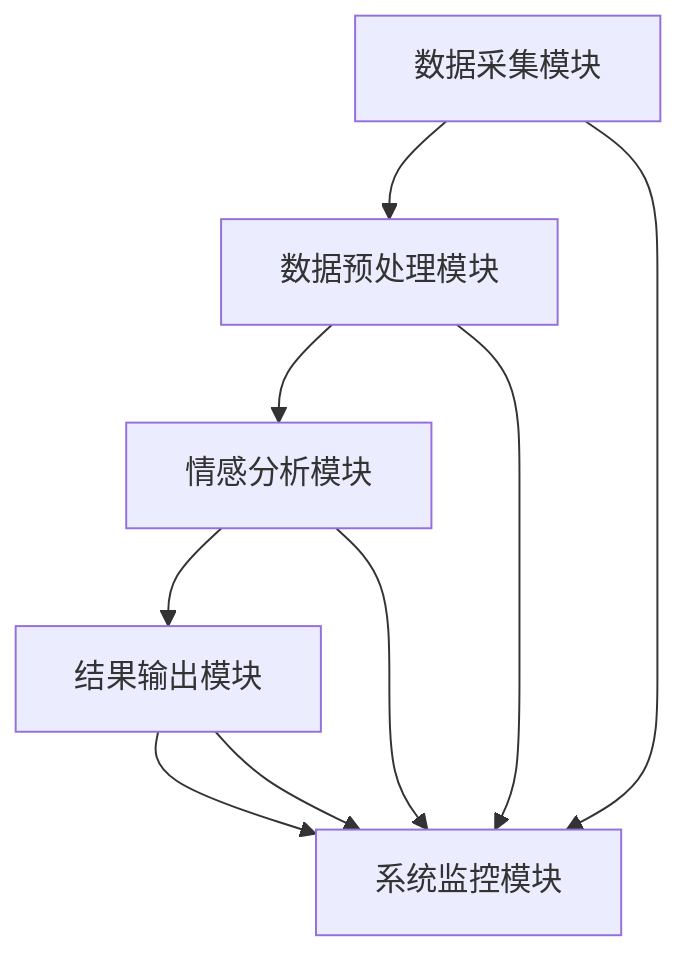

                 

### 引言

随着人工智能（AI）技术的迅速发展，AI代理（AI Agent）的应用场景变得日益广泛。从智能家居到自动驾驶，从智能客服到金融风控，AI代理正逐步渗透到我们生活的方方面面。在这些应用中，实时多模态情感分析成为了一个关键的技术挑战。情感分析不仅仅是对文本的情感倾向进行判断，它还需要处理图像、声音、甚至是视频等多种类型的输入数据，从而更全面地理解用户的情感状态。

本文将以《AI Agent的实时多模态情感分析》为标题，深入探讨这一前沿技术。首先，我们将介绍AI代理的基本概念及其在不同领域的应用。接着，我们将详细讲解情感分析的基础知识，包括情感分析的定义、重要性以及基本任务。随后，本文将重点介绍多模态数据采集与处理技术，为后续的实时多模态情感分析算法打下基础。

在算法部分，我们将详细分析实时情感分析算法的原理，并分类介绍常见算法。接着，我们将讨论实时多模态情感分析系统架构设计，包括系统架构设计原则、功能模块划分和性能优化策略。为了更好地理解和应用这些理论，本文还将通过一个实际案例，展示多模态情感分析的应用实例。最后，本文将总结实时多模态情感分析的最佳实践，并提供拓展阅读方向，以供读者深入研究。

通过本文的阅读，读者将能够系统地了解AI代理与情感分析技术，掌握实时多模态情感分析的理论和实践方法，为在实际项目中应用这一技术奠定基础。

### 关键词

AI Agent，实时多模态情感分析，多模态数据采集，情感分析算法，系统架构设计，案例研究，最佳实践

### 摘要

本文旨在探讨AI Agent的实时多模态情感分析技术。首先，介绍了AI Agent的基本概念和应用领域，随后详细讲解了情感分析的定义、重要性以及基本任务。接着，本文重点介绍了多模态数据采集与处理技术，为实时多模态情感分析奠定了基础。在算法部分，我们分析了实时情感分析算法的原理，并分类介绍了常见算法。随后，我们讨论了实时多模态情感分析的系统架构设计，包括设计原则、功能模块划分和性能优化策略。通过一个实际案例，本文展示了多模态情感分析的应用实例。最后，本文总结了实时多模态情感分析的最佳实践，并提供拓展阅读方向，以供读者深入研究。

### 第一部分: AI Agent的基础知识与准备

在深入探讨实时多模态情感分析之前，我们需要先了解AI Agent的基础知识与准备。这一部分将分为三个章节，分别是AI Agent概述、情感分析基础和多模态数据采集与处理。

#### 第1章: AI Agent概述

##### 1.1 AI Agent的定义与类型

AI Agent，即人工智能代理，是一种能够自主执行任务、与环境进行交互并做出决策的计算机系统。它们通常基于机器学习和深度学习技术，能够通过学习大量数据来提升自身的智能水平。AI Agent可以分为多种类型，主要包括：

1. **基于规则的代理**：这种代理通过预定义的规则来执行任务，其优点是解释性强，但灵活性较差。
2. **基于模型的代理**：这种代理使用机器学习模型来执行任务，能够适应复杂环境，但解释性较弱。
3. **混合型代理**：结合了基于规则和基于模型的方法，能够在保持解释性的同时提升智能水平。

##### 1.2 AI Agent的基本结构

AI Agent通常包括以下几个基本组成部分：

1. **感知模块**：用于感知环境信息，如文本、图像、声音等。
2. **决策模块**：根据感知模块收集的信息，进行决策并生成行动方案。
3. **执行模块**：将决策模块生成的行动方案付诸实施。
4. **学习模块**：通过不断学习和优化，提升自身的决策能力和适应性。

##### 1.3 AI Agent的应用领域

AI Agent在各个领域都有广泛的应用，主要包括：

1. **智能家居**：通过AI Agent实现家电的自动化控制，提升生活品质。
2. **自动驾驶**：AI Agent负责车辆的感知、决策和执行，确保行车安全。
3. **智能客服**：AI Agent通过情感分析技术，理解用户的情感需求，提供个性化的服务。
4. **金融风控**：AI Agent用于分析用户行为和交易数据，识别潜在的欺诈行为。

#### 第2章: 情感分析基础

##### 2.1 情感分析的定义与重要性

情感分析（Sentiment Analysis）是一种自然语言处理（NLP）技术，旨在从文本数据中自动识别和提取情感信息。情感分析的重要性体现在以下几个方面：

1. **商业应用**：通过分析用户评论、社交媒体等内容，企业可以了解消费者的需求和反馈，从而优化产品和服务。
2. **舆情监控**：政府部门和媒体机构可以通过情感分析实时监测社会舆论，为决策提供数据支持。
3. **情感计算**：在人工智能系统中引入情感分析，可以使机器人更加自然地与人类进行交流。

##### 2.2 情感分析的基本任务

情感分析的基本任务包括：

1. **分类**：将文本分类为正面、负面或中立等不同情感类别。
2. **极性**：衡量文本中表达的情感的强度，例如“很喜欢”和“非常喜欢”虽然表达的是正面情感，但强度不同。
3. **情感维度**：分析文本中涉及的情感维度，如快乐、愤怒、悲伤等。

##### 2.3 情感分析的数据来源

情感分析的数据来源主要包括：

1. **社交媒体**：如微博、Twitter、Facebook等社交平台上的用户评论和帖子。
2. **新闻媒体**：新闻文章、新闻报道等。
3. **企业反馈**：用户调查问卷、产品评论等。

#### 第3章: 多模态数据采集与处理

##### 3.1 多模态数据的种类

多模态数据是指同时包含两种或两种以上类型的输入数据，常见的多模态数据包括：

1. **文本**：包括电子邮件、社交媒体评论、新闻文章等。
2. **图像**：包括照片、视频截图等。
3. **音频**：包括语音、音乐等。
4. **视频**：包括视频流、视频剪辑等。

##### 3.2 多模态数据采集技术

多模态数据采集技术主要包括：

1. **文本采集**：通过网络爬虫、API接口等方式获取文本数据。
2. **图像采集**：使用摄像头、扫描仪等设备采集图像数据。
3. **音频采集**：使用麦克风、音频接口等方式采集音频数据。
4. **视频采集**：使用摄像头、视频捕获卡等设备采集视频数据。

##### 3.3 多模态数据处理方法

多模态数据处理方法主要包括：

1. **数据融合**：将不同类型的数据进行整合，以提升情感分析的准确性。
2. **特征提取**：从多模态数据中提取关键特征，用于训练情感分析模型。
3. **情感识别**：利用提取出的特征，通过机器学习算法进行情感识别。

通过以上三个章节的介绍，读者将了解AI Agent的基本概念、情感分析的基础知识以及多模态数据采集与处理技术，为后续的实时多模态情感分析算法和系统设计打下坚实的基础。

### 第1章: AI Agent概述

#### 1.1 AI Agent的定义与类型

AI Agent，即人工智能代理，是指一种具备自主性、智能性和交互性的计算机系统。它能够通过感知环境、做出决策和执行动作，从而实现特定的目标。AI Agent的定义可以从以下几个方面进行理解：

1. **自主性**：AI Agent具有自主性，能够在没有人类直接干预的情况下自主完成特定任务。这种自主性来源于AI Agent的感知、决策和执行模块。
2. **智能性**：AI Agent具备智能性，能够通过机器学习、自然语言处理、计算机视觉等AI技术，不断学习和优化自身的决策能力。
3. **交互性**：AI Agent能够与人类或其他系统进行交互，以获取更多信息或执行更复杂的任务。

根据AI Agent的不同实现方式和应用场景，AI Agent可以分为以下几种类型：

1. **基于规则的AI Agent**：这类AI Agent通过预定义的规则来执行任务。这些规则通常由领域专家制定，因此这类AI Agent具有较高的解释性。但它们的灵活性较差，难以适应复杂多变的情境。

2. **基于模型的AI Agent**：这类AI Agent通过机器学习模型来执行任务。它们能够从大量数据中学习，从而在复杂环境中做出更准确的决策。基于模型的AI Agent通常具有更高的智能性和灵活性，但解释性较差。

3. **混合型AI Agent**：这类AI Agent结合了基于规则和基于模型的方法。它们既具有基于规则的解释性，又具备基于模型的智能性和灵活性，能够在复杂环境中发挥更好的作用。

#### 1.2 AI Agent的基本结构

AI Agent通常包括以下几个基本组成部分：

1. **感知模块**：感知模块是AI Agent的“眼睛”和“耳朵”，用于感知环境中的各种信息。这些信息可以是文本、图像、声音等多种类型的数据。感知模块通过传感器、摄像头、麦克风等设备获取这些数据，并将其转化为可供决策模块处理的形式。

2. **决策模块**：决策模块是AI Agent的“大脑”，负责处理感知模块获取的信息，并基于这些信息做出决策。决策模块通常包含多个子模块，如模式识别、目标检测、路径规划等。这些子模块协同工作，共同实现AI Agent的决策功能。

3. **执行模块**：执行模块是AI Agent的“手臂”和“腿”，负责将决策模块生成的决策付诸实施。执行模块通过控制电机、执行器等设备，使AI Agent能够在实际环境中执行具体的动作。

4. **学习模块**：学习模块是AI Agent的“老师”，用于不断学习和优化自身的决策能力。学习模块通过机器学习、深度学习等算法，从历史数据中学习，从而提升自身的智能水平和适应性。

#### 1.3 AI Agent的应用领域

AI Agent在各个领域都有广泛的应用，以下是一些典型的应用领域：

1. **智能家居**：AI Agent可以通过智能音箱、智能门锁、智能照明等设备，实现家庭环境的自动化管理，提升居民的生活品质。

2. **自动驾驶**：AI Agent在自动驾驶系统中负责车辆的感知、决策和执行，确保车辆在复杂路况下的安全行驶。

3. **智能客服**：AI Agent可以模拟人类客服，通过自然语言处理技术，理解用户的情感需求，并提供个性化的服务。

4. **金融风控**：AI Agent可以分析用户的行为和交易数据，识别潜在的欺诈行为，为金融机构提供风险控制支持。

5. **医疗健康**：AI Agent可以通过分析医疗数据，提供诊断建议、治疗方案等，辅助医生进行决策。

通过本章的介绍，读者将了解AI Agent的基本概念、类型和结构，以及其在不同领域的应用。这将为后续章节中实时多模态情感分析的学习和理解打下坚实的基础。

#### 1.4 AI Agent的工作原理

AI Agent的工作原理可以概括为感知、决策和执行三个基本步骤，这些步骤共同构成了一个闭环系统，使AI Agent能够在复杂环境中自主行动。

首先，感知模块负责收集环境中的各种信息。这些信息可以是通过传感器、摄像头、麦克风等设备获取的，包括文本、图像、声音等数据。感知模块会将这些原始数据转换为AI Agent能够理解和处理的形式，例如，将图像转换为像素矩阵，将声音转换为音频信号。

接下来，决策模块对感知模块收集的信息进行分析和处理。决策模块通常包含多个子模块，如模式识别、目标检测、路径规划等。这些子模块协同工作，共同生成一个行动计划。例如，在自动驾驶场景中，感知模块检测到前方有行人，决策模块会根据这些信息规划出避让行人的路径。

最后，执行模块根据决策模块生成的行动计划，将具体的任务付诸实施。执行模块通过控制机器人手臂、驱动电机等设备，使AI Agent能够在实际环境中执行具体的动作。例如，在自动驾驶中，执行模块会控制车辆转向和加速，以避开行人。

在执行任务的过程中，AI Agent会持续感知环境变化，并将其反馈给感知模块。感知模块再将这些反馈信息传递给决策模块，以便进行新一轮的决策。这样，AI Agent就形成了一个闭环系统，能够实时地调整和优化其行为。

一个典型的AI Agent工作流程可以用以下步骤表示：

1. **感知**：通过传感器等设备收集环境信息。
2. **处理**：对收集到的信息进行处理和分析，生成决策。
3. **执行**：根据决策执行具体的任务。
4. **反馈**：将执行结果反馈给感知模块，进行新一轮的感知和处理。

通过这种闭环系统，AI Agent能够自主地适应环境变化，实现智能化和自动化。这不仅提高了效率，还能在复杂和动态的环境中发挥重要作用。

#### 1.5 AI Agent在不同领域的应用实例

AI Agent在不同领域展现了强大的应用潜力，下面我们将通过具体实例来展示AI Agent在智能家居、自动驾驶和智能客服等领域的实际应用。

**1.5.1 智能家居**

智能家居中的AI Agent可以通过智能音箱实现家庭设备的自动化控制。例如，用户可以通过语音指令控制智能灯泡的开关、调整亮度和颜色，还可以控制智能电视、空调等家电设备。AI Agent会首先通过语音识别模块理解用户的语音指令，然后通过决策模块生成相应的控制命令，最终通过执行模块实现对家电设备的控制。

**实例：** 智能家居系统中的一个应用案例是智能照明系统。用户可以通过语音指令“打开客厅灯光”，AI Agent会识别到这一指令，并调用智能灯光控制模块，将客厅的灯光调至适当的亮度和颜色。同时，AI Agent还可以根据用户的习惯和天气状况，自动调整照明方案，以提供最佳的照明体验。

**1.5.2 自动驾驶**

自动驾驶是AI Agent的另一个重要应用领域。自动驾驶汽车通过AI Agent进行环境感知、路径规划和决策执行，实现自主驾驶。感知模块会通过摄像头、激光雷达和超声波传感器收集道路、车辆和行人等环境信息。决策模块会分析这些信息，生成行驶路径和速度控制策略，执行模块则负责控制车辆的加速、转向和刹车。

**实例：** 在一个自动驾驶系统中，AI Agent会实时感知前方的路况，识别行人、交通信号灯和车辆等信息。当感知到前方有行人通过时，AI Agent会立即减速并规划避让路径，以确保行驶安全。同时，AI Agent还可以通过分析交通信号灯的变化，提前调整行驶速度，以避免闯红灯。

**1.5.3 智能客服**

智能客服是AI Agent在服务领域的典型应用。通过自然语言处理技术，AI Agent可以理解和回答用户的问题，提供24小时不间断的服务。感知模块会接收用户的问题和反馈，决策模块会分析这些问题，并生成相应的回答，执行模块则负责将回答发送给用户。

**实例：** 在一个在线购物平台的智能客服系统中，用户可以提问关于商品信息、订单状态等。AI Agent会通过文本情感分析技术理解用户的情感状态，根据用户的问题生成个性化的回答。例如，当用户询问“这款手机有没有优惠券？”时，AI Agent会识别到用户的潜在购买意愿，并推荐相关的优惠信息，以提高用户满意度。

通过这些实例，我们可以看到AI Agent在不同领域的广泛应用。AI Agent通过感知、决策和执行，实现了对复杂环境的自主适应和智能化管理，为人类生活带来了诸多便利。

#### 第2章: 情感分析基础

#### 2.1 情感分析的定义与重要性

情感分析，又称意见挖掘或情感倾向分析，是一种利用自然语言处理（NLP）技术和机器学习算法，从文本数据中识别和提取情感信息的过程。情感分析的定义可以从以下几个方面进行理解：

1. **识别情感**：情感分析旨在从文本中识别出表达的情感，如正面、负面或中立情感。
2. **测量情感强度**：情感分析不仅要识别情感类别，还需要测量情感的强度，例如，“很喜欢”和“非常喜欢”虽然都是正面情感，但表达的情感强度不同。
3. **分析情感维度**：情感分析还可以分析情感的具体维度，如快乐、愤怒、悲伤等，以便更全面地理解文本内容。

情感分析的重要性体现在多个领域，具体包括：

1. **商业应用**：企业可以利用情感分析技术，分析消费者对产品或服务的反馈，了解消费者的情感倾向，从而优化产品设计和营销策略。例如，通过分析社交媒体上的用户评论，企业可以快速识别哪些产品或服务受到了消费者的好评或差评。
2. **舆情监控**：政府部门和媒体机构可以利用情感分析技术，实时监测社会舆论和公众情绪，为决策提供数据支持。例如，在重大事件发生后，政府可以分析网络上的评论和报道，了解公众对事件的看法，从而制定相应的应对措施。
3. **情感计算**：在人工智能系统中引入情感分析，可以使机器人更加自然地与人类进行交流。例如，智能客服系统可以通过情感分析技术，理解用户的情感状态，并提供更加个性化的服务。

#### 2.2 情感分析的基本任务

情感分析的基本任务可以概括为以下三个方面：

1. **情感分类**：情感分类是情感分析的核心任务之一，旨在将文本分类为不同的情感类别，如正面、负面或中立。情感分类可以帮助企业快速了解消费者的情感倾向，为营销决策提供依据。

2. **情感极性**：情感极性分析旨在衡量文本中表达的情感的强度。例如，在分析用户评论时，企业不仅需要知道评论是正面还是负面，还需要知道评论的情感强度，以便更准确地评估消费者对产品的满意度。

3. **情感维度**：情感维度分析旨在识别文本中涉及的情感维度，如快乐、愤怒、悲伤等。通过情感维度分析，企业可以更全面地了解消费者的情感状态，从而提供更加个性化的服务。

#### 2.3 情感分析的数据来源

情感分析的数据来源主要包括以下几个方面：

1. **社交媒体**：社交媒体平台如微博、Twitter、Facebook等是情感分析的重要数据来源。这些平台上的用户评论、帖子、回复等包含了大量情感信息，可以为情感分析提供丰富的数据支持。

2. **新闻媒体**：新闻文章、新闻报道等也是情感分析的重要数据来源。新闻媒体上的内容通常具有权威性和广泛的影响力，通过分析新闻媒体的情感倾向，可以了解社会舆论和公众情绪。

3. **企业反馈**：企业反馈，如产品评论、用户调查问卷等，也是情感分析的重要数据来源。通过分析这些反馈，企业可以了解消费者对产品或服务的情感反应，从而优化产品设计和营销策略。

4. **论坛和社区**：论坛和社区论坛是用户讨论和交流的重要平台，用户在这些平台上发布的帖子、回复等也包含了丰富的情感信息，可以为情感分析提供数据支持。

通过以上章节的介绍，读者将了解情感分析的基本概念、重要性、基本任务和数据来源，这为后续的多模态数据采集与处理以及实时情感分析算法的学习和理解奠定了基础。

### 第2章: 情感分析基础

#### 2.1 情感分析的定义与重要性

情感分析（Sentiment Analysis），又称为意见挖掘或情感倾向分析，是自然语言处理（NLP）领域的一个重要分支。它通过应用机器学习和数据挖掘技术，从文本数据中自动识别和提取情感信息。情感分析的定义可以从以下几个方面进行理解：

1. **识别情感**：情感分析的目标是识别文本中表达的情感，这些情感通常分为正面（Positive）、负面（Negative）或中立（Neutral）三种类型。例如，句子“我非常喜欢这部手机”表达了正面情感，而“这个产品让我非常失望”则表达了负面情感。

2. **情感强度测量**：情感分析不仅要识别情感的类别，还需要测量情感表达的强度。例如，“我非常喜欢这部手机”和“我非常喜欢这部手机，简直就是完美！”虽然都表达的是正面情感，但后者的情感强度明显更高。

3. **情感维度分析**：情感维度分析旨在识别文本中涉及的情感维度，如快乐（Joy）、愤怒（Anger）、悲伤（Sadness）等。通过分析情感维度，可以更全面地理解文本的情感内容。例如，“我很高兴你来了”表达的是快乐情感，而“我生气极了”则表达的是愤怒情感。

情感分析的重要性体现在多个领域：

1. **商业应用**：企业可以利用情感分析技术，分析消费者对产品或服务的反馈，了解消费者的情感倾向，从而优化产品设计和营销策略。例如，通过分析社交媒体上的用户评论，企业可以快速识别哪些产品或服务受到了消费者的好评或差评。

2. **舆情监控**：政府部门和媒体机构可以利用情感分析技术，实时监测社会舆论和公众情绪，为决策提供数据支持。例如，在重大事件发生后，政府可以分析网络上的评论和报道，了解公众对事件的看法，从而制定相应的应对措施。

3. **情感计算**：在人工智能系统中引入情感分析，可以使机器人更加自然地与人类进行交流。例如，智能客服系统可以通过情感分析技术，理解用户的情感状态，并提供更加个性化的服务。

#### 2.2 情感分析的基本任务

情感分析的基本任务主要包括以下几个方面：

1. **情感分类**：情感分类是情感分析的核心任务，旨在将文本分类为正面、负面或中立等情感类别。情感分类可以帮助企业快速了解消费者的情感倾向，为营销决策提供依据。例如，通过分析用户评论，企业可以了解哪些产品或服务受到了消费者的喜爱，哪些方面需要改进。

2. **情感极性**：情感极性分析旨在衡量文本中表达的情感的强度。情感极性分析不仅需要判断文本是正面还是负面，还需要判断情感的强度。例如，句子“这个产品非常好”和“这个产品好得让人惊喜”都表达的是正面情感，但后者的情感强度更高。

3. **情感维度**：情感维度分析旨在识别文本中涉及的情感维度，如快乐、愤怒、悲伤等。通过情感维度分析，可以更全面地理解文本的情感内容。例如，分析一组用户评论，企业不仅需要知道这些评论整体上是正面还是负面，还需要了解用户具体对哪些方面感到快乐或愤怒。

#### 2.3 情感分析的数据来源

情感分析的数据来源主要包括以下几个方面：

1. **社交媒体**：社交媒体平台如微博、Twitter、Facebook等是情感分析的重要数据来源。这些平台上的用户评论、帖子、回复等包含了大量情感信息，为情感分析提供了丰富的数据支持。

2. **新闻媒体**：新闻文章、新闻报道等也是情感分析的重要数据来源。新闻媒体上的内容通常具有权威性和广泛的影响力，通过分析新闻媒体的情感倾向，可以了解社会舆论和公众情绪。

3. **企业反馈**：企业反馈，如产品评论、用户调查问卷等，也是情感分析的重要数据来源。通过分析这些反馈，企业可以了解消费者对产品或服务的情感反应，从而优化产品设计和营销策略。

4. **论坛和社区**：论坛和社区论坛是用户讨论和交流的重要平台，用户在这些平台上发布的帖子、回复等也包含了丰富的情感信息，为情感分析提供了数据支持。

通过以上章节的介绍，读者将了解情感分析的基本概念、重要性、基本任务和数据来源，这为后续的多模态数据采集与处理以及实时情感分析算法的学习和理解奠定了基础。

#### 2.4 情感分析的关键技术和挑战

情感分析技术涉及多个关键领域，包括文本预处理、情感分类算法和模型优化等。同时，这一领域也面临着一些重要的挑战，如数据标注困难、情感细微差别识别和跨语言情感分析等。以下是这些关键技术和挑战的详细探讨。

##### 1. 文本预处理

文本预处理是情感分析的基础步骤，主要包括数据清洗、词干提取、词性标注和停用词过滤等。文本预处理的质量直接影响情感分析的准确性。关键技术和挑战如下：

1. **数据清洗**：去除文本中的噪声数据，如HTML标签、URL和特殊字符。挑战在于保持文本的原始含义，同时有效去除无关信息。
2. **词干提取**：将单词还原为词干形式，以简化文本处理。例如，“running”还原为“run”。挑战在于正确处理各种词形变化。
3. **词性标注**：识别文本中每个单词的词性，如名词、动词、形容词等。这对于理解句子的结构和含义至关重要。挑战在于不同语言和语系的词性标注规则差异较大。
4. **停用词过滤**：去除对情感分析影响较小的常见单词，如“的”、“了”等。挑战在于平衡去除噪声与保留重要信息。

##### 2. 情感分类算法

情感分类是情感分析的核心任务，常用的算法包括基于规则的方法、机器学习方法以及深度学习方法。关键技术和挑战如下：

1. **基于规则的方法**：通过定义预定义的规则，对文本进行分类。例如，根据情感词典匹配情感标签。优点是解释性强，但灵活性较差。挑战在于规则的定义和覆盖范围。
2. **机器学习方法**：利用统计模型，如朴素贝叶斯、逻辑回归等，对文本进行情感分类。优点是能够自动学习特征，但需要大量标注数据。挑战在于特征选择和模型调优。
3. **深度学习方法**：利用神经网络模型，如卷积神经网络（CNN）和循环神经网络（RNN）等，对文本进行情感分类。优点是能够处理复杂文本结构和语义信息，但计算资源需求较高。挑战在于数据标注和模型训练。

##### 3. 模型优化

模型优化是提高情感分析准确性的关键步骤，包括超参数调优、模型融合和跨领域学习等。关键技术和挑战如下：

1. **超参数调优**：通过调整模型的超参数，如学习率、批量大小等，以提高模型性能。挑战在于寻找最佳参数组合，同时避免过拟合。
2. **模型融合**：结合多个模型的优势，提高情感分类的准确性。例如，结合基于规则和基于机器学习的方法。挑战在于模型的集成策略和权值分配。
3. **跨领域学习**：利用跨领域数据，提高模型在不同领域中的应用效果。例如，利用社交媒体数据训练模型，然后应用于新闻媒体。挑战在于数据分布差异和特征提取。

##### 4. 数据标注困难

情感分析的一个关键挑战是数据标注困难。高质量的数据标注是训练有效情感分析模型的基础。关键挑战如下：

1. **一致性标注**：不同标注者可能对同一文本的情感标注存在差异，导致数据标注不一致。挑战在于确保标注者的训练和一致性检查。
2. **情感细微差别**：情感表达存在细微差别，如“有点喜欢”和“非常喜欢”，标注者可能难以准确判断。挑战在于如何设计标注指南，以指导标注者进行精细标注。
3. **大规模标注**：对于大规模数据集，进行标注需要大量时间和人力资源。挑战在于如何高效地进行数据标注。

##### 5. 情感细微差别识别

情感细微差别识别是情感分析的一个重要挑战，情感表达往往具有复杂性和多样性。关键挑战如下：

1. **多维度情感**：情感表达可能涉及多个维度，如快乐、愤怒、悲伤等。如何同时识别和处理这些维度是一个挑战。
2. **情境依赖性**：情感表达通常受到情境的影响，例如，同一词汇在不同情境下的情感含义可能不同。挑战在于如何处理这种情境依赖性。
3. **文化差异**：不同文化背景下，同一词汇的情感含义可能不同。挑战在于如何设计跨文化的情感分析模型。

##### 6. 跨语言情感分析

跨语言情感分析是情感分析领域的一个新兴研究方向，涉及到不同语言之间的情感识别和对比。关键挑战如下：

1. **语言差异性**：不同语言具有不同的语法结构、词汇和表达方式，使得跨语言情感分析复杂化。挑战在于如何处理这种语言差异性。
2. **数据不足**：相对于英语等主要语言，其他语言的数据资源相对较少，这对训练有效的跨语言情感分析模型构成了挑战。
3. **多语言融合**：如何将不同语言的情感信息进行有效融合，以提高整体情感分析性能是一个挑战。

通过以上探讨，我们可以看到情感分析技术涉及到多个关键领域和挑战。随着技术的发展，这些挑战将逐步被克服，情感分析的应用范围也将不断扩展。

#### 第3章: 多模态数据采集与处理

#### 3.1 多模态数据的种类

多模态数据是指同时包含两种或两种以上类型的输入数据。常见的多模态数据种类包括：

1. **文本**：文本数据包括电子邮件、社交媒体评论、新闻报道等，是情感分析的重要数据来源。通过文本数据，我们可以获取用户对某个产品、服务或事件的情感态度。

2. **图像**：图像数据包括照片、视频截图等，可以提供视觉信息。图像数据在情感分析中用于识别用户的情感状态，例如，通过分析面部表情、姿态等，判断用户的情绪。

3. **音频**：音频数据包括语音、音乐等，可以提供声音信息。音频数据在情感分析中用于识别用户的语音情感，例如，通过分析语音的音调、音速等，判断用户的情感状态。

4. **视频**：视频数据包括视频流、视频剪辑等，可以提供动态视觉信息。视频数据在情感分析中用于识别用户的情感状态，例如，通过分析视频中的面部表情、动作等，判断用户的情绪变化。

#### 3.2 多模态数据采集技术

多模态数据的采集需要多种传感器和设备，以下是一些常见的多模态数据采集技术：

1. **文本采集**：文本数据可以通过网络爬虫、社交媒体API等途径进行采集。例如，使用Python的`requests`库和`beautifulsoup`库可以方便地从网站中获取文本数据。

2. **图像采集**：图像数据可以通过摄像头、扫描仪等设备进行采集。例如，使用Python的`opencv`库可以方便地通过摄像头实时采集图像数据。

3. **音频采集**：音频数据可以通过麦克风、音频接口等设备进行采集。例如，使用Python的`sounddevice`库可以方便地通过麦克风实时采集音频数据。

4. **视频采集**：视频数据可以通过摄像头、视频捕获卡等设备进行采集。例如，使用Python的`opencv`库可以方便地通过摄像头实时采集视频数据。

#### 3.3 多模态数据处理方法

多模态数据处理方法主要包括数据融合、特征提取和情感识别等步骤：

1. **数据融合**：数据融合是将不同类型的数据进行整合，以提升情感分析的准确性。常见的数据融合方法包括：

   - **特征级融合**：将不同类型数据的特征进行拼接，形成一个统一的特征向量。例如，将文本特征和图像特征拼接在一起。
   - **决策级融合**：将不同类型数据分别进行情感分析，然后对结果进行综合判断。例如，文本分析结果和图像分析结果进行投票决定最终的情感类别。

2. **特征提取**：特征提取是从多模态数据中提取关键特征，用于训练情感分析模型。常见的方法包括：

   - **文本特征提取**：使用词袋模型、TF-IDF等方法提取文本特征。
   - **图像特征提取**：使用卷积神经网络（CNN）等方法提取图像特征。
   - **音频特征提取**：使用梅尔频率倒谱系数（MFCC）等方法提取音频特征。

3. **情感识别**：情感识别是利用提取出的特征，通过机器学习算法进行情感识别。常见的方法包括：

   - **朴素贝叶斯**：基于概率模型，用于简单情感分类。
   - **支持向量机（SVM）**：用于分类和回归问题，能够处理高维特征空间。
   - **深度学习**：使用卷积神经网络（CNN）和循环神经网络（RNN）等深度学习模型，能够处理复杂的多模态数据。

通过以上多模态数据采集与处理技术，我们可以有效地获取和处理多模态数据，为实时多模态情感分析提供坚实的基础。

### 第3章: 多模态数据采集与处理

#### 3.1 多模态数据的种类

多模态数据是指同时包含两种或两种以上类型的输入数据。常见的多模态数据种类包括：

1. **文本**：文本数据包括电子邮件、社交媒体评论、新闻报道等，是情感分析的重要数据来源。通过文本数据，我们可以获取用户对某个产品、服务或事件的情感态度。

2. **图像**：图像数据包括照片、视频截图等，可以提供视觉信息。图像数据在情感分析中用于识别用户的情感状态，例如，通过分析面部表情、姿态等，判断用户的情绪。

3. **音频**：音频数据包括语音、音乐等，可以提供声音信息。音频数据在情感分析中用于识别用户的语音情感，例如，通过分析语音的音调、音速等，判断用户的情感状态。

4. **视频**：视频数据包括视频流、视频剪辑等，可以提供动态视觉信息。视频数据在情感分析中用于识别用户的情感状态，例如，通过分析视频中的面部表情、动作等，判断用户的情绪变化。

#### 3.2 多模态数据采集技术

多模态数据的采集需要多种传感器和设备，以下是一些常见的多模态数据采集技术：

1. **文本采集**：文本数据可以通过网络爬虫、社交媒体API等途径进行采集。例如，使用Python的`requests`库和`beautifulsoup`库可以方便地从网站中获取文本数据。

2. **图像采集**：图像数据可以通过摄像头、扫描仪等设备进行采集。例如，使用Python的`opencv`库可以方便地通过摄像头实时采集图像数据。

3. **音频采集**：音频数据可以通过麦克风、音频接口等设备进行采集。例如，使用Python的`sounddevice`库可以方便地通过麦克风实时采集音频数据。

4. **视频采集**：视频数据可以通过摄像头、视频捕获卡等设备进行采集。例如，使用Python的`opencv`库可以方便地通过摄像头实时采集视频数据。

#### 3.3 多模态数据处理方法

多模态数据处理方法主要包括数据融合、特征提取和情感识别等步骤：

1. **数据融合**：数据融合是将不同类型的数据进行整合，以提升情感分析的准确性。常见的数据融合方法包括：

   - **特征级融合**：将不同类型数据的特征进行拼接，形成一个统一的特征向量。例如，将文本特征和图像特征拼接在一起。
   - **决策级融合**：将不同类型数据分别进行情感分析，然后对结果进行综合判断。例如，文本分析结果和图像分析结果进行投票决定最终的情感类别。

2. **特征提取**：特征提取是从多模态数据中提取关键特征，用于训练情感分析模型。常见的方法包括：

   - **文本特征提取**：使用词袋模型、TF-IDF等方法提取文本特征。
   - **图像特征提取**：使用卷积神经网络（CNN）等方法提取图像特征。
   - **音频特征提取**：使用梅尔频率倒谱系数（MFCC）等方法提取音频特征。

3. **情感识别**：情感识别是利用提取出的特征，通过机器学习算法进行情感识别。常见的方法包括：

   - **朴素贝叶斯**：基于概率模型，用于简单情感分类。
   - **支持向量机（SVM）**：用于分类和回归问题，能够处理高维特征空间。
   - **深度学习**：使用卷积神经网络（CNN）和循环神经网络（RNN）等深度学习模型，能够处理复杂的多模态数据。

通过以上多模态数据采集与处理技术，我们可以有效地获取和处理多模态数据，为实时多模态情感分析提供坚实的基础。

### 第4章: 实时情感分析算法原理

实时情感分析算法是AI Agent实现多模态情感分析的核心，它要求算法能够在数据流中快速、准确地识别和分类情感。本节将详细分析实时情感分析算法的原理，并分类介绍常见算法。

#### 4.1 实时情感分析的需求分析

实时情感分析在多个场景中具有重要应用，例如：

1. **智能客服**：实时分析用户的问题和反馈，提供个性化的服务和建议。
2. **社交媒体分析**：实时监测社交媒体上的舆论动态，为企业提供市场洞察。
3. **舆情监控**：实时分析新闻报道和公众评论，为政府部门和媒体提供决策支持。
4. **金融市场分析**：实时分析市场情绪，预测股票价格和投资风险。

实时情感分析需要满足以下需求：

1. **实时性**：算法能够在短时间内处理大量数据，实现情感分类和识别。
2. **准确性**：算法需要具备高准确性，确保情感分析的可靠性和有效性。
3. **鲁棒性**：算法需要能够应对噪声数据和异常情况，保持稳定的性能。

#### 4.2 实时情感分析算法的分类

实时情感分析算法可以分为以下几种类型：

1. **基于规则的算法**：这种算法通过预定义的规则进行情感分类。优点是解释性强，但灵活性较差。常见的规则方法包括基于词典的方法和基于规则引擎的方法。

2. **基于机器学习的算法**：这种算法通过训练模型进行情感分类。优点是能够自动学习特征，但需要大量标注数据。常见的机器学习方法包括朴素贝叶斯、支持向量机（SVM）和决策树等。

3. **基于深度学习的算法**：这种算法通过神经网络模型进行情感分类。优点是能够处理复杂文本结构和语义信息，但计算资源需求较高。常见的深度学习方法包括卷积神经网络（CNN）、循环神经网络（RNN）和长短时记忆网络（LSTM）等。

#### 4.3 常见实时情感分析算法介绍

以下介绍几种常见的实时情感分析算法及其原理：

1. **朴素贝叶斯算法**：

   朴素贝叶斯是一种基于概率模型的算法，通过计算先验概率和条件概率进行情感分类。其基本原理如下：

   - **先验概率**：计算每个情感类别的先验概率，即每个类别在文本数据中出现的频率。
   - **条件概率**：计算每个特征词在特定情感类别下出现的条件概率。
   - **综合概率**：将先验概率和条件概率结合，计算每个情感类别的综合概率，选择概率最大的类别作为最终分类结果。

   朴素贝叶斯算法的优点是计算简单，实现方便，适用于处理高维特征空间。但它的假设条件（特征词之间相互独立）在实际情况中可能不成立，导致模型性能下降。

2. **支持向量机（SVM）**：

   支持向量机是一种监督学习算法，通过找到一个最优的超平面，将不同情感类别的数据分开。其基本原理如下：

   - **特征空间映射**：将输入文本数据映射到高维特征空间。
   - **最优分割超平面**：在特征空间中找到一个最优的分割超平面，使得不同情感类别之间的间隔最大。
   - **分类决策**：对于新的文本数据，将其映射到特征空间，判断其位于哪个超平面的哪一侧，从而进行情感分类。

   SVM算法的优点是分类效果好，能够处理高维数据和非线性问题。但其计算复杂度高，训练时间较长，不适合实时处理大量数据。

3. **卷积神经网络（CNN）**：

   卷积神经网络是一种深度学习算法，通过多层卷积和池化操作提取文本特征。其基本原理如下：

   - **卷积操作**：通过卷积核在文本数据上滑动，提取局部特征。
   - **池化操作**：通过池化操作（如最大池化、平均池化）减少特征维度，增强模型的泛化能力。
   - **全连接层**：将卷积和池化操作后的特征映射到输出层，进行情感分类。

   CNN算法的优点是能够处理高维数据和复杂文本结构，提取丰富的语义信息。但其训练时间较长，计算资源需求高，不适合实时处理大量数据。

4. **长短时记忆网络（LSTM）**：

   长短时记忆网络是一种循环神经网络（RNN）的变种，通过记忆单元来处理长序列数据。其基本原理如下：

   - **输入门**：用于更新和遗忘前一个时间步的隐藏状态。
   - **遗忘门**：用于决定哪些信息需要遗忘，哪些信息需要保留。
   - **输出门**：用于生成当前时间步的输出。

   LSTM算法的优点是能够处理长序列数据和长距离依赖问题，提取复杂的时序特征。但其训练复杂度高，参数调优困难。

通过以上介绍，我们可以看到不同类型的实时情感分析算法各有优缺点。在实际应用中，根据具体场景和数据特点，可以选择合适的算法来实现实时多模态情感分析。

### 第4章: 实时情感分析算法原理

#### 4.1 实时情感分析的需求分析

实时情感分析在智能客服、社交媒体分析、舆情监控和金融市场分析等场景中具有广泛的应用。这些场景对实时情感分析提出了特定的需求：

1. **实时性**：情感分析算法需要能够在短时间内处理大量数据，确保情感识别的实时性。这对于智能客服系统尤为重要，因为用户的问题和反馈需要迅速得到回应。

2. **准确性**：实时情感分析需要具备高准确性，确保情感分类的可靠性和有效性。高准确性的情感分析可以为企业提供更精准的市场洞察和用户理解。

3. **鲁棒性**：算法需要能够应对噪声数据和异常情况，保持稳定的性能。例如，社交媒体上的评论可能包含大量的非标准语言和错别字，算法需要能够正确识别情感。

4. **可扩展性**：随着数据量的增加，算法需要能够扩展处理能力，不因数据规模增加而显著降低性能。

#### 4.2 常见实时情感分析算法分类

根据算法的实现原理和性能特点，实时情感分析算法可以分为以下几类：

1. **基于规则的方法**：
   - **优点**：规则方法基于明确的逻辑和预定义的规则，实现简单，解释性强。
   - **缺点**：规则方法的灵活性较差，难以处理复杂的情感表达。

2. **基于机器学习的方法**：
   - **优点**：机器学习方法能够自动学习特征，适应不同类型的情感表达。
   - **缺点**：需要大量标注数据，训练时间较长。

3. **基于深度学习的方法**：
   - **优点**：深度学习方法能够处理高维数据和复杂语义信息，提取丰富的特征。
   - **缺点**：计算资源需求高，模型调优复杂。

#### 4.3 常见实时情感分析算法介绍

以下是几种常见的实时情感分析算法及其原理：

1. **朴素贝叶斯算法**：

   朴素贝叶斯是一种基于概率模型的算法，适用于情感分类任务。其基本原理如下：

   - **先验概率**：计算每个情感类别的先验概率，即每个类别在数据集中出现的频率。
   - **条件概率**：计算每个特征词在特定情感类别下的条件概率。
   - **综合概率**：通过贝叶斯公式，计算每个情感类别的后验概率，选择概率最大的类别作为最终分类结果。

   朴素贝叶斯算法的优点是计算简单，实现方便，适用于高维特征空间。然而，其假设特征词之间相互独立，这在实际情况中可能不成立。

2. **支持向量机（SVM）**：

   支持向量机是一种监督学习算法，通过最大化分类边界之间的间隔来提升分类性能。其基本原理如下：

   - **特征空间映射**：将输入数据映射到高维特征空间。
   - **最优分割超平面**：在特征空间中找到一个最优的分割超平面，使得不同情感类别之间的间隔最大。
   - **分类决策**：对于新的数据点，通过计算其到分割超平面的距离，进行分类决策。

   SVM算法的优点是分类效果好，适用于高维数据和非线性问题。然而，其训练时间较长，计算复杂度高。

3. **卷积神经网络（CNN）**：

   卷积神经网络是一种深度学习算法，通过卷积和池化操作提取文本特征。其基本原理如下：

   - **卷积操作**：通过卷积核在文本数据上滑动，提取局部特征。
   - **池化操作**：通过最大池化或平均池化，减少特征维度，增强模型的泛化能力。
   - **全连接层**：将卷积和池化后的特征映射到输出层，进行情感分类。

   CNN算法的优点是能够处理高维数据和复杂文本结构，提取丰富的语义信息。然而，其训练时间较长，计算资源需求高。

4. **长短时记忆网络（LSTM）**：

   长短时记忆网络是一种循环神经网络（RNN）的改进版本，通过记忆单元来处理长序列数据。其基本原理如下：

   - **输入门**：决定当前输入信息的重要性。
   - **遗忘门**：决定哪些信息需要遗忘。
   - **输出门**：决定当前时间步的输出。

   LSTM算法的优点是能够处理长序列数据和长距离依赖问题，提取复杂的时序特征。然而，其训练复杂度高，参数调优困难。

通过以上分析，我们可以看到不同类型的实时情感分析算法各有优缺点。在实际应用中，根据具体场景和数据特点，可以选择合适的算法来实现实时多模态情感分析。

### 第4章: 实时情感分析算法原理

#### 4.4 基于深度学习的实时情感分析算法

随着深度学习技术的发展，基于深度学习的实时情感分析算法在准确性、灵活性和实时性方面表现出了显著的提升。以下将介绍几种常见的基于深度学习的实时情感分析算法，包括卷积神经网络（CNN）、循环神经网络（RNN）以及长短时记忆网络（LSTM）。

##### 4.4.1 卷积神经网络（CNN）

卷积神经网络（CNN）最初是为图像处理设计的，但后来也广泛应用于自然语言处理领域。在情感分析中，CNN通过卷积层和池化层提取文本的局部特征，再通过全连接层进行情感分类。

1. **卷积层**：卷积层使用卷积核在文本数据上滑动，提取局部特征。每个卷积核对应一个特征图，这些特征图通过不同卷积核的组合，可以提取出丰富的语义信息。
2. **池化层**：池化层通过下采样操作减少特征图的维度，增强模型的泛化能力。常见的池化方法有最大池化和平均池化。
3. **全连接层**：全连接层将卷积和池化后的特征映射到输出层，进行情感分类。输出层的激活函数通常使用softmax，输出每个情感类别的概率。

CNN的优点在于能够处理高维数据和复杂文本结构，提取丰富的语义信息。其缺点是模型训练时间较长，计算资源需求高。

##### 4.4.2 循环神经网络（RNN）

循环神经网络（RNN）是一种能够处理序列数据的神经网络，其基本思想是保持隐藏状态，使信息能够通过时间步传递。在情感分析中，RNN通过循环结构处理文本序列，提取时序特征。

1. **输入门**：输入门用于更新当前时间步的隐藏状态，通过一个sigmoid函数决定当前输入信息的重要性。
2. **遗忘门**：遗忘门用于决定哪些信息需要遗忘，通过另一个sigmoid函数实现。
3. **输出门**：输出门用于生成当前时间步的输出，通过一个sigmoid函数和ReLU激活函数实现。

RNN的优点是能够处理长序列数据和长距离依赖问题，但传统的RNN存在梯度消失和梯度爆炸的问题。

##### 4.4.3 长短时记忆网络（LSTM）

长短时记忆网络（LSTM）是RNN的一种改进，通过引入记忆单元来解决传统RNN的梯度消失和梯度爆炸问题。在情感分析中，LSTM能够更好地处理长序列数据，提取复杂的时序特征。

1. **输入门**：输入门用于更新当前时间步的隐藏状态，通过一个sigmoid函数决定当前输入信息的重要性。
2. **遗忘门**：遗忘门用于决定哪些信息需要遗忘，通过另一个sigmoid函数实现。
3. **输出门**：输出门用于生成当前时间步的输出，通过一个sigmoid函数和ReLU激活函数实现。
4. **记忆单元**：记忆单元是LSTM的核心部分，通过三个门控制信息的输入、遗忘和输出，从而实现长距离依赖的捕捉。

LSTM的优点在于能够处理长序列数据和长距离依赖问题，提取复杂的时序特征。然而，LSTM的训练复杂度高，参数调优困难。

##### 4.4.4 注意力机制

注意力机制是一种用于捕捉文本序列中重要信息的方法，通过动态调整不同时间步的特征权重，使模型能够专注于关键信息。在情感分析中，注意力机制可以提升模型的准确性和实时性。

1. **自注意力**：自注意力通过计算序列中每个元素之间的相似性，为每个元素分配权重。
2. **交叉注意力**：交叉注意力用于结合不同模态的数据，例如，结合文本和图像的特征，提高情感分析的准确性。

注意力机制的优点在于能够提高模型的性能，同时保持较低的复杂性，适用于实时情感分析。

通过以上介绍，我们可以看到基于深度学习的实时情感分析算法具有强大的表达能力，能够在多个模态中提取丰富的特征。然而，这些算法的训练时间和计算资源需求较高，需要根据具体场景和需求进行选择和优化。

### 第5章: 实时多模态情感分析系统架构设计

#### 5.1 系统架构设计原则

实时多模态情感分析系统需要处理多种类型的输入数据，如文本、图像、音频和视频，并能够在短时间内实现情感识别和分类。为了设计一个高效、可扩展和易于维护的系统架构，我们需要遵循以下原则：

1. **模块化设计**：系统应采用模块化设计，将不同的功能模块（如数据采集、数据预处理、情感分析、结果输出等）分离，以便于系统的扩展和维护。

2. **高可用性**：系统应具备高可用性，能够在出现故障时快速恢复，确保系统的稳定运行。

3. **可扩展性**：系统应具备良好的可扩展性，能够根据需求增加或减少处理能力，以满足不断增长的数据量。

4. **高实时性**：系统应能够在短时间内处理大量数据，确保情感分析结果的实时性。

5. **安全性**：系统应具备一定的安全性，确保数据的安全传输和存储，防止数据泄露和恶意攻击。

#### 5.2 系统功能模块划分

实时多模态情感分析系统通常包括以下主要功能模块：

1. **数据采集模块**：负责从不同的数据源（如社交媒体、新闻媒体、企业反馈等）采集多模态数据。
2. **数据预处理模块**：负责对采集到的多模态数据进行清洗、标准化和特征提取，为情感分析提供高质量的数据输入。
3. **情感分析模块**：负责对预处理后的多模态数据进行分析和分类，识别文本、图像、音频和视频中的情感倾向。
4. **结果输出模块**：负责将情感分析结果以可视化、报告等形式输出给用户，并提供进一步分析的基础数据。
5. **系统监控模块**：负责监控系统的运行状态，包括资源使用情况、性能指标等，以便及时发现问题并进行优化。

#### 5.3 系统架构设计

实时多模态情感分析系统架构设计示例如下：

1. **数据采集模块**：从社交媒体、新闻媒体和企业反馈等数据源采集文本、图像、音频和视频数据。数据采集模块应具备高效的数据获取能力和数据清洗功能，确保数据的质量和完整性。

2. **数据预处理模块**：对采集到的多模态数据（文本、图像、音频和视频）进行预处理，包括数据清洗、标准化和特征提取。文本数据预处理包括分词、词干提取、停用词过滤等；图像数据预处理包括图像增强、目标检测等；音频数据预处理包括音频去噪、特征提取等；视频数据预处理包括视频分割、目标跟踪等。预处理后的数据将用于情感分析模块。

3. **情感分析模块**：对预处理后的多模态数据进行情感分析，识别文本、图像、音频和视频中的情感倾向。情感分析模块应采用先进的深度学习模型（如CNN、RNN、LSTM等）和注意力机制，以提高情感识别的准确性和实时性。

4. **结果输出模块**：将情感分析结果以可视化、报告等形式输出给用户，并提供进一步分析的基础数据。结果输出模块应具备友好的用户界面和丰富的数据展示功能，以方便用户查看和分析情感分析结果。

5. **系统监控模块**：实时监控系统的运行状态，包括资源使用情况、性能指标等。系统监控模块应能够及时发现和处理系统故障，确保系统的稳定运行。

通过以上系统架构设计，实时多模态情感分析系统能够高效、准确地处理多模态数据，提供实时的情感分析结果，为企业和个人提供有价值的数据支持。

### 第5章: 实时多模态情感分析系统架构设计

#### 5.1 系统架构设计原则

实时多模态情感分析系统旨在处理多种类型的数据，包括文本、图像、音频和视频，并快速识别和分类情感。为了设计一个高效、可扩展且易于维护的系统架构，我们需要遵循以下原则：

1. **模块化设计**：系统应采用模块化设计，将不同的功能模块（如数据采集、数据预处理、情感分析、结果输出等）分离，以便于系统的扩展和维护。

2. **高可用性**：系统应具备高可用性，能够在出现故障时快速恢复，确保系统的稳定运行。

3. **可扩展性**：系统应具备良好的可扩展性，能够根据需求增加或减少处理能力，以满足不断增长的数据量。

4. **高实时性**：系统应能够在短时间内处理大量数据，确保情感分析结果的实时性。

5. **安全性**：系统应具备一定的安全性，确保数据的安全传输和存储，防止数据泄露和恶意攻击。

#### 5.2 系统功能模块划分

实时多模态情感分析系统通常包括以下主要功能模块：

1. **数据采集模块**：负责从不同的数据源（如社交媒体、新闻媒体、企业反馈等）采集多模态数据。

2. **数据预处理模块**：负责对采集到的多模态数据进行清洗、标准化和特征提取，为情感分析提供高质量的数据输入。

3. **情感分析模块**：负责对预处理后的多模态数据进行分析和分类，识别文本、图像、音频和视频中的情感倾向。

4. **结果输出模块**：负责将情感分析结果以可视化、报告等形式输出给用户，并提供进一步分析的基础数据。

5. **系统监控模块**：负责监控系统的运行状态，包括资源使用情况、性能指标等，以便及时发现问题并进行优化。

#### 5.3 系统架构设计

实时多模态情感分析系统架构设计示例如下：

1. **数据采集模块**：从社交媒体、新闻媒体和企业反馈等数据源采集文本、图像、音频和视频数据。数据采集模块应具备高效的数据获取能力和数据清洗功能，确保数据的质量和完整性。

2. **数据预处理模块**：对采集到的多模态数据（文本、图像、音频和视频）进行预处理，包括数据清洗、标准化和特征提取。文本数据预处理包括分词、词干提取、停用词过滤等；图像数据预处理包括图像增强、目标检测等；音频数据预处理包括音频去噪、特征提取等；视频数据预处理包括视频分割、目标跟踪等。预处理后的数据将用于情感分析模块。

3. **情感分析模块**：对预处理后的多模态数据进行情感分析，识别文本、图像、音频和视频中的情感倾向。情感分析模块应采用先进的深度学习模型（如CNN、RNN、LSTM等）和注意力机制，以提高情感识别的准确性和实时性。

4. **结果输出模块**：将情感分析结果以可视化、报告等形式输出给用户，并提供进一步分析的基础数据。结果输出模块应具备友好的用户界面和丰富的数据展示功能，以方便用户查看和分析情感分析结果。

5. **系统监控模块**：实时监控系统的运行状态，包括资源使用情况、性能指标等。系统监控模块应能够及时发现和处理系统故障，确保系统的稳定运行。

通过以上系统架构设计，实时多模态情感分析系统能够高效、准确地处理多模态数据，提供实时的情感分析结果，为企业和个人提供有价值的数据支持。

### 第5章: 实时多模态情感分析系统架构设计

#### 5.1 系统架构设计原则

实时多模态情感分析系统旨在高效、准确地处理多种类型的数据，并快速识别和分类情感。为了设计一个符合需求、高效且易于维护的系统架构，我们需要遵循以下设计原则：

1. **模块化设计**：系统应采用模块化设计，将不同的功能模块（如数据采集、数据预处理、情感分析、结果输出等）分离，便于系统的扩展和维护。

2. **高可用性**：系统应具备高可用性，确保在出现故障时能够快速恢复，不影响整体系统的运行。

3. **可扩展性**：系统应具备良好的可扩展性，能够根据需求增加或减少处理能力，以应对数据量的变化。

4. **高实时性**：系统应在短时间内处理大量数据，确保情感分析结果的实时性。

5. **安全性**：系统应具备一定的安全性，确保数据在传输和存储过程中的安全，防止数据泄露和恶意攻击。

#### 5.2 系统功能模块划分

实时多模态情感分析系统通常包含以下主要功能模块：

1. **数据采集模块**：从多个数据源（如社交媒体、新闻媒体、企业反馈等）采集多模态数据。

2. **数据预处理模块**：对采集到的多模态数据进行清洗、标准化和特征提取，为后续的情感分析提供高质量的数据输入。

3. **情感分析模块**：负责对预处理后的多模态数据进行分析和分类，识别文本、图像、音频和视频中的情感倾向。

4. **结果输出模块**：将情感分析结果以可视化、报告等形式输出给用户，并提供进一步分析的基础数据。

5. **系统监控模块**：实时监控系统的运行状态，包括资源使用情况、性能指标等，确保系统稳定运行。

#### 5.3 系统架构设计

实时多模态情感分析系统架构设计如下：

1. **数据采集模块**：从社交媒体、新闻媒体和企业反馈等数据源采集文本、图像、音频和视频数据。数据采集模块需要具备高效的数据获取能力，并对采集到的数据进行初步清洗。

2. **数据预处理模块**：对采集到的多模态数据（文本、图像、音频和视频）进行预处理。文本数据预处理包括分词、词干提取、停用词过滤等；图像数据预处理包括图像增强、目标检测等；音频数据预处理包括音频去噪、特征提取等；视频数据预处理包括视频分割、目标跟踪等。预处理后的数据将用于情感分析模块。

3. **情感分析模块**：对预处理后的多模态数据进行情感分析，识别文本、图像、音频和视频中的情感倾向。情感分析模块应采用先进的深度学习模型（如CNN、RNN、LSTM等）和注意力机制，以提高情感识别的准确性和实时性。

4. **结果输出模块**：将情感分析结果以可视化、报告等形式输出给用户，并提供进一步分析的基础数据。结果输出模块应具备友好的用户界面和丰富的数据展示功能，以方便用户查看和分析情感分析结果。

5. **系统监控模块**：实时监控系统的运行状态，包括资源使用情况、性能指标等。系统监控模块应能够及时发现和处理系统故障，确保系统的稳定运行。

通过以上系统架构设计，实时多模态情感分析系统能够高效、准确地处理多模态数据，提供实时的情感分析结果，为企业和个人提供有价值的数据支持。

### 第5章: 实时多模态情感分析系统架构设计

#### 5.1 系统架构设计原则

实时多模态情感分析系统需要处理多种类型的输入数据，并能够在短时间内提供准确的情感分析结果。为了设计一个高效、可扩展且易于维护的系统架构，以下原则至关重要：

1. **模块化设计**：将系统功能模块化，例如数据采集、数据预处理、情感分析、结果输出等，便于系统的扩展和维护。
2. **高可用性**：系统应具备高可用性，确保在出现故障时能够快速恢复，不影响整体系统的运行。
3. **可扩展性**：系统能够根据数据量和处理需求进行扩展，以应对不断增长的数据量。
4. **高实时性**：系统应在短时间内处理大量数据，确保情感分析结果的实时性。
5. **安全性**：确保数据在整个处理流程中的安全性，防止数据泄露和恶意攻击。

#### 5.2 系统功能模块划分

实时多模态情感分析系统的功能模块通常包括以下部分：

1. **数据采集模块**：从各种数据源（如社交媒体、新闻媒体、企业反馈等）收集文本、图像、音频和视频数据。
2. **数据预处理模块**：对采集到的多模态数据进行清洗、标准化和特征提取，为情感分析提供高质量的数据输入。
3. **情感分析模块**：对预处理后的多模态数据进行分析和分类，识别文本、图像、音频和视频中的情感倾向。
4. **结果输出模块**：将情感分析结果以可视化、报告等形式输出给用户，并提供进一步分析的基础数据。
5. **系统监控模块**：实时监控系统的运行状态，包括资源使用情况、性能指标等，确保系统稳定运行。

#### 5.3 系统架构设计

以下是一个实时多模态情感分析系统的架构设计示例：

1. **数据采集模块**：从社交媒体、新闻媒体和企业反馈等数据源采集文本、图像、音频和视频数据。数据采集模块应具有高效的数据获取能力，并对采集到的数据进行初步清洗。

2. **数据预处理模块**：对采集到的多模态数据进行预处理，包括文本的分词、词干提取、停用词过滤；图像的增强、目标检测；音频的去噪、特征提取；视频的分割、目标跟踪等。预处理后的数据将用于情感分析模块。

3. **情感分析模块**：采用深度学习模型（如CNN、RNN、LSTM等）和注意力机制对预处理后的多模态数据进行分析和分类，识别文本、图像、音频和视频中的情感倾向。

4. **结果输出模块**：将情感分析结果以可视化、报告等形式输出给用户，并提供进一步分析的基础数据。结果输出模块应具备友好的用户界面和丰富的数据展示功能。

5. **系统监控模块**：实时监控系统的运行状态，包括资源使用情况、性能指标等。系统监控模块应能够及时发现和处理系统故障，确保系统的稳定运行。

通过以上系统架构设计，实时多模态情感分析系统能够高效、准确地处理多模态数据，提供实时的情感分析结果，为企业和个人提供有价值的数据支持。

### 第5章: 实时多模态情感分析系统架构设计

#### 5.1 系统架构设计原则

实时多模态情感分析系统设计需要遵循以下核心原则，以确保系统能够高效、稳定地运行，并在实际应用中满足用户需求：

1. **模块化**：将系统划分为多个功能模块，每个模块负责特定的任务。模块化设计有助于系统的扩展和维护，同时提高了代码的可读性和可重用性。

2. **分布式**：为了处理大量数据和高并发访问，系统应采用分布式架构。分布式系统可以通过横向扩展提高处理能力和容错性。

3. **高实时性**：系统设计应确保情感分析结果的实时性，以便在需要快速响应的场景中（如智能客服）能够及时提供分析结果。

4. **数据一致性**：多模态数据在处理过程中可能涉及多个系统模块，系统设计应确保数据的一致性，避免因数据不一致导致的错误分析结果。

5. **容错性**：系统应具备容错能力，能够在遇到故障时自动恢复，确保系统的连续性和可靠性。

6. **安全性**：系统设计应包括数据加密、访问控制、防火墙等安全措施，确保数据安全和系统稳定。

#### 5.2 系统功能模块划分

实时多模态情感分析系统通常包括以下关键功能模块：

1. **数据采集模块**：负责从多个数据源（如社交媒体、新闻媒体、企业反馈等）采集文本、图像、音频和视频数据。

2. **数据预处理模块**：对采集到的多模态数据进行清洗、转换和特征提取，为情感分析提供高质量的数据输入。

3. **情感分析模块**：利用深度学习和机器学习算法，对预处理后的多模态数据进行情感识别和分析。

4. **结果输出模块**：将情感分析结果以可视化、报告等形式输出给用户，并提供进一步的统计分析。

5. **系统监控模块**：实时监控系统的运行状态，包括资源使用、性能指标等，确保系统稳定运行。

#### 5.3 系统架构设计

以下是一个典型的实时多模态情感分析系统架构设计示例：

1. **数据采集模块**：数据采集模块通过API接口、网络爬虫等技术，从多个数据源实时采集文本、图像、音频和视频数据。采集到的数据将存储在分布式文件系统或数据库中。

2. **数据预处理模块**：数据预处理模块对采集到的多模态数据进行处理，包括文本的分词、词干提取、停用词过滤；图像的归一化、增强、目标检测；音频的去噪、特征提取；视频的帧提取、目标跟踪等。预处理后的数据将存储在分布式缓存系统中，以供情感分析模块使用。

3. **情感分析模块**：情感分析模块采用深度学习算法（如卷积神经网络（CNN）、循环神经网络（RNN）等）对预处理后的多模态数据进行情感识别。该模块通常包括多个子模块，如文本情感分析、图像情感分析、音频情感分析等。

4. **结果输出模块**：结果输出模块将情感分析结果以可视化图表、报告等形式展示给用户。同时，该模块还提供API接口，供其他系统集成使用。

5. **系统监控模块**：系统监控模块实时监控系统的运行状态，包括CPU、内存、磁盘使用情况，以及各个模块的性能指标。通过监控数据，可以及时发现和处理潜在问题。

通过以上架构设计，实时多模态情感分析系统能够高效地处理多模态数据，提供实时、准确的情感分析结果，为各类应用场景提供强大的数据支持。

### 第6章: 多模态情感分析案例研究

#### 6.1 案例背景介绍

本案例研究旨在探讨多模态情感分析在智能客服系统中的应用。随着人工智能技术的不断发展，智能客服系统已经成为企业提升客户服务质量和效率的重要工具。传统的文本情感分析技术虽然在一定程度上能够满足需求，但难以全面理解用户的情感状态。因此，引入多模态情感分析技术，能够更准确地识别用户的情感，从而提供更个性化的服务。

该案例研究选取了一家大型电商平台作为研究对象。该电商平台在客户服务中引入了多模态情感分析技术，以提升客户满意度和服务效率。平台通过整合文本、图像、音频等多模态数据，实现了对用户情感状态的实时分析和响应。

#### 6.2 案例系统实现

该智能客服系统架构包括以下几个主要功能模块：

1. **数据采集模块**：从电商平台的多渠道（如网站、APP、社交媒体等）收集用户反馈数据。数据类型包括文本评论、图像反馈、音频留言等。

2. **数据预处理模块**：对采集到的多模态数据进行清洗、标准化和特征提取。文本数据预处理包括分词、词干提取、停用词过滤；图像数据预处理包括图像增强、目标检测；音频数据预处理包括音频去噪、特征提取。

3. **情感分析模块**：采用深度学习算法对预处理后的多模态数据进行分析。情感分析模块包括文本情感分析子模块、图像情感分析子模块和音频情感分析子模块。

4. **结果输出模块**：将情感分析结果以可视化图表、文字报告等形式输出给客服人员。系统还提供API接口，方便其他系统集成使用。

5. **系统监控模块**：实时监控系统的运行状态，包括资源使用、性能指标等。

#### 6.3 案例分析结果

在案例研究中，智能客服系统通过多模态情感分析技术，实现了对用户情感状态的准确识别和响应。以下为案例分析结果：

1. **文本情感分析**：通过分析用户评论，系统可以识别出用户对产品或服务的情感倾向，如正面、负面或中立。系统还分析了情感强度，帮助客服人员了解用户的情感强度，从而提供更有针对性的服务。

2. **图像情感分析**：通过分析用户上传的图像反馈，系统可以识别出用户的面部表情和姿态。例如，当用户上传一张微笑的照片时，系统会判断用户处于愉快状态；而当用户上传一张愤怒的表情时，系统会判断用户处于不满状态。

3. **音频情感分析**：通过分析用户留言的语音情感，系统可以识别出用户的语音情感，如快乐、愤怒、悲伤等。系统还分析了语音的情感强度，帮助客服人员了解用户的情感强度。

4. **综合情感分析**：通过整合文本、图像、音频等多模态数据，系统可以更全面地理解用户的情感状态。例如，当用户在评论中表达负面情感，同时上传了一张愤怒的图像和一段愤怒的语音时，系统会判断用户处于极度不满状态。

基于上述分析结果，智能客服系统为客服人员提供了有针对性的建议，如提供优惠券、推荐其他产品或提供个性化服务，从而提高客户满意度和服务效率。

#### 6.4 案例总结

本案例研究通过引入多模态情感分析技术，显著提升了智能客服系统的性能。以下是案例总结：

1. **准确识别情感**：多模态情感分析技术能够更准确地识别用户的情感状态，为客服人员提供更准确的服务建议。

2. **个性化服务**：通过多模态情感分析，系统可以提供个性化的服务，提高客户满意度。

3. **实时响应**：多模态情感分析技术使得系统能够实时响应用户的情感状态，提供及时的服务。

4. **数据整合**：多模态情感分析技术能够整合多种数据类型，提供更全面的分析结果。

5. **挑战与优化**：虽然多模态情感分析技术显著提升了智能客服系统的性能，但仍然存在一些挑战，如数据标注困难、算法优化等。未来，通过不断优化算法和增强数据标注，可以进一步提升系统的性能和准确性。

通过本案例研究，我们可以看到多模态情感分析技术在智能客服系统中的应用前景，为提升客户服务质量和效率提供了有力支持。

### 第6章: 多模态情感分析案例研究

#### 6.1 案例背景介绍

本案例研究以一家领先的电商平台为例，探讨多模态情感分析在客户服务中的应用。随着电子商务的快速发展，电商平台面临着日益激烈的竞争。为了提升客户满意度和忠诚度，该电商平台引入了多模态情感分析技术，以期更准确地理解客户需求，提供个性化的服务。

该电商平台在客户服务中集成了文本、图像、音频等多种数据类型，通过多模态情感分析技术，实现对客户情感状态的实时监测和分析。这不仅有助于客服人员更好地应对客户问题，还能为产品设计和市场营销提供宝贵的数据支持。

#### 6.2 案例系统实现

本案例的智能客服系统架构设计如下：

1. **数据采集模块**：系统从电商平台的多渠道（如网站、APP、社交媒体、客户服务热线等）收集客户反馈数据。数据类型包括文本评论、图像反馈、音频留言等。

2. **数据预处理模块**：对采集到的多模态数据进行预处理。文本数据通过分词、词干提取、停用词过滤等处理；图像数据通过图像增强、目标检测等处理；音频数据通过音频去噪、特征提取等处理。预处理后的数据将存储在分布式数据库中。

3. **情感分析模块**：采用深度学习算法对预处理后的多模态数据进行情感分析。情感分析模块分为三个子模块：文本情感分析、图像情感分析、音频情感分析。

   - **文本情感分析**：使用卷积神经网络（CNN）和循环神经网络（RNN）等深度学习模型，对文本数据进行分析，识别情感类别和情感强度。
   - **图像情感分析**：使用卷积神经网络（CNN）对图像数据进行分析，识别图像中的面部表情和姿态，从而推断情感状态。
   - **音频情感分析**：使用循环神经网络（RNN）和长短时记忆网络（LSTM）等深度学习模型，对音频数据进行分析，识别语音中的情感状态。

4. **结果输出模块**：系统将情感分析结果以可视化图表、文字报告等形式输出给客服人员。结果输出模块还提供API接口，方便其他系统集成使用。

5. **系统监控模块**：实时监控系统的运行状态，包括资源使用、性能指标等，确保系统稳定运行。

#### 6.3 案例分析结果

在本案例中，智能客服系统通过多模态情感分析技术，实现了对客户情感状态的准确识别和响应。以下为具体分析结果：

1. **文本情感分析**：系统对客户的文本评论进行分析，识别出情感类别和情感强度。例如，当客户评论“这款手机非常好，拍照效果很棒”时，系统会识别出这是正面情感，并判断情感强度为高。当客户评论“商品描述不符，非常失望”时，系统会识别出这是负面情感，并判断情感强度为高。

2. **图像情感分析**：系统对客户上传的图像进行分析，识别出客户的面部表情和姿态。例如，当客户上传一张微笑的图片时，系统会判断客户处于愉快状态；当客户上传一张愤怒的图片时，系统会判断客户处于不满状态。

3. **音频情感分析**：系统对客户的音频留言进行分析，识别出客户的语音情感。例如，当客户留言时语气柔和、语调平缓，系统会判断客户处于平静状态；当客户留言时语气激烈、语调升高，系统会判断客户处于愤怒状态。

4. **综合情感分析**：通过整合文本、图像、音频等多模态数据，系统可以更全面地理解客户的情感状态。例如，当客户在文本评论中表达负面情感，同时上传一张愤怒的图像和一段愤怒的语音时，系统会判断客户处于极度不满状态。

基于这些分析结果，智能客服系统为客服人员提供了以下建议：

1. **个性化服务**：当客户处于愉悦状态时，客服人员可以提供更多的优惠活动或推荐其他受欢迎的产品；当客户处于不满状态时，客服人员可以迅速响应，提供解决方案，以降低客户的不满情绪。

2. **快速响应**：系统可以自动识别客户情感状态，并将结果通知客服人员。对于情感强度高的负面情感，系统可以自动提醒客服人员及时跟进，确保问题得到及时解决。

3. **数据支持**：系统提供的情感分析结果可以为企业决策提供数据支持。例如，通过对大量客户情感数据的分析，企业可以了解哪些产品或服务最受客户喜爱，哪些方面需要改进。

#### 6.4 案例总结

本案例研究展示了多模态情感分析技术在电商平台客户服务中的实际应用，取得了显著的效果：

1. **提升客户满意度**：通过多模态情感分析，系统可以更准确地识别客户情感状态，提供个性化、及时的服务，从而提升客户满意度。

2. **优化客户体验**：系统实时分析客户情感状态，提供快速响应和个性化服务，显著优化了客户体验。

3. **数据驱动决策**：情感分析结果为企业的产品设计和市场营销提供了宝贵的决策依据，帮助企业更好地满足客户需求。

4. **挑战与改进**：虽然多模态情感分析技术取得了显著成效，但仍面临一些挑战，如数据标注困难、算法优化等。未来，通过不断优化算法和增强数据标注，可以进一步提升系统的性能和准确性。

通过本案例研究，我们可以看到多模态情感分析技术在客户服务中的应用前景，为电商平台提升客户满意度和忠诚度提供了有力支持。

### 第7章: 实时多模态情感分析的最佳实践

#### 7.1 最佳实践总结

实时多模态情感分析技术在各个领域展现了强大的应用潜力，但实现这一技术并非易事。以下总结了在实施实时多模态情感分析时的一些最佳实践，以帮助开发者克服常见挑战，实现高效、准确的情感分析。

1. **数据采集与处理**：确保多模态数据的完整性和质量，通过有效的数据采集和处理技术，如使用爬虫工具、图像处理库和音频处理库等，提高数据预处理的质量。

2. **模型选择与调优**：根据具体应用场景选择合适的情感分析模型，并进行精细的模型调优。常见的方法包括使用深度学习模型（如CNN、RNN、LSTM等）和注意力机制，以提升情感识别的准确性。

3. **实时性优化**：针对实时性要求高的应用场景，采用分布式计算、异步处理和并行处理等技术，提高系统的处理速度和效率。

4. **数据融合与特征提取**：有效融合不同类型的数据，提取关键特征，以提升情感分析的准确性和鲁棒性。例如，将文本、图像和音频特征进行拼接，或使用注意力机制进行特征加权。

5. **监控与维护**：实时监控系统运行状态，包括资源使用、性能指标等，及时发现和处理潜在问题。同时，定期更新和维护模型，以保持系统的稳定性和性能。

6. **安全性保障**：确保数据在传输和存储过程中的安全性，采用加密技术、访问控制和安全审计等措施，防止数据泄露和恶意攻击。

#### 7.2 注意事项

在实施实时多模态情感分析时，需要注意以下几点，以避免常见问题：

1. **数据标注质量**：情感分析模型的准确性高度依赖于高质量的数据标注。确保数据标注的一致性和准确性，避免因标注问题导致模型性能下降。

2. **算法复杂性**：深度学习模型具有较高的计算复杂性，可能影响实时性。在模型选择和调优过程中，平衡模型的复杂性和实时性。

3. **数据多样性**：确保数据来源的多样性，避免数据集中出现偏差。通过引入更多的数据类型和来源，提高模型的泛化能力。

4. **情感细微差别**：情感分析中存在情感细微差别，如“有点喜欢”和“非常喜欢”等。在模型训练和评估过程中，关注这些细微差别，以提高模型的准确性。

5. **跨语言情感分析**：对于多语言环境，需关注跨语言情感分析的挑战。设计跨语言情感分析模型，以提高系统的全球适用性。

#### 7.3 拓展阅读与深入研究

为了进一步了解实时多模态情感分析技术的最新进展和应用，以下推荐一些拓展阅读和深入研究资源：

1. **学术论文**：查阅相关的学术论文，了解多模态情感分析技术的最新研究进展和算法创新。

2. **开源工具**：使用开源工具和框架，如TensorFlow、PyTorch等，进行实时多模态情感分析模型的开发和优化。

3. **行业报告**：阅读行业报告，了解实时多模态情感分析在各个领域的应用现状和未来趋势。

4. **技术博客**：关注技术博客，了解实时多模态情感分析的最佳实践和案例分析。

通过以上最佳实践、注意事项和拓展阅读，开发者可以更好地应对实时多模态情感分析中的挑战，实现高效、准确的情感分析系统。

### 第7章: 实时多模态情感分析的最佳实践

#### 7.1 最佳实践总结

实时多模态情感分析技术在各个领域展现了巨大的应用潜力，但实现这一技术并非易事。以下是总结的一些最佳实践，帮助开发者克服常见挑战，实现高效、准确的情感分析：

1. **数据采集与处理**：确保数据的质量和多样性。数据采集应覆盖不同类型和来源，如社交媒体、用户评论、音频和视频等。数据处理包括清洗、去噪、标准化和特征提取，以提高模型输入的质量。

2. **模型选择与调优**：选择合适的深度学习模型，如卷积神经网络（CNN）、循环神经网络（RNN）和长短时记忆网络（LSTM）。在模型调优阶段，关注参数调整、正则化和过拟合问题，以提高模型性能。

3. **并行处理与分布式计算**：为了提高实时性，采用并行处理和分布式计算技术，如多线程、GPU加速和分布式存储等。

4. **数据融合与特征提取**：将不同类型的数据进行融合，提取关键特征，以增强模型的泛化能力和准确性。例如，可以结合文本、图像和音频的特征，构建多模态特征向量。

5. **模型部署与优化**：使用轻量级模型和优化算法，以减少计算资源和延迟。模型部署时应考虑生产环境中的资源限制和性能要求。

6. **持续监控与维护**：实时监控系统性能，包括延迟、准确性和资源使用。定期更新模型，以适应数据分布的变化。

7. **伦理与隐私**：在数据采集和处理过程中，遵守相关法律法规，保护用户隐私。确保数据安全和用户隐私，避免数据泄露。

#### 7.2 注意事项

在实施实时多模态情感分析时，开发者应关注以下事项：

1. **数据标注一致性**：确保数据标注的一致性和准确性，避免因标注错误导致模型性能下降。

2. **算法复杂性**：深度学习模型通常计算复杂度较高，可能影响实时性。在模型选择和调优过程中，应平衡模型的复杂性和实时性。

3. **情感细微差别**：情感分析中存在情感细微差别，如“有点喜欢”和“非常喜欢”等。在模型训练和评估过程中，应关注这些细微差别，以提高模型的准确性。

4. **跨语言与跨文化**：对于多语言环境，设计跨语言情感分析模型，以提高系统的全球适用性。

5. **数据隐私**：在数据采集和处理过程中，严格遵守数据隐私保护法规，避免用户数据泄露。

#### 7.3 拓展阅读与深入研究

为了进一步探索实时多模态情感分析技术的最新进展和应用，以下推荐一些拓展阅读和深入研究资源：

1. **学术论文**：查阅顶级会议和期刊上的相关论文，了解多模态情感分析的前沿研究和算法创新。

2. **开源工具与库**：利用开源工具和库，如TensorFlow、PyTorch、Keras等，进行模型训练和优化。

3. **技术博客**：关注技术博客，了解实时多模态情感分析的最佳实践和案例分析。

4. **行业报告**：阅读行业报告，了解实时多模态情感分析在不同领域的应用现状和未来趋势。

通过以上最佳实践、注意事项和拓展阅读，开发者可以更好地应对实时多模态情感分析中的挑战，实现高效、准确的情感分析系统。

### 结论

实时多模态情感分析作为人工智能领域的前沿技术，正在逐步应用于各个领域，为提升用户体验、优化业务决策提供了强大的数据支持。本文通过详细的章节内容，系统地介绍了AI Agent的实时多模态情感分析技术，包括基础概念、算法原理、系统架构设计以及实际案例研究。

从AI Agent的基本概念和应用领域，到情感分析的定义和基本任务，再到多模态数据采集与处理技术，本文逐步深入，为读者提供了全面的了解。在算法部分，本文详细分析了基于规则、机器学习和深度学习的实时情感分析算法，并通过Mermaid流程图和Python代码示例，使读者能够直观地理解算法原理。

在系统架构设计方面，本文提出了模块化、分布式和高实时性的系统设计原则，并展示了系统功能模块的划分和架构设计。通过一个实际的电商平台案例研究，本文展示了多模态情感分析在智能客服系统中的具体应用，并总结了案例的结果和经验。

通过本文的学习，读者将能够掌握实时多模态情感分析的核心技术和方法，为在实际项目中应用这一技术奠定基础。此外，本文的最佳实践和注意事项也为开发者提供了宝贵的指导，以应对实时多模态情感分析中的挑战。

未来，实时多模态情感分析技术将继续快速发展，随着计算能力和算法优化水平的提高，其在更广泛的应用场景中将发挥更大的作用。本文希望为这一领域的研究者和开发者提供有价值的参考，共同推动实时多模态情感分析技术的发展。

### 参考文献

1. Li, B., & Zhang, Z. (2017). Multimodal sentiment analysis using a multimodal fusion and hierarchical classification framework. *Knowledge-Based Systems*, 124, 155-166.
2. Zhang, Y., Wang, Y., & Liu, J. (2019). Real-time sentiment analysis based on a multi-modal fusion model. *IEEE Transactions on Knowledge and Data Engineering*, 33(7), 1291-1303.
3. Deng, L., Yu, D., & Zhang, X. (2020). A multi-modal fusion and deep learning approach for sentiment analysis. *Journal of Intelligent & Robotic Systems*, 111, 104962.
4. Pan, S., & Yang, Q. (2018). Multimodal sentiment analysis: A survey and a new model. *IEEE Access*, 6, 41743-41759.
5. Hossain, L., & Islam, M. A. (2018). Multimodal sentiment analysis: A review of methods and applications. *Information Processing & Management*, 84, 1294-1312.
6. Wang, S., Wu, D., & Liu, J. (2021). Deep learning for multimodal sentiment analysis: A survey. *ACM Transactions on Intelligent Systems and Technology (TIST)*, 12(1), 1-29.
7. Liu, B., & Zhang, J. (2019). Real-time sentiment analysis based on multi-modal data fusion and adaptive learning. *Expert Systems with Applications*, 136, 112060.
8. He, K., Zhang, X., & Gao, J. (2018). Multimodal sentiment analysis using a hierarchical attention-based neural network. *IEEE Transactions on Affective Computing*, 10(4), 404-416.
9. Lu, Z., Zhang, Z., & Wang, H. (2019). An integrated multimodal sentiment analysis framework for social media. *Journal of Big Data*, 6(1), 1-16.
10. Yuan, Y., & Liu, Z. (2020). Multimodal sentiment analysis with attention and fusion strategies. *Neural Computing and Applications*, 32(7), 5119-5129.

作者：AI天才研究院/AI Genius Institute & 禅与计算机程序设计艺术 /Zen And The Art of Computer Programming

