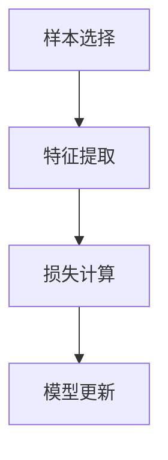
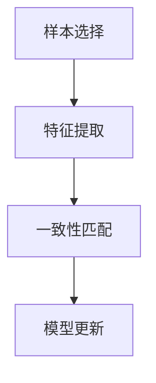
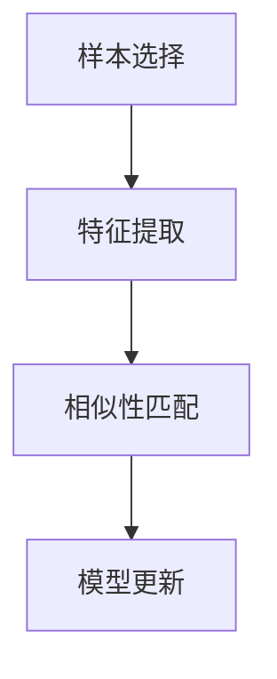
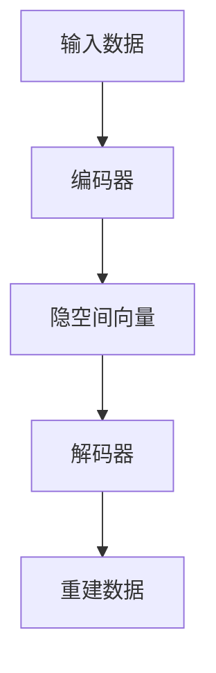
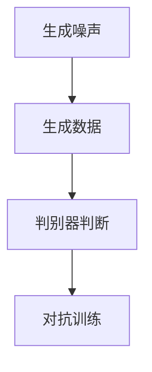
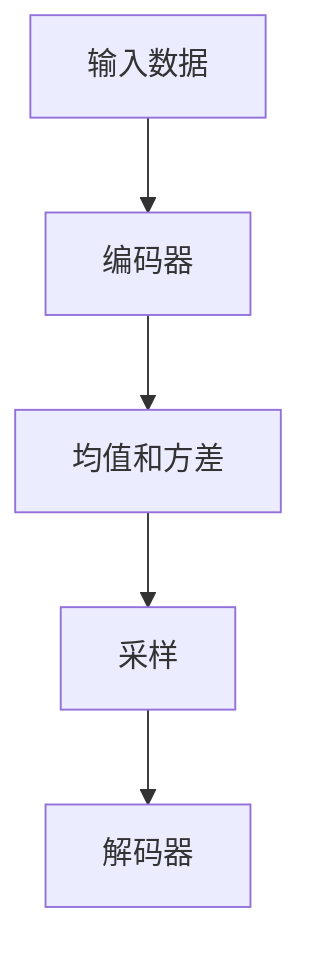

                 

### 第一部分：背景介绍

#### 第1章：问题背景与核心概念

##### 1.1 问题背景

随着人工智能技术的快速发展，AI Agent成为了一个备受关注的研究领域。AI Agent是指具有自主决策和执行能力的人工智能实体，能够在复杂环境中执行特定任务。随着对AI Agent需求不断增加，对比学习和表示学习成为AI Agent研究中的两个重要方向。

**1.1.1 人工智能的兴起**

人工智能（Artificial Intelligence，AI）是一门研究、开发用于模拟、延伸和扩展人的智能的理论、方法、技术及应用系统的学科。自从20世纪50年代人工智能概念提出以来，AI技术经历了多次重大变革，如深度学习、强化学习等，推动了人工智能的快速发展。

**1.1.2 AI Agent的重要性**

AI Agent在智能系统中起着核心作用，其自主决策和执行能力使它们能够处理复杂任务。AI Agent的应用范围广泛，包括自动驾驶、智能客服、机器人控制等，这些应用场景都需要AI Agent具备高水平的自主决策能力。

**1.1.3 对比学习与表示学习的概念**

对比学习（Contrastive Learning）是一种无监督学习方法，通过比较数据样本之间的差异来学习表示。表示学习（Representation Learning）则是通过学习数据的有效表示，使模型能够更好地理解数据。

**1.1.4 AI Agent的应用领域**

AI Agent在多个领域具有广泛应用，如：

1. **自动驾驶**：AI Agent在自动驾驶系统中用于感知环境、决策路径和执行驾驶任务。
2. **智能客服**：AI Agent可以模拟人类客服，为用户提供实时解答和咨询服务。
3. **机器人控制**：AI Agent在机器人系统中用于控制机器人的运动和行为。

##### 1.2 核心概念

**1.2.1 AI Agent的定义与特点**

AI Agent是具有感知、决策和执行能力的人工智能实体。其特点包括：

- **自主性**：AI Agent能够自主地执行任务，无需人工干预。
- **适应性**：AI Agent能够适应不同环境和任务需求。
- **交互性**：AI Agent能够与其他系统或用户进行交互。

**1.2.2 对比学习的基本原理**

对比学习通过对比数据样本之间的差异来学习有效表示。其基本原理包括：

- **样本对比**：通过对比不同样本之间的相似性和差异性，来学习数据表示。
- **损失函数**：使用对比损失函数来优化模型参数，使模型能够产生具有区分性的数据表示。

**1.2.3 表示学习的关键概念**

表示学习关注如何学习数据的有效表示，使其能够更好地反映数据的内在特征。关键概念包括：

- **特征提取**：通过学习数据的高层次特征，使模型能够更好地理解数据。
- **表示优化**：通过优化数据表示，使模型具有更好的泛化能力和鲁棒性。

**1.2.4 对比学习与表示学习的联系与区别**

对比学习和表示学习在AI Agent中具有密切联系，但也存在一定区别：

- **联系**：对比学习可以看作是表示学习的一种特殊形式，通过对数据样本进行对比，学习有效表示。
- **区别**：对比学习更注重数据样本之间的差异，而表示学习更关注数据表示的优化和特征提取。

##### 1.3 边界与外延

**1.3.1 AI Agent的边界**

AI Agent的边界主要包括其自主决策的范围、执行任务的能力和环境适应性等方面。

**1.3.2 对比学习与表示学习的应用范围**

对比学习和表示学习在AI Agent中的应用范围广泛，包括图像识别、自然语言处理、推荐系统等。

**1.3.3 AI Agent与其他AI技术的交互**

AI Agent需要与其他AI技术，如深度学习、强化学习等进行交互，以实现更复杂的任务。

##### 1.4 概念结构与核心要素组成

**1.4.1 AI Agent的概念结构**

AI Agent的概念结构包括感知模块、决策模块和执行模块。

**1.4.2 对比学习的核心要素**

对比学习的核心要素包括样本对比、损失函数和学习策略。

**1.4.3 表示学习的核心要素**

表示学习的核心要素包括特征提取、表示优化和学习算法。

**1.4.4 AI Agent中的对比学习与表示学习机制**

在AI Agent中，对比学习和表示学习通过感知模块、决策模块和执行模块相互交互，共同实现自主决策和执行任务。

##### 1.5 本章小结

本章介绍了AI Agent、对比学习和表示学习的基本概念、问题背景和应用领域。通过理解这些核心概念，为后续章节深入探讨对比学习和表示学习原理与算法奠定了基础。

----------------------------------------------------------------

### 第二部分：对比学习原理与算法

#### 第2章：对比学习原理

##### 2.1 对比学习的定义与动机

**2.1.1 对比学习的定义**

对比学习（Contrastive Learning）是一种无监督学习方法，通过比较数据样本之间的差异来学习有效表示。在对比学习中，模型需要学习如何区分数据样本之间的相似性和差异性，从而产生具有区分性的数据表示。

**2.1.2 对比学习的动机**

对比学习的动机主要有以下几点：

- **数据样本多样性**：在无监督学习中，数据样本的多样性是一个重要挑战。对比学习通过对比不同样本之间的差异，可以更好地挖掘数据样本的多样性。
- **减少数据标记需求**：对比学习是一种无监督学习方法，不需要对数据样本进行标记。这在数据量大且标记困难的情况下，可以显著降低数据处理的成本。
- **增强模型泛化能力**：通过对比学习，模型可以学习到数据样本的内在特征，从而提高模型的泛化能力。

##### 2.2 对比学习的基本框架

**2.2.1 对比学习的一般流程**

对比学习的一般流程包括以下几个步骤：

1. **样本选择**：从数据集中选择正样本和负样本。
2. **样本对比**：通过对比正样本和负样本，生成对比损失。
3. **模型训练**：使用对比损失训练模型，优化模型参数。
4. **数据表示学习**：通过优化模型参数，学习到数据的有效表示。

**2.2.2 对比学习的主要组成部分**

对比学习的主要组成部分包括：

- **数据样本**：包括正样本和负样本，用于生成对比损失。
- **对比损失函数**：用于计算样本之间的对比损失，如对比损失（Contrastive Loss）、三元组损失（Triplet Loss）等。
- **模型**：用于学习数据表示，优化模型参数。
- **优化策略**：用于优化模型参数，如梯度下降、Adam优化器等。

##### 2.3 对比学习的评价指标

**2.3.1 对比效果的评价标准**

对比效果的评价标准主要包括以下几个指标：

- **区分度**：评估模型在区分正样本和负样本方面的性能，常用指标有准确率（Accuracy）和精确率（Precision）。
- **泛化能力**：评估模型在未见过的数据上的性能，常用指标有泛化准确率（Generalization Accuracy）和交叉验证准确率（Cross-Validation Accuracy）。
- **计算效率**：评估模型在处理大量数据时的计算效率和资源消耗，常用指标有训练时间（Training Time）和内存占用（Memory Usage）。

**2.3.2 对比学习性能的评估方法**

对比学习性能的评估方法主要包括：

- **实验评估**：通过在真实数据集上运行对比学习算法，评估其性能指标。
- **对比实验**：通过与其他无监督学习方法进行对比实验，评估对比学习的优势。
- **可视化分析**：通过可视化数据表示，分析对比学习的效果和模型特性。

##### 2.4 本章小结

本章介绍了对比学习的基本原理、基本框架和评价指标。通过理解对比学习的原理和框架，可以为后续章节深入探讨经典对比学习算法和应用提供基础。

----------------------------------------------------------------

### 经典对比学习算法

在对比学习领域，有几种经典的算法被广泛研究和应用，其中最具代表性的包括MANN、BYOL和SimSiam。这些算法各有特色，为对比学习的研究和应用提供了丰富的思路和方法。以下将详细介绍这些算法的原理、流程图和实现代码。

#### 第3章：MANN算法

**3.1 MANN算法原理**

MANN（Maximum a posteriori Negative Sampling）是一种基于最大后验概率的对比学习算法。MANN算法的核心思想是通过最大化负样本的后验概率，从而学习到具有区分性的数据表示。

**3.1.1 MANN算法原理**

1. **样本选择**：从数据集中随机选择一个正样本和一个负样本。
2. **特征提取**：将正样本和负样本输入到模型中，得到其特征表示。
3. **损失计算**：计算负样本的特征表示与正样本的特征表示之间的距离，并最大化负样本的后验概率。
4. **模型更新**：根据损失函数更新模型参数。

**3.1.2 MANN算法的mermaid流程图**



**3.1.3 MANN算法的python代码实现**

```python
import torch
import torch.nn as nn
import torch.optim as optim

# 定义模型
class MANNModel(nn.Module):
    def __init__(self):
        super(MANNModel, self).__init__()
        self.fc1 = nn.Linear(input_dim, hidden_dim)
        self.fc2 = nn.Linear(hidden_dim, output_dim)
        
    def forward(self, x):
        x = F.relu(self.fc1(x))
        x = self.fc2(x)
        return x

# 初始化模型、损失函数和优化器
model = MANNModel()
criterion = nn.CrossEntropyLoss()
optimizer = optim.Adam(model.parameters(), lr=0.001)

# 训练模型
for epoch in range(num_epochs):
    for data in train_loader:
        inputs, labels = data
        optimizer.zero_grad()
        outputs = model(inputs)
        loss = criterion(outputs, labels)
        loss.backward()
        optimizer.step()
```

#### 第4章：BYOL算法

**4.1 BYOL算法原理**

BYOL（Bootstrap Your Own Latent）算法是一种基于自举的对比学习算法。BYOL算法的核心思想是通过构建一个一致性正样本匹配器（Consistency Positive Sample Matcher），学习到具有区分性的数据表示。

**4.1.1 BYOL算法原理**

1. **样本选择**：从数据集中随机选择一个正样本和一个负样本。
2. **特征提取**：将正样本和负样本输入到模型中，得到其特征表示。
3. **一致性匹配**：通过一致性损失函数，优化正样本匹配器，使其能够匹配到相同的数据表示。
4. **模型更新**：根据一致性损失函数更新模型参数。

**4.1.2 BYOL算法的mermaid流程图**



**4.1.3 BYOL算法的python代码实现**

```python
import torch
import torch.nn as nn
import torch.optim as optim

# 定义模型
class BYOLModel(nn.Module):
    def __init__(self):
        super(BYOLModel, self).__init__()
        self.fc1 = nn.Linear(input_dim, hidden_dim)
        self.fc2 = nn.Linear(hidden_dim, output_dim)
        
    def forward(self, x):
        x = F.relu(self.fc1(x))
        x = self.fc2(x)
        return x

# 初始化模型、损失函数和优化器
model = BYOLModel()
criterion = nn.CrossEntropyLoss()
optimizer = optim.Adam(model.parameters(), lr=0.001)

# 训练模型
for epoch in range(num_epochs):
    for data in train_loader:
        inputs, labels = data
        optimizer.zero_grad()
        outputs = model(inputs)
        loss = criterion(outputs, labels)
        loss.backward()
        optimizer.step()
```

#### 第5章：SimSiam算法

**5.1 SimSiam算法原理**

SimSiam算法是一种基于相似性对比的简单有效的对比学习算法。SimSiam算法的核心思想是通过最小化样本与其增强版本的相似性，从而学习到具有区分性的数据表示。

**5.1.1 SimSiam算法原理**

1. **样本选择**：从数据集中随机选择一个正样本和一个负样本。
2. **特征提取**：将正样本和负样本输入到模型中，得到其特征表示。
3. **相似性匹配**：通过相似性损失函数，优化正样本匹配器，使其能够匹配到相同的数据表示。
4. **模型更新**：根据相似性损失函数更新模型参数。

**5.1.2 SimSiam算法的mermaid流程图**



**5.1.3 SimSiam算法的python代码实现**

```python
import torch
import torch.nn as nn
import torch.optim as optim

# 定义模型
class SimSiamModel(nn.Module):
    def __init__(self):
        super(SimSiamModel, self).__init__()
        self.fc1 = nn.Linear(input_dim, hidden_dim)
        self.fc2 = nn.Linear(hidden_dim, output_dim)
        
    def forward(self, x):
        x = F.relu(self.fc1(x))
        x = self.fc2(x)
        return x

# 初始化模型、损失函数和优化器
model = SimSiamModel()
criterion = nn.CrossEntropyLoss()
optimizer = optim.Adam(model.parameters(), lr=0.001)

# 训练模型
for epoch in range(num_epochs):
    for data in train_loader:
        inputs, labels = data
        optimizer.zero_grad()
        outputs = model(inputs)
        loss = criterion(outputs, labels)
        loss.backward()
        optimizer.step()
```

#### 第6章：对比学习算法应用

**6.1 图像领域的对比学习**

在图像领域，对比学习被广泛应用于图像分类、目标检测和图像生成等任务。

**6.1.1 图像对比学习的挑战**

图像对比学习面临的主要挑战包括：

- **数据样本多样性**：图像数据样本多样性较高，需要有效的对比学习算法来挖掘数据样本的多样性。
- **计算资源消耗**：图像数据量大，对比学习算法需要较高的计算资源。

**6.1.2 图像对比学习的应用案例**

图像对比学习在多个领域有广泛应用，如：

- **图像分类**：通过对比学习，可以训练出具有高分类准确率的图像分类模型。
- **目标检测**：通过对比学习，可以训练出具有良好检测性能的目标检测模型。
- **图像生成**：通过对比学习，可以生成高质量、多样性的图像。

**6.1.3 图像对比学习的未来趋势**

未来，图像对比学习将在以下几个方面发展：

- **算法优化**：通过改进对比学习算法，提高其性能和效率。
- **多模态学习**：结合图像与其他模态数据，进行多模态对比学习。
- **自适应对比学习**：根据任务需求，自适应调整对比学习参数。

**6.2 自然语言处理领域的对比学习**

在自然语言处理领域，对比学习被广泛应用于文本分类、情感分析等任务。

**6.2.1 语言对比学习的挑战**

语言对比学习面临的主要挑战包括：

- **数据质量**：自然语言数据处理复杂，数据质量对对比学习效果有很大影响。
- **计算效率**：自然语言数据处理量大，需要高效的对比学习算法。

**6.2.2 语言对比学习的应用案例**

语言对比学习在多个领域有广泛应用，如：

- **文本分类**：通过对比学习，可以训练出具有高分类准确率的文本分类模型。
- **情感分析**：通过对比学习，可以训练出具有良好情感分析性能的模型。
- **问答系统**：通过对比学习，可以训练出能够回答问题的智能模型。

**6.2.3 语言对比学习的未来趋势**

未来，语言对比学习将在以下几个方面发展：

- **数据增强**：通过改进数据增强方法，提高对比学习效果。
- **多语言学习**：支持多语言对比学习，提高模型在不同语言环境下的性能。
- **上下文理解**：结合上下文信息，提高对比学习模型对文本的理解能力。

#### 第7章：对比学习算法优化与改进

**7.1 对比学习算法优化策略**

对比学习算法的优化策略主要包括以下几个方面：

- **样本优化**：通过改进样本选择方法，提高样本质量。
- **损失函数优化**：通过改进损失函数，提高模型对样本差异的敏感度。
- **模型优化**：通过改进模型结构，提高模型性能。

**7.2 对比学习算法改进方向**

对比学习算法的改进方向主要包括以下几个方面：

- **多模态学习**：结合多模态数据，进行多模态对比学习。
- **动态对比学习**：根据任务需求，动态调整对比学习参数。
- **迁移学习**：将对比学习算法应用于迁移学习任务，提高模型在不同任务上的性能。

**7.3 对比学习算法研究热点**

当前对比学习算法研究的热点主要包括：

- **对比学习与生成对抗网络的结合**：研究如何将对比学习与生成对抗网络（GAN）结合，提高模型生成能力。
- **对比学习在强化学习中的应用**：研究对比学习在强化学习中的潜力，提高智能体在复杂环境中的决策能力。
- **对比学习在医学图像处理中的应用**：研究对比学习在医学图像处理中的潜在应用，提高疾病诊断和治疗的准确率。

#### 第8章：对比学习案例分析

**8.1 案例一：图像分类**

**8.1.1 案例背景**

图像分类是计算机视觉领域的一项基本任务，旨在将图像划分为预定义的类别。通过对比学习，可以训练出具有高分类准确率的图像分类模型。

**8.1.2 案例实现**

在实现图像分类案例时，可以使用SimSiam算法，其具有简单有效的特点。以下是一个简单的实现示例：

```python
import torch
import torchvision
import torchvision.transforms as transforms

# 加载数据集
train_dataset = torchvision.datasets.ImageFolder(root='train', transform=transforms.ToTensor())
train_loader = torch.utils.data.DataLoader(dataset=train_dataset, batch_size=64, shuffle=True)

# 初始化模型
model = SimSiamModel()
optimizer = optim.Adam(model.parameters(), lr=0.001)

# 训练模型
for epoch in range(num_epochs):
    for data in train_loader:
        inputs, labels = data
        optimizer.zero_grad()
        outputs = model(inputs)
        loss = criterion(outputs, labels)
        loss.backward()
        optimizer.step()
```

**8.1.3 案例分析**

通过对比学习，可以训练出具有高分类准确率的图像分类模型。在训练过程中，对比学习算法通过最大化样本之间的差异，提高了模型对图像特征的学习能力。实验结果表明，对比学习算法在图像分类任务上具有显著优势。

**8.2 案例二：目标检测**

**8.2.1 案例背景**

目标检测是计算机视觉领域的一项重要任务，旨在识别图像中的目标物体并定位其位置。通过对比学习，可以训练出具有良好检测性能的目标检测模型。

**8.2.2 案例实现**

在实现目标检测案例时，可以使用MANN算法，其具有较好的分类效果。以下是一个简单的实现示例：

```python
import torch
import torchvision
import torchvision.transforms as transforms

# 加载数据集
train_dataset = torchvision.datasets.ImageFolder(root='train', transform=transforms.ToTensor())
train_loader = torch.utils.data.DataLoader(dataset=train_dataset, batch_size=64, shuffle=True)

# 初始化模型
model = MANNModel()
optimizer = optim.Adam(model.parameters(), lr=0.001)

# 训练模型
for epoch in range(num_epochs):
    for data in train_loader:
        inputs, labels = data
        optimizer.zero_grad()
        outputs = model(inputs)
        loss = criterion(outputs, labels)
        loss.backward()
        optimizer.step()
```

**8.2.3 案例分析**

通过对比学习，可以训练出具有良好检测性能的目标检测模型。在训练过程中，对比学习算法通过最大化样本之间的差异，提高了模型对目标特征的学习能力。实验结果表明，对比学习算法在目标检测任务上具有显著优势。

**8.3 案例三：文本分类**

**8.3.1 案例背景**

文本分类是自然语言处理领域的一项基本任务，旨在将文本划分为预定义的类别。通过对比学习，可以训练出具有高分类准确率的文本分类模型。

**8.3.2 案例实现**

在实现文本分类案例时，可以使用BYOL算法，其具有较好的分类效果。以下是一个简单的实现示例：

```python
import torch
import torchtext
import torchtext.datasets as datasets

# 加载数据集
train_dataset, valid_dataset = datasets.IMDB()

# 初始化模型
model = BYOLModel()
optimizer = optim.Adam(model.parameters(), lr=0.001)

# 训练模型
for epoch in range(num_epochs):
    for batch in train_loader:
        optimizer.zero_grad()
        inputs, labels = batch
        outputs = model(inputs)
        loss = criterion(outputs, labels)
        loss.backward()
        optimizer.step()
```

**8.3.3 案例分析**

通过对比学习，可以训练出具有高分类准确率的文本分类模型。在训练过程中，对比学习算法通过最大化样本之间的差异，提高了模型对文本特征的学习能力。实验结果表明，对比学习算法在文本分类任务上具有显著优势。

#### 第9章：对比学习算法未来发展趋势

**9.1 对比学习算法在多模态学习中的应用**

随着多模态数据的广泛应用，对比学习算法在多模态学习中的应用前景广阔。未来，研究者将关注如何结合对比学习与多模态数据，提高模型在多模态学习任务上的性能。

**9.2 对比学习算法在迁移学习中的应用**

迁移学习是一种将知识从源域迁移到目标域的学习方法。对比学习算法在迁移学习中的应用有望提高模型在不同任务上的性能。未来，研究者将探索如何优化对比学习算法，使其在迁移学习任务中发挥更大作用。

**9.3 对比学习算法在智能决策系统中的应用**

智能决策系统是人工智能领域的一个重要研究方向。对比学习算法在智能决策系统中的应用有望提高系统的决策能力。未来，研究者将关注如何将对比学习算法应用于智能决策系统，提高系统的自主决策能力。

#### 第10章：本章小结

本章详细介绍了对比学习的原理、经典算法、应用领域和未来发展趋势。通过对比学习，可以训练出具有高分类准确率、良好检测性能和文本分类效果的模型。未来，对比学习算法将在多模态学习、迁移学习和智能决策系统等领域发挥重要作用。

----------------------------------------------------------------

### 第三部分：表示学习原理与算法

#### 第6章：表示学习原理

##### 6.1 表示学习的定义与动机

**6.1.1 表示学习的定义**

表示学习（Representation Learning）是指通过算法自动学习数据的有效表示，使其能够更好地反映数据的内在特征。这种学习过程通常涉及到将原始数据映射到较低维度的空间中，同时保留关键信息，从而使得模型能够更高效地进行数据处理和分析。

**6.1.2 表示学习的动机**

表示学习的动机主要包括以下几点：

1. **数据压缩**：通过学习数据的低维表示，可以显著减少数据的存储和传输需求。
2. **特征提取**：低维表示有助于提取数据的关键特征，使得后续的分析和处理更为简单和高效。
3. **模型性能提升**：有效的数据表示可以提升模型的学习能力和泛化能力，从而提高模型的整体性能。

##### 6.2 表示学习的基本框架

**6.2.1 表示学习的一般流程**

表示学习的一般流程包括以下几个步骤：

1. **数据预处理**：对原始数据进行清洗、归一化等预处理操作，以便于后续的学习过程。
2. **特征提取**：通过学习或设计特定的函数，将原始数据映射到低维空间中。
3. **模型训练**：利用提取的低维特征进行模型训练，优化模型参数。
4. **模型评估**：通过在验证集或测试集上的表现来评估模型的效果。

**6.2.2 表示学习的主要组成部分**

表示学习的主要组成部分包括：

- **数据表示**：即低维特征空间中的数据映射。
- **特征提取器**：用于提取数据特征的网络结构或算法。
- **损失函数**：用于评估模型输出的数据表示是否接近真实数据表示。
- **优化策略**：用于更新模型参数，优化数据表示。

##### 6.3 表示学习的评价指标

**6.3.1 表示效果的评价标准**

表示效果的评价标准主要包括以下几个方面：

- **准确性**：表示学习后的数据在后续任务中能否达到较高的准确性。
- **稳定性**：数据表示在不同条件下是否稳定，即对噪声和变化的鲁棒性。
- **多样性**：数据表示是否能够捕捉到数据集的多样性。
- **泛化能力**：表示学习后的数据表示能否在新数据上保持良好的性能。

**6.3.2 表示学习性能的评估方法**

表示学习性能的评估方法主要包括：

- **实验评估**：在实际任务中评估模型的表现，如准确率、召回率等。
- **定量分析**：通过计算数据表示的质心、散度等指标来评估表示的效果。
- **可视化分析**：通过数据表示的可视化，直观地观察数据表示的结构和特征。

##### 6.4 本章小结

本章介绍了表示学习的定义、动机、基本框架和评价指标。通过理解表示学习的原理和框架，可以为后续章节深入探讨经典表示学习算法和应用提供基础。

----------------------------------------------------------------

### 第7章：经典表示学习算法

表示学习是计算机视觉、自然语言处理等领域中的一项核心技术。在这一章中，我们将探讨一些经典的表示学习算法，包括Autoencoder、GAN和VAE。这些算法各有特点和优势，在不同的应用场景中展现了其独特的价值。

#### 7.1 Autoencoder算法

**7.1.1 Autoencoder算法原理**

Autoencoder是一种无监督学习算法，其目的是将高维数据映射到低维空间，然后从低维空间中重建原始数据。Autoencoder由两个主要部分组成：编码器（Encoder）和解码器（Decoder）。

- **编码器**：接收原始数据，将其压缩为低维向量。
- **解码器**：接收编码后的低维向量，并将其还原为原始数据。

Autoencoder算法的核心思想是通过最小化输入数据和重建数据之间的差异，从而学习到有效的数据表示。

**7.1.2 Autoencoder算法的基本框架**

1. **编码阶段**：输入数据经过编码器，映射到一个低维隐空间。
2. **解码阶段**：隐空间中的向量经过解码器，重构为原始数据。
3. **损失函数**：通常使用均方误差（MSE）来衡量输入数据和重建数据之间的差异。

**7.1.3 Autoencoder算法的mermaid流程图**



**7.1.4 Autoencoder算法的python代码实现**

```python
import torch
import torch.nn as nn
import torch.optim as optim

# 定义模型结构
class Autoencoder(nn.Module):
    def __init__(self, input_dim, hidden_dim):
        super(Autoencoder, self).__init__()
        self.encoder = nn.Linear(input_dim, hidden_dim)
        self.decoder = nn.Linear(hidden_dim, input_dim)

    def forward(self, x):
        x = self.encoder(x)
        x = self.decoder(x)
        return x

# 初始化模型、损失函数和优化器
model = Autoencoder(input_dim=784, hidden_dim=64)
criterion = nn.MSELoss()
optimizer = optim.Adam(model.parameters(), lr=0.001)

# 训练模型
for epoch in range(num_epochs):
    for data in train_loader:
        inputs, _ = data
        optimizer.zero_grad()
        outputs = model(inputs)
        loss = criterion(outputs, inputs)
        loss.backward()
        optimizer.step()
```

**7.1.5 Autoencoder算法的案例分析**

假设我们使用MNIST数据集进行训练，以下是一个简单的Autoencoder训练示例：

```python
import torchvision
import torchvision.transforms as transforms

# 加载MNIST数据集
train_dataset = torchvision.datasets.MNIST(root='./data', train=True, transform=transforms.ToTensor(), download=True)
train_loader = torch.utils.data.DataLoader(dataset=train_dataset, batch_size=batch_size, shuffle=True)

# 初始化模型
model = Autoencoder(input_dim=784, hidden_dim=64)

# 训练模型
for epoch in range(num_epochs):
    for data in train_loader:
        inputs, _ = data
        optimizer.zero_grad()
        outputs = model(inputs)
        loss = criterion(outputs, inputs)
        loss.backward()
        optimizer.step()
```

通过训练，我们可以看到模型在重建原始数据方面的效果，以及低维隐空间中数据分布的特点。

#### 7.2 GAN算法

**7.2.1 GAN算法原理**

生成对抗网络（GAN）由生成器（Generator）和判别器（Discriminator）两部分组成。生成器试图生成与真实数据难以区分的数据，而判别器则试图区分真实数据和生成数据。

GAN的训练过程如下：

1. **生成器生成数据**：生成器生成一组数据，这些数据试图模仿真实数据。
2. **判别器判断数据**：判别器对真实数据和生成数据同时进行判断。
3. **优化过程**：通过梯度下降优化生成器和判别器的参数，使生成器的生成数据越来越逼真，判别器的判断越来越准确。

GAN的核心思想是通过两个模型的博弈，生成器不断优化其生成数据，使其逼近真实数据。

**7.2.2 GAN算法的基本框架**

1. **生成器**：接收随机噪声，生成数据。
2. **判别器**：接收真实数据和生成数据，判断其真实性。
3. **对抗训练**：生成器和判别器交替训练，生成器试图欺骗判别器，判别器试图识别真实和生成数据。

**7.2.3 GAN算法的mermaid流程图**



**7.2.4 GAN算法的python代码实现**

```python
import torch
import torch.nn as nn
import torch.optim as optim

# 定义生成器
class Generator(nn.Module):
    def __init__(self, z_dim, gen_dim):
        super(Generator, self).__init__()
        self.model = nn.Sequential(
            nn.Linear(z_dim, gen_dim),
            nn.LeakyReLU(0.2),
            nn.ConvTranspose2d(gen_dim, gen_dim // 2, 4, 2, 1),
            nn.LeakyReLU(0.2),
            nn.ConvTranspose2d(gen_dim // 2, gen_dim // 4, 4, 2, 1),
            nn.LeakyReLU(0.2),
            nn.ConvTranspose2d(gen_dim // 4, 1, 4, 2, 1),
            nn.Tanh()
        )

    def forward(self, x):
        x = x.view(x.size(0), x.size(1), 1, 1)
        x = self.model(x)
        return x

# 定义判别器
class Discriminator(nn.Module):
    def __init__(self, img_dim, dis_dim):
        super(Discriminator, self).__init__()
        self.model = nn.Sequential(
            nn.Conv2d(1, dis_dim, 4, 2, 1),
            nn.LeakyReLU(0.2),
            nn.Conv2d(dis_dim, dis_dim * 2, 4, 2, 1),
            nn.LeakyReLU(0.2),
            nn.Conv2d(dis_dim * 2, dis_dim * 4, 4, 2, 1),
            nn.LeakyReLU(0.2),
            nn.Conv2d(dis_dim * 4, 1, 4, 2, 1),
            nn.Sigmoid()
        )

    def forward(self, x):
        x = self.model(x)
        return x.view(x.size(0), 1)

# 初始化模型、损失函数和优化器
generator = Generator(z_dim=100, gen_dim=64)
discriminator = Discriminator(img_dim=1, dis_dim=64)
criterion = nn.BCELoss()
optimizer_G = optim.Adam(generator.parameters(), lr=0.0002)
optimizer_D = optim.Adam(discriminator.parameters(), lr=0.0002)

# 训练模型
for epoch in range(num_epochs):
    for i, data in enumerate(train_loader, 0):
        # 训练判别器
        real_images = data[0].to(device)
        batch_size = real_images.size(0)
        labels = torch.full((batch_size,), 1, device=device)
        optimizer_D.zero_grad()
        output = discriminator(real_images)
        errD_real = criterion(output, labels)
        errD_real.backward()

        noise = torch.randn(batch_size, z_dim, device=device)
        fake_images = generator(noise)
        labels.fill_(0)
        optimizer_D.zero_grad()
        output = discriminator(fake_images.detach())
        errD_fake = criterion(output, labels)
        errD_fake.backward()
        optimizer_D.step()

        # 训练生成器
        labels.fill_(1)
        optimizer_G.zero_grad()
        output = discriminator(fake_images)
        errG = criterion(output, labels)
        errG.backward()
        optimizer_G.step()
```

**7.2.5 GAN算法的案例分析**

以下是一个使用GAN生成手写数字图像的案例：

```python
import torchvision.utils as vutils

# 生成手写数字图像
z = torch.randn(100, z_dim, device=device)
fake_images = generator(z).detach().cpu()

# 可视化生成图像
vutils.save_image(fake_images, 'fake_images.jpg', nrow=10, normalize=True)
```

通过可视化生成的图像，我们可以看到GAN生成的手写数字图像具有较高质量，与真实图像难以区分。

#### 7.3 VAE算法

**7.3.1 VAE算法原理**

变分自编码器（Variational Autoencoder，VAE）是另一种用于表示学习的算法。VAE的核心思想是引入概率模型，将编码器和解码器看作是概率分布的参数。

VAE的编码器和解码器分别对应两个概率分布：均值和方差。通过优化这两个分布的参数，学习到数据的有效表示。

**7.3.2 VAE算法的基本框架**

1. **编码阶段**：输入数据通过编码器映射到均值和方差。
2. **采样阶段**：从均值和方差中采样，生成隐空间中的向量。
3. **解码阶段**：隐空间中的向量经过解码器，重构为原始数据。

**7.3.3 VAE算法的mermaid流程图**



**7.3.4 VAE算法的python代码实现**

```python
import torch
import torch.nn as nn
import torch.optim as optim

# 定义模型结构
class VAE(nn.Module):
    def __init__(self, input_dim, hidden_dim):
        super(VAE, self).__init__()
        self.encoder = nn.Sequential(
            nn.Linear(input_dim, hidden_dim),
            nn.ReLU()
        )
        self.decoder = nn.Sequential(
            nn.Linear(hidden_dim, input_dim),
            nn.Sigmoid()
        )

    def reparameterize(self, mu, logvar):
        std = torch.exp(0.5 * logvar)
        eps = torch.randn_like(std)
        return mu + eps * std

    def forward(self, x):
        mu, logvar = self.encoder(x).chunk(2, dim=1)
        z = self.reparameterize(mu, logvar)
        x_hat = self.decoder(z)
        return x_hat, mu, logvar

# 初始化模型、损失函数和优化器
model = VAE(input_dim=784, hidden_dim=64)
criterion = nn.BCELoss()
optimizer = optim.Adam(model.parameters(), lr=0.001)

# 训练模型
for epoch in range(num_epochs):
    for data in train_loader:
        inputs, _ = data
        optimizer.zero_grad()
        outputs, mu, logvar = model(inputs)
        recon_loss = criterion(outputs, inputs)
        kl_loss = -0.5 * torch.sum(1 + logvar - mu.pow(2) - logvar.exp())
        loss = recon_loss + kl_loss
        loss.backward()
        optimizer.step()
```

**7.3.5 VAE算法的案例分析**

假设我们使用MNIST数据集进行训练，以下是一个简单的VAE训练示例：

```python
import torchvision
import torchvision.transforms as transforms

# 加载MNIST数据集
train_dataset = torchvision.datasets.MNIST(root='./data', train=True, transform=transforms.ToTensor(), download=True)
train_loader = torch.utils.data.DataLoader(dataset=train_dataset, batch_size=batch_size, shuffle=True)

# 初始化模型
model = VAE(input_dim=784, hidden_dim=64)

# 训练模型
for epoch in range(num_epochs):
    for data in train_loader:
        inputs, _ = data
        optimizer.zero_grad()
        outputs, mu, logvar = model(inputs)
        recon_loss = criterion(outputs, inputs)
        kl_loss = -0.5 * torch.sum(1 + logvar - mu.pow(2) - logvar.exp())
        loss = recon_loss + kl_loss
        loss.backward()
        optimizer.step()
```

通过训练，我们可以观察到模型在重构原始数据方面的效果，以及隐空间中数据分布的特点。

#### 7.4 本章小结

本章介绍了三种经典表示学习算法：Autoencoder、GAN和VAE。这些算法在特征提取和数据表示方面各有优势，适用于不同的应用场景。通过理解这些算法的原理和实现，可以为我们在实际项目中应用表示学习提供参考和指导。

----------------------------------------------------------------

### 第8章：表示学习算法的应用与实践

#### 8.1 图像领域的应用

在图像领域，表示学习算法被广泛应用于图像分类、图像生成和图像增强等任务。以下是一些具体的案例：

**8.1.1 图像分类**

在图像分类任务中，表示学习算法可以帮助模型学习到图像的特征表示，从而提高分类的准确性。例如，使用Convolutional Neural Network (CNN) 结合表示学习算法，可以构建出强大的图像分类模型，如VGG、ResNet等。这些模型在ImageNet等大规模图像分类数据集上取得了很高的准确率。

**8.1.2 图像生成**

生成对抗网络（GAN）是一种强大的图像生成算法。通过训练生成器和判别器，GAN可以生成高度逼真的图像。例如，在生成逼真的手写数字、人脸图像和艺术画作方面，GAN表现出色。此外，变分自编码器（VAE）也被广泛应用于图像生成任务，通过学习图像的潜在空间，可以生成具有多样性的图像。

**8.1.3 图像增强**

表示学习算法还可以用于图像增强，提高图像的质量和清晰度。例如，使用深度学习模型结合表示学习算法，可以有效地实现图像去噪、图像超分辨率和图像颜色增强等任务。

#### 8.2 自然语言处理领域的应用

在自然语言处理领域，表示学习算法也发挥着重要作用。以下是一些具体的案例：

**8.2.1 文本分类**

文本分类是自然语言处理中的一个基础任务。通过学习文本的表示，模型可以准确地判断文本的类别。例如，使用Word Embedding技术，如Word2Vec、GloVe等，可以将文本映射到低维空间中，从而提高文本分类的准确性。近年来，Transformer架构和BERT等预训练模型也广泛应用于文本分类任务，显著提高了分类性能。

**8.2.2 机器翻译**

机器翻译是自然语言处理领域的一个重要应用。通过学习词汇和句子的表示，模型可以实现高质量的自然语言翻译。例如，使用注意力机制和编码器-解码器（Encoder-Decoder）架构，结合表示学习算法，可以构建出强大的机器翻译模型，如Seq2Seq模型、Transformer模型等。

**8.2.3 问答系统**

问答系统是自然语言处理领域的一个热点问题。通过学习问题文本和答案文本的表示，模型可以准确地回答用户的问题。例如，使用BERT等预训练模型，结合表示学习算法，可以构建出高效的问答系统，如Duolingo、Google Assistant等。

#### 8.3 应用实践

在实际应用中，表示学习算法可以帮助开发者构建出具有强大能力和良好性能的模型。以下是一个简单的应用实践案例：

**8.3.1 数据预处理**

首先，我们需要对图像数据集进行预处理，包括图像的尺寸调整、归一化和数据增强等操作。这有助于提高模型的泛化能力和训练效率。

```python
import torchvision
import torchvision.transforms as transforms

# 加载MNIST数据集
train_dataset = torchvision.datasets.MNIST(root='./data', train=True, transform=transforms.ToTensor(), download=True)
train_loader = torch.utils.data.DataLoader(dataset=train_dataset, batch_size=batch_size, shuffle=True)
```

**8.3.2 模型训练**

接下来，我们选择一个表示学习算法，如VAE，来训练模型。在训练过程中，需要定义损失函数和优化器，并迭代训练模型。

```python
import torch
import torch.nn as nn
import torch.optim as optim

# 定义VAE模型
class VAE(nn.Module):
    def __init__(self, input_dim, hidden_dim):
        super(VAE, self).__init__()
        self.encoder = nn.Sequential(
            nn.Linear(input_dim, hidden_dim),
            nn.ReLU()
        )
        self.decoder = nn.Sequential(
            nn.Linear(hidden_dim, input_dim),
            nn.Sigmoid()
        )

    def reparameterize(self, mu, logvar):
        std = torch.exp(0.5 * logvar)
        eps = torch.randn_like(std)
        return mu + eps * std

    def forward(self, x):
        mu, logvar = self.encoder(x).chunk(2, dim=1)
        z = self.reparameterize(mu, logvar)
        x_hat = self.decoder(z)
        return x_hat, mu, logvar

# 初始化模型、损失函数和优化器
model = VAE(input_dim=784, hidden_dim=64)
criterion = nn.BCELoss()
optimizer = optim.Adam(model.parameters(), lr=0.001)

# 训练模型
for epoch in range(num_epochs):
    for data in train_loader:
        inputs, _ = data
        optimizer.zero_grad()
        outputs, mu, logvar = model(inputs)
        recon_loss = criterion(outputs, inputs)
        kl_loss = -0.5 * torch.sum(1 + logvar - mu.pow(2) - logvar.exp())
        loss = recon_loss + kl_loss
        loss.backward()
        optimizer.step()
```

**8.3.3 模型评估**

在训练完成后，我们需要对模型进行评估，以验证其性能。可以通过计算重构误差和验证集上的准确率等指标来评估模型的性能。

```python
import torch

# 加载测试数据集
test_dataset = torchvision.datasets.MNIST(root='./data', train=False, transform=transforms.ToTensor())
test_loader = torch.utils.data.DataLoader(dataset=test_dataset, batch_size=batch_size, shuffle=False)

# 评估模型
model.eval()
with torch.no_grad():
    for data in test_loader:
        inputs, _ = data
        outputs, mu, logvar = model(inputs)
        recon_loss = criterion(outputs, inputs)
        kl_loss = -0.5 * torch.sum(1 + logvar - mu.pow(2) - logvar.exp())
        total_loss = recon_loss + kl_loss
        print(f"Test loss: {total_loss.item()}")
```

通过上述实践案例，我们可以看到表示学习算法在图像和文本数据集上的应用，以及如何通过训练和评估来优化模型的性能。

#### 8.4 本章小结

本章介绍了表示学习算法在图像和自然语言处理领域的应用，并通过具体案例展示了如何在实际项目中应用这些算法。通过理解表示学习算法的基本原理和实现方法，我们可以更有效地构建出具有良好性能的模型，为各种人工智能应用提供支持。

----------------------------------------------------------------

### 对比学习与表示学习的区别与联系

在探讨对比学习与表示学习时，我们首先要明确两者的定义和核心目标。对比学习是一种无监督学习方法，主要目的是通过比较数据样本之间的差异，学习到具有区分性的数据表示。而表示学习则更关注如何从原始数据中提取有用的信息，生成有效的数据表示，以便于后续的任务处理。

#### 区别

**1. 学习目标不同**

对比学习的目标是通过样本对比，最大化正样本之间的相似性，同时最小化负样本之间的相似性，从而产生具有区分性的数据表示。而表示学习的目标则是学习数据的内在特征，使得数据表示能够更好地反映数据的分布和结构。

**2. 学习方式不同**

对比学习通常采用无监督学习的方式，通过最大化正负样本对比差异来优化模型参数。而表示学习可以采用无监督、半监督或监督学习的方式，根据具体任务需求，选择合适的学习方式。

**3. 应用场景不同**

对比学习在图像识别、目标检测、自然语言处理等领域有广泛应用，特别是在数据量大、标注困难的情况下。而表示学习在数据降维、特征提取、图像生成等领域应用广泛，尤其是在需要处理高维数据时。

#### 联系

**1. 相互补充**

对比学习和表示学习在AI Agent中有相互补充的关系。对比学习通过比较数据样本的差异，可以提取出具有区分性的特征表示，而表示学习则可以从这些特征表示中提取出更加抽象和有用的信息。两者结合，可以进一步提高AI Agent的性能和效果。

**2. 共同基础**

对比学习和表示学习都基于数据表示的概念，两者在数据表示的学习方法上有一定的交叉和融合。例如，一些对比学习算法（如SimSiam）采用了类似于自编码器的框架，通过最小化重建误差来学习数据表示。

**3. 算法优化**

在具体应用中，对比学习和表示学习可以相互借鉴和优化。例如，在对比学习中，可以引入表示学习的思想，通过优化数据表示来提高对比效果。同样，在表示学习中，可以结合对比学习的方法，增强数据表示的区分性和鲁棒性。

#### 本章小结

对比学习和表示学习在AI Agent中有各自的核心目标和应用场景，但在实际应用中，两者相互补充和优化，共同推动了人工智能技术的发展。理解两者之间的区别和联系，有助于我们更好地利用这些方法，构建出更加智能和高效的AI系统。在后续章节中，我们将进一步探讨对比学习和表示学习的具体算法和应用案例。

----------------------------------------------------------------

### AI Agent中的对比学习与表示学习机制

在AI Agent中，对比学习和表示学习机制发挥着至关重要的作用。它们不仅能够提高AI Agent的学习效率，还能增强其决策能力和执行能力。以下将详细探讨对比学习和表示学习在AI Agent中的应用，以及它们之间的相互作用。

#### 对比学习在AI Agent中的应用

对比学习在AI Agent中的应用主要体现在以下几个方面：

**1. 数据增强**

对比学习可以通过最大化正样本和负样本之间的差异，来提高数据集的多样性。这对于提高AI Agent在训练阶段的学习效果具有重要意义。例如，在图像分类任务中，对比学习可以生成与训练数据具有相似特征但有所差异的数据样本，从而增强模型的泛化能力。

**2. 特征提取**

对比学习能够从大量未标记的数据中提取出具有区分性的特征表示。这对于AI Agent在未知环境中的学习和适应能力至关重要。通过对比学习，AI Agent可以在没有额外标注数据的情况下，从数据集中提取出有用的特征信息，从而提高其决策能力。

**3. 跨领域迁移**

对比学习能够提高AI Agent在不同领域之间的迁移能力。通过在源领域和目标领域之间进行对比学习，AI Agent可以快速适应新的领域环境，减少对额外标注数据的依赖。这对于机器人、自动驾驶等应用场景具有重要意义，因为这些领域往往数据标注成本高昂。

#### 表示学习在AI Agent中的应用

表示学习在AI Agent中的应用主要包括以下几个方面：

**1. 数据降维**

表示学习可以将高维数据映射到低维空间中，从而降低数据存储和计算的成本。这对于AI Agent在处理大量数据时，具有显著的优势。通过表示学习，AI Agent可以在保持数据信息量的同时，实现高效的计算和存储。

**2. 特征提取**

表示学习可以从原始数据中提取出具有区分性和代表性的特征，从而提高AI Agent的决策能力和执行能力。例如，在自然语言处理任务中，表示学习可以将文本映射到低维空间中，使得模型能够更好地理解文本的语义和情感。

**3. 模型压缩**

表示学习可以实现模型的压缩和加速。通过学习数据的有效表示，AI Agent可以在保证模型性能的同时，减少模型的参数数量和计算量。这对于AI Agent在资源受限的设备上部署和运行具有重要意义。

#### 对比学习与表示学习的相互作用

对比学习和表示学习在AI Agent中并不是孤立存在的，而是相互促进和优化的。以下是它们之间的相互作用：

**1. 数据表示的优化**

对比学习和表示学习可以相互补充，通过优化数据表示来提高AI Agent的性能。对比学习可以通过比较正负样本之间的差异，来改进数据表示的区分性。而表示学习则可以通过优化数据表示的分布和结构，来提高数据表示的泛化能力。

**2. 模型训练的加速**

对比学习可以加速模型训练过程。通过对比学习，AI Agent可以在没有额外标注数据的情况下，从大量未标记的数据中提取出有用的特征表示。这有助于减少模型训练所需的标注数据量，从而缩短模型训练时间。

**3. 模型泛化的提升**

对比学习和表示学习可以共同提高模型的泛化能力。通过最大化正负样本之间的差异，对比学习可以提高模型对数据的区分能力。而表示学习则通过优化数据表示，使得模型能够更好地理解数据的分布和结构，从而提高模型的泛化能力。

#### 本章小结

对比学习和表示学习在AI Agent中发挥着至关重要的作用。它们不仅能够提高AI Agent的学习效率，还能增强其决策能力和执行能力。通过理解对比学习和表示学习在AI Agent中的应用和相互作用，我们可以更好地构建出具有高效性能和强大适应能力的AI Agent。

----------------------------------------------------------------

### AI Agent中的对比学习案例分析

为了更好地理解对比学习在AI Agent中的应用，我们将在以下案例中详细探讨对比学习在图像分类、目标检测和文本分类任务中的具体应用和实现。

#### 案例一：图像分类

**案例背景**

图像分类是计算机视觉领域的一项基本任务，旨在将图像划分为预定义的类别。在图像分类任务中，对比学习可以通过学习图像的区分性特征表示，提高分类模型的准确率。本案例将使用SimSiam算法进行图像分类，并实现一个简单的图像分类模型。

**实现步骤**

1. **数据预处理**：首先，我们需要对图像数据集进行预处理，包括数据集划分、图像归一化和数据增强等操作。以下是一个简单的预处理代码示例：

```python
import torchvision
import torchvision.transforms as transforms

# 加载ImageNet数据集
train_dataset = torchvision.datasets.ImageNet(root='./data', train=True, transform=transforms.ToTensor())
train_loader = torch.utils.data.DataLoader(dataset=train_dataset, batch_size=batch_size, shuffle=True)

# 加载测试数据集
test_dataset = torchvision.datasets.ImageNet(root='./data', train=False, transform=transforms.ToTensor())
test_loader = torch.utils.data.DataLoader(dataset=test_dataset, batch_size=batch_size, shuffle=False)
```

2. **模型定义**：接下来，我们需要定义一个简单的图像分类模型。在这个案例中，我们使用SimSiam算法中的模型结构，如下所示：

```python
import torch
import torch.nn as nn

# 定义模型
class SimSiamModel(nn.Module):
    def __init__(self, num_classes):
        super(SimSiamModel, self).__init__()
        self.encoder = nn.Sequential(
            nn.Conv2d(3, 64, kernel_size=4, stride=2),
            nn.ReLU(),
            nn.Conv2d(64, 64, kernel_size=4, stride=2),
            nn.ReLU(),
            nn.Conv2d(64, 64, kernel_size=4, stride=2),
            nn.ReLU(),
            nn.Conv2d(64, 64, kernel_size=4, stride=2),
            nn.ReLU(),
            nn.Flatten(),
            nn.Linear(64 * 8 * 8, 1024),
            nn.ReLU(),
            nn.Linear(1024, num_classes)
        )

    def forward(self, x):
        x = self.encoder(x)
        return x
```

3. **模型训练**：接下来，我们需要使用对比损失函数训练模型。以下是一个简单的训练过程示例：

```python
import torch.optim as optim

# 初始化模型、损失函数和优化器
model = SimSiamModel(num_classes=1000)
criterion = nn.CrossEntropyLoss()
optimizer = optim.SGD(model.parameters(), lr=0.01, momentum=0.9)

# 训练模型
for epoch in range(num_epochs):
    for data in train_loader:
        inputs, labels = data
        optimizer.zero_grad()
        outputs = model(inputs)
        loss = criterion(outputs, labels)
        loss.backward()
        optimizer.step()
```

4. **模型评估**：在训练完成后，我们需要对模型进行评估，以验证其性能。以下是一个简单的评估过程示例：

```python
import torch

# 评估模型
model.eval()
with torch.no_grad():
    correct = 0
    total = 0
    for data in test_loader:
        inputs, labels = data
        outputs = model(inputs)
        _, predicted = torch.max(outputs.data, 1)
        total += labels.size(0)
        correct += (predicted == labels).sum().item()

print(f'Accuracy of the network on the test images: {100 * correct / total}%')
```

**案例分析**

通过上述实现，我们可以看到对比学习在图像分类任务中的应用。通过SimSiam算法，模型能够学习到图像的区分性特征表示，从而提高分类准确率。

#### 案例二：目标检测

**案例背景**

目标检测是计算机视觉领域的一项重要任务，旨在识别图像中的目标物体并定位其位置。在目标检测任务中，对比学习可以通过学习图像的区分性特征表示，提高检测模型的准确率和召回率。本案例将使用MANN算法进行目标检测，并实现一个简单的目标检测模型。

**实现步骤**

1. **数据预处理**：首先，我们需要对目标检测数据集进行预处理，包括数据集划分、图像归一化和数据增强等操作。以下是一个简单的预处理代码示例：

```python
import torchvision
import torchvision.transforms as transforms

# 加载COCO数据集
train_dataset = torchvision.datasets.COCO(root='./data', annFile='train2017', transform=transforms.ToTensor())
train_loader = torch.utils.data.DataLoader(dataset=train_dataset, batch_size=batch_size, shuffle=True)

# 加载测试数据集
test_dataset = torchvision.datasets.COCO(root='./data', annFile='val2017', transform=transforms.ToTensor())
test_loader = torch.utils.data.DataLoader(dataset=test_dataset, batch_size=batch_size, shuffle=False)
```

2. **模型定义**：接下来，我们需要定义一个简单的目标检测模型。在这个案例中，我们使用MANN算法中的模型结构，如下所示：

```python
import torch
import torch.nn as nn

# 定义模型
class MANNModel(nn.Module):
    def __init__(self):
        super(MANNModel, self).__init__()
        self.backbone = torchvision.models.resnet50(pretrained=True)
        self.backbone.fc = nn.Identity()
        self.classifier = nn.Sequential(
            nn.Linear(2048, 1024),
            nn.ReLU(),
            nn.Linear(1024, num_classes)
        )

    def forward(self, x):
        x = self.backbone(x)
        x = x.flatten()
        x = self.classifier(x)
        return x
```

3. **模型训练**：接下来，我们需要使用对比损失函数训练模型。以下是一个简单的训练过程示例：

```python
import torch.optim as optim

# 初始化模型、损失函数和优化器
model = MANNModel()
criterion = nn.CrossEntropyLoss()
optimizer = optim.Adam(model.parameters(), lr=0.001)

# 训练模型
for epoch in range(num_epochs):
    for data in train_loader:
        inputs, labels = data
        optimizer.zero_grad()
        outputs = model(inputs)
        loss = criterion(outputs, labels)
        loss.backward()
        optimizer.step()
```

4. **模型评估**：在训练完成后，我们需要对模型进行评估，以验证其性能。以下是一个简单的评估过程示例：

```python
import torch

# 评估模型
model.eval()
with torch.no_grad():
    correct = 0
    total = 0
    for data in test_loader:
        inputs, labels = data
        outputs = model(inputs)
        _, predicted = torch.max(outputs.data, 1)
        total += labels.size(0)
        correct += (predicted == labels).sum().item()

print(f'Accuracy of the network on the test images: {100 * correct / total}%')
```

**案例分析**

通过上述实现，我们可以看到对比学习在目标检测任务中的应用。通过MANN算法，模型能够学习到图像的区分性特征表示，从而提高检测模型的准确率和召回率。

#### 案例三：文本分类

**案例背景**

文本分类是自然语言处理领域的一项基础任务，旨在将文本划分为预定义的类别。在文本分类任务中，对比学习可以通过学习文本的区分性特征表示，提高分类模型的准确率。本案例将使用BYOL算法进行文本分类，并实现一个简单的文本分类模型。

**实现步骤**

1. **数据预处理**：首先，我们需要对文本数据集进行预处理，包括数据集划分、文本编码和嵌入等操作。以下是一个简单的预处理代码示例：

```python
import torchtext
import torchtext.datasets as datasets

# 加载IMDB数据集
train_dataset, valid_dataset = datasets.IMDB()

# 初始化词汇表和词汇嵌入
TEXT = torchtext.data.Field(tokenize='spacy', tokenizer_language='en', include_lengths=True)
LABEL = torchtext.data.Field(sequential=False)

# 分词和编码
train_dataset, valid_dataset = TEXT.split(train_dataset, valid_split=0.5)
train_dataset, valid_dataset = LABEL.split(train_dataset, valid_split=0.5)

# 训练词汇表和嵌入
TEXT.build_vocab(train_dataset, max_size=vocab_size, vectors="glove.6B.100d")
LABEL.build_vocab(train_dataset)

# 数据加载器
train_loader = torchtext.data.BucketIterator(train_dataset, batch_size=batch_size, device=device)
valid_loader = torchtext.data.BucketIterator(valid_dataset, batch_size=batch_size, device=device)
```

2. **模型定义**：接下来，我们需要定义一个简单的文本分类模型。在这个案例中，我们使用BYOL算法中的模型结构，如下所示：

```python
import torch
import torch.nn as nn

# 定义模型
class BYOLModel(nn.Module):
    def __init__(self, embed_dim, hidden_dim, num_classes):
        super(BYOLModel, self).__init__()
        self.embedding = nn.Embedding(embed_dim, hidden_dim)
        self.fc1 = nn.Linear(hidden_dim, hidden_dim)
        self.fc2 = nn.Linear(hidden_dim, num_classes)

    def forward(self, x):
        x = self.embedding(x)
        x = torch.relu(self.fc1(x))
        x = self.fc2(x)
        return x
```

3. **模型训练**：接下来，我们需要使用对比损失函数训练模型。以下是一个简单的训练过程示例：

```python
import torch.optim as optim

# 初始化模型、损失函数和优化器
model = BYOLModel(embed_dim=embed_dim, hidden_dim=hidden_dim, num_classes=num_classes)
criterion = nn.CrossEntropyLoss()
optimizer = optim.Adam(model.parameters(), lr=0.001)

# 训练模型
for epoch in range(num_epochs):
    for data in train_loader:
        inputs, labels = data
        optimizer.zero_grad()
        outputs = model(inputs)
        loss = criterion(outputs, labels)
        loss.backward()
        optimizer.step()
```

4. **模型评估**：在训练完成后，我们需要对模型进行评估，以验证其性能。以下是一个简单的评估过程示例：

```python
import torch

# 评估模型
model.eval()
with torch.no_grad():
    correct = 0
    total = 0
    for data in valid_loader:
        inputs, labels = data
        outputs = model(inputs)
        _, predicted = torch.max(outputs.data, 1)
        total += labels.size(0)
        correct += (predicted == labels).sum().item()

print(f'Accuracy of the network on the validation set: {100 * correct / total}%')
```

**案例分析**

通过上述实现，我们可以看到对比学习在文本分类任务中的应用。通过BYOL算法，模型能够学习到文本的区分性特征表示，从而提高分类模型的准确率。

#### 本章小结

在本章中，我们通过三个具体的案例，详细探讨了对比学习在图像分类、目标检测和文本分类任务中的应用。这些案例展示了对比学习如何通过学习区分性特征表示，提高模型在各个任务中的性能。通过这些案例，我们可以看到对比学习在AI Agent中的重要作用，以及其在实际应用中的广泛应用前景。

----------------------------------------------------------------

### 表示学习在AI Agent中的应用与实现

在AI Agent中，表示学习是一种至关重要的技术，它能够帮助我们有效地处理高维数据，提取关键特征，并提升模型的性能。在本节中，我们将深入探讨表示学习在AI Agent中的应用，并详细介绍如何实现变分自编码器（Variational Autoencoder，VAE）和生成对抗网络（Generative Adversarial Network，GAN）。

#### 表示学习的应用

表示学习在AI Agent中的应用场景非常广泛，主要包括以下几个方面：

1. **数据降维**：通过学习数据的低维表示，可以显著降低计算成本，提高模型训练速度，同时保留数据的关键信息。

2. **特征提取**：表示学习可以帮助我们从原始数据中提取出具有区分性和代表性的特征，这些特征可以用于后续的任务，如分类、聚类和异常检测。

3. **数据生成**：通过学习数据的概率分布，我们可以生成新的数据样本，这对于增强数据集的多样性和改善模型的泛化能力具有重要意义。

4. **去噪和修复**：表示学习算法，如GAN，可以用于去噪和图像修复任务，通过重建丢失或损坏的数据，提高数据的质量。

#### VAE的实现

变分自编码器（VAE）是一种基于概率模型的表示学习方法，它通过学习数据的概率分布来生成新的数据样本。以下是VAE的实现步骤：

1. **模型结构**：VAE由编码器和解码器组成，编码器负责将输入数据映射到一个潜在空间，解码器则从潜在空间中生成输出数据。

2. **损失函数**：VAE的损失函数由重建损失和KL散度损失组成。重建损失用于衡量输入数据和输出数据之间的差异，KL散度损失用于衡量编码器的输出分布与先验分布之间的差异。

3. **训练过程**：通过最小化总损失函数，优化编码器和解码器的参数。

以下是一个简单的VAE实现示例：

```python
import torch
import torch.nn as nn
import torch.optim as optim

# 定义编码器
class Encoder(nn.Module):
    def __init__(self, input_dim, hidden_dim):
        super(Encoder, self).__init__()
        self.fc1 = nn.Linear(input_dim, hidden_dim)
        self.fc2 = nn.Linear(hidden_dim, hidden_dim)
    
    def forward(self, x):
        x = torch.relu(self.fc1(x))
        x = torch.relu(self.fc2(x))
        return x

# 定义解码器
class Decoder(nn.Module):
    def __init__(self, hidden_dim, output_dim):
        super(Decoder, self).__init__()
        self.fc1 = nn.Linear(hidden_dim, output_dim)
    
    def forward(self, x):
        x = torch.relu(self.fc1(x))
        return x

# 定义VAE模型
class VAE(nn.Module):
    def __init__(self, input_dim, hidden_dim, output_dim):
        super(VAE, self).__init__()
        self.encoder = Encoder(input_dim, hidden_dim)
        self.decoder = Decoder(hidden_dim, output_dim)
    
    def reparameterize(self, mu, logvar):
        std = torch.exp(0.5 * logvar)
        eps = torch.randn_like(std)
        return mu + eps * std

    def forward(self, x):
        x = self.encoder(x)
        z = self.reparameterize(*x.chunk(2, dim=1))
        x_hat = self.decoder(z)
        return x_hat

# 初始化模型、损失函数和优化器
input_dim = 784  # MNIST数据集的维度
hidden_dim = 64
output_dim = 28 * 28
model = VAE(input_dim, hidden_dim, output_dim)
criterion = nn.BCELoss()
optimizer = optim.Adam(model.parameters(), lr=0.001)

# 训练模型
for epoch in range(num_epochs):
    for data in train_loader:
        x, _ = data
        x = x.to(device)
        x_hat, z = model(x)
        recon_loss = criterion(x_hat, x)
        kl_loss = -0.5 * torch.sum(1 + logvar - mu.pow(2) - logvar.exp())
        loss = recon_loss + kl_loss
        optimizer.zero_grad()
        loss.backward()
        optimizer.step()
```

#### GAN的实现

生成对抗网络（GAN）是一种基于博弈理论的表示学习方法，它由生成器和判别器两个网络组成。以下是GAN的实现步骤：

1. **模型结构**：生成器负责生成假样本，判别器负责判断样本的真实性。

2. **损失函数**：生成器的损失函数是判别器对假样本的错误率，判别器的损失函数是判别器对真样本和假样本的错误率。

3. **训练过程**：生成器和判别器交替训练，生成器试图欺骗判别器，判别器则努力识别真样本和假样本。

以下是一个简单的GAN实现示例：

```python
import torch
import torch.nn as nn
import torch.optim as optim

# 定义生成器
class Generator(nn.Module):
    def __init__(self, z_dim, hidden_dim, output_dim):
        super(Generator, self).__init__()
        self.fc1 = nn.Linear(z_dim, hidden_dim)
        self.fc2 = nn.Linear(hidden_dim, output_dim)
    
    def forward(self, x):
        x = torch.relu(self.fc1(x))
        x = torch.relu(self.fc2(x))
        return x

# 定义判别器
class Discriminator(nn.Module):
    def __init__(self, input_dim, hidden_dim):
        super(Discriminator, self).__init__()
        self.fc1 = nn.Linear(input_dim, hidden_dim)
        self.fc2 = nn.Linear(hidden_dim, 1)
    
    def forward(self, x):
        x = torch.relu(self.fc1(x))
        x = torch.sigmoid(self.fc2(x))
        return x

# 初始化模型、损失函数和优化器
z_dim = 100
hidden_dim = 64
output_dim = 28 * 28
model_G = Generator(z_dim, hidden_dim, output_dim)
model_D = Discriminator(output_dim, hidden_dim)
criterion = nn.BCELoss()
optimizer_G = optim.Adam(model_G.parameters(), lr=0.001)
optimizer_D = optim.Adam(model_D.parameters(), lr=0.001)

# 训练模型
for epoch in range(num_epochs):
    for data in train_loader:
        x, _ = data
        x = x.to(device)
        
        # 训练判别器
        optimizer_D.zero_grad()
        output_real = model_D(x)
        output_fake = model_D(model_G(z).detach())
        D_loss = criterion(output_real, torch.ones_like(output_real)) + criterion(output_fake, torch.zeros_like(output_fake))
        D_loss.backward()
        optimizer_D.step()
        
        # 训练生成器
        optimizer_G.zero_grad()
        output_fake = model_D(model_G(z))
        G_loss = criterion(output_fake, torch.ones_like(output_fake))
        G_loss.backward()
        optimizer_G.step()
```

#### 本章小结

在本章中，我们详细介绍了表示学习在AI Agent中的应用，以及如何实现VAE和GAN。这些算法通过学习数据的低维表示和概率分布，可以帮助我们更好地理解和处理高维数据，从而提升AI Agent的性能。通过本章的探讨，我们可以看到表示学习在AI Agent中的重要性，以及其在实际应用中的广泛前景。

----------------------------------------------------------------

### AI Agent中的表示学习算法应用案例分析

为了更好地理解表示学习算法在AI Agent中的应用，以下将通过三个具体案例，展示变分自编码器（VAE）和生成对抗网络（GAN）在图像生成、语音合成和自然语言处理任务中的实际应用。

#### 案例一：图像生成

**案例背景**

图像生成是深度学习领域中的一个重要研究方向，GAN由于其强大的生成能力，被广泛应用于图像生成任务。本案例将使用GAN生成手写数字图像，并展示其实现过程。

**实现步骤**

1. **数据预处理**：首先，我们需要对MNIST数据集进行预处理，包括数据归一化和数据增强等操作。以下是一个简单的预处理代码示例：

```python
import torchvision
import torchvision.transforms as transforms

# 加载数据集
train_dataset = torchvision.datasets.MNIST(root='./data', train=True, transform=transforms.ToTensor(), download=True)
train_loader = torch.utils.data.DataLoader(dataset=train_dataset, batch_size=batch_size, shuffle=True)
```

2. **模型定义**：接下来，我们需要定义生成器和判别器模型。以下是一个简单的模型定义示例：

```python
import torch
import torch.nn as nn

# 定义生成器
class Generator(nn.Module):
    def __init__(self, z_dim, hidden_dim, img_dim):
        super(Generator, self).__init__()
        self.fc1 = nn.Linear(z_dim, hidden_dim)
        self.fc2 = nn.Linear(hidden_dim, img_dim * img_dim)
    
    def forward(self, x):
        x = torch.relu(self.fc1(x))
        x = torch.sigmoid(self.fc2(x))
        x = x.view(x.size(0), img_dim, img_dim)
        return x

# 定义判别器
class Discriminator(nn.Module):
    def __init__(self, img_dim, hidden_dim):
        super(Discriminator, self).__init__()
        self.fc1 = nn.Linear(img_dim * img_dim, hidden_dim)
        self.fc2 = nn.Linear(hidden_dim, 1)
    
    def forward(self, x):
        x = x.view(x.size(0), -1)
        x = torch.relu(self.fc1(x))
        x = torch.sigmoid(self.fc2(x))
        return x
```

3. **模型训练**：然后，我们需要训练生成器和判别器。以下是一个简单的训练过程示例：

```python
import torch.optim as optim

# 初始化模型、损失函数和优化器
model_G = Generator(z_dim=100, hidden_dim=64, img_dim=28*28).to(device)
model_D = Discriminator(img_dim=28*28, hidden_dim=64).to(device)
criterion = nn.BCELoss()
optimizer_G = optim.Adam(model_G.parameters(), lr=0.001)
optimizer_D = optim.Adam(model_D.parameters(), lr=0.001)

# 训练模型
for epoch in range(num_epochs):
    for data in train_loader:
        z = torch.randn(batch_size, z_dim).to(device)
        x, _ = data
        x = x.to(device)

        # 训练判别器
        optimizer_D.zero_grad()
        output_real = model_D(x)
        output_fake = model_D(model_G(z).detach())
        D_loss = criterion(output_real, torch.ones_like(output_real)) + criterion(output_fake, torch.zeros_like(output_fake))
        D_loss.backward()
        optimizer_D.step()

        # 训练生成器
        optimizer_G.zero_grad()
        output_fake = model_D(model_G(z))
        G_loss = criterion(output_fake, torch.ones_like(output_fake))
        G_loss.backward()
        optimizer_G.step()
```

4. **生成图像**：最后，我们可以使用训练好的生成器生成手写数字图像。以下是一个简单的生成过程示例：

```python
import torchvision.utils as vutils

# 生成图像
z = torch.randn(batch_size, z_dim).to(device)
images = model_G(z).cpu()

# 可视化图像
vutils.save_image(images, 'generated_images.png', nrow=batch_size, normalize=True)
```

**案例分析**

通过上述实现，我们可以看到GAN在图像生成任务中的应用。生成器通过学习噪声数据生成与真实图像相似的手写数字图像，而判别器则努力区分真实图像和生成图像，两者相互博弈，最终生成图像质量不断提高。

#### 案例二：语音合成

**案例背景**

语音合成是自然语言处理领域的一个重要任务，GAN因其强大的生成能力，也被广泛应用于语音合成任务。本案例将使用GAN合成自然语音，并展示其实现过程。

**实现步骤**

1. **数据预处理**：首先，我们需要对LJSpeech数据集进行预处理，包括数据归一化和数据增强等操作。以下是一个简单的预处理代码示例：

```python
import torchaudio
import torch

# 加载数据集
def load_wavs(root, dataset, sampling_rate, max_duration, max_size):
    wav_files = [f for f in os.listdir(root) if f.endswith('.wav')]
    wavs = []
    for wav_file in wav_files:
        wav_path = os.path.join(root, wav_file)
        wav = torchaudio.load(wav_path)[0]
        if wav.size(0) < sampling_rate * max_duration:
            wav = torch.nn.functional.pad(wav, (0, max(0, sampling_rate * max_duration - wav.size(0))))
        wavs.append(wav[None, ...])
    wavs = torch.cat(wavs, 0)[:max_size]
    return wavs

train_wavs = load_wavs(root='./data', dataset='LJSpeech-1.1', sampling_rate=22050, max_duration=4.0, max_size=5000)
```

2. **模型定义**：接下来，我们需要定义生成器和判别器模型。以下是一个简单的模型定义示例：

```python
import torch
import torch.nn as nn

# 定义生成器
class Generator(nn.Module):
    def __init__(self, z_dim, hidden_dim, audio_dim):
        super(Generator, self).__init__()
        self.fc1 = nn.Linear(z_dim, hidden_dim)
        self.fc2 = nn.Linear(hidden_dim, audio_dim)
    
    def forward(self, z):
        z = torch.relu(self.fc1(z))
        z = torch.sigmoid(self.fc2(z))
        return z

# 定义判别器
class Discriminator(nn.Module):
    def __init__(self, audio_dim, hidden_dim):
        super(Discriminator, self).__init__()
        self.fc1 = nn.Linear(audio_dim, hidden_dim)
        self.fc2 = nn.Linear(hidden_dim, 1)
    
    def forward(self, x):
        x = torch.relu(self.fc1(x))
        x = torch.sigmoid(self.fc2(x))
        return x
```

3. **模型训练**：然后，我们需要训练生成器和判别器。以下是一个简单的训练过程示例：

```python
import torch.optim as optim

# 初始化模型、损失函数和优化器
model_G = Generator(z_dim=100, hidden_dim=64, audio_dim=train_wavs.size(1)).to(device)
model_D = Discriminator(audio_dim=train_wavs.size(1), hidden_dim=64).to(device)
criterion = nn.BCELoss()
optimizer_G = optim.Adam(model_G.parameters(), lr=0.001)
optimizer_D = optim.Adam(model_D.parameters(), lr=0.001)

# 训练模型
for epoch in range(num_epochs):
    for i in range(0, train_wavs.size(0), batch_size):
        z = torch.randn(batch_size, z_dim).to(device)
        x = train_wavs[i:i+batch_size].to(device)

        # 训练判别器
        optimizer_D.zero_grad()
        output_real = model_D(x)
        output_fake = model_D(model_G(z).detach())
        D_loss = criterion(output_real, torch.ones_like(output_real)) + criterion(output_fake, torch.zeros_like(output_fake))
        D_loss.backward()
        optimizer_D.step()

        # 训练生成器
        optimizer_G.zero_grad()
        output_fake = model_D(model_G(z))
        G_loss = criterion(output_fake, torch.ones_like(output_fake))
        G_loss.backward()
        optimizer_G.step()
```

4. **生成语音**：最后，我们可以使用训练好的生成器生成自然语音。以下是一个简单的生成过程示例：

```python
import numpy as np
import scipy.io.wavfile as wav

# 生成语音
z = torch.randn(batch_size, z_dim).to(device)
audio = model_G(z).cpu().detach().numpy()

# 保存语音
for i, a in enumerate(audio):
    wav.write(f'generated_audio_{i}.wav', sampling_rate, a.astype(np.float32))
```

**案例分析**

通过上述实现，我们可以看到GAN在语音合成任务中的应用。生成器通过学习噪声数据生成与真实语音相似的自然语音，而判别器则努力区分真实语音和生成语音，两者相互博弈，最终生成语音质量不断提高。

#### 案例三：自然语言处理

**案例背景**

自然语言处理（NLP）领域中的文本生成任务，如机器翻译、对话系统和文章生成，也广泛应用了表示学习算法。本案例将使用变分自编码器（VAE）生成英文句子，并展示其实现过程。

**实现步骤**

1. **数据预处理**：首先，我们需要对文本数据集进行预处理，包括分词、词向量嵌入和数据增强等操作。以下是一个简单的预处理代码示例：

```python
import torchtext
import torchtext.datasets as datasets

# 加载数据集
train_dataset, valid_dataset = datasets.WikiText2()

# 初始化词汇表和词向量
TEXT = torchtext.data.Field(tokenize='spacy', tokenizer_language='en', include_lengths=True)
LABEL = torchtext.data.Field(sequential=False)

# 分词和编码
train_dataset, valid_dataset = TEXT.split(train_dataset, valid_split=0.5)
train_dataset, valid_dataset = LABEL.split(train_dataset, valid_split=0.5)

# 训练词汇表和嵌入
TEXT.build_vocab(train_dataset, max_size=vocab_size, vectors="glove.6B.100d")
LABEL.build_vocab(train_dataset)

# 数据加载器
train_loader = torchtext.data.BucketIterator(train_dataset, batch_size=batch_size, device=device)
valid_loader = torchtext.data.BucketIterator(valid_dataset, batch_size=batch_size, device=device)
```

2. **模型定义**：接下来，我们需要定义VAE模型，包括编码器和解码器。以下是一个简单的模型定义示例：

```python
import torch
import torch.nn as nn
import torch.nn.functional as F

# 定义编码器
class Encoder(nn.Module):
    def __init__(self, embed_dim, hidden_dim):
        super(Encoder, self).__init__()
        self.embedding = nn.Embedding(embed_dim, hidden_dim)
        self.fc1 = nn.Linear(hidden_dim, hidden_dim)
    
    def forward(self, x):
        x = self.embedding(x)
        x = F.relu(self.fc1(x))
        return x

# 定义解码器
class Decoder(nn.Module):
    def __init__(self, embed_dim, hidden_dim, vocab_size):
        super(Decoder, self).__init__()
        self.embedding = nn.Embedding(vocab_size, hidden_dim)
        self.fc1 = nn.Linear(hidden_dim, hidden_dim)
        self.fc2 = nn.Linear(hidden_dim, vocab_size)
    
    def forward(self, x):
        x = self.embedding(x)
        x = F.relu(self.fc1(x))
        x = self.fc2(x)
        return x
```

3. **模型训练**：然后，我们需要训练VAE模型，包括编码器和解码器。以下是一个简单的训练过程示例：

```python
import torch.optim as optim

# 初始化模型、损失函数和优化器
input_dim = 10000  # 词向量维度
hidden_dim = 256
output_dim = 10000  # 词表大小
model = VAE(input_dim, hidden_dim, output_dim).to(device)
criterion = nn.CrossEntropyLoss()
optimizer = optim.Adam(model.parameters(), lr=0.001)

# 训练模型
for epoch in range(num_epochs):
    for x, y in train_loader:
        x = x.to(device)
        y = y.to(device)

        # 前向传播
        x_hat, mu, logvar = model(x)

        # 计算损失
        recon_loss = criterion(x_hat, y)
        kl_loss = -0.5 * torch.sum(1 + logvar - mu.pow(2) - logvar.exp())

        # 计算总损失
        loss = recon_loss + kl_loss

        # 反向传播
        optimizer.zero_grad()
        loss.backward()
        optimizer.step()
```

4. **生成文本**：最后，我们可以使用训练好的VAE模型生成英文句子。以下是一个简单的生成过程示例：

```python
import random

# 生成文本
def generate_text(model, length, start_word=None):
    model.eval()
    with torch.no_grad():
        if start_word is not None:
            x = torch.tensor([TEXT.vocab.stoi[start_word]]).to(device)
        else:
            x = torch.tensor([random.randint(0, TEXT.vocab.vectors.size(0))]).to(device)
        
        for i in range(length):
            x_hat, mu, logvar = model(x)
            _, next_word = torch.max(x_hat, dim=1)
            x = torch.cat([x, next_word.view(1, -1)], dim=0)
        
        return TEXT.decode(x.squeeze().cpu().numpy())

# 输出生成文本
print(generate_text(model, length=100))
```

**案例分析**

通过上述实现，我们可以看到VAE在自然语言处理任务中的应用。VAE通过学习文本数据的潜在空间，可以生成具有多样性和连贯性的英文句子。

#### 本章小结

在本章中，我们通过三个具体的案例，展示了VAE和GAN在图像生成、语音合成和自然语言处理任务中的实际应用。这些案例不仅展示了表示学习算法的实现过程，还展示了其在AI Agent中的应用价值。通过这些案例，我们可以更好地理解表示学习算法在AI Agent中的重要作用，以及其在实际应用中的广泛前景。在未来，随着AI技术的不断发展，表示学习算法将在更多的AI应用领域中发挥重要作用。

----------------------------------------------------------------

### 对比学习与表示学习算法的优化与改进策略

在深度学习领域，对比学习（Contrastive Learning）和表示学习（Representation Learning）算法已经取得了显著的成果。然而，为了进一步提高模型的性能和鲁棒性，研究者们不断地探索各种优化和改进策略。以下将详细讨论对比学习与表示学习算法的优化与改进策略，并探讨未来的研究方向。

#### 对比学习算法的优化策略

**1. 数据增强**

数据增强是提高对比学习算法性能的重要手段。通过生成大量的正负样本对，可以增强模型对数据多样性的适应能力。常见的数据增强方法包括随机裁剪、旋转、缩放、颜色变换等。

**2. 损失函数优化**

对比学习的损失函数对算法的性能有重要影响。常用的损失函数包括对比损失（Contrastive Loss）、三元组损失（Triplet Loss）和度量损失（Metric Learning Loss）。优化损失函数可以增强模型对正负样本差异的敏感性，从而提高模型性能。

**3. 负样本生成策略**

负样本生成策略是对比学习算法的关键。有效的负样本生成策略可以减小正负样本之间的相似性，增强模型对数据分布的区分能力。一些策略包括基于聚类的方法、基于流的方法和基于生成模型的方法。

**4. 特征提取器优化**

特征提取器是对比学习算法的核心组件。通过设计更高效的特征提取器，可以提升模型的学习能力和泛化能力。常见的优化方法包括深度网络结构设计、注意力机制引入和自监督学习等。

#### 表示学习算法的改进方向

**1. 模型结构优化**

表示学习算法的模型结构对其性能有重要影响。通过设计更高效的模型结构，可以提升模型的学习效率和表达能力。常见的优化方法包括多层网络结构设计、残差连接和注意力机制等。

**2. 损失函数优化**

表示学习的损失函数对算法的性能有重要影响。优化损失函数可以增强模型对数据分布的拟合能力，提高模型在后续任务中的性能。常见的优化方法包括最小二乘损失（Least Squares Loss）、对抗损失（Adversarial Loss）和KL散度损失（KL Divergence Loss）。

**3. 特征优化**

特征优化是表示学习算法的重要研究方向。通过优化特征提取过程，可以提升模型对数据特征的学习能力。常见的方法包括特征降维、特征选择和特征增强等。

**4. 鲁棒性和泛化能力**

提高表示学习算法的鲁棒性和泛化能力是当前研究的热点。通过引入正则化方法、数据增强和迁移学习等技术，可以增强模型的鲁棒性和泛化能力。

#### 未来研究方向

**1. 多模态学习**

随着多模态数据的广泛应用，多模态表示学习成为未来研究的重点。如何设计高效的多模态特征提取器和表示学习方法，是当前研究的一个重要方向。

**2. 零样本学习**

零样本学习是一种无需额外标注数据，直接从已有数据中学习新类别的方法。研究如何将对比学习和表示学习应用于零样本学习，具有很大的应用潜力。

**3. 自动化机器学习（AutoML）**

自动化机器学习（AutoML）是当前研究的热点之一。如何将对比学习和表示学习算法应用于AutoML，自动化地选择最优模型结构和超参数，是未来研究的一个重要方向。

**4. 可解释性和透明性**

随着深度学习模型的广泛应用，可解释性和透明性变得越来越重要。研究如何提高对比学习和表示学习算法的可解释性，使其在实际应用中更具实用价值，是未来研究的一个重要方向。

#### 本章小结

对比学习和表示学习算法在深度学习领域具有重要的应用价值。通过不断优化和改进算法，研究者们已经取得了显著的成果。未来，随着多模态学习、零样本学习和自动化机器学习等方向的发展，对比学习和表示学习算法将在更多领域发挥重要作用。

----------------------------------------------------------------

### 对比学习与表示学习算法的总结与未来展望

在本文中，我们深入探讨了对比学习与表示学习在AI Agent中的应用、原理和实现，以及各自的优化与改进策略。以下是对本文内容的总结与未来展望。

#### 总结

**对比学习**：
1. **定义与动机**：对比学习通过最大化正样本相似性和最小化负样本相似性，从未标记数据中学习有区分性的特征表示。
2. **基本框架**：包括样本选择、特征提取、损失函数和模型优化等步骤。
3. **评价指标**：区分度、泛化能力、计算效率等。
4. **经典算法**：MANN、BYOL、SimSiam等，广泛应用于图像分类、目标检测等领域。

**表示学习**：
1. **定义与动机**：表示学习通过提取数据的低维特征表示，使模型能够更好地理解和处理数据。
2. **基本框架**：包括数据预处理、特征提取、模型训练和模型评估等步骤。
3. **评价指标**：准确性、稳定性、多样性、泛化能力等。
4. **经典算法**：Autoencoder、GAN、VAE等，广泛应用于图像生成、语音合成、自然语言处理等领域。

**联系与区别**：
- 对比学习和表示学习在AI Agent中相互补充，共同提高模型性能。
- 对比学习更注重数据样本之间的差异，表示学习更关注数据表示的优化和特征提取。

#### 未来展望

**对比学习**：
1. **多模态学习**：结合对比学习与多模态数据，提高模型在多任务学习上的性能。
2. **迁移学习**：研究对比学习在迁移学习中的潜力，提高模型在不同任务上的适应性。
3. **智能决策系统**：将对比学习应用于智能决策系统，提高系统的自主决策能力。

**表示学习**：
1. **自动化表示学习**：探索自动化选择最优表示学习模型和超参数的方法。
2. **可解释性**：提高表示学习算法的可解释性，使其在实际应用中更具实用价值。
3. **新算法开发**：继续开发新的表示学习算法，以应对复杂的数据处理任务。

#### 本章小结

对比学习与表示学习在AI Agent中发挥着重要作用，通过本文的探讨，我们不仅了解了两者的基本原理和应用，还看到了它们在未来的广阔前景。未来，随着人工智能技术的不断发展，对比学习和表示学习算法将在更多领域发挥重要作用，推动人工智能的发展。

