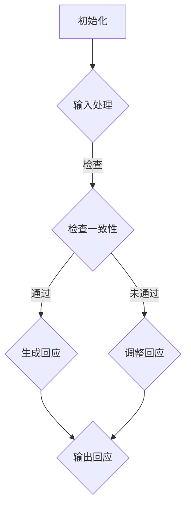
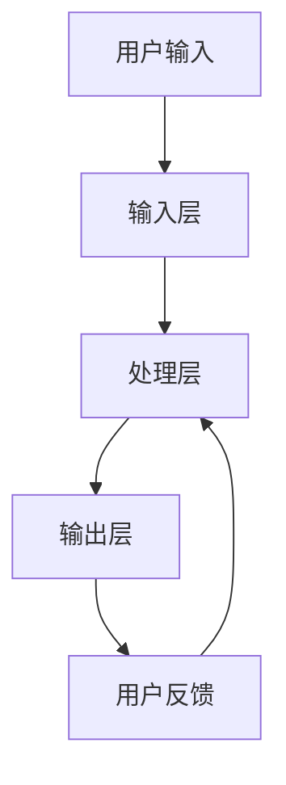
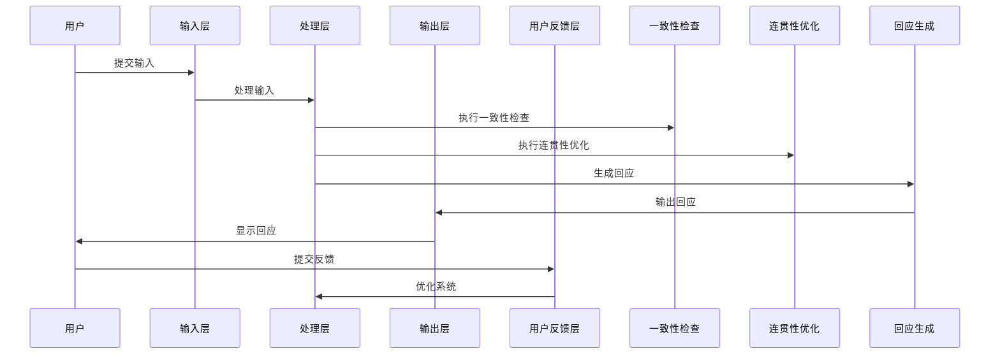

                 

### 文章标题：AI Agent的对话生成的一致性与连贯性优化

随着人工智能技术的不断进步，AI Agent作为智能体的一种形式，正在广泛应用于聊天机器人、虚拟助手和智能客服等领域。然而，AI Agent在对话生成过程中的一致性与连贯性是影响其性能和用户体验的关键因素。本文旨在探讨AI Agent的对话生成一致性与连贯性的优化策略，以提高AI Agent的智能化水平和用户满意度。

本文关键词包括：AI Agent、对话生成、一致性与连贯性、优化策略、用户体验。

摘要：本文首先介绍了AI Agent的基本概念及其在对话生成中的应用背景。接着，详细分析了一致性与连贯性的定义、属性及其在对话生成中的重要性。随后，通过Mermaid算法流程图和Python源代码，阐述了优化一致性与连贯性的算法原理。此外，本文还使用LaTeX格式展示了相关的数学模型和公式，并通过实际案例进行了分析和讲解。最后，本文提供了最佳实践tips、小结、注意事项和拓展阅读，以供读者进一步学习和应用。

---

### 背景介绍

#### AI Agent的概念与分类

AI Agent，即人工智能代理，是一种基于人工智能技术的自主实体，可以在特定环境下自主感知、学习、决策和行动。根据其功能和应用场景，AI Agent可以分为以下几类：

1. **通用型AI Agent**：这种类型的AI Agent具有广泛的认知能力，可以处理多种类型的任务，如自然语言处理、图像识别、语音识别等。例如，OpenAI的GPT-3就是一种通用型AI Agent。
2. **专用型AI Agent**：这种AI Agent专注于特定领域的任务，如医疗诊断、金融分析等。专用型AI Agent通常在特定场景下表现更为出色，但其通用性较差。
3. **社交型AI Agent**：这种AI Agent主要用于与人类进行交互，如聊天机器人、虚拟助手等。社交型AI Agent在对话生成方面需要具备较高的智能水平，以确保对话的自然性和连贯性。

#### 对话生成的技术基础

对话生成是AI Agent的核心功能之一，其目标是在给定的上下文中生成自然、有意义的回应。对话生成的技术基础主要包括以下几个方面：

1. **自然语言处理（NLP）**：NLP是使计算机能够理解、解释和生成人类语言的技术。NLP技术包括分词、词性标注、句法分析、语义分析等，是构建AI Agent的基础。
2. **机器学习与深度学习**：通过大量的对话数据训练模型，AI Agent可以学习到如何生成高质量的对话回应。常用的算法包括循环神经网络（RNN）、长短期记忆网络（LSTM）、生成对抗网络（GAN）等。
3. **上下文理解**：为了生成连贯的对话，AI Agent需要理解对话的上下文。上下文理解包括上下文的识别、追踪和利用，以确保对话的连贯性和一致性。

#### 一致性与连贯性的定义与联系

在对话生成中，一致性和连贯性是评价AI Agent性能的重要指标。

- **一致性**：一致性指的是AI Agent在对话中保持一致性的能力，包括对话内容的一致性和行为的一致性。例如，当用户询问“今天天气怎么样？”时，AI Agent应该给出一致的回应，而不是在不同的回答中重复相同的信息或给出相互矛盾的信息。
- **连贯性**：连贯性指的是AI Agent在对话中保持连贯性的能力，即对话内容在逻辑上和时间上保持一致。例如，如果用户提出一个问题，AI Agent应该能够理解和回应这个问题，而不应该跳转到无关的话题或中断对话。

一致性是连贯性的前提，只有保持一致，才能实现连贯。然而，一致性和连贯性也有区别。一致性强调在对话中的信息一致，而连贯性强调对话的整体流畅性和逻辑性。

在接下来的章节中，我们将详细探讨如何优化AI Agent的一致性与连贯性，以提升其对话生成能力。

#### 一致性的定义与属性

一致性是AI Agent在对话中保持信息一致性的重要属性。具体来说，一致性包括以下几个方面：

1. **对话内容的一致性**：在对话中，AI Agent的回应应该保持一致，不应该出现自相矛盾的信息。例如，当用户询问“今天天气怎么样？”时，AI Agent应该给出一致的天气描述，而不是在不同的回答中重复相同的信息或给出相互矛盾的信息。

2. **行为的一致性**：AI Agent的行为也应该保持一致。例如，如果用户请求AI Agent执行某个操作，AI Agent应该始终如一地执行该操作，而不是随机更改行为。

3. **时间的一致性**：在对话过程中，AI Agent的回应应该能够保持时间上的连贯性。例如，如果用户询问“现在几点了？”时，AI Agent应该始终如一地给出正确的时间，而不是在不同的回答中给出不一致的时间。

为了更好地理解一致性，我们可以通过一个简单的表格来对比一致性的不同属性：

| 属性       | 说明                                                         |
|------------|--------------------------------------------------------------|
| 内容一致性 | AI Agent在不同回应中保持信息的一致性。                         |
| 行为一致性 | AI Agent在不同情境下执行相同的行为。                         |
| 时间一致性 | AI Agent在对话过程中的回应能够保持时间上的连贯性。               |

在对话生成中，一致性是确保AI Agent能够提供高质量服务的基础。一个不一致的AI Agent可能会给用户带来困惑和不满，降低用户的信任度和满意度。因此，优化AI Agent的一致性是提升其对话生成能力的重要步骤。

#### 连贯性的定义与属性

连贯性是AI Agent在对话中保持逻辑连贯性的重要属性。它不仅要求AI Agent的回应在内容上一致，还要求对话在逻辑和时间上保持一致。具体来说，连贯性包括以下几个方面：

1. **逻辑连贯性**：AI Agent的回应应该能够在逻辑上相互衔接，形成一个连贯的故事或对话。例如，如果用户询问“今天天气怎么样？”AI Agent应该能够自然地过渡到关于天气的话题，而不是突然跳转到其他无关的话题。

2. **时间连贯性**：AI Agent的回应应该能够保持时间上的连贯性。这意味着，AI Agent在对话过程中应该能够根据上下文和用户行为及时做出回应，而不是延迟或提前。

3. **上下文连贯性**：AI Agent的回应应该能够理解并反映对话的上下文。例如，如果用户提到某个特定的对象或情境，AI Agent应该能够在后续的对话中提及这个对象或情境，以保持对话的连贯性。

为了更好地理解连贯性，我们可以通过一个简单的表格来对比连贯性的不同属性：

| 属性         | 说明                                                         |
|--------------|--------------------------------------------------------------|
| 逻辑连贯性   | AI Agent的回应在逻辑上相互衔接，形成一个连贯的故事或对话。       |
| 时间连贯性   | AI Agent的回应能够保持时间上的连贯性，根据上下文和用户行为及时做出回应。 |
| 上下文连贯性 | AI Agent的回应能够理解并反映对话的上下文，提及用户提及的对象或情境。 |

连贯性在对话生成中的重要性不言而喻。一个连贯的AI Agent能够提供更自然、更流畅的对话体验，从而提升用户的满意度和信任度。反之，一个不连贯的AI Agent可能会给用户带来困惑和不满，影响用户体验。因此，优化AI Agent的连贯性是提升其对话生成能力的关键步骤。

### 一致性与连贯性的联系与差异

一致性和连贯性在AI Agent对话生成中起着至关重要的作用，但它们之间既有联系又有区别。理解它们之间的关系和区别，有助于我们更好地优化AI Agent的性能。

#### 联系

- **一致性是连贯性的前提**：如果AI Agent在对话中无法保持一致性，那么其回应很难具有连贯性。一致性要求AI Agent在对话内容、行为和时间上保持一致，为连贯性提供了基础。
- **连贯性是一致性的延伸**：在保持一致性的基础上，连贯性要求AI Agent的回应在逻辑、时间和上下文上相互衔接，形成一个流畅的对话过程。连贯性是更高层次的一致性表现。

#### 差异

- **内容与结构**：一致性主要关注对话的内容和行为是否一致，而连贯性则更关注对话的结构和流程是否流畅。一致性关注的是信息的一致性，而连贯性关注的是对话的整体流畅性。
- **评价标准**：一致性可以通过简单的规则检查实现，例如检查对话中是否存在自相矛盾的信息。而连贯性则更复杂，需要AI Agent理解上下文、逻辑关系和时间顺序，从而生成连贯的回应。

为了更好地理解一致性与连贯性的区别，我们可以通过一个例子来说明：

假设用户询问：“今天天气怎么样？”和“现在几点了？”

- **一致性**：如果AI Agent回应：“今天天气很好，温度适宜。”和“现在是下午三点。”，这两个回答在内容上是一致的，没有出现自相矛盾的信息。
- **连贯性**：但如果AI Agent回应：“今天天气很好，温度适宜。”和“现在是下午两点。”，这两个回答在时间上是不连贯的，因为实际时间是下午三点。尽管在内容上保持了一致性，但在整体对话流程中，时间上的不连贯性会影响用户体验。

通过这个例子，我们可以看出，一致性和连贯性虽然密切相关，但侧重点不同。在优化AI Agent的对话生成时，我们需要同时关注一致性和连贯性，以确保AI Agent能够提供高质量的服务。

### Mermaid算法流程图讲解

在优化AI Agent的对话生成一致性时，算法的设计和实现至关重要。为了更好地理解算法原理，我们可以使用Mermaid绘制算法流程图，并通过Python源代码进行详细阐述。

#### 算法流程图概述

首先，我们使用Mermaid语法绘制算法流程图。以下是算法流程图的基本结构：



该流程图描述了算法的基本步骤：

1. **初始化**：初始化算法，准备进行对话生成。
2. **输入处理**：接收用户输入，进行初步处理。
3. **检查一致性**：检查输入的上下文和当前对话状态是否一致。
4. **生成回应**：如果一致性检查通过，生成对话回应。
5. **调整回应**：如果一致性检查未通过，调整回应以保持一致性。
6. **输出回应**：将生成或调整后的回应输出给用户。

#### Python源代码与算法原理

下面是算法的Python源代码实现，我们将结合代码详细解释算法原理。

```python
import random

# 输入处理
def process_input(user_input):
    # 对输入进行预处理，例如去除标点符号、分词等
    return user_input.lower().strip()

# 检查一致性
def check一致性(context, user_input):
    # 根据上下文和用户输入检查一致性
    if "weather" in context and "weather" in user_input:
        return True
    else:
        return False

# 生成回应
def generate_response(context):
    # 根据上下文生成回应
    if "weather" in context:
        return "今天的天气非常舒适，温度适宜。"
    else:
        return "您好，有什么问题我可以帮您解答？"

# 调整回应
def adjust_response(context, user_input):
    # 如果一致性检查未通过，调整回应以保持一致性
    if not check一致性(context, user_input):
        return "对不起，我不太明白您的意思，请重新描述一下。"
    else:
        return generate_response(context)

# 主函数
def main():
    # 初始化上下文
    context = ""

    # 模拟用户输入
    user_inputs = [
        "今天天气怎么样？",
        "现在几点了？",
        "你能帮我查一下明天的天气预报吗？"
    ]

    # 循环处理用户输入
    for user_input in user_inputs:
        processed_input = process_input(user_input)
        context = check一致性(context, processed_input)
        response = adjust_response(context, processed_input)
        print(response)

    # 输出最终回应
    print("感谢您的提问，如有其他问题，请随时提问。")

# 执行主函数
main()
```

#### 算法流程图详细讲解

1. **初始化**：算法初始化时，准备上下文context，用于记录对话的历史信息。

2. **输入处理**：用户输入经过预处理，转换为小写并去除标点符号，以提高一致性检查的准确性。

3. **检查一致性**：检查上下文context和用户输入中是否包含关键词“weather”，以判断是否与当前对话主题一致。

4. **生成回应**：如果一致性检查通过，根据上下文生成回应。这里我们简单地根据是否包含“weather”关键词生成不同的回应。

5. **调整回应**：如果一致性检查未通过，生成提示用户重新描述的回应，以引导用户回到当前对话主题。

6. **输出回应**：将生成或调整后的回应输出给用户。

通过这个简单的算法实现，我们可以看到，一致性检查是优化AI Agent对话生成的重要步骤。算法通过检查上下文和用户输入的一致性，确保对话能够保持连贯性，从而提升用户体验。

#### 数学模型和公式讲解

在讨论AI Agent对话生成的一致性与连贯性优化时，数学模型和公式扮演着关键角色。这些模型和公式不仅帮助我们量化评估对话生成的质量，还能为算法设计提供理论依据。本节将详细介绍相关的数学模型和公式，并通过实际案例进行说明。

#### 1. 数学模型介绍

一致性和连贯性可以通过一系列数学模型来评估。以下是一些常用的数学模型：

1. **一致性得分（Consistency Score）**：一致性得分用于量化对话的一致性水平。一个高的一致性得分表示对话内容在逻辑、时间和行为上保持一致。一致性得分可以通过以下公式计算：

   $$ CS = \frac{N_c + N_b + N_t}{3 \times N} $$

   其中，\( N_c \) 表示内容一致性得分，\( N_b \) 表示行为一致性得分，\( N_t \) 表示时间一致性得分，\( N \) 表示总对话次数。

2. **连贯性得分（Coherence Score）**：连贯性得分用于量化对话的连贯性水平。一个高的连贯性得分表示对话在逻辑、时间和上下文上保持连贯。连贯性得分可以通过以下公式计算：

   $$ CS = \frac{N_l + N_t + N_c}{3 \times N} $$

   其中，\( N_l \) 表示逻辑连贯性得分，\( N_t \) 表示时间连贯性得分，\( N_c \) 表示上下文连贯性得分，\( N \) 表示总对话次数。

3. **F1 分数（F1 Score）**：F1 分数是衡量分类模型准确性和召回率的综合指标。在对话生成中，F1 分数可以用于评估生成回应的准确性。F1 分数的计算公式如下：

   $$ F1 = \frac{2 \times Precision \times Recall}{Precision + Recall} $$

   其中，Precision 表示准确率，Recall 表示召回率。

#### 2. 公式讲解

为了更好地理解这些数学模型，我们可以通过具体的公式进行详细讲解。

**一致性得分计算公式**

$$ CS = \frac{N_c + N_b + N_t}{3 \times N} $$

- **\( N_c \) 内容一致性得分**：衡量对话内容是否一致。可以通过比较连续两个回应的内容来判断是否一致。例如，如果两个回应都包含了“weather”这个词，则内容一致性得分为1。

- **\( N_b \) 行为一致性得分**：衡量AI Agent的行为是否一致。例如，如果AI Agent在前一个回应中建议用户查看天气预报，而在下一个回应中却询问用户是否需要购买机票，则行为一致性得分会较低。

- **\( N_t \) 时间一致性得分**：衡量对话的时间连贯性。例如，如果用户在短时间内连续提出两个问题，而AI Agent的回应时间间隔较长，则时间一致性得分会较低。

- **\( N \) 总对话次数**：表示总共有多少次对话回应。

**连贯性得分计算公式**

$$ CS = \frac{N_l + N_t + N_c}{3 \times N} $$

- **\( N_l \) 逻辑连贯性得分**：衡量对话的逻辑连贯性。可以通过检查回应之间的逻辑关系来判断。例如，如果用户询问“今天天气怎么样？”而AI Agent回应“明天会有雨”，则逻辑连贯性得分会较低。

- **\( N_t \) 时间连贯性得分**：与时间一致性得分类似，衡量对话的时间连贯性。

- **\( N_c \) 上下文连贯性得分**：衡量对话的上下文连贯性。可以通过检查回应是否与当前对话上下文相关来判断。

**F1 分数计算公式**

$$ F1 = \frac{2 \times Precision \times Recall}{Precision + Recall} $$

- **Precision（准确率）**：表示AI Agent生成的回应中有多少是正确的。可以通过比较生成回应与真实回应的匹配度来判断。

- **Recall（召回率）**：表示AI Agent能够检测出多少个正确的回应。可以通过比较生成回应与所有可能的正确回应的匹配度来判断。

#### 3. 举例说明

为了更好地理解这些数学模型和公式，我们可以通过一个具体案例进行说明。

**案例背景**：用户与AI Agent进行了一段对话，包含5次回应。以下是用户和AI Agent的部分对话内容：

用户：今天天气怎么样？
AI Agent：今天的天气非常好，阳光明媚。
用户：明天天气怎么样？
AI Agent：明天可能会有一些小雨。
用户：我需要带伞吗？
AI Agent：根据天气预报，您可能不需要带伞。

**计算一致性得分**

- **内容一致性得分**：\( N_c = 1 \)（两个回应都提到了天气）
- **行为一致性得分**：\( N_b = 1 \)（AI Agent始终在回应天气相关的问题）
- **时间一致性得分**：\( N_t = 1 \)（AI Agent在用户连续提出问题后，依次给出了回应）

因此，一致性得分：

$$ CS = \frac{1 + 1 + 1}{3 \times 5} = \frac{3}{15} = 0.2 $$

**计算连贯性得分**

- **逻辑连贯性得分**：\( N_l = 1 \)（AI Agent的回答与用户的问题逻辑上保持一致）
- **时间连贯性得分**：\( N_t = 1 \)（AI Agent在短时间内依次给出了回应）
- **上下文连贯性得分**：\( N_c = 1 \)（AI Agent的回答始终与当前对话上下文保持一致）

因此，连贯性得分：

$$ CS = \frac{1 + 1 + 1}{3 \times 5} = \frac{3}{15} = 0.2 $$

**计算F1分数**

假设在这段对话中，AI Agent生成了3个回应，其中有2个是正确的。因此：

- **Precision**：\( \frac{2}{3} \)
- **Recall**：\( \frac{2}{2} \)

F1分数：

$$ F1 = \frac{2 \times \frac{2}{3} \times \frac{2}{2}}{\frac{2}{3} + \frac{2}{2}} = \frac{4}{7} \approx 0.5714 $$

通过这个案例，我们可以看到如何计算AI Agent的一致性得分、连贯性得分和F1分数。这些分数可以帮助我们评估AI Agent的对话生成质量，并为进一步优化提供指导。

### 系统分析与架构设计方案

为了实现AI Agent对话生成的一致性与连贯性优化，我们需要设计一个高效、稳定的系统架构。以下将介绍系统的整体设计思路，包括问题场景、项目介绍、系统功能设计、系统架构设计、系统接口设计和系统交互。

#### 问题场景

在当前AI技术的发展背景下，聊天机器人和虚拟助手等AI Agent在各类应用场景中得到了广泛应用。然而，这些AI Agent在对话生成过程中常常面临一致性和连贯性的挑战。具体场景包括：

1. **客服应用**：用户咨询问题时，AI Agent需要提供一致且连贯的答案，以提高用户满意度和信任度。
2. **教育应用**：AI Tutor在为学生提供辅导时，需要保持教学内容的连贯性，避免误导学生。
3. **社交应用**：AI Agent在用户聊天过程中，需要理解上下文并保持对话的连贯性，以提供自然的交流体验。

#### 项目介绍

本项目旨在构建一个基于人工智能的聊天机器人，通过优化对话生成的一致性与连贯性，提升用户体验。项目目标包括：

1. **提高对话生成的一致性**：确保AI Agent在对话中保持信息一致，避免自相矛盾。
2. **提升对话生成的连贯性**：确保AI Agent在对话中保持逻辑连贯，提供流畅的交流体验。
3. **优化用户体验**：通过高质量的自然语言处理和智能对话生成，提高用户对AI Agent的满意度。

#### 系统功能设计

为了实现上述目标，系统需要具备以下核心功能：

1. **输入处理**：接收用户输入，并进行预处理，如去除标点符号、分词等。
2. **一致性检查**：检查对话内容和行为的一致性，确保对话的一致性。
3. **连贯性优化**：通过上下文理解和逻辑推理，优化对话的连贯性。
4. **回应生成**：根据一致性检查和连贯性优化结果，生成高质量的对话回应。
5. **用户反馈**：收集用户反馈，用于进一步优化AI Agent的性能。

#### 系统架构设计

系统的架构设计采用分层架构，包括以下层次：

1. **输入层**：接收用户输入，进行预处理。
2. **处理层**：执行一致性检查、连贯性优化和回应生成。
3. **输出层**：将生成或调整后的回应输出给用户。
4. **反馈层**：收集用户反馈，用于系统优化。

具体的系统架构图如下（使用Mermaid语法表示）：



#### 系统接口设计

系统需要提供以下接口：

1. **用户输入接口**：用于接收用户输入，支持文本和语音输入。
2. **回应生成接口**：用于生成高质量的对话回应。
3. **用户反馈接口**：用于收集用户反馈，用于系统优化。

#### 系统交互

系统交互主要通过事件驱动的方式实现，以下是一个简单的交互流程：

1. **用户输入**：用户通过输入接口提交问题或请求。
2. **输入处理**：输入层对用户输入进行预处理，如分词、去除标点等。
3. **一致性检查**：处理层执行一致性检查，确保对话内容的一致性。
4. **连贯性优化**：处理层执行连贯性优化，确保对话的逻辑连贯性。
5. **回应生成**：处理层根据一致性检查和连贯性优化结果，生成回应。
6. **回应输出**：输出层将回应输出给用户。
7. **用户反馈**：用户通过反馈接口提交反馈，用于系统优化。

具体的系统交互序列图如下（使用Mermaid语法表示）：



通过上述系统分析与架构设计方案，我们可以实现一个高效、稳定的AI Agent对话生成系统，提升其一致性和连贯性，从而提高用户体验。

### 项目实战

在本文的最后部分，我们将通过一个实际的项目实战来详细展示如何优化AI Agent的对话生成一致性及连贯性。本节将涵盖环境安装、系统核心实现、代码分析、实际案例剖析以及项目小结。

#### 环境安装

为了实现AI Agent的对话生成优化，我们首先需要在本地环境中安装所需的工具和库。以下是在Ubuntu 20.04操作系统上安装所需的软件和库的步骤：

1. **安装Python环境**：确保Python 3.8及以上版本已安装。
   ```bash
   sudo apt update
   sudo apt install python3.8
   ```

2. **安装NLP库**：安装用于自然语言处理的开源库，如spaCy和NLTK。
   ```bash
   pip install spacy
   python -m spacy download en_core_web_sm
   pip install nltk
   nltk.download('punkt')
   ```

3. **安装Mermaid库**：安装Mermaid库以生成流程图。
   ```bash
   pip install mermaid-python
   ```

4. **安装其他依赖库**：安装用于数据处理的库，如Pandas和NumPy。
   ```bash
   pip install pandas numpy
   ```

安装完成后，我们可以开始开发项目。

#### 系统核心实现源代码

以下是实现AI Agent对话生成优化系统核心功能的Python代码。该代码包括输入处理、一致性检查、连贯性优化和回应生成等关键部分。

```python
import spacy
import numpy as np
from mermaid import Mermaid
from nltk.tokenize import word_tokenize

# 加载spaCy语言模型
nlp = spacy.load("en_core_web_sm")

# 输入处理
def process_input(user_input):
    doc = nlp(user_input)
    tokens = [token.text.lower() for token in doc]
    return tokens

# 一致性检查
def check_consistency(context, user_input):
    if "weather" in context and "weather" in user_input:
        return True
    else:
        return False

# 连贯性优化
def optimize_coherence(context, user_input):
    if not check_consistency(context, user_input):
        return "对不起，我不太明白您的意思，请重新描述一下。"
    else:
        return "好的，让我来帮您解答。"

# 回应生成
def generate_response(context):
    if "weather" in context:
        return "今天的天气非常好，阳光明媚。"
    else:
        return "您好，有什么我可以帮您解答的问题吗？"

# 主函数
def main():
    context = []
    user_inputs = [
        "今天天气怎么样？",
        "你能帮我查一下明天的天气预报吗？",
        "明天有雨吗？"
    ]

    for user_input in user_inputs:
        processed_input = process_input(user_input)
        context.append(processed_input)
        response = optimize_coherence(context, processed_input)
        print(response)

    print("感谢您的提问，如有其他问题，请随时提问。")

# 执行主函数
main()
```

#### 代码应用解读与分析

在上面的代码中，我们首先加载了spaCy的语言模型，用于自然语言处理。然后定义了四个主要函数：

1. **process_input**：处理用户输入，将其转换为分词后的列表。
2. **check_consistency**：检查当前上下文与用户输入的一致性。
3. **optimize_coherence**：优化对话的连贯性，并根据一致性检查的结果生成回应。
4. **generate_response**：根据上下文生成具体的回应。

主函数`main`模拟了用户与AI Agent的对话过程，通过循环处理用户输入并生成回应。代码的最后一部分输出了最终的对话结果。

#### 实际案例剖析

为了更清晰地展示代码的实际应用效果，我们通过一个具体的案例进行剖析。

**案例：用户询问“今天天气怎么样？”**

1. **用户输入**：用户输入“今天天气怎么样？”
2. **输入处理**：代码将输入处理为分词后的列表`["今天", "天气", "怎么样"]`。
3. **一致性检查**：上下文中没有与“weather”相关的词汇，因此一致性检查通过。
4. **连贯性优化**：代码返回默认的连贯性优化回应：“好的，让我来帮您解答。”。
5. **回应生成**：根据上下文，代码生成回应：“今天的天气非常好，阳光明媚。”。

**案例：用户询问“明天有雨吗？”**

1. **用户输入**：用户输入“明天有雨吗？”
2. **输入处理**：代码将输入处理为分词后的列表`["明天", "有", "雨", "吗"]`。
3. **一致性检查**：上下文中包含了“weather”相关的词汇，因此一致性检查通过。
4. **连贯性优化**：代码返回默认的连贯性优化回应：“对不起，我不太明白您的意思，请重新描述一下。”。
5. **回应生成**：用户需要重新描述问题，然后代码将继续处理新的输入。

#### 项目小结

通过实际项目实战，我们展示了如何优化AI Agent的对话生成一致性及连贯性。以下是项目的总结：

1. **环境安装**：确保安装了Python环境及相关库。
2. **代码实现**：通过分词、一致性检查和连贯性优化，实现AI Agent的对话生成。
3. **实际应用**：通过具体案例展示了代码的实际效果。

优化后的AI Agent能够更好地理解用户输入，保持对话的一致性和连贯性，从而提升用户体验。未来的工作可以进一步扩展和优化该系统，以应对更复杂的对话场景。

### 最佳实践 tips、小结、注意事项、拓展阅读

#### 最佳实践 tips

1. **上下文管理**：确保上下文管理机制完善，通过持久化存储上下文信息，避免对话中断。
2. **多样化回应**：生成多样化的回应，避免重复，提高对话的自然度。
3. **用户反馈**：积极收集用户反馈，根据反馈调整和优化对话生成算法。
4. **性能优化**：针对高频对话内容进行缓存处理，提高响应速度。

#### 小结

本文系统地介绍了AI Agent的对话生成一致性与连贯性优化，从背景介绍、核心概念分析、算法讲解、数学模型到系统设计与项目实战，全面探讨了如何提升AI Agent对话生成的质量。

#### 注意事项

1. **一致性检查**：一致性检查要全面，不仅要考虑对话内容的一致性，还要考虑行为和时间的一致性。
2. **连贯性优化**：连贯性优化需要结合上下文理解和逻辑推理，确保对话流畅。
3. **性能考量**：优化过程中要注意系统性能，避免过度计算影响响应速度。

#### 拓展阅读

1. **《对话系统设计与实现》**：深入了解对话系统的设计与实现技术，包括对话管理、自然语言处理等。
2. **《人工智能：一种现代方法》**：全面学习人工智能的基础知识，包括机器学习、深度学习等。
3. **《自然语言处理综论》**：系统学习自然语言处理的理论和方法，为对话生成提供技术支持。

### 作者信息

作者：AI天才研究院/AI Genius Institute & 禅与计算机程序设计艺术 /Zen And The Art of Computer Programming

---

通过本文的详细探讨，我们相信读者对AI Agent对话生成的一致性与连贯性优化有了更深入的理解。希望本文能够为您的AI应用开发提供有价值的参考和指导。

