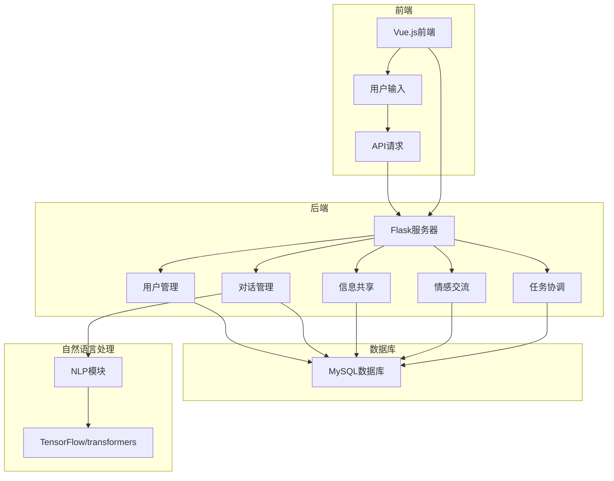

                 

### 引言

#### 引言背景

在当今快速发展的科技时代，人工智能（AI）正逐渐渗透到我们日常生活的方方面面。AI Agent，作为一种智能代理，通过模拟人类思维和行为，已经展示了其在各个领域的潜力。而对话系统作为AI Agent的核心技术之一，正逐渐成为跨代沟通的重要工具。跨代沟通，即在不同的代际之间进行有效交流，是解决社会多元化和复杂性问题的关键。

随着社会结构的演变和代际差异的加深，跨代沟通面临诸多挑战。不同代际在价值观、生活习惯、沟通方式等方面存在明显差异，这给沟通的有效性带来了巨大障碍。而传统的沟通方式已经难以满足现代社会的需求，因此，探索和应用AI Agent的对话系统来改善跨代沟通成为了一项重要课题。

#### 研究目的和意义

本文旨在深入探讨AI Agent的对话系统在跨代沟通中的应用，通过系统性的研究和分析，为跨代沟通提供新的解决方案。具体研究目的如下：

1. **核心概念理解**：明确AI Agent和对话系统的定义、原理及其在跨代沟通中的作用。
2. **系统设计原则**：分析跨代沟通中的需求，设计适用于跨代沟通的对话系统。
3. **融合策略**：研究AI Agent与跨代沟通的融合策略，探索如何提高跨代沟通的效率和效果。
4. **实现与开发**：介绍对话系统的实现和开发方法，为实际应用提供技术支持。
5. **案例分析与优化**：通过案例分析，评估对话系统的性能，并提出优化策略。

研究这一课题具有重要的现实意义：

1. **改善沟通效果**：通过AI Agent的对话系统，可以有效地减少跨代沟通中的障碍，提高沟通的效率和质量。
2. **促进社会和谐**：跨代沟通的改善有助于增进代际理解，促进社会和谐与稳定。
3. **推动科技发展**：AI Agent的对话系统应用将为人工智能技术的研究和发展提供新的方向和思路。

#### 内容组织结构

本文将分为七个章节，详细探讨AI Agent的对话系统在跨代沟通中的应用。具体内容组织如下：

1. **第1章 背景介绍与核心概念**：介绍跨代沟通的背景、AI Agent与对话系统的核心概念。
2. **第2章 对话系统的基本原理**：探讨对话系统的基本原理和结构。
3. **第3章 跨代沟通中的对话系统设计**：分析跨代沟通需求，设计对话系统。
4. **第4章 AI Agent与跨代沟通的融合**：研究AI Agent在跨代沟通中的应用。
5. **第5章 实现与开发**：介绍对话系统的实现和开发方法。
6. **第6章 项目实战与案例分析**：通过具体项目案例进行分析和总结。
7. **第7章 总结与展望**：总结研究成果，展望未来发展趋势。

通过这一系列的研究和分析，本文希望能够为AI Agent的对话系统在跨代沟通中的应用提供理论支持和实践指导，为跨代沟通的改善提供新的思路和方法。希望读者能够跟随本文的思路，逐步深入理解这一领域，并为实际应用做出贡献。

#### 第1章 背景介绍与核心概念

##### 1.1 问题背景

跨代沟通，是指不同代际之间进行有效交流的过程。随着社会的快速发展和代际差异的日益显著，跨代沟通问题逐渐凸显。不同代际在价值观、生活方式、教育背景、技术接受程度等方面存在显著差异，这给跨代沟通带来了巨大的挑战。例如，在家庭中，年轻一代和年长一代在对待新技术、生活习惯和社交方式上往往存在分歧，这种分歧不仅影响了家庭和谐，还可能引发更广泛的社会问题。

在商业环境中，跨代沟通同样重要。不同代际的员工往往拥有不同的工作态度、工作方式和沟通风格，这可能导致团队协作效率低下，影响企业的发展。例如，年长一代的员工可能更倾向于传统的沟通方式，而年轻一代的员工则更偏好使用社交媒体和即时通讯工具。这种差异不仅影响了信息的传递和共享，还可能造成误解和冲突。

此外，在社会治理和公共政策制定中，跨代沟通的不足也会导致政策的实施效果不佳。不同代际对政策的理解和接受程度不同，缺乏有效的沟通可能会导致政策的执行困难，甚至引发社会不满和动荡。

总之，跨代沟通问题不仅关乎个体的生活质量，也影响到整个社会的稳定和发展。因此，解决跨代沟通问题具有重要的现实意义。

##### 1.2 核心概念：AI Agent与对话系统

1. **AI Agent（人工智能代理）**：

AI Agent，即人工智能代理，是一种能够在虚拟环境中自主执行任务、与人类进行交互的智能实体。它通过感知环境、理解指令、做出决策和执行动作，模拟人类的思维和行为。AI Agent的核心特点是自主性和交互性，它不仅能够独立完成特定任务，还能通过与用户的互动，理解用户的需求并提供相应的服务。

AI Agent的定义可以从以下几个方面进行理解：

- **自主性**：AI Agent具有自主决策的能力，可以在没有人类干预的情况下执行任务。这种自主性是AI Agent区别于传统自动化系统的重要特征。
- **交互性**：AI Agent能够与用户进行自然语言交互，理解用户的指令和需求，并通过语音、文本或其他形式进行响应。这种交互性使得AI Agent能够更贴近人类的沟通方式，提高沟通效率。

AI Agent的功能主要包括：

- **任务执行**：AI Agent能够根据预设的任务规则，自动执行特定的任务，如信息检索、日程管理、自动化办公等。
- **知识管理**：AI Agent能够存储、检索和更新知识库，为用户提供信息查询、建议和决策支持。
- **交互能力**：AI Agent能够通过自然语言处理技术，与用户进行自然、流畅的对话，满足用户的多样化需求。

2. **对话系统（Dialogue System）**：

对话系统，也称为聊天系统或会话系统，是一种与用户进行对话的计算机系统。它通过自然语言处理技术，理解用户的语言输入，生成适当的语言响应，并进行持续的会话。对话系统的核心功能是模拟人类对话过程，提高人与计算机之间的交互效率。

对话系统的组成部分包括：

- **自然语言理解（NLU）**：负责接收用户的语言输入，将其转换为计算机可以理解的结构化数据，如语义解析、意图识别等。
- **对话管理（DM）**：负责管理对话流程，包括对话状态跟踪、上下文管理、对话策略生成等，确保对话的连贯性和有效性。
- **自然语言生成（NLG）**：负责生成自然语言响应，将计算机处理的结果转换为人类可理解的语言，如文本、语音等。

根据应用场景的不同，对话系统可以分为以下几种类型：

- **客户服务对话系统**：用于为客户提供在线客服，解决客户的问题和需求。
- **智能助手对话系统**：如苹果的Siri、谷歌的Google Assistant，为用户提供个性化的服务，如日程管理、信息查询等。
- **教育对话系统**：用于辅助教育过程，提供个性化教学、学生问答等。

##### 1.3 跨代沟通的概念与挑战

1. **跨代沟通的概念**：

跨代沟通，指的是不同代际之间进行的沟通活动。这里的“代际”通常指的是年龄差距较大的群体，如父母与子女、祖父母与孙子孙女等。跨代沟通涉及不同年龄段的价值观、行为习惯、认知方式等方面的差异，旨在促进不同代际之间的理解与合作。

跨代沟通的定义可以从以下几个方面进行理解：

- **代际差异**：不同代际在文化背景、社会经验、价值观等方面存在显著差异，这些差异构成了跨代沟通的基础。
- **沟通互动**：跨代沟通是一种双向的互动过程，不仅包括信息传递，还涉及情感交流、冲突解决等方面。
- **社会意义**：跨代沟通对于社会的稳定和发展具有重要意义，有助于缓解代际矛盾，促进社会和谐。

2. **跨代沟通中的挑战**：

跨代沟通面临诸多挑战，主要包括以下几个方面：

- **沟通障碍**：不同代际在语言表达、沟通风格、沟通渠道等方面存在差异，这些差异可能导致沟通障碍。例如，年轻一代可能更倾向于使用网络语言和社交媒体进行沟通，而年长一代则可能更喜欢传统的面对面交流。
- **价值观念差异**：不同代际在价值观上存在显著差异，这可能导致双方在沟通中产生误解和冲突。例如，年轻一代可能更追求自由和个性，而年长一代则可能更注重家庭和社会责任。
- **认知方式差异**：不同年龄段的认知方式不同，这可能导致双方在沟通中对信息的理解和处理方式不同。例如，年轻一代可能更擅长接受新事物，而年长一代则可能更习惯于传统的思维方式。
- **情感表达差异**：不同代际在情感表达上存在差异，这可能影响沟通的效果。例如，年轻一代可能更善于表达情感，而年长一代则可能更内敛。

##### 1.4 研究现状与趋势

1. **研究现状**：

目前，关于跨代沟通的研究已取得一定成果。研究者们主要从心理学、社会学、教育学等多个角度，探讨跨代沟通的机制、障碍和解决策略。在人工智能领域，研究者们开始将AI Agent的对话系统应用于跨代沟通，通过模拟人类思维和行为，提高沟通的效率和效果。

- **心理学研究**：心理学研究者通过实验和调查，分析了不同代际之间的沟通模式和障碍，提出了一些改善跨代沟通的建议。
- **社会学研究**：社会学家研究了社会结构变化对跨代沟通的影响，探讨了不同代际在社会角色和责任方面的互动。
- **教育学研究**：教育学者关注跨代沟通在教育过程中的应用，提出了一些教育策略，以促进师生之间的有效沟通。

在人工智能领域，研究者们将AI Agent的对话系统应用于跨代沟通，通过自然语言处理、机器学习等技术，设计出能够理解不同代际需求的对话系统。这些系统在客户服务、智能助手、教育辅助等领域已有一定应用，并取得了一定的效果。

2. **研究趋势**：

随着科技的进步和社会的发展，跨代沟通的研究将继续深入，未来可能呈现以下趋势：

- **人工智能的深入应用**：AI Agent的对话系统将更加智能化，能够更好地理解不同代际的需求，提供个性化的沟通服务。
- **跨学科研究**：心理学、社会学、教育学和人工智能等领域的交叉研究将更加普遍，以多角度、多层次地探讨跨代沟通问题。
- **实践与理论的结合**：理论研究将更多地与实际应用相结合，通过实践检验理论的有效性，并提出更加实用的解决方案。
- **政策建议**：基于研究的结果，将为政策制定者提供科学依据，以制定更加有效的跨代沟通政策和措施。

总之，跨代沟通是一个复杂而重要的问题，需要多学科的合作和研究。通过引入AI Agent的对话系统，有望为跨代沟通提供新的思路和解决方案，促进社会的和谐与稳定。

#### 第2章 对话系统的基本原理

##### 2.1 对话系统概述

对话系统，亦称为聊天系统或会话系统，是一种旨在模拟人类对话过程的计算机系统。通过自然语言处理（NLP）技术，对话系统能够理解用户的语言输入，生成适当的语言响应，并保持对话的连贯性和上下文一致性。其核心目标是实现人与计算机之间的自然交互，提高沟通效率和用户体验。

对话系统的基本组成部分包括自然语言理解（NLU）、对话管理（DM）和自然语言生成（NLG）三个主要模块，每个模块在对话过程中扮演着至关重要的角色。

- **自然语言理解（NLU）**：NLU是对话系统的前端模块，负责接收用户的语言输入，将其转换为计算机可以处理的结构化数据。这一过程包括词法分析、句法分析、语义分析等步骤。NLU的主要任务是从用户的语言输入中提取关键信息，如意图、实体和上下文，为后续的对话管理提供基础。
  
- **对话管理（DM）**：DM是对话系统的核心模块，负责管理对话流程。DM通过跟踪对话状态、管理对话上下文和生成对话策略，确保对话的连贯性和有效性。DM需要处理多个对话情境，如闲聊、任务导向对话、多轮对话等，并根据对话历史和当前对话状态生成合适的回复。
  
- **自然语言生成（NLG）**：NLG是对话系统的后端模块，负责将计算机处理的结果转换为自然语言响应，如文本、语音或其他形式。NLG的目标是生成人类可理解且自然的语言输出，使对话系统能够与用户进行流畅、自然的对话。

##### 2.2 对话流程与模型

对话系统的工作流程可以概括为以下几个关键步骤：

1. **输入接收**：用户通过文本、语音或其他形式与对话系统进行交互，系统接收用户的输入。
2. **自然语言理解（NLU）**：系统对用户的输入进行处理，提取出关键信息，如意图、实体和上下文。NLU模块通过词法分析、句法分析和语义分析等技术，将自然语言输入转换为结构化数据。
3. **对话管理（DM）**：对话管理模块根据提取出的关键信息，分析当前对话状态和上下文，生成对话策略。DM模块需要处理多轮对话、任务导向对话等复杂情境，确保对话的连贯性和上下文一致性。
4. **自然语言生成（NLG）**：NLG模块将对话管理模块生成的对话策略转换为自然语言响应，生成用户可以理解的语言输出。NLG需要生成自然流畅的语言，确保用户感受到对话的连续性和自然性。
5. **输出响应**：系统将生成的自然语言响应发送给用户，完成一次对话交互。

为了实现上述流程，对话系统采用了多种对话模型，其中最为常见的是基于规则模型、统计模型和深度学习模型。

1. **基于规则模型**：基于规则模型通过预先定义的规则来处理用户的输入和生成响应。这些规则通常由领域专家根据对话系统的应用场景进行编写。基于规则模型的优势在于实现简单、可控性强，但缺点是规则编写复杂且难以扩展。
2. **统计模型**：统计模型通过分析大量的对话数据，学习用户输入和系统响应之间的关系，从而生成响应。常见的统计模型包括决策树、贝叶斯网络、隐马尔可夫模型（HMM）等。统计模型的优势在于能够自动学习并适应不同对话场景，但缺点是对数据的依赖性强且难以处理复杂的语义关系。
3. **深度学习模型**：深度学习模型通过大规模的神经网络结构，自动学习用户输入和系统响应之间的复杂关系。常见的深度学习模型包括循环神经网络（RNN）、长短时记忆网络（LSTM）、变换器（Transformer）等。深度学习模型的优势在于能够处理复杂的语义关系，生成更加自然和连贯的语言响应，但缺点是模型训练需要大量数据和计算资源。

##### 2.3 基于AI的对话系统架构

基于AI的对话系统架构通常采用多层次、模块化的设计，以实现高效的对话处理和灵活的系统扩展。以下是一个典型的基于AI的对话系统架构：

1. **输入处理层**：输入处理层负责接收用户的输入，并将其转换为结构化数据。这一层通常包含NLP技术，如词法分析、句法分析和语义分析，以提取关键信息，如意图、实体和上下文。

2. **意图识别模块**：意图识别模块负责识别用户的意图。通过分析输入数据，系统确定用户的请求类型，如查询信息、执行任务、闲聊等。

3. **实体识别模块**：实体识别模块负责识别输入数据中的关键实体，如人名、地点、日期等。实体识别的结果为后续对话管理提供重要信息。

4. **对话管理模块**：对话管理模块负责管理对话流程，包括对话状态跟踪、上下文管理和对话策略生成。对话管理模块根据当前的对话状态和上下文，生成对话策略，决定系统下一步的操作。

5. **知识库模块**：知识库模块包含对话系统所需的知识库，如问答库、事实库、任务规则库等。知识库为对话系统提供了丰富的信息资源，以支持对话生成和任务执行。

6. **自然语言生成模块**：自然语言生成模块负责将对话管理模块生成的对话策略转换为自然语言响应。这一层通常采用NLG技术，如模板生成、文本生成等，以生成自然流畅的语言输出。

7. **输出层**：输出层将生成的自然语言响应发送给用户，完成对话交互。

基于AI的对话系统架构通过模块化设计，实现了对话系统的灵活扩展和高效处理。不同模块之间通过接口进行通信，使得系统可以方便地集成新的功能和技术。

##### 2.4 常见的对话系统类型

根据应用场景和功能特点，对话系统可以分为多种类型，以下介绍几种常见的对话系统类型：

1. **客户服务对话系统**：

客户服务对话系统主要用于企业客户服务场景，旨在为用户提供在线客服支持。客户服务对话系统能够处理各种常见问题，如产品咨询、售后服务、账户查询等，提高客服效率和用户体验。

- **应用场景**：电商平台、银行、保险公司、电信运营商等。
- **核心功能**：自动识别用户意图、提供问题解决方案、引导用户完成操作、转接人工客服等。

2. **智能助手对话系统**：

智能助手对话系统，如苹果的Siri、谷歌的Google Assistant等，为用户提供个性化的服务，如日程管理、信息查询、语音控制等。智能助手通常具备跨平台的兼容性和多语言支持能力。

- **应用场景**：智能手机、智能家居、智能穿戴设备等。
- **核心功能**：语音识别与合成、自然语言理解、任务执行、多轮对话等。

3. **教育对话系统**：

教育对话系统用于辅助教育过程，提供个性化教学、学生问答、学习资源推荐等功能。教育对话系统通常结合人工智能和大数据技术，分析学生的学习行为和需求，提供针对性的学习建议。

- **应用场景**：在线教育平台、课堂教育辅助、自主学习系统等。
- **核心功能**：知识问答、学习资源推荐、作业辅导、学习进度跟踪等。

4. **聊天机器人对话系统**：

聊天机器人对话系统，如Facebook Messenger的聊天机器人、Slack的聊天机器人等，主要提供社交和娱乐功能，通过与用户的互动，提供娱乐内容、新闻资讯、游戏等。

- **应用场景**：社交媒体平台、即时通讯工具、在线游戏等。
- **核心功能**：闲聊、信息推送、游戏互动、社交网络推荐等。

不同类型的对话系统在功能和应用场景上各有侧重，但都遵循对话系统的基本原理和架构。通过不断创新和优化，对话系统在提升用户体验和改善服务质量方面发挥着重要作用。

##### 2.5 对话系统的优势和挑战

对话系统作为一种先进的计算机交互方式，具有显著的优势，同时也面临一系列挑战。

**优势：**

1. **提高沟通效率**：对话系统能够通过自然语言处理技术，快速理解用户的输入并生成适当的响应，减少人工介入，提高沟通效率。
2. **增强用户体验**：对话系统通过模拟人类对话，提供自然、流畅的交互体验，使用户感觉更加舒适和便捷。
3. **多模态交互**：对话系统不仅支持文本交互，还支持语音、图像等多种交互方式，满足用户多样化的需求。
4. **自动化任务处理**：对话系统能够自动执行一些常规任务，如信息检索、日程管理、自动化办公等，减轻用户的负担。

**挑战：**

1. **语言理解的复杂性**：自然语言具有高度的不确定性和多样性，对话系统需要处理语法、语义、上下文等多个层面的复杂性，实现准确的意图识别和语言生成。
2. **上下文理解的挑战**：对话系统在多轮对话中需要保持上下文一致性，这需要强大的上下文管理和记忆能力，以避免产生误解或逻辑错误。
3. **数据质量和多样性的挑战**：对话系统的性能很大程度上依赖于训练数据的质量和多样性，缺乏高质量的训练数据可能导致系统性能不佳。
4. **道德和隐私问题**：对话系统在处理用户数据时，需要遵守隐私保护原则，确保用户数据的保密性和安全性。

综上所述，对话系统在提高沟通效率、增强用户体验方面具有显著优势，但同时也面临着语言理解、上下文管理、数据质量和隐私等多方面的挑战。通过不断的技术创新和优化，有望逐步克服这些挑战，使对话系统在各个领域发挥更大的作用。

#### 第3章 跨代沟通中的对话系统设计

##### 3.1 跨代沟通需求分析

在跨代沟通中，不同代际之间的差异主要体现在价值观、生活习惯、沟通方式、认知水平和情感表达等方面。这些差异导致了沟通中的诸多问题，如误解、冲突、沟通障碍等。因此，设计适用于跨代沟通的对话系统需要深入分析这些需求，以实现有效、自然的跨代沟通。

1. **价值观差异**：

不同代际在价值观上存在显著差异，如年长一代更注重家庭、传统和责任感，而年轻一代则更追求自由、个性和创新。这种差异可能导致在沟通中对某些问题的看法和决策产生分歧。例如，在家庭决策中，年长一代可能更倾向于保守和传统，而年轻一代则可能倾向于开放和自由。因此，对话系统需要能够理解和尊重不同代际的价值观，提供个性化的沟通服务。

2. **生活习惯差异**：

不同代际在生活习惯上也有明显差异，如年长一代更倾向于传统的面对面沟通，而年轻一代则更习惯于使用手机、社交媒体等数字化沟通方式。这种差异导致了沟通渠道和方式的多样性。对话系统需要能够适应不同代际的沟通习惯，提供多样化的沟通方式，以满足不同代际的需求。例如，可以通过语音、文本、图像等多种形式进行交互，实现跨平台、跨设备的无缝沟通。

3. **沟通方式差异**：

不同代际在沟通方式上存在差异，如年长一代更倾向于使用正式、礼貌的语言，而年轻一代则更倾向于使用口语化、非正式的语言。这种差异可能导致沟通中的语言障碍和误解。对话系统需要能够理解并适应不同代际的语言风格，提供自然、流畅的对话体验。例如，可以设计多语言支持功能，根据用户的年龄和语言偏好，自动调整对话的语言风格。

4. **认知水平差异**：

不同代际在认知水平上也有差异，如年长一代可能更习惯于使用传统思维方式和知识体系，而年轻一代则更擅长接受新知识和新观念。这种差异可能导致在沟通中对信息理解和处理方式的差异。对话系统需要能够适应不同认知水平的用户，提供个性化的信息传递和交互服务。例如，可以设计不同难度级别的问题和回答，以满足不同认知水平的用户需求。

5. **情感表达差异**：

不同代际在情感表达上存在差异，如年长一代可能更内敛、含蓄，而年轻一代则更直接、外放。这种差异可能导致情感沟通中的误解和冲突。对话系统需要能够理解和处理不同情感表达方式，提供温暖、亲切的沟通体验。例如，可以通过情感分析技术，识别用户的情感状态，并根据情感状态调整对话内容和语气，以实现更好的情感互动。

##### 3.2 对话系统设计原则

为了满足跨代沟通的需求，设计适用于跨代沟通的对话系统需要遵循以下原则：

1. **适应性原则**：

对话系统需要能够适应不同代际的需求和习惯，提供个性化的沟通服务。这包括语言风格、沟通渠道、交互方式的适应性。例如，可以设计多语言支持功能，根据用户的年龄和语言偏好自动调整对话的语言风格；可以支持多种沟通渠道，如文本、语音、图像等，以满足不同代际的沟通习惯。

2. **用户中心原则**：

对话系统的设计应以用户为中心，关注用户的实际需求和体验。这包括提供个性化的服务、自然流畅的对话体验、高效的任务执行等。例如，可以通过用户画像和数据分析技术，了解用户的需求和行为模式，提供个性化的服务推荐；可以通过自然语言处理和情感分析技术，实现自然流畅的对话体验。

3. **多样性原则**：

对话系统需要能够处理多种类型的跨代沟通场景，提供多样化的解决方案。这包括处理价值观差异、生活习惯差异、沟通方式差异、认知水平差异和情感表达差异等。例如，可以设计不同难度的任务和回答，以适应不同认知水平的用户；可以设计情感分析模块，识别用户的情感状态，并根据情感状态调整对话内容和语气。

4. **灵活性原则**：

对话系统的设计应具有灵活性，能够适应不断变化的需求和环境。这包括系统架构的灵活性、功能模块的灵活性、交互方式的灵活性等。例如，可以采用模块化设计，实现功能模块的灵活扩展和替换；可以支持自定义交互方式，根据实际需求进行调整。

5. **可扩展性原则**：

对话系统需要具有可扩展性，能够随着技术的发展和应用场景的变化，不断更新和优化。这包括支持新技术的引入、新功能的开发、新场景的应用等。例如，可以支持新的自然语言处理技术、机器学习算法的引入，以提高系统的性能和智能程度；可以支持新功能模块的开发，以满足不断变化的需求。

##### 3.3 对话系统功能模块设计

为了满足跨代沟通的需求，对话系统需要设计多个功能模块，以实现多样化的功能和服务。以下是一个典型的对话系统功能模块设计：

1. **用户画像模块**：

用户画像模块用于收集和分析用户的基本信息、行为习惯、需求偏好等，以实现个性化服务。用户画像模块可以包括以下功能：

- 用户基本信息收集：收集用户的年龄、性别、职业、地域等基本信息。
- 行为习惯分析：分析用户的浏览记录、搜索历史、使用习惯等，了解用户的行为模式。
- 需求偏好识别：通过用户反馈和行为数据，识别用户的需求和偏好。

2. **自然语言理解模块**：

自然语言理解模块用于理解用户的语言输入，提取关键信息，如意图、实体和上下文。自然语言理解模块可以包括以下功能：

- 词法分析：对用户的语言输入进行分词、词性标注等预处理操作。
- 句法分析：对用户的语言输入进行句法结构分析，提取句子成分和关系。
- 语义分析：对用户的语言输入进行语义理解，识别用户的意图和实体。

3. **对话管理模块**：

对话管理模块用于管理对话流程，包括对话状态跟踪、上下文管理、对话策略生成等。对话管理模块可以包括以下功能：

- 对话状态跟踪：记录当前对话的状态，如对话轮次、任务状态等。
- 上下文管理：根据对话历史和当前状态，管理对话的上下文信息。
- 对话策略生成：根据对话状态和上下文，生成对话策略，决定系统下一步的操作。

4. **自然语言生成模块**：

自然语言生成模块用于将对话管理模块生成的对话策略转换为自然语言响应，生成用户可以理解的语言输出。自然语言生成模块可以包括以下功能：

- 语言模板生成：根据对话策略和上下文，生成适合的语言模板。
- 语言风格调整：根据用户画像和对话历史，调整对话的语言风格。
- 语言合成：将生成的语言模板合成成自然流畅的语言输出。

5. **知识库模块**：

知识库模块用于存储和检索对话系统所需的知识信息，如问答库、事实库、任务规则库等。知识库模块可以包括以下功能：

- 知识库构建：根据对话系统的应用场景，构建相关的知识库。
- 知识库管理：维护和更新知识库中的信息，确保知识库的准确性和完整性。
- 知识库检索：根据用户的查询需求，快速检索知识库中的信息。

6. **情感分析模块**：

情感分析模块用于分析用户的情感状态，并根据情感状态调整对话内容和语气。情感分析模块可以包括以下功能：

- 情感识别：通过文本情感分析技术，识别用户的情感状态。
- 情感调整：根据用户的情感状态，调整对话内容和语气，提供温暖、亲切的沟通体验。

7. **用户交互模块**：

用户交互模块用于与用户进行交互，接收用户的输入，生成系统的响应，并处理用户的反馈。用户交互模块可以包括以下功能：

- 输入接收：接收用户的语言输入，如文本、语音等。
- 输出生成：根据对话管理模块生成的对话策略，生成系统的语言响应。
- 反馈处理：处理用户的反馈信息，如确认、否定、修改等，以实现更加自然的交互体验。

通过上述功能模块的设计，对话系统可以实现对跨代沟通需求的全面满足，提供自然、流畅、个性化的跨代沟通体验。

##### 3.4 用户体验设计

用户体验设计在跨代沟通中的对话系统中起着至关重要的作用。良好的用户体验设计不仅能够提高用户满意度，还能增强用户对对话系统的信任和依赖。以下从界面设计、交互流程和反馈机制三个方面，探讨如何设计适用于跨代沟通的对话系统用户体验。

1. **界面设计**：

界面设计是用户体验的基础，直接影响用户的第一印象和后续使用体验。在跨代沟通的对话系统中，界面设计需要考虑不同代际的审美偏好和使用习惯。以下是一些建议：

- **简洁明了**：界面应保持简洁，避免过多的装饰和冗余信息，确保用户能够快速找到所需功能。
- **色彩搭配**：采用柔和、舒适的色彩搭配，避免过于刺眼的颜色，以减轻用户的视觉疲劳。
- **适应性设计**：支持响应式布局，确保系统在不同设备和屏幕尺寸上都能良好显示，满足跨平台使用需求。
- **个性化定制**：允许用户自定义界面样式，如主题颜色、字体大小等，以满足不同用户的个性化需求。

2. **交互流程**：

交互流程设计是用户体验的核心，直接影响用户与系统之间的互动效果。以下是一些建议：

- **引导式交互**：对于初次使用的用户，提供引导式交互，逐步介绍系统功能和操作方法，降低用户的学习成本。
- **自然语言交互**：采用自然语言交互方式，如语音、文本等，使用户能够以最自然的方式与系统进行交流，提高交互效率。
- **情境感知**：根据用户的年龄、性格、需求等信息，提供情境感知的交互服务，如自动识别用户的情绪状态，调整对话内容和语气。
- **多轮对话支持**：支持多轮对话，允许用户与系统进行多次交互，确保用户的问题得到充分解答。

3. **反馈机制**：

反馈机制是用户体验的重要组成部分，能够帮助用户了解系统的工作状态，并反馈自己的意见和建议。以下是一些建议：

- **实时反馈**：在用户操作过程中，提供实时反馈，如操作成功提示、错误提示等，确保用户随时了解系统的状态。
- **用户评价系统**：允许用户对系统的服务进行评价，收集用户反馈，用于系统优化和改进。
- **故障报告**：提供故障报告功能，允许用户报告系统故障或问题，以便及时解决。
- **用户社区**：建立用户社区，鼓励用户分享使用经验和建议，促进用户之间的交流，增强用户归属感。

通过以上界面设计、交互流程和反馈机制的设计，对话系统可以为用户提供良好的跨代沟通体验。这不仅有助于提高用户满意度，还能促进系统的持续优化和改进，为跨代沟通提供有力支持。

#### 第4章 AI Agent与跨代沟通的融合

##### 4.1 AI Agent概述

AI Agent，即人工智能代理，是一种能够模拟人类思维和行为，在特定环境中执行任务并与人交互的智能实体。AI Agent的核心特点是自主性和交互性，这使得它们能够在复杂的、动态变化的环境中，独立完成一系列复杂的任务，并与人进行自然、有效的沟通。

AI Agent的基本功能包括：

- **自主决策**：AI Agent能够根据其内置的算法和规则，自主地做出决策。这些决策可以是基于已有数据、历史经验，或者通过实时学习新知识和信息来制定的。
- **自然交互**：AI Agent通过自然语言处理技术，能够理解和生成自然语言，与人类进行对话。这种交互可以是文本形式，也可以是语音形式，甚至可以通过多种模态（如图像、视频等）与人类进行沟通。
- **任务执行**：AI Agent能够执行特定的任务，如信息检索、日程管理、自动化办公等。这些任务通常是预先定义的，但AI Agent也可以通过学习新任务来扩展其功能。
- **适应性和灵活性**：AI Agent能够根据环境变化和用户需求，自适应地调整其行为和策略，以提供更好的服务。

AI Agent的应用场景非常广泛，包括但不限于以下领域：

- **客户服务**：AI Agent可以用于在线客服，提供24/7的服务，回答用户的问题，处理投诉和咨询，提高客户满意度。
- **智能家居**：AI Agent可以嵌入智能家居系统，帮助用户控制家中的各种设备，如灯光、空调、安全系统等，提高生活质量。
- **教育辅助**：AI Agent可以用于个性化教学，根据学生的学习进度和需求，提供针对性的辅导和资源。
- **医疗保健**：AI Agent可以用于医疗咨询，帮助患者获取健康信息，提供就医建议，辅助医生进行诊断和治疗。
- **交通管理**：AI Agent可以用于智能交通系统，实时监控交通状况，提供路线规划，减少交通拥堵。
- **金融理财**：AI Agent可以用于金融理财，提供投资建议，管理用户的财务状况。

##### 4.2 AI Agent在对话系统中的应用

AI Agent在对话系统中扮演着至关重要的角色，能够极大地提升对话系统的智能水平和用户体验。以下是AI Agent在对话系统中的应用及其优势：

1. **自然语言处理能力**：

AI Agent具备强大的自然语言处理能力，能够理解和生成自然语言，与用户进行流畅、自然的对话。这种能力使得AI Agent能够处理复杂的用户输入，提取关键信息，并生成合适的响应。例如，在客户服务对话系统中，AI Agent可以理解用户的投诉或问题，并生成针对性的解决方案或建议。

2. **多轮对话支持**：

AI Agent能够支持多轮对话，通过跟踪对话历史和上下文，保持对话的连贯性。这使得AI Agent能够处理复杂的、需要多次交互才能解决的对话场景。例如，在教育辅助对话系统中，AI Agent可以与学生学习互动，理解其学习进度和需求，提供个性化的辅导和建议。

3. **自适应交互**：

AI Agent能够根据用户的行为和反馈，自适应地调整交互策略，以提供更好的用户体验。例如，当用户对AI Agent的响应不满意时，AI Agent可以尝试不同的方法或提供额外的信息，以更好地满足用户需求。这种自适应能力使得AI Agent能够更好地适应不同用户的需求和期望。

4. **任务执行能力**：

AI Agent不仅能够与用户进行对话，还能够执行具体的任务。这使得AI Agent在需要任务执行的对话系统中具有显著优势。例如，在智能家居对话系统中，AI Agent可以理解用户的语音指令，控制家中的智能设备，如打开窗帘、调节温度等。

5. **跨平台兼容性**：

AI Agent可以部署在多种平台上，如智能手机、平板电脑、智能音箱等，实现跨平台的交互体验。这种跨平台兼容性使得AI Agent能够更好地满足不同用户的使用习惯和需求。

6. **扩展性和可定制性**：

AI Agent通常采用模块化设计，具备良好的扩展性和可定制性。这使得开发者可以根据实际需求，灵活地添加新功能或调整现有功能，以适应不断变化的应用场景。例如，在客户服务对话系统中，开发者可以添加新的问答库或任务规则，以提升AI Agent的服务能力。

##### 4.3 跨代沟通中AI Agent的设计原则

在跨代沟通中，设计AI Agent需要考虑不同代际的特点和需求，以确保AI Agent能够有效地促进跨代沟通。以下是一些关键设计原则：

1. **尊重差异**：

不同代际在价值观、生活习惯、认知方式等方面存在显著差异，AI Agent的设计应充分考虑这些差异，提供个性化的服务。例如，在对话内容上，AI Agent应尊重不同代际的语言风格和表达习惯，避免使用过于专业化或年轻的网络语言。

2. **适应性**：

AI Agent应具备良好的适应性，能够根据用户的需求和环境变化，灵活调整其行为和策略。例如，在跨代沟通中，AI Agent可以根据用户的年龄、认知水平和情感状态，提供适当的沟通方式和内容。

3. **易用性**：

AI Agent的设计应注重易用性，确保用户能够轻松上手并使用。例如，通过简洁明了的界面设计和直观的操作流程，降低用户的学习成本，提高使用体验。

4. **人性化**：

AI Agent的设计应体现人性化，能够理解和处理用户的情感状态，提供温暖、亲切的沟通体验。例如，通过情感分析技术，AI Agent可以识别用户的情绪，并调整对话内容和语气，以更好地满足用户的需求。

5. **多语言支持**：

AI Agent应支持多种语言，以满足不同用户的需求。例如，对于多语种家庭或跨国企业，AI Agent可以提供多语言交互服务，帮助用户进行跨语言沟通。

6. **隐私保护**：

在跨代沟通中，AI Agent的设计应注重隐私保护，确保用户数据的安全和保密。例如，通过数据加密和隐私设置，保护用户的个人信息不被泄露。

7. **可扩展性**：

AI Agent的设计应具备良好的可扩展性，能够随着技术的发展和应用场景的变化，不断更新和优化。例如，通过模块化设计，AI Agent可以方便地添加新功能或更新现有功能，以适应新的需求。

##### 4.4 AI Agent与人类用户的交互设计

AI Agent与人类用户的交互设计是跨代沟通中的关键环节，直接影响沟通的效果和用户的满意度。以下从交互界面、交互流程和交互策略三个方面，探讨如何设计有效的AI Agent与人类用户的交互。

1. **交互界面设计**：

交互界面设计应简洁直观，易于操作。以下是一些建议：

- **简洁的布局**：界面布局应简洁明了，避免复杂和冗余的信息，确保用户能够快速找到所需功能。
- **直观的图标和指示**：使用清晰的图标和指示，帮助用户理解界面的功能和使用方法。
- **多模态支持**：提供多种交互方式，如文本、语音、图像等，以满足不同用户的需求和偏好。

2. **交互流程设计**：

交互流程设计应注重流畅性和用户引导。以下是一些建议：

- **引导式交互**：对于初次使用的用户，提供引导式交互，逐步介绍系统功能和使用方法，降低用户的学习成本。
- **多轮对话支持**：支持多轮对话，允许用户与AI Agent进行多次交互，确保用户的问题得到充分解答。
- **情境感知**：根据用户的行为和需求，提供情境感知的交互服务，如自动识别用户的情绪状态，调整交互方式。

3. **交互策略设计**：

交互策略设计应注重用户满意度和沟通效果。以下是一些建议：

- **个性化交互**：根据用户画像和需求，提供个性化的交互服务，如个性化的对话内容、语言风格等。
- **情感互动**：通过情感分析技术，识别用户的情感状态，并调整交互内容和语气，提供温暖、亲切的沟通体验。
- **任务导向**：设计任务导向的交互流程，引导用户完成特定的任务，提高交互效率和用户满意度。
- **错误处理**：设计错误处理机制，当用户操作错误或无法完成任务时，提供明确的提示和帮助。

通过上述交互界面、交互流程和交互策略的设计，AI Agent可以与人类用户建立有效的沟通，实现跨代沟通的目标。这不仅有助于提高用户满意度，还能促进跨代之间的理解与合作，为社会和谐与稳定做出贡献。

#### 第5章 实现与开发

##### 5.1 开发环境搭建

要实现一个跨代沟通的对话系统，首先需要搭建一个稳定、高效的开发环境。以下是一个典型的开发环境搭建步骤：

1. **操作系统选择**：
   - **Linux**：推荐使用Ubuntu 20.04 LTS或更高版本，因为其具有优秀的稳定性和丰富的软件资源。
   - **Windows**：如需在Windows环境下开发，推荐使用Windows 10或更高版本。

2. **编程语言选择**：
   - **Python**：Python是一种功能丰富、易学易用的编程语言，广泛应用于AI和自然语言处理领域。推荐使用Python 3.8或更高版本。

3. **环境配置**：
   - **Python环境**：使用`pyenv`或`conda`来管理Python环境，确保不同项目之间依赖的一致性。
   - **虚拟环境**：在每个项目目录下创建虚拟环境，隔离项目依赖，避免版本冲突。

4. **开发工具**：
   - **集成开发环境（IDE）**：推荐使用PyCharm或Visual Studio Code，这些IDE提供了丰富的编程工具和调试功能。
   - **文本编辑器**：也可使用VS Code或Sublime Text等轻量级文本编辑器。

5. **依赖管理**：
   - **pip**：使用pip安装所需库，如`tensorflow`、`transformers`、`spacy`等。
   - **conda**：使用conda创建环境并安装依赖，确保依赖的一致性和兼容性。

6. **代码管理**：
   - **版本控制**：使用Git进行代码管理，确保代码的版本控制和协作开发。

7. **数据库和存储**：
   - **数据库**：选择合适的数据库系统，如MySQL、PostgreSQL或MongoDB，存储用户数据和对话日志。
   - **文件存储**：使用云存储服务，如Amazon S3或Google Cloud Storage，存储大容量数据。

##### 5.2 核心代码实现

核心代码实现是构建对话系统的关键步骤，包括自然语言理解（NLU）、对话管理（DM）和自然语言生成（NLG）等模块。以下是一个简化的代码实现框架：

1. **自然语言理解（NLU）**：

```python
from transformers import pipeline

# 实例化NLU管道
nlu_pipeline = pipeline("text-classification")

def nlu_process(text):
    # 使用NLU管道处理文本
    result = nlu_pipeline(text)
    return result
```

2. **对话管理（DM）**：

```python
class DialogueManager:
    def __init__(self):
        self.context = {}
        self.state = "initial"

    def process_input(self, input_text):
        # 根据输入文本和当前状态处理对话
        response = self.generate_response(input_text)
        self.update_context(input_text, response)
        return response

    def generate_response(self, input_text):
        # 生成响应文本
        # 这里可以使用机器学习模型或规则引擎
        return f"Your response to '{input_text}'."

    def update_context(self, input_text, response):
        # 更新对话上下文
        self.context[input_text] = response
        self.state = "in_progress"
```

3. **自然语言生成（NLG）**：

```python
from transformers import AutoModelForCausalLM, AutoTokenizer

# 加载预训练的NLG模型
tokenizer = AutoTokenizer.from_pretrained("microsoft/ChatGPT")
model = AutoModelForCausalLM.from_pretrained("microsoft/ChatGPT")

def nlh_process(text):
    # 使用NLG模型生成文本
    inputs = tokenizer(text, return_tensors="pt")
    outputs = model.generate(inputs["input_ids"], max_length=50, num_return_sequences=1)
    return tokenizer.decode(outputs[0], skip_special_tokens=True)
```

##### 5.3 测试与调试

在开发过程中，测试和调试是确保系统稳定和高效运行的关键步骤。以下是一些测试与调试的方法：

1. **单元测试**：
   - 使用`unittest`或`pytest`编写单元测试，对核心功能模块进行测试，确保每个模块都能正确执行。
   - 覆盖率工具，如`coverage.py`，可以帮助评估测试覆盖率。

2. **集成测试**：
   - 对整个对话系统进行集成测试，确保不同模块之间的交互和协作正常。
   - 使用模拟用户输入，验证系统的响应和功能。

3. **性能测试**：
   - 使用性能测试工具，如`locust`，模拟大量用户同时访问系统，评估系统的响应时间和吞吐量。
   - 优化代码和配置，以提高系统的性能和可扩展性。

4. **调试工具**：
   - 使用IDE提供的调试工具，如断点调试、单步执行等，分析代码运行过程，定位和修复bug。
   - 使用日志工具，如`logstash`或`ELK`堆栈，记录系统运行过程中的日志，帮助诊断问题。

##### 5.4 优化与性能调优

为了确保对话系统能够高效、稳定地运行，需要对系统进行优化和性能调优。以下是一些优化方法：

1. **代码优化**：
   - 优化代码逻辑，减少冗余计算，提高代码效率。
   - 使用缓存技术，减少重复计算和数据检索。

2. **模型优化**：
   - 使用更高效的模型架构，如Transformer或BERT，以提高模型性能。
   - 调整模型参数，如学习率、批处理大小等，以提高模型效果。

3. **硬件优化**：
   - 利用GPU加速计算，提高模型的训练和推理速度。
   - 使用分布式计算和集群部署，提高系统的处理能力和吞吐量。

4. **系统调优**：
   - 优化系统配置，如网络带宽、存储配置等，提高系统的响应速度和处理能力。
   - 使用负载均衡技术，如Kubernetes，实现系统的弹性扩展和自动恢复。

通过上述优化和调优方法，可以显著提高对话系统的性能和用户体验，为跨代沟通提供有力支持。

#### 第6章 项目实战与案例分析

##### 6.1 项目背景与目标

本案例介绍的是一个基于AI Agent的跨代沟通对话系统项目，旨在解决家庭中不同代际之间的沟通障碍，提高家庭沟通的效率和质量。项目的主要目标是：

1. **跨代沟通需求分析**：深入了解不同代际在家庭沟通中的需求和痛点，为对话系统设计提供依据。
2. **系统设计与实现**：设计并实现一个功能完善、用户体验优秀的对话系统，支持文本、语音等多种交互方式。
3. **系统测试与优化**：对对话系统进行全面的测试和优化，确保其性能和稳定性。
4. **用户反馈与迭代**：收集用户反馈，不断优化系统功能，提高用户满意度。

##### 6.2 系统设计与实现

1. **需求分析**：

在项目启动阶段，我们通过问卷调查、访谈等方式，收集了家庭成员在不同沟通场景下的需求和痛点。主要需求包括：

- **信息共享**：家庭成员需要共享日常生活中的信息，如日程安排、购物清单等。
- **情感交流**：家庭成员需要通过对话系统进行情感上的交流，分享彼此的感受和想法。
- **任务协调**：家庭成员需要协调日常生活中的任务，如家务分配、子女教育等。

根据需求分析，我们确定对话系统的主要功能模块包括：

- **用户管理**：管理用户账户，包括注册、登录、权限设置等。
- **对话管理**：处理用户输入，生成响应，保持对话的连贯性和上下文一致性。
- **信息共享**：提供信息共享功能，如创建和查看日程安排、购物清单等。
- **情感交流**：提供情感交流功能，如情绪识别、情感反馈等。
- **任务协调**：提供任务协调功能，如任务分配、进度跟踪等。

2. **系统架构设计**：

为了实现上述功能，我们设计了如下系统架构：

- **前端**：使用Vue.js框架搭建用户界面，支持文本、语音等多种交互方式。
- **后端**：使用Flask框架搭建服务器，负责处理用户请求，调用后端服务。
- **数据库**：使用MySQL存储用户数据、对话记录和系统配置。
- **自然语言处理**：使用TensorFlow和transformers库实现自然语言处理功能，包括意图识别、实体识别、情感分析等。

系统架构图如下（使用Mermaid绘制）：



3. **系统功能实现**：

- **用户管理模块**：实现用户注册、登录、权限设置等功能，确保用户数据的安全和隐私。
- **对话管理模块**：实现意图识别、实体识别、对话策略生成等功能，确保对话的连贯性和上下文一致性。
- **信息共享模块**：实现日程安排、购物清单等功能，方便家庭成员共享信息。
- **情感交流模块**：实现情绪识别、情感反馈等功能，促进家庭成员之间的情感交流。
- **任务协调模块**：实现任务分配、进度跟踪等功能，帮助家庭成员协调日常任务。

4. **用户体验设计**：

- **界面设计**：采用简洁直观的界面设计，确保用户能够快速上手使用。
- **交互设计**：提供多种交互方式，如文本、语音等，满足不同用户的偏好。
- **情感设计**：通过情感分析技术，识别用户的情绪状态，并调整对话内容和语气，提供温暖、亲切的沟通体验。

##### 6.3 实施过程与挑战

1. **需求分析**：

在项目实施初期，我们通过问卷调查、访谈等方式，收集了家庭成员在不同沟通场景下的需求和痛点。这一步骤非常关键，因为只有深入了解用户需求，才能设计出真正满足用户需求的对话系统。

2. **系统设计**：

在需求分析的基础上，我们进行了系统设计。系统设计包括功能模块设计、系统架构设计、数据库设计等。这一阶段需要充分考虑系统的可扩展性和可维护性。

3. **开发与测试**：

根据系统设计，我们开始进行开发。在开发过程中，我们遵循敏捷开发的原则，采用迭代的方式进行开发。在每个迭代周期结束后，进行测试和反馈，确保系统的稳定性和性能。

在开发过程中，我们遇到了一些挑战：

- **自然语言处理**：自然语言处理是项目的核心技术，但实际应用中，自然语言处理技术的效果并不总是理想的。我们需要不断优化算法和模型，以提高识别和生成响应的准确性。
- **用户交互**：用户交互是影响用户体验的关键因素。我们需要设计简洁直观的界面和多种交互方式，以满足不同用户的偏好。

4. **部署与维护**：

系统开发完成后，我们将其部署到生产环境中。部署过程中，我们需要确保系统的稳定性和性能。在系统上线后，我们还需要进行定期的维护和更新，以应对新需求和技术变化。

##### 6.4 项目评估与总结

1. **项目评估**：

项目实施完成后，我们对其进行了全面的评估。评估内容包括功能完整性、性能、用户体验等。

- **功能完整性**：系统实现了所有设计的功能模块，满足了用户的基本需求。
- **性能**：系统在高并发情况下，仍能保持良好的响应速度和稳定性。
- **用户体验**：用户反馈良好，普遍认为系统易于使用，提供了有效的跨代沟通工具。

2. **项目总结**：

通过本项目，我们获得了以下经验和教训：

- **用户需求是关键**：深入了解用户需求，是设计成功对话系统的关键。
- **持续优化是必要的**：技术不断进步，我们需要持续优化系统，以应对新的挑战。
- **团队合作是成功的关键**：本项目成功离不开团队成员的紧密合作和共同努力。

未来，我们将继续优化和扩展对话系统，为用户提供更加优质的服务。同时，我们也将继续关注AI技术在跨代沟通中的应用，探索更多可能的应用场景和解决方案。

### 第7章 总结与展望

#### 7.1 研究成果总结

本文通过系统地分析和研究，探讨了AI Agent的对话系统在跨代沟通中的应用，取得了以下主要研究成果：

1. **核心概念理解**：明确了AI Agent和对话系统的定义、原理及其在跨代沟通中的作用，为后续研究奠定了理论基础。
2. **系统设计原则**：分析了跨代沟通中的需求，提出了适用于跨代沟通的对话系统设计原则，包括适应性、用户中心、多样性、灵活性和可扩展性。
3. **融合策略**：研究了AI Agent与跨代沟通的融合策略，探讨了如何通过AI Agent提高跨代沟通的效率和效果。
4. **实现与开发**：介绍了对话系统的实现和开发方法，包括开发环境搭建、核心代码实现、测试与调试等，为实际应用提供了技术支持。
5. **项目实战与案例分析**：通过具体项目案例，展示了对话系统的实际应用效果，并进行了详细的分析和总结，验证了研究方法的可行性和有效性。

#### 7.2 存在的问题与挑战

尽管本文取得了一定的研究成果，但在实际应用中仍面临以下问题和挑战：

1. **语言理解的复杂性**：自然语言具有高度的不确定性和多样性，对话系统在处理用户输入时，可能无法完全理解用户的意图和需求，导致对话效果不佳。
2. **上下文理解的挑战**：多轮对话中，对话系统需要保持上下文一致性，这对对话管理模块提出了很高的要求，可能影响对话的连贯性和用户体验。
3. **数据质量和多样性的挑战**：对话系统的性能很大程度上依赖于训练数据的质量和多样性。在实际应用中，获取高质量、多样化的训练数据可能较为困难。
4. **道德和隐私问题**：对话系统在处理用户数据时，需要遵守隐私保护原则，确保用户数据的保密性和安全性。在实际应用中，如何平衡用户隐私保护与系统功能需求，仍是一个待解决的问题。
5. **跨平台兼容性**：对话系统需要支持多种平台和设备，实现跨平台兼容性。这在技术实现上具有一定难度，需要不断优化和调整。

#### 7.3 未来发展趋势与展望

随着科技的不断进步和人工智能技术的日益成熟，AI Agent的对话系统在跨代沟通中的应用前景广阔。以下是对未来发展趋势的展望：

1. **技术的持续进步**：自然语言处理、机器学习等人工智能技术的持续进步，将进一步提高对话系统的智能水平和性能，使其能够更好地理解和满足用户需求。
2. **跨学科研究**：心理学、社会学、教育学等领域的深入研究，将为对话系统的设计提供更多理论和实践支持，促进跨代沟通的改善。
3. **应用场景的拓展**：随着应用场景的不断拓展，对话系统将更多地应用于家庭、教育、医疗、金融等多个领域，为跨代沟通提供更加广泛的支持。
4. **个性化服务**：通过用户画像和数据分析，对话系统将能够提供更加个性化的服务，满足不同代际的多样化需求。
5. **跨平台兼容性**：随着移动设备和智能设备的普及，对话系统将更加注重跨平台兼容性，实现无缝的跨设备沟通体验。
6. **隐私保护与伦理**：随着隐私保护和伦理问题的日益突出，对话系统将更加注重用户隐私保护，并在设计过程中充分考虑伦理问题，确保用户数据的合法性和安全性。

总之，AI Agent的对话系统在跨代沟通中的应用具有巨大的潜力和发展空间。未来，通过持续的技术创新和跨学科研究，有望为跨代沟通提供更加高效、自然的解决方案，促进社会的和谐与进步。

### 作者信息

作者：AI天才研究院（AI Genius Institute）/《禅与计算机程序设计艺术》（Zen And The Art of Computer Programming）

AI天才研究院致力于推动人工智能技术的研究和应用，以创新和卓越为核心价值观，为全球提供前沿的AI解决方案。同时，作者以《禅与计算机程序设计艺术》闻名于世，其独特的编程哲学和深刻的算法分析对计算机科学领域产生了深远影响。在此，我们期待与广大读者共同探讨和分享AI技术的最新进展和应用实践。

