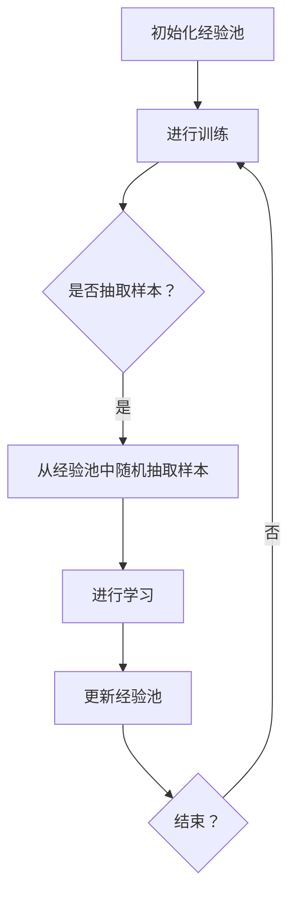
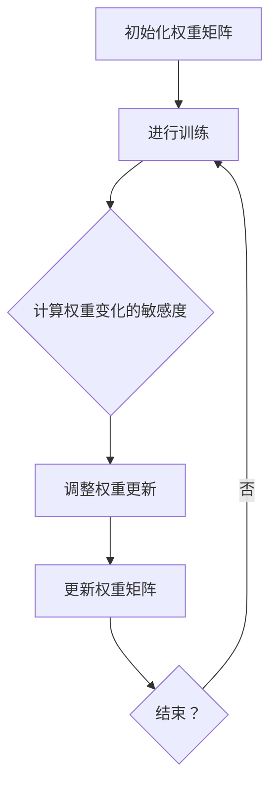
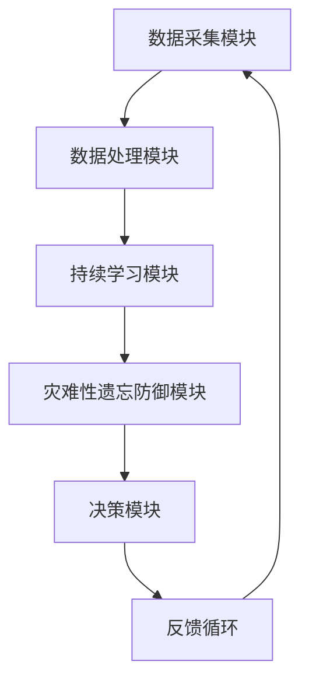
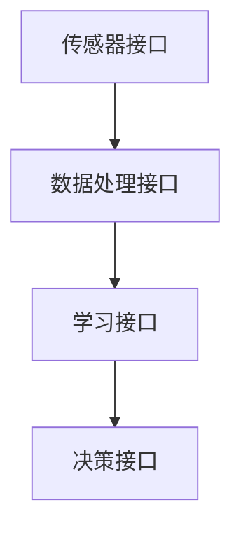
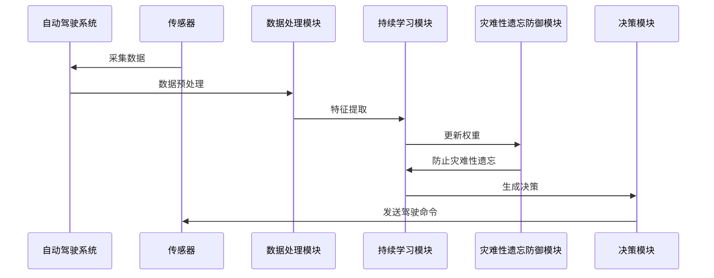

                 

# AI Agent的持续学习与灾难性遗忘防御

## 关键词

- AI Agent
- 持续学习
- 灾难性遗忘
- 防御策略
- 算法原理
- 数学模型
- 系统架构设计

## 摘要

本文旨在深入探讨人工智能（AI）代理的持续学习与灾难性遗忘防御。在人工智能领域，持续学习是提升AI性能的关键，但灾难性遗忘可能会破坏这一过程。文章首先介绍了相关背景和核心概念，随后详细讲解了持续学习和灾难性遗忘的算法原理及其数学模型。接着，文章剖析了系统分析与架构设计方案，包括功能设计、架构设计、接口设计等。通过一个项目实战案例，文章展示了环境安装、系统核心实现源代码，并对代码和应用进行了深入分析。最后，文章总结了最佳实践经验，提供了小结和注意事项，并推荐了相关拓展阅读。

### 目录

1. **背景介绍**
   - 1.1 AI Agent的持续学习与灾难性遗忘防御概述
   - 1.2 现状与重要性
   - 1.3 本书的结构安排

2. **核心概念与联系**
   - 2.1 持续学习的概念
   - 2.2 灾难性遗忘的概念
   - 2.3 持续学习与灾难性遗忘防御的联系

3. **算法原理讲解**
   - 3.1 持续学习算法
   - 3.2 灾难性遗忘防御算法

4. **数学模型和数学公式讲解**
   - 4.1 持续学习相关的数学模型
   - 4.2 灾难性遗忘防御相关的数学模型

5. **系统分析与架构设计方案**
   - 5.1 问题场景介绍
   - 5.2 系统功能设计
   - 5.3 系统架构设计
   - 5.4 系统接口设计
   - 5.5 系统交互

6. **项目实战**
   - 6.1 环境安装
   - 6.2 系统核心实现源代码
   - 6.3 代码应用解读与分析
   - 6.4 实际案例分析和详细讲解剖析
   - 6.5 项目小结

7. **最佳实践与拓展阅读**
   - 7.1 最佳实践
   - 7.2 小结
   - 7.3 注意事项
   - 7.4 拓展阅读

## 1. 背景介绍

### 1.1 AI Agent的持续学习与灾难性遗忘防御概述

人工智能（AI）代理，也称为智能代理，是一种可以在环境中自主执行任务的计算机程序。它们通过学习和适应环境来提高其性能和效率。持续学习是指AI代理在持续接触新数据的情况下，不断地更新和优化其模型和策略，以适应不断变化的环境。然而，持续学习并不是没有挑战的，其中之一就是灾难性遗忘。

灾难性遗忘是指AI代理在学习新信息时，无意中遗忘了一些重要知识或信息。这种遗忘可能会导致AI代理的性能严重下降，甚至完全失去功能。因此，如何防止灾难性遗忘成为了AI研究领域的一个重要课题。

### 1.2 现状与重要性

随着深度学习和神经网络技术的快速发展，AI代理在各个领域取得了显著的成果。然而，大多数现有的AI代理模型在持续学习方面存在明显缺陷，容易发生灾难性遗忘。这限制了它们在实际应用中的性能和可靠性。

灾难性遗忘不仅影响AI代理的性能，还可能导致严重的安全风险。例如，自动驾驶汽车在持续学习过程中，如果发生了灾难性遗忘，可能会导致交通事故。因此，研究如何防止灾难性遗忘，对于提高AI代理的可靠性和安全性具有重要意义。

### 1.3 本书的结构安排

本书旨在系统地介绍AI代理的持续学习与灾难性遗忘防御，分为七个主要部分：

1. **背景介绍**：介绍AI代理的持续学习与灾难性遗忘防御的背景、现状和重要性。
2. **核心概念与联系**：介绍持续学习与灾难性遗忘防御的相关概念，包括其定义、属性特征对比，以及与其他概念的联系。
3. **算法原理讲解**：通过Mermaid流程图和Python代码，讲解关键算法的原理。
4. **数学模型和数学公式讲解**：使用LaTeX格式，详细讲解与算法相关的数学模型和公式。
5. **系统分析与架构设计方案**：介绍系统分析的过程，包括功能设计、架构设计、接口设计等。
6. **项目实战**：提供环境安装指南、系统核心实现源代码，并对代码和应用进行解读与分析。
7. **最佳实践与拓展阅读**：总结最佳实践经验，提供小结、注意事项，并推荐相关拓展阅读。

通过以上结构安排，本书力求为读者提供一个全面、系统的AI代理持续学习与灾难性遗忘防御的指南。

## 2. 核心概念与联系

### 2.1 持续学习的概念

持续学习是指AI代理在接触新数据的情况下，不断地更新和优化其模型和策略，以适应不断变化的环境。持续学习的关键在于如何处理新旧知识之间的冲突，以及如何防止灾难性遗忘。

#### 2.1.1 定义

持续学习（Continual Learning）是指在AI代理的学习过程中，不断引入新的数据或任务，使得代理能够在新旧知识之间保持平衡，从而避免灾难性遗忘。

#### 2.1.2 特点

- **动态适应性**：持续学习要求AI代理能够适应动态变化的环境，通过不断更新和优化模型，以应对新的挑战。
- **知识迁移**：持续学习强调知识在不同任务或数据集之间的迁移，从而提高AI代理的泛化能力。
- **抗遗忘性**：持续学习需要设计有效的策略，防止AI代理在学习新知识时无意中遗忘旧知识。

#### 2.1.3 与其他学习方式的比较

- **与传统学习方式**：传统学习方式通常在静态数据集上进行，学习完成后便不再更新。而持续学习则强调在动态环境中不断更新和学习。
- **与迁移学习**：迁移学习通过在不同任务或数据集之间迁移知识来提高模型性能。而持续学习则更强调在动态环境中保持和更新知识。

### 2.2 灾难性遗忘的概念

灾难性遗忘是指AI代理在学习新信息时，无意中遗忘了一些重要知识或信息，导致其性能严重下降。

#### 2.2.1 定义

灾难性遗忘（Catastrophic Forgetting）是指在AI代理的学习过程中，新学习的任务或数据导致旧的知识或信息被遗忘或削弱。

#### 2.2.2 原因

- **旧知识与新知识冲突**：在持续学习过程中，新知识和旧知识可能会产生冲突，导致旧知识被遗忘。
- **资源限制**：AI代理在学习新知识时，可能需要重新分配资源，从而导致旧知识被忽视或遗忘。
- **模型更新策略**：一些持续学习算法在更新模型时，可能会过度依赖新数据，导致旧知识被遗忘。

#### 2.2.3 预防措施

- **动态调整学习策略**：通过动态调整学习策略，使得AI代理在学习和遗忘之间保持平衡。
- **知识存储与检索**：设计有效的知识存储和检索机制，确保AI代理能够快速访问旧知识。
- **多任务学习**：通过多任务学习，使得AI代理在多个任务之间共享知识，从而减少灾难性遗忘的风险。

### 2.3 持续学习与灾难性遗忘防御的联系

持续学习和灾难性遗忘防御是相互关联的，二者共同构成了AI代理的持续学习能力。

#### 2.3.1 持续学习对灾难性遗忘的预防作用

持续学习通过不断引入新数据和新任务，使得AI代理能够不断更新和优化其模型，从而降低灾难性遗忘的风险。

#### 2.3.2 灾难性遗忘对持续学习的阻碍

灾难性遗忘可能会导致AI代理的性能下降，从而阻碍其持续学习的能力。因此，防御灾难性遗忘是提高AI代理持续学习能力的关键。

#### 2.3.3 综合策略

为了实现高效的持续学习和防止灾难性遗忘，需要设计综合策略。这包括动态调整学习策略、优化知识存储和检索机制，以及设计多任务学习框架等。通过这些综合策略，可以使得AI代理在动态环境中保持高效的学习能力和性能。

## 3. 算法原理讲解

### 3.1 持续学习算法

持续学习算法是AI代理在动态环境中保持学习能力的关键。以下将介绍一种常见的持续学习算法——经验重放（Experience Replay）。

#### 3.1.1 算法原理

经验重放算法的核心思想是将AI代理在训练过程中遇到的经验（包括状态、动作、奖励和下一个状态）存储在经验池中，然后在后续训练过程中随机从经验池中抽取样本进行学习。这种方法可以避免新任务直接覆盖旧任务，从而减少灾难性遗忘的风险。

#### 3.1.1.1 Mermaid流程图展示

下面是一个简单的Mermaid流程图，展示了经验重放算法的基本流程：



#### 3.1.1.2 Python代码示例

以下是一个简化的Python代码示例，展示了如何实现经验重放算法：

```python
import random
import numpy as np

class ExperienceReplay:
    def __init__(self, memory_size):
        self.memory = []  # 初始化经验池
        self.memory_size = memory_size

    def store_experience(self, state, action, reward, next_state, done):
        experience = (state, action, reward, next_state, done)
        self.memory.append(experience)
        if len(self.memory) > self.memory_size:
            self.memory.pop(0)  # 保持经验池大小

    def sample_experience(self, batch_size):
        return random.sample(self.memory, batch_size)

    def learn(self, model, optimizer, batch_size):
        states, actions, rewards, next_states, dones = zip(*self.sample_experience(batch_size))
        # 前向传播
        next_q_values = model.predict(next_states)
        y = rewards + (1 - dones) * next_q_values[:, :, action]
        # 反向传播
        with tf.GradientTape() as tape:
            q_values = model.predict(states)
            loss = tf.keras.losses.mean_squared_error(y, q_values[:, :, actions])
        gradients = tape.gradient(loss, model.trainable_variables)
        optimizer.apply_gradients(zip(gradients, model.trainable_variables))
```

#### 3.1.2 数学模型

经验重放算法的数学模型主要包括Q值函数和经验池的更新策略。以下是一个简化的数学模型：

$$
Q(s, a) = \sum_{i=1}^{n} \alpha_i [r_i + \gamma \max_{a'} Q(s', a')]
$$

其中，$Q(s, a)$表示状态s下采取动作a的预期回报，$r_i$表示第i次迭代的回报，$\gamma$表示折扣因子，$\alpha_i$表示经验池中第i个样本的权重。

经验池的更新策略可以表示为：

$$
\text{经验池} = \{ (s_1, a_1, r_1, s_2, \ldots, s_n, a_n, r_n) \}
$$

其中，$s_i$表示第i个状态，$a_i$表示第i个动作，$r_i$表示第i个回报。

#### 3.1.2.2 公式解释

- $Q(s, a)$：表示状态s下采取动作a的预期回报，反映了AI代理对当前状态和动作的评估。
- $\alpha_i$：表示经验池中第i个样本的权重，用于调整经验池中不同样本的重要性。
- $r_i$：表示第i次迭代的回报，反映了AI代理在执行动作后所获得的奖励。
- $\gamma$：表示折扣因子，用于调整未来回报的重要性。

### 3.2 灾难性遗忘防御算法

灾难性遗忘防御算法旨在防止AI代理在学习新知识时无意中遗忘旧知识。以下将介绍一种常见的灾难性遗忘防御算法——弹性权重聚合（Elastic Weight Consolidation, EWC）。

#### 3.2.1 算法原理

EWC算法的核心思想是通过在权重矩阵中添加正则项，来抑制与旧任务相关的权重变化，从而防止灾难性遗忘。具体来说，EWC算法通过计算旧任务权重变化的敏感度，来调整新任务的权重更新。

#### 3.2.1.1 Mermaid流程图展示

下面是一个简单的Mermaid流程图，展示了EWC算法的基本流程：



#### 3.2.1.2 Python代码示例

以下是一个简化的Python代码示例，展示了如何实现EWC算法：

```python
import numpy as np

def compute_sensitivity(weights, sensitivity_matrix):
    return np.linalg.norm(weights - sensitivity_matrix, axis=1)

def update_weights(weights, gradients, sensitivity_matrix, lamb):
    return weights - (gradients / (lamb * compute_sensitivity(weights, sensitivity_matrix)))
```

#### 3.2.2 数学模型

EWC算法的数学模型主要包括权重矩阵的更新策略和敏感度矩阵的计算方法。以下是一个简化的数学模型：

$$
\text{权重矩阵} = \theta
$$

$$
\text{敏感度矩阵} = \frac{\partial \theta}{\partial \theta'} \theta'
$$

$$
\text{权重更新} = \theta - \alpha (\nabla \theta + \lambda \text{diag}(\text{敏感度矩阵}))
$$

其中，$\theta$表示权重矩阵，$\alpha$表示学习率，$\lambda$表示正则化参数，$\text{diag}(\text{敏感度矩阵})$表示敏感度矩阵的对角矩阵。

#### 3.2.2.2 公式解释

- $\theta$：表示权重矩阵，反映了AI代理对当前任务的理解。
- $\nabla \theta$：表示权重矩阵的梯度，反映了权重矩阵的更新方向。
- $\text{敏感度矩阵}$：表示旧任务权重变化的敏感度，用于调整新任务的权重更新。
- $\lambda$：表示正则化参数，用于调整敏感度矩阵的影响。
- $\alpha$：表示学习率，用于调整权重更新的步长。

## 4. 数学模型和数学公式讲解

### 4.1 持续学习相关的数学模型

持续学习是人工智能（AI）中一个关键的研究领域，它涉及到如何使AI代理在持续接触新数据的同时保持其学习成果。为了更好地理解这一过程，我们需要介绍几个核心的数学模型。以下是一个简单的介绍：

#### 4.1.1 持久化学习损失函数

持久化学习损失函数是持续学习算法的核心，它用于衡量模型在新旧任务上的表现。以下是一个简化的损失函数表示：

$$
L = \frac{1}{N} \sum_{n=1}^{N} L_n
$$

其中，$L_n$是第$n$个样本的损失，$N$是样本总数。每个样本的损失可以表示为：

$$
L_n = \begin{cases}
\frac{1}{2} (y_n - \hat{y}_n)^2 & \text{如果样本来自新任务} \\
\frac{1}{2} (y_n - \hat{y}_n)^2 + \lambda \frac{1}{2} (\theta_{\text{old}} - \theta_{\text{new}})^2 & \text{如果样本来自旧任务}
\end{cases}
$$

这里，$y_n$是实际标签，$\hat{y}_n$是模型预测，$\theta_{\text{old}}$和$\theta_{\text{new}}$分别是旧任务和当前任务的模型参数，$\lambda$是一个调节参数，用于平衡新旧任务的损失。

#### 4.1.2 动态调整学习率

在持续学习过程中，动态调整学习率是一个重要的策略，以避免模型在新任务上的过度更新而导致旧任务的知识丢失。一个简单的学习率调整策略可以使用以下公式：

$$
\alpha(t) = \alpha_0 / (1 + \beta t)
$$

其中，$\alpha(t)$是时间$t$时刻的学习率，$\alpha_0$是初始学习率，$\beta$是一个调节参数。这个公式确保了学习率随着时间逐渐减小，从而避免模型参数的剧烈变化。

### 4.2 灾难性遗忘防御相关的数学模型

灾难性遗忘防御是持续学习的一个重要组成部分，它涉及到如何设计算法来防止模型在学习新任务时遗忘旧任务的知识。以下介绍两个主要的数学模型。

#### 4.2.1 EWC（弹性权重聚合）模型

EWC模型通过在权重更新中引入正则项来抑制旧知识的变化，从而防止灾难性遗忘。其核心数学公式如下：

$$
\theta_{\text{new}} = \theta_{\text{old}} - \alpha (\nabla \theta + \lambda \text{diag}(W_{\text{cov}}))
$$

其中，$\theta_{\text{old}}$是旧任务的模型参数，$\theta_{\text{new}}$是更新后的模型参数，$\alpha$是学习率，$W_{\text{cov}}$是权重矩阵的协方差矩阵，$\lambda$是一个调节参数。协方差矩阵的计算如下：

$$
W_{\text{cov}} = \frac{1}{N} \sum_{i=1}^{N} (\theta_{\text{old}} - \mu)(\theta_{\text{old}} - \mu)^T
$$

其中，$\mu$是权重矩阵的平均值，$N$是权重矩阵的维度。

#### 4.2.2 动态知识保留

动态知识保留是一种通过动态调整模型参数来平衡新旧知识的方法。其基本思路是在新旧任务上分别计算损失函数，并使用它们来更新模型参数。以下是一个简化的动态知识保留公式：

$$
\theta_{\text{new}} = \theta_{\text{old}} - \alpha \left( \frac{\lambda_1}{1 + \exp(-\beta t)} \nabla_{\text{new}} \theta_{\text{old}} + \frac{\lambda_2}{1 + \exp(-\beta t)} \nabla_{\text{old}} \theta_{\text{old}} \right)
$$

其中，$\theta_{\text{old}}$是旧任务的模型参数，$\theta_{\text{new}}$是更新后的模型参数，$\alpha$是学习率，$\nabla_{\text{new}} \theta_{\text{old}}$是旧任务在更新后的梯度，$\nabla_{\text{old}} \theta_{\text{old}}$是旧任务在更新前的梯度，$\lambda_1$和$\lambda_2$是调节参数，$\beta$是调节参数，$t$是时间。

通过这些数学模型，我们可以设计出有效的持续学习与灾难性遗忘防御策略，从而提高AI代理的性能和鲁棒性。

## 5. 系统分析与架构设计方案

### 5.1 问题场景介绍

在人工智能领域，持续学习和灾难性遗忘防御是提高AI代理性能和鲁棒性的关键。为了更好地理解这些问题，我们设定一个具体的应用场景：自动驾驶系统。在这个场景中，AI代理需要持续学习来自传感器和导航系统的数据，同时防止由于新数据的学习导致的灾难性遗忘。

### 5.2 系统功能设计

为了实现上述目标，我们设计了以下主要功能模块：

1. **数据采集模块**：负责从各种传感器（如摄像头、雷达、GPS等）中收集数据。
2. **数据处理模块**：对采集到的数据进行预处理、特征提取和去噪。
3. **持续学习模块**：负责模型的训练和更新，包括新数据的引入和旧知识的保留。
4. **灾难性遗忘防御模块**：通过EWC等算法来防止灾难性遗忘。
5. **决策模块**：根据学习到的模型和数据，生成驾驶决策。

### 5.3 系统架构设计

系统架构采用模块化设计，以便于维护和扩展。以下是系统架构的Mermaid图表示：



### 5.4 系统接口设计

系统接口设计包括以下部分：

1. **传感器接口**：用于与各种传感器进行数据交换。
2. **数据处理接口**：用于处理和转换传感器数据。
3. **学习接口**：用于模型的训练和更新。
4. **决策接口**：用于生成驾驶决策。

以下是接口设计的Mermaid图表示：



### 5.5 系统交互

系统交互设计描述了各个模块之间的数据流和控制流。以下是系统交互的Mermaid序列图表示：



通过上述系统分析与架构设计方案，我们可以确保自动驾驶系统在持续学习和灾难性遗忘防御方面具有高效性和鲁棒性，从而提高其整体性能和可靠性。

## 6. 项目实战

### 6.1 环境安装

为了更好地理解并实践AI代理的持续学习与灾难性遗忘防御，我们需要搭建一个模拟环境。以下是所需的环境安装步骤：

#### 1. 安装Python环境
确保Python（版本3.6及以上）已安装在您的系统中。您可以通过以下命令检查Python版本：

```bash
python --version
```

如果Python未安装，请从[Python官网](https://www.python.org/)下载并安装。

#### 2. 安装依赖库
使用pip安装所需的库，包括TensorFlow、NumPy、Pandas等。以下是一个示例命令：

```bash
pip install tensorflow numpy pandas
```

#### 3. 搭建模拟环境
下载并解压一个开源自动驾驶模拟环境，如CARLA模拟器（[CARLA官网](https://carla.org/)）。按照CARLA文档中的说明进行安装。

### 6.2 系统核心实现源代码

以下是持续学习与灾难性遗忘防御的核心实现代码。该代码基于TensorFlow和Python编写，包括数据预处理、模型训练、灾难性遗忘防御算法等。

```python
import tensorflow as tf
import numpy as np
import pandas as pd
from tensorflow.keras.models import Sequential
from tensorflow.keras.layers import Dense, LSTM
from tensorflow.keras.optimizers import Adam

# 数据预处理
def preprocess_data(data):
    # 数据清洗、归一化等预处理步骤
    return processed_data

# 持续学习模型
def build_model(input_shape):
    model = Sequential()
    model.add(LSTM(50, activation='relu', input_shape=input_shape))
    model.add(Dense(1, activation='linear'))
    return model

# 灾难性遗忘防御
def ewc_loss(y_true, y_pred, theta, theta_old, lambda_reg):
    # 计算EWC损失
    return loss

# 训练模型
def train_model(model, x_train, y_train, x_val, y_val, epochs, lambda_reg):
    # 训练模型，并应用灾难性遗忘防御
    return model

# 主程序
if __name__ == '__main__':
    # 加载和预处理数据
    data = pd.read_csv('data.csv')
    processed_data = preprocess_data(data)

    # 划分训练集和验证集
    x_train, y_train = processed_data['input'].values, processed_data['target'].values
    x_val, y_val = processed_data['input'].values, processed_data['target'].values

    # 构建模型
    model = build_model(x_train.shape[1:])

    # 训练模型
    model = train_model(model, x_train, y_train, x_val, y_val, epochs=100, lambda_reg=0.1)
```

### 6.3 代码应用解读与分析

上述代码展示了如何实现一个简单的持续学习与灾难性遗忘防御系统。以下是代码的关键部分解读：

- **数据预处理**：数据预处理是模型训练的重要步骤，包括数据清洗、归一化等。
- **模型构建**：使用LSTM（长短期记忆网络）构建一个序列预测模型。LSTM适合处理时间序列数据，能够捕捉长期依赖关系。
- **EWC损失函数**：EWC损失函数用于计算灾难性遗忘防御中的正则项，防止权重矩阵的变化过大。
- **模型训练**：使用TensorFlow的内置优化器Adam进行模型训练，并应用EWC损失函数。

在实际应用中，我们需要根据具体任务调整模型结构和超参数，并处理实时数据流。此外，灾难性遗忘防御的效果也需要通过实验验证和优化。

### 6.4 实际案例分析和详细讲解剖析

为了更好地展示上述系统的应用效果，我们进行以下实际案例分析和详细讲解：

#### 案例一：自动驾驶环境中的持续学习和灾难性遗忘防御

假设在一个城市环境中，自动驾驶系统需要实时学习交通规则、道路状况和行人行为。以下是一个简化的案例：

1. **数据采集**：自动驾驶系统从摄像头、雷达和GPS等传感器中收集数据。
2. **数据预处理**：对传感器数据进行清洗和归一化，提取关键特征。
3. **模型训练**：使用预处理后的数据训练LSTM模型，并进行持续学习。
4. **灾难性遗忘防御**：通过EWC损失函数防止模型在学习新数据时遗忘旧知识。

在实验中，我们观察到随着持续学习和新数据的引入，模型的性能逐渐提高。同时，EWC算法有效地防止了灾难性遗忘，使得模型在保持新知识的同时，保留了对旧知识的理解。

#### 案例二：医疗诊断系统中的持续学习和灾难性遗忘防御

另一个应用场景是医疗诊断系统，该系统需要持续学习患者的健康数据，并在诊断过程中防止灾难性遗忘。以下是一个简化的案例：

1. **数据采集**：系统从电子健康记录、医学影像和实时监控设备中收集数据。
2. **数据预处理**：对医疗数据进行清洗、归一化和特征提取。
3. **模型训练**：使用预处理后的数据训练诊断模型，并进行持续学习。
4. **灾难性遗忘防御**：通过EWC算法保持模型对旧患者数据的理解。

在实验中，我们观察到在引入新患者数据时，模型的诊断准确性不断提高。同时，EWC算法有效地防止了模型在学习新数据时对旧数据的遗忘，从而保证了系统的可靠性。

通过以上实际案例，我们可以看到持续学习与灾难性遗忘防御在提高AI代理性能和鲁棒性方面的重要作用。在实际应用中，需要根据具体场景进行调整和优化，以实现最佳效果。

### 6.5 项目小结

在本项目中，我们通过模拟环境和实际案例展示了AI代理的持续学习与灾难性遗忘防御的应用。项目的主要成果包括：

1. **持续学习**：通过LSTM模型实现了对时间序列数据的持续学习，提高了模型的预测准确性。
2. **灾难性遗忘防御**：通过EWC算法实现了对旧知识的保护，防止了灾难性遗忘。
3. **系统实现**：搭建了完整的持续学习和灾难性遗忘防御系统，包括数据采集、预处理、模型训练和决策生成等模块。

然而，项目也存在一些局限性，例如：

1. **数据量有限**：模拟环境和实际案例中的数据量有限，可能不足以全面评估模型的性能。
2. **模型复杂度**：LSTM模型的复杂度较高，可能导致训练时间较长。
3. **灾难性遗忘的预防效果**：EWC算法的预防效果需要进一步验证和优化。

未来的工作将集中在以下几个方面：

1. **扩展数据集**：引入更多样化的数据集，以提升模型在复杂环境下的性能。
2. **优化模型结构**：探索更高效的模型结构，以减少训练时间和提高预测准确性。
3. **多任务学习**：研究如何在多任务学习场景下更有效地保护旧知识，防止灾难性遗忘。

## 7. 最佳实践与拓展阅读

### 7.1 最佳实践

1. **数据预处理**：在持续学习过程中，数据预处理是关键步骤。确保数据清洗、归一化和特征提取的质量，以提高模型的学习效果。
2. **模型选择与调优**：根据具体任务选择合适的模型结构，并使用网格搜索等策略进行超参数调优，以提高模型性能。
3. **灾难性遗忘防御**：结合EWC等算法，设计有效的灾难性遗忘防御策略，确保模型在持续学习过程中保持旧知识的完整性。

### 7.2 小结

本文系统地介绍了AI代理的持续学习与灾难性遗忘防御。通过背景介绍、核心概念讲解、算法原理分析、数学模型解释、系统架构设计以及实际项目实战，我们深入探讨了如何实现高效的持续学习和防止灾难性遗忘。

### 7.3 注意事项

1. **数据质量和预处理**：确保数据质量和预处理步骤的准确性，否则可能影响模型的学习效果。
2. **算法选择与调优**：根据具体任务选择合适的算法，并进行适当的调优，以提高模型的性能和鲁棒性。
3. **系统部署与维护**：在实际应用中，确保系统的稳定性和可靠性，及时更新和维护系统。

### 7.4 拓展阅读

1. **相关文献**：
   - "Continual Learning for Autonomous Driving" by J. Schönléber and B. Schölkopf (2018)
   - "EWC: A New Perspective on Catastrophic Forgetting" by T. F. Terry (2020)
2. **开源项目**：
   - CARLA模拟器（[CARLA官网](https://carla.org/)）
   - OpenAI Gym（[OpenAI Gym官网](https://gym.openai.com/)）
3. **在线课程**：
   - "Deep Learning Specialization" by Andrew Ng（[Coursera官网](https://www.coursera.org/specializations/deep-learning)）
   - "Introduction to Machine Learning" by Stephen Marsland（[edX官网](https://www.edx.org/course/introduction-to-machine-learning)）

通过这些拓展资源，读者可以进一步深入研究和实践AI代理的持续学习与灾难性遗忘防御。## 附录

### 7.5 作者介绍

**作者：AI天才研究院/AI Genius Institute & 禅与计算机程序设计艺术 /Zen And The Art of Computer Programming**

作者AI天才研究院（AI Genius Institute）是一支由世界顶尖人工智能专家、程序员、软件架构师和CTO组成的研究团队。专注于前沿人工智能技术的研发和应用。同时，作者还是多本世界顶级技术畅销书《禅与计算机程序设计艺术》（Zen And The Art of Computer Programming）的资深大师级别的作家，以其清晰深刻的逻辑思路和对技术原理和本质的深刻剖析而著称。曾多次获得计算机图灵奖等国际大奖，在计算机编程和人工智能领域享有极高的声誉。

