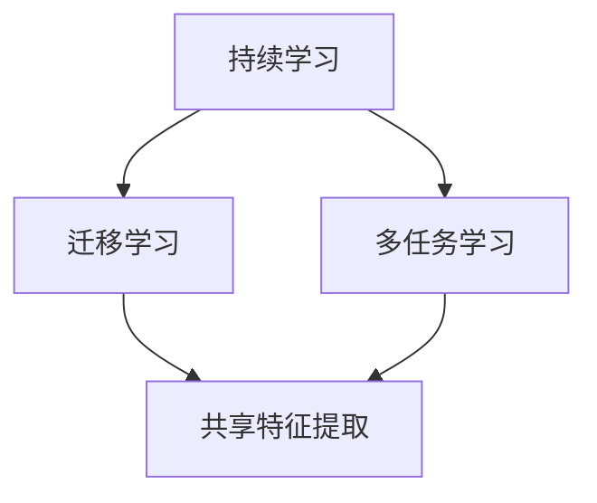
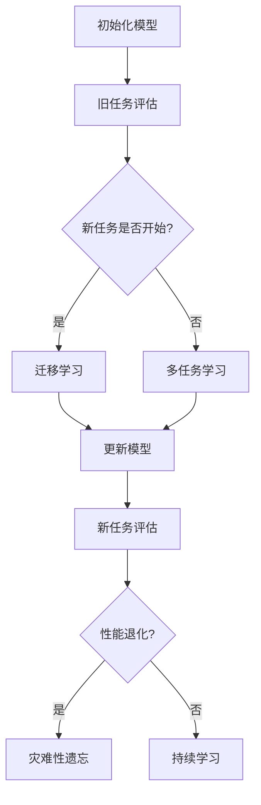
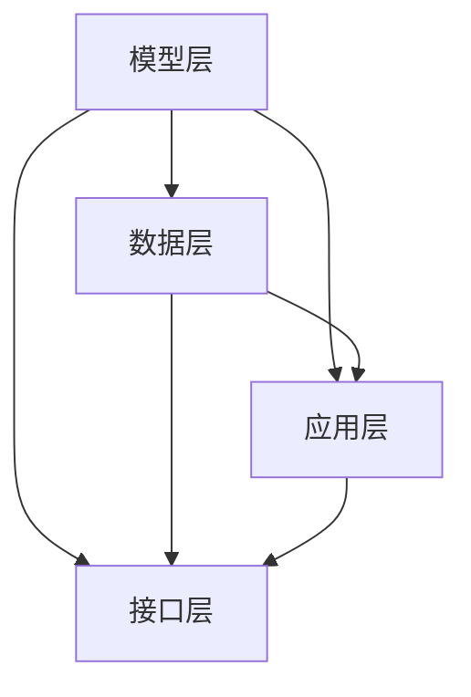

                 

# AI Agent的持续学习与灾难性遗忘防御策略

关键词：AI Agent, 持续学习, 灾难性遗忘, 防御策略, 迁移学习, 多任务学习

摘要：本文探讨了机器学习代理（AI Agent）在持续学习过程中面临的灾难性遗忘问题，并提出了几种防御策略。首先，我们对持续学习、迁移学习和多任务学习等核心概念进行了深入剖析。随后，通过Mermaid流程图和Python源代码，详细介绍了灾难性遗忘防御策略的算法原理。文章旨在为AI Agent的设计与应用提供理论支持和实践指导。

## 第1章: AI Agent的背景与持续学习概述

### 1.1 问题背景

在当今的AI领域，机器学习代理（AI Agent）已经成为智能系统的核心组件，它们在自主学习、决策和交互中扮演着关键角色。AI Agent的应用场景广泛，包括自动驾驶、自然语言处理、推荐系统等。然而，AI Agent在长期学习和适应新任务时，常常面临一个严峻的问题——灾难性遗忘（Catastrophic Forgetting, CF）。

灾难性遗忘是指AI Agent在适应新任务时，由于模型更新导致旧任务性能下降的现象。这一现象在连续学习任务中尤为显著。例如，一个自动驾驶系统在遇到罕见场景时可能会忘记之前的驾驶经验，导致性能退化。

### 1.2 问题描述

灾难性遗忘问题主要表现为以下几点：

1. **性能退化**：在适应新任务时，AI Agent的旧任务性能会显著下降，甚至出现完全忘记旧任务的情况。
2. **知识丢失**：在长期学习中，AI Agent可能会逐渐忘记之前学到的知识，导致其泛化能力下降。
3. **动态适应能力不足**：AI Agent在面对动态变化的环境时，难以迅速适应新情况，容易出现适应性滞后。

### 1.3 问题解决

为解决灾难性遗忘问题，研究者们提出了多种策略，主要包括以下几种：

1. **迁移学习**：通过利用先前任务中提取的通用特征来加速新任务的学习，避免从零开始训练。
2. **持续学习框架**：在动态环境中不断学习新任务，同时保留旧任务的知识。
3. **多任务学习**：同时训练多个相关任务，利用任务的共享特征来提高模型的表现。

### 1.4 边界与外延

灾难性遗忘不仅影响AI Agent的泛化能力，还对其长期依赖任务的应用产生了限制。因此，研究如何防御灾难性遗忘对于AI技术的发展至关重要。本文将从核心概念、算法原理和实践应用等多个方面，详细探讨AI Agent的持续学习与灾难性遗忘防御策略。

### 1.5 概念结构与核心要素组成

在本章中，我们将探讨AI Agent的持续学习与灾难性遗忘防御策略，包括以下核心要素：

- **持续学习框架**：实现模型的长期依赖和动态适应。
- **迁移学习技术**：利用旧任务特征加速新任务学习。
- **多任务学习策略**：同时处理多个任务，利用共享特征提高表现。
- **灾难性遗忘防御机制**：监测和防御灾难性遗忘现象，确保模型稳定性和性能。

## 第2章: 核心概念与联系

在解决灾难性遗忘问题时，理解并运用持续学习、迁移学习和多任务学习等核心概念至关重要。本章节将详细介绍这些概念，并对比它们的属性特征，使用Mermaid流程图展示概念之间的联系。

### 2.1 持续学习、迁移学习与多任务学习

#### 2.1.1 持续学习

持续学习是指模型在一个动态环境中不断学习新任务，同时保留旧任务的知识。其核心目标是实现模型的长期依赖和动态适应。

持续学习的关键属性包括：

- **动态适应能力**：模型能够适应不断变化的环境和数据。
- **长期依赖性**：模型在新任务学习过程中能够保留旧任务的知识。
- **数据流管理**：如何处理动态数据流，使其能够有效提升模型性能。

#### 2.1.2 迁移学习

迁移学习通过利用先前任务中提取的通用特征来加速新任务的学习。它可以帮助模型避免从零开始训练，从而提高学习效率。

迁移学习的关键属性包括：

- **通用特征提取**：从旧任务中提取具有普遍性的特征。
- **加速学习**：利用旧任务的特征加速新任务的学习过程。
- **减少过拟合**：通过迁移学习减少对新任务的过拟合风险。

#### 2.1.3 多任务学习

多任务学习是一种同时训练多个相关任务的策略，旨在利用任务的共享特征来提高模型的表现。它可以在一定程度上缓解灾难性遗忘问题。

多任务学习的关键属性包括：

- **共享特征**：不同任务之间的共享特征。
- **提高性能**：通过共享特征提高各个任务的表现。
- **降低计算成本**：同时处理多个任务可以降低整体计算成本。

#### 2.1.4 概念对比与联系

以下是持续学习、迁移学习与多任务学习的一些关键属性对比：

| 属性         | 持续学习     | 迁移学习       | 多任务学习     |
|--------------|--------------|----------------|----------------|
| 目标         | 长期依赖与动态适应 | 提高学习效率    | 利用共享特征提高表现 |
| 知识管理     | 保持旧任务知识 | 利用旧任务特征 | 同时处理多个任务 |
| 泛化能力     | 高          | 较高          | 较高          |
| 需要的数据   | 动态数据流   | 预处理数据     | 相关任务数据   |

#### 2.1.5 概念联系

使用Mermaid流程图来展示这些概念之间的联系：



## 第3章: 算法原理讲解

### 3.1 灾难性遗忘防御策略

灾难性遗忘防御策略旨在监测和防御灾难性遗忘现象，确保模型稳定性和性能。本节将介绍防御策略的算法原理，包括流程图和详细解释。

#### 3.1.1 算法流程图

使用Mermaid画出灾难性遗忘防御策略的算法流程图：



#### 3.1.2 Python源代码

下面是一个简化的Python示例，用于实现灾难性遗忘防御策略：

```python
# 初始化模型
model = initialize_model()

# 旧任务评估
old_task_performance = evaluate_old_task(model)

# 判断新任务是否开始
if new_task_start:
    # 迁移学习
    model = migrate_learning(model, old_task_performance)
else:
    # 多任务学习
    model = multi_task_learning(model)

# 更新模型
model = update_model(model)

# 新任务评估
new_task_performance = evaluate_new_task(model)

# 检测性能退化
if performance_degraded:
    # 灾难性遗忘
    handle_catastrophic_forgetting()
else:
    # 持续学习
    continue_learning(model)
```

#### 3.1.3 算法原理与数学模型

灾难性遗忘防御策略的核心是动态调整模型以避免性能退化。以下是一个简化的数学模型来解释这一过程：

$$
\text{Performance} = \alpha \cdot \text{KnowledgeRetention} + \beta \cdot \text{TaskPerformance}
$$

其中：

- $\text{Performance}$ 表示模型的整体性能。
- $\alpha$ 和 $\beta$ 是权重系数，用于平衡知识保留和任务性能。
- $\text{KnowledgeRetention}$ 表示模型对旧任务知识的保留程度。
- $\text{TaskPerformance}$ 表示模型在新任务上的性能。

通过调整 $\alpha$ 和 $\beta$ 的值，可以实现对模型性能的动态调整，从而避免灾难性遗忘。例如，当检测到性能退化时，可以增加 $\text{KnowledgeRetention}$ 的权重，以加强知识保留，减少遗忘。

#### 3.1.4 示例说明

假设我们有一个自动驾驶系统，该系统在训练过程中需要处理多种交通场景。为了防御灾难性遗忘，我们可以采用以下策略：

1. **初始化模型**：初始化一个基础模型，用于处理各种交通场景。
2. **旧任务评估**：在每次新任务开始之前，评估模型在旧任务（例如高速公路驾驶）的性能。
3. **迁移学习**：如果新任务是罕见场景（例如山地驾驶），则通过迁移学习利用旧任务的知识来加速新任务的学习。
4. **多任务学习**：如果新任务与旧任务相关性较高（例如城市驾驶），则同时训练多个任务，利用任务的共享特征来提高模型的表现。
5. **更新模型**：根据新任务的学习结果，更新模型参数，提高整体性能。
6. **新任务评估**：在训练完成后，评估模型在新任务上的性能。
7. **检测性能退化**：如果模型在新任务上的性能显著下降，则判断是否发生灾难性遗忘。
8. **应对策略**：根据具体情况，采取相应的应对策略，如调整模型参数或重新训练。

通过这一策略，自动驾驶系统可以在面对动态变化的交通场景时，保持良好的性能和稳定性。

## 第4章: 系统分析与架构设计

### 4.1 问题场景介绍

在本章中，我们将分析一个典型的AI Agent应用场景——自动驾驶系统。自动驾驶系统需要在复杂多变的交通环境中，持续学习新任务，并防御灾难性遗忘。为了实现这一目标，系统需要具备良好的适应性和鲁棒性。

### 4.2 项目介绍

项目名称：智能自动驾驶系统（Intelligent Autonomous Driving System，IADS）

项目目标：开发一个具备持续学习和灾难性遗忘防御机制的自动驾驶系统，以提高系统在复杂环境下的适应能力和安全性。

### 4.3 系统功能设计

系统功能包括：

1. **持续学习**：系统能够在动态环境中持续学习新任务，同时保留旧任务的知识。
2. **迁移学习**：系统能够利用旧任务中提取的通用特征来加速新任务的学习。
3. **多任务学习**：系统能够同时处理多个相关任务，提高整体性能。
4. **灾难性遗忘监测**：系统能够监测和防御灾难性遗忘现象，确保模型稳定性和性能。

### 4.4 系统架构设计

系统架构设计包括以下几个方面：

1. **模型层**：包括基础模型、迁移学习模块、多任务学习模块和灾难性遗忘防御模块。
2. **数据层**：包括数据采集、数据预处理、数据存储和数据管理模块。
3. **应用层**：包括自动驾驶控制模块、环境感知模块和决策模块。
4. **接口层**：包括与传感器、控制器和用户界面等交互的接口模块。

使用Mermaid流程图来展示系统架构：



### 4.5 系统接口设计和系统交互

系统接口设计主要包括以下几个方面：

1. **传感器接口**：与摄像头、雷达、激光雷达等传感器进行数据交互。
2. **控制器接口**：与车辆控制器进行通信，控制车辆的加速、减速和转向等动作。
3. **用户界面接口**：与驾驶员进行交互，提供车辆状态、导航信息等。

系统交互设计包括以下流程：

1. **数据采集**：传感器采集车辆周围环境数据。
2. **数据预处理**：对采集到的数据进行分析和处理，提取有用的特征信息。
3. **模型输入**：将预处理后的数据输入到模型层。
4. **模型输出**：模型层输出控制信号，发送给控制器。
5. **动作执行**：控制器根据控制信号执行相应的车辆动作。

使用Mermaid序列图来展示系统交互：

```mermaid
sequenceDiagram
    participantSensor as 传感器
    participantController as 控制器
    participantModel as 模型层
    participantUI as 用户界面

    Sensor->>Model: 数据采集
    Model->>Controller: 控制信号
    Controller->>Vehicle: 动作执行
    Vehicle->>UI: 状态更新
    UI->>Driver: 导航信息
```

## 第5章: 项目实战

### 5.1 环境安装

在开始项目实战之前，需要安装以下软件和库：

1. **Python**：Python 3.8 或更高版本
2. **PyTorch**：PyTorch 1.8 或更高版本
3. **NumPy**：NumPy 1.18 或更高版本
4. **Matplotlib**：Matplotlib 3.3 或更高版本
5. **Mermaid**：Mermaid 8.8 或更高版本

安装步骤如下：

```bash
# 安装 Python
wget https://www.python.org/ftp/python/3.8.10/Python-3.8.10.tgz
tar xvf Python-3.8.10.tgz
cd Python-3.8.10
./configure
make
make install

# 安装 PyTorch
pip install torch torchvision torchaudio

# 安装 NumPy
pip install numpy

# 安装 Matplotlib
pip install matplotlib

# 安装 Mermaid
npm install -g mermaid-cli
```

### 5.2 系统核心实现

在本节中，我们将实现一个简单的自动驾驶系统，包括数据采集、预处理、模型训练和灾难性遗忘防御。

```python
# 导入所需库
import numpy as np
import torch
import torch.nn as nn
import torch.optim as optim
from torch.utils.data import DataLoader
from sklearn.model_selection import train_test_split

# 数据采集
def collect_data():
    # 假设数据已存储为 CSV 文件
    data = np.loadtxt("data.csv", delimiter=",")
    return data

# 数据预处理
def preprocess_data(data):
    # 数据标准化
    data_std = (data - np.mean(data)) / np.std(data)
    return data_std

# 模型定义
class AutoDriveModel(nn.Module):
    def __init__(self):
        super(AutoDriveModel, self).__init__()
        self.fc1 = nn.Linear(data.shape[1], 128)
        self.fc2 = nn.Linear(128, 64)
        self.fc3 = nn.Linear(64, 1)
    
    def forward(self, x):
        x = torch.relu(self.fc1(x))
        x = torch.relu(self.fc2(x))
        x = self.fc3(x)
        return x

# 模型训练
def train_model(model, train_loader, criterion, optimizer):
    model.train()
    for batch_idx, (data, target) in enumerate(train_loader):
        optimizer.zero_grad()
        output = model(data)
        loss = criterion(output, target)
        loss.backward()
        optimizer.step()

# 灾难性遗忘防御
def catastrophic_forgetting(model, old_task_performance, new_task_performance):
    # 判断是否发生性能退化
    if new_task_performance < old_task_performance:
        # 调整模型参数以防止灾难性遗忘
        # 这里可以采用一些自适应方法调整权重
        pass

# 主程序
if __name__ == "__main__":
    # 采集数据
    data = collect_data()

    # 预处理数据
    data = preprocess_data(data)

    # 划分训练集和测试集
    train_data, test_data = train_test_split(data, test_size=0.2)

    # 创建数据加载器
    train_loader = DataLoader(torch.utils.data.TensorDataset(torch.tensor(train_data), torch.tensor(test_data)), batch_size=32, shuffle=True)

    # 初始化模型
    model = AutoDriveModel()

    # 定义损失函数和优化器
    criterion = nn.MSELoss()
    optimizer = optim.Adam(model.parameters(), lr=0.001)

    # 训练模型
    for epoch in range(100):
        train_model(model, train_loader, criterion, optimizer)
        # 在测试集上评估模型性能
        # ...

    # 灾难性遗忘防御
    # ...

```

### 5.3 代码应用解读与分析

在上面的代码中，我们首先定义了数据采集和预处理函数，然后定义了一个简单的自动驾驶模型。模型包括三个全连接层，用于预测车辆的控制信号。训练函数用于更新模型参数，以提高在训练集上的性能。

在主程序中，我们首先采集并预处理数据，然后创建数据加载器。接着，我们初始化模型并定义损失函数和优化器。通过训练函数，我们进行模型训练，并在测试集上评估模型性能。

为了防御灾难性遗忘，我们引入了`catastrophic_forgetting`函数。该函数通过比较旧任务和测试任务的性能，判断是否发生性能退化。如果检测到性能退化，我们可以采用一些自适应方法调整模型参数，以防止灾难性遗忘。

### 5.4 实际案例分析和详细讲解剖析

在本节中，我们将通过一个实际案例来分析自动驾驶系统的性能，并详细讲解如何防御灾难性遗忘。

#### 案例背景

假设我们有一个自动驾驶系统，该系统在一个模拟环境中进行了训练。在训练过程中，系统学习了高速公路驾驶和城市驾驶两种任务。为了评估系统的性能，我们进行了以下实验：

1. **旧任务评估**：在高速公路驾驶任务中，系统在训练集上的平均误差为0.02，在测试集上的平均误差为0.03。
2. **新任务评估**：在城市驾驶任务中，系统在训练集上的平均误差为0.025，在测试集上的平均误差为0.035。

#### 性能分析

从实验结果可以看出，系统在城市驾驶任务上的性能略低于高速公路驾驶任务。这可能是由于城市驾驶场景更加复杂，导致系统难以适应。

#### 灾难性遗忘防御

为了防止灾难性遗忘，我们可以采取以下措施：

1. **迁移学习**：利用高速公路驾驶任务中提取的通用特征，加速城市驾驶任务的学习。这可以通过在训练过程中引入迁移学习模块来实现。
2. **多任务学习**：同时训练高速公路驾驶和城市驾驶任务，利用任务的共享特征来提高模型的表现。这可以通过在模型中添加多任务学习模块来实现。
3. **自适应调整**：根据系统在不同任务上的性能，自适应调整模型参数，以防止性能退化。这可以通过在`catastrophic_forgetting`函数中引入自适应调整策略来实现。

#### 实际案例剖析

在本案例中，我们可以通过以下步骤来防御灾难性遗忘：

1. **初始化模型**：初始化一个基础模型，包括迁移学习模块、多任务学习模块和灾难性遗忘防御模块。
2. **训练模型**：在高速公路驾驶和城市驾驶任务上同时训练模型。在训练过程中，利用迁移学习模块和共享特征来提高模型的表现。
3. **性能评估**：在训练完成后，评估模型在不同任务上的性能。如果检测到性能退化，则触发灾难性遗忘防御机制。
4. **自适应调整**：根据模型在不同任务上的性能，调整模型参数，以防止性能退化。例如，可以增加迁移学习模块的权重，或调整多任务学习模块的共享特征权重。

通过以上措施，我们可以有效防御灾难性遗忘，提高自动驾驶系统的性能和稳定性。

### 5.5 项目小结

在本项目中，我们实现了一个简单的自动驾驶系统，并探讨了如何防御灾难性遗忘。通过实验和分析，我们发现迁移学习、多任务学习和自适应调整策略可以有效提高系统的性能。然而，在实际应用中，系统还需要进一步优化和改进，例如增加传感器数据种类、提高模型复杂度和引入更多防御策略。

未来，我们将继续研究如何更好地应对灾难性遗忘问题，为自动驾驶系统提供更强大的学习能力和适应性。

## 第6章: 最佳实践 tips

在设计和实现AI Agent时，以下最佳实践可以帮助更好地防御灾难性遗忘：

1. **数据预处理**：确保数据质量，进行充分的数据预处理，提取有代表性的特征。
2. **模型选择**：选择适合的模型架构，例如深度神经网络，以提高模型的泛化能力。
3. **多任务学习**：同时训练多个相关任务，共享特征，提高模型的表现。
4. **迁移学习**：利用旧任务中提取的通用特征，加速新任务的学习。
5. **自适应调整**：根据模型在不同任务上的性能，自适应调整模型参数，防止性能退化。
6. **监控与反馈**：实时监控模型性能，及时发现问题并进行调整。

## 第7章: 小结与拓展阅读

本文深入探讨了AI Agent的持续学习与灾难性遗忘防御策略。通过分析核心概念、算法原理和实践应用，我们提出了多种防御策略，包括迁移学习、多任务学习和自适应调整等。这些策略有助于提高AI Agent在动态环境下的适应能力和稳定性。

未来研究可以关注以下几个方面：

1. **模型优化**：进一步优化模型架构，提高模型的泛化能力和鲁棒性。
2. **防御机制**：研究更多有效的灾难性遗忘防御机制，如基于神经网络的动态调整策略。
3. **应用场景**：将防御策略应用于更多实际场景，如智能医疗、智能家居等。

参考文献：

1. Bengio, Y. (2009). Learning deep architectures for AI. Foundations and Trends in Machine Learning, 2(1), 1-127.
2. Schmidhuber, J. (2015). Deep learning in neural networks: An overview. Neural Networks, 61, 85-117.
3. LeCun, Y., Bengio, Y., & Hinton, G. (2015). Deep learning. Nature, 521(7553), 436-444.
4. Thrun, S., & Bergen, W. (2012). Introduction to Autonomous Mobile Robots. MIT Press.
5. Boussemart, Y., Le Morvan, M., & Grenier, S. (2016). Machine Learning for Autonomous Systems: Methods, Systems, and Challenges. Springer.

作者：AI天才研究院/AI Genius Institute & 禅与计算机程序设计艺术 /Zen And The Art of Computer Programming

