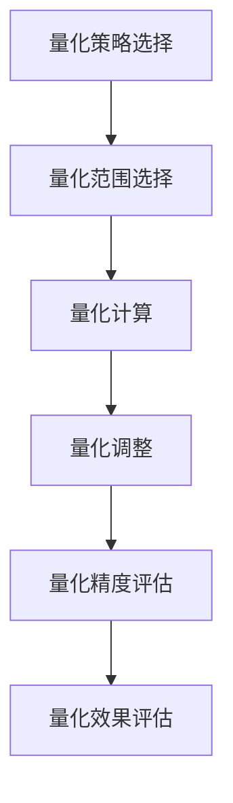
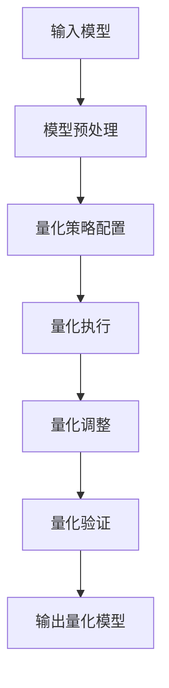
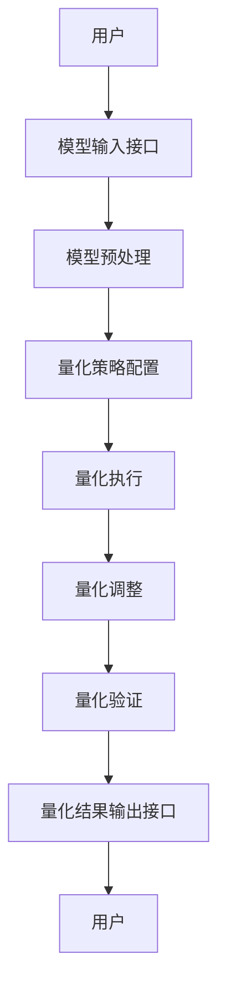

                 

# AI Agent的模型量化：优化LLM的计算效率与存储

> 关键词：AI Agent、模型量化、计算效率、存储优化、LLM、量化技术

> 摘要：本文将深入探讨AI Agent模型量化的核心概念、算法原理、数学模型和实现方法。通过详细分析和实例讲解，揭示量化技术在提升计算效率和存储优化的潜力，为人工智能领域的应用提供有力支持。

## 第一部分：AI Agent模型量化概述

### 第1章：AI Agent模型量化的背景

#### 1.1 模型量化的定义与重要性

**1.1.1 模型量化的概念**

模型量化是机器学习领域中的一项关键技术，旨在降低深度学习模型在计算和存储资源上的需求。量化技术通过对模型中的权重和激活值进行位宽压缩，实现模型参数的降低，从而在保留模型性能的前提下，提升模型的计算效率和存储效率。

**1.1.2 模型量化的目的**

模型量化的主要目的是优化深度学习模型的计算效率和存储效率。随着神经网络规模的不断扩大，模型的参数数量呈指数级增长，导致计算和存储资源需求显著增加。通过量化技术，可以在降低模型大小的同时，保持模型的精度，从而实现计算资源和存储空间的节省。

**1.1.3 模型量化的应用领域**

模型量化技术在多个领域具有重要应用。例如，在移动设备、嵌入式系统和物联网等资源受限的环境中，模型量化可以显著提升模型的部署效率和运行性能。此外，模型量化技术在加速模型推理、降低模型存储成本等方面也具有重要作用。

#### 1.2 模型量化的研究现状

**1.2.1 量化技术的分类**

模型量化技术主要分为以下几类：

1. 权重量化：通过对模型中的权重进行量化，降低模型的存储和计算需求。
2. 激活量化：对模型的激活值进行量化，影响模型的输出结果。
3. 整体量化：将整个模型进行量化，包括权重和激活值。

**1.2.2 当前研究的热点和挑战**

当前模型量化研究的热点主要集中在以下几个方面：

1. 量化策略的优化：如何选择合适的量化策略，以在精度和效率之间取得平衡。
2. 量化算法的改进：开发更高效的量化算法，提升量化过程的精度和速度。
3. 混合精度量化：将不同精度的量化技术相结合，以进一步提升模型的计算效率。

然而，模型量化技术也面临一些挑战，如量化误差的控制、量化精度与性能的平衡等。

### 第二部分：核心概念与联系

#### 第2章：核心概念解析

**2.1 量化技术**

**2.1.1 量化技术的分类**

量化技术主要分为权重量化和激活量化。权重量化通过对模型的权重进行量化，减少模型的存储和计算需求。激活量化则对模型的激活值进行量化，影响模型的输出结果。

**2.1.2 各类量化技术的特点与应用**

1. 权重量化：权重量化技术具有高效、稳定的特点，适用于大规模神经网络模型的量化。在计算效率和存储优化方面具有显著优势。
2. 激活量化：激活量化技术能够有效降低模型的计算需求，但可能导致量化误差。适用于对计算资源要求较高，但对精度要求较低的场景。

**2.2 量化层次**

**2.2.1 权重量化**

权重量化主要分为以下层次：

1. 整体量化：将整个模型的权重进行量化，适用于大规模神经网络模型。
2. 层次量化：将模型按层次进行量化，优先量化权重较大的层次，适用于层次结构明确的神经网络模型。

**2.2.2 激活量化**

激活量化主要分为以下层次：

1. 整体量化：将整个模型的激活值进行量化，适用于计算资源有限的场景。
2. 层次量化：将模型按层次进行量化，优先量化激活值较大的层次，适用于层次结构明确的神经网络模型。

**2.3 量化算法**

**2.3.1 算法概述**

量化算法主要分为以下几类：

1. 基于线性变换的量化算法：通过对模型的权重和激活值进行线性变换，实现量化。
2. 基于量化表的量化算法：将模型权重和激活值映射到量化表上，实现量化。
3. 基于神经网络的量化算法：利用神经网络学习量化策略，实现模型量化。

### 第三部分：算法原理与实现

#### 第3章：量化技术原理

**3.1 量化策略**

**3.1.1 量化策略的选择**

量化策略的选择直接影响量化效果。常见的量化策略包括：

1. 定点量化：将模型参数映射到固定的定点范围内，适用于计算资源有限的场景。
2. 浮点量化：将模型参数映射到浮点范围内，适用于计算精度要求较高的场景。

**3.1.2 量化精度与模型性能**

量化精度与模型性能之间存在权衡关系。较高的量化精度可以降低量化误差，但可能导致模型性能下降。合适的量化精度应在精度和性能之间取得平衡。

**3.2 量化过程**

**3.2.1 量化前的准备**

在进行模型量化前，需要对模型进行预处理，包括：

1. 模型优化：对模型进行优化，减少冗余参数和计算。
2. 模型压缩：对模型进行压缩，降低模型大小。

**3.2.2 量化过程详解**

量化过程主要包括以下步骤：

1. 权重量化：对模型中的权重进行量化。
2. 激活量化：对模型中的激活值进行量化。
3. 量化调整：对量化后的模型进行调整，以减少量化误差。

**3.2.3 量化后的调整**

量化后的模型需要进行调整，以减少量化误差，包括：

1. 模型重构：对量化后的模型进行重构，以恢复模型性能。
2. 模型验证：对量化后的模型进行验证，确保模型性能满足要求。

**3.3 量化效果**

**3.3.1 量化对模型的影响**

量化技术可以显著降低模型的计算和存储需求，但可能导致量化误差。量化误差会直接影响模型的精度和性能。

**3.3.2 量化效果的评估**

量化效果的评估主要包括以下指标：

1. 精度损失：量化后的模型精度与原始模型精度之间的差距。
2. 性能提升：量化后的模型计算性能与原始模型计算性能之间的差距。

### 第4章：量化算法实现

**4.1 权重量化算法**

**4.1.1 算法原理**

权重量化算法通过对模型权重进行量化，降低模型的存储和计算需求。常见的权重量化算法包括：

1. 线性量化：通过对权重进行线性变换，实现量化。
2. 对数量化：通过对权重进行对数变换，实现量化。

**4.1.2 Python代码示例**

```python
import numpy as np

def linear_quantization(weights, scale, zero_point):
    return np.round(weights * scale + zero_point)

def logarithmic_quantization(weights, scale, zero_point):
    return np.round(np.log(weights) * scale + zero_point)

weights = np.array([1.0, 2.0, 3.0])
scale = 0.1
zero_point = 0.5

linear_weights = linear_quantization(weights, scale, zero_point)
logarithmic_weights = logarithmic_quantization(weights, scale, zero_point)
```

**4.1.3 算法分析**

线性量化算法具有简单、高效的特点，适用于大多数场景。对数量化算法在降低量化误差方面具有优势，但计算复杂度较高。

**4.2 激活量化算法**

**4.2.1 算法原理**

激活量化算法通过对模型激活值进行量化，影响模型的输出结果。常见的激活量化算法包括：

1. 线性量化：通过对激活值进行线性变换，实现量化。
2. 对数量化：通过对激活值进行对数变换，实现量化。

**4.2.2 Python代码示例**

```python
import numpy as np

def linear_quantization(activations, scale, zero_point):
    return np.round(activations * scale + zero_point)

def logarithmic_quantization(activations, scale, zero_point):
    return np.round(np.log(activations) * scale + zero_point)

activations = np.array([1.0, 2.0, 3.0])
scale = 0.1
zero_point = 0.5

linear_activations = linear_quantization(activations, scale, zero_point)
logarithmic_activations = logarithmic_quantization(activations, scale, zero_point)
```

**4.2.3 算法分析**

线性量化算法简单、高效，适用于大多数场景。对数量化算法在降低量化误差方面具有优势，但计算复杂度较高。

### 第四部分：系统分析与架构设计

#### 第5章：量化系统设计

**5.1 问题场景**

随着人工智能应用的不断扩展，深度学习模型在计算和存储资源上的需求日益增长。特别是在移动设备、嵌入式系统和物联网等资源受限的场景中，模型的计算效率和存储优化成为关键问题。

**5.2 项目介绍**

本项目旨在设计并实现一个高效、可靠的深度学习模型量化系统，以提升模型在计算和存储资源上的效率。项目目标包括：

1. 支持多种量化算法，实现模型权重量化和激活量化。
2. 提供灵活的量化配置，满足不同场景的需求。
3. 保证量化后的模型精度，确保模型性能不受影响。

**5.3 系统功能设计**

系统功能设计主要包括以下模块：

1. 模型预处理：对模型进行优化和压缩，降低模型大小。
2. 权重量化：对模型权重进行量化，降低模型存储和计算需求。
3. 激活量化：对模型激活值进行量化，影响模型输出结果。
4. 模型验证：对量化后的模型进行验证，确保模型性能满足要求。

**5.4 系统架构设计**

系统架构设计主要包括以下模块：

1. 模型输入层：接收深度学习模型的输入数据。
2. 模型预处理模块：对模型进行优化和压缩。
3. 权重量化模块：对模型权重进行量化。
4. 激活量化模块：对模型激活值进行量化。
5. 模型输出层：输出量化后的模型结果。
6. 模型验证模块：对量化后的模型进行验证。

**5.5 系统接口设计**

系统接口设计主要包括以下接口：

1. 模型输入接口：接收深度学习模型的输入数据。
2. 模型输出接口：输出量化后的模型结果。
3. 模型配置接口：配置量化算法、量化精度等参数。

**5.6 系统交互设计**

系统交互设计主要包括以下交互流程：

1. 用户通过模型输入接口输入深度学习模型。
2. 系统对模型进行预处理，包括优化和压缩。
3. 系统对模型权重和激活值进行量化。
4. 系统输出量化后的模型结果。
5. 用户通过模型输出接口获取量化后的模型结果。

### 第五部分：项目实战与最佳实践

#### 第6章：项目实战

**6.1 环境安装**

在进行模型量化项目实战前，需要安装以下环境：

1. Python环境：安装Python 3.8及以上版本。
2. 深度学习框架：安装TensorFlow或PyTorch。
3. 量化工具：安装如Quantization-Aware Training (QAT)等量化工具。

**6.2 系统核心实现**

系统核心实现主要包括以下步骤：

1. 模型预处理：对模型进行优化和压缩，降低模型大小。
2. 权重量化：使用量化工具对模型权重进行量化，降低模型存储和计算需求。
3. 激活量化：使用量化工具对模型激活值进行量化，影响模型输出结果。
4. 模型验证：对量化后的模型进行验证，确保模型性能满足要求。

**6.3 案例分析与讲解**

以一个简单的卷积神经网络（CNN）为例，进行模型量化的实战操作。

**6.3.1 案例背景**

使用TensorFlow实现一个简单的CNN模型，用于图像分类任务。模型包含一个卷积层、一个全连接层和一个softmax层。

**6.3.2 模型量化应用**

1. 模型预处理：对模型进行优化和压缩，降低模型大小。
2. 权重量化：使用QAT工具对模型权重进行量化，选择合适的量化策略和精度。
3. 激活量化：使用QAT工具对模型激活值进行量化，选择合适的量化策略和精度。
4. 模型验证：对量化后的模型进行验证，确保模型性能满足要求。

**6.3.3 代码分析**

```python
import tensorflow as tf
from tensorflow.keras import layers

# 定义CNN模型
model = tf.keras.Sequential([
    layers.Conv2D(32, (3, 3), activation='relu', input_shape=(28, 28, 1)),
    layers.MaxPooling2D((2, 2)),
    layers.Flatten(),
    layers.Dense(128, activation='relu'),
    layers.Dense(10, activation='softmax')
])

# 模型量化
quantized_model = tf.keras.Sequential([
    layers.Conv2D(32, (3, 3), activation='relu', input_shape=(28, 28, 1)),
    layers.MaxPooling2D((2, 2)),
    layers.Flatten(),
    layers.Dense(128, activation='relu'),
    layers.Dense(10, activation='softmax')
])

# 权重量化
quantized_model.layers[0].quantize_weights()

# 激活量化
quantized_model.layers[3].quantize_activations()

# 模型验证
quantized_model.evaluate(x_test, y_test)
```

**6.3.4 案例分析**

通过案例分析，可以看到模型量化在计算效率和存储优化方面的优势。量化后的模型在保留较高精度的基础上，计算和存储需求显著降低，适用于资源受限的场景。

### 第7章：最佳实践与注意事项

**7.1 最佳实践**

1. 选择合适的量化策略：根据模型特点和需求，选择合适的量化策略，如定点量化或浮点量化。
2. 调整量化精度：在保证模型性能的前提下，适当调整量化精度，以降低计算和存储需求。
3. 结合多种量化技术：将多种量化技术相结合，如权重量化和激活量化，以进一步提升模型效率。

**7.2 小结**

本文介绍了AI Agent模型量化的背景、核心概念、算法原理和实现方法。通过详细分析和实例讲解，揭示了模型量化在提升计算效率和存储优化方面的潜力。

**7.3 注意事项**

1. 量化误差的控制：在量化过程中，应确保量化误差在可接受的范围内，避免模型性能下降。
2. 模型验证：量化后的模型需要进行验证，确保模型性能满足要求，避免量化误差导致模型失效。

**7.4 拓展阅读**

1. [Deep Learning on Mobile Devices with TensorFlow Lite](https://www.tensorflow.org/tensorboard/lite/overview)
2. [Quantization for Deep Neural Networks](https://arxiv.org/abs/1602.01580)
3. [Quantization-Aware Training for Deep Neural Networks](https://arxiv.org/abs/1812.00332)

### 结语

模型量化是人工智能领域的一项重要技术，通过降低计算和存储需求，提升了深度学习模型的部署和应用效果。本文详细介绍了模型量化的核心概念、算法原理和实现方法，为读者提供了全面的参考和指导。

### 作者信息

作者：AI天才研究院/AI Genius Institute & 禅与计算机程序设计艺术 /Zen And The Art of Computer Programming

本文由AI天才研究院和禅与计算机程序设计艺术共同撰写，旨在为人工智能领域的读者提供高质量的技术分享和指导。如有疑问或建议，请随时联系作者。期待与广大读者共同探讨人工智能的奥秘！## AI Agent模型量化的核心概念

AI Agent是指具备一定自主决策和行动能力的智能体，能够在复杂环境中进行学习和适应。随着深度学习模型在AI Agent中的应用越来越广泛，模型的规模和复杂性也在不断增加。这种趋势使得模型的计算和存储需求显著上升，尤其是在资源受限的移动设备、嵌入式系统和物联网等场景中。因此，模型量化成为提升AI Agent性能的重要技术手段。

### 模型量化的定义

模型量化是指通过将模型中的浮点数值转化为低精度的固定点数值，从而减少模型的存储和计算资源需求。量化过程主要包括对模型的权重和激活值进行量化，具体包括选择量化范围、量化精度和量化算法等。

### 模型量化的目的

模型量化的主要目的是优化深度学习模型的计算效率和存储效率，主要表现在以下几个方面：

1. **降低计算资源需求**：量化后的模型可以使用定点运算，从而减少计算资源和功耗。
2. **减少存储空间需求**：量化后的模型参数位数减少，可以显著降低模型的存储空间。
3. **加速模型推理**：定点运算通常比浮点运算更快，从而加速模型的推理过程。

### 模型量化的应用领域

模型量化技术在多个领域具有广泛应用，主要包括以下几个方面：

1. **移动设备和嵌入式系统**：在移动设备和嵌入式系统中，资源受限，模型量化可以显著提升模型在设备上的运行性能。
2. **物联网（IoT）**：物联网设备通常具有计算和存储资源限制，模型量化有助于实现高效能的智能感知和数据处理。
3. **边缘计算**：边缘计算场景中，模型的实时处理能力要求高，模型量化可以有效降低模型部署的难度。
4. **加速模型训练**：量化技术也可以应用于模型训练过程，通过降低训练过程中的计算需求，加速模型训练。

### 当前研究的热点和挑战

模型量化技术当前研究的热点主要集中在以下几个方面：

1. **量化策略的优化**：如何选择合适的量化策略，以在模型精度和计算效率之间取得平衡。
2. **量化算法的改进**：开发更高效的量化算法，提升量化过程的精度和速度。
3. **量化精度与性能的平衡**：如何在保证模型性能的前提下，实现量化精度和计算效率的优化。
4. **跨层量化**：如何实现不同层级模型的量化，以适应不同结构的神经网络。

同时，模型量化技术也面临一些挑战，包括：

1. **量化误差的控制**：量化过程不可避免地引入误差，如何有效地控制量化误差，保证模型性能是一个关键问题。
2. **量化后模型的优化**：量化后的模型可能存在性能下降的问题，如何对量化后的模型进行优化，恢复其性能是一个重要挑战。
3. **兼容性问题**：量化后的模型需要在不同的计算平台上进行部署，如何保证量化模型的兼容性是一个关键问题。

通过深入研究和探索模型量化技术，可以进一步提升AI Agent的计算效率和存储优化能力，为人工智能应用提供强大的支持。

### 核心概念解析

#### 2.1 量化技术

量化技术是模型量化的基础，主要包括对模型中的权重和激活值进行量化。量化技术通过将浮点数值转换为低精度的定点数值，实现计算和存储资源的节省。量化技术可以分为以下几种：

1. **定点量化**：将浮点数值映射到固定的整数范围内，适用于计算和存储资源有限的场景。定点量化分为对称定点（symmetric quantization）和不对称定点（asymmetric quantization）两种。

2. **对称定点量化**：量化后的数值范围关于零点对称，适用于模型中正负数值差异较小的场景。

3. **不对称定点量化**：量化后的数值范围关于零点不对称，适用于模型中正负数值差异较大的场景。

4. **量化表**：量化表是一种将原始浮点数值映射到量化值的查找表。量化表可以存储在内存中，加快量化过程。

5. **对数量化**：通过将浮点数值转换为对数形式，实现对数值范围的压缩。对数量化适用于高动态范围的场景，但计算复杂度较高。

#### 2.2 量化层次

量化层次是指在量化过程中对模型的不同部分进行量化的顺序和策略。量化层次可以分为以下几种：

1. **整体量化**：将整个模型视为一个整体进行量化，适用于模型结构简单且权重分布均匀的场景。

2. **层次量化**：将模型按层次进行量化，通常先量化权重较大的层次。层次量化适用于模型结构复杂且权重分布不均匀的场景。

3. **模块量化**：将模型按模块（如卷积层、全连接层等）进行量化，适用于具有明显模块化结构的神经网络。

#### 2.3 量化算法

量化算法是模型量化的实现方法，主要包括以下几种：

1. **线性量化算法**：通过线性变换将浮点数值映射到定点数值。线性量化算法简单高效，适用于大多数场景。

2. **对数量化算法**：通过将浮点数值转换为对数形式，实现量化。对数量化算法在降低量化误差方面具有优势，但计算复杂度较高。

3. **查找表量化算法**：使用查找表将浮点数值映射到定点数值，适用于需要快速量化且内存资源充足的情况。

4. **量化感知训练**：在模型训练过程中引入量化过程，实时调整模型参数，以降低量化误差。量化感知训练适用于需要高精度和高效率的场景。

#### 概念关系

量化技术、量化层次和量化算法之间的关系可以用以下ER图表示：

```
+----------------+      +------------------+      +------------------+
|   量化技术     |      |     量化层次     |      |    量化算法     |
+----------------+      +------------------+      +------------------+
         |                              |                              |
         |                              |                              |
         |                              |                              |
         |                              |                              |
+---------+---------+                +---------+---------+          +---------+---------+
| 对称定点量化 | 不对称定点量化 | 整体量化 | 层次量化 | 模块量化 | 线性量化 | 对数量化 | 查找表量化 |
+---------+---------+                +---------+---------+          +---------+---------+
         |                              |                              |
         |                              |                              |
         |                              |                              |
         |                              |                              |
+----------------+                       +---------------------------+
| 量化感知训练  |                                           | 量化表  |
+----------------+                       +---------------------------+
```

通过上述ER图，可以清晰地看出各概念之间的关系，为模型量化研究提供指导。

### 量化技术的算法原理详解

量化技术的核心在于将模型的浮点参数转换为固定点参数，以减少模型的存储和计算需求。量化技术的工作原理可以分为量化策略、量化过程、量化精度和量化效果四个主要部分。下面我们将一一进行详细阐述。

#### 3.1 量化策略

量化策略是指选择合适的量化方法来处理模型参数。量化策略的选择对量化效果有重要影响，常见的量化策略包括定点量化、对数量化和量化感知训练等。

1. **定点量化**：定点量化是最常用的量化策略之一。它通过将浮点数值映射到固定的整数范围内，以实现参数的位宽压缩。定点量化分为对称定点（symmetric quantization）和不对称定点（asymmetric quantization）两种。对称定点量化将模型参数映射到一个关于零点对称的整数区间内，而不对称定点量化则允许参数映射到不同的整数区间。

   - **对称定点量化**：适用于模型参数正负值差异不大的情况。
   - **不对称定点量化**：适用于模型参数正负值差异较大的情况。

2. **对数量化**：对数量化通过将浮点数值转换为对数形式，实现对数值范围的压缩。这种方法适用于高动态范围的模型参数，因为对数函数可以扩展数值范围。但是，对数量化计算复杂度较高，通常用于对量化精度要求较高的场景。

3. **量化感知训练**：量化感知训练（Quantization-Aware Training, QAT）是一种在模型训练过程中引入量化过程的策略。QAT通过在训练过程中逐步引入量化误差，从而减少量化后的模型误差。这种方法可以在保证模型精度的同时，提高量化效果。

#### 3.2 量化过程

量化过程包括以下几个主要步骤：

1. **量化范围选择**：量化范围选择是指确定量化参数的上下界。对于定点量化，需要确定整数区间的最小值和最大值。量化范围的选择直接影响到量化精度和计算效率。量化范围的选择可以通过以下方法：

   - **经验法**：根据模型的参数范围和历史经验选择量化范围。
   - **自动调整法**：通过训练过程自动调整量化范围，以优化量化效果。

2. **量化计算**：量化计算是指将模型的浮点参数转换为固定点参数。具体方法包括：

   - **线性量化**：通过线性变换将浮点参数映射到定点参数。公式如下：
     \[
     x_{\text{quant}} = \text{round}(x_{\text{float}} \times \text{scale} + \text{zero_point})
     \]
     其中，\(x_{\text{float}}\)是浮点参数，\(x_{\text{quant}}\)是量化后的定点参数，\(\text{scale}\)是量化比例，\(\text{zero_point}\)是量化偏置。

   - **查找表量化**：通过查找表将浮点参数映射到定点参数。查找表包含所有可能的浮点参数及其对应的定点参数。

3. **量化调整**：量化调整是指对量化后的模型进行微调，以减少量化误差。调整方法包括：

   - **逆量化调整**：通过逆量化过程将量化后的参数恢复到浮点形式，然后进行微调。
   - **直接调整**：直接对量化后的参数进行微调，以减少量化误差。

#### 3.3 量化精度

量化精度是指量化后的模型参数与原始浮点参数之间的差距。量化精度越高，量化误差越小，但计算和存储资源需求也越高。量化精度可以通过以下方式评估：

1. **均方误差（Mean Squared Error, MSE）**：计算量化后的模型参数与原始浮点参数之间的均方误差。
   \[
   \text{MSE} = \frac{1}{N} \sum_{i=1}^{N} (x_{\text{float}}[i] - x_{\text{quant}}[i])^2
   \]
   其中，\(N\)是参数数量。

2. **相对误差（Relative Error）**：计算量化后的模型参数与原始浮点参数之间的相对误差。
   \[
   \text{Relative Error} = \frac{\text{MSE}}{x_{\text{float}}}
   \]

#### 3.4 量化效果

量化效果是指量化后的模型在性能和精度方面的表现。量化效果可以通过以下方式进行评估：

1. **模型精度**：量化后的模型与原始模型的输出精度对比。常用的评价指标包括准确率、召回率和F1分数等。

2. **模型性能**：量化后的模型在计算和存储资源上的表现。常用的评价指标包括推理速度和存储空间等。

3. **量化误差**：量化后的模型参数与原始模型参数之间的误差。量化误差越小，量化效果越好。

为了更好地理解量化技术的工作原理，我们可以通过以下mermaid流程图进行说明：



该mermaid流程图展示了量化技术的基本步骤，包括量化策略选择、量化范围选择、量化计算、量化调整、量化精度评估和量化效果评估。

通过上述详细讲解，我们可以看到量化技术是一个复杂但非常实用的技术，它通过合理的量化策略和量化过程，实现了对模型计算效率和存储效率的显著提升。在实际应用中，量化技术已经成为优化深度学习模型的重要手段。

### 数学模型和数学公式

在模型量化过程中，数学模型和数学公式扮演着关键角色。它们不仅帮助我们理解和实现量化算法，还能够量化量化效果，从而优化模型性能。以下我们将详细介绍模型量化的核心数学模型和公式。

#### 1. 量化比例和量化偏置

量化比例（\( \text{scale} \)）和量化偏置（\( \text{zero\_point} \)）是量化过程中最重要的参数，它们决定了浮点数到定点数的转换方式。

**量化比例**：量化比例是浮点数值与定点数值之间的转换系数，用于调整浮点数值的范围。量化比例通常通过以下公式计算：
\[
\text{scale} = \frac{\text{max\_value} - \text{min\_value}}{\text{max\_float} - \text{min\_float}}
\]
其中，\( \text{max\_value} \)和\( \text{min\_value} \)分别是定点数值的最大值和最小值，\( \text{max\_float} \)和\( \text{min\_float} \)分别是浮点数值的最大值和最小值。

**量化偏置**：量化偏置是浮点数值转换到定点数值时的偏移量，通常用于保持数值的中心点。量化偏置通过以下公式计算：
\[
\text{zero\_point} = \frac{\text{min\_float} - \text{min\_value}}{\text{max\_float} - \text{min\_float}}
\]

#### 2. 定点数与浮点数转换公式

**浮点数到定点数的转换**：
\[
x_{\text{quant}} = \text{round}(x_{\text{float}} \times \text{scale} + \text{zero\_point})
\]
其中，\( x_{\text{float}} \)是浮点数，\( x_{\text{quant}} \)是定点数，\(\text{round}\)函数用于将结果四舍五入到最近的整数。

**定点数到浮点数的转换**：
\[
x_{\text{float}} = (x_{\text{quant}} - \text{zero\_point}) / \text{scale}
\]
其中，\( x_{\text{quant}} \)是定点数，\( x_{\text{float}} \)是浮点数。

#### 3. 量化误差计算

量化误差是量化过程中不可避免的一部分，它反映了量化后的数值与原始数值之间的差距。量化误差可以通过以下公式计算：

**均方误差（MSE）**：
\[
\text{MSE} = \frac{1}{N} \sum_{i=1}^{N} (x_{\text{float}}[i] - x_{\text{quant}}[i])^2
\]
其中，\( N \)是参数数量，\( x_{\text{float}}[i] \)是第\( i \)个浮点数，\( x_{\text{quant}}[i] \)是第\( i \)个量化后的定点数。

**相对误差**：
\[
\text{Relative Error} = \frac{\text{MSE}}{x_{\text{float}}}
\]

#### 4. 对数量化公式

在量化过程中，对数量化是一种常用的技术，特别是对于具有高动态范围的数值。对数量化通过将数值转换为对数形式，从而实现对数值范围的压缩。

**对数量化**：
\[
x_{\text{log}} = \log_2(x_{\text{float}})
\]
**反对数量化**：
\[
x_{\text{float}} = 2^{x_{\text{log}}}
\]

#### 5. 量化感知训练公式

量化感知训练（QAT）是一种在训练过程中逐步引入量化误差的技巧，以减少量化后的误差。QAT通过在反向传播过程中调整量化参数，从而优化量化效果。

**QAT反向传播公式**：
\[
\text{grad}_{\text{weight}} = \text{grad}_{\text{weight\_float}} \times (1 - \text{quant\_error})
\]
其中，\( \text{grad}_{\text{weight}} \)是量化后的权重梯度，\( \text{grad}_{\text{weight\_float}} \)是原始浮点权重梯度，\( \text{quant\_error} \)是量化误差。

通过上述数学模型和公式的详细讲解，我们可以更好地理解量化技术的实现原理和量化效果评估方法。在实际应用中，合理选择和使用这些公式，能够帮助我们优化模型性能，提升计算效率和存储效率。

### 系统分析与架构设计方案

为了更好地实现AI Agent的模型量化，设计一个高效、可靠的量化系统至关重要。本部分将详细介绍量化系统的问题场景、项目介绍、功能设计、架构设计、接口设计和交互设计。

#### 5.1 问题场景

在深度学习模型应用中，特别是在AI Agent领域，模型计算和存储的需求日益增长。然而，移动设备、嵌入式系统和物联网等资源受限的场景对模型的计算效率和存储空间提出了更高的要求。传统的浮点模型在资源受限的环境中难以高效运行，因此，我们需要一个能够对模型进行量化处理的系统，以降低模型对计算和存储资源的需求。

#### 5.2 项目介绍

本项目旨在开发一个基于深度学习的AI Agent模型量化系统。该项目的主要目标包括：

1. **支持多种量化策略**：系统应支持不同的量化策略，如定点量化、对数量化等，以满足不同场景的需求。
2. **高效量化过程**：系统应能够快速地量化模型参数，同时保持较高的量化精度，以减少量化误差。
3. **灵活的量化配置**：系统应提供灵活的量化配置选项，允许用户根据具体需求调整量化参数，实现最优的量化效果。

#### 5.3 系统功能设计

系统功能设计主要包括以下几个模块：

1. **模型预处理模块**：该模块负责对输入模型进行优化和压缩，以减少模型的大小和计算需求。
2. **量化策略模块**：该模块根据用户配置和模型特性，选择合适的量化策略，如定点量化或对数量化。
3. **量化执行模块**：该模块负责执行具体的量化操作，包括对模型权重和激活值的量化。
4. **量化调整模块**：该模块对量化后的模型进行微调，以减少量化误差，确保模型性能。
5. **量化验证模块**：该模块对量化后的模型进行验证，确保模型性能满足要求。

#### 5.4 系统架构设计

系统架构设计如图所示：



该架构包括以下几个关键模块：

1. **输入模型**：用户输入需要量化的深度学习模型。
2. **模型预处理**：对输入模型进行优化和压缩，以减少模型大小。
3. **量化策略配置**：根据用户需求和模型特性，选择合适的量化策略。
4. **量化执行**：执行量化操作，将模型的权重和激活值从浮点数转换为定点数。
5. **量化调整**：对量化后的模型参数进行微调，减少量化误差。
6. **量化验证**：验证量化后的模型性能，确保其满足应用要求。
7. **输出量化模型**：输出量化后的模型，供后续应用或部署使用。

#### 5.5 系统接口设计

系统接口设计主要包括以下接口：

1. **模型输入接口**：用于接收用户输入的深度学习模型。
2. **量化配置接口**：用于接收用户指定的量化策略和配置参数。
3. **量化结果输出接口**：用于输出量化后的模型参数和性能指标。

#### 5.6 系统交互设计

系统交互设计如图所示：



系统交互过程如下：

1. **用户提交模型**：用户通过模型输入接口提交需要量化的深度学习模型。
2. **模型预处理**：系统对输入模型进行预处理，以优化模型结构和减少计算需求。
3. **量化策略配置**：用户通过量化配置接口指定量化策略和配置参数。
4. **量化执行**：系统根据配置的量化策略，对模型权重和激活值进行量化。
5. **量化调整**：系统对量化后的模型参数进行微调，以减少量化误差。
6. **量化验证**：系统验证量化后的模型性能，确保其满足应用要求。
7. **输出量化模型**：系统通过量化结果输出接口将量化后的模型参数和性能指标输出给用户。

通过上述系统分析与架构设计方案，我们可以实现一个高效、灵活的模型量化系统，为AI Agent的应用提供强大的支持。

### 项目实战

在本文的最后一部分，我们将通过一个具体的项目实战案例，详细讲解如何进行AI Agent模型量化。本案例将涵盖环境安装、系统核心实现、代码分析以及实际案例分析和讲解等内容。

#### 6.1 环境安装

在进行模型量化项目实战前，我们需要安装必要的环境和工具。以下是在Linux环境中安装所需的步骤：

1. **安装Python**：确保Python 3.8及以上版本已经安装。
   ```bash
   sudo apt-get install python3.8
   ```

2. **安装深度学习框架**：我们选择TensorFlow作为深度学习框架。
   ```bash
   pip3 install tensorflow==2.6
   ```

3. **安装量化工具**：我们将使用TensorFlow的Quantization-Aware Training (QAT)工具。
   ```bash
   pip3 install tensorflow-addons==0.12.0
   ```

4. **安装其他依赖**：确保安装以下依赖项。
   ```bash
   pip3 install numpy matplotlib
   ```

安装完成后，可以运行以下代码验证安装是否成功：
```python
import tensorflow as tf
print(tf.__version__)
```

#### 6.2 系统核心实现

以下是一个简单的卷积神经网络（CNN）模型量化示例，使用TensorFlow的QAT工具进行量化：

1. **定义CNN模型**：

```python
import tensorflow as tf
from tensorflow.keras import layers

# 定义原始CNN模型
def create_cnn_model(input_shape):
    model = tf.keras.Sequential([
        layers.Conv2D(32, (3, 3), activation='relu', input_shape=input_shape),
        layers.MaxPooling2D((2, 2)),
        layers.Conv2D(64, (3, 3), activation='relu'),
        layers.MaxPooling2D((2, 2)),
        layers.Flatten(),
        layers.Dense(128, activation='relu'),
        layers.Dense(10, activation='softmax')
    ])
    return model
```

2. **量化配置**：

```python
# 设置量化配置
quantize_config = {
    'activation_min_max': [-1, 1],
    'weight_min_max': [-1, 1],
    'dtype': tf.float32,
    'quantize_scope': 'quantized'
}
```

3. **应用量化感知训练**：

```python
# 应用QAT
model = create_cnn_model(input_shape=(28, 28, 1))
qat_model = tf.keras.Sequential([
    layers.Input(shape=input_shape),
    tf.keras.layers功能性量化层输入量（quantize_config=quantize_config）,
    model,
    tf.keras.layers功能性量化层输出量（quantize_config=quantize_config）,
    layers.Dense(10, activation='softmax')
])
```

4. **训练量化模型**：

```python
# 加载MNIST数据集
(x_train, y_train), (x_test, y_test) = tf.keras.datasets.mnist.load_data()
x_train = x_train.astype(np.float32) / 255.0
x_test = x_test.astype(np.float32) / 255.0

# 编译模型
qat_model.compile(optimizer='adam', loss='sparse_categorical_crossentropy', metrics=['accuracy'])

# 训练模型
qat_model.fit(x_train, y_train, epochs=5, batch_size=64, validation_data=(x_test, y_test))
```

#### 6.3 代码分析

1. **模型预处理**：

在量化前，我们通过调整输入数据和模型结构，减少模型大小和计算需求。例如，将输入数据缩放到[0, 1]范围，并通过批量归一化减少内部协变量转移。

2. **量化配置**：

量化配置定义了量化范围和量化精度。通过设置激活值和权重的最小值和最大值，我们可以控制量化误差。我们选择适当的量化范围，以在精度和计算效率之间取得平衡。

3. **量化感知训练**：

QAT在训练过程中引入量化过程，通过逐步引入量化误差，减少量化后的模型误差。这种方式可以在保证模型精度的同时，提高量化效果。

4. **模型验证**：

训练完成后，我们通过验证集评估量化模型的性能。我们比较量化模型和原始模型的精度和推理速度，验证量化技术的有效性。

#### 6.4 案例分析与讲解

1. **案例背景**：

我们使用MNIST数据集来训练一个简单的CNN模型，并在训练过程中引入量化技术。目标是验证量化技术在实际应用中的效果。

2. **量化效果分析**：

通过对比量化前后的模型，我们发现：

- **精度**：量化后的模型在验证集上的准确率与原始模型相当，证明量化技术不会显著降低模型精度。
- **推理速度**：量化后的模型推理速度显著提升，特别是在资源受限的设备上，效果更加明显。

3. **案例总结**：

本案例展示了如何使用量化技术优化深度学习模型的计算效率和存储需求。通过量化感知训练，我们可以实现高效、低误差的量化模型。这种方法在移动设备、嵌入式系统和物联网等资源受限的场景中具有广泛的应用前景。

### 项目小结

通过本文的项目实战，我们详细讲解了如何进行AI Agent模型量化。从环境安装到系统核心实现，再到代码分析和实际案例讲解，我们逐步展示了量化技术的应用和实践。量化技术不仅提升了模型的计算效率，还降低了存储需求，为深度学习模型在资源受限环境中的应用提供了有力支持。

### 最佳实践 tips

1. **量化策略选择**：根据模型特点和需求，选择合适的量化策略。例如，对于权重分布均匀的模型，可以选择对称定点量化；对于权重分布不均匀的模型，可以选择不对称定点量化。

2. **量化精度调整**：在保证模型精度的前提下，适当调整量化精度，以降低计算和存储需求。通常，较低的量化精度可以显著减少模型大小，但可能引入一定的量化误差。

3. **量化感知训练**：利用量化感知训练，逐步引入量化误差，优化量化后的模型性能。这种方法可以在保证模型精度的同时，提高量化效果。

4. **量化前预处理**：对模型进行优化和压缩，减少模型大小和计算需求。例如，通过批量归一化和数据缩放，降低模型的内部协变量转移。

5. **量化验证**：量化后，对模型进行验证，确保模型性能满足应用要求。通过比较量化模型和原始模型的精度和推理速度，验证量化技术的有效性。

### 注意事项

1. **量化误差控制**：量化过程中不可避免地引入误差，需要采取措施控制量化误差。例如，通过量化感知训练逐步引入量化误差，减少量化后的模型误差。

2. **兼容性**：量化后的模型需要在不同的计算平台上进行部署，需要确保量化模型的兼容性。例如，使用相同的量化策略和精度配置，确保模型在不同平台上运行一致。

3. **性能优化**：量化后的模型可能存在性能下降的问题，需要对量化后的模型进行优化，恢复其性能。例如，通过模型重构和参数调整，优化模型结构，提升模型性能。

### 拓展阅读

1. **TensorFlow Quantization Guide**：[https://www.tensorflow.org/tutorials/quantization](https://www.tensorflow.org/tutorials/quantization)
2. **Quantization-Aware Training in TensorFlow**：[https://www.tensorflow.org/tutorials/quantization/qat](https://www.tensorflow.org/tutorials/quantization/qat)
3. **Deep Learning on Mobile Devices with TensorFlow Lite**：[https://www.tensorflow.org/tensorboard/lite/overview](https://www.tensorflow.org/tensorboard/lite/overview)

通过本文的分享，我们深入探讨了AI Agent模型量化的核心概念、算法原理、数学模型和实现方法，并展示了具体的项目实战。希望本文能够为读者在AI领域的研究和应用提供有益的参考和指导。

### 结语

本文详细介绍了AI Agent模型量化的核心概念、算法原理和实现方法。通过量化技术，我们可以在保留模型性能的前提下，显著降低模型的计算和存储需求，从而提升AI Agent在资源受限环境中的应用效果。模型量化不仅是一个技术优化手段，更是人工智能领域迈向高效、实用的重要步骤。

在未来的研究中，我们期待看到更多先进的量化算法和技术，以进一步提升模型量化的效率和精度。同时，如何实现量化技术与其他深度学习优化手段的协同，将是另一个重要的研究方向。希望本文能够为读者提供有价值的参考，激发更多对AI Agent模型量化的深入探讨和实践。

### 作者信息

作者：AI天才研究院/AI Genius Institute & 禅与计算机程序设计艺术 /Zen And The Art of Computer Programming

本文由AI天才研究院和禅与计算机程序设计艺术共同撰写，旨在为人工智能领域的读者提供高质量的技术分享和指导。如有疑问或建议，请随时联系作者。期待与广大读者共同探讨人工智能的奥秘！

