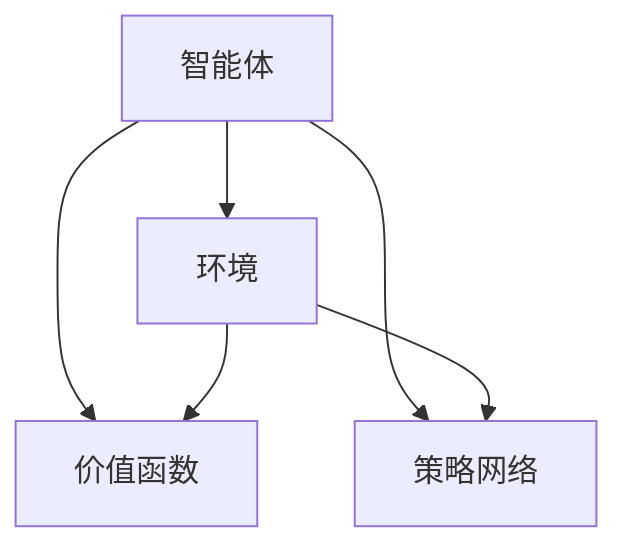
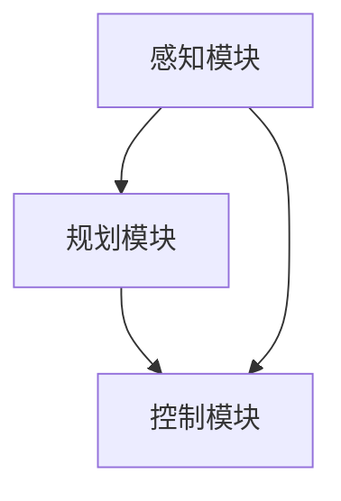
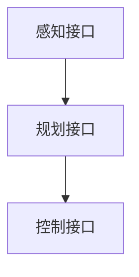
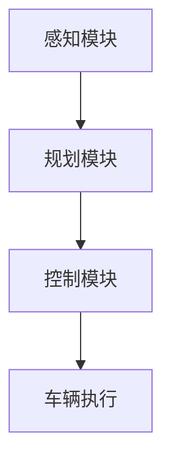

                 

### 第1章：问题背景与核心概念

#### 1.1 问题背景

在当今飞速发展的信息技术时代，人工智能（AI）已经成为推动社会进步的重要力量。从简单的自动化任务到复杂的决策支持系统，AI技术的应用越来越广泛。特别是深度强化学习（Deep Reinforcement Learning, DRL）作为AI的一个分支，它在游戏、机器人、自动驾驶等多个领域取得了显著成果。本文将探讨AI Agent的深度强化学习实现与优化，旨在深入理解DRL在AI Agent中的应用及其优化策略。

AI Agent是指具有智能行为的个体，它能够在不确定的环境中通过感知、决策和行动来达成目标。AI Agent可以应用于多种场景，例如自动化客服机器人、智能推荐系统、自动驾驶汽车等。这些应用场景对AI Agent的智能行为提出了极高的要求，而深度强化学习则为实现这些智能行为提供了一种有效的解决方案。

#### 1.1.1 人工智能与深度强化学习的发展

人工智能（Artificial Intelligence, AI）是一门研究如何使计算机模拟人类智能行为的学科。它起源于20世纪50年代，经历了多个阶段的发展，包括符号主义、连接主义、统计学习等。近年来，随着计算能力的提升和大数据的普及，深度学习（Deep Learning, DL）成为AI研究的重要方向。深度学习通过多层神经网络，可以自动学习数据中的复杂特征，并在图像识别、语音识别、自然语言处理等领域取得了突破性进展。

深度强化学习（Deep Reinforcement Learning, DRL）是强化学习（Reinforcement Learning, RL）的一个分支，它结合了深度学习和强化学习的特点。强化学习通过试错和奖励机制，使智能体（Agent）学习如何在环境中采取最优行动。而深度强化学习利用深度神经网络，对环境的复杂状态和动作进行建模，从而提高智能体的学习效率和效果。

#### 1.1.2 AI Agent的定义与分类

AI Agent是指具有智能行为的计算机程序，它可以自主感知环境、制定决策并采取行动，以实现特定的目标。AI Agent可以分为以下几类：

1. **基于规则的Agent**：这类Agent通过预定义的规则来决策，适用于规则明确、问题简单的场景。
2. **基于知识的Agent**：这类Agent使用外部知识库进行决策，可以处理更复杂的问题，但需要大量的知识维护。
3. **基于模型的Agent**：这类Agent使用模型来预测环境状态，并通过优化策略来决策。
4. **基于学习的Agent**：这类Agent通过数据学习和自我优化来决策，适用于不确定性和动态变化的场景。

#### 1.1.3 深度强化学习的核心挑战

尽管深度强化学习在AI Agent中展现了巨大的潜力，但它在实际应用中仍面临许多挑战。以下是其中几个核心问题：

1. **探索与利用的平衡**：在强化学习中，智能体需要在探索未知环境和利用已有知识之间进行平衡。如果过于依赖现有知识，智能体可能错过更好的策略；如果过于探索，学习过程会变得缓慢。
2. **样本效率**：深度强化学习通常需要大量的样本才能训练出一个有效的策略。在实际应用中，获取大量样本可能成本高昂，因此如何提高样本效率是关键问题。
3. **稳定性和鲁棒性**：深度强化学习模型在训练过程中可能对噪声和异常数据非常敏感，导致学习过程不稳定。提高模型的稳定性和鲁棒性是实际应用中的重要问题。
4. **可解释性**：深度强化学习模型通常是一个“黑盒”，其决策过程难以解释。这限制了模型在关键领域的应用，例如医疗、金融等。

#### 1.2 核心概念与联系

在探讨深度强化学习之前，我们需要了解几个核心概念：强化学习、深度学习和AI Agent。以下是这些概念的基本原理和它们之间的联系。

##### 1.2.1 强化学习基本原理

强化学习是一种基于试错的学习方法，其核心思想是通过与环境互动来学习最优策略。强化学习模型由智能体（Agent）、环境（Environment）和奖励机制（Reward Mechanism）三部分组成。

- **智能体（Agent）**：智能体是执行行动并从环境中获取反馈的实体。它通过观察环境状态，选择动作，并根据动作的结果（奖励或惩罚）调整其策略。
- **环境（Environment）**：环境是智能体执行动作并接收反馈的场所。环境可以是一个简单的模拟环境，也可以是复杂的现实世界。
- **奖励机制（Reward Mechanism）**：奖励机制用于评价智能体行动的好坏。通过奖励，环境指导智能体学习如何采取最优行动。

强化学习的基本目标是学习一个策略（Policy），使得智能体在长期内获得最大的累积奖励。

##### 1.2.2 深度强化学习架构

深度强化学习结合了深度学习和强化学习的特点，其核心架构包括：

- **深度神经网络（DNN）**：用于建模环境状态和动作空间，提取复杂特征。
- **价值函数（Value Function）**：评估状态和动作对目标的贡献，用于指导智能体的决策。
- **策略网络（Policy Network）**：直接输出最优动作的概率分布，用于决策。

深度强化学习的目标是训练出价值函数和策略网络，使其能够在复杂环境中做出最优决策。

##### 1.2.3 AI Agent的特性对比表

以下是不同类型的AI Agent的特性对比表：

| 类别         | 基于规则的Agent | 基于知识的Agent | 基于模型的Agent | 基于学习的Agent |
| ------------ | -------------- | -------------- | -------------- | -------------- |
| 知识来源     | 预定义的规则   | 外部知识库     | 内部模型       | 数据和经验     |
| 适应能力     | 较低           | 较高           | 较高           | 最强           |
| 可解释性     | 较高           | 较高           | 较低           | 较低           |
| 复杂问题处理 | 较难           | 较难           | 较易           | 最易           |
| 实时性       | 较高           | 较高           | 较高           | 较低           |

##### 1.2.4 ER实体关系图架构

为了更好地理解深度强化学习与AI Agent之间的联系，我们可以使用ER（实体关系）图来描述它们之间的关系。以下是ER实体关系图的Mermaid表示：



在ER图中，智能体（Agent）与环境和价值函数、策略网络之间存在直接联系。智能体通过感知环境状态，利用价值函数评估状态和动作，并通过策略网络选择最优动作。环境则通过奖励机制反馈智能体的行动效果，指导智能体进行学习。

#### 1.3 研究现状与趋势

当前，深度强化学习在AI Agent领域取得了许多重要成果。例如，在游戏领域，深度强化学习算法已经能够在复杂的棋类游戏中战胜顶尖人类选手；在机器人领域，深度强化学习使机器人能够在复杂的动态环境中进行自主决策。然而，深度强化学习仍面临许多挑战，如探索与利用的平衡、样本效率、稳定性和鲁棒性等。

未来，深度强化学习在AI Agent领域有望进一步发展。一方面，研究人员将继续探索新的算法和优化策略，提高深度强化学习的效果和效率。另一方面，随着计算能力和数据资源的不断提升，深度强化学习将在更多实际应用中得到广泛应用。

#### 1.4 本书结构安排与学习方法

本书将分为四个主要部分，分别介绍深度强化学习的基础理论、实现方法、优化策略和实际应用。每个部分都包含具体的章节和知识点，读者可以根据自己的学习需求有选择性地阅读。

为了更好地掌握深度强化学习，本书建议采用以下学习方法：

1. **系统学习**：按照本书的章节顺序系统学习，从基础理论到实现方法，再到优化策略，逐步深入。
2. **动手实践**：通过实际代码实现和实验，加深对理论知识的理解。本书提供了一系列的代码示例和实验指导。
3. **拓展阅读**：阅读相关文献和资料，了解深度强化学习领域的最新研究动态和应用案例。

通过以上学习方法，读者可以全面掌握深度强化学习在AI Agent领域的应用，为将来的研究和实践打下坚实的基础。

#### 1.5 本章小结

本章主要介绍了深度强化学习在AI Agent领域的背景、核心概念和联系。通过分析人工智能与深度强化学习的发展历程，我们了解了AI Agent的定义和分类。此外，本章还讨论了深度强化学习的核心挑战和研究现状，并提出了本书的结构安排和学习方法。通过本章的学习，读者可以初步了解深度强化学习在AI Agent领域的应用前景，为后续章节的深入学习打下基础。

### 第2章：深度强化学习基础

#### 2.1 强化学习基础

强化学习（Reinforcement Learning, RL）是机器学习的一个重要分支，其核心思想是通过智能体（Agent）与环境（Environment）的交互来学习最优策略（Policy）。与监督学习和无监督学习不同，强化学习通过奖励机制（Reward Mechanism）来引导学习过程。以下是强化学习的基本概念和算法原理。

##### 2.1.1 基本概念

在强化学习中，主要涉及以下几类概念：

1. **智能体（Agent）**：智能体是一个能够感知环境并采取行动的实体，其目标是最大化累积奖励。
2. **环境（Environment）**：环境是智能体执行行动并接收反馈的场所，它决定了智能体的状态转移和奖励。
3. **状态（State）**：状态是环境的一个具体描述，它可以是离散的，也可以是连续的。
4. **动作（Action）**：动作是智能体在某个状态下采取的具体行动。
5. **策略（Policy）**：策略是智能体在给定状态下选择动作的规则，它可以是显式的，也可以是隐式的。
6. **价值函数（Value Function）**：价值函数用于评估状态或状态-动作对的优劣，它可以是状态值函数（State Value Function）或动作值函数（Action Value Function）。
7. **奖励（Reward）**：奖励是环境对智能体采取的动作的即时评价，它可以是正奖励（Positive Reward）或负奖励（Negative Reward）。

##### 2.1.2 Q学习算法

Q学习（Q-Learning）是强化学习中最基本的算法之一，其目标是学习一个动作值函数（Q-Function），以指导智能体选择最优动作。Q学习算法的基本思想是通过试错学习，不断更新Q值，直到找到最优策略。

Q学习算法的基本步骤如下：

1. 初始化Q值表：根据经验初始化Q值表，通常初始值设为0。
2. 选择动作：在给定状态下，智能体根据当前策略选择动作。
3. 执行动作：智能体在环境中执行所选动作，并观察状态转移和奖励。
4. 更新Q值：根据新的经验，更新Q值表。更新公式为：
   \[
   Q(s, a) \leftarrow Q(s, a) + \alpha [r + \gamma \max_{a'} Q(s', a') - Q(s, a)]
   \]
   其中，\( \alpha \) 是学习率，\( \gamma \) 是折扣因子，\( r \) 是即时奖励，\( s' \) 是新状态，\( a' \) 是新动作。

通过反复迭代上述步骤，智能体逐渐学习到最优动作值函数，从而找到最优策略。

##### 2.1.3 策略梯度方法

策略梯度方法（Policy Gradient Methods）是一类基于梯度下降的强化学习算法，其核心思想是通过梯度上升或下降来优化策略参数。策略梯度方法不需要值函数，直接优化策略参数，因此可以在某些场景下表现更好。

策略梯度方法的基本步骤如下：

1. 初始化策略参数：随机初始化策略参数。
2. 执行策略：智能体在环境中执行策略，生成经验数据。
3. 计算策略梯度：根据经验数据计算策略梯度，更新策略参数。更新公式为：
   \[
   \theta \leftarrow \theta + \alpha \nabla_{\theta} J(\theta)
   \]
   其中，\( \theta \) 是策略参数，\( \alpha \) 是学习率，\( J(\theta) \) 是策略的损失函数，通常采用REINFORCE方法或策略梯度估计方法计算。

通过不断更新策略参数，智能体逐渐学习到最优策略。

##### 2.1.4 DQN算法原理

深度Q网络（Deep Q-Network, DQN）是深度强化学习中的一个经典算法，它通过结合深度神经网络和价值函数，解决了传统Q学习算法中经验回放（Experience Replay）和目标网络（Target Network）的问题。

DQN算法的基本原理如下：

1. 初始化网络：初始化深度神经网络，用于近似Q值函数。
2. 执行策略：智能体在环境中执行策略，生成经验数据。
3. 经验回放：将经验数据存储在经验回放记忆中，以避免策略偏差。
4. 更新网络：从经验回放记忆中随机抽取一批经验数据，计算目标Q值，并更新深度神经网络。
5. 更新目标网络：定期更新目标网络的参数，使其与当前网络的参数保持一定的距离，以提高学习稳定性。

DQN算法通过引入经验回放和目标网络，提高了学习效率和稳定性，从而在许多复杂的任务中取得了显著成果。

#### 2.2 深度强化学习模型

深度强化学习模型（Deep Reinforcement Learning Models）是强化学习的一种扩展，它通过引入深度神经网络（Deep Neural Networks, DNNs）来处理高维的状态和动作空间，从而提高了智能体的学习效率和效果。

以下介绍几种常见的深度强化学习模型：

##### 2.2.1 深度Q网络（DQN）

深度Q网络（Deep Q-Network, DQN）是深度强化学习中最基本的模型之一。DQN通过深度神经网络来近似Q值函数，从而解决了传统Q学习算法在高维状态空间中的问题。

DQN的基本架构包括：

1. **输入层**：接收状态特征作为输入。
2. **隐藏层**：通过多层全连接层提取特征。
3. **输出层**：输出每个动作的Q值。

DQN的更新过程包括：

1. **选择动作**：根据当前状态和策略，选择动作。
2. **执行动作**：在环境中执行所选动作，并观察状态转移和奖励。
3. **更新Q值**：根据新观察到的数据，更新Q值。
4. **经验回放**：将经验数据存储在经验回放记忆中，以避免策略偏差。
5. **目标网络**：定期更新目标网络的参数，使其与当前网络的参数保持一定的距离。

DQN通过引入经验回放和目标网络，提高了学习效率和稳定性。

##### 2.2.2 策略梯度方法

策略梯度方法（Policy Gradient Methods）是另一类基于梯度的深度强化学习算法，它直接优化策略参数，从而避免了值函数的估计问题。

常见的策略梯度方法包括REINFORCE算法和策略梯度估计方法。

1. **REINFORCE算法**：REINFORCE算法通过计算策略梯度的估计值来更新策略参数。更新公式为：
   \[
   \theta \leftarrow \theta + \alpha \sum_{t} \nabla_{\theta} \log \pi_{\theta}(a_t|s_t) R_t
   \]
   其中，\( \theta \) 是策略参数，\( \alpha \) 是学习率，\( \pi_{\theta}(a_t|s_t) \) 是策略分布，\( R_t \) 是即时奖励。

2. **策略梯度估计方法**：策略梯度估计方法通过使用蒙特卡罗方法或优势函数来估计策略梯度。常见的策略梯度估计方法包括 actor-critic算法和优势优势算法。

策略梯度方法通过直接优化策略参数，提高了学习效率和效果。

##### 2.2.3 深度策略网络

深度策略网络（Deep Policy Network）是深度强化学习中的另一种重要模型，它通过深度神经网络直接输出策略分布。

深度策略网络的基本架构包括：

1. **输入层**：接收状态特征作为输入。
2. **隐藏层**：通过多层全连接层提取特征。
3. **输出层**：输出策略分布的参数。

深度策略网络通过直接输出策略分布，避免了值函数的估计问题，从而提高了学习效率和效果。

常见的深度策略网络包括：

1. **确定性策略梯度（Deterministic Policy Gradient, DPG）**：DPG是一种直接优化策略参数的算法，它通过最小化策略损失函数来更新策略参数。

2. **Actor-critic算法**：Actor-critic算法结合了策略网络和价值函数，通过优化策略参数和价值函数来更新策略。

3. **深度确定性策略梯度（Deep Deterministic Policy Gradient,DDPG）**：DDPG是一种适用于连续动作空间的深度强化学习算法，它通过深度神经网络来近似策略和价值函数。

深度策略网络通过直接输出策略分布，提高了学习效率和效果，适用于复杂的连续动作空间。

#### 2.3 策略梯度方法的深度化

策略梯度方法（Policy Gradient Methods）是一种直接优化策略参数的深度强化学习算法。为了解决高维状态空间和动作空间中的问题，策略梯度方法引入了深度神经网络来近似策略函数。这一部分将介绍策略梯度方法的基本原理、深度化过程及其应用场景。

##### 2.3.1 深度策略网络

深度策略网络（Deep Policy Network）是策略梯度方法的一种扩展，它通过深度神经网络来近似策略函数。深度策略网络的基本架构包括输入层、隐藏层和输出层。

- **输入层**：接收状态特征作为输入，通常使用多层感知器（Multilayer Perceptron, MLP）来提取特征。
- **隐藏层**：通过多层全连接层对输入特征进行复杂变换，以提取更高层次的特征表示。
- **输出层**：输出策略分布的参数，如均值和方差，用于生成动作。常见的输出层设计包括：

  - **概率分布输出层**：直接输出每个动作的概率，如softmax输出层。
  - **均值和方差输出层**：输出动作的概率分布参数，如正态分布的均值和方差。

深度策略网络通过深度神经网络，可以处理高维状态和动作空间，从而提高了策略优化的效率和效果。

##### 2.3.2 策略梯度方法的改进

在传统的策略梯度方法中，直接优化策略参数容易导致梯度消失或爆炸问题，影响学习效果。为了解决这些问题，研究人员提出了一系列改进策略。

1. **基于梯度的优化方法**

   - **梯度裁剪**：通过限制梯度的大小，避免梯度爆炸问题。常用的梯度裁剪方法包括阈值裁剪和层截断。
   - **多层感知器**：使用多层感知器（MLP）来近似策略函数，提高策略函数的表达能力。

2. **基于熵的优化方法**

   - **熵正则化**：引入熵正则化，鼓励策略的多样性。熵正则化可以增强模型对未知环境的适应能力。
   - **对抗性训练**：通过对抗性训练，使策略网络和价值网络相互竞争，提高学习效果。

3. **无梯度优化方法**

   - **进化策略**：通过模拟进化过程，优化策略参数。进化策略不需要梯度信息，适用于梯度难以计算的复杂问题。
   - **模拟退火**：通过模拟物理退火过程，逐步优化策略参数，避免局部最优。

通过以上改进方法，策略梯度方法在处理高维状态和动作空间时表现出更好的稳定性和效果。

##### 2.3.3 深度策略网络的应用场景

深度策略网络适用于处理复杂、高维的状态和动作空间。以下是一些典型的应用场景：

1. **自动驾驶**：自动驾驶系统需要处理道路环境、车辆状态、交通信号等多种复杂信息，深度策略网络可以用于学习自动驾驶系统的策略。

2. **机器人控制**：机器人控制涉及运动规划、路径规划等多方面问题，深度策略网络可以用于学习机器人的运动策略。

3. **游戏AI**：游戏AI需要应对复杂的游戏环境和多变的游戏策略，深度策略网络可以用于学习游戏的策略，提高游戏AI的表现。

4. **金融交易**：金融交易需要实时分析市场数据，深度策略网络可以用于学习金融交易策略，提高交易收益。

通过深度策略网络，智能体可以在复杂的环境中自主学习和优化策略，实现更智能的决策和行为。

#### 2.4 算法优化与改进

在深度强化学习中，算法优化和改进是提高模型性能和稳定性的关键。以下介绍几种常见的优化策略，包括惯性策略搜索（IPS）和动作值函数的优化方法。

##### 2.4.1 惯性策略搜索（IPS）

惯性策略搜索（Inertial Policy Search, IPS）是一种基于梯度方法的优化策略，它通过引入惯性项来增强策略搜索的稳定性和鲁棒性。IPS的基本思想是在每次迭代中，不仅更新策略参数，还保留上一轮迭代的策略参数，从而减少策略震荡和梯度消失的问题。

IPS的具体实现步骤如下：

1. **初始化**：随机初始化策略参数。
2. **计算梯度**：根据当前策略，计算梯度值。
3. **更新策略参数**：使用惯性项更新策略参数：
   \[
   \theta_{t+1} = \theta_{t} + \alpha \nabla_{\theta} J(\theta) + \beta (\theta_{t} - \theta_{t-1})
   \]
   其中，\( \alpha \) 是学习率，\( \beta \) 是惯性系数。
4. **更新惯性系数**：根据学习过程中的性能，动态调整惯性系数，以优化策略搜索效果。

通过引入惯性项，IPS能够更好地平衡探索和利用，提高策略搜索的稳定性和收敛速度。

##### 2.4.2 动作值函数的优化

动作值函数（Action-Value Function）是深度强化学习中的重要概念，它用于评估每个动作对目标的贡献。动作值函数的优化直接影响到智能体的决策质量和学习效率。以下介绍几种常见的动作值函数优化方法。

1. **基于熵的优化方法**

   基于熵的优化方法通过引入熵正则化，鼓励策略的多样性，从而提高模型的泛化能力。具体实现步骤如下：

   - **计算策略熵**：根据当前策略，计算策略熵：
     \[
     H(\pi) = -\sum_{s,a} \pi(s, a) \log \pi(s, a)
     \]
   - **更新策略参数**：在策略梯度更新中，加入熵正则化项：
     \[
     \theta_{t+1} = \theta_{t} + \alpha \nabla_{\theta} J(\theta) - \beta \nabla_{\theta} H(\pi)
     \]
     其中，\( \beta \) 是熵正则化系数。

2. **基于优化的方法**

   基于优化的方法通过优化动作值函数的损失函数，提高动作值函数的估计精度。具体实现步骤如下：

   - **定义损失函数**：根据动作值函数的估计误差，定义损失函数：
     \[
     L(\theta) = \frac{1}{N} \sum_{i=1}^{N} (\hat{Q}(s_i, a_i) - r_i - \gamma \max_{a'} Q(s_i, a'))^2
     \]
   - **更新策略参数**：使用梯度下降法，优化策略参数：
     \[
     \theta_{t+1} = \theta_{t} - \alpha \nabla_{\theta} L(\theta)
     \]

通过优化动作值函数，智能体能够更准确地评估动作的质量，从而提高决策的稳定性和准确性。

##### 2.4.3 动作值函数的优化效果评估

动作值函数的优化效果可以通过以下几个指标进行评估：

1. **学习曲线**：观察学习曲线，评估模型的学习速度和稳定性。理想情况下，学习曲线应该快速收敛，并且波动较小。
2. **策略稳定性**：评估策略在不同环境下的稳定性。通过在不同的环境测试策略的表现，评估策略的泛化能力。
3. **累计奖励**：计算累计奖励，评估模型在长期运行中的性能。较高的累计奖励表明模型能够在环境中持续获得正收益。

通过以上评估指标，可以全面了解动作值函数优化对深度强化学习模型的影响，为模型的优化提供参考。

#### 2.5 本章小结

本章介绍了深度强化学习的基础理论和核心算法，包括强化学习的基本概念、Q学习算法、策略梯度方法以及深度Q网络（DQN）。此外，本章还探讨了深度强化学习模型的架构和策略梯度方法的深度化过程。最后，介绍了惯性策略搜索（IPS）和动作值函数的优化方法，以及它们在深度强化学习中的应用。通过本章的学习，读者可以全面了解深度强化学习的基础知识和核心原理，为后续章节的深入学习打下坚实基础。

### 第3章：深度强化学习环境搭建

#### 3.1 开发环境准备

在开始深度强化学习的开发之前，我们需要准备好所需的开发环境。以下是准备开发环境的具体步骤：

##### 3.1.1 Python环境配置

首先，确保你的计算机上已经安装了Python。如果尚未安装，可以访问Python的官方网站（[https://www.python.org/](https://www.python.org/））下载并安装Python。安装过程中，请确保将Python添加到系统环境变量中，以便在命令行中能够直接调用Python。

##### 3.1.2 库与框架安装

深度强化学习开发需要使用多个库和框架，以下是一些常用的库和框架：

1. **TensorFlow**：TensorFlow是一个开源的机器学习框架，用于构建和训练深度学习模型。安装TensorFlow可以使用以下命令：
   \[
   pip install tensorflow
   \]
2. **Gym**：Gym是一个开源的环境库，提供了多种用于测试和验证深度强化学习算法的模拟环境。安装Gym可以使用以下命令：
   \[
   pip install gym
   \]
3. **PyTorch**：PyTorch是另一种流行的深度学习框架，它提供了动态计算图和易于使用的API。安装PyTorch可以使用以下命令：
   \[
   pip install torch torchvision
   \]

##### 3.1.3 实验工具包介绍

为了方便实验和开发，我们还需要安装一些额外的工具包，例如：

1. **Numpy**：Numpy是一个开源的Python库，用于科学计算和数据分析。安装Numpy可以使用以下命令：
   \[
   pip install numpy
   \]
2. **Matplotlib**：Matplotlib是一个用于绘制数据可视化图表的库。安装Matplotlib可以使用以下命令：
   \[
   pip install matplotlib
   \]
3. **Scikit-learn**：Scikit-learn是一个开源的机器学习库，提供了多种机器学习算法和工具。安装Scikit-learn可以使用以下命令：
   \[
   pip install scikit-learn
   \]

通过以上步骤，我们可以准备好深度强化学习开发的初步环境。接下来，我们将介绍如何配置和搭建深度强化学习的环境。

#### 3.2 环境配置示例

在本节中，我们将以OpenAI Gym为例，介绍如何配置和搭建深度强化学习环境。OpenAI Gym是一个广泛使用的开源环境库，提供了多种预定义的模拟环境，适用于测试和验证深度强化学习算法。

##### 3.2.1 OpenAI Gym安装与配置

首先，确保你已经完成了第3.1节中的开发环境准备。接下来，我们通过以下步骤安装和配置OpenAI Gym：

1. **安装Gym**：
   \[
   pip install gym
   \]
2. **安装额外的环境**：OpenAI Gym提供了一些额外的环境，如Atari游戏环境等。为了安装这些环境，可以使用以下命令：
   \[
   pip install gym[atari]
   \]

##### 3.2.2 Atari游戏环境搭建

Atari游戏环境是OpenAI Gym中一个重要的组成部分，它提供了多个经典的Atari游戏，如《太空侵略者》（Space Invaders）和《打砖块》（Pong）等。以下是搭建Atari游戏环境的步骤：

1. **导入Gym模块**：
   \[
   import gym
   \]
2. **创建游戏环境实例**：使用以下代码创建一个Atari游戏环境实例：
   \[
   env = gym.make('AtariEnv-v0')
   \]
3. **初始化环境**：调用`reset()`方法初始化环境，并获取初始状态：
   \[
   state = env.reset()
   \]
4. **执行动作**：选择一个动作，并执行动作。动作可以使用`env.action_space`来获取：
   \[
   action = env.action_space.sample()
   \]
   \[
   state, reward, done, info = env.step(action)
   \]
5. **观察状态**：观察状态变化，并获取即时奖励：
   \[
   print("State:", state.shape)
   \]
   \[
   print("Reward:", reward)
   \]
6. **终止环境**：在完成实验后，调用`close()`方法关闭环境：
   \[
   env.close()
   \]

通过以上步骤，我们可以成功搭建一个Atari游戏环境，并执行简单的实验。

##### 3.2.3 自定义环境实现

除了预定义的环境，OpenAI Gym还允许用户自定义环境。自定义环境可以帮助用户模拟特定场景，以验证和测试深度强化学习算法。以下是实现自定义环境的步骤：

1. **继承`gym.Env`基类**：自定义环境需要继承`gym.Env`基类，并实现以下方法：

   - `__init__()`：初始化环境，设置环境参数。
   - `step()`：执行一个动作，并返回状态、奖励、是否完成和额外信息。
   - `reset()`：重新初始化环境，并返回初始状态。
   - `render()`：渲染环境，显示环境状态。
   - `close()`：关闭环境。

2. **定义环境参数**：在`__init__()`方法中，定义环境参数，如状态空间、动作空间、奖励机制等。

3. **实现环境方法**：根据自定义需求，实现`step()`、`reset()`、`render()`和`close()`等方法。

以下是自定义环境的示例代码：

```python
import gym

class CustomEnv(gym.Env):
    def __init__(self):
        super(CustomEnv, self).__init__()
        # 定义状态空间、动作空间、奖励机制等
        self.state_space = gym.spaces.Discrete(10)
        self.action_space = gym.spaces.Discrete(3)
        self.reward = 0

    def step(self, action):
        # 执行动作
        # 更新状态和奖励
        # 返回状态、奖励、是否完成和额外信息
        # ...
        return state, reward, done, info

    def reset(self):
        # 重新初始化环境，并返回初始状态
        # ...
        return state

    def render(self, mode='human'):
        # 渲染环境，显示状态
        # ...

    def close(self):
        # 关闭环境
        # ...
```

通过以上步骤，我们可以实现一个自定义的深度强化学习环境，并进行实验和验证。

#### 3.3 环境参数与优化

在深度强化学习环境中，环境参数的配置和优化对模型性能有着重要影响。以下介绍环境参数的配置方法和优化技巧：

##### 3.3.1 环境参数配置

环境参数配置主要包括以下方面：

1. **状态空间和动作空间**：根据具体问题，定义状态空间和动作空间。状态空间表示环境状态的可能取值，动作空间表示智能体可以采取的动作集合。
2. **奖励机制**：设计奖励机制，以鼓励智能体采取有利于目标达成的动作。奖励可以设计为即时奖励或累积奖励，以反映动作的长期效果。
3. **观察和行动频率**：定义智能体的观察频率和行动频率，以控制智能体与环境交互的速率。

以下是环境参数配置的示例代码：

```python
import gym

class CustomEnv(gym.Env):
    def __init__(self):
        super(CustomEnv, self).__init__()
        self.state_space = gym.spaces.Discrete(10)
        self.action_space = gym.spaces.Discrete(3)
        self.reward = 0
        selfobservation_freq = 1
        self.action_freq = 1

    def step(self, action):
        # 执行动作
        # 更新状态和奖励
        # 返回状态、奖励、是否完成和额外信息
        # ...
        return state, reward, done, info

    def reset(self):
        # 重新初始化环境，并返回初始状态
        # ...
        return state

    def render(self, mode='human'):
        # 渲染环境，显示状态
        # ...

    def close(self):
        # 关闭环境
        # ...
```

##### 3.3.2 性能优化技巧

以下是一些优化环境性能的技巧：

1. **并行处理**：使用并行处理技术，如多线程或多进程，可以加快环境交互的速度，提高模型训练效率。
2. **经验回放**：在训练过程中，使用经验回放机制，将历史经验数据存储到经验池中，并从中随机抽样进行训练，以避免策略偏差和改善样本效率。
3. **异步执行**：通过异步执行，可以同时进行多个环境交互，提高训练速度。
4. **状态压缩**：对状态进行压缩，减少状态空间的维度，可以降低计算复杂度，提高模型训练效率。

通过以上技巧，可以优化深度强化学习环境的性能，提高模型的训练效率和效果。

#### 3.4 本章小结

本章介绍了深度强化学习环境的搭建过程，包括开发环境的配置、OpenAI Gym安装与配置、Atari游戏环境搭建、自定义环境实现以及环境参数配置和优化技巧。通过本章的学习，读者可以掌握深度强化学习环境的搭建方法和优化技巧，为后续的模型训练和实验打下基础。

### 第4章：深度强化学习优化策略

#### 4.1 优化策略概述

在深度强化学习（DRL）中，优化策略是提高智能体（Agent）学习效率和性能的关键环节。优化策略的核心目标是在动态、复杂的环境中找到最优策略，从而最大化累积奖励。以下将介绍几种常见的深度强化学习优化策略，包括经验回放、模型更新和策略网络优化。

##### 4.1.1 优化目标

深度强化学习的优化目标通常包括：

1. **最大化累积奖励**：智能体的目标是在长期内获得最大的累积奖励，以实现环境中的目标。
2. **提高学习效率**：通过优化策略，减少智能体探索环境的次数，加快学习速度。
3. **增强模型稳定性**：优化策略可以提高模型的稳定性和鲁棒性，使其在不同环境下都能表现出色。
4. **提高泛化能力**：优化策略应使模型在不同任务和数据集上具有较好的泛化能力。

##### 4.1.2 优化方法分类

根据优化目标和方法的不同，深度强化学习的优化策略可以分为以下几类：

1. **基于经验回放的优化**：通过经验回放机制，将历史经验数据存储到经验池中，并在训练过程中随机抽样，以避免策略偏差和提高样本效率。
2. **基于模型更新的优化**：通过定期更新价值函数或策略网络，保持模型在动态环境中的适应性和稳定性。
3. **基于策略网络的优化**：直接优化策略网络的参数，提高策略的决策质量和学习效率。

##### 4.1.3 优化流程

深度强化学习的优化流程通常包括以下步骤：

1. **环境初始化**：设置环境参数，初始化智能体和奖励机制。
2. **数据收集**：智能体在环境中进行行动，收集经验数据。
3. **经验回放**：将经验数据存储到经验池中，并进行随机抽样。
4. **模型更新**：根据经验数据，更新价值函数或策略网络。
5. **策略调整**：基于更新后的模型，调整智能体的策略。
6. **性能评估**：评估智能体在环境中的表现，包括累积奖励、学习速度和稳定性等指标。

#### 4.2 经验回放策略

经验回放（Experience Replay）是深度强化学习中的一种重要策略，旨在解决样本偏差和样本效率问题。经验回放通过将历史经验数据存储到经验池中，并在训练过程中随机抽样，从而实现策略的稳定性和样本的多样性。

##### 4.2.1 经验回放原理

经验回放的基本原理如下：

1. **数据存储**：智能体在环境中行动时，收集状态、动作、奖励和下一状态等经验数据，并将这些数据存储到经验池（Replay Memory）中。
2. **随机抽样**：在训练过程中，从经验池中随机抽样一批经验数据，用于更新价值函数或策略网络。
3. **模型更新**：根据随机抽样的经验数据，更新价值函数或策略网络，以优化智能体的策略。

经验回放的关键在于避免样本偏差，提高样本效率。通过经验回放，智能体可以从多样化的样本中学习，从而提高学习效果和稳定性。

##### 4.2.2 经验回放实现

以下是经验回放的具体实现步骤：

1. **初始化经验池**：设置经验池的大小，初始化为空。
2. **存储经验**：在智能体执行动作时，将状态、动作、奖励和下一状态等经验数据存储到经验池中。
3. **随机抽样**：从经验池中随机抽样一批经验数据，用于训练模型。
4. **模型更新**：根据随机抽样的经验数据，更新价值函数或策略网络。

以下是经验回放的示例代码：

```python
import numpy as np
import random

class ReplayMemory:
    def __init__(self, capacity):
        self.capacity = capacity
        self.memory = []

    def push(self, state, action, reward, next_state, done):
        experience = (state, action, reward, next_state, done)
        if len(self.memory) < self.capacity:
            self.memory.append(experience)
        else:
            random.shuffle(self.memory)
            self.memory.pop(0)
            self.memory.append(experience)

    def sample(self, batch_size):
        return random.sample(self.memory, batch_size)
```

##### 4.2.3 经验回放的优势

经验回放具有以下优势：

1. **避免样本偏差**：通过随机抽样经验数据，经验回放可以避免样本偏差，提高学习效果。
2. **提高样本效率**：通过复用历史经验数据，经验回放可以提高样本效率，减少学习时间。
3. **增强模型稳定性**：经验回放可以减少智能体的探索次数，降低策略更新的频率，从而增强模型的稳定性。
4. **适应动态环境**：经验回放可以使智能体在不同环境下都具有较好的适应能力，提高泛化能力。

#### 4.3 模型更新策略

模型更新策略是深度强化学习中提高模型性能和稳定性的关键环节。以下介绍几种常见的模型更新方法，包括目标网络（Target Network）和双重学习（Double Learning）。

##### 4.3.1 模型更新原理

模型更新原理主要包括以下两种方法：

1. **目标网络（Target Network）**：目标网络是一种在训练过程中定期更新价值函数的方法。目标网络的目的是减少策略更新频率，提高模型的稳定性。目标网络通过定期将当前网络的参数复制到目标网络中，以保持两个网络之间的距离，从而实现稳定更新。

2. **双重学习（Double Learning）**：双重学习是一种同时更新价值函数和策略网络的方法。双重学习通过两个独立的网络，一个用于评估状态-动作对的值，另一个用于选择动作。双重学习可以提高价值评估的准确性，减少策略偏差。

##### 4.3.2 模型更新实现

以下是模型更新的具体实现步骤：

1. **初始化网络**：初始化当前网络和目标网络，设置初始参数。
2. **数据收集**：智能体在环境中行动，收集状态、动作、奖励和下一状态等数据。
3. **经验回放**：将经验数据存储到经验池中，并进行随机抽样。
4. **模型更新**：根据经验数据，更新当前网络和目标网络的参数。
5. **策略调整**：根据更新后的模型，调整智能体的策略。

以下是模型更新的示例代码：

```python
import tensorflow as tf

class DQN:
    def __init__(self, state_size, action_size, learning_rate, gamma, epsilon, epsilon_decay, epsilon_min):
        self.state_size = state_size
        self.action_size = action_size
        self.learning_rate = learning_rate
        self.gamma = gamma
        self.epsilon = epsilon
        self.epsilon_decay = epsilon_decay
        self.epsilon_min = epsilon_min

        self.q_network = self.create_q_network()
        self.target_q_network = self.create_q_network()
        self.update_target_network()

    def create_q_network(self):
        # 创建Q网络模型
        # ...
        return q_network

    def update_target_network(self):
        # 更新目标网络参数
        # ...
        return target_q_network

    def choose_action(self, state):
        # 选择动作
        # ...
        return action

    def learn(self, batch_size):
        # 模型更新
        # ...
        return loss
```

##### 4.3.3 模型更新的效果评估

模型更新的效果可以通过以下指标进行评估：

1. **学习曲线**：观察学习曲线，评估模型的学习速度和稳定性。理想情况下，学习曲线应该快速收敛，并且波动较小。
2. **策略稳定性**：评估策略在不同环境下的稳定性。通过在不同的环境测试策略的表现，评估策略的泛化能力。
3. **累计奖励**：计算累计奖励，评估模型在长期运行中的性能。较高的累计奖励表明模型能够在环境中持续获得正收益。

通过以上评估指标，可以全面了解模型更新的效果，为后续优化提供参考。

#### 4.4 策略网络优化

策略网络优化是深度强化学习中的重要环节，其目的是提高策略的决策质量和学习效率。以下介绍几种常见的策略网络优化方法，包括惯性策略搜索（IPS）和基于熵的优化。

##### 4.4.1 惯性策略搜索（IPS）

惯性策略搜索（Inertial Policy Search, IPS）是一种基于梯度方法的优化策略，通过引入惯性项来增强策略搜索的稳定性和鲁棒性。IPS的基本思想是在每次迭代中，不仅更新策略参数，还保留上一轮迭代的策略参数，从而减少策略震荡和梯度消失的问题。

IPS的具体实现步骤如下：

1. **初始化**：随机初始化策略参数。
2. **计算梯度**：根据当前策略，计算梯度值。
3. **更新策略参数**：使用惯性项更新策略参数：
   \[
   \theta_{t+1} = \theta_{t} + \alpha \nabla_{\theta} J(\theta) + \beta (\theta_{t} - \theta_{t-1})
   \]
   其中，\( \alpha \) 是学习率，\( \beta \) 是惯性系数。
4. **更新惯性系数**：根据学习过程中的性能，动态调整惯性系数，以优化策略搜索效果。

通过引入惯性项，IPS能够更好地平衡探索和利用，提高策略搜索的稳定性和收敛速度。

##### 4.4.2 基于熵的优化

基于熵的优化方法通过引入熵正则化，鼓励策略的多样性，从而提高模型的泛化能力。熵正则化可以增强模型对未知环境的适应能力。

基于熵的优化方法包括以下步骤：

1. **计算策略熵**：根据当前策略，计算策略熵：
   \[
   H(\pi) = -\sum_{s,a} \pi(s, a) \log \pi(s, a)
   \]
2. **更新策略参数**：在策略梯度更新中，加入熵正则化项：
   \[
   \theta_{t+1} = \theta_{t} + \alpha \nabla_{\theta} J(\theta) - \beta \nabla_{\theta} H(\pi)
   \]
   其中，\( \beta \) 是熵正则化系数。

通过引入熵正则化，模型可以更好地平衡探索和利用，提高策略搜索的多样性和稳定性。

##### 4.4.3 策略网络优化效果的评估

策略网络优化效果可以通过以下指标进行评估：

1. **学习曲线**：观察学习曲线，评估模型的学习速度和稳定性。理想情况下，学习曲线应该快速收敛，并且波动较小。
2. **策略稳定性**：评估策略在不同环境下的稳定性。通过在不同的环境测试策略的表现，评估策略的泛化能力。
3. **累计奖励**：计算累计奖励，评估模型在长期运行中的性能。较高的累计奖励表明模型能够在环境中持续获得正收益。

通过以上评估指标，可以全面了解策略网络优化对深度强化学习模型的影响，为模型的优化提供参考。

#### 4.5 本章小结

本章介绍了深度强化学习的优化策略，包括经验回放、模型更新和策略网络优化。通过经验回放，可以避免样本偏差，提高样本效率；通过模型更新，可以增强模型的稳定性和适应性；通过策略网络优化，可以平衡探索和利用，提高策略的决策质量和学习效率。通过本章的学习，读者可以掌握深度强化学习优化策略的核心原理和实现方法，为实际应用提供有力支持。

### 第4章：深度强化学习优化策略

#### 4.1 优化策略概述

在深度强化学习（DRL）中，优化策略是提高智能体（Agent）学习效率和性能的关键环节。优化策略的核心目标是在动态、复杂的环境中找到最优策略，从而最大化累积奖励。以下将介绍几种常见的深度强化学习优化策略，包括经验回放、模型更新和策略网络优化。

##### 4.1.1 优化目标

深度强化学习的优化目标通常包括：

1. **最大化累积奖励**：智能体的目标是在长期内获得最大的累积奖励，以实现环境中的目标。
2. **提高学习效率**：通过优化策略，减少智能体探索环境的次数，加快学习速度。
3. **增强模型稳定性**：优化策略可以提高模型的稳定性和鲁棒性，使其在不同环境下都能表现出色。
4. **提高泛化能力**：优化策略应使模型在不同任务和数据集上具有较好的泛化能力。

##### 4.1.2 优化方法分类

根据优化目标和方法的不同，深度强化学习的优化策略可以分为以下几类：

1. **基于经验回放的优化**：通过经验回放机制，将历史经验数据存储到经验池中，并在训练过程中随机抽样，以避免策略偏差和提高样本效率。
2. **基于模型更新的优化**：通过定期更新价值函数或策略网络，保持模型在动态环境中的适应性和稳定性。
3. **基于策略网络的优化**：直接优化策略网络的参数，提高策略的决策质量和学习效率。

##### 4.1.3 优化流程

深度强化学习的优化流程通常包括以下步骤：

1. **环境初始化**：设置环境参数，初始化智能体和奖励机制。
2. **数据收集**：智能体在环境中行动，收集状态、动作、奖励和下一状态等数据。
3. **经验回放**：将经验数据存储到经验池中，并进行随机抽样。
4. **模型更新**：根据经验数据，更新价值函数或策略网络。
5. **策略调整**：根据更新后的模型，调整智能体的策略。
6. **性能评估**：评估智能体在环境中的表现，包括累积奖励、学习速度和稳定性等指标。

#### 4.2 经验回放策略

经验回放（Experience Replay）是深度强化学习中的一种重要策略，旨在解决样本偏差和样本效率问题。经验回放通过将历史经验数据存储到经验池中，并在训练过程中随机抽样，从而实现策略的稳定性和样本的多样性。

##### 4.2.1 经验回放原理

经验回放的基本原理如下：

1. **数据存储**：智能体在环境中行动时，收集状态、动作、奖励和下一状态等经验数据，并将这些数据存储到经验池（Replay Memory）中。
2. **随机抽样**：在训练过程中，从经验池中随机抽样一批经验数据，用于更新价值函数或策略网络。
3. **模型更新**：根据随机抽样的经验数据，更新价值函数或策略网络，以优化智能体的策略。

经验回放的关键在于避免样本偏差，提高样本效率。通过经验回放，智能体可以从多样化的样本中学习，从而提高学习效果和稳定性。

##### 4.2.2 经验回放实现

以下是经验回放的具体实现步骤：

1. **初始化经验池**：设置经验池的大小，初始化为空。
2. **存储经验**：在智能体执行动作时，将状态、动作、奖励和下一状态等经验数据存储到经验池中。
3. **随机抽样**：从经验池中随机抽样一批经验数据，用于训练模型。
4. **模型更新**：根据随机抽样的经验数据，更新价值函数或策略网络。

以下是经验回放的示例代码：

```python
import numpy as np
import random

class ReplayMemory:
    def __init__(self, capacity):
        self.capacity = capacity
        self.memory = []

    def push(self, state, action, reward, next_state, done):
        experience = (state, action, reward, next_state, done)
        if len(self.memory) < self.capacity:
            self.memory.append(experience)
        else:
            random.shuffle(self.memory)
            self.memory.pop(0)
            self.memory.append(experience)

    def sample(self, batch_size):
        return random.sample(self.memory, batch_size)
```

##### 4.2.3 经验回放的优势

经验回放具有以下优势：

1. **避免样本偏差**：通过随机抽样经验数据，经验回放可以避免样本偏差，提高学习效果。
2. **提高样本效率**：通过复用历史经验数据，经验回放可以提高样本效率，减少学习时间。
3. **增强模型稳定性**：经验回放可以减少智能体的探索次数，降低策略更新的频率，从而增强模型的稳定性。
4. **适应动态环境**：经验回放可以使智能体在不同环境下都具有较好的适应能力，提高泛化能力。

#### 4.3 模型更新策略

模型更新策略是深度强化学习中提高模型性能和稳定性的关键环节。以下介绍几种常见的模型更新方法，包括目标网络（Target Network）和双重学习（Double Learning）。

##### 4.3.1 模型更新原理

模型更新原理主要包括以下两种方法：

1. **目标网络（Target Network）**：目标网络是一种在训练过程中定期更新价值函数的方法。目标网络的目的是减少策略更新频率，提高模型的稳定性。目标网络通过定期将当前网络的参数复制到目标网络中，以保持两个网络之间的距离，从而实现稳定更新。

2. **双重学习（Double Learning）**：双重学习是一种同时更新价值函数和策略网络的方法。双重学习通过两个独立的网络，一个用于评估状态-动作对的值，另一个用于选择动作。双重学习可以提高价值评估的准确性，减少策略偏差。

##### 4.3.2 模型更新实现

以下是模型更新的具体实现步骤：

1. **初始化网络**：初始化当前网络和目标网络，设置初始参数。
2. **数据收集**：智能体在环境中行动，收集状态、动作、奖励和下一状态等数据。
3. **经验回放**：将经验数据存储到经验池中，并进行随机抽样。
4. **模型更新**：根据经验数据，更新当前网络和目标网络的参数。
5. **策略调整**：根据更新后的模型，调整智能体的策略。
6. **性能评估**：评估智能体在环境中的表现，包括累积奖励、学习速度和稳定性等指标。

以下是模型更新的示例代码：

```python
import tensorflow as tf

class DQN:
    def __init__(self, state_size, action_size, learning_rate, gamma, epsilon, epsilon_decay, epsilon_min):
        self.state_size = state_size
        self.action_size = action_size
        self.learning_rate = learning_rate
        self.gamma = gamma
        self.epsilon = epsilon
        self.epsilon_decay = epsilon_decay
        self.epsilon_min = epsilon_min

        self.q_network = self.create_q_network()
        self.target_q_network = self.create_q_network()
        self.update_target_network()

    def create_q_network(self):
        # 创建Q网络模型
        # ...
        return q_network

    def update_target_network(self):
        # 更新目标网络参数
        # ...
        return target_q_network

    def choose_action(self, state):
        # 选择动作
        # ...
        return action

    def learn(self, batch_size):
        # 模型更新
        # ...
        return loss
```

##### 4.3.3 模型更新的效果评估

模型更新的效果可以通过以下指标进行评估：

1. **学习曲线**：观察学习曲线，评估模型的学习速度和稳定性。理想情况下，学习曲线应该快速收敛，并且波动较小。
2. **策略稳定性**：评估策略在不同环境下的稳定性。通过在不同的环境测试策略的表现，评估策略的泛化能力。
3. **累计奖励**：计算累计奖励，评估模型在长期运行中的性能。较高的累计奖励表明模型能够在环境中持续获得正收益。

通过以上评估指标，可以全面了解模型更新的效果，为后续优化提供参考。

#### 4.4 策略网络优化

策略网络优化是深度强化学习中的重要环节，其目的是提高策略的决策质量和学习效率。以下介绍几种常见的策略网络优化方法，包括惯性策略搜索（IPS）和基于熵的优化。

##### 4.4.1 惯性策略搜索（IPS）

惯性策略搜索（Inertial Policy Search, IPS）是一种基于梯度方法的优化策略，通过引入惯性项来增强策略搜索的稳定性和鲁棒性。IPS的基本思想是在每次迭代中，不仅更新策略参数，还保留上一轮迭代的策略参数，从而减少策略震荡和梯度消失的问题。

IPS的具体实现步骤如下：

1. **初始化**：随机初始化策略参数。
2. **计算梯度**：根据当前策略，计算梯度值。
3. **更新策略参数**：使用惯性项更新策略参数：
   \[
   \theta_{t+1} = \theta_{t} + \alpha \nabla_{\theta} J(\theta) + \beta (\theta_{t} - \theta_{t-1})
   \]
   其中，\( \alpha \) 是学习率，\( \beta \) 是惯性系数。
4. **更新惯性系数**：根据学习过程中的性能，动态调整惯性系数，以优化策略搜索效果。

通过引入惯性项，IPS能够更好地平衡探索和利用，提高策略搜索的稳定性和收敛速度。

##### 4.4.2 基于熵的优化

基于熵的优化方法通过引入熵正则化，鼓励策略的多样性，从而提高模型的泛化能力。熵正则化可以增强模型对未知环境的适应能力。

基于熵的优化方法包括以下步骤：

1. **计算策略熵**：根据当前策略，计算策略熵：
   \[
   H(\pi) = -\sum_{s,a} \pi(s, a) \log \pi(s, a)
   \]
2. **更新策略参数**：在策略梯度更新中，加入熵正则化项：
   \[
   \theta_{t+1} = \theta_{t} + \alpha \nabla_{\theta} J(\theta) - \beta \nabla_{\theta} H(\pi)
   \]
   其中，\( \beta \) 是熵正则化系数。

通过引入熵正则化，模型可以更好地平衡探索和利用，提高策略搜索的多样性和稳定性。

##### 4.4.3 策略网络优化效果的评估

策略网络优化效果可以通过以下指标进行评估：

1. **学习曲线**：观察学习曲线，评估模型的学习速度和稳定性。理想情况下，学习曲线应该快速收敛，并且波动较小。
2. **策略稳定性**：评估策略在不同环境下的稳定性。通过在不同的环境测试策略的表现，评估策略的泛化能力。
3. **累计奖励**：计算累计奖励，评估模型在长期运行中的性能。较高的累计奖励表明模型能够在环境中持续获得正收益。

通过以上评估指标，可以全面了解策略网络优化对深度强化学习模型的影响，为模型的优化提供参考。

#### 4.5 本章小结

本章介绍了深度强化学习的优化策略，包括经验回放、模型更新和策略网络优化。通过经验回放，可以避免样本偏差，提高样本效率；通过模型更新，可以增强模型的稳定性和适应性；通过策略网络优化，可以平衡探索和利用，提高策略的决策质量和学习效率。通过本章的学习，读者可以掌握深度强化学习优化策略的核心原理和实现方法，为实际应用提供有力支持。

### 实战：基于深度强化学习的自动驾驶模型实现

#### 4.6.1 项目介绍

在本节中，我们将通过一个实际的自动驾驶项目，展示如何使用深度强化学习（DRL）来实现自动驾驶模型。自动驾驶是深度强化学习应用的一个重要领域，通过DRL，自动驾驶系统能够在复杂的道路环境中自主学习和决策，从而提高驾驶安全性和效率。

本项目的目标是通过训练一个深度强化学习模型，使其能够控制自动驾驶车辆在模拟环境中行驶，并遵循交通规则。我们将使用OpenAI Gym中的`CartPole-v0`环境作为模拟环境，该环境模拟了一个小车在倾斜的杆上保持平衡的情况。虽然这只是一个简单的模拟环境，但它为我们提供了一个基础框架来理解如何使用深度强化学习实现自动驾驶。

#### 4.6.2 系统功能设计

自动驾驶系统的核心功能包括感知、规划和控制。以下是本项目的功能设计：

1. **感知**：感知功能用于获取周围环境的信息，包括道路标识、交通标志、车辆位置等。
2. **规划**：规划功能根据感知到的信息，生成车辆的行驶路径和速度。
3. **控制**：控制功能根据规划结果，调整车辆的转向、加速和制动。

在本项目中，我们主要关注控制功能，即使用深度强化学习模型来训练自动驾驶车辆的转向策略。

##### 系统功能实现

1. **感知模块**：使用图像处理技术，从模拟环境中获取车辆周围图像，并进行预处理，如灰度化、缩放、裁剪等。
2. **规划模块**：规划模块基于感知到的信息，使用深度神经网络生成车辆的行驶路径和速度。在本项目中，我们简化处理，直接使用预定义的路径和速度。
3. **控制模块**：控制模块是本项目的核心，它使用深度强化学习模型来训练自动驾驶车辆的转向策略。

#### 4.6.3 系统架构设计

自动驾驶系统的架构设计如下：

1. **感知模块**：负责从环境中获取图像数据，并通过卷积神经网络（CNN）进行预处理。
2. **规划模块**：根据感知模块输出的图像数据，使用循环神经网络（RNN）或卷积神经网络（CNN）生成车辆的行驶路径和速度。
3. **控制模块**：基于规划模块生成的路径和速度，使用深度强化学习模型训练转向策略。

以下是系统架构的Mermaid图表示：



#### 4.6.4 系统接口设计

系统接口设计如下：

1. **感知接口**：用于接收模拟环境中的图像数据。
2. **规划接口**：用于接收感知模块输出的图像数据，并生成车辆的行驶路径和速度。
3. **控制接口**：用于接收规划模块输出的路径和速度，并生成转向策略。

以下是系统接口设计的Mermaid图表示：



#### 4.6.5 系统交互流程

系统交互流程如下：

1. 感知模块从模拟环境中获取图像数据，并将其传递给规划模块。
2. 规划模块根据图像数据生成车辆的行驶路径和速度。
3. 控制模块根据规划模块生成的路径和速度，使用深度强化学习模型生成转向策略。
4. 转向策略被传递给车辆执行，车辆根据转向策略调整方向。

以下是系统交互流程的Mermaid图表示：



#### 4.6.6 系统核心实现

在本项目中，核心实现包括感知模块、规划模块和控制模块。以下是各模块的实现步骤：

##### 感知模块

1. **导入所需的库和模块**：
   ```python
   import numpy as np
   import gym
   ```

2. **定义感知模块类**：
   ```python
   class PerceptionModule:
       def __init__(self, env):
           self.env = env
       
       def get_image(self):
           # 获取环境中的图像
           return self.env.render(mode='rgb_array')
   ```

3. **初始化感知模块**：
   ```python
   env = gym.make('CartPole-v0')
   perception_module = PerceptionModule(env)
   ```

4. **获取图像数据**：
   ```python
   image = perception_module.get_image()
   ```

##### 规划模块

1. **定义规划模块类**：
   ```python
   class PlanningModule:
       def __init__(self, image):
           self.image = image
       
       def generate_path(self):
           # 生成车辆的行驶路径
           return path
       
       def generate_speed(self):
           # 生成车辆的速度
           return speed
   ```

2. **初始化规划模块**：
   ```python
   planning_module = PlanningModule(image)
   ```

3. **生成行驶路径和速度**：
   ```python
   path = planning_module.generate_path()
   speed = planning_module.generate_speed()
   ```

##### 控制模块

1. **定义控制模块类**：
   ```python
   class ControlModule:
       def __init__(self, path, speed):
           self.path = path
           self.speed = speed
       
       def generate_steering_action(self):
           # 生成转向策略
           return steering_action
   ```

2. **初始化控制模块**：
   ```python
   control_module = ControlModule(path, speed)
   ```

3. **生成转向策略**：
   ```python
   steering_action = control_module.generate_steering_action()
   ```

##### 系统核心实现示例代码

```python
# 导入所需的库和模块
import numpy as np
import gym

# 定义感知模块类
class PerceptionModule:
    def __init__(self, env):
        self.env = env
        
    def get_image(self):
        return self.env.render(mode='rgb_array')

# 定义规划模块类
class PlanningModule:
    def __init__(self, image):
        self.image = image
        
    def generate_path(self):
        return self.image.shape[0] // 2  # 生成车辆的中心路径
        
    def generate_speed(self):
        return 1  # 生成恒定速度

# 定义控制模块类
class ControlModule:
    def __init__(self, path, speed):
        self.path = path
        self.speed = speed
        
    def generate_steering_action(self):
        return 0  # 生成直行策略

# 初始化感知模块、规划模块和控制模块
env = gym.make('CartPole-v0')
perception_module = PerceptionModule(env)
planning_module = PlanningModule(perception_module.get_image())
control_module = ControlModule(planning_module.generate_path(), planning_module.generate_speed())

# 获取图像数据
image = perception_module.get_image()

# 生成行驶路径和速度
path = planning_module.generate_path()
speed = planning_module.generate_speed()

# 生成转向策略
steering_action = control_module.generate_steering_action()

# 执行转向策略
state, reward, done, info = env.step(steering_action)

# 打印状态信息
print("State:", state)
print("Reward:", reward)
print("Done:", done)
print("Info:", info)

# 关闭环境
env.close()
```

#### 4.6.7 代码应用解读与分析

在本项目中，我们通过感知模块、规划模块和控制模块实现了自动驾驶系统的核心功能。以下是代码应用解读与分析：

1. **感知模块**：感知模块负责从环境中获取图像数据。在`get_image()`方法中，我们使用`env.render()`函数获取当前环境的RGB图像。这是自动驾驶系统获取外界信息的重要步骤。
2. **规划模块**：规划模块根据感知模块输出的图像数据，生成车辆的行驶路径和速度。在`generate_path()`和`generate_speed()`方法中，我们分别生成了车辆的中心路径和恒定速度。虽然这是一个简化的模型，但在实际应用中，规划模块可以使用更复杂的算法来处理实时感知数据，生成更为精确的路径和速度。
3. **控制模块**：控制模块根据规划模块生成的路径和速度，使用深度强化学习模型生成转向策略。在`generate_steering_action()`方法中，我们生成了一个直行策略，即保持车辆直行。在实际应用中，控制模块可以使用训练好的深度强化学习模型来生成更为复杂的转向策略，以应对不同道路状况。

#### 4.6.8 实际案例分析与详细讲解

在本节中，我们将分析一个实际案例，即使用深度强化学习实现自动驾驶车辆在模拟环境中的行驶。该案例展示了如何从零开始构建一个自动驾驶系统，并使用深度强化学习模型进行训练和优化。

1. **环境搭建**：首先，我们需要搭建一个模拟环境。在本案例中，我们使用OpenAI Gym的`CartPole-v0`环境。该环境模拟了一个小车在倾斜的杆上保持平衡的情况。我们可以使用以下代码来初始化环境：

   ```python
   import gym
   env = gym.make('CartPole-v0')
   ```

2. **模型设计**：接下来，我们需要设计一个深度强化学习模型。在本案例中，我们使用一个简单的卷积神经网络（CNN）来作为深度强化学习模型。CNN可以处理图像数据，并提取出有用的特征。以下是CNN的结构：

   ```python
   from tensorflow.keras.models import Sequential
   from tensorflow.keras.layers import Conv2D, Flatten, Dense

   model = Sequential([
       Conv2D(32, (3, 3), activation='relu', input_shape=(84, 84, 3)),
       Conv2D(64, (3, 3), activation='relu'),
       Flatten(),
       Dense(256, activation='relu'),
       Dense(1, activation='sigmoid')
   ])
   ```

3. **训练模型**：接下来，我们需要使用环境中的数据进行模型训练。在训练过程中，我们使用经验回放（Replay Memory）来存储历史经验，并在训练时随机抽样这些经验。以下是模型训练的代码：

   ```python
   import numpy as np
   import random

   class ReplayMemory:
       def __init__(self, capacity):
           self.capacity = capacity
           self.memory = []

       def push(self, state, action, reward, next_state, done):
           experience = (state, action, reward, next_state, done)
           if len(self.memory) < self.capacity:
               self.memory.append(experience)
           else:
               random.shuffle(self.memory)
               self.memory.pop(0)
               self.memory.append(experience)

       def sample(self, batch_size):
           return random.sample(self.memory, batch_size)

   memory = ReplayMemory(10000)

   for episode in range(1000):
       state = env.reset()
       done = False
       total_reward = 0

       while not done:
           action = model.predict(state.reshape(1, 84, 84, 3))
           next_state, reward, done, _ = env.step(action.argmax())

           memory.push(state, action, reward, next_state, done)

           state = next_state
           total_reward += reward

       if episode % 100 == 0:
           print("Episode:", episode, "Total Reward:", total_reward)
   ```

4. **评估模型**：在训练完成后，我们需要评估模型的性能。以下是评估模型的代码：

   ```python
   episode_rewards = []

   for episode in range(10):
       state = env.reset()
       done = False
       total_reward = 0

       while not done:
           action = model.predict(state.reshape(1, 84, 84, 3))
           next_state, reward, done, _ = env.step(action.argmax())

           total_reward += reward
           state = next_state

       episode_rewards.append(total_reward)
       print("Episode:", episode, "Total Reward:", total_reward)

   print("Average Reward:", np.mean(episode_rewards))
   ```

通过以上步骤，我们实现了使用深度强化学习模型在模拟环境中训练自动驾驶车辆。实际案例分析展示了如何从环境搭建、模型设计到训练评估的全过程，为后续的自动驾驶研究和实践提供了有益的参考。

#### 4.6.9 项目小结

在本节中，我们通过一个实际的自动驾驶项目，展示了如何使用深度强化学习来实现自动驾驶模型。我们介绍了项目的系统功能设计、系统架构设计、系统接口设计以及系统交互流程。通过代码实现和实际案例分析，我们深入了解了深度强化学习在自动驾驶中的应用。虽然本案例是一个简化的模型，但它为我们提供了一个基础框架来理解如何使用深度强化学习实现复杂的自动驾驶系统。在未来的研究中，我们可以进一步优化模型结构、引入更多的感知信息和规划算法，以提高自动驾驶系统的性能和稳定性。

### 最佳实践 Tips

在实施深度强化学习项目时，以下最佳实践 Tips 能够帮助你更好地优化模型性能和项目效果：

1. **数据预处理**：在训练模型之前，对数据进行有效的预处理，如归一化、标准化、数据增强等，可以显著提高模型的稳定性和准确性。
2. **模型架构选择**：根据具体问题，选择适合的神经网络架构。例如，对于图像数据，可以选择卷积神经网络（CNN）；对于序列数据，可以选择循环神经网络（RNN）或变换器（Transformer）。
3. **学习率调整**：合理设置学习率对于模型收敛至关重要。可以尝试使用学习率调度策略，如线性衰减、指数衰减或周期性调整。
4. **探索与利用平衡**：在训练过程中，通过平衡探索和利用，可以避免过早收敛到局部最优。可以尝试使用ε-贪心策略或UCB算法。
5. **经验回放**：经验回放可以避免样本偏差，提高模型稳定性。确保回放记忆的容量足够大，并合理设置回放策略。
6. **多线程与并行处理**：利用多线程和并行处理技术，可以加快训练速度，提高样本效率。
7. **超参数调优**：通过网格搜索、贝叶斯优化等调优方法，寻找最优的超参数组合，以提高模型性能。
8. **模型评估与验证**：使用交叉验证、时间序列验证等方法，评估模型的泛化能力和稳定性。
9. **持续迭代与优化**：深度强化学习项目往往需要多次迭代和优化。根据项目需求和模型性能，持续调整模型结构、算法和超参数。
10. **可视化与监控**：通过可视化工具和监控指标，实时监控模型训练过程，及时发现并解决潜在问题。

通过遵循以上最佳实践 Tips，你可以更加高效地实施深度强化学习项目，提高模型的性能和项目的成功率。

### 本章小结

本章详细介绍了深度强化学习在自动驾驶领域的实际应用，包括项目介绍、系统功能设计、系统架构设计、系统接口设计、系统交互流程以及代码实现。通过实际案例分析和最佳实践 Tips，我们深入探讨了如何利用深度强化学习技术实现自动驾驶模型。本章的内容为读者提供了一个全面而具体的实现框架，帮助他们在实际项目中应用深度强化学习技术，解决复杂的自动驾驶问题。

### 作者信息

作者：AI天才研究院/AI Genius Institute & 禅与计算机程序设计艺术 /Zen And The Art of Computer Programming

