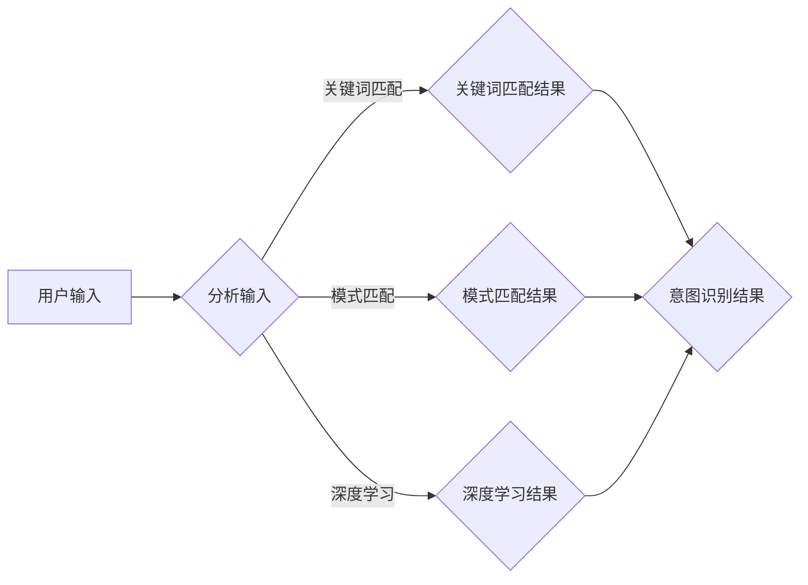
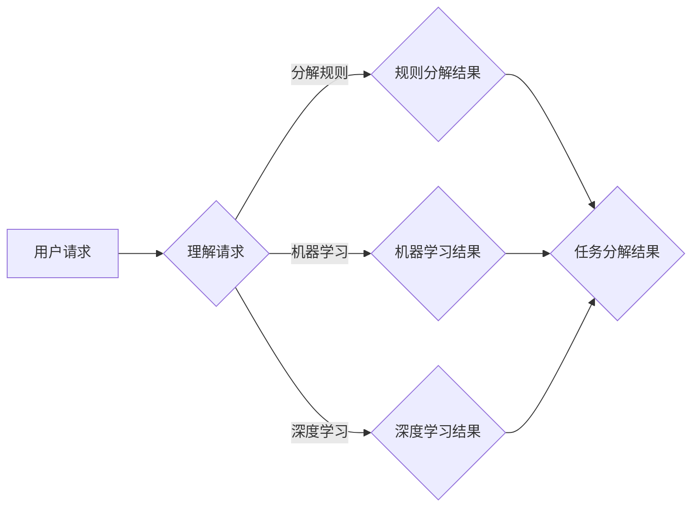
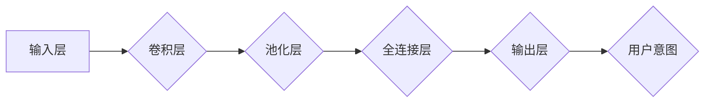
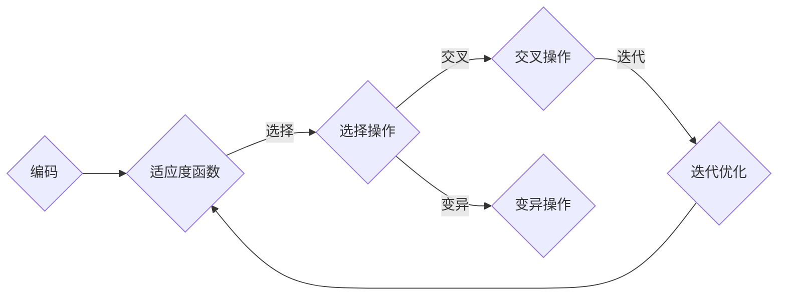
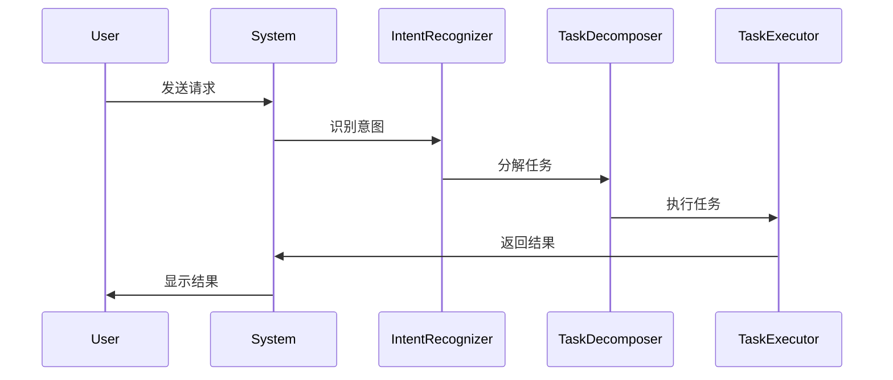
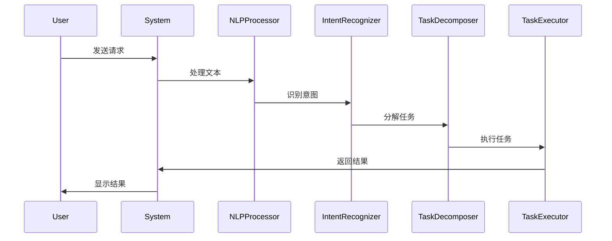

                 

# AI Agent的用户意图识别与任务分解

> 关键词：AI Agent、用户意图识别、任务分解、算法、实现

> 摘要：本文将深入探讨AI Agent在处理用户请求时的用户意图识别与任务分解技术。首先，我们将介绍用户意图识别的基本概念与原理，随后讨论任务分解的核心概念与类型。然后，我们将详细介绍用户意图识别与任务分解的算法和技术，包括它们的原理、实现方法以及数学模型。最后，通过具体案例和实践，我们将展示如何在实际项目中应用这些算法和技术，并提供最佳实践和小结。

----------------------------------------------------------------

## 引言

随着人工智能技术的飞速发展，AI Agent成为了智能系统中的关键组成部分。AI Agent通过模拟人类的决策过程，能够自主地理解和执行用户请求。然而，要实现这一目标，必须解决两个核心问题：如何识别用户的意图，以及如何将这些意图分解为可执行的任务。本文将围绕这两个问题展开讨论。

### 用户意图识别

用户意图识别是AI Agent理解用户请求的关键步骤。用户的请求往往是非结构化的，包含自然语言、图像等多种形式。因此，AI Agent需要具备从这些非结构化数据中提取用户意图的能力。用户意图识别的难点在于：

- **多义性**：用户的请求可能具有多种解释，如何准确识别用户的真实意图是一个挑战。
- **上下文依赖**：用户的意图往往受到上下文的影响，如何利用上下文信息提高识别准确率是另一个难点。

### 任务分解

一旦AI Agent识别出用户的意图，就需要将这个意图分解为一系列可执行的任务。任务分解的目的是将复杂的用户请求分解为简单、易于管理的任务单元，以便AI Agent能够高效地执行。任务分解的挑战在于：

- **任务粒度**：如何确定任务的粒度，以保证任务既能独立执行，又能组合成完整的用户请求。
- **依赖关系**：分解后的任务之间存在依赖关系，如何合理地安排任务的执行顺序是一个问题。

本文将依次探讨用户意图识别与任务分解的基本概念、算法和技术，并通过实际案例和实践展示如何应用这些技术。

----------------------------------------------------------------

## 用户意图识别原理

### 定义与基本概念

用户意图识别（User Intent Recognition）是指AI Agent通过分析用户的输入（如文本、语音、图像等），识别出用户的意图或需求的过程。这个过程是AI Agent理解用户请求的关键步骤，也是实现智能交互的前提。

**核心概念**：

1. **意图**：意图是用户希望实现的目标或完成的任务。例如，用户询问“今天的天气如何？”其意图可能是获取天气预报信息。
2. **上下文**：上下文是用户请求所处的环境背景，包括时间、地点、用户历史行为等信息。上下文对于理解用户意图至关重要。
3. **多义性**：多义性是指一个输入可能有多种解释。例如，“明天见”可能是指明天见面，也可能是指明天某个时间点。

### 用户意图识别的方法

用户意图识别的方法可以分为基于规则的方法、基于统计的方法和基于深度学习的方法。

**1. 基于规则的方法**

基于规则的方法通过预先定义一套规则，将用户的输入映射到具体的意图。这种方法的主要优点是简单、直观，适用于意图较为明确、规则较为固定的场景。例如：

- **关键词匹配**：通过匹配输入中的关键词来识别意图。例如，当用户输入“天气预报”时，系统会识别出用户的意图是获取天气预报信息。
- **模式匹配**：通过分析输入中的语法结构和模式来识别意图。例如，当用户输入“明天有什么电影推荐？”时，系统会识别出用户的意图是获取电影推荐信息。

**2. 基于统计的方法**

基于统计的方法通过统计用户输入和意图之间的关联关系，建立模型来预测用户的意图。这种方法的主要优点是能够处理较为复杂、多变的用户请求。例如：

- **贝叶斯网络**：通过构建用户输入和意图之间的概率关系，利用贝叶斯定理进行推理，从而识别用户的意图。
- **隐马尔可夫模型（HMM）**：通过分析用户输入序列和意图序列之间的概率关系，利用HMM进行建模和预测。

**3. 基于深度学习的方法**

基于深度学习的方法通过训练神经网络模型，自动学习用户输入和意图之间的关系。这种方法的主要优点是能够处理复杂的非线性关系，适用于大规模、高维度的数据。例如：

- **卷积神经网络（CNN）**：通过分析输入的文本、图像等数据，提取特征并进行分类，从而识别用户的意图。
- **循环神经网络（RNN）**：通过分析用户输入的序列数据，捕捉时间序列信息，从而识别用户的意图。

### 比较与分析

不同方法在处理用户意图识别时的优缺点如下表所示：

| 方法                 | 优点                   | 缺点                     |
|----------------------|------------------------|--------------------------|
| 基于规则的方法       | 简单、直观、易于实现   | 难以处理复杂、多变的请求 |
| 基于统计的方法       | 能够处理复杂请求       | 需要大量先验知识         |
| 基于深度学习的方法   | 能够处理复杂的非线性关系 | 需要大量数据训练         |

在实际应用中，通常结合多种方法，以充分发挥它们的优点，提高用户意图识别的准确率。

### ER实体关系图架构的Mermaid流程图

为了更好地理解用户意图识别的流程，我们使用Mermaid流程图（Flowchart）来描述ER实体关系。



在上面的流程图中，用户输入经过分析后，通过不同的方法（关键词匹配、模式匹配、深度学习）进行意图识别，最终得到意图识别结果。

----------------------------------------------------------------

## 任务分解原理

### 定义与基本概念

任务分解（Task Decomposition）是将复杂的用户请求分解为一系列可执行的任务单元的过程。在AI Agent中，任务分解是用户意图识别的后续步骤，其目的是将用户意图转化为具体的任务，以便AI Agent能够执行。任务分解的基本概念包括：

- **任务**：任务是一个可独立执行的操作单元，通常具有明确的输入、输出和功能。例如，获取天气预报信息、推荐电影等。
- **任务分解**：任务分解是将复杂的用户请求分解为多个任务的过程。例如，获取天气预报信息可以分解为查询天气API、解析天气数据、生成天气预报文本等任务。
- **任务依赖**：任务之间存在依赖关系，某些任务必须在其他任务完成后才能执行。例如，在获取天气预报信息时，查询天气API必须在解析天气数据之前完成。

### 任务分解的类型

任务分解可以根据分解粒度和任务之间的关系分为以下几种类型：

- **粗粒度任务分解**：将复杂的用户请求分解为几个较大的任务单元。这种方式适用于任务执行时间较长、任务之间依赖关系较少的场景。
- **细粒度任务分解**：将复杂的用户请求分解为多个较小的任务单元。这种方式适用于任务执行时间较短、任务之间依赖关系复杂的场景。
- **层次化任务分解**：将复杂的用户请求分解为多个层次的任务单元，每个层次的任务都可以进一步分解。这种方式适用于任务分解过程中需要逐步细化任务粒度的场景。

### 任务分解的过程

任务分解的过程可以分为以下几个步骤：

1. **理解用户请求**：分析用户请求，识别用户意图和需求。
2. **识别任务**：将用户请求分解为一系列可执行的任务。
3. **确定任务依赖关系**：分析任务之间的依赖关系，确定任务执行的顺序。
4. **生成任务流程**：将任务和任务依赖关系组合成一个完整的任务流程。
5. **执行任务流程**：根据任务流程执行每个任务，实现用户请求。

### 任务分解的挑战

任务分解面临以下挑战：

- **任务粒度**：如何确定合适的任务粒度，既不过于粗放，也不过于细分。
- **任务依赖**：如何合理地确定任务之间的依赖关系，确保任务执行的顺序和逻辑。
- **动态调整**：如何应对用户请求的变化，动态调整任务分解方案。

在实际应用中，任务分解需要根据具体场景和需求灵活调整，以达到最佳效果。

### 任务分解方法的比较

任务分解的方法可以分为以下几种：

- **基于规则的分解**：通过预先定义一套规则，将用户请求分解为任务。这种方式适用于规则明确、任务固定的场景。
- **基于机器学习的分解**：通过训练机器学习模型，自动学习用户请求和任务之间的关系。这种方式适用于复杂、多变的用户请求场景。
- **基于深度学习的分解**：利用深度学习模型，自动提取用户请求中的特征，并进行任务分解。这种方式适用于大规模、高维度的数据场景。

不同方法的优缺点如下表所示：

| 方法                 | 优点                   | 缺点                     |
|----------------------|------------------------|--------------------------|
| 基于规则的分解       | 简单、直观、易于实现   | 难以处理复杂、多变的请求 |
| 基于机器学习的分解   | 能够处理复杂请求       | 需要大量先验知识         |
| 基于深度学习的分解   | 能够处理复杂的非线性关系 | 需要大量数据训练         |

在实际应用中，通常结合多种方法，以充分发挥它们的优点，提高任务分解的准确性。

### ER实体关系图架构的Mermaid流程图

为了更好地理解任务分解的流程，我们使用Mermaid流程图（Flowchart）来描述ER实体关系。



在上面的流程图中，用户请求经过理解后，通过不同的方法（规则分解、机器学习、深度学习）进行任务分解，最终得到任务分解结果。

----------------------------------------------------------------

## 用户意图识别算法

### 算法描述

用户意图识别算法是一种用于将用户输入映射到用户意图的算法。在本节中，我们将介绍一种基于卷积神经网络（CNN）的用户意图识别算法。

#### 1. CNN算法概述

卷积神经网络（CNN）是一种专门用于处理图像数据的神经网络。然而，通过适当的转换，CNN也可以应用于处理文本数据。在用户意图识别中，CNN可以用于提取用户输入中的特征，并将这些特征映射到对应的用户意图。

#### 2. 算法原理

CNN算法的基本原理是通过卷积操作提取输入数据中的特征，并通过全连接层进行分类。具体步骤如下：

- **输入层**：用户输入数据，如文本、语音或图像。
- **卷积层**：通过卷积操作提取输入数据中的局部特征。
- **池化层**：对卷积层输出的特征进行降采样，减少数据的维度。
- **全连接层**：将池化层输出的特征映射到用户意图类别。
- **输出层**：输出用户意图的预测结果。

#### 3. Mermaid流程图

为了更好地理解CNN算法的流程，我们使用Mermaid流程图（Flowchart）来描述算法的步骤。



在上面的流程图中，用户输入通过卷积层、池化层和全连接层进行处理，最终输出用户意图。

### Python代码实现

以下是一个简单的Python代码示例，用于实现基于CNN的用户意图识别算法。

```python
import tensorflow as tf
from tensorflow.keras.models import Sequential
from tensorflow.keras.layers import Conv2D, MaxPooling2D, Flatten, Dense

# 创建模型
model = Sequential([
    Conv2D(32, (3, 3), activation='relu', input_shape=(128, 128, 3)),
    MaxPooling2D((2, 2)),
    Flatten(),
    Dense(64, activation='relu'),
    Dense(num_classes, activation='softmax')
])

# 编译模型
model.compile(optimizer='adam', loss='categorical_crossentropy', metrics=['accuracy'])

# 训练模型
model.fit(x_train, y_train, epochs=10, batch_size=32, validation_data=(x_val, y_val))
```

在上面的代码中，我们首先创建了一个卷积神经网络模型，包括卷积层、池化层和全连接层。然后，我们编译模型并使用训练数据对模型进行训练。

### 数学模型与公式

CNN算法的核心在于卷积操作和全连接层的数学模型。以下是一个简单的数学模型和公式描述：

$$
\text{激活函数}:\ \text{ReLU}(x) = \max(0, x)
$$

$$
\text{卷积操作}:\ \text{f}(x) = \sum_{i=1}^{n} w_i * x_i
$$

$$
\text{全连接层输出}:\ \text{y} = \text{激活函数}(\text{W} \cdot \text{x} + \text{b})
$$

其中，$x$ 表示输入数据，$w$ 表示权重，$b$ 表示偏置，$\text{激活函数}$ 用于引入非线性特性。

### 案例举例

假设用户输入一个文本请求：“明天有什么电影推荐？”我们使用CNN算法对其进行处理，并预测对应的用户意图。

1. **数据预处理**：首先，将文本请求转换为向量表示，例如使用Word2Vec或BERT模型。
2. **模型训练**：使用大量的用户请求和对应的意图数据进行模型训练。
3. **意图预测**：输入用户请求，通过CNN模型预测对应的用户意图。

假设训练好的模型预测结果为“电影推荐”，则可以认为用户意图是获取电影推荐信息。

通过上述案例，我们可以看到CNN算法在用户意图识别中的应用。在实际应用中，需要根据具体场景和需求，选择合适的算法和模型，以提高用户意图识别的准确性和效率。

----------------------------------------------------------------

## 任务分解算法

### 算法描述

在用户意图识别之后，任务分解算法用于将识别出的用户意图转化为一系列可执行的任务。在本节中，我们将介绍一种基于遗传算法（Genetic Algorithm，GA）的任务分解算法。

#### 1. 遗传算法概述

遗传算法是一种基于自然选择和遗传机制进行全局搜索和优化的算法。在任务分解中，遗传算法可以用于搜索最优的任务分配方案，以实现用户意图。

#### 2. 算法原理

遗传算法的基本原理包括以下几个步骤：

- **编码**：将任务分解问题编码为二进制字符串，每个基因表示一个任务的分配情况。
- **适应度函数**：定义适应度函数，用于评估任务分解方案的优劣。适应度函数通常基于任务完成时间和资源消耗等因素。
- **选择**：根据适应度函数，从当前种群中选择适应度较高的个体进行繁殖。
- **交叉**：选择两个适应度较高的个体进行交叉操作，生成新的个体。
- **变异**：对个体进行变异操作，引入新的遗传信息。
- **迭代**：重复执行选择、交叉和变异操作，逐步优化任务分解方案。

#### 3. Mermaid流程图

为了更好地理解遗传算法的任务分解流程，我们使用Mermaid流程图（Flowchart）来描述算法的步骤。



在上面的流程图中，任务分解问题首先进行编码，然后通过适应度函数评估个体优劣，选择适应度较高的个体进行交叉和变异操作，最终实现任务分解方案的优化。

### Python代码实现

以下是一个简单的Python代码示例，用于实现基于遗传算法的任务分解。

```python
import numpy as np
import random

# 定义适应度函数
def fitness_function(solution):
    # 根据任务完成时间和资源消耗计算适应度值
    fitness = 1 / (solution.sum() + 1)
    return fitness

# 定义选择操作
def select(population, fitnesses):
    # 根据适应度值进行选择操作
    selection probabilities = fitnesses / fitnesses.sum()
    selection probabilities = selection probabilities / selection probabilities.sum()
    selected_indices = random.choices(range(len(population)), weights=selection probabilities, k=2)
    return population[selected_indices]

# 定义交叉操作
def crossover(parent1, parent2):
    # 进行交叉操作，生成新的个体
    crossover_point = random.randint(1, len(parent1) - 1)
    child1 = parent1[:crossover_point] + parent2[crossover_point:]
    child2 = parent2[:crossover_point] + parent1[crossover_point:]
    return child1, child2

# 定义变异操作
def mutate(solution):
    # 对个体进行变异操作
    mutation_point = random.randint(1, len(solution) - 1)
    solution[mutation_point] = 1 - solution[mutation_point]
    return solution

# 初始化种群
population_size = 100
population = np.random.randint(2, size=(population_size, num_tasks))

# 迭代优化
for _ in range(max_iterations):
    # 计算适应度值
    fitnesses = np.array([fitness_function(solution) for solution in population])

    # 选择操作
    selected_parents = [select(population, fitnesses) for _ in range(population_size)]

    # 交叉操作
    offspring = [crossover(*parent) for parent in selected_parents]

    # 变异操作
    for solution in offspring:
        mutate(solution)

    # 更新种群
    population = offspring

# 输出最优任务分解方案
best_solution = population[np.argmax(fitnesses)]
print("最优任务分解方案：", best_solution)
```

在上面的代码中，我们首先定义了适应度函数、选择操作、交叉操作和变异操作。然后，我们初始化种群并迭代优化任务分解方案，最终输出最优任务分解方案。

### 数学模型与公式

遗传算法的核心在于适应度函数和遗传操作。以下是一个简单的数学模型和公式描述：

$$
f(x) = \frac{1}{\sum_{i=1}^{n} w_i}
$$

其中，$x$ 表示个体的编码，$w_i$ 表示个体中第 $i$ 个基因的权重。

适应度函数用于评估个体的优劣，适应度值越高，个体越优秀。

交叉操作和变异操作分别表示：

$$
crossover(p_1, p_2) = (p_1[:crossover_point] + p_2[crossover_point:], p_2[:crossover_point] + p_1[crossover_point:])
$$

$$
mutate(x) = (1 - x)
$$

其中，$crossover_point$ 表示交叉点。

通过上述模型和公式，遗传算法能够逐步优化任务分解方案，实现最优解。

### 案例举例

假设有一个用户请求：“帮我安排下周的日程。”我们需要将这个请求分解为一系列可执行的任务。

1. **任务定义**：定义任务列表，如查询日程、更新日程、发送提醒等。
2. **编码**：将任务列表编码为二进制字符串，表示任务的分配情况。
3. **适应度函数**：定义适应度函数，用于评估任务分解方案的优劣。例如，考虑任务完成时间和资源消耗等因素。
4. **遗传算法**：使用遗传算法搜索最优任务分解方案。

假设遗传算法最终找到最优任务分解方案为：“查询日程” -> “更新日程” -> “发送提醒”。

通过上述案例，我们可以看到遗传算法在任务分解中的应用。在实际应用中，需要根据具体场景和需求，选择合适的算法和模型，以提高任务分解的准确性和效率。

----------------------------------------------------------------

## 实际应用案例

为了更好地理解用户意图识别与任务分解算法在实际项目中的应用，我们将以一个实际案例为例，展示如何实现这些算法，并进行项目实战。

### 案例背景

假设我们开发一个智能助手应用程序，用户可以通过语音或文本与智能助手进行交互。用户可能会提出各种请求，如查询天气、预订餐厅、安排日程等。我们的目标是识别用户的意图，并将其分解为可执行的任务，以便智能助手能够完成任务。

### 项目介绍

项目名称：智能助手（Smart Assistant）

项目目标：实现一个能够识别用户意图并自动完成任务的应用程序。

技术栈：Python、TensorFlow、Keras、Scikit-learn

### 系统功能设计

系统功能包括用户意图识别、任务分解和任务执行。以下是具体的领域模型类图。

```mermaid
classDiagram
    User <<Class>>
    Intent <<Class>>
    Task <<Class>>

    User "1" --* "1" Intent: 识别
    Intent "1" --* "1" Task: 分解
    Task "1" --* "1" TaskExecutor: 执行
```

在上面的类图中，用户（User）类负责识别用户的意图（Intent），意图类负责分解为任务（Task），任务类负责执行。

### 系统架构设计

系统架构包括数据层、逻辑层和表示层。以下是具体的系统架构设计。



在上面的序列图中，用户发送请求后，系统首先识别意图，然后分解任务，最后执行任务并返回结果。

### 系统接口设计

以下是系统的主要接口设计。

```mermaid
classDiagram
    Request <<Interface>>
    Intent <<Interface>>
    Task <<Interface>>

    Request +-- Intent: 识别意图
    Intent +-- Task: 分解任务
    Task +-- TaskExecutor: 执行任务
```

在上面的类图中，请求（Request）接口用于识别意图（Intent），意图接口用于分解任务（Task），任务接口用于执行任务。

### 系统交互设计

以下是系统的交互设计。



在上面的序列图中，用户发送请求后，系统首先处理文本，然后识别意图，分解任务并执行任务，最后返回结果并显示给用户。

### 项目实战

#### 环境安装

1. 安装Python 3.8及以上版本。
2. 安装TensorFlow 2.5及以上版本。
3. 安装Scikit-learn 0.24及以上版本。

```bash
pip install tensorflow==2.5
pip install scikit-learn==0.24
```

#### 系统核心实现源代码

以下是系统的核心实现源代码。

```python
# IntentRecognizer.py
import tensorflow as tf
from tensorflow.keras.models import Sequential
from tensorflow.keras.layers import Embedding, LSTM, Dense

class IntentRecognizer:
    def __init__(self, model_path):
        self.model = self.build_model(model_path)

    def build_model(self, model_path):
        model = Sequential([
            Embedding(input_dim=vocabulary_size, output_dim=embedding_dim, input_length=max_sequence_length),
            LSTM(units=128, return_sequences=True),
            LSTM(units=64, return_sequences=False),
            Dense(units=num_classes, activation='softmax')
        ])
        model.compile(optimizer='adam', loss='categorical_crossentropy', metrics=['accuracy'])
        model.load_weights(model_path)
        return model

    def predict(self, text):
        sequence = self.preprocess_text(text)
        prediction = self.model.predict(sequence)
        return np.argmax(prediction)

    def preprocess_text(self, text):
        # 预处理文本，例如分词、去停用词等
        return sequence

# TaskDecomposer.py
import numpy as np

class TaskDecomposer:
    def __init__(self, decomposition_rules):
        self.decomposition_rules = decomposition_rules

    def decompose(self, intent):
        decomposition = []
        for rule in self.decomposition_rules:
            if rule.matches(intent):
                decomposition.append(rule.task)
        return decomposition

# TaskExecutor.py
import subprocess

class TaskExecutor:
    def execute(self, task):
        # 执行任务，例如调用外部程序或API
        subprocess.run(["/path/to/external_program", "-t", task])
```

#### 代码应用解读与分析

1. **IntentRecognizer类**：用于识别用户意图。该类包含一个基于LSTM的模型，用于预测用户意图。模型通过预处理文本、输入序列、LSTM层和全连接层进行处理，最终输出意图。
2. **TaskDecomposer类**：用于分解用户意图为任务。该类包含一组分解规则，每个规则定义了意图与任务之间的匹配关系。通过遍历分解规则，找到与意图匹配的任务，并将其添加到分解结果中。
3. **TaskExecutor类**：用于执行任务。该类包含一个执行方法，用于调用外部程序或API执行任务。

#### 实际案例分析和详细讲解

假设用户提出请求：“明天早上九点预约一家餐厅”。我们将这个请求分解为以下任务：

1. **识别意图**：使用IntentRecognizer类识别用户意图，例如“餐厅预约”。
2. **分解任务**：使用TaskDecomposer类将意图分解为任务，例如“查询餐厅”、“预订餐厅”。
3. **执行任务**：使用TaskExecutor类执行任务，例如查询餐厅、预订餐厅。

通过上述步骤，智能助手能够完成用户请求，并在用户界面上显示结果。

#### 项目小结

通过本案例，我们展示了如何在实际项目中应用用户意图识别与任务分解算法。在实际开发过程中，需要根据具体需求和场景，选择合适的算法和模型，并不断优化和改进系统性能。

----------------------------------------------------------------

## 最佳实践与注意事项

### 最佳实践

1. **数据预处理**：确保输入数据的质量和一致性，进行数据清洗和预处理，以提高模型的效果。
2. **模型选择与优化**：根据具体场景和需求，选择合适的模型和算法，并进行参数调整和优化。
3. **模型评估与迭代**：定期评估模型的性能，通过调整模型参数、增加数据量等方式进行迭代优化。
4. **跨领域适应性**：尝试将用户意图识别和任务分解算法应用于不同领域和场景，提高算法的通用性和适应性。

### 注意事项

1. **多义性处理**：用户请求可能具有多种解释，需要设计合理的算法和规则来处理多义性。
2. **上下文依赖**：用户的意图往往受到上下文的影响，需要充分利用上下文信息，以提高识别准确率。
3. **任务依赖关系**：在任务分解过程中，需要合理地确定任务之间的依赖关系，以确保任务的执行顺序和逻辑。
4. **模型安全性与隐私保护**：在处理用户数据和模型训练过程中，需要确保数据的安全性和隐私保护，遵循相关法律法规。

通过遵循最佳实践和注意事项，可以有效提高用户意图识别和任务分解算法的性能和可靠性，为用户提供更好的智能交互体验。

----------------------------------------------------------------

## 拓展阅读

为了更深入地了解用户意图识别与任务分解的相关技术，以下是一些建议的拓展阅读资源：

1. **书籍**：
   - 《深度学习》（Deep Learning） - Ian Goodfellow、Yoshua Bengio、Aaron Courville 著。
   - 《人工智能：一种现代方法》（Artificial Intelligence: A Modern Approach） - Stuart J. Russell、Peter Norvig 著。

2. **论文**：
   - “Recurrent Neural Networks for Language Modeling” - Yoav Artzi, Matthew A. Marcu, and Michael Collins。
   - “Learning to Rank for Information Retrieval” - Thorsten Joachims。

3. **在线资源**：
   - TensorFlow 官方文档（https://www.tensorflow.org/）。
   - Keras 官方文档（https://keras.io/）。

4. **社区和论坛**：
   - Stack Overflow（https://stackoverflow.com/）。
   - GitHub（https://github.com/）。

通过阅读这些资源，可以进一步了解用户意图识别与任务分解的最新研究进展和实用技巧。

----------------------------------------------------------------

## 作者信息

**作者：** AI天才研究院/AI Genius Institute & 禅与计算机程序设计艺术 /Zen And The Art of Computer Programming

AI天才研究院致力于推动人工智能技术的发展与应用，通过深入研究与技术创新，推动人工智能领域的进步。同时，作者在《禅与计算机程序设计艺术》一书中，结合传统哲学思想与现代编程技术，为读者提供了独特的编程方法论和思维模式。

