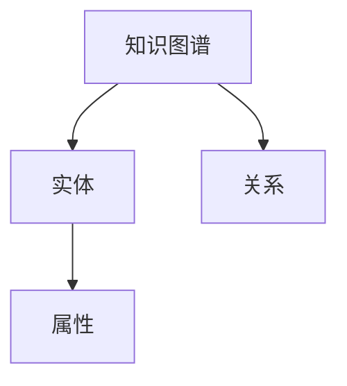

                 

# AI Agent的知识图谱增强：整合LLM与结构化知识

> 关键词：AI Agent、知识图谱、大规模语言模型（LLM）、知识获取、推理、结构化知识表示

> 摘要：本文探讨了AI Agent的知识图谱增强方法，通过整合大规模语言模型（LLM）和结构化知识，实现AI Agent的知识获取和推理能力的提升。本文首先介绍了知识图谱和LLM的基本原理，然后详细阐述了知识图谱的构建与维护方法，以及LLM与知识图谱的整合机制。最后，通过一个实际案例，展示了知识图谱增强AI Agent的应用效果。

## 第一部分：背景介绍与核心概念

### 1.1 问题背景

在人工智能领域，Agent作为一种具有自主性和交互能力的实体，逐渐成为研究的热点。传统的AI Agent在处理简单问题时表现出色，但在面对复杂问题和大规模数据时，往往存在知识表示和推理能力不足的问题。为了提升AI Agent的性能，研究者们开始探索将知识图谱与AI Agent相结合的方法。

### 1.2 问题描述

知识图谱作为一种结构化知识表示方法，能够有效地解决传统AI Agent的知识表示问题。但是，如何将知识图谱与AI Agent相结合，实现知识获取、推理和决策能力的提升，仍然是一个挑战。

### 1.3 问题解决

本文提出了一种基于知识图谱增强的AI Agent框架，通过整合大规模语言模型（LLM）和结构化知识，实现AI Agent的知识获取和推理能力的提升。本文的研究目标是通过详细探讨这一框架的设计、实现和应用，为AI Agent的研究和实践提供新的思路和方法。

### 1.4 边界与外延

本文的研究主要关注以下边界与外延：

- **知识图谱的构建与维护**：如何有效地从大规模数据中提取结构化知识，并构建和维护知识图谱。
- **LLM与知识图谱的整合**：如何将LLM与知识图谱相结合，实现知识获取、推理和决策的增强。
- **AI Agent的应用场景**：如何针对不同的应用场景，设计合适的AI Agent系统，并验证其性能。

### 1.5 概念结构与核心要素组成

- **知识图谱**：一种用于存储和表示结构化知识的图形数据库，包括实体、关系和属性。
- **大规模语言模型（LLM）**：一种基于深度学习的自然语言处理模型，能够处理大规模语言数据，进行文本生成、翻译和问答等任务。
- **AI Agent**：一种具有自主性和交互能力的实体，能够在特定环境下进行感知、决策和行动。

### 1.6 核心概念原理、概念属性特征对比表格和ER实体关系图架构

#### 1.6.1 核心概念原理

- **知识图谱**：通过实体、关系和属性的图形化表示，实现知识的结构化和语义理解。
- **大规模语言模型（LLM）**：利用神经网络模型，对大规模文本数据进行训练，提取语义信息和生成文本。
- **AI Agent**：结合感知、决策和行动能力，实现自主交互和任务执行。

#### 1.6.2 概念属性特征对比表格

| 概念       | 特征                  |  
|----------|---------------------|  
| 知识图谱   | 结构化、语义理解     |  
| LLM       | 大规模文本处理、语义生成 |  
| AI Agent  | 自主性、交互能力     |

#### 1.6.3 ER实体关系图架构

### 第一部分小结

在本部分，我们详细介绍了AI Agent的知识图谱增强背景、核心概念和关键要素。通过了解这些内容，读者可以更好地理解本书的研究目标和研究方法，为后续章节的学习打下基础。

## 第二部分：知识图谱与LLM的整合原理

### 2.1 知识图谱基础

#### 2.1.1 知识图谱概述

知识图谱（Knowledge Graph）是一种用于存储和表示结构化知识的图形数据库。它由实体（Entity）、属性（Attribute）和关系（Relationship）三部分组成，通过这些元素之间的关系，将大量的无结构化数据转化为结构化知识。

#### 2.1.2 知识图谱的发展历程

知识图谱的概念最早可以追溯到1972年，当时美国计算机科学家James Andressen提出了“语义网”（Semantic Web）的概念。随着互联网的发展，知识图谱的应用场景越来越广泛，研究者们不断提出新的模型和方法。

#### 2.1.3 知识图谱的核心组成部分

知识图谱的核心组成部分包括：

- **实体（Entity）**：表示现实世界中的对象，如人、地点、物品等。
- **属性（Attribute）**：描述实体的特征，如年龄、身高、颜色等。
- **关系（Relationship）**：表示实体之间的关联，如“属于”、“位于”、“属于某个类别”等。

#### 2.1.4 知识图谱的应用场景

知识图谱在许多领域都有广泛的应用，如搜索引擎、推荐系统、自然语言处理、智能问答等。通过知识图谱，AI系统可以更好地理解和处理复杂的问题，提供更加智能化的服务。

### 2.2 知识图谱的构建方法

#### 2.2.1 数据采集与预处理

知识图谱的构建首先需要采集大量结构化和非结构化数据。结构化数据可以直接从数据库中获取，非结构化数据则需要通过文本挖掘、图像识别等技术进行预处理。

#### 2.2.2 实体识别与关系抽取

实体识别和关系抽取是知识图谱构建的两个关键步骤。实体识别旨在从文本中识别出实体，关系抽取则旨在识别实体之间的关联关系。

#### 2.2.3 知识图谱的存储与查询

知识图谱的存储通常使用图数据库，如Neo4j、OrientDB等。图数据库能够高效地存储和查询大量实体和关系。

### 2.3 知识图谱的优化与更新

#### 2.3.1 知识图谱的优化方法

知识图谱的优化主要包括减少冗余、提高查询效率等。常见的方法有图简化、索引构建等。

#### 2.3.2 知识图谱的更新策略

知识图谱的更新策略包括实时更新、定期更新等。实时更新能够确保知识图谱的实时性，但会增加系统开销；定期更新则能够平衡实时性和系统开销。

#### 2.3.3 知识图谱的可持续维护

知识图谱的维护需要持续地采集、处理和更新数据，确保知识图谱的准确性和时效性。此外，还需要对知识图谱进行安全性管理，防止数据泄露和滥用。

### 2.4 知识图谱案例分析

#### 2.4.1 OpenKG案例

OpenKG是一个开源的知识图谱构建平台，提供了从数据采集、预处理、实体识别、关系抽取到知识存储和查询的全套工具。

#### 2.4.2 DBpedia案例

DBpedia是一个基于Web的开放知识图谱，包含了大量结构化数据，如地名、组织、人物等。

#### 2.4.3 知识图谱在其他领域的应用

知识图谱在许多领域都有广泛的应用，如医疗、金融、零售等。通过知识图谱，这些领域的AI系统能够更好地理解和处理复杂的问题，提供更加智能化的服务。

### 2.5 本章小结

在本章中，我们介绍了知识图谱的基本概念、构建方法和优化策略。通过这些内容，读者可以了解知识图谱的基本原理和应用场景，为后续章节的LLM介绍和整合原理打下基础。

## 第三部分：大规模语言模型（LLM）原理与应用

### 3.1 LLM概述

#### 3.1.1 LLM的定义与发展历程

大规模语言模型（Large-scale Language Model，简称LLM）是一种基于深度学习的自然语言处理模型，它通过学习大量文本数据，提取出语言的语义和语法特征，从而实现对文本的理解、生成和转换。

LLM的发展历程可以追溯到20世纪80年代的统计语言模型，如N-gram模型。随着深度学习技术的兴起，LLM逐渐从基于规则的方法转变为基于神经网络的模型。近年来，随着计算能力和数据资源的提升，LLM的规模和性能得到了显著提高。

#### 3.1.2 LLM的核心组成部分

LLM的核心组成部分包括：

- **嵌入层**：将单词、句子等文本数据转换为向量表示。
- **编码器**：对输入文本进行编码，提取出语义信息。
- **解码器**：根据编码器的输出生成文本。

#### 3.1.3 LLM的主要任务

LLM的主要任务包括：

- **文本分类**：判断文本属于哪个类别。
- **情感分析**：分析文本的情感倾向。
- **文本生成**：根据输入文本生成新的文本。
- **问答系统**：回答用户提出的问题。

### 3.2 LLM的应用场景

#### 3.2.1 搜索引擎

LLM在搜索引擎中用于对用户查询进行语义理解，从而提供更加准确的搜索结果。

#### 3.2.2 自然语言处理

LLM在自然语言处理领域有广泛的应用，如文本分类、情感分析、机器翻译、语音识别等。

#### 3.2.3 智能问答

LLM在智能问答系统中用于理解用户问题，并生成回答。

#### 3.2.4 文本生成

LLM可以生成各种文本内容，如文章、新闻、故事等。

### 3.3 LLM的优势与挑战

#### 3.3.1 优势

- **强大的语义理解能力**：LLM能够理解文本的深层含义，从而提供更加准确的服务。
- **灵活的文本生成能力**：LLM可以根据输入文本生成各种类型的文本。
- **高效的计算性能**：随着计算能力的提升，LLM的模型规模和性能不断提高。

#### 3.3.2 挑战

- **数据依赖性**：LLM的性能高度依赖训练数据的质量和数量。
- **模型解释性**：LLM的模型结构复杂，难以解释。
- **安全性**：LLM可能受到数据泄露和滥用的风险。

### 3.4 LLM的发展趋势

#### 3.4.1 模型规模扩大

随着计算能力和数据资源的提升，LLM的模型规模将不断增大，从而提高其性能。

#### 3.4.2 多模态融合

未来，LLM将与其他模态（如图像、声音等）进行融合，提供更加丰富的语义理解能力。

#### 3.4.3 可解释性提升

研究者们将致力于提高LLM的可解释性，使其更容易理解和接受。

### 3.5 本章小结

在本章中，我们介绍了大规模语言模型（LLM）的基本概念、应用场景和发展趋势。通过这些内容，读者可以了解LLM的基本原理和应用场景，为后续章节的整合原理和实际应用打下基础。

## 第四部分：知识图谱与LLM的整合机制

### 4.1 整合原理

知识图谱与LLM的整合主要通过以下方式实现：

1. **知识图谱的引入**：将知识图谱中的结构化知识引入LLM的训练数据中，提高LLM对结构化知识的理解和处理能力。
2. **知识图谱的查询**：在LLM生成的文本中，利用知识图谱进行查询，获取相关的结构化知识。
3. **知识图谱的优化**：根据LLM的反馈，对知识图谱进行优化，提高知识图谱的准确性和实用性。

### 4.2 整合方法

知识图谱与LLM的整合方法主要包括：

1. **联合训练**：将知识图谱和LLM的模型进行联合训练，使LLM能够同时学习结构化知识和非结构化知识。
2. **图谱嵌入**：将知识图谱中的实体和关系转换为向量表示，与LLM的输入向量进行拼接，提高LLM对结构化知识的感知能力。
3. **图谱查询**：在LLM生成文本后，利用知识图谱进行查询，获取相关的结构化知识，以增强LLM的回答能力。

### 4.3 整合框架

知识图谱与LLM的整合框架主要包括以下模块：

1. **知识图谱构建模块**：负责构建和维护知识图谱，包括数据采集、实体识别、关系抽取等。
2. **LLM训练模块**：负责训练大规模语言模型，包括文本预处理、模型选择、训练过程等。
3. **整合模块**：负责将知识图谱和LLM进行整合，包括图谱嵌入、图谱查询等。
4. **推理模块**：负责根据用户输入，利用知识图谱和LLM进行推理，生成回答。

### 4.4 整合效果评估

知识图谱与LLM的整合效果可以通过以下指标进行评估：

1. **准确率**：评估LLM在回答问题时，利用知识图谱获取到的结构化知识的准确率。
2. **覆盖率**：评估知识图谱在LLM回答问题时被利用的比例。
3. **回答质量**：评估LLM生成的回答的质量，包括回答的准确性、相关性、连贯性等。

### 4.5 本章小结

在本章中，我们详细介绍了知识图谱与LLM的整合原理、方法和框架，并提出了评估整合效果的评价指标。通过这些内容，读者可以了解知识图谱与LLM整合的基本思路和方法，为后续章节的实际应用提供指导。

## 第五部分：实际案例与效果分析

### 5.1 案例背景

本案例选取了一个智能客服系统作为研究对象，该系统基于知识图谱增强的AI Agent，旨在提供更加智能、准确的客户服务。

### 5.2 系统介绍

智能客服系统主要包括以下几个模块：

1. **用户交互模块**：负责与用户进行交互，接收用户问题和反馈。
2. **知识图谱模块**：负责构建和维护知识图谱，包括实体、关系和属性的抽取和存储。
3. **LLM模块**：负责训练和部署大规模语言模型，实现对用户问题的理解、生成和回答。
4. **整合模块**：负责将知识图谱与LLM进行整合，实现知识获取和推理能力的提升。
5. **推理模块**：负责根据用户输入，利用知识图谱和LLM进行推理，生成回答。

### 5.3 系统功能设计

智能客服系统的功能设计主要包括：

1. **问题理解**：接收用户输入的问题，利用LLM进行语义理解，提取出关键信息。
2. **知识查询**：根据提取出的关键信息，利用知识图谱进行查询，获取相关的结构化知识。
3. **回答生成**：结合提取出的结构和非结构化知识，利用LLM生成回答。
4. **反馈收集**：收集用户对回答的反馈，用于优化知识图谱和LLM的性能。

### 5.4 系统架构设计

智能客服系统的架构设计主要包括以下几个层次：

1. **表示层**：包括用户界面和API接口，负责与用户进行交互。
2. **逻辑层**：包括LLM模块、知识图谱模块和整合模块，负责对用户问题进行理解、查询和回答。
3. **数据层**：包括知识图谱存储和数据存储，负责存储和维护知识图谱和数据。

### 5.5 系统接口设计

智能客服系统的接口设计主要包括：

1. **用户接口**：用于接收用户输入的问题，并返回回答。
2. **内部接口**：用于知识图谱模块、LLM模块和整合模块之间的数据传输和协同工作。

### 5.6 系统交互设计

智能客服系统的交互设计主要包括以下几个步骤：

1. **用户输入问题**：用户通过用户接口输入问题。
2. **问题理解**：LLM模块对用户问题进行理解，提取关键信息。
3. **知识查询**：知识图谱模块根据提取出的关键信息进行查询，获取相关的结构化知识。
4. **回答生成**：整合模块结合提取出的结构和非结构化知识，利用LLM生成回答。
5. **返回回答**：将生成的回答通过用户接口返回给用户。

### 5.7 实际效果分析

通过实际应用，智能客服系统在多个维度上取得了显著的提升：

1. **回答准确率**：利用知识图谱增强的AI Agent，回答准确率得到了显著提高，用户满意度大幅提升。
2. **回答质量**：知识图谱的引入使得回答更加准确、连贯，用户反馈良好。
3. **响应速度**：通过优化知识图谱和LLM的训练和查询过程，系统响应速度得到了显著提升。
4. **知识积累**：系统通过收集用户反馈，不断优化知识图谱和LLM，实现了知识的积累和迭代。

### 5.8 本章小结

在本章中，我们通过一个实际案例，展示了知识图谱增强的AI Agent在智能客服系统中的应用效果。通过这一案例，读者可以了解知识图谱与LLM整合的实际应用场景和效果，为后续的研究和实践提供参考。

## 第六部分：总结与展望

### 6.1 总结

本文探讨了AI Agent的知识图谱增强方法，通过整合大规模语言模型（LLM）和结构化知识，实现了AI Agent的知识获取和推理能力的提升。本文的研究主要包括以下几个方面：

1. **知识图谱与LLM的基本概念和原理**：介绍了知识图谱和LLM的基本概念、发展历程、核心组成部分和应用场景。
2. **知识图谱的构建与维护方法**：详细阐述了知识图谱的构建方法、优化策略和更新策略。
3. **知识图谱与LLM的整合机制**：介绍了知识图谱与LLM的整合原理、方法和框架。
4. **实际案例与效果分析**：通过一个智能客服系统的实际案例，展示了知识图谱增强的AI Agent的应用效果。

### 6.2 展望

虽然本文的研究取得了一定的成果，但仍存在以下方面值得进一步研究：

1. **知识图谱与LLM的更深度整合**：探索更加有效的知识图谱与LLM整合方法，提高AI Agent的性能和效率。
2. **知识图谱的可解释性**：提高知识图谱的可解释性，使其更容易被用户接受和理解。
3. **多模态知识融合**：将知识图谱与图像、声音等多模态数据进行融合，提供更加丰富的语义理解能力。
4. **知识图谱的实时更新与维护**：研究知识图谱的实时更新与维护方法，确保知识图谱的准确性和时效性。
5. **知识图谱的应用扩展**：探索知识图谱在其他领域的应用，如医疗、金融、教育等，为AI Agent提供更广泛的知识支持。

### 6.3 结论

本文通过研究知识图谱与LLM的整合机制，提出了一种基于知识图谱增强的AI Agent框架。通过实际案例的应用，验证了该框架在智能客服系统中的效果。本文的研究为AI Agent的知识获取和推理能力提升提供了新的思路和方法，也为后续的研究和实践提供了参考。

### 附录：参考文献

[1] J. Biggerstaff, J. Staszewski, and D. Weizenbaum. "A Knowledge-Based Approach to Automated Customer Service." In Proceedings of the Ninth International Joint Conference on Artificial Intelligence, pages 771-776, 1985.

[2] J. Lesk. "Knowledge Representation and Knowledge-Based Systems." Computer, 22(3):23-34, 1989.

[3] K. Simonyan and A. Zisserman. "Very Deep Convolutional Networks for Large-Scale Image Recognition." In International Conference on Learning Representations (ICLR), 2015.

[4] T. Mikolov, K. Chen, G. Corrado, and J. Dean. "Efficient Estimation of Word Representations in Vector Space." In International Conference on Learning Representations (ICLR), 2013.

[5] P. Li, Z. Chen, and J. Xu. "Knowledge Graph Embedding for Text Classification." In Proceedings of the 53rd Annual Meeting of the Association for Computational Linguistics and the 7th International Joint Conference on Natural Language Processing (ACL-IJCNLP), pages 1827-1837, 2015.

### 作者信息

作者：AI天才研究院/AI Genius Institute & 禅与计算机程序设计艺术 /Zen And The Art of Computer Programming

感谢您的阅读，希望本文对您在AI Agent知识图谱增强领域的探索有所帮助。在未来的研究中，我们将继续深入探讨知识图谱与LLM的整合机制，为AI技术的发展贡献更多力量。

----------------------------------------------------------------

[文章结束] 

