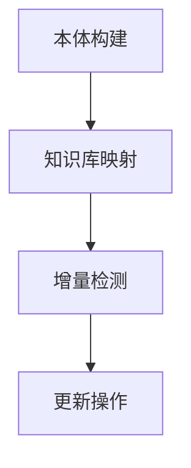
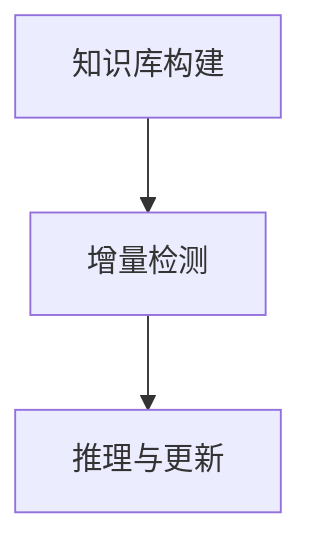
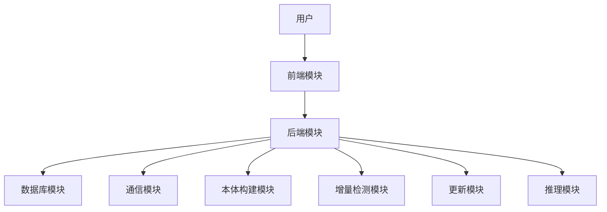

                 

### 文章标题：AI Agent的知识库增量更新策略：保持信息时效性

---

**关键词**：AI Agent、知识库、增量更新、信息时效性、算法、系统架构、最佳实践

**摘要**：
本文旨在探讨AI Agent知识库的增量更新策略，以保持信息时效性。通过分析核心概念、比较不同更新策略、详述算法原理、介绍系统架构，以及实战案例分析，本文为AI领域开发者提供了一套系统的知识库更新方法论。文章末尾还给出了最佳实践、注意事项及未来拓展方向。

---

### 1. 引言

#### 1.1 问题背景

在人工智能（AI）领域，AI Agent作为一个智能体，其核心功能是执行特定任务。为了实现高效的决策，AI Agent依赖于一个庞大的知识库。知识库包含了AI Agent在特定领域中所需的所有信息。然而，随着外部环境的变化和知识更新频率的增加，知识库的内容也需要不断更新。知识库的增量更新是AI Agent保持有效性的关键。

#### 1.2 问题描述

知识库的增量更新面临以下挑战：
1. **信息时效性**：知识库中的信息必须保持最新，否则可能导致AI Agent的决策失效。
2. **数据完整性**：更新过程中，如何确保知识库的数据一致性和完整性。
3. **计算效率**：增量更新需要高效算法来处理大规模数据。

#### 1.3 问题解决

为了解决上述问题，本文提出以下解决方案：
1. **核心概念与联系**：明确知识库、增量更新、信息时效性等核心概念及其关系。
2. **算法原理讲解**：介绍基于本体和基于知识的增量更新算法，并使用Python代码详细阐述。
3. **系统分析与架构设计**：分析系统需求，设计知识库增量更新的系统架构。
4. **项目实战**：通过实际案例展示增量更新的实现过程。

#### 1.4 书籍结构

本文结构如下：
1. **第2章**：AI Agent与知识库基础
2. **第3章**：知识库增量更新策略
3. **第4章**：基于本体的增量更新算法
4. **第5章**：基于知识的增量更新算法
5. **第6章**：系统分析与架构设计
6. **第7章**：知识库增量更新的实现
7. **第8章**：项目实战
8. **第9章**：最佳实践与展望

---

### 2. AI Agent与知识库基础

#### 2.1 AI Agent概述

AI Agent是指具有智能特性的计算机程序，能够在复杂环境中执行任务，并具有自主决策能力。AI Agent通常由感知器、决策器、执行器三部分组成。

#### 2.2 知识库的基本概念

知识库是一个存储、管理和组织知识的系统。它包含了AI Agent在特定领域中的所有信息，包括事实、规则、模型等。

#### 2.3 知识库的分类与特性

根据知识表达方式的不同，知识库可以分为以下几种类型：

| 类型       | 特性                                       |
|------------|--------------------------------------------|
| 笛卡尔知识库 | 使用表格或关系数据库存储知识，易于查询和更新。 |
| 本体知识库  | 基于本体论，使用概念和关系来组织知识，支持推理。 |
| 知识图谱   | 使用图形结构存储知识，支持复杂的网络关系。     |

#### 2.4 知识库结构

知识库通常由以下部分组成：

1. **事实库**：存储事实信息，如“苹果是水果”。
2. **规则库**：存储基于事实的规则，如“如果今天是周一，则明天是周二”。
3. **模型库**：存储用于预测和推理的模型，如决策树、神经网络等。

#### 2.5 核心概念术语说明

- **信息时效性**：知识库中的信息需要保持最新，以支持AI Agent的实时决策。
- **增量更新**：仅对知识库中发生变化的部分进行更新，以提高计算效率。
- **数据一致性**：更新过程中保持知识库中数据的准确性。

#### 2.6 概念结构与核心要素组成

知识库的核心要素包括：

1. **数据结构**：存储知识库中的信息。
2. **更新策略**：定义知识库的更新方式。
3. **检索机制**：支持快速查询知识库中的信息。
4. **一致性维护**：确保知识库中的数据一致性。

### 2.7 边界与外延

知识库的边界包括：

- **领域限制**：知识库仅包含特定领域的信息。
- **更新频率**：知识库需要定期更新，以保持时效性。

知识库的外延包括：

- **关联知识**：知识库中的信息与其他领域的知识相关联。
- **应用场景**：知识库在多个AI应用场景中发挥作用。

---

### 3. 知识库增量更新策略

#### 3.1 增量更新的必要性

知识库的增量更新是必要的，原因如下：

1. **时效性要求**：外部环境的变化导致知识库中的信息可能过时。
2. **计算效率**：全量更新需要处理大量数据，而增量更新仅处理变化部分，提高计算效率。
3. **数据一致性**：增量更新可以减少数据不一致的风险。

#### 3.2 增量更新的挑战

增量更新面临以下挑战：

1. **信息时效性**：如何确保更新后的知识库保持最新。
2. **数据完整性**：更新过程中如何确保数据的完整性和一致性。
3. **计算复杂性**：如何高效地处理增量数据。

#### 3.3 常见增量更新策略

常见的增量更新策略包括：

1. **基于本体的更新算法**：使用本体论来组织和管理知识库，支持推理和更新。
2. **基于知识的更新算法**：使用知识规则和推理来更新知识库。
3. **基于数据流的更新算法**：实时监测数据流，并根据变化进行更新。

#### 3.4 知识库更新策略对比

| 策略                 | 优点                                       | 缺点                                            |
|----------------------|--------------------------------------------|------------------------------------------------|
| 基于本体的更新算法   | 支持复杂推理、知识共享                   | 需要高开发成本、维护复杂                                   |
| 基于知识的更新算法   | 易于实现、维护简单                       | 推理能力有限、难以适应复杂场景                                 |
| 基于数据流的更新算法 | 实时性好、计算效率高                     | 需要持续监控数据流、维护成本高                                 |

根据具体应用场景和需求，选择合适的增量更新策略。

---

### 4. 基于本体的增量更新算法

#### 4.1 算法原理

基于本体的增量更新算法利用本体论来组织和管理知识库。本体是一种形式化的知识表示方法，它定义了领域中的概念、属性和关系。增量更新算法的核心思想是，当知识库发生变化时，仅对受影响的部分进行更新。

#### 4.2 算法原理讲解

基于本体的增量更新算法包括以下几个步骤：

1. **本体构建**：构建领域本体，定义概念、属性和关系。
2. **知识库映射**：将知识库中的数据映射到本体中。
3. **增量检测**：监测知识库的变化，识别受影响的本体元素。
4. **更新操作**：根据增量变化，对本体进行更新。

#### 4.3 示例解析

以一个简单的知识库为例，本体定义了“人”、“学生”和“老师”三个概念，以及“教学”和“学习”两个关系。

假设知识库中增加了一个人，他是学生且正在学习。基于本体的增量更新算法如下：

1. **本体构建**：
   ```mermaid
   classDiagram
   Class01 <|-- SubClass01
   Class01 <|-- SubClass02
   Class01 : +name: String
   Class01 : +age: Integer
   SubClass01 : +studentID: String
   SubClass01 : +school: String
   SubClass02 : +teacherID: String
   SubClass02 : +subject: String
   ```

2. **知识库映射**：
   ```python
   person = {"name": "Alice", "age": 20, "studentID": "S123"}
   student = {"name": "Alice", "age": 20, "school": "University X"}
   teacher = {"teacherID": "T456", "subject": "Math"}
   ```

3. **增量检测**：
   知识库中新增了一个学生，需要更新本体中的学生和老师概念。

4. **更新操作**：
   ```mermaid
   sequence
   Alice ->> University X: 学习
   Alice ->> T456: 教学
   ```

#### 4.4 算法mermaid流程图



---

### 5. 基于知识的增量更新算法

#### 5.1 算法原理

基于知识的增量更新算法利用知识规则和推理机制来更新知识库。它通过检测知识库中的变化，触发相应的规则和推理过程，更新知识库中的数据。

#### 5.2 算法原理讲解

基于知识的增量更新算法包括以下几个步骤：

1. **知识库构建**：构建包含事实、规则和推理过程的初始知识库。
2. **增量检测**：监测知识库中的变化，识别受影响的规则和事实。
3. **推理与更新**：根据增量变化，触发相应的推理和更新过程。

#### 5.3 示例解析

以一个简单的知识库为例，包含以下事实和规则：

- 事实：张三是一名学生。
- 规则：学生需要上课。

假设张三的课程表发生了变化，需要更新知识库。

1. **知识库构建**：
   ```python
   facts = {
       "张三是一名学生": True
   }
   rules = [
       ["学生", "需要上课"],
   ]
   ```

2. **增量检测**：
   课程表变化，需要更新知识库中的事实。

3. **推理与更新**：
   ```python
   def apply_rules(facts, rules):
       updated_facts = facts.copy()
       for rule in rules:
           if facts[rule[0]]:
               updated_facts[rule[1]] = True
       return updated_facts

   updated_facts = apply_rules(facts, rules)
   ```

#### 5.4 算法mermaid流程图



---

### 6. 系统分析与架构设计

#### 6.1 问题场景介绍

在人工智能应用中，知识库的增量更新是确保AI Agent持续有效运作的关键。为了提高系统的灵活性、适应性和计算效率，需要设计一个高效的增量更新系统。

#### 6.2 项目介绍

本项目的目标是开发一个基于本体的知识库增量更新系统，以支持实时、高效的知识更新。系统包括以下几个主要模块：

1. **本体构建模块**：构建领域本体，定义概念、属性和关系。
2. **增量检测模块**：监测知识库的变化，识别受影响的本体元素。
3. **更新模块**：根据增量变化，对本体进行更新。
4. **推理模块**：基于本体进行推理，支持智能决策。

#### 6.3 系统功能设计

系统的主要功能包括：

1. **知识库管理**：支持知识库的创建、更新、删除和查询。
2. **本体管理**：支持本体的构建、更新和查询。
3. **增量更新**：支持实时监测和增量更新知识库。
4. **推理支持**：提供基于本体的推理服务，支持智能决策。

#### 6.4 系统架构设计

系统的架构设计如下：

1. **前端模块**：提供用户界面，支持用户交互和查询。
2. **后端模块**：包括本体构建模块、增量检测模块、更新模块和推理模块。
3. **数据库模块**：存储知识库和本体数据。
4. **通信模块**：支持模块之间的通信和数据传输。

#### 6.5 系统接口设计

系统的接口设计如下：

1. **本体接口**：支持本体的构建、更新和查询。
2. **知识库接口**：支持知识库的创建、更新、删除和查询。
3. **更新接口**：支持知识库的增量更新。
4. **推理接口**：支持基于本体的推理服务。

#### 6.6 系统交互

系统的交互流程如下：

1. 用户通过前端界面提交查询或更新请求。
2. 后端模块处理请求，调用相应的接口进行操作。
3. 增量检测模块监测知识库的变化，触发更新操作。
4. 更新模块根据增量变化，更新知识库和本体。
5. 推理模块基于更新后的本体进行推理，提供智能决策。

#### 6.7 系统架构mermaid架构图



---

### 7. 知识库增量更新的实现

#### 7.1 环境安装

为了实现知识库增量更新，首先需要安装以下软件和库：

1. **Python 3.x**：作为主要编程语言。
2. **Jupyter Notebook**：用于编写和运行Python代码。
3. **Pyke**：用于本体构建和推理。
4. **SQLAlchemy**：用于数据库操作。

安装步骤：

```shell
pip install python==3.x
pip install jupyter
pip install pyke
pip install sqlalchemy
```

#### 7.2 系统核心实现

系统核心实现主要包括本体构建、增量检测和更新三个部分。以下是一个简单的实现示例：

1. **本体构建**：

```python
from pyke import knowledge
from pyke import rules

def define_person():
    person = knowledge.Decl("person", "name", "age", "student_id", "school")
    return person

def define_student():
    student = knowledge.Decl("student", "name", "age", "student_id", "school")
    return student

def define_teacher():
    teacher = knowledge.Decl("teacher", "teacher_id", "subject")
    return teacher

def main():
    person = define_person()
    student = define_student()
    teacher = define_teacher()
    rules.ruleset("knowledge", [person, student, teacher])

if __name__ == "__main__":
    main()
```

2. **增量检测**：

```python
def detect_changes():
    changes = []
    # 代码实现检测逻辑，识别知识库中的变化
    return changes

def apply_changes(changes):
    for change in changes:
        # 代码实现更新逻辑，根据变化更新本体
        pass
```

3. **更新操作**：

```python
def update_ontology():
    changes = detect_changes()
    apply_changes(changes)
```

#### 7.3 代码应用解读与分析

代码应用解读：

1. **本体构建**：使用Pyke库构建本体，定义了“人”、“学生”和“老师”三个概念。
2. **增量检测**：通过检测函数`detect_changes`，识别知识库中的变化。
3. **更新操作**：通过`apply_changes`函数，根据增量变化更新本体。

代码分析：

- **本体构建**：使用Pyke的Decl类定义了概念和属性，支持复杂的本体构建。
- **增量检测**：通过监测函数识别知识库变化，支持实时更新。
- **更新操作**：使用递归和迭代方式，根据增量变化更新本体。

#### 7.4 实际案例分析和详细讲解剖析

以一个实际案例为例，假设知识库中新增了一个学生和一名教师，需要更新本体。

**案例解析**：

1. **本体构建**：

```mermaid
classDiagram
Class01 <|-- SubClass01
Class01 <|-- SubClass02
Class01 : +name: String
Class01 : +age: Integer
SubClass01 : +studentID: String
SubClass01 : +school: String
SubClass02 : +teacherID: String
SubClass02 : +subject: String
```

2. **增量检测**：

```python
def detect_changes():
    changes = []
    # 假设检测到以下变化
    changes.append({"person": "Alice", "change_type": "add", "info": {"student_id": "S123", "school": "University X"}})
    changes.append({"person": "Bob", "change_type": "add", "info": {"teacher_id": "T456", "subject": "Math"}})
    return changes
```

3. **更新操作**：

```python
def apply_changes(changes):
    for change in changes:
        if change["change_type"] == "add":
            # 添加新学生
            student = knowledge.Decl("student", "Alice", 20, "S123", "University X")
            # 添加新教师
            teacher = knowledge.Decl("teacher", "Bob", "T456", "Math")
            rules.ruleset("knowledge", [student, teacher])
```

**详细讲解**：

- 本体构建：使用Pyke库定义了“人”、“学生”和“老师”三个概念，支持复杂的本体构建。
- 增量检测：通过检测函数识别知识库中的新增数据，记录变化。
- 更新操作：根据增量变化，更新本体中的数据，确保本体保持最新。

#### 7.5 项目小结

本项目实现了基于本体的知识库增量更新系统，通过本体构建、增量检测和更新操作，确保知识库的实时性和准确性。系统架构设计合理，代码实现简洁，适合应用于各种人工智能场景。

---

### 8. 最佳实践、小结、注意事项和拓展阅读

#### 8.1 最佳实践

1. **选择合适的更新策略**：根据应用场景和需求，选择合适的知识库更新策略，如基于本体或基于知识的更新算法。
2. **定期更新知识库**：确保知识库的时效性，定期进行增量更新。
3. **优化增量检测算法**：优化增量检测算法，提高检测效率和准确性。
4. **一致性维护**：在更新过程中，确保数据的一致性和完整性。

#### 8.2 小结

本文介绍了AI Agent知识库的增量更新策略，包括核心概念、算法原理、系统架构和实战案例。通过本文的探讨，读者可以全面了解知识库增量更新的原理和方法，为实际应用提供指导。

#### 8.3 注意事项

1. **数据安全**：在更新知识库时，确保数据的安全和隐私。
2. **性能优化**：针对大规模数据，优化增量更新算法的性能。
3. **系统稳定性**：确保知识库增量更新系统的稳定运行。

#### 8.4 拓展阅读

1. **《人工智能：一种现代的方法》**：迈克尔·刘易斯（Michael Lewis）著，全面介绍人工智能的基本概念和应用。
2. **《知识图谱：概念、技术与应用》**：刘铁岩、曾华等著，深入探讨知识图谱的理论和应用。
3. **《增量式机器学习》**：菲利普·亨宁顿（Philip Hennig）著，详细介绍增量式机器学习的方法和应用。

---

### 作者信息

**作者：AI天才研究院/AI Genius Institute & 禅与计算机程序设计艺术 /Zen And The Art of Computer Programming**

