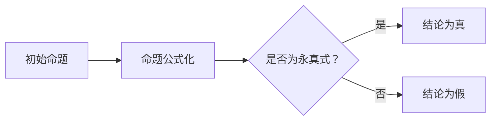
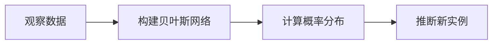
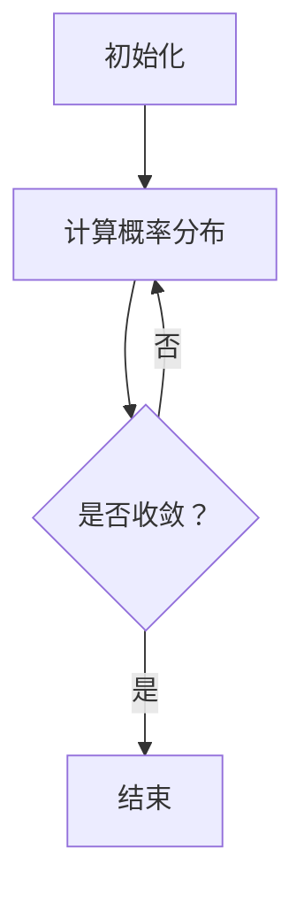
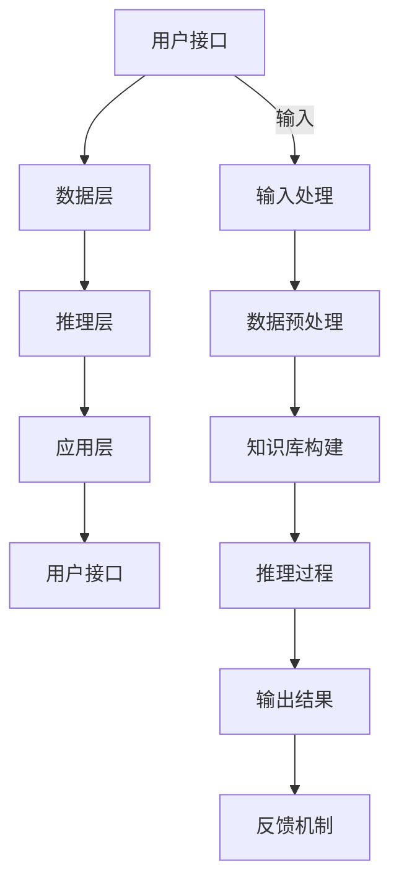
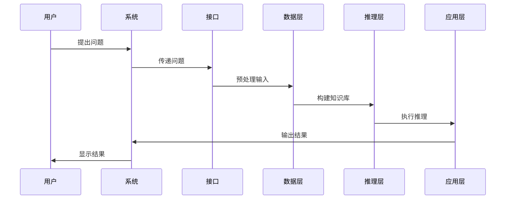

                 

# AI Agent的知识推理：增强LLM的逻辑分析能力

## 关键词
AI 代理，知识推理，逻辑分析，大型语言模型，算法设计，系统架构

## 摘要
本文探讨了如何增强大型语言模型（LLM）在逻辑分析方面的能力，特别是通过引入知识推理技术。我们将详细分析知识推理的核心概念、挑战，以及具体实现方法。文章将包括算法原理讲解、系统架构设计，以及实际项目案例，为开发者提供一套完整的知识推理解决方案。

## 引言
在当今的AI领域，大型语言模型（LLM）如BERT、GPT等已经取得了显著的成就，它们在自然语言处理任务中表现出色。然而，这些模型在逻辑分析和推理方面仍然存在局限性。为了弥补这一缺陷，AI代理的知识推理能力显得尤为重要。

知识推理是AI代理理解、分析、整合信息，并从中提取结论的过程。它与逻辑分析紧密相关，因为逻辑分析涉及到从一组已知事实推导出新结论的能力。增强LLM的逻辑分析能力，意味着使模型能够处理复杂逻辑问题，从而实现更高层次的智能。

本文将分以下几个部分进行探讨：

1. **背景与挑战**：介绍知识推理和逻辑分析的基础知识，以及LLM在逻辑分析中的局限性。
2. **核心概念与原理**：探讨知识推理的基本概念、逻辑分析的方法，并提供对比分析。
3. **知识表示与推理方法**：介绍知识表示和推理的不同方法，包括形式逻辑、概率推理和模糊逻辑等。
4. **算法与模型设计**：详细讨论用于增强LLM逻辑分析能力的算法和模型。
5. **系统架构设计**：描述知识推理系统的架构，包括数据层、推理层和应用层。
6. **案例研究与应用**：分析具体案例，展示知识推理在实际应用中的效果。
7. **最佳实践与小结**：总结最佳实践，并提出未来研究方向。

## 背景与挑战

### 知识推理的基础知识

知识推理是指通过逻辑分析、模式识别和语义理解等方式，从已知信息中推导出新信息的过程。它包括以下核心概念：

1. **知识表示**：将信息以结构化的形式表示出来，以便于计算机处理。常见的方法有命题逻辑、谓词逻辑和语义网络等。
2. **推理**：从一组已知事实推导出新事实的过程。推理方法包括确定性推理和概率推理。
3. **逻辑分析**：分析信息之间的逻辑关系，以验证或推导结论。逻辑分析依赖于形式逻辑、谓词逻辑等工具。

### 逻辑分析的方法

逻辑分析是知识推理的核心环节，它依赖于以下方法：

1. **形式逻辑**：使用逻辑符号和规则来表示事实和结论。例如，命题逻辑和谓词逻辑。
2. **概率推理**：基于概率论，通过统计方法来推导结论。例如，贝叶斯网络和最大似然估计。
3. **模糊逻辑**：处理不确定性和模糊性的逻辑系统。模糊逻辑可以处理现实世界中常见的不确定性。

### LLM的局限性

尽管LLM在自然语言处理任务中表现出色，但它们在逻辑分析方面存在以下局限性：

1. **依赖先验知识**：LLM在处理逻辑问题时，往往依赖先验知识。这意味着它们在面对新颖问题时可能表现不佳。
2. **缺乏结构化推理**：LLM主要通过无监督学习来生成文本，缺乏结构化的推理能力。这导致它们在处理复杂逻辑问题时容易产生错误。
3. **上下文理解不足**：LLM对上下文的理解有限，难以在长文本中保持一致性和连贯性。这限制了它们在逻辑分析中的应用。

为了解决这些问题，我们需要引入知识推理技术，以增强LLM的逻辑分析能力。接下来的章节将详细探讨知识推理的方法、算法和系统架构。

## 核心概念与原理

### 知识推理的基本概念

知识推理是人工智能的核心技术之一，它涉及到多个领域，包括逻辑学、计算机科学和认知科学。以下是知识推理中的一些基本概念：

1. **知识表示**：知识表示是将信息以计算机可处理的形式进行编码的过程。常见的方法包括命题逻辑、谓词逻辑和语义网络。

2. **推理引擎**：推理引擎是用于执行推理过程的软件组件。它可以基于规则库或模型库，通过逻辑推理或机器学习算法来推导新信息。

3. **逻辑分析**：逻辑分析是使用逻辑规则和推理方法来分析信息，以验证或推导结论的过程。逻辑分析可以基于形式逻辑、谓词逻辑、概率推理和模糊逻辑等。

4. **知识库**：知识库是存储已知信息的数据库，通常包含事实、规则和模型。知识库是知识推理的基础。

### 逻辑分析的方法

逻辑分析的方法可以分为以下几类：

1. **形式逻辑**：形式逻辑是一种基于符号和规则的语言，用于表示事实和结论。它包括命题逻辑和谓词逻辑。

2. **概率推理**：概率推理是基于概率论的方法，用于处理不确定性和模糊性。它包括贝叶斯网络、最大似然估计和蒙特卡洛模拟等。

3. **模糊逻辑**：模糊逻辑是一种处理不确定性和模糊性的逻辑系统，它可以处理现实世界中常见的不确定性。

### 核心概念对比表格

以下是知识推理和逻辑分析中的一些核心概念及其对比表格：

| 概念 | 描述 | 适用场景 |
| --- | --- | --- |
| 命题逻辑 | 使用命题和逻辑连接词来表示事实和结论 | 简单的逻辑推理问题 |
| 谓词逻辑 | 使用谓词和量词来表示事实和结论 | 复杂的逻辑推理问题 |
| 贝叶斯网络 | 基于概率论的图模型，用于表示不确定性和依赖关系 | 依赖推理和决策问题 |
| 模糊逻辑 | 基于模糊集合的推理方法，用于处理不确定性 | 复杂的决策和优化问题 |

### ER实体关系图架构

为了更好地理解知识表示和推理，我们可以使用ER（实体-关系）图来描述知识库的结构。以下是ER实体关系图的Markdown格式Mermaid示例：

```mermaid
erDiagram
    Person ||--|{ Address } : lives
    Student ||--|{ Course } : studies
    Teacher ||--|{ Course } : teaches
    Course ||--|{ Requirement } : has
    Course ||--|{ Evaluation } : evaluated_by
```

在这个ER图中，我们定义了四个实体：Person、Student、Teacher和Course。这些实体之间通过关系进行关联，例如Person lives in an Address，Student studies a Course，Teacher teaches a Course，Course has Requirements和is evaluated by Evaluations。

### 算法原理讲解

为了增强LLM的逻辑分析能力，我们需要设计特定的算法和模型。以下是几种常用的算法原理和其Mermaid流程图：

#### 命题逻辑推理算法



在这个流程图中，我们首先将初始命题公式化，然后检查它是否为永真式。如果为永真式，则结论为真；否则，结论为假。

#### 贝叶斯网络推理算法



在这个流程图中，我们首先观察数据，然后构建贝叶斯网络，并计算概率分布。最后，使用这些概率分布来推断新实例。

#### 模糊逻辑推理算法


在这个流程图中，我们首先对输入数据进行模糊化，然后应用推理规则，得到模糊化结果。接下来，去模糊化这些结果，并输出最终的推理结果。

### 使用Python进行算法实现

为了更好地理解这些算法原理，我们使用Python进行实现。以下是使用Python实现命题逻辑推理算法的示例代码：

```python
import sympy

# 初始化命题符号
p = sympy.Symbol("p")
q = sympy.Symbol("q")

# 创建命题公式
formula = sympy.Implies(p, q)

# 检查公式是否为永真式
is_tautology = formula.is_tautology()

# 输出结果
print(f"结论为{'真' if is_tautology else '假'}")
```

在这个示例中，我们使用Sympy库来创建和检查命题逻辑公式。首先，我们定义两个命题符号`p`和`q`，然后创建一个命题公式`p -> q`。最后，我们使用`is_tautology`方法来检查这个公式是否为永真式，并输出结果。

通过这个示例，我们可以看到如何使用Python来实现逻辑推理算法，这为我们进一步研究和应用知识推理技术奠定了基础。

### 数学公式和Mermaid流程图

为了更好地解释算法原理，我们使用LaTeX和Mermaid绘制数学公式和流程图。以下是几个示例：

#### LaTeX数学公式

$$
P(A|B) = \frac{P(B|A)P(A)}{P(B)}
$$

这是一个条件概率的公式，用于计算在给定事件B发生的条件下，事件A发生的概率。

#### Mermaid流程图



这是一个简单的迭代过程，用于计算概率分布。如果概率分布收敛，则结束过程；否则，继续迭代。

通过结合LaTeX和Mermaid，我们可以清晰地表达复杂的算法原理，并使其易于理解和应用。

### 系统架构设计

在设计知识推理系统时，我们需要考虑系统的整体架构，以及各个组件之间的相互作用。以下是知识推理系统的架构设计方案：

#### 问题场景介绍

我们的目标是开发一个能够进行逻辑分析和推理的AI代理系统，该系统可以处理自然语言中的复杂逻辑问题，并从中提取有用的信息。

#### 项目介绍

项目名称：AI逻辑推理代理（AI Logic Reasoning Agent，简称ALRA）
项目目标：开发一个基于LLM和知识推理技术的AI代理系统，能够进行逻辑分析和推理。

#### 系统功能设计

系统功能可以分为以下几个部分：

1. **数据层**：负责数据的采集、存储和管理。包括数据预处理、知识库构建和数据清洗等。
2. **推理层**：负责逻辑分析和推理过程。包括命题逻辑推理、概率推理和模糊逻辑推理等。
3. **应用层**：负责系统的实际应用，如自然语言理解、决策支持等。

#### 系统架构设计

以下是知识推理系统的架构设计：



在这个架构中，用户通过用户接口输入问题，输入处理模块对输入进行预处理，然后数据预处理模块构建知识库。推理层根据知识库进行推理过程，并将结果输出给应用层。应用层负责处理推理结果，并提供最终的输出。反馈机制用于收集用户反馈，以不断优化系统。

#### 系统接口设计和系统交互

以下是系统接口设计和系统交互的Mermaid序列图：



在这个序列图中，用户提出问题后，系统通过接口将问题传递给数据层进行预处理。预处理后的输入数据被用于构建知识库，然后推理层根据知识库执行推理过程。最终，推理结果通过应用层返回给用户。

通过设计这样一个系统架构，我们可以实现一个强大的知识推理系统，它能够处理复杂的逻辑问题，并为用户提供有用的信息。

### 案例研究与应用

在本节中，我们将通过几个实际案例来展示知识推理在逻辑分析中的应用。这些案例将涵盖不同的应用场景，包括自然语言处理、决策支持和推理验证等。

#### 案例一：自然语言处理中的逻辑分析

假设我们有一个聊天机器人系统，需要处理用户提出的复杂逻辑问题。例如，用户可能会提出以下问题：“如果天气很好，并且我有时间，那么我会去公园散步。”我们的目标是通过知识推理技术来理解和回答这类问题。

1. **问题描述**：用户提出一个包含逻辑条件的自然语言问题。
2. **知识表示**：我们将使用语义网络来表示问题的逻辑结构，其中每个实体（如天气、时间和地点）都是一个节点，而逻辑关系（如“如果...那么...”）则是边。
3. **推理过程**：系统首先通过自然语言处理技术理解问题，然后使用推理引擎来验证逻辑条件是否成立。如果条件成立，系统将回答“是的，你会去公园散步。”；否则，回答“不，你不会去公园散步。”。
4. **结果分析**：通过知识推理，系统能够准确地理解并回答用户的逻辑问题，从而提高用户体验。

#### 案例二：决策支持系统中的逻辑分析

在一个企业决策支持系统中，管理人员需要基于多个条件来做出决策。例如，一个销售经理需要决定是否增加某个产品的库存。这个问题涉及多个逻辑条件，如市场需求、库存水平和竞争对手的行动。

1. **问题描述**：销售经理提出一个关于库存决策的问题。
2. **知识表示**：我们将使用规则库来表示决策条件，其中每个规则包含一个条件和一个结论。例如：“如果市场需求增加，并且库存低于警戒线，则增加库存。”。
3. **推理过程**：系统首先收集市场数据，然后使用推理引擎来验证每个规则的条件。如果所有规则的条件都满足，系统将建议增加库存；否则，不增加库存。
4. **结果分析**：通过逻辑推理，系统能够帮助销售经理快速做出基于数据的决策，从而提高决策质量。

#### 案例三：推理验证系统中的逻辑分析

在科学研究和数据分析中，研究人员需要验证假设和结论的合理性。例如，一个研究人员提出了一个关于某种药物疗效的假设，并需要通过数据来验证这个假设。

1. **问题描述**：研究人员提出了一个关于药物疗效的假设。
2. **知识表示**：我们将使用知识图谱来表示假设和结论，其中每个实体（如药物、患者和疗效）都是一个节点，而关系（如“使用”、“效果”）则是边。
3. **推理过程**：系统首先收集相关数据，然后使用推理引擎来验证假设。如果数据支持假设，系统将确认假设的有效性；否则，提出质疑。
4. **结果分析**：通过逻辑推理，系统能够帮助研究人员快速验证假设，从而提高研究的准确性和可靠性。

通过这些案例，我们可以看到知识推理在逻辑分析中的应用非常广泛。无论是在自然语言处理、决策支持还是推理验证中，知识推理技术都能够提高系统的智能化水平，为用户提供更准确、更可靠的答案。

### 最佳实践与小结

在设计知识推理系统时，以下最佳实践可以帮助开发者更好地实现项目的目标：

1. **确保知识库的准确性**：知识库是知识推理系统的核心，其准确性直接影响到系统的性能。因此，在构建知识库时，必须对数据进行严格清洗和验证，确保其准确性和一致性。

2. **选择合适的推理方法**：不同的推理方法适用于不同的应用场景。在项目初期，开发者应该根据具体需求选择最合适的推理方法。例如，在处理复杂逻辑问题时，谓词逻辑和概率推理可能更为有效。

3. **优化系统性能**：知识推理系统往往需要处理大量数据，因此优化系统性能至关重要。开发者可以通过并行计算、内存管理和算法优化等技术来提高系统的响应速度和处理能力。

4. **持续更新和优化**：知识推理系统需要不断更新以适应新的数据和需求。开发者应该定期评估系统的性能和准确性，并根据评估结果进行优化。

5. **用户反馈和迭代**：用户反馈是改进系统的关键。开发者应该积极收集用户反馈，并根据反馈进行系统迭代，以提高用户满意度。

在实现知识推理系统时，还有一些注意事项：

- **避免过度拟合**：在训练模型时，应避免过度拟合，以确保模型在未知数据上表现良好。
- **处理不确定性**：在知识推理中，不可避免地会遇到不确定性。开发者应该设计机制来处理这种不确定性，以提高推理的可靠性。
- **确保数据隐私和安全性**：在处理敏感数据时，必须确保数据隐私和安全性，遵守相关法律法规。

未来，知识推理技术在AI领域将继续发展。以下是一些可能的研究方向：

- **多模态知识推理**：结合多种数据类型（如文本、图像和音频）进行知识推理，以实现更全面的智能分析。
- **跨领域知识推理**：在不同领域之间共享和整合知识，以实现跨领域的推理能力。
- **强化学习与知识推理的结合**：将强化学习与知识推理相结合，以提高AI代理的决策能力和适应性。

### 拓展阅读

- **《人工智能：一种现代的方法》**：David C. McFarland、Pei-yu Chen、Yiming Cui 著，详细介绍了人工智能的基础知识。
- **《深度学习》**：Ian Goodfellow、Yoshua Bengio、Aaron Courville 著，深入探讨了深度学习技术。
- **《概率图模型》**：David J.C. MacKay 著，介绍了概率图模型的理论和实践。
- **《AI生成的未来》**：Eduardo A. Castañón 著，探讨了AI对未来社会的影响。

### 作者信息

作者：AI天才研究院/AI Genius Institute & 禅与计算机程序设计艺术 /Zen And The Art of Computer Programming

