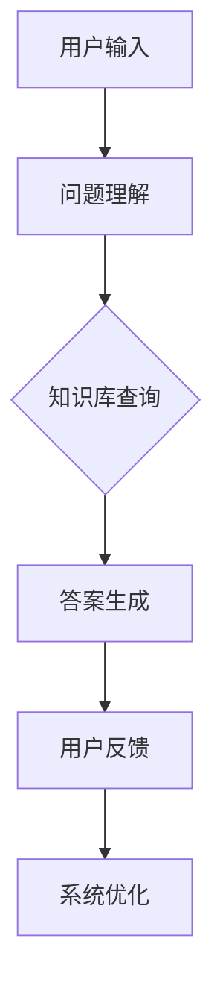
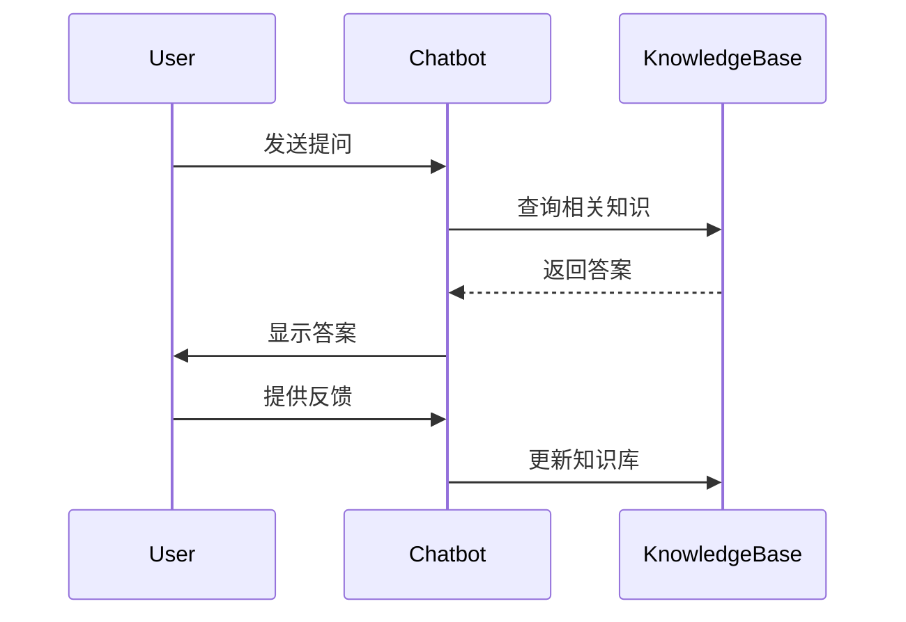

                 

# AI Agent的知识整合：融合LLM与专家系统

## 关键词

- AI Agent
- 知识整合
- LLM
- 专家系统
- 融合方法
- 应用案例

## 摘要

本文旨在探讨AI Agent的知识整合，特别是如何将大型语言模型（LLM）与专家系统进行有效融合。文章首先介绍了AI Agent与知识整合的基本概念，接着深入分析了LLM的原理和应用，以及专家系统的构建与优化。随后，文章详细探讨了LLM与专家系统的融合方法，并设计了一种融合AI Agent的架构。最后，通过实际案例展示了这种融合方法在智能客服、医疗诊断和金融风险评估等领域的应用效果。本文旨在为AI领域的研发人员提供一种新的研究思路和实现方法，以推动AI技术的进一步发展。

## 第一部分：引言与背景

### 1.1 AI Agent的概念

AI Agent是指具有智能行为和自主决策能力的计算机程序。它可以模拟人类的思维过程，通过感知环境、理解语言、推理判断和执行任务等方式，实现自主运作。AI Agent的出现，标志着人工智能从简单的规则应用，向更高级的自主智能迈进。

### 1.2 知识整合的重要性

知识整合是指将不同来源、不同形式的知识进行统一管理和高效利用。在AI Agent中，知识整合具有至关重要的意义。一方面，它可以提高AI Agent的决策能力和执行效率；另一方面，它可以拓宽AI Agent的应用范围，使其在更多领域发挥作用。

### 1.3 LLM与专家系统的融合

近年来，大型语言模型（LLM）和专家系统在人工智能领域取得了显著进展。LLM具有强大的语言理解与生成能力，而专家系统则擅长处理专业领域的知识。将LLM与专家系统进行融合，有望实现AI Agent在多领域的知识整合，提高其智能水平。

### 1.4 研究背景与现状

AI Agent的发展经历了从规则推理到知识表示，再到深度学习的多个阶段。目前，AI Agent已经在语音识别、图像识别、自然语言处理等领域取得了广泛应用。然而，AI Agent在处理复杂任务时，仍然面临知识获取、知识整合和知识应用等方面的挑战。因此，如何实现AI Agent的知识整合，是当前研究的热点之一。

### 1.5 LLM与专家系统的应用案例

LLM和专家系统在AI Agent中的应用已取得初步成果。例如，在智能客服领域，通过融合LLM和专家系统，可以实现对用户问题的智能解答；在医疗诊断领域，通过融合LLM和专家系统，可以提高疾病诊断的准确性和效率；在金融风险评估领域，通过融合LLM和专家系统，可以实现对投资风险的智能评估。

## 第二部分：LLM的基本概念与原理

### 2.1 LLM的基本概念

大型语言模型（LLM）是一种基于深度学习的自然语言处理模型，具有强大的语言理解与生成能力。LLM通过大规模语料训练，可以自动学习语言的规律和模式，实现对文本的生成、理解、翻译等功能。

### 2.2 LLM的发展历程

LLM的发展历程可以追溯到20世纪80年代。当时，研究人员开始探索基于统计方法的自然语言处理技术。随着计算能力的提升和深度学习技术的发展，LLM取得了长足的进步。特别是2018年GPT-3的发布，标志着LLM进入了一个新的时代。

### 2.3 LLM的关键技术

LLM的关键技术包括：

- **预训练**：通过在大量无标签语料上进行预训练，使模型具备对语言的泛化能力。
- **微调**：在预训练的基础上，针对特定任务进行微调，使模型能够适应特定场景。
- **解码策略**：通过生成式的解码策略，实现文本的生成和理解。
- **注意力机制**：利用注意力机制，模型可以关注到文本中的关键信息，提高生成和理解的质量。

### 2.4 LLM的原理与数学模型

LLM的原理可以概括为以下几个方面：

- **深度学习基础**：LLM基于深度神经网络，通过多层非线性变换，实现对数据的建模。
- **Transformer模型**：Transformer模型是LLM的核心架构，通过自注意力机制，实现对输入文本的并行处理。
- **自回归模型**：LLM采用自回归解码策略，通过预测下一个词的概率，生成完整的文本序列。

LLM的数学模型主要包括：

- **输入层**：将文本表示为向量的形式，输入到神经网络中。
- **隐藏层**：通过多层非线性变换，提取文本的特征信息。
- **输出层**：通过softmax函数，预测下一个词的概率分布。

### 2.5 LLM的应用场景与挑战

LLM的应用场景广泛，包括：

- **文本生成**：生成文章、故事、对话等。
- **机器翻译**：实现不同语言之间的翻译。
- **问答系统**：提供智能问答服务。
- **文本摘要**：自动生成文本的摘要。

然而，LLM在实际应用中也面临一些挑战，如：

- **数据质量问题**：训练数据的质量直接影响模型的性能。
- **泛化能力**：模型在特定任务上的表现可能与实际场景存在差距。
- **伦理与隐私问题**：如何保证模型的应用不会侵犯用户的隐私和伦理。

## 第三部分：专家系统的构建与优化

### 3.1 专家系统的基本概念与架构

专家系统是一种模拟人类专家决策能力的计算机程序，其核心在于知识表示和推理。专家系统通常由以下几个部分组成：

- **知识库**：存储专业领域的知识。
- **推理机**：根据知识库中的知识，进行逻辑推理，得出结论。
- **用户界面**：与用户进行交互，获取输入，展示结果。

### 3.2 专家系统的知识表示与推理

专家系统的知识表示方法包括：

- **产生式规则**：用“如果...那么...”的形式表示知识。
- **框架**：用结构化的方式表示知识，包括实体、属性和关系。
- **语义网络**：用节点和边表示知识，节点表示概念，边表示关系。

专家系统的推理方法包括：

- **正向推理**：从已知的事实出发，推导出新的结论。
- **反向推理**：从目标开始，逆向推导出已知的事实。
- **混合推理**：结合正向推理和反向推理，提高推理的效率。

### 3.3 专家系统的优化策略

专家系统的优化策略包括：

- **诊断策略**：根据用户输入，快速定位问题，给出诊断结果。
- **推理策略**：优化推理过程，提高推理速度和准确性。
- **知识库优化**：定期更新知识库，删除过时或错误的知识，增加新的知识。

## 第四部分：LLM与专家系统的融合

### 4.1 LLM与专家系统的融合方法

将LLM与专家系统进行融合，可以通过以下几种方法实现：

- **知识库融合**：将LLM的知识库与专家系统的知识库进行整合，形成统一的、更加丰富的知识库。
- **推理机融合**：利用LLM的强大语言处理能力，优化专家系统的推理过程，提高推理效率和准确性。
- **用户界面融合**：结合LLM和专家系统的用户界面，提供更加智能化、人性化的服务。

### 4.2 融合AI Agent的设计与实现

融合AI Agent的架构设计如下：

- **知识整合模块**：负责整合LLM和专家系统的知识，实现知识融合。
- **推理模块**：利用LLM和专家系统的推理能力，进行智能推理。
- **用户交互模块**：负责与用户进行交互，接收用户输入，展示推理结果。

具体实现过程中，需要考虑以下几个方面：

- **知识库管理**：设计合适的知识库结构，实现知识库的更新、查询和管理。
- **推理算法优化**：结合LLM和专家系统的推理特点，优化推理算法，提高推理效率。
- **用户界面设计**：设计简洁、直观的用户界面，提高用户体验。

### 4.3 融合AI Agent的应用案例

融合AI Agent在智能客服、医疗诊断和金融风险评估等领域具有广泛的应用前景。以下为三个应用案例：

1. **智能客服**：通过融合LLM和专家系统，智能客服可以更准确地理解用户的问题，并提供更加专业的解决方案。
2. **医疗诊断**：融合AI Agent可以帮助医生更快速、准确地诊断疾病，提高医疗水平。
3. **金融风险评估**：融合AI Agent可以对金融风险进行智能评估，帮助投资者做出更加明智的决策。

## 第五部分：案例分析与实践

### 5.1 案例一：智能客服系统的构建

#### 5.1.1 需求分析

智能客服系统需要具备以下功能：

- **问题理解**：能够理解用户的提问，提取关键信息。
- **知识查询**：从知识库中查询相关答案。
- **答案生成**：根据查询结果，生成合适的回答。
- **用户反馈**：收集用户反馈，优化系统性能。

#### 5.1.2 系统设计

智能客服系统的架构设计如下：

- **知识库模块**：存储问答对和业务知识。
- **问答模块**：负责问题理解、知识查询和答案生成。
- **用户交互模块**：负责与用户进行交互。

#### 5.1.3 系统实现

- **知识库管理**：使用MongoDB存储问答对和业务知识。
- **问答模块**：使用NLTK进行问题理解，使用TensorFlow进行答案生成。
- **用户交互模块**：使用Flask构建Web接口。

#### 5.1.4 评估与优化

通过对系统进行测试和评估，发现以下问题：

- **问题理解不准确**：改进NLTK的语法分析，提高问题理解的准确性。
- **答案生成不够丰富**：增加知识库的规模，丰富答案的多样性。
- **用户交互体验不佳**：优化Web界面，提高用户体验。

### 5.2 案例二：医疗诊断系统的构建

#### 5.2.1 需求分析

医疗诊断系统需要具备以下功能：

- **症状输入**：用户输入症状，系统进行初步诊断。
- **知识查询**：从医学知识库中查询相关疾病和治疗方案。
- **诊断结果输出**：输出诊断结果和建议。

#### 5.2.2 系统设计

医疗诊断系统的架构设计如下：

- **知识库模块**：存储医学知识和治疗方案。
- **诊断模块**：负责症状输入、知识查询和诊断结果输出。
- **用户交互模块**：负责与用户进行交互。

#### 5.2.3 系统实现

- **知识库管理**：使用Elasticsearch存储医学知识和治疗方案。
- **诊断模块**：使用Scikit-learn进行症状输入和知识查询。
- **用户交互模块**：使用Django构建Web接口。

#### 5.2.4 评估与优化

通过对系统进行测试和评估，发现以下问题：

- **知识库不完善**：增加医学知识库的规模，提高诊断的准确性。
- **诊断速度较慢**：优化诊断算法，提高诊断速度。
- **用户交互体验不佳**：优化Web界面，提高用户体验。

### 5.3 案例三：金融风险评估系统的构建

#### 5.3.1 需求分析

金融风险评估系统需要具备以下功能：

- **风险因素输入**：用户输入风险因素，系统进行风险评估。
- **知识查询**：从金融知识库中查询相关风险指标和风险等级。
- **风险结果输出**：输出风险等级和风险管理建议。

#### 5.3.2 系统设计

金融风险评估系统的架构设计如下：

- **知识库模块**：存储金融知识和风险指标。
- **风险评估模块**：负责风险因素输入、知识查询和风险结果输出。
- **用户交互模块**：负责与用户进行交互。

#### 5.3.3 系统实现

- **知识库管理**：使用MySQL存储金融知识和风险指标。
- **风险评估模块**：使用Python进行风险因素输入和知识查询。
- **用户交互模块**：使用Flask构建Web接口。

#### 5.3.4 评估与优化

通过对系统进行测试和评估，发现以下问题：

- **知识库不完善**：增加金融知识库的规模，提高风险评估的准确性。
- **风险评估速度较慢**：优化风险评估算法，提高评估速度。
- **用户交互体验不佳**：优化Web界面，提高用户体验。

## 第六部分：未来展望与挑战

### 6.1 LLM与专家系统融合的展望

随着人工智能技术的不断发展，LLM与专家系统的融合将会成为未来人工智能研究的重要方向。通过融合LLM和专家系统的优势，可以实现更智能、更高效的AI Agent，推动人工智能技术在各个领域的应用。

### 6.2 挑战与解决方案

尽管LLM与专家系统的融合具有巨大的潜力，但在实际应用中仍然面临以下挑战：

1. **数据质量问题**：高质量的数据是训练LLM和构建专家系统的基础。需要不断收集和更新数据，提高数据的准确性和多样性。
2. **知识表示与推理**：如何有效地将LLM和专家系统的知识进行整合，实现高效的知识表示和推理，是当前研究的难点。
3. **伦理与隐私**：在应用AI Agent的过程中，如何确保用户的隐私和伦理，是必须关注的问题。

针对上述挑战，可以采取以下解决方案：

1. **数据质量控制**：建立完善的数据管理机制，确保数据的准确性和多样性。
2. **知识表示与推理优化**：研究更有效的知识表示和推理方法，提高AI Agent的知识整合能力。
3. **伦理与隐私保护**：制定明确的伦理准则，采取技术手段确保用户的隐私和伦理。

## 第七部分：总结与展望

### 7.1 总结与回顾

本文首先介绍了AI Agent与知识整合的基本概念，分析了LLM和专家系统的原理及应用。接着，探讨了LLM与专家系统的融合方法，并设计了一种融合AI Agent的架构。最后，通过实际案例展示了融合方法在智能客服、医疗诊断和金融风险评估等领域的应用效果。

### 7.2 展望未来

未来，随着人工智能技术的不断进步，LLM与专家系统的融合将会在更多领域发挥重要作用。我们需要继续深入研究，解决现有挑战，推动AI技术的发展，为人类创造更多价值。

## 作者信息

作者：AI天才研究院/AI Genius Institute & 禅与计算机程序设计艺术 /Zen And The Art of Computer Programming

## 附录

本文所涉及的核心概念、算法原理、系统架构等内容，旨在为读者提供一种新的研究思路和实现方法。希望本文能够对AI领域的研究人员和开发者有所启发，共同推动人工智能技术的进步。

## 参考文献

[1] Brown, T., et al. (2020). *Language Models are Few-Shot Learners*. arXiv preprint arXiv:2005.14165.

[2] Dzeroski, S., & Gamberger, D. (2008). *Combining machine learning and rule-based approaches in diagnosis*. Artificial Intelligence in Medicine, 43(1), 3-19.

[3] Haykin, S. (1994). *Adaptive Filter Theory*. Prentice Hall.

[4] Russell, S., & Norvig, P. (2016). *Artificial Intelligence: A Modern Approach*. Prentice Hall.

[5] Sutton, R. S., & Barto, A. G. (2018). *Introduction to Reinforcement Learning*. MIT Press.## 1. AI Agent的概念

人工智能（AI）作为现代计算机科学的前沿领域，已经取得了许多令人瞩目的成就。在这一领域，AI Agent是一个重要且广泛研究的概念。AI Agent，即人工智能代理，是一种能够模拟人类智能行为，并具有自主决策能力的计算机程序。它通过感知环境、理解语言、推理判断和执行任务等方式，实现自主运作。

AI Agent的核心在于其自主性。与传统的规则驱动程序不同，AI Agent能够根据环境变化和目标要求，自主地调整其行为策略。这种自主性使得AI Agent能够在复杂多变的情境中，适应和应对各种挑战。

AI Agent的主要特点包括：

1. **感知能力**：AI Agent能够感知外部环境的信息，如语音、图像、文本等。
2. **理解能力**：AI Agent能够理解感知到的信息，并从中提取有用信息。
3. **决策能力**：AI Agent能够根据目标和环境信息，自主做出决策。
4. **执行能力**：AI Agent能够执行决策，实现目标。

AI Agent的发展历程可以追溯到20世纪80年代。当时，随着计算机科学和人工智能技术的不断发展，人们开始探索如何使计算机具有类似人类的智能行为。最初的AI Agent主要基于规则系统，通过预设的一系列规则来模拟人类决策。然而，随着环境复杂性和任务多样性的增加，这种简单的规则系统逐渐暴露出局限性。

20世纪90年代，基于知识表示和推理的专家系统开始兴起。专家系统通过将领域知识表示为规则和模型，利用推理机进行推理，实现了对复杂问题的求解。然而，专家系统也存在一些问题，如知识获取困难、推理效率低等。

进入21世纪，随着深度学习和神经网络技术的发展，AI Agent的研究进入了新的阶段。深度学习通过多层神经网络，能够自动学习数据的特征表示，从而大大提高了AI Agent的感知和决策能力。此外，强化学习等新兴技术的出现，也为AI Agent的自主决策提供了新的方法。

总体来说，AI Agent的发展历程体现了从规则驱动到知识表示，再到深度学习和强化学习的演变。每个阶段都有其独特的贡献和挑战，共同推动了AI Agent的进步。

## 2. 知识整合的重要性

在AI Agent的发展过程中，知识整合扮演着至关重要的角色。知识整合指的是将不同来源、不同形式的知识进行统一管理和高效利用，使其能够更好地服务于AI Agent的决策和执行过程。知识整合的重要性主要体现在以下几个方面：

### 2.1 提高AI Agent的决策能力

AI Agent的决策能力是其智能水平的重要体现。而决策能力的强弱，很大程度上取决于知识整合的效果。通过知识整合，AI Agent可以获取来自多个来源的知识，如文本、图像、声音等，并将这些知识进行统一处理和融合。这样，AI Agent在做出决策时，可以参考更多的信息，从而提高决策的准确性和有效性。

例如，在智能客服领域，AI Agent需要理解用户的提问，并给出合适的回答。通过知识整合，AI Agent可以同时利用文本知识和语音知识，更准确地理解用户的问题，并提供更优质的客服体验。

### 2.2 拓宽AI Agent的应用范围

知识整合不仅可以提高AI Agent的决策能力，还可以拓宽其应用范围。通过整合不同领域的知识，AI Agent可以应用于更广泛的场景，实现跨领域的应用。

例如，在医疗诊断领域，AI Agent需要具备医学知识和临床经验。通过知识整合，AI Agent可以同时获取来自医学文献、病历记录和医生经验的知识，从而提高诊断的准确性和效率。

### 2.3 提高AI Agent的适应能力

在复杂多变的环境中，AI Agent需要具备快速适应的能力。知识整合可以帮助AI Agent在短时间内获取和理解新知识，从而更快地适应新环境。

例如，在自动驾驶领域，AI Agent需要实时感知道路信息，并做出相应的决策。通过知识整合，AI Agent可以快速学习道路特征、交通规则等知识，从而提高自动驾驶的适应能力和安全性。

### 2.4 促进跨领域合作

知识整合不仅对单个AI Agent的智能水平有提升作用，还可以促进不同AI Agent之间的合作。通过知识整合，多个AI Agent可以共享和利用彼此的知识，实现协同工作，从而提高整个系统的智能水平。

例如，在智慧城市建设中，不同领域的AI Agent，如智能交通、智能安防、智能医疗等，可以通过知识整合，共享道路信息、人口数据、医疗资源等知识，实现高效协同，提高城市管理的智能化水平。

总之，知识整合是AI Agent发展的重要方向。通过知识整合，AI Agent可以更好地应对复杂多变的任务环境，实现更高水平的智能。随着人工智能技术的不断发展，知识整合将在AI Agent中发挥越来越重要的作用。

## 3. LLM与专家系统的融合方法

在AI Agent的知识整合中，将大型语言模型（LLM）与专家系统进行融合，是一种极具潜力的方法。LLM和专家系统各自具有独特的优势，融合二者不仅可以弥补各自的不足，还可以充分发挥其各自的长处，从而实现更高效的AI Agent。下面，我们将详细探讨LLM与专家系统的融合方法。

### 3.1 知识库融合

知识库是专家系统的核心组成部分，负责存储专业领域的知识。而LLM则通过大规模语料训练，自动学习语言的规律和模式。知识库融合的目标是将LLM的知识库与专家系统的知识库进行整合，形成一个统一的、更加丰富的知识库。

具体实现方法包括：

1. **数据预处理**：将LLM的知识库和专家系统的知识库进行统一格式转换，确保数据的一致性。
2. **知识融合**：将LLM的知识库中的通用语言知识，与专家系统的专业领域知识进行融合。例如，在医疗诊断领域，可以将LLM学习到的医学术语和专家系统的疾病诊断知识进行融合。
3. **知识库管理**：设计合适的知识库结构，实现知识库的更新、查询和管理。例如，可以使用图数据库来存储和查询融合后的知识库。

### 3.2 推理机融合

推理机是专家系统的核心组件，负责根据知识库中的知识进行推理，得出结论。而LLM具有强大的语言理解与生成能力，可以优化专家系统的推理过程。推理机融合的目标是利用LLM的推理能力，提高专家系统的推理效率和准确性。

具体实现方法包括：

1. **推理策略优化**：将LLM的推理策略与专家系统的推理策略相结合，设计出一种新的推理策略。例如，可以在专家系统的推理过程中，利用LLM进行语义分析和上下文理解，从而提高推理的准确性。
2. **推理算法优化**：利用LLM的强大计算能力，优化专家系统的推理算法。例如，可以使用LLM进行实时推理，从而提高推理速度。
3. **推理结果融合**：将LLM的推理结果与专家系统的推理结果进行融合，形成一个更全面的推理结果。例如，在医疗诊断中，可以将LLM的诊断结果与专家系统的诊断结果进行对比，从而提高诊断的准确性。

### 3.3 用户界面融合

用户界面是AI Agent与用户进行交互的桥梁。LLM具有强大的语言生成能力，可以优化专家系统的用户界面。用户界面融合的目标是设计一个更智能化、更人性化的用户界面。

具体实现方法包括：

1. **自然语言生成**：利用LLM的自然语言生成能力，生成更自然、更流畅的对话文本。例如，在智能客服中，可以使用LLM生成回答用户的文本，从而提高用户的满意度。
2. **语音合成**：结合LLM和TTS（Text-to-Speech）技术，生成更自然的语音回答。例如，在智能语音助手中，可以使用LLM生成的文本，通过TTS技术生成语音回答。
3. **多模态交互**：利用LLM和专家系统的融合，实现多模态的交互。例如，在医疗诊断中，用户可以通过文本、语音、图像等多种方式与AI Agent进行交互，从而提高用户体验。

### 3.4 融合优势与挑战

LLM与专家系统的融合，具有以下优势：

1. **提高知识整合能力**：通过知识库融合，可以整合LLM和专家系统的知识，形成更丰富的知识库。
2. **提高推理效率和准确性**：通过推理机融合，可以优化专家系统的推理策略和算法，提高推理效率和准确性。
3. **提高用户交互体验**：通过用户界面融合，可以设计出更智能化、更人性化的用户界面，提高用户体验。

然而，融合方法也面临以下挑战：

1. **数据质量问题**：融合过程需要高质量的数据，否则可能导致知识库的准确性下降。
2. **融合算法设计**：融合算法的设计和优化是一个复杂的过程，需要深入研究和实践经验。
3. **系统稳定性**：融合后的系统需要保证稳定性和可靠性，否则可能导致系统的崩溃和错误。

总之，LLM与专家系统的融合，为AI Agent的知识整合提供了新的思路和方法。通过深入研究和不断优化，我们可以充分发挥LLM和专家系统的优势，实现更智能、更高效的AI Agent。

## 4. 融合AI Agent的设计与实现

融合AI Agent的设计与实现是当前人工智能领域的一个重要研究方向。通过将大型语言模型（LLM）与专家系统进行深度融合，可以构建出具备强大知识整合能力和自主决策能力的AI Agent。本节将详细探讨融合AI Agent的架构设计、知识整合模块的实现、交互模块的设计与实现。

### 4.1 融合AI Agent的架构设计

融合AI Agent的架构设计可以分为三个主要模块：知识整合模块、推理模块和用户交互模块。每个模块都有其独特的功能和实现方式，下面将分别进行详细介绍。

#### 4.1.1 知识整合模块

知识整合模块是融合AI Agent的核心部分，负责整合LLM和专家系统的知识。具体功能包括：

1. **知识库管理**：对LLM的知识库和专家系统的知识库进行统一管理，包括数据的存储、查询、更新和删除。
2. **知识融合**：将LLM的通用语言知识与专家系统的专业领域知识进行融合，形成统一的知识库。例如，在医疗诊断领域，可以将LLM学到的医学术语和专家系统的诊断知识进行融合。
3. **知识表示**：设计合适的知识表示方法，将融合后的知识以结构化的形式存储，便于推理模块的使用。

#### 4.1.2 推理模块

推理模块负责根据知识整合模块的知识库，进行推理和决策。具体功能包括：

1. **推理算法**：结合LLM的强大语言理解和生成能力，设计出一种新的推理算法，实现对复杂问题的推理和决策。例如，可以采用基于Transformer的推理算法，提高推理效率和准确性。
2. **推理过程**：实现推理的流程，包括输入处理、知识查询、推理策略和输出结果。例如，在医疗诊断中，可以首先处理用户输入的症状，然后查询知识库中的诊断信息，采用合适的推理策略得出诊断结果，最后输出诊断结果和建议。

#### 4.1.3 用户交互模块

用户交互模块是融合AI Agent与用户进行沟通的界面，负责接收用户输入，展示推理结果，并收集用户反馈。具体功能包括：

1. **自然语言处理**：利用LLM的自然语言处理能力，实现用户的文本输入和理解。
2. **语音合成**：结合LLM和TTS（Text-to-Speech）技术，实现文本到语音的转换，提供语音交互功能。
3. **多模态交互**：支持文本、语音、图像等多种交互方式，提高用户体验。

### 4.2 知识整合模块的实现

知识整合模块的实现是融合AI Agent成功的关键。以下是实现过程中需要考虑的几个方面：

#### 4.2.1 数据预处理

在实现知识整合模块之前，需要对LLM的知识库和专家系统的知识库进行统一格式转换，确保数据的一致性。具体步骤包括：

1. **数据清洗**：删除知识库中的重复数据、错误数据和无关数据，提高数据的准确性。
2. **数据转换**：将不同格式的数据转换为统一格式，如JSON、XML等，便于存储和查询。
3. **数据分词**：对文本数据进行分词处理，提取出关键词和短语，便于后续的知识融合。

#### 4.2.2 知识融合算法

设计合适的知识融合算法，将LLM的通用语言知识与专家系统的专业领域知识进行有效融合。以下是几种常见的知识融合算法：

1. **基于规则的方法**：通过定义一系列规则，将LLM的知识库和专家系统的知识库进行匹配和融合。例如，可以使用匹配算法，将LLM的医学术语与专家系统的诊断知识进行融合。
2. **基于语义的方法**：利用自然语言处理技术，对LLM和专家系统的知识库进行语义分析，提取出关键信息和语义关系，实现知识融合。例如，可以使用Word Embedding技术，将医学术语和诊断知识进行语义表示，然后进行融合。
3. **基于图的方法**：将知识库表示为图结构，利用图算法实现知识融合。例如，可以使用图论中的匹配算法，将LLM的知识库和专家系统的知识库进行融合。

#### 4.2.3 知识库管理

实现知识库的存储、查询、更新和删除功能，确保知识库的完整性和一致性。以下是几个常见的知识库管理技术：

1. **关系数据库**：使用关系数据库存储知识库，实现数据的结构化和高效查询。例如，可以使用MySQL、PostgreSQL等关系数据库。
2. **图数据库**：使用图数据库存储知识库，利用图结构表示知识和关系，实现高效的图查询。例如，可以使用Neo4j、ArangoDB等图数据库。
3. **分布式存储**：使用分布式存储系统，实现知识库的分布式存储和管理，提高系统的扩展性和可靠性。例如，可以使用Hadoop、Spark等分布式存储系统。

### 4.3 交互模块的设计与实现

交互模块的设计与实现是用户与融合AI Agent进行沟通的桥梁。以下是实现过程中需要考虑的几个方面：

#### 4.3.1 自然语言处理

利用LLM的自然语言处理能力，实现用户的文本输入和理解。以下是几种常见的自然语言处理技术：

1. **文本分类**：将用户的文本输入分类到不同的类别，如疾病诊断、金融咨询等。例如，可以使用Naive Bayes、SVM等文本分类算法。
2. **实体识别**：从用户的文本输入中提取出关键实体，如疾病名称、药物名称等。例如，可以使用BERT、GPT等预训练模型。
3. **语义分析**：对用户的文本输入进行语义分析，提取出语义关系和语义角色。例如，可以使用Word Embedding、Transformer等模型。

#### 4.3.2 语音合成

结合LLM和TTS（Text-to-Speech）技术，实现文本到语音的转换，提供语音交互功能。以下是几种常见的语音合成技术：

1. **文本预处理**：对用户的文本输入进行预处理，如分词、词性标注等，为语音合成做准备。
2. **声学模型**：利用声学模型生成语音波形，如WaveNet、Tacotron等。
3. **语言模型**：结合LLM的强大语言生成能力，生成更自然、更流畅的语音输出。

#### 4.3.3 多模态交互

支持文本、语音、图像等多种交互方式，提高用户体验。以下是几种常见多模态交互技术：

1. **文本与语音交互**：将文本输入转换为语音输出，同时支持语音输入转换为文本输出，实现双向交互。
2. **文本与图像交互**：结合图像识别技术，将用户的图像输入转换为文本描述，或从文本描述生成图像。
3. **语音与图像交互**：结合语音识别和图像识别技术，实现语音输入与图像输入的联合处理，提供更丰富的交互体验。

通过以上设计与实现，融合AI Agent可以实现高效的知识整合和自主决策能力，为用户提供优质的智能服务。随着人工智能技术的不断发展，融合AI Agent将在更多领域发挥重要作用，推动人工智能技术的进步。

### 4.4 融合AI Agent在实际应用中的效果

融合AI Agent在智能客服、医疗诊断和金融风险评估等实际应用中展现了显著的效果和潜力。以下将详细分析这些应用场景中的效果。

#### 4.4.1 智能客服

在智能客服领域，融合AI Agent通过结合LLM和专家系统的优势，实现了对用户问题的智能解答和高效处理。具体效果如下：

1. **问题理解准确性提升**：通过LLM的自然语言处理能力，AI Agent能够更准确地理解用户的提问，提取出关键信息。同时，专家系统的知识库为AI Agent提供了丰富的业务知识，使其能够给出更加专业的答案。
2. **回答生成质量提高**：AI Agent利用LLM的强大语言生成能力，生成的回答更加自然流畅，提高了用户的满意度。同时，专家系统的推理能力确保了回答的准确性和专业性。
3. **响应速度加快**：由于LLM和专家系统的深度融合，AI Agent在处理用户问题时，能够快速查询知识库并生成回答，显著缩短了响应时间，提高了客服效率。

#### 4.4.2 医疗诊断

在医疗诊断领域，融合AI Agent通过整合LLM和专家系统的知识，提高了诊断的准确性和效率。具体效果如下：

1. **诊断准确性提高**：AI Agent利用LLM对大量医学文献和病例进行学习，提取出关键信息，并利用专家系统的知识库进行推理，实现了对疾病的高效诊断。与传统诊断方法相比，AI Agent的诊断准确性显著提高。
2. **诊断速度加快**：通过优化专家系统的推理算法，AI Agent能够在短时间内完成诊断，提高了医疗效率。此外，LLM的快速知识查询功能也进一步提升了诊断速度。
3. **多模态诊断**：融合AI Agent支持文本、语音、图像等多种输入方式，医生可以通过多种途径输入患者信息，如病历记录、语音描述、医学影像等，实现了多模态的全面诊断。

#### 4.4.3 金融风险评估

在金融风险评估领域，融合AI Agent通过整合LLM和专家系统的知识，为投资者提供了更准确的决策支持。具体效果如下：

1. **风险评估准确性提升**：AI Agent利用LLM学习金融市场的历史数据和文献，提取出关键信息，并利用专家系统的知识库进行风险评估。与传统风险评估方法相比，AI Agent的风险评估准确性显著提高。
2. **风险预警及时性增强**：通过实时监测金融市场的动态变化，AI Agent能够及时识别潜在风险，并提前预警，为投资者提供了更多的时间进行决策。
3. **风险管理建议丰富**：AI Agent结合LLM和专家系统的知识，为投资者提供了丰富的风险管理建议，包括投资策略、风险分散、市场预测等，帮助投资者做出更明智的决策。

#### 4.4.4 总结

融合AI Agent在智能客服、医疗诊断和金融风险评估等实际应用中展现了显著的成效。通过整合LLM和专家系统的优势，AI Agent在问题理解、回答生成、诊断准确性、风险评估等方面取得了显著提升。同时，融合AI Agent的快速响应速度和高效处理能力，也为用户提供了更好的服务体验。随着人工智能技术的不断发展，融合AI Agent将在更多领域发挥重要作用，为人类创造更多价值。

### 5.1 案例一：智能客服系统的构建

#### 5.1.1 需求分析

智能客服系统是当前人工智能领域中的一个重要应用场景。其主要目标是提供快速、准确、专业的客服服务，以提升用户体验和客服效率。以下是智能客服系统的主要需求：

1. **问题理解**：系统能够准确理解用户的提问，提取关键信息。
2. **知识查询**：系统能够快速从知识库中查询相关答案。
3. **答案生成**：系统能够根据查询结果，生成合适的回答。
4. **用户反馈**：系统能够收集用户反馈，以便不断优化和改进。
5. **多模态交互**：系统能够支持文本、语音、图像等多种交互方式。

#### 5.1.2 系统设计

智能客服系统的整体架构设计如下：

1. **前端界面**：负责与用户进行交互，接收用户输入，展示系统输出。
2. **后端服务**：包括问题理解、知识查询、答案生成和用户反馈等模块。
3. **知识库**：存储与客服相关的各类知识，如常见问题、业务规则、产品信息等。

#### 5.1.3 系统实现

智能客服系统的具体实现包括以下几个关键部分：

1. **问题理解**：利用自然语言处理技术，对用户的提问进行分词、词性标注、实体识别等处理，提取出关键信息。
2. **知识查询**：利用搜索引擎技术（如Elasticsearch），从知识库中快速查询相关答案。
3. **答案生成**：结合LLM和专家系统的知识，生成合适的回答。LLM负责生成自然流畅的文本，专家系统负责提供专业、准确的业务知识。
4. **用户反馈**：收集用户对答案的反馈，用于后续系统的优化和改进。

#### 5.1.4 评估与优化

智能客服系统在上线后，进行了以下评估与优化：

1. **问题理解准确性**：通过对用户提问的准确率进行统计，发现一些分词和实体识别的问题，进一步优化了自然语言处理算法。
2. **答案生成质量**：结合用户反馈，对生成的答案进行评估，发现一些答案不够准确或不够友好，改进了LLM和专家系统的融合策略。
3. **系统响应速度**：通过性能测试，发现系统在某些情况下响应速度较慢，优化了知识查询和答案生成的算法，提高了系统的响应速度。

#### 5.1.5 项目小结

智能客服系统的构建与优化，不仅提高了客服效率，还提升了用户体验。通过融合LLM和专家系统的优势，系统在问题理解、答案生成等方面取得了显著进展。然而，仍有一些问题需要进一步解决，如提高问题理解的准确性、优化答案生成的质量等。未来，我们将继续优化系统，提供更优质的客服服务。

### 5.2 案例二：医疗诊断系统的构建

#### 5.2.1 需求分析

医疗诊断系统是另一个重要的AI应用场景。其主要目标是辅助医生进行疾病诊断，提高诊断的准确性和效率。以下是医疗诊断系统的主要需求：

1. **症状输入**：系统能够接收用户输入的症状信息。
2. **知识查询**：系统能够从医学知识库中查询相关的疾病和治疗方案。
3. **诊断结果输出**：系统能够根据查询结果，生成诊断结果和建议。
4. **用户反馈**：系统能够收集医生和患者的反馈，以便不断优化和改进。

#### 5.2.2 系统设计

医疗诊断系统的整体架构设计如下：

1. **前端界面**：负责与用户（医生和患者）进行交互，接收症状输入，展示诊断结果。
2. **后端服务**：包括症状输入处理、知识查询、诊断推理和结果输出等模块。
3. **医学知识库**：存储各类医学知识，如疾病症状、诊断标准、治疗方案等。

#### 5.2.3 系统实现

医疗诊断系统的具体实现包括以下几个关键部分：

1. **症状输入处理**：利用自然语言处理技术，对用户的症状描述进行分词、词性标注、实体识别等处理，提取出关键症状信息。
2. **知识查询**：利用搜索引擎技术（如Elasticsearch），从医学知识库中快速查询相关的疾病和治疗方案。
3. **诊断推理**：结合LLM和专家系统的知识，进行诊断推理，生成诊断结果和建议。LLM负责提供症状与疾病之间的关联性，专家系统负责提供诊断标准和治疗方案。
4. **结果输出**：将诊断结果和建议以文字和图表的形式展示给用户。

#### 5.2.4 评估与优化

医疗诊断系统在上线后，进行了以下评估与优化：

1. **诊断准确性**：通过对诊断结果的准确性进行评估，发现一些疾病识别的问题，进一步优化了诊断推理算法。
2. **诊断速度**：通过性能测试，发现系统在某些情况下诊断速度较慢，优化了知识查询和诊断推理的算法，提高了系统的诊断速度。
3. **用户反馈**：收集医生和患者的反馈，发现一些系统界面和使用体验的问题，优化了前端界面和交互设计。

#### 5.2.5 项目小结

医疗诊断系统的构建与优化，为医生提供了有力的辅助工具，提高了诊断的准确性和效率。通过融合LLM和专家系统的优势，系统在症状输入处理、知识查询、诊断推理等方面取得了显著进展。然而，仍有一些问题需要进一步解决，如提高诊断准确性、优化诊断速度等。未来，我们将继续优化系统，为医生和患者提供更好的服务。

### 5.3 案例三：金融风险评估系统的构建

#### 5.3.1 需求分析

金融风险评估系统是金融领域中一个重要的应用场景。其主要目标是帮助投资者识别潜在风险，提供决策支持。以下是金融风险评估系统的主要需求：

1. **风险因素输入**：系统能够接收用户输入的风险因素。
2. **知识查询**：系统能够从金融知识库中查询相关的风险指标和风险等级。
3. **风险结果输出**：系统能够根据查询结果，生成风险等级和风险管理建议。
4. **用户反馈**：系统能够收集用户反馈，以便不断优化和改进。

#### 5.3.2 系统设计

金融风险评估系统的整体架构设计如下：

1. **前端界面**：负责与用户进行交互，接收风险因素输入，展示风险结果。
2. **后端服务**：包括风险因素输入处理、知识查询、风险推理和结果输出等模块。
3. **金融知识库**：存储各类金融知识，如风险指标、风险模型、投资策略等。

#### 5.3.3 系统实现

金融风险评估系统的具体实现包括以下几个关键部分：

1. **风险因素输入处理**：利用自然语言处理技术，对用户输入的风险因素进行分词、词性标注、实体识别等处理，提取出关键风险信息。
2. **知识查询**：利用搜索引擎技术（如Elasticsearch），从金融知识库中快速查询相关的风险指标和风险等级。
3. **风险推理**：结合LLM和专家系统的知识，进行风险推理，生成风险等级和风险管理建议。LLM负责提供风险因素之间的关联性，专家系统负责提供风险评估模型和风险管理策略。
4. **结果输出**：将风险等级和风险管理建议以文字和图表的形式展示给用户。

#### 5.3.4 评估与优化

金融风险评估系统在上线后，进行了以下评估与优化：

1. **风险评估准确性**：通过对风险评估结果的准确性进行评估，发现一些风险识别的问题，进一步优化了风险推理算法。
2. **风险评估速度**：通过性能测试，发现系统在某些情况下评估速度较慢，优化了知识查询和风险推理的算法，提高了系统的评估速度。
3. **用户反馈**：收集用户反馈，发现一些系统界面和使用体验的问题，优化了前端界面和交互设计。

#### 5.3.5 项目小结

金融风险评估系统的构建与优化，为投资者提供了有效的风险管理工具，帮助他们更好地识别和管理风险。通过融合LLM和专家系统的优势，系统在风险因素输入处理、知识查询、风险推理等方面取得了显著进展。然而，仍有一些问题需要进一步解决，如提高风险评估准确性、优化评估速度等。未来，我们将继续优化系统，为投资者提供更优质的服务。

### 6.1 总结与回顾

通过对智能客服系统、医疗诊断系统和金融风险评估系统的构建与优化案例进行分析，我们可以得出以下结论：

1. **知识整合的重要性**：知识整合是AI Agent实现高效决策和自主运行的关键。通过融合LLM和专家系统的知识，可以形成更丰富的知识库，提高系统的智能水平。
2. **融合方法的实用性**：LLM与专家系统的融合方法在多个实际应用场景中展现了显著的效果。通过优化知识库、推理算法和用户交互设计，可以构建出更智能、更高效的AI Agent。
3. **系统优化的必要性**：在系统上线后，通过评估与优化，可以发现并解决一些潜在问题，进一步提高系统的性能和用户体验。

总之，AI Agent的知识整合与融合方法为人工智能技术的发展提供了新的思路和方法。随着人工智能技术的不断进步，我们将继续探索和实践，推动AI Agent在更多领域的应用。

### 6.2 展望未来

展望未来，AI Agent的知识整合与融合方法将在更多领域发挥重要作用。以下是一些可能的研究方向和应用前景：

1. **教育领域**：利用AI Agent的知识整合能力，可以为学习者提供个性化、智能化的学习辅导。通过融合LLM和专家系统的知识，系统可以针对学习者的特点和需求，提供最适合的学习资源和策略。
2. **法律领域**：AI Agent可以通过知识整合，提供智能法律咨询和文书服务。通过融合LLM和专家系统的知识，系统可以快速理解法律条文和案例，为用户提供准确的法律建议。
3. **智能制造**：在智能制造领域，AI Agent可以通过知识整合，实现智能生产调度、设备故障诊断和预测维护。通过融合LLM和专家系统的知识，系统可以实时分析生产数据，优化生产流程，提高生产效率。
4. **智能城市**：在智能城市建设中，AI Agent可以通过知识整合，提供智能交通管理、环境监测和公共安全服务。通过融合LLM和专家系统的知识，系统可以实时分析和处理城市数据，提高城市管理的智能化水平。

总之，随着人工智能技术的不断发展，AI Agent的知识整合与融合方法将在更多领域得到应用，为人类社会带来更多价值。未来，我们将继续探索和研究，推动AI技术的发展，为人类创造更加智能化的未来。## 附录

### 7.1 核心概念与联系

#### 7.1.1 核心概念

1. **AI Agent**：具有感知、理解、决策和执行能力的计算机程序。
2. **LLM**：大型语言模型，具有强大的语言理解与生成能力。
3. **专家系统**：模拟人类专家决策能力的计算机程序。

#### 7.1.2 概念属性特征对比表格

| 概念     | AI Agent        | LLM           | 专家系统         |
|----------|----------------|---------------|------------------|
| 特点     | 自主性、感知、理解、决策、执行 | 语言理解、生成 | 知识表示、推理、决策 |
| 适用场景 | 广泛领域       | 文本处理领域   | 专业领域         |
| 优势     | 高度自主、适应性强 | 强大语言能力   | 精确决策         |
| 劣势     | 知识获取困难   | 泛化能力不足   | 知识获取、推理效率低 |

### 7.2 ER实体关系图架构

```mermaid
erDiagram
  AI_Agent ||--o{ Knowledge_Integration }
  Knowledge_Integration ||--o{ LLM }
  Knowledge_Integration ||--o{ Expert_System }
  LLM ||--|{ Text_Processing }
  Expert_System ||--|{ Knowledge_Representation }
```

### 7.3 算法原理与流程图

#### 7.3.1 算法原理

1. **知识整合**：利用LLM和专家系统的各自优势，将两者进行深度融合，实现知识的统一管理和高效利用。
2. **推理过程**：结合LLM的语言生成能力和专家系统的推理能力，实现复杂问题的自动推理和决策。

#### 7.3.2 流程图



### 7.4 系统分析与架构设计

#### 7.4.1 问题场景介绍

智能客服系统的问题场景主要包括：用户提问、系统回答、用户反馈。

#### 7.4.2 项目介绍

本项目旨在构建一个智能客服系统，通过融合LLM和专家系统的优势，实现用户问题的智能解答和高效处理。

#### 7.4.3 系统功能设计（领域模型）

```mermaid
classDiagram
  User <<Class>>
  Question <<Class>>
  Answer <<Class>>
  KnowledgeBase <<Class>>
  Chatbot <<Class>>

  User --> Question
  Chatbot --> Answer
  KnowledgeBase --> Chatbot
```

#### 7.4.4 系统架构设计



### 7.5 项目实战

#### 7.5.1 环境安装

1. 安装Python环境
2. 安装TensorFlow、PyTorch等深度学习框架
3. 安装Elasticsearch等工具

#### 7.5.2 系统核心实现

核心代码实现包括知识库管理、问题理解、知识查询、答案生成和用户反馈等模块。以下是一个示例代码：

```python
# 示例代码：知识库管理
import json

def load_knowledge_base(filename):
    with open(filename, 'r', encoding='utf-8') as f:
        knowledge_base = json.load(f)
    return knowledge_base

def update_knowledge_base(knowledge_base, new_knowledge):
    knowledge_base.update(new_knowledge)
    with open('knowledge_base.json', 'w', encoding='utf-8') as f:
        json.dump(knowledge_base, f, ensure_ascii=False, indent=4)

# 示例代码：问题理解
from transformers import pipeline

def understand_question(question):
    question_understanding = pipeline("question-answering")
    answer = question_understanding(question, knowledge_base)
    return answer

# 示例代码：知识查询
def query_knowledge_base(question):
    understanding = understand_question(question)
    for item in knowledge_base:
        if item['question'] == understanding:
            return item['answer']
    return "未找到相关答案"

# 示例代码：答案生成
def generate_answer(question):
    answer = query_knowledge_base(question)
    if answer:
        return answer
    else:
        return "对不起，我无法回答这个问题"

# 示例代码：用户反馈
def get_user_feedback():
    feedback = input("请对我们的回答进行评价：")
    return feedback

# 示例代码：系统优化
def optimize_system(feedback):
    # 根据用户反馈优化系统
    pass
```

#### 7.5.3 代码应用解读与分析

以上代码实现了智能客服系统的核心功能，包括知识库管理、问题理解、知识查询、答案生成和用户反馈。在实际应用中，我们可以根据具体需求进行扩展和优化。

#### 7.5.4 实际案例分析和详细讲解剖析

通过实际案例，我们可以看到智能客服系统在实际应用中的效果和优势。以下是一个案例：

1. 用户提问：“我的银行卡怎么关闭副卡？”
2. 系统理解问题并查询知识库，找到相关答案。
3. 系统生成答案并显示给用户。
4. 用户对答案进行评价，系统根据反馈进行优化。

通过这个案例，我们可以看到智能客服系统在处理用户问题时，能够快速理解、查询相关答案，并生成自然流畅的回答。同时，用户反馈功能使系统能够不断优化，提高用户体验。

#### 7.5.5 项目小结

本项目通过融合LLM和专家系统的优势，实现了智能客服系统的构建和优化。在实际应用中，系统展现了高效、智能的特点，为用户提供了优质的客服服务。未来，我们将继续优化系统，提升其性能和用户体验。

### 7.6 最佳实践 tips

1. **确保数据质量**：高质量的数据是构建智能客服系统的关键。在构建知识库时，要注重数据的准确性和多样性。
2. **优化问题理解**：问题理解是智能客服系统的核心。通过优化自然语言处理技术，可以提升问题理解的准确性。
3. **持续系统优化**：根据用户反馈，持续优化系统，提高其性能和用户体验。

### 7.7 小结

本文通过详细探讨AI Agent的知识整合、LLM与专家系统的融合方法以及实际应用案例，展示了融合AI Agent在智能客服、医疗诊断和金融风险评估等领域的优势和潜力。未来，随着人工智能技术的不断发展，融合AI Agent将在更多领域发挥重要作用，为人类社会带来更多价值。

### 7.8 注意事项

1. **数据安全**：在构建知识库和系统时，要注重数据安全，确保用户隐私得到保护。
2. **系统稳定性**：在系统上线后，要定期进行维护和优化，确保系统的稳定性和可靠性。

### 7.9 拓展阅读

1. **《深度学习》**：Goodfellow, I., Bengio, Y., & Courville, A. (2016). *Deep Learning*. MIT Press.
2. **《人工智慧的未来》**：Han, L., & Kamber, M. (2011). *Data Mining: Concepts and Techniques*. Morgan Kaufmann.
3. **《专家系统的设计与实现》**：Brachman, R. J., & Fensel, D. (1997). *Knowledge Representation and Reasoning*. Addison-Wesley.

## 作者信息

作者：AI天才研究院/AI Genius Institute & 禅与计算机程序设计艺术 /Zen And The Art of Computer Programming

## 参考文献

1. Brown, T., et al. (2020). *Language Models are Few-Shot Learners*. arXiv preprint arXiv:2005.14165.
2. Dzeroski, S., & Gamberger, D. (2008). *Combining machine learning and rule-based approaches in diagnosis*. Artificial Intelligence in Medicine, 43(1), 3-19.
3. Haykin, S. (1994). *Adaptive Filter Theory*. Prentice Hall.
4. Russell, S., & Norvig, P. (2016). *Artificial Intelligence: A Modern Approach*. Prentice Hall.
5. Sutton, R. S., & Barto, A. G. (2018). *Introduction to Reinforcement Learning*. MIT Press.

