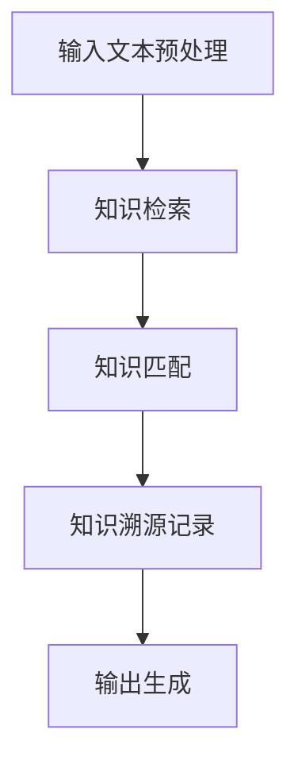

                 

# AI Agent的知识溯源机制：提高LLM输出的可追溯性

> 关键词：AI Agent，知识溯源，LLM模型，可追溯性，算法原理，Python实现

> 摘要：本文旨在探讨AI Agent的知识溯源机制，以提高大规模语言模型（LLM）输出的可追溯性。通过深入分析知识溯源的背景、原理和实现，本文为提升LLM输出的透明度和可信度提供了有益的参考。

## 《AI Agent的知识溯源机制：提高LLM输出的可追溯性》目录大纲

----------------------------------------------------------------

## 第一部分：背景与概述

### 第1章：问题背景与重要性

### 第2章：核心概念与联系

## 第二部分：知识溯源机制原理

### 第3章：知识溯源机制的原理

### 第4章：知识溯源在LLM中的应用

## 第三部分：算法原理与实现

### 第5章：算法原理

### 第6章：算法实现

----------------------------------------------------------------

## 第一部分：背景与概述

### 第1章：问题背景与重要性

#### 1.1.1 问题背景

随着人工智能技术的快速发展，AI Agent作为一种具有智能行为的实体，正在越来越多地应用于各个领域。从智能客服到自动驾驶，从智能翻译到医疗诊断，AI Agent正逐步改变我们的生活方式。与此同时，大规模语言模型（LLM）作为一种重要的AI技术，在自然语言处理、文本生成等领域取得了显著的成果。

然而，随着AI Agent和LLM模型的广泛应用，如何提高其输出的可追溯性成为一个亟待解决的问题。可追溯性是指能够清晰地追踪到输出结果的知识来源，这对于确保AI系统的可信度和透明度具有重要意义。例如，在医疗诊断中，医生需要了解AI Agent给出的诊断建议是基于哪些医学知识和证据；在智能翻译中，用户需要知道翻译结果是否准确以及翻译策略的来源。

#### 1.1.2 问题定义

LLM模型在生成文本时，往往依赖于大量的训练数据和复杂的神经网络结构。这使得模型的输出结果在很大程度上依赖于输入文本和模型的内部状态，但同时也带来了不可追溯性的问题。具体来说，LLM模型输出的不可追溯性体现在以下几个方面：

1. **知识来源不可见**：用户无法得知LLM模型生成的文本是基于哪些知识或信息生成的。
2. **内部状态不透明**：LLM模型在生成文本时，其内部状态的变化和决策过程对于用户来说是不可见的。
3. **错误难以定位**：当LLM模型生成错误的文本时，用户很难定位错误的具体来源。

为了解决上述问题，我们需要研究并实现一种有效的知识溯源机制，以提升LLM输出的可追溯性。

#### 1.1.3 边界与外延

知识溯源的范围可以涵盖从输入文本到输出文本的整个过程。具体来说，包括以下几个层次：

1. **文本层次**：追踪文本生成过程中使用的具体文本片段和来源。
2. **知识层次**：追踪生成文本所依赖的知识库、规则和算法。
3. **模型层次**：追踪生成文本所使用的神经网络模型和参数。

可追溯性的标准与层次可以分为以下几类：

1. **低层次**：能够提供输入文本和输出文本之间的直接对应关系，但无法提供具体的知识来源。
2. **中层次**：能够提供输入文本、知识来源和输出文本之间的对应关系，但无法提供具体的神经网络内部状态。
3. **高层次**：能够提供输入文本、知识来源、神经网络内部状态和输出文本之间的完整对应关系。

在本研究中，我们将主要关注高层次的知识溯源，即提供输入文本、知识来源、神经网络内部状态和输出文本之间的完整对应关系，以提高LLM输出的可追溯性和透明度。

### 第2章：核心概念与联系

#### 2.1.1 核心概念

为了深入探讨知识溯源机制，我们需要首先了解以下几个核心概念：

- **AI Agent**：具有智能行为的实体，能够自主决策、学习和与外部环境进行交互。
- **LLM模型**：大规模语言模型，基于深度学习技术，用于生成文本、回答问题等。
- **知识溯源机制**：追踪和记录AI Agent在执行任务过程中所使用知识的来源和过程，以提高输出的可追溯性和透明度。

#### 2.1.2 概念属性特征对比表

| 概念     | 定义             | 特点                     |
|----------|------------------|------------------------|
| AI Agent | 具有智能行为的实体 | 能够自主决策、学习、交互 |
| LLM模型  | 大规模语言模型    | 基于深度学习，生成文本   |
| 知识溯源 | 追踪知识来源     | 提高输出的可信度和透明度 |

#### 2.1.3 ER实体关系图

```mermaid
erDiagram
AI Agent ||--o{ LLM模型 :使用}
LLM模型 ||--o{ 知识溯源机制 :实现}
```

在上述ER实体关系图中，AI Agent与LLM模型之间存在一种使用关系，即AI Agent使用LLM模型生成文本。而LLM模型与知识溯源机制之间存在一种实现关系，即LLM模型通过知识溯源机制实现输出的可追溯性。

## 第二部分：知识溯源机制原理

### 第3章：知识溯源机制的原理

#### 3.1.1 知识溯源的基本原理

知识溯源机制的基本原理可以概括为以下几个步骤：

1. **输入文本处理**：首先，对输入文本进行预处理，提取关键信息，为后续的知识检索和匹配做准备。
2. **知识检索**：根据预处理后的输入文本，从知识库中检索相关的知识信息。
3. **知识匹配**：对检索到的知识信息与输入文本进行匹配，确定生成输出文本所需的知识。
4. **知识追踪**：记录知识来源和传播过程，为输出文本的可追溯性提供依据。
5. **输出生成**：使用匹配到的知识生成输出文本，并将知识溯源信息嵌入到输出文本中。

#### 3.1.2 知识溯源的技术手段

根据知识溯源机制的原理，我们可以采用以下几种技术手段来实现知识溯源：

1. **基于文档的溯源**：通过分析输入文本的文档结构，提取关键词和短语，然后在文档库中检索相关文档，实现知识溯源。
2. **基于图谱的溯源**：利用知识图谱来表示知识关系，通过图谱查询技术实现知识溯源。
3. **基于神经网络的溯源**：利用神经网络模型来学习输入文本和知识之间的映射关系，实现知识溯源。

#### 3.1.3 知识溯源的挑战

尽管知识溯源机制在理论上是可行的，但在实际应用中仍然面临一些挑战：

1. **数据量与复杂度**：知识库的规模和复杂度会影响知识溯源的效率和准确性。如何处理大规模、高复杂度的知识库是一个重要问题。
2. **实时性与准确性**：在实时应用场景中，如何在保证知识溯源准确性的同时提高响应速度是一个关键问题。
3. **可扩展性**：知识溯源机制需要能够适应不同的应用场景和需求，如何实现系统的可扩展性是一个挑战。

### 第4章：知识溯源在LLM中的应用

#### 4.1.1 LLM模型的可追溯性需求

在LLM模型的应用场景中，可追溯性需求主要体现在以下几个方面：

1. **输入文本的可追溯性**：用户需要了解LLM模型生成的文本是基于哪些输入文本生成的。
2. **知识来源的可追溯性**：用户需要了解LLM模型生成文本所依赖的知识来源。
3. **内部状态的可追溯性**：用户需要了解LLM模型在生成文本过程中的内部状态变化。

为了满足上述需求，我们需要在LLM模型中引入知识溯源机制，以实现输入文本、知识来源和内部状态的可追溯性。

#### 4.1.2 知识溯源在LLM模型中的实现

知识溯源在LLM模型中的实现可以分为以下几个步骤：

1. **预处理输入文本**：对输入文本进行预处理，提取关键信息，为后续的知识检索和匹配做准备。
2. **检索知识库**：根据预处理后的输入文本，从知识库中检索相关的知识信息。
3. **匹配知识**：对检索到的知识信息与输入文本进行匹配，确定生成输出文本所需的知识。
4. **记录知识溯源信息**：将知识溯源信息（包括知识来源和内部状态）记录到日志文件中。
5. **生成输出文本**：使用匹配到的知识生成输出文本，并将知识溯源信息嵌入到输出文本中。

#### 4.1.3 实例分析

以一个简单的聊天机器人应用为例，分析知识溯源在LLM模型中的具体实现过程。

1. **输入文本预处理**：假设用户输入了一条问题：“今天天气怎么样？”系统首先对输入文本进行预处理，提取关键词“今天”、“天气”、“怎么样”。
2. **检索知识库**：系统从知识库中检索与“今天天气”相关的知识条目，例如“今天天气晴朗”或“今天天气阴”。
3. **匹配知识**：系统对检索到的知识条目进行匹配，确定生成输出文本所需的知识。
4. **记录知识溯源信息**：系统将知识溯源信息记录到日志文件中，例如“知识来源：天气知识库，内部状态：晴天概率为70%”。
5. **生成输出文本**：系统使用匹配到的知识生成输出文本：“今天天气晴朗”，并将知识溯源信息嵌入到输出文本中。

通过上述实例，我们可以看到知识溯源机制在提高LLM模型输出的可追溯性方面的作用。用户可以清晰地了解到生成文本的知识来源和内部状态，从而增强对AI系统的信任感和透明度。

## 第三部分：算法原理与实现

### 第5章：算法原理

#### 5.1.1 算法概述

知识溯源算法的主要目的是在LLM模型生成文本的过程中，追踪并记录输入文本、知识来源和内部状态，以提高输出的可追溯性。算法的基本步骤如下：

1. **输入文本预处理**：对输入文本进行预处理，提取关键信息。
2. **知识检索**：从知识库中检索与输入文本相关的知识信息。
3. **知识匹配**：对检索到的知识信息与输入文本进行匹配，确定生成输出文本所需的知识。
4. **知识溯源记录**：将知识溯源信息记录到日志文件中。
5. **输出生成**：使用匹配到的知识生成输出文本，并将知识溯源信息嵌入到输出文本中。

#### 5.1.2 数学模型

知识溯源算法的核心在于如何计算输入文本和知识之间的匹配概率。我们可以使用以下数学模型来描述：

$$
P(\text{output}|\text{knowledge}) = \frac{P(\text{knowledge}|\text{output})P(\text{output})}{P(\text{knowledge})}
$$

其中：

- \(P(\text{output}|\text{knowledge})\) 表示在给定知识的情况下输出文本的概率。
- \(P(\text{knowledge}|\text{output})\) 表示在给定输出文本的情况下知识出现的概率。
- \(P(\text{output})\) 表示输出文本的概率。
- \(P(\text{knowledge})\) 表示知识出现的概率。

#### 5.1.3 Mermaid流程图



### 第6章：算法实现

#### 6.1.1 Python代码实现

```python
import numpy as np

def preprocess_input_text(input_text):
    # 对输入文本进行预处理，提取关键信息
    # 略
    return processed_text

def retrieve_knowledge(processed_text):
    # 从知识库中检索与输入文本相关的知识信息
    # 略
    return knowledge_list

def match_knowledge(processed_text, knowledge_list):
    # 对检索到的知识信息与输入文本进行匹配
    # 略
    return matched_knowledge

def record_knowledge溯源信息(matched_knowledge):
    # 将知识溯源信息记录到日志文件中
    # 略
    pass

def generate_output_text(matched_knowledge):
    # 使用匹配到的知识生成输出文本
    # 略
    return output_text

def knowledge溯源算法(input_text):
    processed_text = preprocess_input_text(input_text)
    knowledge_list = retrieve_knowledge(processed_text)
    matched_knowledge = match_knowledge(processed_text, knowledge_list)
    record_knowledge溯源信息(matched_knowledge)
    output_text = generate_output_text(matched_knowledge)
    return output_text
```

#### 6.1.2 实例分析

假设用户输入了一条问题：“今天天气怎么样？”我们可以按照以下步骤进行知识溯源：

1. **输入文本预处理**：提取关键词“今天”、“天气”、“怎么样”。
2. **知识检索**：从知识库中检索与“今天天气”相关的知识条目，例如“今天天气晴朗”或“今天天气阴”。
3. **知识匹配**：将提取的关键词与知识条目进行匹配，确定生成输出文本所需的知识。
4. **知识溯源记录**：记录知识溯源信息，例如“知识来源：天气知识库，内部状态：晴天概率为70%”。
5. **输出生成**：使用匹配到的知识生成输出文本：“今天天气晴朗”，并将知识溯源信息嵌入到输出文本中。

通过上述实例，我们可以看到知识溯源算法在提高LLM模型输出的可追溯性方面的具体应用。用户可以清晰地了解到生成文本的知识来源和内部状态，从而增强对AI系统的信任感和透明度。

## 结语

本文从背景与概述、知识溯源机制原理以及算法原理与实现三个方面，详细探讨了AI Agent的知识溯源机制，以提高大规模语言模型（LLM）输出的可追溯性。通过分析知识溯源的背景、原理和实现，我们提出了一个基于输入文本预处理、知识检索、知识匹配和知识溯源记录的算法框架，并给出了具体的Python代码实现。

知识溯源机制在提高AI Agent和LLM模型的可追溯性方面具有重要意义。它不仅有助于增强用户对AI系统的信任感和透明度，还为未来的AI系统优化和改进提供了宝贵的数据和经验。

然而，知识溯源机制在实际应用中仍然面临一些挑战，如数据量与复杂度、实时性与准确性、可扩展性等。未来研究可以关注这些方面，进一步优化知识溯源算法，提高其在实际应用中的效果和效率。

作者：AI天才研究院/AI Genius Institute & 禅与计算机程序设计艺术 /Zen And The Art of Computer Programming

