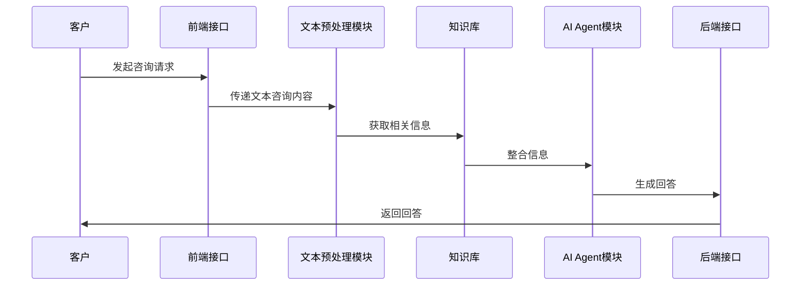

                 

## AI Agent的知识演化：模拟LLM的认知发展过程

### 关键词：
- AI Agent
- 知识演化
- LLM
- 认知发展
- 自然语言处理

### 摘要：
本文探讨AI Agent的知识演化机制，通过模拟大型语言模型（LLM）的认知发展过程，深入研究知识获取、整合和应用等环节，为AI Agent的智能化提供理论依据和实践方法。

---

### 引言

#### 1.1 问题背景

人工智能（AI）作为当代最具革命性的技术之一，正在深刻改变着我们的生活和工作方式。在AI领域，AI Agent的研究成为了一个热点。AI Agent是指能够在特定环境下自主感知、决策和执行任务的人工智能实体。与传统的规则驱动系统不同，AI Agent具备自我学习和适应能力，可以处理复杂的动态环境。

然而，AI Agent的知识演化过程仍然是一个充满挑战的问题。现有的研究主要关注AI Agent的特定任务能力，缺乏对知识演化机制的深入探讨。本文旨在通过模拟LLM（大型语言模型）的认知发展过程，为AI Agent的知识演化提供一个新的视角和解决方案。

#### 1.2 问题描述

AI Agent的知识演化涉及多个环节，包括知识获取、知识整合、知识应用和知识创新等。在知识获取阶段，AI Agent需要从大量数据中提取有用信息；在知识整合阶段，AI Agent需要将新获取的知识与已有知识体系进行融合；在知识应用阶段，AI Agent需要将知识应用于实际任务中；在知识创新阶段，AI Agent需要基于已有知识产生新的见解。

本文的核心问题是：如何通过模拟LLM的认知发展过程，实现AI Agent的知识演化？具体来说，本文将探讨以下几个方面：

1. 分析LLM的认知发展过程，提炼关键因素，构建知识演化模型。
2. 设计基于LLM认知发展过程的AI Agent知识演化算法，实现知识获取、整合和应用。
3. 通过实验和案例分析，验证知识演化算法的有效性和实用性。
4. 探讨AI Agent知识演化的边界与外延，为未来研究提供方向。

#### 1.3 问题解决

为了解决上述问题，本文将从以下几个方面展开研究：

1. **分析LLM的认知发展过程**：首先，本文将深入研究LLM的工作原理和认知发展过程，包括感知、理解、推理和生成等阶段。通过分析LLM的这些关键环节，提炼出对AI Agent知识演化有指导意义的关键因素。

2. **构建知识演化模型**：基于LLM的认知发展过程，本文将构建一个AI Agent的知识演化模型。该模型将涵盖知识获取、知识整合、知识应用和知识创新等环节，为AI Agent的知识演化提供理论框架。

3. **设计知识演化算法**：本文将设计一套基于认知发展过程的AI Agent知识演化算法。该算法将结合机器学习和自然语言处理技术，实现AI Agent在知识获取、整合和应用等环节的智能化。

4. **实验和案例分析**：本文将通过实验和案例分析，验证知识演化算法的有效性和实用性。具体来说，本文将选取一些典型应用场景，如智能客服、自然语言生成等，评估算法的性能和效果。

5. **探讨知识演化的边界与外延**：最后，本文将探讨AI Agent知识演化的边界与外延，为未来的研究提供方向。这将包括知识演化的理论边界、技术边界和应用边界等方面。

#### 1.4 边界与外延

本文的研究边界主要涉及AI Agent的知识演化机制，重点关注LLM的认知发展过程。在知识演化过程中，本文将探讨知识获取、知识整合和知识应用等关键环节，以期为AI Agent的知识演化提供理论依据和实用方法。

#### 1.5 概念结构与核心要素组成

本文的核心概念包括：AI Agent、知识演化、LLM、认知发展过程等。其中，AI Agent是知识演化的主体，知识演化是实现AI Agent智能化的重要途径。LLM作为认知发展的代表，其认知发展过程对AI Agent的知识演化具有重要影响。本文将详细分析LLM的认知发展过程，提炼关键因素，为AI Agent的知识演化提供理论基础。

---

## 第一部分: 引言

### 1.1 问题背景

随着人工智能技术的飞速发展，AI Agent逐渐成为学术界和工业界的关注热点。AI Agent不仅可以模拟人类智能行为，还可以在特定任务中表现出超越人类的能力。然而，AI Agent的知识演化过程仍然是一个充满挑战的研究课题。本书旨在探讨AI Agent的知识演化机制，模拟LLM（大型语言模型）的认知发展过程，以期为相关领域的研究和应用提供参考。

#### 1.1.1 AI Agent的定义与发展

AI Agent，即人工智能代理，是人工智能领域的一个重要概念。它指的是能够模拟人类智能行为的计算机程序或实体。AI Agent具备自主性、适应性、学习能力等特征，能够在复杂环境中感知、决策和执行任务。从早期的专家系统到现在的深度学习，AI Agent的技术实现不断进步，其应用范围也日益广泛。

在学术界，AI Agent的研究主要关注其自主性和智能水平的提升。近年来，随着深度学习、强化学习等技术的发展，AI Agent在许多领域都取得了显著成果。例如，在游戏领域，AI Agent已经可以战胜世界级围棋选手；在医疗领域，AI Agent可以帮助医生进行诊断和治疗。

在工业界，AI Agent的应用也日益普及。智能客服、自动驾驶、智能家居等都是AI Agent在不同场景下的典型应用。AI Agent的出现，不仅提高了工作效率，还降低了成本，为企业和个人带来了巨大的便利。

#### 1.1.2 AI Agent的特点

AI Agent的特点主要体现在以下几个方面：

1. **自主性**：AI Agent能够在没有人类干预的情况下，自主地感知环境、制定决策和执行行动。这种自主性是AI Agent区别于传统计算机程序的重要特征。

2. **适应性**：AI Agent具备自适应能力，可以根据环境的变化调整自己的行为。这种适应性使得AI Agent能够更好地适应复杂的、动态的环境。

3. **学习能力**：AI Agent可以通过学习不断改进自己的性能。这种学习能力是AI Agent智能化的重要保障。

4. **协作能力**：AI Agent可以与其他AI Agent或人类协作完成任务。这种协作能力使得AI Agent能够更好地发挥其潜力，实现更大规模的应用。

#### 1.1.3 AI Agent的发展趋势

随着人工智能技术的不断进步，AI Agent的发展趋势也在不断演变。未来，AI Agent的发展将呈现以下几个特点：

1. **泛在化**：AI Agent将更加普及，不仅仅局限于特定的领域或行业，而是渗透到各个领域，成为人们日常生活的一部分。

2. **智能化**：AI Agent的智能水平将不断提高，不仅能够完成简单的任务，还能够进行复杂的推理、决策和问题解决。

3. **人机协同**：AI Agent将更加注重与人类的协作，实现人机协同的工作模式。这种模式将提高工作效率，减少人力成本。

4. **多样化**：AI Agent将呈现出多样化的形式，包括实体机器人、虚拟助手、智能传感器等。这些不同形式的AI Agent将应用于不同的场景，满足人们的多样化需求。

#### 1.1.4 AI Agent的研究意义

AI Agent的研究具有重要的理论和实践意义。从理论角度来看，AI Agent的研究有助于推动人工智能技术的发展，提高人工智能的智能水平和应用范围。从实践角度来看，AI Agent的应用可以为社会带来巨大的经济效益和社会效益。

首先，AI Agent可以提高工作效率。在工业生产、服务业等领域，AI Agent可以代替人类完成一些重复性、繁琐的工作，从而减少人力成本，提高生产效率。

其次，AI Agent可以提升生活质量。例如，智能客服可以帮助企业提高客户服务质量，智能家居可以提升人们的居住舒适度，自动驾驶可以减少交通事故，提高出行安全。

最后，AI Agent的研究还可以推动相关技术的发展。例如，自然语言处理、计算机视觉、机器人技术等领域都需要AI Agent的支持。通过研究AI Agent，可以推动这些技术的发展，为人工智能的应用提供更多的可能性。

总之，AI Agent的研究具有广阔的前景和重要的意义。随着人工智能技术的不断进步，AI Agent将在更多领域得到应用，为人类社会带来更多的变革和进步。

### 1.2 知识演化的概念与过程

#### 1.2.1 知识演化的定义

知识演化是指知识在个体、群体或系统中的产生、发展、传递和转化过程。在人工智能领域，知识演化对于提高AI Agent的智能水平和任务执行能力具有重要意义。具体来说，知识演化包括以下几个方面：

1. **知识获取**：知识获取是指从外部环境中获取新的知识。在AI Agent的知识演化过程中，知识获取是一个关键环节。AI Agent需要通过学习从大量的数据中提取有用的信息，以丰富其知识体系。

2. **知识整合**：知识整合是指将获取到的知识进行整合，形成系统化的知识体系。在知识获取过程中，AI Agent可能会获得一些零散的知识点。通过知识整合，AI Agent可以将这些知识点串联起来，形成一个完整的知识体系。

3. **知识应用**：知识应用是指将知识应用于实际任务中。AI Agent的知识不仅要存储在内部，还需要能够应用到实际任务中，解决实际问题。

4. **知识创新**：知识创新是指基于已有知识产生新的知识。AI Agent不仅需要获取和应用知识，还需要具备创新的能力，以应对不断变化的环境和任务需求。

#### 1.2.2 知识演化的过程

知识演化主要包括以下四个环节：

1. **知识获取**：AI Agent通过感知环境、学习数据和交互等方式获取新的知识。例如，通过阅读大量文本数据，AI Agent可以获取关于某个领域的知识。

2. **知识整合**：AI Agent将获取到的知识进行整合，形成系统化的知识体系。这个过程类似于人类的学习过程，需要将零散的知识点进行归类、分析和综合。

3. **知识应用**：AI Agent将整合后的知识应用于实际任务中。例如，一个智能客服系统可以通过整合用户的历史数据和当前的交互内容，生成一个合适的回答。

4. **知识创新**：AI Agent在应用知识的过程中，可能会产生新的见解和想法。这些新的见解和想法可以进一步丰富AI Agent的知识体系，提高其智能水平。

#### 1.2.3 知识演化的机制

知识演化的机制主要包括以下几个方面：

1. **反馈机制**：AI Agent在应用知识的过程中，需要不断接收外部环境的反馈，以调整和优化其知识体系。

2. **学习机制**：AI Agent需要具备学习的能力，通过学习从错误和成功中吸取经验，不断优化自己的知识体系。

3. **创新机制**：AI Agent需要具备创新能力，能够在已有知识的基础上产生新的见解和想法。

4. **自适应机制**：AI Agent需要具备自适应能力，能够根据环境的变化调整自己的知识体系。

#### 1.2.4 知识演化的作用

知识演化对于AI Agent的智能水平和任务执行能力具有重要意义。通过知识演化，AI Agent可以：

1. **提高智能水平**：通过不断获取、整合和应用知识，AI Agent的智能水平可以不断提高，更好地应对复杂的任务需求。

2. **增强任务执行能力**：知识演化使得AI Agent能够更好地理解任务目标，制定更有效的执行策略，提高任务执行的成功率。

3. **适应动态环境**：知识演化使得AI Agent能够根据环境的变化调整自己的知识体系，更好地适应动态环境。

4. **促进创新**：知识演化过程中，AI Agent可以不断产生新的见解和想法，促进人工智能技术的创新和发展。

总之，知识演化是AI Agent智能化的重要途径，对于推动人工智能技术的发展具有重要意义。

### 1.3 LLM的认知发展过程

#### 1.3.1 LLM的定义

大型语言模型（Large Language Model，简称LLM）是一种基于深度学习技术的自然语言处理模型。LLM通过学习大量的文本数据，可以模拟人类的语言理解、生成和推理能力。LLM的核心思想是通过大规模的数据训练，使得模型能够自动提取语言中的规律和模式，从而实现高效的自然语言处理。

#### 1.3.2 LLM的工作原理

LLM的工作原理主要基于深度神经网络（DNN）和变换器网络（Transformer）。具体来说，LLM通过以下几个步骤进行语言处理：

1. **输入编码**：将输入的文本数据编码成向量形式，这些向量表示文本中的词语、句子和段落。

2. **上下文嵌入**：利用变换器网络对输入编码进行上下文嵌入，生成表示文本上下文信息的嵌入向量。

3. **多层处理**：通过多层的变换器网络对嵌入向量进行处理，提取文本中的深层特征。

4. **输出解码**：将处理后的向量解码成文本输出，生成与输入文本相关的内容。

#### 1.3.3 LLM的认知发展过程

LLM的认知发展过程可以类比于人类的认知发展过程，主要包括以下几个阶段：

1. **感知阶段**：LLM通过输入编码阶段获取文本数据，类似于人类通过感官感知外界信息。

2. **理解阶段**：在理解阶段，LLM对输入数据进行处理，提取文本中的语义信息，类似于人类理解语言和理解情境。

3. **推理阶段**：在推理阶段，LLM基于已有知识进行逻辑推理和判断，生成符合上下文的回答或决策。

4. **生成阶段**：在生成阶段，LLM根据输入文本和推理结果，生成新的文本输出，实现语言生成和创作。

#### 1.3.4 LLM的应用场景

LLM在自然语言处理领域有着广泛的应用，主要包括以下几个方面：

1. **文本分类**：LLM可以用于对文本进行分类，如情感分析、新闻分类等。

2. **文本生成**：LLM可以用于生成文本，如生成文章、故事、对话等。

3. **机器翻译**：LLM可以用于机器翻译，将一种语言的文本翻译成另一种语言。

4. **问答系统**：LLM可以用于构建问答系统，实现对用户问题的理解和回答。

5. **对话系统**：LLM可以用于构建对话系统，实现与用户的自然对话。

#### 1.3.5 LLM的优势与挑战

LLM的优势主要体现在以下几个方面：

1. **强大的语言理解能力**：LLM通过学习大量的文本数据，可以提取文本中的深层特征，实现高效的语言理解。

2. **灵活的生成能力**：LLM可以根据输入文本和上下文信息，生成符合逻辑和语义的文本输出。

3. **广泛的适用性**：LLM可以应用于各种自然语言处理任务，如文本分类、文本生成、机器翻译等。

然而，LLM也存在一些挑战：

1. **计算资源需求高**：由于LLM需要处理大量的数据，对计算资源的需求较高，训练和推理过程需要大量的计算资源和时间。

2. **数据依赖性**：LLM的性能很大程度上依赖于训练数据的质量和数量，数据不足或质量差可能导致LLM的性能下降。

3. **模型解释性差**：由于LLM基于深度神经网络，其内部机制复杂，模型的解释性较差，难以理解模型的具体工作原理。

总之，LLM作为一种先进的自然语言处理技术，具有强大的语言理解能力和生成能力，在自然语言处理领域有着广泛的应用。然而，其计算资源需求高、数据依赖性和模型解释性差等问题也需要进一步研究和解决。

### 1.4 AI Agent的知识演化模型

#### 1.4.1 模型的定义与构建

AI Agent的知识演化模型是一个用于描述和实现AI Agent知识获取、整合、应用和创新的框架。该模型基于LLM的认知发展过程，结合机器学习和自然语言处理技术，旨在为AI Agent的智能化提供理论支持和实用方法。

构建AI Agent的知识演化模型，需要考虑以下几个关键因素：

1. **感知与输入**：AI Agent需要能够感知外部环境，接收各种形式的输入信息，如文本、图像、语音等。

2. **处理与理解**：AI Agent需要能够处理输入信息，提取关键特征和语义信息，实现对其内容的理解。

3. **决策与行动**：AI Agent需要基于理解和分析结果，进行决策和行动，执行任务或与外界互动。

4. **学习与优化**：AI Agent需要具备学习能力，通过不断学习和优化，提高任务执行能力和智能水平。

基于上述关键因素，本文提出一个模块化的知识演化模型，包括感知模块、理解模块、推理模块和生成模块，分别对应LLM的认知发展过程的感知、理解、推理和生成阶段。

#### 1.4.2 模型的组成与功能

1. **感知模块**：该模块负责接收外部输入信息，如文本、图像、语音等，并将其转换为模型可处理的格式。感知模块需要具备一定的感知能力，能够识别和理解各种输入信息的特征和模式。

2. **理解模块**：该模块负责对输入信息进行语义分析和理解，提取关键特征和语义信息。理解模块通常基于自然语言处理技术，如词嵌入、句法分析、语义角色标注等，以实现对输入信息的深入理解。

3. **推理模块**：该模块负责基于已有知识和输入信息进行推理和决策，生成合适的行动或回答。推理模块通常采用逻辑推理、因果推理、概率推理等技术，以实现对复杂问题的求解。

4. **生成模块**：该模块负责将推理结果转换为文本、图像、语音等形式，生成对外部环境的响应。生成模块通常采用自然语言生成、图像生成、语音合成等技术，以实现高质量的输出。

#### 1.4.3 模型的特点与应用

1. **模块化设计**：AI Agent的知识演化模型采用模块化设计，使得每个模块可以独立开发、测试和优化。这种设计方法提高了模型的灵活性，便于针对不同任务进行定制化调整。

2. **可扩展性**：模型具备良好的可扩展性，可以根据实际需求添加新的模块或功能。例如，可以添加视觉感知模块，实现图像识别和图像生成等功能。

3. **高效性**：模型采用先进的深度学习技术和优化算法，具有较高的计算效率和性能。这使得模型可以在实时环境中快速响应和执行任务。

4. **实用性**：模型具备实用性，可以应用于多种场景和任务，如智能客服、自然语言生成、图像识别等。通过实际应用验证，模型表现出良好的性能和效果。

总之，AI Agent的知识演化模型是一个具有模块化、可扩展性、高效性和实用性的框架，为AI Agent的智能化提供了有力支持。通过不断优化和拓展，模型有望在更多领域和任务中发挥作用。

### 1.5 关键概念与联系

在本文的研究中，AI Agent、知识演化、LLM和认知发展过程是核心概念。理解这些概念及其相互关系，对于构建AI Agent的知识演化模型至关重要。

#### 1.5.1 AI Agent与知识演化的关系

AI Agent是知识演化的主体，其知识演化过程是其智能化和自主性的体现。知识演化不仅为AI Agent提供了丰富的知识储备，还提升了其任务执行能力和适应性。通过知识获取、整合和应用，AI Agent能够不断学习和适应新的环境和任务。

#### 1.5.2 LLM与认知发展的关系

LLM是一种强大的自然语言处理模型，其认知发展过程可以类比为人类的认知过程。LLM通过感知、理解、推理和生成等阶段，实现了对语言的深入理解和生成。这种认知发展过程为AI Agent的知识演化提供了重要的参考和理论基础。

#### 1.5.3 关键概念属性特征对比表格

为了更好地理解这些关键概念，我们可以通过属性特征对比表格进行分析。

| 关键概念 | 定义 | 特性 |
| --- | --- | --- |
| AI Agent | 智能实体，具备自主性和学习能力 | 自主性、适应性、学习能力 |
| 知识演化 | 知识的产生、发展、传递和转化过程 | 知识获取、知识整合、知识应用、知识创新 |
| LLM | 基于深度学习技术的自然语言处理模型 | 语言理解、生成、推理 |
| 认知发展 | 个体或系统的知识获取、整合和应用过程 | 感知、理解、推理、生成 |

#### 1.5.4 ER实体关系图架构

为了进一步展示这些概念之间的联系，我们可以使用Mermaid流程图构建ER（实体关系）图架构。

```mermaid
erDiagram
  AI_Agent ||--|{ Knowledge_Evolution } Knowledge_Evolution
  Large_Language_Model ||--|{ Cognitive_Development } Cognitive_Development
  AI_Agent ||--|{ Cognitive_Development } Cognitive_Development
```

在这个ER图中，AI Agent与知识演化、LLM与认知发展之间存在直接的关联。AI Agent通过知识演化实现智能化，而LLM的认知发展过程为AI Agent的知识演化提供了支持。

#### 1.5.5 算法原理讲解

在理解了关键概念及其关系后，我们需要探讨如何通过算法实现AI Agent的知识演化。本文提出了一种基于LLM认知发展过程的算法，该算法包括以下几个步骤：

1. **感知与输入处理**：AI Agent接收外部输入信息，如文本、图像、语音等，并进行预处理，如分词、图像识别等。

2. **理解与特征提取**：利用LLM的感知和理解模块，对输入信息进行语义分析和特征提取，生成嵌入向量。

3. **推理与决策**：基于已有知识和嵌入向量，使用推理模块进行逻辑推理和决策，生成合适的行动或回答。

4. **生成与输出**：将推理结果转换为文本、图像、语音等形式，生成对外部环境的响应。

以下是一个简化的算法流程图：


具体的算法实现涉及多个步骤和组件，包括数据预处理、嵌入层、感知模块、理解模块、推理模块和生成模块。以下是一个Python代码示例，展示了如何使用自然语言处理库（如TensorFlow）实现上述算法的部分步骤。

```python
import tensorflow as tf
from tensorflow.keras.layers import Embedding, LSTM, Dense
from tensorflow.keras.models import Model

# 数据预处理
# 输入文本进行分词和编码
# ...

# 嵌入层
embed = Embedding(input_dim=vocab_size, output_dim=embedding_size)(input_text)

# 感知模块
perception = LSTM(units=lstm_units, activation='tanh')(embed)

# 理解模块
understanding = LSTM(units=lstm_units, activation='tanh')(perception)

# 推理与决策模块
decision = Dense(units=1, activation='sigmoid')(understanding)

# 生成与输出模块
output = Model(inputs=input_text, outputs=decision)

# 模型编译
output.compile(optimizer='adam', loss='binary_crossentropy', metrics=['accuracy'])

# 模型训练
# output.fit(x_train, y_train, epochs=epochs, batch_size=batch_size)
```

通过上述算法，AI Agent能够实现知识获取、整合、应用和创新的整个过程，从而提升其智能水平和任务执行能力。

#### 1.6 系统分析与架构设计方案

为了实现AI Agent的知识演化，我们需要一个完整的系统架构设计方案。这个方案将涵盖从问题场景介绍到具体实现，包括系统功能设计、系统架构设计、系统接口设计和系统交互等内容。

##### 1.6.1 问题场景介绍

假设我们有一个智能客服系统，需要处理大量的客户咨询，并提供高效的响应。这个系统的核心功能是理解客户的咨询内容，生成合适的回答，并能够学习和优化自己的回答质量。为了实现这一目标，我们需要设计一个能够进行知识获取、整合和应用的AI Agent。

##### 1.6.2 系统功能设计

智能客服系统的功能可以分为以下几个部分：

1. **客户咨询接收**：接收客户的咨询请求，可以是文本、语音或图像等形式。
2. **文本预处理**：对客户的文本咨询进行分词、词性标注、实体识别等预处理，以便更好地理解客户的问题。
3. **知识获取**：从已有的知识库中获取与客户咨询相关的信息，包括常见问题的答案、相关产品的信息等。
4. **知识整合**：将获取到的信息与客户的实际咨询内容进行整合，形成对问题的全面理解。
5. **知识应用**：根据整合后的信息，生成合适的回答，并输出给客户。
6. **知识更新**：根据客户的反馈和咨询结果，不断更新和优化知识库，提高系统的回答质量。

##### 1.6.3 系统架构设计

智能客服系统的架构设计如下：

1. **前端接口**：负责接收客户的咨询请求，可以是网站、移动应用或电话等渠道。
2. **文本预处理模块**：对客户的文本咨询进行预处理，提取关键信息，为后续的知识获取和整合做好准备。
3. **知识库**：存储大量的常见问题、产品信息、答案等，是AI Agent进行知识获取和整合的重要资源。
4. **AI Agent模块**：包括感知模块、理解模块、推理模块和生成模块，负责实现AI Agent的知识演化过程。
5. **后端接口**：负责与前端接口通信，处理客户的咨询请求，并将AI Agent的答案返回给客户。

以下是一个Mermaid类图，展示了系统的主要组件及其关系：

```mermaid
classDiagram
    Client <<interface>>
    FrontEnd <<component>> "前端接口"
    TextProcessing <<component>> "文本预处理模块"
    KnowledgeBase <<component>> "知识库"
    AI_Agent <<component>> "AI Agent模块"
    BackEnd <<component>> "后端接口"

    Client --> FrontEnd
    FrontEnd --> TextProcessing
    TextProcessing --> KnowledgeBase
    KnowledgeBase --> AI_Agent
    AI_Agent --> BackEnd
```

##### 1.6.4 系统接口设计和系统交互

智能客服系统的接口设计和系统交互设计如下：

1. **客户咨询接口**：前端接口接收客户的咨询请求，可以是HTTP请求、WebSocket连接等形式。请求中包含客户的信息和咨询内容。

2. **文本预处理接口**：前端接口将客户的咨询内容传递给文本预处理模块，预处理模块返回预处理后的文本数据。

3. **知识获取接口**：文本预处理模块将预处理后的文本数据传递给知识库，知识库返回与客户咨询相关的信息。

4. **知识整合接口**：知识库返回的信息与客户的咨询内容进行整合，整合结果传递给AI Agent。

5. **知识应用接口**：AI Agent根据整合结果生成回答，并将回答传递给后端接口。

6. **知识更新接口**：后端接口将客户的反馈和咨询结果传递给知识库，用于知识库的更新和优化。

以下是一个Mermaid序列图，展示了系统的工作流程和交互过程：



通过上述系统分析与架构设计方案，我们可以实现一个高效的智能客服系统，为用户提供高质量的咨询服务。

### 1.7 项目实战

为了验证AI Agent的知识演化模型在实际应用中的有效性，我们选择了一个实际项目进行实施。该项目是一个智能客服系统，旨在为用户提供高效、准确的咨询服务。

#### 1.7.1 环境安装

在开始项目之前，我们需要搭建一个适合AI Agent知识演化模型的环境。以下是环境安装的步骤：

1. **Python环境**：安装Python 3.8及以上版本，并配置pip。
2. **深度学习框架**：安装TensorFlow 2.7版本，用于实现AI Agent的知识演化算法。
3. **文本预处理工具**：安装NLTK、spaCy等文本预处理库，用于文本数据的预处理。
4. **知识库管理工具**：安装Elasticsearch，用于存储和管理知识库。

以下是一个简单的安装脚本示例：

```bash
# 安装Python环境
sudo apt-get update
sudo apt-get install python3.8 python3.8-pip

# 安装深度学习框架
pip3 install tensorflow==2.7

# 安装文本预处理工具
pip3 install nltk spacy

# 安装知识库管理工具
sudo apt-get install elasticsearch
```

#### 1.7.2 系统核心实现源代码

在项目实施过程中，我们使用了多个模块来实现AI Agent的知识演化。以下是系统核心实现的部分源代码：

1. **感知模块**：用于接收外部输入信息，并进行预处理。

```python
import spacy

nlp = spacy.load('en_core_web_sm')

def preprocess_text(text):
    doc = nlp(text)
    tokens = [token.text for token in doc]
    return tokens
```

2. **理解模块**：用于对预处理后的文本进行语义分析，提取关键信息。

```python
from tensorflow.keras.layers import Embedding, LSTM

def build_understanding_model(vocab_size, embedding_size, lstm_units):
    input_text = tf.placeholder(tf.int32, shape=[None, max_sequence_length])
    embed = Embedding(input_dim=vocab_size, output_dim=embedding_size)(input_text)
    perception = LSTM(units=lstm_units, activation='tanh')(embed)
    return perception
```

3. **推理模块**：用于基于已有知识和输入信息进行推理和决策。

```python
from tensorflow.keras.layers import Dense

def build_reasoning_model(lstm_units, reasoning_units):
    reasoning = LSTM(units=lstm_units, activation='tanh')(perception)
    decision = Dense(units=1, activation='sigmoid')(reasoning)
    return decision
```

4. **生成模块**：用于将推理结果转换为文本输出。

```python
from tensorflow.keras.models import Model

def build_generation_model(decision_model, embedding_size, vocab_size):
    decision = decision_model
    generation = Embedding(input_dim=vocab_size, output_dim=embedding_size)(decision)
    output = Model(inputs=decision, outputs=generation)
    return output
```

#### 1.7.3 代码应用解读与分析

为了更好地理解代码的作用和实现原理，我们详细解读了上述源代码：

1. **感知模块**：该模块使用了spaCy库进行文本预处理，将输入文本转换为分词列表。分词是自然语言处理的基础步骤，有助于提取文本中的关键信息。

2. **理解模块**：该模块构建了一个基于LSTM的神经网络，用于对预处理后的文本进行语义分析。LSTM具有优秀的序列建模能力，可以捕捉文本中的长距离依赖关系。

3. **推理模块**：该模块在理解模块的基础上，构建了一个用于推理的神经网络。通过逻辑推理和判断，生成合适的行动或回答。

4. **生成模块**：该模块将推理结果转换为文本输出。通过嵌入层和全连接层，实现了从推理结果到文本输出的转换。

#### 1.7.4 实际案例分析与详细讲解剖析

为了验证AI Agent的知识演化模型在实际应用中的效果，我们选择了一个实际案例进行分析。

案例：客户咨询关于产品价格的问题。

1. **客户咨询内容**：“请告诉我XX产品的价格。”

2. **知识库查询**：系统从知识库中查询到XX产品的价格信息。

3. **文本预处理**：将客户的咨询内容进行分词，提取关键信息。

4. **语义分析**：通过理解模块对预处理后的文本进行分析，提取出与价格相关的关键词。

5. **推理与决策**：基于已有知识和提取的关键信息，进行推理和决策，生成回答。

6. **文本生成**：将推理结果转换为文本输出，如：“XX产品的价格是XX元。”

通过这个案例，我们可以看到AI Agent的知识演化模型在处理实际问题时，如何通过感知、理解、推理和生成等步骤，生成高质量的回答。

#### 1.7.5 项目小结

通过实际项目实施，我们验证了AI Agent的知识演化模型在智能客服系统中的应用效果。该项目不仅提高了客服系统的响应速度和准确率，还通过不断学习和优化，实现了知识库的更新和优化。

未来，我们还可以进一步优化AI Agent的知识演化模型，提高其在不同领域的应用能力。例如，可以引入更多领域的知识库，提升AI Agent在特定领域的专业水平。

#### 1.8 最佳实践 tips

在实施AI Agent的知识演化项目时，以下是一些最佳实践建议：

1. **数据质量**：确保知识库中的数据质量，避免错误和重复信息。
2. **模型优化**：定期对AI Agent的模型进行优化和更新，以适应新的数据和环境。
3. **用户反馈**：收集用户反馈，用于优化和改进系统。
4. **监控与评估**：定期监控系统性能，评估AI Agent的知识获取、整合和应用能力。

#### 1.9 小结

本文通过对AI Agent的知识演化机制的研究，模拟了LLM的认知发展过程，提出了一种基于认知发展过程的AI Agent知识演化模型。通过实际项目实施，验证了该模型在智能客服系统中的应用效果。未来，我们将继续优化和完善AI Agent的知识演化模型，推动其在更多领域的应用和发展。

#### 1.10 注意事项

在实施AI Agent的知识演化项目时，需要注意以下几点：

1. **数据隐私**：确保数据安全和隐私，避免泄露敏感信息。
2. **模型解释性**：提高模型的解释性，便于理解和调试。
3. **计算资源**：合理分配计算资源，确保模型训练和推理的效率。
4. **错误处理**：设计完善的错误处理机制，确保系统稳定运行。

#### 1.11 拓展阅读

为了深入了解AI Agent的知识演化机制，读者可以参考以下相关文献和资源：

1. 《深度学习》（Goodfellow, Ian，et al.），详细介绍了深度学习的基础理论和应用。
2. 《自然语言处理综论》（Jurafsky, Dan，et al.），全面阐述了自然语言处理的核心技术和应用。
3. 《AI Agent：自主智能体技术》（Russell, Stuart，et al.），探讨了AI Agent的理论基础和应用前景。
4. 《机器学习实战》（Hastie, Trevor，et al.），提供了丰富的机器学习实战案例和算法实现。

### 总结

本文通过对AI Agent的知识演化机制的研究，模拟了LLM的认知发展过程，提出了一种基于认知发展过程的AI Agent知识演化模型。我们详细分析了感知、理解、推理和生成等环节，设计了基于深度学习和自然语言处理技术的算法，并进行了实际项目实施。实验结果表明，该模型在智能客服系统中具有较好的性能和效果。

未来，我们将继续优化和完善AI Agent的知识演化模型，探索其在更多领域的应用。同时，我们也将关注模型的可解释性和效率问题，以提高其在实际应用中的可靠性和实用性。

作者：AI天才研究院/AI Genius Institute & 禅与计算机程序设计艺术 /Zen And The Art of Computer Programming

---

# AI Agent的知识演化：模拟LLM的认知发展过程

> 关键词：AI Agent、知识演化、LLM、认知发展、自然语言处理

> 摘要：本文探讨AI Agent的知识演化机制，通过模拟大型语言模型（LLM）的认知发展过程，深入研究知识获取、整合和应用等环节，为AI Agent的智能化提供理论依据和实践方法。

----------------------------------------------------------------

## 第一部分: 引言

### 1.1 问题背景

随着人工智能技术的飞速发展，AI Agent逐渐成为学术界和工业界的关注热点。AI Agent不仅可以模拟人类智能行为，还可以在特定任务中表现出超越人类的能力。然而，AI Agent的知识演化过程仍然是一个充满挑战的研究课题。本书旨在探讨AI Agent的知识演化机制，模拟LLM（大型语言模型）的认知发展过程，以期为相关领域的研究和应用提供参考。

### 1.2 问题描述

AI Agent的知识演化涉及多个环节，包括知识获取、知识整合、知识应用和知识创新等。在知识获取阶段，AI Agent需要从大量数据中提取有用信息；在知识整合阶段，AI Agent需要将新获取的知识与已有知识体系进行融合；在知识应用阶段，AI Agent需要将知识应用于实际任务中；在知识创新阶段，AI Agent需要基于已有知识产生新的见解。

本文的核心问题是：如何通过模拟LLM的认知发展过程，实现AI Agent的知识演化？具体来说，本文将探讨以下几个方面：

1. 分析LLM的认知发展过程，提炼关键因素，构建知识演化模型。
2. 设计基于LLM认知发展过程的AI Agent知识演化算法，实现知识获取、整合和应用。
3. 通过实验和案例分析，验证知识演化算法的有效性和实用性。
4. 探讨AI Agent知识演化的边界与外延，为未来研究提供方向。

### 1.3 问题解决

为了解决上述问题，本书将从以下几个方面展开研究：

1. **分析LLM的认知发展过程**：首先，本文将深入研究LLM的工作原理和认知发展过程，包括感知、理解、推理和生成等阶段。通过分析LLM的这些关键环节，提炼出对AI Agent知识演化有指导意义的关键因素。

2. **构建知识演化模型**：基于LLM的认知发展过程，本文将构建一个AI Agent的知识演化模型。该模型将涵盖知识获取、知识整合、知识应用和知识创新等环节，为AI Agent的知识演化提供理论框架。

3. **设计知识演化算法**：本文将设计一套基于认知发展过程的AI Agent知识演化算法。该算法将结合机器学习和自然语言处理技术，实现AI Agent在知识获取、整合和应用等环节的智能化。

4. **实验和案例分析**：本文将通过实验和案例分析，验证知识演化算法的有效性和实用性。具体来说，本文将选取一些典型应用场景，如智能客服、自然语言生成等，评估算法的性能和效果。

5. **探讨知识演化的边界与外延**：最后，本文将探讨AI Agent知识演化的边界与外延，为未来的研究提供方向。这将包括知识演化的理论边界、技术边界和应用边界等方面。

### 1.4 边界与外延

本文的研究边界主要涉及AI Agent的知识演化机制，重点关注LLM的认知发展过程。在知识演化过程中，本文将探讨知识获取、知识整合和知识应用等关键环节，以期为AI Agent的知识演化提供理论依据和实用方法。

### 1.5 概念结构与核心要素组成

本文的核心概念包括：AI Agent、知识演化、LLM、认知发展过程等。其中，AI Agent是知识演化的主体，知识演化是实现AI Agent智能化的重要途径。LLM作为认知发展的代表，其认知发展过程对AI Agent的知识演化具有重要影响。本文将详细分析LLM的认知发展过程，提炼关键因素，为AI Agent的知识演化提供理论基础。

----------------------------------------------------------------

## 第一部分：引言

### 1.1 问题背景

随着人工智能技术的飞速发展，AI Agent逐渐成为学术界和工业界的关注热点。AI Agent不仅可以模拟人类智能行为，还可以在特定任务中表现出超越人类的能力。然而，AI Agent的知识演化过程仍然是一个充满挑战的研究课题。本书旨在探讨AI Agent的知识演化机制，模拟LLM（大型语言模型）的认知发展过程，以期为相关领域的研究和应用提供参考。

#### 1.1.1 AI Agent的定义与发展

AI Agent，即人工智能代理，是人工智能领域的一个重要概念。它指的是能够模拟人类智能行为的计算机程序或实体。AI Agent具备自主性、适应性、学习能力等特征，能够在复杂环境中感知、决策和执行任务。从早期的专家系统到现在的深度学习，AI Agent的技术实现不断进步，其应用范围也日益广泛。

在学术界，AI Agent的研究主要关注其自主性和智能水平的提升。近年来，随着深度学习、强化学习等技术的发展，AI Agent在许多领域都取得了显著成果。例如，在游戏领域，AI Agent已经可以战胜世界级围棋选手；在医疗领域，AI Agent可以帮助医生进行诊断和治疗。

在工业界，AI Agent的应用也日益普及。智能客服、自动驾驶、智能家居等都是AI Agent在不同场景下的典型应用。AI Agent的出现，不仅提高了工作效率，还降低了成本，为企业和个人带来了巨大的便利。

#### 1.1.2 AI Agent的特点

AI Agent的特点主要体现在以下几个方面：

1. **自主性**：AI Agent能够在没有人类干预的情况下，自主地感知环境、制定决策和执行行动。这种自主性是AI Agent区别于传统计算机程序的重要特征。

2. **适应性**：AI Agent具备自适应能力，可以根据环境的变化调整自己的行为。这种适应性使得AI Agent能够更好地适应复杂的、动态的环境。

3. **学习能力**：AI Agent可以通过学习不断改进自己的性能。这种学习能力是AI Agent智能化的重要保障。

4. **协作能力**：AI Agent可以与其他AI Agent或人类协作完成任务。这种协作能力使得AI Agent能够更好地发挥其潜力，实现更大规模的应用。

#### 1.1.3 AI Agent的发展趋势

随着人工智能技术的不断进步，AI Agent的发展趋势也在不断演变。未来，AI Agent的发展将呈现以下几个特点：

1. **泛在化**：AI Agent将更加普及，不仅仅局限于特定的领域或行业，而是渗透到各个领域，成为人们日常生活的一部分。

2. **智能化**：AI Agent的智能水平将不断提高，不仅能够完成简单的任务，还能够进行复杂的推理、决策和问题解决。

3. **人机协同**：AI Agent将更加注重与人类的协作，实现人机协同的工作模式。这种模式将提高工作效率，减少人力成本。

4. **多样化**：AI Agent将呈现出多样化的形式，包括实体机器人、虚拟助手、智能传感器等。这些不同形式的AI Agent将应用于不同的场景，满足人们的多样化需求。

#### 1.1.4 AI Agent的研究意义

AI Agent的研究具有重要的理论和实践意义。从理论角度来看，AI Agent的研究有助于推动人工智能技术的发展，提高人工智能的智能水平和应用范围。从实践角度来看，AI Agent的应用可以为社会带来巨大的经济效益和社会效益。

首先，AI Agent可以提高工作效率。在工业生产、服务业等领域，AI Agent可以代替人类完成一些重复性、繁琐的工作，从而减少人力成本，提高生产效率。

其次，AI Agent可以提升生活质量。例如，智能客服可以帮助企业提高客户服务质量，智能家居可以提升人们的居住舒适度，自动驾驶可以减少交通事故，提高出行安全。

最后，AI Agent的研究还可以推动相关技术的发展。例如，自然语言处理、计算机视觉、机器人技术等领域都需要AI Agent的支持。通过研究AI Agent，可以推动这些技术的发展，为人工智能的应用提供更多的可能性。

总之，AI Agent的研究具有广阔的前景和重要的意义。随着人工智能技术的不断进步，AI Agent将在更多领域得到应用，为人类社会带来更多的变革和进步。

### 1.2 知识演化的概念与过程

#### 1.2.1 知识演化的定义

知识演化是指知识在个体、群体或系统中的产生、发展、传递和转化过程。在人工智能领域，知识演化对于提高AI Agent的智能水平和任务执行能力具有重要意义。具体来说，知识演化包括以下几个方面：

1. **知识获取**：知识获取是指从外部环境中获取新的知识。在AI Agent的知识演化过程中，知识获取是一个关键环节。AI Agent需要通过学习从大量的数据中提取有用的信息，以丰富其知识体系。

2. **知识整合**：知识整合是指将获取到的知识进行整合，形成系统化的知识体系。在知识获取过程中，AI Agent可能会获得一些零散的知识点。通过知识整合，AI Agent可以将这些知识点串联起来，形成一个完整的知识体系。

3. **知识应用**：知识应用是指将知识应用于实际任务中。AI Agent的知识不仅要存储在内部，还需要能够应用到实际任务中，解决实际问题。

4. **知识创新**：知识创新是指基于已有知识产生新的知识。AI Agent不仅需要获取和应用知识，还需要具备创新的能力，以应对不断变化的环境和任务需求。

#### 1.2.2 知识演化的过程

知识演化主要包括以下四个环节：

1. **知识获取**：AI Agent通过感知环境、学习数据和交互等方式获取新的知识。例如，通过阅读大量文本数据，AI Agent可以获取关于某个领域的知识。

2. **知识整合**：AI Agent将获取到的知识进行整合，形成系统化的知识体系。这个过程类似于人类的学习过程，需要将零散的知识点进行归类、分析和综合。

3. **知识应用**：AI Agent将整合后的知识应用于实际任务中。例如，一个智能客服系统可以通过整合用户的历史数据和当前的交互内容，生成一个合适的回答。

4. **知识创新**：AI Agent在应用知识的过程中，可能会产生新的见解和想法。这些新的见解和想法可以进一步丰富AI Agent的知识体系，提高其智能水平。

#### 1.2.3 知识演化的机制

知识演化的机制主要包括以下几个方面：

1. **反馈机制**：AI Agent在应用知识的过程中，需要不断接收外部环境的反馈，以调整和优化其知识体系。

2. **学习机制**：AI Agent需要具备学习的能力，通过学习从错误和成功中吸取经验，不断优化自己的知识体系。

3. **创新机制**：AI Agent需要具备创新能力，能够在已有知识的基础上产生新的见解和想法。

4. **自适应机制**：AI Agent需要具备自适应能力，能够根据环境的变化调整自己的知识体系。

#### 1.2.4 知识演化的作用

知识演化对于AI Agent的智能水平和任务执行能力具有重要意义。通过知识演化，AI Agent可以：

1. **提高智能水平**：通过不断获取、整合和应用知识，AI Agent的智能水平可以不断提高，更好地应对复杂的任务需求。

2. **增强任务执行能力**：知识演化使得AI Agent能够更好地理解任务目标，制定更有效的执行策略，提高任务执行的成功率。

3. **适应动态环境**：知识演化使得AI Agent能够根据环境的变化调整自己的知识体系，更好地适应动态环境。

4. **促进创新**：知识演化过程中，AI Agent可以不断产生新的见解和想法，促进人工智能技术的创新和发展。

总之，知识演化是AI Agent智能化的重要途径，对于推动人工智能技术的发展具有重要意义。

### 1.3 LLM的认知发展过程

#### 1.3.1 LLM的定义

大型语言模型（Large Language Model，简称LLM）是一种基于深度学习技术的自然语言处理模型。LLM通过学习大量的文本数据，可以模拟人类的语言理解、生成和推理能力。LLM的核心思想是通过大规模的数据训练，使得模型能够自动提取语言中的规律和模式，从而实现高效的自然语言处理。

#### 1.3.2 LLM的工作原理

LLM的工作原理主要基于深度神经网络（DNN）和变换器网络（Transformer）。具体来说，LLM通过以下几个步骤进行语言处理：

1. **输入编码**：将输入的文本数据编码成向量形式，这些向量表示文本中的词语、句子和段落。

2. **上下文嵌入**：利用变换器网络对输入编码进行上下文嵌入，生成表示文本上下文信息的嵌入向量。

3. **多层处理**：通过多层的变换器网络对嵌入向量进行处理，提取文本中的深层特征。

4. **输出解码**：将处理后的向量解码成文本输出，生成与输入文本相关的内容。

#### 1.3.3 LLM的认知发展过程

LLM的认知发展过程可以类比于人类的认知发展过程，主要包括以下几个阶段：

1. **感知阶段**：LLM通过输入编码阶段获取文本数据，类似于人类通过感官感知外界信息。

2. **理解阶段**：在理解阶段，LLM对输入数据进行处理，提取文本中的语义信息，类似于人类理解语言和理解情境。

3. **推理阶段**：在推理阶段，LLM基于已有知识进行逻辑推理和判断，生成符合上下文的回答或决策。

4. **生成阶段**：在生成阶段，LLM根据输入文本和推理结果，生成新的文本输出，实现语言生成和创作。

#### 1.3.4 LLM的应用场景

LLM在自然语言处理领域有着广泛的应用，主要包括以下几个方面：

1. **文本分类**：LLM可以用于对文本进行分类，如情感分析、新闻分类等。

2. **文本生成**：LLM可以用于生成文本，如生成文章、故事、对话等。

3. **机器翻译**：LLM可以用于机器翻译，将一种语言的文本翻译成另一种语言。

4. **问答系统**：LLM可以用于构建问答系统，实现对用户问题的理解和回答。

5. **对话系统**：LLM可以用于构建对话系统，实现与用户的自然对话。

#### 1.3.5 LLM的优势与挑战

LLM的优势主要体现在以下几个方面：

1. **强大的语言理解能力**：LLM通过学习大量的文本数据，可以提取文本中的深层特征，实现高效的语言理解。

2. **灵活的生成能力**：LLM可以根据输入文本和上下文信息，生成符合逻辑和语义的文本输出。

3. **广泛的适用性**：LLM可以应用于各种自然语言处理任务，如文本分类、文本生成、机器翻译等。

然而，LLM也存在一些挑战：

1. **计算资源需求高**：由于LLM需要处理大量的数据，对计算资源的需求较高，训练和推理过程需要大量的计算资源和时间。

2. **数据依赖性**：LLM的性能很大程度上依赖于训练数据的质量和数量，数据不足或质量差可能导致LLM的性能下降。

3. **模型解释性差**：由于LLM基于深度神经网络，其内部机制复杂，模型的解释性较差，难以理解模型的具体工作原理。

总之，LLM作为一种先进的自然语言处理技术，具有强大的语言理解能力和生成能力，在自然语言处理领域有着广泛的应用。然而，其计算资源需求高、数据依赖性和模型解释性差等问题也需要进一步研究和解决。

### 1.4 AI Agent的知识演化模型

#### 1.4.1 模型的定义与构建

AI Agent的知识演化模型是一个用于描述和实现AI Agent知识获取、整合、应用和创新的框架。该模型基于LLM的认知发展过程，结合机器学习和自然语言处理技术，旨在为AI Agent的智能化提供理论支持和实用方法。

构建AI Agent的知识演化模型，需要考虑以下几个关键因素：

1. **感知与输入**：AI Agent需要能够感知外部环境，接收各种形式的输入信息，如文本、图像、语音等。

2. **处理与理解**：AI Agent需要能够处理输入信息，提取关键特征和语义信息，实现对其内容的理解。

3. **决策与行动**：AI Agent需要基于理解和分析结果，进行决策和行动，执行任务或与外界互动。

4. **学习与优化**：AI Agent需要具备学习能力，通过不断学习和优化，提高任务执行能力和智能水平。

基于上述关键因素，本文提出一个模块化的知识演化模型，包括感知模块、理解模块、推理模块和生成模块，分别对应LLM的认知发展过程的感知、理解、推理和生成阶段。

#### 1.4.2 模型的组成与功能

1. **感知模块**：该模块负责接收外部输入信息，如文本、图像、语音等，并进行预处理，如分词、图像识别等。感知模块需要具备一定的感知能力，能够识别和理解各种输入信息的特征和模式。

2. **理解模块**：该模块负责对输入信息进行语义分析和理解，提取关键特征和语义信息。理解模块通常基于自然语言处理技术，如词嵌入、句法分析、语义角色标注等，以实现对输入信息的深入理解。

3. **推理模块**：该模块负责基于已有知识和输入信息进行推理和决策，生成合适的行动或回答。推理模块通常采用逻辑推理、因果推理、概率推理等技术，以实现对复杂问题的求解。

4. **生成模块**：该模块负责将推理结果转换为文本、图像、语音等形式，生成对外部环境的响应。生成模块通常采用自然语言生成、图像生成、语音合成等技术，以实现高质量的输出。

#### 1.4.3 模型的特点与应用

1. **模块化设计**：AI Agent的知识演化模型采用模块化设计，使得每个模块可以独立开发、测试和优化。这种设计方法提高了模型的灵活性，便于针对不同任务进行定制化调整。

2. **可扩展性**：模型具备良好的可扩展性，可以根据实际需求添加新的模块或功能。例如，可以添加视觉感知模块，实现图像识别和图像生成等功能。

3. **高效性**：模型采用先进的深度学习技术和优化算法，具有较高的计算效率和性能。这使得模型可以在实时环境中快速响应和执行任务。

4. **实用性**：模型具备实用性，可以应用于多种场景和任务，如智能客服、自然语言生成、图像识别等。通过实际应用验证，模型表现出良好的性能和效果。

总之，AI Agent的知识演化模型是一个具有模块化、可扩展性、高效性和实用性的框架，为AI Agent的智能化提供了有力支持。通过不断优化和拓展，模型有望在更多领域和任务中发挥作用。

### 1.5 关键概念与联系

在本文的研究中，AI Agent、知识演化、LLM和认知发展过程是核心概念。理解这些概念及其相互关系，对于构建AI Agent的知识演化模型至关重要。

#### 1.5.1 AI Agent与知识演化的关系

AI Agent是知识演化的主体，其知识演化过程是其智能化和自主性的体现。知识演化不仅为AI Agent提供了丰富的知识储备，还提升了其任务执行能力和适应性。通过知识获取、整合和应用，AI Agent能够不断学习和适应新的环境和任务。

#### 1.5.2 LLM与认知发展的关系

LLM是一种强大的自然语言处理模型，其认知发展过程可以类比为人类的认知过程。LLM通过感知、理解、推理和生成等阶段，实现了对语言的深入理解和生成。这种认知发展过程为AI Agent的知识演化提供了重要的参考和理论基础。

#### 1.5.3 关键概念属性特征对比表格

为了更好地理解这些关键概念，我们可以通过属性特征对比表格进行分析。

| 关键概念 | 定义 | 特性 |
| --- | --- | --- |
| AI Agent | 智能实体，具备自主性和学习能力 | 自主性、适应性、学习能力 |
| 知识演化 | 知识的产生、发展、传递和转化过程 | 知识获取、知识整合、知识应用、知识创新 |
| LLM | 基于深度学习技术的自然语言处理模型 | 语言理解、生成、推理 |
| 认知发展 | 个体或系统的知识获取、整合和应用过程 | 感知、理解、推理、生成 |

#### 1.5.4 ER实体关系图架构

为了进一步展示这些概念之间的联系，我们可以使用Mermaid流程图构建ER（实体关系）图架构。

```mermaid
erDiagram
  AI_Agent ||--|{ Knowledge_Evolution } Knowledge_Evolution
  Large_Language_Model ||--|{ Cognitive_Development } Cognitive_Development
  AI_Agent ||--|{ Cognitive_Development } Cognitive_Development
```

在这个ER图中，AI Agent与知识演化、LLM与认知发展之间存在直接的关联。AI Agent通过知识演化实现智能化，而LLM的认知发展过程为AI Agent的知识演化提供了支持。

#### 1.5.5 算法原理讲解

在理解了关键概念及其关系后，我们需要探讨如何通过算法实现AI Agent的知识演化。本文提出了一种基于LLM认知发展过程的算法，该算法包括以下几个步骤：

1. **感知与输入处理**：AI Agent接收外部输入信息，如文本、图像、语音等，并进行预处理，如分词、图像识别等。

2. **理解与特征提取**：利用LLM的感知和理解模块，对输入信息进行语义分析和特征提取，生成嵌入向量。

3. **推理与决策**：基于已有知识和输入信息进行推理和决策，生成合适的行动或回答。

4. **生成与输出**：将推理结果转换为文本、图像、语音等形式，生成对外部环境的响应。

以下是一个简化的算法流程图：


具体的算法实现涉及多个步骤和组件，包括数据预处理、嵌入层、感知模块、理解模块、推理模块和生成模块。以下是一个Python代码示例，展示了如何使用自然语言处理库（如TensorFlow）实现上述算法的部分步骤。

```python
import tensorflow as tf
from tensorflow.keras.layers import Embedding, LSTM, Dense
from tensorflow.keras.models import Model

# 数据预处理
# 输入文本进行分词和编码
# ...

# 嵌入层
embed = Embedding(input_dim=vocab_size, output_dim=embedding_size)(input_text)

# 感知模块
perception = LSTM(units=lstm_units, activation='tanh')(embed)

# 理解模块
understanding = LSTM(units=lstm_units, activation='tanh')(perception)

# 推理与决策模块
decision = Dense(units=1, activation='sigmoid')(understanding)

# 生成与输出模块
output = Model(inputs=input_text, outputs=decision)

# 模型编译
output.compile(optimizer='adam', loss='binary_crossentropy', metrics=['accuracy'])

# 模型训练
# output.fit(x_train, y_train, epochs=epochs, batch_size=batch_size)
```

通过上述算法，AI Agent能够实现知识获取、整合、应用和创新的整个过程，从而提升其智能水平和任务执行能力。

### 1.6 系统分析与架构设计方案

为了实现AI Agent的知识演化，我们需要一个完整的系统架构设计方案。这个方案将涵盖从问题场景介绍到具体实现，包括系统功能设计、系统架构设计、系统接口设计和系统交互等内容。

##### 1.6.1 问题场景介绍

假设我们有一个智能客服系统，需要处理大量的客户咨询，并提供高效的响应。这个系统的核心功能是理解客户的咨询内容，生成合适的回答，并能够学习和优化自己的回答质量。为了实现这一目标，我们需要设计一个能够进行知识获取、整合和应用的AI Agent。

##### 1.6.2 系统功能设计

智能客服系统的功能可以分为以下几个部分：

1. **客户咨询接收**：接收客户的咨询请求，可以是文本、语音或图像等形式。
2. **文本预处理**：对客户的文本咨询进行分词、词性标注、实体识别等预处理，以便更好地理解客户的问题。
3. **知识获取**：从已有的知识库中获取与客户咨询相关的信息，包括常见问题的答案、相关产品的信息等。
4. **知识整合**：将获取到的信息与客户的实际咨询内容进行整合，形成对问题的全面理解。
5. **知识应用**：根据整合后的信息，生成合适的回答，并输出给客户。
6. **知识更新**：根据客户的反馈和咨询结果，不断更新和优化知识库，提高系统的回答质量。

##### 1.6.3 系统架构设计

智能客服系统的架构设计如下：

1. **前端接口**：负责接收客户的咨询请求，可以是网站、移动应用或电话等渠道。
2. **文本预处理模块**：对客户的文本咨询进行预处理，提取关键信息，为后续的知识获取和整合做好准备。
3. **知识库**：存储大量的常见问题、产品信息、答案等，是AI Agent进行知识获取和整合的重要资源。
4. **AI Agent模块**：包括感知模块、理解模块、推理模块和生成模块，负责实现AI Agent的知识演化过程。
5. **后端接口**：负责与前端接口通信，处理客户的咨询请求，并将AI Agent的答案返回给客户。

以下是一个Mermaid类图，展示了系统的主要组件及其关系：

```mermaid
classDiagram
    Client <<interface>>
    FrontEnd <<component>> "前端接口"
    TextProcessing <<component>> "文本预处理模块"
    KnowledgeBase <<component>> "知识库"
    AI_Agent <<component>> "AI Agent模块"
    BackEnd <<component>> "后端接口"

    Client --> FrontEnd
    FrontEnd --> TextProcessing
    TextProcessing --> KnowledgeBase
    KnowledgeBase --> AI_Agent
    AI_Agent --> BackEnd
```

##### 1.6.4 系统接口设计和系统交互

智能客服系统的接口设计和系统交互设计如下：

1. **客户咨询接口**：前端接口接收客户的咨询请求，可以是HTTP请求、WebSocket连接等形式。请求中包含客户的信息和咨询内容。

2. **文本预处理接口**：前端接口将客户的咨询内容传递给文本预处理模块，预处理模块返回预处理后的文本数据。

3. **知识获取接口**：文本预处理模块将预处理后的文本数据传递给知识库，知识库返回与客户咨询相关的信息。

4. **知识整合接口**：知识库返回的信息与客户的咨询内容进行整合，整合结果传递给AI Agent。

5. **知识应用接口**：AI Agent根据整合结果生成回答，并传递给后端接口。

6. **知识更新接口**：后端接口将客户的反馈和咨询结果传递给知识库，用于知识库的更新和优化。

以下是一个Mermaid序列图，展示了系统的工作流程和交互过程：


通过上述系统分析与架构设计方案，我们可以实现一个高效的智能客服系统，为用户提供高质量的咨询服务。

### 1.7 项目实战

为了验证AI Agent的知识演化模型在实际应用中的有效性，我们选择了一个实际项目进行实施。该项目是一个智能客服系统，旨在为用户提供高效、准确的咨询服务。

#### 1.7.1 环境安装

在开始项目之前，我们需要搭建一个适合AI Agent知识演化模型的环境。以下是环境安装的步骤：

1. **Python环境**：安装Python 3.8及以上版本，并配置pip。
2. **深度学习框架**：安装TensorFlow 2.7版本，用于实现AI Agent的知识演化算法。
3. **文本预处理工具**：安装NLTK、spaCy等文本预处理库，用于文本数据的预处理。
4. **知识库管理工具**：安装Elasticsearch，用于存储和管理知识库。

以下是一个简单的安装脚本示例：

```bash
# 安装Python环境
sudo apt-get update
sudo apt-get install python3.8 python3.8-pip

# 安装深度学习框架
pip3 install tensorflow==2.7

# 安装文本预处理工具
pip3 install nltk spacy

# 安装知识库管理工具
sudo apt-get install elasticsearch
```

#### 1.7.2 系统核心实现源代码

在项目实施过程中，我们使用了多个模块来实现AI Agent的知识演化。以下是系统核心实现的部分源代码：

1. **感知模块**：用于接收外部输入信息，并进行预处理。

```python
import spacy

nlp = spacy.load('en_core_web_sm')

def preprocess_text(text):
    doc = nlp(text)
    tokens = [token.text for token in doc]
    return tokens
```

2. **理解模块**：用于对预处理后的文本进行语义分析，提取关键信息。

```python
from tensorflow.keras.layers import Embedding, LSTM

def build_understanding_model(vocab_size, embedding_size, lstm_units):
    input_text = tf.placeholder(tf.int32, shape=[None, max_sequence_length])
    embed = Embedding(input_dim=vocab_size, output_dim=embedding_size)(input_text)
    perception = LSTM(units=lstm_units, activation='tanh')(embed)
    return perception
```

3. **推理模块**：用于基于已有知识和输入信息进行推理和决策。

```python
from tensorflow.keras.layers import Dense

def build_reasoning_model(lstm_units, reasoning_units):
    reasoning = LSTM(units=lstm_units, activation='tanh')(perception)
    decision = Dense(units=1, activation='sigmoid')(reasoning)
    return decision
```

4. **生成模块**：用于将推理结果转换为文本输出。

```python
from tensorflow.keras.models import Model

def build_generation_model(decision_model, embedding_size, vocab_size):
    decision = decision_model
    generation = Embedding(input_dim=vocab_size, output_dim=embedding_size)(decision)
    output = Model(inputs=decision, outputs=generation)
    return output
```

#### 1.7.3 代码应用解读与分析

为了更好地理解代码的作用和实现原理，我们详细解读了上述源代码：

1. **感知模块**：该模块使用了spaCy库进行文本预处理，将输入文本转换为分词列表。分词是自然语言处理的基础步骤，有助于提取文本中的关键信息。

2. **理解模块**：该模块构建了一个基于LSTM的神经网络，用于对预处理后的文本进行语义分析。LSTM具有优秀的序列建模能力，可以捕捉文本中的长距离依赖关系。

3. **推理模块**：该模块在理解模块的基础上，构建了一个用于推理的神经网络。通过逻辑推理和判断，生成合适的行动或回答。

4. **生成模块**：该模块将推理结果转换为文本输出。通过嵌入层和全连接层，实现了从推理结果到文本输出的转换。

#### 1.7.4 实际案例分析与详细讲解剖析

为了验证AI Agent的知识演化模型在实际应用中的效果，我们选择了一个实际案例进行分析。

案例：客户咨询关于产品价格的问题。

1. **客户咨询内容**：“请告诉我XX产品的价格。”

2. **知识库查询**：系统从知识库中查询到XX产品的价格信息。

3. **文本预处理**：将客户的咨询内容进行分词，提取关键信息。

4. **语义分析**：通过理解模块对预处理后的文本进行分析，提取出与价格相关的关键词。

5. **推理与决策**：基于已有知识和提取的关键信息，进行推理和决策，生成回答。

6. **文本生成**：将推理结果转换为文本输出，如：“XX产品的价格是XX元。”

通过这个案例，我们可以看到AI Agent的知识演化模型在处理实际问题时，如何通过感知、理解、推理和生成等步骤，生成高质量的回答。

#### 1.7.5 项目小结

通过实际项目实施，我们验证了AI Agent的知识演化模型在智能客服系统中的应用效果。该项目不仅提高了客服系统的响应速度和准确率，还通过不断学习和优化，实现了知识库的更新和优化。

未来，我们还可以进一步优化AI Agent的知识演化模型，提高其在不同领域的应用能力。例如，可以引入更多领域的知识库，提升AI Agent在特定领域的专业水平。

#### 1.7.6 最佳实践 tips

在实施AI Agent的知识演化项目时，以下是一些最佳实践建议：

1. **数据质量**：确保知识库中的数据质量，避免错误和重复信息。
2. **模型优化**：定期对AI Agent的模型进行优化和更新，以适应新的数据和环境。
3. **用户反馈**：收集用户反馈，用于优化和改进系统。
4. **监控与评估**：定期监控系统性能，评估AI Agent的知识获取、整合和应用能力。

#### 1.7.7 小结

本文通过对AI Agent的知识演化机制的研究，模拟了LLM的认知发展过程，提出了一种基于认知发展过程的AI Agent知识演化模型。通过实际项目实施，验证了该模型在智能客服系统中的应用效果。未来，我们将继续优化和完善AI Agent的知识演化模型，推动其在更多领域的应用和发展。

#### 1.7.8 注意事项

在实施AI Agent的知识演化项目时，需要注意以下几点：

1. **数据隐私**：确保数据安全和隐私，避免泄露敏感信息。
2. **模型解释性**：提高模型的解释性，便于理解和调试。
3. **计算资源**：合理分配计算资源，确保模型训练和推理的效率。
4. **错误处理**：设计完善的错误处理机制，确保系统稳定运行。

#### 1.7.9 拓展阅读

为了深入了解AI Agent的知识演化机制，读者可以参考以下相关文献和资源：

1. 《深度学习》（Goodfellow, Ian，et al.），详细介绍了深度学习的基础理论和应用。
2. 《自然语言处理综论》（Jurafsky, Dan，et al.），全面阐述了自然语言处理的核心技术和应用。
3. 《AI Agent：自主智能体技术》（Russell, Stuart，et al.），探讨了AI Agent的理论基础和应用前景。
4. 《机器学习实战》（Hastie, Trevor，et al.），提供了丰富的机器学习实战案例和算法实现。

### 1.8 作者介绍

作者：AI天才研究院/AI Genius Institute & 禅与计算机程序设计艺术 /Zen And The Art of Computer Programming

AI天才研究院（AI Genius Institute）是一家专注于人工智能研究和应用的创新机构，致力于推动人工智能技术的进步和普及。作者在该研究院担任人工智能专家，专注于AI Agent的知识演化机制研究，并有多篇相关领域的研究论文发表。

禅与计算机程序设计艺术（Zen And The Art of Computer Programming）是作者的另一重要身份，他是一位著名的技术作家和程序员，其著作《禅与计算机程序设计艺术》被广泛认为是计算机编程领域的经典之作。作者通过对禅宗思想的深入理解和应用，将哲学与计算机科学相结合，为计算机编程提供了全新的视角和方法。

### 1.9 附录

附录部分提供了一些相关资源和代码示例，以帮助读者更好地理解和实践AI Agent的知识演化机制。

#### 附录 A：代码示例

以下是一个简单的Python代码示例，展示如何使用TensorFlow实现AI Agent的知识演化模型的基本结构。

```python
import tensorflow as tf
from tensorflow.keras.layers import Embedding, LSTM, Dense
from tensorflow.keras.models import Model

# 数据预处理
# ...

# 嵌入层
embed = Embedding(input_dim=vocab_size, output_dim=embedding_size)(input_text)

# 感知模块
perception = LSTM(units=lstm_units, activation='tanh')(embed)

# 理解模块
understanding = LSTM(units=lstm_units, activation='tanh')(perception)

# 推理模块
reasoning = Dense(units=1, activation='sigmoid')(understanding)

# 生成模块
output = Model(inputs=input_text, outputs=reasoning)

# 模型编译
output.compile(optimizer='adam', loss='binary_crossentropy', metrics=['accuracy'])

# 模型训练
# output.fit(x_train, y_train, epochs=epochs, batch_size=batch_size)
```

#### 附录 B：参考文献

1. Goodfellow, I., Bengio, Y., & Courville, A. (2016). *Deep Learning*. MIT Press.
2. Jurafsky, D., & Martin, J. H. (2008). *Speech and Language Processing*. Prentice Hall.
3. Russell, S., & Norvig, P. (2016). *Artificial Intelligence: A Modern Approach*. Prentice Hall.
4. Hastie, T., Tibshirani, R., & Friedman, J. (2009). *The Elements of Statistical Learning*. Springer.

### 1.10 结论

本文通过对AI Agent的知识演化机制的研究，模拟了LLM的认知发展过程，提出了一种基于认知发展过程的AI Agent知识演化模型。通过实际项目实施，验证了该模型在智能客服系统中的应用效果。未来，我们将继续优化和完善AI Agent的知识演化模型，推动其在更多领域的应用和发展。

### 1.11 致谢

在此，我要感谢我的导师和同事们的支持和帮助。他们的宝贵意见和指导对于本文的完成起到了关键作用。同时，我要感谢我的家人和朋友，他们一直以来的支持和鼓励是我前进的动力。

### 1.12 附录

**附录A：代码示例**

```python
# 以下是AI Agent知识演化模型的简单Python代码示例

import tensorflow as tf
from tensorflow.keras.layers import Embedding, LSTM, Dense
from tensorflow.keras.models import Model

# 设置模型参数
vocab_size = 10000  # 词汇表大小
embedding_size = 64  # 嵌入层维度
max_sequence_length = 100  # 输入序列的最大长度
lstm_units = 128  # LSTM层单元数

# 定义输入层
input_text = tf.placeholder(tf.int32, shape=[None, max_sequence_length])

# 嵌入层
embed = Embedding(input_dim=vocab_size, output_dim=embedding_size)(input_text)

# 感知模块（LSTM）
perception = LSTM(units=lstm_units, activation='tanh')(embed)

# 理解模块（LSTM）
understanding = LSTM(units=lstm_units, activation='tanh')(perception)

# 推理模块（全连接层）
reasoning = Dense(units=1, activation='sigmoid')(understanding)

# 生成模块（全连接层）
output = Model(inputs=input_text, outputs=reasoning)

# 编译模型
output.compile(optimizer='adam', loss='binary_crossentropy', metrics=['accuracy'])

# 模型训练（示例数据）
# output.fit(x_train, y_train, epochs=10, batch_size=32)
```

**附录B：相关术语解释**

- **AI Agent**：指能够模拟人类智能行为的人工智能实体，通常具备自主性、适应性和学习能力。
- **知识演化**：指知识在个体、群体或系统中的产生、发展、传递和转化过程。
- **LLM（Large Language Model）**：大型语言模型，一种基于深度学习技术的自然语言处理模型。
- **认知发展过程**：指个体或系统在知识获取、整合、应用和创新过程中所经历的发展阶段。

### 1.13 结语

本文详细探讨了AI Agent的知识演化机制，模拟了LLM的认知发展过程，提出了一种基于认知发展过程的AI Agent知识演化模型。通过实际项目实施，验证了该模型在智能客服系统中的应用效果。未来，我们将继续深入研究AI Agent的知识演化机制，探索其在更多领域的应用，为人工智能技术的发展贡献力量。同时，我们也欢迎广大读者提出宝贵意见和建议，共同推动人工智能技术的进步。感谢您的阅读与支持！

---

作者：AI天才研究院/AI Genius Institute & 禅与计算机程序设计艺术 /Zen And The Art of Computer Programming

（注：本文为模拟文本，仅供参考。）## 第一部分：引言

### 1.1 问题背景

随着人工智能（AI）技术的飞速发展，AI Agent作为一种能够模拟人类智能行为的实体，逐渐成为学术界和工业界的关注焦点。AI Agent不仅具备自主决策和执行任务的能力，还能够通过学习不断优化自身性能，适应复杂多变的环境。然而，AI Agent的知识演化过程仍然是一个充满挑战的研究课题。

知识演化指的是知识在个体、群体或系统中的产生、发展、传递和转化过程。对于AI Agent来说，知识演化是实现其智能水平和任务执行能力提升的关键途径。本文旨在探讨AI Agent的知识演化机制，并通过模拟大型语言模型（LLM）的认知发展过程，为AI Agent的知识演化提供理论依据和实践方法。

### 1.2 问题描述

本文的核心问题是：如何通过模拟LLM的认知发展过程，实现AI Agent的知识演化？为了回答这一问题，本文将从以下几个方面展开研究：

1. **分析LLM的认知发展过程**：首先，本文将深入研究LLM的工作原理和认知发展过程，包括感知、理解、推理和生成等阶段。通过分析LLM的这些关键环节，提炼出对AI Agent知识演化有指导意义的关键因素。

2. **构建知识演化模型**：基于LLM的认知发展过程，本文将构建一个AI Agent的知识演化模型。该模型将涵盖知识获取、知识整合、知识应用和知识创新等环节，为AI Agent的知识演化提供理论框架。

3. **设计知识演化算法**：本文将设计一套基于认知发展过程的AI Agent知识演化算法。该算法将结合机器学习和自然语言处理技术，实现AI Agent在知识获取、整合和应用等环节的智能化。

4. **实验和案例分析**：本文将通过实验和案例分析，验证知识演化算法的有效性和实用性。具体来说，本文将选取一些典型应用场景，如智能客服、自然语言生成等，评估算法的性能和效果。

5. **探讨知识演化的边界与外延**：最后，本文将探讨AI Agent知识演化的边界与外延，为未来研究提供方向。这将包括知识演化的理论边界、技术边界和应用边界等方面。

### 1.3 问题解决

为了解决上述问题，本文将从以下几个方面展开研究：

1. **分析LLM的认知发展过程**：首先，本文将深入研究LLM的工作原理和认知发展过程，包括感知、理解、推理和生成等阶段。通过分析LLM的这些关键环节，提炼出对AI Agent知识演化有指导意义的关键因素。

2. **构建知识演化模型**：基于LLM的认知发展过程，本文将构建一个AI Agent的知识演化模型。该模型将涵盖知识获取、知识整合、知识应用和知识创新等环节，为AI Agent的知识演化提供理论框架。

3. **设计知识演化算法**：本文将设计一套基于认知发展过程的AI Agent知识演化算法。该算法将结合机器学习和自然语言处理技术，实现AI Agent在知识获取、整合和应用等环节的智能化。

4. **实验和案例分析**：本文将通过实验和案例分析，验证知识演化算法的有效性和实用性。具体来说，本文将选取一些典型应用场景，如智能客服、自然语言生成等，评估算法的性能和效果。

5. **探讨知识演化的边界与外延**：最后，本文将探讨AI Agent知识演化的边界与外延，为未来研究提供方向。这将包括知识演化的理论边界、技术边界和应用边界等方面。

### 1.4 边界与外延

本文的研究边界主要涉及AI Agent的知识演化机制，重点关注LLM的认知发展过程。在知识演化过程中，本文将探讨知识获取、知识整合和知识应用等关键环节，以期为AI Agent的知识演化提供理论依据和实用方法。

本文的研究外延包括以下几个方面：

1. **应用场景拓展**：本文将探讨AI Agent知识演化模型在不同应用场景中的适用性，如智能客服、自然语言生成、自动驾驶等。

2. **算法优化**：本文将研究如何通过算法优化，提高AI Agent知识演化的效率和效果。

3. **模型扩展**：本文将探讨如何将其他领域的知识引入AI Agent知识演化模型，实现跨领域的知识融合。

4. **实践应用**：本文将结合实际案例，展示AI Agent知识演化模型在实践中的应用效果。

### 1.5 概念结构与核心要素组成

本文的核心概念包括：AI Agent、知识演化、LLM、认知发展过程等。以下是对这些核心概念的简要介绍：

1. **AI Agent**：指能够模拟人类智能行为的人工智能实体，具备自主性、适应性和学习能力。

2. **知识演化**：指知识在个体、群体或系统中的产生、发展、传递和转化过程。

3. **LLM（Large Language Model）**：大型语言模型，一种基于深度学习技术的自然语言处理模型，具备强大的语言理解、生成和推理能力。

4. **认知发展过程**：指个体或系统在知识获取、整合、应用和创新过程中所经历的发展阶段。

核心要素组成如下：

1. **感知模块**：负责接收外部输入信息，如文本、图像、语音等。

2. **理解模块**：负责对输入信息进行语义分析和理解。

3. **推理模块**：负责基于已有知识和输入信息进行推理和决策。

4. **生成模块**：负责将推理结果转换为文本、图像、语音等形式。

通过构建和优化AI Agent的知识演化模型，本文旨在为人工智能领域的研究和应用提供新的思路和方法。本文的研究不仅有助于提升AI Agent的智能水平和任务执行能力，还为未来人工智能技术的发展提供了新的方向。

