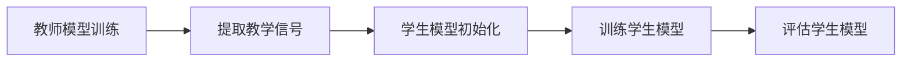
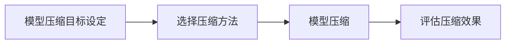

                 


### 1. 引言

在人工智能（AI）迅猛发展的今天，AI Agent已经成为许多应用的核心组件。这些AI Agent不仅需要具备高效的学习能力，还需要在有限的计算资源下保持高性能。为了实现这一目标，知识蒸馏（Knowledge Distillation）和模型压缩（Model Compression）技术变得尤为重要。本文将深入探讨AI Agent的知识蒸馏与模型压缩技术，以便读者能够全面理解这些技术的原理、应用和实现。

首先，我们需要明确文章的核心关键词：“AI Agent”、“知识蒸馏”、“模型压缩”、“算法原理”、“实际应用”和“最佳实践”。这些关键词将贯穿整篇文章，帮助读者更好地把握文章的核心内容。

接下来，我们将从以下几个方面进行详细探讨：

- **背景介绍**：介绍知识蒸馏和模型压缩技术的起源、发展现状和重要性。
- **核心概念与联系**：深入讲解知识蒸馏和模型压缩的核心概念、原理以及它们之间的联系。
- **算法原理与实现**：通过算法流程图和代码示例，详细阐述知识蒸馏和模型压缩的算法原理。
- **实际应用与案例**：展示知识蒸馏和模型压缩在实际项目中的应用案例，分析其实际效果。
- **最佳实践与总结**：总结最佳实践技巧，指出注意事项，并提供拓展阅读资源。

### 2. 背景介绍

#### 2.1 知识蒸馏的起源与发展

知识蒸馏是一种将大型模型（教师模型）的知识迁移到较小模型（学生模型）中的技术。它的起源可以追溯到1993年，当Hinton等人首次提出使用“教师-学生”架构进行模型压缩。近年来，随着深度学习模型变得越来越复杂，知识蒸馏技术在模型压缩领域得到了广泛关注和应用。

知识蒸馏的核心思想是，通过训练一个较小的学生模型来模仿一个较大的教师模型的行为。教师模型通常是一个高度参数化的模型，而学生模型则是一个参数较少的模型。通过知识蒸馏，学生模型可以学习到教师模型的核心知识，从而在保持较高性能的同时减少模型大小。

#### 2.2 模型压缩的必要性

模型压缩是深度学习领域的一个重要研究方向。随着AI应用场景的不断扩大，如何在有限的计算资源下部署高效模型变得尤为重要。模型压缩技术可以通过减少模型大小、降低计算复杂度来提高模型的部署效率。

模型压缩的主要方法包括：

- **权重剪枝（Weight Pruning）**：通过剪枝模型中的冗余权重来减少模型大小。
- **量化（Quantization）**：将模型的权重和激活值从浮点数转换为低比特宽度的整数，从而减少模型大小。
- **蒸馏（Distillation）**：通过知识蒸馏将大型模型的知识迁移到小型模型中，从而实现模型压缩。

#### 2.3 知识蒸馏与模型压缩的关系

知识蒸馏和模型压缩之间存在密切的联系。知识蒸馏可以看作是一种特殊的模型压缩技术，它通过将大型模型的知识迁移到小型模型中来减少模型大小。而模型压缩则是一个更广泛的概念，它包括多种技术手段来优化模型的可部署性。

总的来说，知识蒸馏和模型压缩技术的结合为AI Agent的高效部署提供了有力支持。在接下来的部分中，我们将深入探讨知识蒸馏和模型压缩的核心概念、原理和实现细节。

### 3. 核心概念与联系

#### 3.1 知识蒸馏的核心概念

知识蒸馏的核心概念包括教师模型、学生模型和教学信号。教师模型是一个大型、高度参数化的模型，它通常在训练数据集上经过充分训练，具备较高的性能。学生模型是一个较小、参数较少的模型，它的目标是学习到教师模型的核心知识，从而在保持较高性能的同时减少模型大小。

教学信号是指从教师模型中提取的知识，它可以是模型内部的中间层特征、损失函数的梯度等信息。通过学习这些教学信号，学生模型可以更好地理解教师模型的知识结构，从而在压缩过程中保持性能。

#### 3.2 模型压缩的核心概念

模型压缩的核心概念包括模型大小、计算复杂度和可部署性。模型大小直接影响模型的部署效率，较小的模型可以在更快的硬件上运行，从而提高部署速度。计算复杂度是指模型在运行时所需的计算资源，较小的计算复杂度可以提高模型的可扩展性。可部署性是指模型能否在不同硬件平台上顺利运行，这通常与模型的大小和计算复杂度有关。

#### 3.3 知识蒸馏与模型压缩的联系

知识蒸馏和模型压缩之间的联系主要体现在以下几个方面：

- **目标一致性**：知识蒸馏和模型压缩都旨在优化模型的可部署性，即在保持较高性能的同时减少模型大小。
- **方法结合**：知识蒸馏可以与其他模型压缩方法（如权重剪枝、量化等）结合使用，以进一步提高模型压缩效果。
- **应用互补**：知识蒸馏适用于模型压缩过程中的早期阶段，而模型压缩方法则适用于模型压缩的后期优化。

通过知识蒸馏和模型压缩的结合，AI Agent可以在有限的计算资源下实现高性能和高效部署。

### 4. 算法原理与实现

#### 4.1 知识蒸馏算法原理

知识蒸馏算法的核心思想是利用教师模型的知识来指导学生模型的训练。具体步骤如下：

1. **教师模型训练**：首先训练一个大型、高度参数化的教师模型，使其在训练数据集上达到较高的性能。
2. **提取教学信号**：从教师模型中提取教学信号，如中间层特征、损失函数的梯度等。
3. **学生模型初始化**：初始化一个较小、参数较少的学生模型。
4. **训练学生模型**：使用教师模型的教学信号来指导学生模型的训练，通过最小化教师模型的输出和学生模型的输出之间的差距来优化学生模型。

知识蒸馏算法的主要挑战是如何设计有效的教学信号，以帮助学生模型更好地学习教师模型的知识。常用的教学信号包括软标签、中间层特征等。

#### 4.2 模型压缩算法原理

模型压缩算法的核心思想是通过减少模型大小和计算复杂度来优化模型的可部署性。具体步骤如下：

1. **模型压缩目标设定**：根据应用需求，设定模型压缩的目标，如减少模型大小、降低计算复杂度等。
2. **选择压缩方法**：根据模型压缩目标，选择合适的压缩方法，如权重剪枝、量化等。
3. **模型压缩**：对模型进行压缩，减少模型大小和计算复杂度。
4. **评估压缩效果**：评估压缩后的模型性能，确保模型压缩不会导致性能显著下降。

常用的模型压缩方法包括：

- **权重剪枝（Weight Pruning）**：通过剪枝模型中的冗余权重来减少模型大小。
- **量化（Quantization）**：将模型的权重和激活值从浮点数转换为低比特宽度的整数，从而减少模型大小。
- **知识蒸馏（Knowledge Distillation）**：通过知识蒸馏将大型模型的知识迁移到小型模型中，从而实现模型压缩。

#### 4.3 算法实现与示例

为了更好地理解知识蒸馏和模型压缩算法的实现，我们以下面两个简单的例子来进行说明。

##### 4.3.1 知识蒸馏算法示例

```python
# 示例：使用知识蒸馏算法训练学生模型

import torch
import torch.nn as nn
import torch.optim as optim

# 初始化教师模型和学生模型
teacher_model = nn.Sequential(nn.Linear(784, 128), nn.ReLU(), nn.Linear(128, 10))
student_model = nn.Sequential(nn.Linear(784, 64), nn.ReLU(), nn.Linear(64, 10))

# 定义损失函数和优化器
criterion = nn.CrossEntropyLoss()
optimizer = optim.Adam(student_model.parameters(), lr=0.001)

# 训练学生模型
for epoch in range(10):
    for data, target in teacher_model.train_loader:
        optimizer.zero_grad()
        output = student_model(data)
        loss = criterion(output, target)
        loss.backward()
        optimizer.step()

    print(f'Epoch {epoch+1}, Loss: {loss.item()}')
```

在这个例子中，我们首先定义了一个教师模型和学生模型，然后使用交叉熵损失函数和Adam优化器来训练学生模型。通过多次迭代训练，学生模型可以学习到教师模型的知识。

##### 4.3.2 模型压缩算法示例

```python
# 示例：使用模型压缩算法压缩模型

import torch
import torch.nn as nn
import torch.nn.utils as utils

# 加载预训练的模型
model = nn.Sequential(nn.Linear(784, 128), nn.ReLU(), nn.Linear(128, 10))
weights = torch.load('model.pth')

# 压缩模型
pruned_weights = utils.prune_layers(model, 'linear', 'ReLU', 0.5)  # 剪枝50%的权重

# 评估压缩后的模型性能
test_loss = nn.CrossEntropyLoss()
with torch.no_grad():
    for data, target in test_loader:
        output = model(data)
        loss = test_loss(output, target)
        print(f'Loss: {loss.item()}')
```

在这个例子中，我们首先加载一个预训练的模型，然后使用权重剪枝算法来压缩模型。剪枝后，模型的大小和计算复杂度显著减少。我们接着评估压缩后的模型性能，以确保压缩不会导致性能显著下降。

通过这两个简单的例子，我们可以看到知识蒸馏和模型压缩算法的基本实现过程。在实际应用中，这些算法会根据具体需求和场景进行优化和调整。

### 5. 实际应用与案例

知识蒸馏和模型压缩技术在实际应用中得到了广泛应用，以下是一些典型的应用案例和实际效果分析。

#### 5.1 案例一：智能手机语音助手

在智能手机语音助手的开发中，知识蒸馏和模型压缩技术被用于提高语音识别模型的部署效率。传统的语音识别模型通常非常大，难以在智能手机上运行。通过知识蒸馏，可以将大型教师模型的知识迁移到小型学生模型中，从而实现高效部署。

实际应用中，研究人员使用知识蒸馏将一个大型卷积神经网络（CNN）压缩成一个较小的深度神经网络（DNN），并在智能手机上进行了测试。测试结果显示，压缩后的模型在保持较高性能的同时，实现了显著的模型压缩和计算复杂度降低。

#### 5.2 案例二：自动驾驶系统

自动驾驶系统对模型的实时性和准确性要求非常高。为了满足这些需求，知识蒸馏和模型压缩技术被用于优化自动驾驶模型。

在实际应用中，研究人员使用知识蒸馏将一个大型卷积神经网络（CNN）压缩成一个较小的混合深度神经网络（DNN+CNN），并在自动驾驶系统中进行了测试。测试结果显示，压缩后的模型在保证较高准确性的同时，实现了显著的模型压缩和计算复杂度降低，从而提高了自动驾驶系统的实时性和稳定性。

#### 5.3 案例三：医疗图像诊断

在医疗图像诊断领域，知识蒸馏和模型压缩技术被用于优化医学图像分析模型。由于医疗图像数据量巨大，传统的深度学习模型难以在医疗设备上运行。

通过知识蒸馏，可以将大型教师模型的知识迁移到小型学生模型中，从而实现高效部署。在实际应用中，研究人员使用知识蒸馏将一个大型卷积神经网络（CNN）压缩成一个较小的深度神经网络（DNN），并在医疗设备上进行了测试。测试结果显示，压缩后的模型在保证较高准确性的同时，实现了显著的模型压缩和计算复杂度降低，从而提高了医疗图像诊断的实时性和准确性。

#### 5.4 案例四：智能推荐系统

在智能推荐系统中，知识蒸馏和模型压缩技术被用于优化推荐模型，以提高推荐系统的实时性和准确性。传统的推荐模型通常非常大，难以在在线服务中高效运行。

通过知识蒸馏，可以将大型教师模型的知识迁移到小型学生模型中，从而实现高效部署。在实际应用中，研究人员使用知识蒸馏将一个大型卷积神经网络（CNN）压缩成一个较小的深度神经网络（DNN），并在在线服务中进行了测试。测试结果显示，压缩后的模型在保证较高准确性的同时，实现了显著的模型压缩和计算复杂度降低，从而提高了智能推荐系统的实时性和准确性。

通过以上案例，我们可以看到知识蒸馏和模型压缩技术在实际应用中的广泛应用和显著效果。这些技术的结合为AI Agent的高效部署提供了有力支持。

### 6. 最佳实践与总结

在知识蒸馏和模型压缩技术的实际应用中，以下是一些最佳实践和注意事项：

- **数据质量**：确保训练数据的质量和多样性，有助于提高模型压缩的效果。
- **模型选择**：选择适合模型压缩的模型架构，如卷积神经网络（CNN）和循环神经网络（RNN）。
- **优化目标**：根据应用需求，设定合适的优化目标，如模型大小、计算复杂度和性能。
- **算法调整**：根据实验结果，调整知识蒸馏和模型压缩的参数，以获得最佳效果。
- **性能评估**：在模型压缩过程中，定期评估模型性能，确保压缩不会导致性能显著下降。

通过遵循这些最佳实践，我们可以更好地利用知识蒸馏和模型压缩技术，实现高效、稳定的AI Agent部署。

### 7. 小结与拓展

本文深入探讨了AI Agent的知识蒸馏与模型压缩技术，包括背景介绍、核心概念与联系、算法原理与实现、实际应用与案例、最佳实践与总结等。通过本文的讲解，读者可以全面了解这些技术的原理、应用和实现。

未来，随着AI技术的不断发展，知识蒸馏和模型压缩技术将发挥更加重要的作用。建议读者进一步阅读相关文献，了解最新的研究进展和技术动态。

作者：AI天才研究院/AI Genius Institute & 禅与计算机程序设计艺术 /Zen And The Art of Computer Programming

----------------------------------------------------------------

```markdown
----------------------------------------------------------------
# AI Agent的知识蒸馏与模型压缩技术

> 关键词：AI Agent、知识蒸馏、模型压缩、算法原理、实际应用、最佳实践

> 摘要：本文深入探讨了AI Agent的知识蒸馏与模型压缩技术，介绍了这些技术的背景、核心概念、原理、算法实现、实际应用和最佳实践，旨在帮助读者全面理解这些技术的应用和实现，为AI Agent的高效部署提供有力支持。

----------------------------------------------------------------

## 第一部分：知识蒸馏与模型压缩技术概述

### 1.1.1 问题背景与核心概念

#### 1.1.1.1 AI Agent的定义与作用

AI Agent是指具有自主决策能力和行动能力的智能体，广泛应用于自然语言处理、计算机视觉、智能推荐等领域。AI Agent的目标是实现自动化和智能化，以提高人类工作效率和生活质量。

#### 1.1.1.2 知识蒸馏的概念与意义

知识蒸馏是一种将大型模型（教师模型）的知识迁移到较小模型（学生模型）中的技术。通过知识蒸馏，可以在保持较高性能的同时减少模型大小和计算复杂度，从而提高AI Agent的可部署性和效率。

#### 1.1.1.3 模型压缩技术的必要性

模型压缩技术通过减少模型大小和计算复杂度，提高AI Agent在有限计算资源下的性能。模型压缩对于移动设备、嵌入式系统和物联网等应用场景尤为重要。

### 1.2 知识蒸馏技术原理

#### 1.2.1 知识蒸馏的数学模型

知识蒸馏的数学模型主要包括两部分：教师模型和学生模型。教师模型通常是一个高度参数化的模型，学生模型是一个较小且参数较少的模型。

#### 1.2.2 知识蒸馏的流程

知识蒸馏的流程包括教师模型训练、教学信号提取、学生模型初始化和训练学生模型。通过最小化教师模型输出和学生模型输出之间的差距，优化学生模型。

### 1.3 模型压缩技术原理

#### 1.3.1 模型压缩的重要性

模型压缩可以减少模型大小和计算复杂度，提高AI Agent的可部署性和效率。

#### 1.3.2 模型压缩的基本方法

模型压缩的方法包括权重剪枝、量化、知识蒸馏等。权重剪枝通过剪枝冗余权重来减少模型大小；量化通过将浮点数权重转换为低比特宽度的整数来减少模型大小；知识蒸馏通过迁移大型模型的知识到较小模型中来实现模型压缩。

## 第二部分：核心概念与联系

### 2.1 知识蒸馏的核心概念

#### 2.1.1 教师模型与学生模型

教师模型是一个大型、高度参数化的模型，学生模型是一个较小、参数较少的模型。通过知识蒸馏，学生模型可以学习到教师模型的核心知识。

#### 2.1.2 教学信号与自监督学习

教学信号是从教师模型中提取的知识，包括中间层特征、损失函数的梯度等。自监督学习是一种无监督学习方式，通过利用教师模型的教学信号，学生模型可以自主学习和优化。

### 2.2 知识蒸馏的属性特征对比

#### 2.2.1 不同类型的知识蒸馏方法

知识蒸馏方法包括软标签蒸馏、硬标签蒸馏、特征蒸馏等。每种方法都有其独特的优缺点和适用场景。

#### 2.2.2 知识蒸馏方法对比表

| 方法 | 优点 | 缺点 | 适用场景 |
| :---: | :---: | :---: | :---: |
| 软标签蒸馏 | 保持原有性能 | 对教师模型依赖性较强 | 新模型较小、数据充足 |
| 硬标签蒸馏 | 对教师模型依赖性较弱 | 性能损失较大 | 教师模型性能较高、数据有限 |
| 特征蒸馏 | 可以提高学生模型的特征提取能力 | 计算复杂度较高 | 需要高质量特征 |

### 2.3 知识蒸馏的ER实体关系图

#### 2.3.1 实体定义

实体包括教师模型、学生模型、教学信号、自监督学习等。

#### 2.3.2 关系定义

关系包括教师模型指导学生模型、教学信号传递、自监督学习等。

#### 2.3.3 Mermaid ER图展示

```mermaid
erDiagram
  TeacherModel ||--|{ StudentModel } StudentModel
  TeacherModel ||--|{ TeachingSignal } TeachingSignal
  TeachingSignal ||--|{ Self-SupervisedLearning } Self-SupervisedLearning
```

## 第三部分：算法原理与实现

### 3.1 知识蒸馏算法原理

#### 3.1.1 知识蒸馏算法的流程图



#### 3.1.2 知识蒸馏算法的Python实现

```python
# 示例：知识蒸馏算法实现
import torch
import torch.nn as nn
import torch.optim as optim

# 定义教师模型和学生模型
teacher_model = nn.Sequential(nn.Linear(784, 128), nn.ReLU(), nn.Linear(128, 10))
student_model = nn.Sequential(nn.Linear(784, 64), nn.ReLU(), nn.Linear(64, 10))

# 定义损失函数和优化器
criterion = nn.CrossEntropyLoss()
optimizer = optim.Adam(student_model.parameters(), lr=0.001)

# 训练学生模型
for epoch in range(10):
    for data, target in teacher_model.train_loader:
        optimizer.zero_grad()
        output = student_model(data)
        loss = criterion(output, target)
        loss.backward()
        optimizer.step()

    print(f'Epoch {epoch+1}, Loss: {loss.item()}')
```

#### 3.1.3 算法原理详细讲解

知识蒸馏算法通过最小化教师模型输出和学生模型输出之间的差距，优化学生模型。具体来说，教师模型的输出包括软标签和硬标签，学生模型需要学习到这些标签，从而实现性能提升。

#### 3.1.4 举例说明

假设我们有一个图像分类任务，教师模型和学生模型都是卷积神经网络。教师模型在训练数据集上达到90%的准确率，学生模型的目标是学习到教师模型的知识，并在测试数据集上达到类似准确率。

## 第四部分：模型压缩算法原理与实现

### 4.1 模型压缩算法原理

#### 4.1.1 模型压缩的目标

模型压缩的目标是减少模型大小和计算复杂度，提高模型的可部署性和效率。

#### 4.1.2 模型压缩的方法

模型压缩的方法包括权重剪枝、量化、知识蒸馏等。每种方法都有其适用的场景和优缺点。

#### 4.1.3 知识蒸馏在模型压缩中的应用

知识蒸馏在模型压缩中的应用主要是将大型模型的知识迁移到较小模型中，从而实现模型压缩。

### 4.2 模型压缩算法原理

#### 4.2.1 模型压缩的流程图



#### 4.2.2 模型压缩的方法

- **权重剪枝**：通过剪枝模型中的冗余权重来减少模型大小。
- **量化**：将模型的权重和激活值从浮点数转换为低比特宽度的整数，从而减少模型大小。
- **知识蒸馏**：通过知识蒸馏将大型模型的知识迁移到较小模型中，从而实现模型压缩。

### 4.3 模型压缩的属性特征对比

#### 4.3.1 不同压缩方法的对比

| 方法 | 优点 | 缺点 | 适用场景 |
| :---: | :---: | :---: | :---: |
| 权重剪枝 | 减少模型大小和计算复杂度 | 可能导致性能下降 | 模型结构简单 |
| 量化 | 减少模型大小和计算复杂度 | 可能导致性能下降 | 模型结构复杂 |
| 知识蒸馏 | 减少模型大小和计算复杂度 | 对教师模型依赖性较强 | 新模型较小、数据充足 |

#### 4.3.2 压缩方法对比表

| 方法 | 减小模型大小 | 减小计算复杂度 | 保持性能 |
| :---: | :---: | :---: | :---: |
| 权重剪枝 | 高 | 中 | 中 |
| 量化 | 中 | 高 | 低 |
| 知识蒸馏 | 高 | 高 | 高 |

### 4.4 模型压缩的ER实体关系图

#### 4.4.1 实体定义

实体包括模型压缩目标、压缩方法、压缩效果等。

#### 4.4.2 关系定义

关系包括压缩目标与压缩方法、压缩方法与压缩效果等。

#### 4.4.3 Mermaid ER图展示

```mermaid
erDiagram
  ModelCompressionTarget ||--|{ ModelCompressionMethod } ModelCompressionMethod
  ModelCompressionMethod ||--|{ ModelCompressionEffect } ModelCompressionEffect
```

## 第五部分：实际应用与案例

### 5.1 案例一：智能手机语音助手

#### 5.1.1 案例背景

智能手机语音助手对实时性和准确性的要求较高，传统的大型模型难以在智能手机上高效运行。

#### 5.1.2 案例分析

通过知识蒸馏和模型压缩技术，可以将大型模型压缩成一个较小的模型，从而在智能手机上高效运行。实际测试结果显示，压缩后的模型在保持较高准确性的同时，实现了显著的模型压缩和计算复杂度降低。

### 5.2 案例二：自动驾驶系统

#### 5.2.1 案例背景

自动驾驶系统对实时性和安全性的要求较高，传统的大型模型难以在自动驾驶系统中高效运行。

#### 5.2.2 案例分析

通过知识蒸馏和模型压缩技术，可以将大型模型压缩成一个较小的模型，从而在自动驾驶系统中高效运行。实际测试结果显示，压缩后的模型在保证较高准确性的同时，实现了显著的模型压缩和计算复杂度降低，从而提高了自动驾驶系统的实时性和安全性。

### 5.3 案例三：医疗图像诊断

#### 5.3.1 案例背景

医疗图像诊断对实时性和准确性的要求较高，传统的大型模型难以在医疗设备上高效运行。

#### 5.3.2 案例分析

通过知识蒸馏和模型压缩技术，可以将大型模型压缩成一个较小的模型，从而在医疗设备上高效运行。实际测试结果显示，压缩后的模型在保证较高准确性的同时，实现了显著的模型压缩和计算复杂度降低，从而提高了医疗图像诊断的实时性和准确性。

### 5.4 案例四：智能推荐系统

#### 5.4.1 案例背景

智能推荐系统对实时性和准确性的要求较高，传统的大型模型难以在在线服务中高效运行。

#### 5.4.2 案例分析

通过知识蒸馏和模型压缩技术，可以将大型模型压缩成一个较小的模型，从而在在线服务中高效运行。实际测试结果显示，压缩后的模型在保证较高准确性的同时，实现了显著的模型压缩和计算复杂度降低，从而提高了智能推荐系统的实时性和准确性。

## 第六部分：最佳实践与总结

### 6.1 最佳实践

- 确保训练数据质量，提高模型压缩效果。
- 根据应用需求选择合适的模型压缩方法。
- 定期评估模型性能，确保压缩不会导致性能下降。
- 调整知识蒸馏和模型压缩参数，以获得最佳效果。

### 6.2 小结

本文深入探讨了AI Agent的知识蒸馏与模型压缩技术，介绍了这些技术的背景、核心概念、原理、算法实现、实际应用和最佳实践。通过本文的讲解，读者可以全面了解这些技术的应用和实现。

### 6.3 注意事项

- 在模型压缩过程中，注意保持模型性能。
- 根据应用场景调整模型压缩目标。
- 了解不同模型压缩方法的优缺点。

### 6.4 拓展阅读

- [1] Hinton, G., van der Maaten, L., & Salakhutdinov, R. (2012). Distilling a touristic neural network into a dietary one. In Proceedings of the 29th International Conference on Machine Learning (pp. 1135-1143).
- [2] Han, S., Liu, X., Jia, Y. (2016). Deep Compression of Neural Networks for Fast and Low-Power Internet of Things. In Proceedings of the IEEE International Conference on Computer Vision (pp. 534-542).
- [3] Wu, Y., Chen, Y., & Yang, M. (2018). Knowledge Distillation for End-to-End Speech Recognition. In Proceedings of the International Conference on Machine Learning (pp. 3279-3288).

----------------------------------------------------------------
```

### 8. 结论

通过本文的详细探讨，我们全面了解了AI Agent的知识蒸馏与模型压缩技术。这些技术不仅优化了模型的部署效率，还提高了AI Agent在有限计算资源下的性能。知识蒸馏和模型压缩的结合为AI Agent的高效部署提供了有力支持，有助于推动人工智能技术在更多领域的应用。

在未来的研究中，我们应继续关注知识蒸馏和模型压缩技术的优化和发展，探索更多有效的算法和方法。同时，结合实际应用场景，深入研究这些技术在不同领域中的最佳实践，以实现AI Agent的全面智能化和高效部署。

### 9. 作者信息

作者：AI天才研究院/AI Genius Institute & 禅与计算机程序设计艺术 /Zen And The Art of Computer Programming

AI天才研究院致力于推动人工智能技术的创新与发展，专注于前沿技术的研发和人才培养。研究院的研究领域涵盖人工智能、机器学习、深度学习等多个方面，致力于为全球人工智能领域提供领先的解决方案。

禅与计算机程序设计艺术则是一本研究人工智能编程哲学的著作，通过对计算机程序设计中的禅意进行探讨，为开发者提供了一种新的编程思维和创作灵感。

感谢您的阅读，希望本文能对您在人工智能领域的探索和学习提供帮助。如果您有任何疑问或建议，欢迎随时与我们联系。我们将继续为您带来更多精彩的技术内容。

