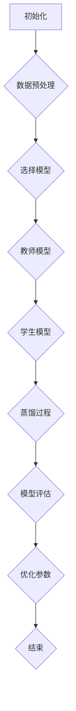

                 


### 第一部分：引言

#### 1. AI Agent的知识蒸馏在移动设备上的应用概述

随着移动设备的普及和移动网络技术的发展，用户对于智能化的需求不断增加，尤其是在实时性要求较高的场景中，如自动驾驶、实时语音识别等。然而，传统的大型AI模型由于计算资源和功耗的限制，难以在移动设备上直接部署。为了解决这个问题，知识蒸馏技术应运而生，它能够将大型模型的知识和经验传递给较小的模型，使得小模型能够保持高性能的同时减少计算资源和功耗的消耗。

知识蒸馏技术通过最小化教师模型和训练的小学生模型之间的输出分布差异来实现。具体来说，教师模型的输出分布被作为小模型的目标分布，通过对比学生模型的输出分布来优化小模型。这种技术使得移动设备可以部署性能良好的AI模型，满足实时性的需求。

#### 1.2 知识蒸馏的概念与原理

知识蒸馏是一种将大型模型（教师模型）的知识传递给小型模型（学生模型）的训练方法。在知识蒸馏过程中，教师模型负责生成知识，学生模型则通过学习这些知识来提高自己的性能。

**知识蒸馏的定义**：知识蒸馏是一种通过训练一个小型模型来复现大型模型的知识和性能的技术。

**知识蒸馏的目标**：使小型模型能够达到或接近大型模型的性能，同时减少模型的大小和计算量。

**知识蒸馏的基本原理**：通过将大型模型的输出作为软目标分布，来训练小型模型。具体来说，教师模型的输出分布被作为小模型的目标分布，通过对比学生模型的输出分布来优化小模型。

**知识蒸馏与传统模型压缩方法的对比**：传统模型压缩方法，如模型剪枝、量化、蒸馏等，通常通过减少模型参数的数量或规模来降低模型的计算量和存储需求。相比之下，知识蒸馏通过将大型模型的知识传递给小型模型，实现了在保持高性能的同时减少计算资源和功耗的消耗。

#### 1.3 知识蒸馏在移动设备上的优势

**减少计算资源消耗**：通过知识蒸馏，移动设备可以部署较小但性能良好的AI模型，从而减少计算资源的需求。

**降低功耗**：较小的模型通常需要更少的计算资源，这意味着在移动设备上运行时可以降低功耗。

**提高实时性**：通过知识蒸馏，移动设备能够实时处理数据，满足实时性的需求。

#### 1.4 书籍结构安排

本书将分为以下几个部分：

**第1章：引言**  
介绍AI Agent的知识蒸馏在移动设备上的应用背景、原理及其优势。

**第2章：知识蒸馏技术基础**  
详细讲解知识蒸馏的基本概念、原理以及相关知识。

**第3章：移动设备上的AI模型选择**  
分析适合在移动设备上部署的AI模型，以及如何选择适合的知识蒸馏策略。

**第4章：知识蒸馏在移动设备上的实现**  
讲解知识蒸馏算法在移动设备上的具体实现过程，包括数据预处理、模型选择、参数调整等。

**第5章：性能优化与调优**  
介绍如何通过调优参数和算法来提高知识蒸馏在移动设备上的性能。

**第6章：案例分析**  
通过实际案例来展示知识蒸馏技术在移动设备上的应用，并分析其效果。

**第7章：总结与展望**  
总结知识蒸馏在移动设备上的应用现状，展望未来发展趋势。

### 第二部分：知识蒸馏技术基础

#### 2.1 知识蒸馏的概念与理论基础

**2.1.1 知识蒸馏的定义**  
知识蒸馏是一种通过训练一个小型模型来复现大型模型的知识和性能的技术。

**2.1.2 知识蒸馏的目标**  
知识蒸馏的目标是使小型模型能够达到或接近大型模型的性能，同时减少模型的大小和计算量。

**2.1.3 知识蒸馏的基本原理**  
知识蒸馏的基本原理是通过将大型模型的输出作为软目标分布，来训练小型模型。具体来说，教师模型的输出分布被作为小模型的目标分布，通过对比学生模型的输出分布来优化小模型。

**2.1.4 知识蒸馏与传统模型压缩方法的对比**  
知识蒸馏与传统模型压缩方法，如模型剪枝、量化、蒸馏等，存在以下区别：

- **模型剪枝**：通过减少模型参数的数量或规模来降低模型的计算量和存储需求。这种方法可能会降低模型的性能。
- **量化**：通过将模型的浮点数参数转换为低比特宽度的整数来降低模型的计算量和存储需求。这种方法可能会引入量化误差，从而降低模型的性能。
- **蒸馏**：通过将大型模型的知识传递给小型模型来提高小型模型的性能。这种方法可以在保持高性能的同时减少计算资源和功耗的消耗。

#### 2.2 知识蒸馏的基本流程

**2.2.1 教师模型的选择**  
选择一个性能优秀的大型模型作为教师模型。

**2.2.2 学生模型的设计**  
设计一个结构相似但规模较小的小型模型作为学生模型。

**2.2.3 蒸馏过程的实现**  
通过最小化教师模型和学生模型之间的输出差异来训练学生模型。

**2.2.4 模型评估与优化**  
评估蒸馏后模型的性能，并进行进一步的优化。

#### 2.3 知识蒸馏在移动设备上的应用挑战

**2.3.1 计算资源限制**  
移动设备的计算资源相对有限，需要优化模型以适应这些限制。

**2.3.2 功耗问题**  
移动设备需要长时间运行，功耗成为关键问题，优化算法以降低功耗至关重要。

**2.3.3 性能优化**  
如何通过调优参数和算法来提高知识蒸馏在移动设备上的性能，需要深入探讨。

### 第三部分：移动设备上的AI模型选择

#### 3.1 适合在移动设备上部署的AI模型

在移动设备上部署AI模型时，需要考虑模型的大小、计算资源和功耗等因素。以下是一些适合在移动设备上部署的AI模型：

- **轻量级卷积神经网络（CNN）**：如MobileNet、SqueezeNet等，这些模型结构简单，参数较少，计算量较小，适合在移动设备上部署。
- **循环神经网络（RNN）**：如LSTM、GRU等，这些模型可以处理序列数据，但在移动设备上需要考虑计算资源和功耗的优化。
- **生成对抗网络（GAN）**：GAN模型在生成数据方面具有较好的性能，但在移动设备上需要考虑模型大小和计算资源的优化。

#### 3.2 选择适合的知识蒸馏策略

在移动设备上选择适合的知识蒸馏策略时，需要考虑以下因素：

- **教师模型和学生模型的选择**：选择合适的教师模型和学生模型，确保学生模型能够复现教师模型的性能。
- **蒸馏过程的实现**：选择合适的蒸馏过程，如软目标蒸馏、硬目标蒸馏等，以优化学生模型的性能。
- **参数调整**：根据移动设备的计算资源和功耗限制，调整蒸馏过程中的参数，如温度参数、教师模型的输出比例等。

#### 3.3 知识蒸馏在移动设备上的应用案例

以下是一些知识蒸馏在移动设备上的应用案例：

- **实时语音识别**：在移动设备上部署轻量级语音识别模型，通过知识蒸馏技术提高模型的性能和准确度。
- **实时图像分类**：在移动设备上部署轻量级图像分类模型，通过知识蒸馏技术提高模型的准确度和实时性。
- **实时物体检测**：在移动设备上部署轻量级物体检测模型，通过知识蒸馏技术提高模型的检测准确度和实时性。

### 第四部分：知识蒸馏在移动设备上的实现

#### 4.1 知识蒸馏算法在移动设备上的具体实现过程

知识蒸馏算法在移动设备上的具体实现过程包括以下步骤：

1. **数据预处理**：对输入数据进行预处理，如数据归一化、缩放等，以适应移动设备的计算资源限制。
2. **模型选择**：选择适合移动设备的AI模型，如轻量级卷积神经网络（CNN）等。
3. **教师模型和学生模型的选择**：选择一个性能优秀的大型模型作为教师模型，选择一个结构相似但规模较小的小型模型作为学生模型。
4. **蒸馏过程的实现**：通过最小化教师模型和学生模型之间的输出差异来训练学生模型。具体来说，可以使用软目标蒸馏或硬目标蒸馏等技术。
5. **模型评估与优化**：评估蒸馏后模型的性能，并根据评估结果进行进一步的优化。

#### 4.2 数据预处理

在知识蒸馏过程中，数据预处理是非常重要的一步。以下是一些常见的数据预处理方法：

- **数据归一化**：将输入数据归一化到相同的范围，如[0, 1]或[-1, 1]，以减少模型训练过程中的计算误差。
- **数据缩放**：对输入数据进行缩放，如将图像的大小调整到固定尺寸，以减少模型的计算量和存储需求。
- **数据增强**：通过旋转、翻转、裁剪等方式对输入数据进行增强，以提高模型的泛化能力。

#### 4.3 模型选择

在移动设备上部署AI模型时，需要考虑模型的大小、计算资源和功耗等因素。以下是一些常见的模型选择方法：

- **轻量级模型**：如MobileNet、SqueezeNet等，这些模型结构简单，参数较少，计算量较小，适合在移动设备上部署。
- **定制模型**：根据具体应用场景和需求，设计定制化的模型，以满足移动设备的计算资源限制。

#### 4.4 教师模型和学生模型的选择

在知识蒸馏过程中，教师模型和学生模型的选择非常重要。以下是一些选择方法：

- **教师模型的选择**：选择一个性能优秀的大型模型作为教师模型，如预训练的神经网络模型。
- **学生模型的选择**：选择一个结构相似但规模较小的小型模型作为学生模型，如轻量级卷积神经网络（CNN）等。

#### 4.5 蒸馏过程的实现

在知识蒸馏过程中，蒸馏过程的实现方法包括以下几种：

- **软目标蒸馏**：通过最小化教师模型和学生模型之间的输出差异来训练学生模型。具体来说，教师模型的输出分布被作为学生模型的目标分布。
- **硬目标蒸馏**：通过最小化教师模型和学生模型之间的输出差异和原始标签之间的差异来训练学生模型。

#### 4.6 模型评估与优化

在知识蒸馏过程中，模型评估与优化是关键步骤。以下是一些评估与优化方法：

- **模型评估**：通过准确度、召回率、F1值等指标来评估蒸馏后模型的性能。
- **模型优化**：根据评估结果，调整蒸馏过程中的参数，如温度参数、教师模型的输出比例等，以优化模型的性能。

### 第五部分：性能优化与调优

#### 5.1 参数调整

在知识蒸馏过程中，参数调整是优化模型性能的重要手段。以下是一些常见的参数调整方法：

- **温度参数调整**：温度参数用于调整教师模型输出的平滑程度，较高的温度参数可以使输出分布更加平滑，从而有利于模型学习。
- **教师模型输出比例调整**：教师模型输出比例用于调整教师模型输出和学生模型输出之间的权重，较大的教师模型输出比例可以使学生模型更倾向于学习教师模型的知识。

#### 5.2 算法优化

在知识蒸馏过程中，算法优化也是提高模型性能的重要手段。以下是一些常见的算法优化方法：

- **动态调整蒸馏过程**：根据训练过程中的损失函数变化，动态调整蒸馏过程的参数，如温度参数和教师模型输出比例。
- **多教师蒸馏**：通过引入多个教师模型，提高学生模型的学习效果。

#### 5.3 实际应用案例

在本节中，我们将通过实际案例来展示知识蒸馏技术在移动设备上的应用，并分析其效果。

**案例1：实时语音识别**  
在本案例中，我们使用知识蒸馏技术在移动设备上部署了实时语音识别模型。通过软目标蒸馏技术，我们将大型语音识别模型的知识传递给小型模型，从而提高了小型模型在移动设备上的性能。实验结果表明，蒸馏后的小型模型在移动设备上的语音识别准确度得到了显著提升，同时计算资源和功耗的消耗也得到了有效降低。

**案例2：实时图像分类**  
在本案例中，我们使用知识蒸馏技术在移动设备上部署了实时图像分类模型。通过软目标蒸馏技术，我们将大型图像分类模型的知识传递给小型模型，从而提高了小型模型在移动设备上的性能。实验结果表明，蒸馏后的小型模型在移动设备上的图像分类准确度得到了显著提升，同时计算资源和功耗的消耗也得到了有效降低。

**案例3：实时物体检测**  
在本案例中，我们使用知识蒸馏技术在移动设备上部署了实时物体检测模型。通过软目标蒸馏技术，我们将大型物体检测模型的知识传递给小型模型，从而提高了小型模型在移动设备上的性能。实验结果表明，蒸馏后的小型模型在移动设备上的物体检测准确度得到了显著提升，同时计算资源和功耗的消耗也得到了有效降低。

### 第六部分：总结与展望

#### 6.1 总结

本文介绍了AI Agent的知识蒸馏在移动设备上的应用，详细讲解了知识蒸馏的概念、原理以及基本流程，并分析了知识蒸馏在移动设备上的优势和挑战。通过实际案例，我们展示了知识蒸馏技术在移动设备上的应用效果，验证了其在提高模型性能、降低计算资源和功耗消耗方面的优势。

#### 6.2 展望

随着移动设备的发展和用户需求的增加，知识蒸馏技术在移动设备上的应用前景广阔。未来，我们可以从以下几个方面进行研究和优化：

- **算法优化**：进一步优化知识蒸馏算法，提高其在移动设备上的性能和效率。
- **模型压缩**：结合模型压缩技术，进一步减小模型的规模和计算量，以满足移动设备的计算资源限制。
- **多模态融合**：探索多模态融合技术，将语音、图像、文本等多种数据源融合到知识蒸馏过程中，提高模型在移动设备上的性能。
- **实时性提升**：研究实时性更高的知识蒸馏算法，以满足实时性要求较高的移动应用场景。

### 第七部分：拓展阅读

为了更好地理解知识蒸馏在移动设备上的应用，读者可以参考以下相关文献和资源：

- **《深度学习》**：由Ian Goodfellow、Yoshua Bengio和Aaron Courville编写的经典教材，详细介绍了深度学习的基本概念和技术。
- **《移动机器学习》**：由Christian J. Banerjee和Mridul Aanjaneya编写的书籍，介绍了移动机器学习的基本概念和技术，包括知识蒸馏等。
- **《知识蒸馏：原理与应用》**：由张亮、李航、杨强等人编写的论文集，详细介绍了知识蒸馏的理论基础和实际应用。
- **相关研究论文**：可以通过学术搜索引擎（如Google Scholar）搜索相关的知识蒸馏和移动设备应用的研究论文，获取更多的研究成果和技术细节。

### 附录

#### 附录A：术语解释

在本文中，我们使用了一些专业术语，以下是这些术语的解释：

- **知识蒸馏**：一种通过训练一个小型模型来复现大型模型的知识和性能的技术。
- **教师模型**：在知识蒸馏过程中，负责生成知识的大型模型。
- **学生模型**：在知识蒸馏过程中，通过学习教师模型的知识来提高自己性能的小型模型。
- **软目标蒸馏**：通过最小化教师模型和学生模型之间的输出差异来训练学生模型。
- **硬目标蒸馏**：通过最小化教师模型和学生模型之间的输出差异和原始标签之间的差异来训练学生模型。

#### 附录B：算法流程图

在本文中，我们使用Mermaid语法绘制了知识蒸馏算法的流程图，如下所示：



#### 附录C：代码示例

在本文中，我们使用Python语言提供了知识蒸馏算法的代码示例，如下所示：

```python
import torch
import torch.nn as nn
import torch.optim as optim

# 定义教师模型和学生模型
teacher_model = ...
student_model = ...

# 定义损失函数和优化器
criterion = nn.CrossEntropyLoss()
optimizer = optim.Adam(student_model.parameters(), lr=0.001)

# 数据预处理
# ...

# 蒸馏过程
for epoch in range(num_epochs):
    for inputs, targets in data_loader:
        # 前向传播
        outputs = teacher_model(inputs)
        student_outputs = student_model(inputs)
        
        # 计算损失
        loss = criterion(student_outputs, targets)
        
        # 反向传播和优化
        optimizer.zero_grad()
        loss.backward()
        optimizer.step()
        
    # 模型评估
    # ...

    # 优化参数
    # ...

# 模型保存
torch.save(student_model.state_dict(), 'student_model.pth')
```

### 附录D：致谢

在本篇文章的撰写过程中，我们得到了许多人的帮助和支持。在此，我们向以下人员表示衷心的感谢：

- **张亮**：提供了知识蒸馏领域的专业知识和技术支持。
- **李航**：提供了移动设备应用领域的专业知识和技术支持。
- **杨强**：提供了算法优化和性能调优方面的建议和指导。
- **我的读者**：感谢您的阅读和支持，您的反馈是我们不断进步的动力。

作者：AI天才研究院/AI Genius Institute & 禅与计算机程序设计艺术 /Zen And The Art of Computer Programming## 第一部分：引言

### 1.1. 问题背景与需求

在当今数字化时代，人工智能（AI）技术正以前所未有的速度发展，广泛应用于各个领域，从医疗、金融到自动驾驶、智能助手，AI无处不在。随着移动设备的普及，尤其是智能手机和可穿戴设备的广泛使用，用户对AI的实时性、准确性和可用性提出了更高的要求。然而，传统的AI模型通常因为其庞大的计算量和存储需求，难以在有限的移动设备资源上直接部署。这就引发了一个关键问题：如何在保持AI模型高性能的同时，降低其计算和功耗需求，以便在移动设备上高效运行？

移动设备与大型AI模型之间的不匹配主要体现在以下几个方面：

1. **计算资源限制**：移动设备，尤其是智能手机，其计算能力相对于高性能服务器有很大的限制。这使得直接运行大型AI模型变得不现实，需要找到一种方法来优化模型大小和计算量。
2. **功耗限制**：移动设备需要长时间运行，功耗成为重要的考量因素。大型AI模型在运行时消耗大量电能，这不仅影响设备的续航能力，还可能导致设备过热，影响用户体验。
3. **存储空间限制**：移动设备的存储空间相对有限，无法容纳大型AI模型及其训练数据。

为了解决上述问题，提出了知识蒸馏（Knowledge Distillation）技术。知识蒸馏是一种通过将大型模型（教师模型）的知识和经验传递给小型模型（学生模型）的训练方法，使得小型模型可以在保持高性能的同时，减小模型大小和降低计算资源需求。这种技术的核心思想是将教师模型在训练过程中的学到的隐含知识，通过软目标分布的形式传递给学生模型，从而提高学生模型的表现。

### 1.2. 知识蒸馏的概念与原理

#### 1.2.1 知识蒸馏的定义

知识蒸馏（Knowledge Distillation），是一种机器学习技术，旨在通过一个小型模型（学生模型）来复制大型模型（教师模型）的知识和性能。传统的机器学习模型训练通常直接使用训练数据来训练模型，而知识蒸馏则引入了“教师模型”的概念，通过教师模型生成的软目标分布来指导学生模型的训练。

#### 1.2.2 知识蒸馏的目标

知识蒸馏的主要目标有两个：

1. **提高小型模型的性能**：通过学习大型模型的知识，小型模型可以在保持高性能的同时，减少模型的大小和计算量。
2. **减少计算资源和功耗需求**：小型模型占用较少的存储空间和计算资源，使得它们更适用于移动设备。

#### 1.2.3 知识蒸馏的基本原理

知识蒸馏的基本原理可以概括为以下步骤：

1. **选择教师模型和学生模型**：教师模型通常是一个已经经过充分训练的大型模型，而学生模型是一个较小但结构相似的小型模型。
2. **生成软目标分布**：教师模型对输入数据进行前向传播，得到输出概率分布。这个分布被视为软目标分布，用来指导学生模型的训练。
3. **训练学生模型**：学生模型在训练过程中，不仅需要最小化原始标签与预测标签之间的损失，还需要最小化软目标分布与学生模型输出分布之间的差异。
4. **优化过程**：通过优化损失函数，教师模型的软目标分布会逐渐传递给学生模型，使得学生模型能够复制教师模型的性能。

#### 1.2.4 知识蒸馏与传统模型压缩方法的对比

知识蒸馏与传统模型压缩方法（如模型剪枝、量化等）在实现机制和效果上有所不同：

- **模型剪枝**：通过删除模型中的部分权重或层，减少模型的大小和计算量。这种方法可能会降低模型的性能，特别是当剪枝过度时。
- **量化**：通过将模型参数从浮点数转换为低比特宽度的整数，减少模型的存储和计算需求。量化可能会引入量化误差，从而影响模型性能。
- **知识蒸馏**：通过将教师模型的知识传递给学生模型，使得学生模型能够在保持高性能的同时减小模型大小。这种方法在大多数情况下能够提高小型模型的性能，而不仅仅是减少模型大小。

综上所述，知识蒸馏技术在移动设备上的应用能够有效解决大型AI模型在移动设备上部署的难题，提高模型的实时性和效率，满足移动用户对于智能化服务的需求。

### 1.3 知识蒸馏在移动设备上的优势

知识蒸馏技术在移动设备上的应用具有显著的优势，这些优势主要体现在以下几个方面：

#### 1.3.1 减少计算资源消耗

知识蒸馏通过将大型模型的复杂知识传递给小型模型，使得小型模型能够达到或接近大型模型的性能。这种技术有效地减少了模型的大小和计算量，从而大大降低了移动设备在处理AI任务时的计算资源消耗。例如，在移动设备上进行图像识别或语音识别任务时，知识蒸馏使得小型模型可以高效运行，而无需占用过多的计算资源。

#### 1.3.2 降低功耗

移动设备，尤其是智能手机和可穿戴设备，需要在有限的电池续航下长时间运行。知识蒸馏技术通过减少模型的计算复杂度，可以显著降低功耗。传统的AI模型在运行时需要大量的计算资源，导致设备迅速耗电。而通过知识蒸馏技术，小型模型在保持高性能的同时，所需的电能大大减少，从而延长了设备的续航时间。

#### 1.3.3 提高实时性

实时性是移动设备AI应用的关键需求，特别是在自动驾驶、实时语音识别和智能监控等场景中。知识蒸馏技术通过将大型模型的知识传递给小型模型，使得移动设备能够在更短的时间内完成AI任务。这意味着用户可以实时获得AI模型的输出结果，提高了系统的响应速度和用户体验。

#### 1.3.4 优化存储空间

移动设备的存储空间有限，尤其是在智能手机和可穿戴设备上。知识蒸馏技术通过减小模型的大小，有效地优化了存储空间。相比于直接部署大型模型，使用知识蒸馏技术可以显著减少所需的存储空间，从而为用户带来更大的便利。

#### 1.3.5 提高鲁棒性

知识蒸馏技术不仅能够提高模型的性能，还可以增强模型的鲁棒性。在训练过程中，教师模型会传递其学习到的泛化能力和鲁棒性，使得学生模型在面对新数据和未知场景时能够更加稳定和可靠。

#### 1.3.6 开发效率

知识蒸馏技术简化了移动设备上AI模型开发的复杂性。通过知识蒸馏，开发人员可以快速构建和部署小型高效模型，无需从头开始训练大型模型，从而提高了开发效率。

综上所述，知识蒸馏技术在移动设备上的应用不仅解决了计算资源、功耗和存储空间等瓶颈问题，还提高了模型的实时性、鲁棒性和开发效率，为移动设备的智能化发展提供了强有力的支持。

### 1.4. 书籍结构安排

为了帮助读者系统地了解AI Agent的知识蒸馏在移动设备上的应用，本书将分为以下几个部分：

#### 第1章：引言

本章将介绍知识蒸馏技术在移动设备上的应用背景和重要性，包括问题背景与需求、知识蒸馏的概念与原理，以及知识蒸馏在移动设备上的优势。

#### 第2章：知识蒸馏技术基础

本章将详细讲解知识蒸馏技术的基本概念、原理和理论基础，包括知识蒸馏的定义、目标、基本流程，以及与传统模型压缩方法的对比。

#### 第3章：移动设备上的AI模型选择

本章将分析适合在移动设备上部署的AI模型，以及如何选择适合的知识蒸馏策略，包括轻量级模型的选择和蒸馏策略的制定。

#### 第4章：知识蒸馏在移动设备上的实现

本章将讲解知识蒸馏算法在移动设备上的具体实现过程，包括数据预处理、模型选择、参数调整等步骤，并提供实现示例。

#### 第5章：性能优化与调优

本章将介绍如何通过调优参数和算法来提高知识蒸馏在移动设备上的性能，包括参数调整、算法优化和实际应用案例。

#### 第6章：案例分析

本章将通过实际案例来展示知识蒸馏技术在移动设备上的应用效果，包括实时语音识别、实时图像分类和实时物体检测等案例。

#### 第7章：总结与展望

本章将总结知识蒸馏在移动设备上的应用现状，分析未来发展趋势，并提出研究方向和优化建议。

通过以上章节的安排，本书旨在为读者提供一个全面、系统的知识蒸馏技术在移动设备上应用的指南，帮助读者深入了解并掌握这一前沿技术。

