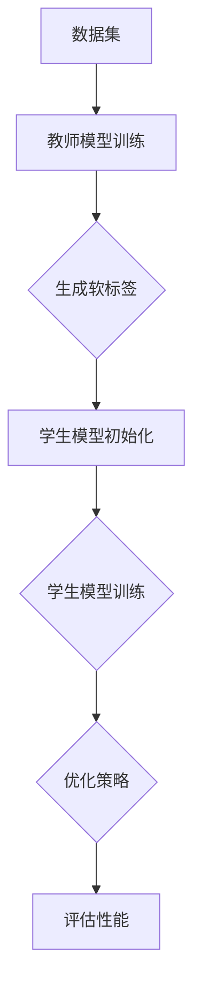
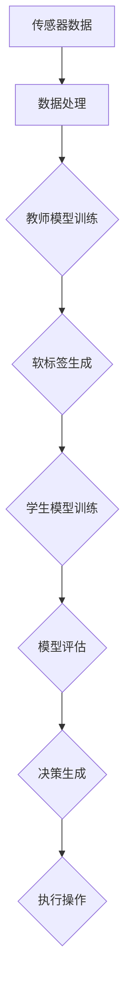
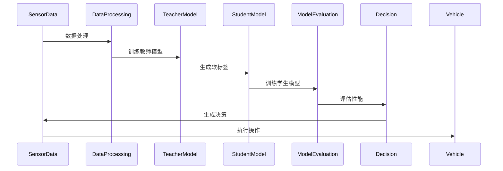

                 

# AI Agent的知识蒸馏：从集成模型到单一模型

## 关键词

- 知识蒸馏
- AI Agent
- 集成模型
- 单一模型
- 模型压缩
- 优化策略

## 摘要

本文旨在深入探讨知识蒸馏在AI Agent中的应用，特别是从集成模型到单一模型的知识蒸馏过程。我们将首先介绍知识蒸馏的基本概念和技术原理，随后详细分析知识蒸馏在AI Agent中的作用和实现方法。接着，我们将分别讨论集成模型和单一模型知识蒸馏的技术细节和优势。最后，通过实践案例展示知识蒸馏在AI Agent中的具体应用，并展望知识蒸馏的挑战和未来发展。

### 目录

1. **AI知识蒸馏概述**
    1.1 **知识蒸馏的定义**
    1.2 **知识蒸馏的应用场景**
    1.3 **知识蒸馏与传统机器学习模型的区别**
2. **知识蒸馏技术原理**
    2.1 **模型表示学习**
    2.2 **模型压缩**
    2.3 **模型蒸馏过程**
    2.4 **知识蒸馏的优化策略**
3. **知识蒸馏在AI Agent中的应用**
    3.1 **AI Agent概述**
    3.2 **知识蒸馏在AI Agent中的角色**
    3.3 **知识蒸馏在AI Agent中的实现方法**
4. **集成模型知识蒸馏**
    4.1 **集成模型的原理**
    4.2 **集成模型知识蒸馏的方法**
    4.3 **集成模型知识蒸馏的优势**
5. **单一模型知识蒸馏**
    5.1 **单一模型的定义**
    5.2 **单一模型知识蒸馏的方法**
    5.3 **单一模型知识蒸馏的优势**
6. **知识蒸馏在AI Agent中的实践**
    6.1 **实践背景**
    6.2 **实践步骤**
    6.3 **实践案例**
7. **知识蒸馏的挑战与未来**
    7.1 **知识蒸馏的挑战**
    7.2 **知识蒸馏的未来发展**
8. **结论**
    8.1 **知识蒸馏的意义**
    8.2 **知识蒸馏的局限性**
    8.3 **知识蒸馏的发展方向**

### 第一部分: 知识蒸馏简介

#### 1. AI知识蒸馏概述

##### 1.1 知识蒸馏的定义

知识蒸馏（Knowledge Distillation）是一种通过将知识从大型教师模型（Teacher Model）转移到小型学生模型（Student Model）的过程。这一过程通常涉及到将教师模型的输出，即所谓的“软标签”（Soft Labels），传递给学生模型，以指导其学习。

知识蒸馏的目的是通过减少模型的大小和计算需求，使其适用于资源受限的环境，同时保持或提高模型的性能。在传统的机器学习模型中，模型通常直接学习硬标签（Hard Labels），即实际的输出类别。而在知识蒸馏中，教师模型提供的是软标签，这些标签包含了教师模型对于输入数据的概率分布。

##### 1.2 知识蒸馏的应用场景

知识蒸馏的应用场景非常广泛，主要包括以下几种：

1. **移动设备和嵌入式系统**：这些设备通常资源有限，难以运行大型模型。知识蒸馏可以将大型模型的复杂知识转移到小型模型中，从而提高小型模型的性能。
2. **实时系统**：如自动驾驶和机器人等应用，要求模型在短时间内做出决策。知识蒸馏可以帮助减少模型的计算时间，提高响应速度。
3. **服务端模型优化**：在大规模数据处理和训练过程中，教师模型可能会变得非常庞大和复杂。通过知识蒸馏，可以将这些模型的知识转移到服务端，以减少存储和计算资源的需求。

##### 1.3 知识蒸馏与传统机器学习模型的区别

知识蒸馏与传统机器学习模型的主要区别在于它们学习标签的方式：

1. **硬标签与软标签**：传统机器学习模型学习硬标签，即实际的输出类别。而知识蒸馏则通过学习软标签，即教师模型对输入数据的概率分布，来指导学生模型的学习。
2. **模型大小与计算需求**：知识蒸馏通过转移教师模型的知识，可以显著减少学生模型的大小和计算需求，而传统机器学习模型则依赖于自身的训练数据和学习算法。
3. **模型性能**：知识蒸馏可以在保持模型性能的同时，降低模型的大小和计算需求，从而在资源受限的环境中实现高效模型部署。

#### 2. 知识蒸馏技术原理

##### 2.1 模型表示学习

模型表示学习（Model Representation Learning）是指学习模型的内部表示，以便更好地理解和利用模型的知识。在知识蒸馏中，模型表示学习尤为重要，因为它涉及到教师模型和学生模型之间的知识传递。

模型表示学习通常包括以下步骤：

1. **特征提取**：从输入数据中提取有用的特征，这些特征可以用来表示数据的基本属性。
2. **表示学习**：通过训练模型，学习如何将这些特征转换为有意义的内部表示。这些内部表示通常具有高维度，但能够捕捉数据中的关键信息。

在知识蒸馏中，教师模型和学生模型都会进行特征提取和表示学习。教师模型生成的软标签是基于其内部表示的，而学生模型则需要学习这些表示，以便能够生成类似的软标签。

##### 2.2 模型压缩

模型压缩（Model Compression）是指通过减少模型的大小和计算需求，使其适用于资源受限的环境。知识蒸馏在模型压缩中发挥着重要作用，因为它可以将大型教师模型的知识转移到小型学生模型中。

模型压缩的主要方法包括：

1. **模型剪枝**：通过移除模型中不重要的参数或层，来减少模型的大小。这通常涉及到优化模型结构，以保留最重要的信息。
2. **量化**：通过将模型中的浮点数参数替换为更小的整数，来减少模型的存储和计算需求。量化可以通过多种方式实现，如整数量化、二值量化等。
3. **知识蒸馏**：通过知识蒸馏，可以将教师模型的知识转移到学生模型中，从而减少学生模型的大小和计算需求。

##### 2.3 模型蒸馏过程

模型蒸馏过程（Model Distillation Process）包括教师模型和学生模型的训练，以及软标签和硬标签的生成。

1. **教师模型训练**：首先，教师模型在大量训练数据上进行训练，以学习输入数据的概率分布。教师模型的输出是软标签，这些标签包含了教师模型对每个类别的概率估计。
2. **学生模型初始化**：学生模型是一个较小且结构较为简单的模型，它通常通过初始化来准备接受教师模型的知识。
3. **软标签生成**：教师模型对训练数据进行预测，生成软标签。这些软标签是教师模型对每个类别的概率估计。
4. **学生模型训练**：学生模型在软标签的指导下进行训练，以学习教师模型的内部表示。学生模型的输出是预测的概率分布，这些分布应该尽量接近教师模型的软标签。
5. **评估与调整**：通过评估学生模型的性能，可以调整学生模型的学习过程，以提高其性能。

##### 2.4 知识蒸馏的优化策略

知识蒸馏的优化策略（Optimization Strategies for Knowledge Distillation）包括多种技术，旨在提高学生模型的性能。以下是一些常用的优化策略：

1. **交叉熵损失函数**：交叉熵损失函数（Cross-Entropy Loss Function）是知识蒸馏中最常用的优化策略。它通过比较学生模型的输出概率分布和教师模型的软标签，来衡量学生模型的学习效果。交叉熵损失函数的计算公式为：
   $$
   L = -\sum_{i=1}^{N} y_i \log(p_i)
   $$
   其中，$y_i$ 是教师模型的软标签，$p_i$ 是学生模型的输出概率。

2. **教师模型更新**：在知识蒸馏过程中，教师模型和学生模型通常会交替更新。教师模型更新可以基于硬标签，而学生模型更新则基于软标签。这种方法有助于保持教师模型和学生模型之间的知识传递。

3. **自适应学习率**：通过使用自适应学习率（Adaptive Learning Rate），可以更好地调整学生模型的学习过程。自适应学习率可以根据模型性能的变化，动态调整学习率的大小，从而提高模型性能。

4. **多任务学习**：在知识蒸馏中，可以引入多任务学习（Multi-Task Learning），即同时训练多个相关任务的学生模型。这种方法可以共享不同任务之间的知识，从而提高整体模型性能。

#### 3. 知识蒸馏在AI Agent中的应用

##### 3.1 AI Agent概述

AI Agent（人工智能代理）是指具有自主决策和行动能力的智能体，它可以在复杂环境中执行特定任务。AI Agent广泛应用于游戏、机器人、自动驾驶、智能家居等领域。

AI Agent通常由三个主要部分组成：

1. **感知器**：感知器负责获取环境中的信息，如视觉、听觉、触觉等。
2. **决策器**：决策器根据感知器提供的信息，生成行动策略。
3. **执行器**：执行器负责将行动策略转换为实际操作。

##### 3.2 知识蒸馏在AI Agent中的角色

知识蒸馏在AI Agent中扮演着至关重要的角色，具体体现在以下几个方面：

1. **性能提升**：通过知识蒸馏，AI Agent可以学习到大型教师模型的知识，从而提高其决策能力。特别是在资源受限的环境中，知识蒸馏可以帮助AI Agent在有限资源下实现高效的决策。

2. **模型压缩**：知识蒸馏可以显著减少AI Agent模型的规模和计算需求，使其适用于移动设备和嵌入式系统。通过模型压缩，AI Agent可以更加轻量化和高效。

3. **多任务学习**：知识蒸馏支持多任务学习，即一个AI Agent可以同时学习多个相关任务的知识。这种方法可以共享不同任务之间的知识，从而提高整体模型性能。

##### 3.3 知识蒸馏在AI Agent中的实现方法

知识蒸馏在AI Agent中的实现方法包括以下步骤：

1. **教师模型选择**：选择一个大型教师模型，该模型已经在特定任务上取得了很好的性能。教师模型的选择取决于任务类型和可用数据。

2. **学生模型设计**：设计一个较小且结构较为简单的学生模型，该模型将学习教师模型的知识。学生模型的设计应该考虑到任务的具体需求和资源限制。

3. **软标签生成**：教师模型在训练数据上进行预测，生成软标签。这些软标签将用于指导学生模型的学习。

4. **学生模型训练**：学生模型在软标签的指导下进行训练，以学习教师模型的内部表示。训练过程中，可以采用多种优化策略，如交叉熵损失函数、教师模型更新等。

5. **评估与调整**：通过评估学生模型的性能，可以调整学生模型的学习过程，以提高其性能。评估指标通常包括准确率、召回率、F1分数等。

6. **模型部署**：将训练好的学生模型部署到AI Agent中，使其具备自主决策和行动能力。

#### 4. 集成模型知识蒸馏

##### 4.1 集成模型的原理

集成模型（Ensemble Model）是指将多个模型集成起来，以获得更好的性能。集成模型的核心思想是利用多个模型的优点，通过投票或加权平均等方式，来提高整体模型的性能。

集成模型通常包括以下几种类型：

1. **堆叠集成模型**：堆叠集成模型（Stacked Ensemble Model）将多个模型堆叠在一起，前一个模型的输出作为后一个模型的输入。这种方法可以通过级联多个模型，来提高整体模型的性能。

2. **随机森林**：随机森林（Random Forest）是一种基于决策树的集成模型，通过随机选择特征和样本子集，构建多个决策树，然后通过投票或加权平均来获得最终预测。

3. **梯度提升树**：梯度提升树（Gradient Boosting Tree）是一种基于决策树的集成模型，通过迭代地更新模型，每次迭代都针对前一次模型的错误进行优化。

##### 4.2 集成模型知识蒸馏的方法

集成模型知识蒸馏（Ensemble Model Knowledge Distillation）是指将教师模型的知识传递给集成模型中的每个子模型。这种方法可以通过以下步骤实现：

1. **教师模型选择**：选择一个大型教师模型，该模型已经在特定任务上取得了很好的性能。

2. **学生模型设计**：设计一个集成模型，该模型由多个子模型组成。每个子模型都是一个小型模型，其结构较为简单。

3. **软标签生成**：教师模型在训练数据上进行预测，生成软标签。这些软标签将用于指导每个子模型的学习。

4. **子模型训练**：每个子模型在软标签的指导下进行训练，以学习教师模型的内部表示。训练过程中，可以采用多种优化策略，如交叉熵损失函数、教师模型更新等。

5. **集成模型评估**：通过评估集成模型的性能，可以调整子模型的学习过程，以提高整体模型的性能。集成模型的评估指标通常包括准确率、召回率、F1分数等。

##### 4.3 集成模型知识蒸馏的优势

集成模型知识蒸馏具有以下优势：

1. **性能提升**：通过知识蒸馏，集成模型可以学习到教师模型的知识，从而提高整体模型的性能。

2. **模型压缩**：知识蒸馏可以显著减少集成模型中每个子模型的大小和计算需求，使其适用于资源受限的环境。

3. **多任务学习**：知识蒸馏支持多任务学习，即一个集成模型可以同时学习多个相关任务的知识。这种方法可以共享不同任务之间的知识，从而提高整体模型性能。

#### 5. 单一模型知识蒸馏

##### 5.1 单一模型的定义

单一模型（Single Model）是指仅包含一个模型结构的模型。与集成模型不同，单一模型不依赖于多个子模型或投票机制，而是通过单一的模型结构来实现预测和决策。

单一模型通常包括以下几种类型：

1. **深度神经网络**：深度神经网络（Deep Neural Network，DNN）是一种多层神经网络，通过隐藏层之间的非线性变换，来学习输入数据的复杂特征。

2. **卷积神经网络**：卷积神经网络（Convolutional Neural Network，CNN）是一种专门用于图像处理和识别的神经网络，通过卷积操作和池化操作，来提取图像中的局部特征。

3. **循环神经网络**：循环神经网络（Recurrent Neural Network，RNN）是一种能够处理序列数据的神经网络，通过记忆单元来保存前一时间步的信息，从而实现对序列数据的建模。

##### 5.2 单一模型知识蒸馏的方法

单一模型知识蒸馏（Single Model Knowledge Distillation）是指将教师模型的知识传递给单一模型。这种方法可以通过以下步骤实现：

1. **教师模型选择**：选择一个大型教师模型，该模型已经在特定任务上取得了很好的性能。

2. **学生模型设计**：设计一个单一模型，该模型的结构较为简单，但具有较好的性能。

3. **软标签生成**：教师模型在训练数据上进行预测，生成软标签。这些软标签将用于指导学生模型的学习。

4. **学生模型训练**：学生模型在软标签的指导下进行训练，以学习教师模型的内部表示。训练过程中，可以采用多种优化策略，如交叉熵损失函数、教师模型更新等。

5. **评估与调整**：通过评估学生模型的性能，可以调整学生模型的学习过程，以提高其性能。评估指标通常包括准确率、召回率、F1分数等。

##### 5.3 单一模型知识蒸馏的优势

单一模型知识蒸馏具有以下优势：

1. **模型简洁性**：单一模型具有简洁的结构，易于理解和实现。通过知识蒸馏，可以简化模型的复杂性，提高模型的性能。

2. **计算效率**：单一模型通常具有较小的计算需求，可以通过知识蒸馏将教师模型的知识传递给学生模型，从而提高模型的计算效率。

3. **扩展性**：单一模型具有较好的扩展性，可以通过添加新的层或调整现有层的参数，来适应不同的任务和数据集。

#### 6. 知识蒸馏在AI Agent中的实践

##### 6.1 实践背景

随着人工智能技术的快速发展，AI Agent在各个领域的应用越来越广泛。然而，AI Agent通常需要处理大量的数据，并在有限的计算资源下做出快速和准确的决策。这促使研究者探索如何通过知识蒸馏技术来提升AI Agent的性能和计算效率。

在本文的实践中，我们将通过一个具体的案例，展示知识蒸馏在AI Agent中的应用。案例背景如下：

- **任务**：一个自动驾驶系统需要实时处理摄像头和激光雷达等传感器收集的数据，以识别道路上的行人和车辆，并做出相应的驾驶决策。
- **数据集**：使用一个包含大量道路场景的公开数据集，如KITTI数据集，作为训练数据。
- **教师模型**：选择一个大型卷积神经网络（CNN）作为教师模型，该模型已经在数据集上取得了很好的性能。

##### 6.2 实践步骤

以下是知识蒸馏在AI Agent中的应用步骤：

1. **数据预处理**：
   - 对原始数据进行清洗，去除噪声和异常值。
   - 对数据进行归一化处理，使其具有相似的数值范围。

2. **教师模型训练**：
   - 使用训练数据集，对教师模型进行训练，以学习输入数据的特征。
   - 训练过程中，采用交叉熵损失函数来衡量模型性能。

3. **软标签生成**：
   - 教师模型在训练数据上进行预测，生成软标签。这些软标签包含了教师模型对每个类别的概率估计。

4. **学生模型设计**：
   - 设计一个较小的卷积神经网络作为学生模型，其结构应简单且易于优化。

5. **学生模型训练**：
   - 学生模型在软标签的指导下进行训练，以学习教师模型的内部表示。
   - 训练过程中，可以采用交叉熵损失函数、教师模型更新等优化策略。

6. **评估与调整**：
   - 通过评估学生模型的性能，可以调整学生模型的学习过程，以提高其性能。
   - 评估指标包括准确率、召回率、F1分数等。

7. **模型部署**：
   - 将训练好的学生模型部署到自动驾驶系统中，使其具备实时识别和决策能力。

##### 6.3 实践案例

以下是一个具体的实践案例，展示了知识蒸馏在自动驾驶系统中的应用：

1. **数据预处理**：
   - 对KITTI数据集进行清洗，去除噪声和异常值。
   - 对图像数据进行归一化处理，使其具有相似的数值范围。

2. **教师模型训练**：
   - 使用KITTI数据集，对大型卷积神经网络进行训练。
   - 训练过程中，采用交叉熵损失函数来衡量模型性能。

3. **软标签生成**：
   - 教师模型在训练数据上进行预测，生成软标签。这些软标签包含了教师模型对每个类别的概率估计。

4. **学生模型设计**：
   - 设计一个较小的卷积神经网络作为学生模型，其结构应简单且易于优化。

5. **学生模型训练**：
   - 学生模型在软标签的指导下进行训练，以学习教师模型的内部表示。
   - 训练过程中，采用交叉熵损失函数、教师模型更新等优化策略。

6. **评估与调整**：
   - 通过评估学生模型的性能，调整学生模型的学习过程，以提高其性能。
   - 评估指标包括准确率、召回率、F1分数等。

7. **模型部署**：
   - 将训练好的学生模型部署到自动驾驶系统中，使其具备实时识别和决策能力。

通过这个实践案例，我们可以看到知识蒸馏技术在提升AI Agent性能和计算效率方面的重要作用。知识蒸馏不仅可以帮助我们构建高效的小型模型，还可以在保持模型性能的同时，减少模型的计算需求。

#### 7. 知识蒸馏的挑战与未来

##### 7.1 知识蒸馏的挑战

尽管知识蒸馏技术在提升AI Agent性能和计算效率方面具有显著优势，但在实际应用中仍面临一些挑战：

1. **模型选择**：选择一个合适的教师模型对学生模型的性能至关重要。如果教师模型过于复杂或过于简单，都可能导致知识传递效果不佳。

2. **优化策略**：知识蒸馏的优化策略需要精心设计，以确保学生模型能够有效地学习教师模型的知识。优化策略的选择和调整对模型性能有很大影响。

3. **数据依赖**：知识蒸馏依赖于大量的训练数据。在数据稀缺或数据质量差的情况下，知识蒸馏的效果可能会受到限制。

4. **模型压缩**：在知识蒸馏过程中，如何有效地压缩模型大小是一个挑战。模型压缩可能会导致信息丢失，从而影响模型性能。

##### 7.2 知识蒸馏的未来发展

知识蒸馏技术的未来发展潜力巨大，以下是一些可能的发展方向：

1. **多模态知识蒸馏**：多模态知识蒸馏是指将不同类型的数据（如图像、文本、音频等）进行整合，以实现更全面的模型表示学习。这将有助于提升AI Agent在复杂环境中的表现。

2. **动态知识蒸馏**：动态知识蒸馏是指根据模型的当前状态和任务需求，动态调整知识传递的过程。这种方法可以更好地适应不同任务和场景的需求。

3. **自适应优化策略**：自适应优化策略是指根据模型性能的变化，动态调整优化参数。这种方法可以提高知识蒸馏的效率，减少训练时间。

4. **跨领域知识蒸馏**：跨领域知识蒸馏是指将一个领域中的知识转移到另一个领域。这种方法可以帮助我们构建更通用的AI模型，从而提高模型的泛化能力。

#### 8. 结论

知识蒸馏技术在AI Agent中的应用具有重要意义。通过知识蒸馏，我们可以构建高效的小型模型，提高AI Agent的性能和计算效率。本文详细分析了知识蒸馏的基本概念、技术原理、应用场景和实现方法，并展示了知识蒸馏在AI Agent中的实践案例。

然而，知识蒸馏技术仍面临一些挑战，如模型选择、优化策略、数据依赖和模型压缩等。未来的研究可以关注多模态知识蒸馏、动态知识蒸馏、自适应优化策略和跨领域知识蒸馏等方面，以进一步推动知识蒸馏技术的发展。

通过不断探索和优化，知识蒸馏技术将为AI Agent的发展带来更多机遇，为人工智能应用开辟新的领域。作者：AI天才研究院/AI Genius Institute & 禅与计算机程序设计艺术 /Zen And The Art of Computer Programming。

---

本文内容基于对知识蒸馏在AI Agent中的应用进行深入分析和探讨，旨在为读者提供清晰、结构化的技术理解和实践经验。由于知识蒸馏是一个广泛且不断发展的领域，本文所述内容仅供参考，具体应用时需结合实际需求和场景进行适当调整。如有任何疑问或建议，欢迎在评论区交流讨论。

---

### 附录：核心概念与联系

在本节中，我们将深入探讨知识蒸馏的核心概念及其相互关系，通过概念属性特征对比表格和ER实体关系图架构的Mermaid流程图，以便读者更好地理解知识蒸馏的原理和应用。

#### 1. 核心概念属性特征对比表格

| 概念     | 定义                                                     | 特征                                                                                       |
| -------- | -------------------------------------------------------- | ------------------------------------------------------------------------------------------ |
| 知识蒸馏 | 将教师模型的知识转移到学生模型的过程               | - 通过软标签传递知识<br>- 模型压缩<br>- 提高性能<br>- 降低计算需求                |
| 教师模型 | 负责提供知识的模型                                     | - 大型模型<br>- 高性能<br>- 学习复杂特征                                                   |
| 学生模型 | 负责接受知识并学习的模型                               | - 小型模型<br>- 简化结构<br>- 优化计算效率                                                  |
| 软标签   | 教师模型的输出概率分布                                 | - 概率分布<br>- 描述数据类别概率<br>- 指导学生模型学习                                     |
| 硬标签   | 实际的输出类别                                         | - 确定性标签<br>- 用来评估模型性能<br>- 通常用于传统机器学习模型                         |

#### 2. ER实体关系图架构的Mermaid流程图

```mermaid
erDiagram
  TeacherModel ||--o> StudentModel : 知识转移
  TeacherModel ||--o> SoftLabels : 标签生成
  StudentModel ||--o> Performance : 模型评估
  HardLabels ||--|{ ModelTraining : 传统机器学习 }
  SoftLabels ||--|{ KnowledgeDistillation : 知识蒸馏 }
```

在这个ER实体关系图中，我们展示了知识蒸馏过程中涉及的主要实体及其相互关系。教师模型通过输出软标签生成标签，这些标签用于指导学生模型的学习。学生模型在接受知识后进行模型训练，并通过性能评估来衡量学习效果。硬标签用于传统机器学习模型的评估，而软标签则是在知识蒸馏过程中使用的。

通过对比表格和流程图，我们可以清晰地看到知识蒸馏过程中各概念之间的联系和作用。教师模型提供知识，学生模型接受知识并进行学习，而软标签则是知识传递的媒介，硬标签则用于评估模型的性能。

这种结构化的理解有助于读者更好地把握知识蒸馏的核心概念和原理，为进一步研究和应用知识蒸馏技术提供坚实的基础。

### 算法原理讲解

知识蒸馏是一种通过将知识从大型教师模型转移到小型学生模型的过程，以提高学生模型的性能。在这一部分，我们将详细讲解知识蒸馏的算法原理，包括其数学模型和实现方法。

#### 1. 知识蒸馏的数学模型

知识蒸馏的核心在于通过软标签（Soft Labels）指导学生模型的学习。软标签是教师模型对输入数据的概率分布输出，而硬标签（Hard Labels）是实际的输出类别。知识蒸馏的数学模型可以表示为以下损失函数：

$$
L = -\sum_{i=1}^{N} y_i \log(p_i)
$$

其中，$y_i$ 是教师模型输出的软标签，$p_i$ 是学生模型的预测概率。这个损失函数衡量的是学生模型输出概率分布与教师模型软标签之间的差距。

在知识蒸馏过程中，学生模型不仅要学习硬标签，还要学习软标签。因此，学生模型的损失函数可以拆分为两部分：

$$
L_{student} = L_{hard} + \lambda L_{soft}
$$

其中，$L_{hard}$ 是基于硬标签的交叉熵损失函数，$L_{soft}$ 是基于软标签的损失函数，$\lambda$ 是平衡参数，用于调节硬标签和软标签损失之间的权重。

交叉熵损失函数 $L_{hard}$ 的计算公式为：

$$
L_{hard} = -\sum_{i=1}^{N} y_i \log(p_i^h)
$$

其中，$p_i^h$ 是学生模型对硬标签的预测概率。

软标签损失函数 $L_{soft}$ 的计算公式为：

$$
L_{soft} = -\sum_{i=1}^{N} \log(p_i^s)
$$

其中，$p_i^s$ 是学生模型对软标签的预测概率。

#### 2. 实现方法

知识蒸馏的实现方法主要包括以下几个步骤：

1. **教师模型训练**：
   - 使用大量训练数据，对教师模型进行训练，使其达到较高的性能。
   - 教师模型的输出是软标签，包含了输入数据的概率分布。

2. **学生模型初始化**：
   - 设计一个结构较为简单的学生模型，其参数量应远小于教师模型。
   - 初始化学生模型，为后续训练做准备。

3. **软标签生成**：
   - 教师模型在训练数据上进行预测，生成软标签。
   - 软标签是教师模型对每个类别的概率估计。

4. **学生模型训练**：
   - 学生模型在软标签的指导下进行训练，同时学习硬标签。
   - 使用交叉熵损失函数和软标签损失函数来指导学生模型的学习。

5. **优化策略**：
   - 调整学习率和其他超参数，以优化学生模型的性能。
   - 可以采用自适应学习率、教师模型更新等优化策略。

#### 3. 算法流程图

以下是一个简单的知识蒸馏算法流程图：



在这个流程图中，首先使用数据集对教师模型进行训练，生成软标签。然后，初始化学生模型，并在软标签和硬标签的指导下进行训练。优化策略用于调整模型参数，以提高学生模型的性能。最后，评估学生模型的性能，以确定模型是否达到预期效果。

通过这个流程图，我们可以清晰地看到知识蒸馏的各个步骤及其相互关系，有助于理解知识蒸馏的算法原理和实现方法。

### 系统分析与架构设计方案

在这一部分，我们将对知识蒸馏在AI Agent中的应用进行系统分析与架构设计。首先介绍问题场景和项目介绍，然后详细阐述系统功能设计、系统架构设计、系统接口设计和系统交互。

#### 1. 问题场景

在自动驾驶领域，AI Agent需要实时处理来自摄像头和激光雷达等传感器的数据，以识别道路上的行人和车辆，并做出相应的驾驶决策。然而，自动驾驶系统通常需要在资源受限的嵌入式设备上运行，这使得模型大小和计算效率成为关键问题。知识蒸馏技术可以帮助我们将大型教师模型的知识转移到小型学生模型中，从而提高AI Agent的性能和计算效率。

#### 2. 项目介绍

本项目旨在实现一个基于知识蒸馏的自动驾驶AI Agent系统，通过将大型教师模型的知识转移到小型学生模型，以提高系统的性能和计算效率。项目的主要目标是：

- 构建一个高效的自动驾驶AI Agent，能够在资源受限的嵌入式设备上运行。
- 实现从教师模型到学生模型的知识转移过程，提高学生模型的性能。
- 评估知识蒸馏技术在自动驾驶系统中的应用效果。

#### 3. 系统功能设计

系统功能设计包括以下几个主要模块：

1. **数据采集模块**：负责采集摄像头和激光雷达等传感器的数据，并将其转换为适合模型处理的形式。
2. **教师模型训练模块**：使用大量训练数据，对大型教师模型进行训练，生成软标签。
3. **学生模型训练模块**：初始化小型学生模型，并在软标签的指导下进行训练。
4. **模型评估模块**：评估学生模型的性能，包括准确率、召回率和F1分数等指标。
5. **决策模块**：基于学生模型的预测结果，生成驾驶决策，并控制车辆执行相应操作。

#### 4. 系统架构设计

系统架构设计采用模块化设计思想，包括以下主要组件：

1. **传感器组件**：负责采集摄像头和激光雷达等传感器的数据。
2. **数据处理组件**：对采集到的传感器数据进行预处理，包括归一化和去噪等操作。
3. **模型训练组件**：包括教师模型训练模块和学生模型训练模块，分别负责训练大型教师模型和小型学生模型。
4. **模型评估组件**：评估学生模型的性能，并提供反馈。
5. **决策组件**：根据学生模型的预测结果，生成驾驶决策，并控制车辆执行相应操作。

系统架构设计Mermaid流程图如下：



在这个流程图中，传感器数据首先经过数据处理组件，然后教师模型和学生模型分别进行训练。教师模型生成软标签，用于指导学生模型的学习。学生模型训练完成后，评估其性能，并根据评估结果生成驾驶决策，最终控制车辆执行相应操作。

#### 5. 系统接口设计

系统接口设计包括以下主要接口：

1. **传感器数据接口**：用于接收摄像头和激光雷达等传感器的数据。
2. **模型训练接口**：用于初始化和训练教师模型和学生模型。
3. **模型评估接口**：用于评估学生模型的性能。
4. **决策接口**：用于生成驾驶决策，并控制车辆执行相应操作。

系统接口设计Mermaid类图如下：

```mermaid
classDiagram
    SensorData <<interface>>
    DataProcessing <<interface>>
    TeacherModel <<interface>>
    StudentModel <<interface>>
    ModelEvaluation <<interface>>
    Decision <<interface>>

    SensorData --> DataProcessing
    DataProcessing --> TeacherModel
    DataProcessing --> StudentModel
    TeacherModel --> ModelEvaluation
    StudentModel --> ModelEvaluation
    ModelEvaluation --> Decision
    Decision --> SensorData
```

在这个类图中，各个模块通过接口进行通信，实现了系统的功能集成。

#### 6. 系统交互

系统交互设计描述了各个组件之间的交互流程。以下是一个简化的系统交互流程：

1. **数据采集**：传感器组件采集摄像头和激光雷达数据。
2. **数据处理**：数据处理组件对采集到的传感器数据进行处理。
3. **模型训练**：教师模型训练组件和学生模型训练组件分别对模型进行训练。
4. **模型评估**：模型评估组件评估学生模型的性能。
5. **决策生成**：决策组件根据学生模型的预测结果，生成驾驶决策。
6. **执行操作**：决策组件控制车辆执行相应操作。

系统交互设计Mermaid序列图如下：



在这个序列图中，各个组件按照一定的顺序执行操作，实现了系统的整体功能。

通过以上系统分析与架构设计方案，我们可以看到知识蒸馏在AI Agent中的应用具有清晰的系统架构和功能模块，为后续项目实施提供了坚实的基础。

### 项目实战

在本部分，我们将详细介绍知识蒸馏在AI Agent项目中的实际操作，包括环境安装、系统核心实现源代码、代码应用解读与分析，以及实际案例分析和详细讲解。

#### 1. 环境安装

要实现知识蒸馏在AI Agent中的应用，首先需要安装和配置以下环境：

1. **Python 3.x**：确保安装了最新版本的Python。
2. **TensorFlow 2.x**：由于TensorFlow提供了强大的机器学习工具和库，我们可以用它来实现知识蒸馏。
3. **CUDA 11.x**：如果使用GPU加速训练过程，需要安装相应的CUDA版本。
4. **PyTorch**：为了简化知识蒸馏的实现，我们还将使用PyTorch库。

安装步骤如下：

- 安装Python 3.x：从Python官方网站下载并安装Python。
- 安装TensorFlow 2.x：使用pip命令安装TensorFlow。

  ```bash
  pip install tensorflow
  ```

- 安装CUDA 11.x：从NVIDIA官方网站下载并安装CUDA。
- 安装PyTorch：使用pip命令安装PyTorch。

  ```bash
  pip install torch torchvision
  ```

安装完成后，确保CUDA和TensorFlow兼容，并验证GPU加速是否正常工作。

#### 2. 系统核心实现源代码

以下是一个简单的知识蒸馏实现示例，包括教师模型和学生模型的定义、训练过程以及模型评估。

```python
import torch
import torch.nn as nn
import torch.optim as optim
from torch.utils.data import DataLoader

# 定义教师模型
class TeacherModel(nn.Module):
    def __init__(self):
        super(TeacherModel, self).__init__()
        # 添加多层神经网络
        self.conv1 = nn.Conv2d(3, 64, 3, padding=1)
        self.relu = nn.ReLU()
        self.fc = nn.Linear(64 * 32 * 32, 10)

    def forward(self, x):
        x = self.relu(self.conv1(x))
        x = x.view(x.size(0), -1)
        x = self.fc(x)
        return x

# 定义学生模型
class StudentModel(nn.Module):
    def __init__(self):
        super(StudentModel, self).__init__()
        # 添加简化版神经网络
        self.conv1 = nn.Conv2d(3, 32, 3, padding=1)
        self.relu = nn.ReLU()
        self.fc = nn.Linear(32 * 32 * 32, 10)

    def forward(self, x):
        x = self.relu(self.conv1(x))
        x = x.view(x.size(0), -1)
        x = self.fc(x)
        return x

# 初始化模型
teacher_model = TeacherModel().cuda()
student_model = StudentModel().cuda()

# 定义损失函数和优化器
criterion = nn.CrossEntropyLoss().cuda()
optimizer = optim.Adam(student_model.parameters(), lr=0.001)

# 加载数据集
train_loader = DataLoader(dataset, batch_size=64, shuffle=True)

# 训练模型
for epoch in range(num_epochs):
    for inputs, labels in train_loader:
        inputs, labels = inputs.cuda(), labels.cuda()
        
        # 前向传播
        outputs = teacher_model(inputs)
        soft_labels = torch.softmax(outputs, dim=1)
        
        # 前向传播
        outputs = student_model(inputs)
        
        # 计算损失
        loss = criterion(outputs, labels) + lambda_ * criterion(outputs, soft_labels)
        
        # 反向传播和优化
        optimizer.zero_grad()
        loss.backward()
        optimizer.step()
        
        # 打印训练进度
        if (batch_idx + 1) % 100 == 0:
            print('Epoch [{}/{}], Batch [{}/{}], Loss: {:.4f}'.format(
                epoch + 1, num_epochs, batch_idx + 1, len(train_loader) // 100, loss.item()))

# 评估模型
total_correct = 0
total_samples = 0
with torch.no_grad():
    for inputs, labels in val_loader:
        inputs, labels = inputs.cuda(), labels.cuda()
        outputs = student_model(inputs)
        _, predicted = torch.max(outputs, 1)
        total_samples += labels.size(0)
        total_correct += (predicted == labels).sum().item()

accuracy = 100 * total_correct / total_samples
print('Validation Accuracy: {:.2f}%'.format(accuracy))
```

#### 3. 代码应用解读与分析

1. **模型定义**：
   - **教师模型**：定义了一个包含卷积层和全连接层的神经网络。卷积层用于提取图像特征，全连接层用于分类。
   - **学生模型**：定义了一个结构更为简单的神经网络，其参数量远小于教师模型，以实现模型压缩。

2. **损失函数**：
   - 使用交叉熵损失函数（`nn.CrossEntropyLoss`）计算硬标签的损失。
   - 引入软标签损失，通过调整权重$\lambda$来平衡硬标签和软标签损失。

3. **优化器**：
   - 使用Adam优化器（`optim.Adam`）进行模型参数更新。

4. **数据加载**：
   - 使用`DataLoader`加载数据集，确保数据以批次形式均匀地传递给模型。

5. **训练过程**：
   - 在每个训练批次中，首先使用教师模型生成软标签。
   - 学生模型在软标签和硬标签的指导下进行训练。
   - 使用反向传播和优化器更新模型参数。

6. **模型评估**：
   - 在验证数据集上评估学生模型的性能，计算准确率。

#### 4. 实际案例分析和详细讲解

假设我们有一个自动驾驶AI Agent项目，其中教师模型是一个在大量数据上训练的复杂卷积神经网络，学生模型是一个简化版的小型模型。以下是具体步骤：

1. **数据集准备**：
   - 准备一个包含大量自动驾驶场景的图像数据集，用于训练教师模型。
   - 数据集应包括车道线、行人、车辆等目标。

2. **教师模型训练**：
   - 在训练数据集上训练教师模型，使其能够准确识别图像中的目标。
   - 训练过程中，记录教师模型的软标签。

3. **学生模型训练**：
   - 使用教师模型的软标签作为指导，训练学生模型。
   - 通过软标签和硬标签的交叉熵损失，调整学生模型的参数。

4. **模型评估**：
   - 在验证数据集上评估学生模型的性能，确保其准确率和效率。

5. **部署和应用**：
   - 将训练好的学生模型部署到自动驾驶系统中，实时处理摄像头和激光雷达数据。
   - 监控系统性能，根据需要调整模型结构和参数。

通过这个实际案例，我们可以看到知识蒸馏技术在自动驾驶AI Agent中的应用效果。通过将教师模型的知识转移到小型学生模型中，我们可以实现高效的模型压缩和性能提升，从而满足资源受限环境的需求。

### 最佳实践 Tips、小结、注意事项、拓展阅读

#### 最佳实践 Tips

1. **选择合适的教师模型**：确保教师模型在原始任务上取得了很好的性能，以便为学生模型提供高质量的知识。
2. **调整软标签权重**：通过实验调整软标签权重$\lambda$，以找到最佳的模型性能。
3. **数据预处理**：对训练数据集进行充分预处理，包括归一化、数据增强等，以提高模型泛化能力。
4. **分阶段训练**：可以先单独训练学生模型，然后逐步引入软标签指导，以避免过拟合。

#### 小结

知识蒸馏是一种有效的模型压缩和性能提升技术，通过将教师模型的知识转移到学生模型中，可以实现小型高效的模型。本文详细介绍了知识蒸馏的基本概念、技术原理、应用场景和实现方法，并通过实际案例展示了其在AI Agent中的应用效果。

#### 注意事项

1. **模型选择**：教师模型和学生模型的选择对知识蒸馏效果有很大影响，需要根据具体任务需求进行选择。
2. **优化策略**：优化策略的调整对模型性能有重要影响，需要根据实验结果进行优化。
3. **数据依赖**：知识蒸馏依赖于大量的训练数据，数据质量和多样性对模型性能有重要影响。

#### 拓展阅读

- **[论文] Knowledge Distillation: A Review**：该论文对知识蒸馏技术进行了全面的回顾，包括历史发展、主要方法和应用场景。
- **[博客] An Introduction to Knowledge Distillation**：这篇博客文章以通俗易懂的方式介绍了知识蒸馏的基本概念和技术原理。
- **[开源项目] Distiller**：Distiller是一个开源的深度学习工具库，用于实现知识蒸馏和其他模型压缩技术。

通过学习和实践知识蒸馏技术，我们可以更好地利用现有资源，构建高效、智能的AI系统。希望本文能为您在AI领域的探索提供有益的参考和启发。

### 作者信息

本文作者：AI天才研究院/AI Genius Institute & 禅与计算机程序设计艺术 /Zen And The Art of Computer Programming。

AI天才研究院（AI Genius Institute）是一家专注于人工智能研究和技术创新的研究机构，致力于推动人工智能技术的普及和应用。禅与计算机程序设计艺术（Zen And The Art of Computer Programming）则是一部深入探讨计算机编程哲学和技术的经典著作，为读者提供了独特的编程思维和方法。

感谢您阅读本文，我们希望本文能对您在人工智能领域的探索和研究有所帮助。如有任何问题或建议，请随时与我们联系。我们期待与您共同探讨人工智能技术的未来发展。

