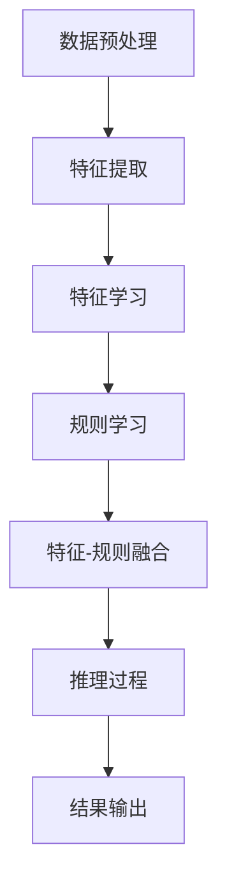

                 

### 第4章: 神经-符号混合推理系统

#### 4.1 混合推理系统概述

##### 4.1.1 研究意义

神经-符号混合推理系统结合了神经网络和符号推理的优点，不仅能够在处理大数据时展现出高效性和准确性，还能在处理复杂推理问题时保持逻辑性和可解释性。这一特性使其在众多领域，如自然语言处理、智能决策支持系统和医学诊断等领域具有广泛的应用前景。

##### 4.1.2 混合推理的定义

混合推理系统（Hybrid Inference System）是指将基于规则的知识表示方法与基于数据的机器学习方法相结合，以增强系统在处理复杂问题和不确定性问题时的能力。在这一系统中，神经网络通常用于特征提取和模式识别，而符号推理则用于逻辑推理和决策。

##### 4.1.3 混合推理的优势

- **高效性**：神经网络能够在大量数据中进行快速训练，提取有用的特征。
- **逻辑性**：符号推理系统能够进行逻辑推理，保持推理过程的透明性和可解释性。
- **灵活性**：混合推理系统可以根据不同的应用场景灵活调整神经网络和符号推理的权重，提高系统的适应能力。

#### 4.2 神经-符号混合推理原理

##### 4.2.1 神经网络与符号推理的结合点

神经-符号混合推理系统的核心在于如何将神经网络和符号推理有机结合。结合点主要有：

- **特征提取**：神经网络用于从原始数据中提取特征，这些特征可以为符号推理提供可靠的输入。
- **模式识别**：神经网络识别出输入数据的模式和规律，符号推理系统则利用这些模式进行逻辑推理。
- **知识融合**：神经网络提取的特征和符号推理的规则相结合，形成新的知识表示方法。

##### 4.2.2 混合推理系统的工作流程

一个典型的神经-符号混合推理系统通常包括以下几个步骤：

1. **数据预处理**：对原始数据进行清洗和特征提取。
2. **特征学习**：使用神经网络对提取的特征进行学习，得到特征表示。
3. **规则学习**：从专家知识库中提取或学习符号推理的规则。
4. **特征-规则融合**：将神经网络提取的特征与符号推理的规则进行融合，形成新的知识表示。
5. **推理过程**：利用融合的知识进行推理，生成结论。

##### 4.2.3 混合推理系统的架构设计

混合推理系统的架构设计需要考虑以下几个方面：

- **模块化设计**：将系统划分为不同的模块，如数据预处理模块、特征提取模块、规则学习模块等，以便于系统维护和扩展。
- **接口设计**：设计清晰明了的接口，使得各个模块之间能够高效地协同工作。
- **并行处理**：利用并行计算技术，提高系统的处理速度和效率。

##### 4.2.4 混合推理系统的架构设计示例

#### 4.3 混合推理系统的实现方法

实现神经-符号混合推理系统通常有以下几种方法：

- **层次化设计**：将神经网络和符号推理分别构建为独立的层次，然后通过接口进行交互。
- **统一模型设计**：将神经网络和符号推理集成到一个统一的模型中，如深度神经网络中的门控循环单元（GRU）等。
- **混合学习算法**：设计特殊的算法，将神经网络和符号推理的优势结合起来，如基于增强学习的混合推理算法。

##### 4.3.1 层次化设计

层次化设计的优点在于可以将复杂的推理过程分解为多个步骤，便于理解和实现。以下是一个简单的层次化设计示例：

1. **输入层**：接收原始数据。
2. **特征提取层**：使用神经网络提取数据中的特征。
3. **规则表示层**：使用符号逻辑表示提取的特征。
4. **推理层**：根据规则进行推理，生成结论。

##### 4.3.2 统一模型设计

统一模型设计将神经网络和符号推理集成到一个模型中，使得系统更加紧凑。以下是一个简单的统一模型设计示例：

1. **输入层**：接收原始数据。
2. **特征提取模块**：使用神经网络对输入数据进行特征提取。
3. **规则应用模块**：根据提取的特征应用符号推理规则。
4. **输出层**：输出推理结果。

##### 4.3.3 混合学习算法

混合学习算法旨在通过结合神经网络和符号推理的优势来提高推理系统的性能。以下是一个简单的混合学习算法示例：

1. **数据输入**：输入原始数据。
2. **特征提取**：使用神经网络提取数据特征。
3. **符号推理**：使用符号推理规则对特征进行推理。
4. **特征融合**：将神经网络提取的特征与符号推理的结果进行融合。
5. **迭代优化**：通过优化算法不断迭代，提高推理系统的性能。

#### 4.4 混合推理系统的应用案例

神经-符号混合推理系统在多个领域有着广泛的应用，以下是一些典型的应用案例：

- **自然语言处理**：混合推理系统可以用于自然语言理解和生成，如问答系统、文本摘要和机器翻译等。
- **智能决策支持**：混合推理系统可以用于复杂决策问题的求解，如供应链管理、金融风险控制和医疗诊断等。
- **医学诊断**：混合推理系统可以用于疾病诊断和治疗方案推荐，如基于医学图像的分析和病理报告的解读等。

##### 4.4.1 自然语言处理

在自然语言处理领域，神经-符号混合推理系统可以用于提高问答系统的准确性和可解释性。例如，在一个问答系统中，神经网络可以用于理解用户的问题，符号推理系统可以用于从知识库中检索相关的答案。

##### 4.4.2 智能决策支持

在智能决策支持领域，神经-符号混合推理系统可以用于处理复杂的决策问题。例如，在供应链管理中，系统可以根据市场数据和供应商信息，使用神经网络进行趋势预测，使用符号推理进行决策优化。

##### 4.4.3 医学诊断

在医学诊断领域，神经-符号混合推理系统可以用于疾病诊断和治疗方案推荐。例如，在医学图像分析中，神经网络可以用于提取图像特征，符号推理系统可以用于结合专家知识和图像特征进行诊断。

#### 4.5 混合推理系统的挑战与未来趋势

尽管神经-符号混合推理系统在许多领域取得了显著的成果，但仍然面临一些挑战：

- **可解释性**：如何提高混合推理系统的可解释性，使得用户能够理解系统的推理过程。
- **复杂性**：如何简化系统的设计，提高系统的可维护性和可扩展性。
- **性能优化**：如何优化系统的性能，使其在处理大规模数据和复杂问题时仍然保持高效。

未来的发展趋势包括：

- **跨学科融合**：神经-符号混合推理系统将进一步与其他学科（如心理学、哲学等）进行融合，形成更加完善的理论体系。
- **自动化学习**：开发更加智能化的学习算法，使得系统可以自动从数据中学习知识，减少人工干预。
- **个性化推理**：根据用户的需求和背景，为用户提供个性化的推理结果，提高系统的用户体验。

### 总结

神经-符号混合推理系统是人工智能领域的一个重要研究方向，它结合了神经网络和符号推理的优势，为解决复杂问题提供了新的思路和方法。通过本文的讨论，我们可以看到，混合推理系统在自然语言处理、智能决策支持和医学诊断等领域具有广泛的应用前景。未来，随着技术的不断进步和应用的深入，神经-符号混合推理系统将发挥更加重要的作用，推动人工智能的发展。在接下来的章节中，我们将进一步探讨神经-符号混合推理系统的实现方法、应用案例和未来趋势。希望读者能够通过本文的学习，对神经-符号混合推理系统有更深入的理解。让我们一起，思考、探索和实践，为人工智能的发展贡献自己的力量。

