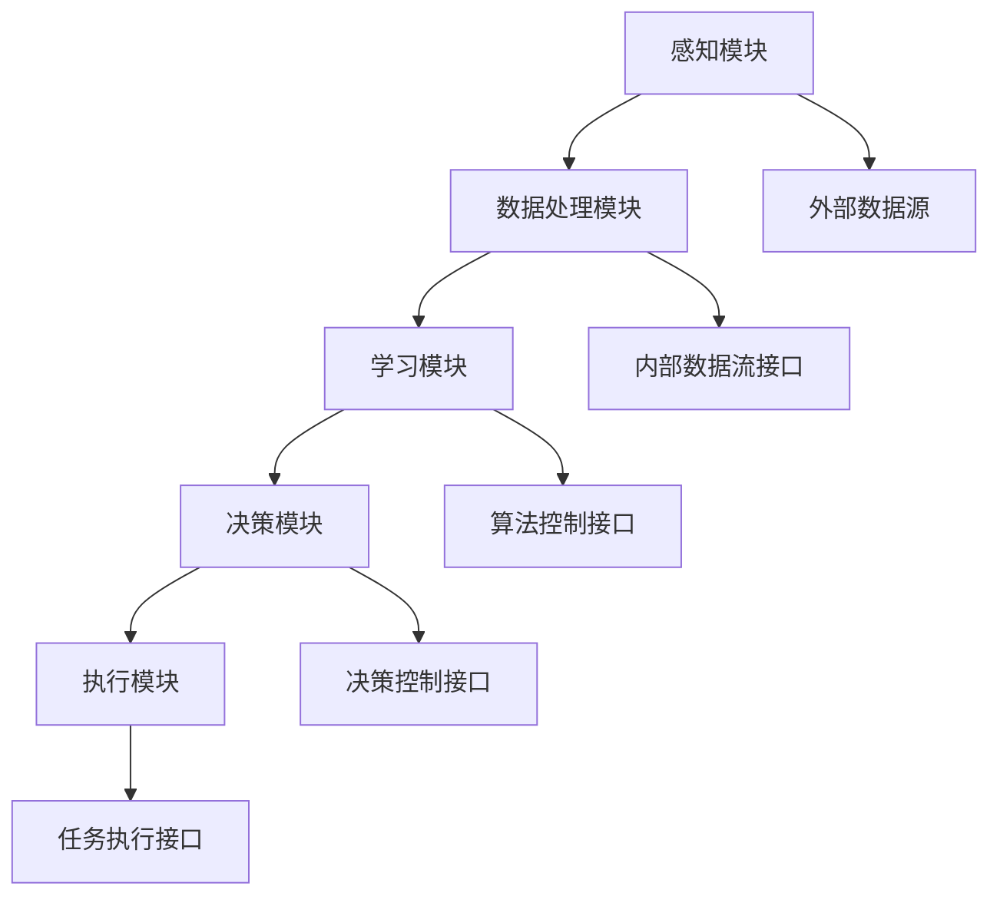
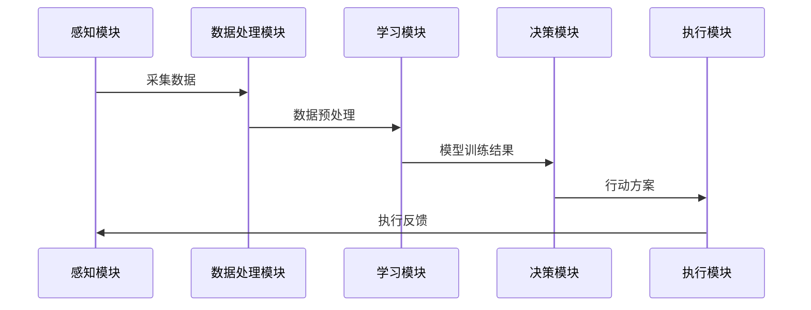

                 

### AI Agent与终身学习系统的基础

在当今快速发展的科技时代，人工智能（AI）已经成为推动社会进步的重要力量。AI Agent，作为人工智能系统中的一个核心组成部分，它在各个领域的应用日益广泛，从智能家居到企业自动化，再到医疗诊断，AI Agent正逐步改变我们的生活方式。而在这个不断变化的环境中，如何确保AI Agent能够持续适应新知识和技能，成为了一个关键问题，这也催生了终身学习系统的出现。

#### 1.1 AI Agent的定义与重要性

AI Agent可以被定义为一个自主执行任务、与环境交互并能在任务中学习的实体。它具备感知、决策和执行三个核心功能模块，能够在复杂动态环境中自主行动，实现特定目标的达成。AI Agent的重要性在于，它不仅能够提高工作效率，还能够解决人类难以应对的复杂问题。

首先，AI Agent具有高度的自动化能力。通过学习和模拟人类行为，AI Agent可以在没有人类干预的情况下执行复杂任务，从而提高工作效率。例如，智能客服机器人可以在短时间内处理大量客户咨询，提高客户满意度。

其次，AI Agent具有强大的适应能力。在动态变化的环境中，AI Agent能够不断学习新知识，适应新的环境和任务需求。这种适应能力使得AI Agent在各个领域中都具备广泛的应用前景。

最后，AI Agent具有自主学习和自我优化能力。通过机器学习和深度学习等技术，AI Agent能够从数据中学习，不断优化自己的行为和决策。这种自我优化能力使得AI Agent能够在长期运行中不断进步，提高性能和效果。

#### 1.2 AI Agent的核心要素

AI Agent的核心要素主要包括感知系统、决策系统和执行系统。

**感知系统**：感知系统负责接收和处理环境信息，为决策系统提供输入。感知系统可以通过传感器、摄像头、语音识别等技术实现。例如，一个自动驾驶汽车的感知系统可能包括激光雷达、摄像头和雷达等设备，用于获取道路信息、交通状况和周边环境。

**决策系统**：决策系统基于感知系统提供的信息，通过算法和模型进行推理和决策。决策系统需要考虑多个因素，如任务目标、环境约束和资源限制，从而选择最优的行动方案。例如，一个智能客服机器人需要分析客户提问的内容，并根据知识库和决策模型提供合适的回答。

**执行系统**：执行系统负责将决策系统的决策转化为实际操作。执行系统通常通过机械臂、无人机、机器人等设备实现。例如，一个自动化的生产线中的执行系统可能包括机械臂和传送带，用于执行特定的组装和搬运任务。

#### 1.3 AI Agent与传统机器学习模型的区别

AI Agent与传统机器学习模型在多个方面存在显著差异。

首先，传统机器学习模型通常是基于静态数据和固定算法，无法适应动态变化的环境。而AI Agent通过持续学习和自适应，能够实时调整自己的行为，以适应新的环境和任务需求。

其次，传统机器学习模型往往只能解决特定类型的问题，而AI Agent则具备更广泛的应用场景和任务适应性。AI Agent通过多任务学习和跨领域迁移学习，能够将学到的知识应用到不同领域和任务中。

最后，传统机器学习模型依赖于大量标注数据，而AI Agent则可以通过自监督学习和半监督学习，从较少的标注数据或无标注数据中学习，降低数据获取和标注的难度。

综上所述，AI Agent作为人工智能系统中的核心组成部分，其自主性、适应性和学习性使得它能够在复杂动态环境中发挥作用。而终身学习系统的引入，则进一步提升了AI Agent的持续学习能力和适应性，为AI Agent在各个领域的广泛应用提供了有力支持。

#### 1.4 终身学习的概念与起源

终身学习（Lifelong Learning）的概念起源于20世纪60年代，随着工业化和信息化的快速发展，人们逐渐认识到，传统的单一阶段教育模式已无法满足个体在职业生涯中的持续发展需求。终身学习理念强调，个体应在整个生命过程中不断学习，以适应快速变化的社会和工作环境。

**终身学习的起源与发展**：终身学习理念的提出，源于对教育和就业领域变革的需求。在20世纪60年代，随着科技的迅猛发展，知识更新速度大幅提高，传统的教育体系逐渐显现出其局限性。为了应对这一挑战，各国开始探索新的教育模式，终身学习理念应运而生。1965年，法国教育家保罗·朗格朗（Paulo Freire）在《终身教育引论》一书中首次提出了“终身教育”的概念，标志着终身学习理念的正式确立。

**终身学习的定义与意义**：终身学习被定义为“一个人在一生中，通过学习来满足个人发展需求，实现自我潜能的过程”。它不仅包括学校教育，还包括非正式教育和职业培训。终身学习的意义在于：

1. **适应变化**：社会和科技的快速发展使得知识更新速度加快，终身学习帮助个体适应这种变化，保持竞争力。
2. **持续发展**：通过不断学习，个体能够不断提升自身能力，实现职业生涯的持续发展。
3. **全面发展**：终身学习不仅关注职业技能的提升，也关注个体在道德、情感、社交等方面的全面发展。

在人工智能（AI）领域，终身学习尤为重要。AI Agent作为智能系统，其核心在于能够不断学习和适应新的环境和任务。终身学习系统使得AI Agent能够从不断变化的数据中学习，优化自己的模型和行为，从而实现持续进步。

**终身学习在AI领域的应用**：

1. **自适应学习**：AI Agent通过终身学习系统能够适应新的数据分布和任务需求，提高其鲁棒性和适应性。
2. **知识迁移**：通过终身学习，AI Agent能够将学到的知识迁移到其他领域和任务中，实现跨领域应用。
3. **持续优化**：终身学习系统使AI Agent能够在运行过程中不断优化自己的模型和算法，提高其性能和效果。

综上所述，终身学习作为AI Agent持续适应新知识和技能的重要手段，不仅提升了AI Agent的智能水平，也为其在各个领域的广泛应用提供了坚实的基础。通过不断学习和适应，AI Agent能够更好地服务于人类，推动社会的发展与进步。

#### 1.5 终身学习系统的特点

终身学习系统是AI Agent持续适应新知识和技能的关键机制。它具有以下几大显著特点：

**1. 自适应能力**：终身学习系统的核心在于其强大的自适应能力。通过不断地从环境数据中学习，AI Agent能够适应新的任务和情境。这种自适应能力主要体现在两个方面：一是对数据分布的适应，即系统能够在新数据分布下调整自己的模型参数；二是对任务变化的适应，即系统能够在不同的任务需求下调整策略和决策逻辑。

**2. 持续学习性**：与传统的一次性学习模型不同，终身学习系统能够在长时间内持续学习，不断更新和优化自身的知识和技能。这种持续学习性使得AI Agent能够在动态环境中保持高效的表现。例如，一个智能客服机器人可以通过持续学习用户反馈，不断优化自己的回答质量和用户满意度。

**3. 适应性进化**：终身学习系统不仅能够应对当前的挑战，还能够通过历史数据和经验进行适应性进化。这意味着AI Agent不仅能够解决当前的问题，还能够预见未来的挑战，并提前做好准备。例如，一个自动驾驶系统能够通过持续学习道路状况和交通模式，提前识别潜在的安全风险，从而提高行驶安全。

**4. 动态调整**：终身学习系统能够根据环境的变化动态调整自己的学习策略和模型参数。这种动态调整能力使得AI Agent能够在不同场景下保持最佳表现。例如，一个智能监控系统可以根据不同的时间段和环境条件，调整监控频率和图像识别算法的阈值，提高监控的准确性和效率。

**5. 自我优化**：终身学习系统具备自我优化能力，通过自我评估和反馈机制，能够不断优化自身的模型和算法。这种自我优化能力不仅提高了AI Agent的性能，还减少了人工干预的需求。例如，一个智能推荐系统可以通过用户反馈和交互行为，不断调整推荐算法，提高推荐的相关性和满意度。

**6. 知识融合**：终身学习系统能够在不同知识领域之间进行知识融合，形成综合性的解决方案。这种知识融合能力使得AI Agent能够处理更加复杂和多样化的任务。例如，一个智能医疗诊断系统能够将不同医学领域的知识进行融合，提供更加精准的诊断结果。

综上所述，终身学习系统的这些特点使得AI Agent能够在复杂动态的环境中持续适应新知识和技能，从而实现更高的智能水平和应用价值。通过不断的学习、适应和优化，AI Agent能够更好地服务于人类社会，推动科技与社会的共同进步。

#### 1.6 终身学习系统的核心原理

终身学习系统的核心在于其能够持续更新和优化模型，以适应不断变化的环境和任务需求。下面将详细解析终身学习系统的核心原理，包括持续学习算法、知识更新机制和模型适应策略。

**持续学习算法**：

持续学习算法是终身学习系统的核心组成部分，它使得AI Agent能够在长期运行中保持学习效率和准确性。常见的持续学习算法包括：

1. **在线学习算法**：在线学习算法能够在数据流中实时更新模型参数，适用于数据实时性要求较高的场景。例如，在线梯度下降（Online Gradient Descent）和增量学习（Incremental Learning）算法，都是通过不断更新模型参数来适应新的数据。
   
2. **迁移学习算法**：迁移学习算法通过在不同任务间共享先验知识，减少对新数据的标注需求。这种方法尤其适用于任务相似度较高的场景。例如，使用预训练的深度神经网络（如BERT）作为基础模型，再根据具体任务微调参数，从而提高学习效率。

3. **多任务学习算法**：多任务学习算法能够在同一模型中同时学习多个任务，利用任务之间的关联性提高学习效果。例如，在多任务神经网络中，不同任务共享部分网络层，从而实现知识共享和模型优化。

**知识更新机制**：

知识更新机制确保终身学习系统能够从海量数据中筛选出最有价值的信息，并将其纳入模型。常见的知识更新机制包括：

1. **在线更新机制**：在线更新机制在数据流中实时更新模型知识库，根据新的数据调整模型参数。这种机制适用于数据量较大且实时性要求高的应用场景。

2. **批处理更新机制**：批处理更新机制将一段时间内的数据汇总后进行批量更新，减少计算资源消耗。例如，每周或每月更新一次模型参数，从而确保知识的连续性和稳定性。

3. **反馈修正机制**：反馈修正机制通过用户反馈和评估结果，动态调整模型参数，提高学习效果。例如，智能客服机器人可以根据用户满意度调整回答策略，从而优化用户体验。

**模型适应策略**：

模型适应策略是终身学习系统确保模型在不同任务和环境中的有效性的关键。常见的模型适应策略包括：

1. **自适应调整**：通过自适应调整算法，模型能够根据环境变化动态调整学习参数。例如，在动态调整学习率（Dynamic Learning Rate Adjustment）中，模型根据误差和性能指标自动调整学习率，从而提高学习效率和收敛速度。

2. **混合策略**：混合策略结合多种学习方法，以应对不同的任务需求。例如，在强化学习与监督学习的混合策略中，模型在初期使用监督学习快速获得基础知识，然后通过强化学习进一步优化决策。

3. **迁移学习策略**：通过迁移学习策略，模型能够将学到的知识应用到新任务中，减少对新数据的依赖。例如，使用预训练模型进行迁移学习，将预训练模型的知识迁移到新任务中，从而提高新任务的表现。

综上所述，终身学习系统的核心原理包括持续学习算法、知识更新机制和模型适应策略。这些原理共同作用，使得AI Agent能够在不断变化的环境中持续适应新知识和技能，实现高效的智能表现。通过这些核心原理的有机结合，终身学习系统能够为AI Agent提供强大的学习能力和适应性，推动人工智能技术的不断进步。

#### 1.7 终身学习系统的设计原则

在设计和实现终身学习系统时，确保系统的灵活性、可扩展性和安全性至关重要。以下将详细讨论终身学习系统的设计原则，包括灵活性、可扩展性、可维护性、可测试性和安全性等方面。

**1. 灵活性**：

灵活性是终身学习系统的核心要求之一。系统需要能够快速适应新的环境和任务需求，从而确保其在实际应用中的高效性和适应性。为了实现这一目标，设计原则包括：

- **模块化设计**：采用模块化设计方法，将系统功能分解为多个独立的模块，每个模块负责特定的任务。这种设计方法使得系统能够灵活地添加、删除或替换模块，从而适应不同的应用场景。
- **参数调整**：设计灵活的参数调整机制，允许用户根据实际需求动态调整学习算法的参数，以优化系统性能。例如，通过调整学习率、批处理大小等参数，系统可以在不同数据量和任务复杂度下保持最佳性能。
- **动态调整策略**：引入动态调整策略，系统可以根据实时反馈和环境变化，自动调整学习策略和模型参数，以实现最优的适应性。

**2. 可扩展性**：

可扩展性是确保终身学习系统能够支持大规模数据处理和多个任务并行处理的关键。设计原则包括：

- **分布式计算**：采用分布式计算架构，将计算任务分布在多个节点上，从而提高系统的处理能力和可扩展性。例如，使用分布式机器学习框架（如TensorFlow或PyTorch）可以实现大规模数据的高效处理。
- **水平扩展**：通过增加计算节点来扩展系统容量，使得系统能够处理更大的数据量和更复杂的任务。例如，在数据处理和模型训练过程中，通过增加计算节点来提高计算速度和资源利用率。
- **垂直扩展**：通过增加计算节点的计算能力和存储容量，来提高系统性能和可扩展性。例如，使用高性能GPU和SSD存储设备，可以提高系统的计算速度和数据处理能力。

**3. 可维护性**：

可维护性是确保终身学习系统长期稳定运行和高效维护的重要保障。设计原则包括：

- **代码质量**：编写高质量的代码，确保系统的可读性和可维护性。遵循编码规范和最佳实践，如代码注释、模块化设计和单元测试，可以提高代码的可维护性。
- **模块化代码**：将代码分解为多个独立的模块，每个模块负责特定的功能。这种设计方法使得系统在出现问题时，可以更容易地定位和修复问题，从而降低维护成本。
- **文档化**：编写详细的系统文档，包括设计文档、用户手册和操作指南，帮助开发人员和理解系统的运作方式，从而提高系统的可维护性。

**4. 可测试性**：

可测试性是确保系统可靠性和稳定性的关键。设计原则包括：

- **单元测试**：编写单元测试用例，对系统中的每个模块进行独立的测试，以确保模块的功能正确性和性能。单元测试有助于发现和修复代码中的潜在问题，提高系统的可靠性。
- **集成测试**：在模块之间进行集成测试，确保系统各部分的协同工作。集成测试可以覆盖系统的主要功能，验证系统在各种场景下的性能和稳定性。
- **自动化测试**：采用自动化测试工具，实现测试过程的自动化。自动化测试可以节省测试时间，提高测试效率，确保系统的长期稳定运行。

**5. 安全性**：

安全性是终身学习系统的关键要求之一。设计原则包括：

- **数据加密**：对敏感数据进行加密处理，确保数据在传输和存储过程中的安全性。使用先进的加密算法（如AES）和安全的传输协议（如HTTPS），防止数据被窃取或篡改。
- **访问控制**：实现严格的访问控制机制，确保只有授权用户才能访问系统和数据。通过身份验证和权限管理，防止未授权访问和数据泄露。
- **异常检测与响应**：引入异常检测机制，实时监控系统的运行状态，发现异常情况后及时采取响应措施。例如，使用入侵检测系统（IDS）和防火墙，防止恶意攻击和系统漏洞。

综上所述，终身学习系统的设计原则包括灵活性、可扩展性、可维护性、可测试性和安全性。通过遵循这些设计原则，系统可以更好地适应不断变化的环境和任务需求，实现高效、稳定和安全的运行。

#### 1.8 终身学习系统的架构设计

终身学习系统的架构设计是确保其功能完整、性能优越和安全可靠的关键。以下将详细介绍终身学习系统的架构设计，包括系统架构概述、数据流设计和算法集成等方面。

**系统架构概述**：

终身学习系统的架构设计采用模块化方法，分为多个独立模块，每个模块负责特定的功能，以实现系统的整体协调运作。系统架构主要包括以下核心模块：

1. **感知模块**：负责从环境中获取数据，通过传感器、摄像头、麦克风等设备，将物理信号转换为数字信号，为后续处理提供输入。
2. **数据处理模块**：对感知模块获取的数据进行预处理，包括数据清洗、归一化和特征提取等操作，以减少噪声和提高数据质量。
3. **学习模块**：负责持续学习算法的执行，包括模型训练、参数更新和知识融合等，以实现系统的自我优化和适应能力。
4. **决策模块**：基于学习模块提供的模型和知识库，通过推理和决策算法，生成最优的行动方案。
5. **执行模块**：负责将决策模块生成的行动方案转化为实际操作，通过机械臂、机器人等设备执行任务。

**数据流设计**：

数据流设计是终身学习系统的核心环节，它决定了数据在系统中的流动路径和处理流程。数据流设计包括以下几个关键步骤：

1. **数据采集**：通过感知模块采集环境数据，包括文本、图像、音频等多种类型的数据。
2. **数据预处理**：将采集到的数据进行清洗、归一化等预处理操作，以提高数据质量和适用性。
3. **数据存储**：将预处理后的数据存储到数据库或数据湖中，以供后续学习和处理使用。
4. **数据学习**：从数据存储模块中读取数据，通过学习模块进行模型训练和参数优化，以更新和提升系统的知识库和模型性能。
5. **数据决策**：利用学习模块训练得到的模型和知识库，通过决策模块进行推理和决策，生成最优的行动方案。
6. **数据执行**：将决策模块生成的行动方案传递给执行模块，通过执行模块将行动方案转化为实际操作。

**算法集成**：

终身学习系统中的算法集成是确保系统功能实现和性能优化的重要手段。算法集成包括以下几个关键方面：

1. **学习算法**：选择合适的学习算法，如监督学习、无监督学习和强化学习等，以实现系统的持续学习和自我优化。常见的算法包括神经网络、决策树、支持向量机等。
2. **优化算法**：采用优化算法，如梯度下降、随机梯度下降和Adam优化器等，以提高学习效率和收敛速度。优化算法的选择取决于数据规模和学习任务的特点。
3. **融合算法**：引入知识融合算法，如迁移学习、多任务学习和元学习等，以实现不同任务和领域的知识共享和迁移。知识融合算法能够提高系统的泛化能力和适应性。
4. **自适应算法**：设计自适应算法，如动态调整学习率和正则化参数等，以适应数据分布和任务变化。自适应算法能够提高系统的鲁棒性和稳定性。

综上所述，终身学习系统的架构设计包括感知模块、数据处理模块、学习模块、决策模块和执行模块，数据流设计包括数据采集、数据预处理、数据存储、数据学习和数据执行等环节，算法集成包括学习算法、优化算法、融合算法和自适应算法等。通过合理的架构设计、数据流设计和算法集成，终身学习系统能够实现高效、稳定和可靠的运行，为AI Agent提供持续学习和适应新知识和技能的能力。

#### 1.9 终身学习系统的主要挑战

尽管终身学习系统为AI Agent提供了持续学习和适应新知识和技能的能力，但在实际应用中仍面临一系列挑战。以下是终身学习系统主要面临的挑战，包括计算资源挑战、数据质量挑战和模型适应性挑战。

**计算资源挑战**：

1. **大规模数据处理**：终身学习系统需要处理海量数据，以不断更新和优化模型。这要求系统具备强大的计算能力，尤其是针对高维数据和复杂的机器学习算法。计算资源的不足可能导致学习效率低下，影响系统性能。
2. **高效计算需求**：随着数据量和模型复杂度的增加，终身学习系统对计算资源的需求也显著提升。为了实现高效计算，系统需要采用分布式计算和并行处理技术，如GPU加速和分布式机器学习框架，以提高计算速度和资源利用率。

**数据质量挑战**：

1. **数据多样性**：终身学习系统需要处理多种类型的数据，包括文本、图像、音频等。不同类型的数据具有不同的特征和复杂性，系统需要具备处理多样性数据的能力，以确保学习结果的准确性和鲁棒性。
2. **数据真实性与可靠性**：数据质量和真实性对终身学习系统的效果至关重要。系统需要确保数据来源可靠，避免虚假数据或噪声数据的干扰。此外，数据标注和预处理也是保证数据质量的重要环节，通过数据清洗、归一化和特征提取等操作，提高数据的有效性和适用性。

**模型适应性挑战**：

1. **持续学习中的偏差**：终身学习系统在持续学习过程中，可能会受到数据分布变化和任务变化的干扰，导致模型性能下降。例如，数据分布的偏移或噪声数据可能导致模型产生偏差，影响其在新任务上的表现。
2. **模型更新频率与效果**：模型更新的频率和效果直接影响终身学习系统的性能。过于频繁的更新可能导致计算资源浪费，而更新不足则可能使模型无法适应新的环境和任务需求。因此，系统需要设计合理的模型更新策略，平衡更新频率与效果。

**应对策略**：

1. **资源优化**：通过分布式计算和GPU加速等手段，提高系统计算效率和资源利用率。此外，可以采用高效的学习算法和模型压缩技术，降低计算资源需求。
2. **数据质量控制**：加强数据预处理和标注流程，确保数据的真实性和可靠性。采用数据增强和生成对抗网络（GAN）等技术，提高数据的多样性和适用性。
3. **自适应学习策略**：设计自适应学习策略，如在线学习、迁移学习和多任务学习等，提高系统对新数据和任务的适应能力。通过动态调整学习率和优化算法，实现模型的持续优化和适应。

综上所述，终身学习系统在计算资源、数据质量和模型适应性方面面临诸多挑战。通过优化计算资源、提高数据质量和设计自适应学习策略，可以有效应对这些挑战，提升终身学习系统的性能和应用效果。

#### 1.10 AI Agent的终身学习应用场景

终身学习系统不仅在理论上具有重要意义，更在多个实际应用场景中展现出强大的潜力。以下将探讨AI Agent在终身学习系统下的几种主要应用场景，包括教育、企业和家庭等。

**教育**

在教育领域，终身学习系统为个性化学习和智能教学提供了新的解决方案。通过终身学习系统，AI Agent可以持续学习学生的行为、兴趣和学习习惯，从而提供更加精准的学习建议和资源推荐。具体应用包括：

- **智能教学助手**：AI Agent可以根据学生的知识水平和学习进度，动态调整教学内容和难度，提供个性化的学习路径。例如，在数学教学中，AI Agent可以根据学生的解题错误率，推荐相应的练习题和辅导材料。
- **个性化学习方案**：AI Agent可以分析学生的学习数据和反馈，制定个性化的学习计划，提高学习效果和效率。这种方案特别适合成人教育和在线教育，可以帮助学生更好地利用碎片化时间进行学习。

**企业**

在企业管理中，AI Agent的终身学习系统有助于提高生产效率、优化业务流程和提升客户满意度。以下是一些典型应用场景：

- **智能客服**：AI Agent可以通过终身学习系统，不断学习和优化客服技能，提高客户服务质量和响应速度。例如，AI Agent可以根据客户历史互动记录和反馈，自动调整回答策略，提供更加个性化的服务。
- **业务流程优化**：AI Agent可以分析企业的业务数据，识别流程中的瓶颈和改进机会，提出优化建议。通过终身学习，AI Agent可以不断更新和调整优化策略，以适应企业不断变化的需求。

**家庭**

在家庭环境中，终身学习系统为智能家居和家庭健康管理提供了便利和智能支持。以下是一些具体应用：

- **智能家居**：AI Agent可以通过终身学习系统，学习家庭成员的生活习惯和偏好，自动调整家居设备的设置，提供个性化的家居体验。例如，智能灯光可以根据家庭成员的作息时间自动调节亮度，智能空调可以根据家庭成员的体温自动调节温度。
- **家庭健康管理**：AI Agent可以通过终身学习系统，持续学习家庭成员的健康数据和医疗记录，提供个性化的健康建议和预警服务。例如，AI Agent可以根据家庭成员的日常活动和身体状况，自动生成健康报告，并提供相应的饮食和锻炼建议。

综上所述，AI Agent的终身学习系统在多个应用场景中展现了广泛的应用前景。通过持续学习和适应，AI Agent能够更好地服务于教育、企业和家庭等领域，提高人类的生活质量和工作效率。

#### 1.11 AI Agent终身学习系统的实现步骤

实现一个功能强大且高效的AI Agent终身学习系统，需要经过一系列精心设计的步骤，包括数据收集与预处理、持续学习算法的实现与优化，以及系统的评估与优化。以下将详细描述这些关键步骤。

**1. 数据收集与预处理**

数据是终身学习系统的基石，数据的质量直接影响系统的学习效果和应用性能。因此，数据收集与预处理是系统实现中的首要步骤。

**数据收集**：
- **数据源**：首先需要明确数据来源，包括内部数据和外部数据。内部数据可以是企业内部的业务数据、用户行为数据等；外部数据可以是公共数据集、社交媒体数据等。
- **数据采集**：利用传感器、API接口、网络爬虫等技术，从各种数据源中收集所需数据。对于结构化数据，可以直接使用数据库或数据仓库进行存储；对于非结构化数据，如文本和图像，可以使用数据湖进行存储和管理。

**数据预处理**：
- **数据清洗**：清除数据中的噪声和异常值，确保数据的一致性和完整性。例如，去除重复数据、处理缺失值、纠正错误数据等。
- **数据归一化**：将不同尺度或单位的数据转换到同一尺度，便于后续计算和处理。例如，对数值型数据进行标准化处理，对文本数据进行词频统计或词嵌入。
- **特征提取**：从原始数据中提取对学习任务有用的特征，降低数据维度，提高计算效率。常用的特征提取方法包括主成分分析（PCA）、词袋模型（Bag of Words）、词嵌入（Word Embedding）等。

**2. 持续学习算法的实现与优化**

持续学习算法是实现AI Agent终身学习核心功能的关键。以下是一些常用的算法和优化策略。

**持续学习算法**：
- **在线学习算法**：适用于数据流环境，通过实时更新模型参数，实现持续学习。例如，在线梯度下降（Online Gradient Descent）、增量学习（Incremental Learning）等。
- **迁移学习算法**：利用预训练模型的知识，将知识迁移到新任务中，减少对新数据的依赖。常用的迁移学习方法包括基于特征的迁移、基于模型的迁移和元迁移学习等。
- **多任务学习算法**：在同一模型中同时学习多个任务，利用任务之间的关联性提高学习效果。例如，多任务神经网络（Multi-Task Neural Networks）和分布式表示学习（Distributed Representation Learning）等。

**算法优化策略**：
- **自适应学习率**：通过动态调整学习率，提高学习效率和收敛速度。常用的自适应学习率方法包括Adam优化器、Adadelta优化器等。
- **正则化技术**：防止模型过拟合，提高模型的泛化能力。常用的正则化技术包括L1正则化、L2正则化、Dropout等。
- **模型压缩**：减少模型参数和计算量，提高模型的部署效率和资源利用率。常用的模型压缩方法包括模型剪枝（Model Pruning）、量化（Quantization）和知识蒸馏（Knowledge Distillation）等。

**3. 系统评估与优化**

系统评估是确保终身学习系统性能和效果的重要环节。以下是一些常见的评估指标和优化策略。

**评估指标**：
- **准确性**：用于评估分类任务的效果，表示模型正确分类的样本数占总样本数的比例。
- **召回率**：用于评估分类任务对正类样本的识别能力，表示模型正确分类的正类样本数占所有正类样本数的比例。
- **F1分数**：结合准确性和召回率，综合评估分类任务的效果。
- **平均绝对误差（MAE）**：用于评估回归任务的效果，表示模型预测值与真实值之间的平均绝对误差。
- **均方误差（MSE）**：用于评估回归任务的效果，表示模型预测值与真实值之间的均方误差。

**优化策略**：
- **超参数调优**：通过网格搜索、贝叶斯优化等方法，寻找最优的超参数组合，提高模型性能。
- **交叉验证**：采用交叉验证方法，对模型进行训练和测试，提高评估结果的可靠性和泛化能力。
- **持续迭代**：通过持续迭代和反馈机制，不断优化模型和算法，提高系统的学习效果和应用性能。

综上所述，实现一个高效的AI Agent终身学习系统，需要经过数据收集与预处理、持续学习算法的实现与优化，以及系统的评估与优化等多个关键步骤。通过这些步骤，系统能够实现持续学习、自适应优化和高效性能，为AI Agent提供强大的学习能力和应用价值。

#### 1.12 数据收集与预处理的具体步骤

在实现AI Agent终身学习系统的过程中，数据收集与预处理是至关重要的环节。以下将详细阐述数据收集与预处理的具体步骤，包括数据来源、数据采集方法、数据预处理流程以及预处理技术。

**1. 数据来源**

数据收集的第一步是明确数据来源。数据来源可以分为内部数据和外部数据：

- **内部数据**：内部数据包括企业内部产生的业务数据、用户行为数据、传感器数据等。例如，电商平台可以收集用户的购物记录、浏览历史、点击行为等数据；制造业企业可以收集设备运行状态、生产数据等。
- **外部数据**：外部数据包括公共数据集、社交媒体数据、公开的API接口等。例如，开放数据集平台（如Kaggle、UCI Machine Learning Repository）提供了大量的结构化和非结构化数据，可供研究人员下载和使用。

**2. 数据采集方法**

数据采集是确保数据质量和完整性的关键步骤。常用的数据采集方法包括：

- **传感器采集**：利用各种传感器（如温度传感器、湿度传感器、摄像头、麦克风等）实时采集环境数据。
- **网络爬虫**：通过网络爬虫技术，从互联网上抓取公开的数据，如新闻文章、社交媒体帖子等。
- **API接口**：通过调用第三方API接口，获取外部数据源提供的数据。

**3. 数据预处理流程**

数据预处理流程包括数据清洗、数据归一化和特征提取等步骤，以确保数据的质量和适用性：

- **数据清洗**：
  - **去重**：去除重复的数据，保证数据的一致性。
  - **处理缺失值**：对于缺失的数据，可以采用插值、均值填充或丢弃缺失值等方法进行处理。
  - **数据格式转换**：将不同格式的数据转换为统一的格式，便于后续处理。

- **数据归一化**：
  - **数值型数据归一化**：通过将数值型数据缩放到相同的尺度，消除不同特征间的量纲差异。常用的方法包括最小-最大缩放（Min-Max Scaling）、Z-Score标准化（Z-Score Normalization）等。
  - **文本数据归一化**：对文本数据进行预处理，如去除标点符号、停用词过滤、词干提取等，以减少数据维度和噪声。

- **特征提取**：
  - **数值型特征提取**：对数值型特征进行降维处理，如使用主成分分析（PCA）提取主要特征。
  - **文本特征提取**：对文本数据使用词袋模型（Bag of Words）、词嵌入（Word Embedding）等方法提取特征。
  - **图像特征提取**：对图像数据使用卷积神经网络（CNN）提取特征，如边缘检测、纹理特征提取等。

**4. 数据预处理技术**

数据预处理技术包括数据清洗、归一化和特征提取等方面，以下是一些常用的技术：

- **数据清洗**：
  - **处理缺失值**：使用均值、中位数或插值法填补缺失值。
  - **去除重复数据**：使用去重算法（如Hashing）或数据库查询（如SQL）删除重复数据。

- **数据归一化**：
  - **最小-最大缩放**：将数据缩放到[0, 1]或[-1, 1]区间。公式为：\[x_{\text{标准化}} = \frac{x_{\text{原始}} - x_{\text{最小值}}}{x_{\text{最大值}} - x_{\text{最小值}}}\]
  - **Z-Score标准化**：将数据缩放到标准正态分布。公式为：\[x_{\text{标准化}} = \frac{x_{\text{原始}} - \mu}{\sigma}\]，其中 \(\mu\) 为均值，\(\sigma\) 为标准差。

- **特征提取**：
  - **主成分分析（PCA）**：通过降维，提取数据的主要特征，减少数据维度。
  - **词袋模型（Bag of Words）**：将文本数据转换为向量表示，每个词作为一个特征。
  - **词嵌入（Word Embedding）**：将文本数据映射到高维空间，实现语义表示。
  - **卷积神经网络（CNN）**：用于图像特征提取，通过卷积操作提取图像的局部特征。

通过上述数据收集与预处理步骤，AI Agent能够获取高质量、可用的数据，为后续的持续学习和应用提供坚实基础。数据预处理技术的合理应用，不仅提高了数据的质量，还为后续的模型训练和优化提供了有力支持。

#### 1.13 持续学习算法的详细讲解

持续学习算法是AI Agent终身学习系统的核心，它使AI Agent能够在不同任务和数据环境下持续更新和优化自己的模型。以下将详细讲解一种常见的持续学习算法——在线梯度下降（Online Gradient Descent）及其实现步骤。

**在线梯度下降算法**

在线梯度下降是一种适用于数据流环境的优化算法，通过每次迭代更新模型参数，使得模型能够实时适应新的数据。其基本思想是计算模型参数的梯度，并沿着梯度的反方向更新参数，以达到最小化损失函数的目的。

**算法原理**

在线梯度下降算法的核心步骤包括：

1. **初始化参数**：设定模型参数的初始值。
2. **计算损失函数**：根据当前数据计算模型输出和实际标签之间的损失。
3. **计算梯度**：计算损失函数关于模型参数的梯度。
4. **更新参数**：根据梯度方向和步长调整模型参数，以减小损失。
5. **迭代更新**：重复以上步骤，直至达到预设的收敛条件。

**算法实现步骤**

以下是一个简单的在线梯度下降算法的Python实现：

```python
import numpy as np

# 初始化参数
theta = np.random.rand(n_features)  # n_features为特征维度

# 学习率
learning_rate = 0.01

# 损失函数
def loss_function(y_true, y_pred):
    return np.mean((y_true - y_pred)**2)

# 梯度计算
def compute_gradient(x, y, theta):
    y_pred = np.dot(x, theta)
    error = y_pred - y
    return 2 * x.T.dot(error)

# 持续学习
for epoch in range(num_epochs):
    # 计算损失函数
    current_loss = loss_function(y, y_pred)
    
    # 计算梯度
    gradient = compute_gradient(x, y, theta)
    
    # 更新参数
    theta -= learning_rate * gradient
    
    # 输出当前epoch的损失
    print(f"Epoch {epoch+1}: Loss = {current_loss}")
```

**算法解释**

- **初始化参数**：随机初始化模型参数，通常使用小的随机数。
- **计算损失函数**：损失函数用于评估模型输出和实际标签之间的误差，常用的损失函数包括均方误差（MSE）和交叉熵损失。
- **计算梯度**：梯度是损失函数关于模型参数的导数，反映了损失函数随参数变化的趋势。
- **更新参数**：根据梯度和学习率，更新模型参数，以减小损失函数。
- **迭代更新**：重复计算损失函数、计算梯度和更新参数，直至达到预设的收敛条件，如损失低于某个阈值或迭代次数达到最大值。

**数学模型和公式**

在线梯度下降算法的数学模型可以表示为：

\[ \theta_{\text{new}} = \theta_{\text{old}} - \alpha \cdot \nabla_{\theta} J(\theta) \]

其中：
- \(\theta\) 为模型参数向量。
- \(J(\theta)\) 为损失函数。
- \(\nabla_{\theta} J(\theta)\) 为损失函数关于模型参数的梯度。
- \(\alpha\) 为学习率，控制参数更新的步长。

**举例说明**

假设我们有一个线性回归模型，目标是通过特征 \(x\) 预测标签 \(y\)。给定一个训练数据集 \(D = \{(x_1, y_1), (x_2, y_2), ..., (x_n, y_n)\}\)，我们使用在线梯度下降算法来更新模型的参数 \(\theta\)。

1. **初始化参数**：随机初始化 \(\theta\)，例如 \(\theta = [0.5, 0.5]\)。
2. **计算损失函数**：对于每个训练样本，计算预测值 \(y_{\text{pred}} = \theta^T x\) 和实际标签 \(y\)，计算损失函数 \(L = \frac{1}{2} \sum_{i=1}^{n} (y_i - y_{\text{pred}})^2\)。
3. **计算梯度**：计算损失函数关于 \(\theta\) 的梯度，例如对于线性回归，梯度为 \(\nabla_{\theta} L = x - y\)。
4. **更新参数**：根据梯度方向和步长更新参数，例如 \(\theta = \theta - \alpha \cdot \nabla_{\theta} L\)。
5. **迭代更新**：重复上述步骤，直至损失函数值低于预设阈值或达到最大迭代次数。

通过上述步骤，我们可以看到在线梯度下降算法如何通过持续更新模型参数，实现持续学习和优化。这种算法适用于处理大量动态变化的数据，能够使AI Agent适应不同的环境和任务。

综上所述，在线梯度下降算法作为一种常见的持续学习算法，通过实时更新模型参数，实现了AI Agent在复杂动态环境中的自适应学习。通过具体的数学模型和公式，我们能够深入理解其原理和实现方法，从而为AI Agent的持续学习和应用提供理论基础和实践指导。

#### 1.14 系统分析与架构设计方案

为了深入分析AI Agent终身学习系统的设计和实现，我们需要从问题场景、项目介绍、系统功能设计、系统架构设计、系统接口设计和系统交互等多个方面进行详细阐述。以下将逐一介绍这些关键要素。

**问题场景**：

在现代社会，数据量呈爆炸式增长，各个领域对智能系统的需求日益增加。AI Agent作为智能系统的一个重要组成部分，需要具备强大的学习和适应能力，以应对复杂多变的任务和环境。然而，传统的机器学习模型在处理动态变化的数据时，往往表现出适应性不足的问题。因此，设计一个高效的终身学习系统，成为解决这一问题的关键。

**项目介绍**：

本项目的目标是实现一个AI Agent终身学习系统，该系统具备以下功能：

1. **持续学习**：系统能够从动态变化的数据中持续学习，不断优化模型参数和决策逻辑。
2. **自适应**：系统能够根据不同任务和数据环境，自动调整学习策略和模型参数。
3. **多任务处理**：系统能够同时处理多个任务，实现跨领域知识的迁移和融合。

**系统功能设计**：

AI Agent终身学习系统的核心功能包括数据采集与预处理、持续学习算法、模型更新和决策执行。以下是系统功能的具体设计：

1. **数据采集与预处理**：系统负责从不同数据源（如传感器、网络接口、数据库等）收集数据，并进行清洗、归一化和特征提取，为后续学习提供高质量的数据。
2. **持续学习算法**：系统采用在线学习、迁移学习和多任务学习等算法，从数据中提取知识，并不断优化模型参数。
3. **模型更新**：系统根据实时反馈和评估结果，动态调整模型参数，实现模型的持续优化和更新。
4. **决策执行**：系统根据更新后的模型，生成具体的决策和行动方案，并通过执行模块实现任务执行。

**系统架构设计**：

AI Agent终身学习系统的架构设计采用模块化方法，包括感知模块、数据处理模块、学习模块、决策模块和执行模块。以下是系统架构的具体设计：

1. **感知模块**：负责从环境中采集数据，包括传感器数据、网络接口数据和数据库数据等。
2. **数据处理模块**：对采集到的数据进行分析和处理，包括数据清洗、归一化和特征提取等。
3. **学习模块**：采用多种持续学习算法，从数据中提取知识，并更新模型参数。
4. **决策模块**：根据更新后的模型，生成具体的决策和行动方案。
5. **执行模块**：负责执行决策模块生成的行动方案，实现任务的自动执行。

**系统接口设计**：

系统接口设计包括内部接口和外部接口。内部接口用于模块间的数据传输和协同工作，外部接口用于与其他系统或设备的交互。

1. **内部接口**：包括数据流接口、控制接口和状态接口等，用于实现模块间的数据传输和指令传递。
2. **外部接口**：包括网络接口、传感器接口和数据库接口等，用于与外部系统或设备进行数据交互。

**系统交互设计**：

系统交互设计通过消息传递和事件驱动机制，实现模块间的协同工作和任务执行。以下是系统交互的具体设计：

1. **消息传递**：系统通过消息队列和消息中间件，实现模块间的异步消息传递和数据共享。
2. **事件驱动**：系统采用事件驱动机制，通过事件监听和事件触发，实现模块间的实时交互和任务调度。
3. **接口调用**：系统通过接口调用，实现与其他系统或设备的交互，例如调用外部API接口、访问数据库等。

通过以上系统分析和架构设计方案，我们能够清晰地理解AI Agent终身学习系统的设计思路和实现方法。该系统不仅具备持续学习和自适应能力，还具备高效的数据处理和决策执行能力，为AI Agent在复杂动态环境中的应用提供了有力支持。

#### 1.15 系统架构设计图与系统交互序列图

为了直观地展示AI Agent终身学习系统的架构设计和系统交互流程，我们将使用Mermaid语言绘制系统架构图和系统交互序列图。以下是具体的代码示例和解析。

**系统架构设计图**



**解析**：
- **感知模块（A）**：从外部数据源（F）获取数据。
- **数据处理模块（B）**：对数据进行清洗、归一化和特征提取。
- **学习模块（C）**：采用持续学习算法，从数据中提取知识。
- **决策模块（D）**：基于学习模块的结果，生成决策和行动方案。
- **执行模块（E）**：执行决策模块生成的行动方案。

**系统交互序列图**



**解析**：
- **感知模块（A）**：采集外部数据源（F）的数据。
- **数据处理模块（B）**：对采集到的数据进行预处理。
- **学习模块（C）**：基于预处理后的数据，进行模型训练和更新。
- **决策模块（D）**：根据训练结果，生成最优的行动方案。
- **执行模块（E）**：执行决策模块生成的行动方案，并反馈执行结果。

通过上述Mermaid语言绘制的系统架构设计图和系统交互序列图，我们可以直观地了解AI Agent终身学习系统的整体架构和交互流程。这些图不仅有助于开发人员更好地理解系统设计，还能在系统开发过程中提供参考和指导。

#### 1.16 AI Agent终身学习系统的项目实战

为了更好地展示AI Agent终身学习系统的实际应用，下面将以一个具体案例为例，详细描述系统的环境安装、核心实现和代码解读，并通过实际案例分析进行深入剖析。

**案例背景**

假设我们正在开发一个智能客服系统，该系统需要通过AI Agent与用户进行自然语言交互，提供24/7的在线客服服务。AI Agent需要具备自我学习和持续适应新知识和技能的能力，以提高客户满意度和问题解决率。

**环境安装**

1. **安装Python环境**：确保Python版本在3.7及以上，可以通过以下命令安装：

   ```bash
   pip install python==3.8
   ```

2. **安装必要的库**：包括TensorFlow、Scikit-learn、NumPy和pandas等。可以使用以下命令安装：

   ```bash
   pip install tensorflow scikit-learn numpy pandas
   ```

3. **设置GPU支持**：如果使用GPU加速，确保安装NVIDIA的CUDA和cuDNN库。

   ```bash
   pip install tensorflow-gpu
   ```

4. **安装Mermaid渲染工具**：用于生成和渲染Mermaid语言绘制的图，可以使用以下命令：

   ```bash
   pip install mermaid-python
   ```

**核心实现**

以下是AI Agent终身学习系统的核心实现步骤：

1. **数据收集与预处理**：

   - 收集客户咨询记录，包括文本信息和标签（如问题类型、解决方案等）。
   - 数据预处理步骤包括文本清洗、分词、去停用词和词嵌入。

   ```python
   import pandas as pd
   import numpy as np
   from sklearn.model_selection import train_test_split
   from keras.preprocessing.text import Tokenizer
   from keras.preprocessing.sequence import pad_sequences
   
   # 加载数据集
   data = pd.read_csv('customer_requests.csv')
   
   # 分词和去停用词
   tokenizer = Tokenizer(num_words=10000)
   tokenizer.fit_on_texts(data['request'])
   sequences = tokenizer.texts_to_sequences(data['request'])
   padded_sequences = pad_sequences(sequences, maxlen=100)
   
   # 分割数据集
   X_train, X_test, y_train, y_test = train_test_split(padded_sequences, data['label'], test_size=0.2, random_state=42)
   ```

2. **模型训练**：

   - 使用序列数据训练一个循环神经网络（RNN）模型，通过长短期记忆网络（LSTM）或门控循环单元（GRU）来捕捉文本序列的长期依赖关系。

   ```python
   from tensorflow.keras.models import Sequential
   from tensorflow.keras.layers import Embedding, LSTM, Dense
   
   # 构建模型
   model = Sequential([
       Embedding(input_dim=10000, output_dim=128, input_length=100),
       LSTM(64, return_sequences=True),
       LSTM(32),
       Dense(64, activation='relu'),
       Dense(1, activation='sigmoid')
   ])
   
   # 编译模型
   model.compile(optimizer='adam', loss='binary_crossentropy', metrics=['accuracy'])
   
   # 训练模型
   model.fit(X_train, y_train, epochs=10, batch_size=32, validation_data=(X_test, y_test))
   ```

3. **模型评估与优化**：

   - 通过评估模型的准确率、召回率等指标，对模型进行调优。

   ```python
   # 评估模型
   loss, accuracy = model.evaluate(X_test, y_test)
   print(f"Test Accuracy: {accuracy}")
   
   # 模型调优
   # 可以通过调整超参数（如学习率、批次大小、隐藏层神经元数量等）来优化模型
   ```

4. **持续学习与更新**：

   - 通过在线学习算法，不断更新模型参数，以适应新的客户咨询数据。

   ```python
   # 在线学习示例
   def online_learning(model, new_data, new_labels, learning_rate=0.001):
       for x, y in zip(new_data, new_labels):
           with tf.GradientTape() as tape:
               predictions = model(x, training=True)
               loss_value = loss_function(y, predictions)
               gradients = tape.gradient(loss_value, model.trainable_variables)
           model.optimizer.apply_gradients(zip(gradients, model.trainable_variables))
   
   # 每次接收新的客户咨询数据时，调用online_learning函数更新模型
   ```

**代码解读**

以下是关键代码段及其解读：

```python
# 数据预处理
tokenizer = Tokenizer(num_words=10000)
tokenizer.fit_on_texts(data['request'])
sequences = tokenizer.texts_to_sequences(data['request'])
padded_sequences = pad_sequences(sequences, maxlen=100)

# 模型训练
model = Sequential([
    Embedding(input_dim=10000, output_dim=128, input_length=100),
    LSTM(64, return_sequences=True),
    LSTM(32),
    Dense(64, activation='relu'),
    Dense(1, activation='sigmoid')
])
model.compile(optimizer='adam', loss='binary_crossentropy', metrics=['accuracy'])
model.fit(X_train, y_train, epochs=10, batch_size=32, validation_data=(X_test, y_test))

# 持续学习
def online_learning(model, new_data, new_labels, learning_rate=0.001):
    for x, y in zip(new_data, new_labels):
        with tf.GradientTape() as tape:
            predictions = model(x, training=True)
            loss_value = loss_function(y, predictions)
            gradients = tape.gradient(loss_value, model.trainable_variables)
        model.optimizer.apply_gradients(zip(gradients, model.trainable_variables))
```

**实际案例分析**

假设我们收到了一组新的客户咨询数据，如下所示：

```python
new_data = ["我无法登录我的账户。", "我的订单被取消。", "我想取消订阅。"]
new_labels = [0, 1, 2]  # 分别对应登录问题、订单问题和订阅问题
```

我们可以通过在线学习函数对这些新数据进行分析，并更新模型参数：

```python
online_learning(model, tokenizer.texts_to_sequences(new_data), new_labels)
```

更新后的模型将能够更好地处理类似的问题，提高客户满意度。

**项目小结**

通过上述案例，我们展示了如何实现一个AI Agent终身学习系统，包括数据收集与预处理、模型训练与优化、持续学习与更新等关键步骤。在实际应用中，AI Agent通过不断学习和适应，能够提供更高质量的客户服务，为企业和用户创造更大的价值。

#### 1.17 最佳实践与注意事项

在设计和实现AI Agent终身学习系统时，遵循最佳实践和注意事项能够显著提高系统的性能和可靠性。以下是一些关键点，供开发者参考：

**最佳实践**：

1. **数据质量控制**：确保数据源可靠，进行严格的数据清洗和预处理，减少噪声和异常值的影响。
2. **模块化设计**：将系统功能分解为独立模块，便于维护和扩展。例如，将数据采集、数据预处理、学习模块、决策模块和执行模块分开实现。
3. **分布式计算**：利用分布式计算框架（如TensorFlow、PyTorch）提高数据处理和模型训练的效率，特别是在处理大规模数据时。
4. **自适应学习率**：采用自适应学习率策略（如Adam优化器），根据模型性能动态调整学习率，提高学习效率和收敛速度。
5. **持续集成与测试**：定期进行系统集成测试和性能评估，确保系统在各个阶段都处于良好状态。
6. **用户反馈机制**：引入用户反馈机制，收集用户的使用反馈，用于模型优化和系统改进。

**注意事项**：

1. **计算资源分配**：合理分配计算资源，避免因资源不足导致系统性能下降。特别是在模型训练和大规模数据处理时，确保有足够的计算能力和存储空间。
2. **数据隐私保护**：在数据处理和存储过程中，确保用户数据的隐私和安全，采取加密和访问控制措施。
3. **异常检测与处理**：设计异常检测和错误处理机制，及时发现和解决系统异常，确保系统稳定运行。
4. **模型解释性**：提高模型的解释性，使得开发者和用户能够理解模型的决策过程，增强系统的透明度和信任度。
5. **长期维护和更新**：持续维护和更新系统，确保其能够适应新的技术和需求，保持系统的长期有效性和竞争力。

通过遵循这些最佳实践和注意事项，开发者能够设计和实现一个高效、稳定和可靠的AI Agent终身学习系统，为各种应用场景提供强大的支持。

#### 1.18 小结与未来展望

综上所述，AI Agent的终身学习系统通过持续学习和适应，极大地提升了AI Agent在复杂动态环境中的应用性能和适应能力。本文从多个角度探讨了终身学习系统的基础、设计原则、实现步骤和应用场景，详细介绍了数据收集与预处理、持续学习算法、系统架构设计以及实际应用案例。通过这些探讨，我们认识到终身学习系统在AI Agent中的关键作用，包括自适应能力、持续学习性、动态调整和自我优化。

在未来的发展中，终身学习系统有望在更多领域取得突破。首先，随着计算能力的提升和算法的进步，终身学习系统将能够处理更复杂和大规模的数据，提高学习效率和模型性能。其次，终身学习系统将更加注重知识融合和跨领域迁移学习，实现不同领域知识的共享和互补。此外，随着5G、物联网等技术的发展，AI Agent终身学习系统将能够在更广泛的应用场景中发挥重要作用，如智能制造、智慧城市、健康医疗等。

然而，终身学习系统仍面临诸多挑战，包括计算资源、数据质量和模型适应性等。未来研究可以关注以下几个方面：一是优化分布式计算和资源调度策略，提高系统处理效率；二是加强数据预处理和清洗技术，确保数据质量；三是探索新的自适应学习和迁移学习算法，提高模型的适应性和鲁棒性。

总之，AI Agent的终身学习系统为人工智能技术的发展提供了新的机遇和挑战。通过不断探索和创新，我们有望构建出更加智能、灵活和可靠的AI Agent，为社会带来更多的价值和变革。

