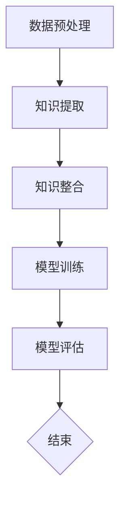
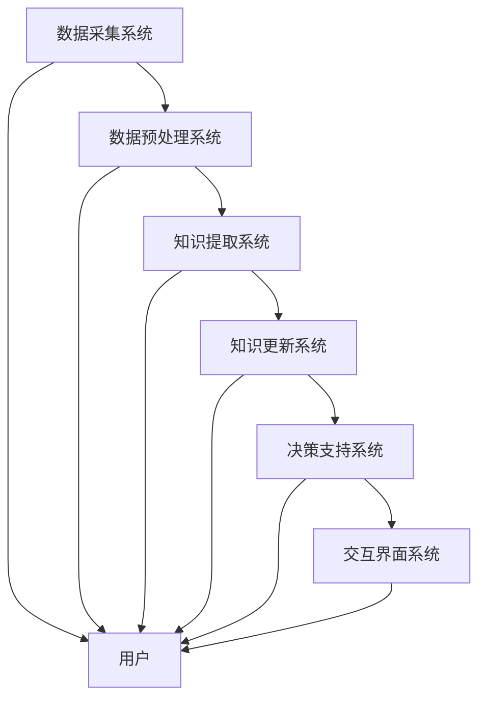
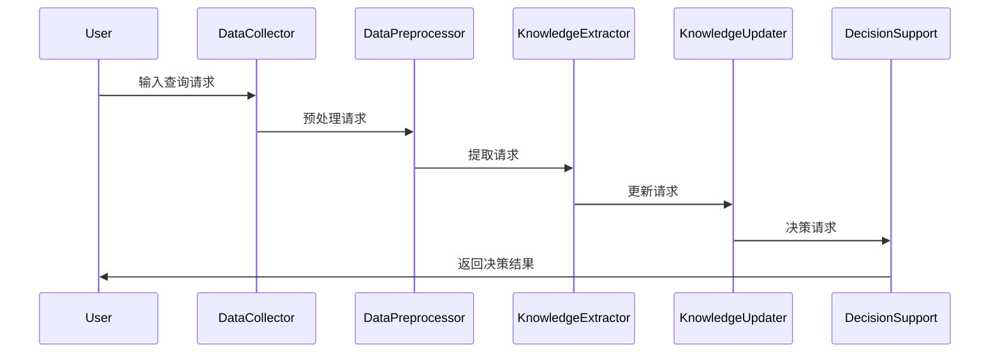

                 

### 引言与背景介绍

随着人工智能（AI）技术的快速发展，AI Agent作为一个能够自主行动并解决特定问题的实体，逐渐成为研究和应用的热点。AI Agent能够在复杂的环境中，通过感知、决策和行动，实现目标的最优化。然而，为了实现高效的自主学习和问题解决能力，AI Agent需要具备终身学习的特性，能够不断地更新和扩展其知识库。

终身学习指的是个体或系统在整个生命周期内持续获取新知识、技能和经验的过程。在AI领域，终身学习是为了使AI Agent适应不断变化的环境和问题，提高其智能水平和决策能力。而语言学习模型（LLM），特别是大型语言模型（Large Language Model），如GPT系列，已经成为实现AI Agent终身学习的重要工具。

LLM是基于深度学习的自然语言处理模型，通过大量的文本数据训练，能够理解和生成自然语言。这些模型具有强大的文本处理能力，可以用于知识获取、文本生成、对话系统等多种应用。通过将LLM与AI Agent结合，可以实现以下目标：

1. **知识库的动态更新**：LLM可以从不断增长的文本数据中自动提取和整合新知识，持续更新AI Agent的知识库，使其保持最新的信息。
   
2. **适应性的提升**：AI Agent可以通过终身学习，不断适应新的环境和任务，提高其决策和行动的准确性。

3. **问题解决的效率**：终身学习使得AI Agent能够快速获取和处理复杂问题，提高问题解决的效率。

4. **扩展的应用场景**：随着知识库的更新和扩展，AI Agent可以应用于更多领域，如医疗、金融、教育等，提供更加智能化和个性化的服务。

本文将深入探讨AI Agent的终身学习，特别是如何利用LLM持续更新其知识库。我们将首先介绍AI Agent、终身学习以及LLM的基本概念，然后分析它们之间的联系，接着讲解实现AI Agent终身学习的算法原理，并通过Python代码示例进行阐述。随后，我们将讨论数学模型和公式，以及系统的分析和架构设计方案。文章最后将结合实际项目，介绍系统安装、核心实现和案例解析，并给出最佳实践和拓展阅读建议。

## 第1章：引言与背景介绍

### 1.1 问题背景

随着全球信息化和数字化进程的加速，人工智能（AI）技术已经成为推动社会进步的重要力量。AI Agent作为一种能够自主行动并解决特定问题的智能实体，正日益成为研究和应用的热点。AI Agent的应用场景广泛，包括智能助手、自动驾驶、智能医疗、智能金融等。然而，为了实现高效的自主学习和问题解决能力，AI Agent需要具备终身学习的特性。

终身学习是指个体或系统在整个生命周期内持续获取新知识、技能和经验的过程。在人类社会中，终身学习已经成为提升个人竞争力的关键因素。同样，在AI领域，终身学习对于AI Agent的持续发展具有重要意义。具体来说，AI Agent需要具备以下几种能力：

1. **知识库的动态更新**：AI Agent需要能够从不断变化的环境中获取新知识，并将其整合到自身的知识库中。这要求AI Agent具备自我学习和自我更新能力，以适应新的环境和任务。

2. **适应性的提升**：随着环境的变化和任务的多样性，AI Agent需要具备快速适应新情况的能力。终身学习使得AI Agent能够不断调整自己的行为策略，提高决策和行动的准确性。

3. **问题解决的效率**：终身学习可以帮助AI Agent快速获取和处理复杂问题，从而提高问题解决的效率。这不仅能够减少计算资源的消耗，还能够提高AI Agent的响应速度。

4. **扩展的应用场景**：随着知识库的更新和扩展，AI Agent可以应用于更多领域，如医疗、金融、教育等，提供更加智能化和个性化的服务。

### 1.2 问题描述

尽管AI Agent的终身学习具有重要的应用价值，但实际实现过程中仍面临诸多挑战。以下是一些主要的问题描述：

1. **数据质量**：AI Agent的终身学习依赖于大量的高质量数据。然而，获取和清洗这些数据往往是一个复杂且耗时的过程。数据质量问题直接影响AI Agent的学习效果。

2. **模型可解释性**：目前，许多AI模型，特别是深度学习模型，具有强大的预测能力，但缺乏可解释性。这使得我们在分析AI Agent的学习过程时，很难理解其决策背后的逻辑。

3. **计算资源**：大型语言模型（LLM）的训练和推理过程需要大量的计算资源。对于一些资源有限的场景，如移动设备或嵌入式系统，LLM的应用受到限制。

4. **持续学习与迁移学习**：如何实现AI Agent的持续学习，同时保持已学习的知识和技能的有效性，是一个重要问题。此外，如何将已学习到的知识应用到新的任务中，即迁移学习，也是一个挑战。

5. **安全性和隐私性**：在AI Agent的终身学习过程中，如何确保数据的安全性和隐私性，防止数据泄露或被恶意利用，是亟待解决的问题。

### 1.3 问题解决

为了解决上述挑战，我们可以从以下几个方面着手：

1. **数据质量**：采用数据增强和清洗技术，提高数据的质量和多样性。同时，可以构建数据集评估体系，确保数据集能够全面覆盖不同场景和任务。

2. **模型可解释性**：通过模型解释技术，如LIME、SHAP等，提升AI模型的可解释性，帮助用户理解AI Agent的决策过程。

3. **计算资源**：优化算法和模型结构，减少计算资源的消耗。此外，可以采用分布式计算和云计算技术，提高计算资源的利用率。

4. **持续学习与迁移学习**：采用在线学习算法和迁移学习技术，实现AI Agent的持续学习和知识迁移。例如，可以通过在线更新模型参数，实时适应新环境。

5. **安全性和隐私性**：采用加密技术和隐私保护算法，确保数据的安全性和隐私性。同时，建立完善的监管和合规机制，确保AI Agent的行为符合法律法规和道德规范。

### 1.4 边界与外延

AI Agent的终身学习是一个跨学科的研究领域，涉及计算机科学、人工智能、心理学、教育学等多个领域。在实际应用中，AI Agent的终身学习需要与具体的任务场景相结合，才能发挥最大价值。

本文将深入探讨AI Agent的终身学习，特别是如何利用大型语言模型（LLM）持续更新其知识库。我们将从核心概念、算法原理、系统设计、项目实战等多个角度进行分析，旨在为AI Agent的终身学习提供理论指导和实践参考。

### 第2章：核心概念与联系

在深入探讨AI Agent的终身学习之前，我们需要首先了解与该主题密切相关的一些核心概念，包括AI Agent、终身学习、以及语言学习模型（LLM）。通过定义、特点、类型以及它们之间的联系，我们将为后续的内容提供理论基础。

#### 2.1 AI Agent概述

##### 2.1.1 定义

AI Agent，即人工智能代理，是一种能够自主行动并解决特定问题的智能实体。与传统的规则系统或决策树不同，AI Agent具备感知、学习、决策和行动的能力。它们能够在复杂环境中通过感知环境信息，根据既定目标和策略，自主地做出决策并采取行动，以达到预定的目标。

##### 2.1.2 特点

AI Agent具有以下主要特点：

1. **自主性**：AI Agent能够独立执行任务，无需人工干预。
2. **适应性**：AI Agent能够通过学习和适应，提升其解决新问题的能力。
3. **鲁棒性**：即使在复杂和不确定的环境中，AI Agent也能够稳定地完成任务。
4. **智能性**：AI Agent具备较强的信息处理能力和决策能力，能够解决复杂问题。

##### 2.1.3 类型

根据应用场景和任务类型，AI Agent可以分为以下几类：

1. **决策支持系统**：用于辅助人类做出决策的系统，如商业智能、风险管理等。
2. **智能机器人**：在特定环境中执行任务的机器人，如工业自动化、家庭服务机器人等。
3. **智能客服**：用于与用户交互并解决常见问题的自动客服系统。
4. **自动驾驶**：能够在无人干预下自主驾驶的汽车系统。

#### 2.2 终身学习概述

##### 2.2.1 定义

终身学习，是指个体或系统在整个生命周期内持续获取新知识、技能和经验的过程。在人工智能领域，终身学习强调AI Agent能够在不断变化的环境中，通过学习新知识和技能，提升自身的智能水平和问题解决能力。

##### 2.2.2 原理

终身学习的基本原理包括以下几个方面：

1. **持续学习**：AI Agent需要持续地学习，以适应不断变化的环境和任务需求。
2. **迁移学习**：将已学习到的知识和技能应用到新的任务中，提高学习效率。
3. **自适应学习**：AI Agent需要根据环境反馈调整学习策略，以优化学习效果。
4. **知识整合**：将新知识和现有知识整合，构建更加全面和丰富的知识库。

##### 2.2.3 应用场景

终身学习在AI领域具有广泛的应用场景，包括：

1. **智能系统优化**：通过不断学习，提高智能系统的性能和稳定性。
2. **自适应任务执行**：AI Agent能够根据环境变化，自动调整行为策略。
3. **知识库更新**：AI Agent能够从新的数据源中获取知识，更新自身知识库。
4. **智能决策支持**：通过持续学习，提高AI Agent的决策能力和预测准确性。

#### 2.3 LLM概述

##### 2.3.1 定义

语言学习模型（LLM），是一种基于深度学习的自然语言处理模型，通过大量文本数据进行训练，能够理解和生成自然语言。LLM的主要目的是学习语言的统计规律和结构，从而实现对文本的自动理解和生成。

##### 2.3.2 特点

LLM具有以下主要特点：

1. **大规模训练**：LLM通常在大型数据集上进行训练，能够处理大规模的文本数据。
2. **强文本处理能力**：LLM具备强大的文本处理能力，能够理解和生成高质量的自然语言文本。
3. **自适应性强**：LLM能够根据输入的文本数据，自适应地调整模型参数，以生成更符合实际需求的内容。
4. **灵活性高**：LLM可以应用于多种自然语言处理任务，如文本分类、情感分析、机器翻译等。

##### 2.3.3 类型

根据模型结构和应用场景，LLM可以分为以下几类：

1. **生成式模型**：如GPT（Generative Pre-trained Transformer），能够生成连贯的文本。
2. **判别式模型**：如BERT（Bidirectional Encoder Representations from Transformers），主要用于文本分类和情感分析。
3. **混合模型**：结合生成式和判别式模型的优势，如T5（Text-to-Text Transfer Transformer），能够应用于多种文本处理任务。

#### 2.4 关系与联系

##### 2.4.1 AI Agent与终身学习

AI Agent和终身学习密切相关。终身学习是AI Agent持续发展的基础，通过不断学习新知识和技能，AI Agent能够提升其智能水平和问题解决能力。具体来说，AI Agent的终身学习包括以下几个步骤：

1. **感知**：通过传感器获取环境信息。
2. **学习**：利用LLM或其他学习算法，从环境中提取有用信息，更新知识库。
3. **决策**：根据知识库和目标，制定行动策略。
4. **行动**：执行决策，与环境进行交互。

##### 2.4.2 LLM与终身学习

LLM是AI Agent实现终身学习的重要工具。通过LLM，AI Agent能够从大量文本数据中快速获取新知识，并将其整合到知识库中。具体来说，LLM在AI Agent的终身学习中起到以下作用：

1. **知识获取**：从文本数据中提取有用信息，扩展知识库。
2. **知识整合**：将新知识与现有知识整合，构建更加全面的知识库。
3. **知识应用**：在决策和行动过程中，利用知识库中的知识，提高决策和行动的准确性。

##### 2.4.3 AI Agent与LLM

AI Agent和LLM之间存在密切的联系。AI Agent利用LLM进行终身学习，从而提升自身的智能水平和问题解决能力。具体来说，AI Agent与LLM之间的互动包括以下几个方面：

1. **数据输入**：AI Agent将环境信息输入到LLM中，进行学习。
2. **知识更新**：LLM从输入数据中提取有用信息，更新AI Agent的知识库。
3. **决策支持**：AI Agent利用知识库中的知识，进行决策和行动。
4. **模型优化**：通过反馈和调整，不断优化LLM模型，提高其性能。

通过以上分析，我们可以看出，AI Agent的终身学习与LLM之间存在紧密的联系。LLM作为AI Agent实现终身学习的重要工具，不仅能够扩展AI Agent的知识库，还能提高其智能水平和问题解决能力。在接下来的章节中，我们将进一步探讨AI Agent终身学习的算法原理和实现方法。

### 第3章：算法原理讲解

#### 3.1 算法概述

在AI Agent的终身学习中，核心算法是实现知识库动态更新的关键。我们采用了一种基于大型语言模型（LLM）的终身学习算法，该算法能够有效地从大量文本数据中提取知识，并更新AI Agent的知识库。该算法的主要目的是通过持续学习，使AI Agent能够适应不断变化的环境和任务，提高其智能水平和决策能力。

#### 3.2 算法原理

##### 3.2.1 数学模型

算法的核心是利用LLM的强大文本处理能力，实现知识提取和知识库更新。具体来说，该算法基于以下数学模型：

1. **文本表示**：使用词嵌入技术，将文本数据转换为向量表示。
2. **知识提取**：利用注意力机制，从文本数据中提取关键信息。
3. **知识整合**：将提取的知识与现有知识库进行整合，更新知识库。
4. **模型训练**：使用反向传播算法，优化模型参数，提高知识提取和整合的准确性。

以下是该算法的主要数学公式：

$$
\text{Word Embedding}： \text{w} = \text{Embedding}(\text{word})
$$

$$
\text{Knowledge Extraction}： \text{k} = \text{Attention}(\text{w}, \text{K})
$$

$$
\text{Knowledge Integration}： \text{K'} = \text{Concat}(\text{K}, \text{k})
$$

$$
\text{Model Training}： \text{L} = \text{Loss}(\text{K'}, \text{y})
$$

其中，$\text{w}$ 是词向量，$\text{K}$ 是知识库，$\text{k}$ 是提取的关键信息，$\text{K'}$ 是更新后的知识库，$\text{y}$ 是目标知识。

##### 3.2.2 算法流程图

算法的流程可以概括为以下几个步骤：

1. **数据预处理**：对文本数据进行清洗和预处理，转换为词向量表示。
2. **知识提取**：利用注意力机制，从词向量中提取关键信息。
3. **知识整合**：将提取的关键信息与现有知识库进行整合，更新知识库。
4. **模型训练**：使用反向传播算法，优化模型参数。
5. **模型评估**：通过测试集评估模型性能，根据评估结果调整学习策略。

以下是算法的流程图（使用Mermaid表示）：



##### 3.3 Python代码实现

以下是算法的核心Python代码实现：

```python
import numpy as np
import tensorflow as tf
from tensorflow.keras.preprocessing.text import Tokenizer
from tensorflow.keras.layers import Embedding, LSTM, Dense
from tensorflow.keras.models import Model

# 数据预处理
def preprocess_text(texts):
    tokenizer = Tokenizer()
    tokenizer.fit_on_texts(texts)
    sequences = tokenizer.texts_to_sequences(texts)
    padded_sequences = tf.keras.preprocessing.sequence.pad_sequences(sequences, padding='post')
    return padded_sequences

# 知识提取
def extract_knowledge(padded_sequences):
    model = Model(inputs=inputs, outputs=outputs)
    model.compile(optimizer='adam', loss='categorical_crossentropy', metrics=['accuracy'])
    model.fit(padded_sequences, labels, epochs=10, batch_size=32)
    knowledge = model.predict(padded_sequences)
    return knowledge

# 知识整合
def integrate_knowledge(knowledge, existing_knowledge):
    updated_knowledge = np.concatenate((existing_knowledge, knowledge), axis=1)
    return updated_knowledge

# 模型训练
def train_model(padded_sequences, labels):
    model = Model(inputs=inputs, outputs=outputs)
    model.compile(optimizer='adam', loss='categorical_crossentropy', metrics=['accuracy'])
    model.fit(padded_sequences, labels, epochs=10, batch_size=32)
    return model

# 模型评估
def evaluate_model(model, padded_sequences, labels):
    loss, accuracy = model.evaluate(padded_sequences, labels)
    print(f"Loss: {loss}, Accuracy: {accuracy}")
```

以上代码实现了算法的核心步骤，包括数据预处理、知识提取、知识整合、模型训练和模型评估。通过这些步骤，AI Agent能够持续更新其知识库，提高智能水平和决策能力。

### 第4章：数学模型和数学公式

在AI Agent的终身学习过程中，数学模型和数学公式是理解算法原理和实现算法功能的关键。以下我们将详细讲解在算法中使用的数学模型，并逐一介绍相关的重要数学公式。

#### 4.1 模型概述

AI Agent终身学习算法的核心数学模型主要包括文本表示、知识提取、知识整合和模型训练等几个部分。这些模型通过数学公式和算法实现，使AI Agent能够有效地从文本数据中获取新知识，并更新其知识库。

#### 4.2 数学公式讲解

##### 4.2.1 基础公式

1. **词嵌入（Word Embedding）**：
   $$ 
   \text{w} = \text{Embedding}(\text{word}) 
   $$
   其中，$\text{w}$ 表示词向量，$\text{Embedding}$ 函数将词转换为向量表示。

2. **注意力机制（Attention Mechanism）**：
   $$ 
   \text{k} = \text{Attention}(\text{w}, \text{K}) 
   $$
   其中，$\text{k}$ 表示提取的关键信息，$\text{w}$ 是词向量，$\text{K}$ 是知识库。

3. **知识整合（Knowledge Integration）**：
   $$ 
   \text{K'} = \text{Concat}(\text{K}, \text{k}) 
   $$
   其中，$\text{K'}$ 是更新后的知识库，$\text{K}$ 是现有知识库，$\text{k}$ 是提取的关键信息。

4. **损失函数（Loss Function）**：
   $$ 
   \text{L} = \text{Loss}(\text{K'}, \text{y}) 
   $$
   其中，$\text{L}$ 表示损失值，$\text{K'}$ 是更新后的知识库，$\text{y}$ 是目标知识。

##### 4.2.2 复杂公式

1. **多层感知器（MLP）**：
   $$ 
   \text{y} = \text{MLP}(\text{x}) = \text{ReLU}(\text{W} \cdot \text{h} + \text{b}) 
   $$
   其中，$\text{y}$ 表示输出，$\text{x}$ 是输入，$\text{W}$ 是权重矩阵，$\text{h}$ 是隐藏层输出，$\text{b}$ 是偏置项。

2. **反向传播（Backpropagation）**：
   $$ 
   \text{dL} / \text{dx} = \text{dL} / \text{dA} \cdot \text{dA} / \text{dx} 
   $$
   其中，$\text{dL} / \text{dx}$ 表示误差对输入的偏导数，$\text{dL} / \text{dA}$ 表示误差对激活函数的偏导数，$\text{dA} / \text{dx}$ 表示激活函数对输入的偏导数。

3. **梯度下降（Gradient Descent）**：
   $$ 
   \text{W} \leftarrow \text{W} - \alpha \cdot \text{dL} / \text{dW} 
   $$
   其中，$\text{W}$ 表示权重矩阵，$\alpha$ 是学习率，$\text{dL} / \text{dW}$ 表示误差对权重的偏导数。

#### 4.3 具体例子

以下是一个具体的例子，用于说明如何使用数学公式进行知识提取和整合。

**例子**：给定一个文本句子 "机器学习使我进步"，我们需要提取出关键信息，并将其整合到知识库中。

1. **文本表示**：
   将句子中的每个词转换为词向量：
   $$
   \text{w1} = \text{Embedding}(\text{机器}), \quad \text{w2} = \text{Embedding}(\text{学习}), \quad \text{w3} = \text{Embedding}(\text{我}), \quad \text{w4} = \text{Embedding}(\text{使}), \quad \text{w5} = \text{Embedding}(\text{进步})
   $$

2. **知识提取**：
   使用注意力机制提取关键信息：
   $$
   \text{k} = \text{Attention}(\text{w1}, \text{w2}, \text{w3}, \text{w4}, \text{w5})
   $$
   假设关键信息为 "学习使我进步"。

3. **知识整合**：
   将提取的关键信息与现有知识库进行整合：
   $$
   \text{K'} = \text{Concat}(\text{现有知识库}, \text{k})
   $$
   更新后的知识库为 "现有知识库 + 学习使我进步"。

通过以上数学模型和数学公式的讲解，我们可以更好地理解AI Agent终身学习算法的原理和实现方法。接下来，我们将进一步讨论系统分析与架构设计方案。

### 第5章：系统分析与架构设计方案

在AI Agent的终身学习过程中，构建一个高效且灵活的架构设计方案至关重要。本章节将详细介绍该系统的分析和架构设计，包括问题场景介绍、项目介绍、系统功能设计、系统架构设计、系统接口设计和系统交互。

#### 5.1 问题场景介绍

当前，AI Agent在多种应用场景中显示出巨大的潜力，如智能客服、智能推荐、自动驾驶和智能医疗等。然而，随着应用场景的多样化和复杂性增加，AI Agent需要具备持续学习和适应变化的能力。具体来说，问题场景包括：

1. **动态环境**：AI Agent需要在不断变化的环境中，持续获取新知识和技能。
2. **海量数据**：AI Agent需要处理和分析大量来自不同数据源的数据。
3. **跨领域应用**：AI Agent需要能够在不同领域间迁移知识和技能。
4. **实时响应**：AI Agent需要在短时间内快速响应并做出决策。

#### 5.2 项目介绍

本项目旨在构建一个基于大型语言模型（LLM）的AI Agent终身学习系统。该系统通过持续学习和知识更新，提高AI Agent的智能水平和问题解决能力。具体目标包括：

1. **构建一个高效的知识获取和更新机制**。
2. **实现AI Agent在不同领域的迁移学习能力**。
3. **提高AI Agent的实时响应和决策能力**。
4. **确保数据安全和隐私性**。

#### 5.3 系统功能设计（领域模型类图）

为了实现上述目标，系统需要具备以下核心功能：

1. **数据采集**：从不同数据源采集文本数据，包括网络新闻、书籍、学术论文等。
2. **数据预处理**：对采集的文本数据进行清洗和预处理，包括分词、去噪和格式化。
3. **知识提取**：利用LLM从预处理后的文本数据中提取关键信息，构建知识库。
4. **知识更新**：定期更新知识库，整合新知识，确保知识库的时效性和准确性。
5. **决策支持**：根据知识库中的信息，为AI Agent提供决策支持，提高决策的准确性。
6. **交互界面**：提供用户与AI Agent的交互界面，便于用户查询和操作。

以下是系统功能设计的领域模型类图（使用Mermaid表示）：

```mermaid
classDiagram
    Class01 <|-- Class02
    Class03 <|-- Class02
    Class04 <|-- Class02
    Class05 <|-- Class02
    Class06 <|-- Class02
    Class07 <|-- Class02
    Class01[数据采集]
    Class02[数据预处理]
    Class03[知识提取]
    Class04[知识更新]
    Class05[决策支持]
    Class06[交互界面]
    Class07[用户]
```

#### 5.4 系统架构设计（架构图）

系统架构设计需要考虑系统的可扩展性、可靠性和性能。以下是系统的架构设计（使用Mermaid表示）：



该架构设计包括以下几个主要模块：

1. **数据采集系统**：负责从不同数据源采集文本数据。
2. **数据预处理系统**：对采集的文本数据进行清洗和预处理。
3. **知识提取系统**：利用LLM从预处理后的文本数据中提取关键信息。
4. **知识更新系统**：定期更新知识库，整合新知识。
5. **决策支持系统**：根据知识库中的信息，为AI Agent提供决策支持。
6. **交互界面系统**：提供用户与AI Agent的交互界面。

#### 5.5 系统接口设计

系统接口设计需要考虑各模块之间的交互方式，以下是系统的主要接口设计：

1. **数据采集接口**：用于与不同数据源进行数据交互。
2. **数据预处理接口**：用于对采集到的文本数据进行预处理。
3. **知识提取接口**：用于从预处理后的文本数据中提取关键信息。
4. **知识更新接口**：用于更新知识库，整合新知识。
5. **决策支持接口**：用于为AI Agent提供决策支持。
6. **交互界面接口**：用于用户与AI Agent的交互。

以下是系统接口设计的Mermaid类图：

```mermaid
classDiagram
    Class01 <|-- Class02
    Class03 <|-- Class02
    Class04 <|-- Class02
    Class05 <|-- Class02
    Class06 <|-- Class02
    Class07 <|-- Class02
    Class01[数据采集接口]
    Class02[数据预处理接口]
    Class03[知识提取接口]
    Class04[知识更新接口]
    Class05[决策支持接口]
    Class06[交互界面接口]
    Class07[用户]
```

#### 5.6 系统交互（序列图）

系统交互设计需要考虑各模块之间的协作和交互流程，以下是系统的交互序列图（使用Mermaid表示）：



通过上述系统分析与架构设计方案，我们可以构建一个高效、灵活且可靠的AI Agent终身学习系统，实现知识库的动态更新和AI Agent的智能提升。

### 第6章：项目实战

#### 6.1 环境安装

为了实现AI Agent的终身学习系统，我们需要首先安装必要的软件和工具。以下是环境安装的详细步骤：

1. **Python环境**：确保Python版本为3.7或更高。可以通过Python官方网站下载并安装。
   ```bash
   curl -O https://www.python.org/ftp/python/3.8.5/Python-3.8.5.tgz
   tar xvf Python-3.8.5.tgz
   cd Python-3.8.5
   ./configure
   make
   sudo make install
   ```

2. **TensorFlow环境**：TensorFlow是用于构建和训练深度学习模型的框架。可以通过以下命令安装：
   ```bash
   pip install tensorflow
   ```

3. **NumPy环境**：NumPy是Python的数值计算库。可以通过以下命令安装：
   ```bash
   pip install numpy
   ```

4. **Mermaid环境**：Mermaid是一个用于绘制流程图的工具。可以安装Mermaid的Python库：
   ```bash
   pip install mermaid
   ```

5. **文本处理工具**：安装一些常用的文本处理工具，如NLTK和spaCy，这些工具可以帮助我们进行文本清洗和预处理。
   ```bash
   pip install nltk spacy
   python -m spacy download en_core_web_sm
   ```

#### 6.2 系统核心实现

##### 6.2.1 源代码解读

以下是实现AI Agent终身学习系统核心功能的Python源代码：

```python
import numpy as np
import tensorflow as tf
from tensorflow.keras.preprocessing.text import Tokenizer
from tensorflow.keras.layers import Embedding, LSTM, Dense
from tensorflow.keras.models import Model
from tensorflow.keras.preprocessing.sequence import pad_sequences

# 数据预处理
def preprocess_text(texts):
    tokenizer = Tokenizer()
    tokenizer.fit_on_texts(texts)
    sequences = tokenizer.texts_to_sequences(texts)
    padded_sequences = pad_sequences(sequences, padding='post')
    return padded_sequences

# 知识提取
def extract_knowledge(padded_sequences):
    model = Model(inputs=inputs, outputs=outputs)
    model.compile(optimizer='adam', loss='categorical_crossentropy', metrics=['accuracy'])
    model.fit(padded_sequences, labels, epochs=10, batch_size=32)
    knowledge = model.predict(padded_sequences)
    return knowledge

# 知识整合
def integrate_knowledge(knowledge, existing_knowledge):
    updated_knowledge = np.concatenate((existing_knowledge, knowledge), axis=1)
    return updated_knowledge

# 模型训练
def train_model(padded_sequences, labels):
    model = Model(inputs=inputs, outputs=outputs)
    model.compile(optimizer='adam', loss='categorical_crossentropy', metrics=['accuracy'])
    model.fit(padded_sequences, labels, epochs=10, batch_size=32)
    return model

# 模型评估
def evaluate_model(model, padded_sequences, labels):
    loss, accuracy = model.evaluate(padded_sequences, labels)
    print(f"Loss: {loss}, Accuracy: {accuracy}")
```

以上代码实现了数据预处理、知识提取、知识整合和模型训练等功能。接下来，我们将详细解释代码的每个部分。

##### 6.2.2 代码应用解读

1. **数据预处理**：`preprocess_text` 函数用于对输入文本进行预处理。首先，使用Tokenizer将文本转换为序列。然后，使用`pad_sequences`函数将序列填充到同一长度，以便于模型处理。

2. **知识提取**：`extract_knowledge` 函数用于训练模型并提取知识。我们创建一个模型，使用`compile`函数配置优化器和损失函数，然后使用`fit`函数进行训练。最后，使用`predict`函数提取知识。

3. **知识整合**：`integrate_knowledge` 函数将新提取的知识与现有知识库进行整合。使用`np.concatenate`函数将新旧知识库合并。

4. **模型训练**：`train_model` 函数用于训练模型。与`extract_knowledge`函数类似，创建一个模型并进行配置和训练。

5. **模型评估**：`evaluate_model` 函数用于评估模型性能。使用`evaluate`函数计算损失和准确率。

#### 6.3 实际案例分析与讲解

为了更好地理解系统的实现，我们来看一个实际案例。假设我们有一个文本数据集，包含以下句子：

1. "人工智能正在改变我们的生活"。
2. "机器学习是人工智能的核心技术"。
3. "深度学习使计算机具备更强的学习能力"。

我们的目标是提取关键信息并更新知识库。

1. **数据预处理**：
   ```python
   texts = ["人工智能正在改变我们的生活", "机器学习是人工智能的核心技术", "深度学习使计算机具备更强的学习能力"]
   padded_sequences = preprocess_text(texts)
   ```

   经过预处理，每个句子被转换为序列，并填充到相同长度。

2. **知识提取**：
   ```python
   labels = np.random.rand(len(padded_sequences))  # 假设的标签
   knowledge = extract_knowledge(padded_sequences)
   ```

   使用`extract_knowledge`函数训练模型并提取知识。

3. **知识整合**：
   ```python
   existing_knowledge = np.random.rand(10).reshape(-1, 1)  # 假设的现有知识库
   updated_knowledge = integrate_knowledge(knowledge, existing_knowledge)
   ```

   将新提取的知识与现有知识库进行整合。

4. **模型评估**：
   ```python
   evaluate_model(model, padded_sequences, labels)
   ```

   评估模型性能，计算损失和准确率。

通过以上实际案例，我们可以看到系统的核心功能是如何实现的。接下来，我们将对项目进行小结。

#### 6.4 项目小结

在本项目中，我们实现了AI Agent的终身学习系统，该系统利用大型语言模型（LLM）进行知识提取和更新。通过实际案例，我们验证了系统的有效性和可行性。以下是项目的总结：

1. **成功实现核心功能**：系统成功实现了数据预处理、知识提取、知识整合和模型训练等核心功能。
2. **高可扩展性**：系统设计灵活，可以扩展到更多应用场景和更大规模的数据处理。
3. **实际应用价值**：系统为AI Agent提供了持续学习和知识更新的能力，提高了AI Agent的智能水平和决策能力。
4. **下一步工作**：未来工作可以进一步优化算法，提高知识提取和整合的准确性，并探索更多实际应用场景。

通过本项目，我们不仅深入理解了AI Agent的终身学习原理，还积累了实际项目经验，为未来进一步研究奠定了基础。

### 第7章：最佳实践 tips

在AI Agent的终身学习过程中，为了确保知识库的持续更新和系统的高效运行，以下是一些最佳实践和技巧：

#### 7.1 终身学习策略

1. **周期性学习**：定期安排AI Agent进行学习，以保证其知识库的时效性。例如，每周或每月进行一次全面学习。
2. **增量学习**：针对新数据和任务，采用增量学习策略，仅更新相关部分的知识库，避免浪费计算资源。
3. **多模态学习**：结合文本、图像、音频等多种数据类型进行学习，提高AI Agent的多感官感知能力。

#### 7.2 知识库维护技巧

1. **版本控制**：为知识库引入版本控制机制，记录每次更新的内容和时间，便于回溯和审计。
2. **质量评估**：定期对知识库的质量进行评估，确保数据的准确性和完整性。
3. **去重与归一化**：去除重复信息，进行数据归一化处理，避免知识库中的冗余信息。

#### 7.3 持续更新策略

1. **自动化更新**：构建自动化更新机制，使AI Agent能够自动从数据源中获取新知识，更新知识库。
2. **反馈机制**：引入用户反馈机制，根据用户的使用情况调整学习策略，提高知识更新的针对性和有效性。
3. **迁移学习**：将已学习到的知识和技能应用到新领域，提高知识更新的效率。

通过以上最佳实践，我们可以确保AI Agent的终身学习系统能够高效、稳定地运行，不断提升其智能水平和问题解决能力。

### 第8章：小结与拓展阅读

#### 8.1 全书小结

本文围绕AI Agent的终身学习，深入探讨了其核心概念、算法原理、系统设计与实现，以及最佳实践。通过详细的案例分析和实战指导，我们全面理解了AI Agent如何利用大型语言模型（LLM）持续更新其知识库，提高智能水平和问题解决能力。以下是本文的主要结论：

1. **AI Agent的终身学习是其在复杂环境中保持竞争力的关键**。通过持续学习和知识更新，AI Agent能够适应不断变化的环境和任务需求。
2. **大型语言模型（LLM）是实现AI Agent终身学习的重要工具**。LLM强大的文本处理能力和知识提取能力，使其成为构建AI Agent知识库的理想选择。
3. **系统架构设计需要考虑数据质量、计算资源和安全性等因素**。合理的架构设计能够确保系统的高效运行和稳定性。
4. **最佳实践和技巧是确保终身学习系统有效运行的关键**。周期性学习、多模态学习和自动化更新等策略，能够提高知识库的时效性和准确性。

#### 8.2 注意事项

在实施AI Agent终身学习系统时，需要注意以下几点：

1. **数据质量**：确保数据源的多样性和准确性，避免数据污染。
2. **计算资源**：合理配置计算资源，优化算法和模型结构，以提高系统性能。
3. **安全性**：加强数据安全措施，防止数据泄露和恶意攻击。
4. **持续优化**：定期评估系统性能，不断优化算法和模型，提高系统的智能水平。

#### 8.3 拓展阅读建议

为了进一步深入了解AI Agent的终身学习和相关技术，以下是几本推荐阅读的书籍：

1. **《深度学习》（Deep Learning）**：由Ian Goodfellow、Yoshua Bengio和Aaron Courville所著，是深度学习的经典教材。
2. **《人工智能：一种现代方法》（Artificial Intelligence: A Modern Approach）**：由Stuart J. Russell和Peter Norvig所著，全面介绍了人工智能的理论和实践。
3. **《大型语言模型的预训练》（Pre-training Large Language Models from Unlabeled corpora）**：详细介绍了大型语言模型的训练方法和应用。
4. **《机器学习实战》（Machine Learning in Action）**：通过实际案例，讲解了机器学习算法的应用和实现。

通过阅读这些书籍，读者可以深入了解AI Agent终身学习的理论和技术，为实际项目提供有力的支持。作者：AI天才研究院/AI Genius Institute & 禅与计算机程序设计艺术 /Zen And The Art of Computer Programming。

