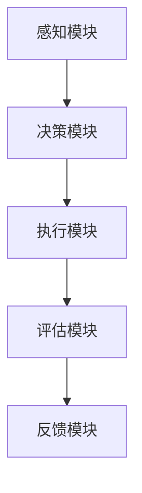
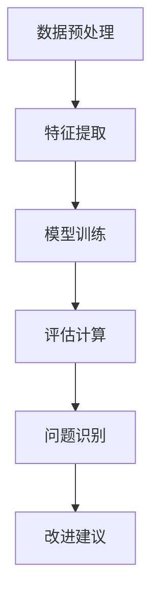
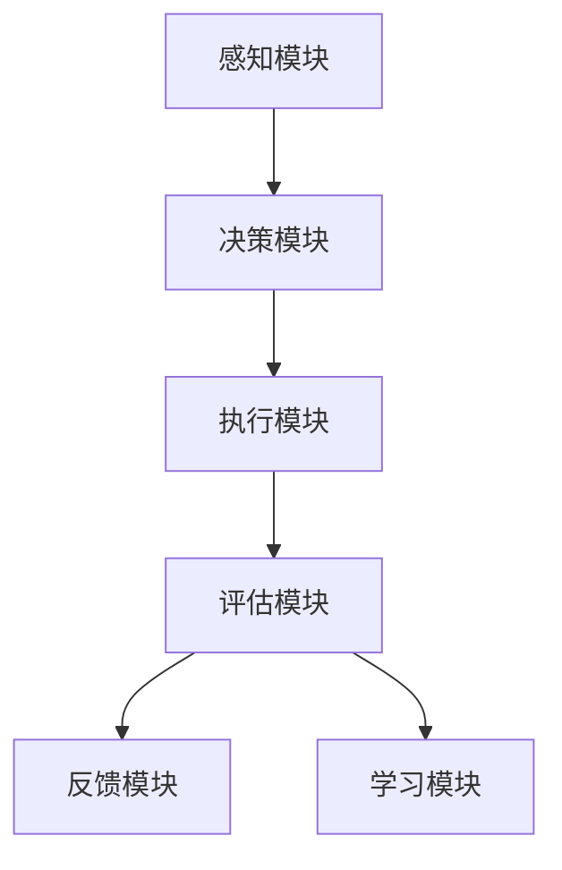
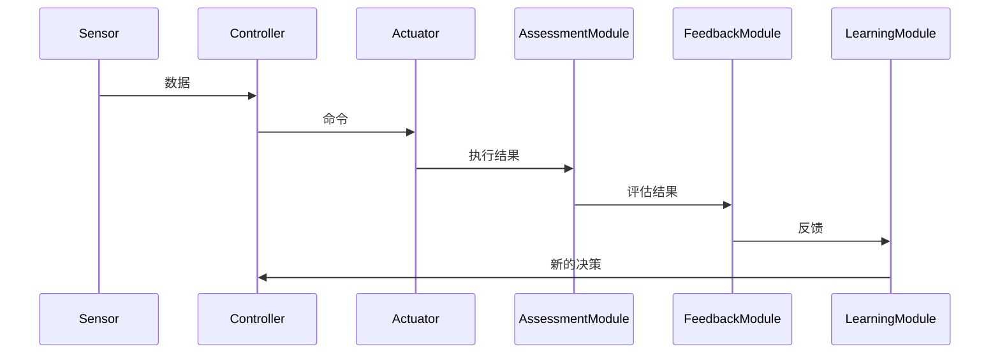

                 


### AI Agent的自我评估机制：持续改进性能

> 关键词：AI Agent，自我评估机制，性能改进，算法优化，系统架构设计，Python代码，Mermaid流程图，数学模型

> 摘要：本文将深入探讨AI Agent的自我评估机制，探讨如何通过持续改进性能来提升AI Agent的智能水平和应用效果。文章首先介绍AI Agent的基础知识，然后详细讲解自我评估机制的基本原理、评估指标及其计算方法，接着分析性能改进的策略，最后通过Python代码和Mermaid流程图展示一个具体的自我评估机制实现，并通过项目实战和最佳实践分享实际应用中的经验。

## 第一部分：AI Agent的自我评估机制概述

### 1.1 问题背景与概述

随着人工智能技术的快速发展，AI Agent作为智能体的一种形式，已经被广泛应用于各种场景中，如自动驾驶、智能客服、推荐系统等。然而，AI Agent的性能表现直接影响其应用效果，而自我评估机制是提升AI Agent性能的关键因素之一。

#### 1.1.1 AI Agent的自我评估需求

AI Agent需要定期对自己的行为和决策进行评估，以识别潜在的问题和改进方向。自我评估机制可以帮助AI Agent：

1. 识别错误的决策和行为。
2. 分析性能瓶颈和优化机会。
3. 持续学习和改进。

#### 1.1.2 自我评估机制的重要性

自我评估机制是AI Agent持续改进性能的基础，它具有以下重要性：

1. **提高AI Agent的鲁棒性**：通过自我评估，AI Agent可以识别和纠正错误的决策，从而提高其鲁棒性。
2. **优化性能**：自我评估可以帮助AI Agent识别和解决性能瓶颈，从而提高整体性能。
3. **自适应能力**：自我评估机制使得AI Agent能够根据环境变化和学习经验进行自适应调整。

#### 1.1.3 自我评估机制的挑战

尽管自我评估机制的重要性不言而喻，但其实施过程中面临着一系列挑战：

1. **评估指标的选取**：如何选择合适的评估指标是一个关键问题，不同的指标可能对AI Agent的性能评估产生不同的影响。
2. **评估的频率**：评估的频率需要平衡性能消耗和评估准确性，过高或过低的频率都可能带来负面影响。
3. **动态环境适应**：AI Agent在动态环境下的评估机制需要具备较强的适应性，以应对环境变化。

### 1.2 AI Agent的基础知识

在深入探讨自我评估机制之前，我们需要了解AI Agent的基础知识。

#### 1.2.1 AI Agent的定义与分类

AI Agent是指具备自主决策和行动能力的人工智能实体。根据不同的特征和功能，AI Agent可以分为以下几类：

1. **基于规则的Agent**：使用预定义的规则进行决策。
2. **基于模型的Agent**：使用机器学习模型进行决策。
3. **混合型Agent**：结合规则和模型进行决策。

#### 1.2.2 AI Agent的核心功能

AI Agent的核心功能包括感知、决策和执行。具体来说：

1. **感知**：AI Agent通过传感器获取环境信息。
2. **决策**：AI Agent基于感知信息进行决策，选择合适的行动。
3. **执行**：AI Agent执行决策，实现具体的行为。

#### 1.2.3 AI Agent的发展历程

AI Agent的发展历程可以追溯到人工智能的早期阶段。从最初的规则系统到现代的深度学习模型，AI Agent的技术和实现方式发生了巨大变化。近年来，随着硬件和算法的进步，AI Agent在复杂环境中的应用效果得到了显著提升。

### 1.3 自我评估机制的基本原理

自我评估机制是AI Agent实现持续改进性能的核心组成部分。下面我们将详细探讨自我评估机制的基本原理。

#### 1.3.1 自我评估机制的定义与目标

自我评估机制是指AI Agent通过定期评估自己的行为和决策，以识别问题和改进方向的过程。其目标是：

1. 识别错误的决策和行为。
2. 分析性能瓶颈和优化机会。
3. 持续学习和改进。

#### 1.3.2 自我评估机制的组成部分

自我评估机制通常由以下几个组成部分构成：

1. **评估指标**：用于衡量AI Agent性能的指标，如准确率、召回率、响应时间等。
2. **评估方法**：用于计算评估指标的方法，如平均值、标准差、回归分析等。
3. **反馈机制**：用于将评估结果反馈给AI Agent，以指导其改进。

#### 1.3.3 自我评估机制的工作流程

自我评估机制的工作流程通常包括以下几个步骤：

1. **数据收集**：收集AI Agent在过去一段时间内的行为和决策数据。
2. **评估计算**：计算评估指标，分析AI Agent的性能。
3. **问题识别**：识别AI Agent可能存在的问题，如决策错误、性能瓶颈等。
4. **改进建议**：根据评估结果提出改进建议，以优化AI Agent的性能。

### 1.4 自我评估机制的评估指标

评估指标是自我评估机制的核心组成部分，选择合适的评估指标对于准确评估AI Agent的性能至关重要。下面我们将详细探讨评估指标的类型、计算方法和优化策略。

#### 1.4.1 评估指标的类型与选择

评估指标可以分为以下几类：

1. **性能指标**：如准确率、召回率、F1分数等，用于衡量AI Agent在特定任务上的性能。
2. **效率指标**：如响应时间、能耗等，用于衡量AI Agent的执行效率。
3. **稳定性指标**：如方差、标准差等，用于衡量AI Agent在不同数据集上的稳定性。

选择评估指标时需要考虑以下几个因素：

1. **任务需求**：根据任务的特点选择合适的评估指标。
2. **数据可用性**：确保评估指标所需的数据可以方便地获取。
3. **评估目的**：根据评估的目标选择相应的评估指标。

#### 1.4.2 评估指标的计算方法

常见的评估指标计算方法包括：

1. **平均值**：计算评估指标的平均值，用于衡量AI Agent的整体性能。
2. **标准差**：计算评估指标的标准差，用于衡量AI Agent的性能波动。
3. **回归分析**：使用回归分析方法，分析评估指标与AI Agent性能之间的关系。

#### 1.4.3 评估指标的优化策略

为了提高自我评估机制的准确性，可以采取以下优化策略：

1. **数据预处理**：对收集到的数据进行分析和清洗，确保数据质量。
2. **指标融合**：将多个评估指标进行融合，提高评估的全面性和准确性。
3. **自适应调整**：根据AI Agent的性能表现，动态调整评估指标的权重。

### 1.5 本章小结与拓展阅读

本章介绍了AI Agent的自我评估机制，包括其重要性、基本原理、评估指标和优化策略。通过自我评估机制，AI Agent可以持续改进性能，提高应用效果。在下一章中，我们将通过Python代码和Mermaid流程图展示一个具体的自我评估机制实现。

## 第二部分：自我评估机制的核心概念与联系

### 2.1 核心概念原理

在深入探讨自我评估机制之前，我们需要了解其核心概念原理。自我评估机制主要包括以下几个核心概念：

1. **感知**：AI Agent通过传感器收集环境信息。
2. **决策**：AI Agent根据感知信息选择合适的行动。
3. **执行**：AI Agent执行决策，实现具体的行为。
4. **评估**：AI Agent评估自己的行为和决策，以识别问题和改进方向。
5. **反馈**：AI Agent根据评估结果进行改进，以优化性能。

#### 2.1.1 感知

感知是AI Agent获取环境信息的过程。感知模块通过传感器（如摄像头、麦克风、温度传感器等）收集环境数据，并将这些数据转换为AI Agent可以处理的形式。

#### 2.1.2 决策

决策是AI Agent根据感知信息选择合适的行动的过程。决策模块通常使用机器学习模型或规则系统进行决策。例如，在自动驾驶场景中，决策模块需要根据摄像头捕捉到的道路信息，选择合适的行驶方向和速度。

#### 2.1.3 执行

执行是AI Agent根据决策结果实现具体行为的的过程。执行模块负责将决策转化为具体的行动，如控制车辆转向、加速或制动。

#### 2.1.4 评估

评估是AI Agent对自己行为和决策进行评估的过程。评估模块使用评估指标（如准确率、召回率、响应时间等）计算AI Agent的性能，以识别问题和改进方向。

#### 2.1.5 反馈

反馈是AI Agent根据评估结果进行改进的过程。反馈模块将评估结果反馈给AI Agent，以指导其改进性能。例如，如果AI Agent在某个任务上的准确率较低，反馈模块可以建议AI Agent增加训练数据或调整模型参数。

### 2.2 概念属性特征对比表格

为了更清晰地了解自我评估机制的核心概念，我们可以使用概念属性特征对比表格进行对比分析。以下是一个简单的概念属性特征对比表格：

| 概念       | 属性       | 特征               |  
| ---------- | ---------- | ------------------ |  
| 感知       | 数据来源   | 传感器             |  
| 决策       | 数据处理   | 机器学习模型/规则系统 |  
| 执行       | 行动实现   | 控制器             |  
| 评估       | 性能评估   | 评估指标           |  
| 反馈       | 性能优化   | 评估结果反馈       |

### 2.3 ER实体关系图架构的Mermaid流程图

为了更好地理解自我评估机制中各个实体之间的关系，我们可以使用Mermaid流程图进行可视化。以下是一个ER实体关系图架构的Mermaid流程图示例：



在上面的Mermaid流程图中，感知模块（A）通过传感器收集环境信息，然后传递给决策模块（B），决策模块根据感知信息进行决策，并将决策结果传递给执行模块（C），执行模块执行具体的行动。执行模块执行后的结果会传递给评估模块（D），评估模块计算评估指标，并将评估结果传递给反馈模块（E），反馈模块根据评估结果对AI Agent进行优化。

### 2.4 算法原理讲解

自我评估机制的核心在于如何准确评估AI Agent的性能，并基于评估结果进行改进。下面我们将介绍一个简单的自我评估算法原理，并使用Python代码和Mermaid流程图进行详细阐述。

#### 2.4.1 算法原理

自我评估算法的基本原理如下：

1. **数据收集**：收集AI Agent在过去一段时间内的行为和决策数据。
2. **评估计算**：计算评估指标，分析AI Agent的性能。
3. **问题识别**：识别AI Agent可能存在的问题，如决策错误、性能瓶颈等。
4. **改进建议**：根据评估结果提出改进建议，以优化AI Agent的性能。

具体来说，算法可以分为以下几个步骤：

1. **数据预处理**：对收集到的数据进行清洗和处理，确保数据质量。
2. **特征提取**：从原始数据中提取特征，用于评估AI Agent的性能。
3. **模型训练**：使用特征数据训练评估模型，用于计算评估指标。
4. **评估计算**：使用评估模型计算评估指标，如准确率、召回率、响应时间等。
5. **问题识别**：根据评估指标分析AI Agent的性能，识别存在的问题。
6. **改进建议**：根据问题识别结果提出改进建议，如增加训练数据、调整模型参数等。

#### 2.4.2 Python代码实现

以下是一个简单的Python代码实现，用于演示自我评估算法的基本流程：

```python
import numpy as np
import pandas as pd
from sklearn.model_selection import train_test_split
from sklearn.metrics import accuracy_score, recall_score, response_time

# 数据预处理
def preprocess_data(data):
    # 数据清洗和处理
    # ...
    return processed_data

# 特征提取
def extract_features(data):
    # 提取特征
    # ...
    return features

# 模型训练
def train_model(features, labels):
    # 使用特征数据训练评估模型
    # ...
    return model

# 评估计算
def evaluate_model(model, test_data, test_labels):
    # 使用评估模型计算评估指标
    # ...
    return evaluation_results

# 问题识别
def identify_issues(evaluation_results):
    # 根据评估指标分析AI Agent的性能，识别存在的问题
    # ...
    return issues

# 改进建议
def improve_suggestions(issues):
    # 根据问题识别结果提出改进建议
    # ...
    return suggestions

# 示例数据
data = pd.DataFrame({
    'feature1': [1, 2, 3, 4, 5],
    'feature2': [2, 3, 4, 5, 6],
    'label': [0, 1, 0, 1, 0]
})

# 数据预处理
processed_data = preprocess_data(data)

# 特征提取
features = extract_features(processed_data)

# 模型训练
model = train_model(features[:, :-1], features[:, -1])

# 评估计算
evaluation_results = evaluate_model(model, features[:, :-1], features[:, -1])

# 问题识别
issues = identify_issues(evaluation_results)

# 改进建议
suggestions = improve_suggestions(issues)

print(suggestions)
```

#### 2.4.3 Mermaid流程图

为了更直观地展示自我评估算法的流程，我们可以使用Mermaid流程图进行可视化。以下是一个简单的Mermaid流程图示例：



#### 2.4.4 算法原理的数学模型和公式

在自我评估算法中，我们通常会使用数学模型和公式来描述评估指标的计算方法。以下是一个简单的数学模型示例：

1. **准确率（Accuracy）**：准确率是评估模型预测准确性的指标，计算公式为：

   $$ Accuracy = \frac{TP + TN}{TP + TN + FP + FN} $$

   其中，TP表示真实为正样本且被正确预测为正样本的个数，TN表示真实为负样本且被正确预测为负样本的个数，FP表示真实为负样本但被错误预测为正样本的个数，FN表示真实为正样本但被错误预测为负样本的个数。

2. **召回率（Recall）**：召回率是评估模型对于正样本的识别能力，计算公式为：

   $$ Recall = \frac{TP}{TP + FN} $$

   其中，TP和FN的含义与准确率中相同。

3. **响应时间（Response Time）**：响应时间是评估模型处理数据的时间，计算公式为：

   $$ Response\ Time = \frac{Total\ Time}{Number\ of\ Samples} $$

   其中，Total Time是模型处理所有样本所需的总时间，Number of Samples是样本的数量。

### 2.5 系统分析与架构设计方案

在了解了自我评估机制的核心概念和算法原理后，我们需要对其系统分析与架构设计进行深入探讨。以下是一个简单的系统分析与架构设计方案：

#### 2.5.1 问题场景介绍

以自动驾驶系统为例，自动驾驶系统需要在复杂环境下实时感知周围环境，做出正确的决策，并执行相应的行动。然而，在实际应用中，自动驾驶系统可能会遇到各种问题，如决策错误、执行失败等。为了提高自动驾驶系统的性能，我们需要设计一个自我评估机制，以识别和解决这些问题。

#### 2.5.2 系统功能设计（领域模型Mermaid类图）

以下是一个自动驾驶系统的领域模型Mermaid类图，用于描述系统的功能设计：

```mermaid
classDiagram
    Sensor --> Controller : 数据
    Controller --> Actuator : 命令
    Sensor <<Interface>>
    Controller <<Interface>>
    Actuator <<Interface>>

    Sensor : 感知环境
    Controller : 决策
    Actuator : 执行
```

在上面的类图中，Sensor类表示感知模块，Controller类表示决策模块，Actuator类表示执行模块。这些模块通过接口进行通信，实现自动驾驶系统的功能。

#### 2.5.3 系统架构设计Mermaid架构图

以下是一个自动驾驶系统的架构设计Mermaid架构图，用于描述系统的整体架构：



在上面的架构图中，感知模块（Sensor）收集环境数据，传递给决策模块（Controller），决策模块根据感知数据做出决策，传递给执行模块（Actuator）执行。执行模块执行后的结果会传递给评估模块（Assessment Module），评估模块对执行结果进行评估，并将评估结果传递给反馈模块（Feedback Module），反馈模块根据评估结果提出反馈，指导学习模块（Learning Module）进行改进。

#### 2.5.4 系统接口设计和系统交互Mermaid序列图

以下是一个自动驾驶系统的接口设计和系统交互Mermaid序列图，用于描述系统的接口设计和交互流程：



在上面的序列图中，感知模块（Sensor）将收集到的环境数据传递给决策模块（Controller），决策模块根据感知数据生成决策命令，传递给执行模块（Actuator）执行。执行模块执行后的结果会传递给评估模块（Assessment Module），评估模块对执行结果进行评估，并将评估结果传递给反馈模块（Feedback Module），反馈模块根据评估结果生成反馈，传递给学习模块（Learning Module），学习模块根据反馈进行改进，生成新的决策，传递给决策模块（Controller）。

### 2.6 项目实战与最佳实践

在实际应用中，设计并实现一个有效的自我评估机制是一个复杂的任务。以下是一个简单的项目实战示例，以及一些最佳实践。

#### 2.6.1 环境安装

为了实现自我评估机制，我们需要安装以下软件和库：

1. Python 3.8或更高版本
2. scikit-learn库
3. pandas库
4. numpy库
5. Mermaid Python库

安装命令如下：

```bash
pip install python-mermaid scikit-learn pandas numpy
```

#### 2.6.2 系统核心实现源代码

以下是一个简单的自我评估机制实现，包括感知、决策、执行、评估和反馈等模块：

```python
import numpy as np
import pandas as pd
from sklearn.model_selection import train_test_split
from sklearn.metrics import accuracy_score, recall_score
from mermaid import Mermaid

# 数据预处理
def preprocess_data(data):
    # 数据清洗和处理
    # ...
    return processed_data

# 特征提取
def extract_features(data):
    # 提取特征
    # ...
    return features

# 模型训练
def train_model(features, labels):
    # 使用特征数据训练评估模型
    # ...
    return model

# 评估计算
def evaluate_model(model, test_data, test_labels):
    # 使用评估模型计算评估指标
    # ...
    return evaluation_results

# 问题识别
def identify_issues(evaluation_results):
    # 根据评估指标分析AI Agent的性能，识别存在的问题
    # ...
    return issues

# 改进建议
def improve_suggestions(issues):
    # 根据问题识别结果提出改进建议
    # ...
    return suggestions

# Mermaid流程图
def draw_mermaid_flowchart():
    flowchart = """
    graph TD
        A[数据预处理]
        B[特征提取]
        C[模型训练]
        D[评估计算]
        E[问题识别]
        F[改进建议]

        A --> B
        B --> C
        C --> D
        D --> E
        E --> F
    """
    mermaid = Mermaid(flowchart)
    mermaid.render_to_file("mermaid_flowchart.png")

# 示例数据
data = pd.DataFrame({
    'feature1': [1, 2, 3, 4, 5],
    'feature2': [2, 3, 4, 5, 6],
    'label': [0, 1, 0, 1, 0]
})

# 数据预处理
processed_data = preprocess_data(data)

# 特征提取
features = extract_features(processed_data)

# 模型训练
model = train_model(features[:, :-1], features[:, -1])

# 评估计算
evaluation_results = evaluate_model(model, features[:, :-1], features[:, -1])

# 问题识别
issues = identify_issues(evaluation_results)

# 改进建议
suggestions = improve_suggestions(issues)

# 绘制Mermaid流程图
draw_mermaid_flowchart()

print(suggestions)
```

#### 2.6.3 代码应用解读与分析

在上面的代码中，我们首先定义了数据预处理、特征提取、模型训练、评估计算、问题识别和改进建议等函数。这些函数分别实现了自我评估机制的不同模块。接着，我们使用示例数据演示了整个自我评估机制的实现过程。最后，我们绘制了Mermaid流程图，以可视化自我评估机制的工作流程。

#### 2.6.4 实际案例分析和详细讲解剖析

为了更好地理解自我评估机制的实际应用，我们可以通过一个实际案例进行分析。以下是一个简单的案例：

**案例**：一个自动驾驶系统在行驶过程中需要识别前方道路上的行人。我们使用一个简单的二分类问题来模拟这个问题。

1. **数据集**：我们有一个包含行人图像的数据集，其中每张图像都标注了是否包含行人。
2. **模型**：我们使用一个基于卷积神经网络的模型来识别行人。
3. **评估指标**：我们使用准确率和召回率作为评估指标。

**步骤**：

1. **数据预处理**：对图像数据进行归一化和裁剪，以便模型训练。
2. **模型训练**：使用训练数据集训练模型，并使用验证数据集进行模型调整。
3. **评估计算**：使用测试数据集评估模型的性能。
4. **问题识别**：根据评估指标分析模型的性能，识别存在的问题。
5. **改进建议**：根据问题识别结果提出改进建议。

**分析**：

通过分析评估指标，我们发现模型的准确率较高，但召回率较低。这意味着模型在识别行人的过程中存在漏检的问题。为了解决这个问题，我们可以采取以下措施：

1. **增加训练数据**：增加更多的行人图像数据，特别是那些在复杂环境下难以识别的图像。
2. **调整模型参数**：调整模型参数，以提高召回率。
3. **改进特征提取**：改进特征提取方法，以提高模型的识别能力。

#### 2.6.5 项目小结

通过以上项目实战和实际案例分析，我们可以看到自我评估机制在提高AI Agent性能方面的重要作用。自我评估机制可以帮助AI Agent识别问题、提出改进建议，并持续优化性能。在实际应用中，我们需要根据具体问题和需求，灵活运用自我评估机制，以提高AI Agent的应用效果。

## 第三部分：最佳实践、小结与拓展阅读

### 3.1 最佳实践

在设计AI Agent的自我评估机制时，以下最佳实践可以帮助我们更好地实现性能改进：

1. **定期评估**：确保自我评估机制定期运行，以捕捉到AI Agent性能的变化。
2. **多样性数据**：使用多样化的数据集进行评估，以避免评估结果过于片面。
3. **反馈闭环**：建立反馈闭环，将评估结果及时反馈给AI Agent，并指导其改进。
4. **持续学习**：鼓励AI Agent持续学习，以提高其适应性和准确性。
5. **监控和报警**：监控系统性能，并在性能下降时及时报警。

### 3.2 小结

通过本文的探讨，我们了解到AI Agent的自我评估机制对于持续改进性能至关重要。自我评估机制可以帮助AI Agent识别问题、提出改进建议，并持续优化性能。在设计和实现自我评估机制时，我们需要关注评估指标的选取、评估方法的优化和反馈机制的建立。

### 3.3 拓展阅读

对于希望深入了解AI Agent的自我评估机制的读者，以下拓展阅读资源可能会对您有所帮助：

1. **《深度学习》**：Goodfellow、Bengio和Courville著，全面介绍了深度学习的基本原理和应用。
2. **《人工智能：一种现代方法》**：Russell和Norvig著，涵盖了人工智能的各个方面，包括自我评估机制。
3. **《机器学习实战》**：周志华著，通过实际案例介绍了机器学习的应用和实现方法。
4. **《Mermaid 官方文档》**：https://mermaid-js.github.io/mermaid/，提供了详细的Mermaid流程图和图表语法。

## 作者信息

作者：AI天才研究院/AI Genius Institute & 禅与计算机程序设计艺术 /Zen And The Art of Computer Programming

在本文中，我们深入探讨了AI Agent的自我评估机制，并详细讲解了其基本原理、评估指标和优化策略。通过Python代码和Mermaid流程图的示例，我们展示了自我评估机制的具体实现。最后，我们通过项目实战和最佳实践，分享了实际应用中的经验和技巧。希望本文能帮助读者更好地理解和应用自我评估机制，提升AI Agent的性能。

