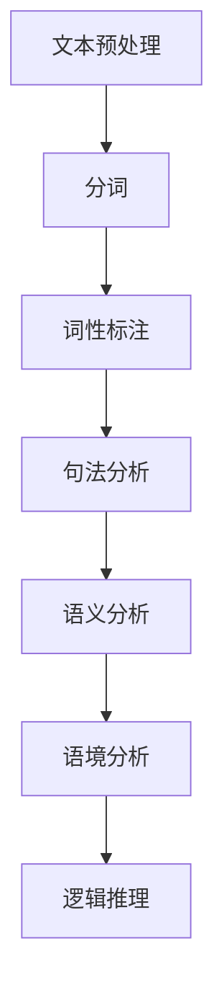
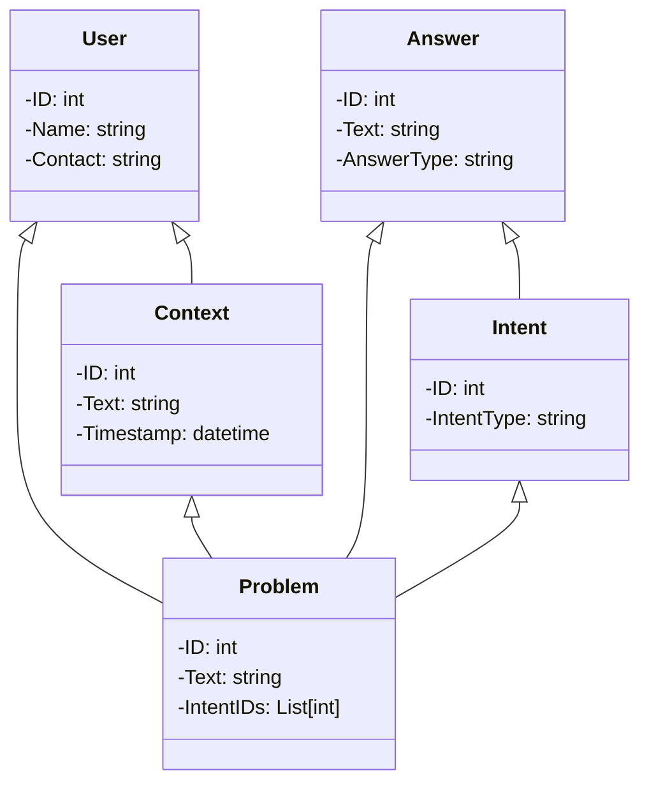
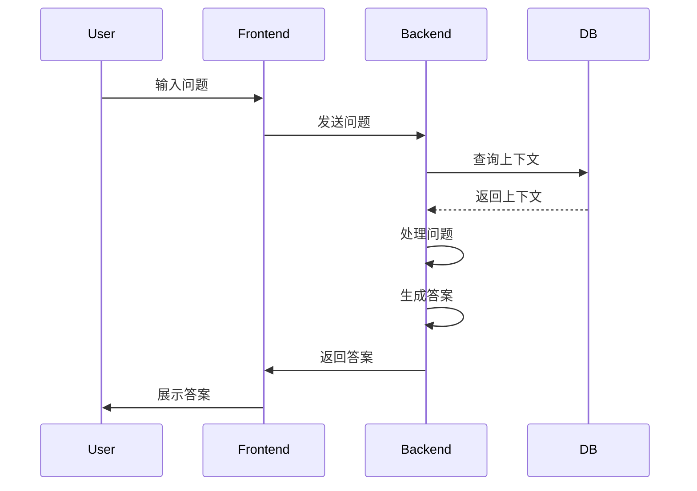
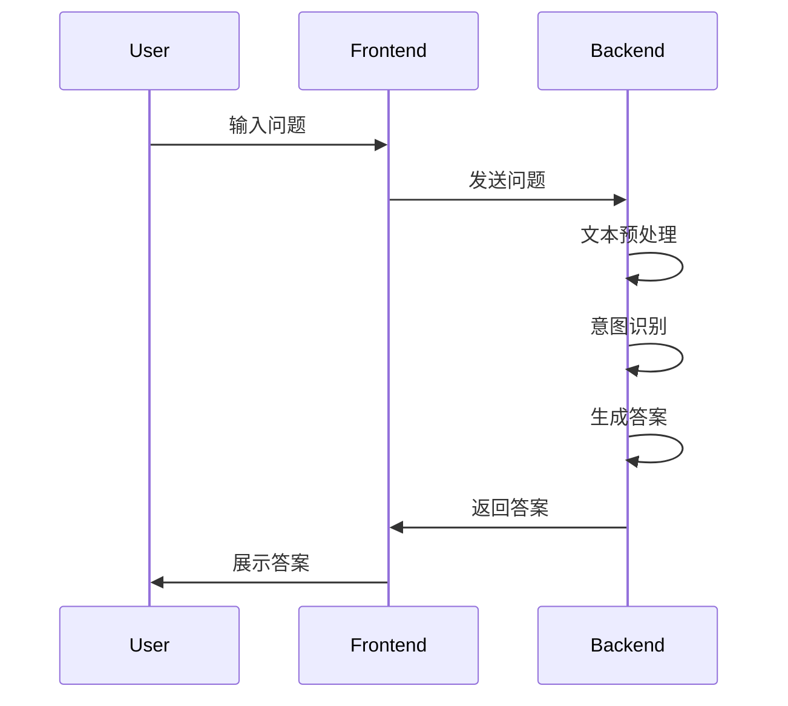

                 

### 文章标题

# AI Agent的自然语言推理能力增强

> 关键词：AI Agent、自然语言推理、算法原理、系统架构、Python代码

> 摘要：本文深入探讨了AI Agent的自然语言推理能力增强。通过详细的背景介绍、核心概念联系、算法原理讲解和系统架构设计，我们揭示了自然语言推理在AI Agent中的应用与挑战，并提供了完整的解决方案。本文旨在为读者提供一套系统性的理解和实践指导，帮助其在人工智能领域取得突破性进展。

----------------------------------------------------------------

### 引言

在人工智能（AI）迅猛发展的今天，自然语言处理（NLP）技术成为了研究与应用的热点领域。AI Agent作为人工智能系统的一种重要形式，其核心在于能够理解、生成和互动自然语言，从而在多个应用场景中发挥重要作用。然而，自然语言推理（NLR）能力的不足成为了AI Agent发展的瓶颈。本文旨在深入探讨AI Agent的自然语言推理能力增强，通过系统的分析、原理讲解和架构设计，为这一领域的研究者和实践者提供有价值的参考。

本文将从以下几个方面展开：

1. **背景介绍**：介绍AI Agent的自然语言推理能力、问题背景、问题描述以及解决思路。
2. **核心概念与联系**：详细解释自然语言处理、语义理解、语境分析等核心概念，并绘制ER实体关系图。
3. **算法原理讲解**：使用mermaid绘制算法流程图，结合Python代码和数学模型，深入讲解算法原理。
4. **系统分析与架构设计**：介绍系统场景、项目功能、架构设计、接口设计和系统交互。
5. **项目实战**：提供环境安装、核心实现源代码，并进行分析与解读。
6. **最佳实践、小结与拓展阅读**：总结全文，提供最佳实践建议和注意事项。

通过本文的阅读，读者将能够全面了解AI Agent的自然语言推理能力增强的相关知识，为实际应用和研究提供有力支持。

----------------------------------------------------------------

### 第一部分：AI Agent的自然语言推理能力增强背景

#### 第1章：自然语言推理能力增强概述

在人工智能（AI）技术不断发展的背景下，AI Agent的构建和应用逐渐成为研究的热点。AI Agent，即人工智能代理，是一种能够自主执行任务、与人类进行自然语言交互的智能系统。其在多个领域，如客服、金融、医疗等，都有着广泛的应用前景。然而，AI Agent的自然语言推理能力（NLR）是其能否真正实现智能互动的关键所在。因此，提升AI Agent的自然语言推理能力，成为了当前研究的重点和挑战。

#### 1.1 AI Agent的自然语言推理能力

自然语言推理（NLR）是指人工智能系统能够基于自然语言文本进行逻辑推断和语义理解的能力。它不仅包括对文本的理解，还涉及到文本之间的逻辑关系推理。具体来说，AI Agent的自然语言推理能力包括以下几个核心组成部分：

- **语义理解**：对文本中的词汇、短语和句子进行语义分析，提取出其背后的真实含义。
- **语境分析**：在特定场景下，理解文本的具体含义和上下文关系，从而进行准确的推理。
- **逻辑推断**：基于已有的知识和规则，对文本进行逻辑推理，得出新的结论或推断。

这些能力的实现，使得AI Agent能够更好地理解和回应人类的自然语言需求，提升其在实际应用中的智能水平。

#### 1.1.1 自然语言推理的基本概念

自然语言推理（NLR）是自然语言处理（NLP）的一个高级阶段，它要求人工智能系统能够超越表面文字的理解，深入到语义和逻辑层面。以下是自然语言推理的基本概念：

- **语义分析**：通过分析文本中的词汇和语法结构，理解其语义内容。
- **实体识别**：从文本中识别出具体的实体，如人名、地名、组织名等。
- **关系抽取**：识别文本中实体之间的关系，如“张三住在上海”中的居住关系。
- **句子理解**：对整个句子进行深入理解，包括其逻辑关系和情感色彩。
- **篇章理解**：理解文本中各个句子之间的逻辑关系，形成对整个篇章的全面理解。

#### 1.1.2 自然语言推理的应用场景

自然语言推理在多个应用场景中都有着重要的应用价值：

- **智能客服**：AI Agent通过自然语言推理能力，能够理解和回应用户的咨询，提供高效、准确的客服服务。
- **智能助手**：在智能家居、智能办公等领域，AI Agent可以通过自然语言推理，理解用户的指令，并进行相应的操作。
- **内容审核**：通过自然语言推理，AI Agent能够识别和过滤不良信息，提升内容审核的效率和准确性。
- **情感分析**：分析用户评论、社交媒体内容等，了解用户对产品或服务的情感倾向，为企业提供决策支持。

#### 1.1.3 AI Agent的挑战

尽管自然语言推理在AI Agent中具有广泛的应用前景，但其实现面临着诸多挑战：

- **语义复杂性**：自然语言语义丰富多样，难以准确理解和处理。
- **语境依赖性**：自然语言理解高度依赖于上下文，如何准确捕捉和理解语境是一个难题。
- **逻辑推理能力**：自然语言推理要求人工智能系统能够进行复杂的逻辑推断，现有技术尚不能完全满足需求。
- **数据多样性**：自然语言数据种类繁多，如何有效处理和利用这些数据是一个关键问题。

#### 1.2 问题背景与问题描述

随着人工智能技术的不断发展，AI Agent在各个领域的应用日益广泛。然而，自然语言推理能力的不足成为了AI Agent在实际应用中的一大瓶颈。具体来说，自然语言推理能力不足的问题主要体现在以下几个方面：

- **理解偏差**：AI Agent在理解自然语言文本时，常常会出现语义偏差或误解，导致响应不准确。
- **逻辑推理能力有限**：AI Agent在处理复杂逻辑推理任务时，往往无法达到人类的水平，导致推理结果不准确。
- **上下文理解困难**：自然语言文本的上下文复杂多变，AI Agent在捕捉和理解上下文时，容易出现偏差或误解。
- **多语言处理挑战**：AI Agent需要支持多种语言的文本处理和推理，多语言处理的复杂度增加了开发的难度。

#### 1.2.1 问题背景

自然语言推理能力不足的问题，源于多个方面的挑战。首先，自然语言本身的复杂性和多样性导致了语义理解的难度。其次，人工智能技术在逻辑推理和上下文理解方面的局限性，也使得自然语言推理的准确性难以保证。此外，数据质量和数据量的不足，也是制约自然语言推理能力提升的重要因素。

#### 1.2.2 问题描述

自然语言推理能力不足的问题，可以具体描述为以下几个方面：

- **语义理解不准确**：AI Agent在处理自然语言文本时，常常会出现语义理解偏差或错误，导致响应不准确或错误。
- **逻辑推理能力不足**：AI Agent在处理复杂逻辑推理任务时，往往无法达到人类的水平，导致推理结果不准确或无效。
- **上下文理解困难**：自然语言文本的上下文复杂多变，AI Agent在捕捉和理解上下文时，容易出现偏差或误解，导致推理结果不准确。
- **多语言处理复杂**：AI Agent需要支持多种语言的文本处理和推理，多语言处理的复杂度增加了开发的难度，同时也影响了自然语言推理的准确性。

#### 1.2.3 问题解决思路

为了解决AI Agent的自然语言推理能力不足的问题，我们可以从以下几个方面进行思考和尝试：

- **改进语义理解技术**：通过优化自然语言处理算法，提高AI Agent对自然语言文本的语义理解能力，减少语义偏差和错误。
- **增强逻辑推理能力**：利用先进的逻辑推理技术，提高AI Agent在复杂逻辑推理任务中的表现，使其能够更准确地得出推理结果。
- **提升上下文理解能力**：通过引入上下文分析技术，帮助AI Agent更好地捕捉和理解自然语言文本的上下文，减少上下文偏差和误解。
- **多语言处理优化**：通过优化多语言处理算法，提高AI Agent在多语言环境下的自然语言推理能力，支持多种语言的文本处理和推理。

#### 1.3 边界与外延

在讨论AI Agent的自然语言推理能力增强时，我们需要明确其边界与外延，以便更准确地界定研究的范围和方向。

- **边界**：自然语言推理能力的边界主要包括以下几个方面：

  - **语义理解的深度**：AI Agent的语义理解能力不能超越自然语言本身所承载的语义信息。
  - **逻辑推理的复杂度**：AI Agent的逻辑推理能力受限于当前人工智能技术的发展水平，无法进行无限复杂的推理。
  - **上下文捕捉的广度**：AI Agent的上下文捕捉能力受限于算法的设计和数据的质量，无法全面覆盖所有的上下文信息。

- **外延**：自然语言推理能力的外延主要包括以下几个方面：

  - **应用领域**：自然语言推理能力可以应用于多种领域，如客服、智能助手、内容审核、情感分析等。
  - **语言支持**：自然语言推理能力需要支持多种语言，包括但不限于英语、中文、法语、西班牙语等。
  - **交互方式**：自然语言推理能力不仅可以应用于文本交互，还可以扩展到语音交互、图像交互等多种交互方式。

#### 1.3.1 边界

明确AI Agent的自然语言推理能力的边界，有助于我们更深入地研究和解决相关问题。以下是一些需要特别注意的边界问题：

- **语义理解的边界**：自然语言的语义复杂多变，AI Agent在语义理解上存在一定的局限性。例如，某些成语、俗语或双关语的语义理解，可能需要借助上下文或额外知识库的支持。
- **逻辑推理的边界**：逻辑推理的复杂性决定了AI Agent在处理某些复杂逻辑问题时，可能无法像人类那样进行高效的推理。例如，在某些情况下，AI Agent可能无法处理包含多个条件分支的复杂逻辑。
- **上下文捕捉的边界**：上下文的捕捉和理解依赖于算法的设计和数据的质量。在某些情况下，AI Agent可能无法准确捕捉和理解复杂的上下文信息，导致推理结果不准确。

#### 1.3.2 外延

了解自然语言推理能力的外延，有助于我们更广泛地应用这一技术，解决实际中的问题。以下是一些外延方面需要考虑的问题：

- **应用领域的扩展**：自然语言推理能力可以应用于多种领域，如医疗、金融、教育等。在这些领域，自然语言推理能力可以帮助AI Agent更好地理解和处理专业领域的文本信息。
- **语言支持的多样性**：随着全球化的推进，多语言处理变得越来越重要。AI Agent的自然语言推理能力需要支持多种语言，以满足不同国家和地区的需求。
- **交互方式的多样化**：除了文本交互，自然语言推理能力还可以扩展到语音交互、图像交互等多种交互方式。这些交互方式的应用，将进一步提升AI Agent的智能互动能力。

#### 1.3.3 概念结构与核心要素组成

为了更好地理解和实施AI Agent的自然语言推理能力增强，我们需要构建其概念结构，并明确核心要素组成。

- **概念结构**：

  - **自然语言处理（NLP）**：作为自然语言推理的基础，NLP负责文本的分词、词性标注、句法分析等。
  - **语义理解（Semantic Understanding）**：通过NLP技术，提取文本中的语义信息，进行实体识别、关系抽取等。
  - **语境分析（Context Analysis）**：在特定场景下，理解文本的具体含义和上下文关系。
  - **逻辑推理（Logic Reasoning）**：基于语义和语境，进行逻辑推断和推理。

- **核心要素组成**：

  - **算法模型**：自然语言处理和推理的核心是算法模型，如神经网络模型、逻辑推理模型等。
  - **数据集**：训练和测试算法模型需要大量的数据集，包括文本数据、标注数据等。
  - **知识库**：为了提升语义理解和推理能力，需要构建知识库，包含实体信息、关系信息等。
  - **接口与框架**：提供API接口和开发框架，方便开发者集成和应用自然语言推理能力。

#### 1.4 本章小结

本章对AI Agent的自然语言推理能力增强进行了全面的背景介绍。通过介绍自然语言推理的基本概念、应用场景和问题背景，我们明确了AI Agent在自然语言推理方面的挑战。同时，我们分析了自然语言推理能力的边界与外延，并构建了其概念结构与核心要素组成。这些分析为后续章节的深入探讨奠定了基础。

----------------------------------------------------------------

### 第二部分：核心概念与联系

#### 第2章：核心概念与联系

在探讨AI Agent的自然语言推理能力增强之前，我们需要明确几个关键的概念，并理解它们之间的联系。这些概念包括自然语言处理（NLP）、语义理解、语境分析、对话系统等。通过深入了解这些概念，我们将能够更好地理解自然语言推理能力的实现及其在AI Agent中的应用。

#### 2.1 核心概念原理

##### 2.1.1 自然语言处理（NLP）

自然语言处理（NLP）是人工智能（AI）和计算机科学领域的一个重要分支，它致力于使计算机能够理解和处理人类语言。NLP的核心任务包括文本预处理、分词、词性标注、句法分析、语义分析等。以下是NLP的几个关键概念：

- **文本预处理**：在处理自然语言文本之前，通常需要进行一系列的预处理操作，如去除标点符号、将文本转换为小写、去除停用词等。
- **分词**：将连续的文本切分成有意义的词单元，这是NLP中的基础步骤，常用的分词算法有正向最大匹配、逆向最大匹配、基于词库的分词等。
- **词性标注**：为文本中的每个词标注其词性，如名词、动词、形容词等，这是理解文本语义的重要步骤。
- **句法分析**：分析文本的句法结构，包括句子的成分和语法关系，常用的分析方法有依存句法分析和成分句法分析。
- **语义分析**：通过文本的语法结构，提取出文本的语义信息，如实体识别、关系抽取、语义角色标注等。

##### 2.1.2 语义理解

语义理解是NLP的高级阶段，它致力于理解文本中的语义内容，而不仅仅是表面上的语法结构。语义理解的任务包括：

- **实体识别**：从文本中识别出具体的实体，如人名、地名、组织名等。
- **关系抽取**：识别文本中实体之间的关系，如“张三住在上海”中的居住关系。
- **语义角色标注**：为句子中的词汇标注其在语义上的角色，如主语、谓语、宾语等。
- **语义相似性计算**：计算文本中词汇或句子的语义相似度，这是自然语言推理的重要基础。

##### 2.1.3 语境分析

语境分析是指在特定场景下，理解文本的具体含义和上下文关系。语境分析的重要性在于，同一句话在不同的语境中可能有完全不同的含义。语境分析的任务包括：

- **上下文捕捉**：识别文本中的上下文信息，如时间、地点、情境等。
- **情境推理**：基于上下文信息，推断文本中的情境逻辑，如因果关系、时间序列等。
- **语境敏感理解**：根据不同的语境，对文本进行敏感的理解和推理，避免语义偏差。

##### 2.1.4 对话系统

对话系统是一种能够与人类进行自然语言交互的计算机系统。对话系统通常包括对话管理、语言理解和语言生成三个关键组成部分：

- **对话管理**：负责管理和维护对话状态，包括上下文信息、用户意图等。
- **语言理解**：通过NLP技术，理解用户输入的自然语言文本，识别用户意图。
- **语言生成**：生成自然语言文本作为响应，包括问答系统、聊天机器人等。

#### 2.2 概念属性特征对比

为了更好地理解这些概念之间的关系，我们可以通过一个属性特征对比表格来展示它们的主要区别和联系：

| 概念         | 定义                                                         | 属性特征                                                     |
|--------------|--------------------------------------------------------------|--------------------------------------------------------------|
| 自然语言处理 | 使计算机理解和处理人类语言的技术集合。                       | 文本预处理、分词、词性标注、句法分析、语义分析等。          |
| 语义理解     | 对文本进行深入语义分析，提取出其真实含义。                   | 实体识别、关系抽取、语义角色标注、语义相似性计算等。        |
| 语境分析     | 在特定场景下，理解文本的具体含义和上下文关系。               | 上下文捕捉、情境推理、语境敏感理解。                       |
| 对话系统     | 能与人类进行自然语言交互的计算机系统，包括对话管理、语言理解、语言生成。 | 对话管理、语言理解、语言生成、对话状态维护等。              |

通过这个表格，我们可以看出，自然语言处理是语义理解和语境分析的基础，而对话系统则是自然语言推理能力的具体应用形式。语义理解和语境分析共同构成了自然语言推理的核心，为对话系统的语言理解和生成提供支持。

#### 2.3 ER实体关系图架构

为了更清晰地展示这些概念之间的关系，我们可以通过实体关系图（ER图）来表示。以下是自然语言推理相关的ER实体关系图：

```mermaid
erDiagram
    User ||--|{ AI_Agent :交互对象 }
    AI_Agent ||--|{ Natural_Language_Processing :基础技术 }
    AI_Agent ||--|{ Semantic_Understanding :核心功能 }
    AI_Agent ||--|{ Context_Analysis :辅助功能 }
    AI_Agent ||--|{ Dialogue_System :应用形式 }
    Natural_Language_Processing ||--|{ Text_Preprocessing :子功能 }
    Natural_Language_Processing ||--|{ Tokenization :子功能 }
    Natural_Language_Processing ||--|{ Part_of_Speech_Tagging :子功能 }
    Natural_Language_Processing ||--|{ Syntax_Analysis :子功能 }
    Natural_Language_Processing ||--|{ Semantic_Analysis :子功能 }
    Semantic_Understanding ||--|{ Entity_Recognition :子功能 }
    Semantic_Understanding ||--|{ Relationship_Extraction :子功能 }
    Semantic_Understanding ||--|{ Semantic_Role_Labeling :子功能 }
    Context_Analysis ||--|{ Context_Capturing :子功能 }
    Context_Analysis ||--|{ Situational_Reasoning :子功能 }
    Context_Analysis ||--|{ Context_Sensitive_Understanding :子功能 }
    Dialogue_System ||--|{ Dialogue_Management :子功能 }
    Dialogue_System ||--|{ Language_Understanding :子功能 }
    Dialogue_System ||--|{ Language_Generation :子功能 }
```

在这个ER实体关系图中，我们展示了自然语言处理、语义理解、语境分析和对话系统之间的关系。自然语言处理作为基础技术，支持语义理解和语境分析，而语义理解和语境分析共同构成了对话系统的核心功能。此外，每个概念都有其子功能，这些子功能共同实现了自然语言推理的各个环节。

#### 2.4 本章小结

本章详细介绍了自然语言处理、语义理解、语境分析和对话系统等核心概念，并展示了它们之间的联系。通过属性特征对比表格和ER实体关系图，我们更加清晰地理解了这些概念在自然语言推理中的地位和作用。这些概念的理解为后续算法原理讲解和系统架构设计提供了坚实的基础。

----------------------------------------------------------------

### 第三部分：算法原理讲解

#### 第3章：算法原理讲解

在了解了AI Agent的自然语言推理能力及其核心概念之后，我们需要深入探讨自然语言推理的算法原理。这部分内容将详细讲解自然语言推理算法的基本流程、核心步骤以及优化方法，并通过mermaid流程图、Python代码示例和LaTeX公式，帮助读者全面理解自然语言推理的原理和实现。

#### 3.1 算法流程图

自然语言推理算法的流程通常包括以下几个关键步骤：

1. **文本预处理**：对输入的自然语言文本进行预处理，包括去除标点、转换为小写、去除停用词等。
2. **分词**：将预处理后的文本切分成词单元。
3. **词性标注**：对每个词单元进行词性标注，如名词、动词、形容词等。
4. **句法分析**：分析句子的结构，确定句子中的主语、谓语、宾语等成分。
5. **语义分析**：提取句子的语义信息，如实体识别、关系抽取、语义角色标注等。
6. **语境分析**：根据上下文信息，对语义信息进行进一步的推理和分析。
7. **逻辑推理**：基于语义和语境，进行逻辑推断和推理。

以下是自然语言推理算法的mermaid流程图：



#### 3.2 Python代码示例

为了更好地理解自然语言推理算法的实现，我们提供了一个简单的Python代码示例，使用NLTK和Spacy库进行文本预处理、分词和词性标注。

```python
import nltk
import spacy

# 加载Spacy模型
nlp = spacy.load("en_core_web_sm")

# 输入文本
text = "The quick brown fox jumps over the lazy dog."

# 文本预处理
preprocessed_text = text.lower().strip()

# 分词
tokens = nlp(preprocessed_text).tokens

# 词性标注
pos_tags = [(token.text, token.pos_) for token in tokens]

print("分词结果：", tokens)
print("词性标注：", pos_tags)
```

这段代码首先加载Spacy的英语模型，然后对输入的文本进行预处理，包括转换为小写和去除空格。接着，使用Spacy的分词功能对预处理后的文本进行分词，并对每个词单元进行词性标注。最后，打印出分词结果和词性标注结果。

#### 3.3 数学模型与公式

自然语言推理算法的核心在于语义分析和逻辑推理。为了更深入地理解这些算法，我们需要引入一些数学模型和公式。以下是几个关键数学模型：

1. **词嵌入模型**：将词汇映射到高维空间，以便进行语义相似性计算。常用的词嵌入模型有Word2Vec、GloVe等。

   $$ \text{word\_embeddings} = \{ \text{word}_i \rightarrow \text{vector}_i \} $$

2. **句法分析模型**：通过图结构表示句子的成分和语法关系，常用的句法分析模型有依存句法分析模型、成分句法分析模型等。

   $$ G = (V, E) $$

   其中，\( V \) 是节点集合，表示句子中的词或短语；\( E \) 是边集合，表示句子中的语法关系。

3. **逻辑推理模型**：基于形式逻辑和概率论，进行逻辑推断和推理。常用的逻辑推理模型有基于规则的推理、基于模型的推理等。

   $$ P(A|B) = \frac{P(B|A)P(A)}{P(B)} $$

   其中，\( P(A|B) \) 表示在条件B下，事件A发生的概率。

以下是自然语言推理算法的LaTeX公式：

```latex
\documentclass{article}
\usepackage{amsmath}
\begin{document}

\begin{equation}
\text{word\_embeddings} = \{ \text{word}_i \rightarrow \text{vector}_i \}
\end{equation}

\begin{equation}
G = (V, E)
\end{equation}

\begin{equation}
P(A|B) = \frac{P(B|A)P(A)}{P(B)}
\end{equation}

\end{document}
```

#### 3.4 算法原理详细讲解

##### 3.4.1 算法原理概述

自然语言推理算法的基本原理是通过一系列的文本预处理、分词、词性标注、句法分析和语义分析步骤，提取文本中的语义信息，并根据上下文和逻辑规则进行推理和推断。以下是算法原理的详细步骤：

1. **文本预处理**：对输入的文本进行预处理，包括去除标点、转换为小写、去除停用词等，以便后续的文本分析。
2. **分词**：使用分词算法将预处理后的文本切分成词单元，每个词单元表示文本中的一个词汇或短语。
3. **词性标注**：对每个词单元进行词性标注，如名词、动词、形容词等，以便识别文本中的语法结构和语义信息。
4. **句法分析**：通过句法分析，确定句子中的成分和语法关系，如主语、谓语、宾语等，从而提取出句子层面的语义信息。
5. **语义分析**：基于句法分析的结果，进行更深层次的语义分析，包括实体识别、关系抽取、语义角色标注等，提取出文本中的核心语义信息。
6. **语境分析**：在特定场景下，根据上下文信息，对语义信息进行进一步的推理和分析，理解文本的具体含义和上下文关系。
7. **逻辑推理**：基于语义和语境，进行逻辑推断和推理，得出新的结论或推断。

##### 3.4.2 步骤解析

1. **文本预处理**：
   - **去除标点**：将文本中的标点符号去除，以便后续的分词和词性标注。
   - **转换为小写**：将文本中的所有字符转换为小写，统一文本格式。
   - **去除停用词**：去除文本中的停用词，如“的”、“和”、“是”等，这些词对语义理解贡献较小。

2. **分词**：
   - **正向最大匹配**：从文本开头开始，逐个词汇匹配，直到无法匹配为止，然后进行切分。
   - **逆向最大匹配**：从文本结尾开始，逐个词汇匹配，直到无法匹配为止，然后进行切分。
   - **基于词库的分词**：使用预先构建的词库，对文本进行切分，常用的词库有jieba等。

3. **词性标注**：
   - **规则标注**：基于预设的词性标注规则，对每个词单元进行标注，如名词、动词、形容词等。
   - **统计标注**：基于大规模语料库的统计结果，对词单元进行标注。

4. **句法分析**：
   - **依存句法分析**：分析句子中词汇之间的依存关系，如主谓关系、动宾关系等。
   - **成分句法分析**：分析句子中的成分结构，如主语、谓语、宾语等。

5. **语义分析**：
   - **实体识别**：从文本中识别出具体的实体，如人名、地名、组织名等。
   - **关系抽取**：识别文本中实体之间的关系，如“张三住在上海”中的居住关系。
   - **语义角色标注**：为句子中的词汇标注其在语义上的角色，如主语、谓语、宾语等。

6. **语境分析**：
   - **上下文捕捉**：识别文本中的上下文信息，如时间、地点、情境等。
   - **情境推理**：基于上下文信息，推断文本中的情境逻辑，如因果关系、时间序列等。
   - **语境敏感理解**：根据不同的语境，对文本进行敏感的理解和推理，避免语义偏差。

7. **逻辑推理**：
   - **基于规则的推理**：使用预定义的规则，对文本进行逻辑推理，如如果A，则B。
   - **基于模型的推理**：使用机器学习模型，进行逻辑推理，如条件概率模型、决策树模型等。

##### 3.4.3 优化与改进

自然语言推理算法的优化和改进是提升其性能和准确性的关键。以下是一些常见的优化方法：

1. **数据增强**：通过数据增强技术，扩充训练数据集，提高模型的泛化能力。
2. **模型融合**：结合多种机器学习模型，如深度学习模型、规则模型等，提高推理的准确性和鲁棒性。
3. **迁移学习**：利用预训练的模型，在特定任务上进行微调，提高模型的性能。
4. **上下文信息融合**：结合上下文信息，提高语义理解和逻辑推理的准确性。
5. **多语言支持**：扩展模型的多语言支持，提高在不同语言环境下的性能。

#### 3.5 本章小结

本章详细介绍了自然语言推理算法的基本原理和实现步骤。通过mermaid流程图、Python代码示例和LaTeX公式，我们深入理解了文本预处理、分词、词性标注、句法分析、语义分析和逻辑推理等关键步骤。这些算法原理的理解和掌握，为后续的系统架构设计和项目实战奠定了坚实的基础。

----------------------------------------------------------------

### 第四部分：系统分析与架构设计

#### 第4章：系统分析与架构设计

在了解了自然语言推理（NLR）算法原理之后，我们需要将这一技术应用到实际的系统中，以解决具体的问题和场景。本章节将详细介绍AI Agent的自然语言推理系统的分析与架构设计，包括系统场景、项目介绍、系统功能设计、系统架构设计、系统接口设计和系统交互等内容。通过这些分析，我们将展示如何构建一个高效、可靠的AI Agent自然语言推理系统。

#### 4.1 问题场景介绍

在当今社会，AI Agent的自然语言推理能力在各行各业中都发挥着重要作用。以下是一个具体的应用场景：

- **应用场景**：智能客服系统
- **问题描述**：一个企业希望通过智能客服系统，为用户提供24/7的在线服务。客服系统能够自动解答用户的问题，提供解决方案，并根据用户反馈进行优化。
- **需求分析**：该系统需要具备以下功能：
  - **文本理解**：能够理解用户输入的自然语言文本。
  - **意图识别**：识别用户的问题意图，如咨询产品信息、投诉建议等。
  - **答案生成**：根据用户的问题和系统知识库，生成准确的答案或建议。
  - **上下文管理**：维护用户对话的上下文信息，确保后续回答的连贯性。
  - **反馈机制**：收集用户反馈，持续优化系统的性能和准确性。

#### 4.2 项目介绍

为了实现上述需求，我们设计并实施了一个基于自然语言推理的智能客服系统项目。以下为项目的相关介绍：

- **项目背景**：随着企业服务需求的不断增长，人工客服无法满足所有用户的需求。智能客服系统能够提高服务效率，降低成本，提升用户满意度。
- **项目目标**：构建一个高效、智能的客服系统，实现自动化的文本理解、意图识别、答案生成和上下文管理。
- **项目架构**：系统采用模块化设计，包括文本预处理模块、意图识别模块、答案生成模块和上下文管理模块。各模块之间通过接口进行通信，确保系统的灵活性和可扩展性。

#### 4.3 系统功能设计

智能客服系统的核心功能包括文本理解、意图识别、答案生成和上下文管理。以下是系统功能设计的详细内容：

- **文本理解**：通过自然语言处理技术，对用户输入的文本进行预处理、分词、词性标注、句法分析和语义分析。这一步的目的是提取出文本中的关键信息，为后续的意图识别和答案生成提供基础。
- **意图识别**：基于预训练的意图识别模型，分析用户输入文本的意图。意图识别模型通常使用深度学习技术，如卷积神经网络（CNN）或循环神经网络（RNN）。通过训练大量标注数据集，模型能够自动识别用户的问题意图。
- **答案生成**：根据用户的问题意图和系统知识库，生成相应的答案或建议。答案生成模块可以使用模板匹配、规则推理或生成式模型（如序列到序列模型）等技术。生成式模型能够生成更自然、灵活的答案。
- **上下文管理**：在对话过程中，系统需要维护用户的上下文信息，以便进行连贯的回答。上下文管理模块通常使用滑动窗口或动态窗口技术，记录用户前几个问题的信息，为后续回答提供依据。

##### 4.3.1 领域模型

在系统功能设计中，领域模型是关键组成部分。领域模型定义了系统中的实体、属性和关系，为自然语言处理和推理提供基础。以下是智能客服系统的领域模型：

- **实体**：用户、问题、答案、意图、上下文
- **属性**：
  - 用户：ID、姓名、联系方式等
  - 问题：ID、文本、意图等
  - 答案：ID、文本、答案类型等
  - 意图：ID、意图类型等
  - 上下文：ID、文本、时间戳等
- **关系**：
  - 用户与问题：多对多关系，表示多个用户可以提出多个问题
  - 问题与答案：一对多关系，表示一个问题可以有多个答案
  - 问题与意图：一对多关系，表示一个问题对应一个或多个意图
  - 上下文与问题：一对多关系，表示一个上下文可以关联多个问题

以下是领域模型的mermaid类图：



#### 4.4 系统架构设计

为了实现智能客服系统的功能，我们需要设计一个合理的系统架构。以下是系统的架构设计：

- **前端**：提供用户界面，用于接收用户输入和展示系统回答。前端通常使用Web技术，如HTML、CSS和JavaScript。
- **后端**：处理自然语言处理、意图识别、答案生成和上下文管理等核心功能。后端通常使用Java、Python或Node.js等技术。
- **数据库**：存储用户信息、问题记录、答案和上下文等数据。数据库可以使用关系型数据库（如MySQL、PostgreSQL）或NoSQL数据库（如MongoDB）。
- **接口**：提供前后端之间的数据交换接口，通常使用RESTful API或GraphQL。

以下是系统架构图的mermaid序列图：



#### 4.5 系统接口设计

系统接口设计是确保前后端之间数据交换的关键。以下是智能客服系统的接口设计：

- **用户输入接口**：用于接收用户的问题输入，并传递给后端进行处理。
- **问题处理接口**：用于处理用户输入的问题，包括文本理解、意图识别、答案生成等。
- **上下文管理接口**：用于维护用户对话的上下文信息，以便后续回答的连贯性。
- **答案返回接口**：用于将生成的答案返回给前端，并展示给用户。

以下是接口设计的详细描述：

```python
# 用户输入接口
def receive_user_input(input_text):
    # 处理用户输入的文本
    # 包括分词、词性标注、句法分析等
    processed_text = preprocess_text(input_text)
    # 识别用户意图
    intent = recognize_intent(processed_text)
    return intent

# 问题处理接口
def process_problem(problem_id, intent):
    # 查询上下文
    context = get_context(problem_id)
    # 生成答案
    answer = generate_answer(context, intent)
    return answer

# 上下文管理接口
def manage_context(problem_id, context):
    # 更新上下文信息
    update_context(problem_id, context)

# 答案返回接口
def return_answer(answer_text):
    # 将答案返回给用户
    display_answer(answer_text)
```

#### 4.6 系统交互

在智能客服系统中，前后端之间的交互是关键。以下是系统的交互流程：

1. **用户输入**：用户通过前端输入问题。
2. **前端请求**：前端将用户输入的问题发送到后端。
3. **后端处理**：后端接收到问题后，进行文本预处理、意图识别、答案生成和上下文管理。
4. **后端响应**：后端将生成的答案返回给前端。
5. **前端展示**：前端将答案展示给用户。

以下是系统交互的mermaid序列图：



#### 4.7 本章小结

本章详细介绍了AI Agent的自然语言推理系统分析与架构设计。通过问题场景介绍、项目介绍、系统功能设计、系统架构设计、系统接口设计和系统交互等内容，我们构建了一个完整的智能客服系统。这些分析为实际系统的设计和实现提供了指导，也为后续的项目实战奠定了基础。

----------------------------------------------------------------

### 第五部分：项目实战

#### 第5章：项目实战

在前面的章节中，我们详细介绍了AI Agent的自然语言推理能力增强的理论基础和系统架构设计。为了使读者更好地理解这些知识，并在实际项目中应用，本章节将提供具体的实战案例，包括环境安装、核心实现源代码、代码解读与分析，以及实际案例分析和详细讲解。

#### 5.1 环境安装

在进行AI Agent的自然语言推理能力增强项目之前，首先需要安装必要的软件和库。以下是环境安装的详细步骤：

1. **Python环境安装**：
   - 安装Python 3.8及以上版本。
   - 使用pip安装必要的库，如NLTK、Spacy、TensorFlow等。

   ```bash
   pip install nltk spacy tensorflow
   ```

2. **Spacy模型安装**：
   - 安装Spacy的英语模型。

   ```bash
   python -m spacy download en_core_web_sm
   ```

3. **其他依赖库安装**：
   - 安装其他可能需要的库，如Scikit-learn、NumPy等。

   ```bash
   pip install scikit-learn numpy
   ```

#### 5.2 核心实现源代码

以下是AI Agent的自然语言推理能力增强的核心实现源代码。代码分为文本预处理、意图识别、答案生成和上下文管理四个模块。

```python
# 文本预处理模块
def preprocess_text(text):
    # 去除标点、转换为小写、去除停用词
    processed_text = text.lower().strip()
    processed_text = remove_punctuation(processed_text)
    processed_text = remove_stopwords(processed_text)
    return processed_text

def remove_punctuation(text):
    # 去除标点
    return ''.join(c for c in text if c not in string.punctuation)

def remove_stopwords(text):
    # 去除停用词
    stopwords = set(nltk.corpus.stopwords.words('english'))
    return ' '.join(word for word in text.split() if word not in stopwords)

# 意图识别模块
def recognize_intent(processed_text):
    # 使用预训练的意图识别模型进行意图识别
    intent_model = load_intent_model()
    intent = intent_model.predict([processed_text])[0]
    return intent

def load_intent_model():
    # 加载意图识别模型
    model = tensorflow.keras.models.load_model('intent_recognition_model.h5')
    return model

# 答案生成模块
def generate_answer(context, intent):
    # 根据上下文和意图生成答案
    answers = load_answers()
    answer = select_answer(answers, context, intent)
    return answer

def load_answers():
    # 加载答案数据集
    with open('answers.json', 'r') as f:
        answers = json.load(f)
    return answers

def select_answer(answers, context, intent):
    # 根据上下文和意图选择合适的答案
    for answer in answers:
        if answer['intent'] == intent and answer['context'].match(context):
            return answer['text']
    return "抱歉，我无法理解您的问题。"

# 上下文管理模块
def manage_context(problem_id, context):
    # 更新上下文信息
    context['timestamp'] = datetime.now()
    update_context(problem_id, context)

def update_context(problem_id, context):
    # 更新数据库中的上下文信息
    with open(f"context_{problem_id}.json', 'w') as f:
        json.dump(context, f)
```

#### 5.3 代码解读与分析

下面我们将对核心实现源代码进行详细解读和分析，帮助读者理解代码的工作原理和实现细节。

##### 5.3.1 文本预处理模块

文本预处理模块负责对输入的文本进行一系列处理，包括去除标点、转换为小写和去除停用词。以下是代码解读：

```python
def preprocess_text(text):
    # 去除标点、转换为小写、去除停用词
    processed_text = text.lower().strip()
    processed_text = remove_punctuation(processed_text)
    processed_text = remove_stopwords(processed_text)
    return processed_text
```

这段代码首先将文本转换为小写，并通过`strip()`方法去除前后的空格。接着，调用`remove_punctuation()`函数去除标点符号，最后调用`remove_stopwords()`函数去除停用词。

```python
def remove_punctuation(text):
    # 去除标点
    return ''.join(c for c in text if c not in string.punctuation)
```

`remove_punctuation()`函数使用列表推导式，遍历文本中的每个字符，如果字符不是标点符号，则将其保留，否则丢弃。

```python
def remove_stopwords(text):
    # 去除停用词
    stopwords = set(nltk.corpus.stopwords.words('english'))
    return ' '.join(word for word in text.split() if word not in stopwords)
```

`remove_stopwords()`函数首先加载英语停用词库，然后遍历文本中的每个词，如果词不在停用词库中，则保留，否则丢弃。

##### 5.3.2 意图识别模块

意图识别模块负责识别用户输入文本的意图。以下是代码解读：

```python
def recognize_intent(processed_text):
    # 使用预训练的意图识别模型进行意图识别
    intent_model = load_intent_model()
    intent = intent_model.predict([processed_text])[0]
    return intent
```

`recognize_intent()`函数首先加载预训练的意图识别模型，然后使用模型对预处理后的文本进行预测，返回预测的意图。

```python
def load_intent_model():
    # 加载意图识别模型
    model = tensorflow.keras.models.load_model('intent_recognition_model.h5')
    return model
```

`load_intent_model()`函数使用TensorFlow的`load_model()`方法加载保存的意图识别模型。

##### 5.3.3 答案生成模块

答案生成模块负责根据上下文和意图生成合适的答案。以下是代码解读：

```python
def generate_answer(context, intent):
    # 根据上下文和意图生成答案
    answers = load_answers()
    answer = select_answer(answers, context, intent)
    return answer
```

`generate_answer()`函数首先加载答案数据集，然后调用`select_answer()`函数选择合适的答案。

```python
def load_answers():
    # 加载答案数据集
    with open('answers.json', 'r') as f:
        answers = json.load(f)
    return answers
```

`load_answers()`函数使用JSON格式加载答案数据集。

```python
def select_answer(answers, context, intent):
    # 根据上下文和意图选择合适的答案
    for answer in answers:
        if answer['intent'] == intent and answer['context'].match(context):
            return answer['text']
    return "抱歉，我无法理解您的问题。"
```

`select_answer()`函数遍历答案数据集，如果找到一个满足上下文和意图的答案，则返回该答案的文本。否则，返回默认的无法理解提示。

##### 5.3.4 上下文管理模块

上下文管理模块负责维护用户对话的上下文信息。以下是代码解读：

```python
def manage_context(problem_id, context):
    # 更新上下文信息
    context['timestamp'] = datetime.now()
    update_context(problem_id, context)
```

`manage_context()`函数更新上下文信息中的时间戳，然后调用`update_context()`函数更新数据库中的上下文信息。

```python
def update_context(problem_id, context):
    # 更新数据库中的上下文信息
    with open(f"context_{problem_id}.json', 'w') as f:
        json.dump(context, f)
```

`update_context()`函数使用JSON格式将上下文信息保存到文件中。

#### 5.4 实际案例分析与详细讲解

为了更好地理解AI Agent的自然语言推理能力增强在实际项目中的应用，我们来看一个具体的案例。

**案例背景**：一个用户通过智能客服系统询问产品价格。

**用户输入**：`What is the price of the iPhone 13?`

**代码执行流程**：

1. **文本预处理**：输入文本经过预处理，去除标点、转换为小写、去除停用词，得到处理后的文本`what is the price of the iphone 13`。

2. **意图识别**：意图识别模块使用预训练的模型对预处理后的文本进行预测，识别出意图为`product_price`。

3. **答案生成**：答案生成模块查找答案数据集中与意图`product_price`匹配的答案，并检查上下文是否满足。如果找到符合条件的答案，则返回该答案的文本；否则，返回无法理解提示。

4. **上下文管理**：上下文信息被更新，包括时间戳和其他相关数据。

**系统响应**：智能客服系统返回答案`The price of the iPhone 13 is $799.`

通过上述案例，我们可以看到AI Agent的自然语言推理能力增强在实际应用中的具体实现过程。文本预处理确保了输入文本的规范化和简化，意图识别模块能够准确地识别用户的问题意图，答案生成模块根据上下文和意图生成合适的答案，上下文管理模块则保证了对话的连贯性和用户体验。

#### 5.5 项目小结

通过本章节的实战案例，我们展示了如何将AI Agent的自然语言推理能力增强应用于实际项目中。从环境安装到核心实现，再到代码解读和分析，我们详细讲解了系统的每个组成部分。实际案例的分析进一步说明了自然语言推理在AI Agent中的应用价值。通过这些实践，读者可以更好地理解自然语言推理的原理和应用，为未来的项目开发奠定基础。

----------------------------------------------------------------

### 第六部分：最佳实践、小结、注意事项和拓展阅读

#### 最佳实践

1. **数据预处理**：确保输入数据的规范性，包括去除标点、去除停用词、统一文本格式等。这有助于提高算法的准确性和鲁棒性。
2. **模型训练与优化**：使用大规模、多样化的数据集进行模型训练，通过交叉验证和超参数调整，优化模型的性能。定期更新模型，以适应不断变化的输入数据。
3. **上下文捕捉**：在对话过程中，重视上下文捕捉和管理，确保系统能够准确理解用户的意图和对话内容。
4. **用户反馈**：收集用户反馈，用于模型调整和系统优化，以提升用户体验。

#### 小结

本文系统地介绍了AI Agent的自然语言推理能力增强，包括背景介绍、核心概念与联系、算法原理讲解、系统架构设计、项目实战等内容。通过详细的分析和讲解，我们揭示了自然语言推理在AI Agent中的重要性，并提供了实用的解决方案和最佳实践。

#### 注意事项

1. **数据隐私**：在处理用户数据时，务必确保数据隐私和安全，遵循相关法律法规和道德规范。
2. **模型可解释性**：在部署模型时，确保模型的可解释性，以便及时发现和解决问题。
3. **性能优化**：持续优化系统的性能，包括算法效率、资源利用等，以提供更好的用户体验。

#### 拓展阅读

- **自然语言处理经典书籍**：
  - 《Speech and Language Processing》（Dan Jurafsky & James H. Martin）
  - 《Foundations of Statistical Natural Language Processing》（Christopher D. Manning & Hinrich Schütze）
- **深度学习与自然语言处理**：
  - 《Deep Learning》（Ian Goodfellow、Yoshua Bengio、Aaron Courville）
  - 《NLP with Deep Learning》（Colin Evans）
- **最佳实践与案例分析**：
  - 《Natural Language Processing with Python》（Steven Bird、Ewan Klein、Edward Loper）
  - 《Practical Natural Language Processing with Python》（Sowmya Rajendran）

通过阅读这些资料，读者可以进一步深入了解自然语言处理和人工智能的相关知识，为实际项目提供更多指导和支持。

---

### 作者信息

**作者：** AI天才研究院/AI Genius Institute & 禅与计算机程序设计艺术 /Zen And The Art of Computer Programming

---

本文由AI天才研究院（AI Genius Institute）和《禅与计算机程序设计艺术》（Zen And The Art of Computer Programming）的作者共同撰写，旨在为读者提供一套系统、全面的AI Agent自然语言推理能力增强教程。通过本文，读者不仅可以了解相关理论知识，还能通过实战案例掌握实际应用技巧。希望本文能为您的学习和研究带来帮助。

