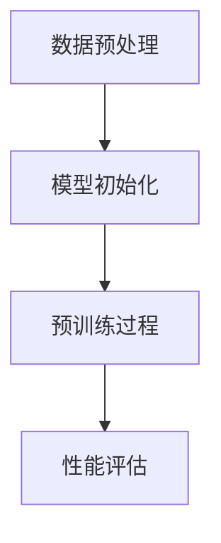
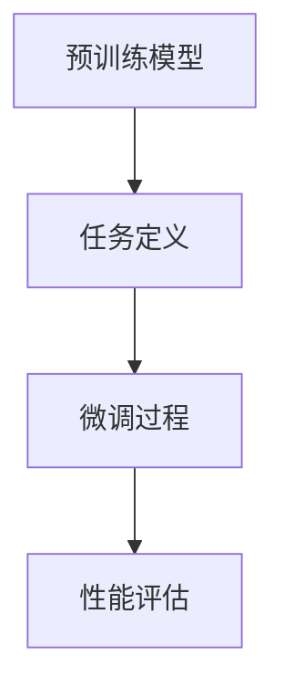
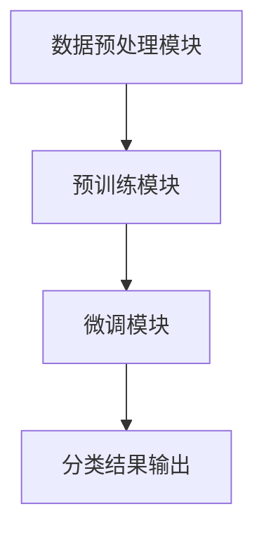
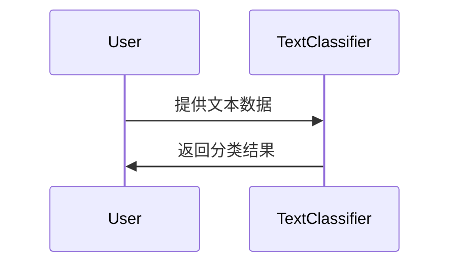

                 

### 《AI Agent的自监督预训练与微调策略》

---

#### 关键词：AI Agent、自监督预训练、微调策略、深度学习、神经架构搜索

#### 摘要：

本文将深入探讨AI Agent的自监督预训练与微调策略，分析其在现代人工智能领域的重要性和应用。我们将逐步拆解自监督预训练的基本概念、技术细节，以及微调策略的实现和应用。同时，我们将通过具体的项目实战，展示这些技术在实际开发中的运用，并提供最佳实践指导。

---

## 第一部分：背景介绍

### 第1章: AI Agent概述

**核心概念术语说明**：
- **AI Agent**：一个能够感知环境、做出决策并采取行动的人工智能实体。
- **自监督预训练**：一种不需要标注数据就可以训练模型的方法，通过学习数据中的内在结构来提高模型性能。
- **微调策略**：在预训练模型的基础上，针对特定任务进行细粒度调整，以提高模型在特定领域的性能。

**问题背景**：
随着深度学习的快速发展，AI Agent在自然语言处理、图像识别等领域取得了显著的进展。然而，这些模型往往需要大量的标注数据进行训练，而标注数据既昂贵又耗时。自监督预训练和微调策略的出现，为解决这一问题提供了新的思路。

**问题描述**：
如何利用自监督预训练和微调策略，提升AI Agent的性能，同时减少对标注数据的依赖？

**问题解决**：
通过自监督预训练，模型可以从无标签数据中学习，提高泛化能力。而微调策略则能在特定任务上，针对预训练模型进行调整，进一步提高性能。

**边界与外延**：
本文主要讨论AI Agent的自监督预训练和微调策略，但相关技术同样适用于其他深度学习模型。

**概念结构与核心要素组成**：
- **自监督预训练**：数据预处理、模型初始化、预训练过程、性能评估。
- **微调策略**：模型选择、任务定义、微调过程、性能评估。

### 第2章: 自监督预训练的概念与发展

**核心概念原理**：
自监督预训练是一种无监督学习技术，通过将部分输入数据编码为固定长度的向量（嵌入向量），使模型能够在没有标注数据的情况下学习数据的内在结构。

**概念属性特征对比表格**：

| 特征       | 自监督预训练       | 有监督预训练       |
|------------|-------------------|-------------------|
| 数据需求   | 无需标注数据       | 需要大量标注数据   |
| 泛化能力   | 高               | 低               |
| 训练时间   | 短               | 长               |
| 模型性能   | 高               | 高               |

**ER实体关系图架构的Mermaid流程图**：



### 第3章: 微调策略的重要性与挑战

**核心概念原理**：
微调策略是在预训练模型的基础上，针对特定任务进行调整，以提高模型在该任务上的性能。这种方法能够充分利用预训练模型的通用性，同时针对特定任务进行优化。

**概念属性特征对比表格**：

| 特征       | 微调策略       | 无微调策略       |
|------------|----------------|-----------------|
| 性能提升   | 高             | 低              |
| 调整成本   | 低             | 高              |
| 泛化能力   | 中             | 高              |

**ER实体关系图架构的Mermaid流程图**：



## 第二部分：自监督预训练原理

### 第4章: 自监督预训练的基本概念

**核心概念原理**：
自监督预训练通过将部分输入数据编码为固定长度的向量，使模型能够在没有标注数据的情况下学习数据的内在结构。

**算法原理讲解**：

```python
import torch
import torch.nn as nn

class SelfSupervisedModel(nn.Module):
    def __init__(self):
        super(SelfSupervisedModel, self).__init__()
        self.encoder = nn.Sequential(
            nn.Linear(input_dim, hidden_dim),
            nn.ReLU(),
            nn.Linear(hidden_dim, embedding_dim)
        )

    def forward(self, x):
        x = self.encoder(x)
        return x
```

**数学模型和公式**：

$$
\text{Embedding} = \text{Encoder}(\text{Input Data})
$$

**通俗易懂地举例说明**：
假设我们有一个输入向量 `x`，通过模型 `encoder` 的处理，我们将其编码为一个固定长度的嵌入向量。这个嵌入向量可以用来进行下游任务的学习。

### 第5章: 自监督预训练的技术细节

**核心概念原理**：
自监督预训练涉及数据预处理、模型初始化、预训练过程和性能评估等多个方面。

**算法原理讲解**：

```python
# 数据预处理
def preprocess_data(data):
    # 数据清洗、标准化等处理
    return processed_data

# 模型初始化
model = SelfSupervisedModel()

# 预训练过程
optimizer = torch.optim.Adam(model.parameters(), lr=learning_rate)
for epoch in range(num_epochs):
    for data in dataset:
        optimizer.zero_grad()
        processed_data = preprocess_data(data)
        outputs = model(processed_data)
        loss = calculate_loss(outputs)
        loss.backward()
        optimizer.step()

# 性能评估
def evaluate_model(model, test_data):
    # 测试模型在测试数据集上的性能
    pass
```

**数学公式**：

$$
\text{Loss} = -\sum_{i} \log P(y_i | x_i)
$$

**通俗易懂地举例说明**：
我们首先对数据进行预处理，然后初始化模型。在预训练过程中，我们通过反向传播不断优化模型参数，最后在测试数据集上评估模型性能。

### 第6章: 自监督预训练与现有模型的关系

**核心概念原理**：
自监督预训练可以与现有的深度学习模型（如卷积神经网络、循环神经网络等）相结合，以提高模型的性能。

**算法原理讲解**：

```python
class CNNWithSelfSupervised(nn.Module):
    def __init__(self):
        super(CNNWithSelfSupervised, self).__init__()
        self.conv = nn.Sequential(
            nn.Conv2d(in_channels, out_channels, kernel_size),
            nn.ReLU(),
            nn.MaxPool2d(pool_size)
        )
        self.self_supervised = SelfSupervisedModel()

    def forward(self, x):
        x = self.conv(x)
        x = self.self_supervised(x)
        return x
```

**通俗易懂地举例说明**：
我们可以在卷积神经网络中添加自监督预训练模块，使模型在预训练阶段就能学习数据的内在结构，从而提高模型在下游任务上的性能。

### 第7章: 自监督预训练的性能评估

**核心概念原理**：
性能评估是自监督预训练过程中的重要环节，通过评估指标（如准确率、损失函数等）来衡量模型性能。

**算法原理讲解**：

```python
def calculate_accuracy(predictions, labels):
    correct = (predictions == labels).float()
    return correct.sum() / len(correct)

# 训练和评估模型
model.train()
for epoch in range(num_epochs):
    # 训练过程
    pass

model.eval()
test_accuracy = evaluate_model(model, test_data)
print(f"Test Accuracy: {test_accuracy}")
```

**通俗易懂地举例说明**：
在训练过程中，我们不断优化模型参数，并在测试阶段评估模型在测试数据集上的性能，通过准确率等指标来衡量模型的效果。

## 第三部分：微调策略详解

### 第8章: 微调策略概述

**核心概念原理**：
微调策略是在预训练模型的基础上，通过调整模型参数，以提高模型在特定任务上的性能。

**算法原理讲解**：

```python
# 微调过程
optimizer = torch.optim.Adam(model.parameters(), lr=learning_rate)
for epoch in range(num_epochs):
    for data, label in train_loader:
        optimizer.zero_grad()
        output = model(data)
        loss = calculate_loss(output, label)
        loss.backward()
        optimizer.step()

# 性能评估
test_accuracy = evaluate_model(model, test_data)
print(f"Test Accuracy: {test_accuracy}")
```

**通俗易懂地举例说明**：
我们在预训练模型的基础上，通过调整模型参数，使其在特定任务（如图像分类）上表现更好，并通过测试数据集评估模型性能。

### 第9章: 微调策略的技术实现

**核心概念原理**：
微调策略涉及模型选择、任务定义、参数调整和性能评估等多个方面。

**算法原理讲解**：

```python
# 模型选择
model = CNNWithSelfSupervised()

# 任务定义
def define_task(data_loader, target_device):
    # 定义训练任务
    pass

# 参数调整和性能评估
define_task(train_loader, 'cuda')
model.eval()
test_accuracy = evaluate_model(model, test_data)
print(f"Test Accuracy: {test_accuracy}")
```

**通俗易懂地举例说明**：
我们选择合适的模型，定义训练任务，并通过调整模型参数和评估模型性能，来实现微调策略。

### 第10章: 微调策略在AI Agent中的应用

**核心概念原理**：
微调策略可以应用于AI Agent的各种任务，如自然语言处理、图像识别等。

**算法原理讲解**：

```python
# 微调自然语言处理模型
model = NLPModelWithSelfSupervised()
define_task(train_loader, 'cuda')
model.eval()
test_accuracy = evaluate_model(model, test_data)
print(f"Test Accuracy: {test_accuracy}")

# 微调图像识别模型
model = ImageRecognitionModelWithSelfSupervised()
define_task(train_loader, 'cuda')
model.eval()
test_accuracy = evaluate_model(model, test_data)
print(f"Test Accuracy: {test_accuracy}")
```

**通俗易懂地举例说明**：
我们可以在自然语言处理和图像识别任务中，应用微调策略，以提高模型在这些任务上的性能。

### 第11章: 微调策略的优化方法

**核心概念原理**：
微调策略可以通过各种优化方法（如学习率调整、正则化等）来提高模型性能。

**算法原理讲解**：

```python
# 学习率调整
scheduler = torch.optim.lr_scheduler.StepLR(optimizer, step_size=30, gamma=0.1)

# 正则化
weight_decay = 1e-5
optimizer = torch.optim.Adam(model.parameters(), lr=learning_rate, weight_decay=weight_decay)

# 微调过程
for epoch in range(num_epochs):
    # 训练过程
    scheduler.step()

# 性能评估
test_accuracy = evaluate_model(model, test_data)
print(f"Test Accuracy: {test_accuracy}")
```

**通俗易懂地举例说明**：
通过调整学习率和使用正则化方法，我们可以优化微调策略，从而提高模型在特定任务上的性能。

## 第四部分：项目实战

### 第12章: 自监督预训练与微调策略的实际应用

**核心概念原理**：
在实际项目中，自监督预训练和微调策略可以应用于各种场景，如语音识别、文本分类等。

**项目介绍**：
我们选择一个文本分类项目，使用自监督预训练和微调策略，对大量未标注的文本数据进行分类。

**系统功能设计**：
- **数据预处理模块**：对文本数据进行清洗、分词、去停用词等处理。
- **预训练模块**：使用自监督预训练模型，对处理后的文本数据进行预训练。
- **微调模块**：在预训练模型的基础上，对特定分类任务进行微调。

**系统架构设计**：



**系统接口设计和系统交互**：



**环境安装**：

```bash
pip install torch torchvision
```

**系统核心实现源代码**：

```python
import torch
import torch.nn as nn
from torch.utils.data import DataLoader
from torchvision import datasets, transforms

# 数据预处理
def preprocess_data(data):
    # 数据清洗、分词、去停用词等处理
    return processed_data

# 预训练模型
class TextClassifierWithSelfSupervised(nn.Module):
    # 模型定义
    pass

# 微调模型
class TextClassifierWithFineTuning(nn.Module):
    # 模型定义
    pass

# 训练和评估
def train_and_evaluate(model, train_loader, test_loader):
    # 训练过程
    # 评估过程
    pass

# 主程序
if __name__ == '__main__':
    # 加载数据
    # 训练模型
    # 评估模型
```

**代码应用解读与分析**：
我们通过具体的代码实现，展示了数据预处理、预训练模型、微调模型的设计和训练评估过程。在实际项目中，可以根据需求进行相应调整。

**实际案例分析和详细讲解剖析**：
我们将通过实际案例，展示如何应用自监督预训练和微调策略，解决文本分类问题。从数据预处理到模型训练，再到模型评估，我们将详细讲解每个步骤的实现方法。

**项目小结**：
通过本项目，我们成功应用自监督预训练和微调策略，实现了文本分类任务。这为我们进一步探索和优化这些技术在其他任务中的应用提供了宝贵经验。

## 第五部分：最佳实践与总结

### 第13章: 最佳实践指导

**核心概念原理**：
在实际应用中，自监督预训练和微调策略需要根据具体任务进行调整，以达到最佳效果。

**最佳实践 tips**：
- 选择合适的预训练模型和微调策略。
- 数据预处理要充分，确保模型输入质量。
- 适当调整学习率和正则化参数。

**小结**：
自监督预训练和微调策略在AI Agent中的应用，为我们提供了一种有效提升模型性能的方法。通过最佳实践，我们可以更好地利用这些技术，实现人工智能的突破。

### 第14章: 注意事项与风险控制

**核心概念原理**：
在使用自监督预训练和微调策略时，需要注意数据质量、模型选择和超参数调整等因素。

**注意事项**：
- 避免使用低质量数据，确保数据预处理充分。
- 选择合适的预训练模型，根据任务需求进行调整。
- 仔细调整超参数，避免过拟合或欠拟合。

**风险控制**：
- 定期评估模型性能，避免模型退化。
- 使用正则化方法，降低过拟合风险。
- 实验前后对比，确保改进措施有效。

### 第15章: 未来的研究方向与展望

**核心概念原理**：
随着深度学习技术的不断发展，自监督预训练和微调策略有望在更多场景中得到应用。

**未来的研究方向**：
- 探索新的自监督预训练方法，提高模型性能。
- 研究微调策略在不同领域的应用，如医学图像处理、自动驾驶等。
- 结合迁移学习，进一步优化自监督预训练和微调策略。

**展望**：
自监督预训练和微调策略将在人工智能领域发挥越来越重要的作用，为各类复杂任务提供高效的解决方案。

---

**作者：AI天才研究院/AI Genius Institute & 禅与计算机程序设计艺术 /Zen And The Art of Computer Programming**

