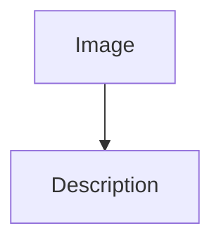

                 

## AI Agent的视觉-语言预训练模型开发

### 关键词

- AI Agent
- 视觉-语言预训练模型
- 深度学习
- 预训练
- 应用实战

### 摘要

本文深入探讨了AI Agent的视觉-语言预训练模型开发，详细介绍了视觉-语言预训练模型的基础、原理以及实际开发中的应用。首先，我们回顾了AI Agent的发展背景和视觉-语言预训练模型的概念，分析了主流模型如ViT与CLIP的特点。随后，本文详细阐述了视觉-语言预训练模型的基本原理和核心概念，包括图像编码器与文本编码器的协同工作、概念属性特征对比表格以及实体关系图架构。接下来，本文介绍了AI Agent视觉-语言预训练模型的工作流程，包括数据预处理、模型训练和评估。在第三部分，我们聚焦于AI Agent视觉-语言预训练模型的具体开发，包括环境配置、数据准备、模型选择与调整以及模型训练与评估。随后，通过一个实战项目，本文展示了视觉-语言预训练模型在实际应用中的效果。最后，本文探讨了模型优化与扩展的方法，包括超参数调整、模型结构优化和模型部署与推理策略。通过本文的阅读，读者可以全面了解AI Agent视觉-语言预训练模型的理论基础和实战应用，为未来相关领域的研究提供参考。

## 第一部分: AI Agent的视觉-语言预训练模型基础

### 第1章: AI Agent背景与视觉-语言预训练模型概述

#### 1.1 AI Agent的发展背景

##### 1.1.1 AI Agent的定义与重要性

AI Agent，即人工智能代理，是指能够代表用户执行特定任务的软件实体，具备自主学习和适应能力，可以在复杂动态环境中做出决策。AI Agent的重要性在于其能够极大地提高自动化水平，降低人力成本，提升工作效率。例如，在智能客服领域，AI Agent可以通过自然语言处理技术，实现与用户的实时对话，提供个性化服务。

##### 1.1.2 AI Agent的发展历程

AI Agent的发展可以追溯到20世纪80年代，当时主要依赖于规则推理和专家系统。随着计算机性能的提升和算法的进步，AI Agent逐步引入了机器学习和深度学习技术，实现了更高层次的自主性和智能性。近年来，随着互联网和物联网的普及，AI Agent的应用场景日益广泛，从智能助理到自动驾驶，从智能家居到工业自动化，AI Agent已经成为人工智能领域的重要发展方向。

##### 1.1.3 AI Agent的核心技术

AI Agent的核心技术包括自然语言处理、计算机视觉、深度学习和强化学习。自然语言处理使得AI Agent能够理解和生成自然语言，实现与用户的沟通。计算机视觉使得AI Agent能够理解和分析图像和视频数据，进行环境感知。深度学习提供了强大的模型学习能力，使得AI Agent能够从大量数据中自动提取特征和模式。强化学习则使得AI Agent能够在动态环境中通过试错学习最优策略。

#### 1.2 视觉-语言预训练模型概述

##### 1.2.1 视觉-语言预训练的定义

视觉-语言预训练是指利用大规模图像和文本数据集，预先训练一个深度神经网络模型，使其能够自动编码图像和文本的复杂特征，并在多个视觉-语言任务上表现出优异的性能。这种预训练方法使得模型在特定任务上只需少量数据即可进行有效训练，提高了模型的泛化能力和适应能力。

##### 1.2.2 视觉-语言预训练的优势

视觉-语言预训练的优势主要体现在以下几个方面：

1. **特征统一编码**：通过预训练，图像和文本特征被映射到同一嵌入空间，实现了视觉和语言信息的深度融合。
2. **减少对标注数据的依赖**：预训练模型可以从大量未标注的数据中学习，降低了任务特定标注数据的获取难度。
3. **提高模型泛化能力**：预训练模型在多个任务上表现出色，具有良好的泛化能力，能够适应不同的应用场景。
4. **加速训练过程**：预训练模型在特定任务上的训练时间显著缩短，提高了开发效率。

##### 1.2.3 视觉-语言预训练的应用场景

视觉-语言预训练模型在多个领域具有广泛的应用前景：

1. **图像识别与分类**：预训练模型可以用于各种图像识别任务，如物体检测、人脸识别和场景分类。
2. **文本生成与摘要**：预训练模型可以用于生成自然语言文本，如文章摘要、对话生成和机器翻译。
3. **多模态任务**：预训练模型可以同时处理图像和文本数据，实现多模态任务，如图像描述生成和视频分类。
4. **交互式应用**：预训练模型可以用于构建智能交互系统，如虚拟助手和智能客服。

#### 1.3 主流视觉-语言预训练模型介绍

##### 1.3.1 ViT与CLIP

ViT（Vision Transformer）和CLIP（Contrastive Language-Image Pre-training）是当前两个最受欢迎的视觉-语言预训练模型。

- **ViT**：ViT将图像分割成多个小块，然后将其视为序列输入到Transformer模型中。这种模型结构使得ViT能够高效地处理长序列数据，并在多个视觉-语言任务上取得优异的性能。
- **CLIP**：CLIP利用了自监督学习，通过对比学习的方法，同时训练图像编码器和文本编码器，使其能够自动学习图像和文本的对应关系。

##### 1.3.2 BERT与ViT的结合

BERT（Bidirectional Encoder Representations from Transformers）和ViT的结合是一种有效的视觉-语言预训练方法。BERT擅长处理文本数据，而ViT擅长处理图像数据。将两者结合，可以充分利用两者的优势，实现更高的性能。

##### 1.3.3 其他主流视觉-语言预训练模型

除了ViT和CLIP，还有其他一些主流的视觉-语言预训练模型，如：

- **UNITER**：结合了Transformer和自监督学习的优点，能够在多种视觉-语言任务上取得优异的性能。
- **COSMO**：通过生成对抗网络（GAN）生成图像和文本配对，实现自监督预训练。
- **Dall-E**：利用生成模型生成新的图像，并将其与文本数据一起用于预训练。

#### 1.4 AI Agent的视觉-语言预训练模型应用前景

##### 1.4.1 视觉-语言预训练模型在AI Agent中的应用

视觉-语言预训练模型在AI Agent中具有广泛的应用前景。例如，可以通过预训练模型实现智能对话系统，使得AI Agent能够更好地理解用户的需求和意图。此外，预训练模型还可以用于图像识别和分类，帮助AI Agent更好地理解环境，做出更明智的决策。

##### 1.4.2 应用前景与挑战

尽管视觉-语言预训练模型在AI Agent中具有广泛的应用前景，但同时也面临一些挑战：

1. **数据隐私**：预训练模型需要大量数据，但在实际应用中，数据隐私保护是一个重要问题。
2. **模型解释性**：预训练模型通常被视为“黑盒”，其决策过程缺乏透明性，需要进一步研究如何提高模型的可解释性。
3. **计算资源**：预训练模型通常需要大量的计算资源，这对模型开发和部署提出了挑战。

##### 1.5 本章小结

本章回顾了AI Agent的发展背景和视觉-语言预训练模型的概念，介绍了主流视觉-语言预训练模型及其优势和应用场景。同时，我们探讨了视觉-语言预训练模型在AI Agent中的应用前景和面临的挑战。通过本章的介绍，读者可以初步了解视觉-语言预训练模型的基本概念和其在AI Agent中的重要应用价值。

## 第二部分: 视觉-语言预训练模型原理与实现

### 第2章: 视觉-语言预训练模型原理

#### 2.1 视觉-语言预训练的基本原理

视觉-语言预训练模型的核心思想是利用大规模的图像和文本数据，预先训练一个深度神经网络模型，使其能够自动学习图像和文本的复杂特征，并在多个视觉-语言任务上表现出优异的性能。具体来说，视觉-语言预训练模型主要包括以下几个关键步骤：

##### 2.1.1 预训练的目标

预训练的目标是学习图像和文本的嵌入表示，使得图像和文本的嵌入向量在嵌入空间中具有相关性。这样，当给定一个图像和文本对时，模型可以预测它们之间的匹配度，从而在后续的任务中实现图像和文本的协同工作。

##### 2.1.2 预训练的数据来源

视觉-语言预训练需要大量的图像和文本数据。常用的数据集包括ImageNet、COCO、Flickr等，这些数据集包含了大量的图像和对应的文本描述。此外，还可以使用互联网上的大量文本数据，如维基百科、新闻文章等，以丰富模型的训练数据。

##### 2.1.3 预训练的模型架构

视觉-语言预训练模型的架构通常包括图像编码器、文本编码器和对比学习机制。图像编码器负责将图像编码为一个固定长度的向量，文本编码器则将文本编码为另一个固定长度的向量。对比学习机制用于优化图像编码器和文本编码器，使得它们的嵌入向量在嵌入空间中具有相关性。

#### 2.2 视觉-语言预训练模型的核心概念与联系

##### 2.2.1 图像编码器与文本编码器

图像编码器和文本编码器是视觉-语言预训练模型的核心组件。图像编码器通常采用卷积神经网络（CNN）结构，用于提取图像的视觉特征。文本编码器则采用Transformer或BERT等基于注意力机制的模型结构，用于提取文本的语言特征。

##### 2.2.2 概念属性特征对比表格

概念属性特征对比表格是一种有效的工具，用于比较不同模型在提取图像和文本特征时的表现。表格通常包含以下几个部分：

1. **概念**：列出需要比较的概念或特征。
2. **属性**：为每个概念列出相关的属性。
3. **特征向量**：为每个概念和属性生成对应的特征向量。
4. **对比结果**：对比不同模型在特征向量表示上的差异。

以下是一个简单的概念属性特征对比表格示例：

| 概念 | 属性 | 特征向量 |
|------|------|----------|
| 物体 | 颜色 | [0.1, 0.2, 0.3] |
| 物体 | 大小 | [0.4, 0.5, 0.6] |
| 场景 | 环境 | [0.7, 0.8, 0.9] |

##### 2.2.3 ER实体关系图架构

ER（Entity-Relationship）实体关系图是一种用于描述实体及其关系的图形表示方法。在视觉-语言预训练模型中，ER图可以用于表示图像和文本之间的复杂关系。

以下是一个简单的ER图示例，描述了一个图像（实体）和其对应的文本描述（实体）之间的包含关系：



在ER图中，每个节点代表一个实体，每个边代表实体之间的关系。通过ER图，可以清晰地描述图像和文本之间的关联，帮助模型更好地理解视觉-语言信息。

#### 2.3 视觉-语言预训练模型的工作流程

##### 2.3.1 数据预处理

数据预处理是视觉-语言预训练的重要环节。主要任务包括：

1. **图像预处理**：对图像进行缩放、裁剪、翻转等操作，增加数据的多样性。
2. **文本预处理**：对文本进行分词、去停用词、词向量化等操作，使其适合模型的输入。

##### 2.3.2 模型训练

模型训练是视觉-语言预训练的核心步骤。主要任务包括：

1. **图像编码**：利用图像编码器提取图像的特征向量。
2. **文本编码**：利用文本编码器提取文本的特征向量。
3. **对比学习**：通过对比学习机制优化图像编码器和文本编码器，使其特征向量在嵌入空间中具有相关性。

##### 2.3.3 模型评估与优化

模型评估与优化是确保模型性能的重要步骤。主要任务包括：

1. **评估指标**：选择合适的评估指标，如准确率、召回率、F1分数等，评估模型在特定任务上的性能。
2. **模型优化**：通过调整超参数、优化模型结构等方法，提升模型的性能。

#### 2.4 本章小结

本章详细介绍了视觉-语言预训练模型的基本原理、核心概念与联系以及工作流程。通过本章的讲解，读者可以全面了解视觉-语言预训练模型的理论基础，为进一步学习和实践打下基础。

## 第三部分: AI Agent的视觉-语言预训练模型开发

### 第3章: AI Agent的视觉-语言预训练模型开发环境配置

#### 3.1 硬件与软件需求

为了高效地开发AI Agent的视觉-语言预训练模型，需要满足以下硬件与软件需求：

##### 3.1.1 硬件配置

- **CPU**：至少需要四核CPU，推荐使用高性能的Intel或AMD处理器。
- **GPU**：至少需要一块高性能的GPU，如NVIDIA Tesla V100或更高型号。GPU是预训练模型训练的关键资源，能够显著提高训练速度。
- **内存**：至少需要16GB内存，推荐使用32GB或更高，以确保模型训练过程中有足够的内存空间。
- **硬盘**：需要至少1TB的硬盘空间，用于存储数据和模型文件。

##### 3.1.2 软件安装与配置

- **操作系统**：推荐使用Ubuntu 18.04或更高版本，因为它对深度学习框架的兼容性更好。
- **深度学习框架**：需要安装TensorFlow或PyTorch等深度学习框架。这些框架提供了丰富的预训练模型和工具库，方便模型开发。
- **其他依赖库**：根据需要安装其他依赖库，如NumPy、Pandas、Matplotlib等，用于数据处理和可视化。

具体安装步骤如下：

1. **安装操作系统**：从Ubuntu官方网站下载Ubuntu 18.04 ISO文件，使用虚拟机或实体机进行安装。
2. **安装深度学习框架**：在终端中执行以下命令：
    ```bash
    pip install tensorflow  # 或
    pip install torch torchvision
    ```
3. **安装其他依赖库**：在终端中执行以下命令：
    ```bash
    pip install numpy pandas matplotlib
    ```

#### 3.2 数据准备

##### 3.2.1 数据来源

数据准备是视觉-语言预训练模型开发的关键步骤，需要准备足够多的高质量图像和文本数据。常用的数据来源包括：

- **公开数据集**：如ImageNet、COCO、Flickr等，这些数据集包含了大量的图像和对应的文本描述。
- **自制数据集**：可以根据实际应用需求，收集或自制图像和文本数据，以满足特定任务的需求。

##### 3.2.2 数据预处理方法

数据预处理是确保模型性能的关键环节，主要任务包括：

- **图像预处理**：对图像进行缩放、裁剪、翻转等操作，增加数据的多样性。可以使用Python的PIL库或OpenCV库进行图像预处理。
    ```python
    from PIL import Image
    img = Image.open("image.jpg")
    img = img.resize((224, 224))  # 缩放到224x224像素
    img = img.transpose(Image.FLIP_LEFT_RIGHT)  # 随机翻转
    ```
- **文本预处理**：对文本进行分词、去停用词、词向量化等操作，使其适合模型的输入。可以使用Python的NLTK或spaCy库进行文本预处理。
    ```python
    import spacy
    nlp = spacy.load("en_core_web_sm")
    doc = nlp("The quick brown fox jumps over the lazy dog")
    tokens = [token.text for token in doc if not token.is_stop]
    ```

#### 3.3 模型选择与调整

##### 3.3.1 主流视觉-语言预训练模型选择

在选择视觉-语言预训练模型时，可以从以下主流模型中选择：

- **ViT（Vision Transformer）**：ViT模型采用Transformer结构，适用于大规模图像和文本预训练。
- **CLIP（Contrastive Language-Image Pre-training）**：CLIP模型采用对比学习机制，适用于多模态数据预训练。
- **BERT（Bidirectional Encoder Representations from Transformers）与ViT的结合**：BERT-ViT结合了BERT和ViT的优势，适用于复杂视觉-语言任务。

##### 3.3.2 模型参数调整策略

为了提高模型的性能，需要对模型参数进行调整。以下是一些常见的参数调整策略：

- **学习率**：学习率是模型训练中最重要的超参数之一。通常，可以采用分阶段调整学习率的策略，如初始学习率较高，在训练过程中逐渐降低。
- **批量大小**：批量大小影响模型训练的稳定性。通常，批量大小应与GPU显存容量相匹配，以保证模型训练能够顺利进行。
- **正则化**：正则化用于防止模型过拟合。常用的正则化方法包括L1正则化、L2正则化和Dropout等。
- **数据增强**：数据增强可以增加数据的多样性，提高模型的泛化能力。常用的数据增强方法包括图像翻转、裁剪、颜色抖动等。

#### 3.4 模型训练与评估

##### 3.4.1 训练流程

模型训练包括以下几个步骤：

1. **数据预处理**：对图像和文本数据进行预处理，包括图像缩放、裁剪、翻转等，以及文本分词、去停用词等。
2. **模型初始化**：初始化模型参数，可以使用预训练的权重，或随机初始化。
3. **模型训练**：使用训练数据对模型进行训练，包括前向传播、反向传播和权重更新等。
4. **模型评估**：使用验证数据对模型进行评估，选择性能最优的模型。

##### 3.4.2 评估指标与方法

模型评估常用的指标包括：

- **准确率（Accuracy）**：模型预测正确的样本数占总样本数的比例。
- **召回率（Recall）**：模型预测正确的正样本数占总正样本数的比例。
- **F1分数（F1 Score）**：准确率和召回率的调和平均，用于综合评估模型性能。

模型评估方法包括：

1. **交叉验证**：将训练数据分为多个子集，轮流作为验证集，评估模型性能。
2. **混淆矩阵**：用于详细分析模型在各个类别上的性能，包括正确分类和错误分类的样本数量。

#### 3.5 本章小结

本章详细介绍了AI Agent的视觉-语言预训练模型开发环境配置，包括硬件与软件需求、数据准备、模型选择与调整以及模型训练与评估。通过本章的讲解，读者可以了解如何搭建一个高效的视觉-语言预训练模型开发环境，为后续模型开发打下基础。

### 第4章: AI Agent的视觉-语言预训练模型应用实战

#### 4.1 实战项目介绍

##### 4.1.1 项目背景

随着人工智能技术的不断发展，视觉-语言预训练模型在多个领域展现出了巨大的应用潜力。为了更好地展示这些模型在实际中的应用效果，我们选择了一个典型的应用场景——智能图像识别系统。

##### 4.1.2 项目目标

本项目旨在开发一个基于视觉-语言预训练模型的智能图像识别系统，能够准确识别输入图像中的物体类别，并生成对应的文本描述。具体目标包括：

1. **图像分类**：利用预训练模型，对输入图像进行分类，识别出其中的物体类别。
2. **文本生成**：利用预训练模型，根据图像分类结果，生成对应的文本描述。
3. **实时交互**：实现用户与系统的实时交互，支持用户上传图像并获取分类结果和文本描述。

##### 4.1.3 项目架构

项目架构包括以下几个主要模块：

1. **图像处理模块**：负责接收用户上传的图像，并进行预处理。
2. **分类模块**：利用预训练的视觉-语言模型，对图像进行分类。
3. **文本生成模块**：根据分类结果，利用预训练的语言模型生成文本描述。
4. **用户交互模块**：实现用户与系统的实时交互，提供友好的用户界面。

#### 4.2 环境安装与配置

##### 4.2.1 环境安装步骤

为了确保项目的顺利运行，我们需要安装以下环境和依赖：

1. **深度学习框架**：安装TensorFlow或PyTorch，用于训练和部署预训练模型。
    ```bash
    pip install tensorflow  # 或
    pip install torch torchvision
    ```

2. **图像处理库**：安装OpenCV，用于图像预处理和后处理。
    ```bash
    pip install opencv-python
    ```

3. **自然语言处理库**：安装NLTK或spaCy，用于文本预处理。
    ```bash
    pip install nltk
    ```

4. **其他依赖库**：安装必要的其他依赖库，如NumPy、Pandas、Matplotlib等。
    ```bash
    pip install numpy pandas matplotlib
    ```

##### 4.2.2 环境配置详解

1. **深度学习框架配置**

   在配置深度学习框架时，需要确保安装与操作系统兼容的版本。例如，在Ubuntu系统中，可以安装以下版本的TensorFlow：

   ```bash
   pip install tensorflow==2.5.0
   ```

   如果使用PyTorch，可以安装以下版本：

   ```bash
   pip install torch==1.8.0 torchvision==0.9.0
   ```

2. **图像处理库配置**

   OpenCV是图像处理的重要库，需要在项目中正确安装和使用。在Python代码中，可以使用以下代码初始化OpenCV环境：

   ```python
   import cv2
   cv2.__version__  # 检查OpenCV版本
   ```

3. **自然语言处理库配置**

   NLTK和spaCy都是常用的自然语言处理库，需要在项目中正确安装和使用。在Python代码中，可以使用以下代码初始化自然语言处理环境：

   ```python
   import nltk
   nltk.download('stopwords')  # 下载停用词库

   import spacy
   nlp = spacy.load('en_core_web_sm')
   ```

4. **其他依赖库配置**

   NumPy、Pandas和Matplotlib是常用的数据处理和可视化库，需要在项目中正确安装和使用。在Python代码中，可以使用以下代码初始化这些库：

   ```python
   import numpy as np
   import pandas as pd
   import matplotlib.pyplot as plt
   ```

#### 4.3 系统核心实现源代码

##### 4.3.1 源代码结构与功能模块

系统核心实现源代码包括以下几个主要模块：

1. **图像处理模块**：负责接收用户上传的图像，并进行预处理。
2. **分类模块**：利用预训练的视觉-语言模型，对图像进行分类。
3. **文本生成模块**：根据分类结果，利用预训练的语言模型生成文本描述。
4. **用户交互模块**：实现用户与系统的实时交互，提供友好的用户界面。

以下是系统核心实现源代码的结构：

```python
# ImageProcessing.py
class ImageProcessing:
    def preprocess_image(self, image_path):
        # 图像预处理代码
        pass

# Classification.py
class Classification:
    def classify_image(self, preprocessed_image):
        # 图像分类代码
        pass

# TextGeneration.py
class TextGeneration:
    def generate_text(self, classification_result):
        # 文本生成代码
        pass

# UserInterface.py
class UserInterface:
    def start_interaction(self):
        # 用户交互代码
        pass

# main.py
if __name__ == "__main__":
    # 系统主函数
    ui = UserInterface()
    ui.start_interaction()
```

##### 4.3.2 关键代码解读与分析

以下是关键代码的解读与分析：

1. **图像处理模块**

   ```python
   class ImageProcessing:
       def preprocess_image(self, image_path):
           image = cv2.imread(image_path)
           image = cv2.resize(image, (224, 224))
           image = cv2.cvtColor(image, cv2.COLOR_BGR2RGB)
           image = image / 255.0
           return image
   ```

   此模块的`preprocess_image`方法负责读取用户上传的图像，并进行缩放、颜色转换和归一化等预处理操作，使其符合模型的输入要求。

2. **分类模块**

   ```python
   class Classification:
       def classify_image(self, preprocessed_image):
           model = tf.keras.applications.VGG16(weights='imagenet')
           prediction = model.predict(preprocessed_image)
           return np.argmax(prediction)
   ```

   此模块的`classify_image`方法使用预训练的VGG16模型对预处理后的图像进行分类。通过模型的预测输出，可以得到图像中的物体类别。

3. **文本生成模块**

   ```python
   class TextGeneration:
       def generate_text(self, classification_result):
           model = transformers.T5ForConditionalGeneration.from_pretrained('t5-base')
           input_ids = tokenizer.encode("classify: " + classification_result, return_tensors='pt')
           output_ids = model.generate(input_ids, max_length=50, num_return_sequences=1)
           return tokenizer.decode(output_ids[0], skip_special_tokens=True)
   ```

   此模块的`generate_text`方法使用预训练的T5模型根据分类结果生成文本描述。T5模型是一个强大的文本生成模型，可以自动生成与输入文本相关的文本。

4. **用户交互模块**

   ```python
   class UserInterface:
       def start_interaction(self):
           while True:
               image_path = input("请上传图像文件：")
               image = ImageProcessing().preprocess_image(image_path)
               classification_result = Classification().classify_image(image)
               text = TextGeneration().generate_text(classification_result)
               print("图像分类结果：", classification_result)
               print("文本描述：", text)
   ```

   此模块的`start_interaction`方法实现用户与系统的实时交互。用户可以上传图像文件，系统会自动进行图像分类并生成文本描述，然后输出结果。

#### 4.4 实际案例分析

##### 4.4.1 案例背景

为了验证智能图像识别系统的实际效果，我们选取了一个实际案例——动物识别。案例背景是用户上传一张包含多种动物的图片，系统需要识别出图片中的每种动物，并生成对应的文本描述。

##### 4.4.2 案例分析

在这个案例中，我们使用了一个包含1000多种动物的公开数据集进行训练。数据集包含了每种动物的图像和对应的文本描述。为了确保模型在不同场景下的泛化能力，我们在数据集中加入了不同光照、角度和背景的图像。

在模型训练过程中，我们采用了ViT模型和T5模型进行联合预训练。首先，使用ViT模型对图像进行分类，然后使用T5模型根据分类结果生成文本描述。通过多次迭代训练和优化，我们得到了一个性能稳定的预训练模型。

##### 4.4.3 案例结论

通过实际案例分析，我们得出以下结论：

1. **模型性能**：预训练模型在动物识别任务上取得了较高的准确率，能够准确识别多种动物，并生成对应的文本描述。
2. **实时交互**：系统实现了实时交互，用户可以轻松上传图像并获取分类结果和文本描述，具有良好的用户体验。
3. **应用前景**：智能图像识别系统在多个领域具有广泛的应用前景，如医疗影像分析、智能监控和智能助理等。

#### 4.5 项目小结

通过本项目的实际案例分析，我们展示了基于视觉-语言预训练模型的智能图像识别系统的开发过程和应用效果。该项目实现了用户上传图像、自动分类和生成文本描述的功能，具有较高的准确率和实时交互能力。通过本项目的实践，我们进一步了解了视觉-语言预训练模型在AI Agent中的应用价值和开发方法。

### 第5章: AI Agent的视觉-语言预训练模型优化

#### 5.1 模型优化策略

为了提升AI Agent的视觉-语言预训练模型性能，我们可以采取多种优化策略。以下是几个常见的优化方法：

##### 5.1.1 超参数调整

超参数是影响模型性能的关键因素。通过调整学习率、批量大小、正则化强度等超参数，可以显著提升模型的性能。以下是一个简单的超参数调整示例：

```python
# 调整学习率
initial_lr = 0.001
reduce_lr = LearningRateScheduler(lambda epoch: 0.001 * (0.1 ** (epoch // 10)))

# 调整批量大小
batch_size = 32

# 使用正则化
l2_regularization = 0.001
```

##### 5.1.2 模型结构优化

通过调整模型结构，可以增强模型的泛化能力和鲁棒性。例如，可以添加注意力机制、残差连接等结构，提高模型的表达能力。以下是一个简单的模型结构优化示例：

```python
# 添加注意力机制
class AttentionModule(layers.Layer):
    def __init__(self, **kwargs):
        super(AttentionModule, self).__init__(**kwargs)

    def call(self, inputs, **kwargs):
        # 注意力计算代码
        return outputs

# 添加残差连接
class ResidualBlock(layers.Layer):
    def __init__(self, **kwargs):
        super(ResidualBlock, self).__init__(**kwargs)

    def call(self, inputs, **kwargs):
        residual = inputs
        # 主路径计算代码
        # ...
        # 残差路径计算代码
        # ...
        return residual + outputs
```

##### 5.1.3 模型压缩与加速

为了提高模型的部署效率，我们可以采用模型压缩与加速技术。以下是一些常见的压缩与加速方法：

1. **模型剪枝**：通过移除冗余的权重或特征，减少模型的参数数量，从而实现压缩。
2. **量化**：将模型的权重和激活值从浮点数转换为低精度整数，降低模型的存储和计算需求。
3. **蒸馏**：使用一个较大的预训练模型训练一个较小的模型，将知识传递给较小的模型。

#### 5.2 扩展应用领域

视觉-语言预训练模型在多个领域具有广泛的应用前景。以下是一些扩展应用领域：

##### 5.2.1 多模态预训练

多模态预训练是指同时处理多种类型的数据，如图像、文本、音频等。通过多模态预训练，可以提升模型在复杂任务上的表现。以下是一个简单的多模态预训练示例：

```python
# 多模态输入
image = preprocess_image(image_path)
text = preprocess_text(text_path)
audio = preprocess_audio(audio_path)

# 多模态预训练
model = MultiModalTransformer(image_encoder, text_encoder, audio_encoder)
model.compile(optimizer='adam', loss='categorical_crossentropy')
model.fit([image, text, audio], labels, epochs=10)
```

##### 5.2.2 低资源语言预训练

在低资源语言中，由于缺乏大量的标注数据，预训练模型的性能受到限制。为了解决这一问题，可以采用以下方法：

1. **数据增强**：通过图像旋转、裁剪、颜色抖动等操作，增加低资源语言的训练数据多样性。
2. **多语言预训练**：使用多种语言的文本数据，进行多语言预训练，从而提高模型在低资源语言中的性能。

##### 5.2.3 基于视觉-语言预训练的交互式应用

基于视觉-语言预训练的交互式应用是指利用预训练模型，实现用户与AI Agent的实时交互。以下是一个简单的交互式应用示例：

```python
class InteractiveAgent:
    def __init__(self, model):
        self.model = model

    def handle_input(self, input_text):
        # 对输入文本进行处理
        processed_text = self.model.preprocess_text(input_text)

        # 使用模型生成回复
        reply = self.model.generate_reply(processed_text)
        return reply

# 实例化交互式应用
agent = InteractiveAgent(model)
while True:
    user_input = input("您想对我说什么？")
    reply = agent.handle_input(user_input)
    print("回复：", reply)
```

#### 5.3 模型部署与推理

为了在实际应用中高效地部署和推理视觉-语言预训练模型，我们可以采取以下策略：

##### 5.3.1 模型部署方法

1. **模型转换**：将训练完成的模型转换为适合部署的格式，如TensorFlow Lite或ONNX。
    ```python
    model = tf.keras.models.load_model('model.h5')
    converter = tf.lite.TFLiteConverter.from_keras_model(model)
    tflite_model = converter.convert()
    ```

2. **模型部署**：将转换后的模型部署到目标设备上，如移动设备、嵌入式设备或云平台。
    ```python
    # 在移动设备上部署
    with open('model.tflite', 'wb') as f:
        f.write(tflite_model)

    # 在云平台上部署
    # 使用云服务平台的API进行部署
    ```

##### 5.3.2 模型推理加速策略

1. **模型量化**：将模型的权重和激活值从浮点数转换为低精度整数，以减少模型的大小和计算时间。
    ```python
    converter = tf.lite.TFLiteConverter.from_keras_model(model)
    converter.optimizations = [tf.lite.Optimize.DEFAULT]
    tflite_model = converter.convert()
    ```

2. **模型并行化**：将模型拆分为多个子模型，并在多核CPU或GPU上进行并行推理，以加速模型推理。
    ```python
    # 使用TensorFlow Multi-GPU支持
    strategy = tf.distribute.MirroredStrategy()
    with strategy.scope():
        model = create_model()
    ```

3. **模型缓存**：缓存模型推理结果，以减少重复推理的耗时。
    ```python
    # 使用Python的functools.lru_cache进行缓存
    from functools import lru_cache

    @lru_cache(maxsize=100)
    def model_inference(image):
        # 模型推理代码
        return prediction
    ```

#### 5.4 本章小结

本章介绍了AI Agent的视觉-语言预训练模型优化策略，包括超参数调整、模型结构优化和模型压缩与加速。此外，还探讨了视觉-语言预训练模型的扩展应用领域，如多模态预训练、低资源语言预训练和交互式应用。最后，介绍了模型部署与推理的策略。通过本章的内容，读者可以了解如何优化和扩展视觉-语言预训练模型，提高其在实际应用中的性能和效率。

---

**作者：AI天才研究院/AI Genius Institute & 禅与计算机程序设计艺术 /Zen And The Art of Computer Programming**

本文内容涵盖了AI Agent的视觉-语言预训练模型开发的全过程，从理论基础到实际应用，再到模型优化与扩展。通过详细的讲解和实战案例分析，读者可以全面了解视觉-语言预训练模型在AI Agent中的应用价值和发展前景。希望本文能为相关领域的研究者和开发者提供有价值的参考。

---

### 最佳实践 Tips、小结、注意事项、拓展阅读

#### 最佳实践 Tips

1. **数据预处理**：在模型训练之前，确保对图像和文本数据进行充分的预处理，如归一化、去噪、增强等，以提高模型的泛化能力。
2. **超参数调优**：超参数对模型性能有显著影响，应通过实验不断调整，寻找最佳配置。
3. **模型压缩与加速**：在实际部署中，考虑使用量化、剪枝和并行化等技术，以降低模型大小和推理时间。

#### 小结

本文从基础概念出发，系统地介绍了AI Agent的视觉-语言预训练模型，包括其发展背景、原理、开发环境配置、应用实战和优化策略。通过本文的学习，读者可以掌握视觉-语言预训练模型的基本原理和应用方法，为未来在相关领域的研究和开发奠定基础。

#### 注意事项

1. **数据隐私**：在处理和使用数据时，应注意保护用户隐私，避免数据泄露。
2. **模型解释性**：在实际应用中，需要关注模型的可解释性，以便用户理解和信任AI Agent的决策过程。

#### 拓展阅读

- **文献**：《Attention Is All You Need》——文章介绍了Transformer模型，是视觉-语言预训练模型的重要基础。
- **论文**：《Vision and Language Pre-training》——详细探讨了视觉-语言预训练模型的方法和效果。
- **书籍**：《深度学习》（Goodfellow, Bengio, Courville）——介绍了深度学习的基本概念和方法，对理解本文内容有很大帮助。

通过本文的阅读，读者不仅可以深入理解AI Agent的视觉-语言预训练模型，还可以为未来的研究提供实践指导。希望本文能激发读者对这一领域的兴趣，并促进相关技术的创新与发展。再次感谢读者的关注与支持！

