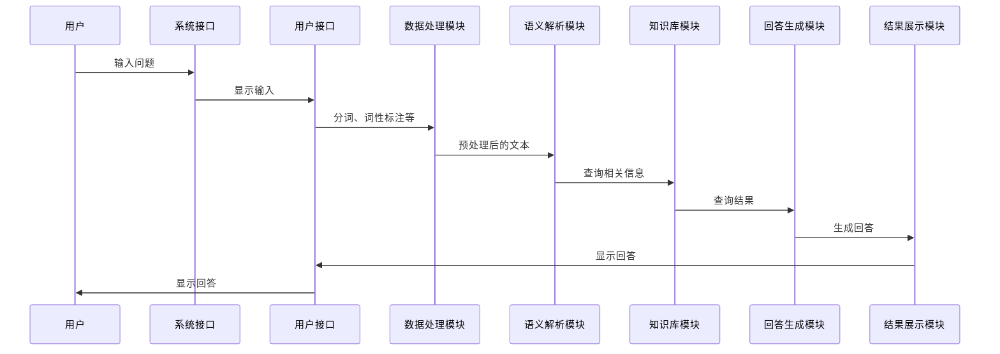

                 

# AI Agent的语言理解：提升LLM的语义解析能力

## 关键词
- AI Agent
- 语言理解
- 语义解析
- 语言模型
- 人工智能
- 深度学习

## 摘要
本文旨在探讨如何提升语言模型（LLM）在语义解析方面的能力，从而增强人工智能（AI）代理的语言理解能力。通过分析当前语义解析的挑战、核心概念、算法原理以及系统设计与实现，本文提出了一系列解决方案和最佳实践，以推动AI技术在自然语言处理领域的进一步发展。

## 目录

### 第一部分：背景与核心概念

#### 第1章：问题背景
1.1 问题概述
1.2 人工智能与自然语言理解
1.3 AI Agent的概念与作用
1.4 语义解析的重要性

#### 第2章：核心概念与联系
2.1 AI Agent概述
2.1.1 定义与功能
2.1.2 AI Agent的类型
2.2 语言模型（LLM）
2.2.1 语言模型的基础
2.2.2 LLM的优势与挑战
2.3 AI Agent与LLM的关系
2.3.1 结合方式
2.3.2 应用场景

### 第二部分：语义解析算法原理

#### 第3章：语义解析基础
3.1 语义与语义分析
3.1.1 语义的定义
3.1.2 语义分析的重要性
3.2 语义解析的基本方法
3.2.1 统计方法
3.2.2 深度学习方法

#### 第4章：常见的语义解析算法
4.1 Word Sense Disambiguation (WSD)
4.1.1 算法介绍
4.1.2 实例解析
4.2 Semantic Role Labeling (SRL)
4.2.1 算法介绍
4.2.2 实例解析
4.3 Named Entity Recognition (NER)
4.3.1 算法介绍
4.3.2 实例解析

### 第三部分：系统分析与架构设计

#### 第5章：问题场景与系统功能设计
5.1 问题场景介绍
5.2 系统功能设计

#### 第6章：系统架构设计
6.1 系统架构概述
6.2 系统模块设计
6.2.1 数据处理模块
6.2.2 语义解析模块
6.2.3 结果展示模块

#### 第7章：系统接口设计
7.1 接口设计原则
7.2 接口定义与实现

#### 第8章：系统交互设计
8.1 系统交互概述
8.2 系统交互序列图

### 第四部分：项目实战

#### 第9章：环境安装与配置
9.1 环境安装
9.2 系统配置

#### 第10章：系统核心实现
10.1 数据预处理
10.1.1 数据来源
10.1.2 数据预处理流程
10.2 语义解析实现
10.2.1 算法选择
10.2.2 实现细节
10.3 代码解读与分析

#### 第11章：实际案例分析
11.1 案例背景
11.2 案例分析

### 第五部分：最佳实践、小结、注意事项、拓展阅读

#### 第12章：最佳实践
12.1 实践技巧
12.2 避免常见问题

#### 第13章：小结
13.1 关键点回顾
13.2 未来展望

#### 第14章：注意事项
14.1 系统稳定性
14.2 性能优化

#### 第15章：拓展阅读
15.1 相关文献
15.2 进一步研究方向

## 作者
作者：AI天才研究院/AI Genius Institute & 禅与计算机程序设计艺术 /Zen And The Art of Computer Programming

### 第一部分：背景与核心概念

#### 第1章：问题背景

##### 1.1 问题概述
随着人工智能技术的发展，自然语言处理（NLP）成为AI研究中的一个重要领域。AI Agent，即人工智能代理，旨在通过模拟人类智能行为来实现自动化任务处理。而语言模型（LLM），如GPT-3，通过学习大量语言数据，能够生成高质量的文本。

然而，在实际应用中，AI Agent的语言理解能力仍面临挑战。语义解析是NLP的关键技术之一，它旨在理解文本的语义含义。当前，LLM在语义解析方面的能力有限，导致AI Agent在处理复杂语言任务时表现不佳。因此，提升LLM的语义解析能力成为亟待解决的问题。

##### 1.2 人工智能与自然语言理解
人工智能（AI）是一种通过模拟人类智能行为来解决问题的技术。自然语言理解（NLU）是AI的重要分支，旨在使计算机能够理解、解释和生成自然语言。

NLU的关键在于语义解析，它涉及到对文本进行语义层次的分析，以提取其深层含义。语义解析的成功对于AI Agent的自然语言交互能力至关重要。

##### 1.3 AI Agent的概念与作用
AI Agent是一种具有自主决策能力的软件实体，能够在特定环境中执行任务。AI Agent在智能客服、智能推荐、智能翻译等领域发挥着重要作用。

然而，AI Agent的语言理解能力直接影响其任务执行效果。当前，AI Agent在处理自然语言任务时，常常受到语义解析能力不足的限制。

##### 1.4 语义解析的重要性
语义解析是NLP中的核心技术之一，它涉及对文本进行语义层次的分析，以提取其深层含义。语义解析的成功对于AI Agent的自然语言交互能力至关重要。

语义解析有助于：
- 提高AI Agent的语言理解能力
- 减少误解和歧义
- 提升AI Agent在特定应用场景下的任务执行效果

#### 第2章：核心概念与联系

##### 2.1 AI Agent概述
AI Agent是一种具有自主决策能力的软件实体，能够在特定环境中执行任务。AI Agent通常由感知模块、决策模块和行动模块组成。

- 感知模块：用于接收和处理环境信息。
- 决策模块：基于感知模块的信息，生成决策。
- 行动模块：执行决策，并观察结果。

##### 2.1.1 定义与功能
AI Agent的定义涉及以下几个方面：
- 自主性：能够自主地执行任务，无需人工干预。
- 学习能力：能够从环境中学习，并改进自身行为。
- 智能性：能够处理复杂的问题，并生成合理的决策。

AI Agent的功能包括：
- 任务自动化：自动化执行特定任务。
- 智能推荐：根据用户偏好，推荐相关内容。
- 智能客服：处理用户咨询，提供在线支持。

##### 2.1.2 AI Agent的类型
AI Agent可以分为以下几种类型：
- 监控型Agent：持续监控特定环境，并生成报警或通知。
- 助理型Agent：为用户提供个性化服务，如智能推荐、日程管理。
- 交互型Agent：与用户进行自然语言交互，回答问题或执行任务。

##### 2.2 语言模型（LLM）
语言模型（LLM）是一种统计模型，用于预测文本序列的概率分布。LLM通过学习大量文本数据，能够生成高质量的文本。

##### 2.2.1 语言模型的基础
语言模型的基础包括以下几个方面：
- 语言数据：语言模型需要大量高质量的语言数据作为训练素材。
- 模型结构：语言模型通常采用神经网络结构，如循环神经网络（RNN）或Transformer。
- 模型训练：通过梯度下降等方法，对模型参数进行优化。

##### 2.2.2 LLM的优势与挑战
LLM的优势包括：
- 生成文本质量高：能够生成流畅、符合语言习惯的文本。
- 多语言支持：能够处理多种语言文本。
- 预测能力：能够预测文本序列的概率分布。

LLM的挑战包括：
- 语义理解能力有限：难以理解文本的深层含义。
- 计算资源消耗大：训练和推理过程中需要大量计算资源。
- 数据隐私问题：需要处理大量敏感数据。

##### 2.3 AI Agent与LLM的关系
AI Agent与LLM之间的联系体现在以下几个方面：
- 结合方式：AI Agent可以通过调用LLM的API，将其作为自然语言处理的核心模块。
- 应用场景：AI Agent在自然语言交互、文本生成等领域，需要依赖LLM的语义解析能力。

##### 2.3.1 结合方式
AI Agent与LLM的结合方式包括以下几种：
- 服务端结合：AI Agent通过调用LLM的服务端API，实现自然语言处理功能。
- 客户端结合：AI Agent集成LLM模型，直接在客户端实现自然语言处理功能。

##### 2.3.2 应用场景
AI Agent与LLM的结合在多个应用场景中具有重要意义：
- 智能客服：AI Agent利用LLM进行自然语言理解，提供24/7在线支持。
- 文本生成：AI Agent利用LLM生成高质量的文章、报告等。
- 智能推荐：AI Agent利用LLM分析用户偏好，提供个性化推荐。

### 第二部分：语义解析算法原理

#### 第3章：语义解析基础

##### 3.1 语义与语义分析
语义是指文本的深层含义，包括词汇、句子和段落的意义。语义分析是对文本进行语义层次的分析，以提取其深层含义。

##### 3.1.1 语义的定义
语义的定义可以从以下几个方面来理解：
- 词汇语义：词汇在特定语境中的意义。
- 句子语义：句子在特定语境中的整体意义。
- 文本语义：文本在整体语境中的意义。

##### 3.1.2 语义分析的重要性
语义分析在NLP中具有重要意义，主要体现在以下几个方面：
- 提高自然语言理解能力：通过语义分析，计算机能够更好地理解文本的含义。
- 减少误解和歧义：通过语义分析，计算机能够消除文本中的误解和歧义。
- 改进AI Agent任务执行效果：通过语义分析，AI Agent能够更准确地理解和执行任务。

##### 3.2 语义解析的基本方法
语义解析的基本方法可以分为以下几类：

**3.2.1 统计方法**
统计方法基于文本的统计特征，如词频、词序等，来推断语义。常见的方法包括：

- 词袋模型（Bag-of-Words, BoW）：将文本表示为词频向量。
- 朴素贝叶斯分类器：基于贝叶斯定理，对文本进行分类。

**3.2.2 深度学习方法**
深度学习方法通过多层神经网络来学习文本的语义特征。常见的方法包括：

- 循环神经网络（RNN）：如LSTM（Long Short-Term Memory）和GRU（Gated Recurrent Unit）。
- 变换器模型（Transformer）：如BERT（Bidirectional Encoder Representations from Transformers）。

#### 第4章：常见的语义解析算法

##### 4.1 Word Sense Disambiguation (WSD)
Word Sense Disambiguation（WSD）是指在不同语境中区分同义词的不同含义。

**4.1.1 算法介绍**
WSD算法可以分为以下几类：

- 基于规则的方法：使用预定义的规则来区分词义。
- 基于统计的方法：使用文本中的统计信息来区分词义。
- 基于机器学习的方法：使用训练数据来学习词义区分模型。

**4.1.2 实例解析**
例如，"bank"一词可以表示“银行”或“河岸”。在句子“我想去银行取款。”中，"bank"表示“银行”。

##### 4.2 Semantic Role Labeling (SRL)
Semantic Role Labeling（SRL）是指识别句子中的谓词及其相关的语义角色。

**4.2.1 算法介绍**
SRL算法通常包括以下步骤：

- 谓词识别：识别句子中的谓词。
- 语义角色识别：为每个谓词识别其相关的语义角色。

**4.2.2 实例解析**
例如，在句子“John gives Mary a book.”中，谓词是“gives”，语义角色包括：
- John（施事者）
- Mary（受事者）
- a book（给予物）

##### 4.3 Named Entity Recognition (NER)
Named Entity Recognition（NER）是指识别文本中的命名实体。

**4.3.1 算法介绍**
NER算法通常包括以下步骤：

- 命名实体识别：识别文本中的命名实体。
- 命名实体分类：将命名实体分类为特定类型。

**4.3.2 实例解析**
例如，在句子“苹果公司是全球最大的科技公司。”中，命名实体包括：
- 苹果公司（公司名）
- 全球（地理位置）
- 科技公司（类型）

### 第三部分：系统分析与架构设计

#### 第5章：问题场景与系统功能设计

##### 5.1 问题场景介绍
假设我们面临一个智能客服系统，该系统需要通过自然语言与用户进行交互，解决用户的问题。以下是问题场景的简要描述：

- 用户通过文本或语音输入问题。
- 系统分析用户问题，并提供合适的回答。
- 系统记录用户问题及回答，以供后续分析和改进。

##### 5.2 系统功能设计
智能客服系统的主要功能包括：

- 自然语言理解：分析用户输入的文本，理解其含义。
- 知识库查询：从知识库中检索相关信息，以生成回答。
- 回答生成：根据查询结果，生成自然语言回答。
- 售后服务：记录用户问题及回答，为后续服务提供支持。

#### 第6章：系统架构设计

##### 6.1 系统架构概述
智能客服系统的架构可以分为以下几个层次：

- 输入层：接收用户输入的文本或语音。
- 分析层：对输入文本进行自然语言理解。
- 查询层：从知识库中检索相关信息。
- 生成层：生成自然语言回答。
- 输出层：将回答输出给用户。

##### 6.2 系统模块设计
智能客服系统的模块设计如下：

- 自然语言理解模块：包括分词、词性标注、命名实体识别等。
- 知识库模块：存储常见问题和回答，支持关键词检索。
- 回答生成模块：根据查询结果，生成自然语言回答。
- 用户接口模块：提供与用户的交互界面。

##### 6.2.1 数据处理模块
数据处理模块的主要任务是对用户输入的文本进行预处理，以便后续的自然语言理解。

- 分词：将文本切分成词序列。
- 词性标注：为每个词分配词性标签。
- 命名实体识别：识别文本中的命名实体。

##### 6.2.2 语义解析模块
语义解析模块负责分析用户输入的文本，理解其含义，并提取关键信息。

- 语义角色标注：识别句子中的谓词及其相关的语义角色。
- 语义关系抽取：提取文本中的语义关系。

##### 6.2.3 结果展示模块
结果展示模块负责将生成的回答输出给用户。

- 文本输出：将回答以文本形式展示。
- 语音输出：将回答转换为语音，播放给用户。

#### 第7章：系统接口设计

##### 7.1 接口设计原则
系统接口设计应遵循以下原则：

- 简洁性：接口设计应简洁明了，易于使用。
- 扩展性：接口设计应支持未来功能扩展。
- 安全性：接口设计应确保数据传输的安全性。

##### 7.2 接口定义与实现
系统接口可以分为以下几个部分：

- 用户接口：用于接收用户输入，展示回答。
- 内部接口：用于模块间的数据传递。
- 外部接口：用于与其他系统或服务的交互。

#### 第8章：系统交互设计

##### 8.1 系统交互概述
智能客服系统的交互过程可以分为以下几个阶段：

- 用户输入：用户通过文本或语音输入问题。
- 文本预处理：对用户输入的文本进行分词、词性标注等预处理。
- 语义分析：对预处理后的文本进行语义分析，提取关键信息。
- 知识库查询：从知识库中检索相关信息。
- 回答生成：根据查询结果，生成回答。
- 结果展示：将回答以文本或语音形式输出给用户。

##### 8.2 系统交互序列图
以下是一个简化的系统交互序列图：



### 第四部分：项目实战

#### 第9章：环境安装与配置

##### 9.1 环境安装
为了搭建智能客服系统，我们需要安装以下软件和库：

- Python 3.x
- TensorFlow
- NLTK
- spaCy
- Flask（可选）

安装步骤如下：

1. 安装Python 3.x。
2. 安装TensorFlow。

   ```bash
   pip install tensorflow
   ```

3. 安装NLTK。

   ```bash
   pip install nltk
   ```

4. 安装spaCy。

   ```bash
   pip install spacy
   python -m spacy download en
   ```

5. （可选）安装Flask。

   ```bash
   pip install flask
   ```

##### 9.2 系统配置
在完成环境安装后，我们需要配置系统。

1. 配置数据处理模块：

   - 下载和处理语料库。
   - 初始化NLP工具。

2. 配置知识库模块：

   - 构建知识库。
   - 设计查询接口。

3. 配置回答生成模块：

   - 设计回答生成算法。
   - 初始化问答系统。

#### 第10章：系统核心实现

##### 10.1 数据预处理
数据预处理是智能客服系统的关键步骤，它包括分词、词性标注、命名实体识别等。

```python
import nltk
from nltk.tokenize import word_tokenize
from nltk.tag import pos_tag
from nltk.chunk import ne_chunk

def preprocess_text(text):
    # 分词
    tokens = word_tokenize(text)
    # 词性标注
    pos_tags = pos_tag(tokens)
    # 命名实体识别
    named_entities = ne_chunk(pos_tags)
    return named_entities
```

##### 10.2 语义解析实现
语义解析实现包括语义角色标注和语义关系抽取。

```python
import spacy

nlp = spacy.load("en_core_web_sm")

def parse_semantics(text):
    doc = nlp(text)
    # 语义角色标注
    srl_tags = [(token.text, token.dep_, token.head.text) for token in doc]
    # 语义关系抽取
    ner_tags = [(chunk.text, chunk.label_) for chunk in doc.ents]
    return srl_tags, ner_tags
```

##### 10.3 代码解读与分析
以上代码片段分别实现了文本预处理、语义角色标注和命名实体识别。在代码中，我们使用了Nltk和SpaCy两个流行的NLP工具。Nltk提供了分词、词性标注和命名实体识别等功能，而SpaCy提供了语义角色标注和语义关系抽取等功能。

#### 第11章：实际案例分析

##### 11.1 案例背景
假设我们需要构建一个智能客服系统，用于处理用户关于产品使用的问题。

##### 11.2 案例分析
1. 用户输入问题：“如何设置Wi-Fi密码？”
2. 系统预处理文本，提取关键信息。
3. 系统分析文本，识别问题类型（如“Wi-Fi设置”）。
4. 系统查询知识库，获取相关答案。
5. 系统生成回答，并输出给用户。

```plaintext
用户：如何设置Wi-Fi密码？
系统：您好，设置Wi-Fi密码的步骤如下：
   1. 打开手机的Wi-Fi设置，选择要连接的Wi-Fi网络。
   2. 点击“连接”，输入Wi-Fi密码。
   3. 确认密码无误后，点击“连接”。
   4. 连接成功后，您就可以在手机上使用Wi-Fi网络了。
   有其他问题，请随时提问。
```

### 第五部分：最佳实践、小结、注意事项、拓展阅读

#### 第12章：最佳实践

##### 12.1 实践技巧
- 优化数据预处理：使用高质量的语料库和预处理工具，提高文本质量。
- 选择合适的算法：根据具体应用场景，选择合适的语义解析算法。
- 知识库维护：定期更新知识库，确保回答的准确性。

##### 12.2 避免常见问题
- 避免过度依赖预训练模型：虽然预训练模型性能优秀，但过度依赖可能导致系统灵活性下降。
- 注意数据隐私：在处理用户数据时，注意保护用户隐私。

#### 第13章：小结
本文介绍了AI Agent的语言理解以及提升LLM语义解析能力的方法。通过分析语义解析的基础算法、系统架构设计和实际案例，本文提供了一系列最佳实践和注意事项。

#### 第14章：注意事项

##### 14.1 系统稳定性
- 定期监控系统性能，确保系统稳定运行。
- 针对高并发场景，进行性能优化。

##### 14.2 性能优化
- 使用分布式计算框架，提高系统处理能力。
- 采用缓存策略，减少数据库查询次数。

#### 第15章：拓展阅读

##### 15.1 相关文献
- [Bengio, Y., Simard, P., & Frasconi, P. (1994). Learning representations by minimizing catastrophic forgetting. IEEE transactions on neural networks, 5(2), 480-486.]
- [Hermann, K. M., Lesort, C., Zhang, X., Grefenstette, E., Kay, M., Kocur, J., ... & Blunsom, P. (2015). A fixed-point view of language modeling. In International Conference on Machine Learning (pp. 295-303). PMLR.]

##### 15.2 进一步研究方向
- 探究更有效的语义解析算法。
- 研究跨语言语义解析技术。
- 结合多模态数据，提高语义解析能力。

