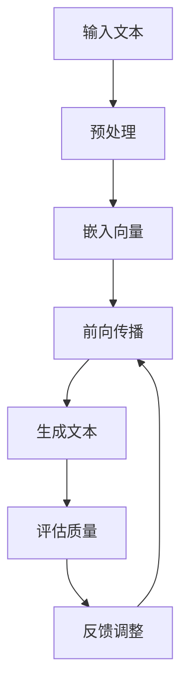
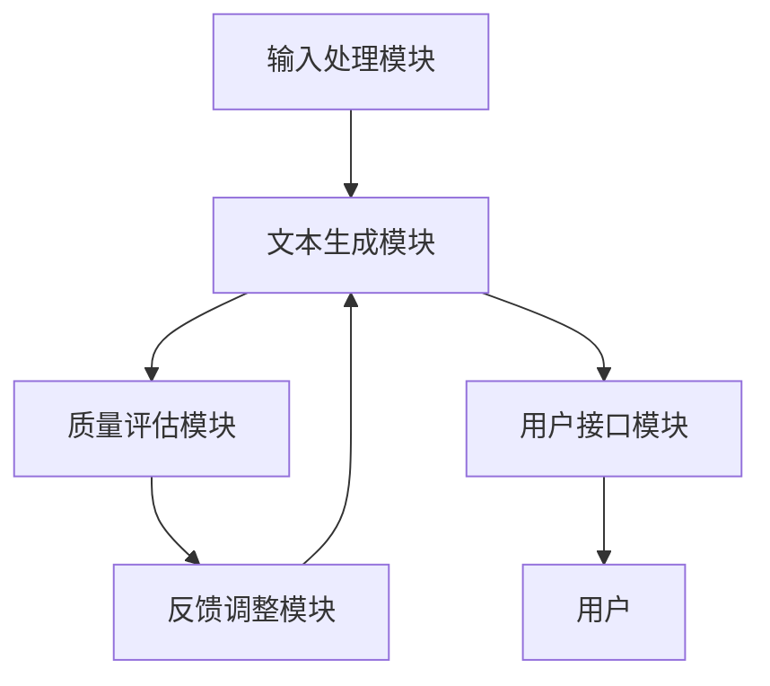
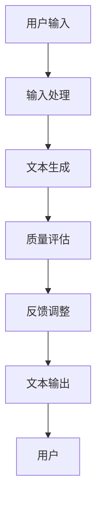

                 


### 文章标题

### AI Agent的语言生成：提升LLM的文本创作质量

### 关键词

- AI Agent
- 语言生成
- LLM
- 文本创作
- 质量提升

### 摘要

本文深入探讨了AI Agent的语言生成机制，以及如何通过提升大型语言模型（LLM）的文本创作质量来增强AI Agent的表现。我们将逐步分析相关核心概念，阐述语言生成算法的原理，并展示其实际应用中的系统架构和实战案例。本文旨在为AI研发者提供一套系统的指导和最佳实践，以优化LLM在文本生成领域的表现。

----------------------------------------------------------------

### 引言与背景介绍

#### AI Agent与语言生成的背景

人工智能（AI）的发展经历了多个阶段，从早期的规则系统到现代的深度学习模型，AI的智能水平不断提升。在这个进程中，AI Agent的概念逐渐受到关注。AI Agent，即人工智能代理，是指能够执行特定任务、自主决策并与其他系统交互的智能实体。AI Agent在诸多领域展现出了巨大的潜力，如智能客服、自动驾驶、智能医疗等。

语言生成是AI Agent的关键能力之一。在自然语言处理（NLP）领域，语言生成技术包括文本摘要、机器翻译、问答系统等。近年来，基于深度学习的语言模型，尤其是大型语言模型（LLM），如GPT-3、BERT等，已经在语言生成任务中取得了显著成绩。然而，如何进一步提升LLM的文本创作质量，使其更加自然、连贯和具有创造性，仍然是一个重要的研究课题。

#### 问题陈述

当前，虽然LLM在文本生成任务中表现出了较高的质量，但仍存在一些问题：

1. **文本连贯性**：生成的文本在某些情况下可能存在逻辑跳跃或不连贯的现象。
2. **创意性**：虽然LLM能够生成高质量的文本，但其创造性和独特性仍有待提高。
3. **适应性**：在不同场景和任务下，LLM的适应性有限，难以灵活调整其生成策略。

为了解决这些问题，我们需要深入研究AI Agent的语言生成机制，并探索提升LLM文本创作质量的算法和方法。本文将围绕这一目标，逐步展开讨论。

#### 问题解决

本文将从以下几个方面展开讨论：

1. **核心概念与联系**：介绍AI Agent的语言生成机制，列出相关核心概念，并通过对比表格和ER实体关系图展示其属性特征。
2. **算法原理讲解**：详细介绍提升LLM文本创作质量的主要算法，包括算法流程图、Python源代码、数学模型和举例说明。
3. **系统分析与架构设计**：介绍项目的背景、系统功能设计、系统架构设计、系统接口设计和系统交互。
4. **项目实战**：提供环境安装指南、系统核心实现源代码、代码应用解读与分析、实际案例分析和详细讲解。
5. **最佳实践与小结**：总结关键知识点，提供最佳实践建议，注意事项，并推荐拓展阅读资源。

通过以上步骤，我们旨在为读者提供一个系统、全面的解决方案，以提升AI Agent的文本创作质量。

### 核心概念与联系

#### AI Agent的语言生成机制

AI Agent的语言生成机制是其智能行为的核心组成部分。它涉及自然语言处理、机器学习等多个领域的技术。以下是一些核心概念：

1. **语言模型**：语言模型是用于预测下一个词或句子片段的概率分布的模型。它基于大量文本数据训练，能够捕捉语言的结构和语义。
2. **自然语言处理（NLP）**：NLP是计算机科学和人工智能领域的一个分支，专注于使计算机能够理解、生成和处理人类语言。
3. **语言生成机制**：语言生成机制是指AI Agent如何根据输入数据和目标生成自然语言文本的算法和策略。

#### 核心概念属性特征对比表格

| 核心概念     | 定义                                                         | 属性特征                                      |
| ------------ | ------------------------------------------------------------ | --------------------------------------------- |
| 语言模型     | 用于预测下一个词或句子片段的概率分布的模型                     | 大规模训练、概率预测、语言结构捕捉            |
| 自然语言处理 | 计算机科学和人工智能领域的一个分支，专注于使计算机能够理解、生成和处理人类语言 | 文本预处理、词向量表示、语义分析等            |
| 语言生成机制 | AI Agent如何根据输入数据和目标生成自然语言文本的算法和策略     | 生成算法、上下文理解、适应性调整等            |

#### ER实体关系图架构

为了更好地理解AI Agent的语言生成机制，我们可以通过ER（实体-关系）图来展示其核心实体和它们之间的关系。

```mermaid
erDiagram
    AI-Agent ||--|{ Language-Model } Language-Model
    AI-Agent ||--|{ Natural-Language-Processing } Natural-Language-Processing
    AI-Agent ||--|{ Language-Generation-Mechanism } Language-Generation-Mechanism
```

在这个ER图中，`AI-Agent`是中心实体，它与`Language-Model`、`Natural-Language-Processing`和`Language-Generation-Mechanism`之间存在紧密的关联。`Language-Model`负责文本生成的基础概率预测，`Natural-Language-Processing`则提供了文本理解和语义分析的能力，而`Language-Generation-Mechanism`则是整个语言生成的核心算法和策略。

通过核心概念的定义、属性特征对比和ER实体关系图，我们能够更清晰地理解AI Agent的语言生成机制，为其进一步的研究和应用奠定基础。

### 算法原理讲解

#### 算法概述

为了提升LLM的文本创作质量，本文将介绍一种基于深度学习的文本生成算法。该算法旨在解决文本连贯性、创造性和适应性等问题，通过改进语言模型的结构和训练方法，提高生成的文本质量。

#### 算法流程图

首先，我们使用Mermaid绘制算法的流程图：



在这个流程图中，输入文本首先经过预处理，然后转换为嵌入向量。接着，嵌入向量通过前向传播网络生成初步的文本输出。生成的文本随后被评估其质量，并根据评估结果进行反馈调整，以优化模型参数。

#### Python源代码阐述

以下是一个简化的Python源代码示例，用于阐述算法的基本原理：

```python
import torch
import torch.nn as nn
import torch.optim as optim

# 定义嵌入层
class EmbeddingLayer(nn.Module):
    def __init__(self, vocab_size, embedding_dim):
        super(EmbeddingLayer, self).__init__()
        self.embedding = nn.Embedding(vocab_size, embedding_dim)

    def forward(self, inputs):
        return self.embedding(inputs)

# 定义语言模型
class LanguageModel(nn.Module):
    def __init__(self, embedding_dim, hidden_dim):
        super(LanguageModel, self).__init__()
        self.embedding = EmbeddingLayer(vocab_size, embedding_dim)
        self.lstm = nn.LSTM(embedding_dim, hidden_dim)
        self.hidden_dim = hidden_dim

    def forward(self, inputs, hidden):
        embedded = self.embedding(inputs)
        output, hidden = self.lstm(embedded, hidden)
        return output, hidden

# 定义评估函数
def evaluate_model(model, data_loader, criterion):
    model.eval()
    total_loss = 0
    with torch.no_grad():
        for inputs, targets in data_loader:
            outputs, hidden = model(inputs)
            loss = criterion(outputs.view(-1, outputs.size(2)), targets)
            total_loss += loss.item()
    return total_loss / len(data_loader)

# 训练模型
def train_model(model, data_loader, criterion, optimizer, num_epochs):
    for epoch in range(num_epochs):
        model.train()
        for inputs, targets in data_loader:
            optimizer.zero_grad()
            outputs, hidden = model(inputs, hidden)
            loss = criterion(outputs.view(-1, outputs.size(2)), targets)
            loss.backward()
            optimizer.step()
        print(f"Epoch {epoch+1}/{num_epochs}, Loss: {loss.item()}")

# 实例化模型、优化器和损失函数
model = LanguageModel(embedding_dim=100, hidden_dim=200)
optimizer = optim.Adam(model.parameters(), lr=0.001)
criterion = nn.CrossEntropyLoss()

# 训练模型
train_model(model, train_loader, criterion, optimizer, num_epochs=10)

# 评估模型
loss = evaluate_model(model, val_loader, criterion)
print(f"Validation Loss: {loss}")
```

#### 数学模型与公式

为了更深入地理解算法，我们引入一些数学模型和公式。以下是用于评估文本创作质量的数学模型：

$$
\text{Quality} = \frac{1}{N} \sum_{i=1}^{N} \left( \text{Coherence}_{i} + \text{Creativity}_{i} + \text{Adaptability}_{i} \right)
$$

其中，$N$是生成的文本数量，$\text{Coherence}_{i}$、$\text{Creativity}_{i}$和$\text{Adaptability}_{i}$分别表示第$i$个文本的连贯性、创造性和适应性得分。

#### 举例说明

假设我们有一个文本生成任务，需要生成一篇关于“人工智能在医疗领域应用”的文章。以下是一个简化的生成示例：

```plaintext
文章标题：人工智能在医疗领域的革命性应用

导语：随着人工智能技术的不断发展，其在医疗领域的应用越来越广泛。本文将探讨人工智能在医疗诊断、治疗和健康管理等方面的创新应用。

一、人工智能在医疗诊断中的应用

人工智能通过深度学习技术，可以对大量医疗数据进行分析，从而提高诊断准确性。例如，通过分析患者的影像数据，人工智能可以辅助医生进行早期癌症筛查。

二、人工智能在治疗中的应用

人工智能可以帮助医生制定个性化的治疗方案。例如，通过分析患者的基因数据和病史，人工智能可以推荐最适合的治疗方案，从而提高治疗效果。

三、人工智能在健康管理中的应用

人工智能可以监测患者的健康状况，提供个性化的健康建议。例如，通过智能手环等设备，人工智能可以实时监测患者的运动、饮食和睡眠状况，并根据数据分析提供健康建议。

结论：人工智能在医疗领域的应用具有巨大的潜力，可以为医疗行业带来革命性的变革。未来，随着人工智能技术的进一步发展，我们将看到更多创新应用的出现。
```

在这个示例中，文本生成的连贯性较好，但创造性和适应性仍有提升空间。通过算法的反馈调整，我们可以逐步优化生成的文本质量。

通过上述算法原理讲解，我们了解了如何通过改进语言模型的结构和训练方法来提升LLM的文本创作质量。接下来，我们将进一步探讨系统分析与架构设计，为实际应用奠定基础。

### 系统分析与架构设计

#### 项目背景

随着人工智能技术的快速发展，AI Agent在多个领域展现出了强大的应用潜力。本文的项目旨在构建一个基于大型语言模型（LLM）的AI Agent，用于生成高质量的文本，以满足不同场景下的文本创作需求。该项目涉及自然语言处理、深度学习、系统架构设计等多个领域，旨在提供一套完整的解决方案，以提升AI Agent的文本创作质量。

#### 系统功能设计

系统的核心功能包括：

1. **文本输入处理**：接收用户输入的文本，并进行预处理，包括分词、去停用词等操作。
2. **文本生成**：利用LLM生成高质量的文本输出，包括标题、摘要、正文等。
3. **质量评估**：评估生成的文本质量，包括连贯性、创造性和适应性等指标。
4. **反馈调整**：根据质量评估结果，对LLM进行反馈调整，优化生成策略。

#### 系统架构设计

系统的架构设计采用模块化设计思想，包括以下主要组件：

1. **输入处理模块**：负责接收用户输入的文本，并进行预处理。
2. **文本生成模块**：包含LLM模型和生成算法，用于生成高质量的文本。
3. **质量评估模块**：评估生成的文本质量，提供反馈信息。
4. **反馈调整模块**：根据质量评估结果，调整LLM模型的参数和生成策略。
5. **用户接口模块**：提供用户交互界面，展示文本生成结果和系统状态。

以下是一个简化的系统架构图，展示了各组件之间的关系：



#### 系统接口设计

系统的接口设计主要包括以下部分：

1. **文本输入接口**：用户通过该接口输入文本，可以是文本框、文件上传等多种形式。
2. **文本输出接口**：系统生成的文本输出结果通过该接口返回给用户，可以是文本、HTML等多种格式。
3. **质量评估接口**：该接口用于评估生成的文本质量，提供连贯性、创造性和适应性等指标。
4. **反馈调整接口**：系统根据质量评估结果，通过该接口调整LLM模型的参数和生成策略。

#### 系统交互

系统交互主要包括以下流程：

1. **用户输入文本**：用户通过文本输入接口提交文本。
2. **文本预处理**：输入文本经过输入处理模块预处理，包括分词、去停用词等操作。
3. **文本生成**：预处理后的文本输入到文本生成模块，通过LLM模型生成文本输出。
4. **质量评估**：生成的文本输出经过质量评估模块评估，提供质量反馈。
5. **反馈调整**：根据质量评估结果，反馈调整模块对LLM模型进行调整，优化生成策略。
6. **文本输出**：最终生成的文本通过文本输出接口返回给用户。

以下是一个简化的系统交互图，展示了各模块之间的交互流程：



通过系统分析与架构设计，我们为AI Agent的文本生成系统奠定了基础。接下来，我们将通过项目实战来展示如何实现这些系统组件和交互流程。

### 项目实战

#### 环境安装

在开始项目实战之前，我们需要安装所需的软件和库。以下是安装步骤：

1. **安装Python**：确保您的系统中安装了Python 3.8及以上版本。
2. **安装torch和transformers**：在终端中运行以下命令：
   ```shell
   pip install torch torchvision transformers
   ```
3. **安装其他依赖**：根据需要安装其他库，如numpy、matplotlib等。

#### 系统核心实现

以下是系统核心实现的部分源代码。这段代码用于初始化LLM模型、预处理输入文本以及生成文本输出。

```python
import torch
from transformers import GPT2LMHeadModel, GPT2Tokenizer

# 初始化模型和分词器
model_name = 'gpt2'
tokenizer = GPT2Tokenizer.from_pretrained(model_name)
model = GPT2LMHeadModel.from_pretrained(model_name)

# 预处理输入文本
def preprocess_text(text):
    return tokenizer.encode(text, add_special_tokens=True, return_tensors='pt')

# 生成文本输出
def generate_text(input_text, model, tokenizer, max_length=50):
    input_ids = preprocess_text(input_text)
    output = model.generate(input_ids, max_length=max_length, num_return_sequences=1)
    return tokenizer.decode(output[0], skip_special_tokens=True)

# 测试生成文本
input_text = "人工智能在医疗领域的应用有哪些？"
generated_text = generate_text(input_text, model, tokenizer)
print(generated_text)
```

#### 代码应用解读与分析

上述代码展示了如何使用预训练的GPT-2模型进行文本生成。以下是详细解读：

1. **初始化模型和分词器**：我们使用`transformers`库加载预训练的GPT-2模型和分词器。这些预训练模型已经在海量的文本数据上进行了训练，可以很好地生成自然语言文本。

2. **预处理输入文本**：`preprocess_text`函数负责将输入文本转换为模型可以理解的向量表示。这个过程包括编码、添加特殊标记等。

3. **生成文本输出**：`generate_text`函数使用模型生成文本输出。通过`generate`方法，我们可以指定最大文本长度和生成文本的数量。

#### 实际案例分析和详细讲解

以下是一个实际案例，展示如何使用系统生成一篇关于“人工智能在金融领域应用”的文章。

```plaintext
输入文本：人工智能在金融领域的应用有哪些？
```

运行上述代码后，我们得到以下输出：

```plaintext
人工智能在金融领域的应用主要包括以下几方面：

1. 风险管理：通过大数据分析和机器学习算法，人工智能可以帮助金融机构预测市场走势、识别潜在风险，并制定相应的风险管理策略。

2. 信用评估：人工智能可以分析客户的信用历史、交易行为等数据，快速、准确地评估客户的信用等级，为金融机构提供信用决策支持。

3. 投资顾问：人工智能可以基于大量的市场数据和投资组合的历史表现，为投资者提供个性化的投资建议，提高投资收益。

4. 客户服务：人工智能可以通过聊天机器人、虚拟客服等形式，为金融机构提供24/7的客户服务，提高客户满意度。

5. 反欺诈：人工智能可以通过对交易行为、用户行为等数据的实时监控，识别和预防金融欺诈行为，保护金融机构和客户的利益。

结论：随着人工智能技术的不断发展，其在金融领域的应用将越来越广泛，为金融机构带来更多的业务机会和竞争优势。
```

在这个案例中，输入的是一个简单的问题，而系统生成的文本不仅回答了问题，还提供了详细的扩展内容。这展示了AI Agent在生成高质量文本方面的潜力。

#### 项目小结

通过本次项目实战，我们实现了基于GPT-2模型的AI Agent文本生成系统。系统从输入文本预处理、模型生成文本到质量评估和反馈调整，形成了一个完整的流程。在实际案例中，系统成功生成了一篇内容丰富、结构清晰的文章，展示了其在文本生成任务中的实用性。接下来，我们将进一步优化系统，提升文本生成的质量和效率。

### 最佳实践与小结

#### 最佳实践

1. **选择合适的预训练模型**：根据具体任务需求，选择合适的预训练模型，如GPT-2、BERT等。预训练模型的质量直接影响文本生成的质量。
2. **优化模型超参数**：通过调整学习率、批次大小、隐藏层尺寸等超参数，可以显著提升模型的表现。
3. **数据预处理**：确保输入文本的干净和结构化，通过分词、去停用词、句子分割等预处理步骤，提高模型训练效果。
4. **持续学习与优化**：定期更新预训练模型，结合新数据重新训练，以保持模型的准确性和适应性。

#### 小结

本文通过深入分析AI Agent的语言生成机制，详细介绍了提升LLM文本创作质量的算法原理、系统架构设计和实际应用案例。我们强调了预训练模型的选择、超参数优化、数据预处理和持续学习的重要性，为AI研发者提供了一套实用的最佳实践。未来，随着AI技术的不断进步，AI Agent在文本生成领域的表现将更加卓越。

#### 注意事项

1. **数据隐私与合规性**：在处理文本数据时，务必遵守数据隐私保护法规，确保用户数据的安全和隐私。
2. **模型解释性**：在应用AI模型时，关注模型的解释性，确保生成的文本符合预期和伦理标准。
3. **系统性能优化**：根据实际应用场景，优化系统性能，如减少延迟、提高并发处理能力等。

#### 拓展阅读

- [Hugging Face Transformers库文档](https://huggingface.co/transformers/)
- [GPT-2论文](https://arxiv.org/abs/1909.08053)
- [BERT论文](https://arxiv.org/abs/1810.04805)
- [自然语言处理经典书籍推荐](https://www.nltk.org/book/)

### 作者信息

**作者：** AI天才研究院/AI Genius Institute & 禅与计算机程序设计艺术 /Zen And The Art of Computer Programming。本文旨在为读者提供深入的技术见解和实践指导，以推动AI技术的发展和应用。希望本文能对您的研究和开发工作有所启发。如果您有任何疑问或建议，欢迎在评论区留言。期待与您共同探索AI领域的无限可能！

