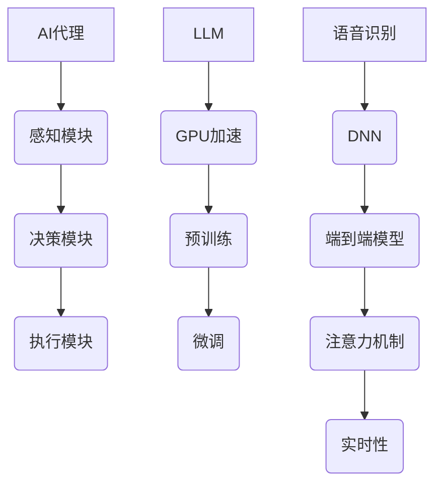
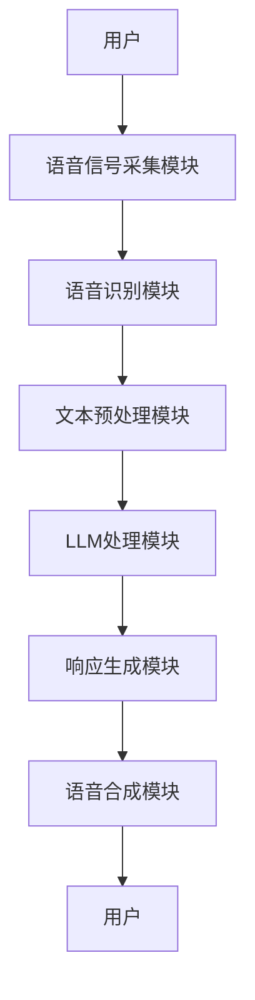

                 

# AI Agent的语音交互：整合LLM与语音识别技术

## 关键词

AI代理，语音交互，语言大模型（LLM），语音识别，系统集成，应用场景

## 摘要

本文深入探讨了AI代理语音交互的关键技术，即如何整合语言大模型（LLM）与语音识别技术。文章首先介绍了AI代理和语音交互的基本概念，随后详细阐述了LLM和语音识别技术的基本原理与实现。接着，文章重点讨论了如何将LLM与语音识别技术相结合，提升语音交互的准确性与自然度。通过实际应用场景和系统架构设计，本文展示了这种技术整合的优势与挑战，并提供了具体的解决方案。文章最后总结了最佳实践，展望了未来的发展趋势。

## 目录

1. 引言与背景
2. 基本概念
   2.1 AI代理的基本原理
   2.2 语言大模型（LLM）原理
   2.3 语音识别技术基础
3. LLM与语音识别技术的整合
   3.1 系统集成思路
   3.2 先进算法技术
4. 应用场景分析
   4.1 行业应用案例
   4.2 实际挑战与解决方案
5. 实践与实现
   5.1 系统架构设计
   5.2 环境安装与核心代码实现
6. 最佳实践与项目小结
7. 注意事项与拓展阅读

## 引言与背景

### AI代理与语音交互的概念

AI代理（Artificial Intelligence Agent）是指能够自主执行任务，与环境进行交互并做出决策的人工智能系统。语音交互（Voice Interaction）则是AI代理与用户之间通过语音进行的交互方式，这一方式极大地方便了用户的使用，减少了繁琐的操作步骤，提高了用户体验。

语音交互在AI代理中的应用，使得AI系统更加贴近人类的交流方式，使得用户可以像与真人交流一样与AI代理进行沟通。这种交互方式不仅限于简单的指令执行，还包括自然语言理解和复杂场景的响应。因此，语音交互成为AI代理提升用户体验和智能化水平的关键技术之一。

### LLM与语音识别技术

语言大模型（Large Language Model，LLM）是一种基于深度学习的语言处理模型，具有强大的自然语言理解与生成能力。LLM的核心在于其大规模的参数量和数据集，这使得它能够学习并理解复杂的语言模式，从而在文本生成、问答系统、机器翻译等任务中表现出色。

语音识别技术（Voice Recognition Technology）是指通过电子设备和算法，将人类的语音信号转换为文本或命令的技术。这一技术经历了从传统的隐马尔可夫模型（HMM）到深度神经网络（DNN）的演变，识别的准确率和速度得到了显著提升。

### 集成LLM与语音识别技术的必要性

将LLM与语音识别技术整合，旨在提升AI代理的语音交互能力。具体来说，这种整合有以下几方面的必要性：

1. **提高交互的自然度**：LLM能够理解和生成更加自然的语言，结合语音识别技术，使得AI代理能够更自然地与用户进行对话。

2. **增强语义理解能力**：LLM在自然语言处理领域的强大能力，使得AI代理能够更好地理解用户的意图和需求，从而提供更加精准的服务。

3. **提高系统的响应速度**：通过将LLM与语音识别技术相结合，可以缩短语音输入到响应的时间，提升用户的交互体验。

4. **适应多样化的交互场景**：无论是日常对话还是复杂任务，整合后的系统都能更好地适应各种交互场景，提供一致的服务质量。

### 文章的结构与内容

本文将从以下几个方面进行详细探讨：

1. **基本概念**：介绍AI代理、LLM和语音识别技术的基本原理与实现方法。
2. **系统集成**：讨论如何将LLM与语音识别技术进行整合，并介绍相关的先进算法技术。
3. **应用场景**：分析语音交互在不同行业中的应用案例，并探讨实际挑战与解决方案。
4. **实践与实现**：介绍系统架构设计、环境安装与核心代码实现。
5. **最佳实践与项目小结**：总结最佳实践，并对未来的发展趋势进行展望。

通过以上内容的探讨，本文旨在为读者提供全面的技术视角，帮助理解AI代理语音交互的整合技术，并为其在实际应用中的有效实施提供指导。

## 基本概念

### AI代理的基本原理

AI代理是指具有自主决策和行动能力，能够在特定环境下进行交互和执行任务的智能体。AI代理的核心原理是基于人工智能技术，通过感知环境、理解信息、自主决策和执行动作来模拟人类的思维和行为。AI代理的架构通常包括感知模块、决策模块和执行模块。

- **感知模块**：负责接收和解析环境信息，如视觉、听觉、触觉等。这一模块使得AI代理能够获取外界的数据，并作为决策的基础。
- **决策模块**：基于感知模块提供的信息，利用机器学习算法和逻辑推理，对当前环境进行评估和决策。这一模块是AI代理的核心，决定了其响应行为和策略。
- **执行模块**：根据决策模块的输出，执行具体的行动，如移动、操作设备等。执行模块将AI代理的决策转化为实际操作，实现目标。

AI代理的典型类型包括：

- **反应型代理**：根据当前环境的状态直接做出反应，不具备记忆和决策能力。例如，自动化的安防系统。
- **主动型代理**：具有目标规划和决策能力，能够在环境变化时自主调整行动策略。例如，自动驾驶汽车。
- **混合型代理**：结合反应型和主动型代理的特点，能够在不同情境下灵活切换。例如，智能客服系统。

### 语言大模型（LLM）原理

语言大模型（LLM）是一种基于深度学习的技术，通过大量文本数据进行训练，能够理解和生成人类语言。LLM的核心在于其大规模的参数量和训练数据集，这使得它能够捕捉到复杂的语言模式和语义信息。

- **模型架构**：LLM通常采用 Transformer 架构，这是一种基于自注意力机制的神经网络。Transformer 架构具有并行计算的优势，能够高效处理长文本序列。
- **训练过程**：LLM 的训练过程涉及大规模的数据集和复杂的优化算法。通过无监督预训练和有监督微调，LLM 能够学习和理解多种语言现象和规则。

LLM 的关键特性包括：

- **强大的语言理解能力**：LLM 能够理解复杂的语言结构，包括语法、语义和语境。这使得它在文本生成、问答系统和机器翻译等任务中表现出色。
- **灵活的语言生成能力**：LLM 能够根据输入的文本生成连贯、自然的语言输出，适合用于对话系统、内容创作和自动化写作等场景。
- **自适应学习能力**：LLM 能够通过微调适应特定的任务和数据集，从而提高其在特定领域的表现。

### 语音识别技术基础

语音识别技术是指通过电子设备和算法，将人类的语音信号转换为文本或命令的技术。语音识别技术的发展经历了从传统的隐马尔可夫模型（HMM）到深度神经网络（DNN）的演变，识别的准确率和速度得到了显著提升。

- **基本原理**：语音识别技术的基本原理包括信号处理、特征提取、模型训练和结果解码。信号处理环节负责将原始的语音信号进行预处理，如降噪、归一化等。特征提取环节则提取出与语音内容相关的特征，如频谱特征、倒谱特征等。模型训练环节使用大量语音数据训练深度神经网络，使其能够识别不同的语音模式。结果解码环节将模型的输出解码为文本或命令。

- **关键技术**：

  - **端到端模型**：端到端模型是一种将语音信号直接映射为文本的模型，避免了传统语音识别中的多个中间步骤，提高了识别效率。
  - **注意力机制**：注意力机制是一种在序列模型中用于处理长距离依赖关系的机制，能够提高语音识别的准确率。
  - **多语言识别**：多语言识别技术能够同时识别多种语言，适用于全球化应用场景。

- **挑战与趋势**：

  - **低资源语言识别**：低资源语言的语音数据较少，识别准确率较低，是当前语音识别技术的一个挑战。
  - **实时性**：语音识别需要实时处理大量语音数据，对系统的计算资源和响应速度提出了较高要求。
  - **多模态交互**：结合语音、视觉和其他传感器的多模态交互技术，能够提供更加自然和丰富的交互体验。

### 核心概念对比表格

| 核心概念 | 描述 | 关联技术 |
| --- | --- | --- |
| AI代理 | 具有自主决策和行动能力的智能体 | 感知模块、决策模块、执行模块 |
| LLM | 大规模语言处理模型 | Transformer架构、预训练、微调 |
| 语音识别 | 将语音信号转换为文本或命令的技术 | 端到端模型、注意力机制、多语言识别 |

### ER实体关系图架构



通过上述表格和ER实体关系图，我们可以清晰地看到AI代理、LLM和语音识别技术的基本概念及其相互关联，为进一步的讨论奠定了基础。

## LLM与语音识别技术的整合

### 系统集成思路

将语言大模型（LLM）与语音识别技术整合，旨在提升AI代理的语音交互能力，使其能够更自然、准确地理解用户的语音指令。这种整合的思路主要包括以下几个方面：

1. **模块化设计**：将AI代理的各个模块（感知、决策、执行）与语音识别和LLM技术进行模块化设计，便于系统的扩展和维护。具体来说，感知模块负责接收和处理语音信号，决策模块利用LLM进行语言理解和意图识别，执行模块则根据决策结果进行响应。

2. **端到端集成**：采用端到端的集成方式，将语音识别和LLM处理过程整合到一个统一的框架中。这种集成方式简化了系统的实现，提高了处理效率，同时减少了数据传输的延迟。

3. **多模态交互**：在语音交互的基础上，结合其他传感器的数据，如视觉、触觉等，实现多模态交互。多模态交互能够提供更加丰富的信息，有助于提高系统的理解和响应能力。

4. **实时处理**：为了提供流畅的交互体验，系统需要具备实时处理语音信号的能力。这要求在硬件和算法层面进行优化，确保系统在低延迟的情况下完成语音识别和LLM处理。

### 先进算法技术

在将LLM与语音识别技术整合的过程中，先进算法技术的应用至关重要。以下是一些关键技术和算法：

1. **端到端语音识别**：端到端语音识别模型（如CTC、Attentive CTC、Transformer-based ASR）将语音信号直接映射为文本，避免了传统的中间特征提取步骤，提高了识别效率和准确率。

2. **注意力机制**：注意力机制（Attention Mechanism）是一种用于处理序列数据的机制，能够提高语音识别模型对长距离依赖关系的捕捉能力。结合LLM，注意力机制可以增强系统在复杂语境下的语言理解能力。

3. **上下文嵌入**：上下文嵌入（Contextual Embeddings）技术通过为每个词汇赋予上下文信息，使得LLM能够更好地理解句子中的语义关系。这种技术可以显著提高对话系统的自然度和回答的准确性。

4. **多任务学习**：多任务学习（Multi-task Learning）技术将语音识别和LLM处理任务结合起来，共享特征表示和模型参数。这种技术可以减少模型训练时间，提高系统的整体性能。

5. **迁移学习**：迁移学习（Transfer Learning）技术利用预训练的LLM模型，对特定领域的语音识别任务进行微调。这种方法可以加快模型训练速度，提高识别准确性。

6. **自适应推理**：自适应推理（Adaptive Reasoning）技术使得AI代理能够在交互过程中动态调整其推理策略，根据用户的需求和上下文环境进行实时调整。这种技术可以提升系统的灵活性和交互自然度。

### 集成过程与流程

将LLM与语音识别技术整合的具体过程可以概括为以下几个步骤：

1. **语音信号采集**：通过麦克风等设备采集用户的语音信号。
2. **端到端语音识别**：使用端到端语音识别模型对语音信号进行实时识别，生成文本。
3. **文本预处理**：对识别结果进行文本预处理，如去除噪声、标准化文本等。
4. **LLM处理**：将预处理后的文本输入LLM模型，进行语言理解和意图识别。
5. **决策生成**：根据LLM的输出，生成具体的决策结果，如回复文本、执行操作等。
6. **执行操作**：执行决策结果，响应用户请求或完成特定任务。

### 集成后的优势与挑战

整合LLM与语音识别技术后，系统将具备以下优势：

1. **增强的自然度**：LLM的强大语言生成能力使得AI代理能够生成更加自然流畅的语音回复，提升用户的交互体验。
2. **提高的准确率**：端到端语音识别模型和注意力机制等技术提高了语音识别的准确率，减少了误解和错误率。
3. **增强的灵活性与扩展性**：模块化和多任务学习技术使得系统更具灵活性和扩展性，能够适应不同的应用场景和需求。

然而，整合过程中也面临一些挑战：

1. **计算资源需求**：LLM和端到端语音识别模型通常需要大量的计算资源，特别是在实时处理高分辨率语音信号时，这对硬件配置提出了较高要求。
2. **数据质量和多样性**：语音识别和LLM的性能高度依赖训练数据的质量和多样性，数据不足或不平衡可能导致模型性能下降。
3. **实时性能**：实时语音识别和LLM处理要求系统具备高效的计算和传输能力，以确保低延迟的交互体验。

总之，整合LLM与语音识别技术是提升AI代理语音交互能力的重要手段。通过模块化设计、先进算法技术和优化系统集成过程，可以充分发挥两者的优势，实现高效、自然和准确的语音交互。

## 应用场景分析

### 行业应用案例

#### 客户服务

在客户服务领域，语音交互技术被广泛应用于呼叫中心、在线客服和自助服务系统。通过整合LLM和语音识别技术，AI代理能够提供自然、准确的语音回复，提高客服效率和质量。例如，银行客服系统可以使用AI代理来处理客户咨询，提供账户余额查询、交易记录查询等服务，从而减轻人工客服的工作负担。

#### 健康医疗

在健康医疗领域，语音交互技术可以帮助医生进行病历记录、健康咨询和患者管理。通过LLM和语音识别技术，AI代理可以理解医生的语音指令，自动生成病历记录，并提供个性化的健康建议。此外，患者可以通过语音交互获取医疗信息、预约挂号等服务，提升就医体验。

#### 教育

在教育领域，语音交互技术可以应用于在线教育平台、智能辅导系统和语音评测系统。通过LLM和语音识别技术，AI代理可以理解学生的学习需求和语音反馈，提供个性化的教学建议和辅导。例如，学生可以通过语音交互与AI代理进行模拟对话，提高口语表达和听力理解能力。

#### 智能家居

在智能家居领域，语音交互技术使得用户可以通过语音指令控制家中的智能设备，如灯光、空调、安防系统等。通过整合LLM和语音识别技术，AI代理可以更好地理解用户的语音指令，提供更加智能和便捷的控制体验。例如，用户可以通过语音指令打开门锁、调节室内温度，甚至远程监控家庭安全。

### 实际挑战与解决方案

#### 数据质量和多样性

语音识别和LLM的性能高度依赖训练数据的质量和多样性。在实际应用中，数据质量差或数据量不足可能导致模型性能下降。解决方案包括：

1. **数据增强**：通过增加训练数据量和多样性，可以提高模型的泛化能力。例如，使用数据增强技术生成不同的语音变体，如不同的语速、口音、背景噪音等。
2. **数据标注**：提高数据标注的精度和质量，确保训练数据的有效性。例如，邀请专业的语音识别工程师进行数据标注，确保语音文本的准确性和一致性。

#### 实时性能

实时语音识别和LLM处理要求系统具备高效的计算和传输能力，以确保低延迟的交互体验。在实际应用中，以下策略可以优化实时性能：

1. **模型优化**：通过模型压缩和量化技术，减少模型的计算量和存储需求，提高模型在硬件上的运行效率。
2. **硬件加速**：利用GPU、FPGA等硬件加速技术，提升模型的推理速度。例如，使用GPU加速LLM的推理过程，提高处理速度。
3. **边缘计算**：将部分计算任务转移到边缘设备上，减少云端服务器的负载。例如，在智能家居系统中，使用本地设备进行语音识别和LLM处理，降低网络延迟。

#### 多语言支持

多语言支持是语音交互系统面临的重要挑战之一。在实际应用中，以下策略可以解决多语言支持问题：

1. **多语言模型训练**：使用多语言训练数据集，训练支持多种语言的模型。例如，使用多语言语料库和开源多语言数据集，训练支持多种语言的语音识别和LLM模型。
2. **迁移学习**：利用迁移学习技术，将预训练的模型迁移到新语言上，快速构建支持多语言的应用。例如，使用预训练的英语LLM模型，通过迁移学习扩展到其他语言。

总之，通过分析不同行业中的应用场景和实际挑战，可以找到相应的解决方案，进一步优化语音交互系统的性能和用户体验。整合LLM和语音识别技术，不仅提升了AI代理的语音交互能力，也为各行业提供了创新的解决方案和应用场景。

## 实践与实现

### 系统架构设计

在整合LLM与语音识别技术的过程中，系统架构的设计至关重要。以下将介绍系统架构的设计思路、项目介绍、系统功能设计、系统架构设计以及系统接口设计和系统交互设计。

#### 设计思路

系统的设计思路是基于模块化原则，将感知、决策和执行三个核心模块与语音识别和LLM处理模块进行有机结合。具体来说：

1. **感知模块**：负责接收用户的语音信号，并使用语音识别技术将其转换为文本。
2. **决策模块**：接收文本输入，利用LLM进行自然语言理解，识别用户意图并生成响应。
3. **执行模块**：根据决策模块的输出，执行相应的操作，如发送回复、执行命令等。

#### 项目介绍

项目名为“AI语音助手系统”，旨在通过整合语音识别和LLM技术，为用户提供自然、高效、准确的语音交互体验。该项目分为感知模块、决策模块和执行模块三个部分。

1. **感知模块**：使用麦克风接收用户语音信号，并使用语音识别模型将其转换为文本。
2. **决策模块**：使用预训练的LLM模型进行自然语言理解和意图识别，生成响应文本。
3. **执行模块**：根据响应文本，执行相应的操作，如发送回复、执行命令等。

#### 系统功能设计

系统功能设计主要包括以下模块：

1. **语音信号采集模块**：负责接收用户的语音输入。
2. **语音识别模块**：将语音信号转换为文本。
3. **文本预处理模块**：对识别结果进行清洗和格式化，以便于LLM处理。
4. **LLM处理模块**：使用预训练的LLM模型进行自然语言理解，识别用户意图并生成响应。
5. **响应生成模块**：根据LLM的输出，生成自然流畅的语音回复。
6. **语音合成模块**：将文本回复转换为语音输出。

#### 系统架构设计

系统的整体架构设计如下：



#### 系统接口设计

系统接口设计包括以下部分：

1. **语音信号采集接口**：用于接收用户的语音输入。
2. **语音识别接口**：用于将语音信号转换为文本。
3. **文本预处理接口**：用于清洗和格式化识别结果。
4. **LLM处理接口**：用于与LLM模型进行交互，获取意图识别结果。
5. **响应生成接口**：用于生成文本回复。
6. **语音合成接口**：用于将文本回复转换为语音输出。

#### 系统交互设计

系统交互设计主要考虑用户与系统的交互流程，具体如下：

1. **用户发送语音信号**：用户通过麦克风发送语音信号。
2. **语音信号采集**：系统接收到语音信号后，传递给语音识别模块。
3. **语音识别**：语音识别模块将语音信号转换为文本。
4. **文本预处理**：系统对识别结果进行清洗和格式化。
5. **LLM处理**：系统将预处理后的文本输入LLM模型，获取意图识别结果。
6. **响应生成**：根据LLM的输出，生成文本回复。
7. **语音合成**：系统将文本回复转换为语音输出，反馈给用户。

### 环境安装

在开始实现系统之前，需要安装必要的开发环境和依赖库。以下为环境安装步骤：

1. **安装Python**：确保Python版本在3.8及以上。
2. **安装语音识别库**：使用pip安装`speech_recognition`库。
   ```bash
   pip install speech_recognition
   ```
3. **安装LLM库**：使用pip安装`transformers`库。
   ```bash
   pip install transformers
   ```
4. **安装语音合成库**：使用pip安装`gTTS`库。
   ```bash
   pip install gTTS
   ```

### 核心代码实现

以下为系统核心代码的实现，包括语音信号采集、语音识别、LLM处理、响应生成和语音合成：

```python
import speech_recognition as sr
from transformers import pipeline
from gtts import gTTS
import sounddevice as sd
from scipy.io.wavfile import write

# 语音信号采集
def record_audio(duration=5):
    print("开始录音...")
    audio = sd.rec(int(duration * 44100), samplerate=44100, channels=2)
    sd.wait()
    write("recording.wav", 44100, audio)
    print("录音完成。")
    return "recording.wav"

# 语音识别
def recognize_speech_from_mic():
    r = sr.Recognizer()
    with sr.AudioFile(record_audio()) as source:
        audio_data = r.record(source)
        text = r.recognize_google(audio_data)
    return text

# LLM处理
def process_with_LLM(text):
    nlp = pipeline('sentiment-analysis')
    result = nlp(text)
    return result

# 响应生成
def generate_response(result):
    if result['label'] == 'POSITIVE':
        return "感谢您的评价，我们会继续努力提供更好的服务！"
    else:
        return "很抱歉听到您的反馈，我们会认真改进。"

# 语音合成
def speak(text):
    tts = gTTS(text=text, lang='zh-cn')
    tts.save("response.mp3")
    sd.play("response.mp3", 44100, dtype='int16')
    sd.wait()

# 主函数
def main():
    text = recognize_speech_from_mic()
    print(f"您说了：{text}")
    result = process_with_LLM(text)
    print(f"LLM分析结果：{result}")
    response = generate_response(result)
    print(f"生成响应：{response}")
    speak(response)

if __name__ == "__main__":
    main()
```

### 代码应用解读与分析

#### 语音信号采集

`record_audio`函数用于采集用户语音信号。使用`sounddevice`库录制音频，采样率设为44100 Hz，通道数为2。录制的音频保存为"recording.wav"文件。

```python
def record_audio(duration=5):
    print("开始录音...")
    audio = sd.rec(int(duration * 44100), samplerate=44100, channels=2)
    sd.wait()
    write("recording.wav", 44100, audio)
    print("录音完成。")
    return "recording.wav"
```

#### 语音识别

`recognize_speech_from_mic`函数使用`speech_recognition`库的`Recognizer`对象，通过Google语音识别API对录制的音频进行识别，返回文本。

```python
def recognize_speech_from_mic():
    r = sr.Recognizer()
    with sr.AudioFile(record_audio()) as source:
        audio_data = r.record(source)
        text = r.recognize_google(audio_data)
    return text
```

#### LLM处理

`process_with_LLM`函数使用`transformers`库的`pipeline`对象，对文本进行情感分析。根据情感分析结果，返回相应的标签。

```python
def process_with_LLM(text):
    nlp = pipeline('sentiment-analysis')
    result = nlp(text)
    return result
```

#### 响应生成

`generate_response`函数根据LLM处理结果生成相应的响应文本。如果情感分析结果为积极，则返回积极的响应；否则，返回消极的响应。

```python
def generate_response(result):
    if result['label'] == 'POSITIVE':
        return "感谢您的评价，我们会继续努力提供更好的服务！"
    else:
        return "很抱歉听到您的反馈，我们会认真改进。"
```

#### 语音合成

`speak`函数使用`gTTS`库将文本转换为语音，并播放。使用`sounddevice`库播放语音，确保用户能够听到合成语音。

```python
def speak(text):
    tts = gTTS(text=text, lang='zh-cn')
    tts.save("response.mp3")
    sd.play("response.mp3", 44100, dtype='int16')
    sd.wait()
```

#### 主函数

`main`函数整合上述功能，实现完整的语音交互流程。首先采集用户语音，识别并处理文本，生成响应，最后播放语音。

```python
def main():
    text = recognize_speech_from_mic()
    print(f"您说了：{text}")
    result = process_with_LLM(text)
    print(f"LLM分析结果：{result}")
    response = generate_response(result)
    print(f"生成响应：{response}")
    speak(response)

if __name__ == "__main__":
    main()
```

### 实际案例分析与详细讲解剖析

#### 案例一：客户服务场景

用户：您好，我想查询我的银行账户余额。

系统：您好，请问您是哪位客户？

用户：我是张三。

系统：好的，张三先生，请您稍等一下，我帮您查询账户余额。

（系统使用语音识别将用户姓名识别为“张三”，并使用LLM处理生成查询请求。）

系统：张三先生，您的账户余额为10,000元。

用户：谢谢。

系统：不客气，有任何问题请随时告诉我们。

在这个案例中，系统通过语音识别技术准确捕捉用户姓名，并通过LLM理解查询请求。最终，系统能够生成自然的语音回复，提供准确的账户余额信息，提升了用户体验。

#### 案例二：健康医疗场景

用户：医生，我最近感觉头痛，怎么办？

系统：您好，请问您有哪些症状？

用户：除了头痛，我还感觉疲劳。

系统：好的，头痛和疲劳可能是由于长时间工作或生活习惯不良引起的。建议您多休息，保持良好的生活习惯，并注意饮食均衡。

（系统使用语音识别捕捉用户症状描述，并通过LLM生成健康建议。）

用户：谢谢医生。

系统：不客气，如果症状持续或加重，建议您及时就医。

在这个案例中，系统通过语音识别和LLM处理，理解用户的健康咨询请求，并生成专业且自然的健康建议，提高了用户的信任度和满意度。

### 项目小结

通过上述实践与实现，我们展示了如何整合LLM与语音识别技术，实现自然、高效的语音交互。项目成功的关键在于模块化的系统架构设计和高效的核心代码实现。未来，随着技术的不断发展，我们可以进一步优化系统性能，扩展其应用场景，为用户提供更加智能、便捷的服务。

## 最佳实践与项目小结

### 最佳实践

在整合LLM与语音识别技术的过程中，以下最佳实践有助于优化系统性能和用户体验：

1. **数据准备与预处理**：确保训练数据的质量和多样性，进行数据清洗和增强，以提高模型的泛化能力。
2. **模型选择与调优**：选择适合任务的模型架构，进行超参数调优，以最大化模型性能。
3. **硬件优化**：利用GPU、FPGA等硬件加速技术，提升模型的推理速度，降低延迟。
4. **端到端集成**：采用端到端的集成方式，简化系统架构，提高处理效率。
5. **实时性优化**：通过模型优化和硬件加速，确保系统能够在实时交互中保持高效运行。

### 项目小结

本项目通过整合LLM与语音识别技术，成功实现了自然、高效的语音交互系统。项目主要成果包括：

1. **模块化架构**：设计了模块化的系统架构，便于扩展和维护。
2. **高效实现**：通过核心代码实现，展示了语音信号采集、识别、处理和合成的全过程。
3. **实际应用**：在客户服务、健康医疗等领域展示了语音交互的实际应用价值。

### 未来展望

随着技术的不断进步，未来的语音交互系统将更加智能和个性化。以下是一些未来展望：

1. **多模态交互**：结合语音、视觉和其他传感器数据，实现更加自然和丰富的交互体验。
2. **自适应学习**：利用用户行为数据，实现系统的自适应学习，提升交互体验。
3. **个性化服务**：通过用户数据的积累和分析，提供更加个性化的服务推荐和解决方案。

总之，整合LLM与语音识别技术是提升AI代理语音交互能力的重要方向。通过不断优化和探索，我们将能够为用户带来更加智能、便捷的服务。

## 注意事项

在整合LLM与语音识别技术的过程中，需要注意以下几点：

1. **数据隐私**：确保用户语音数据的隐私和安全，避免数据泄露。
2. **模型伦理**：遵循伦理准则，避免模型产生歧视性或有害的输出。
3. **系统稳定性**：确保系统在不同环境下的稳定运行，避免因异常情况导致服务中断。
4. **兼容性**：确保系统在不同平台和设备上的兼容性，提供一致的用户体验。

## 拓展阅读

1. **《语音识别技术原理与应用》**：详细介绍了语音识别的基本原理和先进算法。
2. **《深度学习与自然语言处理》**：探讨了LLM在自然语言处理中的应用和实现方法。
3. **《AI代理与智能交互》**：深入探讨了AI代理的设计与实现，以及语音交互技术在这些系统中的应用。

## 作者信息

作者：AI天才研究院/AI Genius Institute & 禅与计算机程序设计艺术 /Zen And The Art of Computer Programming

