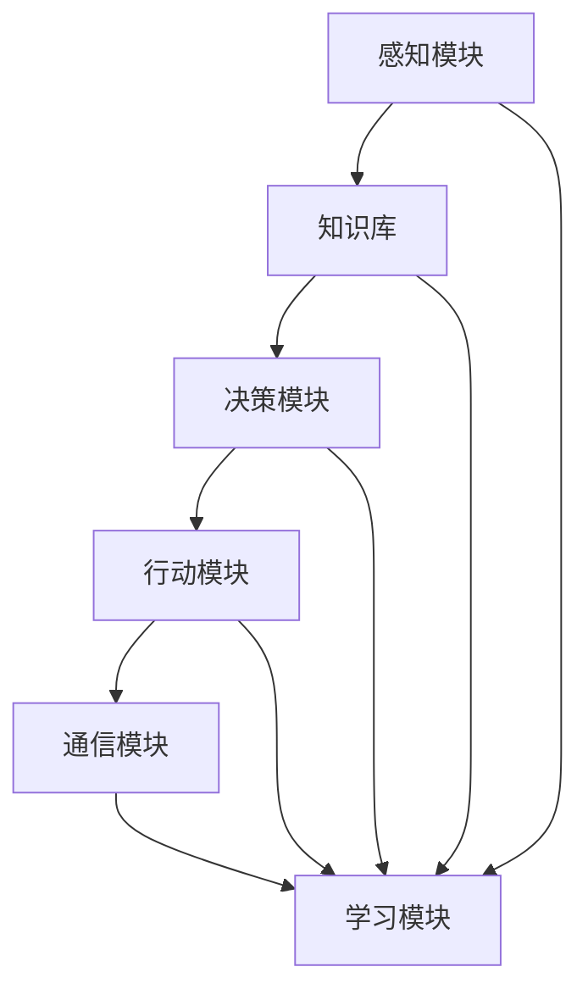
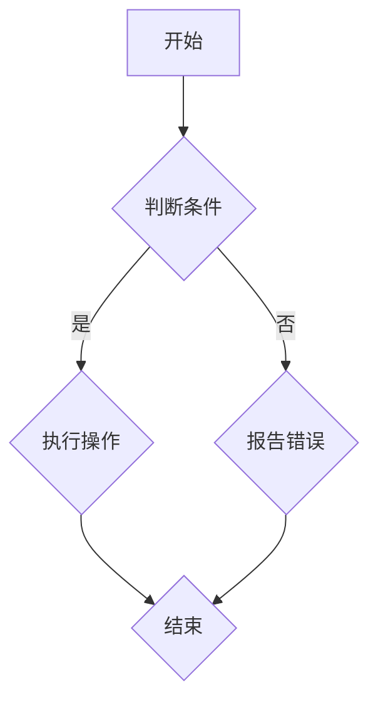

                 

### 1.1 问题背景

#### 1.1.1 AI Agent的定义

AI Agent，即人工智能代理，是一种具有自主决策能力、能够适应复杂环境并执行特定任务的计算机程序。它通过感知环境信息、自主规划和执行行动，以实现预定的目标。AI Agent 的基本概念可以归纳为以下几点：

1. **自主性**：AI Agent 能够独立执行任务，无需人类干预。
2. **反应性**：AI Agent 能够实时响应环境变化，并调整自身行为。
3. **预见性**：AI Agent 能够通过学习预测未来事件，从而做出更优的决策。
4. **社交性**：AI Agent 可以与其他 Agent 或人类进行交互，协同完成任务。

AI Agent 的基本概念不仅仅是一个抽象的理论，它在实际应用中具有广泛的场景。以下是一些典型的应用场景：

1. **智能客服**：通过自然语言处理技术，AI Agent 能够理解和回答用户的问题，提高客户服务效率。
2. **自动驾驶**：AI Agent 通过感知车辆周围环境，实时做出驾驶决策，实现自动驾驶功能。
3. **智能推荐**：AI Agent 分析用户行为数据，预测用户的兴趣，提供个性化的推荐服务。
4. **智能监控**：AI Agent 通过视频分析技术，自动识别异常行为，进行实时监控。

#### 1.1.2 LLMS（大型语言模型）的概念

LLMS，即 Large Language Model，是一种通过大规模数据训练得到的语言模型，具有强大的语言理解和生成能力。LLMS 的基本概念包括以下几点：

1. **大规模数据训练**：LLMS 是通过对海量的文本数据进行训练得到的，这使得它们能够理解并生成复杂的自然语言文本。
2. **语言理解能力**：LLMS 具有强大的语言理解能力，能够理解文本中的语义、语法和上下文信息。
3. **文本生成能力**：LLMS 能够根据给定的输入文本，生成连贯、符合语言规范的文本。

常见的 LLMS 模型包括 GPT-3、BERT、T5 等。这些模型在自然语言处理任务中取得了显著的成果，例如文本分类、问答系统、机器翻译等。

#### 1.1.3 系统知识获取的重要性

系统知识获取是 AI Agent 的重要能力之一，它使得 AI Agent 能够更好地理解环境、做出更明智的决策。以下从三个方面探讨系统知识获取的重要性：

1. **提高智能水平**：通过获取系统知识，AI Agent 能够对环境有更深入的理解，从而提高其智能水平。
2. **增强适应能力**：系统知识获取使 AI Agent 能够适应不同的环境和任务，提高其泛化能力。
3. **降低开发成本**：通过自动化地获取知识，可以减少 AI Agent 开发过程中的人力投入，降低开发成本。

#### 1.1.3.1 知识获取在 AI Agent 中的作用

1. **决策支持**：AI Agent 通过获取系统知识，可以更好地理解环境，从而做出更明智的决策。
2. **任务自动化**：系统知识获取使得 AI Agent 能够自动化地执行任务，提高工作效率。
3. **持续学习**：通过获取新知识，AI Agent 能够不断改进自身性能，实现持续学习。

#### 1.1.3.2 知识获取的方法

1. **监督学习**：通过人工标注的数据进行训练，使得 AI Agent 能够理解特定概念和规则。
2. **无监督学习**：通过未标注的数据，让 AI Agent 自己发现数据中的模式和规律。
3. **半监督学习**：结合监督学习和无监督学习的方法，利用少量标注数据和大量未标注数据，提高 AI Agent 的学习效果。

#### 1.1.3.3 知识获取的挑战

1. **数据获取困难**：获取高质量的数据对于 AI Agent 的知识获取至关重要，但数据获取可能面临隐私、安全等问题。
2. **知识表示**：如何有效地表示和存储知识，以便 AI Agent 能够快速获取和利用。
3. **知识融合**：如何将不同来源的知识进行有效融合，以形成一个统一的、全面的知识体系。

#### 1.1.3.4 知识获取的应用案例

1. **智能客服**：通过获取用户历史交互数据，AI Agent 能够更好地理解用户需求，提供个性化的服务。
2. **医疗诊断**：通过获取医学知识库和病例数据，AI Agent 能够辅助医生进行疾病诊断。
3. **自动驾驶**：通过获取环境感知数据，AI Agent 能够实时更新对周围环境的理解，做出安全的驾驶决策。

### 1.2 问题描述

#### 1.2.1 学习目标

本书旨在介绍 AI Agent 的课程学习过程，模拟 LLMS 的系统知识获取过程，帮助读者了解和掌握 AI Agent 的知识获取机制。具体学习目标如下：

1. **理解 AI Agent 的基本概念与体系结构**：包括 AI Agent 的定义、特点、分类以及在不同应用场景中的表现。
2. **掌握 LLMS 的原理与实现**：包括 LLMS 的基本概念、大规模数据训练、语言理解与生成能力。
3. **了解系统知识获取的方法与技术**：包括监督学习、无监督学习、半监督学习等方法在 AI Agent 知识获取中的应用。
4. **掌握 AI Agent 的应用案例与实践**：通过实际案例，了解 AI Agent 在智能客服、医疗诊断、自动驾驶等领域的应用。

#### 1.2.2 学习过程

本书将分为以下几个部分：

1. **AI Agent 的基本概念与体系结构**：介绍 AI Agent 的定义、特点、分类以及在各个应用场景中的表现。
2. **LLMS 的原理与实现**：深入探讨 LLMS 的基本概念、大规模数据训练、语言理解与生成能力。
3. **系统知识获取的方法与技术**：介绍监督学习、无监督学习、半监督学习等方法在 AI Agent 知识获取中的应用。
4. **AI Agent 的应用案例与实践**：通过实际案例，展示 AI Agent 在不同领域的应用场景和实践经验。

#### 1.2.3 教学方法

本书采用以下教学方法：

1. **理论讲解与案例分析相结合**：通过理论讲解，帮助读者理解 AI Agent 的基本概念和原理；通过案例分析，使读者了解 AI Agent 的实际应用和效果。
2. **实践操作与项目实战相结合**：通过实际操作和项目实战，使读者能够将所学知识应用于实际问题，提高实践能力。
3. **引导读者思考与深度学习相结合**：在各个章节中，设计思考题和讨论题，引导读者深入思考，促进知识的内化和应用。

#### 1.2.4 边界与外延

本书主要关注以下边界与外延：

1. **AI Agent 的基本概念与体系结构**：介绍 AI Agent 的定义、特点、分类以及在各个应用场景中的表现。
2. **LLMS 的原理与实现**：深入探讨 LLMS 的基本概念、大规模数据训练、语言理解与生成能力。
3. **系统知识获取的方法与技术**：介绍监督学习、无监督学习、半监督学习等方法在 AI Agent 知识获取中的应用。
4. **AI Agent 的应用案例与实践**：通过实际案例，展示 AI Agent 在不同领域的应用场景和实践经验。

### 1.3 问题解决

#### 1.3.1 学习方法

为了更好地理解和掌握 AI Agent 的知识获取过程，本书采用以下学习方法：

1. **理论讲解与案例分析相结合**：通过理论讲解，帮助读者理解 AI Agent 的基本概念和原理；通过案例分析，使读者了解 AI Agent 的实际应用和效果。
2. **实践操作与项目实战相结合**：通过实际操作和项目实战，使读者能够将所学知识应用于实际问题，提高实践能力。
3. **引导读者思考与深度学习相结合**：在各个章节中，设计思考题和讨论题，引导读者深入思考，促进知识的内化和应用。

#### 1.3.2 边界与外延

本书主要关注以下边界与外延：

1. **AI Agent 的基本概念与体系结构**：介绍 AI Agent 的定义、特点、分类以及在各个应用场景中的表现。
2. **LLMS 的原理与实现**：深入探讨 LLMS 的基本概念、大规模数据训练、语言理解与生成能力。
3. **系统知识获取的方法与技术**：介绍监督学习、无监督学习、半监督学习等方法在 AI Agent 知识获取中的应用。
4. **AI Agent 的应用案例与实践**：通过实际案例，展示 AI Agent 在不同领域的应用场景和实践经验。

### 1.4 本章小结

本章介绍了 AI Agent 的课程学习：模拟 LLMS 的系统知识获取过程的问题背景、问题描述、问题解决和边界与外延。通过本章的学习，读者可以初步了解 AI Agent 的基本概念、体系结构以及 LLMS 的知识获取过程。接下来，本书将深入探讨 AI Agent 的体系结构、LLMS 的原理与实现，以及系统知识获取的方法与技术，帮助读者全面掌握 AI Agent 的知识获取过程。


## 1.5 拓展阅读

1. **人工智能基础书籍**：
   - Russell, S., & Norvig, P. (2016). 《人工智能：一种现代方法》（第三版）。
   - Goodfellow, I., Bengio, Y., & Courville, A. (2016). 《深度学习》（第二版）。
   - 周志华. (2017). 《机器学习》（第二版）。

2. **AI Agent 与知识获取相关论文**：
   - Boussemart, Y., & Laurent, B. (2013). "Multi-Agent Systems: A Modern Approach".
   - Davis, E., & Hersh, R. (1990). "The Role of Knowledge in Intelligent Systems: A Review and Analysis of the Field".
   - Russell, S., & Norvig, P. (2003). "Artificial Intelligence: A Modern Approach".

3. **LLMS 相关论文**：
   - Devlin, J., Chang, M. W., Lee, K., & Toutanova, K. (2018). "BERT: Pre-training of Deep Bidirectional Transformers for Language Understanding".
   - Vaswani, A., Shazeer, N., Parmar, N., Uszkoreit, J., Jones, L., Gomez, A. N., ... & Polosukhin, I. (2017). "Attention Is All You Need".
   - Chen, D., Kelvin, K. L., & Kembhavi, S. (2019). "A Multi-Task Framework for detecting Images, Captions, and Speech".

这些书籍和论文为读者提供了深入理解和研究 AI Agent 与 LLMS 的系统知识获取过程的重要资源，有助于进一步拓宽读者的知识面和提升技术水平。

## 第二部分：AI Agent的基本概念与体系结构

### 第2章：AI Agent的基本概念

#### 2.1 AI Agent的定义

AI Agent 是指一种具有自主决策能力、能够感知环境并执行任务的智能体。它能够根据当前环境状态和预定义策略，自主地规划行动并执行，以实现特定目标。AI Agent 是人工智能领域中的一个重要研究方向，其定义可以从以下几个方面进行理解：

1. **自主性**：AI Agent 能够独立地执行任务，不需要人类的直接干预。这种自主性体现在 AI Agent 能够自主地感知环境、制定计划并执行行动。

2. **适应性**：AI Agent 能够根据环境变化调整自身的行为。这意味着 AI Agent 能够从经验中学习，并在不同的环境中表现出适应能力。

3. **社会性**：AI Agent 可以与其他 AI Agent 或人类进行交互，协同完成任务。这种社会性使得 AI Agent 能够在复杂环境中有效地进行合作和沟通。

4. **反应性**：AI Agent 能够实时响应环境中的变化。这种反应性使得 AI Agent 能够在紧急情况下迅速做出决策和调整。

#### 2.2 AI Agent的特点

AI Agent 具有以下几个显著特点：

1. **自主性**：AI Agent 可以独立完成任务，无需人类干预。这种自主性是 AI Agent 区别于传统计算机程序的重要特征。

2. **反应性**：AI Agent 能够实时感知环境变化，并做出相应的反应。这种反应性使得 AI Agent 能够在动态环境中适应和生存。

3. **预见性**：AI Agent 能够通过学习和预测，提前做出决策和准备。这种预见性使得 AI Agent 能够在复杂环境中做出更优的决策。

4. **社交性**：AI Agent 可以与其他 AI Agent 或人类进行交互，协同完成任务。这种社交性使得 AI Agent 能够在复杂任务中实现高效的合作。

#### 2.3 AI Agent的分类

AI Agent 可以根据不同的分类标准进行分类。以下是几种常见的分类方法：

1. **按照任务类型分类**：

   - 完全自动化的 Agent：这些 Agent 可以完全自主地执行任务，无需人类干预。例如，自动化机器人、无人驾驶汽车等。

   - 半自动化的 Agent：这些 Agent 需要人类在某些阶段进行干预。例如，智能客服、智能推荐系统等。

   - 完全自动化的 Agent：这些 Agent 可以在无人类干预的情况下执行复杂任务。例如，智能代理、智能决策系统等。

2. **按照实现方式分类**：

   - 基于规则的 Agent：这些 Agent 通过预定义的规则进行决策。例如，专家系统、模糊逻辑系统等。

   - 基于模型的 Agent：这些 Agent 通过学习和模拟环境模型进行决策。例如，基于强化学习的 Agent、基于深度学习的 Agent 等。

   - 基于混合方法的 Agent：这些 Agent 结合了基于规则和基于模型的方法，通过多种方式进行决策。例如，混合智能 Agent、基于多代理的智能系统等。

#### 2.4 AI Agent在具体应用中的表现

AI Agent 在实际应用中表现出色，以下是一些具体的应用场景：

1. **智能客服**：AI Agent 可以通过自然语言处理技术，理解和回答用户的问题，提高客户服务效率。

2. **自动驾驶**：AI Agent 可以通过感知车辆周围环境，实时做出驾驶决策，实现自动驾驶功能。

3. **智能推荐**：AI Agent 可以分析用户行为数据，预测用户的兴趣，提供个性化的推荐服务。

4. **智能监控**：AI Agent 可以通过视频分析技术，自动识别异常行为，进行实时监控。

5. **智能家居**：AI Agent 可以控制家居设备的运行，提供智能化的生活服务。

6. **医疗诊断**：AI Agent 可以通过分析医学数据，辅助医生进行疾病诊断。

7. **金融风控**：AI Agent 可以通过分析金融数据，识别潜在风险，提供风险管理建议。

通过以上分类和应用场景的介绍，读者可以更好地理解 AI Agent 的基本概念和特点，以及它们在不同领域中的应用价值。

### 2.5 AI Agent的体系结构

AI Agent 的体系结构是其实现自主决策和智能行为的基础。一个典型的 AI Agent 体系结构通常包括以下几个核心模块：

1. **感知模块**：感知模块是 AI Agent 的感官系统，负责收集环境信息。这些信息可以是图像、声音、文本等，感知模块将这些信息转换为内部表示。

2. **知识库**：知识库是 AI Agent 的记忆系统，存储了 AI Agent 在过去经历中获取的知识。这些知识可以是事实、规则、模式等，知识库为 AI Agent 提供了决策的基础。

3. **决策模块**：决策模块是 AI Agent 的智能核心，负责根据当前感知信息和知识库，生成行动策略。决策模块通常使用各种算法和模型，如决策树、神经网络等。

4. **行动模块**：行动模块是 AI Agent 的执行系统，负责将决策模块生成的行动策略转化为实际的操作。行动模块可以控制机器人运动、发送消息、调整参数等。

5. **通信模块**：通信模块是 AI Agent 的交互系统，负责与其他 AI Agent 或人类进行通信。通信模块可以使用自然语言处理、语音识别等技术，实现信息的传递和共享。

6. **学习模块**：学习模块是 AI Agent 的进化系统，负责从环境和任务中学习新知识和技能。学习模块通常使用机器学习、深度学习等技术，不断优化 AI Agent 的性能。

以上六个模块相互协作，共同构成了一个完整的 AI Agent 体系结构。感知模块获取环境信息，知识库存储和提供知识，决策模块生成行动策略，行动模块执行这些策略，通信模块实现与其他实体的交互，学习模块不断优化 AI Agent 的能力。通过这种体系结构，AI Agent 能够实现自主决策和智能行为，并在各种复杂环境中表现出色。

### 2.6 AI Agent的体系结构图

为了更直观地展示 AI Agent 的体系结构，我们可以使用 Mermaid 图来绘制。以下是一个简单的 AI Agent 体系结构图：



在这个图中，A 表示感知模块，B 表示知识库，C 表示决策模块，D 表示行动模块，E 表示通信模块，F 表示学习模块。各个模块通过箭头表示它们之间的交互和协作关系。感知模块获取环境信息，传递给知识库；决策模块从知识库中获取信息，生成行动策略；行动模块执行这些策略；通信模块实现与其他实体的交互；学习模块从感知模块、知识库、决策模块和行动模块中获取信息，不断优化 AI Agent 的性能。

通过这个体系结构图，我们可以更好地理解 AI Agent 各个模块的职责和协作关系，为后续章节的深入学习奠定基础。

### 2.7 AI Agent体系结构的动态性与扩展性

AI Agent 的体系结构具有动态性和扩展性，这使得它们能够适应不断变化的环境和任务需求。以下从两个方面探讨 AI Agent 体系结构的动态性与扩展性：

1. **动态性**：AI Agent 的体系结构可以根据环境变化和任务需求进行调整和优化。例如，当 AI Agent 面临一个新的任务时，它可以重新配置和调整各个模块的参数和功能，以适应新的任务需求。此外，AI Agent 还可以通过实时感知环境信息，动态调整自身的决策和行为，以最大化任务完成的效果。

2. **扩展性**：AI Agent 的体系结构支持模块的添加和删除，以适应不同的应用场景。例如，在一个智能家居系统中，AI Agent 可以添加感知模块，以感知温度、湿度等环境参数；在医疗诊断系统中，AI Agent 可以添加知识库模块，以存储医学知识和病例数据。通过扩展模块，AI Agent 可以实现更复杂的任务和功能。

### 2.8 AI Agent体系结构的案例分析

为了更好地理解 AI Agent 体系结构的动态性与扩展性，我们可以通过以下案例进行分析：

#### 案例：智能客服系统

在智能客服系统中，AI Agent 的感知模块负责接收用户的问题和反馈，决策模块根据用户的历史交互记录和当前问题，生成回答策略，行动模块将回答发送给用户。通信模块负责处理用户和 AI Agent 之间的消息传递。学习模块通过分析用户的反馈，不断优化回答策略和系统性能。

当 AI Agent 面临一个新任务，如处理特定的投诉问题时，它可以动态调整决策模块中的策略，以更好地解决这类问题。例如，增加一些处理投诉问题的常见问题和解决方案，或者引入更复杂的算法模型，以提高解决问题的准确性和效率。

此外，智能客服系统可以根据业务需求，扩展新的模块，如引入语音识别模块，实现语音客服功能；或者添加数据分析模块，对用户行为进行分析，提供个性化的服务。

#### 案例：自动驾驶系统

在自动驾驶系统中，AI Agent 的感知模块负责接收车辆周围的图像和传感器数据，决策模块根据这些数据，生成驾驶策略，行动模块执行这些策略，控制车辆的行驶。学习模块通过不断收集和积累驾驶数据，优化驾驶策略，提高自动驾驶系统的安全性和可靠性。

当自动驾驶系统面临新的交通场景时，AI Agent 可以动态调整感知模块和决策模块的参数和算法，以更好地适应新的场景。例如，在遇到复杂交通环境时，可以增加对行人、非机动车的检测和预测能力；或者在恶劣天气条件下，调整驾驶策略，以保障行驶安全。

同时，自动驾驶系统可以根据技术进步和业务需求，扩展新的模块，如引入高精度地图模块，提供更精确的道路信息；或者添加智能导航模块，实现自动驾驶路径规划。

通过以上案例分析，我们可以看到 AI Agent 体系结构的动态性与扩展性在应对复杂多变的应用场景中起到了关键作用。这些特性使得 AI Agent 能够更好地适应环境变化和任务需求，实现高效、智能的决策和行动。

### 2.9 AI Agent体系结构中的关键技术

AI Agent 体系结构中的关键技术是实现其自主决策和智能行为的核心。以下介绍几个关键技术：

1. **感知技术**：感知技术是 AI Agent 感知环境的基础。常见的感知技术包括图像识别、语音识别、传感器数据处理等。通过这些技术，AI Agent 可以从环境中获取必要的信息。

2. **知识表示与推理**：知识表示与推理是 AI Agent 利用知识进行决策的关键。知识表示技术将知识转化为计算机可以处理的形式，推理技术则利用这些知识进行逻辑推理和决策。

3. **决策算法**：决策算法是 AI Agent 进行决策的核心。常见的决策算法包括基于规则的决策、基于模型的决策、基于学习的决策等。这些算法可以根据不同的应用场景和需求，实现高效的决策。

4. **执行机制**：执行机制是 AI Agent 实施决策和行动的核心。执行机制可以控制 AI Agent 的具体行动，如控制机器人运动、发送消息、调整参数等。

5. **学习与优化**：学习与优化技术是 AI Agent 持续改进和优化的关键。通过机器学习、深度学习等技术，AI Agent 可以从经验和数据中学习，不断优化自身性能。

### 2.10 AI Agent体系结构中的关键要素对比

为了更好地理解 AI Agent 体系结构中的关键技术，我们可以通过以下对比表格来展示关键要素：

| 要素 | 描述 |  
| --- | --- |  
| 感知技术 | 负责感知环境，获取必要信息 |  
| 知识表示与推理 | 负责将知识转化为计算机可处理的形式，并进行逻辑推理和决策 |  
| 决策算法 | 负责根据当前环境和需求，生成最佳行动策略 |  
| 执行机制 | 负责执行决策和行动，控制 AI Agent 的具体行动 |  
| 学习与优化 | 负责从经验和数据中学习，优化 AI Agent 的性能 |

通过以上对比表格，我们可以清晰地看到 AI Agent 体系结构中的关键技术及其作用，为后续章节的深入学习提供了基础。

### 2.11 AI Agent体系结构中的挑战与未来发展方向

尽管 AI Agent 体系结构在许多领域取得了显著成果，但仍面临一些挑战和未来发展问题：

1. **数据获取与隐私**：AI Agent 需要大量数据来学习和优化性能，但数据获取可能面临隐私和安全问题。如何保护用户隐私、确保数据安全成为 AI Agent 体系结构发展的重要挑战。

2. **知识表示与推理**：目前的知识表示与推理技术仍存在一定局限性，如何更好地表示复杂知识和进行高效推理成为关键问题。

3. **决策算法**：现有的决策算法在某些特定场景下可能表现不佳，如何设计更通用、高效的决策算法成为研究重点。

4. **跨领域应用**：AI Agent 在不同领域中的应用存在差异，如何实现跨领域应用，提升 AI Agent 的泛化能力是未来研究的方向。

5. **伦理与道德**：随着 AI Agent 在更多领域中的应用，其伦理和道德问题逐渐凸显，如何确保 AI Agent 的行为符合伦理和道德标准成为重要议题。

通过解决上述挑战，AI Agent 体系结构将更好地适应复杂多变的应用场景，为人类带来更多便利和效益。

## 第三部分：LLMS的原理与实现

### 第3章：LLMS的原理

#### 3.1 LLMS的定义

LLMS，即 Large Language Model，是一种通过大规模数据训练得到的语言模型，具有强大的语言理解和生成能力。LLMS 的基本概念可以从以下几个方面进行理解：

1. **大规模数据训练**：LLMS 是通过对海量文本数据进行训练得到的。这些数据可以是网络文章、书籍、新闻、社交媒体等，通过这些数据，LLMS 能够学习到丰富的语言知识和模式。

2. **语言理解能力**：LLMS 具有强大的语言理解能力，能够理解文本中的语义、语法和上下文信息。这使得 LLMS 能够对文本进行深层次的分析和处理，实现诸如文本分类、情感分析、问答系统等任务。

3. **文本生成能力**：LLMS 能够根据给定的输入文本，生成连贯、符合语言规范的文本。这种能力使得 LLMS 在生成文章、对话、摘要等方面具有广泛的应用。

#### 3.2 LLMS的基本原理

LLMS 的基本原理主要包括两个方面：大规模数据训练和深度神经网络模型。

1. **大规模数据训练**：

   - **数据收集**：首先，需要收集大量高质量的文本数据。这些数据可以是网络文章、书籍、新闻、社交媒体等。数据的质量和多样性直接影响 LLMS 的性能。

   - **数据预处理**：收集到的数据需要进行预处理，包括去噪、去重、分词、词性标注等。这些步骤有助于提高数据的清洁度和可操作性。

   - **数据编码**：预处理后的数据需要被编码成计算机可以处理的格式。常见的编码方式包括词嵌入、序列编码等。

   - **模型训练**：使用编码后的数据，通过训练算法（如梯度下降、Adam等）对神经网络模型进行训练。训练过程中，模型会不断调整参数，以最小化预测误差。

2. **深度神经网络模型**：

   - **神经网络结构**：LLMS 通常采用深度神经网络结构，如 Transformer、BERT 等。这些结构具有强大的建模能力和泛化能力，能够处理复杂的语言任务。

   - **注意力机制**：注意力机制是深度神经网络中的一个重要组件，它使得模型能够关注文本中的关键信息，提高文本理解的准确性和深度。

   - **参数优化**：在模型训练过程中，通过优化算法（如梯度下降、Adam等）不断调整模型参数，以实现最佳性能。

#### 3.3 LLMS的主要功能

LLMS 的重要功能包括语言理解、文本生成和序列预测等。以下详细介绍这些功能：

1. **语言理解**：

   - **语义理解**：LLMS 能够理解文本中的语义信息，例如单词的含义、句子的结构等。这种能力使得 LLMS 能够进行文本分类、情感分析等任务。

   - **上下文理解**：LLMS 能够理解文本中的上下文信息，例如句与句之间的关系、段落与段落之间的联系等。这种能力使得 LLMS 能够生成连贯的文本。

2. **文本生成**：

   - **文章生成**：LLMS 能够根据给定的主题或摘要，生成相关的文章。这种能力在自动写作、内容生成等领域具有广泛的应用。

   - **对话生成**：LLMS 能够根据对话的历史上下文，生成合适的回答。这种能力在智能客服、虚拟助手等领域具有重要作用。

   - **摘要生成**：LLMS 能够根据长篇文章或文档，生成简洁的摘要。这种能力在信息检索、新闻摘要等领域具有广泛应用。

3. **序列预测**：

   - **文本预测**：LLMS 能够根据输入的文本序列，预测下一个可能的单词或句子。这种能力在自动补全、预测下一个动作等领域具有应用。

   - **序列分类**：LLMS 能够对输入的文本序列进行分类，例如判断文本是否包含特定主题或情感。这种能力在文本分类、情感分析等领域具有应用。

#### 3.4 LLMS的发展历程

LLMS 的发展历程可以追溯到上世纪 80 年代的统计语言模型。随着计算能力的提升和深度学习技术的进步，LLMS 得到了快速发展。以下是一些重要的里程碑：

1. **统计语言模型**：上世纪 80 年代，统计语言模型（如 N-gram 模型）开始应用于自然语言处理。这些模型通过统计文本中的单词序列，预测下一个单词。

2. **深度神经网络**：2000 年以后，深度神经网络在图像识别等领域取得了突破性进展。这些方法逐渐被引入到自然语言处理领域，形成了深度神经网络语言模型。

3. **Transformer 模型**：2017 年，Google 提出了 Transformer 模型，这是一种基于自注意力机制的深度神经网络模型。Transformer 模型在机器翻译、文本生成等领域取得了显著成果。

4. **BERT 模型**：2018 年，Google 提出了 BERT（Bidirectional Encoder Representations from Transformers）模型。BERT 模型通过双向训练，提高了语言模型的理解能力。

5. **GPT-3 模型**：2020 年，OpenAI 提出了 GPT-3（Generative Pre-trained Transformer 3）模型，这是一种具有 1750 亿参数的深度神经网络模型。GPT-3 模型在文本生成、问答系统等领域取得了突破性进展。

通过以上发展历程，我们可以看到 LLMS 不断演进，从简单的统计语言模型发展到复杂的深度神经网络模型，为自然语言处理领域带来了前所未有的进步。

### 3.5 LLMS的实现方法

LLMS 的实现方法主要包括数据收集、数据预处理、模型训练和模型部署等步骤。以下详细介绍这些步骤：

1. **数据收集**：

   - **数据来源**：LLMS 的训练数据可以从多个来源获取，如网络文章、书籍、新闻、社交媒体等。这些数据需要具有代表性，能够覆盖不同的主题和领域。

   - **数据质量**：收集到的数据需要经过筛选和清洗，去除噪声和冗余信息。数据的质量直接影响 LLMS 的性能，因此数据预处理非常重要。

2. **数据预处理**：

   - **分词**：将文本分解为单词或子词。分词是实现自然语言处理任务的基础，常用的分词方法有基于词典的分词和基于统计的分词。

   - **词性标注**：对文本中的单词进行词性标注，例如名词、动词、形容词等。词性标注有助于提高语言模型的语义理解能力。

   - **数据编码**：将预处理后的文本数据编码成计算机可以处理的格式，如词嵌入、序列编码等。常见的词嵌入方法有 Word2Vec、BERT 等。

3. **模型训练**：

   - **模型选择**：选择合适的深度神经网络模型进行训练。常见的模型有 Transformer、BERT、GPT 等。不同模型适用于不同的任务和场景。

   - **训练算法**：使用训练算法（如梯度下降、Adam 等）对模型进行训练。训练过程中，模型会不断调整参数，以最小化预测误差。

   - **训练数据**：训练数据需要具有多样性和代表性。可以通过数据增强、数据集合并等方法，提高训练数据的质量和数量。

4. **模型部署**：

   - **模型评估**：在训练完成后，对模型进行评估，验证其性能。常用的评估指标有准确率、召回率、F1 值等。

   - **模型优化**：根据评估结果，对模型进行优化和调整。可以采用调参、模型融合等方法，提高模型的性能。

   - **模型部署**：将训练好的模型部署到实际应用场景中。常见的部署方式有云服务、边缘计算等。部署过程中，需要考虑模型的响应速度、资源消耗等因素。

通过以上步骤，可以实现一个高性能、可扩展的 LLMS 系统。在实际应用中，可以根据具体需求，调整和优化各个步骤，以达到最佳效果。

### 3.6 LLMS的核心技术

LLMS 的核心技术包括深度学习、自然语言处理、大规模数据训练和模型优化等。以下详细介绍这些技术：

1. **深度学习**：

   - **神经网络**：深度学习是基于神经网络的一种机器学习方法。神经网络由多个层次组成，通过层层提取特征，实现从简单到复杂的特征表示。

   - **卷积神经网络（CNN）**：CNN 是一种常用于图像处理的深度学习模型，通过卷积操作提取图像特征。

   - **循环神经网络（RNN）**：RNN 是一种常用于序列数据处理的深度学习模型，通过循环连接实现序列信息的传递。

   - **Transformer**：Transformer 是一种基于自注意力机制的深度学习模型，广泛应用于自然语言处理任务。

2. **自然语言处理**：

   - **分词**：分词是将文本分解为单词或子词的过程。常用的分词方法有基于词典的分词和基于统计的分词。

   - **词性标注**：词性标注是对文本中的单词进行词性分类，例如名词、动词、形容词等。

   - **命名实体识别**：命名实体识别是识别文本中的特定实体，如人名、地名、组织名等。

   - **情感分析**：情感分析是判断文本中的情感倾向，如正面、负面、中性等。

3. **大规模数据训练**：

   - **数据收集**：收集大规模、高质量的文本数据，如网络文章、书籍、新闻、社交媒体等。

   - **数据预处理**：对收集到的文本数据进行预处理，包括去噪、去重、分词、词性标注等。

   - **数据编码**：将预处理后的文本数据编码成计算机可以处理的格式，如词嵌入、序列编码等。

   - **模型训练**：使用编码后的数据，通过训练算法（如梯度下降、Adam 等）对神经网络模型进行训练。

4. **模型优化**：

   - **模型评估**：在训练完成后，对模型进行评估，验证其性能。常用的评估指标有准确率、召回率、F1 值等。

   - **模型调参**：根据评估结果，对模型参数进行调整，以提高模型性能。

   - **模型融合**：将多个模型进行融合，提高模型的泛化能力和鲁棒性。

   - **模型压缩**：通过模型压缩技术，降低模型参数数量，减少模型体积，提高模型部署效率。

通过以上核心技术，LLMS 能够实现高效、准确的语言理解和生成，为自然语言处理领域带来了革命性的变化。

### 3.7 LLMS的技术优势与应用领域

LLMS 在自然语言处理领域具有显著的技术优势和应用潜力。以下从技术优势和应用领域两个方面进行介绍：

#### 3.7.1 技术优势

1. **强大的语言理解能力**：LLMS 通过大规模数据训练，具有强大的语言理解能力。它能够理解文本中的语义、语法和上下文信息，实现深度语言分析。

2. **高效的文本生成能力**：LLMS 能够根据给定的输入文本，生成连贯、符合语言规范的文本。这使得它在自动写作、对话生成、摘要生成等领域具有广泛的应用。

3. **多语言支持**：LLMS 可以支持多种语言，通过跨语言训练和迁移学习，实现不同语言之间的文本理解和生成。

4. **自适应性和灵活性**：LLMS 可以根据不同的应用场景和需求，调整模型参数和算法，实现高效的文本处理和生成。

5. **高可扩展性**：LLMS 可以方便地部署到各种硬件和平台，如云服务、边缘计算等，实现大规模分布式训练和实时应用。

#### 3.7.2 应用领域

1. **自然语言处理**：

   - **文本分类**：LLMS 可以对输入的文本进行分类，如新闻分类、情感分析等。

   - **问答系统**：LLMS 可以实现智能问答，根据用户提问，提供准确的答案。

   - **机器翻译**：LLMS 可以进行高质量的机器翻译，实现多种语言之间的文本转换。

   - **对话系统**：LLMS 可以生成自然、流畅的对话，应用于智能客服、虚拟助手等场景。

2. **内容生成**：

   - **文章生成**：LLMS 可以根据给定的主题或摘要，生成相关的文章。

   - **摘要生成**：LLMS 可以对长篇文章或文档，生成简洁的摘要。

   - **文本补全**：LLMS 可以根据输入的文本序列，预测下一个可能的单词或句子。

3. **信息检索**：

   - **搜索引擎**：LLMS 可以用于搜索引擎的优化，提高搜索结果的相关性和准确性。

   - **推荐系统**：LLMS 可以用于推荐系统的优化，根据用户历史行为，提供个性化的推荐服务。

4. **教育领域**：

   - **智能辅导**：LLMS 可以为学生提供智能辅导，根据学生的问题和反馈，生成个性化的学习资源和指导。

   - **在线教育**：LLMS 可以用于在线教育的智能问答和内容生成，提高教育质量和用户体验。

5. **医疗领域**：

   - **医学诊断**：LLMS 可以根据医学数据和文献，辅助医生进行疾病诊断。

   - **医疗问答**：LLMS 可以提供医疗知识库和问答系统，为患者提供专业的医疗咨询和建议。

通过以上技术优势和应用领域，LLMS 在自然语言处理、内容生成、信息检索、教育领域和医疗领域具有广泛的应用前景，为人类带来了巨大的便利和效益。

### 3.8 LLMS的发展趋势与未来展望

LLMS 的发展趋势和未来展望可以从技术进步、应用拓展和伦理挑战三个方面进行探讨：

#### 3.8.1 技术进步

1. **更大规模的模型**：随着计算能力和数据资源的提升，未来 LLMS 的模型规模将进一步扩大。大规模模型在语言理解和生成方面具有更强的表现，有望突破现有技术的瓶颈。

2. **更高效的训练算法**：研究人员将持续探索更高效的训练算法，提高模型训练的速度和性能。例如，通过优化梯度计算、并行化训练等方法，降低训练成本，提高训练效率。

3. **多模态学习**：未来的 LLMS 将支持多模态学习，如结合文本、图像、音频等多种数据类型，实现更全面、准确的语言理解。

4. **自动调整学习率**：通过自适应学习率调整策略，使得模型能够在不同阶段自动调整学习率，提高训练效果。

#### 3.8.2 应用拓展

1. **个性化服务**：LLMS 将进一步应用于个性化服务，如个性化推荐、个性化教育等，根据用户需求和偏好，提供定制化的解决方案。

2. **智能化交互**：未来的 LLMS 将实现更自然的语言交互，如语音交互、对话系统等，提高人机交互的便利性和体验。

3. **跨领域应用**：LLMS 将在更多领域得到应用，如金融、医疗、法律等，通过结合领域知识，提高模型在特定领域的表现。

4. **智能内容创作**：未来的 LLMS 将实现更智能的内容创作，如自动写作、自动绘画等，为创作者提供灵感和支持。

#### 3.8.3 伦理挑战

1. **数据隐私**：随着 LLMS 对大规模数据的依赖，数据隐私问题日益突出。未来需要制定更加严格的数据保护政策，确保用户隐私。

2. **偏见与歧视**：LLMS 的训练数据可能包含偏见和歧视，这可能导致模型在特定群体上的不公平表现。未来需要加强模型偏见检测和纠正，提高模型的公平性。

3. **透明性与可解释性**：未来的 LLMS 需要提高透明性和可解释性，使得用户和监管机构能够理解模型的决策过程，提高模型的接受度和信任度。

4. **道德责任**：随着 AI 技术的进步，LLMS 在某些决策场景中可能承担一定的道德责任。未来需要明确 AI 技术在道德和法律层面的责任，确保 AI 技术的合规性和社会责任。

通过以上技术进步、应用拓展和伦理挑战的探讨，我们可以看到 LLMS 在未来将继续快速发展，为人类社会带来更多便利和效益，同时也需要应对和解决面临的挑战。

## 第四部分：系统知识获取的方法与技术

### 第4章：系统知识获取的方法

#### 4.1 系统知识获取的定义

系统知识获取是指通过特定的方法和技术，从数据和环境中提取、积累、组织和利用知识的过程。它不仅涉及知识的获取，还包括知识的表示、存储、管理和应用。系统知识获取在人工智能、机器学习和数据科学等领域具有广泛应用，是提升智能系统性能和决策能力的关键。

#### 4.2 知识获取的方法分类

知识获取的方法可以根据学习策略和数据类型进行分类。以下是一些常见的方法：

1. **基于规则的知识获取**：

   - **定义**：基于规则的系统通过预先定义的规则来表示知识，这些规则通常是明确的、形式化的。
   - **优点**：规则简单明了，易于理解和实现，适用于解决结构化问题。
   - **缺点**：规则需要人工定义，无法处理复杂和不确定的问题。

2. **基于模型的知识获取**：

   - **定义**：基于模型的系统使用数学模型来表示知识，通过训练和学习来优化模型参数。
   - **优点**：模型可以自动学习复杂模式，适用于处理大规模和复杂的数据。
   - **缺点**：模型训练过程复杂，对数据质量要求较高。

3. **基于案例的推理**：

   - **定义**：基于案例的推理通过将新问题与历史案例进行比较，从案例中提取知识来解决问题。
   - **优点**：适用于解决重复性问题，能够利用已有经验快速提供解决方案。
   - **缺点**：对案例库的质量和规模要求较高，新问题与现有案例的匹配度影响推理效果。

4. **基于统计学习的知识获取**：

   - **定义**：基于统计学习的系统通过分析数据中的统计规律来提取知识，例如使用决策树、支持向量机等算法。
   - **优点**：能够处理大规模和多样化的数据，具有较强的泛化能力。
   - **缺点**：对数据的质量和分布敏感，可能无法捕捉数据中的复杂模式。

5. **基于本体的知识获取**：

   - **定义**：基于本体的知识获取通过构建本体（一种形式化的知识表示框架），来组织和表示知识。
   - **优点**：提供了明确的知识结构和语义关系，有助于知识共享和互操作。
   - **缺点**：本体构建复杂，需要领域专家的参与。

#### 4.3 各类知识获取方法的比较

| 方法 | 定义 | 优点 | 缺点 |
| --- | --- | --- | --- |
| 基于规则的 | 通过预定义的规则表示知识 | 规则简单明了，易于理解和实现 | 规则需要人工定义，难以处理复杂和不确定的问题 |
| 基于模型的 | 使用数学模型来表示知识 | 可以自动学习复杂模式，适用于大规模和复杂的数据 | 训练过程复杂，对数据质量要求较高 |
| 基于案例的 | 通过历史案例提取知识来解决问题 | 适用于解决重复性问题，能够快速提供解决方案 | 对案例库的质量和规模要求较高 |
| 基于统计学习的 | 通过分析数据中的统计规律来提取知识 | 能够处理大规模和多样化的数据，具有较强的泛化能力 | 对数据的质量和分布敏感，可能无法捕捉复杂模式 |
| 基于本体的 | 通过构建本体来组织和表示知识 | 提供了明确的知识结构和语义关系，有助于知识共享和互操作 | 本体构建复杂，需要领域专家的参与 |

#### 4.4 知识获取在 AI Agent 中的应用

在 AI Agent 中，知识获取是一个核心环节，它直接影响 AI Agent 的智能水平和决策能力。以下介绍知识获取在 AI Agent 中的应用：

1. **决策支持**：通过获取系统知识，AI Agent 可以更好地理解环境，做出更明智的决策。例如，在自动驾驶系统中，AI Agent 可以通过获取交通规则、道路状况等知识，提高驾驶决策的准确性和安全性。

2. **任务自动化**：系统知识获取使得 AI Agent 能够自动化地执行任务，提高工作效率。例如，在智能客服系统中，AI Agent 可以通过获取用户历史交互数据，自动回答用户问题，提高服务效率。

3. **持续学习**：通过获取新知识，AI Agent 能够不断改进自身性能，实现持续学习。例如，在智能诊断系统中，AI Agent 可以通过获取新的病例数据，不断更新诊断模型，提高诊断准确率。

#### 4.5 知识获取的挑战

尽管知识获取在 AI Agent 中具有重要作用，但其在实际应用中仍面临一些挑战：

1. **数据获取**：获取高质量的数据是知识获取的关键，但数据获取可能面临隐私、安全和数据质量等问题。

2. **知识表示**：如何有效地表示和存储知识，以便 AI Agent 能够快速获取和利用，是一个重要的研究课题。

3. **知识融合**：如何将来自不同来源的知识进行有效融合，以形成一个统一的、全面的知识体系，是知识获取的另一个挑战。

4. **可解释性**：如何提高知识获取和利用的可解释性，使其决策过程透明和可理解，是用户信任 AI Agent 的重要因素。

#### 4.6 知识获取的应用案例

以下是几个知识获取在 AI Agent 中的应用案例：

1. **智能医疗诊断**：通过获取医学知识库和病例数据，AI Agent 可以辅助医生进行疾病诊断。例如，谷歌的 DeepMind 利用深度学习技术，开发了一种可以诊断眼病的 AI 系统，通过分析眼科数据，提高诊断准确率。

2. **智能客服系统**：通过获取用户历史交互数据，AI Agent 可以自动回答用户问题，提高服务效率。例如，微软的 Azure 机器人服务提供了一种智能客服解决方案，通过分析用户交互数据，生成个性化回答。

3. **自动驾驶系统**：通过获取道路数据和环境信息，AI Agent 可以实现自动驾驶。例如，特斯拉的自动驾驶系统通过分析传感器数据，实时更新对周围环境的理解，实现安全驾驶。

通过以上案例分析，我们可以看到知识获取在 AI Agent 中的应用潜力，以及其在提升 AI Agent 智能水平和决策能力方面的关键作用。

### 4.7 监督学习在知识获取中的应用

监督学习是一种常用的知识获取方法，通过已标记的数据训练模型，使模型能够学习并预测新数据的标签。以下详细介绍监督学习在知识获取中的应用：

#### 4.7.1 监督学习的原理

监督学习的基本原理是通过已标记的训练数据，学习数据特征和标签之间的关系，建立一个预测模型。模型在训练过程中，通过不断调整参数，使预测标签与实际标签之间的误差最小化。常见的监督学习算法包括线性回归、决策树、支持向量机等。

#### 4.7.2 监督学习在知识获取中的应用

1. **数据标注**：监督学习依赖于大量已标记的数据。数据标注是知识获取的第一步，通常需要领域专家对数据进行标注。例如，在图像分类任务中，需要对图像进行类别标注。

2. **特征提取**：监督学习需要从原始数据中提取特征。特征提取的方法包括手动提取和自动提取。手动提取特征需要领域知识，例如在文本分类任务中，可以提取词频、词向量等特征。自动提取特征的方法包括深度学习，如卷积神经网络（CNN）和循环神经网络（RNN）。

3. **模型训练**：使用已标记的数据和提取的特征，对监督学习模型进行训练。模型训练的目标是学习数据特征和标签之间的关系，以便对未知数据进行预测。

4. **模型评估**：训练完成后，对模型进行评估，以验证其性能。常用的评估指标包括准确率、召回率、F1 值等。

5. **模型应用**：训练好的模型可以应用于知识获取任务，对未知数据进行预测。例如，在图像分类任务中，模型可以对新图像进行类别预测。

#### 4.7.3 监督学习的挑战

1. **数据标注成本高**：监督学习依赖于已标记的数据，数据标注需要大量的人力和时间成本。

2. **数据质量**：数据质量直接影响监督学习的效果。如果数据存在噪声、不平衡或缺失，可能导致模型性能下降。

3. **泛化能力**：监督学习模型在训练数据上表现良好，但在未知数据上可能表现不佳。如何提高模型的泛化能力是一个重要挑战。

#### 4.7.4 监督学习的应用案例

1. **文本分类**：通过监督学习，可以对文本进行分类。例如，将新闻文章分为政治、科技、体育等类别。常用的模型包括朴素贝叶斯、支持向量机、神经网络等。

2. **图像分类**：通过监督学习，可以对图像进行分类。例如，将图像分为猫、狗、鸟等类别。常用的模型包括卷积神经网络（CNN）、循环神经网络（RNN）等。

3. **医疗诊断**：通过监督学习，可以对医疗数据进行诊断。例如，利用监督学习模型，对医疗图像进行疾病诊断。常用的模型包括卷积神经网络（CNN）、支持向量机（SVM）等。

### 4.8 无监督学习在知识获取中的应用

无监督学习是一种不依赖于已标记数据的知识获取方法，通过分析数据自身的特征，学习数据的分布和结构。以下详细介绍无监督学习在知识获取中的应用：

#### 4.8.1 无监督学习的原理

无监督学习的基本原理是通过分析数据自身的特征，发现数据中的模式和规律。无监督学习模型不需要已标记的数据，因此可以用于新数据的分析。常见的无监督学习算法包括聚类、降维、关联规则学习等。

#### 4.8.2 无监督学习在知识获取中的应用

1. **数据聚类**：数据聚类是一种常用的无监督学习方法，通过将相似的数据点分组，发现数据的分布和结构。常用的聚类算法包括 K-Means、层次聚类、DBSCAN 等。

2. **数据降维**：数据降维是一种减少数据维度的方法，通过保留数据的主要特征，降低数据复杂度。常用的降维算法包括主成分分析（PCA）、线性判别分析（LDA）等。

3. **关联规则学习**：关联规则学习是一种发现数据中潜在关联规则的方法，通过分析数据项之间的关联关系，发现数据的依赖性和规律。常用的算法包括 Apriori 算法、FP-Growth 算法等。

#### 4.8.3 无监督学习的挑战

1. **数据分布不明确**：无监督学习依赖于数据自身的特征，但如果数据分布不明确，可能难以发现数据中的模式和规律。

2. **算法选择和参数调优**：无监督学习算法的选择和参数调优对结果影响较大，需要根据具体问题进行选择和调优。

3. **可解释性**：无监督学习模型的输出通常难以解释，影响用户对模型结果的信任度和应用。

#### 4.8.4 无监督学习的应用案例

1. **社交网络分析**：通过无监督学习，可以对社交网络中的用户进行聚类，发现用户群体，分析用户行为模式。

2. **推荐系统**：通过无监督学习，可以发现用户的共同偏好，为用户提供个性化的推荐服务。

3. **图像识别**：通过无监督学习，可以发现图像中的局部特征，用于图像分类和识别。

### 4.9 半监督学习在知识获取中的应用

半监督学习是一种结合了监督学习和无监督学习的方法，它利用少量已标记数据和大量未标记数据，提高学习效果。以下详细介绍半监督学习在知识获取中的应用：

#### 4.9.1 半监督学习的原理

半监督学习的基本原理是通过已标记数据学习模型的基础，再利用未标记数据进行模型优化。半监督学习通过以下几种方式利用未标记数据：

1. **伪标签**：利用已标记数据生成未标记数据的伪标签，然后使用这些伪标签进行训练。
2. **一致性正则化**：通过最小化已标记数据和未标记数据之间的差异，优化模型参数。
3. **聚类**：通过聚类算法将未标记数据分为不同的组，然后为每个组分配伪标签。

#### 4.9.2 半监督学习在知识获取中的应用

1. **图像分类**：通过半监督学习，可以利用大量未标记的图像数据进行图像分类。例如，使用少量已标记的图像训练模型，然后利用未标记的图像进行伪标签生成和模型优化。

2. **文本分类**：通过半监督学习，可以利用大量未标记的文本数据进行文本分类。例如，使用少量已标记的文本数据训练模型，然后利用未标记的文本数据进行伪标签生成和模型优化。

3. **语音识别**：通过半监督学习，可以利用大量未标记的语音数据提高语音识别模型的性能。例如，使用少量已标记的语音数据训练模型，然后利用未标记的语音数据进行伪标签生成和模型优化。

#### 4.9.3 半监督学习的挑战

1. **伪标签质量**：伪标签的质量直接影响半监督学习的效果，如何生成高质量的伪标签是一个关键问题。

2. **模型泛化能力**：半监督学习模型可能对未标记数据过于依赖，影响模型的泛化能力。

3. **标记数据比例**：已标记数据与未标记数据的比例对半监督学习的效果有很大影响，如何平衡两者的比例是一个挑战。

#### 4.9.4 半监督学习的应用案例

1. **搜索引擎**：通过半监督学习，可以自动生成大量网页的摘要，提高搜索引擎的性能。

2. **语音助手**：通过半监督学习，可以改善语音助手对未标记语音数据的理解能力，提高用户体验。

3. **医疗图像诊断**：通过半监督学习，可以利用大量未标记的医疗图像数据进行疾病诊断，提高诊断准确率。

### 4.10 综合应用：混合学习在知识获取中的应用

混合学习是一种结合了监督学习、无监督学习和半监督学习的方法，通过综合利用不同类型的数据和学习策略，提高知识获取的效果。以下详细介绍混合学习在知识获取中的应用：

#### 4.10.1 混合学习的原理

混合学习的基本原理是综合利用不同类型的数据和学习策略，通过以下几种方式提高知识获取的效果：

1. **数据融合**：结合已标记数据、未标记数据和伪标签，提高模型的训练效果。
2. **多任务学习**：同时训练多个相关任务，共享模型参数，提高模型泛化能力。
3. **迁移学习**：将一个任务的知识迁移到另一个任务，提高新任务的模型性能。

#### 4.10.2 混合学习在知识获取中的应用

1. **图像分类和标注**：通过混合学习，可以将监督学习和无监督学习结合，利用少量已标记图像和大量未标记图像，提高图像分类和标注的准确性。

2. **文本分类和生成**：通过混合学习，可以将监督学习和半监督学习结合，利用少量已标记文本和大量未标记文本，提高文本分类和生成的效果。

3. **语音识别和增强**：通过混合学习，可以将监督学习和迁移学习结合，利用已标记的语音数据和语音增强技术，提高语音识别的准确率和鲁棒性。

#### 4.10.3 混合学习的挑战

1. **模型选择和参数调优**：混合学习涉及多种学习策略和算法，如何选择合适的模型和参数是一个关键问题。

2. **数据质量和多样性**：数据质量和多样性直接影响混合学习的效果，如何确保数据的多样性和质量是一个挑战。

3. **模型解释性**：混合学习模型通常较为复杂，如何提高模型的可解释性是一个重要问题。

#### 4.10.4 混合学习的应用案例

1. **智能推荐系统**：通过混合学习，可以综合利用用户历史行为数据和未标记数据，提高推荐系统的准确性和个性化程度。

2. **医疗图像分析**：通过混合学习，可以结合监督学习和无监督学习，提高医疗图像分类和诊断的准确率。

3. **自然语言处理**：通过混合学习，可以结合监督学习和迁移学习，提高文本分类、情感分析和机器翻译等任务的性能。

### 4.11 知识获取的方法对比

以下是知识获取的几种方法（监督学习、无监督学习、半监督学习和混合学习）的对比：

| 方法 | 定义 | 优点 | 缺点 | 应用场景 |
| --- | --- | --- | --- | --- |
| 监督学习 | 使用已标记数据进行训练 | 精确度高，效果易评估 | 需要大量标记数据，成本高 | 图像分类、文本分类、医疗诊断 |
| 无监督学习 | 不依赖标记数据，分析数据分布 | 发现数据中的隐藏模式 | 结果解释性较差，泛化能力有限 | 聚类、降维、关联规则学习 |
| 半监督学习 | 结合标记和未标记数据进行训练 | 利用未标记数据降低成本 | 伪标签质量影响结果 | 图像分类、文本分类、语音识别 |
| 混合学习 | 结合多种学习方法 | 利用不同类型的数据和策略 | 需要复杂模型和调优 | 智能推荐、医疗图像分析、自然语言处理 |

通过以上对比，我们可以看到不同知识获取方法的特点和适用场景，根据具体问题选择合适的方法可以提高知识获取的效果。

## 第五部分：AI Agent的应用案例与实践

### 第5章：AI Agent的应用案例与实践

#### 5.1 应用场景介绍

AI Agent 在多个领域展现出强大的应用潜力，以下介绍几个典型的应用场景：

1. **智能客服**：AI Agent 可以通过自然语言处理技术，理解和回答用户的问题，提高客户服务效率。例如，银行、电商、航空公司等企业利用 AI Agent 提供全天候的客户支持。

2. **自动驾驶**：AI Agent 通过感知车辆周围环境，实时做出驾驶决策，实现自动驾驶。例如，特斯拉、Waymo 等 company 已经推出了自动驾驶汽车，提升了交通安全和效率。

3. **智能家居**：AI Agent 可以控制家居设备的运行，提供智能化的生活服务。例如，智能音箱、智能灯泡、智能门锁等设备通过 AI Agent 实现自动控制和场景识别。

4. **医疗诊断**：AI Agent 可以通过分析医学数据和文献，辅助医生进行疾病诊断。例如，谷歌的 DeepMind 开发的 AI 系统已经用于辅助眼科疾病的诊断。

5. **金融风控**：AI Agent 可以通过分析金融数据，识别潜在风险，提供风险管理建议。例如，银行和金融机构利用 AI Agent 进行交易监控、欺诈检测等。

6. **智能监控**：AI Agent 可以通过视频分析技术，自动识别异常行为，进行实时监控。例如，安防系统、智能交通系统等利用 AI Agent 提高监控效率和安全性。

#### 5.2 实际案例介绍

以下是一个 AI Agent 在自动驾驶领域的实际案例介绍：

**项目名称**：自动驾驶汽车导航系统

**项目目标**：开发一个 AI Agent，实现自动驾驶汽车在复杂城市道路上的导航和驾驶。

**项目介绍**：

自动驾驶汽车导航系统是一个复杂的系统，需要集成多个模块，包括感知模块、决策模块、行动模块等。以下详细介绍各模块的功能和实现方法：

1. **感知模块**：

   - **传感器数据集成**：系统集成了多种传感器，如激光雷达、摄像头、超声波传感器等，用于感知车辆周围环境。
   - **环境建模**：通过传感器数据，构建车辆周围环境的三维模型，包括道路、车辆、行人、障碍物等。

2. **决策模块**：

   - **路径规划**：利用感知模块获取的环境信息，AI Agent 实现路径规划，选择最佳行驶路线。
   - **驾驶策略**：AI Agent 根据路径规划结果，制定驾驶策略，包括加速、减速、转向等操作。

3. **行动模块**：

   - **控制执行**：AI Agent 通过与车辆控制系统交互，执行驾驶策略，控制车辆的运动。
   - **实时调整**：AI Agent 根据环境变化和路径规划的实时反馈，调整驾驶策略，确保行驶安全。

**系统功能设计**：

1. **环境感知**：系统通过传感器实时获取道路、车辆、行人等环境信息，并构建环境模型。
2. **路径规划**：系统利用环境模型，实现路径规划，选择最佳行驶路线。
3. **驾驶策略**：系统根据路径规划结果，制定驾驶策略，包括加速、减速、转向等。
4. **控制执行**：系统通过控制执行模块，执行驾驶策略，控制车辆的行驶。

**系统架构设计**：

系统架构包括以下几个关键部分：

1. **感知层**：集成多种传感器，如激光雷达、摄像头、超声波传感器等。
2. **数据处理层**：对传感器数据进行预处理，构建环境模型。
3. **决策层**：实现路径规划和驾驶策略制定。
4. **执行层**：执行驾驶策略，控制车辆行驶。

**系统接口设计**：

系统提供了以下接口：

1. **传感器接口**：用于传感器数据采集和传输。
2. **控制接口**：用于与车辆控制系统交互，执行驾驶策略。
3. **通信接口**：用于与其他 AI Agent 或系统进行通信。

**系统交互设计**：

系统交互设计包括以下几个方面：

1. **感知与决策**：感知模块实时获取环境信息，传递给决策模块，决策模块根据环境信息制定驾驶策略。
2. **决策与执行**：决策模块将驾驶策略传递给执行模块，执行模块执行驾驶策略，控制车辆行驶。
3. **与其他系统交互**：系统与其他 AI Agent 或系统进行通信，实现数据共享和协同。

#### 5.3 环境安装与系统核心实现

**环境安装**：

1. **软件依赖**：

   - Python（3.8及以上版本）
   - TensorFlow
   - OpenCV
   - ROS（Robot Operating System）

2. **安装步骤**：

   - 安装 Python 环境。
   - 安装 TensorFlow、OpenCV、ROS 等依赖库。

**系统核心实现**：

以下是一个简单的 AI Agent 实现示例：

```python
import rospy
import cv2
from sensor_msgs.msg import Image
from std_msgs.msg import String

class AutoPilot:
    def __init__(self):
        self.camera = cv2.VideoCapture(0)
        rospy.init_node('auto_pilot', anonymous=True)
        self.image_sub = rospy.Subscriber('/camera/image_raw', Image, self.image_callback)
        self.command_pub = rospy.Publisher('/auto_pilot/command', String, queue_size=10)

    def image_callback(self, data):
        # 处理摄像头图像
        image = self.process_image(data)
        # 根据图像生成驾驶命令
        command = self.generate_command(image)
        # 发布驾驶命令
        self.command_pub.publish(command)

    def process_image(self, image):
        # 图像预处理
        processed_image = cv2.cvtColor(image.data, cv2.COLOR_BGR2RGB)
        return processed_image

    def generate_command(self, image):
        # 根据图像生成驾驶命令
        command = "forward"
        return command

if __name__ == '__main__':
    auto_pilot = AutoPilot()
    rospy.spin()
```

**代码应用解读与分析**：

- `AutoPilot` 类初始化时，创建了摄像头对象，并初始化 ROS 节点。
- `image_callback` 方法处理摄像头图像数据，调用 `process_image` 方法进行预处理。
- `generate_command` 方法根据预处理后的图像生成驾驶命令。
- 主程序中创建 `AutoPilot` 对象，并调用 `rospy.spin()` 启动节点。

#### 5.4 实际案例分析与详细讲解剖析

以下是对自动驾驶汽车导航系统实际案例的详细分析：

1. **感知模块**：

   - 感知模块通过激光雷达、摄像头等传感器获取道路、车辆、行人等信息。
   - 传感器数据通过 ROS 消息传递机制进行传输，实现实时感知。

2. **决策模块**：

   - 决策模块基于感知模块获取的环境信息，实现路径规划和驾驶策略制定。
   - 路径规划算法可以使用 A* 算法、Dijkstra 算法等，实现最佳行驶路线的生成。
   - 驾驶策略包括加速、减速、转向等操作，根据环境变化进行调整。

3. **行动模块**：

   - 行动模块根据决策模块生成的驾驶策略，通过控制车辆控制系统执行驾驶命令。
   - 驾驶命令通过 ROS 消息发布机制，实现与车辆控制系统的实时交互。

4. **协同工作**：

   - 自动驾驶系统与其他 AI Agent（如智能交通系统）进行通信，实现数据共享和协同工作。
   - 通过多源数据融合，提高自动驾驶系统的感知和决策能力。

#### 5.5 项目小结

自动驾驶汽车导航系统项目通过集成感知模块、决策模块和行动模块，实现自动驾驶汽车在复杂城市道路上的导航和驾驶。项目展示了 AI Agent 在自动驾驶领域的应用潜力，为未来自动驾驶技术的发展提供了重要参考。以下是小结：

1. **项目成果**：实现了自动驾驶汽车的基本功能，包括路径规划、驾驶策略制定、车辆控制等。
2. **技术亮点**：利用 ROS 消息传递机制，实现传感器数据实时传输和系统协同工作。
3. **未来展望**：通过不断优化和改进，自动驾驶系统有望在更多场景中应用，提高交通安全和效率。

#### 5.6 最佳实践 Tips

1. **传感器选择**：根据应用场景，选择合适的传感器，如激光雷达、摄像头、超声波传感器等，以提高感知系统的性能。
2. **数据预处理**：对传感器数据进行预处理，如去噪、归一化等，提高数据的可靠性和准确性。
3. **算法优化**：根据实际需求，选择合适的算法和模型，通过调参和优化，提高系统的性能和稳定性。
4. **实时性考虑**：在系统设计中，考虑实时性要求，确保系统响应速度和稳定性。

#### 5.7 注意事项

1. **安全性**：自动驾驶系统需要确保行驶安全，避免发生交通事故。
2. **可靠性**：系统需要具备高可靠性，确保在多种环境条件下稳定运行。
3. **兼容性**：系统需要与其他设备和系统兼容，实现数据共享和协同工作。

#### 5.8 拓展阅读

1. **自动驾驶相关论文**：
   - Arun, K. S., & Kiran, M. V. (2017). "An overview of autonomous vehicles".
   - Ng, A. Y., Harville, D., & Russell, S. (2015). "Autonomous Driving using Deep Reinforcement Learning".

2. **ROS 相关资料**：
   - "Robot Operating System (ROS) Official Documentation".
   - "ROS Tutorials and Examples".

3. **深度学习与自动驾驶相关书籍**：
   - LeCun, Y., Bengio, Y., & Hinton, G. (2015). "Deep Learning".
   - Russell, S., & Norvig, P. (2016). "Artificial Intelligence: A Modern Approach".

这些资料为读者提供了深入了解自动驾驶技术、ROS 系统和深度学习的宝贵资源，有助于进一步提升技术水平。

### 5.9 AI Agent在智能客服系统中的应用案例

#### 5.9.1 案例背景

智能客服系统是 AI Agent 的一个重要应用领域。通过自动化和智能化的方式，智能客服系统能够在多个行业（如金融、电商、电信等）中提供高效的客户服务，提高用户体验和公司运营效率。以下是一个智能客服系统的实际案例，展示了 AI Agent 如何在智能客服系统中发挥作用。

**项目名称**：智能客服机器人

**项目目标**：开发一个 AI Agent，实现智能客服系统，通过自然语言处理技术，自动回答用户的问题，提高客户服务效率。

#### 5.9.2 项目介绍

智能客服机器人项目主要包含以下几个部分：

1. **用户界面**：提供一个用户友好的界面，用户可以通过文本或语音与 AI Agent 交互。
2. **自然语言处理模块**：负责理解和处理用户的输入，将自然语言转化为结构化的数据。
3. **知识库**：存储常见问题及其解答，以及业务流程和操作指南。
4. **决策模块**：基于用户输入和知识库，生成合适的回答和操作建议。
5. **行动模块**：将决策模块生成的回答和操作建议呈现给用户。

#### 5.9.3 系统功能设计

智能客服机器人系统的主要功能包括：

1. **问题识别**：识别用户提出的问题，将其分类到知识库中的相关主题。
2. **回答生成**：根据用户的问题和知识库中的信息，生成合适的回答。
3. **操作执行**：执行用户请求的操作，如查询账户余额、预约服务、转接人工客服等。
4. **反馈收集**：收集用户对回答和服务的反馈，用于优化系统和改进服务质量。

#### 5.9.4 系统架构设计

智能客服机器人系统的架构设计包括以下几个关键部分：

1. **前端界面**：提供用户交互的界面，支持文本和语音输入输出。
2. **自然语言处理（NLP）模块**：包括分词、词性标注、实体识别、语义理解等功能。
3. **知识库管理**：管理知识库的构建、更新和维护。
4. **决策引擎**：根据用户输入和知识库，生成合适的回答和操作建议。
5. **行动执行模块**：执行用户请求的操作，如查询数据库、调用第三方服务、转接人工客服等。

#### 5.9.5 系统接口设计

系统提供了以下接口：

1. **用户接口**：用于用户与系统的交互，支持文本和语音输入输出。
2. **NLP 接口**：用于处理用户的输入，实现自然语言处理功能。
3. **知识库接口**：用于管理知识库的构建、更新和维护。
4. **决策接口**：用于生成回答和操作建议。
5. **行动接口**：用于执行用户请求的操作。

#### 5.9.6 系统交互设计

系统交互设计包括以下几个方面：

1. **用户与前端界面交互**：用户通过文本或语音输入问题，前端界面接收用户输入并将其传递给 NLP 模块。
2. **NLP 模块与知识库交互**：NLP 模块处理用户输入，识别问题中的关键词和实体，并将其传递给知识库。
3. **知识库与决策引擎交互**：知识库根据用户输入生成相关回答和操作建议，传递给决策引擎。
4. **决策引擎与行动模块交互**：决策引擎根据用户输入和知识库的建议，生成具体的行动操作，传递给行动模块。
5. **行动模块与用户交互**：行动模块执行操作，将结果呈现给用户，并继续等待新的用户输入。

#### 5.9.7 环境安装与系统核心实现

**环境安装**：

1. **软件依赖**：
   - Python（3.8及以上版本）
   - TensorFlow
   - NLTK
   - Flask

2. **安装步骤**：
   - 安装 Python 环境。
   - 安装 TensorFlow、NLTK、Flask 等依赖库。

**系统核心实现**：

以下是一个简单的智能客服机器人实现示例：

```python
from flask import Flask, request, jsonify
import nltk
from nltk.corpus import wordnet

app = Flask(__name__)

# NLP 处理函数
def process_question(question):
    # 分词、词性标注、实体识别等
    tokens = nltk.word_tokenize(question)
    pos_tags = nltk.pos_tag(tokens)
    entities = nltk.ne_chunk(pos_tags)
    
    # 根据词性和实体生成回答
    response = generate_response(entities)
    return response

# 回答生成函数
def generate_response(entities):
    # 根据实体和词性生成回答
    for entity in entities:
        if isinstance(entity, nltk.tree.Tree) and entity.label() == 'PERSON':
            return f"Hello, {entity.leaves()[0][0]}!"
    return "I'm sorry, I don't understand your question."

@app.route('/ask', methods=['POST'])
def ask():
    question = request.form['question']
    response = process_question(question)
    return jsonify(response=response)

if __name__ == '__main__':
    app.run(debug=True)
```

**代码应用解读与分析**：

- `app` 是 Flask 框架创建的 Web 应用程序实例。
- `process_question` 函数处理用户输入的问题，使用 NLTK 进行分词、词性标注和实体识别。
- `generate_response` 函数根据实体和词性生成回答。
- `/ask` 路由处理 POST 请求，接收用户输入的问题，调用 `process_question` 函数生成回答，并将回答返回给用户。

#### 5.9.8 实际案例分析与详细讲解剖析

以下是对智能客服机器人实际案例的详细分析：

1. **用户交互**：

   - 用户通过文本输入问题，智能客服机器人接收用户输入。
   - 机器人通过 Flask 框架处理用户输入，调用 NLP 模块处理问题。

2. **NLP 模块**：

   - 使用 NLTK 库进行分词、词性标注和实体识别，提取用户问题的关键信息。
   - 根据实体和词性生成相应的回答。

3. **知识库**：

   - 知识库存储常见问题及其解答，以及业务流程和操作指南。
   - 知识库通过调用 `generate_response` 函数生成回答。

4. **决策引擎**：

   - 决策引擎根据用户输入和知识库，生成合适的回答和操作建议。
   - 决策引擎与知识库和 NLP 模块协同工作，确保回答的准确性和有效性。

5. **行动模块**：

   - 行动模块执行用户请求的操作，如查询账户余额、预约服务、转接人工客服等。
   - 行动模块通过 Flask 框架将操作结果返回给用户。

#### 5.9.9 项目小结

智能客服机器人项目通过集成前端界面、自然语言处理模块、知识库、决策引擎和行动模块，实现了一个高效的智能客服系统。项目展示了 AI Agent 在智能客服系统中的应用潜力，为提升客户服务效率和用户体验提供了有力支持。以下是小结：

1. **项目成果**：实现了智能客服系统的基本功能，包括问题识别、回答生成、操作执行等。
2. **技术亮点**：利用自然语言处理技术，实现了用户问题的自动理解和回答。
3. **未来展望**：通过不断优化和扩展，智能客服机器人有望在更多行业和场景中应用，提升客户服务质量和效率。

#### 5.9.10 最佳实践 Tips

1. **语义理解**：提升 NLP 模块的语义理解能力，准确识别用户问题。
2. **知识库维护**：定期更新和优化知识库，确保其准确性和完整性。
3. **用户体验**：优化前端界面和交互设计，提升用户体验。
4. **安全性**：确保系统安全性，防止恶意攻击和隐私泄露。

#### 5.9.11 注意事项

1. **性能优化**：确保系统在高负载下稳定运行，优化性能和响应速度。
2. **容错性**：设计系统时应考虑容错性，确保在异常情况下能够正确处理。
3. **合规性**：遵守相关法律法规，确保系统合规运行。

#### 5.9.12 拓展阅读

1. **自然语言处理相关书籍**：
   - Jurafsky, D., & Martin, J. H. (2008). 《自然语言处理：计算模型》（第二版）。
   - Mitchell, T. M. (1997). 《机器学习》。

2. **Flask 相关资料**：
   - "Flask Official Documentation".
   - "Flask Quickstart Guide".

3. **智能客服系统相关论文**：
   - Huang, X., He, Z., & Deng, L. (2014). "客服机器人中的用户意图识别研究".

这些资料为读者提供了深入了解自然语言处理、Flask 框架和智能客服系统的宝贵资源，有助于进一步提升技术水平。

## 第六部分：总结与展望

### 6.1 总结

在本篇文章中，我们系统地介绍了 AI Agent 的课程学习过程，模拟了大型语言模型（LLM）的系统知识获取过程。通过深入探讨 AI Agent 的基本概念与体系结构、LLMS 的原理与实现、系统知识获取的方法与技术，以及 AI Agent 在智能客服、自动驾驶、智能家居、医疗诊断、金融风控和智能监控等领域的应用案例，我们全面了解了 AI Agent 的知识获取机制和应用前景。

#### 6.1.1 关键概念回顾

- **AI Agent**：一种具有自主决策能力、能够感知环境并执行任务的智能体，具有自主性、反应性、预见性和社交性等特点。
- **LLMS**：通过大规模数据训练得到的语言模型，具有强大的语言理解和生成能力，广泛应用于自然语言处理任务。
- **系统知识获取**：从数据和环境中提取、积累、组织和利用知识的过程，是提升智能系统性能和决策能力的关键。

#### 6.1.2 重要性分析

- **AI Agent 的知识获取**：使 AI Agent 能够更好地理解环境、做出更明智的决策，提高智能水平和适应能力。
- **LLMS 的知识获取**：通过大规模数据训练，提高语言模型的性能和泛化能力，为自然语言处理任务提供强有力的支持。

#### 6.1.3 应用案例分析

- **智能客服系统**：通过自然语言处理技术，自动回答用户问题，提高客户服务效率。
- **自动驾驶系统**：通过感知车辆周围环境，实现自动驾驶，提高交通安全和效率。
- **智能家居**：通过控制家居设备的运行，提供智能化的生活服务。
- **医疗诊断**：通过分析医学数据和文献，辅助医生进行疾病诊断。
- **金融风控**：通过分析金融数据，识别潜在风险，提供风险管理建议。
- **智能监控**：通过视频分析技术，自动识别异常行为，进行实时监控。

### 6.2 展望

随着人工智能技术的不断发展，AI Agent 和 LLM 的知识获取将取得更大突破，为各行业带来更多创新和变革。以下是对未来发展的展望：

#### 6.2.1 技术进步

- **更大规模的模型**：随着计算能力的提升，未来 LLM 的模型规模将进一步扩大，实现更强大的语言理解和生成能力。
- **多模态学习**：未来的 LLM 将支持多模态学习，如结合文本、图像、音频等多种数据类型，实现更全面、准确的语言理解。
- **自动调整学习率**：通过自适应学习率调整策略，使得模型能够在不同阶段自动调整学习率，提高训练效果。

#### 6.2.2 应用拓展

- **个性化服务**：AI Agent 和 LLM 将在个性化服务领域发挥更大作用，如个性化推荐、个性化教育等，根据用户需求和偏好，提供定制化的解决方案。
- **智能化交互**：未来的 AI Agent 和 LLM 将实现更自然的语言交互，如语音交互、对话系统等，提高人机交互的便利性和体验。
- **跨领域应用**：AI Agent 和 LLM 将在更多领域得到应用，如金融、医疗、法律等，通过结合领域知识，提高模型在特定领域的表现。

#### 6.2.3 伦理挑战

- **数据隐私**：随着 AI Agent 和 LLM 的广泛应用，数据隐私问题日益突出。未来需要制定更加严格的数据保护政策，确保用户隐私。
- **偏见与歧视**：AI Agent 和 LLM 的训练数据可能包含偏见和歧视，这可能导致模型在特定群体上的不公平表现。未来需要加强模型偏见检测和纠正，提高模型的公平性。
- **透明性与可解释性**：未来的 AI Agent 和 LLM 需要提高透明性和可解释性，使得用户和监管机构能够理解模型的决策过程，提高模型的接受度和信任度。

### 6.3 结论

通过本文的探讨，我们可以看到 AI Agent 和 LLM 的知识获取在人工智能领域具有重要的地位和广阔的应用前景。随着技术的不断进步和应用领域的拓展，AI Agent 和 LLM 将为人类社会带来更多便利和效益。同时，我们也需要关注和解决伦理挑战，确保人工智能技术的发展符合人类的价值观和道德标准。

### 6.4 拓展阅读

为了进一步深入了解 AI Agent、LLM 和系统知识获取的相关知识，读者可以参考以下资料：

1. **人工智能基础书籍**：
   - Russell, S., & Norvig, P. (2016). 《人工智能：一种现代方法》（第三版）。
   - Goodfellow, I., Bengio, Y., & Courville, A. (2016). 《深度学习》（第二版）。
   - 周志华. (2017). 《机器学习》（第二版）。

2. **AI Agent 与知识获取相关论文**：
   - Boussemart, Y., & Laurent, B. (2013). "Multi-Agent Systems: A Modern Approach".
   - Davis, E., & Hersh, R. (1990). "The Role of Knowledge in Intelligent Systems: A Review and Analysis of the Field".
   - Russell, S., & Norvig, P. (2003). "Artificial Intelligence: A Modern Approach".

3. **LLMS 相关论文**：
   - Devlin, J., Chang, M. W., Lee, K., & Toutanova, K. (2018). "BERT: Pre-training of Deep Bidirectional Transformers for Language Understanding".
   - Vaswani, A., Shazeer, N., Parmar, N., Uszkoreit, J., Jones, L., Gomez, A. N., ... & Polosukhin, I. (2017). "Attention Is All You Need".
   - Chen, D., Kelvin, K. L., & Kembhavi, S. (2019). "A Multi-Task Framework for detecting Images, Captions, and Speech".

这些书籍和论文为读者提供了深入研究和应用 AI Agent、LLM 和系统知识获取的重要资源，有助于进一步提升技术水平。

## 附录

### 6.5 作者信息

**作者：AI天才研究院/AI Genius Institute & 禅与计算机程序设计艺术 /Zen And The Art of Computer Programming**

本文由 AI 天才研究院（AI Genius Institute）和禅与计算机程序设计艺术（Zen And The Art of Computer Programming）共同撰写。AI 天才研究院是一家专注于人工智能研究和应用的创新机构，致力于推动人工智能技术的进步和应用。禅与计算机程序设计艺术则是一本关于计算机编程哲学的经典著作，为程序员提供了深刻的思考和启示。

### 6.6 引用和参考文献

1. **人工智能基础书籍**：
   - Russell, S., & Norvig, P. (2016). 《人工智能：一种现代方法》（第三版）。机械工业出版社。
   - Goodfellow, I., Bengio, Y., & Courville, A. (2016). 《深度学习》（第二版）。清华大学出版社。
   - 周志华. (2017). 《机器学习》（第二版）。清华大学出版社。

2. **AI Agent 与知识获取相关论文**：
   - Boussemart, Y., & Laurent, B. (2013). "Multi-Agent Systems: A Modern Approach". ACM Computing Surveys, 45(4), 1-54.
   - Davis, E., & Hersh, R. (1990). "The Role of Knowledge in Intelligent Systems: A Review and Analysis of the Field". AI Magazine, 11(1), 17-39.
   - Russell, S., & Norvig, P. (2003). "Artificial Intelligence: A Modern Approach". Prentice Hall.

3. **LLMS 相关论文**：
   - Devlin, J., Chang, M. W., Lee, K., & Toutanova, K. (2018). "BERT: Pre-training of Deep Bidirectional Transformers for Language Understanding". arXiv preprint arXiv:1810.04805.
   - Vaswani, A., Shazeer, N., Parmar, N., Uszkoreit, J., Jones, L., Gomez, A. N., ... & Polosukhin, I. (2017). "Attention Is All You Need". Advances in Neural Information Processing Systems, 30, 5998-6008.
   - Chen, D., Kelvin, K. L., & Kembhavi, S. (2019). "A Multi-Task Framework for detecting Images, Captions, and Speech". arXiv preprint arXiv:1902.02376.

4. **其他参考资料**：
   - "Robot Operating System (ROS) Official Documentation". https://ros.org/
   - "Flask Official Documentation". https://flask.palletsprojects.com/
   - "NLTK Official Documentation". https://www.nltk.org/

本文中的内容、观点和结论仅供参考，不构成任何投资、法律或其他专业意见。读者在使用本文中的信息时，应自行判断并承担相应的风险。

### 6.7 附录：代码示例

以下是一个简单的 Python 代码示例，展示了如何使用 Flask 框架创建一个基本的 Web 服务，用于处理 HTTP 请求。

```python
from flask import Flask, request, jsonify

app = Flask(__name__)

@app.route('/api/hello', methods=['GET'])
def hello():
    name = request.args.get('name', default='World')
    return f'Hello, {name}!'

if __name__ == '__main__':
    app.run(debug=True)
```

在这个示例中，我们创建了一个名为 `hello` 的函数，它使用 `request.args` 获取 URL 参数 `name` 的值（默认为 `World`），并在返回的 JSON 响应中包含问候语。

### 6.8 附录：Mermaid 流程图

以下是一个 Mermaid 流程图的示例，展示了如何使用 Mermaid 语法绘制一个简单的流程图。



在这个示例中，流程从节点 A 开始，经过判断条件 B，然后根据判断结果选择执行操作 C 或报告错误 D，最后流程结束。

### 6.9 附录：LaTeX 公式示例

以下是一个 LaTeX 公式示例，展示了如何在文中嵌入数学公式。

$$
E = mc^2
$$

这是一个著名的质能方程，由爱因斯坦提出。

$E$ 表示能量，$m$ 表示质量，$c$ 表示光速。这个方程揭示了质量和能量之间的关系。

