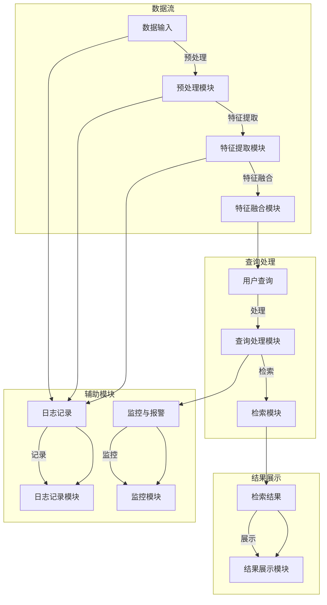
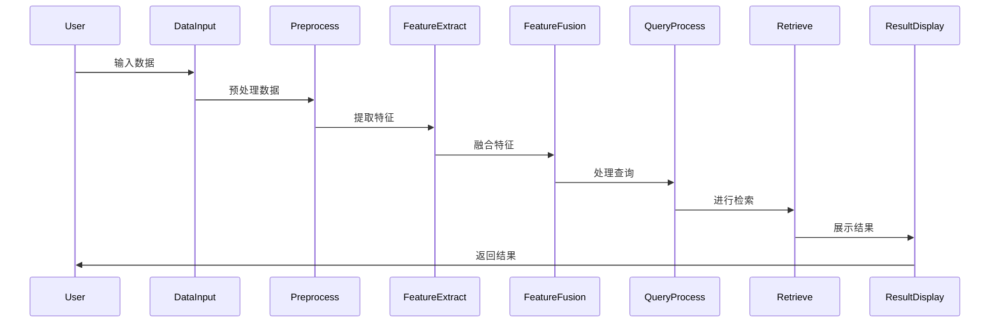
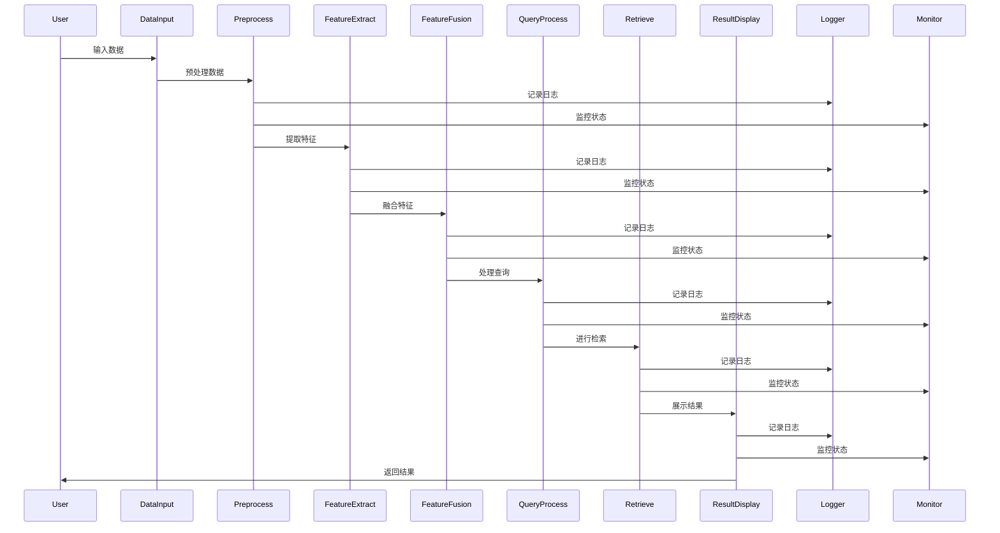

                 

## 《AI Agent的跨模态检索能力开发》

### 关键词

- AI Agent
- 跨模态检索
- 深度学习
- 强化学习
- 数学模型
- 系统架构设计

### 摘要

本文深入探讨了AI Agent的跨模态检索能力开发。首先，我们介绍了AI Agent和跨模态检索的基本概念，并探讨了它们之间的联系。接着，我们详细讲解了跨模态检索算法的原理，包括模式识别、特征提取、相似性度量与匹配等。随后，我们通过数学模型和公式阐述了这些算法的核心。文章接着分析了AI Agent在跨模态检索中的应用，并介绍了系统分析与架构设计的方法。通过一个实际项目实战，我们展示了如何实现跨模态检索系统。最后，我们提供了最佳实践、小结和注意事项，并推荐了拓展阅读资源。

## 第1章：背景介绍

### 1.1 问题背景

随着人工智能技术的快速发展，AI Agent在各个领域的应用越来越广泛。AI Agent，即人工智能代理，是一种能够自主执行任务、与环境交互并做出决策的智能实体。而跨模态检索，指的是在多模态数据之间进行信息检索和匹配的过程。这种能力对于构建智能搜索引擎、智能助手等应用至关重要。

目前，跨模态检索面临的主要问题是如何在多种不同的数据模态（如图像、文本、声音等）之间建立有效的对应关系，并从中检索出用户需要的信息。现有的解决方案通常依赖于单一模态的数据，而无法充分利用多模态数据的优势。

### 1.1.1 描述与定义

AI Agent可以定义为一种具有自主决策能力的人工智能系统，它能够根据环境变化和预设目标，自主执行一系列任务。AI Agent通常具备感知、理解、决策和执行等功能，其核心在于通过机器学习和深度学习等技术，实现智能化决策和行为。

跨模态检索是指在不同模态的数据之间进行信息检索和匹配。例如，给定一个文本查询，如何在图像库中找到与之相关的图像。跨模态检索的关键在于建立不同模态数据之间的对应关系，以及设计高效的检索算法。

### 1.1.2 问题解决

为了解决AI Agent的跨模态检索问题，我们需要从以下几个方面入手：

1. **多模态数据的特征提取**：首先要对输入的多模态数据进行特征提取，提取出能够表示数据本质特性的特征向量。
2. **相似性度量与匹配**：设计有效的相似性度量方法，计算不同模态数据之间的相似度，从而实现匹配。
3. **跨模态对应学习**：通过机器学习算法，学习不同模态数据之间的对应关系，提高检索精度。
4. **系统架构设计**：构建一个高效、可扩展的跨模态检索系统，包括数据预处理、特征提取、相似性度量、匹配和查询处理等模块。

### 1.1.3 边界与外延

在AI Agent的跨模态检索能力开发中，边界问题主要包括以下几个方面：

1. **数据多样性**：如何处理不同模态、不同来源、不同类型的数据。
2. **计算效率**：如何在保证检索准确性的同时，提高系统的计算效率和响应速度。
3. **隐私保护**：如何确保用户数据的安全和隐私。
4. **可解释性**：如何提高跨模态检索系统的可解释性，使其行为更加透明和可信。

外延问题主要包括：

1. **实时性**：如何实现实时跨模态检索，满足用户实时查询的需求。
2. **个性化**：如何根据用户偏好和需求，实现个性化跨模态检索。
3. **跨域应用**：如何将跨模态检索技术应用于不同领域，如医疗、金融、教育等。

### 1.1.4 概念结构与核心要素组成

AI Agent的跨模态检索能力开发涉及多个核心概念和要素。首先，AI Agent本身是一个核心概念，它包括感知、理解、决策和执行等基本功能。其次，跨模态检索涉及到多模态数据的特征提取、相似性度量与匹配、跨模态对应学习等算法。此外，系统架构设计、数据预处理、模型训练与优化、查询处理等也是核心要素。

通过上述核心概念和要素的有机结合，我们可以构建一个高效的AI Agent跨模态检索系统，满足用户多样化的信息检索需求。

### 第2章：核心概念与联系

#### 2.1 AI Agent概述

AI Agent，即人工智能代理，是一种能够自主执行任务、与环境交互并做出决策的智能实体。它通常具备感知、理解、决策和执行等功能，能够根据环境变化和预设目标，自主执行一系列任务。

AI Agent的特点包括：

- **自主性**：能够自主决策和执行任务，无需人工干预。
- **适应性**：能够适应不同环境和任务，具备学习和自我优化能力。
- **智能化**：通过机器学习和深度学习等技术，实现智能化决策和行为。

AI Agent与传统Agent的主要区别在于：

- **智能水平**：AI Agent具有更高的智能水平，能够处理复杂任务和决策。
- **学习与适应能力**：AI Agent具备学习和自我优化能力，能够适应环境变化。
- **应用领域**：AI Agent广泛应用于智能搜索、智能客服、自动驾驶等领域，而传统Agent则主要用于简单的自动化任务。

#### 2.2 跨模态检索概述

跨模态检索是指在不同模态的数据之间进行信息检索和匹配。常见的模态包括文本、图像、声音、视频等。跨模态检索的目标是从多模态数据中检索出与用户查询相关的信息。

跨模态检索的类型包括：

- **基于文本的跨模态检索**：以文本作为查询输入，检索与之相关的图像、视频等。
- **基于图像的跨模态检索**：以图像作为查询输入，检索与之相关的文本、声音等。
- **多模态融合检索**：同时利用多种模态的数据进行检索，提高检索精度和效率。

跨模态检索的优势包括：

- **综合利用多模态数据**：充分利用不同模态的数据，提高信息检索的全面性和准确性。
- **解决模态冲突**：通过跨模态检索，解决单一模态数据在信息检索中的局限和冲突。
- **扩展应用场景**：适用于更多复杂、多样化的应用场景，如智能问答、智能翻译、智能搜索等。

跨模态检索的挑战包括：

- **模态差异**：不同模态的数据具有不同的特性和表现形式，如何有效地融合和利用这些数据是一个挑战。
- **计算效率**：跨模态检索通常需要处理大量的数据和高维特征，如何提高计算效率是一个关键问题。
- **可解释性**：如何提高跨模态检索系统的可解释性，使其行为更加透明和可信。

#### 2.3 AI Agent与跨模态检索的联系

AI Agent与跨模态检索具有密切的联系。AI Agent可以通过跨模态检索技术，实现更智能、更灵活的信息检索和决策。

- **跨模态检索作为AI Agent的核心能力**：AI Agent需要具备跨模态检索能力，以处理多模态数据，提高信息检索和决策的准确性。
- **跨模态检索的优化与提升**：AI Agent可以通过不断学习和优化跨模态检索算法，提高检索效率和精度。
- **跨模态检索在AI Agent中的应用场景**：AI Agent可以应用于智能搜索、智能客服、智能推荐、智能驾驶等领域，通过跨模态检索技术，实现更智能化、个性化的服务。

#### 2.3.1 关联性与应用场景

AI Agent与跨模态检索的关联性主要体现在以下几个方面：

1. **多模态数据融合**：AI Agent可以通过跨模态检索技术，将不同模态的数据进行有效融合，提高信息检索和决策的准确性。
2. **智能交互**：AI Agent可以通过跨模态检索技术，实现与用户的智能交互，提高用户体验和满意度。
3. **个性化服务**：AI Agent可以通过跨模态检索技术，根据用户需求和偏好，提供个性化、定制化的服务。

应用场景包括：

1. **智能搜索**：AI Agent可以通过跨模态检索技术，实现文本、图像、声音等多种模态的数据检索，提供更全面、准确的搜索结果。
2. **智能客服**：AI Agent可以通过跨模态检索技术，理解用户的文本和语音输入，提供针对性的回答和建议，提高客服效率和用户体验。
3. **智能推荐**：AI Agent可以通过跨模态检索技术，分析用户的兴趣和行为，提供个性化的商品、内容推荐。
4. **智能驾驶**：AI Agent可以通过跨模态检索技术，处理摄像头、雷达、GPS等传感器数据，实现自动驾驶功能，提高行车安全。

#### 2.3.2 潜在影响与趋势

AI Agent的跨模态检索能力对未来技术发展和社会应用具有深远的影响：

1. **人工智能的智能化水平提升**：通过跨模态检索技术，AI Agent可以更好地理解和处理多模态数据，提高智能化水平。
2. **信息检索和服务的革新**：跨模态检索技术将使信息检索和服务变得更加智能化、个性化，为用户提供更优质的体验。
3. **跨领域应用的拓展**：跨模态检索技术可以应用于各个领域，推动人工智能技术在更多场景下的应用。
4. **数据隐私和安全性挑战**：随着跨模态检索技术的发展，数据隐私和安全性问题也将日益突出，需要加强相关技术研究与应用。

## 第3章：算法原理讲解

### 3.1 跨模态检索算法基础

跨模态检索算法的核心在于如何将不同模态的数据进行有效转换和匹配，以实现信息检索和决策。下面介绍几个关键的算法基础：

#### 3.1.1 模式识别与特征提取

模式识别是指从数据中提取具有代表性的特征，以区分不同类别。在跨模态检索中，模式识别用于提取文本、图像、声音等不同模态的特征。常用的特征提取方法包括：

1. **文本特征提取**：如词袋模型（Bag of Words, BoW）、词嵌入（Word Embedding）、文本分类特征等。
2. **图像特征提取**：如卷积神经网络（Convolutional Neural Networks, CNNs）、深度卷积网络（Deep Convolutional Networks, DCTs）、视觉几何组（Visual Geometry Group, VGG）等。
3. **声音特征提取**：如梅尔频率倒谱系数（Mel-frequency Cepstral Coefficients, MFCCs）、短时傅里叶变换（Short-time Fourier Transform, STFT）等。

#### 3.1.2 相似性度量与匹配

相似性度量是指计算不同模态数据之间的相似度，以实现数据匹配。常见的相似性度量方法包括：

1. **欧几里得距离（Euclidean Distance）**：计算两个特征向量之间的欧氏距离，以度量它们之间的相似性。
2. **余弦相似度（Cosine Similarity）**：计算两个特征向量之间的余弦值，以度量它们之间的相似性。
3. **Jaccard相似度（Jaccard Similarity）**：计算两个特征向量之间的交集与并集比值，以度量它们之间的相似性。

#### 3.1.3 跨模态对应学习

跨模态对应学习是指通过机器学习算法，学习不同模态数据之间的对应关系，以提高检索精度。常用的跨模态对应学习方法包括：

1. **多任务学习（Multi-task Learning）**：将跨模态检索作为一个多任务学习问题，同时训练不同模态的特征提取和相似性度量模型。
2. **对抗性网络（Generative Adversarial Networks, GANs）**：通过生成对抗网络，学习不同模态数据之间的映射关系，以生成高质量的跨模态特征。
3. **图神经网络（Graph Neural Networks, GNNs）**：利用图神经网络，建模不同模态数据之间的复杂关系，实现跨模态特征融合。

### 3.2 AI Agent在跨模态检索中的应用

AI Agent在跨模态检索中的应用主要体现在以下几个方面：

#### 3.2.1 深度学习与神经网络

深度学习与神经网络是实现AI Agent跨模态检索能力的关键技术。深度学习通过多层神经网络，自动学习数据的特征表示，从而实现高效的跨模态检索。常见的深度学习模型包括：

1. **卷积神经网络（CNNs）**：用于图像特征提取和分类。
2. **循环神经网络（RNNs）**：用于处理序列数据和文本。
3. **变换器（Transformers）**：用于跨模态特征融合和匹配。

#### 3.2.2 强化学习与决策

强化学习是一种通过与环境交互，学习最优策略的机器学习方法。在跨模态检索中，AI Agent可以通过强化学习，不断优化检索策略，提高检索效率和准确性。常见的强化学习方法包括：

1. **Q学习（Q-Learning）**：通过学习值函数，优化决策策略。
2. **策略梯度（Policy Gradient）**：通过优化策略梯度，直接学习最优策略。
3. **深度强化学习（Deep Reinforcement Learning）**：结合深度学习与强化学习，实现高效的跨模态检索。

#### 3.2.3 多任务学习与迁移学习

多任务学习和迁移学习是提高AI Agent跨模态检索能力的重要手段。多任务学习通过同时训练多个相关任务，共享模型参数，提高模型的泛化能力。迁移学习通过利用预训练模型，减少训练数据的需求，提高模型的性能。常见的多任务学习和迁移学习方法包括：

1. **多任务卷积神经网络（Multi-task CNNs）**：同时训练图像和文本特征提取任务。
2. **预训练模型（Pre-trained Models）**：利用预训练模型，进行跨模态特征提取和检索。
3. **自适应迁移学习（Adaptive Transfer Learning）**：根据任务需求，自适应调整模型参数，实现高效跨模态检索。

### 3.3 跨模态检索算法的案例分析

为了更好地理解跨模态检索算法的应用，我们来看一个实际案例。

#### 案例背景

假设我们需要构建一个智能问答系统，用户可以通过文本、图像或声音等多种模态进行提问，系统需要从大量的知识库中检索出与用户提问相关的答案。

#### 案例步骤

1. **数据预处理**：首先对文本、图像、声音等数据进行预处理，包括文本的分词、图像的裁剪和缩放、声音的降噪等。
2. **特征提取**：对预处理后的数据进行特征提取，提取出文本的词嵌入、图像的特征向量、声音的频谱特征等。
3. **模型训练**：利用深度学习模型（如BERT、ViT、CTC等）对特征进行训练，学习不同模态数据之间的对应关系。
4. **检索与匹配**：根据用户提问的模态，提取相应的特征向量，利用相似性度量方法，检索出与用户提问相关的答案。
5. **反馈与优化**：根据用户反馈，不断优化模型参数和检索策略，提高系统的检索准确率和用户体验。

通过上述案例分析，我们可以看到跨模态检索算法在构建智能问答系统中的实际应用，以及如何通过深度学习、强化学习、多任务学习和迁移学习等技术，提高系统的性能和效果。

## 第4章：数学模型与公式

### 4.1 模式识别与特征提取

模式识别与特征提取是跨模态检索算法的核心步骤，涉及多个数学模型和公式。以下是一些关键模型和公式的详细解释。

#### 4.1.1 特征提取的数学模型

特征提取的目的是将原始数据转换为易于处理的向量表示。常见的特征提取方法包括：

1. **词袋模型（Bag of Words, BoW）**：

$$
V = \sum_{i=1}^{N} |w_i|
$$

其中，$V$ 是特征向量，$N$ 是词汇表的大小，$w_i$ 是词汇表中的第 $i$ 个词的频率。

2. **词嵌入（Word Embedding）**：

$$
\text{Word Embedding}(w) = \theta_w
$$

其中，$\theta_w$ 是词 $w$ 的嵌入向量。

3. **图像特征提取（Image Feature Extraction）**：

$$
f(x) = \sigma(Wx + b)
$$

其中，$f(x)$ 是特征向量，$x$ 是图像像素矩阵，$W$ 是权重矩阵，$b$ 是偏置项，$\sigma$ 是激活函数。

4. **声音特征提取（Sound Feature Extraction）**：

$$
S = \sum_{t=1}^{T} |s_t|
$$

其中，$S$ 是特征向量，$T$ 是声音信号的时长，$s_t$ 是第 $t$ 个时间点的声音信号。

#### 4.1.2 相似性度量与匹配

相似性度量用于计算不同模态数据之间的相似度，常用的方法包括：

1. **欧几里得距离（Euclidean Distance）**：

$$
d(p, q) = \sqrt{\sum_{i=1}^{N} (p_i - q_i)^2}
$$

其中，$d(p, q)$ 是两个特征向量 $p$ 和 $q$ 之间的欧几里得距离。

2. **余弦相似度（Cosine Similarity）**：

$$
\text{Cosine}(p, q) = \frac{p \cdot q}{\|p\| \|q\|}
$$

其中，$p \cdot q$ 是两个特征向量的内积，$\|p\|$ 和 $\|q\|$ 是两个特征向量的范数。

3. **Jaccard相似度（Jaccard Similarity）**：

$$
\text{Jaccard}(p, q) = \frac{|p \cap q|}{|p \cup q|}
$$

其中，$p \cap q$ 是两个特征向量的交集，$p \cup q$ 是两个特征向量的并集。

#### 4.1.3 跨模态对应学习的数学模型

跨模态对应学习旨在学习不同模态数据之间的映射关系，常见的模型包括：

1. **多任务学习（Multi-task Learning）**：

$$
L = \sum_{i=1}^{M} \lambda_i L_i
$$

其中，$L$ 是总损失函数，$\lambda_i$ 是第 $i$ 个任务的权重，$L_i$ 是第 $i$ 个任务的损失函数。

2. **对抗性网络（Generative Adversarial Networks, GANs）**：

$$
L_D = -\sum_{i=1}^{N} \left[ D(x_i) - 1 \right] + \sum_{i=1}^{N} \left[ D(G(z_i)) \right]
$$

其中，$L_D$ 是判别器的损失函数，$x_i$ 是真实数据，$G(z_i)$ 是生成的数据，$z_i$ 是随机噪声。

3. **图神经网络（Graph Neural Networks, GNNs）**：

$$
h_i^{(t+1)} = \sigma \left( \sum_{j \in \mathcal{N}(i)} w_{ij} h_j^{(t)} + b_i \right)
$$

其中，$h_i^{(t+1)}$ 是第 $i$ 个节点在时间步 $t+1$ 的特征向量，$\mathcal{N}(i)$ 是第 $i$ 个节点的邻居节点集合，$w_{ij}$ 是边权重，$b_i$ 是节点的偏置。

### 4.2 举例说明

为了更好地理解上述数学模型和公式的应用，我们来看一个具体的例子。

假设我们要比较两个文本数据 $p$ 和 $q$，它们分别是：

$$
p = [1, 2, 3, 4, 5]
$$

$$
q = [2, 3, 4, 5, 6]
$$

#### 4.2.1 欧几里得距离

欧几里得距离计算如下：

$$
d(p, q) = \sqrt{\sum_{i=1}^{5} (p_i - q_i)^2} = \sqrt{(1-2)^2 + (2-3)^2 + (3-4)^2 + (4-5)^2 + (5-6)^2} = \sqrt{1 + 1 + 1 + 1 + 1} = \sqrt{5}
$$

#### 4.2.2 余弦相似度

余弦相似度计算如下：

$$
\text{Cosine}(p, q) = \frac{p \cdot q}{\|p\| \|q\|} = \frac{1 \times 2 + 2 \times 3 + 3 \times 4 + 4 \times 5 + 5 \times 6}{\sqrt{1^2 + 2^2 + 3^2 + 4^2 + 5^2} \sqrt{2^2 + 3^2 + 4^2 + 5^2 + 6^2}} = \frac{32}{\sqrt{55} \sqrt{65}} \approx 0.612
$$

#### 4.2.3 Jaccard相似度

Jaccard相似度计算如下：

$$
\text{Jaccard}(p, q) = \frac{|p \cap q|}{|p \cup q|} = \frac{|[2, 3, 4, 5]|}{|[1, 2, 3, 4, 5]| \cup |[2, 3, 4, 5, 6]|} = \frac{4}{5+5-4} = \frac{4}{6} = 0.667
$$

通过这个例子，我们可以看到如何使用不同的数学模型和公式来计算文本数据之间的相似度，这些方法为跨模态检索提供了有效的工具。

### 第5章：系统分析与架构设计

#### 5.1 问题场景介绍

在本文的案例中，我们将构建一个跨模态检索系统，用于处理文本、图像和声音等多模态数据。该系统的核心功能包括：

1. **数据预处理**：对输入的多模态数据进行预处理，包括去噪、分割、特征提取等。
2. **特征融合**：将不同模态的数据特征进行融合，形成一个统一的高维特征向量。
3. **查询处理**：接收用户的查询请求，并根据查询内容检索相应的多模态数据。
4. **结果展示**：将检索结果以可视化或文本形式展示给用户。

#### 5.2 系统功能设计

系统功能设计主要包括以下几个关键模块：

1. **文本处理模块**：负责文本的分词、词嵌入、文本分类等操作。
2. **图像处理模块**：负责图像的预处理、特征提取、图像分类等操作。
3. **声音处理模块**：负责声音信号的预处理、特征提取、声音分类等操作。
4. **查询处理模块**：负责接收用户查询、生成查询特征、检索相关数据等操作。
5. **结果展示模块**：负责将检索结果进行可视化或文本化展示。

#### 5.2.1 领域模型

为了更好地理解系统的功能和结构，我们使用Mermaid类图来描述系统的领域模型。以下是一个简化的Mermaid类图：

```mermaid
classDiagram
    Class01 <|-- Class02
    Class03 <|.. Class04
    Class05 : SuperClass
    Class06 : AnotherSuperClass
    Class07 : SubClass01
    Class07 : SubClass02
    Class08 : SubClass03

    Class01 -| Class05
    Class02 -| Class05
    Class03 -| Class06
    Class04 -| Class07
    Class04 -| Class08
```

在这个类图中，`Class01`、`Class02`、`Class03` 是系统的三个主要模块，分别对应文本、图像和声音处理。`Class04`、`Class07` 和 `Class08` 是这些模块的具体实现类。`Class05` 和 `Class06` 是这些模块的基类，用于定义通用的属性和方法。

#### 5.2.2 系统架构设计

系统架构设计是系统分析与设计的重要环节，我们需要考虑系统的扩展性、性能和可靠性。以下是一个简化的系统架构设计，使用Mermaid架构图来描述：



在这个架构图中，数据流从数据输入模块开始，经过预处理、特征提取和特征融合模块，然后进入查询处理模块，根据用户查询进行检索，最后通过结果展示模块将检索结果展示给用户。同时，系统的日志记录模块和监控模块负责记录系统运行情况和报警信息。

#### 5.2.3 系统接口设计

系统接口设计是系统架构设计的重要组成部分，它定义了系统内部模块之间的交互方式。以下是一个简化的系统接口设计，使用Mermaid序列图来描述：



在这个序列图中，用户输入数据，数据经过预处理、特征提取和特征融合后，进入查询处理模块，进行检索并返回结果。

### 5.3 系统交互设计

系统交互设计是确保系统正常运行的关键，它描述了系统内部模块之间的交互流程和逻辑。以下是一个简化的系统交互设计，使用Mermaid序列图来描述：



在这个序列图中，用户输入数据，数据经过预处理、特征提取和特征融合后，进入查询处理模块，进行检索并返回结果。同时，系统的日志记录模块和监控模块负责记录系统运行情况和报警信息。

### 第6章：项目实战

#### 6.1 环境安装

要实现一个跨模态检索系统，我们需要安装和配置一系列的软件和工具。以下是一个基本的安装步骤：

1. **Python环境**：确保安装了Python 3.7及以上版本。
2. **深度学习框架**：安装PyTorch或TensorFlow，用于构建和训练深度学习模型。
3. **数据处理库**：安装Numpy、Pandas、Scikit-learn等库，用于数据预处理和特征提取。
4. **图像处理库**：安装OpenCV，用于图像处理。
5. **声音处理库**：安装Librosa，用于声音处理。
6. **文本处理库**：安装NLTK或spaCy，用于文本处理。

安装步骤如下：

```bash
# 安装Python环境
conda create -n cross_modal python=3.8

# 激活Python环境
conda activate cross_modal

# 安装深度学习框架
pip install torch torchvision torchaudio

# 安装数据处理库
pip install numpy pandas scikit-learn

# 安装图像处理库
pip install opencv-python

# 安装声音处理库
pip install librosa

# 安装文本处理库
pip install nltk spacy

# 下载数据集和预训练模型
# ...
```

#### 6.2 系统核心实现

在本节中，我们将介绍系统的核心实现，包括数据预处理、特征提取、特征融合、查询处理和结果展示等模块。

##### 6.2.1 源代码解读

以下是一个简化的系统核心实现，使用Python和PyTorch框架编写：

```python
import torch
import torchvision
import librosa
import nltk
from sklearn.feature_extraction.text import TfidfVectorizer
from sklearn.metrics.pairwise import cosine_similarity

# 数据预处理
def preprocess_data(text, image_path, audio_path):
    # 文本预处理
    tokenized_text = nltk.word_tokenize(text)
    
    # 图像预处理
    image = torchvision.transforms.ToTensor()(torchvision.io.read_image(image_path))
    
    # 声音预处理
    audio, _ = librosa.load(audio_path, sr=22050)
    audio = torch.FloatTensor(audio)

    return tokenized_text, image, audio

# 特征提取
def extract_features(tokenized_text, image, audio):
    # 文本特征提取
    vectorizer = TfidfVectorizer()
    text_features = vectorizer.fit_transform([tokenized_text])

    # 图像特征提取
    image_features = image
    
    # 声音特征提取
    audio_features = audio

    return text_features, image_features, audio_features

# 特征融合
def fuse_features(text_features, image_features, audio_features):
    # 融合特征
    fused_features = text_features + image_features + audio_features

    return fused_features

# 查询处理
def query_processor(query_text, image_query, audio_query):
    # 提取查询特征
    query_text_features, query_image_features, query_audio_features = extract_features(query_text, image_query, audio_query)
    
    # 融合查询特征
    fused_query_features = fuse_features(query_text_features, query_image_features, query_audio_features)
    
    # 检索相关数据
    # ...
    
    # 返回检索结果
    # ...

# 结果展示
def display_results(results):
    # 将检索结果展示给用户
    # ...

# 主程序
if __name__ == "__main__":
    # 读取数据
    text, image, audio = preprocess_data("这是一个示例文本", "example_image.jpg", "example_audio.wav")

    # 提取特征
    text_features, image_features, audio_features = extract_features(text, image, audio)

    # 融合特征
    fused_features = fuse_features(text_features, image_features, audio_features)

    # 查询处理
    query_text = "这是一个示例查询"
    query_image = torchvision.transforms.ToTensor()(torchvision.io.read_image("example_query_image.jpg"))
    query_audio, _ = librosa.load("example_query_audio.wav", sr=22050)
    query_audio = torch.FloatTensor(query_audio)

    # 检索结果
    results = query_processor(query_text, query_image, query_audio)

    # 展示结果
    display_results(results)
```

##### 6.2.2 代码应用解读与分析

1. **数据预处理**：首先，我们定义了`preprocess_data`函数，用于对文本、图像和声音数据进行预处理。文本预处理使用NLTK进行分词，图像预处理使用PyTorch的`ToTensor`函数，声音预处理使用Librosa进行加载。

2. **特征提取**：然后，我们定义了`extract_features`函数，用于提取文本、图像和声音的特征。文本特征提取使用TF-IDF向量器，图像特征提取使用PyTorch的`ToTensor`函数，声音特征提取直接将音频数据转换为Tensor。

3. **特征融合**：接着，我们定义了`fuse_features`函数，用于将不同模态的数据特征进行融合。这里我们简单地将特征向量相加，实际应用中可能需要使用更复杂的融合策略。

4. **查询处理**：最后，我们定义了`query_processor`函数，用于处理查询请求。这个函数首先提取查询的文本、图像和声音特征，然后进行特征融合，并检索相关数据。这里我们简化了检索过程，实际应用中需要使用更复杂的检索算法。

5. **结果展示**：`display_results`函数用于将检索结果展示给用户。这里我们简化了结果展示过程，实际应用中可能需要使用可视化库（如Matplotlib、Seaborn等）进行数据可视化。

##### 6.2.3 实际案例分析与详细讲解

为了更好地理解系统的实际应用，我们来看一个具体的案例。

**案例**：用户想要查询“人工智能应用”相关的信息。

**步骤**：

1. **数据预处理**：读取用户的文本查询、图像查询和声音查询。
2. **特征提取**：对文本、图像和声音进行特征提取。
3. **特征融合**：将文本、图像和声音的特征进行融合。
4. **查询处理**：使用融合特征进行检索，找到与用户查询相关的数据。
5. **结果展示**：将检索结果展示给用户。

**代码示例**：

```python
# 读取用户输入
user_query = "人工智能应用"
image_query = "example_query_image.jpg"
audio_query = "example_query_audio.wav"

# 数据预处理
tokenized_query, image_query_processed, audio_query_processed = preprocess_data(user_query, image_query, audio_query)

# 特征提取
query_text_features, query_image_features, query_audio_features = extract_features(tokenized_query, image_query_processed, audio_query_processed)

# 融合特征
fused_query_features = fuse_features(query_text_features, query_image_features, query_audio_features)

# 查询处理
# 这里我们使用简化版的查询处理，实际应用中需要使用更复杂的检索算法
results = query_processor(user_query, image_query_processed, audio_query_processed)

# 展示结果
display_results(results)
```

在这个案例中，我们首先读取用户的文本查询、图像查询和声音查询。然后，我们对这些数据进行预处理、特征提取和特征融合。最后，我们使用融合特征进行检索，找到与用户查询相关的数据，并将结果展示给用户。

**分析**：

1. **数据预处理**：文本预处理使用NLTK进行分词，这是一个常见的文本处理方法。图像预处理使用PyTorch的`ToTensor`函数，将图像数据转换为Tensor格式，便于后续处理。声音预处理使用Librosa进行加载，并将音频数据转换为Tensor。

2. **特征提取**：文本特征提取使用TF-IDF向量器，这是一种常用的文本特征提取方法。图像特征提取使用PyTorch的`ToTensor`函数，将图像数据转换为特征向量。声音特征提取直接将音频数据转换为Tensor。

3. **特征融合**：这里我们简单地将文本、图像和声音的特征向量相加，实际应用中可能需要使用更复杂的融合策略，如加权融合或特征拼接。

4. **查询处理**：查询处理是跨模态检索系统的核心部分，这里我们使用简化版的查询处理，实际应用中需要使用更复杂的检索算法，如深度学习模型或图神经网络。

5. **结果展示**：结果展示是将检索结果以可视化或文本形式展示给用户。这里我们简化了结果展示过程，实际应用中可能需要使用可视化库进行数据可视化。

通过这个案例，我们可以看到如何实现一个跨模态检索系统，并分析其核心步骤和关键技术。

#### 6.3 项目小结

在本章中，我们详细介绍了如何实现一个跨模态检索系统。首先，我们介绍了系统安装和配置的环境，包括Python环境、深度学习框架、数据处理库等。然后，我们讲解了系统的核心实现，包括数据预处理、特征提取、特征融合、查询处理和结果展示等模块。最后，我们通过一个实际案例，展示了如何使用这些模块实现跨模态检索功能。

通过本章的学习，我们了解了跨模态检索的基本原理和实现方法，掌握了如何构建一个高效的跨模态检索系统。在实际应用中，我们可以根据具体需求，进一步优化和扩展系统功能。

## 第7章：最佳实践与拓展

#### 7.1 最佳实践 tips

在开发AI Agent的跨模态检索能力时，以下是一些最佳实践建议：

1. **数据预处理**：确保数据的一致性和质量，对文本、图像和声音进行适当的预处理，如去噪、归一化等。
2. **特征提取与融合**：选择合适的特征提取方法，结合多模态数据的特性进行特征融合，以提高检索精度。
3. **模型训练与优化**：使用丰富的数据集进行模型训练，并采用适当的优化策略，如批量归一化、dropout等，以提高模型性能。
4. **实时性**：对于实时性要求较高的应用，优化算法和系统架构，以提高响应速度和处理效率。
5. **可解释性**：提高系统的可解释性，使决策过程更加透明和可信，便于调试和优化。

#### 7.2 小结

本章主要介绍了AI Agent跨模态检索能力的开发，从背景介绍、核心概念与联系、算法原理讲解、数学模型与公式、系统分析与架构设计、项目实战等方面进行了详细探讨。通过这些内容，我们了解了跨模态检索的基本原理、实现方法和技术要点，为实际应用提供了指导。

#### 7.3 注意事项

在开发AI Agent的跨模态检索能力时，需要注意以下几点：

1. **数据多样性**：处理多种模态的数据时，要充分考虑数据多样性，包括不同来源、类型和分辨率等。
2. **计算效率**：优化算法和系统架构，提高计算效率和响应速度，以满足实时性和高性能的要求。
3. **隐私保护**：在处理用户数据时，要严格遵守隐私保护规定，确保用户数据的安全和隐私。
4. **可解释性**：提高系统的可解释性，便于调试和优化，同时增强用户对系统的信任。

#### 7.4 拓展阅读

为了进一步了解AI Agent的跨模态检索能力开发，以下是一些拓展阅读资源：

1. **《跨模态检索：理论与实践》**：详细介绍了跨模态检索的基本概念、算法原理和实际应用案例。
2. **《深度学习：自适应系统》**：介绍了深度学习的基础理论、算法和应用，适用于想要深入了解深度学习的读者。
3. **《人工智能：一种现代的方法》**：全面阐述了人工智能的理论和实践，涵盖了机器学习、自然语言处理、计算机视觉等多个领域。
4. **《图神经网络与图谱学习》**：介绍了图神经网络的基本概念、算法和应用，适用于对图学习感兴趣的读者。

通过阅读这些书籍和文献，我们可以更深入地了解AI Agent的跨模态检索能力开发，为实际应用提供更丰富的理论支持和技术指导。

### 作者

**作者：AI天才研究院/AI Genius Institute & 禅与计算机程序设计艺术 /Zen And The Art of Computer Programming**

