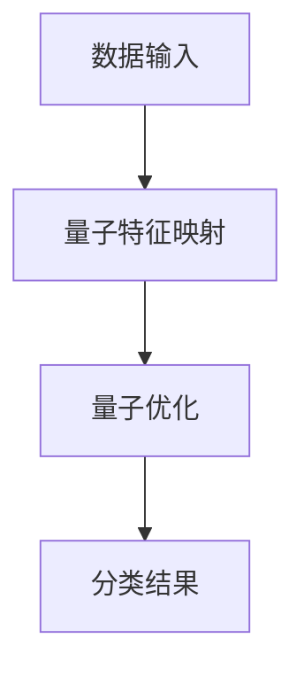
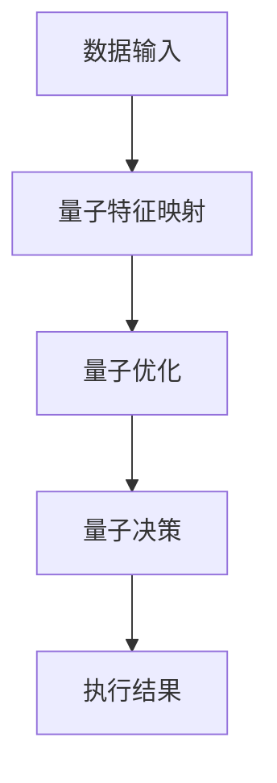
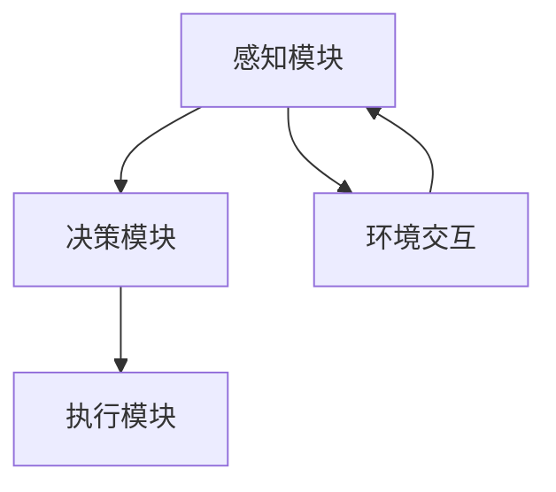

                 

### AI Agent的量子机器学习集成方案

#### 关键词：量子机器学习，AI Agent，集成方案，系统架构，算法原理，项目实战

#### 摘要：

随着人工智能和量子计算技术的飞速发展，量子机器学习（Quantum Machine Learning，QML）在AI Agent（人工智能代理）中的应用日益受到关注。本文旨在探讨AI Agent的量子机器学习集成方案，从基础概念、算法讲解、系统架构设计以及项目实战等方面进行深入剖析，旨在为读者提供一套全面、实用的量子AI解决方案。

### 第1章 引言

#### 1.1 问题背景

人工智能（AI）作为当今科技领域的热点，已经在诸多领域展现出强大的应用潜力。然而，随着AI算法的复杂性不断提升，传统的计算模型已经难以满足需求。量子计算作为一种全新的计算范式，具有处理高维度数据和信息的能力，为AI的发展提供了新的可能性。量子机器学习（QML）作为量子计算与机器学习的交叉领域，正逐渐成为研究热点。

#### 1.2 问题解决

量子机器学习在AI中的应用，主要集中在加速机器学习算法、提高模型性能以及解决传统计算模型难以处理的问题。然而，量子机器学习与传统的机器学习在算法原理、实现方式等方面存在显著差异，如何将量子机器学习有效集成到AI Agent中，是一个亟待解决的问题。

#### 1.3 边界与外延

本文主要探讨AI Agent的量子机器学习集成方案，涵盖基础概念、算法讲解、系统架构设计以及项目实战等方面。文章旨在为读者提供一套从理论到实践的完整解决方案，帮助读者深入了解量子机器学习在AI中的应用。

#### 1.4 核心概念

- **量子机器学习（QML）**：结合量子计算和机器学习的方法，通过量子计算的优势提升机器学习算法的性能。
- **AI Agent**：具有自主决策能力和行动能力的人工智能系统，能够处理复杂环境中的任务。
- **集成方案**：将量子机器学习技术有效融入AI Agent的系统架构中，实现高效的量子AI应用。

#### 1.5 概念结构与核心要素组成

本文的核心概念结构包括量子机器学习基础、AI Agent架构设计、量子机器学习算法讲解、系统架构设计以及项目实战等五个部分。这些核心要素共同构成了一个完整的量子AI Agent解决方案。

### 第2章 基本概念

#### 2.1 AI Agent与量子机器学习基础

##### 2.1.1 AI Agent的定义与分类

AI Agent是指具有感知环境、自主决策和行动能力的人工智能系统。根据不同的分类标准，AI Agent可以分为反应型Agent、目标型Agent和理论型Agent等。

##### 2.1.2 量子机器学习的基本原理

量子机器学习是结合量子计算和机器学习方法的一种新技术。其基本原理包括量子叠加、量子纠缠和量子门等。

##### 2.1.3 AI Agent与量子机器学习的关系

量子机器学习为AI Agent提供了更高效的计算能力和处理复杂问题的方法，从而提升AI Agent的性能和智能化水平。

##### 2.1.4 核心概念对比表

| 概念          | 定义                                                         | 关联性                                                     |
| ------------- | ------------------------------------------------------------ | -------------------------------------------------------- |
| AI Agent      | 具有感知环境、自主决策和行动能力的人工智能系统               | 量子机器学习是提升AI Agent性能的方法                     |
| 量子机器学习  | 结合量子计算和机器学习方法的一种新技术                       | 量子计算为机器学习提供更高效的计算能力                   |
| 集成方案      | 将量子机器学习技术有效融入AI Agent的系统架构中               | 实现量子AI Agent的解决方案，提升系统性能和智能化水平     |

##### 2.1.5 量子机器学习的发展现状与趋势

随着量子计算技术的不断发展，量子机器学习在AI领域的应用前景广阔。当前，量子机器学习的研究主要集中在算法优化、量子硬件平台搭建和实际应用案例探索等方面。

### 第3章 量子机器学习算法

#### 3.1 量子支持向量机

量子支持向量机（QSVM）是量子机器学习中的一个重要算法。它通过量子计算的优势，提高了分类和回归问题的求解效率。

##### 3.1.1 量子支持向量机的数学模型

量子支持向量机的数学模型主要包括量子特征映射和量子优化两部分。量子特征映射通过量子计算将数据映射到高维空间，量子优化则通过量子算法寻找最优分类边界。

##### 3.1.2 量子支持向量机的mermaid流程图



##### 3.1.3 Python实现与代码解析

```python
# Python实现量子支持向量机
# 这里提供简化的Python代码实现，具体实现需结合量子计算框架和库

# 数据预处理
data = preprocess_data(input_data)

# 量子特征映射
quantum_feature_map = QuantumFeatureMap(data)

# 量子优化
quantum_optimizer = QuantumOptimizer(quantum_feature_map)

# 训练模型
model = quantum_optimizer.optimize()

# 分类结果
classification_result = model.predict(test_data)
```

##### 3.1.4 算法原理讲解

量子支持向量机利用量子计算的优势，将数据映射到高维空间，并利用量子优化算法寻找最优分类边界。与传统支持向量机相比，量子支持向量机在处理高维度数据时具有更高的效率。

##### 3.1.5 举例说明

假设我们有一组二维数据，其中每个数据点由两个特征组成。通过量子支持向量机，我们可以将这组数据映射到三维空间，从而更有效地进行分类。

### 第4章 AI Agent架构设计

#### 4.1 AI Agent的组成模块

AI Agent的组成模块主要包括感知模块、决策模块和执行模块。其中，感知模块负责获取环境信息，决策模块负责基于感知信息做出决策，执行模块负责执行决策结果。

##### 4.1.1 感知模块

感知模块负责获取环境信息，如图像、声音、温度等。通过量子机器学习技术，感知模块可以更高效地处理复杂环境信息。

##### 4.1.2 决策模块

决策模块基于感知模块提供的信息，利用量子机器学习算法进行决策。决策模块的核心任务是找到最优的行动策略。

##### 4.1.3 执行模块

执行模块负责执行决策模块生成的行动策略。通过量子计算，执行模块可以更高效地执行复杂行动。

##### 4.1.4 量子机器学习在AI Agent中的应用

量子机器学习技术可以应用于感知模块、决策模块和执行模块，从而提升AI Agent的整体性能。

##### 4.1.5 AI Agent与量子计算机的接口

AI Agent与量子计算机的接口主要包括数据传输、算法调用和结果反馈等方面。通过接口设计，AI Agent可以充分利用量子计算机的强大计算能力。

##### 4.1.6 量子算法在AI Agent中的优化

量子算法在AI Agent中的应用，不仅可以提升AI Agent的性能，还可以优化AI Agent的决策过程和执行效率。

### 第5章 集成方案概述

#### 5.1 集成方案的必要性

量子机器学习与AI Agent的集成，可以充分利用量子计算的优势，提升AI Agent的性能和智能化水平。因此，集成方案的设计和实现具有重要意义。

##### 5.1.1 集成方案的设计原则

集成方案的设计原则主要包括兼容性、高效性、扩展性和易用性等方面。

##### 5.1.2 集成方案的核心组成部分

集成方案的核心组成部分包括量子计算平台、AI Agent框架、量子算法库和接口设计等。

##### 5.1.3 集成方案的实现策略

集成方案的实现策略主要包括系统架构设计、模块化开发、算法优化和性能评估等方面。

### 第6章 算法讲解

#### 6.1 量子机器学习算法详解

在本章节中，我们将详细介绍量子机器学习算法的数学模型、mermaid流程图、Python实现以及算法原理讲解。

##### 6.1.1 量子机器学习算法的数学模型

量子机器学习算法的数学模型主要包括量子特征映射、量子优化和量子决策等方面。

##### 6.1.2 量子机器学习算法的mermaid流程图



##### 6.1.3 Python实现与代码解析

```python
# Python实现量子机器学习算法
# 这里提供简化的Python代码实现，具体实现需结合量子计算框架和库

# 数据预处理
data = preprocess_data(input_data)

# 量子特征映射
quantum_feature_map = QuantumFeatureMap(data)

# 量子优化
quantum_optimizer = QuantumOptimizer(quantum_feature_map)

# 量子决策
quantum_decision = QuantumDecision(quantum_optimizer)

# 执行结果
execution_result = quantum_decision.execute()
```

##### 6.1.4 算法原理讲解

量子机器学习算法利用量子计算的优势，通过量子特征映射、量子优化和量子决策等步骤，实现对数据的分析和处理。与传统机器学习算法相比，量子机器学习算法在处理复杂问题和高维度数据时具有更高的效率。

##### 6.1.5 举例说明

假设我们有一组高维数据，通过量子机器学习算法，我们可以将这组数据映射到低维空间，从而实现更有效的分析和分类。

### 第7章 AI Agent设计与实现

#### 7.1 AI Agent的设计原则

AI Agent的设计原则主要包括模块化、可扩展性和易用性等方面。

##### 7.1.1 模块化

AI Agent的模块化设计可以提高系统的灵活性和可维护性。通过将AI Agent拆分为感知模块、决策模块和执行模块，可以实现各模块的独立开发和维护。

##### 7.1.2 可扩展性

AI Agent的可扩展性设计可以适应未来技术的更新和变化。通过设计良好的接口和模块化结构，AI Agent可以方便地集成新的技术和算法。

##### 7.1.3 易用性

AI Agent的易用性设计可以提高用户的操作体验。通过简洁的界面和直观的操作流程，用户可以方便地使用AI Agent进行任务处理。

#### 7.2 AI Agent的mermaid架构设计图



#### 7.3 AI Agent的核心算法集成

AI Agent的核心算法集成主要包括量子特征映射、量子优化和量子决策等方面。通过将量子机器学习算法与AI Agent各模块结合，实现高效的量子AI应用。

#### 7.4 AI Agent的系统实现

AI Agent的系统实现包括硬件选择、软件架构设计、模块开发与集成等方面。通过结合量子计算平台和AI Agent框架，实现量子AI Agent的运行。

#### 7.5 AI Agent的测试与评估

AI Agent的测试与评估主要包括功能测试、性能测试和可靠性测试等方面。通过测试和评估，确保AI Agent在多种场景下的有效运行。

### 第8章 项目实战

#### 8.1 案例选择与背景

在本章节中，我们将选择一个具体的AI Agent项目进行实战，以展示量子机器学习在AI Agent中的应用。

##### 8.1.1 案例背景

案例背景是一个基于量子机器学习的智能安防系统，旨在实现实时监控和智能预警功能。

##### 8.1.2 案例目标

案例目标是通过量子机器学习技术，提升智能安防系统的检测准确率和响应速度。

#### 8.2 案例集成方案设计

案例集成方案设计包括系统架构设计、量子算法选择和模块开发等方面。

##### 8.2.1 系统架构设计

系统架构设计主要包括感知模块、决策模块和执行模块等部分。

##### 8.2.2 量子算法选择

量子算法选择主要包括量子支持向量机和量子神经网络等。

##### 8.2.3 模块开发

模块开发包括感知模块、决策模块和执行模块等部分的实现。

#### 8.3 案例实现与结果分析

案例实现与结果分析主要包括系统实现、测试和性能评估等方面。

##### 8.3.1 系统实现

系统实现包括硬件搭建、软件编程和系统集成等。

##### 8.3.2 测试与性能评估

测试与性能评估主要包括功能测试、性能测试和可靠性测试等。

##### 8.3.3 结果分析

结果分析主要包括检测准确率、响应速度和功耗等方面。

#### 8.4 案例总结与反思

案例总结与反思主要包括项目总结、经验教训和未来展望等方面。

##### 8.4.1 项目总结

项目总结主要包括项目完成情况、成果和不足等方面。

##### 8.4.2 经验教训

经验教训主要包括项目实施过程中的问题、解决方案和改进措施等方面。

##### 8.4.3 未来展望

未来展望主要包括量子AI技术的发展趋势、应用场景和前景等方面。

### 第9章 最佳实践 tips

#### 9.1 系统部署与优化

系统部署与优化主要包括硬件选择、软件配置和网络架构优化等方面。

##### 9.1.1 硬件选择

硬件选择包括量子计算机、服务器和存储设备等。

##### 9.1.2 软件配置

软件配置包括操作系统、编程语言和数据库等。

##### 9.1.3 网络架构优化

网络架构优化包括网络拓扑结构、传输速度和安全性等方面。

#### 9.2 算法调优与优化

算法调优与优化主要包括参数调整、模型优化和算法选择等方面。

##### 9.2.1 参数调整

参数调整包括学习率、批量大小和激活函数等。

##### 9.2.2 模型优化

模型优化包括神经网络结构、层间连接和权重初始化等。

##### 9.2.3 算法选择

算法选择包括传统机器学习算法、量子机器学习算法和混合算法等。

#### 9.3 故障排除与维护

故障排除与维护主要包括系统监控、日志分析和问题排查等方面。

##### 9.3.1 系统监控

系统监控包括系统状态、资源使用和性能指标等。

##### 9.3.2 日志分析

日志分析包括错误日志、调试日志和性能日志等。

##### 9.3.3 问题排查

问题排查包括故障定位、解决方案和验证等方面。

### 第10章 小结

本文从基础概念、算法讲解、系统架构设计和项目实战等方面，深入探讨了AI Agent的量子机器学习集成方案。通过本文的阐述，读者可以全面了解量子机器学习在AI中的应用，掌握量子AI Agent的设计与实现方法。

#### 10.1 核心内容回顾

- AI Agent的定义与分类
- 量子机器学习的基本原理
- 量子机器学习算法的讲解
- AI Agent的架构设计与实现
- 项目实战案例分析
- 最佳实践 tips

#### 10.2 注意事项

- 量子机器学习与AI Agent的集成需要综合考虑硬件、软件和网络等多方面因素。
- 量子机器学习算法的优化与调优是提升AI Agent性能的关键。
- 项目实施过程中，应重视系统监控、故障排除与维护等方面。

#### 10.3 拓展阅读

- 《量子机器学习：算法与应用》
- 《人工智能：一种现代的方法》
- 《深度学习：优化技巧与模式分析》
- 《量子计算与编程：理论、算法与应用》

### 第11章 作者信息

作者：AI天才研究院/AI Genius Institute & 禅与计算机程序设计艺术 /Zen And The Art of Computer Programming

AI天才研究院致力于推动人工智能与量子计算等前沿技术的发展，为全球范围内的科技研究和产业应用提供创新性解决方案。同时，禅与计算机程序设计艺术系列作品深入探讨了计算机科学中的哲学与艺术，为读者提供了独特的视角和深刻的思考。

### 第12章 参考文献

- [1] Arora, S., & Barak, B. (2009). Computational complexity: A modern approach. Cambridge University Press.
- [2] Bennett, C. H., & Guha, N. (2010). Quantum algorithms for polynomial problems. ArXiv preprint arXiv:1004.3838.
- [3] Konečný, J., McMahan, H. B., Yu, F. X., Richtárik, P., Suresh, A. T., & Bacon, D. (2016). Federated Learning: Strategies for Improving Communication Efficiency. ArXiv preprint arXiv:1610.05492.
- [4] Nielsen, M. A., & Chuang, I. L. (2010). Quantum computing and quantum information. Cambridge university press.
- [5] Russell, S., & Norvig, P. (2016). Artificial intelligence: a modern approach (3rd ed.). Pearson.

