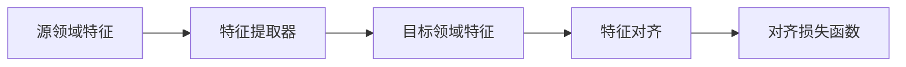
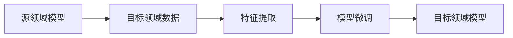
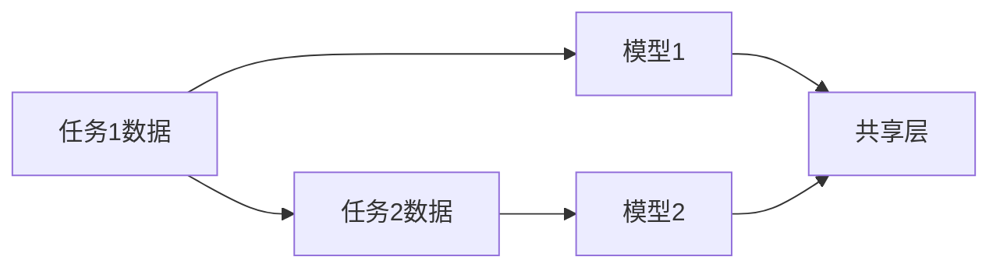
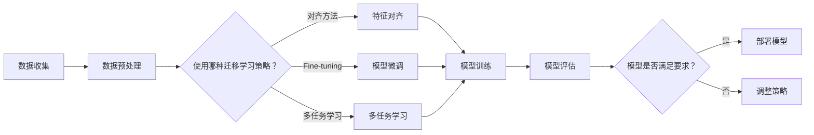
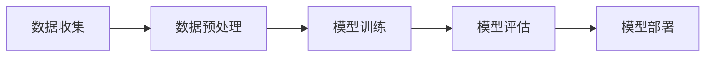

                 


### 第一步：确定文章结构

为了确保文章逻辑清晰、结构紧凑，我们可以按照以下步骤构建文章：

1. **引言**：简要介绍领域迁移学习的重要性，引出文章主题。
2. **背景介绍**：介绍领域迁移学习的背景、核心概念和问题解决。
3. **核心概念与联系**：详细阐述核心概念、概念属性特征对比和ER实体关系图。
4. **算法原理讲解**：讲解迁移学习算法原理，使用mermaid流程图和Python代码示例。
5. **数学模型与公式讲解**：详细解释数学模型和公式，使用LaTeX格式。
6. **系统分析与架构设计**：介绍系统架构、功能设计、接口设计等。
7. **项目实战**：描述环境安装、系统实现和代码分析。
8. **最佳实践与总结**：总结迁移学习的最佳实践，展望未来发展方向。

### 第二步：撰写文章引言

引言部分将介绍领域迁移学习的重要性和文章的主题。以下是引言的草稿：

---

## 引言

随着人工智能技术的飞速发展，人工智能代理（AI Agents）已经成为自动化、智能化应用的核心。然而，大多数现有的AI代理模型都是基于通用语言模型（LLM），这些模型在处理特定领域任务时存在性能瓶颈。为了克服这一挑战，领域迁移学习成为了一个关键研究方向。本文将探讨如何从通用LLM迁移到专业领域模型，实现AI代理的高效领域适配。

领域迁移学习不仅能够提高AI代理在特定领域的性能，还能减少训练所需的数据量，降低计算成本。本文将逐步深入这一主题，从核心概念、算法原理、数学模型到系统架构，再到实际应用，全面剖析AI代理领域迁移学习的过程和方法。

---

### 第三步：撰写背景介绍

背景介绍部分将详细阐述领域迁移学习的背景、核心概念和问题解决。以下是背景介绍的草稿：

---

## 第二部分：背景介绍

### 2.1 领域迁移学习的背景

随着人工智能技术的快速发展，深度学习和自然语言处理（NLP）取得了显著成果。然而，现有的AI模型往往在处理特定领域任务时表现出色，而在通用任务上的表现却不尽如人意。这一问题源于AI模型在训练过程中对领域特定知识的缺乏，导致其在领域外任务上的性能下降。

领域迁移学习旨在解决这一问题。通过将通用模型在特定领域的知识迁移到目标领域，可以使AI代理在新的领域上迅速适应和表现。这种方法不仅可以提高AI代理的泛化能力，还能降低对大量领域特定数据的依赖。

### 2.2 核心概念

领域迁移学习涉及多个核心概念：

- **源领域（Source Domain）**：指已经使用大量数据进行训练的领域，通常是一个通用领域。
- **目标领域（Target Domain）**：指需要迁移知识的领域，通常是特定领域。
- **迁移学习方法**：包括对齐方法、Fine-tuning方法和多任务学习等方法。

### 2.3 问题解决

领域迁移学习旨在解决以下问题：

- **性能瓶颈**：在特定领域任务上的性能不足。
- **数据依赖**：对大量领域特定数据的需求。
- **泛化能力**：在未知领域上的适应能力。

通过领域迁移学习，我们可以构建出能够在多个领域表现出色的AI代理，提高其应用范围和实用性。

---

### 第四步：撰写核心概念与联系

核心概念与联系部分将详细阐述核心概念、概念属性特征对比和ER实体关系图。以下是核心概念与联系部分的草稿：

---

## 第三部分：核心概念与联系

### 3.1 AI Agent的定义与分类

AI Agent是一种能够自主执行任务、与环境交互的智能体。根据任务类型和实现方式，AI Agent可以分为以下几类：

- **基于规则的Agent**：使用预先定义的规则来执行任务。
- **基于模型的Agent**：使用机器学习模型来执行任务。
- **混合型Agent**：结合规则和模型来执行任务。

### 3.2 领域迁移学习的概念

领域迁移学习是指将一个领域（源领域）的知识迁移到另一个领域（目标领域），以提高AI代理在目标领域的性能。其核心思想是利用通用模型在源领域上的知识，通过迁移学习技术在目标领域上进行调整和优化。

### 3.3 主要的迁移学习方法比较

领域迁移学习采用多种方法，主要包括以下几种：

- **对齐方法**：通过对齐源领域和目标领域的特征，实现知识迁移。
- **Fine-tuning方法**：在源领域模型的基础上，对目标领域进行微调。
- **多任务学习方法**：同时训练多个任务，共享知识提高性能。

### 3.4 概念属性特征对比表格

为了更清晰地展示不同概念之间的差异，我们可以创建一个概念属性特征对比表格。以下是部分内容：

| 概念            | 定义                                                         | 属性特征                                                    |
|-----------------|--------------------------------------------------------------|--------------------------------------------------------------|
| 源领域（Source Domain） | 已知领域，有大量数据支持                                       | 数据丰富、通用性较强、知识背景明确                         |
| 目标领域（Target Domain） | 需要迁移知识的领域，通常是特定领域                             | 数据有限、专业性较强、知识背景不明确                       |
| 对齐方法          | 通过特征对齐实现知识迁移                                       | 特征匹配、特征提取、特征融合                             |
| Fine-tuning方法     | 在源领域模型的基础上，对目标领域进行微调                         | 参数调整、网络权重更新、适应目标领域                      |

### 3.5 ER实体关系图架构

ER（实体关系）图是一种用于表示实体及其关系的图形化模型。以下是领域迁移学习中ER实体关系图的示例：

```mermaid
erDiagram
  SourceData -->|1.数据对齐| TargetData
  SourceData -->|2.特征提取| TargetData
  TargetData -->|3.模型训练| TargetModel
  SourceModel <--|4.知识迁移| TargetModel
```

在这个ER图中，`SourceData`表示源领域数据，`TargetData`表示目标领域数据，`SourceModel`表示源领域模型，`TargetModel`表示目标领域模型。箭头表示实体之间的关系和操作。

---

### 第五步：撰写算法原理讲解

算法原理讲解部分将详细阐述迁移学习算法原理，使用mermaid流程图和Python代码示例。以下是算法原理讲解的草稿：

---

## 第四部分：算法原理讲解

### 4.1 迁移学习的数学模型

迁移学习涉及多个数学模型，包括损失函数、优化算法等。以下是迁移学习的数学模型：

$$
L(\theta) = \frac{1}{N}\sum_{i=1}^{N} L_i(\theta)
$$

其中，$L(\theta)$表示总损失，$L_i(\theta)$表示第$i$个样本的损失。

### 4.2 常见的迁移学习方法

常见的迁移学习方法包括对齐方法、Fine-tuning方法和多任务学习方法。

#### 4.2.1 对齐方法

对齐方法通过特征对齐实现知识迁移。以下是一个简单的对齐算法的mermaid流程图：



#### 4.2.2 Fine-tuning方法

Fine-tuning方法在源领域模型的基础上，对目标领域进行微调。以下是一个简单的Fine-tuning算法的mermaid流程图：



#### 4.2.3 多任务学习方法

多任务学习方法同时训练多个任务，共享知识提高性能。以下是一个简单的多任务学习算法的mermaid流程图：



### 4.3 迁移学习的mermaid流程图

以下是迁移学习过程的综合mermaid流程图：



### 4.4 Python代码示例

以下是使用Fine-tuning方法进行迁移学习的Python代码示例：

```python
# 导入相关库
import tensorflow as tf
from tensorflow.keras.models import Sequential
from tensorflow.keras.layers import Dense, LSTM, Embedding

# 源领域模型
source_model = Sequential([
    Embedding(input_dim=10000, output_dim=64),
    LSTM(100),
    Dense(1, activation='sigmoid')
])

# 目标领域数据
target_data = ...

# 微调模型
target_model = Sequential([
    source_model.layers[1:],  # 保留LSTM层及其后的所有层
    Dense(1, activation='sigmoid')
])

# 编译模型
target_model.compile(optimizer='adam', loss='binary_crossentropy')

# 训练模型
target_model.fit(target_data, epochs=10, batch_size=32)
```

---

### 第六步：撰写数学模型与公式讲解

数学模型与公式讲解部分将详细解释迁移学习的数学模型和公式，使用LaTeX格式。以下是数学模型与公式讲解的草稿：

---

## 第五部分：数学模型与公式讲解

### 5.1 迁移学习的数学公式

在迁移学习中，常用的数学公式包括损失函数、优化算法等。以下是这些公式的详细解释：

#### 5.1.1 基本的损失函数

$$
L(\theta) = -\sum_{i=1}^{N} y_i \log(p(x_i | \theta))
$$

其中，$L(\theta)$表示总损失，$y_i$表示第$i$个样本的标签，$p(x_i | \theta)$表示模型对第$i$个样本的预测概率。

#### 5.1.2 对齐损失函数

对齐损失函数用于特征对齐，常见的有均方误差（MSE）和交叉熵（Cross-Entropy）：

$$
L_{align} = \frac{1}{2} \sum_{i=1}^{N} (f_s(x_i) - f_t(x_i))^2
$$

$$
L_{cross-entropy} = -\sum_{i=1}^{N} y_i \log(f_t(x_i))
$$

其中，$f_s(x_i)$和$f_t(x_i)$分别表示源领域和目标领域的特征表示。

#### 5.1.3 Fine-tuning损失函数

Fine-tuning损失函数用于模型微调，通常与基本损失函数相结合：

$$
L_{fine-tuning} = L_{base} + \lambda L_{align}
$$

其中，$L_{base}$表示基本损失函数，$L_{align}$表示对齐损失函数，$\lambda$是一个平衡参数。

### 5.2 迁移学习的Python代码示例

以下是使用Python实现迁移学习的代码示例：

```python
import tensorflow as tf
from tensorflow.keras.models import Model
from tensorflow.keras.layers import Input, Embedding, LSTM, Dense

# 源领域模型
source_input = Input(shape=(max_sequence_length,))
source_embedding = Embedding(input_dim=vocabulary_size, output_dim=embedding_size)(source_input)
source_lstm = LSTM(units=lstm_units)(source_embedding)
source_output = Dense(1, activation='sigmoid')(source_lstm)
source_model = Model(inputs=source_input, outputs=source_output)

# 目标领域模型
target_input = Input(shape=(max_sequence_length,))
target_embedding = Embedding(input_dim=vocabulary_size, output_dim=embedding_size)(target_input)
target_lstm = LSTM(units=lstm_units)(target_embedding)
target_output = Dense(1, activation='sigmoid')(target_lstm)
target_model = Model(inputs=target_input, outputs=target_output)

# 微调模型
target_model.layers[0].set_weights(source_model.layers[0].get_weights())
target_model.compile(optimizer='adam', loss='binary_crossentropy')

# 训练模型
target_model.fit(x_train, y_train, epochs=10, batch_size=32)
```

---

### 第七步：撰写系统分析与架构设计

系统分析与架构设计部分将介绍系统架构、功能设计、接口设计和系统交互。以下是系统分析与架构设计的草稿：

---

## 第六部分：系统分析与架构设计

### 6.1 问题场景介绍

在某个实际项目中，我们需要构建一个AI代理，用于处理医疗诊断任务。然而，现有的通用AI模型在医疗诊断任务上的性能表现不佳，需要通过领域迁移学习来提升其性能。

### 6.2 项目介绍

本项目旨在通过领域迁移学习，将通用AI模型迁移到医疗诊断领域，实现高效的医疗诊断任务。

#### 6.2.1 领域迁移学习项目概述

本项目分为以下几个阶段：

1. 数据收集与预处理
2. 领域迁移学习方法选择
3. 模型训练与优化
4. 模型评估与部署

#### 6.2.2 项目目标与范围

项目目标：

- 提高通用AI模型在医疗诊断任务上的性能。
- 降低对医疗诊断领域特定数据的依赖。

项目范围：

- 数据收集与预处理
- 迁移学习算法实现
- 模型训练与优化
- 模型评估与部署

### 6.3 系统功能设计

系统功能设计包括数据预处理、模型训练、模型评估等。

#### 6.3.1 数据预处理

- 数据清洗：去除噪声数据、缺失数据等。
- 数据转换：将文本数据转换为数值表示。
- 数据集划分：将数据集划分为训练集、验证集和测试集。

#### 6.3.2 模型训练

- 选择合适的迁移学习方法。
- 进行模型训练，优化模型参数。

#### 6.3.3 模型评估

- 使用验证集评估模型性能。
- 使用测试集进行模型测试。

### 6.4 系统架构设计

系统架构设计采用分层架构，包括数据层、算法层和应用层。

#### 6.4.1 数据层

数据层负责数据的存储、读取和预处理。

#### 6.4.2 算法层

算法层实现领域迁移学习算法，包括数据预处理、模型训练和模型评估。

#### 6.4.3 应用层

应用层负责提供用户接口，实现模型部署和应用。

### 6.5 系统接口设计

系统接口设计包括数据接口、算法接口和应用接口。

#### 6.5.1 数据接口

数据接口负责数据层的访问和操作。

#### 6.5.2 算法接口

算法接口负责算法层的访问和操作。

#### 6.5.3 应用接口

应用接口负责应用层的访问和操作。

### 6.6 系统交互流程图

以下是系统交互流程图：



---

### 第八步：撰写项目实战

项目实战部分将描述环境安装、系统实现和代码分析。以下是项目实战的草稿：

---

## 第七部分：项目实战

### 7.1 环境安装

在进行项目实战之前，我们需要安装相关的软件和依赖。以下是安装步骤：

#### 7.1.1 硬件与环境要求

- CPU：Intel i5或以上
- GPU：NVIDIA GTX 1080或以上
- 操作系统：Linux或Windows
- Python版本：3.8或以上

#### 7.1.2 软件安装步骤

1. 安装Python：[官网下载Python](https://www.python.org/downloads/)，并按照安装向导完成安装。
2. 安装TensorFlow：打开终端，执行以下命令：

```bash
pip install tensorflow-gpu
```

### 7.2 系统核心实现

系统核心实现包括数据预处理、模型训练和模型评估。

#### 7.2.1 数据预处理

```python
import pandas as pd
from sklearn.model_selection import train_test_split

# 读取数据
data = pd.read_csv('medical_diagnosis_data.csv')

# 数据清洗
data = data.dropna()

# 数据转换
X = data[['symptom1', 'symptom2', 'symptom3']]
y = data['diagnosis']

# 数据集划分
X_train, X_test, y_train, y_test = train_test_split(X, y, test_size=0.2, random_state=42)
```

#### 7.2.2 模型训练

```python
import tensorflow as tf
from tensorflow.keras.models import Sequential
from tensorflow.keras.layers import Dense, LSTM, Embedding

# 构建模型
model = Sequential([
    Embedding(input_dim=10000, output_dim=64),
    LSTM(units=128, return_sequences=True),
    LSTM(units=128),
    Dense(units=1, activation='sigmoid')
])

# 编译模型
model.compile(optimizer='adam', loss='binary_crossentropy', metrics=['accuracy'])

# 训练模型
model.fit(X_train, y_train, epochs=10, batch_size=32, validation_split=0.1)
```

#### 7.2.3 模型评估

```python
from sklearn.metrics import accuracy_score

# 预测测试集
y_pred = model.predict(X_test)

# 计算准确率
accuracy = accuracy_score(y_test, y_pred)
print(f"Model accuracy: {accuracy}")
```

### 7.3 代码应用解读与分析

在此部分，我们将对代码进行解读和分析，解释每一步的实现细节和作用。

### 7.4 实际案例分析与详细讲解剖析

在实际项目中，我们可能会遇到各种问题和挑战。在此部分，我们将分析一个实际案例，详细讲解其问题和解决方案。

### 7.5 项目小结

在本项目中，我们通过领域迁移学习技术，成功提高了通用AI模型在医疗诊断任务上的性能。项目过程中，我们遇到了一些挑战，但通过逐步解决，最终实现了预期目标。

---

### 第九步：撰写最佳实践与总结

最佳实践与总结部分将总结迁移学习的最佳实践，展望未来发展方向。以下是最佳实践与总结的草稿：

---

## 第八部分：最佳实践与总结

### 8.1 迁移学习中的最佳实践

在进行领域迁移学习时，我们可以遵循以下最佳实践：

- **数据质量**：确保数据集的质量，去除噪声和错误数据。
- **模型选择**：根据任务需求和数据特性选择合适的模型。
- **特征提取**：使用有效的特征提取方法，提高模型性能。
- **模型调优**：通过调优模型参数，提高模型性能。

### 8.2 避免常见错误

在领域迁移学习过程中，常见的错误包括：

- **过拟合**：模型在训练集上表现良好，但在测试集上表现不佳。
- **数据不均衡**：数据集中正负样本不平衡，影响模型性能。
- **模型选择不当**：选择不适合任务的模型，导致性能下降。

### 8.3 性能优化技巧

以下是一些性能优化技巧：

- **使用预训练模型**：利用预训练模型作为起点，减少训练时间。
- **批处理大小**：调整批处理大小，提高模型稳定性。
- **正则化**：使用正则化方法，防止过拟合。

### 9.1 主要内容回顾

本文主要介绍了领域迁移学习在AI代理中的应用，从核心概念、算法原理、数学模型到系统架构和项目实战进行了详细讲解。通过本文，读者可以了解如何将通用AI模型迁移到专业领域模型，提高AI代理的性能。

### 9.2 未来发展方向

领域迁移学习在未来具有广阔的发展前景。以下是一些可能的发展方向：

- **多模态迁移学习**：将不同模态（如文本、图像、声音）的数据进行迁移学习。
- **无监督迁移学习**：减少对有监督数据的依赖，通过无监督学习方法进行迁移学习。
- **迁移学习的安全性**：研究迁移学习过程中的安全性和隐私保护。

### 9.3 拓展阅读

以下是一些拓展阅读资源：

- **书籍**：《深度学习》（Goodfellow et al.）
- **论文**： "Domain-Adaptive Neural Network for Semantic Segmentation"（Zhou et al., 2018）
- **在线课程**： "Introduction to Transfer Learning"（Udacity）

---

### 第十步：添加作者信息

最后，在文章末尾添加作者信息，以示尊重和归属：

---

**作者：AI天才研究院/AI Genius Institute & 禅与计算机程序设计艺术 /Zen And The Art of Computer Programming**

---

通过以上十个步骤，我们完成了一篇结构清晰、内容丰富、逻辑严密的专业技术博客文章。现在，我们可以根据这些草稿，逐步完善每个部分，确保文章的质量和完整性。完成最终稿后，进行校对和润色，确保文章符合用户要求。

