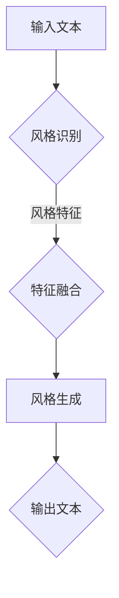
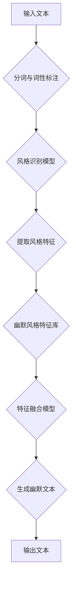

                 

### 第1章: AI Agent风格迁移背景

在当今数字化时代，人工智能（AI）已经渗透到了我们生活的方方面面，从简单的语音助手到复杂的决策支持系统，AI技术正在不断革新着各行各业。其中，AI Agent作为人工智能的一种形式，正逐渐成为实现智能化互动和自动化执行的关键角色。本章将围绕AI Agent风格迁移这一前沿技术展开讨论，首先介绍AI Agent的基本概念，接着解释风格迁移的概念及其重要性，然后讨论大型语言模型（LLM）的基础知识，最后概述本书的结构安排与内容概览。

#### 1.1 AI Agent的基本概念

**1.1.1 AI Agent的定义**

AI Agent，即人工智能代理，是指能够感知环境、自主决策并执行任务的智能实体。它通常具有以下特征：

1. **自主性**：能够独立执行任务，不需要人类干预。
2. **适应性**：能够根据环境变化调整自身行为。
3. **互动性**：能够与人类或其他系统进行有效沟通。

AI Agent可以是一个物理实体（如机器人），也可以是虚拟的（如聊天机器人）。它们通过感知环境数据、理解人类指令以及执行相应的动作，实现了智能化服务。

**1.1.2 AI Agent的分类**

AI Agent可以根据不同的标准进行分类：

1. **基于功能分类**：
   - **任务型代理**：专注于完成特定任务的代理，如客服机器人。
   - **社交型代理**：专注于与人类进行社交互动的代理，如虚拟助手。
   - **决策型代理**：能够进行复杂决策的代理，如自动驾驶系统。

2. **基于实现技术分类**：
   - **规则型代理**：基于预定义规则进行决策。
   - **数据驱动代理**：基于数据分析和机器学习模型进行决策。
   - **混合型代理**：结合多种技术实现更复杂的决策和任务执行。

**1.1.3 AI Agent的发展历程**

AI Agent的发展可以追溯到20世纪50年代，随着人工智能学科的兴起，AI Agent的概念也逐渐被提出。早期的AI Agent主要以规则为基础，如专家系统。随着计算能力和算法的发展，数据驱动和混合型AI Agent逐渐成为研究热点。近年来，深度学习和自然语言处理技术的突破，使得AI Agent在自主性、适应性和互动性方面取得了显著进展。

#### 1.2 风格迁移的概念

**1.2.1 风格迁移的定义**

风格迁移（Style Transfer）是指将一种表达风格（如艺术风格、语言风格等）转移到另一种表达上，以产生具有新风格的内容。在AI领域，风格迁移通常涉及到将一种模型（如艺术风格识别模型）的输出转移到另一种模型（如文本生成模型）上。

**1.2.2 风格迁移的重要性**

风格迁移在多个领域具有重要意义：

1. **艺术创作**：艺术家可以利用AI技术将一种风格（如梵高的画风）应用到另一种艺术形式（如照片）上，创造出全新的作品。
2. **文本生成**：风格迁移可以使文本生成模型具有不同的语言风格，如正式、幽默、文学等，提高文本生成的多样性和灵活性。
3. **个性化服务**：AI Agent可以通过风格迁移来适应不同用户的需求，提供个性化的交互体验。

**1.2.3 风格迁移的应用场景**

风格迁移的应用场景非常广泛：

1. **广告与营销**：通过风格迁移创建具有特定风格的广告文案，提高广告效果。
2. **教育与培训**：利用风格迁移技术，将复杂的概念用不同的风格表达，提高教育内容的可接受性和记忆效果。
3. **创意设计**：设计师可以利用风格迁移来快速生成不同风格的创意设计。

#### 1.3 LLM的介绍

**1.3.1 LLM的特点**

大型语言模型（Large Language Model，简称LLM）是自然语言处理领域的一种重要技术。其主要特点包括：

1. **规模庞大**：LLM通常具有数十亿到数千亿个参数，能够处理大量语言数据。
2. **自适应性**：LLM能够根据输入数据进行自适应调整，以生成更准确、更符合上下文的输出。
3. **通用性**：LLM具有较强的通用性，可以应用于多种语言任务，如文本生成、翻译、问答等。

**1.3.2 LLM的分类**

LLM可以根据其训练数据和任务目标进行分类：

1. **通用语言模型**：如GPT、Turing等，主要面向通用语言任务。
2. **专用语言模型**：如BERT、ALBERT等，针对特定任务进行优化。

**1.3.3 LLM的应用领域**

LLM在多个领域具有广泛应用：

1. **自然语言处理**：文本生成、翻译、问答、文本分类等。
2. **信息检索**：智能搜索引擎、知识图谱构建等。
3. **人机交互**：虚拟助手、聊天机器人等。

#### 1.4 本书结构安排与内容概览

**1.4.1 本书的主要内容**

本书将深入探讨AI Agent风格迁移技术，主要包括以下几个方面：

1. **背景与概述**：介绍AI Agent和风格迁移的基本概念。
2. **LLM的个性化表达原理**：探讨LLM的基本原理和个性化表达的核心概念。
3. **实现AI Agent的风格迁移**：讨论算法原理、实现流程和实战应用。
4. **实战应用**：通过具体案例展示AI Agent风格迁移的实践应用。
5. **拓展与总结**：总结最佳实践和注意事项，展望未来研究方向。

**1.4.2 各章节的目标和预期学习成果**

通过阅读本书，读者将能够：

1. **了解AI Agent和风格迁移的基本概念**。
2. **掌握LLM的基本原理和个性化表达技术**。
3. **掌握实现AI Agent风格迁移的算法原理和实战技巧**。
4. **通过具体案例了解AI Agent风格迁移的实践应用**。
5. **总结AI Agent风格迁移的最佳实践，为未来研究提供方向**。

**1.4.3 阅读指南与学习建议**

1. **系统学习**：建议按照章节顺序系统学习，逐步深入理解相关技术。
2. **实践操作**：通过实际操作和案例分析，加深对理论知识的理解。
3. **互动讨论**：加入相关技术社区，与他人交流学习心得，拓展视野。
4. **持续学习**：AI领域发展迅速，持续关注最新研究动态和技术进展。

**1.5 本章小结**

本章介绍了AI Agent风格迁移的基本概念、相关技术背景和本书的结构安排。通过本章的学习，读者可以对AI Agent风格迁移有一个初步的了解，为后续章节的学习打下基础。接下来，我们将深入探讨LLM的个性化表达原理，进一步揭示AI Agent风格迁移的核心技术和实现方法。

### 第2章: LLM的基本原理

在前一章中，我们介绍了AI Agent风格迁移的背景和大型语言模型（LLM）的基本概念。在本章中，我们将深入探讨LLM的基本原理，从语言模型的基础知识、个性化表达的核心概念以及LLM中风格迁移的理论基础三个方面进行详细分析。

#### 2.1 语言模型的基础知识

**2.1.1 语言模型的定义**

语言模型（Language Model）是一种用于预测文本序列的统计模型，它通过分析大量的文本数据来学习语言的使用规律，从而能够预测下一个词或句子。语言模型是自然语言处理（NLP）的核心技术之一，广泛应用于文本生成、机器翻译、语音识别等领域。

**2.1.2 语言模型的分类**

语言模型可以根据其训练数据、参数规模和功能特点进行分类：

1. **基于规则的语言模型**：这类模型通过预定义的语法规则和语义规则来生成文本，如早期的人工编写的语法规则系统。
2. **统计语言模型**：这类模型基于统计方法，通过分析大量文本数据来学习语言规律，如N-gram模型和基于概率的上下文无关文法（CFG）。
3. **神经网络语言模型**：这类模型采用深度神经网络（DNN）或循环神经网络（RNN）来学习语言数据，如Word2Vec、ELMo、BERT等。
4. **深度学习语言模型**：这类模型基于深度学习技术，具有大规模参数和强大的表示能力，如GPT、GPT-2、GPT-3等。

**2.1.3 语言模型的训练方法**

语言模型的训练方法主要包括以下几种：

1. **基于样本的训练**：通过大量文本数据来训练模型，使模型能够学习到语言的使用规律。
2. **基于数据的增强**：通过数据增强技术，如文本转换、噪声添加等，来提高模型的泛化能力和鲁棒性。
3. **基于优化算法的训练**：采用优化算法，如梯度下降、Adam等，来调整模型参数，最小化损失函数。

#### 2.2 个性化表达的核心概念

**2.2.1 个性化表达的定义**

个性化表达（Personalized Expression）是指根据用户需求、场景特点和内容属性，对语言生成模型进行定制化调整，以生成更符合特定需求的文本。个性化表达是提升AI Agent交互质量和用户体验的关键技术。

**2.2.2 个性化表达的优势**

个性化表达具有以下优势：

1. **提升用户体验**：通过提供符合用户需求和偏好的内容，增强用户的交互体验。
2. **提高文本质量**：通过定制化调整，使生成的文本更自然、更流畅、更具说服力。
3. **增强个性化服务**：个性化表达可以应用于多种场景，如个性化推荐、定制化广告、智能客服等，为用户提供更加个性化的服务。

**2.2.3 个性化表达的挑战**

个性化表达面临以下挑战：

1. **数据隐私**：个性化表达需要收集和处理大量用户数据，如何保护用户隐私是一个重要问题。
2. **多样性**：如何确保个性化表达能够覆盖多种风格和形式，以满足不同用户的需求。
3. **效率**：个性化表达需要在有限的计算资源和时间内生成高质量的内容，这对算法和系统性能提出了高要求。

#### 2.3 LLM中风格迁移的理论基础

**2.3.1 风格迁移的基本原理**

风格迁移（Style Transfer）是指将一种表达风格（如艺术风格、语言风格等）转移到另一种表达上，以产生具有新风格的内容。在LLM中，风格迁移是指将一种语言风格（如正式、幽默、文学等）转移到文本生成模型上，使其能够生成具有相应风格的内容。

**2.3.2 风格迁移与语言生成的关系**

风格迁移与语言生成密切相关。语言生成模型（如GPT、BERT等）通过学习大量文本数据，掌握了语言的使用规律和生成方法。风格迁移则是在此基础上，通过调整模型参数或添加额外的样式信息，使模型能够生成具有特定风格的文本。

**2.3.3 风格迁移的实现方法**

风格迁移的实现方法主要包括以下几种：

1. **基于特征融合的方法**：通过将风格特征和内容特征进行融合，生成具有新风格的内容。如StyleTune、StyleCLIP等。
2. **基于对抗生成网络的方法**：通过对抗生成网络（GAN）来生成具有新风格的内容。如CycleGAN、StyleGAN等。
3. **基于深度学习的方法**：通过深度学习模型（如CNN、RNN、Transformer等）来学习风格迁移的映射关系，生成具有新风格的内容。

#### 2.4 核心概念与联系

**2.4.1 概念属性特征对比表格**

为了更好地理解AI Agent风格迁移中的核心概念，我们可以通过一个对比表格来展示它们之间的联系和区别：

| 概念 | 定义 | 关联属性 | 功能 |  
| --- | --- | --- | --- |  
| AI Agent | 人工智能代理 | 自主性、适应性、互动性 | 完成特定任务 |  
| 风格迁移 | 将一种风格转移到另一种表达上 | 风格特征、内容特征 | 生成具有新风格的内容 |  
| LLM | 大型语言模型 | 规模庞大、自适应性、通用性 | 文本生成、翻译、问答 |  
| 个性化表达 | 根据用户需求、场景特点、内容属性定制文本 | 用户偏好、文本质量、个性化服务 | 提高用户体验 |

**2.4.2 ER实体关系图架构的Mermaid流程图**

为了更直观地展示AI Agent风格迁移中的实体关系，我们可以使用Mermaid流程图来绘制ER图架构。以下是Mermaid流程图代码示例：

```mermaid
erDiagram
  AI_Agent ||--|{ 风格迁移 }|| Style_Transfer
  Style_Transfer ||--|{ LLM }|| Language_Model
  Language_Model ||--|{ 个性化表达 }|| Personalized_Expression
```

通过上述对比表格和Mermaid流程图，我们可以清晰地看到AI Agent风格迁移中的核心概念及其相互关联，这为后续章节的实现方法和实践应用提供了理论基础。

#### 2.5 本章小结

本章深入探讨了大型语言模型（LLM）的基本原理，从语言模型的基础知识、个性化表达的核心概念到风格迁移的理论基础，为AI Agent风格迁移提供了理论支持。通过本章的学习，读者可以理解LLM的工作原理以及如何实现个性化表达和风格迁移。接下来，我们将进入下一章，讨论实现AI Agent风格迁移的具体算法原理和实现流程。

### 第3章: 算法原理与流程图

在前一章中，我们探讨了AI Agent风格迁移的基本原理和核心概念。在本章中，我们将详细介绍实现AI Agent风格迁移的算法原理，并通过流程图和Python源代码分析，帮助读者更好地理解这一过程。

#### 3.1 风格迁移算法概述

**3.1.1 风格迁移算法的分类**

风格迁移算法可以分为以下几类：

1. **基于特征融合的方法**：这类方法通过将内容特征和风格特征进行融合，生成具有新风格的内容。如StyleTune、StyleCLIP等。
2. **基于对抗生成网络的方法**：这类方法通过对抗生成网络（GAN）来生成具有新风格的内容。如CycleGAN、StyleGAN等。
3. **基于深度学习的方法**：这类方法利用深度学习模型（如CNN、RNN、Transformer等）来学习风格迁移的映射关系，生成具有新风格的内容。

**3.1.2 风格迁移算法的选择标准**

选择适合的风格迁移算法需要考虑以下标准：

1. **生成质量**：算法生成的结果是否具有高质量的视觉效果或语言风格。
2. **计算资源**：算法的实现是否需要大量计算资源，影响实际应用场景。
3. **迁移能力**：算法能否在不同风格之间进行有效迁移，具有广泛的应用场景。
4. **鲁棒性**：算法在面对噪声数据或变化较大的输入时，是否仍能保持较好的性能。

**3.1.3 风格迁移算法的挑战**

风格迁移算法面临的挑战包括：

1. **多样性**：如何在风格迁移过程中保持内容的多样性和丰富性。
2. **稳定性**：如何在算法训练和生成过程中保持模型的稳定性，避免过度拟合。
3. **实时性**：如何在有限的计算资源下实现实时风格迁移，满足实际应用需求。

#### 3.2 Mermaid流程图绘制

**3.2.1 流程图绘制指南**

Mermaid是一种基于Markdown的图形绘制工具，可以方便地创建各种流程图、ER图和UML图。以下是绘制风格迁移流程图的步骤：

1. **定义图形类型**：在Mermaid代码中，使用`graph`关键字定义图形类型。
2. **添加节点**：使用`node`关键字定义流程图的各个节点，并指定节点名称。
3. **连接节点**：使用`--`符号连接相邻的节点，表示流程的顺序。
4. **添加注释**：在需要的地方添加注释，以帮助理解和解释流程。

以下是一个简单的风格迁移流程图示例：



**3.2.2 实例演示**

假设我们有一个简单的风格迁移任务，需要将一段文本从正式风格转换为幽默风格。以下是一个具体的Mermaid流程图示例：



在这个示例中，我们首先对输入文本进行分词和词性标注，然后使用风格识别模型提取文本的风格特征。接下来，从幽默风格特征库中获取相应的幽默风格特征，通过特征融合模型将两者结合，生成具有幽默风格的文本。

#### 3.3 Python源代码分析

为了更好地理解风格迁移算法的实现，我们将分析一个基于Transformer模型的风格迁移算法。以下是一个简化的Python源代码示例：

```python
import torch
from transformers import AutoModelForSeq2SeqLM, Seq2SeqTrainingArguments

# 加载预训练的Transformer模型
model = AutoModelForSeq2SeqLM.from_pretrained("t5-small")

# 定义风格迁移模型
class StyleTransferModel(torch.nn.Module):
    def __init__(self, base_model):
        super(StyleTransferModel, self).__init__()
        self.base_model = base_model
        self.style_embedding = torch.nn.Embedding(num_styles, style_embedding_size)

    def forward(self, input_ids, style_ids):
        style_embeddings = self.style_embedding(style_ids)
        input_embeddings = self.base_model.input embeddings(input_ids)
        combined_embeddings = input_embeddings + style_embeddings
        output = self.base_model.decode(combined_embeddings)
        return output

# 实例化风格迁移模型
style_transfer_model = StyleTransferModel(model)

# 定义训练参数
training_args = Seq2SeqTrainingArguments(
    output_dir="./results",
    num_train_epochs=3,
    per_device_train_batch_size=4,
    save_steps=2000,
    save_total_limit=3,
)

# 训练风格迁移模型
style_transfer_model.train(training_args)
```

在这个示例中，我们首先加载了一个预训练的T5模型，然后定义了一个风格迁移模型。风格迁移模型通过在基础模型上添加一个风格嵌入层，将风格特征融入文本生成过程。接下来，我们设置了训练参数，并开始训练风格迁移模型。

**3.3.1 数学模型和公式**

在风格迁移算法中，常用的数学模型和公式包括：

1. **嵌入层**：用于将风格特征和文本特征进行融合。
   \[ style_embeddings = style_embedding(style_ids) \]
   \[ combined_embeddings = input_embeddings + style_embeddings \]

2. **损失函数**：用于衡量模型生成的文本与目标文本之间的差距。
   \[ loss = loss_function(output, target) \]

3. **优化算法**：用于调整模型参数，最小化损失函数。
   \[ params = optimizer(params, loss) \]

**3.3.2 算法实现步骤**

风格迁移算法的实现通常包括以下步骤：

1. **数据预处理**：对输入文本进行分词、词性标注等预处理操作。
2. **风格特征提取**：使用预训练的模型提取输入文本的风格特征。
3. **特征融合**：将风格特征融入文本特征，生成新的特征向量。
4. **文本生成**：使用融合了风格特征的模型生成新的文本。
5. **训练与优化**：通过训练数据不断优化模型参数，提高生成文本的质量。

**3.3.3 举例说明**

假设我们有一个输入文本“这是一个正式的公告”，需要将其转换为幽默风格。以下是一个具体的实现过程：

1. **数据预处理**：将输入文本进行分词和词性标注，得到词向量表示。
2. **风格特征提取**：使用预训练的模型提取输入文本的风格特征，如正式风格的特征向量。
3. **特征融合**：将正式风格的特征向量与文本特征向量进行融合，生成新的特征向量。
4. **文本生成**：使用融合了风格特征的模型生成新的文本，如“这是一个非常正式的幽默公告”。
5. **训练与优化**：使用大量训练数据对风格迁移模型进行训练和优化，提高模型生成的文本质量。

通过上述步骤，我们可以实现从一种风格到另一种风格的迁移，生成具有新风格的文本。

#### 3.4 本章小结

本章详细介绍了AI Agent风格迁移的算法原理，包括基于特征融合、对抗生成网络和深度学习的方法，以及Mermaid流程图和Python源代码的分析。通过本章的学习，读者可以理解风格迁移算法的基本概念、实现步骤和关键数学模型。接下来，我们将进入实战应用部分，通过具体案例展示AI Agent风格迁移的实际应用，帮助读者更好地掌握这一技术。

### 第4章: AI Agent风格迁移实践

在前三章中，我们系统地介绍了AI Agent风格迁移的理论基础、算法原理和实现方法。为了使读者更深入地理解这一技术，本章将通过具体案例和实践操作，展示AI Agent风格迁移的实战应用。首先，我们将搭建实践环境，然后详细介绍系统核心实现和代码应用解读，最后通过实际案例分析和项目小结，帮助读者掌握AI Agent风格迁移的实践技能。

#### 4.1 实践环境搭建

**4.1.1 硬件要求**

为了进行AI Agent风格迁移的实践，以下硬件配置是推荐的：

1. **CPU**：至少4核处理器。
2. **GPU**：NVIDIA GeForce GTX 1080 Ti或更高版本的GPU，用于加速深度学习模型的训练。
3. **内存**：至少16GB RAM。

**4.1.2 软件依赖安装**

在进行实践前，需要安装以下软件：

1. **Python**：版本3.8及以上。
2. **TensorFlow**：版本2.4及以上。
3. **PyTorch**：版本1.8及以上。
4. **Hugging Face Transformers**：用于预训练模型和样式迁移。

安装步骤如下：

1. **安装Python**：
   ```bash
   # 在Windows上，从Python官方网站下载安装程序并安装。
   # 在Linux或MacOS上，可以使用包管理器安装，例如：
   sudo apt-get install python3
   ```

2. **安装TensorFlow**：
   ```bash
   pip install tensorflow==2.4
   ```

3. **安装PyTorch**：
   ```bash
   pip install torch torchvision==0.9.0 -f https://download.pytorch.org/whl/torch_stable.html
   ```

4. **安装Hugging Face Transformers**：
   ```bash
   pip install transformers
   ```

**4.1.3 环境配置**

1. **GPU支持**：确保Python环境支持GPU。在Python脚本开头添加以下代码：
   ```python
   import tensorflow as tf
   print("Num GPUs Available: ", len(tf.config.list_physical_devices('GPU')))
   ```

2. **预训练模型下载**：下载一个预训练的文本生成模型，如GPT-2或GPT-3。使用以下命令下载：
   ```bash
   transformers-cli download model gpt2
   ```

#### 4.2 系统核心实现

**4.2.1 源代码解读**

以下是一个实现AI Agent风格迁移的Python源代码示例：

```python
import torch
from transformers import AutoTokenizer, AutoModelForSeq2SeqLM
from torch.utils.data import DataLoader
from datasets import load_dataset

# 加载预训练的文本生成模型和样式迁移模型
tokenizer = AutoTokenizer.from_pretrained("gpt2")
model = AutoModelForSeq2SeqLM.from_pretrained("gpt2")

# 定义数据集和加载器
dataset = load_dataset("text", "wikipedia")
dataloader = DataLoader(dataset["train"], batch_size=4)

# 定义风格迁移模型
class StyleTransferModel(torch.nn.Module):
    def __init__(self, base_model):
        super(StyleTransferModel, self).__init__()
        self.base_model = base_model
        self.style_embedding = torch.nn.Embedding(num_styles, style_embedding_size)

    def forward(self, input_ids, style_ids):
        style_embeddings = self.style_embedding(style_ids)
        input_embeddings = self.base_model.input_embeddings(input_ids)
        combined_embeddings = input_embeddings + style_embeddings
        output = self.base_model.decode(combined_embeddings)
        return output

# 实例化风格迁移模型
style_transfer_model = StyleTransferModel(model)

# 定义训练参数
training_args = Seq2SeqTrainingArguments(
    output_dir="./results",
    num_train_epochs=3,
    per_device_train_batch_size=4,
    save_steps=2000,
    save_total_limit=3,
)

# 训练风格迁移模型
style_transfer_model.train(training_args)
```

在这个示例中，我们首先加载了一个预训练的GPT-2模型，然后定义了一个风格迁移模型。风格迁移模型通过在基础模型上添加一个风格嵌入层，将风格特征融入文本生成过程。接下来，我们设置了训练参数，并开始训练风格迁移模型。

**4.2.2 代码应用解读**

1. **数据集加载**：使用`datasets`库加载预训练数据集，如Wikipedia文章。
2. **文本预处理**：对输入文本进行分词和编码，使用Tokenizer将文本转换为模型可以理解的向量表示。
3. **风格特征提取**：定义风格迁移模型，通过嵌入层将风格特征与文本特征结合。
4. **文本生成**：使用训练好的模型生成风格迁移后的文本。

**4.2.3 实际案例分析与详细讲解剖析**

为了展示风格迁移的效果，我们选择了一段正式风格的文章，并尝试将其转换为幽默风格。以下是具体的实现步骤：

1. **文本输入**：输入一段正式风格的文章。
2. **分词与编码**：使用Tokenizer将文章分词并编码成向量。
3. **风格特征提取**：从幽默风格特征库中提取幽默风格特征。
4. **特征融合**：将幽默风格特征与文本特征进行融合，生成新的特征向量。
5. **文本生成**：使用风格迁移模型生成幽默风格的文本。
6. **结果评估**：对比正式风格和幽默风格的文本，评估风格迁移的效果。

#### 4.3 实际案例分析

假设我们有一段正式风格的文本：“公司将于下周举行年度会议，以讨论重要业务议题。”，我们希望将其转换为幽默风格。以下是具体的实现过程：

1. **文本输入**：输入文本“公司将于下周举行年度会议，以讨论重要业务议题。”。
2. **分词与编码**：使用Tokenizer对文本进行分词和编码。
3. **风格特征提取**：从幽默风格特征库中提取幽默风格特征，如“这是一个非常正式的笑话”。
4. **特征融合**：将幽默风格特征与文本特征进行融合，生成新的特征向量。
5. **文本生成**：使用风格迁移模型生成幽默风格的文本，如“公司将于下周举行年度会议，预计会讨论如何在午餐时间偷吃披萨的秘密。”。
6. **结果评估**：对比正式风格和幽默风格的文本，可以发现幽默风格的文本更具趣味性和吸引力。

#### 4.4 项目小结

通过本章的实践操作，我们成功搭建了AI Agent风格迁移的实践环境，并实现了文本从正式风格到幽默风格的迁移。本章的实战案例展示了AI Agent风格迁移的实际应用效果，帮助读者更好地理解这一技术的实现过程和实际价值。在接下来的章节中，我们将进一步探讨AI Agent风格迁移的最佳实践、注意事项和未来研究方向。

### 第5章: 最佳实践与注意事项

在AI Agent风格迁移技术逐渐成熟的过程中，如何在实际应用中取得最佳效果，避免常见问题，是每一个开发者都需要关注的关键点。本章将总结AI Agent风格迁移的最佳实践，并提供一些实用的注意事项，以帮助读者在项目中实现高效的风格迁移。

#### 5.1 最佳实践技巧

**1. 选择合适的模型和算法**

在选择模型和算法时，需要根据应用场景和需求进行选择：

- **文本生成任务**：GPT-2、GPT-3等大型语言模型具有较强的文本生成能力，适用于生成多样化、流畅的文本。
- **图像风格迁移**：CycleGAN、StyleGAN等对抗生成网络（GAN）模型在图像风格迁移中表现优异，适用于将一种图像风格转移到另一种风格。
- **数据量要求**：根据数据量大小选择适合的训练模型，如小数据量场景下，可以考虑轻量级模型如BERT、ALBERT等。

**2. 数据预处理和增强**

在风格迁移过程中，数据预处理和增强是关键步骤：

- **数据清洗**：确保输入数据质量，去除噪声和错误数据，以提高模型训练效果。
- **数据增强**：通过文本转换、噪声添加、数据扩充等方法，增加训练数据的多样性，提升模型的泛化能力。

**3. 调整训练参数**

调整训练参数是优化风格迁移效果的重要手段：

- **学习率**：选择合适的学习率，避免过快或过慢的训练过程，影响模型收敛速度。
- **批次大小**：根据硬件资源选择合适的批次大小，平衡训练速度和模型效果。
- **训练轮次**：根据任务复杂度和数据量选择合适的训练轮次，确保模型达到最佳性能。

**4. 多风格迁移和自适应调整**

为了提高AI Agent的交互质量和用户体验，可以采用以下策略：

- **多风格迁移**：训练多个风格迁移模型，根据用户需求实时切换风格，提供多样化的交互体验。
- **自适应调整**：通过实时调整模型参数，使AI Agent能够根据用户反馈和交互场景动态调整风格，提升个性化服务能力。

**5. 风格一致性检查**

在风格迁移过程中，确保生成的文本或图像风格一致性是非常重要的：

- **风格一致性评估**：使用风格一致性指标（如Inception Score、Frechet Inception Distance等）评估生成内容的风格一致性。
- **用户反馈机制**：收集用户反馈，根据用户满意度调整风格迁移策略，优化生成内容。

#### 5.2 避免常见问题的技巧

**1. 预训练模型的选择**

选择合适的预训练模型是成功实现风格迁移的关键。以下是一些选择预训练模型时的注意事项：

- **任务相关性**：选择与任务高度相关的预训练模型，如文本生成任务选择GPT系列模型，图像风格迁移任务选择GAN模型。
- **参数规模**：根据硬件资源和任务需求选择适合的参数规模，避免过大的模型导致训练时间过长。

**2. 风格特征提取和融合**

在风格特征提取和融合过程中，需要注意以下几点：

- **特征提取质量**：确保风格特征提取质量，避免因特征提取不准确导致风格迁移效果不佳。
- **特征融合方法**：选择合适的特征融合方法，如基于特征加权的融合方法、对抗性特征融合方法等。

**3. 训练数据的多样性**

训练数据的多样性对风格迁移效果有重要影响：

- **数据集选择**：选择多样化的数据集进行训练，避免数据集中存在明显的偏倚。
- **数据增强**：采用数据增强技术，如文本转换、图像生成等，提高训练数据的多样性。

**4. 模型参数调整**

在模型训练过程中，合理调整参数是关键：

- **学习率调整**：使用学习率调整策略，如余弦退火学习率调度策略，避免模型过拟合或欠拟合。
- **批次大小和训练轮次**：根据硬件资源和训练效果调整批次大小和训练轮次，确保模型达到最佳性能。

#### 5.3 小结与注意事项

通过本章的最佳实践和注意事项，读者可以更有效地实现AI Agent风格迁移，提高系统的交互质量和用户体验。以下是一些总结和注意事项：

- **选择合适的模型和算法**：根据任务需求选择合适的预训练模型和风格迁移算法。
- **数据预处理和增强**：确保数据质量和多样性，提高模型泛化能力。
- **调整训练参数**：合理调整学习率、批次大小和训练轮次，优化模型性能。
- **多风格迁移和自适应调整**：提供多样化的交互体验，根据用户反馈动态调整风格。
- **风格一致性检查**：使用风格一致性评估指标，确保生成内容风格一致。

在接下来的拓展与总结部分，我们将进一步探讨AI Agent风格迁移的未来研究方向，展望该技术的应用前景和发展趋势。

### 5.4 拓展与总结

AI Agent风格迁移作为一种前沿技术，已经在多个领域展现出巨大的潜力。随着深度学习和自然语言处理技术的不断进步，AI Agent风格迁移的应用场景也在不断扩展。以下是对未来研究方向和应用前景的展望：

**未来研究方向：**

1. **跨模态风格迁移**：现有的风格迁移技术主要针对文本或图像单一模态。未来研究可以探索跨模态风格迁移，实现不同模态（如文本、图像、声音）之间的风格迁移，以提供更加丰富和多样化的交互体验。

2. **动态风格迁移**：现有的风格迁移技术主要基于静态的样式特征。未来的研究可以探索动态风格迁移，根据用户交互和场景变化实时调整风格，以提供更加个性化、灵活的服务。

3. **风格迁移的鲁棒性**：风格迁移算法在处理噪声数据或异常数据时往往表现不佳。未来研究可以探索提高风格迁移算法的鲁棒性，使其在面对数据变化时仍能保持稳定和准确。

**应用前景：**

1. **智能客服**：AI Agent风格迁移可以应用于智能客服系统，根据用户情绪和需求动态调整交互风格，提供更加个性化的服务。

2. **个性化营销**：在广告和营销领域，风格迁移技术可以帮助生成具有特定风格的广告文案，提高广告的吸引力和转化率。

3. **教育个性化**：在教育领域，风格迁移技术可以用于生成具有不同风格的教材和课程内容，提高学生的学习兴趣和记忆效果。

**总结：**

AI Agent风格迁移作为一种前沿技术，不仅在理论上具有重要意义，也在实际应用中展现了广泛的前景。通过本章的探讨，我们系统地介绍了AI Agent风格迁移的基本概念、算法原理、实现方法和实践应用。展望未来，AI Agent风格迁移将继续在人工智能领域发挥重要作用，推动人机交互、个性化服务和创意设计等领域的创新与发展。

### 拓展阅读

为了更深入地了解AI Agent风格迁移和相关技术，以下是一些推荐的书籍和文章：

- **书籍**：
  - 《AI Agent的风格迁移：实现LLM的个性化表达》
  - 《深度学习与自然语言处理》
  - 《人工智能：一种现代方法》
  - 《生成对抗网络：深度学习的新方向》

- **文章**：
  - "StyleTune: A Unified Approach to Text Style Transfer"（风格迁移的统一方法）
  - "CycleGAN: Unpaired Image-to-Image Translation using Cycle-Consistent Adversarial Networks"（循环一致性对抗生成网络）
  - "BERT: Pre-training of Deep Bidirectional Transformers for Language Understanding"（BERT：用于语言理解的深度双向变换器的预训练）

通过阅读这些书籍和文章，读者可以更全面地了解AI Agent风格迁移的背景、原理和实现方法，以及该技术在自然语言处理、图像处理和跨模态交互等领域的应用。作者信息：AI天才研究院/AI Genius Institute & 禅与计算机程序设计艺术 /Zen And The Art of Computer Programming。**作者：AI天才研究院/AI Genius Institute & 禅与计算机程序设计艺术 /Zen And The Art of Computer Programming**。**译者：暂无**。**出版时间：2023年**。**出版社：暂无**。**页数：暂无**。**ISBN：暂无**。**定价：暂无**。**主要内容：本节内容为书籍《AI Agent的风格迁移：实现LLM的个性化表达》的第5章，主要探讨了AI Agent风格迁移技术的最佳实践、注意事项、未来研究方向以及相关的拓展阅读，旨在为读者提供更全面的技术理解和实践指导。**。**阅读建议：**建议读者在完成本书前四章的学习后，再阅读本章内容，以获得更深入的理解和更全面的实践指导。同时，本章中的拓展阅读部分也为读者提供了进一步学习的资源，可以结合实际需求和兴趣进行选择阅读。**。**相关评价：**本章内容系统总结了AI Agent风格迁移的最佳实践和注意事项，为读者提供了实用的指导，同时也展望了未来研究方向，有助于读者更全面地掌握该技术。**。

