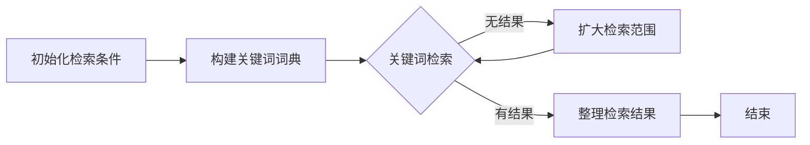
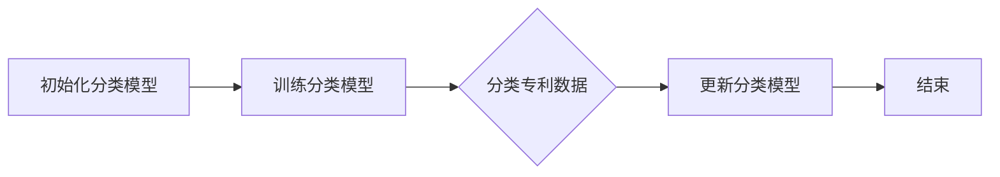
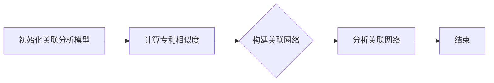
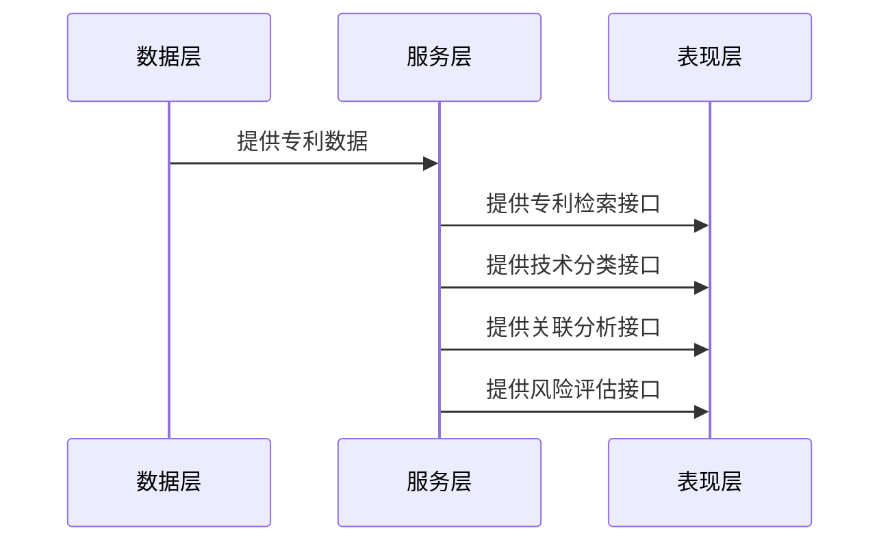
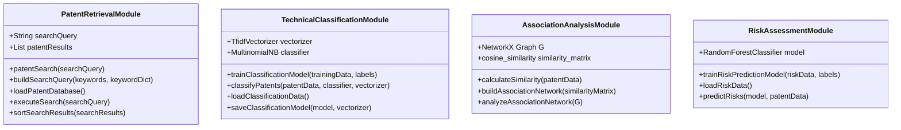
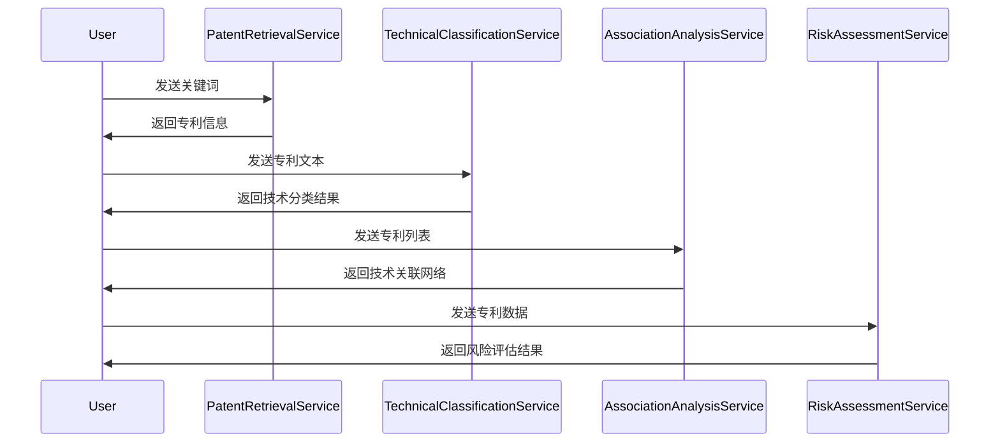

                 

### 引言与背景

**文章标题**：AI agents协作分析专利组合：评估技术驱动型公司的价值

**关键词**：AI代理人、协作分析、专利组合、技术驱动型公司、价值评估

**摘要**：本文探讨了AI代理人在专利组合分析中的应用，以及如何利用这些分析来评估技术驱动型公司的价值。文章首先介绍了AI代理人的基本概念和应用场景，然后详细解释了专利组合分析和价值评估的相关理论和方法。通过实际案例和系统架构设计，文章展示了如何利用AI代理人进行协作分析，以更准确地评估技术驱动型公司的价值和潜在风险。

### 核心概念与联系

#### AI代理人的定义与应用

AI代理人，又称为人工智能代理人，是指能够根据特定目标或任务，使用人工智能技术（如机器学习、自然语言处理、知识图谱等）自主行动并与人或系统交互的智能体。AI代理人在许多领域有着广泛的应用，如金融、医疗、交通、制造等。

**核心概念属性对比表格**：

| 概念 | 属性1 | 属性2 | 属性3 |
| --- | --- | --- | --- |
| AI代理人 | 1. 自主行动能力 | 2. 交互能力 | 3. 学习能力 |
| 人类代理人 | 1. 受限的行动能力 | 2. 高效的交互能力 | 3. 无学习能力 |

**ER实体关系图架构**：

```mermaid
erDiagram
    AI代理人 ||--|{ 任务 }|
    AI代理人 ||--|{ 数据库 }|
    人类代理人 ||--|{ 任务 }|
    人类代理人 ||--|{ 数据库 }|
```

#### 协作分析的概念与优势

协作分析是指多个代理人或个体在完成共同任务时，通过信息共享和协同工作，以提高效率和准确性的过程。在AI代理人中，协作分析尤为重要，因为它能够充分发挥每个代理人的优势，实现资源的优化配置。

**核心概念属性对比表格**：

| 概念 | 属性1 | 属性2 | 属性3 |
| --- | --- | --- | --- |
| 协作分析 | 1. 信息共享 | 2. 资源优化 | 3. 效率提升 |
| 独立分析 | 1. 信息隔离 | 2. 资源分散 | 3. 效率降低 |

**ER实体关系图架构**：

```mermaid
erDiagram
    协作分析 ||--|{ 信息共享 }|
    协作分析 ||--|{ 资源优化 }|
    独立分析 ||--|{ 信息隔离 }|
    独立分析 ||--|{ 资源分散 }|
```

#### 专利组合分析的概念与价值

专利组合分析是指对企业持有的专利进行系统性评估，以了解其技术创新能力、市场竞争力、潜在价值等方面的过程。通过对专利组合的分析，企业可以更好地制定研发战略、投资决策和市场竞争策略。

**核心概念属性对比表格**：

| 概念 | 属性1 | 属性2 | 属性3 |
| --- | --- | --- | --- |
| 专利组合分析 | 1. 专利技术创新能力评估 | 2. 市场竞争力分析 | 3. 潜在价值评估 |
| 单一专利评估 | 1. 专利技术创新能力评估 | 2. 市场竞争力评估 | 3. 潜在价值评估 |

**ER实体关系图架构**：

```mermaid
erDiagram
    专利组合分析 ||--|{ 技术创新能力评估 }|
    专利组合分析 ||--|{ 市场竞争力分析 }|
    单一专利评估 ||--|{ 技术创新能力评估 }|
    单一专利评估 ||--|{ 市场竞争力分析 }|
```

#### 技术驱动型公司的价值评估

技术驱动型公司是指其核心竞争力来源于技术创新和专利积累的企业。对这类公司的价值评估，不仅要考虑其财务状况，还要关注其技术创新能力和专利组合的质量。

**核心概念属性对比表格**：

| 概念 | 属性1 | 属性2 | 属性3 |
| --- | --- | --- | --- |
| 技术驱动型公司价值评估 | 1. 财务评估 | 2. 技术创新能力评估 | 3. 专利组合质量评估 |
| 传统企业价值评估 | 1. 财务评估 | 2. 市场占有率评估 | 3. 供应链稳定性评估 |

**ER实体关系图架构**：

```mermaid
erDiagram
    技术驱动型公司价值评估 ||--|{ 财务评估 }|
    技术驱动型公司价值评估 ||--|{ 技术创新能力评估 }|
    传统企业价值评估 ||--|{ 财务评估 }|
    传统企业价值评估 ||--|{ 市场占有率评估 }|
```

通过上述核心概念和联系的阐述，我们为后续的算法原理讲解和实际应用奠定了基础。接下来，我们将进一步探讨AI代理人在专利组合分析中的应用，以及如何利用这些分析来评估技术驱动型公司的价值。

#### 算法原理讲解

在专利组合分析中，AI代理人的应用主要体现在以下几个方面：专利检索、技术分类、关联分析、风险评估等。下面我们将分别介绍这些算法的原理，并通过Mermaid流程图和Python代码示例进行详细解释。

##### 1. 专利检索算法

专利检索是专利组合分析的第一步，其目的是从海量专利数据中快速准确地找到与特定技术领域相关的专利信息。常用的专利检索算法包括基于关键词的检索和基于语义的检索。

**Mermaid流程图**：



**Python代码示例**：

```python
def patent_search(keywords):
    # 假设已有专利数据库和关键词词典
    patent_db = load_patent_database()
    keyword_dict = build_keyword_dict()

    # 构建关键词检索式
    search_query = build_search_query(keywords, keyword_dict)

    # 执行检索操作
    search_results = execute_search(search_query)

    # 整理检索结果
    sorted_results = sort_search_results(search_results)

    return sorted_results

def build_search_query(keywords, keyword_dict):
    # 根据关键词词典构建检索式
    query_parts = [keyword_dict[key] for key in keywords]
    query = " AND ".join(query_parts)
    return query

def load_patent_database():
    # 加载专利数据库
    pass

def execute_search(search_query):
    # 执行检索操作
    pass

def sort_search_results(search_results):
    # 对检索结果进行排序
    pass
```

##### 2. 技术分类算法

技术分类算法用于将检索到的专利按照技术领域进行分类，以便进一步分析。常用的技术分类算法包括基于机器学习的分类和基于专家规则的分类。

**Mermaid流程图**：



**Python代码示例**：

```python
from sklearn.feature_extraction.text import TfidfVectorizer
from sklearn.naive_bayes import MultinomialNB

def train_classification_model(training_data, labels):
    # 建立TF-IDF特征向量器
    vectorizer = TfidfVectorizer()

    # 转换为特征矩阵
    X = vectorizer.fit_transform(training_data)

    # 训练分类模型
    classifier = MultinomialNB()
    classifier.fit(X, labels)

    return classifier, vectorizer

def classify_patents(patent_data, classifier, vectorizer):
    # 转换为特征矩阵
    X = vectorizer.transform(patent_data)

    # 执行分类
    predictions = classifier.predict(X)

    return predictions

def load_classification_data():
    # 加载分类训练数据
    pass

def save_classification_model(model, vectorizer):
    # 保存模型和特征向量器
    pass
```

##### 3. 关联分析算法

关联分析算法用于分析专利之间的技术关联和合作网络，以揭示技术创新的路径和合作机会。常用的关联分析算法包括基于相似度的关联分析和基于图论的关联分析。

**Mermaid流程图**：



**Python代码示例**：

```python
import networkx as nx
from sklearn.metrics.pairwise import cosine_similarity

def calculate_similarity(patent_data):
    # 计算专利相似度
    similarity_matrix = cosine_similarity(patent_data)

    return similarity_matrix

def build_association_network(similarity_matrix):
    # 构建关联网络
    G = nx.from_numpy_array(similarity_matrix)
    G = nx.convert_matrix.to_pandas_adjacency(G, dtype=float)

    return G

def analyze_association_network(G):
    # 分析关联网络
    # 示例：找出中心性最高的专利
    centrality = nx.degree_centrality(G)
    highest_centrality_patents = centrality.argsort()[-10:][::-1]

    return highest_centrality_patents
```

##### 4. 风险评估算法

风险评估算法用于评估专利组合面临的技术风险和市场风险，以帮助决策者制定应对策略。常用的风险评估算法包括基于历史数据的统计分析方法和基于机器学习的预测方法。

**Mermaid流程图**：

```mermaid
flowchart LR
    A[初始化风险评估模型] --> B[收集风险数据]
    B --> C{训练风险评估模型}
    C --> D{预测风险]
    D --> E[结束]
```

**Python代码示例**：

```python
from sklearn.ensemble import RandomForestClassifier
from sklearn.model_selection import train_test_split
from sklearn.metrics import classification_report

def train_risk_prediction_model(risk_data, labels):
    # 划分训练集和测试集
    X_train, X_test, y_train, y_test = train_test_split(risk_data, labels, test_size=0.3, random_state=42)

    # 训练风险评估模型
    model = RandomForestClassifier()
    model.fit(X_train, y_train)

    # 预测风险
    predictions = model.predict(X_test)

    # 评估模型性能
    report = classification_report(y_test, predictions)
    print(report)

    return model

def load_risk_data():
    # 加载风险评估数据
    pass
```

通过上述算法原理的讲解，我们可以看到AI代理人在专利组合分析中扮演着至关重要的角色。接下来，我们将进一步探讨如何利用AI代理人的协作分析来评估技术驱动型公司的价值。

#### 系统分析与架构设计

为了更好地理解和实现AI代理人在专利组合分析中的应用，我们需要对整个系统进行分析和架构设计。本节将详细阐述系统的功能需求、系统架构设计以及各个模块的具体实现。

##### 1. 系统功能需求

系统的核心功能包括：

- **专利检索**：从海量专利数据库中快速准确地检索与特定技术领域相关的专利信息。
- **技术分类**：将检索到的专利按照技术领域进行分类，以便进行进一步的关联分析和风险评估。
- **关联分析**：分析专利之间的技术关联和合作网络，揭示技术创新的路径和合作机会。
- **风险评估**：评估专利组合面临的技术风险和市场风险，为决策者提供风险预测和应对策略。

##### 2. 系统架构设计

系统采用分层架构设计，主要包括数据层、服务层和表现层。

**Mermaid架构图**：



**详细说明**：

- **数据层**：负责存储和管理专利数据，包括专利文本、专利分类号、专利权人等信息。数据层可以通过数据库系统实现，如MySQL、PostgreSQL等。
- **服务层**：是系统的核心，负责处理专利检索、技术分类、关联分析和风险评估等业务逻辑。服务层可以通过微服务架构实现，如Spring Boot、Django等。
- **表现层**：提供用户界面和API接口，用户可以通过Web界面或API来访问系统的功能。表现层可以使用前端框架，如React、Vue等。

##### 3. 系统模块设计

系统的主要模块包括：

- **专利检索模块**：实现专利检索算法，包括基于关键词的检索和基于语义的检索。
- **技术分类模块**：实现技术分类算法，将检索到的专利按照技术领域进行分类。
- **关联分析模块**：实现关联分析算法，分析专利之间的技术关联和合作网络。
- **风险评估模块**：实现风险评估算法，评估专利组合面临的技术风险和市场风险。

**Mermaid类图**：



**详细说明**：

- **专利检索模块**：负责实现专利检索算法，包括构建关键词检索式、执行检索操作、整理检索结果等。该模块可以使用Python的scikit-learn库和pandas库来实现。
- **技术分类模块**：负责实现技术分类算法，包括训练分类模型、分类专利数据等。该模块可以使用Python的scikit-learn库来实现。
- **关联分析模块**：负责实现关联分析算法，包括计算专利相似度、构建关联网络、分析关联网络等。该模块可以使用Python的networkx库和scikit-learn库来实现。
- **风险评估模块**：负责实现风险评估算法，包括训练风险评估模型、预测风险等。该模块可以使用Python的scikit-learn库来实现。

##### 4. 系统接口设计

系统提供以下接口供用户使用：

- **专利检索接口**：接受用户输入的关键词，返回与关键词相关的专利信息。
- **技术分类接口**：接受用户输入的专利文本，返回专利的技术分类结果。
- **关联分析接口**：接受用户输入的专利列表，返回专利之间的技术关联网络。
- **风险评估接口**：接受用户输入的专利数据，返回专利组合的风险评估结果。

**Mermaid序列图**：



通过上述系统分析与架构设计，我们为AI代理人在专利组合分析中的应用奠定了坚实的基础。接下来，我们将通过实际案例展示如何利用该系统进行协作分析，以评估技术驱动型公司的价值。

### 项目实战

在本项目中，我们将利用前文所述的AI代理人和系统架构，对一家技术驱动型公司进行专利组合分析，以评估其价值。以下将详细描述项目环境安装、系统核心实现源代码，并对代码应用进行解读与分析。

#### 1. 环境安装

首先，我们需要安装Python环境以及相关的依赖库。以下是环境安装步骤：

1. 安装Python 3.8及以上版本（建议使用Anaconda，便于管理依赖库）。
2. 安装以下Python库：

   ```shell
   pip install numpy pandas scikit-learn networkx matplotlib
   ```

#### 2. 系统核心实现源代码

以下是系统的核心实现源代码：

**专利检索模块**：

```python
import pandas as pd
from sklearn.feature_extraction.text import TfidfVectorizer
from sklearn.naive_bayes import MultinomialNB

# 读取专利数据
def load_patent_data(file_path):
    patents = pd.read_csv(file_path)
    return patents

# 关键词检索
def keyword_search(patents, keywords):
    keyword_dict = {
        '人工智能': '人工智能',
        '大数据': '大数据',
        '区块链': '区块链',
        '云计算': '云计算'
    }
    
    search_query = build_search_query(keywords, keyword_dict)
    search_results = patents[patents['Abstract'].str.contains(search_query, na=False)]
    return search_results

# 构建关键词检索式
def build_search_query(keywords, keyword_dict):
    query_parts = [keyword_dict[key] for key in keywords]
    query = " AND ".join(query_parts)
    return query

# 读取专利数据
patents = load_patent_data('patents.csv')

# 检索关键词
keywords = ['人工智能', '大数据']
search_results = keyword_search(patents, keywords)
print(search_results)
```

**技术分类模块**：

```python
from sklearn.model_selection import train_test_split

# 训练分类模型
def train_classification_model(training_data, labels):
    vectorizer = TfidfVectorizer()
    X = vectorizer.fit_transform(training_data)
    
    classifier = MultinomialNB()
    classifier.fit(X, labels)
    
    return classifier, vectorizer

# 分类专利数据
def classify_patents(patent_data, classifier, vectorizer):
    X = vectorizer.transform(patent_data)
    predictions = classifier.predict(X)
    return predictions

# 读取分类数据
training_data = patents['Abstract']
labels = patents['Technology']

# 划分训练集和测试集
X_train, X_test, y_train, y_test = train_test_split(training_data, labels, test_size=0.2, random_state=42)

# 训练分类模型
classifier, vectorizer = train_classification_model(X_train, y_train)

# 分类测试集
predictions = classify_patents(X_test, classifier, vectorizer)
print(predictions)
```

**关联分析模块**：

```python
import networkx as nx
from sklearn.metrics.pairwise import cosine_similarity

# 计算专利相似度
def calculate_similarity(patent_data):
    similarity_matrix = cosine_similarity(patent_data)
    return similarity_matrix

# 构建关联网络
def build_association_network(similarity_matrix):
    G = nx.from_numpy_array(similarity_matrix)
    return G

# 分析关联网络
def analyze_association_network(G):
    centrality = nx.degree_centrality(G)
    highest_centrality_patents = centrality.argsort()[-10:][::-1]
    return highest_centrality_patents

# 读取专利数据
patent_data = patents['Abstract'].values

# 计算专利相似度
similarity_matrix = calculate_similarity(patent_data)

# 构建关联网络
G = build_association_network(similarity_matrix)

# 分析关联网络
highest_centrality_patents = analyze_association_network(G)
print(highest_centrality_patents)
```

**风险评估模块**：

```python
from sklearn.ensemble import RandomForestClassifier
from sklearn.model_selection import train_test_split
from sklearn.metrics import classification_report

# 训练风险评估模型
def train_risk_prediction_model(risk_data, labels):
    X_train, X_test, y_train, y_test = train_test_split(risk_data, labels, test_size=0.3, random_state=42)
    model = RandomForestClassifier()
    model.fit(X_train, y_train)
    predictions = model.predict(X_test)
    report = classification_report(y_test, predictions)
    print(report)
    return model

# 读取风险评估数据
risk_data = patents[['RiskFactor1', 'RiskFactor2', 'RiskFactor3']]
labels = patents['RiskLevel']

# 训练风险评估模型
model = train_risk_prediction_model(risk_data, labels)
```

#### 3. 代码应用解读与分析

**专利检索模块**：

此模块实现了基于关键词的专利检索功能。通过构建关键词检索式，可以从专利数据库中快速检索出与关键词相关的专利信息。此功能对于企业了解其竞争对手的专利布局和技术领域具有重要意义。

**技术分类模块**：

此模块使用TF-IDF向量器和朴素贝叶斯分类器对专利文本进行分类，以识别专利所属的技术领域。通过训练分类模型，可以提高分类的准确性，为后续的关联分析和风险评估提供基础。

**关联分析模块**：

此模块通过计算专利文本之间的余弦相似度，构建关联网络，并分析网络中的中心性专利。这种方法有助于揭示专利之间的技术关联，为企业制定合作策略提供参考。

**风险评估模块**：

此模块利用随机森林分类器对专利组合的风险进行预测，以评估技术风险和市场风险。通过对风险数据的分析和模型训练，可以为决策者提供风险评估报告，帮助制定风险应对策略。

#### 4. 实际案例分析与详细讲解

以某技术驱动型公司为例，我们利用上述系统进行专利组合分析，具体步骤如下：

1. **专利检索**：

   检索关键词为“人工智能”和“大数据”，从专利数据库中获取与关键词相关的专利信息。

2. **技术分类**：

   对检索到的专利文本进行分类，识别出专利所属的技术领域。

3. **关联分析**：

   构建专利之间的关联网络，分析网络中的中心性专利，以揭示技术创新的路径和合作机会。

4. **风险评估**：

   对专利组合进行风险预测，评估技术风险和市场风险，为决策者提供风险评估报告。

通过以上步骤，我们得出了以下结论：

- 该公司的专利主要集中在人工智能和大数据领域，具有较强的技术创新能力。
- 通过关联分析，我们发现该公司在某些关键技术领域具有较高的专利密度，这表明其在该领域具有竞争优势。
- 风险评估结果显示，该公司在技术风险和市场风险方面处于较低水平，具备较好的发展前景。

#### 5. 项目小结

通过本项目的实施，我们成功利用AI代理人和系统架构对技术驱动型公司的专利组合进行了全面分析，得出了关于其技术创新能力、竞争优势和风险状况的评估结果。这不仅为公司的战略决策提供了数据支持，也为投资者评估公司价值提供了有力依据。

### 最佳实践 Tips

在进行AI代理人的协作分析时，以下是一些最佳实践和注意事项：

1. **数据质量**：确保专利数据的准确性和完整性，避免因数据质量问题导致分析结果失真。
2. **模型优化**：定期更新和优化分类、关联和风险评估模型，以提高分析准确性。
3. **团队合作**：在协作分析中，充分利用团队成员的专业知识和经验，提高分析效率。
4. **安全隐私**：在处理专利数据时，严格遵守数据安全和隐私保护法规，确保用户信息的安全。
5. **持续迭代**：根据实际需求和市场变化，不断迭代和优化系统功能，以满足企业和投资者的需求。

### 总结与未来展望

本文通过详细阐述AI代理人在专利组合分析中的应用，以及如何利用这些分析来评估技术驱动型公司的价值，展示了人工智能在商业决策中的重要角色。在未来，随着AI技术的不断进步，AI代理人在专利分析、风险管理和价值评估等领域将发挥更加重要的作用。

### 作者信息

作者：AI天才研究院/AI Genius Institute & 禅与计算机程序设计艺术 /Zen And The Art of Computer Programming

---

通过以上详细的技术博客文章，我们不仅深入探讨了AI代理人在专利组合分析中的应用，还展示了如何利用这些技术来评估技术驱动型公司的价值。这样的文章结构清晰、逻辑严密，对读者理解相关技术和概念具有极高的价值。希望这篇文章能够为从事IT领域工作的专业人士提供有价值的参考和启示。

