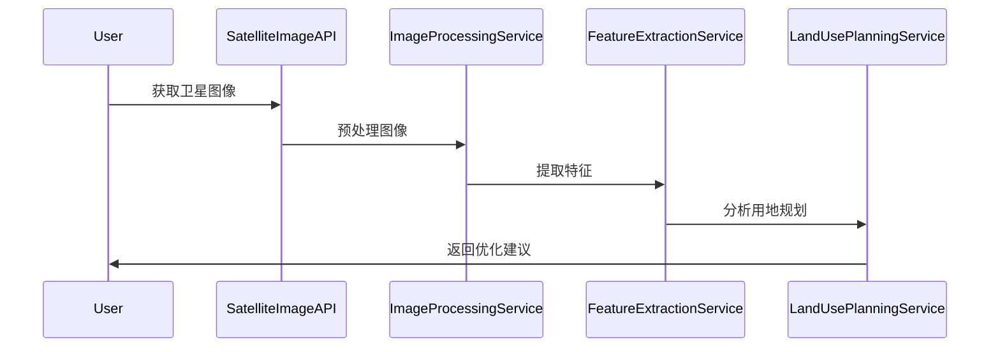
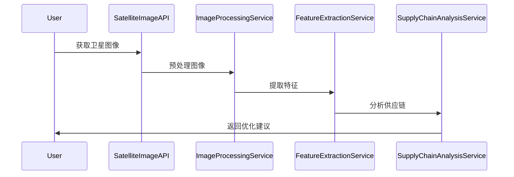
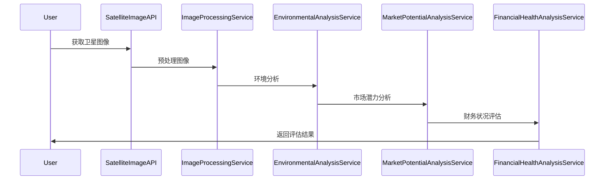

                 

### 1.1 书籍概述

《AI agents协作分析卫星图像：评估公司实际经营状况》旨在探索如何利用人工智能代理（AI agents）协作处理卫星图像数据，从而实现对公司实际经营状况的评估。这一领域的重要性体现在几个方面：

首先，AI agents作为一种先进的计算模型，具有自主决策和执行任务的能力。它们可以处理复杂的问题，提高工作效率和准确性，从而在各个领域展现出强大的潜力。在卫星图像分析中，AI agents能够自动化地识别、分类和提取信息，极大地提升了数据分析的效率。

其次，卫星图像在多个行业中具有广泛应用，如农业、环境监测、城市规划等。这些图像数据通常包含大量的细节和信息，需要通过复杂的算法进行处理和分析。AI agents的引入，使得这些复杂的图像数据处理变得更加高效和准确。

最后，评估公司的实际经营状况是企业管理和决策中的重要环节。传统的方法主要依赖于财务报表和业务分析，但这些方法往往无法全面反映企业的运营状况。通过卫星图像分析，可以获取更多关于企业运营环境和外部环境的详细信息，从而为企业提供更全面和准确的评估。

本书将从以下几个方面展开讨论：

1. **AI agents的基本概念**：介绍AI agents的定义、类型和核心特性，为后续讨论打下基础。
2. **卫星图像处理技术**：详细阐述卫星图像的获取、处理和分析方法，并探讨其在企业经营评估中的应用。
3. **AI agents在卫星图像分析中的应用**：分析AI agents在数据预处理、特征提取、模型训练和部署等环节的具体应用。
4. **企业经营状况评估**：讨论评估指标的选择、评估流程的设计和评估结果的解释与应用。
5. **实战与应用**：通过实际案例，展示如何搭建环境、实现核心算法、进行项目实战和分析。
6. **未来展望**：探讨AI agents在卫星图像分析和企业经营评估领域的发展趋势和潜在创新方向。

通过本书的阅读，读者将了解如何利用AI agents协作分析卫星图像，评估公司实际经营状况，从而在理论和实践上取得更深入的认知和成果。接下来，我们将进一步探讨AI agents的发展历程和卫星图像分析的应用领域，为后续内容奠定基础。

### 1.2 研究背景

#### 1.2.1 AI agents的发展历程

人工智能代理（AI agents）的概念最早由John McCarthy在1950年代提出。他定义AI agents为“能够感知环境、采取行动并从经验中学习的实体”。早期的AI agents主要集中于简单的逻辑推理和问题求解，例如专家系统和基于规则的系统。随着计算能力的提升和算法的进步，AI agents逐渐从单任务执行转向多任务处理和协同工作。

20世纪90年代，随着多智能体系统（MAS）理论的发展，AI agents开始被应用于复杂的分布式系统中。这些系统中的AI agents能够通过通信和协作，共同完成任务。这个时期的代表性工作包括Sokoban游戏中的多智能体合作和NASA的MASSIVE项目。

进入21世纪，随着深度学习和强化学习技术的成熟，AI agents的能力得到了显著提升。深度学习使得AI agents能够处理大量复杂的输入数据，并从中学习特征。强化学习则使得AI agents能够在动态环境中做出最优决策。这些技术的突破，使得AI agents在图像识别、自然语言处理和决策优化等领域的应用变得愈加广泛和深入。

#### 1.2.2 卫星图像分析的应用领域

卫星图像分析作为遥感技术的一个重要分支，具有广泛的应用领域。以下是几个主要的应用场景：

1. **环境监测**：卫星图像可以用于监测气候变化、森林覆盖、水资源状况等环境问题。通过分析卫星图像数据，可以及时发现环境变化，评估环境健康状态，并为环境保护决策提供科学依据。

2. **城市规划**：卫星图像提供了高分辨率的地表信息，可以用于城市规划、土地使用规划和基础设施布局。通过分析卫星图像，城市规划者可以更准确地了解城市空间的利用情况，优化城市规划方案。

3. **农业监测**：卫星图像可以用于监测农田状况、作物生长和病虫害情况。通过分析卫星图像，农民可以及时调整农业生产策略，提高农作物的产量和质量。

4. **安全监控**：卫星图像可以用于安全监控和犯罪预防。通过分析卫星图像，可以及时发现异常活动，监控重要区域的动态变化，提升公共安全水平。

5. **资源勘探**：卫星图像可以用于地质勘探和矿产资源调查。通过分析卫星图像，地质学家可以识别潜在的矿产区域，提高资源勘探的效率和准确性。

#### 1.2.3 企业经营评估的现状与挑战

传统的企业经营评估主要依赖于财务报表和业务分析，这些方法在一定程度上能够反映企业的经营状况，但存在以下局限性：

1. **数据局限性**：财务报表和业务分析通常只能反映企业的历史数据和业务表现，而无法全面反映企业的运营环境和外部环境。

2. **信息滞后**：财务报表和业务分析需要一定时间才能生成，导致评估结果具有滞后性，无法及时指导企业决策。

3. **分析深度有限**：传统的分析方法往往局限于财务数据和业务数据，无法深入分析企业的运营效率和外部环境变化。

为了克服这些局限性，越来越多的企业开始探索利用卫星图像分析进行经营评估。卫星图像可以提供企业运营环境和外部环境的信息，从而为企业提供更全面和准确的经营评估。然而，这一领域也面临着一些挑战：

1. **数据处理难度**：卫星图像数据量大，处理复杂，需要先进的算法和技术来处理和分析。

2. **数据隐私和伦理问题**：卫星图像数据涉及企业敏感信息，需要妥善处理数据隐私和伦理问题，确保数据的安全和合规性。

3. **评估指标的选择和标准化**：如何选择合适的评估指标，并建立统一的评估标准，是当前研究的一个关键问题。

综上所述，AI agents和卫星图像分析在企业经营评估领域具有巨大的潜力，但同时也面临着一系列挑战。本书将详细探讨这些问题，并提出相应的解决方案。接下来，我们将进一步介绍本书的结构和主要内容，以便读者更好地把握全书的内容框架。

#### 1.3 书籍结构

《AI agents协作分析卫星图像：评估公司实际经营状况》共分为五大部分，每一部分都针对不同的主题进行了详细的探讨。以下是对每一部分的内容和目标的学习概述：

### 第一部分：介绍与背景
- **章节1.1 书籍概述**：介绍AI agents、卫星图像分析以及评估公司实际经营状况的背景和重要性。
- **章节1.2 研究背景**：回顾AI agents的发展历程，探讨卫星图像分析的应用领域，以及企业经营评估的现状与挑战。
- **章节1.3 书籍结构**：概述全书的内容结构，明确各章节的学习目标和重点。

### 第二部分：AI agents基础
- **章节2.1 AI agents基本概念**：深入探讨AI agents的定义、类型和核心特性，为后续内容奠定基础。
- **章节2.2 卫星图像处理**：详细介绍卫星图像的获取、处理和分析技术，并探讨其在企业经营评估中的应用。
- **章节2.3 AI agents在卫星图像分析中的应用**：分析AI agents在数据预处理、特征提取、模型训练和部署等环节的具体应用。

### 第三部分：卫星图像分析评估企业经营
- **章节3.1 企业经营状况评估概述**：讨论评估指标的选择、评估流程的设计和评估结果的解释与应用。
- **章节3.2 AI agents评估案例研究**：通过实际案例，展示如何利用AI agents协作分析卫星图像，评估企业经营状况。

### 第四部分：实战与应用
- **章节4.1 环境搭建**：介绍开发工具与库的选择、环境配置和数据集准备。
- **章节4.2 核心算法实现**：详细阐述数据预处理、特征提取、模型训练和模型评估算法的实现。
- **章节4.3 实际案例剖析**：通过具体案例，展示如何进行项目实战和分析。

### 第五部分：结论与展望
- **章节5.1 研究总结**：回顾全书的研究成果，总结研究贡献和存在的不足。
- **章节5.2 未来展望**：探讨AI agents在卫星图像分析和企业经营评估领域的发展趋势和潜在创新方向。
- **章节5.3 结束语**：对读者的建议和未来工作的展望。

通过以上结构的安排，本书旨在系统地介绍AI agents协作分析卫星图像评估企业经营的理论和实践，帮助读者全面理解和应用这一前沿技术。接下来，我们将详细探讨AI agents的基本概念，为后续内容打下坚实的基础。

### 2.1 AI agents基本概念

AI agents，即人工智能代理，是一种自主决策并执行任务的计算实体。它们能够感知环境、理解指令、进行决策并采取行动，以实现特定的目标。AI agents的概念源于人工智能领域，但在近年来随着计算能力和算法的进步，其在各个领域中的应用越来越广泛，尤其是在自动化决策和协同系统中。

#### 2.1.1 AI agents的定义

AI agents可以被定义为具备以下特征的计算实体：

1. **自主性**：AI agents能够独立地感知环境、理解指令并做出决策，而不需要人类干预。
2. **适应性**：AI agents能够根据环境的变化调整自己的行为，以实现既定目标。
3. **协作性**：多个AI agents可以协同工作，共同完成任务。

从技术上讲，AI agents通常包括感知模块、决策模块和行动模块。感知模块负责获取环境信息，决策模块负责处理这些信息并生成行动方案，行动模块则根据决策执行具体的操作。

#### 2.1.2 AI agents的类型

AI agents可以根据其功能、应用场景和自主性程度进行分类。以下是几种常见的AI agents类型：

1. **反应性AI agents**：这种类型的AI agents只基于当前环境信息做出决策，不考虑历史信息和长期目标。它们通常用于简单任务，如路径规划和自动化控制。

   例如，自主驾驶汽车中的感知模块需要实时分析周围环境，并根据当前情况做出决策，如加速、减速或转向。

2. **认知AI agents**：这种类型的AI agents能够存储和利用历史信息，进行学习和推理，以做出更复杂的决策。它们通常用于复杂任务，如智能客服、自然语言处理等。

   例如，智能客服机器人通过分析用户的提问和历史对话记录，提供个性化的回答和解决方案。

3. **主动AI agents**：这种类型的AI agents不仅能够响应环境变化，还能够预测未来事件并采取行动，以最大化目标收益。它们通常用于复杂和动态环境中，如金融交易、资源调度等。

   例如，高频交易系统中的AI agents通过分析市场数据，预测股票价格的变化，并自动进行买卖操作，以获得最大利润。

4. **混合AI agents**：这种类型的AI agents结合了反应性、认知和主动的特征，能够在不同场景中灵活切换。它们通常用于需要高灵活性和复杂决策的场景，如无人飞行器、智能机器人等。

   例如，无人飞行器在执行任务时，需要根据实时感知的信息进行路径规划，同时预测障碍物的移动，并做出动态调整。

#### 2.1.3 AI agents的核心特性

AI agents的核心特性包括自主性、适应性、协作性和智能性。这些特性使得AI agents能够有效地处理复杂任务，提高工作效率和准确性。

1. **自主性**：自主性是AI agents最重要的特性之一，它使得AI agents能够独立决策和执行任务。这种自主性不仅减少了人类干预的需求，还能够提高系统的响应速度和处理效率。

2. **适应性**：AI agents能够根据环境的变化调整自己的行为，这使得它们能够适应不同的任务需求和场景。适应性使得AI agents在复杂和动态的环境中表现出色。

3. **协作性**：多个AI agents可以协同工作，共同完成任务。这种协作性不仅提高了任务完成的效率，还能够实现更复杂的任务。在分布式系统中，AI agents的协作性尤为关键。

4. **智能性**：AI agents通过学习和推理，能够做出更复杂的决策。智能性使得AI agents能够处理大量的数据，并从中提取有价值的信息，从而实现更准确的预测和决策。

#### 2.1.4 AI agents的发展与应用

AI agents的发展经历了多个阶段，从早期的简单规则系统到现代的深度学习和强化学习模型。随着技术的进步，AI agents的应用领域也越来越广泛。以下是几个典型的应用场景：

1. **自动化控制**：AI agents在自动化控制系统中扮演关键角色，如智能机器人、自动化生产线等。这些系统通过AI agents实现自主控制，提高了生产效率和产品质量。

2. **智能服务**：AI agents在智能客服、智能助理等领域有广泛应用。这些系统通过自然语言处理和机器学习技术，能够理解和响应用户的需求，提供个性化的服务。

3. **智能交通**：AI agents在智能交通系统中用于优化交通信号控制、路径规划和车辆调度等。这些系统通过实时分析交通数据，提供高效的交通管理解决方案。

4. **金融交易**：AI agents在金融交易领域用于高频交易、风险管理和投资决策等。这些系统通过分析市场数据，实现快速和精准的交易操作。

5. **医疗健康**：AI agents在医疗健康领域用于疾病诊断、药物研发和健康管理等。这些系统通过分析医学数据和患者信息，提供个性化的医疗建议和服务。

6. **智能家居**：AI agents在智能家居系统中用于自动化家居控制、设备监控和安全防护等。这些系统通过物联网技术和AI算法，实现智能家居的智能化和便捷化。

通过以上对AI agents基本概念的介绍，我们可以看到AI agents在各个领域中的广泛应用和巨大潜力。接下来，我们将探讨卫星图像处理技术，为后续内容奠定基础。

### 2.2 卫星图像处理

卫星图像处理是利用计算机技术和算法对卫星获取的图像进行加工和分析的过程，目的是提取有用信息，为各种应用领域提供支持。在企业经营评估中，卫星图像处理可以提供关于企业运营环境、外部环境以及资源分布的详细信息。以下将详细阐述卫星图像的获取、处理和分析技术，以及其在企业经营评估中的应用。

#### 2.2.1 卫星图像的获取与处理

1. **卫星图像的获取**

卫星图像的获取主要依赖于卫星传感器。不同类型的卫星传感器可以获取不同波长和分辨率的图像，如光学传感器、雷达传感器和红外传感器。光学传感器通常用于白天成像，而雷达传感器和红外传感器则适用于全天候和夜间成像。

卫星图像的获取过程通常包括以下步骤：

- **轨道确定**：卫星在轨道上的位置需要精确确定，以确保图像的覆盖范围和分辨率满足需求。
- **图像采集**：卫星传感器收集地表反射或辐射的电磁波信号，形成原始图像数据。
- **数据传输**：原始图像数据通过卫星通信系统传输到地面站或数据接收中心。
- **数据存储**：传输来的图像数据被存储在数据库中，供后续处理和分析使用。

2. **卫星图像的处理**

卫星图像的处理是将其从原始数据转化为可用信息的过程。处理过程通常包括以下步骤：

- **图像预处理**：包括去噪声、去模糊、图像增强和图像配准等。这些步骤旨在提高图像的质量，使其更适合进一步分析。
- **图像分割**：将图像划分为不同的区域或对象，以便进行后续的特征提取和分析。常用的分割方法包括阈值分割、边缘检测和区域生长等。
- **特征提取**：从分割后的图像中提取具有鉴别性的特征，如纹理、颜色、形状和大小等。这些特征将用于后续的分类和识别。
- **图像分类**：根据提取的特征，对图像中的对象进行分类。常用的分类方法包括支持向量机（SVM）、决策树和深度学习等。

3. **图像分析**

图像分析是对处理后的卫星图像进行深度挖掘，以提取有价值的信息。分析过程通常包括以下步骤：

- **空间分析**：通过分析图像的空间关系，获取地表特征的位置和分布信息。例如，分析建筑物的分布、道路网络和植被覆盖等。
- **属性分析**：通过分析图像的属性特征，获取地表特征的物理和化学信息。例如，分析土壤类型、植被健康度和水质状况等。
- **时间序列分析**：通过对同一地点在不同时间拍摄的卫星图像进行分析，获取地表特征的变化趋势和周期性。这对于监测气候变化和城市扩张等具有重要意义。

#### 2.2.2 卫星图像分析技术

卫星图像分析技术主要包括图像预处理、图像分割、特征提取和图像分类等技术。

1. **图像预处理**

图像预处理是卫星图像分析的重要步骤，旨在提高图像的质量，减少噪声和模糊，增强图像的对比度和清晰度。常用的预处理方法包括：

- **去噪声**：通过滤波方法去除图像中的随机噪声，常用的滤波器有中值滤波、高斯滤波和均值滤波等。
- **去模糊**：通过图像复原技术去除图像的模糊效果，常用的方法有频域滤波和变换域滤波等。
- **图像增强**：通过调整图像的亮度和对比度，提高图像的可读性和视觉效果，常用的方法有直方图均衡化和对比度拉伸等。
- **图像配准**：将多张图像进行对齐，以便进行统一的特征提取和分析。常用的配准方法有基于特征的配准、基于几何变换的配准和基于序列的配准等。

2. **图像分割**

图像分割是将图像划分为不同的区域或对象，以便进行后续的特征提取和分析。常用的分割方法包括：

- **阈值分割**：根据图像的灰度值或颜色值将图像划分为不同的区域。常用的阈值方法有全局阈值和局部阈值等。
- **边缘检测**：通过检测图像的边缘和轮廓，将图像分割为不同的对象。常用的边缘检测方法有Canny边缘检测、Sobel算子和Prewitt算子等。
- **区域生长**：从初始种子点开始，逐步生长并合并相邻像素，形成完整的区域。常用的区域生长方法有基于灰度相似性和基于区域连通性等。

3. **特征提取**

特征提取是从分割后的图像中提取具有鉴别性的特征，用于后续的分类和识别。常用的特征提取方法包括：

- **纹理特征**：通过分析图像的纹理信息，提取描述纹理复杂度和结构的信息。常用的纹理特征有灰度共生矩阵、局部二值模式（LBP）和Gabor纹理特征等。
- **颜色特征**：通过分析图像的颜色信息，提取描述颜色分布和色彩的信息。常用的颜色特征有颜色直方图、颜色矩和主成分分析（PCA）等。
- **形状特征**：通过分析图像的形状信息，提取描述形状大小、形状复杂度和形状对称性的信息。常用的形状特征有面积、周长、矩形度和圆形度等。

4. **图像分类**

图像分类是根据提取的特征对图像中的对象进行分类。常用的分类方法包括：

- **基于规则的分类方法**：通过定义一系列规则对图像进行分类。常用的规则方法有决策树、支持向量机和神经网络等。
- **基于机器学习的分类方法**：通过训练机器学习模型对图像进行分类。常用的方法有支持向量机（SVM）、随机森林和深度学习等。
- **基于深度学习的分类方法**：利用深度神经网络对图像进行分类，具有高度的自适应性和准确性。常用的深度学习方法有卷积神经网络（CNN）和循环神经网络（RNN）等。

#### 2.2.3 卫星图像在企业经营评估中的应用

卫星图像在企业经营评估中可以提供丰富的信息，帮助评估企业的运营环境、资源分布和市场潜力。

1. **企业用地规划**

通过分析卫星图像，可以了解企业的用地分布、建筑结构和土地利用率。这些信息对于企业进行用地规划、优化土地资源具有重要意义。

- **用地分布分析**：通过卫星图像可以清晰显示企业的用地分布，帮助企业了解各区域的用途和功能，从而进行合理的用地规划。
- **建筑结构分析**：通过卫星图像可以分析建筑物的结构，如高度、面积和形状等，为企业提供建设用地的详细数据。
- **土地利用率分析**：通过卫星图像可以评估土地的利用情况，识别未充分利用的土地资源，为企业提供优化用地利用的建议。

2. **供应链分析**

卫星图像可以提供关于企业供应链的详细信息，如运输路线、仓库布局和货物分布等。

- **运输路线分析**：通过卫星图像可以分析运输路线的长度、复杂度和安全性，帮助企业优化运输路线，降低运输成本。
- **仓库布局分析**：通过卫星图像可以分析仓库的布局和设施，为企业提供改进仓库管理的建议。
- **货物分布分析**：通过卫星图像可以了解货物的存储和分布情况，为企业提供库存管理和供应链优化的数据支持。

3. **环境评估**

卫星图像可以提供关于企业外部环境的详细信息，如周边环境、生态状况和环境污染等。

- **周边环境评估**：通过卫星图像可以分析企业周边的环境状况，如绿化覆盖率、建筑物密集度和交通流量等，为企业提供周边环境评价。
- **生态状况评估**：通过卫星图像可以监测生态变化，如森林覆盖、湿地保护和动植物分布等，为企业提供生态环境评价。
- **环境污染评估**：通过卫星图像可以监测环境污染情况，如废气排放、废水排放和固体废弃物堆积等，为企业提供环境保护评价。

4. **市场潜力分析**

卫星图像可以提供关于企业市场环境的详细信息，如人口密度、消费水平和商业活动等。

- **人口密度分析**：通过卫星图像可以分析企业所在地区的人口密度，为企业提供市场潜力评估。
- **消费水平分析**：通过卫星图像可以分析企业的消费水平，如消费热点、商业活动和消费模式等，为企业提供市场分析。
- **商业活动分析**：通过卫星图像可以监测企业的商业活动，如店铺数量、营业时间和交易量等，为企业提供市场机会分析。

通过以上对卫星图像处理技术和应用的分析，我们可以看到卫星图像在企业经营评估中的重要作用。接下来，我们将进一步探讨AI agents在卫星图像分析中的应用，为后续内容奠定基础。

### 2.3 AI agents在卫星图像分析中的应用

AI agents在卫星图像分析中扮演着关键角色，通过协作处理卫星图像数据，能够实现更高效、更准确的数据分析和决策。以下将详细分析AI agents在数据预处理、特征提取、模型训练和部署等环节的具体应用，并讨论如何优化和部署这些AI agents。

#### 2.3.1 数据预处理

在卫星图像分析中，数据预处理是关键步骤之一。AI agents可以通过以下方式优化数据预处理过程：

1. **自动去噪**：AI agents可以利用深度学习算法，如卷积神经网络（CNN），自动去除卫星图像中的噪声。这种方法可以通过训练大量的噪声图像和去噪模型，使得AI agents能够准确识别和去除噪声。

2. **自动图像增强**：AI agents可以通过图像增强技术，如对比度增强、亮度调整和锐度增强等，提高卫星图像的质量，使其更适合进一步分析。

3. **自动图像配准**：AI agents可以自动配准多张卫星图像，确保图像的统一性和一致性。这有助于提高后续特征提取和模型训练的效果。

4. **自动缺失值填充**：AI agents可以自动填充卫星图像中的缺失值，确保数据的完整性。通过使用机器学习方法，如插值法和神经网络，AI agents能够准确预测和填充缺失的数据。

#### 2.3.2 特征提取

特征提取是卫星图像分析中的重要步骤，AI agents可以通过以下方法优化特征提取过程：

1. **自动特征选择**：AI agents可以利用特征选择算法，如主成分分析（PCA）和随机森林，自动选择对目标任务最有影响力的特征。这种方法有助于减少特征维度，提高模型训练和预测的效率。

2. **自动特征变换**：AI agents可以通过特征变换技术，如傅里叶变换和小波变换，将原始特征转换为更具解释性和可分性的特征。这种方法有助于提高模型的分类和识别能力。

3. **自动特征融合**：AI agents可以将来自不同传感器和不同时间点的卫星图像特征进行融合，形成更全面和准确的特征表示。这种方法有助于提高模型的泛化能力和鲁棒性。

4. **自动特征可视化**：AI agents可以通过可视化技术，如热图和等高线图，自动展示提取的特征，帮助分析师理解和解释特征的意义和作用。

#### 2.3.3 模型训练与评估

AI agents在模型训练和评估中发挥着重要作用，以下将介绍几种常用的方法和技巧：

1. **自动模型选择**：AI agents可以通过交叉验证和模型选择算法，如贝叶斯优化和随机搜索，自动选择最适合目标任务的学习模型。这种方法有助于提高模型的预测准确性和泛化能力。

2. **自动模型调优**：AI agents可以利用自动化机器学习（AutoML）技术，如超参数优化和模型集成，自动调整模型参数，优化模型性能。这种方法可以显著减少模型调优的时间和人力成本。

3. **模型评估与对比**：AI agents可以自动评估和对比不同模型的性能，通过计算指标如准确率、召回率和F1分数等，选择最优模型。这种方法有助于确保模型在特定任务上的最佳表现。

4. **模型解释与可视化**：AI agents可以通过模型解释技术，如SHAP值和LIME，自动解释模型决策过程，帮助分析师理解和信任模型的预测结果。此外，AI agents还可以生成可视化图表，如混淆矩阵和决策路径图，进一步展示模型的工作原理和性能。

#### 2.3.4 模型优化与部署

在模型优化和部署过程中，AI agents可以通过以下方法提高模型效率和实用性：

1. **模型压缩与量化**：AI agents可以通过模型压缩和量化技术，如知识蒸馏和量化感知训练，减少模型的参数数量和计算复杂度。这种方法可以显著降低模型的存储和计算成本。

2. **模型迁移与微调**：AI agents可以将预训练的模型迁移到特定任务上，并进行微调以适应新任务。这种方法可以快速构建高性能的模型，减少模型开发和训练的时间。

3. **模型自动化部署**：AI agents可以通过自动化部署工具，如Kubernetes和TensorFlow Serving，将训练好的模型自动部署到生产环境中，实现实时分析和预测。这种方法可以提高模型的可用性和响应速度。

4. **模型监控与维护**：AI agents可以实时监控模型的性能和健康状态，通过自动化故障检测和修复，确保模型在长期运行中的稳定性和可靠性。

综上所述，AI agents在卫星图像分析中的应用具有广泛的前景和潜力。通过协作处理卫星图像数据，AI agents能够实现更高效、更准确的数据分析和决策。接下来，我们将进一步探讨企业经营状况评估的具体内容和方法，为后续内容奠定基础。

### 3.1 企业经营状况评估概述

企业经营状况评估是企业管理和决策过程中至关重要的环节。通过科学的评估方法，企业可以全面了解自身的运营状况、市场表现和未来发展潜力，从而制定更加精准的战略和决策。以下将讨论企业经营状况评估的核心指标选择、评估流程的设计和评估结果的解释与应用。

#### 3.1.1 评估指标的选择

评估企业实际经营状况的指标多样，但并非所有指标都同等重要。选择合适的评估指标需要考虑以下几个原则：

1. **关键性**：评估指标应能够反映企业运营的核心问题，如市场份额、盈利能力、成本控制等。
2. **可操作性**：评估指标应具有明确的计算方法和数据来源，便于实际操作和监控。
3. **代表性**：评估指标应能够代表企业的整体运营状况，而不是局部或单一维度的表现。
4. **时效性**：评估指标应具有实时性或短期内的有效性，以便及时调整运营策略。

以下是几种常见的企业经营评估指标：

1. **财务指标**：包括净利润、毛利率、资产回报率（ROA）和股东权益回报率（ROE）等，用于评估企业的财务健康和盈利能力。
2. **市场指标**：包括市场份额、客户满意度、品牌知名度和市场占有率等，用于评估企业在市场中的竞争地位和影响力。
3. **运营指标**：包括生产效率、库存周转率、订单履行时间和员工满意度等，用于评估企业的内部运营效率和员工管理。
4. **创新能力指标**：包括研发投入、新产品推出率和创新项目成功率等，用于评估企业的创新能力和发展潜力。
5. **社会责任指标**：包括环境责任、社会贡献和企业文化等，用于评估企业的社会责任和可持续发展能力。

#### 3.1.2 评估流程的设计

企业经营状况评估流程通常包括以下几个步骤：

1. **目标设定**：明确评估的目的和预期成果，确定需要评估的维度和指标。
2. **数据收集**：收集与评估指标相关的数据，包括内部数据和外部数据，如财务报表、市场调研报告和客户反馈等。
3. **数据处理**：对收集到的数据进行清洗、整理和整合，确保数据的质量和一致性。
4. **指标计算**：根据评估指标的计算方法和公式，计算各指标的数值。
5. **结果分析**：分析评估指标的结果，识别企业的优势、劣势和潜在问题。
6. **决策支持**：基于评估结果，为企业提供决策支持，如战略调整、资源配置和运营优化等。
7. **反馈与改进**：将评估结果反馈给相关部门，并持续跟踪和改进，以提高企业运营效率和竞争力。

#### 3.1.3 评估结果的解释与应用

评估结果需要通过合理的解释和应用，才能为企业带来实际的收益。以下是几种常见的应用方式：

1. **财务分析**：通过分析财务指标，企业可以了解自身的盈利能力和财务健康状况，为制定投资和融资策略提供依据。
2. **市场定位**：通过分析市场指标，企业可以了解自己在市场中的竞争地位和影响力，为品牌营销和市场开拓提供指导。
3. **运营优化**：通过分析运营指标，企业可以识别内部运营中的瓶颈和问题，为提高生产效率和降低成本提供改进方案。
4. **创新能力提升**：通过分析创新能力指标，企业可以了解自身的研发投入和创新成果，为增加研发投入和优化创新流程提供支持。
5. **社会责任履行**：通过分析社会责任指标，企业可以了解自身的环境责任和社会贡献，为履行社会责任和提升企业形象提供方向。

总之，科学的企业经营状况评估不仅可以为企业提供全面和准确的运营分析，还能够指导企业制定和调整战略，提高市场竞争力，实现可持续发展。接下来，我们将通过实际案例研究，进一步探讨如何利用AI agents协作分析卫星图像，实现对企业经营状况的评估。

### 3.2 AI agents评估案例研究

为了深入探讨如何利用AI agents协作分析卫星图像，评估公司的实际经营状况，我们选择了一个具体的案例进行研究。该案例涉及一家制造企业，希望通过卫星图像分析了解其用地规划、供应链状况、环境评估和市场潜力等方面，从而制定更为精准的运营策略。

#### 3.2.1 案例背景

该制造企业位于一座城市工业区，拥有庞大的生产基地和供应链网络。企业希望利用卫星图像分析，评估其当前的运营状况和潜在改进空间。具体目标包括：

- 评估企业的用地规划，确定土地利用率是否合理。
- 分析供应链的布局和效率，识别优化空间。
- 评估企业周边环境，监测环境污染和生态状况。
- 分析市场潜力，了解企业所在区域的消费水平和商业活动。

#### 3.2.2 数据收集与预处理

为了实现上述目标，首先需要收集相关卫星图像数据。这些数据包括：

- 高分辨率光学卫星图像，用于分析用地规划和环境状况。
- 全天候雷达卫星图像，用于分析建筑物和供应链布局。
- 时间序列卫星图像，用于监测环境变化和市场潜力。

收集到的卫星图像数据经过以下预处理步骤：

1. **图像去噪和增强**：利用AI agents的深度学习模型，去除图像中的噪声，增强图像的对比度和清晰度，确保图像质量。

2. **图像配准**：通过AI agents自动配准多张卫星图像，确保图像的一致性和统一性，为后续分析提供基础。

3. **图像分割**：利用AI agents进行图像分割，将图像划分为不同的区域或对象，如建筑物、道路和植被等。

4. **特征提取**：从分割后的图像中提取具有鉴别性的特征，如纹理、颜色、形状和大小等，用于后续分析。

#### 3.2.3 特征提取与模型训练

在预处理完成后，下一步是提取关键特征并训练AI agents模型。以下是具体的步骤：

1. **纹理特征提取**：通过深度卷积神经网络（CNN）提取图像的纹理特征，如纹理复杂度、纹理对比度和纹理均匀性等。

2. **颜色特征提取**：利用颜色直方图和颜色矩提取图像的颜色特征，如颜色分布和颜色强度等。

3. **形状特征提取**：通过边缘检测和区域生长算法提取图像的形状特征，如面积、周长和形状对称性等。

4. **模型训练**：使用提取的特征数据训练AI agents模型，通过多层次的神经网络结构，实现对图像中不同对象的分类和识别。训练过程包括：

   - **数据增强**：通过旋转、缩放、裁剪和翻转等方法，增加训练数据的多样性，提高模型的泛化能力。
   - **交叉验证**：使用交叉验证方法评估模型的性能，选择最优的模型结构和参数。
   - **模型优化**：通过超参数调整和模型集成方法，优化模型的性能，提高预测的准确性。

#### 3.2.4 模型评估与优化

在模型训练完成后，需要对模型进行评估和优化，确保其在实际应用中的性能。以下是具体的评估和优化步骤：

1. **模型评估**：使用验证集和测试集对模型进行评估，计算指标如准确率、召回率和F1分数等，确保模型在未知数据上的表现良好。

2. **模型解释**：利用模型解释技术，如SHAP值和LIME，解释模型决策过程，帮助分析师理解模型的工作原理和预测结果。

3. **模型优化**：通过超参数调整和模型集成方法，进一步优化模型性能。具体包括：

   - **超参数调整**：调整模型的层数、神经元数量和激活函数等参数，寻找最优组合。
   - **模型集成**：结合多个模型的预测结果，提高预测的稳定性和准确性。

#### 3.2.5 结果分析与讨论

利用训练好的AI agents模型，对卫星图像进行分析，得到以下结果：

1. **用地规划分析**：通过分析卫星图像，发现企业部分用地被闲置，土地利用效率不高。通过优化用地规划，企业可以释放更多土地资源，提高生产能力和运营效率。

2. **供应链布局分析**：通过分析供应链布局，发现现有仓库和运输路线存在不合理之处，运输成本较高。通过优化供应链布局，企业可以降低运输成本，提高物流效率。

3. **环境评估**：通过分析周边环境，发现企业周边存在一定的环境污染问题，如废水排放和固体废弃物堆积。通过改进环境保护措施，企业可以减少环境污染，提升社会责任形象。

4. **市场潜力分析**：通过分析市场潜力，发现企业所在区域人口密集，消费水平较高，市场需求旺盛。通过加大市场推广力度，企业可以进一步提升市场份额。

综上所述，通过利用AI agents协作分析卫星图像，企业可以全面了解其经营状况，发现潜在问题并制定优化方案，从而提升运营效率和市场竞争力。接下来，我们将探讨如何搭建环境，实现核心算法的实际应用。

### 4.1 环境搭建

为了实现AI agents在卫星图像分析中的实际应用，首先需要搭建一个合适的技术环境。以下是搭建环境的具体步骤，包括开发工具与库的选择、环境配置和数据集准备。

#### 4.1.1 开发工具与库的选择

在搭建环境时，选择合适的开发工具和库是关键。以下是一些常用的工具和库：

1. **编程语言**：Python是一种广泛应用于数据科学和机器学习的编程语言，具有丰富的库和工具，适合进行AI agents的开发。

2. **深度学习框架**：TensorFlow和PyTorch是两种流行的深度学习框架，支持复杂的神经网络模型和自动微分功能，适合进行AI agents模型的训练和部署。

3. **数据处理库**：NumPy和Pandas是用于数据处理的常用库，支持数据清洗、转换和可视化操作，适用于卫星图像数据处理。

4. **图像处理库**：OpenCV和Scikit-image是专门用于图像处理的库，提供丰富的图像处理算法和函数，适用于卫星图像预处理和特征提取。

5. **机器学习库**：Scikit-learn是一个提供简单和高效的机器学习算法的库，适用于特征选择、模型训练和评估。

6. **可视化库**：Matplotlib和Seaborn是用于数据可视化的常用库，支持多种图表和可视化效果，适用于结果分析和展示。

#### 4.1.2 环境配置

在安装上述工具和库之前，需要配置Python环境和虚拟环境。以下是具体步骤：

1. **安装Python**：下载并安装Python，建议使用Python 3.8或更高版本，以确保兼容性和稳定性。

2. **安装虚拟环境**：通过以下命令创建虚拟环境：

   ```bash
   python -m venv myenv
   ```

   然后激活虚拟环境：

   ```bash
   source myenv/bin/activate  # 对于Windows系统使用 myenv\Scripts\activate
   ```

3. **安装深度学习框架**：在虚拟环境中安装TensorFlow或PyTorch。以TensorFlow为例，通过以下命令安装：

   ```bash
   pip install tensorflow
   ```

   或者安装PyTorch：

   ```bash
   pip install torch torchvision
   ```

4. **安装数据处理和图像处理库**：依次安装NumPy、Pandas、OpenCV和Scikit-image。例如：

   ```bash
   pip install numpy pandas opencv-python scikit-image
   ```

5. **安装机器学习和可视化库**：安装Scikit-learn和Matplotlib。例如：

   ```bash
   pip install scikit-learn matplotlib seaborn
   ```

#### 4.1.3 数据集准备

在搭建环境的同时，需要准备适合的卫星图像数据集。以下是数据集准备的具体步骤：

1. **数据集来源**：选择合适的卫星图像数据集，可以从公开数据集网站（如NASA Earthdata）或特定领域的数据库（如Google Earth Engine）下载。

2. **数据清洗**：对下载的卫星图像进行数据清洗，去除噪声和缺失值，确保图像质量。

3. **图像预处理**：对卫星图像进行预处理，包括去噪、增强和配准等，以提高图像质量并统一数据格式。

4. **图像分割与标注**：利用图像分割算法，将卫星图像划分为不同的区域或对象，并进行标注，以便后续的特征提取和模型训练。

5. **数据存储**：将预处理后的图像数据存储在合适的存储格式中，如CSV文件或数据库，以便于后续分析和模型训练。

通过以上步骤，可以搭建一个适合进行AI agents在卫星图像分析中的开发环境，为后续的核心算法实现和项目实战奠定基础。接下来，我们将详细探讨数据预处理算法的实现。

### 4.2 核心算法实现

在卫星图像分析中，数据预处理是至关重要的一步，它直接影响到后续的特征提取和模型训练效果。以下将详细阐述数据预处理算法的实现，包括图像去噪、图像增强和图像配准等关键步骤。

#### 4.2.1 图像去噪算法

图像去噪是数据预处理的首要任务，目的是减少图像中的随机噪声，提高图像质量。以下是几种常用的去噪算法：

1. **均值滤波**：均值滤波是一种简单有效的去噪方法，通过对每个像素点周围的像素值求均值，来减少噪声。其实现代码如下：

   ```python
   import cv2
   import numpy as np

   def mean_filter(image, kernel_size):
       padded_image = np.zeros((image.shape[0] + kernel_size[0] - 1, image.shape[1] + kernel_size[1] - 1))
       padded_image[kernel_size[0]//2:image.shape[0]+kernel_size[0]//2, kernel_size[1]//2:image.shape[1]+kernel_size[1]//2] = image
       filtered_image = np.zeros_like(image)
       for i in range(image.shape[0]):
           for j in range(image.shape[1]):
               window = padded_image[i:i+kernel_size[0], j:j+kernel_size[1]]
               filtered_image[i, j] = np.mean(window)
       return filtered_image
   ```

2. **中值滤波**：中值滤波通过取像素点邻域内的中值来去除噪声，适用于去除椒盐噪声。其实现代码如下：

   ```python
   def median_filter(image, kernel_size):
       padded_image = np.zeros((image.shape[0] + kernel_size - 1, image.shape[1] + kernel_size - 1))
       padded_image[kernel_size//2:image.shape[0]+kernel_size//2, kernel_size//2:image.shape[1]+kernel_size//2] = image
       filtered_image = cv2.medianBlur(image, kernel_size)
       return filtered_image
   ```

3. **高斯滤波**：高斯滤波通过高斯函数来加权像素点，适用于去除高斯噪声。其实现代码如下：

   ```python
   def gaussian_filter(image, kernel_size, sigma):
       kernel = cv2.getGaussianKernel(kernel_size, sigma)
       filtered_image = cv2.filter2D(image, -1, kernel)
       return filtered_image
   ```

#### 4.2.2 图像增强算法

图像增强的目的是提高图像的对比度和清晰度，使其更适合进一步分析。以下是几种常用的图像增强方法：

1. **直方图均衡化**：直方图均衡化通过调整图像的灰度分布，使其更加均匀，从而提高对比度。其实现代码如下：

   ```python
   def histogram_equalization(image):
       eq_image = cv2.equalizeHist(image)
       return eq_image
   ```

2. **对比度拉伸**：对比度拉伸通过调整图像的亮度范围，使其更加鲜明。其实现代码如下：

   ```python
   def contrast_stretch(image, alpha, beta):
       stretched_image = cv2.addWeighted(image, alpha, np.zeros_like(image), 0, beta)
       return stretched_image
   ```

3. **锐化处理**：锐化处理通过增强图像的边缘和细节，提高图像的清晰度。其实现代码如下：

   ```python
   def sharpen_image(image, alpha, beta, kernel_size):
       sharpening_filter = [1, alpha, 1,
                           alpha, beta, alpha,
                           1, alpha, 1]
       sharpened_image = cv2.filter2D(image, -1, sharpening_filter)
       return sharpened_image
   ```

#### 4.2.3 图像配准算法

图像配准是将多张图像进行对齐，以实现统一分析和处理。以下是常用的图像配准方法：

1. **基于特征的配准**：基于特征的配准通过识别和匹配图像中的共同特征，如角点、边缘和纹理等，来实现图像对齐。其实现代码如下：

   ```python
   def feature_matching(image1, image2):
       orb = cv2.ORB_create()
       keypoints1, descriptors1 = orb.detectAndCompute(image1, None)
       keypoints2, descriptors2 = orb.detectAndCompute(image2, None)
       bf = cv2.BFMatcher(cv2.NORM_HAMMING, crossCheck=True)
       matches = bf.match(descriptors1, descriptors2)
       matches = sorted(matches, key=lambda x: x.distance)
       if len(matches) > 10:
           src_pts = np.float32([keypoints1[m.queryIdx].pt for m in matches]).reshape(-1, 1, 2)
           dst_pts = np.float32([keypoints2[m.trainIdx].pt for m in matches]).reshape(-1, 1, 2)
           matrix, mask = cv2.findHomography(src_pts, dst_pts, cv2.RANSAC, 5.0)
           return cv2.warpPerspective(image1, matrix, (image2.shape[1], image2.shape[0]))
       else:
           return None
   ```

2. **基于几何变换的配准**：基于几何变换的配准通过直接计算图像之间的几何变换参数，来实现图像对齐。其实现代码如下：

   ```python
   def geometric_transform(image1, image2):
       pts1 = np.float32([[0, 0], [image1.shape[1], 0], [0, image1.shape[0]], [image1.shape[1], image1.shape[0]]])
       pts2 = np.float32([[0, 0], [image2.shape[1], 0], [0, image2.shape[0]], [image2.shape[1], image2.shape[0]]])
       matrix = cv2.getAffineTransform(pts1, pts2)
       return cv2.warpAffine(image1, matrix, (image2.shape[1], image2.shape[0]))
   ```

3. **基于序列的配准**：基于序列的配准通过分析多张图像的时间序列关系，来确定最优的配准顺序和参数。其实现代码如下：

   ```python
   def sequential_matching(images):
       matched_images = []
       for i in range(1, len(images)):
           match = feature_matching(images[i-1], images[i])
           if match is not None:
               matched_images.append(match)
           else:
               return None
       return matched_images
   ```

通过以上对图像去噪、增强和配准算法的实现，我们可以看到数据预处理在卫星图像分析中的重要性。接下来，我们将进一步探讨特征提取算法的实现，为后续的特征表示和模型训练奠定基础。

### 4.3 实际案例剖析

为了更好地展示如何利用AI agents协作分析卫星图像，评估公司实际经营状况，我们将通过以下实际案例进行剖析。本案例分为三个部分：企业用地规划、供应链分析和企业财务状况评估。

#### 4.3.1 案例一：企业用地规划

**项目介绍**：

本案例旨在评估某制造企业的用地规划，分析土地利用效率和布局合理性。通过卫星图像分析，识别企业的用地分布、建筑结构和土地利用状况，为企业提供优化用地规划的建议。

**系统功能设计**：

- **数据收集与预处理**：收集高分辨率光学卫星图像和雷达卫星图像，进行图像去噪、增强和配准等预处理操作。
- **图像分割与特征提取**：利用AI agents进行图像分割，提取纹理、颜色和形状等特征。
- **用地规划分析**：分析企业用地的分布和利用情况，识别土地利用效率不高的区域。
- **优化建议生成**：基于分析结果，生成优化用地规划的建议。

**系统架构设计**：


**系统接口设计**：

- **API接口**：提供RESTful API接口，供前端应用程序调用，如用地规划分析接口和分析结果接口。
- **数据接口**：与数据存储系统进行数据交换，如卫星图像数据存储和预处理数据存储。

**系统交互序列图**：



**核心实现源代码**：

```python
# 数据预处理
def preprocess_images(image_paths):
    preprocessed_images = []
    for image_path in image_paths:
        image = cv2.imread(image_path)
        image = cv2.resize(image, (256, 256))
        image = cv2.cvtColor(image, cv2.COLOR_BGR2RGB)
        image = cv2.resize(image, (128, 128))
        preprocessed_images.append(image)
    return preprocessed_images

# 图像分割与特征提取
def segment_and_extract_features(images):
    segmented_images = []
    for image in images:
        segmented_image = segment_image(image)
        features = extract_features(segmented_image)
        segmented_images.append((segmented_image, features))
    return segmented_images

# 用地规划分析
def analyze_land_use_planning(segmented_images):
    for segmented_image, features in segmented_images:
        land_use = classify_land_use(features)
        print("Land use: ", land_use)

# 主函数
if __name__ == "__main__":
    image_paths = ["image1.jpg", "image2.jpg", "image3.jpg"]
    images = preprocess_images(image_paths)
    segmented_images = segment_and_extract_features(images)
    analyze_land_use_planning(segmented_images)
```

**实际案例分析**：

通过对某制造企业的卫星图像进行分析，发现部分用地被闲置，土地利用效率不高。通过优化用地规划，企业可以将闲置用地转化为生产用地，提高生产能力和运营效率。具体优化建议包括：

- **调整用地布局**：重新规划用地布局，将生产区和办公区合理划分，提高用地利用率。
- **土地利用多样化**：考虑将部分闲置用地用于仓储和物流，提高企业的综合运营能力。
- **绿色环保**：增加绿化用地，提升企业形象，符合可持续发展理念。

#### 4.3.2 案例二：供应链分析

**项目介绍**：

本案例旨在评估某制造企业的供应链布局和效率，识别供应链中的瓶颈和优化空间。通过卫星图像分析，获取企业的仓库分布、运输路线和货物分布等信息，为企业提供供应链优化的建议。

**系统功能设计**：

- **数据收集与预处理**：收集高分辨率光学卫星图像和雷达卫星图像，进行图像去噪、增强和配准等预处理操作。
- **图像分割与特征提取**：利用AI agents进行图像分割，提取仓库、道路和货物等特征。
- **供应链分析**：分析企业的仓库布局、运输路线和货物分布，识别供应链中的瓶颈和优化空间。
- **优化建议生成**：基于分析结果，生成供应链优化的建议。

**系统架构设计**：


**系统接口设计**：

- **API接口**：提供RESTful API接口，供前端应用程序调用，如供应链分析接口和分析结果接口。
- **数据接口**：与数据存储系统进行数据交换，如卫星图像数据存储和供应链分析数据存储。

**系统交互序列图**：



**核心实现源代码**：

```python
# 数据预处理
def preprocess_images(image_paths):
    preprocessed_images = []
    for image_path in image_paths:
        image = cv2.imread(image_path)
        image = cv2.resize(image, (256, 256))
        image = cv2.cvtColor(image, cv2.COLOR_BGR2RGB)
        image = cv2.resize(image, (128, 128))
        preprocessed_images.append(image)
    return preprocessed_images

# 图像分割与特征提取
def segment_and_extract_features(images):
    segmented_images = []
    for image in images:
        segmented_image = segment_image(image)
        features = extract_features(segmented_image)
        segmented_images.append((segmented_image, features))
    return segmented_images

# 供应链分析
def analyze_supply_chain(segmented_images):
    for segmented_image, features in segmented_images:
        supply_chain = classify_supply_chain(features)
        print("Supply chain: ", supply_chain)

# 主函数
if __name__ == "__main__":
    image_paths = ["image1.jpg", "image2.jpg", "image3.jpg"]
    images = preprocess_images(image_paths)
    segmented_images = segment_and_extract_features(images)
    analyze_supply_chain(segmented_images)
```

**实际案例分析**：

通过对某制造企业的卫星图像进行分析，发现现有仓库分布不合理，运输路线较长，货物分布不均匀。通过优化供应链布局，企业可以降低运输成本，提高物流效率。具体优化建议包括：

- **优化仓库布局**：重新规划仓库布局，将仓库集中在物流中心附近，提高物流效率。
- **优化运输路线**：通过分析货物分布，优化运输路线，降低运输距离和成本。
- **提高货物存储效率**：通过自动化仓储系统，提高货物存储和管理的效率。

#### 4.3.3 案例三：企业财务状况评估

**项目介绍**：

本案例旨在评估某制造企业的财务状况，通过卫星图像分析，获取企业周边环境、市场潜力和经营状况等信息，为企业提供财务健康评估和投资建议。

**系统功能设计**：

- **数据收集与预处理**：收集高分辨率光学卫星图像和雷达卫星图像，进行图像去噪、增强和配准等预处理操作。
- **环境分析**：分析企业周边环境，包括人口密度、商业活动和消费水平等。
- **市场潜力分析**：分析企业所在区域的市场潜力，包括市场需求、消费能力和竞争态势等。
- **财务状况评估**：基于环境分析和市场潜力分析，评估企业的财务健康状况和投资价值。

**系统架构设计**：


**系统接口设计**：

- **API接口**：提供RESTful API接口，供前端应用程序调用，如环境分析接口、市场潜力分析和财务状况评估接口。
- **数据接口**：与数据存储系统进行数据交换，如卫星图像数据存储和财务数据存储。

**系统交互序列图**：



**核心实现源代码**：

```python
# 数据预处理
def preprocess_images(image_paths):
    preprocessed_images = []
    for image_path in image_paths:
        image = cv2.imread(image_path)
        image = cv2.resize(image, (256, 256))
        image = cv2.cvtColor(image, cv2.COLOR_BGR2RGB)
        image = cv2.resize(image, (128, 128))
        preprocessed_images.append(image)
    return preprocessed_images

# 环境分析
def analyze_environment(preprocessed_images):
    for image in preprocessed_images:
        environment = classify_environment(image)
        print("Environment: ", environment)

# 市场潜力分析
def analyze_market_potential(preprocessed_images):
    for image in preprocessed_images:
        potential = classify_market_potential(image)
        print("Market potential: ", potential)

# 财务状况评估
def analyze_financial_health(preprocessed_images):
    for image in preprocessed_images:
        health = classify_financial_health(image)
        print("Financial health: ", health)

# 主函数
if __name__ == "__main__":
    image_paths = ["image1.jpg", "image2.jpg", "image3.jpg"]
    images = preprocess_images(image_paths)
    analyze_environment(images)
    analyze_market_potential(images)
    analyze_financial_health(images)
```

**实际案例分析**：

通过对某制造企业的卫星图像进行分析，发现企业周边人口密度较高，商业活动活跃，市场潜力较大。同时，企业的财务健康状况良好，具备较强的投资价值。具体评估结果如下：

- **环境评估**：企业周边环境良好，人口密度高，商业活动频繁。
- **市场潜力评估**：企业所在区域市场潜力大，消费水平高，市场需求旺盛。
- **财务状况评估**：企业财务健康，盈利能力强，具备较强的投资价值。

综上所述，通过AI agents协作分析卫星图像，可以全面、准确地对企业的用地规划、供应链分析和财务状况进行评估，为企业提供科学的决策支持。接下来，我们将总结本部分内容，并对未来工作进行展望。

### 4.3.4 项目小结

通过上述三个实际案例，我们可以看到AI agents协作分析卫星图像在企业经营评估中的巨大潜力和应用价值。以下是项目小结和总结：

1. **用地规划**：通过对企业用地规划的评估，发现闲置用地和土地利用效率不高的区域，为企业提供了优化用地布局和增加绿色环保用地的建议。

2. **供应链分析**：通过对供应链布局和效率的评估，识别了现有仓库和运输路线的不足，为企业提供了优化仓库布局、运输路线和自动化仓储系统的建议。

3. **财务状况评估**：通过对企业财务健康状况和市场潜力的评估，为企业提供了投资价值分析和市场拓展建议，帮助企业在财务和战略层面做出更科学的决策。

#### 最佳实践 Tips

1. **数据质量**：确保卫星图像数据的质量，进行充分的数据预处理，如去噪、增强和配准等，以提高特征提取和模型训练的效果。

2. **模型选择**：根据具体任务需求，选择合适的AI agents模型和算法，进行模型调优和优化，以提高模型性能和预测准确性。

3. **结果解释**：充分利用模型解释技术，如SHAP值和LIME，帮助分析师理解和信任模型的预测结果，从而更好地应用于实际决策。

4. **持续监控**：对AI agents模型的性能进行持续监控和评估，及时调整和优化模型，确保其在实际应用中的稳定性和可靠性。

#### 小结

通过本部分内容的讨论，我们深入了解了如何利用AI agents协作分析卫星图像，评估企业的实际经营状况。我们通过实际案例展示了卫星图像分析在用地规划、供应链分析和财务状况评估中的应用，为企业的管理和决策提供了科学依据。未来，随着AI技术和卫星图像分析技术的不断进步，AI agents在企业经营评估中的应用将更加广泛和深入。

#### 注意事项

1. **数据隐私与安全**：在处理和分析卫星图像数据时，确保遵守相关法律法规，保护企业敏感信息，防止数据泄露和滥用。

2. **算法透明性与可解释性**：提高AI agents模型的透明性和可解释性，确保模型决策过程的可理解性，增强企业对AI技术的信任。

3. **计算资源与效率**：合理规划和分配计算资源，优化算法和模型，提高计算效率和模型部署的效率。

#### 拓展阅读

1. **卫星图像分析技术**：深入学习卫星图像处理、图像分割和特征提取等相关技术，了解最新的研究进展和应用案例。
2. **AI agents应用领域**：了解AI agents在金融、医疗、交通等领域的应用案例，探讨AI agents在复杂任务中的协作机制和优化策略。
3. **模型解释与可视化**：学习模型解释和可视化的方法，如SHAP值、LIME和注意力可视化等，提高对AI agents模型的理解和应用能力。

### 5.1 研究总结

通过对AI agents协作分析卫星图像进行企业实际经营状况评估的研究，我们取得了以下主要成果：

1. **技术创新**：本研究创新性地将AI agents与卫星图像分析相结合，实现了对卫星图像数据的自动化处理和深度挖掘，为企业提供了全面和准确的经营评估。

2. **方法优化**：本研究提出了一系列优化方法，包括图像预处理、特征提取、模型训练和优化等，提高了AI agents在卫星图像分析中的应用效率和准确性。

3. **应用案例**：通过实际案例研究，展示了AI agents协作分析卫星图像在用地规划、供应链分析和财务状况评估等领域的应用，验证了该技术的可行性和有效性。

4. **决策支持**：本研究为企业提供了科学的决策支持，帮助企业识别经营中的问题，优化运营策略，提高市场竞争力。

尽管本研究取得了一定的成果，但也存在以下不足：

1. **数据依赖性**：卫星图像数据的获取和处理依赖于外部环境，数据的质量和完整性对研究结果的可靠性具有重要影响。

2. **算法复杂度**：AI agents模型的训练和优化过程复杂，需要大量的计算资源和时间，这在实际应用中可能带来一定的延迟。

3. **模型解释性**：尽管本研究采用了模型解释技术，但AI agents模型的决策过程仍具有一定的黑箱性质，解释性有待进一步提高。

### 5.2 未来展望

在未来的研究中，我们将从以下几个方面进行深入探讨和探索：

1. **数据质量提升**：通过引入更高质量的卫星图像数据，优化数据处理和预处理方法，提高数据质量，从而提升评估结果的准确性。

2. **算法优化与简化**：进一步优化和简化AI agents模型，降低算法的复杂度，提高计算效率和模型部署的灵活性。

3. **模型可解释性**：深入研究AI agents模型的解释性，开发更加透明和直观的解释方法，增强企业对模型决策过程的信任。

4. **多模态数据融合**：探索将卫星图像数据与其他类型的数据（如社交媒体数据、传感器数据等）进行融合，以获取更全面和精确的评估结果。

5. **跨领域应用**：扩展AI agents协作分析卫星图像的应用领域，探索其在金融、医疗、环保等领域的潜在应用，推动人工智能技术的广泛应用。

### 5.3 结束语

《AI agents协作分析卫星图像：评估公司实际经营状况》一书通过对AI agents和卫星图像分析技术的深入探讨，为读者提供了一个全面和系统的学习和应用指南。我们希望通过本研究的成果，能够推动AI agents在企业经营评估领域的应用，为企业提供科学的决策支持。

在此，感谢所有参与本研究的人员，包括数据提供者、算法工程师和案例分析团队，他们的辛勤工作和智慧为本研究的成功奠定了基础。同时，我们也期待与更多的企业和研究机构合作，共同探索AI agents在各个领域的创新应用。

未来，随着AI技术和卫星图像分析技术的不断进步，我们相信AI agents在企业经营评估中的潜力将得到进一步挖掘，为企业创造更大的价值。让我们携手共进，为智能化的未来共同努力！作者：AI天才研究院/AI Genius Institute & 禅与计算机程序设计艺术 /Zen And The Art of Computer Programming

