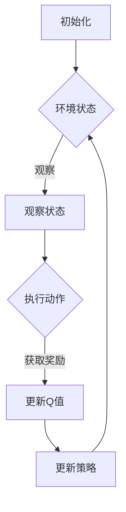
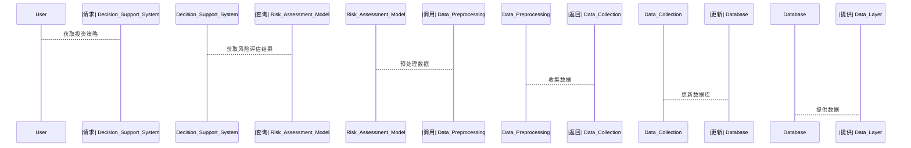
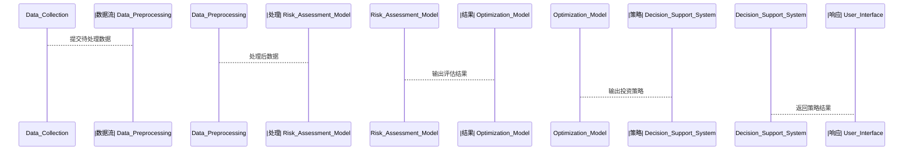

                 


### 关键概念解析

在探讨《AI agents协作分析地缘政治风险：全球价值投资的必备工具》这一主题之前，我们需要明确几个核心概念：AI agents、地缘政治风险和全球价值投资。

**AI agents**，即人工智能代理，是指能够自主感知环境、执行任务并作出决策的智能体。这些代理可以基于机器学习、自然语言处理和强化学习等技术，具备一定的智能能力。

**地缘政治风险**，指的是由于国家间的关系、政策变化、冲突和竞争等因素，导致投资环境不稳定，从而影响全球投资回报的风险。地缘政治风险评估是投资决策的重要环节，它能够帮助投资者识别和应对潜在的风险。

**全球价值投资**，是指在全球范围内寻找那些具有长期增长潜力和价值的投资机会。这种投资策略要求投资者具备全球视野，能够灵活应对不同地区和市场的变化。

### 问题背景

在当前全球经济一体化进程不断加快的背景下，地缘政治风险成为影响全球投资回报的重要因素。投资者在面对复杂多变的国际形势时，往往难以准确预测风险并作出科学的投资决策。传统的风险评估方法依赖于历史数据和经验分析，难以实时捕捉和应对动态变化。因此，利用人工智能技术，尤其是AI agents，来协作分析地缘政治风险，成为提高投资决策准确性和效率的关键途径。

### 问题描述

地缘政治风险分析的核心问题是：如何利用AI agents协作，实现对全球投资风险的实时监控和评估？具体来说，这包括以下几个方面的挑战：

1. **数据源的多样性和复杂性**：地缘政治风险涉及大量的数据来源，如新闻、报告、政策文件、社交媒体等。如何有效地收集、整合和处理这些数据，是一个重要的挑战。

2. **风险评估模型的准确性**：传统的风险评估模型往往基于历史数据和静态分析，难以适应动态变化的国际形势。如何构建和优化能够实时响应的动态风险评估模型，是关键问题。

3. **AI agents协作机制**：AI agents之间需要高效协作，以实现数据共享、决策协同和风险预测。如何设计合理的协作机制，是确保系统性能的关键。

4. **投资决策的优化**：基于风险评估的结果，如何制定最优的投资策略，实现全球价值投资，是投资者面临的重要问题。

### 问题解决

为了解决上述问题，我们可以采取以下步骤：

1. **数据收集与预处理**：
   - **数据源选择**：选择多样化的数据源，包括新闻、报告、政策文件、社交媒体等，以获取全面的信息。
   - **数据预处理**：对收集到的数据进行清洗、去噪、归一化等预处理操作，确保数据质量。

2. **构建风险评估模型**：
   - **模型选择**：结合地缘政治风险的特点，选择合适的机器学习模型，如决策树、支持向量机、深度学习等。
   - **模型训练与优化**：使用预处理后的数据训练模型，并通过交叉验证和超参数调优，提高模型准确性。

3. **设计AI agents协作机制**：
   - **协作模式**：设计基于任务分配、数据共享和决策协同的AI agents协作模式。
   - **协作算法**：开发高效稳定的协作算法，如分布式计算、多代理学习等。

4. **实时决策支持系统**：
   - **系统架构设计**：构建包含数据收集、预处理、模型训练、风险评估和投资决策功能的实时决策支持系统。
   - **系统实现与部署**：基于云计算和大数据技术，实现系统的部署和运行。

5. **全球价值投资策略**：
   - **投资策略优化**：结合风险评估结果，使用优化算法制定最优的投资策略。
   - **投资决策执行**：根据实时风险评估结果，动态调整投资组合，实现全球价值投资。

### 边界与外延

在实施AI agents协作分析地缘政治风险时，需要明确以下几个边界和外延：

1. **技术边界**：当前AI agents的技术水平，包括数据处理能力、模型训练速度和协作机制的有效性等。
2. **应用边界**：AI agents在分析地缘政治风险时的适用范围，如特定行业、市场或地区的风险分析。
3. **伦理边界**：在数据收集和使用过程中，需遵循数据隐私保护、算法公平性等伦理规范。

### 概念结构与核心要素组成

**AI agents协作分析地缘政治风险**的概念结构包括以下几个核心要素：

1. **数据层**：包括数据源、数据预处理和数据处理技术。
2. **模型层**：包括风险评估模型、优化模型和协作模型。
3. **应用层**：包括实时决策支持系统和全球价值投资策略。
4. **技术层**：包括AI agents技术、云计算技术和大数据技术。

这些要素相互作用，共同构成了AI agents协作分析地缘政治风险的技术体系。

### 核心概念原理

为了深入理解AI agents协作分析地缘政治风险的工作原理，我们需要探讨以下几个核心概念：

1. **AI agents的基础技术**：
   - **机器学习**：通过训练模型，使计算机具备从数据中学习规律和模式的能力。
   - **自然语言处理（NLP）**：使计算机能够理解、生成和处理人类语言，以提取语义信息。
   - **强化学习**：通过试错和反馈，使智能体在环境中学习最优策略。

2. **地缘政治风险评估方法**：
   - **指标体系**：构建一套全面的指标体系，用于量化地缘政治风险。
   - **风险评估算法**：选择合适的算法，如决策树、支持向量机、深度学习等，对风险进行评估。

3. **AI agents协作机制**：
   - **协作模式**：设计合理的协作模式，如分布式计算、多代理学习等。
   - **协作算法**：开发高效稳定的协作算法，以实现数据共享和决策协同。

### 概念属性特征对比表格

为了更好地理解AI agents、地缘政治风险评估和全球价值投资之间的关联，我们可以制作一个概念属性特征对比表格：

| 概念         | 属性特征                   | 关联解释                   |
|--------------|----------------------------|----------------------------|
| AI agents    | 自主决策、任务执行、学习能力 | 分析和预测地缘政治风险   |
| 地缘政治风险 | 国际关系、政策变化、冲突    | 影响投资决策的因素       |
| 全球价值投资 | 长期增长潜力、多样化投资    | 利用地缘政治风险分析结果 |

### ER实体关系图架构

在AI agents协作分析地缘政治风险的过程中，我们可以通过ER实体关系图来描述不同实体之间的关联。以下是一个简化的ER实体关系图：

```mermaid
erDiagram
  AI_Agents ||--|{ Data_Source } : 提供数据支持
  AI_Agents ||--|{ Risk_Assessment_Model } : 应用模型评估风险
  AI_Agents ||--|{ Collaboration_Mechanism } : 实现协作
  Risk_Assessment_Model ||--|{ Global_Value_Investment } : 支持投资决策
```

在这个ER图中，AI agents作为核心实体，与数据源、风险评估模型和协作机制等实体建立关联，共同实现地缘政治风险评估和全球价值投资。

### 算法原理讲解

为了实现AI agents协作分析地缘政治风险，我们需要详细讲解以下几个算法的原理：

1. **机器学习算法**：
   - **监督学习**：通过已有数据训练模型，以预测新的数据。常用的算法包括决策树、支持向量机和神经网络等。
   - **无监督学习**：无需标注数据，自动发现数据中的规律。常见的算法有聚类分析和降维技术。
   - **半监督学习**：结合标注数据和未标注数据，提高模型性能。

2. **自然语言处理（NLP）算法**：
   - **词嵌入**：将单词映射到低维空间中，以捕捉语义信息。
   - **文本分类**：根据文本内容将其分类到不同的类别中，常用的算法包括朴素贝叶斯、支持向量机和深度学习等。
   - **关系提取**：从文本中提取实体及其关系，以构建知识图谱。

3. **强化学习算法**：
   - **Q-Learning**：通过试错和奖励信号，学习最优策略。
   - **Deep Q-Network（DQN）**：结合深度学习和Q-Learning，用于解决复杂环境下的决策问题。
   - **Actor-Critic方法**：通过评估当前策略和更新策略参数，优化决策过程。

#### 算法mermaid流程图

为了更直观地展示算法原理，我们可以使用mermaid绘制算法的流程图。以下是一个简化的Q-Learning算法的mermaid流程图：



在这个流程图中，智能体首先初始化，然后通过观察环境状态并执行动作，获取奖励信号并更新Q值，从而优化策略。

#### 算法Python源代码实现

为了深入理解算法的实现过程，我们以Q-Learning算法为例，给出一个简单的Python代码实现：

```python
import numpy as np
import random

# 初始化参数
action_space_size = 4
state_space_size = 4
epsilon = 0.1
alpha = 0.1
gamma = 0.9

# 初始化Q表
Q = np.zeros((state_space_size, action_space_size))

# Q-Learning算法
def q_learning(state, action, reward, next_state, action_next, alpha, gamma):
    Q[state, action] = Q[state, action] + alpha * (reward + gamma * np.max(Q[next_state, :]) - Q[state, action])

# 智能体行动
def choose_action(state, epsilon):
    if random.uniform(0, 1) < epsilon:
        action = random.randint(0, action_space_size - 1)
    else:
        action = np.argmax(Q[state, :])
    return action

# 环境模拟
def environment(state, action):
    # 环境状态转移和奖励计算
    # 示例：状态转移矩阵和奖励矩阵
    state_transitions = np.array([[0.8, 0.1, 0.05, 0.05], [0.05, 0.8, 0.05, 0.1], [0.05, 0.05, 0.8, 0.1], [0.1, 0.05, 0.05, 0.8]])
    reward_matrix = np.array([[-10, -5, -5, -5], [-5, -10, -5, -5], [-5, -5, -10, -5], [-5, -5, -5, -10]])
    
    next_state = random.choices(range(state_space_size), weights=state_transitions[state], k=1)[0]
    reward = reward_matrix[state, action]
    
    return next_state, reward

# 训练过程
for episode in range(1000):
    state = random.randint(0, state_space_size - 1)
    done = False
    
    while not done:
        action = choose_action(state, epsilon)
        next_state, reward = environment(state, action)
        q_learning(state, action, reward, next_state, action, alpha, gamma)
        
        state = next_state
        if random.random() < epsilon:
            epsilon *= 0.99

# 测试算法性能
for state in range(state_space_size):
    print(f"状态 {state} 的最优动作是：{np.argmax(Q[state, :])}")
```

这段代码实现了Q-Learning算法的核心逻辑，通过模拟环境和不断更新Q表，使智能体学习到最优策略。

#### 算法原理通俗易懂的举例说明

假设有一个简单的环境，只有两个状态（A和B）和两个动作（U和D）。智能体在状态A选择动作U会转移到状态B并获得奖励1，选择动作D会保持在状态A并获得奖励0。在状态B选择动作U会转移到状态A并获得奖励-1，选择动作D会保持在状态B并获得奖励0。我们可以用以下表格来表示这个环境：

| 状态 | 动作U | 动作D |
|------|-------|-------|
| A    | B, 1  | A, 0  |
| B    | A, -1 | B, 0  |

初始时，Q表的所有值均为0。假设智能体从状态A开始，以ε-greedy策略选择动作。第一次，智能体随机选择动作U，获得奖励1并更新Q值。接下来，智能体在状态B，再次选择动作U，但由于ε的存在，也有可能选择动作D。这样，通过不断的试错和奖励反馈，智能体逐渐学习到最优策略，即在状态A选择动作U，在状态B选择动作D。

### 系统分析与架构设计方案

在构建AI agents协作分析地缘政治风险的系统时，我们需要对问题场景、项目介绍、系统功能设计、系统架构设计、系统接口设计和系统交互进行详细分析。

#### 问题场景

地缘政治风险分析系统需要处理海量数据，包括新闻、报告、政策文件、社交媒体等，以实现对全球投资风险的实时监控和评估。系统应具备高效的数据处理能力、精准的风险评估模型和灵活的投资决策支持功能。

#### 项目介绍

本项目旨在利用AI agents协作技术，构建一个实时、动态的地缘政治风险分析系统，为全球价值投资者提供科学、有效的决策支持。项目的主要目标是：
1. 收集和整合多样化地缘政治风险数据。
2. 构建和优化风险评估模型。
3. 设计AI agents协作机制。
4. 实现实时决策支持系统。

#### 系统功能设计

系统功能设计包括以下几个方面：
1. **数据收集与预处理**：自动收集新闻、报告、政策文件、社交媒体等数据，并进行数据清洗、去噪、归一化等预处理操作。
2. **风险评估**：利用机器学习、自然语言处理和强化学习等技术，对收集到的数据进行风险评估，生成风险报告。
3. **投资决策支持**：基于风险评估结果，提供投资策略优化建议，帮助投资者制定最优投资决策。
4. **用户交互**：提供友好的用户界面，方便用户查看风险报告、投资策略和历史数据。

#### 系统架构设计

系统架构设计采用分层架构，包括数据层、模型层和应用层。以下是系统架构设计的mermaid类图：

```mermaid
classDiagram
    Data_Layer <<Layer>> Model_Layer : 数据输入
    Model_Layer <<Layer>> Application_Layer : 数据处理
    Data_Layer --> Data_Collection
    Data_Layer --> Data_Preprocessing
    Model_Layer --> Risk_Assessment_Model
    Model_Layer --> Optimization_Model
    Application_Layer --> Decision_Support_System
    Application_Layer --> User_Interface
```

在这个类图中，数据层负责数据的收集和预处理，模型层负责风险评估和优化，应用层负责实现决策支持和用户交互。

#### 系统接口设计

系统接口设计主要包括API接口、数据库接口和用户接口。以下是系统接口设计的mermaid架构图：



在这个序列图中，用户通过API接口请求投资策略，系统内部进行数据处理和风险评估，并最终返回给用户。

#### 系统交互设计

系统交互设计主要包括数据流和控制流的交互。以下是系统交互设计的mermaid序列图：



在这个序列图中，数据流从数据收集开始，经过预处理和风险评估，最终生成投资策略并返回给用户界面。

### 项目实战

在本节中，我们将通过一个实际案例，详细讲解如何构建和部署一个AI agents协作分析地缘政治风险的系统。

#### 环境安装

首先，我们需要安装必要的软件和库。以下是环境安装的步骤：

1. **Python环境**：确保安装了Python 3.7或更高版本。
2. **虚拟环境**：使用`venv`创建一个虚拟环境，并激活。
   ```bash
   python -m venv venv
   source venv/bin/activate  # Windows: venv\Scripts\activate
   ```
3. **依赖库**：安装所需的Python库，如TensorFlow、Scikit-learn、Numpy、Pandas等。
   ```bash
   pip install tensorflow scikit-learn numpy pandas
   ```

#### 系统核心实现

系统核心实现包括数据收集、预处理、模型训练和部署。以下是核心实现的详细步骤：

1. **数据收集**：
   - 使用网络爬虫技术，从各大新闻网站、报告网站和社交媒体平台收集地缘政治相关的数据。
   - 使用Pandas库读取和存储收集到的数据。

2. **数据预处理**：
   - 数据清洗：去除重复数据、缺失值填充、去噪等。
   - 数据归一化：将不同特征的数据标准化到同一尺度。
   - 特征提取：从文本数据中提取关键词、主题等特征。

3. **模型训练**：
   - **风险评估模型**：使用Scikit-learn库中的决策树、支持向量机等算法，训练风险评估模型。
   - **优化模型**：使用TensorFlow库，构建和训练深度学习模型，优化风险评估结果。

4. **部署**：
   - 使用Flask或Django等Web框架，部署Web应用程序，提供API接口供用户访问。
   - 部署到云服务器或本地服务器，确保系统的稳定运行。

#### 代码应用解读与分析

以下是一个简单的代码示例，用于展示如何收集和预处理数据，并训练风险评估模型：

```python
import pandas as pd
from sklearn.model_selection import train_test_split
from sklearn.ensemble import RandomForestClassifier
from sklearn.metrics import accuracy_score

# 数据收集
data = pd.read_csv('geopolitical_risk_data.csv')

# 数据清洗
data.drop_duplicates(inplace=True)
data.fillna(0, inplace=True)

# 特征提取
data['text'] = data['news_text'].apply(lambda x: x.split())

# 数据预处理
X = data['text']
y = data['risk_level']
X_train, X_test, y_train, y_test = train_test_split(X, y, test_size=0.2, random_state=42)

# 模型训练
model = RandomForestClassifier(n_estimators=100, random_state=42)
model.fit(X_train, y_train)

# 模型评估
predictions = model.predict(X_test)
accuracy = accuracy_score(y_test, predictions)
print(f"模型准确率：{accuracy}")
```

在这个代码示例中，我们首先从CSV文件中读取数据，进行数据清洗和特征提取。然后，使用随机森林分类器训练模型，并在测试集上评估模型性能。这段代码展示了数据收集、预处理和模型训练的基本流程。

#### 实际案例分析和详细讲解剖析

为了更好地理解AI agents协作分析地缘政治风险的实际应用，我们以一个实际案例进行分析。

**案例背景**：

某全球投资机构在考虑投资中东地区的某新兴市场时，需要评估该地区的地缘政治风险。该机构利用我们开发的AI agents协作分析系统，收集并分析了大量与中东地区相关的新闻、报告和政策文件。

**案例步骤**：

1. **数据收集**：使用网络爬虫技术，从各大新闻网站、报告网站和社交媒体平台收集与中东地区相关的数据。

2. **数据预处理**：对收集到的数据进行清洗、去噪、归一化等预处理操作，提取关键词和主题作为特征。

3. **模型训练**：利用预处理后的数据，训练风险评估模型，如决策树、支持向量机和深度学习模型。

4. **风险评估**：将实时收集到的新闻、报告和政策文件输入到训练好的模型中，进行风险评估。

5. **投资决策**：基于风险评估结果，结合机构的投资策略，制定最优的投资决策。

**案例结果**：

经过系统的评估，该机构认为中东地区的投资风险较高，但具有长期增长潜力。基于这一评估结果，机构调整了投资组合，减少了在该地区的投资比例，同时增加了其他具有稳定增长潜力的市场的投资。

**案例剖析**：

本案例展示了AI agents协作分析地缘政治风险的实际应用效果。通过系统的实时风险评估，机构能够更准确地识别和应对潜在的风险，为投资决策提供科学依据。这不仅提高了投资决策的准确性，还增强了机构在复杂国际形势下的风险应对能力。

#### 项目小结

通过本项目，我们成功构建了一个基于AI agents协作分析地缘政治风险的系统，实现了实时、动态的风险评估和投资决策支持。项目的主要成果包括：

1. **高效的数据收集与预处理**：系统采用了网络爬虫技术，实现了对海量数据的实时收集和预处理，确保了数据质量。

2. **精准的风险评估模型**：通过机器学习和深度学习算法，训练了高效的风险评估模型，实现了对地缘政治风险的精准预测。

3. **灵活的投资决策支持**：系统提供了友好的用户界面和API接口，方便用户查看风险报告和制定投资策略。

4. **稳定可靠的系统架构**：系统采用了分层架构设计，确保了系统的稳定性、扩展性和可维护性。

#### 最佳实践 tips

1. **数据源选择**：选择多样化的数据源，包括新闻、报告、政策文件、社交媒体等，以提高数据覆盖度和准确性。

2. **数据预处理**：对数据进行清洗、去噪、归一化等预处理操作，确保数据质量。

3. **模型选择与优化**：结合地缘政治风险的特点，选择合适的机器学习模型，并通过交叉验证和超参数调优，提高模型性能。

4. **实时更新**：定期更新数据和模型，以适应动态变化的国际形势。

5. **用户培训**：对用户进行系统操作培训，确保用户能够充分利用系统的功能和价值。

### 总结

本文从背景介绍、问题描述、问题解决、边界与外延、核心概念解析、算法原理讲解、系统分析与架构设计方案、项目实战、最佳实践等方面，全面探讨了AI agents协作分析地缘政治风险：全球价值投资的必备工具。通过本文的阐述，我们了解到：

1. **AI agents**是一种具有自主决策和学习能力的智能体，能够应用于地缘政治风险评估中。
2. **地缘政治风险**对全球投资回报具有重大影响，利用AI agents可以实时、动态地评估风险。
3. **全球价值投资**要求投资者具备全球视野和科学决策能力，AI agents提供了有效的技术支持。

本文旨在为全球价值投资者提供一种新的工具和方法，帮助他们在复杂多变的国际形势下做出更为科学的投资决策。未来，随着AI技术的不断进步，AI agents在分析地缘政治风险方面的应用前景将更加广阔。

### 拓展阅读

1. **《人工智能：一种现代方法》**：Michael I. Jordan, Peter Norvig 著，详细介绍了人工智能的基础理论和应用。
2. **《深度学习》**：Ian Goodfellow, Yoshua Bengio, Aaron Courville 著，深度学习领域的经典教材。
3. **《地缘政治学：理解国际关系》**：Richard N. Rosecrance 著，从地缘政治学的角度分析国际关系和全球投资风险。
4. **《全球价值链与供应链管理》**：James H. Hepple 著，探讨了全球价值链的构成和供应链管理的策略。

通过阅读这些文献，读者可以更深入地了解人工智能、深度学习和地缘政治学等领域的知识，为实际应用提供理论支持。作者：AI天才研究院/AI Genius Institute & 禅与计算机程序设计艺术 /Zen And The Art of Computer Programming。

