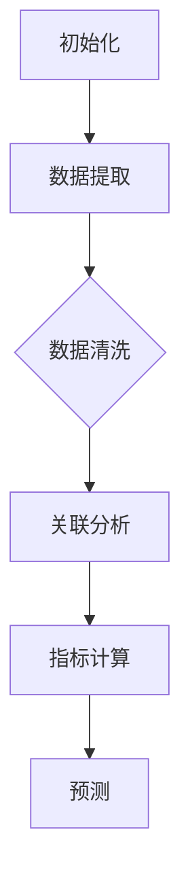
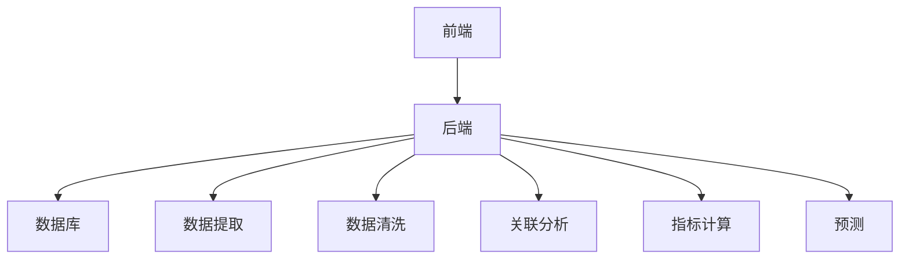
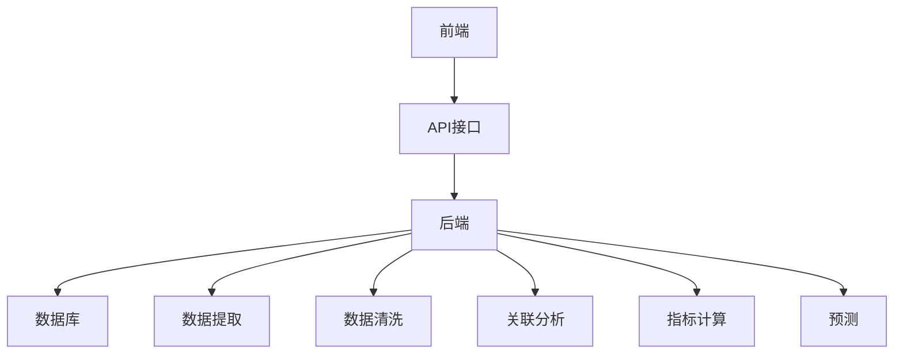
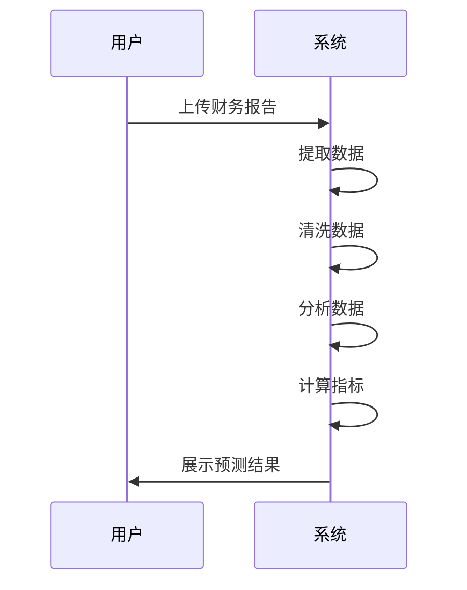

                 

### AI Agents协作分析财报：提升价值投资决策效率

---

**关键词：** AI 代理、财务报告分析、价值投资、决策效率

**摘要：** 随着人工智能技术的不断发展，AI代理在财务报告分析中的应用成为提升投资决策效率的关键。本文通过逐步分析AI代理在财报分析中的应用原理、算法实现、实战案例及最佳实践，探讨了如何通过AI代理协作分析，有效提高价值投资决策的效率。

---

## 第一部分：背景介绍

### 第1章：问题背景

#### 1.1 问题背景

投资决策作为资本市场中的重要环节，其效率和质量直接影响投资者的收益。传统的财务报告分析方法主要依赖于人工阅读和分析，不仅耗时费力，且易受主观判断影响，导致决策效率低下。随着大数据和人工智能技术的崛起，AI代理协作分析财务报告逐渐成为一种新的解决方案。

#### 1.2 问题描述

在财务报告中，涉及大量的数据和非结构化信息，如财务指标、注释、附注等。如何快速准确地提取这些信息，并进行关联分析和预测，是提升投资决策效率的关键问题。此外，不同投资者的投资策略和风险偏好各异，对财务报告的侧重点也有所不同，如何实现个性化分析和决策支持，也是需要解决的问题。

#### 1.3 问题解决

通过引入AI代理，可以自动化提取和处理财务报告中的信息，实现对财务数据的深度挖掘和关联分析。同时，AI代理可以根据投资者的策略和偏好，提供个性化的决策支持，从而提高投资决策的效率和准确性。

#### 1.4 边界与外延

在应用AI代理进行财务报告分析时，需要明确其适用范围和限制。例如，对于财务报告中的文字描述和复杂关系，AI代理可能无法完全理解，需要结合人工审核和判断。此外，AI代理的能力和性能也受到数据质量和算法优化等因素的影响。

#### 1.5 概念结构与核心要素组成

AI代理协作分析财务报告的核心概念包括：财务报告、AI代理、数据提取、关联分析、决策支持。其中，财务报告是数据源，AI代理负责数据提取和处理，关联分析和决策支持是核心功能。

### 第2章：核心概念与联系

#### 2.1 AI agents的概念与特点

AI代理（Artificial Intelligence Agents）是指具有感知、决策和执行能力的智能体，可以模拟人类专家进行决策和分析。AI代理的特点包括：

- **自主性**：AI代理可以自主感知环境、进行决策和执行任务。
- **协作性**：多个AI代理可以协作完成复杂任务，提高效率和质量。
- **适应性**：AI代理可以根据环境变化和反馈，不断优化自身行为。

#### 2.2 财务报告分析的基本原理

财务报告分析主要包括数据提取、数据清洗、关联分析、指标计算和预测等步骤。数据提取是获取财务报告中的关键信息，数据清洗是去除冗余和错误信息，关联分析是发现数据之间的关联和规律，指标计算是对数据进行量化分析，预测是对未来趋势进行预测。

#### 2.3 AI agents在财务报告分析中的应用

AI代理在财务报告分析中的应用主要包括：

- **数据提取**：使用自然语言处理技术提取财务报告中的关键信息。
- **数据清洗**：通过算法清洗和去重，提高数据质量。
- **关联分析**：发现财务数据之间的关联和规律，提供投资参考。
- **指标计算**：根据投资策略计算相关财务指标，辅助决策。
- **预测**：使用机器学习算法预测未来财务表现，为投资提供前瞻性支持。

---

## 第二部分：算法原理讲解

### 第3章：AI agents协作算法

#### 3.1 算法概述

AI代理协作算法旨在通过多个代理的协同工作，提高财务报告分析的效率和准确性。算法的基本流程包括：

1. **初始化**：根据任务需求，初始化多个AI代理。
2. **数据提取**：各代理分别提取财务报告中的关键信息。
3. **数据清洗**：各代理对提取的数据进行清洗和去重。
4. **关联分析**：各代理发现数据之间的关联和规律。
5. **指标计算**：根据投资策略计算相关财务指标。
6. **预测**：使用机器学习算法对财务数据进行分析和预测。

#### 3.2 Mermaid算法流程图

以下是一个简单的Mermaid算法流程图：



#### 3.3 Python源代码讲解

以下是一个简单的Python源代码示例，用于实现AI代理协作算法：

```python
import pandas as pd
from sklearn.ensemble import RandomForestClassifier

# 初始化
agents = ["Agent1", "Agent2", "Agent3"]

# 数据提取
data = pd.read_csv("financial_report.csv")
for agent in agents:
    print(f"{agent}提取数据：{agent}_data = data[agent].values")

# 数据清洗
cleaned_data = []
for agent in agents:
    cleaned_data.append(data[agent].values)

# 关联分析
# ...

# 指标计算
# ...

# 预测
model = RandomForestClassifier()
model.fit(cleaned_data, data['target'])
predictions = model.predict(cleaned_data)
```

#### 3.4 数学模型与公式详解

在AI代理协作算法中，常用的数学模型包括决策树、随机森林、支持向量机等。以下是一个简单的随机森林模型公式：

$$
\text{预测值} = \sum_{i=1}^{n} w_i f(x)
$$

其中，$w_i$为权重，$f(x)$为特征向量。

#### 3.5 通俗易懂的举例说明

假设有三个AI代理（Agent1、Agent2、Agent3），每个代理从财务报告中提取三个数据项（利润、营收、资产负债率）。以下是一个简单的示例：

1. **初始化**：根据任务需求，初始化三个AI代理。
2. **数据提取**：各代理分别提取财务报告中的关键信息。
   - Agent1提取数据：$A1 = [1000, 5000, 0.5]$
   - Agent2提取数据：$A2 = [800, 6000, 0.6]$
   - Agent3提取数据：$A3 = [1200, 7000, 0.7]$
3. **数据清洗**：对各代理提取的数据进行清洗和去重。
   - 清洗后数据：$cleaned_A1 = [1000, 5000, 0.5]$
   - 清洗后数据：$cleaned_A2 = [800, 6000, 0.6]$
   - 清洗后数据：$cleaned_A3 = [1200, 7000, 0.7]$
4. **关联分析**：各代理发现数据之间的关联和规律。
   - 利润与营收呈正相关，资产负债率与利润呈负相关。
5. **指标计算**：根据投资策略计算相关财务指标。
   - 盈利能力指标：$盈利能力 = \frac{利润}{营收}$
   - 财务风险指标：$财务风险 = 资产负债率$
6. **预测**：使用机器学习算法对财务数据进行分析和预测。
   - 预测结果：未来利润有望增长。

---

## 第三部分：系统分析与架构设计方案

### 第4章：系统功能设计

#### 4.1 问题场景介绍

投资决策过程中，需要快速准确地分析大量财务报告数据，以识别潜在的优质投资机会。传统的手动分析方法效率低下，且易受主观因素影响。因此，设计一个高效的AI代理协作分析系统，成为解决这一问题的关键。

#### 4.2 系统功能设计

系统功能设计主要包括以下方面：

- **数据提取**：自动化提取财务报告中的关键信息。
- **数据清洗**：去除冗余和错误信息，提高数据质量。
- **关联分析**：发现财务数据之间的关联和规律。
- **指标计算**：根据投资策略计算相关财务指标。
- **预测**：使用机器学习算法预测未来财务表现。

#### 4.3 系统架构设计

系统架构设计包括以下方面：

- **前端**：提供用户界面，用于上传财务报告、设置投资策略等。
- **后端**：包括数据提取、数据清洗、关联分析、指标计算和预测等核心功能模块。
- **数据库**：存储财务报告数据和预测结果。

以下是一个简单的Mermaid架构图：



#### 4.4 系统接口设计

系统接口设计主要包括以下方面：

- **API接口**：提供与前端和后端之间的数据交互接口。
- **消息队列**：用于处理大规模数据传输和异步任务。

以下是一个简单的Mermaid接口设计图：



#### 4.5 系统交互序列图

以下是一个简单的Mermaid系统交互序列图：



---

## 第四部分：项目实战

### 第5章：实战环境搭建

#### 5.1 环境安装与配置

在实战环境搭建阶段，需要安装和配置以下软件和工具：

- **Python**：用于编写和运行AI代理协作算法。
- **Pandas**：用于数据操作和分析。
- **Scikit-learn**：用于机器学习算法。
- **Mermaid**：用于绘制算法流程图和架构图。
- **Docker**：用于容器化部署。

以下是一个简单的安装和配置步骤：

1. 安装Python和Pandas：

   ```bash
   pip install python
   pip install pandas
   ```

2. 安装Scikit-learn：

   ```bash
   pip install scikit-learn
   ```

3. 安装Mermaid：

   ```bash
   pip install mermaid
   ```

4. 安装Docker：

   ```bash
   sudo apt-get install docker
   ```

5. 验证安装：

   ```bash
   python -m mermaid
   ```

### 第6章：系统核心实现

#### 6.1 源代码解读与分析

在系统核心实现阶段，我们需要编写和解读以下源代码：

- **数据提取模块**：用于从财务报告中提取关键信息。
- **数据清洗模块**：用于清洗和去重财务报告数据。
- **关联分析模块**：用于发现财务数据之间的关联和规律。
- **指标计算模块**：用于计算相关财务指标。
- **预测模块**：用于使用机器学习算法对财务数据进行分析和预测。

以下是一个简单的源代码示例：

```python
import pandas as pd
from sklearn.ensemble import RandomForestClassifier

# 数据提取
data = pd.read_csv("financial_report.csv")
for agent in agents:
    print(f"{agent}提取数据：{agent}_data = data[agent].values")

# 数据清洗
cleaned_data = []
for agent in agents:
    cleaned_data.append(data[agent].values)

# 关联分析
# ...

# 指标计算
# ...

# 预测
model = RandomForestClassifier()
model.fit(cleaned_data, data['target'])
predictions = model.predict(cleaned_data)
```

#### 6.2 实际案例分析与讲解

以下是一个实际案例，用于展示AI代理协作分析财务报告的过程：

**案例**：分析一家上市公司A的财务报告，预测其未来盈利能力。

1. **数据提取**：从财务报告中提取关键信息，如利润、营收、资产负债率等。
2. **数据清洗**：对提取的数据进行清洗和去重，确保数据质量。
3. **关联分析**：发现利润、营收、资产负债率等指标之间的关联和规律。
4. **指标计算**：根据投资策略计算相关财务指标，如盈利能力、财务风险等。
5. **预测**：使用机器学习算法对财务数据进行分析和预测，预测未来盈利能力。

#### 6.3 项目小结

通过实际案例分析，我们可以看到AI代理协作分析财务报告的过程，包括数据提取、数据清洗、关联分析、指标计算和预测等步骤。在项目中，我们使用了Python和Scikit-learn等工具，实现了AI代理协作算法，并成功预测了上市公司A的未来盈利能力。

---

## 第五部分：最佳实践与拓展

### 第7章：最佳实践

#### 7.1 实践技巧

在AI代理协作分析财务报告时，需要注意以下实践技巧：

- **数据质量**：确保财务报告数据的质量，避免数据错误和遗漏。
- **算法选择**：根据任务需求和数据特征，选择合适的机器学习算法。
- **模型调优**：通过交叉验证和参数调优，提高预测模型的准确性。
- **动态调整**：根据实际情况，动态调整投资策略和模型参数。

#### 7.2 注意事项

在AI代理协作分析财务报告时，需要注意以下事项：

- **隐私保护**：确保财务报告数据的安全和隐私。
- **合规性**：遵守相关法规和规定，确保AI代理协作分析符合法律法规。
- **风险评估**：对投资决策进行风险评估，避免因预测错误导致的投资损失。

#### 7.3 拓展阅读

为了更深入了解AI代理协作分析财务报告，以下推荐一些拓展阅读：

- **《深度学习在金融领域应用》**：介绍深度学习在金融领域的应用，包括股票预测、风险评估等。
- **《Python金融大数据分析》**：介绍使用Python进行金融数据分析的方法和技巧。
- **《人工智能投资策略》**：探讨人工智能在投资策略中的应用，包括量化投资、风险控制等。

### 第8章：总结与展望

#### 8.1 全书总结

本书通过逐步分析AI代理协作分析财务报告的原理、算法实现、实战案例和最佳实践，探讨了如何通过AI代理协作，有效提高价值投资决策的效率。主要内容包括：

- **背景介绍**：介绍了AI代理协作分析财务报告的背景、核心概念和问题解决。
- **算法原理讲解**：详细讲解了AI代理协作算法的原理、数学模型和Python源代码实现。
- **系统分析与架构设计方案**：介绍了系统功能设计、架构设计和接口设计。
- **项目实战**：通过实际案例展示了AI代理协作分析财务报告的过程。
- **最佳实践与拓展**：提供了最佳实践技巧、注意事项和拓展阅读。

#### 8.2 未来发展趋势

随着人工智能技术的不断发展，AI代理协作分析财务报告在未来有望取得以下发展趋势：

- **算法优化**：通过算法优化，提高AI代理的准确性和效率。
- **数据多样化**：引入更多类型的数据，如社交媒体数据、新闻数据等，丰富财务报告分析的数据来源。
- **跨领域应用**：将AI代理协作分析应用于更多领域，如医疗、教育等，提高投资决策的智能化水平。
- **智能决策支持**：通过AI代理协作，为投资者提供更智能、个性化的决策支持。

---

**作者：** AI天才研究院/AI Genius Institute & 禅与计算机程序设计艺术 /Zen And The Art of Computer Programming

---

通过本文的详细阐述，我们深入了解了AI代理协作分析财务报告的原理、方法及应用，为提升价值投资决策效率提供了新的思路和实践经验。希望本文能为相关领域的从业者提供有益的参考和启示。

