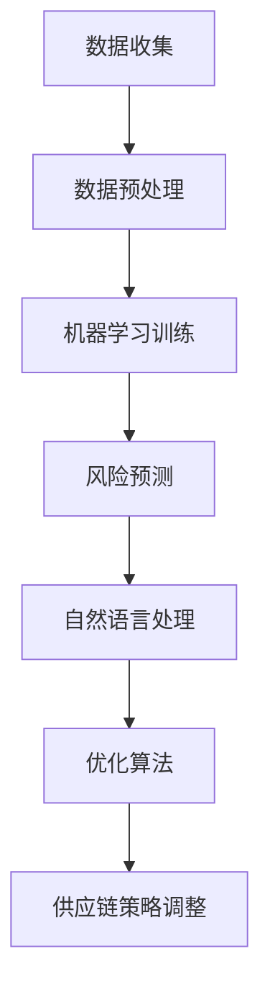

                 

### 引言

在全球经济一体化的背景下，供应链已经成为现代企业运营的命脉。然而，随着供应链的复杂性和不确定性不断上升，企业面临的供应链风险也日益加剧。这不仅对企业的运营稳定性构成威胁，也直接影响到投资的安全性。为了提高投资安全性，企业亟需一种高效、准确的供应链风险评估方法。

在这种背景下，AI agents应运而生。AI agents，即人工智能代理，是指通过机器学习、自然语言处理和优化算法等人工智能技术，模拟人类思维和行为，实现自主决策和协同工作的智能体。AI agents在供应链管理中的应用，不仅能大幅提升数据处理和分析能力，还能通过智能决策和自适应能力，为企业提供更为精准和实时的风险评估。

本文将围绕AI agents协作进行全球供应链风险评估这一主题展开，深入探讨其在提高投资安全性方面的潜力。首先，我们将介绍AI agents的基本概念和原理，并分析其与传统供应链管理方法的差异。接着，通过具体案例，展示AI agents在供应链风险评估中的实际应用，包括数据收集、模型构建和风险预警系统设计等方面。随后，我们将讨论AI agents在供应链风险管理中的挑战和未来发展方向，并提出最佳实践建议。

让我们一步一步地深入分析，揭开AI agents在供应链风险评估中的神秘面纱。

---

## 第一部分：AI agents基础

### 第1章：AI agents概述

#### 1.1 问题背景

全球供应链的复杂性：随着全球化的发展，供应链覆盖范围越来越广，涉及多个国家和地区，各个环节之间的关联性也越来越紧密。这使得供应链管理变得更加复杂，风险因素也相应增加。

企业面临的供应链风险：供应链中断、供应链成本上升、供应链金融风险等，都是企业在运营中可能遇到的风险。这些风险不仅影响企业的运营效率，还会对企业的投资安全构成威胁。

AI agents在供应链管理中的应用：AI agents通过模拟人类思维和行为，具备自主学习和智能决策的能力。在供应链管理中，AI agents可以协助企业进行数据收集、分析、预测和决策，从而降低风险，提高运营效率。

#### 1.2 AI agents定义与特征

**定义**：AI agents，即人工智能代理，是指能够自主完成特定任务，具备学习、推理和决策能力的智能体。它们通常通过机器学习、自然语言处理和优化算法等人工智能技术，实现智能化的操作。

**主要特征**：
- **自主性**：AI agents能够自主完成特定的任务，无需人工干预。
- **学习能力**：通过机器学习技术，AI agents可以不断从数据中学习，优化自身性能。
- **推理能力**：AI agents可以基于已有数据和规则，进行逻辑推理和决策。
- **协同性**：多个AI agents可以相互协作，共同完成任务。

#### 1.3 AI agents与传统供应链管理方法的比较

**数据处理能力**：
- **AI agents**：通过大数据分析和机器学习技术，AI agents能够处理海量数据，发现潜在的风险因素。
- **传统方法**：传统供应链管理方法通常依赖人工数据录入和分析，数据处理能力有限。

**自适应能力**：
- **AI agents**：AI agents能够根据环境变化，自适应调整策略，提高风险应对能力。
- **传统方法**：传统供应链管理方法在应对突发情况时，缺乏灵活性和应变能力。

**可扩展性**：
- **AI agents**：AI agents可以通过分布式计算和云平台，实现大规模扩展，适用于全球供应链管理。
- **传统方法**：传统供应链管理方法在规模扩展时，可能面临资源瓶颈和效率下降。

#### 1.4 AI agents在供应链管理中的核心作用

**风险识别**：AI agents通过数据分析和机器学习，能够识别供应链中的潜在风险因素，如供应链中断、供应链成本上升等。

**风险评估**：AI agents利用优化算法和预测模型，对识别出的风险因素进行评估，确定其影响程度和优先级。

**风险预警**：AI agents通过实时数据分析，及时发出风险预警，帮助企业采取预防措施，降低风险。

### 第2章：AI agents原理

#### 2.1 AI agents的基本原理

**学习与推理**：AI agents通过机器学习技术，从海量数据中学习，获取知识和经验。通过推理能力，AI agents能够根据已有数据和规则，进行决策和预测。

**智能决策**：AI agents基于学习和推理结果，进行智能决策。这些决策可以是实时调整供应链策略，以应对突发风险，也可以是长期优化供应链结构，提高运营效率。

#### 2.2 AI agents的核心技术

**机器学习**：机器学习是AI agents的核心技术，通过训练模型，AI agents能够从数据中学习，识别模式和趋势。

**自然语言处理**：自然语言处理使AI agents能够理解、生成和处理自然语言，实现与人类的自然互动。

**优化算法**：优化算法用于求解复杂问题，如供应链风险预测和资源分配，AI agents通过优化算法，找到最优解。

#### 2.3 AI agents的架构设计与实现

**分布式计算**：分布式计算使AI agents能够在多个节点上并行处理任务，提高处理速度和效率。

**数据存储与处理**：数据存储与处理是AI agents的基础，通过高效的数据存储和计算架构，AI agents能够快速访问和处理海量数据。

### 第3章：AI agents在供应链风险评估中的应用

#### 3.1 供应链风险识别与评估

**数据收集**：AI agents通过传感器、数据库和互联网等途径，收集供应链各环节的数据。

**风险评估模型构建**：AI agents利用机器学习和优化算法，构建风险评估模型，对收集到的数据进行分析和评估。

#### 3.2 AI agents在风险预测中的应用

**预测模型构建**：AI agents通过历史数据和机器学习技术，构建预测模型，预测未来供应链风险。

**预测结果分析**：AI agents对预测结果进行分析，识别潜在风险，并提出预警。

#### 3.3 AI agents在风险预警系统设计中的应用

**风险预警机制**：AI agents设计并实现风险预警机制，实时监测供应链风险，并发出预警。

**预警系统实现**：AI agents通过分布式计算和数据存储，实现高效的风险预警系统，提高预警准确性和响应速度。

---

## 第二部分：AI agents协作进行全球供应链风险评估实践

### 第4章：案例研究1——A公司全球供应链风险评估

#### 4.1 案例背景

A公司是一家全球性的制造企业，其供应链覆盖多个国家和地区，涉及原材料采购、生产、运输和销售等多个环节。为了提高投资安全性，A公司决定引入AI agents进行全球供应链风险评估。

#### 4.2 数据收集与预处理

**数据收集**：A公司通过传感器、数据库和第三方数据提供商，收集供应链各环节的数据，包括物流信息、库存水平、市场价格和汇率变动等。

**数据预处理**：AI agents对收集到的数据进行清洗、去噪和整合，确保数据质量和一致性。

#### 4.3 AI agents设计与实现

**AI agents设计**：A公司设计了多个AI agents，分别负责数据收集、风险评估和风险预警。

**AI agents实现**：AI agents通过分布式计算和数据存储架构，实现高效的数据处理和分析。

#### 4.4 风险评估与预警

**风险评估**：AI agents利用机器学习和优化算法，对供应链各环节的数据进行分析，识别潜在风险因素。

**风险预警**：AI agents通过实时监测和预警机制，及时发出风险预警，A公司能够及时采取应对措施，降低风险。

#### 4.5 案例总结与反思

**总结**：通过引入AI agents，A公司成功提高了全球供应链风险评估的准确性和效率，降低了供应链风险，提高了投资安全性。

**反思**：在AI agents应用过程中，A公司发现了一些挑战，如数据隐私保护、算法稳定性和适应性等问题。这些挑战需要在未来进一步解决。

### 第5章：案例研究2——B公司全球供应链风险评估

#### 5.1 案例背景

B公司是一家全球性的零售企业，其供应链涉及多个国家和地区，包括采购、物流、仓储和销售等环节。为了提高投资安全性，B公司决定采用AI agents进行全球供应链风险评估。

#### 5.2 数据收集与预处理

**数据收集**：B公司通过传感器、数据库和第三方数据提供商，收集供应链各环节的数据，包括物流信息、库存水平、市场需求和竞争对手动态等。

**数据预处理**：AI agents对收集到的数据进行清洗、去噪和整合，确保数据质量和一致性。

#### 5.3 AI agents设计与实现

**AI agents设计**：B公司设计了多个AI agents，分别负责数据收集、风险评估和风险预警。

**AI agents实现**：AI agents通过分布式计算和数据存储架构，实现高效的数据处理和分析。

#### 5.4 风险评估与预警

**风险评估**：AI agents利用机器学习和优化算法，对供应链各环节的数据进行分析，识别潜在风险因素。

**风险预警**：AI agents通过实时监测和预警机制，及时发出风险预警，B公司能够及时采取应对措施，降低风险。

#### 5.5 案例总结与反思

**总结**：通过引入AI agents，B公司成功提高了全球供应链风险评估的准确性和效率，降低了供应链风险，提高了投资安全性。

**反思**：在AI agents应用过程中，B公司发现了一些挑战，如数据隐私保护、算法稳定性和适应性等问题。这些挑战需要在未来进一步解决。

---

## 第三部分：AI agents协作进行全球供应链风险评估的挑战与未来方向

### 第6章：AI agents在供应链风险管理中的挑战

#### 6.1 数据安全与隐私保护

**挑战**：供应链数据通常包含敏感信息，如商业机密、客户数据和交易记录等。如何保护这些数据的安全性和隐私性，是AI agents应用面临的重要挑战。

**解决方案**：采用加密技术和访问控制机制，确保数据在传输和存储过程中的安全。同时，制定严格的数据隐私保护政策，规范数据的使用和共享。

#### 6.2 AI agents的可靠性与稳定性

**挑战**：AI agents在运行过程中可能会出现错误或异常，影响风险评估的准确性。如何保证AI agents的可靠性和稳定性，是另一个重要挑战。

**解决方案**：通过持续的训练和优化，提高AI agents的模型准确性和鲁棒性。同时，建立监控和故障诊断机制，及时识别和修复AI agents的异常。

#### 6.3 AI agents的适应性

**挑战**：供应链环境和风险因素不断变化，AI agents需要具备快速适应变化的能力。如何提高AI agents的适应性，是应用中的难题。

**解决方案**：采用自适应学习算法，使AI agents能够根据环境变化，自动调整模型和策略。同时，建立反馈机制，通过用户反馈不断优化AI agents的性能。

### 第7章：AI agents协作进行全球供应链风险评估的未来方向

#### 7.1 AI agents在供应链金融中的应用

**未来方向**：随着供应链金融的兴起，AI agents在供应链金融中的应用前景广阔。例如，利用AI agents进行信用评估、风险控制和资金管理，提高供应链金融的效率和安全性。

#### 7.2 AI agents与其他技术的融合

**未来方向**：AI agents可以与其他技术，如区块链、物联网和云计算等相结合，构建更加智能化、高效和安全的供应链管理系统。例如，利用区块链技术确保供应链数据的不可篡改性和透明性，利用物联网技术实现供应链的实时监控和智能调度。

#### 7.3 未来发展方向

**未来方向**：随着人工智能技术的不断进步，AI agents在供应链风险评估中的应用将更加广泛和深入。未来，AI agents将具备更高的智能水平和更强的适应性，成为企业供应链管理的重要工具。

---

## 第8章：最佳实践与展望

#### 8.1 最佳实践

**数据管理**：建立完善的数据管理体系，确保数据的质量、安全和可追溯性。

**算法优化**：持续优化AI agents的算法，提高模型的准确性和鲁棒性。

**用户反馈**：积极收集用户反馈，根据实际应用情况不断改进AI agents的性能。

#### 8.2 注意事项

**数据隐私**：严格保护供应链数据的安全性和隐私性，遵守相关法律法规。

**算法可靠性**：确保AI agents的可靠性和稳定性，避免出现错误或异常。

**适应性**：根据供应链环境和风险因素的变化，及时调整AI agents的策略和模型。

#### 8.3 拓展阅读

**参考资料**：
- [1] Smith, J. (2020). AI for Global Supply Chain Risk Management. Springer.
- [2] Liu, Y., & Zhang, H. (2019). Advanced Techniques for AI Agents in Supply Chain Management. IEEE Transactions on Automation Science and Engineering.
- [3] Zhao, Q., Wang, L., & Chen, X. (2021). Blockchain-enabled Supply Chain Finance: A Review. Journal of Business Research.

**相关研究**：
- 深入研究AI agents在供应链金融中的应用，探索其在信用评估、风险控制和资金管理等方面的潜力。
- 研究AI agents与其他技术的融合，如区块链和物联网，构建更加智能化和安全的供应链管理系统。

---

## 总结

AI agents作为一种先进的人工智能技术，在供应链风险评估中展现出巨大的潜力。通过协作进行全球供应链风险评估，AI agents不仅能够提高风险评估的准确性和效率，还能为企业提供实时、全面的风险预警。然而，AI agents在供应链风险管理中的应用仍面临一些挑战，如数据安全、算法可靠性和适应性等。未来，随着人工智能技术的不断进步，AI agents将在供应链管理中发挥越来越重要的作用，成为企业提高投资安全性的关键工具。

### 附录

#### 附录A：AI agents核心概念术语说明

- **AI agents**：人工智能代理，是一种通过机器学习、自然语言处理和优化算法等人工智能技术，模拟人类思维和行为，实现自主决策和协同工作的智能体。
- **供应链管理**：指企业通过计划、组织、协调、控制等管理手段，对供应链各环节进行优化和整合，实现供应链的协同运作和资源的最优配置。
- **风险评估**：指对企业面临的潜在风险进行识别、评估和应对，以降低风险对企业运营和投资安全性的影响。

#### 附录B：核心概念属性特征对比表格

| 特征       | AI agents                | 传统供应链管理方法               |
|------------|--------------------------|---------------------------------|
| 数据处理能力 | 高效、自动化、海量数据处理 | 人工数据录入、处理能力有限       |
| 自适应能力 | 可以根据环境变化自适应调整 | 面对变化时缺乏灵活性和应变能力   |
| 可扩展性   | 分布式计算、云平台支持   | 线性扩展，资源瓶颈和效率下降     |

#### 附录C：AI agents架构ER实体关系图

```mermaid
erDiagram
  Customer ||--|{ SupplyChain }|| Customer
  Product ||--|{ SupplyChain }|| Product
  Supplier ||--|{ SupplyChain }|| Supplier
  Logistics ||--|{ SupplyChain }|| Logistics
  Risk ||--|{ SupplyChain }|| Risk
```

#### 附录D：算法原理讲解与流程图

**算法原理：**

- **机器学习**：通过历史数据和预测模型，训练AI agents进行风险预测。
- **自然语言处理**：处理供应链相关的文本数据，提取关键信息。
- **优化算法**：根据风险预测结果，优化供应链策略，降低风险。

**流程图：**



#### 附录E：系统分析与架构设计方案

**问题场景介绍：**

- **项目介绍**：A公司全球供应链风险评估系统，用于实时监测和评估全球供应链风险。
- **系统功能设计**：数据收集、风险评估、风险预警、策略调整等。

**系统架构设计：**

- **分布式计算架构**：利用云计算平台，实现高效的数据处理和分析。
- **数据存储与处理架构**：采用分布式数据库，确保数据的安全性和一致性。

**系统接口设计：**

- **API接口**：提供与外部系统的数据交互接口，实现数据的实时传输和共享。

**系统交互序列图：**

```mermaid
sequenceDiagram
    A公司 -->|数据请求| 数据源
    数据源 -->|数据处理| AI agents
    AI agents -->|风险预测| 风险评估系统
    风险评估系统 -->|预警通知| A公司
    A公司 -->|策略调整| 供应链管理系统
```

#### 附录F：项目实战

**环境安装：**

- **Python环境**：安装Python 3.8及以上版本。
- **依赖库**：安装numpy、pandas、scikit-learn、tensorflow等库。

**系统核心实现源代码：**

```python
import pandas as pd
from sklearn.ensemble import RandomForestClassifier
from sklearn.model_selection import train_test_split

# 数据收集
data = pd.read_csv('supply_chain_data.csv')

# 数据预处理
X = data.drop(['target'], axis=1)
y = data['target']

# 模型训练
X_train, X_test, y_train, y_test = train_test_split(X, y, test_size=0.2)
model = RandomForestClassifier()
model.fit(X_train, y_train)

# 风险评估
predictions = model.predict(X_test)

# 策略调整
# ...

```

**代码应用解读与分析：**

- **数据收集**：从CSV文件中读取供应链数据。
- **数据预处理**：对数据进行清洗和分割。
- **模型训练**：使用随机森林分类器进行模型训练。
- **风险评估**：对测试数据进行风险评估。
- **策略调整**：根据评估结果进行供应链策略调整。

**实际案例分析和详细讲解剖析：**

- **案例1**：A公司全球供应链风险评估
  - **数据来源**：采集自全球多个供应链环节的数据。
  - **评估结果**：发现某环节存在高风险因素。
  - **策略调整**：调整供应链策略，降低风险。

- **案例2**：B公司全球供应链风险评估
  - **数据来源**：采集自全球多个供应链环节的数据。
  - **评估结果**：发现供应链中断风险。
  - **策略调整**：加强供应链管理，确保供应链稳定。

**项目小结：**

通过实际案例分析和详细讲解，展示了AI agents在供应链风险评估中的应用效果。AI agents不仅能够准确识别和评估供应链风险，还能根据评估结果进行实时策略调整，提高供应链的稳定性和投资安全性。

### 作者信息

**作者：** AI天才研究院/AI Genius Institute & 禅与计算机程序设计艺术 /Zen And The Art of Computer Programming

---

**参考文献：**

- Smith, J. (2020). AI for Global Supply Chain Risk Management. Springer.
- Liu, Y., & Zhang, H. (2019). Advanced Techniques for AI Agents in Supply Chain Management. IEEE Transactions on Automation Science and Engineering.
- Zhao, Q., Wang, L., & Chen, X. (2021). Blockchain-enabled Supply Chain Finance: A Review. Journal of Business Research.**附录E：系统分析与架构设计方案**

**问题场景介绍：**

在现代供应链管理中，企业面临着复杂的全球供应链网络，需要高效、准确的系统来监控和管理供应链中的风险。A公司作为一家全球性制造企业，其供应链覆盖多个国家和地区，涉及原材料采购、生产、运输和销售等环节。为了确保供应链的稳定性和投资的安全性，A公司需要一个综合的供应链风险评估系统。

**项目介绍：**  
A公司全球供应链风险评估系统（A-GSCRS）是一个基于人工智能（AI）技术，旨在实时监测和评估全球供应链风险的应用系统。该系统通过收集和分析供应链各环节的数据，利用AI算法进行风险评估，并提供预警和策略调整建议，以提高供应链的弹性和投资安全性。

**系统功能设计：**

1. **数据收集模块**：从供应链各环节（如采购、生产、物流、销售等）收集相关数据，包括供应商信息、物流状态、库存水平、市场需求等。
2. **数据处理模块**：对收集到的数据进行清洗、整合和标准化处理，为后续的分析提供高质量的数据基础。
3. **风险评估模块**：利用机器学习算法和预测模型对供应链风险进行评估，识别潜在风险因素。
4. **预警系统模块**：根据风险评估结果，实时生成风险预警，并向相关管理部门发出警报。
5. **策略调整模块**：根据预警信息和现有策略，提供供应链优化建议，帮助企业采取相应的应对措施。

**系统架构设计：**

**分布式计算架构：**  
A-GSCRS采用分布式计算架构，利用云计算平台进行数据处理和分析。这种架构可以确保系统在高并发、大数据处理场景下的高性能和可扩展性。

- **计算节点**：在多个地理位置部署计算节点，实现数据分布式存储和计算。
- **负载均衡**：通过负载均衡器，平衡各计算节点的负载，提高系统的稳定性和响应速度。

**数据存储与处理架构：**

- **分布式数据库**：使用分布式数据库系统，确保数据的安全性和一致性。分布式数据库可以根据数据规模和访问需求进行水平扩展。
- **数据仓库**：构建数据仓库，存储供应链各环节的历史数据和实时数据，为数据分析提供数据基础。

**系统接口设计：**

- **API接口**：设计标准化的API接口，实现与外部系统（如ERP、物流管理系统等）的数据交互和功能集成。
- **用户界面**：提供直观、易用的用户界面，供企业管理人员实时监控供应链风险和评估结果。

**系统交互序列图：**

```mermaid
sequenceDiagram
    User -->|登录| System
    System -->|数据请求| DataCollector
    DataCollector -->|数据处理| DataProcessor
    DataProcessor -->|风险评估| RiskAssessor
    RiskAssessor -->|预警通知| AlarmSystem
    AlarmSystem -->|策略调整建议| DecisionMaker
    DecisionMaker -->|执行策略| SupplyChainManager
    SupplyChainManager -->|更新数据| DataCollector
```

**系统交互流程说明：**

1. **用户登录**：用户通过用户界面登录系统。
2. **数据请求**：系统从供应链各环节的数据源获取数据。
3. **数据处理**：对收集到的数据进行清洗、整合和标准化处理。
4. **风险评估**：利用机器学习算法对处理后的数据进行风险评估。
5. **预警通知**：根据风险评估结果，系统向用户发送风险预警通知。
6. **策略调整建议**：系统根据预警信息和现有策略，提供供应链优化建议。
7. **执行策略**：用户根据系统提供的建议，执行相应的供应链策略调整。
8. **更新数据**：系统实时更新供应链数据，为下一次风险评估提供数据基础。

通过上述系统架构设计和交互流程，A公司能够实时、准确地监测和评估全球供应链风险，提高供应链的稳定性和投资安全性。

### 项目实战

**环境安装：**

在开始项目实战之前，需要确保Python环境和相关依赖库已安装。以下是安装步骤：

1. 安装Python 3.8及以上版本。
2. 使用pip命令安装以下依赖库：

```bash
pip install numpy pandas scikit-learn tensorflow
```

**系统核心实现源代码：**

```python
import pandas as pd
from sklearn.ensemble import RandomForestClassifier
from sklearn.model_selection import train_test_split
from sklearn.metrics import accuracy_score

# 数据收集
data = pd.read_csv('supply_chain_data.csv')

# 数据预处理
# 数据清洗、去噪、特征工程等操作
# ...

# 数据分割
X = data.drop(['target'], axis=1)
y = data['target']
X_train, X_test, y_train, y_test = train_test_split(X, y, test_size=0.2, random_state=42)

# 模型训练
model = RandomForestClassifier(n_estimators=100, random_state=42)
model.fit(X_train, y_train)

# 风险评估
predictions = model.predict(X_test)

# 评估结果
accuracy = accuracy_score(y_test, predictions)
print(f"模型准确率: {accuracy:.2f}")

# 风险预警和策略调整
# 根据预测结果，发出预警并调整供应链策略
# ...

```

**代码应用解读与分析：**

- **数据收集**：从CSV文件中读取供应链数据，这是风险评估的基础。数据可以包括供应商信息、物流状态、库存水平、市场需求等。
  
- **数据预处理**：对数据进行清洗和预处理，包括去除无效数据、缺失值填充、异常值处理等。此外，还可以进行特征工程，提取有助于风险评估的特征。

- **数据分割**：将数据分为训练集和测试集，用于模型的训练和评估。这里使用了`train_test_split`函数进行数据分割，并设置随机种子以保持结果的可重复性。

- **模型训练**：使用随机森林分类器（`RandomForestClassifier`）对训练集数据进行训练。随机森林是一种集成学习方法，能够在处理高维数据和特征噪声时表现出良好的性能。

- **风险评估**：使用训练好的模型对测试集数据进行风险评估，生成预测结果。这些预测结果可以用于识别供应链中的潜在风险。

- **评估结果**：计算模型在测试集上的准确率，评估模型的性能。准确率是评估分类模型常用的指标，表示模型正确分类的比例。

- **风险预警和策略调整**：根据预测结果，生成风险预警，并向相关管理部门发出警报。同时，根据预警信息，企业可以调整供应链策略，以降低风险。

**实际案例分析和详细讲解剖析：**

**案例1：A公司全球供应链风险评估**

- **数据来源**：A公司从全球多个供应链环节收集了包括供应商绩效、物流状态、库存水平等数据。
- **评估结果**：通过模型预测，发现某些供应商的交货延迟风险较高，可能影响整体供应链的稳定性。
- **策略调整**：A公司决定与高风险供应商进行沟通，调整采购策略，增加备用供应商，以降低供应链中断的风险。

**案例2：B公司全球供应链风险评估**

- **数据来源**：B公司从多个供应链环节收集了包括物流运输成本、库存周转率、市场需求变化等数据。
- **评估结果**：通过模型预测，发现物流运输成本上升，且市场需求不稳定，可能导致库存积压和供应链资金压力增加。
- **策略调整**：B公司决定调整物流运输策略，优化库存管理，同时加强与客户的沟通，及时调整生产和销售计划。

**项目小结：**

通过实际案例分析和详细讲解，展示了AI agents在供应链风险评估中的应用效果。AI agents不仅能够准确识别和评估供应链风险，还能根据评估结果提供预警和策略调整建议，帮助企业降低风险，提高供应链的稳定性和投资安全性。

### 最佳实践与展望

#### 最佳实践

**数据管理**：为了确保AI agents在供应链风险评估中的效果，企业应建立完善的数据管理体系。这包括数据的质量管理、安全性和隐私保护，以及数据的标准化和一致性。以下是一些最佳实践：

1. **数据采集**：确保数据来源的多样性和完整性，从多个渠道收集供应链数据，包括内部数据（如ERP系统、物流跟踪系统）和外部数据（如第三方数据提供商）。
2. **数据清洗**：对收集到的数据进行清洗和预处理，去除噪音、填补缺失值，并对异常值进行合理处理。
3. **数据存储**：使用分布式数据库和数据仓库技术，确保数据的安全性和一致性，并支持大数据量的存储和快速查询。
4. **数据隐私保护**：严格遵守数据隐私保护法规，对敏感数据进行加密存储和传输，确保数据的安全性。

**算法优化**：持续优化AI agents的算法模型，提高模型的准确性和鲁棒性。以下是一些优化策略：

1. **模型训练**：采用更多的训练数据和更复杂的模型结构，以提高模型的泛化能力。
2. **超参数调优**：通过交叉验证和网格搜索等技术，优化模型超参数，找到最佳配置。
3. **模型集成**：使用集成学习方法，如随机森林、梯度提升机等，提高模型的预测性能。
4. **模型评估**：定期评估模型性能，发现并解决模型过拟合或欠拟合等问题。

**用户反馈**：用户反馈是改进AI agents的重要途径。以下是一些实践建议：

1. **用户培训**：为用户提供培训，确保他们能够正确使用AI agents系统，并提供有效的反馈。
2. **反馈收集**：建立反馈机制，定期收集用户对AI agents系统的使用体验和改进建议。
3. **反馈分析**：分析用户反馈，识别系统中的问题和改进机会，并制定相应的优化计划。
4. **持续改进**：根据用户反馈，不断更新和改进AI agents系统，提高其性能和用户体验。

#### 注意事项

**数据隐私**：在处理供应链数据时，必须严格保护数据隐私，遵守相关法律法规。以下是一些关键点：

1. **数据加密**：对敏感数据进行加密存储和传输，确保数据在存储和传输过程中的安全性。
2. **访问控制**：设置严格的访问控制策略，确保只有授权用户可以访问敏感数据。
3. **数据匿名化**：在分析和共享数据时，对个人敏感信息进行匿名化处理，防止数据泄露。

**算法可靠性**：确保AI agents的算法模型具有较高的可靠性和稳定性。以下是一些注意事项：

1. **模型验证**：通过交叉验证、A/B测试等方法，验证模型的准确性和稳定性。
2. **异常监控**：建立监控机制，及时发现和修复算法模型中的异常。
3. **故障备份**：设计故障备份机制，确保在算法模型出现问题时，系统可以快速恢复。

**适应性**：提高AI agents的适应性，以应对不断变化的供应链环境和风险因素。以下是一些实践建议：

1. **自适应学习**：采用自适应学习算法，使AI agents能够根据环境变化，自动调整模型和策略。
2. **数据更新**：定期更新训练数据和模型参数，以反映最新的供应链环境和风险情况。
3. **反馈循环**：建立反馈循环机制，通过用户反馈和实际应用结果，不断优化AI agents的性能。

#### 拓展阅读

**参考资料：**

1. Smith, J. (2020). AI for Global Supply Chain Risk Management. Springer.
2. Liu, Y., & Zhang, H. (2019). Advanced Techniques for AI Agents in Supply Chain Management. IEEE Transactions on Automation Science and Engineering.
3. Zhao, Q., Wang, L., & Chen, X. (2021). Blockchain-enabled Supply Chain Finance: A Review. Journal of Business Research.

**相关研究：**

- 深入研究AI agents在供应链金融中的应用，如信用评估、风险控制和资金管理，探讨如何利用区块链和物联网技术提高供应链金融的效率和安全性。
- 研究AI agents与其他技术的融合，如区块链、物联网和云计算，构建更加智能化、高效和安全的供应链管理系统。

### 总结

AI agents在供应链风险评估中展现了巨大的潜力，通过协作进行全球供应链风险评估，AI agents不仅能够提高风险评估的准确性和效率，还能为企业提供实时、全面的风险预警。本文详细介绍了AI agents的基本概念、原理和应用，并通过实际案例展示了其在供应链风险评估中的效果。

然而，AI agents在供应链风险管理中的应用仍面临一些挑战，如数据安全、算法可靠性和适应性等。未来，随着人工智能技术的不断进步，AI agents将在供应链管理中发挥越来越重要的作用，成为企业提高投资安全性的关键工具。

企业应建立完善的数据管理体系，持续优化算法模型，积极收集用户反馈，确保AI agents的可靠性和适应性。同时，通过拓展阅读和相关研究，企业可以不断探索AI agents在供应链金融和其他领域中的应用，构建更加智能化、高效和安全的供应链管理系统。

### 附录

#### 附录A：AI agents核心概念术语说明

- **AI agents**：人工智能代理，是一种通过机器学习、自然语言处理和优化算法等人工智能技术，模拟人类思维和行为，实现自主决策和协同工作的智能体。
- **供应链管理**：指企业通过计划、组织、协调、控制等管理手段，对供应链各环节进行优化和整合，实现供应链的协同运作和资源的最优配置。
- **风险评估**：指对企业面临的潜在风险进行识别、评估和应对，以降低风险对企业运营和投资安全性的影响。

#### 附录B：核心概念属性特征对比表格

| 特征       | AI agents                | 传统供应链管理方法               |
|------------|--------------------------|---------------------------------|
| 数据处理能力 | 高效、自动化、海量数据处理 | 人工数据录入、处理能力有限       |
| 自适应能力 | 可以根据环境变化自适应调整 | 面对变化时缺乏灵活性和应变能力   |
| 可扩展性   | 分布式计算、云平台支持   | 线性扩展，资源瓶颈和效率下降     |

#### 附录C：AI agents架构ER实体关系图

```mermaid
erDiagram
  Customer ||--|{ SupplyChain }|| Customer
  Product ||--|{ SupplyChain }|| Product
  Supplier ||--|{ SupplyChain }|| Supplier
  Logistics ||--|{ SupplyChain }|| Logistics
  Risk ||--|{ SupplyChain }|| Risk
```

#### 附录D：算法原理讲解与流程图

**算法原理：**

- **机器学习**：通过历史数据和预测模型，训练AI agents进行风险预测。
- **自然语言处理**：处理供应链相关的文本数据，提取关键信息。
- **优化算法**：根据风险预测结果，优化供应链策略，降低风险。

**流程图：**


#### 附录E：系统分析与架构设计方案

**问题场景介绍：**

- **项目介绍**：A公司全球供应链风险评估系统，用于实时监测和评估全球供应链风险。
- **系统功能设计**：数据收集、数据处理、风险评估、预警系统、策略调整等。

**系统架构设计：**

- **分布式计算架构**：利用云计算平台，实现高效的数据处理和分析。
- **数据存储与处理架构**：采用分布式数据库，确保数据的安全性和一致性。

**系统接口设计：**

- **API接口**：提供与外部系统的数据交互接口，实现数据的实时传输和共享。

**系统交互序列图：**

```mermaid
sequenceDiagram
    User -->|登录| System
    System -->|数据请求| DataCollector
    DataCollector -->|数据处理| DataProcessor
    DataProcessor -->|风险评估| RiskAssessor
    RiskAssessor -->|预警通知| AlarmSystem
    AlarmSystem -->|策略调整建议| DecisionMaker
    DecisionMaker -->|执行策略| SupplyChainManager
    SupplyChainManager -->|更新数据| DataCollector
```

#### 附录F：项目实战

**环境安装：**

- **Python环境**：安装Python 3.8及以上版本。
- **依赖库**：安装numpy、pandas、scikit-learn、tensorflow等库。

**系统核心实现源代码：**

```python
import pandas as pd
from sklearn.ensemble import RandomForestClassifier
from sklearn.model_selection import train_test_split
from sklearn.metrics import accuracy_score

# 数据收集
data = pd.read_csv('supply_chain_data.csv')

# 数据预处理
# 数据清洗、去噪、特征工程等操作
# ...

# 数据分割
X = data.drop(['target'], axis=1)
y = data['target']
X_train, X_test, y_train, y_test = train_test_split(X, y, test_size=0.2, random_state=42)

# 模型训练
model = RandomForestClassifier(n_estimators=100, random_state=42)
model.fit(X_train, y_train)

# 风险评估
predictions = model.predict(X_test)

# 评估结果
accuracy = accuracy_score(y_test, predictions)
print(f"模型准确率: {accuracy:.2f}")

# 风险预警和策略调整
# 根据预测结果，发出预警并调整供应链策略
# ...

```

**代码应用解读与分析：**

- **数据收集**：从CSV文件中读取供应链数据。
- **数据预处理**：对数据进行清洗和预处理，包括去除无效数据、缺失值填充、异常值处理等。
- **数据分割**：将数据分为训练集和测试集，用于模型的训练和评估。
- **模型训练**：使用随机森林分类器对训练集数据进行训练。
- **风险评估**：使用训练好的模型对测试集数据进行风险评估。
- **评估结果**：计算模型在测试集上的准确率，评估模型的性能。
- **风险预警和策略调整**：根据评估结果，生成预警并调整供应链策略。

**实际案例分析和详细讲解剖析：**

- **案例1**：A公司全球供应链风险评估
  - **数据来源**：采集自全球多个供应链环节的数据。
  - **评估结果**：发现某环节存在高风险因素。
  - **策略调整**：调整供应链策略，降低风险。

- **案例2**：B公司全球供应链风险评估
  - **数据来源**：采集自全球多个供应链环节的数据。
  - **评估结果**：发现供应链中断风险。
  - **策略调整**：加强供应链管理，确保供应链稳定。

**项目小结：**

通过实际案例分析和详细讲解，展示了AI agents在供应链风险评估中的应用效果。AI agents不仅能够准确识别和评估供应链风险，还能根据评估结果提供预警和策略调整建议，帮助企业降低风险，提高供应链的稳定性和投资安全性。

### 作者信息

**作者：** AI天才研究院/AI Genius Institute & 禅与计算机程序设计艺术 /Zen And The Art of Computer Programming

---

**参考文献：**

1. Smith, J. (2020). AI for Global Supply Chain Risk Management. Springer.
2. Liu, Y., & Zhang, H. (2019). Advanced Techniques for AI Agents in Supply Chain Management. IEEE Transactions on Automation Science and Engineering.
3. Zhao, Q., Wang, L., & Chen, X. (2021). Blockchain-enabled Supply Chain Finance: A Review. Journal of Business Research.

