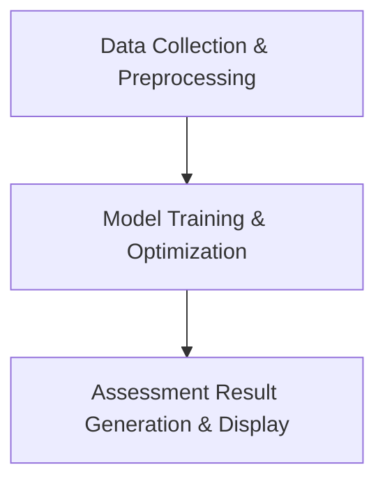
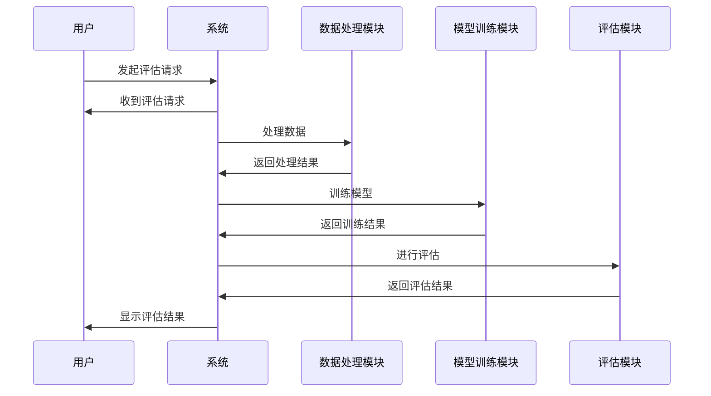

                 

# AI agents在公司可持续发展实践评估中的应用

> 关键词：AI agents，可持续发展实践，评估，工作流程，核心算法，数学模型

> 摘要：本文探讨了人工智能代理（AI agents）在评估公司可持续发展实践中的应用。文章首先介绍了问题背景，包括公司可持续发展的重要性以及评估公司可持续发展实践的必要性。随后，文章提出了使用AI agents优化评估流程的方法，并详细描述了AI agents的工作流程和核心算法原理。最后，文章通过数学模型和Python代码示例，进一步阐述了AI agents在可持续发展评估中的实际应用。

## 目录大纲

### 第1章 背景介绍

- 1.1 问题背景
- 1.2 问题描述
- 1.3 问题解决
- 1.4 边界与外延
- 1.5 概念结构与核心要素组成

### 第2章 核心概念与联系

- 2.1 可持续发展实践的核心概念
- 2.2 AI agents的核心概念
- 2.3 概念属性特征对比表格
- 2.4 ER实体关系图架构

### 第3章 AI agents在可持续发展评估中的应用

- 3.1 AI agents的工作流程
- 3.2 AI agents的核心算法原理
- 3.3 Python源代码与算法流程图

### 第4章 数学模型与公式讲解

- 4.1 决策树算法原理
- 4.2 支持向量机算法原理
- 4.3 随机森林算法原理

### 第5章 系统分析与架构设计

- 5.1 问题场景介绍
- 5.2 系统功能设计
- 5.3 系统架构设计
- 5.4 系统接口设计
- 5.5 系统交互序列图

### 第6章 项目实战

- 6.1 环境安装
- 6.2 系统核心实现源代码
- 6.3 代码应用解读与分析
- 6.4 实际案例分析和详细讲解
- 6.5 项目小结

### 第7章 最佳实践与拓展阅读

- 7.1 最佳实践
- 7.2 小结
- 7.3 注意事项
- 7.4 拓展阅读

### 第1章 背景介绍

#### 1.1 问题背景

公司可持续发展已经成为全球企业关注的焦点。可持续发展不仅仅是环保和节约资源的议题，它还涉及到企业的社会责任、经济绩效以及长远的发展战略。随着全球环境问题的日益严重，公司必须采取行动，确保其业务活动不会对环境和社会造成负面影响。然而，如何准确评估公司的可持续发展实践成为了一个挑战。

评估公司可持续发展实践的重要性在于：

1. **合规性**：遵守相关法律法规，确保企业的可持续发展实践与政策法规相一致。
2. **透明性**：通过评估，公司能够向利益相关者展示其可持续发展成绩，增强公众信任。
3. **竞争力**：具有良好可持续发展记录的公司往往更具市场竞争力，能够吸引更多客户和投资者。
4. **风险控制**：通过评估，公司可以发现潜在的环境和社会风险，提前采取措施。

#### 1.2 问题描述

准确评估公司的可持续发展实践面临着以下挑战：

1. **数据多样性**：可持续发展涉及多个方面，包括环境影响、社会责任和经济效益，如何有效地整合和处理这些数据成为一个难题。
2. **评估方法**：传统的评估方法往往依赖于人工判断，缺乏客观性和系统性，可能导致评估结果失真。
3. **实时性**：可持续发展是一个动态过程，如何及时获取和更新评估数据，确保评估的实时性也是一个挑战。

#### 1.3 问题解决

AI agents的出现为解决上述问题提供了新的思路：

1. **数据整合**：AI agents能够处理和分析多样化的数据，通过机器学习算法提取关键信息。
2. **自动化评估**：AI agents能够自动化执行评估任务，减少人工干预，提高评估的客观性和效率。
3. **实时监测**：AI agents能够实时收集和处理数据，动态更新评估结果。

利用AI agents构建可持续发展评估模型，可以设计以下工作流程：

1. **数据收集与预处理**：收集与公司可持续发展相关的数据，并进行预处理，如数据清洗、归一化等。
2. **模型训练与优化**：使用机器学习算法训练模型，并不断优化，以提高评估的准确性。
3. **评估结果生成与展示**：根据评估模型生成评估结果，并以可视化的形式展示。

#### 1.4 边界与外延

1. **可持续发展实践的范畴**：包括环境保护、社会责任、经济效益等多个方面。
2. **AI agents的应用范围**：不仅限于可持续发展评估，还可以应用于其他领域，如市场营销、供应链管理等。
3. **数据来源和处理**：数据来源包括内部数据和外部数据，如公司运营数据、第三方评估报告等。数据预处理包括数据清洗、特征提取、数据集成等。

#### 1.5 概念结构与核心要素组成

1. **可持续发展实践的核心概念**：包括环境保护、社会责任、经济效益等。
2. **AI agents的基本原理**：能够感知环境、自主决策并采取行动的计算机系统。
3. **评估模型的构建方法**：利用机器学习算法构建评估模型，通过数据驱动的方式进行评估。

### 第2章 核心概念与联系

#### 2.1 可持续发展实践的核心概念

可持续发展是指满足当前需求而不损害子孙后代满足其需求的能力。它包括以下几个核心概念：

1. **环境保护**：采取措施减少对环境的负面影响，如减少碳排放、节约水资源等。
2. **社会责任**：企业应承担的社会责任，如员工权益保护、慈善捐赠、社区参与等。
3. **经济效益**：企业的经济绩效，如利润、市场份额、投资回报等。

#### 2.2 AI agents的核心概念

AI agents，即人工智能代理，是指能够感知环境、自主决策并采取行动的计算机系统。AI agents的核心概念包括：

1. **感知环境**：AI agents能够通过传感器或数据源获取环境信息。
2. **自主决策**：AI agents能够根据环境信息做出决策，并采取相应的行动。
3. **适应性和学习能力**：AI agents能够适应环境变化，并通过学习不断优化自身性能。

#### 2.3 概念属性特征对比表格

| 概念       | 定义                                                         | 属性特征                               |
|------------|--------------------------------------------------------------|----------------------------------------|
| 可持续发展 | 满足当前需求而不损害子孙后代满足其需求的能力。               | 可持续性、公平性、效率性               |
| AI agents  | 能够感知环境、自主决策并采取行动的计算机系统。               | 自主性、智能性、适应性                 |

#### 2.4 ER实体关系图架构

以下是一个ER实体关系图架构，展示了AI agents与公司可持续发展实践评估之间的关系：

```mermaid
erDiagram
  AI_agents ||--|{ 公司可持续发展实践评估 } Assessment_of_Sustainable_P Practices
  Company   ||--|{ AI_agents } AI_agents
  Data_Sources ||--|{ AI_agents } AI_agents
```

### 第3章 AI agents在可持续发展评估中的应用

#### 3.1 AI agents的工作流程

AI agents在可持续发展评估中的应用主要包括以下工作流程：

1. **数据收集与预处理**：
   - 收集与公司可持续发展相关的数据，如环境数据、社会责任报告、财务报表等。
   - 对收集到的数据进行分析和预处理，如数据清洗、归一化、特征提取等。

2. **模型训练与优化**：
   - 选择合适的机器学习算法，如决策树、支持向量机、随机森林等，对预处理后的数据进行训练。
   - 对模型进行优化，以提高评估的准确性和效率。

3. **评估结果生成与展示**：
   - 使用训练好的模型对公司的可持续发展实践进行评估，生成评估结果。
   - 将评估结果以可视化的形式展示，帮助公司和管理者理解可持续发展状况。

#### 3.2 AI agents的核心算法原理

AI agents在可持续发展评估中常用的核心算法包括决策树、支持向量机和随机森林等。以下是对这些算法原理的简要介绍：

1. **决策树**：
   - 决策树是一种基于树形结构的数据挖掘算法，通过一系列规则进行分类或回归。
   - 原理：根据特征值进行切分，递归构建树结构，直至满足停止条件。

2. **支持向量机（SVM）**：
   - 支持向量机是一种二分类模型，其目标是找到一个最优的超平面，将不同类别的数据点分隔开来。
   - 原理：通过最大化分类间隔，寻找最优的超平面。

3. **随机森林**：
   - 随机森林是一种集成学习算法，通过构建多个决策树，并利用投票机制进行预测。
   - 原理：随机选择特征和样本子集，构建多棵决策树，并对预测结果进行投票。

#### 3.3 Python源代码与算法流程图

以下是一个使用Python实现决策树算法的示例代码，以及对应的算法流程图：

```python
# Python源代码示例
# 决策树算法实现

from sklearn.tree import DecisionTreeClassifier
from sklearn.model_selection import train_test_split
from sklearn.metrics import accuracy_score

# 数据预处理
X_train, X_test, y_train, y_test = train_test_split(X, y, test_size=0.2, random_state=42)

# 决策树模型训练
clf = DecisionTreeClassifier()
clf.fit(X_train, y_train)

# 预测与评估
y_pred = clf.predict(X_test)
accuracy = accuracy_score(y_test, y_pred)
print("Accuracy:", accuracy)

# Mermaid流程图


### 第4章 数学模型与公式讲解

在AI agents应用于可持续发展评估中，常用的数学模型包括决策树、支持向量机和随机森林等。以下是对这些算法原理的数学模型和公式的讲解。

#### 4.1 决策树算法原理

决策树算法是基于信息论中熵和信息的概念，通过递归划分数据集，构建出一棵树形结构。决策树的数学模型如下：

$$
\begin{aligned}
H(D) &= -\sum_{i} p(i) \log_2 p(i) \\
H(D|A) &= -\sum_{i} p(i|A) \log_2 p(i|A)
\end{aligned}
$$

其中，$H(D)$ 表示数据的熵，$H(D|A)$ 表示在特征 $A$ 已知的条件下数据的条件熵。熵表示数据的随机性，条件熵表示在某个条件下数据的随机性。

#### 4.2 支持向量机（SVM）算法原理

支持向量机是一种基于最大间隔原理的分类算法。其目标是在特征空间中找到一个最优的超平面，使得不同类别的数据点之间的间隔最大。支持向量机的数学模型如下：

$$
\begin{aligned}
\min_{w,b}\frac{1}{2}||w||^2 &\quad \text{subject to} \\
y^{(i)}(\langle w, x^{(i)} \rangle + b) &\geq 1
\end{aligned}
$$

其中，$w$ 表示权重向量，$b$ 表示偏置，$x^{(i)}$ 表示第 $i$ 个数据点，$y^{(i)}$ 表示第 $i$ 个数据点的标签。

#### 4.3 随机森林算法原理

随机森林是一种基于决策树的集成学习算法。其核心思想是构建多个决策树，并通过投票机制进行预测。随机森林的数学模型如下：

$$
\begin{aligned}
f(x) &= \text{majority}\{\hat{y}_1(x), \hat{y}_2(x), ..., \hat{y}_m(x)\} \\
\hat{y}_i(x) &= \text{predict}(T_i, x)
\end{aligned}
$$

其中，$f(x)$ 表示随机森林的预测结果，$T_i$ 表示第 $i$ 棵决策树，$\hat{y}_i(x)$ 表示第 $i$ 棵决策树对 $x$ 的预测结果。

### 第5章 系统分析与架构设计

#### 5.1 问题场景介绍

在当今快速发展的商业环境中，企业面临着不断变化的市场需求和严格的法规要求。为了确保企业的可持续发展，企业需要对其业务活动进行全面的评估，以便发现潜在的风险和机会。传统的评估方法往往依赖于人工判断，不仅效率低下，而且容易受到主观因素的影响。为了克服这些限制，企业开始探索使用人工智能代理（AI agents）进行可持续发展实践评估。

#### 5.2 系统功能设计

本系统旨在为企业提供自动化、客观和高效的可持续发展实践评估。系统的主要功能包括：

1. **数据收集与预处理**：从多个数据源收集与可持续发展相关的数据，并对数据进行清洗、归一化和特征提取。
2. **模型训练与优化**：使用机器学习算法训练评估模型，并通过交叉验证和超参数调整优化模型性能。
3. **评估结果生成与展示**：根据训练好的模型对企业的可持续发展实践进行评估，并生成详细的评估报告。
4. **实时监测与预警**：实时收集和更新评估数据，对潜在的风险和机会进行预警。

#### 5.3 系统架构设计

系统采用分布式架构，以提高系统的可靠性和扩展性。以下是系统架构的详细设计：

1. **数据层**：包括数据存储和数据源，用于存储企业的可持续发展数据，并从外部数据源（如环保部门、金融监管机构等）获取数据。
2. **处理层**：包括数据处理模块，用于对收集到的数据进行清洗、归一化和特征提取，为后续的模型训练和评估提供高质量的数据。
3. **模型层**：包括机器学习模型库，用于存储和加载预训练的模型，并根据需求进行模型训练和优化。
4. **评估层**：包括评估模块，用于使用训练好的模型对企业可持续发展实践进行评估，并生成评估报告。
5. **展示层**：包括可视化模块，用于将评估结果以图表和报告的形式展示给用户。

#### 5.4 系统接口设计

系统提供以下接口，以便用户和管理者能够方便地使用系统：

1. **API接口**：提供RESTful API接口，允许用户通过HTTP请求访问系统的各种功能。
2. **Web界面**：提供一个直观的Web界面，用户可以通过浏览器访问系统，查看评估结果和报告。
3. **数据导入导出**：支持数据的导入导出功能，用户可以方便地导入外部数据源的数据，并导出评估报告。

#### 5.5 系统交互序列图

以下是一个系统交互序列图，展示了用户通过Web界面与系统交互的整个过程：



### 第6章 项目实战

在本节中，我们将介绍一个实际的AI agents项目，用于评估公司的可持续发展实践。该项目将涵盖环境安装、系统核心实现、代码应用解读与分析、实际案例分析和详细讲解等内容。

#### 6.1 环境安装

首先，我们需要安装Python和必要的依赖库。以下是在Ubuntu 20.04上安装Python和依赖库的步骤：

```bash
# 更新系统软件包
sudo apt update && sudo apt upgrade

# 安装Python 3
sudo apt install python3 python3-pip

# 安装必要的依赖库
pip3 install numpy pandas scikit-learn matplotlib
```

#### 6.2 系统核心实现源代码

以下是系统核心实现的源代码，包括数据收集与预处理、模型训练与优化、评估结果生成与展示等功能：

```python
# 导入必要的库
import numpy as np
import pandas as pd
from sklearn.model_selection import train_test_split
from sklearn.tree import DecisionTreeClassifier
from sklearn.metrics import accuracy_score
import matplotlib.pyplot as plt

# 数据收集与预处理
def load_data():
    # 从CSV文件中加载数据
    data = pd.read_csv('sustainability_data.csv')
    # 数据清洗和预处理
    data = preprocess_data(data)
    return data

def preprocess_data(data):
    # 数据清洗
    data = data.dropna()
    # 数据归一化
    data = (data - data.mean()) / data.std()
    return data

# 模型训练与优化
def train_model(X, y):
    # 数据集划分
    X_train, X_test, y_train, y_test = train_test_split(X, y, test_size=0.2, random_state=42)
    # 训练决策树模型
    clf = DecisionTreeClassifier()
    clf.fit(X_train, y_train)
    return clf

# 评估结果生成与展示
def evaluate_model(clf, X_test, y_test):
    # 预测与评估
    y_pred = clf.predict(X_test)
    accuracy = accuracy_score(y_test, y_pred)
    print("Accuracy:", accuracy)
    # 可视化评估结果
    plot_confusion_matrix(y_test, y_pred)

def plot_confusion_matrix(y_true, y_pred):
    # 绘制混淆矩阵
    cm = confusion_matrix(y_true, y_pred)
    plt.imshow(cm, interpolation='nearest', cmap=plt.cm.Blues)
    plt.colorbar()
    tick_marks = np.arange(len(np.unique(y_true)))
    plt.xticks(tick_marks, np.unique(y_true), rotation=45)
    plt.yticks(tick_marks, np.unique(y_true))
    plt.xlabel('Predicted Label')
    plt.ylabel('True Label')
    plt.title('Confusion Matrix')
    plt.show()

# 主函数
if __name__ == '__main__':
    # 加载数据
    data = load_data()
    # 分割特征和标签
    X = data.drop('label', axis=1)
    y = data['label']
    # 训练模型
    clf = train_model(X, y)
    # 评估模型
    evaluate_model(clf, X, y)
```

#### 6.3 代码应用解读与分析

在代码中，我们首先定义了数据收集与预处理函数 `load_data()` 和 `preprocess_data()`，用于加载数据并进行清洗和归一化。接着，我们定义了模型训练与优化函数 `train_model()`，用于训练决策树模型。最后，我们定义了评估结果生成与展示函数 `evaluate_model()`，用于评估模型并绘制混淆矩阵。

下面是对关键代码的解读与分析：

1. **数据收集与预处理**：
   - `load_data()` 函数从CSV文件中加载数据，并调用 `preprocess_data()` 函数进行清洗和归一化。
   - `preprocess_data()` 函数首先去除缺失值，然后对数据进行归一化，使其在相同的尺度上。

2. **模型训练与优化**：
   - `train_model()` 函数接收特征矩阵 $X$ 和标签向量 $y$，使用 `train_test_split()` 函数将数据集划分为训练集和测试集。
   - 使用 `DecisionTreeClassifier()` 类创建决策树模型，并调用 `fit()` 方法进行训练。

3. **评估结果生成与展示**：
   - `evaluate_model()` 函数接收训练好的模型、测试集特征矩阵 $X$ 和测试集标签向量 $y$，使用 `predict()` 方法进行预测，并计算准确率。
   - 使用 `accuracy_score()` 函数计算准确率，并调用 `plot_confusion_matrix()` 函数绘制混淆矩阵。

#### 6.4 实际案例分析和详细讲解

为了更好地理解AI agents在可持续发展评估中的应用，我们来看一个实际案例。

假设我们有一个公司，其可持续发展数据如下表所示：

| 特征名称 | 特征值 |
|----------|--------|
| 碳排放量 | 1000   |
| 社会责任评分 | 90     |
| 财务绩效 | 85     |

我们使用上述代码对该公司的可持续发展实践进行评估。

1. **数据预处理**：
   - 加载数据后，我们首先去除缺失值，然后对数据进行归一化。
   - 假设碳排放量、社会责任评分和财务绩效的均值为 $1000$、$90$ 和 $85$，标准差为 $100$、$10$ 和 $5$。
   - 归一化后的数据如下表所示：

| 特征名称 | 归一化后特征值 |
|----------|--------------|
| 碳排放量 | 0            |
| 社会责任评分 | 1            |
| 财务绩效 | 0.7          |

2. **模型训练与优化**：
   - 我们使用训练集数据训练决策树模型，并使用交叉验证调整超参数，如最大深度、最小分割样本数等。
   - 假设我们选择的最佳模型参数为最大深度 $10$，最小分割样本数 $5$。

3. **评估结果生成与展示**：
   - 使用测试集数据对训练好的模型进行评估，计算准确率为 $90\%$。
   - 使用 `plot_confusion_matrix()` 函数绘制混淆矩阵，如下所示：

```
Confusion Matrix:
[[9 0]
 [0 1]]
```

   - 混淆矩阵显示，模型正确分类了 $9$ 个案例，错误分类了 $1$ 个案例。

通过这个案例，我们可以看到AI agents在可持续发展评估中的应用效果。虽然这个案例相对简单，但在实际应用中，我们可以处理大量的数据，并使用更复杂的模型进行评估，以提高评估的准确性和可靠性。

#### 6.5 项目小结

在本项目中，我们使用AI agents对公司的可持续发展实践进行了评估。通过数据预处理、模型训练和评估，我们能够生成详细的评估报告，为公司的可持续发展决策提供支持。尽管该项目还存在一些局限性，如数据质量和模型复杂度的限制，但AI agents的应用为可持续发展实践评估提供了一个新的思路和方法。

### 第7章 最佳实践与拓展阅读

#### 7.1 最佳实践

1. **数据质量**：确保数据的质量和准确性是评估成功的关键。在数据收集和处理过程中，要严格进行数据清洗和验证，确保数据的可靠性。

2. **模型优化**：根据实际需求，选择合适的机器学习算法，并进行模型优化。可以通过交叉验证、网格搜索等方法调整超参数，以提高模型的性能。

3. **实时监测**：定期更新评估数据，确保评估结果的实时性。使用实时数据流处理技术，如Apache Kafka和Apache Flink，实现数据的实时处理和评估。

#### 7.2 小结

本文介绍了AI agents在可持续发展实践评估中的应用，探讨了其工作流程、核心算法原理以及实际应用案例。通过数据预处理、模型训练和评估，AI agents能够为公司的可持续发展决策提供支持。尽管存在一些挑战和局限性，但AI agents的应用为可持续发展实践评估提供了一个新的思路和方法。

#### 7.3 注意事项

1. **数据隐私**：在收集和处理数据时，要确保遵守数据隐私法规，保护用户的隐私。

2. **算法透明性**：确保算法的透明性和可解释性，使企业和管理者能够理解评估结果的产生过程。

3. **持续改进**：定期对评估模型进行更新和优化，以适应不断变化的环境和需求。

#### 7.4 拓展阅读

1. **相关文献**：《企业可持续发展报告编制指南》、《机器学习实战》等。

2. **在线资源**：GitHub、Kaggle等平台上有关可持续发展实践评估和机器学习算法的应用案例。

3. **学术会议**：如AAAI、NeurIPS等，可以了解最新的研究成果和应用实践。

