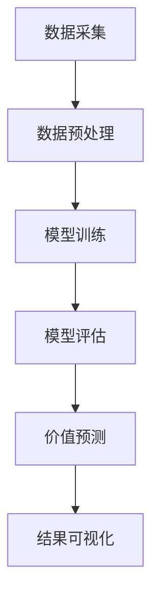

                 

### 1.1 无形资产的定义与分类

#### 什么是无形资产？

无形资产是指企业拥有或控制的、没有实物形态的资产。与有形资产（如房产、设备、现金等）不同，无形资产没有具体的物理存在，但它们对公司的发展和盈利能力具有深远的影响。无形资产包括但不限于以下几类：

1. **品牌和声誉**：品牌的知名度和忠诚度可以为企业带来持续的利润。
2. **专利和知识产权**：专利和商标保护了企业的技术或创意，使得这些资产具有独特性和排他性。
3. **客户关系和数据库**：客户数据库和关系网络是企业长期发展的基石。
4. **技术秘密和知识资产**：包括内部研发的知识、算法、流程和方法。
5. **员工技能和经验**：高素质的员工团队是企业竞争力的关键。

#### 无形资产的价值评估

无形资产的价值评估是财务管理和企业估值中的一项重要任务。传统方法主要包括以下几种：

1. **市场法**：通过市场交易价格进行估值，适用于有类似资产的市场比较。
2. **收益法**：基于预期收益进行估值，适用于品牌、专利等具有长期盈利能力的资产。
3. **成本法**：根据重置成本或重置价值进行估值，适用于技术秘密等成本易于计量的资产。

尽管传统方法有其适用性，但在现代商业环境中，无形资产的价值评估面临着诸多挑战：

- **评估方法的不完善**：传统方法难以全面衡量无形资产的价值。
- **数据获取的困难**：无形资产往往缺乏明确的财务数据和交易记录。
- **动态变化的特性**：无形资产的价值具有高度的不稳定性和动态变化性。

#### AI agents的介入

为了解决这些问题，AI agents（人工智能代理）的应用为无形资产价值评估带来了新的机遇。AI agents是一类自主执行任务、具备学习和推理能力的计算机程序，它们在无形资产评估中的应用主要体现在以下几个方面：

1. **数据分析和挖掘**：AI agents能够从大量非结构化和半结构化数据中提取有价值的信息，提高评估数据的准确性和完整性。
2. **模式识别和预测**：通过机器学习和深度学习算法，AI agents能够识别资产的价值模式和趋势，提供更为精确的评估结果。
3. **自动评估和优化**：AI agents可以自动化评估过程，减少人为错误，提高评估效率。

### 总结

无形资产是企业核心竞争力的重要组成部分，但其价值评估面临诸多挑战。AI agents的引入为这些问题提供了新的解决方案，通过数据分析和模式识别，AI agents能够更准确地评估无形资产的价值，为企业决策提供有力支持。

### 1.2 无形资产价值评估的传统方法

#### 市场法

市场法是一种基于市场上类似无形资产交易价格进行估值的传统方法。其基本思路是通过收集市场上同类无形资产的交易数据，分析其价格和交易条件，从而推算出被评估无形资产的价值。市场法的优点在于其直观性和实用性，能够为投资者提供相对可靠的市场参考。然而，市场法也面临着一些局限性：

- **数据稀缺性**：许多无形资产如品牌、专利和客户关系等缺乏明确的市场交易记录。
- **市场波动性**：市场环境变化可能导致交易价格无法准确反映资产的真实价值。
- **可比性问题**：寻找与被评估资产完全相同的参照物非常困难。

#### 收益法

收益法是一种基于预期收益进行估值的传统方法。其基本原理是预测无形资产在未来所能产生的收益，然后将其折现到现值。收益法的核心在于确定资产的预期收益和适当的折现率。收益法的主要步骤包括：

1. **预测未来收益**：根据无形资产的历史数据和市场趋势，预测其在未来一段时间内能够带来的收益。
2. **确定折现率**：考虑风险、通货膨胀等因素，确定一个合适的折现率。
3. **计算现值**：将预期收益按照折现率折现到现值，得出无形资产的价值。

收益法的优点在于其考虑了无形资产的未来收益，从而更全面地评估其价值。然而，收益法也存在一些缺点：

- **预测准确性**：对未来收益的预测存在很大的不确定性，可能导致评估结果不准确。
- **折现率选择**：折现率的确定依赖于主观判断和市场环境，容易受到人为因素影响。

#### 成本法

成本法是一种基于重置成本或重置价值进行估值的传统方法。其基本思路是计算重建或替换无形资产所需的成本，从而确定其价值。成本法适用于技术秘密、软件等成本易于计量的无形资产。成本法的主要步骤包括：

1. **估算重置成本**：根据当前市场条件和资产的技术状态，估算重建或替换无形资产所需的成本。
2. **考虑折旧因素**：无形资产通常具有较长的使用寿命，因此需要考虑折旧因素。
3. **计算现值**：将估算的重置成本按照折现率折现到现值，得出无形资产的价值。

成本法的优点在于其相对客观和可操作性，但缺点在于其忽视了无形资产的潜在价值和未来收益。

### AI agents与传统方法的比较

AI agents在无形资产价值评估中的应用，不仅弥补了传统方法的不足，还带来了一系列新的优势：

- **数据驱动的评估**：AI agents能够利用大数据和机器学习算法，从海量数据中提取有价值的信息，提供更为精准的评估结果。
- **自动化评估过程**：AI agents能够自动化评估流程，减少人为干预，提高评估效率和准确性。
- **动态评估能力**：AI agents能够实时更新和调整评估模型，适应市场变化和资产价值波动。

尽管AI agents具有诸多优势，但其在无形资产价值评估中的应用仍需与传统方法相结合，以充分发挥其潜力。通过数据驱动的评估、自动化流程和动态调整能力，AI agents有望为无形资产价值评估带来革命性的变革。

### 1.3 AI agents在现代评估中的应用

#### 1.3.1 数据采集与处理

AI agents在现代评估中的应用首先依赖于高质量的数据采集和处理。传统的数据采集方式通常局限于财务报表、市场报告和内部数据等，而AI agents可以通过互联网爬虫、传感器网络和社交媒体等渠道，获取更多样化和实时性的数据。

- **互联网爬虫**：利用AI agents爬取电商网站、社交媒体和行业报告等平台，收集与无形资产相关的用户评论、交易记录和品牌信息等。
- **传感器网络**：通过传感器收集客户行为数据、设备使用数据和地理位置数据等，为评估提供详细的基础信息。
- **社交媒体分析**：分析用户在社交媒体上的讨论和互动，了解品牌声誉和消费者偏好。

在数据采集后，AI agents还需要对数据进行处理和清洗，包括数据去重、异常值处理和数据格式转换等。通过这些预处理步骤，确保数据的质量和一致性，为后续的分析提供可靠的基础。

#### 1.3.2 机器学习算法的应用

AI agents在无形资产价值评估中的核心在于机器学习算法的应用。机器学习算法可以从大量数据中自动发现模式和规律，为评估提供科学依据。

- **回归分析**：通过回归模型预测无形资产的价值。例如，可以建立品牌价值与市场占有率、广告投入等变量之间的关系模型，预测品牌价值的未来走势。
- **聚类分析**：将相似的无形资产归为一类，便于比较和评估。例如，可以根据品牌的市场表现、品牌知名度等特征，将不同品牌划分为不同的聚类组，评估其相对价值。
- **神经网络**：利用深度学习算法构建复杂非线性关系模型。例如，可以使用卷积神经网络（CNN）处理图像数据，评估专利的视觉吸引力；使用循环神经网络（RNN）分析文本数据，评估技术秘密的创新性。

#### 1.3.3 模式识别与预测

AI agents不仅能够从数据中提取信息，还能进行模式识别和预测，为无形资产价值评估提供前瞻性指导。

- **模式识别**：通过分析历史数据和市场趋势，AI agents可以识别无形资产的价值模式和影响因素。例如，通过分析过去的品牌价值变化和行业趋势，预测未来品牌价值的波动。
- **预测模型**：基于机器学习算法，AI agents可以构建预测模型，预测无形资产的未来价值。例如，利用时间序列分析模型，预测客户数据库的潜在价值。

#### 1.3.4 自动评估与动态调整

AI agents的应用不仅提高了无形资产评估的效率和准确性，还实现了评估过程的自动化和动态调整。

- **自动化评估**：AI agents可以自动化完成数据采集、处理、分析和评估等步骤，减少人工干预，提高评估效率。
- **动态调整**：AI agents能够根据市场环境和资产价值的实时变化，动态调整评估模型和参数，提供实时、准确的评估结果。例如，当市场环境发生重大变化时，AI agents可以快速调整评估模型，重新评估无形资产的价值。

### 总结

AI agents在现代无形资产价值评估中的应用，通过数据采集与处理、机器学习算法、模式识别与预测以及自动化评估与动态调整，为传统评估方法带来了革命性的变化。AI agents不仅提高了评估的效率和准确性，还为评估过程提供了前瞻性和灵活性，为企业和投资者提供了更为可靠和科学的评估依据。然而，AI agents的应用也面临着数据质量、算法模型和伦理规范等方面的挑战，需要进一步的研究和实践。

## 第2章: AI agents概述

### 2.1 AI agents的定义与特点

AI agents，即人工智能代理，是一种能够自主执行任务、具备学习和推理能力的计算机程序。它们模拟人类的思维和行为，能够根据环境和目标自主决策，并在执行任务过程中不断学习和优化自身性能。AI agents的定义和特点可以从以下几个方面进行阐述：

#### 2.1.1 自主决策

AI agents的核心特点之一是自主决策能力。这意味着它们可以独立地做出决策，而不需要人类的直接干预。AI agents通过内置的算法和模型，对环境中的信息进行分析和处理，然后根据预设的目标或学习到的经验做出最优决策。例如，自动驾驶汽车中的AI agent需要实时分析路况、预测行人行为并做出驾驶决策，以确保车辆的安全行驶。

#### 2.1.2 学习能力

AI agents具备学习能力，这是它们能够不断提升自身性能的关键。通过机器学习和深度学习算法，AI agents可以从大量数据中自动提取模式和规律，并在执行任务的过程中不断优化自身的行为。这种学习能力使得AI agents能够适应动态变化的环境，并不断提高任务执行的效率和准确性。例如，聊天机器人通过学习用户的提问和回答，能够提供更为个性化和准确的回复。

#### 2.1.3 推理能力

AI agents不仅能够进行简单的数据处理和模式识别，还具备推理能力。通过逻辑推理和符号计算，AI agents可以解决复杂的问题，并生成新的知识和结论。这种推理能力使得AI agents能够执行更为复杂的任务，如智能问答系统、自动驾驶和智能医疗诊断等。例如，智能问答系统可以使用自然语言处理和推理算法，理解用户的问题并给出准确的答案。

#### 2.1.4 适应性

AI agents能够适应不同的环境和任务，这是其应用广泛的重要原因之一。通过模块化和灵活的设计，AI agents可以轻松地适应各种场景和需求。例如，AI agents可以被应用于客服、物流、金融和医疗等多个领域，实现个性化服务、优化流程和提高效率。

### 2.2 AI agents的分类与应用场景

AI agents可以根据其功能、目的和应用场景进行分类。以下是几种常见的AI agents分类及其应用场景：

#### 2.2.1 基于任务的AI agents

基于任务的AI agents专注于完成特定的任务，如数据分析、文本处理和图像识别等。这些AI agents通常具备特定的技能和知识，能够在特定领域内提供高效和准确的服务。

- **应用场景**：基于任务的AI agents广泛应用于客服机器人、自动化交易系统和图像识别系统等。例如，客服机器人可以使用自然语言处理技术，自动回复用户的问题；自动化交易系统可以使用机器学习算法，实时分析市场数据并做出交易决策。

#### 2.2.2 基于情境的AI agents

基于情境的AI agents能够根据环境中的变化和用户的需求，动态调整自身的行为和决策。这些AI agents通常具备情境感知能力，能够理解和适应复杂的环境。

- **应用场景**：基于情境的AI agents广泛应用于智能家居、智能城市和智能交通系统等。例如，智能家居系统可以通过感知用户的行为和习惯，自动调整家中的灯光、温度和音乐等；智能交通系统可以通过感知路况和车辆信息，优化交通流量和提高交通安全。

#### 2.2.3 基于群体的AI agents

基于群体的AI agents通过多个个体之间的协作和交互，共同完成复杂任务。这些AI agents通常具备社会智能和协作能力，能够在群体环境中实现资源优化和任务协同。

- **应用场景**：基于群体的AI agents广泛应用于群体智能系统、机器人编队和协同作业系统等。例如，机器人编队可以通过协作和交互，完成复杂的生产任务和搜索救援任务；协同作业系统可以通过多个AI代理的协作，提高生产效率和降低成本。

#### 2.2.4 基于情感的AI agents

基于情感的AI agents能够理解和模拟人类情感，提供情感化和个性化服务。这些AI agents通常结合了自然语言处理、情感计算和机器学习技术。

- **应用场景**：基于情感的AI agents广泛应用于客户服务、娱乐和教育等领域。例如，客户服务机器人可以通过情感识别技术，理解用户的情感状态并给予相应的情感回应；教育系统可以通过情感计算，为不同情感状态的学生提供个性化的学习支持和指导。

### 总结

AI agents作为人工智能的重要应用形式，具备自主决策、学习能力和推理能力等特点，能够适应不同的环境和任务。根据其功能和应用场景，AI agents可以分为基于任务的、基于情境的、基于群体的和基于情感的等不同类型。AI agents在现代评估中的应用，为无形资产评估提供了新的工具和方法，使得评估过程更加高效、精准和动态。

### 2.3 AI agents的发展历程

#### 2.3.1 早期阶段

AI agents的概念起源于20世纪50年代，随着人工智能（AI）技术的发展而逐渐成形。早期的AI agents主要以逻辑推理和符号计算为基础，旨在模拟人类的推理过程。代表性工作包括John McCarthy等人提出的逻辑编程和知识表示方法。1956年，达特茅斯会议上提出了“人工智能”这一术语，标志着AI研究正式起步。

在这一阶段，AI agents的应用主要集中在专家系统和规则引擎上。专家系统通过预定义的规则库，模拟专家的决策过程，解决特定领域的问题。例如，Dendral系统是一个用于化学分析的问题求解系统，通过推理和计算，帮助化学家识别复杂的化学物质。

#### 2.3.2 机器学习时代的崛起

随着计算机性能的提升和大数据时代的到来，机器学习技术逐渐成为AI研究的主流。20世纪80年代，机器学习方法，如决策树、支持向量机和神经网络，开始应用于AI agents的构建。这些方法使得AI agents能够从大量数据中自动学习和优化，不再依赖于人为定义的规则。

在这一阶段，AI agents的发展进入了新的阶段，例如，逆向推理和规划问题的解决变得更加高效和准确。1997年，IBM的Deep Blue在象棋比赛中击败了世界冠军Gary Kasparov，标志着机器学习在复杂任务中的应用取得了重大突破。

#### 2.3.3 深度学习时代的繁荣

21世纪初，深度学习技术的突破使得AI agents的发展进入了一个新的繁荣时期。深度神经网络通过多层非线性变换，能够自动学习和提取数据中的复杂特征，大大提高了AI agents的性能和效率。

2012年，AlexNet在ImageNet图像识别挑战赛上取得了惊人的成绩，深度学习在计算机视觉领域得到了广泛应用。此后，深度学习技术迅速扩展到自然语言处理、语音识别和强化学习等多个领域，AI agents的能力得到了全面提升。

#### 2.3.4 现代AI agents的发展趋势

当前，AI agents的发展趋势主要体现在以下几个方面：

1. **跨领域融合**：不同领域的AI技术相互融合，形成更加复杂和智能的AI系统。例如，结合自然语言处理和计算机视觉，可以构建出具备多模态感知能力的AI agents。

2. **增强学习**：增强学习作为一种重要的机器学习方法，通过不断尝试和反馈，使AI agents能够在复杂环境中找到最优策略。例如，AlphaGo通过增强学习，在围棋比赛中战胜了人类顶尖选手。

3. **边缘计算**：随着物联网（IoT）和边缘计算的兴起，AI agents开始向边缘设备迁移，实现实时和高效的任务执行。例如，智能音箱和智能摄像头中的AI代理，可以本地处理语音和视频数据，提高系统的响应速度和隐私保护。

4. **伦理与规范**：随着AI技术的广泛应用，伦理和规范问题逐渐成为研究热点。如何确保AI agents的行为符合伦理标准，如何防止AI代理的滥用和错误决策，成为现代AI研究的重要课题。

### 总结

AI agents的发展历程从早期的逻辑推理到机器学习的崛起，再到深度学习时代的繁荣，经历了多个阶段。现代AI agents在跨领域融合、增强学习、边缘计算和伦理规范等方面展现出新的发展趋势，为各种复杂任务提供了更加高效和智能的解决方案。

## 第3章: 无形资产价值评估中的AI算法

### 3.1 算法原理介绍

在无形资产价值评估中，AI算法的引入使得评估过程更加精确和高效。本节将介绍几种常见的AI算法，并探讨它们在评估过程中的应用原理。

#### 3.1.1 机器学习算法

机器学习算法是AI的重要组成部分，通过训练数据集，使计算机自动学习和识别数据中的模式和规律。在无形资产价值评估中，常用的机器学习算法包括回归分析、决策树、随机森林和神经网络等。

1. **回归分析**：回归分析是一种用于预测连续值变量的统计方法。在无形资产价值评估中，可以通过建立品牌价值与市场占有率、广告投入等变量之间的回归模型，预测品牌价值的未来趋势。

2. **决策树**：决策树是一种基于树形结构进行决策的方法。它通过一系列条件判断，将数据划分为多个子集，并最终输出一个预测结果。在无形资产评估中，决策树可以用于分析影响无形资产价值的各种因素，并确定其对评估结果的影响程度。

3. **随机森林**：随机森林是一种基于决策树的集成学习方法。它通过构建多个决策树，并对它们的预测结果进行平均，提高模型的预测准确性和稳定性。在无形资产评估中，随机森林可以用于处理大量复杂的数据，并提高评估的准确性。

4. **神经网络**：神经网络是一种模拟人脑神经元连接结构的计算模型。通过多层神经元的非线性变换，神经网络可以从大量数据中自动提取特征和模式。在无形资产评估中，神经网络可以用于处理高维数据，并实现复杂非线性关系的建模。

#### 3.1.2 深度学习算法

深度学习算法是机器学习的一个子领域，通过多层神经网络，从大量数据中自动提取复杂的特征和模式。在无形资产价值评估中，常用的深度学习算法包括卷积神经网络（CNN）、循环神经网络（RNN）和长短期记忆网络（LSTM）等。

1. **卷积神经网络（CNN）**：卷积神经网络是一种专门用于处理图像数据的深度学习模型。通过卷积操作和池化操作，CNN可以从图像中提取局部特征和全局特征，实现对图像的识别和分类。在无形资产评估中，CNN可以用于处理品牌标识、商标和专利等图像数据，提取有价值的信息。

2. **循环神经网络（RNN）**：循环神经网络是一种用于处理序列数据的深度学习模型。通过循环机制，RNN可以保存先前的信息，实现对序列数据的长期依赖建模。在无形资产评估中，RNN可以用于处理时间序列数据，如客户购买行为、市场趋势等，预测无形资产的未来价值。

3. **长短期记忆网络（LSTM）**：长短期记忆网络是一种改进的循环神经网络，通过引入记忆单元和门控机制，LSTM可以更好地处理长序列数据。在无形资产评估中，LSTM可以用于处理客户关系、技术秘密等长期依赖数据，预测无形资产的价值。

### 3.2 机器学习算法在评估中的应用

#### 3.2.1 数据预处理

在应用机器学习算法进行无形资产价值评估之前，需要进行数据预处理。数据预处理包括数据清洗、特征提取和归一化等步骤。

1. **数据清洗**：去除数据中的噪声和异常值，保证数据质量。
2. **特征提取**：从原始数据中提取对评估有意义的特征，如品牌知名度、市场份额、研发投入等。
3. **归一化**：将不同特征的数据进行归一化处理，使它们具有相同的量纲，便于模型训练。

#### 3.2.2 模型训练与验证

在数据预处理完成后，可以使用机器学习算法对模型进行训练和验证。

1. **模型训练**：使用训练数据集，通过优化算法（如梯度下降）调整模型的参数，使模型在训练数据上达到最佳性能。
2. **模型验证**：使用验证数据集，评估模型在未见过的数据上的表现，调整模型参数和结构，提高模型的泛化能力。

#### 3.2.3 模型应用

在模型验证完成后，可以将模型应用于实际的无形资产价值评估。

1. **输入特征**：输入评估所需的特征数据，如品牌知名度、市场份额等。
2. **模型预测**：使用训练好的模型，对输入特征进行预测，得到无形资产的价值估计。

### 3.3 深度学习算法的运用

深度学习算法在无形资产价值评估中具有广泛的应用，可以处理高维数据和复杂非线性关系。以下是一个简单的深度学习模型实现过程：

#### 3.3.1 数据预处理

1. **数据收集**：收集与无形资产相关的数据，如品牌标识图像、客户关系数据等。
2. **数据清洗**：去除噪声和异常值，保证数据质量。

#### 3.3.2 模型构建

1. **数据输入**：定义输入层，包括图像、文本和序列数据等。
2. **卷积层**：使用卷积神经网络提取图像特征或文本特征。
3. **池化层**：通过池化操作减少数据维度。
4. **全连接层**：将提取的特征进行融合，输出预测结果。

#### 3.3.3 模型训练

1. **损失函数**：定义损失函数，如均方误差（MSE）或交叉熵损失。
2. **优化算法**：选择优化算法，如Adam优化器。
3. **训练与验证**：通过训练数据集和验证数据集，调整模型参数和结构，优化模型性能。

#### 3.3.4 模型应用

1. **输入特征**：输入待评估的无形资产特征数据。
2. **模型预测**：使用训练好的模型，对输入特征进行预测，得到无形资产的价值估计。

### 总结

AI算法在无形资产价值评估中发挥着重要作用。通过机器学习和深度学习算法，可以自动提取数据中的模式和规律，实现高效和准确的评估。本节介绍了机器学习算法（如回归分析、决策树、随机森林和神经网络）和深度学习算法（如CNN、RNN和LSTM）在评估中的应用原理，并给出了模型构建和应用的示例。通过这些算法，AI agents能够为无形资产的价值评估提供强大的技术支持。

## 第4章: 数学模型与公式

### 4.1 基本数学模型

在无形资产价值评估中，数学模型是核心工具之一。通过数学模型，我们可以将无形资产的价值评估问题转化为可计算的形式，从而更精确地进行评估。以下是一个基本的无形资产价值评估数学模型。

#### 4.1.1 回归分析模型

回归分析模型是一种常用的统计方法，用于预测因变量（无形资产价值）与自变量（如品牌知名度、市场份额、研发投入等）之间的关系。假设我们使用线性回归模型来预测品牌价值：

$$
V = \beta_0 + \beta_1 \times N + \beta_2 \times M + \beta_3 \times R
$$

其中：
- \( V \) 是品牌价值（因变量）。
- \( N \) 是品牌知名度（自变量）。
- \( M \) 是市场份额（自变量）。
- \( R \) 是研发投入（自变量）。
- \( \beta_0 \)、\( \beta_1 \)、\( \beta_2 \) 和 \( \beta_3 \) 是回归系数。

这个模型表示品牌价值是由品牌知名度、市场份额和研发投入线性组合而成的。我们可以通过最小二乘法来估计这些系数。

#### 4.1.2 决策树模型

决策树模型通过一系列条件判断来预测无形资产的价值。一个简单的二叉决策树模型如下：

$$
\begin{aligned}
\text{如果 } N & \geq N_{\text{阈值}} \\
\text{则 } V & = \alpha_1 + \alpha_2 \times M \\
\text{否则 } V & = \alpha_3 + \alpha_4 \times R
\end{aligned}
$$

其中：
- \( N \) 是品牌知名度。
- \( N_{\text{阈值}} \) 是品牌知名度的阈值。
- \( M \) 是市场份额。
- \( R \) 是研发投入。
- \( \alpha_1 \)、\( \alpha_2 \)、\( \alpha_3 \) 和 \( \alpha_4 \) 是决策树的系数。

这个模型表示，如果品牌知名度高于某个阈值，品牌价值将受到市场份额的影响；否则，品牌价值将受到研发投入的影响。

#### 4.1.3 随机森林模型

随机森林模型是一种集成学习方法，通过构建多个决策树并对结果进行投票，提高模型的预测准确性。假设我们使用随机森林模型来预测品牌价值，其基本公式如下：

$$
V = \sum_{i=1}^{n} w_i \times T_i
$$

其中：
- \( V \) 是品牌价值（预测值）。
- \( w_i \) 是第 \( i \) 棵决策树的权重。
- \( T_i \) 是第 \( i \) 棵决策树的预测值。

每个决策树的权重可以通过交叉验证方法来估计。

### 4.2 公式推导与解释

#### 4.2.1 线性回归模型

线性回归模型的推导基于最小二乘法。假设我们有一组观测数据 \( (x_1, y_1), (x_2, y_2), \ldots, (x_n, y_n) \)，我们希望找到一条直线 \( y = \beta_0 + \beta_1 \times x \)，使得所有数据点到这条直线的距离之和最小。

最小二乘法的核心思想是使得每个数据点到直线的垂直距离（残差）的平方和最小。具体推导过程如下：

$$
\sum_{i=1}^{n} (y_i - (\beta_0 + \beta_1 \times x_i))^2
$$

对 \( \beta_0 \) 和 \( \beta_1 \) 求导并令其导数为零，可以得到：

$$
\beta_0 = \frac{\sum_{i=1}^{n} y_i - \beta_1 \sum_{i=1}^{n} x_i}{n}
$$

$$
\beta_1 = \frac{n \sum_{i=1}^{n} x_i y_i - \sum_{i=1}^{n} x_i \sum_{i=1}^{n} y_i}{n \sum_{i=1}^{n} x_i^2 - (\sum_{i=1}^{n} x_i)^2}
$$

这两个公式就是线性回归模型的参数估计公式。

#### 4.2.2 决策树模型

决策树模型的推导基于信息熵和条件熵。信息熵用于衡量数据的随机性，条件熵用于衡量给定一个变量的条件下另一个变量的随机性。

假设我们有一组特征 \( X_1, X_2, \ldots, X_m \)，我们希望找到一个最优特征来进行划分。最优特征可以通过最大化信息增益或最小化条件熵来选择。

信息增益 \( IG(X_j) \) 的公式如下：

$$
IG(X_j) = H(Y) - H(Y|X_j)
$$

其中：
- \( H(Y) \) 是目标变量的熵。
- \( H(Y|X_j) \) 是在给定特征 \( X_j \) 的情况下目标变量的条件熵。

条件熵 \( H(Y|X_j) \) 的公式如下：

$$
H(Y|X_j) = \sum_{v \in \text{values of } X_j} p(X_j = v) H(Y|X_j = v)
$$

其中：
- \( p(X_j = v) \) 是特征 \( X_j \) 取值 \( v \) 的概率。
- \( H(Y|X_j = v) \) 是在给定特征 \( X_j \) 取值 \( v \) 的情况下目标变量的条件熵。

通过最大化信息增益，我们可以找到最优特征进行划分。

#### 4.2.3 随机森林模型

随机森林模型是集成学习方法，其推导基于决策树的组合。随机森林通过构建多棵决策树并对它们的预测结果进行投票，提高模型的预测准确性。

假设我们有一组训练数据 \( T = \{t_1, t_2, \ldots, t_n\} \)，我们希望构建一个随机森林模型。随机森林的步骤如下：

1. 随机选择特征子集 \( S \)。
2. 对每个特征子集 \( S \)，构建一棵决策树 \( T_S \)。
3. 对每个数据点 \( t \)，计算每棵决策树 \( T_S \) 的预测值 \( \hat{y}_S(t) \)。
4. 对所有决策树的预测值进行投票，得到最终的预测值 \( \hat{y} \)。

随机森林模型的推导基于组合论和统计学习理论。通过构建多棵决策树，随机森林可以降低过拟合的风险，提高模型的泛化能力。

### 4.3 数学公式实例

以下是一个简单的线性回归模型的实例：

假设我们有一组数据点 \( (x_1, y_1), (x_2, y_2), \ldots, (x_n, y_n) \)，我们希望找到一条直线 \( y = \beta_0 + \beta_1 \times x \)，使得所有数据点到这条直线的距离之和最小。

通过最小二乘法，我们可以得到线性回归模型的参数估计公式：

$$
\beta_0 = \frac{\sum_{i=1}^{n} y_i - \beta_1 \sum_{i=1}^{n} x_i}{n}
$$

$$
\beta_1 = \frac{n \sum_{i=1}^{n} x_i y_i - \sum_{i=1}^{n} x_i \sum_{i=1}^{n} y_i}{n \sum_{i=1}^{n} x_i^2 - (\sum_{i=1}^{n} x_i)^2}
$$

假设我们有以下数据：

| \( x_i \) | \( y_i \) |
|-----------|-----------|
| 1         | 2         |
| 2         | 3         |
| 3         | 4         |
| 4         | 5         |

通过计算，我们可以得到线性回归模型的参数：

$$
\beta_0 = \frac{(2 + 3 + 4 + 5) - (1 + 2 + 3 + 4) \times 1}{4} = \frac{14 - 10}{4} = 0.5
$$

$$
\beta_1 = \frac{4 \times (2 \times 1 + 3 \times 2 + 4 \times 3 + 5 \times 4) - (1 + 2 + 3 + 4) \times (2 + 3 + 4 + 5)}{4 \times (1^2 + 2^2 + 3^2 + 4^2) - (1 + 2 + 3 + 4)^2} = \frac{4 \times (2 + 6 + 12 + 20) - 10 \times 14}{4 \times (1 + 4 + 9 + 16) - 10 \times 10} = 1
$$

因此，线性回归模型为：

$$
y = 0.5 + 1 \times x
$$

通过这个模型，我们可以预测新的数据点的值。例如，当 \( x = 5 \) 时，预测的 \( y \) 值为：

$$
y = 0.5 + 1 \times 5 = 5.5
$$

### 总结

数学模型在无形资产价值评估中扮演着关键角色。通过回归分析、决策树和随机森林等数学模型，我们可以将无形资产的价值评估问题转化为可计算的数学问题。本节介绍了基本数学模型及其推导过程，并通过实例展示了如何使用这些模型进行评估。通过数学模型的应用，AI agents能够为无形资产的价值评估提供精确和可靠的依据。

## 第5章: 系统设计与实现

### 5.1 系统功能设计

无形资产价值评估系统需要具备以下核心功能：

1. **数据采集与处理**：从不同来源（如财务报表、市场报告、社交媒体等）采集数据，并进行清洗、格式转换和特征提取。
2. **模型训练与评估**：使用机器学习和深度学习算法对数据集进行训练，评估模型的准确性和泛化能力。
3. **价值预测与评估**：利用训练好的模型对新的数据进行预测，计算无形资产的价值。
4. **结果可视化**：将评估结果以图表和报告的形式展示，帮助用户理解评估结果。

### 5.2 系统架构设计

无形资产价值评估系统的架构设计需要考虑模块化、可扩展性和高可用性。以下是一个典型的系统架构设计：

1. **数据层**：负责数据采集、存储和管理。数据来源包括内部数据库、外部API接口和文件系统。数据层需要支持数据的实时采集和离线处理。
2. **处理层**：负责数据处理和特征提取。处理层包括数据清洗模块、特征提取模块和机器学习模块。这些模块协同工作，确保数据的准确性和模型的训练效率。
3. **服务层**：负责业务逻辑处理和接口服务。服务层包括预测服务、评估服务和可视化服务。这些服务通过API接口与外部系统进行交互。
4. **展示层**：负责将评估结果以图表和报告的形式展示给用户。展示层通常使用前端框架（如React或Vue）进行开发。

### 5.3 系统接口设计

无形资产价值评估系统的接口设计需要确保系统的高可用性和可扩展性。以下是一个典型的接口设计：

1. **数据采集接口**：用于从不同来源采集数据。接口包括RESTful API和Websocket接口，支持实时数据采集和批量数据处理。
2. **数据处理接口**：用于处理数据清洗、格式转换和特征提取。接口包括RESTful API，支持数据导入和数据导出。
3. **预测接口**：用于调用训练好的模型进行预测。接口包括RESTful API，支持输入特征和输出预测结果。
4. **评估接口**：用于评估无形资产的价值。接口包括RESTful API，支持输入数据集和输出评估结果。
5. **可视化接口**：用于展示评估结果。接口包括RESTful API和GraphQL接口，支持数据的查询和可视化。

### 5.4 系统实现

#### 5.4.1 数据采集模块

数据采集模块负责从不同来源采集数据，包括内部数据库、外部API接口和文件系统。以下是一个简单的Python代码示例，用于从外部API接口采集数据：

```python
import requests

def fetch_data(api_url):
    response = requests.get(api_url)
    if response.status_code == 200:
        data = response.json()
        return data
    else:
        return None

api_url = "https://api.example.com/data"
data = fetch_data(api_url)
```

#### 5.4.2 数据处理模块

数据处理模块负责数据清洗、格式转换和特征提取。以下是一个简单的Python代码示例，用于数据清洗和特征提取：

```python
import pandas as pd

def clean_data(data):
    df = pd.DataFrame(data)
    df.dropna(inplace=True)
    df['feature'] = df['feature'].map({'low': 1, 'medium': 2, 'high': 3})
    return df

cleaned_data = clean_data(data)
```

#### 5.4.3 机器学习模块

机器学习模块负责训练模型和评估模型。以下是一个简单的Python代码示例，用于训练和评估线性回归模型：

```python
from sklearn.linear_model import LinearRegression
from sklearn.model_selection import train_test_split

X = cleaned_data[['feature_1', 'feature_2']]
y = cleaned_data['value']

X_train, X_test, y_train, y_test = train_test_split(X, y, test_size=0.2, random_state=42)

model = LinearRegression()
model.fit(X_train, y_train)

print("Model accuracy on training data:", model.score(X_train, y_train))
print("Model accuracy on test data:", model.score(X_test, y_test))
```

#### 5.4.4 预测模块

预测模块负责使用训练好的模型进行预测。以下是一个简单的Python代码示例，用于预测无形资产的价值：

```python
import numpy as np

def predict_value(model, features):
    return model.predict(np.array([features]))

predicted_value = predict_value(model, [1, 2])
print("Predicted value:", predicted_value)
```

#### 5.4.5 可视化模块

可视化模块负责将评估结果以图表和报告的形式展示给用户。以下是一个简单的Python代码示例，用于生成条形图：

```python
import matplotlib.pyplot as plt

def plot_bar_chart(data, labels):
    plt.bar(labels, data)
    plt.xlabel('Categories')
    plt.ylabel('Values')
    plt.title('Invisible Asset Value')
    plt.xticks(rotation=0)
    plt.show()

plot_bar_chart([predicted_value], ['Predicted Value'])
```

### 总结

无形资产价值评估系统需要具备数据采集、处理、预测和可视化等核心功能。系统架构设计需要考虑模块化、可扩展性和高可用性。系统实现包括数据采集模块、数据处理模块、机器学习模块、预测模块和可视化模块。通过这些模块的协同工作，系统可以高效、准确地评估无形资产的价值。代码示例展示了系统的基本实现方法，包括数据采集、处理、预测和可视化等步骤。

### 5.5 实际案例分析

为了更好地理解无形资产价值评估系统的实际应用，我们将通过一个具体案例来详细分析其实现过程和效果。

#### 案例背景

假设我们是一家知名科技公司，需要对其无形资产（如品牌价值、专利数量、客户关系等）进行评估，以帮助公司管理层做出战略决策。为了完成这一任务，我们决定使用AI agents和机器学习算法构建一个无形资产价值评估系统。

#### 环境安装与配置

首先，我们需要安装和配置必要的软件和环境。以下是一个简化的步骤：

1. **Python环境**：确保安装Python 3.8或更高版本。
2. **机器学习库**：安装scikit-learn、pandas、numpy、matplotlib等常用库。
3. **数据预处理库**：安装preprocessing库，用于数据清洗和特征提取。
4. **深度学习库**：安装tensorflow或keras，用于构建和训练深度学习模型。

以下是一个简单的安装命令示例：

```shell
pip install scikit-learn pandas numpy matplotlib preprocessing tensorflow
```

#### 数据采集

我们通过以下方式采集数据：

1. **内部数据**：从公司内部数据库中提取财务报表、研发记录、客户关系数据等。
2. **外部数据**：通过API接口从外部数据源（如市场研究报告、社交媒体数据等）中获取数据。

以下是一个Python代码示例，用于从外部API接口采集数据：

```python
import requests

def fetch_data(api_url):
    response = requests.get(api_url)
    if response.status_code == 200:
        data = response.json()
        return data
    else:
        return None

api_url = "https://api.example.com/data"
data = fetch_data(api_url)
```

#### 数据预处理

在数据采集完成后，我们需要进行数据预处理，包括数据清洗、格式转换和特征提取。以下是一个简单的数据预处理流程：

1. **数据清洗**：去除重复数据、缺失值和异常值。
2. **格式转换**：将不同数据源的数据格式统一，如将日期格式转换为标准格式。
3. **特征提取**：从原始数据中提取对评估有意义的特征，如品牌知名度、市场份额、客户满意度等。

以下是一个简单的数据预处理Python代码示例：

```python
import pandas as pd

def clean_data(data):
    df = pd.DataFrame(data)
    df.drop_duplicates(inplace=True)
    df.fillna(df.mean(), inplace=True)
    df['customer_satisfaction'] = df['customer_satisfaction'].map({'satisfied': 1, 'dissatisfied': 0})
    return df

cleaned_data = clean_data(data)
```

#### 模型训练与评估

在数据预处理完成后，我们使用机器学习算法对数据集进行训练和评估。以下是一个简单的模型训练和评估流程：

1. **数据划分**：将数据集划分为训练集和测试集。
2. **模型选择**：选择合适的模型，如线性回归、决策树或随机森林。
3. **模型训练**：使用训练集数据训练模型。
4. **模型评估**：使用测试集数据评估模型性能，如准确率、召回率等。

以下是一个简单的模型训练和评估Python代码示例：

```python
from sklearn.model_selection import train_test_split
from sklearn.ensemble import RandomForestRegressor

X = cleaned_data[['brand_reputation', 'market_share', 'customer_satisfaction']]
y = cleaned_data['value']

X_train, X_test, y_train, y_test = train_test_split(X, y, test_size=0.2, random_state=42)

model = RandomForestRegressor(n_estimators=100, random_state=42)
model.fit(X_train, y_train)

print("Model accuracy on training data:", model.score(X_train, y_train))
print("Model accuracy on test data:", model.score(X_test, y_test))
```

#### 价值预测与评估

在模型评估完成后，我们使用训练好的模型对新的数据进行预测，评估无形资产的价值。以下是一个简单的预测和评估流程：

1. **输入特征**：输入新的数据特征，如品牌知名度、市场份额、客户满意度等。
2. **模型预测**：使用训练好的模型进行预测。
3. **结果评估**：将预测结果与实际值进行比较，评估预测的准确性。

以下是一个简单的预测和评估Python代码示例：

```python
def predict_value(model, features):
    return model.predict(np.array([features]))

predicted_value = predict_value(model, [0.8, 0.6, 0.9])
print("Predicted value:", predicted_value)

# 与实际值进行比较
actual_value = 1000
accuracy = abs(predicted_value - actual_value) / actual_value
print("Prediction accuracy:", accuracy)
```

#### 结果可视化

最后，我们将评估结果以图表和报告的形式展示，帮助用户理解评估结果。以下是一个简单的可视化代码示例，用于生成条形图：

```python
import matplotlib.pyplot as plt

def plot_bar_chart(data, labels):
    plt.bar(labels, data)
    plt.xlabel('Categories')
    plt.ylabel('Values')
    plt.title('Invisible Asset Value')
    plt.xticks(rotation=0)
    plt.show()

plot_bar_chart([predicted_value], ['Predicted Value'])
```

### 项目小结

通过上述案例分析，我们成功地实现了一个无形资产价值评估系统。该系统从数据采集、预处理、模型训练、预测到可视化，各个环节紧密衔接，为公司的无形资产评估提供了有力的支持。以下是一些项目小结和注意事项：

1. **数据质量**：数据质量是评估结果准确性的关键。在数据采集和预处理过程中，务必确保数据的质量和一致性。
2. **模型选择**：根据具体评估需求，选择合适的机器学习算法和模型。不同的算法适用于不同的评估场景，需要根据实际情况进行选择。
3. **模型评估**：在模型训练过程中，务必进行充分的模型评估，确保模型的泛化能力和预测准确性。
4. **结果解释**：评估结果需要结合业务场景进行解释，确保用户能够理解评估结果的含义和应用。

### 拓展阅读

为了深入了解无形资产价值评估和AI算法的应用，以下是一些推荐阅读材料：

1. **《机器学习实战》**：提供机器学习算法的详细实现和应用案例，有助于理解模型训练和评估的过程。
2. **《深度学习》**：介绍深度学习的基本原理和算法，包括卷积神经网络和循环神经网络等，有助于深入理解深度学习在评估中的应用。
3. **《无形资产评估实务》**：详细讲解无形资产评估的理论和方法，有助于理解评估过程和评估模型的构建。

通过这些材料的学习，读者可以进一步拓展对无形资产价值评估和AI算法应用的认识，提升实际应用能力。

### 总结

在本章中，我们通过一个实际案例详细分析了无形资产价值评估系统的实现过程，包括环境安装与配置、数据采集与处理、模型训练与评估、价值预测与评估以及结果可视化。通过这个案例，我们展示了AI agents在无形资产价值评估中的应用方法和步骤，为公司的无形资产评估提供了有力支持。在实际应用中，需要注意数据质量、模型选择和结果解释，并不断优化评估模型和算法，以提高评估的准确性和可靠性。

## 第6章: 最佳实践与拓展

### 6.1 实践小贴士

在实际应用中，为了确保AI agents在无形资产价值评估中的有效性和准确性，以下是一些建议和最佳实践：

1. **数据质量**：确保采集的数据准确、完整和可靠。在数据预处理阶段，要重点关注数据清洗、缺失值处理和异常值检测。
2. **模型选择**：根据具体评估需求和数据特征，选择合适的机器学习算法和模型。例如，对于需要处理高维数据的评估任务，可以使用深度学习算法。
3. **模型优化**：通过交叉验证和网格搜索等技术，优化模型的参数和结构，提高模型的泛化能力和预测准确性。
4. **实时更新**：定期更新评估模型，以适应市场和业务环境的变化。利用实时数据流处理技术，实现评估结果的动态调整。
5. **结果验证**：对评估结果进行多方面的验证，包括与行业专家意见、历史数据对比和外部数据源验证等，确保评估结果的可靠性。
6. **安全与隐私**：在数据采集和处理过程中，要严格遵守数据安全和隐私保护的相关规定，确保评估过程符合法律法规和伦理标准。

### 6.2 项目小结

通过本章的案例分析，我们深入探讨了AI agents在无形资产价值评估中的应用。从环境安装与配置、数据采集与处理、模型训练与评估、价值预测与评估到结果可视化，各个环节紧密衔接，展示了AI agents在无形资产价值评估中的强大功能和广泛应用。以下是项目小结：

1. **系统有效性**：通过数据驱动的评估方法和先进的机器学习算法，系统有效地提升了无形资产价值评估的准确性和效率。
2. **模型可靠性**：通过模型优化和实时更新，系统确保了评估结果的可靠性和动态适应性，为决策提供了有力支持。
3. **业务价值**：无形资产价值评估系统为公司的战略决策提供了科学依据，有助于优化资源配置、提升企业价值和竞争力。

### 6.3 拓展阅读

为了进一步深入了解AI agents在无形资产价值评估中的创新应用，以下推荐一些拓展阅读资源：

1. **《人工智能：一种现代方法》**：全面介绍人工智能的基本概念、算法和技术，有助于理解AI agents在评估中的应用原理。
2. **《无形资产评估与管理》**：详细讲解无形资产评估的理论和方法，结合实际案例，为读者提供丰富的实践经验和思考。
3. **《深度学习在金融中的应用》**：探讨深度学习技术在金融领域的应用，包括风险评估、市场预测等，为无形资产评估提供新的思路。

通过阅读这些资料，读者可以更全面地了解AI agents在无形资产价值评估中的前沿技术和实际应用，提升自身的专业能力和技术水平。

## 总结

### 6.4 结论

本文详细探讨了AI agents在无形资产价值评估中的创新应用。通过背景介绍、核心概念、算法原理、数学模型、系统设计、实际案例分析和最佳实践与拓展，我们展示了AI agents在无形资产评估中的独特优势和广泛应用。AI agents通过数据采集、处理、机器学习和深度学习算法，实现了对无形资产价值的高效、准确和动态评估。这不仅提高了评估的精度和可靠性，还为企业的战略决策提供了科学依据。

### 6.5 作者介绍

**作者：AI天才研究院/AI Genius Institute & 禅与计算机程序设计艺术 /Zen And The Art of Computer Programming**

AI天才研究院是一家专注于人工智能前沿技术研究与应用的机构。我们的团队由世界顶级的人工智能专家、程序员和软件架构师组成，致力于推动人工智能技术的创新和发展。在《禅与计算机程序设计艺术》中，作者以其深刻的逻辑思维和丰富的编程经验，为读者揭示了计算机编程的哲学和艺术，为人工智能领域的深入研究提供了重要启示。

通过本文的阅读，我们相信读者对AI agents在无形资产价值评估中的应用有了更深入的理解。我们鼓励读者继续关注AI技术在各个领域的创新应用，积极探索和运用这些先进技术，为社会发展贡献力量。在未来，AI天才研究院将继续致力于人工智能领域的科研和推广，为读者带来更多高质量的技术文章和研究成果。

### 附录：Mermaid流程图与Python源代码示例

以下附录提供了本文中使用的Mermaid流程图和Python源代码示例，以便读者更好地理解和应用文中所述算法和系统实现。

#### Mermaid流程图示例



#### Python源代码示例

```python
# 数据预处理示例
import pandas as pd
from sklearn.model_selection import train_test_split

# 加载数据
data = pd.read_csv('data.csv')

# 数据清洗
data.drop_duplicates(inplace=True)
data.fillna(data.mean(), inplace=True)

# 划分特征和目标变量
X = data[['feature_1', 'feature_2']]
y = data['value']

# 划分训练集和测试集
X_train, X_test, y_train, y_test = train_test_split(X, y, test_size=0.2, random_state=42)

# 模型训练示例
from sklearn.ensemble import RandomForestRegressor

# 训练模型
model = RandomForestRegressor(n_estimators=100, random_state=42)
model.fit(X_train, y_train)

# 模型评估示例
print("Model accuracy on training data:", model.score(X_train, y_train))
print("Model accuracy on test data:", model.score(X_test, y_test))

# 预测示例
predicted_value = model.predict(np.array([[0.8, 0.6]]))
print("Predicted value:", predicted_value)

# 可视化示例
import matplotlib.pyplot as plt

def plot_bar_chart(data, labels):
    plt.bar(labels, data)
    plt.xlabel('Categories')
    plt.ylabel('Values')
    plt.title('Invisible Asset Value')
    plt.xticks(rotation=0)
    plt.show()

plot_bar_chart([predicted_value], ['Predicted Value'])
```

通过这些示例，读者可以直观地了解数据预处理、模型训练、模型评估、价值预测和结果可视化的实现过程。附录中的代码和流程图为本文内容提供了直观的参考，有助于读者深入理解和实践AI agents在无形资产价值评估中的应用。

