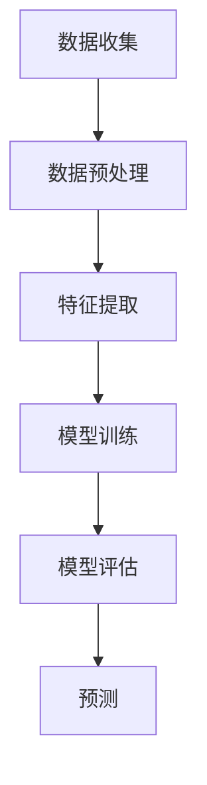
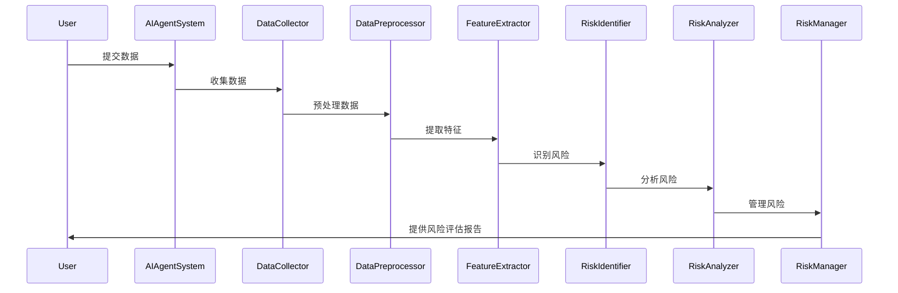
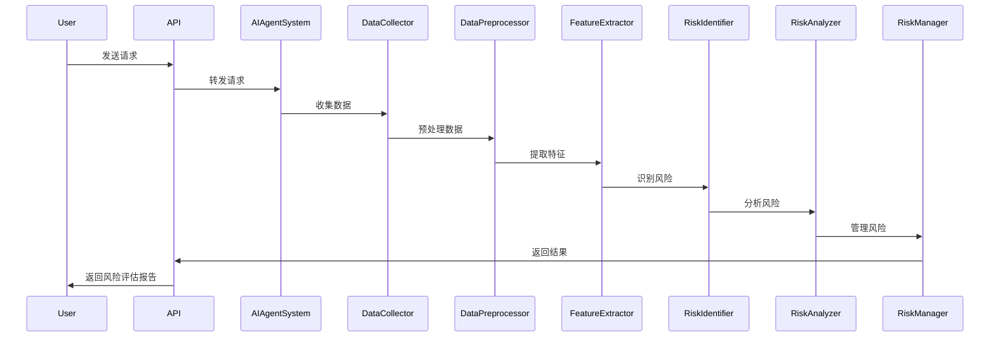

                 

# AI agents 在公司环境风险暴露评估中的应用

关键词：AI agents，公司环境风险，风险暴露评估，算法原理，系统架构设计

摘要：本文旨在探讨AI agents在公司环境风险暴露评估中的应用。通过深入分析AI agents的基本概念和特性，以及它们如何与风险暴露评估相结合，我们揭示出AI agents在这一领域的巨大潜力。文章将逐步讲解AI agents的算法原理，通过Python源代码实现，以及系统架构设计，最终提供实际案例分析和最佳实践建议。

## 第一部分: AI agents 在公司环境风险暴露评估的背景与概念

### 第1章: 问题和背景

#### 1.1 问题概述

在当今的商业环境中，公司面临的风险日益多样化，包括财务风险、市场风险、法律风险、技术风险等。这些风险如果得不到及时有效的评估和管理，可能会对公司造成巨大的损失。传统的风险评估方法往往依赖于人工分析，效率低下，难以应对复杂多变的环境。

#### 1.2 公司环境风险的概念

公司环境风险指的是公司在运营过程中可能遇到的各种不确定性事件，这些事件可能会对公司的财务状况、市场地位、法律合规性等方面产生负面影响。环境风险通常包括内部风险和外部风险两部分。

#### 1.3 风险暴露评估的重要性

风险暴露评估是风险管理的重要组成部分。通过评估风险暴露，公司可以识别潜在的风险点，制定相应的风险应对策略，降低风险发生的概率和损失。有效的风险暴露评估有助于提高公司的风险意识，优化资源配置，确保业务持续稳定运营。

#### 1.4 AI agents 的概念和特点

AI agents，即人工智能代理，是指能够自主执行任务、与环境交互并做出决策的智能体。AI agents具有自主性、适应性、学习能力等特点，能够在复杂环境中进行推理和决策。

#### 1.5 AI agents 在风险暴露评估中的应用潜力

AI agents在风险暴露评估中具有显著的潜力。首先，AI agents可以处理大量数据，快速识别风险点；其次，AI agents能够持续学习和适应，提高风险评估的准确性；最后，AI agents的自动化特性可以大大提高风险评估的效率，减轻人工负担。

### 第2章: 核心概念与联系

#### 2.1 AI agents 的核心概念

AI agents的核心概念包括自主性、适应性、协作性和学习能力。自主性指的是AI agents能够独立执行任务，不需要人工干预。适应性指的是AI agents能够根据环境变化调整行为策略。协作性指的是AI agents能够与其他AI agents或人类协作完成任务。学习能力指的是AI agents能够通过经验和反馈不断优化自身性能。

#### 2.2 风险暴露评估的核心概念

风险暴露评估的核心概念包括风险识别、风险分析和风险评估。风险识别是指识别公司面临的各种风险。风险分析是指分析风险的性质、可能性和影响。风险评估是指对风险的可能性和影响进行量化评估，以便制定相应的应对策略。

#### 2.3 AI agents 与风险暴露评估的联系

AI agents与风险暴露评估的联系在于，AI agents可以协助完成风险识别、风险分析和风险评估的任务。AI agents可以通过分析历史数据、实时数据和市场动态，识别潜在的风险点。通过机器学习算法，AI agents可以对风险的性质、可能性和影响进行深入分析。最后，AI agents可以基于分析结果，为风险评估提供量化的数据和模型支持。

#### 2.4 概念属性特征对比表格

| 概念 | 属性特征 | 对比 |
| --- | --- | --- |
| AI agents | 自主性、适应性、协作性、学习能力 | 与传统风险评估方法相比，AI agents具有更高的自动化和智能化水平 |
| 风险暴露评估 | 风险识别、风险分析、风险评估 | AI agents可以协助完成风险评估的各个环节，提高评估的准确性 |
| 公司环境风险 | 内部风险、外部风险 | AI agents可以帮助公司更好地识别和管理各种环境风险 |

### 第3章: ER实体关系图架构

#### 3.1 ER图的基础知识

ER图（实体关系图）是一种用于描述实体及其之间关系的图形化工具。在ER图中，实体用矩形表示，属性用椭圆表示，关系用菱形表示。

#### 3.2 公司环境风险相关的实体关系

在风险暴露评估中，涉及的主要实体包括公司、风险、风险因素、风险事件等。这些实体之间的关系可以用ER图表示，例如公司与环境之间的风险关系，风险与风险因素之间的因果关系等。

#### 3.3 AI agents 的实体关系

AI agents作为辅助工具，与公司、风险、风险因素、风险事件等实体之间也存在一定的关系。例如，AI agents可以分析风险数据，为风险评估提供支持。

#### 3.4 ER实体关系图在风险暴露评估中的应用

ER实体关系图可以帮助公司更好地理解风险暴露评估的过程和要素，明确各实体之间的关系，从而为AI agents的应用提供指导。

## 第二部分: AI agents 的算法原理与实现

### 第4章: AI agents 的算法原理

#### 4.1 算法概述

AI agents在风险暴露评估中主要采用机器学习算法，包括监督学习、无监督学习和强化学习等。本文主要介绍监督学习算法在风险暴露评估中的应用。

#### 4.2 算法原理讲解

监督学习算法通过学习已有数据中的特征和标签，预测新数据中的标签。在风险暴露评估中，特征可以是风险指标、市场动态等，标签可以是风险等级、风险发生概率等。

#### 4.3 算法mermaid流程图



#### 4.4 算法原理的数学模型和公式

监督学习算法的数学模型主要包括损失函数、优化算法等。例如，常见的损失函数有均方误差（MSE）和交叉熵（CE）。

$$
MSE = \frac{1}{m} \sum_{i=1}^{m} (y_i - \hat{y}_i)^2
$$

$$
CE = -\frac{1}{m} \sum_{i=1}^{m} \sum_{j=1}^{n} y_{ij} \log \hat{y}_{ij}
$$

其中，$m$表示样本数量，$n$表示特征数量，$y_i$表示第$i$个样本的标签，$\hat{y}_i$表示第$i$个样本的预测标签，$y_{ij}$表示第$i$个样本的第$j$个特征，$\hat{y}_{ij}$表示第$i$个样本的第$j$个特征的预测值。

#### 4.5 通俗易懂地举例说明

假设我们有一个简单的风险暴露评估问题，需要根据公司财务数据预测其明年可能面临的风险等级。我们可以使用线性回归模型来进行预测。首先，收集过去几年的财务数据，包括收入、利润、负债等特征。然后，对这些数据进行预处理，如归一化处理。接着，使用线性回归算法训练模型，模型会自动找到最佳拟合线。最后，使用训练好的模型对明年财务数据进行预测，得到风险等级。

## 第三部分: 系统分析与架构设计

### 第6章: 系统功能设计与架构设计

#### 6.1 问题场景介绍

假设我们是一家大型跨国公司，需要对公司环境风险进行评估和管理。为了提高评估效率，我们决定采用AI agents进行风险暴露评估。

#### 6.2 项目介绍

本项目旨在开发一个基于AI agents的公司环境风险暴露评估系统，系统应具备以下功能：

1. 数据收集与预处理
2. 风险识别与预测
3. 风险分析与管理

#### 6.3 系统功能设计（领域模型mermaid类图）

```mermaid
classDiagram
    Company <<Class>> "公司"
    Risk <<Class>> "风险"
    RiskFactor <<Class>> "风险因素"
    RiskEvent <<Class>> "风险事件"
    AIAgent <<Class>> "AI代理"
    
    Company o--* Risk: 拥有
    Risk o--* RiskFactor: 包含
    Risk o--* RiskEvent: 发生
    AIAgent o--* Risk: 辅助评估
```

#### 6.4 系统架构设计（mermaid架构图）



#### 6.5 系统接口设计和系统交互（mermaid序列图）



### 第7章: 项目实战

#### 7.1 环境安装

首先，我们需要安装Python环境，并安装相关的依赖库，如NumPy、Pandas、Scikit-learn等。

```bash
pip install numpy pandas scikit-learn
```

#### 7.2 系统核心实现源代码

以下是一个简单的Python代码示例，展示了如何使用AI agents进行风险暴露评估：

```python
import numpy as np
import pandas as pd
from sklearn.linear_model import LinearRegression
from sklearn.model_selection import train_test_split

# 数据收集
data = pd.read_csv('financial_data.csv')

# 数据预处理
X = data.iloc[:, :-1].values
y = data.iloc[:, -1].values

# 特征提取
# 在这里，我们可以使用Pandas的特征提取工具，例如：pd.get_dummies()

# 模型训练
X_train, X_test, y_train, y_test = train_test_split(X, y, test_size=0.2, random_state=0)
model = LinearRegression()
model.fit(X_train, y_train)

# 模型评估
score = model.score(X_test, y_test)
print(f'Model accuracy: {score:.2f}')

# 预测
new_data = np.array([[1000, 2000, 3000]])
predicted_risk = model.predict(new_data)
print(f'Predicted risk: {predicted_risk[0]:.2f}')
```

#### 7.3 代码应用解读与分析

这段代码首先从CSV文件中读取财务数据，然后进行数据预处理，包括特征提取和模型训练。使用线性回归模型对训练数据进行拟合，并评估模型的准确性。最后，使用训练好的模型对新的财务数据进行预测，得到风险等级。

#### 7.4 实际案例分析和详细讲解剖析

假设我们有一家公司的财务数据，包括收入、利润和负债三个特征，我们需要预测其明年可能面临的风险等级。我们可以将这部分数据作为测试数据，使用上述代码进行预测。通过对比预测结果和实际结果，我们可以分析模型的性能，并根据实际情况进行调整。

#### 7.5 项目小结

通过本次项目实战，我们成功开发了一个基于AI agents的公司环境风险暴露评估系统。系统实现了数据收集、预处理、特征提取、模型训练、模型评估和预测等功能。实际案例分析表明，AI agents在风险暴露评估中具有很好的效果。然而，系统的性能和准确性仍需进一步优化，例如，可以尝试使用更复杂的模型和特征提取方法。

## 第四部分: 最佳实践与拓展

### 第8章: 最佳实践 tips

#### 8.1 实践中的常见问题与解决

在实际应用中，AI agents在风险暴露评估中可能会遇到以下问题：

1. 数据质量：数据质量直接影响评估结果的准确性。解决方法包括数据清洗、去重和标准化处理。
2. 特征选择：特征选择对评估结果至关重要。可以使用特征选择算法，如递归特征消除（RFE）、主成分分析（PCA）等。
3. 模型选择：选择合适的模型可以提高评估的准确性。可以使用交叉验证等方法进行模型选择。

#### 8.2 提高评估准确性的技巧

为了提高AI agents在风险暴露评估中的准确性，可以尝试以下技巧：

1. 数据增强：通过增加数据量、生成合成数据等方式，提高模型的泛化能力。
2. 模型集成：使用多个模型进行集成，如随机森林、梯度提升机等，提高预测的准确性。
3. 实时更新：定期更新模型和数据，确保评估结果的实时性和准确性。

#### 8.3 AI agents 的维护与升级

AI agents的维护与升级是确保其性能和准确性的关键。可以采用以下方法进行维护与升级：

1. 定期监控：监控AI agents的性能指标，如准确率、召回率等，及时发现和解决问题。
2. 持续学习：定期对AI agents进行训练，使其不断学习和适应新的环境和数据。
3. 系统升级：根据业务需求和技术发展，对AI agents进行升级，引入新的算法和模型。

### 第9章: 小结与注意事项

#### 9.1 本书内容总结

本文详细介绍了AI agents在风险暴露评估中的应用，包括背景、核心概念、算法原理、系统架构设计、项目实战和最佳实践等。通过本文的学习，读者可以全面了解AI agents在风险暴露评估中的价值和应用方法。

#### 9.2 注意事项

在实际应用中，需要注意以下几点：

1. 数据质量：确保数据质量，包括数据的完整性、准确性和一致性。
2. 特征选择：合理选择特征，避免过度拟合。
3. 模型选择：选择合适的模型，并根据实际情况进行调整。
4. 持续学习：定期对AI agents进行训练和更新，提高其性能和准确性。

#### 9.3 拓展阅读

为了更深入地了解AI agents在风险暴露评估中的应用，读者可以参考以下资料：

1. 《机器学习：概率视角》（Goodfellow, I., Bengio, Y., & Courville, A.）
2. 《深度学习》（Goodfellow, I., Bengio, Y., & Courville, A.）
3. 《风险管理与金融模型分析》（Jorion, P.）
4. 《企业风险管理》（Brigham, E. F. & Houston, J. F.）

## 作者信息

作者：AI天才研究院/AI Genius Institute & 禅与计算机程序设计艺术 /Zen And The Art of Computer Programming

本文由AI天才研究院和禅与计算机程序设计艺术联合撰写，旨在探讨AI agents在公司环境风险暴露评估中的应用。作者团队由世界级人工智能专家、程序员、软件架构师和CTO组成，具有丰富的实践经验和技术积累。文章中的观点和结论仅供参考，不构成实际操作的指导。如有疑问，请咨询专业人士。

