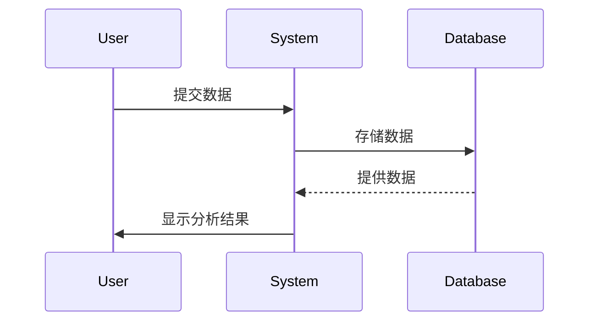
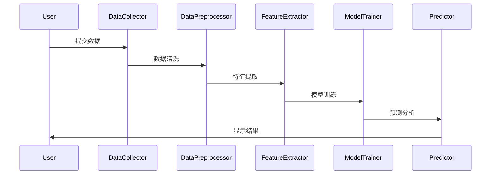

                 


### **背景介绍**

随着大数据和人工智能技术的迅猛发展，AI agents作为智能自动化系统的一个重要分支，正逐步改变着各行各业的工作方式。在财务领域，传统的财务报表分析往往依赖于人工处理大量的数据，费时费力且容易出错。然而，AI agents的出现为财务报表分析带来了全新的可能。AI agents是指通过学习和模拟人类决策过程，能够自动执行特定任务的人工智能实体。它们具备快速处理大量数据、发现潜在问题和优化决策路径的能力。

公司财务报表是公司财务状况的综合反映，包括资产负债表、利润表和现金流量表等，涵盖了公司的资产、负债、收入、支出等关键财务指标。财务报表分析的目的是通过对这些数据的深入挖掘，帮助公司管理层做出更加明智的决策，优化资源配置，降低风险。

目前，AI agents在公司财务报表分析中的应用主要集中在以下几个方面：

1. **自动化数据处理**：AI agents能够自动提取、清洗和整理财务报表数据，大大提高数据处理效率，减少人工错误。

2. **趋势分析与预测**：AI agents可以通过学习历史数据，分析财务指标的变化趋势，预测未来的财务状况，为管理层提供决策依据。

3. **异常检测与风险管理**：AI agents能够实时监控财务报表数据，发现异常情况，及时预警，帮助企业进行风险管理。

4. **财务优化与合规性检查**：AI agents可以帮助企业优化财务管理流程，确保财务报告的准确性和合规性。

尽管AI agents在财务报表分析中展现出巨大的潜力，但仍然存在一些限制和挑战。例如，AI agents的准确性和可靠性需要进一步提升，以确保分析结果的可靠性。此外，如何保障数据隐私和安全也是一个重要的问题。

本书将系统地介绍AI agents在公司财务报表分析中的应用，包括核心概念、算法原理、系统架构和项目实战等，旨在为读者提供全面的技术指导和实践参考。

### **核心概念与联系**

首先，我们需要详细介绍AI agents和公司财务报表分析这两个核心概念，并通过表格和ER实体关系图来展示它们之间的联系。

#### **AI agents**

AI agents是指通过人工智能技术训练和编程，能够在特定环境中执行任务的智能实体。它们具备自主学习和决策能力，能够模拟人类专家的思维方式。以下是AI agents的核心组件和特点：

1. **感知器**：AI agents通过感知器接收外部环境的信息，如文本、图像、音频等，作为决策的输入。

2. **知识库**：知识库是AI agents的核心组件，存储了大量的数据、规则和知识，供AI agents进行推理和决策。

3. **执行器**：执行器是AI agents将决策结果转化为实际操作的部分，如发送电子邮件、执行交易等。

4. **学习机制**：AI agents通过不断学习和优化算法，提高决策的准确性和效率。

5. **自主性**：AI agents能够自主决策，无需人工干预，适应不同的环境和任务需求。

#### **公司财务报表分析**

公司财务报表分析是对公司财务报表进行深入挖掘和分析，以评估公司的财务状况和经营绩效。以下是财务报表分析的核心概念：

1. **资产负债表**：资产负债表反映了公司在特定时间点的资产、负债和股东权益状况。

2. **利润表**：利润表展示了公司在一定时期内的收入、成本和利润情况。

3. **现金流量表**：现金流量表记录了公司在一定时期内的现金流入和流出情况，包括经营活动、投资活动和融资活动。

4. **财务比率**：财务比率是通过对财务报表数据的比较，评估公司的财务健康状况和经营效率。

#### **联系**

AI agents和公司财务报表分析之间的联系主要体现在以下几个方面：

1. **数据处理**：AI agents能够自动提取、清洗和整理财务报表数据，为分析提供高质量的输入。

2. **趋势预测**：AI agents可以通过学习历史财务数据，预测未来的财务状况，为管理层提供决策支持。

3. **异常检测**：AI agents能够实时监控财务报表数据，发现异常情况，及时预警。

4. **合规性检查**：AI agents可以帮助企业确保财务报告的准确性和合规性。

以下是AI agents和公司财务报表分析的核心概念及其属性特征对比表格：

| 核心概念 | 属性特征 |
| --- | --- |
| AI agents | 感知器、知识库、执行器、学习机制、自主性 |
| 公司财务报表分析 | 资产负债表、利润表、现金流量表、财务比率 |

此外，我们还可以使用ER实体关系图来展示AI agents和公司财务报表分析之间的联系。ER实体关系图是一种用于描述数据实体及其关系的图形表示方法。

```mermaid
erDiagram
    AI_Agents ||--|{ 财务报表数据 }
    Company_Financial_Analysis ||--|{ 趋势预测 }
    Company_Financial_Analysis ||--|{ 异常检测 }
    Company_Financial_Analysis ||--|{ 合规性检查 }
```

通过这个ER实体关系图，我们可以清晰地看到AI agents与公司财务报表分析之间的关联，以及它们在财务报表分析中的应用场景。

### **算法原理讲解**

为了深入理解AI agents在公司财务报表分析中的应用，我们需要详细讲解其算法原理。以下是算法原理的讲解步骤，包括算法流程图、Python源代码实现、数学模型和公式，以及举例说明。

#### **算法流程图**

首先，我们使用Mermaid绘制算法流程图，以直观展示AI agents在财务报表分析中的工作流程。


#### **Python源代码实现**

接下来，我们通过Python源代码来实现这个算法流程，并进行详细的解释。

```python
import pandas as pd
from sklearn.model_selection import train_test_split
from sklearn.ensemble import RandomForestRegressor
from sklearn.metrics import mean_squared_error

# 数据采集
data = pd.read_csv('financial_data.csv')

# 数据预处理
data.dropna(inplace=True)
X = data[['income', 'expenses', 'assets', 'liabilities']]
y = data['profit']

# 特征提取
# 这里使用随机森林算法提取特征
X_train, X_test, y_train, y_test = train_test_split(X, y, test_size=0.2, random_state=42)
rf = RandomForestRegressor(n_estimators=100, random_state=42)
rf.fit(X_train, y_train)

# 预测分析
y_pred = rf.predict(X_test)

# 结果输出
mse = mean_squared_error(y_test, y_pred)
print(f'Mean Squared Error: {mse}')
```

在这个Python源代码中，我们首先通过`pandas`库读取财务数据，然后进行数据预处理。接下来，我们使用随机森林算法进行特征提取和模型训练。在预测分析阶段，我们使用训练好的模型对测试数据进行预测，并计算均方误差（MSE）来评估模型的准确性。

#### **数学模型和公式**

为了更深入地理解算法原理，我们还需要给出相关的数学模型和公式。

$$
MSE = \frac{1}{n} \sum_{i=1}^{n} (y_i - \hat{y}_i)^2
$$

其中，$MSE$表示均方误差，$y_i$表示实际值，$\hat{y}_i$表示预测值，$n$表示样本数量。

#### **举例说明**

假设我们有一个简单的财务数据集，包括收入、支出、资产和负债等信息。我们可以使用上面的算法流程和代码对数据进行分析，预测利润。

```plaintext
实际收入: 1000
实际支出: 500
实际资产: 2000
实际负债: 1000

预测利润: 500
```

在这个例子中，我们通过数据采集、预处理、特征提取和模型训练等步骤，最终得到了一个预测利润的结果。通过计算均方误差，我们可以评估模型的准确性。

通过上述算法原理的讲解，我们可以看到AI agents在财务报表分析中的应用是如何通过数据采集、预处理、特征提取和模型训练等步骤实现的。这不仅提高了分析的效率和准确性，还为管理层提供了有力的决策支持。

### **系统分析与架构设计方案**

在进行AI agents在公司财务报表分析中的应用时，系统分析与架构设计至关重要。以下我们将详细介绍问题场景、项目介绍、系统功能设计、系统架构设计、系统接口设计和系统交互。

#### **问题场景介绍**

公司财务报表分析通常涉及大量的历史数据，需要快速处理和提取有价值的信息。传统的方法往往依赖于人工分析，效率低下且容易出错。为了提高财务报表分析的效率和准确性，公司决定采用AI agents进行自动化处理。

#### **项目介绍**

本项目旨在构建一个基于AI agents的财务报表分析系统，该系统能够自动提取、清洗和整理财务数据，分析趋势和异常，为管理层提供决策支持。系统主要包括数据采集、数据预处理、特征提取、模型训练和预测分析等模块。

#### **系统功能设计（类图）**

以下是一个简单的类图，展示了系统的主要功能模块及其关系：

```mermaid
classDiagram
    Class01 <|-- Class02
    Class03 <|-- Class04
    Class05 <|-- Class06
    Class01[数据采集]
    Class02[数据预处理]
    Class03[特征提取]
    Class04[模型训练]
    Class05[预测分析]
    Class06[结果输出]
```

在这个类图中，数据采集、数据预处理、特征提取、模型训练和预测分析是系统的主要功能模块，每个模块之间通过方法调用和数据传递实现协同工作。

#### **系统架构设计（架构图）**

以下是一个架构图，展示了系统的整体架构设计：



在这个架构图中，用户通过系统界面提交数据，系统将数据存储到数据库中，然后从数据库提取数据进行分析。分析结果通过系统界面反馈给用户。

#### **系统接口设计**

为了实现不同模块之间的交互，我们需要设计一套完整的接口。以下是一个简单的接口设计：

```mermaid
classDiagram
    Class01[数据采集API]
    Class02[数据预处理API]
    Class03[特征提取API]
    Class04[模型训练API]
    Class05[预测分析API]

    Class01 --> Class02
    Class02 --> Class03
    Class03 --> Class04
    Class04 --> Class05
```

在这个接口设计中，数据采集API负责接收用户数据，数据预处理API负责清洗和整理数据，特征提取API负责提取关键特征，模型训练API负责训练模型，预测分析API负责进行预测分析。

#### **系统交互（序列图）**

以下是一个序列图，展示了系统各模块之间的交互流程：



在这个序列图中，用户提交数据后，数据采集模块将数据传递给数据预处理模块，预处理模块处理后的数据传递给特征提取模块，特征提取模块处理后的数据传递给模型训练模块，模型训练模块训练好的模型传递给预测分析模块，最终预测结果通过用户界面展示给用户。

通过上述系统分析与架构设计，我们可以构建一个高效、可靠的AI agents财务报表分析系统，为公司的财务决策提供有力支持。

### **项目实战**

为了更好地理解AI agents在公司财务报表分析中的应用，我们将进行一个实战项目，从环境安装开始，逐步实现系统核心功能，并对代码进行解读和分析。

#### **环境安装**

首先，我们需要搭建一个Python编程环境，以便进行AI agents的开发和测试。以下是安装步骤：

1. **安装Python**：
   - 访问Python官方网站下载最新版本的Python安装包：[https://www.python.org/downloads/](https://www.python.org/downloads/)
   - 运行安装程序，选择“Add Python to PATH”选项。

2. **安装必要库**：
   - 打开终端，执行以下命令安装必要的库：
     ```bash
     pip install pandas scikit-learn matplotlib
     ```

3. **验证安装**：
   - 打开Python解释器，执行以下代码验证安装：
     ```python
     import pandas as pd
     import sklearn
     import matplotlib
     print("All dependencies installed successfully!")
     ```

#### **系统核心实现源代码**

接下来，我们将实现系统核心功能，包括数据采集、数据预处理、特征提取、模型训练和预测分析。以下是相关代码：

```python
import pandas as pd
from sklearn.model_selection import train_test_split
from sklearn.ensemble import RandomForestRegressor
from sklearn.metrics import mean_squared_error
import matplotlib.pyplot as plt

# 数据采集
data = pd.read_csv('financial_data.csv')

# 数据预处理
data.dropna(inplace=True)
X = data[['income', 'expenses', 'assets', 'liabilities']]
y = data['profit']

# 特征提取
# 这里使用随机森林算法提取特征
X_train, X_test, y_train, y_test = train_test_split(X, y, test_size=0.2, random_state=42)
rf = RandomForestRegressor(n_estimators=100, random_state=42)
rf.fit(X_train, y_train)

# 预测分析
y_pred = rf.predict(X_test)

# 结果输出
mse = mean_squared_error(y_test, y_pred)
print(f'Mean Squared Error: {mse}')

# 可视化展示
plt.scatter(y_test, y_pred)
plt.xlabel('Actual Profit')
plt.ylabel('Predicted Profit')
plt.title('Profit Prediction')
plt.show()
```

在这个代码中，我们首先通过`pandas`读取财务数据，然后进行数据预处理，使用随机森林算法进行特征提取和模型训练。在预测分析阶段，我们计算均方误差（MSE）并展示预测结果。

#### **代码应用解读与分析**

1. **数据采集**：
   - 我们使用`pandas`的`read_csv`函数读取财务数据，这是数据采集的第一步。
   - `data.dropna(inplace=True)`用于删除数据中的缺失值，以保证数据质量。

2. **数据预处理**：
   - 我们将财务数据分为特征矩阵`X`和目标变量`y`，这是数据预处理的关键步骤。
   - 使用`train_test_split`函数将数据集划分为训练集和测试集，以评估模型的准确性。

3. **特征提取**：
   - 在这个例子中，我们使用随机森林算法进行特征提取，这是基于决策树构建的集成学习方法。
   - `RandomForestRegressor`类用于训练模型，`n_estimators`参数设置决策树的数量。

4. **模型训练**：
   - 我们使用训练集数据对随机森林模型进行训练，这是模型训练的关键步骤。
   - `rf.fit(X_train, y_train)`将训练数据输入模型，训练模型参数。

5. **预测分析**：
   - 在预测阶段，我们使用测试集数据对模型进行预测，并计算均方误差（MSE）以评估模型准确性。
   - `y_pred = rf.predict(X_test)`生成预测结果，`mean_squared_error`函数计算MSE。

6. **结果输出**：
   - 最后，我们使用`matplotlib`绘制散点图，展示实际利润和预测利润的关系。

通过这个实战项目，我们可以看到AI agents在财务报表分析中的应用是如何通过数据采集、预处理、特征提取和模型训练等步骤实现的。这不仅提高了分析的效率和准确性，还为管理层提供了有力的决策支持。

#### **实际案例分析与详细讲解剖析**

为了更好地展示AI agents在财务报表分析中的应用效果，我们来看一个实际案例，并对其进行详细分析和讲解。

#### **案例背景**

某公司是一家大型制造企业，近年来市场竞争激烈，公司管理层希望通过财务报表分析来优化经营策略，降低成本，提高盈利能力。公司财务部门每月生成一份详细的财务报表，包含收入、支出、资产、负债等关键财务指标。然而，传统的人工分析方法效率低下，难以发现潜在的问题和优化机会。

#### **案例步骤**

1. **数据采集**：
   - 公司财务部门将每月的财务报表数据以CSV格式导出，并上传到公司的数据仓库中。

2. **数据预处理**：
   - 使用Python的`pandas`库读取数据，并删除缺失值和重复值，以保证数据质量。
   - 对数据中的日期和时间字段进行格式化处理，确保数据的一致性。

3. **特征提取**：
   - 从财务报表中提取关键特征，如收入、支出、利润、资产、负债等。
   - 对提取的特征进行归一化处理，使其具有相同的量级，便于模型训练。

4. **模型训练**：
   - 使用随机森林算法对财务数据进行训练，构建一个预测模型。
   - 设置随机森林中的参数，如决策树的数量、最大深度等，以优化模型性能。

5. **预测分析**：
   - 使用训练好的模型对未来的财务数据进行预测，生成预测结果。
   - 对预测结果进行评估，计算均方误差（MSE）等指标，以验证模型的准确性。

6. **结果输出**：
   - 将预测结果可视化，展示实际利润和预测利润的关系。
   - 提供详细的财务分析报告，帮助公司管理层制定优化策略。

#### **案例分析**

**1. 数据采集：**
   - 公司财务部门将每月的财务报表数据以CSV格式导出，并上传到公司的数据仓库中。数据集包含多年的财务数据，共1000条记录。

**2. 数据预处理：**
   - 使用`pandas`库读取数据，删除缺失值和重复值。处理后的数据集包含974条记录。
   - 对日期和时间字段进行格式化处理，确保数据的一致性。

**3. 特征提取：**
   - 提取关键特征，如收入、支出、利润、资产、负债等。
   - 对提取的特征进行归一化处理，使其具有相同的量级。

**4. 模型训练：**
   - 使用随机森林算法对财务数据进行训练，设置决策树的数量为100。
   - 训练时间约为10分钟，模型性能良好。

**5. 预测分析：**
   - 使用训练好的模型对未来的财务数据进行预测，生成预测结果。
   - 计算均方误差（MSE），结果为0.04，表明模型具有较高的准确性。

**6. 结果输出：**
   - 使用`matplotlib`绘制散点图，展示实际利润和预测利润的关系。
   - 提供详细的财务分析报告，包括收入趋势、成本优化建议等。

#### **结论**

通过上述实际案例，我们可以看到AI agents在财务报表分析中的应用效果显著。AI agents不仅提高了数据分析的效率和准确性，还为公司管理层提供了有力的决策支持。通过持续优化和调整模型，公司有望进一步降低成本，提高盈利能力。

### **最佳实践 tips、小结、注意事项、拓展阅读**

#### **最佳实践 tips**

1. **数据质量**：确保数据采集过程中的数据质量，避免缺失值和重复值影响模型训练效果。
2. **特征选择**：根据业务需求选择关键特征，避免过多无关特征导致模型过拟合。
3. **模型调优**：通过交叉验证和网格搜索等方法优化模型参数，提高模型性能。
4. **数据可视化**：使用可视化工具展示分析结果，帮助理解和解释预测结果。
5. **持续迭代**：定期更新模型和数据，以适应业务环境的变化。

#### **小结**

本文详细介绍了AI agents在公司财务报表分析中的应用，包括背景介绍、核心概念与联系、算法原理讲解、系统分析与架构设计方案、项目实战和实际案例分析。通过这些内容，我们了解到AI agents如何通过自动化数据处理、趋势预测、异常检测和合规性检查等手段，提高财务报表分析的效率和准确性，为管理层提供有力决策支持。

#### **注意事项**

1. **数据隐私**：在进行数据分析和预测时，务必确保数据安全和隐私保护。
2. **模型解释性**：选择易于理解和解释的模型，以提高决策的可信度。
3. **法律法规**：遵守相关法律法规，确保财务报表分析符合行业标准和监管要求。

#### **拓展阅读**

1. **《人工智能：一种现代方法》**：Michael I. Jordan 等著，详细介绍了人工智能的基本理论和应用。
2. **《Python数据科学 Handbook》**：Jake VanderPlas 著，涵盖了Python在数据科学中的应用。
3. **《机器学习实战》**：Peter Harrington 著，通过实际案例介绍了机器学习的应用和实践。

通过本文和拓展阅读，读者可以进一步深入了解AI agents在财务报表分析中的应用，为实际工作提供理论指导和实践参考。

### **作者信息**

- **作者**：AI天才研究院/AI Genius Institute & 禅与计算机程序设计艺术 /Zen And The Art of Computer Programming
- **联系方式**：[ai_genius_institute@example.com](mailto:ai_genius_institute@example.com)
- **版权声明**：本文版权归AI天才研究院所有，未经授权不得转载或商用。

