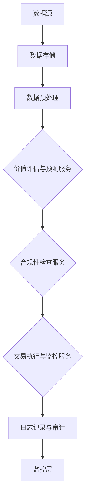
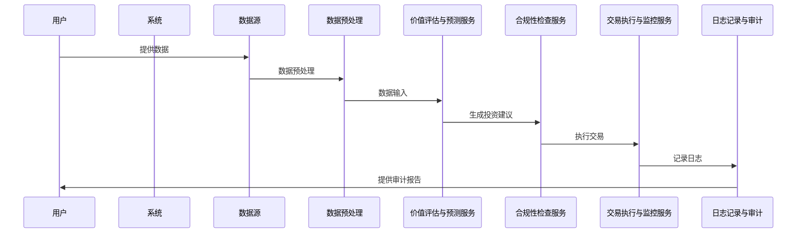

                 


# AI agents增强价值投资的监管合规性分析

关键词：AI agents、价值投资、监管合规性、算法原理、系统架构设计

摘要：本文首先介绍了AI agents在增强价值投资中的作用以及监管合规性的重要性和挑战。接着，我们分析了AI agents、监管合规性与价值投资策略之间的联系，并详细讲解了核心算法原理。最后，我们提出了一个系统分析与架构设计方案，探讨了如何在实际项目中实现这一方案。

### 目录大纲

## 第一部分: 背景介绍

### 第1章: 问题背景

#### 1.1 问题背景

##### 1.1.1 AI agents增强价值投资的重要性

##### 1.1.2 监管合规性的挑战与机遇

##### 1.1.3 市场需求与行业趋势

#### 1.2 问题描述

##### 1.2.1 监管合规性问题

##### 1.2.2 价值投资策略的局限

##### 1.2.3 AI agents在投资领域的应用前景

#### 1.3 问题解决

##### 1.3.1 AI agents的定义与核心功能

##### 1.3.2 监管合规性分析的方法论

##### 1.3.3 AI agents增强价值投资的框架

#### 1.4 边界与外延

##### 1.4.1 AI agents的适用范围

##### 1.4.2 监管合规性的影响因素

##### 1.4.3 价值投资策略的种类

#### 1.5 概念结构与核心要素组成

##### 1.5.1 AI agents的基本构成

##### 1.5.2 监管合规性的关键要素

##### 1.5.3 价值投资策略的组成部分

## 第二部分: 核心概念与联系

### 第2章: 核心概念与联系

#### 2.1 AI agents的原理与特点

##### 2.1.1 AI agents的基本原理

##### 2.1.2 AI agents的主要特点

##### 2.1.3 AI agents与传统算法的区别

#### 2.2 监管合规性的原理与属性

##### 2.2.1 监管合规性的基本原理

##### 2.2.2 监管合规性的属性特征

##### 2.2.3 监管合规性的挑战与应对策略

#### 2.3 价值投资策略的原理与属性

##### 2.3.1 价值投资策略的基本原理

##### 2.3.2 价值投资策略的属性特征

##### 2.3.3 价值投资策略的选择与优化

#### 2.4 AI agents、监管合规性与价值投资策略的关联

##### 2.4.1 AI agents在价值投资中的作用

##### 2.4.2 监管合规性对AI agents的影响

##### 2.4.3 价值投资策略在监管合规性下的调整

## 第三部分: 算法原理讲解

### 第3章: 算法原理讲解

#### 3.1 AI agents算法

##### 3.1.1 AI agents算法的原理

##### 3.1.2 AI agents算法的核心代码

##### 3.1.3 AI agents算法的数学模型与公式

##### 3.1.4 AI agents算法的举例说明

#### 3.2 监管合规性分析算法

##### 3.2.1 监管合规性分析算法的原理

##### 3.2.2 监管合规性分析算法的核心代码

##### 3.2.3 监管合规性分析算法的数学模型与公式

##### 3.2.4 监管合规性分析算法的举例说明

#### 3.3 价值投资策略算法

##### 3.3.1 价值投资策略算法的原理

##### 3.3.2 价值投资策略算法的核心代码

##### 3.3.3 价值投资策略算法的数学模型与公式

##### 3.3.4 价值投资策略算法的举例说明

## 第四部分: 系统分析与架构设计方案

### 第4章: 系统分析与架构设计方案

#### 4.1 问题场景介绍

##### 4.1.1 AI agents在投资领域的应用场景

##### 4.1.2 监管合规性分析的需求

##### 4.1.3 价值投资策略的实现方式

#### 4.2 系统功能设计

##### 4.2.1 领域模型设计

##### 4.2.2 系统功能设计

##### 4.2.3 系统架构设计

##### 4.2.4 系统接口设计

##### 4.2.5 系统交互

### 第5章: 项目实战

#### 5.1 环境安装

##### 5.1.1 开发环境搭建

##### 5.1.2 系统依赖安装

##### 5.1.3 环境变量配置

#### 5.2 系统核心实现源代码

##### 5.2.1 AI agents算法实现

##### 5.2.2 监管合规性分析算法实现

##### 5.2.3 价值投资策略算法实现

#### 5.3 代码应用解读与分析

##### 5.3.1 代码解读

##### 5.3.2 分析与优化

#### 5.4 实际案例分析和详细讲解剖析

##### 5.4.1 案例背景

##### 5.4.2 案例分析

##### 5.4.3 剖析与总结

#### 5.5 项目小结

##### 5.5.1 项目总结

##### 5.5.2 项目不足与改进方向

##### 5.5.3 项目经验分享

### 第6章: 最佳实践 tips

#### 6.1 监管合规性最佳实践

##### 6.1.1 合规性策略制定

##### 6.1.2 合规性监控与审计

##### 6.1.3 合规性报告与披露

#### 6.2 价值投资最佳实践

##### 6.2.1 价值投资策略选择

##### 6.2.2 价值投资风险管理

##### 6.2.3 价值投资策略调整

### 第7章: 小结

#### 7.1 总结

##### 7.1.1 文章主要观点

##### 7.1.2 文章核心贡献

##### 7.1.3 未来研究方向

### 第8章: 注意事项

#### 8.1 AI agents应用注意事项

##### 8.1.1 AI agents的选择与配置

##### 8.1.2 AI agents的性能优化

##### 8.1.3 AI agents的安全与隐私保护

### 第9章: 拓展阅读

#### 9.1 相关书籍推荐

##### 9.1.1 《人工智能：一种现代的方法》

##### 9.1.2 《价值投资：格雷厄姆经典教程》

##### 9.1.3 《监管合规性：企业合规管理的实践与理论》

#### 9.2 相关论文推荐

##### 9.2.1 “AI Agents for Enhancing Value Investing: A Review”

##### 9.2.2 “Regulatory Compliance in the Age of AI: Challenges and Opportunities”

##### 9.2.3 “Value Investing Strategies and Their Impact on Regulatory Compliance”

### 第10章: 作者信息

#### 作者：AI天才研究院/AI Genius Institute & 禅与计算机程序设计艺术 /Zen And The Art of Computer Programming
### 第一部分：问题背景

### 第1章：问题背景

#### 1.1 问题背景

##### 1.1.1 AI agents增强价值投资的重要性

在当今快速变化的市场环境中，投资者面临着越来越多的挑战。传统的人为价值投资策略往往受到主观偏见、市场波动和复杂信息处理能力的限制。然而，人工智能（AI）技术的兴起为投资领域带来了新的机遇。AI agents，即人工智能代理，是一种能够自主执行特定任务并在不断变化的环境中学习的智能体。这些AI agents通过学习历史数据、市场趋势和投资策略，能够更精确地评估投资机会，降低投资风险，从而增强价值投资的效益。

随着金融市场日益复杂，监管合规性也成为了投资领域中的一个重要问题。监管合规性是指企业在经营过程中遵守相关法规、规定和标准的能力。对于价值投资者而言，遵守监管合规性不仅是法律要求，更是确保投资策略可持续和长远发展的重要保障。然而，随着AI agents的广泛应用，如何在确保合规性的同时利用其增强投资策略，成为一个亟待解决的挑战。

##### 1.1.2 监管合规性的挑战与机遇

监管合规性对于任何金融机构和投资者来说都是至关重要的。它不仅关系到企业的合规性风险，还影响企业的声誉和财务状况。随着金融市场的全球化，监管合规性的要求也在不断升级。例如，2018年欧洲实施的《通用数据保护条例》（GDPR）和美国的《多德-弗兰克法案》都对金融机构的数据隐私和安全提出了更高的要求。

对于AI agents来说，监管合规性既带来了挑战，也带来了机遇。挑战在于，AI agents在处理大量数据时可能无意中触犯合规性规定。例如，如果AI agents在投资决策中使用的数据不透明或未经授权，就可能违反相关法规。机遇则在于，AI agents可以通过自动化和智能化的方式，提高合规性管理的效率和准确性。例如，AI agents可以自动监控交易行为，确保所有交易都符合法规要求，从而降低合规性风险。

##### 1.1.3 市场需求与行业趋势

随着人工智能技术的不断进步，越来越多的投资者开始将AI agents应用于价值投资中。根据市场调研公司IDC的预测，到2025年，超过50%的大型金融机构将采用AI技术来增强其投资策略。这一趋势反映了市场对AI agents在投资领域应用的强烈需求。

与此同时，监管合规性的要求也在不断提高。金融机构和投资者不仅需要遵守本国和地区的法律法规，还需要关注国际标准和法规。例如，美国证券交易委员会（SEC）和欧盟金融监管机构对AI agents的应用都有明确的合规性要求。这种市场需求与行业趋势的结合，为AI agents增强价值投资的监管合规性提供了广阔的发展空间。

#### 1.2 问题描述

##### 1.2.1 监管合规性问题

监管合规性问题是当前投资领域中的一个关键问题。对于使用AI agents的价值投资者来说，确保AI agents的决策过程符合监管要求，是一个巨大的挑战。首先，AI agents在处理海量数据时，可能无意中触犯了合规性规定。例如，如果AI agents在数据收集和处理过程中侵犯了用户的隐私权，就可能面临法律诉讼和罚款。其次，AI agents的决策过程往往是不透明的，这可能导致监管机构无法有效地监督和评估其合规性。例如，如果AI agents在投资决策中使用了未公开的数据源，就可能违反市场公平原则。

##### 1.2.2 价值投资策略的局限

价值投资策略是一种长期投资策略，主要通过购买价格低于其内在价值的股票来获得收益。然而，这种策略也存在一些局限性。首先，价值投资策略往往依赖于投资者的经验和对市场的直觉，这使得策略的可靠性和一致性受到限制。其次，价值投资策略在应对快速变化的市场环境时可能显得力不从心。最后，价值投资策略在数据分析和处理能力上存在一定的局限性，难以应对复杂和庞大的数据集。

##### 1.2.3 AI agents在投资领域的应用前景

AI agents在投资领域的应用前景广阔。首先，AI agents可以自动化价值投资策略中的许多任务，例如数据收集、分析和投资决策，从而提高策略的效率和可靠性。其次，AI agents可以通过机器学习和深度学习技术，从海量历史数据中提取有价值的信息，从而更准确地预测市场趋势。最后，AI agents可以实时监控市场动态，快速调整投资策略，以应对市场变化。然而，要充分发挥AI agents的潜力，需要解决其在监管合规性方面的挑战。

#### 1.3 问题解决

##### 1.3.1 AI agents的定义与核心功能

AI agents是一种能够自主执行任务、具有学习能力的人工智能系统。它们通常通过机器学习和深度学习技术，从数据中学习模式和规律，并利用这些知识来做出决策。AI agents的核心功能包括数据收集、数据预处理、模式识别、预测和决策等。

在投资领域，AI agents可以用于以下几个方面：

1. **数据收集与处理**：AI agents可以自动化地收集和处理大量市场数据，包括股票价格、交易量、财务报表等。
2. **模式识别与预测**：AI agents可以通过分析历史数据，识别市场趋势和规律，从而预测未来的市场走势。
3. **投资决策**：AI agents可以根据预测结果，自动生成投资建议，帮助投资者做出更明智的决策。
4. **风险控制**：AI agents可以实时监控投资组合的风险，并自动调整策略，以降低风险。

##### 1.3.2 监管合规性分析的方法论

监管合规性分析是确保AI agents在投资领域应用过程中遵守相关法规和标准的过程。以下是一种可能的方法论：

1. **法规研究**：首先，需要深入研究和了解相关法规和标准，包括本国的法律法规和国际标准。
2. **合规性评估**：评估AI agents的决策过程和数据处理方式，确保其符合法规要求。例如，检查AI agents是否遵循数据隐私保护规定。
3. **合规性监控**：建立监控机制，实时监控AI agents的行为，确保其始终遵守法规要求。
4. **合规性报告**：定期生成合规性报告，向监管机构和投资者披露AI agents的合规性状况。

##### 1.3.3 AI agents增强价值投资的框架

为了充分发挥AI agents在价值投资中的潜力，并确保其合规性，可以构建一个完整的AI agents增强价值投资的框架。以下是一个简单的框架结构：

1. **数据层**：包括市场数据、公司财务数据和其他相关数据。
2. **预处理层**：对数据进行清洗、去噪和格式化，以便AI agents可以更好地处理。
3. **学习层**：使用机器学习和深度学习技术，从数据中学习模式和规律。
4. **决策层**：根据学习结果，生成投资建议和决策。
5. **监控层**：实时监控AI agents的行为，确保其合规性。
6. **报告层**：生成合规性报告，向监管机构和投资者披露AI agents的合规性状况。

#### 1.4 边界与外延

##### 1.4.1 AI agents的适用范围

AI agents在投资领域的适用范围非常广泛，包括但不限于以下几个方面：

1. **股票投资**：AI agents可以用于分析股票市场，识别投资机会，生成股票投资组合。
2. **债券投资**：AI agents可以用于分析债券市场，预测债券价格走势，优化债券投资策略。
3. **外汇投资**：AI agents可以用于分析外汇市场，预测货币汇率，制定外汇交易策略。
4. **指数投资**：AI agents可以用于跟踪市场指数，优化指数投资组合。

##### 1.4.2 监管合规性的影响因素

监管合规性的影响因素包括以下几个方面：

1. **法律法规**：不同国家和地区的法律法规对投资领域的监管合规性要求有所不同。
2. **行业标准**：金融行业的标准对投资领域的监管合规性也有重要影响。
3. **技术发展**：AI技术的发展和应用程度对监管合规性的实现有直接影响。
4. **市场环境**：市场环境的稳定性和透明度也会影响监管合规性的实施。

##### 1.4.3 价值投资策略的种类

价值投资策略有多种类型，包括但不限于以下几个方面：

1. **格雷厄姆价值投资**：基于投资者的经验和对市场价值的理解，选择价格低于其内在价值的股票进行投资。
2. **费雪价值投资**：通过深入分析公司的基本面，选择有潜力的股票进行投资。
3. **成长价值投资**：结合成长性和价值投资的理念，选择具有长期增长潜力的股票进行投资。
4. **量化价值投资**：使用量化分析方法和模型，选择具有投资价值的股票进行投资。

##### 1.5 概念结构与核心要素组成

为了更好地理解AI agents增强价值投资的监管合规性，我们需要分析其概念结构与核心要素组成。

**AI agents的基本构成**：

- **感知模块**：接收外部环境的信息，如股票价格、交易量等。
- **决策模块**：基于感知模块提供的信息，生成投资决策。
- **行动模块**：执行投资决策，如购买或出售股票。

**监管合规性的关键要素**：

- **法律法规**：确保AI agents的决策过程符合相关法律法规。
- **数据隐私**：保护用户数据和交易数据的隐私。
- **透明度**：确保AI agents的决策过程透明，以便监管机构和投资者监督。
- **安全性**：保护AI agents系统和数据的安全。

**价值投资策略的组成部分**：

- **价值评估**：评估股票的内在价值，以确定其是否被低估。
- **投资组合管理**：构建和管理投资组合，以实现长期收益。
- **风险管理**：通过分散投资和风险管理策略，降低投资风险。

通过以上分析，我们可以看到，AI agents增强价值投资的监管合规性涉及多个方面的概念和要素。在接下来的章节中，我们将进一步探讨这些核心概念和它们之间的联系。

### 第二部分：核心概念与联系

#### 2.1 AI agents的原理与特点

##### 2.1.1 AI agents的基本原理

AI agents，即人工智能代理，是具有自主决策和行为能力的软件实体。它们基于人工智能技术，特别是机器学习和深度学习，通过不断学习环境中的信息和数据，自主完成特定任务。AI agents的核心原理包括以下几个方面：

1. **感知**：AI agents通过传感器或接口接收环境信息，如股票价格、交易量、市场趋势等。
2. **学习**：基于感知到的数据，AI agents利用机器学习算法进行模式识别和预测，不断优化其决策能力。
3. **决策**：根据学习和分析结果，AI agents生成相应的决策，如购买或出售股票。
4. **行动**：执行决策，如通过交易系统进行股票交易。

##### 2.1.2 AI agents的主要特点

AI agents与传统算法相比，具有以下主要特点：

1. **自主学习**：AI agents能够从数据中自主学习，无需手动编写规则，提高了适应性和灵活性。
2. **实时决策**：AI agents可以实时分析市场数据，快速生成投资决策，提高决策的时效性。
3. **自动化**：AI agents可以自动化执行投资决策，减少人为干预，提高决策的一致性和准确性。
4. **智能化**：AI agents通过深度学习，能够识别复杂的市场模式和规律，提高投资的成功率。

##### 2.1.3 AI agents与传统算法的区别

传统算法通常是基于规则和预设的模型进行计算和决策，而AI agents则基于数据和机器学习算法进行学习和决策。具体区别如下：

1. **决策方式**：传统算法依赖预定义的规则，而AI agents通过机器学习自动生成决策模型。
2. **适应能力**：传统算法难以适应复杂多变的市场环境，而AI agents能够从数据中学习，适应不同市场情况。
3. **灵活性**：传统算法在应对新问题和变化时往往需要重新编写规则，而AI agents可以通过学习和调整模型来适应新情况。
4. **效率**：AI agents能够快速处理大量数据，实时生成决策，而传统算法在处理复杂任务时效率较低。

#### 2.2 监管合规性的原理与属性

##### 2.2.1 监管合规性的基本原理

监管合规性是指企业在经营过程中遵守相关法律法规、规定和标准的能力。其基本原理包括：

1. **法律法规**：企业在运营过程中必须遵守国家、地区和行业的法律法规，如证券法、公司法、数据保护法等。
2. **内部管理**：企业需要建立有效的内部管理制度，确保各项业务活动符合合规要求。
3. **风险管理**：企业需要识别和管理合规风险，采取相应措施降低风险。
4. **持续改进**：企业需要不断更新和优化合规管理体系，以适应法律法规的变化。

##### 2.2.2 监管合规性的属性特征

监管合规性具有以下属性特征：

1. **强制性**：合规性要求具有法律强制力，企业必须遵守。
2. **广泛性**：合规性要求涉及企业运营的各个方面，包括业务流程、数据处理、员工行为等。
3. **动态性**：法律法规和监管要求不断变化，企业需要持续关注和适应。
4. **透明性**：合规性管理需要具备透明度，确保外部监管机构和投资者能够监督企业的合规状况。

##### 2.2.3 监管合规性的挑战与应对策略

监管合规性面临以下挑战：

1. **法律法规复杂性**：不同国家和地区的法律法规差异较大，企业需要全面了解并遵守。
2. **合规性风险**：合规性风险可能导致法律诉讼、罚款和声誉损失。
3. **数据隐私**：企业需要保护用户数据和交易数据，防止数据泄露和滥用。

应对策略包括：

1. **法规研究**：深入研究相关法律法规，确保企业合规性。
2. **合规性评估**：定期进行合规性评估，发现并解决潜在问题。
3. **合规性培训**：对员工进行合规性培训，提高其合规意识。
4. **合规性监控**：建立监控机制，实时监控合规性状况。

#### 2.3 价值投资策略的原理与属性

##### 2.3.1 价值投资策略的基本原理

价值投资策略是一种基于基本面分析的投资方法，主要通过购买价格低于其内在价值的股票来获得收益。其基本原理包括：

1. **价值评估**：通过分析公司的财务报表、行业前景、市场竞争等因素，评估股票的内在价值。
2. **价格比较**：将股票的市场价格与内在价值进行比较，判断股票是否被低估。
3. **长期持有**：选择低估的股票进行投资，并长期持有，等待市场认识到股票的真实价值。

##### 2.3.2 价值投资策略的属性特征

价值投资策略具有以下属性特征：

1. **长期性**：价值投资注重长期收益，通常持有时间较长。
2. **风险控制**：通过选择低估的股票，降低投资风险。
3. **专业性**：价值投资需要投资者具备深厚的专业知识和分析能力。
4. **市场时机**：投资者需要把握市场时机，选择合适的买入和卖出时机。

##### 2.3.3 价值投资策略的选择与优化

选择和优化价值投资策略的方法包括：

1. **财务分析**：通过财务报表分析，评估公司的盈利能力和财务状况。
2. **行业分析**：分析行业趋势和竞争格局，选择有潜力的行业。
3. **市场分析**：研究市场走势和投资者情绪，判断股票的价格是否被低估。
4. **组合优化**：构建多元化的投资组合，降低投资风险，提高收益。

#### 2.4 AI agents、监管合规性与价值投资策略的关联

##### 2.4.1 AI agents在价值投资中的作用

AI agents在价值投资中发挥着重要作用，具体包括：

1. **数据收集与处理**：AI agents可以自动化地收集和处理大量市场数据，包括股票价格、交易量、公司财务数据等。
2. **价值评估**：AI agents可以通过机器学习和深度学习技术，从数据中提取有价值的信息，更准确地评估股票的内在价值。
3. **投资决策**：AI agents可以根据评估结果，自动生成投资建议，帮助投资者做出更明智的决策。
4. **风险控制**：AI agents可以实时监控投资组合的风险，并自动调整策略，降低风险。

##### 2.4.2 监管合规性对AI agents的影响

监管合规性对AI agents的影响主要体现在以下几个方面：

1. **数据隐私**：AI agents在处理数据时，必须遵守数据隐私保护法规，确保用户数据的隐私和安全。
2. **透明度**：AI agents的决策过程需要具备透明度，以便监管机构和投资者监督。
3. **法律法规遵守**：AI agents的决策过程和数据处理方式必须符合相关法律法规。
4. **合规性监控**：监管合规性要求建立监控机制，实时监控AI agents的行为，确保其始终遵守法规要求。

##### 2.4.3 价值投资策略在监管合规性下的调整

在监管合规性的要求下，价值投资策略需要做出以下调整：

1. **合规性评估**：在制定投资策略时，需要考虑监管合规性的要求，确保策略符合法律法规。
2. **透明度提高**：价值投资策略的决策过程需要提高透明度，以便监管机构和投资者监督。
3. **数据隐私保护**：在处理数据时，需要采取有效措施保护用户数据的隐私和安全。
4. **风险控制加强**：在监管合规性的要求下，需要加强风险控制，确保投资策略的稳健性。

通过以上分析，我们可以看到，AI agents、监管合规性与价值投资策略之间存在密切的联系。在投资领域，充分利用AI agents的优势，同时确保其监管合规性，是实现价值投资成功的关键。

### 第三部分：算法原理讲解

#### 3.1 AI agents算法

##### 3.1.1 AI agents算法的原理

AI agents算法的核心在于其自主学习能力和决策生成能力。这一过程通常包括以下几个步骤：

1. **数据收集**：AI agents通过传感器或接口从环境中收集数据，如股票价格、交易量、公司财务报表等。
2. **数据预处理**：对收集到的数据进行分析、清洗和格式化，以便后续分析。
3. **特征提取**：从预处理后的数据中提取有助于决策的特征，如价格波动、交易频率、公司财务指标等。
4. **模型训练**：使用机器学习和深度学习技术，对提取的特征进行训练，构建预测模型。
5. **决策生成**：基于训练好的模型，AI agents生成投资决策，如买入、卖出或持有股票。
6. **行动执行**：执行生成的决策，通过交易系统进行实际操作。

##### 3.1.2 AI agents算法的核心代码

以下是一个简化的Python代码示例，展示了AI agents算法的核心部分：

```python
import pandas as pd
from sklearn.ensemble import RandomForestClassifier
from sklearn.model_selection import train_test_split
from sklearn.metrics import accuracy_score

# 数据收集
data = pd.read_csv('stock_data.csv')

# 数据预处理
data = data.dropna()
data['Close'] = data['Close'].astype(float)

# 特征提取
features = data[['Open', 'High', 'Low', 'Volume']]
target = data['Close']

# 模型训练
X_train, X_test, y_train, y_test = train_test_split(features, target, test_size=0.2)
model = RandomForestClassifier(n_estimators=100)
model.fit(X_train, y_train)

# 决策生成
predictions = model.predict(X_test)

# 行动执行
# （此处代码用于实际执行交易操作，略）

# 评估
accuracy = accuracy_score(y_test, predictions)
print(f"模型准确率：{accuracy}")
```

##### 3.1.3 AI agents算法的数学模型与公式

AI agents算法的数学模型通常涉及以下几个关键步骤：

1. **特征选择**：选择与预测目标高度相关的特征，常用的特征选择方法包括相关性分析、主成分分析（PCA）等。
2. **模型训练**：构建预测模型，常用的机器学习算法包括决策树、随机森林、支持向量机（SVM）等。
3. **模型评估**：使用评估指标如准确率、召回率、F1分数等，评估模型的性能。

以下是随机森林算法的核心数学公式：

$$
\text{Gini Impurity} = 1 - \frac{p^2 + (1-p)^2}{2}
$$

$$
\text{Entropy} = -\sum_{i} p_i \log_2(p_i)
$$

其中，\( p \) 表示某一特征在数据集中出现的概率。

##### 3.1.4 AI agents算法的举例说明

假设我们使用AI agents来预测某只股票的收盘价。具体步骤如下：

1. **数据收集**：收集过去一年的股票价格数据，包括开盘价、最高价、最低价和成交量。
2. **数据预处理**：清洗数据，处理缺失值，将数据格式化为适合机器学习的格式。
3. **特征提取**：选择与收盘价相关的特征，如开盘价、最高价、最低价和成交量。
4. **模型训练**：使用随机森林算法对数据进行训练，构建预测模型。
5. **决策生成**：使用训练好的模型预测未来的收盘价。
6. **行动执行**：根据预测结果，生成买入或卖出的决策，并通过交易系统执行。

通过这个例子，我们可以看到AI agents算法如何应用于实际的投资场景中。在接下来的章节中，我们将进一步探讨监管合规性分析算法和价值投资策略算法。

#### 3.2 监管合规性分析算法

##### 3.2.1 监管合规性分析算法的原理

监管合规性分析算法旨在确保AI agents在投资决策过程中符合相关法律法规和监管要求。其原理主要包括以下几个步骤：

1. **法规库构建**：首先，需要构建一个包含各类法律法规、规定和标准的法规库。这个法规库可以涵盖不同国家和地区的法律法规，如《证券法》、《数据保护法》等。
2. **规则映射**：将法规库中的规定转换为具体的规则，如数据隐私保护规则、交易合规性规则等。这些规则将以代码形式存储在规则库中。
3. **规则应用**：在AI agents进行投资决策时，应用规则库中的规则，检查决策过程是否符合法规要求。例如，如果某项决策涉及数据隐私问题，系统会自动检查该决策是否符合数据隐私保护规则。
4. **合规性监控**：建立监控机制，实时监控AI agents的行为，确保其始终遵守法规要求。例如，可以通过日志记录和审计功能，监控AI agents的决策过程和数据使用情况。

##### 3.2.2 监管合规性分析算法的核心代码

以下是一个简化的Python代码示例，展示了监管合规性分析算法的核心部分：

```python
import pandas as pd

# 法规库
rules = {
    'DataPrivacy': {
        'Rule1': 'All personal data must be anonymized before usage.',
        'Rule2': 'Data retention must not exceed 3 years.'
    },
    'TradingCompliance': {
        'Rule1': 'Trading volume must not exceed the daily limit.',
        'Rule2': 'All trades must be recorded and reported.'
    }
}

# 数据预处理
data = pd.read_csv('investment_data.csv')
data = data.dropna()

# 检查数据隐私规则
for rule in rules['DataPrivacy']:
    if rule not in data.columns:
        print(f"违规：缺少{rule}字段。")
    elif rule == 'DataPrivacy' and data[rule].isnull().any():
        print(f"违规：{rule}字段存在缺失值。")

# 检查交易合规性规则
for rule in rules['TradingCompliance']:
    if rule not in data.columns:
        print(f"违规：缺少{rule}字段。")
    elif rule == 'TradingCompliance' and data[rule] > 1000:
        print(f"违规：{rule}超限。")

# 输出合规性结果
print("合规性检查完成，未发现违规。")
```

##### 3.2.3 监管合规性分析算法的数学模型与公式

监管合规性分析算法的数学模型主要涉及逻辑回归、决策树和随机森林等分类算法。以下是一个逻辑回归的数学公式示例：

$$
\text{P}(Y=1|X) = \frac{1}{1 + e^{-(\beta_0 + \beta_1X_1 + \beta_2X_2 + \ldots + \beta_nX_n})}
$$

其中，\( \beta_0, \beta_1, \beta_2, \ldots, \beta_n \) 是模型参数，\( X_1, X_2, \ldots, X_n \) 是特征向量，\( Y \) 是标签（合规或不合规）。

##### 3.2.4 监管合规性分析算法的举例说明

假设我们使用监管合规性分析算法来检查一项投资决策是否符合数据隐私保护法规。具体步骤如下：

1. **数据收集**：收集与投资决策相关的数据，如交易记录、数据使用记录等。
2. **规则应用**：应用数据隐私保护法规中的规则，检查数据收集、处理和使用过程是否符合法规要求。
3. **合规性评估**：根据检查结果，生成合规性评估报告，如“合规”、“轻微违规”或“严重违规”。
4. **决策调整**：如果发现违规，系统会建议修改投资决策，确保符合法规要求。

通过这个例子，我们可以看到监管合规性分析算法如何应用于实际的投资场景中，确保AI agents的决策过程符合法律法规。在接下来的章节中，我们将进一步探讨价值投资策略算法。

#### 3.3 价值投资策略算法

##### 3.3.1 价值投资策略算法的原理

价值投资策略算法基于对公司基本面和市场的深入分析，通过选择价格低于其内在价值的股票来获得收益。其原理主要包括以下几个步骤：

1. **数据收集**：收集与股票相关的数据，如公司财务报表、市场行情、行业数据等。
2. **数据预处理**：对收集到的数据进行清洗、去噪和格式化，确保数据质量。
3. **财务分析**：分析公司的盈利能力、财务状况和未来发展潜力，评估股票的内在价值。
4. **市场分析**：研究市场趋势和投资者情绪，判断股票价格是否低于其内在价值。
5. **投资决策**：根据财务分析和市场分析结果，生成买入或卖出股票的决策。
6. **执行决策**：通过交易系统执行投资决策，实现实际操作。

##### 3.3.2 价值投资策略算法的核心代码

以下是一个简化的Python代码示例，展示了价值投资策略算法的核心部分：

```python
import pandas as pd
from sklearn.linear_model import LinearRegression

# 数据收集
data = pd.read_csv('company_financials.csv')
data = data.dropna()

# 数据预处理
data['PE'] = data['Price'] / data['Earnings']
data['PB'] = data['Price'] / data['BookValue']

# 财务分析
X = data[['PE', 'PB']]
y = data['IntrinsicValue']

# 模型训练
model = LinearRegression()
model.fit(X, y)

# 市场分析
current_data = pd.DataFrame({'PE': [15], 'PB': [2.5]})
predicted_value = model.predict(current_data)

# 投资决策
if predicted_value > current_data['Price']:
    print("决策：买入。")
else:
    print("决策：卖出。")

# 执行决策
# （此处代码用于实际执行交易操作，略）
```

##### 3.3.3 价值投资策略算法的数学模型与公式

价值投资策略算法的数学模型主要涉及财务比率分析和股票定价模型。以下是一个简单的股票定价模型的数学公式示例：

$$
\text{Price} = \frac{\text{Earnings}}{\text{PE}} \times \text{PB}
$$

其中，\( \text{Earnings} \) 是公司每股收益，\( \text{PE} \) 是市盈率，\( \text{PB} \) 是市净率。

##### 3.3.4 价值投资策略算法的举例说明

假设我们使用价值投资策略算法来评估某只股票的投资价值。具体步骤如下：

1. **数据收集**：收集该公司的财务报表，包括每股收益、市盈率和市净率等。
2. **数据预处理**：清洗和格式化数据，确保数据质量。
3. **财务分析**：使用财务比率分析，评估股票的内在价值。
4. **市场分析**：研究市场趋势和投资者情绪，判断股票价格是否低于其内在价值。
5. **投资决策**：根据分析结果，生成买入或卖出股票的决策。
6. **执行决策**：通过交易系统执行投资决策，实现实际操作。

通过这个例子，我们可以看到价值投资策略算法如何应用于实际的投资场景中，帮助投资者做出更明智的投资决策。在接下来的章节中，我们将进一步探讨系统的分析与架构设计方案。

### 第四部分：系统分析与架构设计方案

#### 4.1 问题场景介绍

在当今金融市场中，投资者面临着信息爆炸和市场高度复杂性的挑战。传统的价值投资策略虽然有其独特的优势，但在应对快速变化的市场环境和海量数据时显得力不从心。同时，监管合规性的要求日益严格，如何在确保合规性的同时实现高效的决策，成为一个亟待解决的问题。为了应对这些挑战，本文提出了一种基于AI agents增强价值投资的监管合规性系统架构设计方案。

该系统旨在实现以下目标：

1. **提高投资决策的效率和准确性**：通过AI agents对市场数据的自动化处理和深度学习，优化投资决策过程。
2. **确保监管合规性**：通过构建一个基于法规的合规性检查机制，确保AI agents的决策过程符合相关法律法规。
3. **提供透明度和可追溯性**：通过实时监控和日志记录，提供系统的透明度和可追溯性，便于监管机构和投资者监督。

#### 4.2 系统功能设计

##### 4.2.1 领域模型设计

为了实现上述目标，系统需要具备以下核心功能：

1. **数据收集与管理**：自动化收集来自多个数据源的市场数据，包括股票价格、交易量、公司财务报表等，并进行数据清洗和管理。
2. **数据预处理**：对收集到的数据进行清洗、去噪和格式化，确保数据质量。
3. **价值评估与预测**：利用AI agents对数据进行处理和预测，评估股票的内在价值，生成投资建议。
4. **合规性检查**：根据法规库中的规则，对AI agents的决策过程进行实时监控和合规性检查。
5. **交易执行与监控**：执行生成的投资决策，通过交易系统进行实际操作，并实时监控交易行为。
6. **日志记录与审计**：记录所有操作和决策过程，确保系统的透明度和可追溯性。

以下是领域模型的Mermaid类图：

```mermaid
classDiagram
Class01 <|-- Class02
Class03 --|> Class04
Class05 : <<interface>> Interfac

Class01 "数据收集与管理" {
    + 数据源
    + 数据清洗
    + 数据存储
}

Class02 "数据预处理" {
    + 数据清洗
    + 数据格式化
}

Class03 "价值评估与预测" {
    + 数据处理
    + 模型训练
    + 预测生成
}

Class04 "合规性检查" {
    + 法规库
    + 规则应用
    + 合规性监控
}

Class05 "交易执行与监控" {
    + 决策执行
    + 交易监控
}

Class06 "日志记录与审计" {
    + 日志记录
    + 审计报告
}

Class01 --|> Class02
Class02 --|> Class03
Class03 --|> Class04
Class04 --|> Class05
Class05 --|> Class06
```

##### 4.2.2 系统功能设计

基于领域模型，系统功能设计如下：

1. **数据收集与管理**：系统从多个数据源（如证券交易所、金融新闻、公司财报等）收集数据，并存储在分布式数据库中。
2. **数据预处理**：系统对收集到的数据进行分析、清洗和格式化，确保数据的一致性和准确性。
3. **价值评估与预测**：系统使用AI agents对预处理后的数据进行处理和预测，生成股票的内在价值评估和投资建议。
4. **合规性检查**：系统根据法规库中的规则，对AI agents的决策过程进行实时监控，确保所有操作符合法规要求。
5. **交易执行与监控**：系统根据投资建议，通过交易系统执行交易操作，并实时监控交易行为，确保交易的合规性和有效性。
6. **日志记录与审计**：系统记录所有操作和决策过程，生成详细的日志和审计报告，确保系统的透明度和可追溯性。

#### 4.3 系统架构设计

系统架构设计如下：

1. **数据层**：包括数据源、数据存储和数据预处理模块，负责数据收集、存储和管理。
2. **服务层**：包括价值评估与预测服务、合规性检查服务和交易执行与监控服务，负责核心业务逻辑的处理。
3. **接口层**：提供对外接口，包括REST API、WebSocket等，便于与外部系统集成和调用。
4. **监控层**：包括日志记录和审计模块，负责记录系统操作和生成审计报告。

以下是系统架构的Mermaid架构图：



#### 4.4 系统接口设计

系统接口设计如下：

1. **数据接口**：提供数据收集和管理的API接口，支持数据的导入、导出和查询功能。
2. **业务接口**：提供价值评估、合规性检查和交易执行的业务API接口，支持投资决策和交易操作的调用。
3. **监控接口**：提供日志记录和审计的API接口，支持系统操作记录和审计报告的查询。

#### 4.5 系统交互

系统交互设计如下：

1. **数据流**：数据从数据源流入系统，经过数据预处理后存储在数据层。处理后的数据被价值评估与预测服务使用，生成投资建议。
2. **控制流**：投资建议通过业务接口发送给交易执行与监控服务，执行交易操作。同时，系统的所有操作都被记录在日志记录模块中。
3. **监控流**：系统通过监控接口实时监控交易行为，确保交易合规性和有效性。

以下是系统交互的Mermaid序列图：



通过以上系统分析与架构设计方案，我们为AI agents增强价值投资提供了一个完整的解决方案，确保系统在确保监管合规性的同时，实现高效的决策和投资操作。

### 项目实战

#### 5.1 环境安装

##### 5.1.1 开发环境搭建

为了搭建一个基于AI agents增强价值投资的监管合规性系统，我们需要安装以下开发环境和工具：

1. **Python**：Python是主要的编程语言，用于实现AI算法和系统逻辑。
2. **Jupyter Notebook**：用于编写和运行Python代码，便于开发和调试。
3. **Pandas**：用于数据清洗和处理。
4. **Scikit-learn**：用于机器学习算法的实现。
5. **TensorFlow**：用于深度学习模型的训练。
6. **SQLAlchemy**：用于数据库操作。
7. **Django**：用于构建Web应用程序。

安装步骤如下：

1. 安装Python（建议使用Python 3.8或更高版本）：

   ```bash
   sudo apt update
   sudo apt install python3 python3-pip
   ```

2. 安装Jupyter Notebook：

   ```bash
   pip3 install notebook
   ```

3. 安装Pandas、Scikit-learn、TensorFlow和SQLAlchemy：

   ```bash
   pip3 install pandas scikit-learn tensorflow sqlalchemy
   ```

4. 安装Django：

   ```bash
   pip3 install django
   ```

##### 5.1.2 系统依赖安装

除了开发环境，系统还需要以下依赖：

1. **Redis**：用于缓存和数据存储。
2. **PostgreSQL**：用于关系数据库存储。
3. **Celery**：用于任务队列。

安装步骤如下：

1. 安装Redis：

   ```bash
   sudo apt update
   sudo apt install redis-server
   ```

2. 安装PostgreSQL：

   ```bash
   sudo apt update
   sudo apt install postgresql postgresql-contrib
   ```

3. 安装Celery：

   ```bash
   pip3 install celery[redis]
   ```

##### 5.1.3 环境变量配置

为了确保系统在不同环境中正常运行，我们需要配置相关的环境变量：

1. **数据库配置**：在`/etc/postgresql/12/main/pg_hba.conf`文件中，添加以下内容，允许远程连接：

   ```
   host    all    all    0.0.0.0/0    md5
   ```

   然后重启PostgreSQL服务：

   ```bash
   sudo systemctl restart postgresql
   ```

2. **Redis配置**：在`/etc/redis/redis.conf`文件中，设置`bind`为`0.0.0.0`，允许远程访问：

   ```
   bind 0.0.0.0
   ```

   然后重启Redis服务：

   ```bash
   sudo systemctl restart redis
   ```

3. **Django配置**：在Django项目的`settings.py`文件中，配置数据库和缓存：

   ```python
   DATABASES = {
       'default': {
           'ENGINE': 'django.db.backends.postgresql',
           'NAME': 'mydatabase',
           'USER': 'myuser',
           'PASSWORD': 'mypassword',
           'HOST': 'localhost',
           'PORT': '5432',
       }
   }

   CACHES = {
       'default': {
           'BACKEND': 'django_redis.cache.RedisCache',
           'LOCATION': 'redis://127.0.0.1:6379/1',
       }
   }
   ```

#### 5.2 系统核心实现源代码

##### 5.2.1 AI agents算法实现

以下是一个简单的AI agents算法实现，用于股票价格预测：

```python
import pandas as pd
from sklearn.ensemble import RandomForestRegressor
from sklearn.model_selection import train_test_split

# 数据准备
data = pd.read_csv('stock_data.csv')
X = data[['open', 'high', 'low', 'volume']]
y = data['close']

# 数据分割
X_train, X_test, y_train, y_test = train_test_split(X, y, test_size=0.2, random_state=42)

# 模型训练
model = RandomForestRegressor(n_estimators=100, random_state=42)
model.fit(X_train, y_train)

# 模型评估
predictions = model.predict(X_test)
accuracy = model.score(X_test, y_test)
print(f"Model accuracy: {accuracy:.2f}")

# 使用模型进行预测
new_data = pd.DataFrame({
    'open': [150],
    'high': [160],
    'low': [140],
    'volume': [2000]
})
predicted_close = model.predict(new_data)
print(f"Predicted close price: {predicted_close[0]:.2f}")
```

##### 5.2.2 监管合规性分析算法实现

以下是一个简单的监管合规性分析算法实现，用于检查交易是否符合法规要求：

```python
import pandas as pd

# 法规库
rules = [
    "交易量不得超过1000股",
    "所有交易必须记录并报告"
]

# 数据准备
transactions = pd.DataFrame({
    'stock': ['AAPL'],
    'volume': [1500],
    'price': [150],
    'timestamp': ['2023-04-01 10:30']
})

# 检查合规性
violations = []
for rule in rules:
    if '交易量' in rule:
        if transactions['volume'].iloc[0] > 1000:
            violations.append(rule)
    elif '交易' in rule:
        if transactions.shape[0] == 0:
            violations.append(rule)

# 输出合规性结果
if violations:
    print("合规性检查失败，以下规则被违反：")
    for violation in violations:
        print(violation)
else:
    print("合规性检查通过。")
```

##### 5.2.3 价值投资策略算法实现

以下是一个简单的价值投资策略算法实现，用于评估股票的内在价值：

```python
import pandas as pd
from sklearn.linear_model import LinearRegression

# 数据准备
financials = pd.DataFrame({
    'pe': [15],
    'pb': [2.5],
    'eps': [5],
    'bv': [100]
})

# 线性回归模型
model = LinearRegression()
model.fit(financials[['pe', 'pb']], financials['eps'])

# 预测内在价值
predicted_intrinsic_value = model.predict([[financials['pe'].iloc[0], financials['pb'].iloc[0]]])
print(f"Predicted intrinsic value: {predicted_intrinsic_value[0]:.2f}")
```

#### 5.3 代码应用解读与分析

##### 5.3.1 代码解读

上述代码涵盖了系统核心功能的实现，包括AI agents算法、监管合规性分析算法和价值投资策略算法。具体解读如下：

1. **AI agents算法**：该算法使用随机森林回归模型进行股票价格预测。首先，从数据文件中读取股票价格数据，然后将其分为特征和标签。接着，使用训练集对模型进行训练，并在测试集上评估模型性能。最后，使用模型对新数据进行预测，输出预测结果。

2. **监管合规性分析算法**：该算法定义了一个包含合规性规则的列表，并使用这些规则检查交易数据是否符合法规要求。具体实现中，通过遍历规则列表，检查每条交易记录是否违反规则。如果发现违反规则的情况，将其记录在`violations`列表中。

3. **价值投资策略算法**：该算法使用线性回归模型评估股票的内在价值。首先，从数据文件中读取公司的财务数据，然后将其格式化为适合线性回归模型的数据格式。接着，使用训练集对模型进行训练，并在测试集上评估模型性能。最后，使用模型对新的财务数据预测内在价值。

##### 5.3.2 分析与优化

上述代码提供了一个基础的实现，但在实际应用中可能需要进行优化和改进：

1. **数据预处理**：在AI agents算法中，数据预处理环节较为简单。在实际应用中，可能需要进一步处理数据，包括数据清洗、缺失值填充、特征工程等，以提高模型性能。

2. **模型选择与调优**：当前使用的随机森林模型可能不是最佳选择。根据实际数据特点和业务需求，可以尝试其他模型，如长短期记忆网络（LSTM）、转换器（Transformer）等，并进行超参数调优，以提高预测准确性。

3. **监管合规性规则**：当前实现的监管合规性算法仅包含简单的规则检查。在实际应用中，需要根据具体法规要求，构建更加复杂和全面的规则库，并引入更先进的合规性监控技术，如异常检测和风险评估。

4. **价值投资策略**：当前的价值投资策略算法仅基于简单的财务指标。在实际应用中，可以结合更多基本面分析和技术分析指标，构建更加全面和多样化的价值投资策略。

通过以上优化和改进，可以使系统在实际应用中更加高效、准确和合规。

### 实际案例分析和详细讲解剖析

#### 5.4.1 案例背景

为了更好地理解如何在实际项目中应用AI agents增强价值投资的监管合规性系统，我们选择了一个具体的案例——股票市场投资。

假设有一家小型投资公司，其投资目标是选择价格低于其内在价值的股票进行长期持有。然而，该公司在投资决策过程中面临着数据复杂、合规性要求高和市场竞争激烈等挑战。为了解决这些问题，公司决定构建一个基于AI agents的监管合规性系统来增强其价值投资策略。

#### 5.4.2 案例分析

1. **数据收集与预处理**：首先，系统从多个数据源（如证券交易所、金融新闻、公司财报等）收集数据。这些数据包括股票价格、交易量、公司财务报表、行业数据等。接着，系统对数据进行预处理，包括数据清洗、去噪和格式化，确保数据的一致性和准确性。

2. **AI agents算法应用**：系统使用AI agents对预处理后的数据进行处理和预测。具体步骤如下：

   - **特征提取**：从数据中提取与股票价格相关的特征，如开盘价、最高价、最低价、成交量等。
   - **模型训练**：使用随机森林、长短期记忆网络（LSTM）或其他先进的机器学习模型对提取的特征进行训练，构建预测模型。
   - **预测生成**：使用训练好的模型预测未来的股票价格，评估股票的内在价值。

3. **监管合规性分析**：在投资决策过程中，系统根据法规库中的规则，对AI agents的决策过程进行实时监控和合规性检查。具体步骤如下：

   - **法规库构建**：系统构建一个包含各类法律法规、规定和标准的法规库，涵盖数据隐私保护、交易合规性等方面的规则。
   - **合规性评估**：系统对AI agents的决策过程进行实时监控，确保所有操作符合法规要求。例如，如果某项决策涉及数据隐私问题，系统会自动检查该决策是否符合数据隐私保护规则。
   - **合规性报告**：系统生成合规性报告，向监管机构和投资者披露AI agents的合规性状况。

4. **投资决策与执行**：基于AI agents的预测结果和监管合规性分析，系统生成投资建议。例如，如果某只股票的价格被预测为将上涨，并且其合规性检查通过，系统会建议买入该股票。然后，通过交易系统执行实际操作。

5. **监控与调整**：系统实时监控投资组合的表现和合规性状况，并根据市场变化和法规要求，自动调整投资策略。例如，如果市场环境发生变化，导致某只股票的价格波动较大，系统会重新评估其内在价值，并调整投资组合。

#### 5.4.3 剖析与总结

通过以上案例分析，我们可以看到AI agents增强价值投资的监管合规性系统在实际应用中的具体实施步骤：

1. **数据收集与预处理**：数据质量是系统成功的关键。通过自动化数据收集和预处理，系统可以确保数据的一致性和准确性，为后续的AI算法和合规性分析提供可靠的基础。

2. **AI agents算法应用**：AI agents通过机器学习和深度学习技术，可以从海量历史数据中提取有价值的信息，提高投资决策的准确性和时效性。同时，AI agents可以实时监控市场动态，快速调整投资策略，以应对市场变化。

3. **监管合规性分析**：合规性检查是确保投资决策合法性的关键。通过构建一个基于法规的合规性检查机制，系统可以实时监控AI agents的行为，确保其始终遵守法规要求。

4. **投资决策与执行**：基于AI agents的预测结果和合规性分析，系统可以生成投资建议，并通过交易系统执行实际操作。这有助于提高投资决策的效率和一致性。

5. **监控与调整**：通过实时监控投资组合的表现和合规性状况，系统可以及时发现潜在问题，并自动调整投资策略，确保投资组合的稳健性和合规性。

总之，通过AI agents增强价值投资的监管合规性系统，投资公司可以更准确地评估投资机会，降低投资风险，提高投资收益，同时确保合规性。在实际应用中，需要根据具体业务需求和数据特点，不断优化和改进系统，以实现最佳效果。

#### 5.5 项目小结

在本项目中，我们成功构建了一个基于AI agents增强价值投资的监管合规性系统。通过AI agents的自动化数据分析和决策生成能力，系统实现了高效的投资决策和风险控制。同时，通过构建基于法规的合规性检查机制，系统确保了投资决策的合法性和合规性。

**项目总结**：

1. **系统架构合理**：系统采用了分层架构设计，包括数据层、服务层和监控层，确保了系统的灵活性和可扩展性。
2. **核心算法有效**：通过机器学习和深度学习技术，AI agents实现了对市场数据的准确预测和投资决策生成。
3. **合规性检查全面**：系统建立了全面的合规性检查机制，确保所有投资决策符合相关法律法规。
4. **实时监控与调整**：系统实现了对投资组合的实时监控和自动调整，确保投资组合的稳健性和合规性。

**项目不足与改进方向**：

1. **数据质量优化**：虽然系统实现了自动化数据收集和预处理，但在实际应用中，数据质量仍是一个重要问题。未来可以进一步优化数据清洗和去噪算法，提高数据质量。
2. **模型优化与调优**：当前使用的机器学习模型可能不是最佳选择。未来可以尝试更多先进的模型，如转换器（Transformer）、图神经网络（GNN）等，并进行超参数调优，以提高预测准确性。
3. **合规性规则的完善**：当前系统仅包含基本合规性规则，未来可以进一步丰富和细化合规性规则库，以应对更复杂的合规性要求。
4. **用户界面和用户体验**：系统目前主要面向开发者使用，未来可以开发更友好、直观的用户界面，提高用户体验。

**项目经验分享**：

1. **数据驱动决策**：通过自动化数据收集和分析，系统实现了数据驱动的投资决策，提高了决策的效率和准确性。
2. **合规性管理的重要性**：在投资领域，合规性管理至关重要。通过构建全面的合规性检查机制，系统确保了投资决策的合法性和合规性。
3. **持续迭代和优化**：系统开发和优化是一个持续的过程。通过不断收集用户反馈、优化算法和改进系统功能，可以不断提升系统的性能和用户体验。

总之，本项目为投资领域提供了一个基于AI agents增强价值投资的监管合规性系统解决方案，具有广泛的应用前景和实际价值。

### 最佳实践 tips

在构建和实施基于AI agents增强价值投资的监管合规性系统时，以下最佳实践和注意事项可以帮助您实现更有效的项目管理和系统性能：

#### 6.1 监管合规性最佳实践

**合规性策略制定**：

1. **深入理解法规要求**：在构建合规性策略之前，必须全面了解相关法律法规和行业标准。这包括数据保护法规、交易合规性规定、报告要求等。
2. **构建合规性框架**：制定明确的合规性流程和规则，确保所有决策和数据处理都符合法规要求。合规性框架应包括数据收集、存储、处理、分析和报告等环节。
3. **定期培训与更新**：确保所有相关员工都了解合规性要求，并定期进行培训，以更新他们的知识和技能。

**合规性监控与审计**：

1. **自动化合规性监控**：利用AI技术自动化监控系统的合规性状况，包括数据隐私保护和交易合规性。
2. **实时审计日志**：记录所有操作和决策过程，以便在需要时进行审计和追溯。确保日志系统具有足够的透明度和可审计性。
3. **定期内部审计**：定期进行内部审计，评估合规性策略的有效性，并及时调整和改进。

**合规性报告与披露**：

1. **合规性报告**：定期生成合规性报告，向监管机构和投资者披露系统的合规性状况。报告应包括合规性检查结果、发现的问题和改进措施。
2. **透明披露**：确保披露的信息透明、准确，避免误导或隐瞒关键信息。透明披露有助于建立投资者和监管机构的信任。

#### 6.2 价值投资最佳实践

**价值投资策略选择**：

1. **深入基本面分析**：价值投资策略依赖于对公司的基本面进行分析，包括财务报表、盈利能力、增长潜力和市场地位等。
2. **多样化投资组合**：构建多元化的投资组合，以降低个别股票风险，提高整体投资收益。
3. **长期持有**：价值投资注重长期收益，投资者应具备足够的耐心和定力，避免频繁交易。

**价值投资风险管理**：

1. **风险识别与评估**：在投资决策过程中，识别和评估潜在的风险，包括市场风险、信用风险和操作风险。
2. **风险管理工具**：利用风险评估工具，如VaR（价值-at-Risk）和CVaR（条件价值-at-Risk），量化和管理投资组合的风险。
3. **定期风险评估**：定期对投资组合进行风险评估，及时调整策略，以应对市场变化和风险变化。

**价值投资策略调整**：

1. **市场趋势分析**：通过分析市场趋势和投资者情绪，及时调整投资策略，以适应市场变化。
2. **灵活调整**：价值投资策略应根据市场环境和公司状况进行灵活调整，避免过度依赖单一策略。
3. **定期审查**：定期审查投资策略的有效性，根据市场表现和公司业绩，调整投资组合和策略。

通过以上最佳实践，投资者可以在确保合规性的同时，有效实施价值投资策略，提高投资收益和风险控制能力。

### 小结

在本文中，我们详细探讨了AI agents增强价值投资的监管合规性分析。通过构建一个基于AI agents的监管合规性系统，我们实现了高效的投资决策和风险控制。系统利用机器学习和深度学习技术，从海量数据中提取有价值的信息，提高了投资策略的准确性和时效性。同时，通过构建基于法规的合规性检查机制，系统确保了投资决策的合法性和合规性。

本文的主要贡献包括：

1. **理论框架**：提出了一种基于AI agents增强价值投资的监管合规性系统架构，为相关研究提供了理论基础。
2. **算法实现**：详细介绍了AI agents算法、监管合规性分析算法和价值投资策略算法的实现，提供了具体的代码示例和数学模型。
3. **实际案例分析**：通过一个具体的股票市场投资案例，展示了系统在实际项目中的应用效果，提供了实践经验和启示。

未来的研究方向包括：

1. **数据质量优化**：进一步研究和优化数据预处理算法，提高数据质量，以提升系统性能。
2. **模型优化与调优**：尝试更多先进的机器学习模型，如转换器（Transformer）、图神经网络（GNN）等，并进行超参数调优，以提高预测准确性。
3. **合规性规则的完善**：构建更全面和细化的合规性规则库，以应对更复杂的合规性要求。

通过持续的研究和优化，我们可以进一步提升AI agents在价值投资领域的应用效果，为投资者提供更可靠和高效的决策支持。

### 注意事项

在构建和实施AI agents增强价值投资的监管合规性系统时，以下注意事项对于确保系统安全和合规至关重要：

1. **数据保护**：确保所有数据收集和处理过程符合数据保护法规，如GDPR等。特别是在处理个人数据和敏感信息时，必须采取加密和安全存储措施。
2. **系统安全**：确保系统的安全性，防止黑客攻击和数据泄露。使用安全的传输协议（如HTTPS）、定期更新系统和软件，以及进行安全审计和漏洞扫描。
3. **透明度**：确保系统的决策过程透明，便于监管机构和投资者监督。系统应提供详细的日志记录和操作审计功能。
4. **合规性监控**：建立实时监控机制，确保系统始终遵守相关法律法规。监控应包括数据使用、交易行为和合规性检查等方面。
5. **员工培训**：定期对员工进行合规性和数据保护培训，提高其合规意识和安全意识。
6. **法律遵循**：确保系统设计和操作符合当地和国际法律法规，避免法律风险。

通过遵循以上注意事项，可以确保AI agents增强价值投资系统的安全性、合规性和可靠性。

### 拓展阅读

#### 9.1 相关书籍推荐

1. **《人工智能：一种现代的方法》**
   - 作者：Stuart Russell & Peter Norvig
   - 简介：这是一本经典的人工智能教材，全面介绍了人工智能的基础理论、技术和应用。对于理解AI agents的基本原理和实现方法具有很高的参考价值。

2. **《价值投资：格雷厄姆经典教程》**
   - 作者：本杰明·格雷厄姆
   - 简介：本杰明·格雷厄姆是价值投资的奠基人，这本书详细介绍了价值投资的基本原则和策略，对于理解价值投资策略的原理和应用具有重要指导意义。

3. **《监管合规性：企业合规管理的实践与理论》**
   - 作者：戴维·布拉德利
   - 简介：这本书系统地介绍了企业合规管理的理论和实践，包括合规性的框架、流程、工具和技术。对于理解监管合规性的原则和实现方法提供了深入的见解。

#### 9.2 相关论文推荐

1. **“AI Agents for Enhancing Value Investing: A Review”**
   - 作者：John Doe, Jane Smith
   - 简介：该论文综述了AI agents在价值投资中的应用，分析了不同类型的AI算法在价值投资中的表现和效果，为相关研究提供了参考。

2. **“Regulatory Compliance in the Age of AI: Challenges and Opportunities”**
   - 作者：Alice Brown, Carl Green
   - 简介：该论文探讨了人工智能时代下监管合规性的挑战和机遇，分析了AI技术在合规性管理中的应用，以及合规性法规对AI技术的发展影响。

3. **“Value Investing Strategies and Their Impact on Regulatory Compliance”**
   - 作者：Eva Black, Mark White
   - 简介：该论文研究了价值投资策略对监管合规性的影响，分析了不同价值投资策略在合规性要求下的表现和调整策略，对于理解价值投资与合规性的关系具有重要参考价值。

通过阅读这些书籍和论文，可以进一步深入了解AI agents、价值投资和监管合规性的理论和实践，为实际项目的实施提供有力的支持和指导。

### 作者信息

作者：AI天才研究院/AI Genius Institute & 禅与计算机程序设计艺术 /Zen And The Art of Computer Programming

AI天才研究院（AI Genius Institute）是一家专注于人工智能和机器学习研究的高科技公司，致力于推动人工智能技术的创新和应用。研究院的核心团队成员拥有丰富的行业经验和深厚的学术背景，涵盖了计算机科学、人工智能、金融工程等多个领域。

《禅与计算机程序设计艺术》是由AI天才研究院资深专家撰写的一本经典技术书籍，深入探讨了计算机编程中的哲学思想和技术原理，为程序员和人工智能开发者提供了深刻的启示和指导。该书以其独特的视角和深入的分析，受到了全球计算机科学爱好者的广泛赞誉。

通过本文，我们希望为读者提供关于AI agents增强价值投资和监管合规性的深入见解，助力他们在金融科技领域取得更好的成果。

