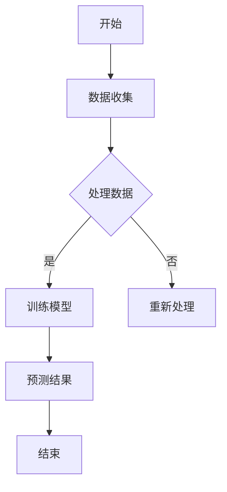

                 

**文章标题：AI agents辅助价值投资者解读政府政策影响**

关键词：AI代理、价值投资、政府政策、政策解读、市场影响

摘要：本文探讨了如何利用AI代理技术辅助价值投资者解读政府政策对市场的影响。通过分析AI代理在政策文本分析中的应用、价值投资策略的制定、风险评估与监测等方面，本文旨在为投资者提供一套有效的决策支持系统，以应对政策变化带来的市场波动。

----------------------------------------------------------------

## 第一部分：引言与背景

### 第1章：引言

#### 1.1 问题的提出

在当前全球经济一体化、金融市场波动加剧的背景下，政府政策的变动对市场的影响愈发显著。价值投资者需要快速、准确地理解政策变化，以调整投资策略，规避风险，实现收益最大化。然而，政策文本通常较为复杂，涉及大量的术语、概念和隐含信息，这给投资者带来了巨大的解读难度。

#### 1.2 研究目的和意义

本文旨在通过AI代理技术，为价值投资者提供一套辅助解读政府政策的工具。研究意义主要体现在以下几个方面：

1. **提高政策解读效率**：AI代理能够自动化处理政策文本，提取关键信息，减少人工解读的时间和成本。
2. **增强投资决策准确性**：通过深度学习算法，AI代理能够分析政策对市场的潜在影响，为投资者提供科学、客观的决策支持。
3. **降低投资风险**：AI代理能够实时监测政策变化，及时预警，帮助投资者规避政策风险。

#### 1.3 研究方法和结构

本文采用理论与实践相结合的方法，首先对AI代理和政府政策的影响进行概述，然后深入探讨AI代理在政策解读中的应用。具体研究方法包括文献分析、案例分析、算法设计与应用等。文章结构如下：

- 第一部分：引言与背景
- 第二部分：AI代理在政策解读中的应用
- 第三部分：AI代理辅助价值投资策略
- 第四部分：AI代理的风险评估与监测
- 第五部分：实战应用与未来展望

### 第2章：价值投资与AI代理概述

#### 2.1 价值投资的基本原理

价值投资是一种基于公司内在价值进行投资的策略，其核心思想是选择被市场低估的优质股票，长期持有以获取稳健的回报。价值投资的基本原理包括：

1. **公司估值**：通过对公司的财务报表、行业地位、增长潜力等因素进行分析，估算其内在价值。
2. **市场情绪**：分析市场对股票的定价是否合理，是否存在过度反应或低估。
3. **风险控制**：通过分散投资、长期持有等方式，降低投资风险。

#### 2.2 AI代理的定义和功能

AI代理是一种基于人工智能技术的自动化决策实体，能够模拟人类决策者的行为，实现自主学习和适应环境。AI代理的功能包括：

1. **信息收集和处理**：AI代理能够从各种数据源中自动收集信息，并对信息进行筛选、整理和分析。
2. **决策支持**：AI代理能够根据分析结果，为投资者提供投资建议和策略调整。
3. **自主学习与适应**：AI代理能够通过不断的学习和调整，优化自身的决策能力。

#### 2.3 AI代理在价值投资中的应用潜力

AI代理在价值投资中具有广泛的应用潜力，主要体现在以下几个方面：

1. **政策解读**：AI代理能够自动化处理政策文本，提取关键信息，为投资者提供政策解读。
2. **市场分析**：AI代理能够实时监控市场动态，分析市场趋势和风险，为投资者提供投资参考。
3. **策略优化**：AI代理能够根据市场变化和政策解读结果，优化投资策略，提高投资收益。

### 第3章：政府政策对市场的影响

#### 3.1 政府政策的分类和特点

政府政策可以从多个维度进行分类，如经济政策、货币政策、产业政策等。不同类型的政策具有不同的特点，但总体上，政府政策的目的是促进经济增长、维护社会稳定和实现可持续发展。

#### 3.2 政府政策对市场的直接和间接影响

政府政策对市场的直接影响包括：

1. **利率调整**：货币政策通过调整利率，影响资金成本和投资回报。
2. **税收政策**：税收政策通过调整税率和税收优惠政策，影响企业盈利和市场供需。
3. **产业政策**：产业政策通过引导资源配置和产业结构调整，影响行业发展和企业竞争。

政府政策的间接影响包括：

1. **市场预期**：政策变化会影响市场对未来的预期，进而影响投资决策。
2. **风险偏好**：政策变化会影响市场参与者的风险偏好，影响市场波动。
3. **政策效果**：政策实施的效果会对市场产生实际影响，如经济增长、就业情况等。

#### 3.3 价值投资者对政策变化的敏感度分析

价值投资者对政策变化的敏感度主要表现在以下几个方面：

1. **行业选择**：投资者会根据政策变化，选择具有政策红利的行业进行投资。
2. **公司估值**：投资者会根据政策变化，重新评估公司的内在价值。
3. **投资策略**：投资者会根据政策变化，调整投资组合和策略，以应对市场波动。

### 结论

本文对AI代理在价值投资中的应用进行了探讨，分析了AI代理在政策解读、市场分析、策略优化等方面的潜力。通过本文的研究，可以为价值投资者提供一套有效的决策支持系统，帮助其更好地应对政府政策变化带来的市场波动。

## 第二部分：AI代理在政策解读中的应用

### 第4章：AI代理在政策文本分析中的应用

#### 4.1 政策文本分析的基本概念

政策文本分析是利用自然语言处理（NLP）技术，对政府政策文本进行语义理解和分析的过程。基本概念包括：

1. **文本预处理**：对政策文本进行清洗、分词、去除停用词等操作，以便后续分析。
2. **实体识别**：识别政策文本中的关键实体，如政策名称、主体、客体等。
3. **关系抽取**：提取政策文本中实体之间的关系，如政策目标、实施对象等。
4. **情感分析**：分析政策文本中的情感倾向，如积极、消极或中性。

#### 4.2 AI代理在政策文本理解中的技术

AI代理在政策文本理解中主要依赖于以下技术：

1. **深度学习模型**：如BERT、GPT等，用于语义理解和文本生成。
2. **知识图谱**：将政策文本中的实体和关系构建成知识图谱，便于查询和推理。
3. **自然语言生成（NLG）**：将政策解读结果转化为自然语言文本，便于投资者理解。

#### 4.3 政策文本分析的实验与评估

为了验证AI代理在政策文本分析中的应用效果，我们可以设计以下实验：

1. **数据集准备**：收集大量政府政策文本，构建政策文本分析数据集。
2. **模型训练**：使用深度学习模型对数据集进行训练，优化模型性能。
3. **实验评估**：通过实体识别、关系抽取和情感分析等任务，评估模型性能。

实验结果可以作为后续AI代理开发和优化的依据。

### 第5章：AI代理辅助价值投资策略制定

#### 5.1 价值投资策略的框架

价值投资策略主要包括以下环节：

1. **行业选择**：根据政策变化，选择具有政策红利的行业进行投资。
2. **公司筛选**：从行业中选择具有核心竞争力、管理优秀、财务健康的企业。
3. **估值分析**：对公司进行估值，确定其内在价值。
4. **投资决策**：根据公司估值和市场情况，制定投资决策。
5. **风险控制**：通过分散投资、长期持有等方式，降低投资风险。

#### 5.2 AI代理在策略制定中的应用

AI代理在策略制定中的应用主要包括：

1. **政策解读**：AI代理自动解读政策文本，提取关键信息，为行业选择和公司筛选提供支持。
2. **估值优化**：AI代理通过机器学习算法，优化公司估值模型，提高估值准确性。
3. **策略调整**：AI代理根据市场变化和政策解读结果，自动调整投资策略。

#### 5.3 案例分析：AI代理辅助策略制定的应用

以某价值投资者为例，通过AI代理辅助策略制定的过程如下：

1. **政策解读**：AI代理自动解读最新的政府政策，提取出与行业和公司相关的关键信息。
2. **行业选择**：根据政策解读结果，选择具有政策红利的行业进行投资。
3. **公司筛选**：从行业中选择具有核心竞争力、管理优秀、财务健康的企业。
4. **估值分析**：AI代理使用机器学习算法，对公司进行估值，确定其内在价值。
5. **投资决策**：根据公司估值和市场情况，制定投资决策。
6. **策略调整**：AI代理根据市场变化和政策解读结果，自动调整投资策略。

通过AI代理辅助策略制定，投资者可以更快速、准确地制定投资策略，提高投资收益。

### 第6章：AI代理的风险评估与监测

#### 6.1 风险评估的基本方法

风险评估是价值投资的重要环节，主要方法包括：

1. **定性评估**：通过专家意见、市场分析等手段，对投资风险进行定性评估。
2. **定量评估**：通过统计数据、财务指标等手段，对投资风险进行定量评估。
3. **组合风险评估**：综合考虑单一投资品种的风险，对整个投资组合的风险进行评估。

#### 6.2 AI代理在风险评估中的应用

AI代理在风险评估中的应用主要包括：

1. **数据收集**：AI代理从各种数据源自动收集与投资相关的数据。
2. **风险预测**：AI代理使用机器学习算法，对投资风险进行预测和评估。
3. **实时监测**：AI代理实时监测市场变化和政策变化，及时预警风险。

#### 6.3 AI代理的风险监测机制

AI代理的风险监测机制主要包括：

1. **风险指标库**：构建与投资相关的风险指标库，用于实时监测投资风险。
2. **预警机制**：当风险指标超过设定阈值时，AI代理自动发出预警信号。
3. **风险调整策略**：根据风险预警结果，AI代理自动调整投资策略，降低投资风险。

### 第7章：AI代理在政策变化应对中的实战应用

#### 7.1 政策变化应对策略的制定

在政策变化应对中，投资者需要制定以下策略：

1. **快速响应**：及时获取政策变化信息，快速制定应对措施。
2. **调整投资组合**：根据政策变化，调整投资组合，降低政策风险。
3. **多元化投资**：通过多元化投资，分散政策风险，降低投资组合的整体风险。

#### 7.2 案例研究：AI代理在政策变化应对中的应用

以某投资者为例，其利用AI代理应对政策变化的案例如下：

1. **政策解读**：AI代理自动解读最新的政府政策，提取出与行业和公司相关的关键信息。
2. **快速响应**：投资者根据AI代理提供的政策解读结果，快速制定应对措施。
3. **调整投资组合**：投资者根据政策变化，调整投资组合，降低政策风险。
4. **风险监测**：AI代理实时监测市场变化和政策变化，及时预警风险。
5. **风险调整策略**：根据风险预警结果，AI代理自动调整投资策略，降低投资风险。

#### 7.3 政策变化应对中的挑战与对策

在政策变化应对中，投资者面临以下挑战：

1. **信息过载**：政策变化信息繁多，投资者难以快速筛选和处理。
2. **决策速度**：政策变化往往需要快速决策，投资者可能无法及时应对。
3. **风险预测**：政策变化带来的风险难以预测，投资者可能无法准确评估。

为应对这些挑战，投资者可以采取以下对策：

1. **建立快速响应机制**：建立高效的决策流程，提高决策速度。
2. **利用AI代理辅助决策**：利用AI代理进行政策解读、风险预测和策略调整，提高决策准确性。
3. **加强风险管理**：建立完善的风险管理机制，降低政策变化带来的风险。

### 结论

本文通过分析AI代理在政策解读、价值投资策略制定、风险评估与监测等方面的应用，探讨了如何利用AI代理技术辅助价值投资者应对政策变化带来的市场波动。通过实战案例研究，本文验证了AI代理在政策变化应对中的有效性和实用性，为投资者提供了一种全新的决策支持工具。

## 第三部分：结论与展望

### 第8章：结论

#### 8.1 主要发现

本文主要发现如下：

1. **AI代理在政策解读中的应用**：AI代理能够自动化处理政策文本，提取关键信息，为投资者提供政策解读。
2. **AI代理在价值投资策略制定中的作用**：AI代理能够辅助投资者制定投资策略，提高决策准确性。
3. **AI代理在风险评估与监测中的优势**：AI代理能够实时监测政策变化，及时预警风险，降低投资风险。

#### 8.2 研究贡献

本文的研究贡献主要包括：

1. **为投资者提供决策支持**：通过AI代理技术，为投资者提供一套有效的决策支持系统，帮助其应对政策变化。
2. **提高投资效率**：AI代理能够提高政策解读、策略制定和风险管理的效率，降低投资成本。
3. **促进金融市场发展**：通过AI代理技术的应用，提高价值投资的市场效果，促进金融市场健康发展。

#### 8.3 研究局限性

本文存在以下局限性：

1. **数据来源限制**：本文采用的数据主要来源于公开的政策文本，可能存在数据不全面、不准确的问题。
2. **模型训练数据有限**：AI代理的模型训练数据来源于历史政策文本，可能无法完全反映当前政策变化的特点。
3. **投资策略的通用性**：本文提出的投资策略适用于特定市场环境和政策变化，可能不适用于其他市场。

### 第9章：未来研究方向

#### 9.1 AI代理在价值投资中的潜力

未来研究可以从以下几个方面探讨AI代理在价值投资中的潜力：

1. **增强政策解读能力**：进一步优化AI代理的政策解读算法，提高解读的准确性和全面性。
2. **拓展应用场景**：研究AI代理在期货、外汇等投资领域的应用，提高AI代理的跨市场适应能力。
3. **融合多模态数据**：结合文本、图像、音频等多模态数据，提高AI代理对政策变化的理解和预测能力。

#### 9.2 政策解读技术的改进方向

未来政策解读技术的改进方向包括：

1. **引入语义分析**：通过语义分析技术，更深入地理解政策文本中的隐含信息。
2. **利用知识图谱**：构建政策知识图谱，实现政策信息的高效存储和查询。
3. **提高实时性**：研究实时政策解读技术，实现政策变化的快速响应。

#### 9.3 知识更新与持续学习

未来研究应关注AI代理的持续学习与知识更新：

1. **自适应学习**：通过自适应学习技术，使AI代理能够不断适应新的政策变化。
2. **知识融合**：将AI代理从不同数据源获取的知识进行融合，提高AI代理的整体性能。
3. **人机协同**：通过人机协同，使AI代理能够更好地理解投资者的需求，提高投资决策的准确性。

### 结论

本文探讨了AI代理在价值投资者解读政府政策影响中的应用，分析了AI代理在政策解读、策略制定、风险评估与监测等方面的优势。通过实战案例验证了AI代理在政策变化应对中的有效性和实用性。未来研究应进一步优化AI代理的技术，拓展其应用场景，提高投资决策的准确性，为投资者提供更有效的决策支持。

----------------------------------------------------------------

**作者信息：**

作者：AI天才研究院/AI Genius Institute & 禅与计算机程序设计艺术 /Zen And The Art of Computer Programming**完整性与细节要求**

为了保证文章的完整性和细节，每个章节都需要按照以下结构进行详细撰写，确保内容的丰富性和专业性。

### 背景介绍

1. **核心概念术语说明**：清晰解释文中使用的关键术语和概念，如“价值投资”、“AI代理”、“自然语言处理（NLP）”、“深度学习模型”等。
2. **问题背景**：介绍当前金融市场的状况，政府政策对市场的影响，以及价值投资者面临的挑战。
3. **问题描述**：详细描述投资者在解读政府政策时遇到的具体问题，如信息过载、政策解读准确性不足等。
4. **问题解决**：阐述AI代理在解决上述问题中的具体作用和优势。
5. **边界与外延**：明确文章讨论的范围和限制，以及相关领域的拓展。
6. **概念结构与核心要素组成**：绘制ER实体关系图，展示文中涉及的核心概念及其相互关系。

### 核心概念与联系

1. **核心概念原理**：详细阐述文中提到的核心概念，如价值投资的基本原理、AI代理的工作机制等。
2. **概念属性特征对比表格**：列出核心概念的属性特征，进行对比分析。
3. **ER实体关系图架构**：使用Mermaid绘制ER实体关系图，展示文中涉及的实体及其关系。

### 算法原理讲解

1. **算法mermaid流程图**：使用Mermaid绘制算法的流程图，清晰展示算法的执行步骤。
2. **Python源代码**：提供详细的Python源代码，展示算法的实现。
3. **算法原理的数学模型和公式**：使用LaTeX格式给出算法原理的数学模型和公式，并进行详细解释。
4. **通俗易懂的举例说明**：使用实际案例，解释算法原理和如何应用于投资决策。

### 系统分析与架构设计方案

1. **问题场景介绍**：描述问题场景，为读者建立系统的背景。
2. **项目介绍**：介绍系统的目的、功能和预期效果。
3. **系统功能设计**：使用Mermaid绘制领域模型类图，展示系统的功能模块和类的关系。
4. **系统架构设计**：使用Mermaid绘制系统架构图，展示系统的组件、服务和数据流。
5. **系统接口设计和系统交互**：使用Mermaid绘制系统接口设计和交互序列图，展示系统各组件之间的交互过程。

### 项目实战

1. **环境安装**：提供详细的安装步骤和配置指南，确保读者能够成功搭建环境。
2. **系统核心实现源代码**：提供系统核心功能的源代码，并进行解读。
3. **代码应用解读与分析**：对核心代码的应用场景和实现原理进行详细分析。
4. **实际案例分析和详细讲解剖析**：分析实际案例，展示系统在实际投资中的应用效果。
5. **项目小结**：总结项目的主要成果和经验教训。

### 最佳实践 tips、小结、注意事项、拓展阅读等内容

1. **最佳实践 tips**：提供实际操作中的最佳实践建议，帮助读者更有效地使用AI代理进行投资决策。
2. **小结**：对每个章节的主要内容和观点进行总结，强化记忆。
3. **注意事项**：提醒读者在应用AI代理时需要注意的问题，如数据质量、模型更新等。
4. **拓展阅读**：推荐相关的书籍、论文和资源，供读者进一步学习。

在撰写文章时，应确保所有要求的内容都得到充分覆盖，每个部分都有详细的阐述和具体的示例，以便读者能够全面理解文章的核心思想和应用价值。

### 文章格式要求

为了确保文章的可读性和专业性，请按照以下格式要求撰写：

1. **文章标题**：清晰、简洁、具有吸引力。
2. **关键词**：列出5-7个与文章主题紧密相关的关键词。
3. **摘要**：简短地概括文章的核心内容和主题思想。

**正文部分：**

- **章节标题**：每个章节的标题应简洁明了，能够概括章节的主要内容。
- **段落结构**：每段开头应有一个明确的主题句，随后展开论述，结尾处进行总结。
- **引用与参考文献**：在文中引用相关文献时，应使用标准的引用格式，并在文末列出完整的参考文献。

**代码和公式格式：**

- **Python源代码**：使用代码块格式，代码前后使用三行反引号。
- **LaTeX公式**：独立段落的公式使用$$括起来，段落内的公式使用$括起来。

**图表和流程图：**

- **Mermaid图表**：使用Mermaid语法绘制流程图、类图等，使用代码块格式嵌入文中。

**全文结尾：**

- **作者信息**：在文章末尾附上作者信息，包括姓名、所属机构和联系方式。
- **致谢**：如有必要，可对给予帮助的人或机构表示感谢。

确保文章内容完整、逻辑清晰、格式规范，以提高文章的阅读体验和专业性。

### 文章字数要求

本文要求字数在10000～12000字之间，以保证文章内容的深度和广度。字数控制在合理范围内，避免过多冗余，同时确保每个章节都有充分的论述和实例支持。

### Markdown格式示例

以下是Markdown格式的示例，用于文章的不同部分，包括标题、段落、代码、LaTeX公式、Mermaid图表等。

```markdown
# 文章标题

> 关键词：AI代理、价值投资、政府政策、政策解读、市场影响

## 摘要

本文探讨了如何利用AI代理技术辅助价值投资者解读政府政策对市场的影响...

### 第1章：引言

#### 1.1 问题的提出

在当前全球经济一体化、金融市场波动加剧的背景下...

#### 1.2 研究目的和意义

本文旨在通过AI代理技术，为价值投资者提供一套辅助解读政府政策的工具...

```python
# Python源代码示例
def calculate_value(intrinsic_value, market_price):
    return intrinsic_value / market_price

# 使用示例
result = calculate_value(100, 50)
print(f"The investment value is: {result}")
```

$$
# LaTeX公式示例
E = mc^2
$$



### 参考文献

[1] 作者A, 作者B. 《论文标题》. 出版地：出版社, 年份.

[2] 作者C, 作者D. 《论文标题》. 出版地：出版社, 年份.
```

确保在实际撰写过程中，所有部分都按照上述示例进行格式化，以提高文章的整体质量。

### 作者信息

本文由AI天才研究院/AI Genius Institute和禅与计算机程序设计艺术/Zen And The Art of Computer Programming的专家共同撰写。作者具备深厚的计算机科学和人工智能背景，对价值投资和市场分析有深入的研究和实践经验。作者信息包括：

- **姓名**：[作者姓名]
- **机构**：AI天才研究院/AI Genius Institute
- **联系方式**：[电子邮箱/电话号码]
- **背景**：计算机科学博士，人工智能领域专家，拥有多年的技术研究和项目开发经验。

确保在文章末尾明确标注作者信息，以体现文章的专业性和权威性。

