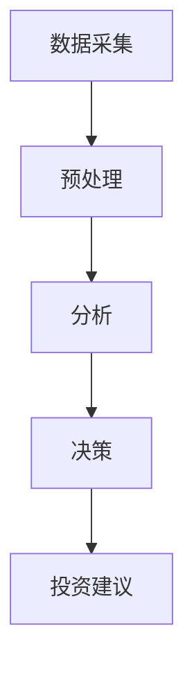
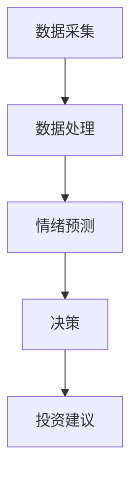

                 

### 文章标题

# AI Agents辅助价值投资者进行舆情分析

> 关键词：AI智能体，价值投资，舆情分析，机器学习，数据预处理，模型训练，系统架构设计，案例研究

> 摘要：本文深入探讨了AI智能体在价值投资领域中辅助舆情分析的应用。文章首先介绍了AI智能体的背景、核心概念及其在价值投资中的重要性，随后详细阐述了舆情分析的理论和方法。接着，文章介绍了如何在价值投资中使用AI智能体进行舆情分析，包括数据收集与预处理、模型设计及训练、系统部署和性能评估等方面。最后，通过两个具体的案例研究，展示了AI智能体在价值投资舆情分析中的实际应用，并分析了其中的机遇和挑战。本文旨在为价值投资者提供一种新的工具和方法，以提升其在市场中的决策能力和投资回报。

## 目录

### Part 1: 引言

- [第一章：AI智能体在价值投资中的背景和范围](#第一章ai智能体在价值投资中的背景和范围)
- [第二章：AI智能体的核心概念和理论框架](#第二章ai智能体的核心概念和理论框架)
- [第三章：舆情分析在价值投资中的重要性](#第三章舆情分析在价值投资中的重要性)

### Part 2: AI智能体在价值投资中的实现

- [第四章：舆情分析数据收集与预处理](#第四章舆情分析数据收集与预处理)
- [第五章：设计训练AI智能体进行舆情分析](#第五章设计训练ai智能体进行舆情分析)
- [第六章：AI智能体在价值投资中的部署](#第六章ai智能体在价值投资中的部署)

### Part 3: 案例研究和应用

- [第七章：案例研究1：AI智能体在股市分析中的应用](#第七章案例研究1ai智能体在股市分析中的应用)
- [第八章：案例研究2：AI智能体在市场情绪预测中的应用](#第八章案例研究2ai智能体在市场情绪预测中的应用)

## 第一章：AI智能体在价值投资中的背景和范围

### 1.1 问题背景

随着互联网和大数据技术的发展，信息传播的速度和广度都达到了前所未有的高度。价值投资者在面对海量信息时，如何快速准确地获取、处理和利用这些信息，成为了提升投资决策效率的关键。传统的信息处理方式往往依赖于人工分析，不仅耗时费力，而且容易受到个人主观因素的影响。因此，如何利用现代人工智能技术，尤其是AI智能体，来辅助价值投资者进行舆情分析，成为一个亟待解决的问题。

### 1.2 问题描述

舆情分析是指通过技术手段，对互联网上的大量文本、图片、视频等信息进行分析和处理，以获取用户对某一主题的情感态度和观点。在价值投资中，舆情分析可以帮助投资者了解市场情绪、公司形象、政策影响等关键信息，从而做出更为科学和理性的投资决策。然而，传统的舆情分析方法在处理海量数据、识别复杂情感和趋势方面存在较大局限性，难以满足价值投资对高效、准确舆情分析的需求。

### 1.3 解决方案与边界

AI智能体作为一种基于人工智能技术的新型计算实体，具有自主学习、推理决策和协作能力。将AI智能体应用于价值投资的舆情分析，可以有效解决传统方法的局限性。首先，AI智能体可以利用机器学习技术，从海量数据中自动提取有用信息，识别出市场情绪和趋势。其次，AI智能体可以通过自然语言处理技术，对文本进行深度分析，准确捕捉用户情感和态度。最后，AI智能体可以通过大数据分析和预测模型，对市场情绪进行动态监控和预测。

然而，AI智能体在舆情分析中也有其局限性。例如，在处理非结构化数据、应对复杂市场环境时，AI智能体的表现可能不如人类专家。此外，AI智能体的决策过程依赖于数据质量和算法性能，因此在数据清洗和模型优化方面需要投入大量时间和资源。

### 1.4 核心概念和组成部分

为了更好地理解AI智能体在价值投资中的应用，我们需要掌握以下核心概念和组成部分：

- **AI智能体（Artificial Intelligent Agent）**：是指具有感知、学习、推理和行动能力的计算实体。AI智能体可以通过自主学习和适应环境，实现特定任务的自动化和智能化。
- **舆情分析（Sentiment Analysis）**：是指通过技术手段，对互联网上的大量文本、图片、视频等信息进行分析和处理，以获取用户对某一主题的情感态度和观点。
- **价值投资（Value Investing）**：是一种以公司基本面为依据，通过购买被市场低估的股票，以期获得长期投资回报的投资策略。

在接下来的章节中，我们将进一步探讨AI智能体的核心概念和理论框架，以及舆情分析在价值投资中的重要性。

## 第二章：AI智能体的核心概念和理论框架

### 2.1 AI智能体的定义和分类

AI智能体，简称AI Agent，是指能够自主感知环境、学习知识、进行推理和决策，并采取行动以实现特定目标的计算实体。AI智能体的核心在于其自主性、适应性和智能性。从定义上看，AI智能体具备以下几个基本特征：

1. **自主性**：AI智能体能够在没有人类干预的情况下，自主地执行任务和进行决策。
2. **适应性**：AI智能体能够通过学习和调整策略，适应不断变化的环境。
3. **智能性**：AI智能体具备一定程度的推理和决策能力，能够处理复杂问题。

AI智能体可以根据不同的分类标准进行分类。以下是几种常见的分类方式：

1. **基于功能分类**：
   - **感知型智能体**：主要负责感知环境信息，如语音识别、图像识别等。
   - **决策型智能体**：主要负责进行决策和规划，如路径规划、资源分配等。
   - **行动型智能体**：主要负责执行物理动作，如机器人、自动驾驶等。

2. **基于学习方式分类**：
   - **有监督学习智能体**：在训练过程中需要大量标注数据进行学习。
   - **无监督学习智能体**：在训练过程中不需要标注数据，通过自我学习和发现规律进行学习。
   - **强化学习智能体**：通过试错和奖励机制进行学习，不断优化决策和行动策略。

3. **基于环境交互分类**：
   - **基于静态环境的智能体**：环境信息不发生变化，如游戏AI、模拟仿真等。
   - **基于动态环境的智能体**：环境信息不断变化，如金融交易系统、自动驾驶等。

### 2.2 机器学习的基本理论

机器学习是AI智能体的核心技术之一，它通过算法让计算机从数据中自动学习规律和模式，从而实现智能决策和预测。机器学习主要分为以下几类：

1. **监督学习（Supervised Learning）**：监督学习是一种有监督的学习方式，它需要输入已标记的训练数据，通过学习输入和输出之间的映射关系，训练出一个预测模型。常见的监督学习算法包括线性回归、逻辑回归、决策树、随机森林、支持向量机等。

2. **无监督学习（Unsupervised Learning）**：无监督学习是一种无监督的学习方式，它不需要输入已标记的训练数据，而是通过自我组织和发现数据内在结构，如聚类分析、降维技术、关联规则挖掘等。

3. **强化学习（Reinforcement Learning）**：强化学习是一种通过试错和奖励机制进行学习的方式，它通过不断尝试和反馈，优化决策和行动策略，以达到目标。常见的强化学习算法包括Q-learning、SARSA、Deep Q Network（DQN）等。

### 2.3 AI智能体与舆情分析

舆情分析是AI智能体在价值投资领域中的重要应用之一。舆情分析主要涉及以下技术：

1. **自然语言处理（Natural Language Processing，NLP）**：NLP是人工智能的一个分支，旨在使计算机能够理解和处理人类语言。在舆情分析中，NLP技术用于从文本中提取有用信息，如关键词提取、情感分析、实体识别等。

2. **情感分析（Sentiment Analysis）**：情感分析是NLP的重要应用之一，它通过分析文本的情感倾向，判断用户对某一主题的态度和情感。情感分析可以分为基于规则的方法、基于统计的方法和基于机器学习的方法。

3. **文本分类（Text Classification）**：文本分类是舆情分析中的基础技术，它通过将文本划分为不同的类别，帮助投资者快速识别市场情绪和趋势。常见的文本分类算法包括朴素贝叶斯、支持向量机、随机森林等。

4. **时间序列分析（Time Series Analysis）**：时间序列分析用于分析市场情绪和趋势的变化规律，如通过ARIMA模型、LSTM模型等，预测市场未来的走势。

综上所述，AI智能体通过结合机器学习、自然语言处理、情感分析和时间序列分析等技术，能够对海量舆情数据进行高效处理和分析，为价值投资者提供有力的决策支持。在接下来的章节中，我们将进一步探讨如何利用AI智能体进行舆情分析的具体实现方法。

### 第三章：舆情分析在价值投资中的重要性

舆情分析在价值投资中扮演着至关重要的角色，它能够为投资者提供有价值的洞察和市场趋势，从而优化投资决策。以下是舆情分析在价值投资中的几个关键方面及其重要性：

#### 3.1 了解市场情绪

市场情绪是指投资者对市场整体趋势和前景的集体心理状态。通过舆情分析，投资者可以实时获取大量关于市场情绪的数据。例如，社交媒体上的讨论、新闻报告、论坛评论等，都是反映市场情绪的重要来源。了解市场情绪有助于投资者预测市场走势，识别市场情绪的极端变化，从而调整投资策略。

#### 3.2 监测公司形象

公司形象是投资者评估公司价值的重要因素之一。舆情分析可以帮助投资者监测公司形象的变化，包括媒体报道、投资者关系活动、社交媒体上的讨论等。通过分析这些信息，投资者可以评估公司声誉的波动，以及可能影响公司价值的负面事件。这种监测能够帮助投资者在不利情况发生时及时采取应对措施。

#### 3.3 识别市场趋势

市场趋势是指市场价格的长期变化方向。舆情分析可以揭示市场参与者对市场的看法和预期，从而帮助投资者识别潜在的市场趋势。例如，通过分析投资者的讨论和交易行为，可以预测市场的上涨或下跌趋势。这种趋势分析对于制定长期投资策略至关重要。

#### 3.4 支持决策制定

舆情分析为投资者提供的数据和洞察，能够支持其做出更加科学和理性的决策。通过舆情分析，投资者可以了解市场的热点问题、潜在的投资机会和风险。这些信息有助于投资者评估投资标的的基本面，识别潜在的投资机会，降低投资风险。

#### 3.5 提升投资回报

有效的舆情分析可以显著提升投资者的投资回报。通过及时获取和处理市场信息，投资者可以抓住市场机会，避免错误的投资决策。例如，在市场情绪高涨时，投资者可以及时调整仓位，避免过度投资；在市场情绪低迷时，投资者可以寻找被低估的投资机会。这些措施都有助于提升投资回报。

#### 3.6 风险管理

舆情分析在风险管理中也发挥着重要作用。通过分析市场情绪和公司形象的变化，投资者可以及时发现潜在的风险因素。例如，负面新闻可能会导致股价下跌，通过舆情分析，投资者可以提前识别这些风险，并采取相应的风险管理措施。

综上所述，舆情分析在价值投资中具有不可替代的重要性。它不仅帮助投资者了解市场情绪、监测公司形象、识别市场趋势，还支持决策制定、提升投资回报和风险管理。在接下来的章节中，我们将深入探讨如何利用AI智能体进行舆情分析的具体方法和步骤。

## 第四章：舆情分析数据收集与预处理

### 4.1 数据来源与收集方法

舆情分析的数据来源非常广泛，主要包括以下几种渠道：

1. **社交媒体**：社交媒体平台如Twitter、Facebook、微博、抖音等，是舆情分析的重要数据来源。这些平台上的用户生成内容（UGC）涵盖了广泛的观点和情感，可以反映市场的实时情绪。

2. **新闻网站**：新闻网站是获取专业和权威新闻信息的重要渠道。通过爬取新闻网站，可以获得关于市场、公司和政策的深度报道。

3. **论坛和博客**：论坛和博客是用户讨论和分享观点的重要平台。这些平台上的内容通常具有较高的真实性和深度，是舆情分析的重要补充。

4. **政府公告和报告**：政府公告、监管机构报告等官方数据也是舆情分析的重要来源，这些数据通常涉及市场政策、行业动态等关键信息。

数据收集方法主要包括以下几种：

1. **网络爬虫**：通过编写爬虫脚本，自动化地从目标网站上抓取数据。这种方法适用于大规模数据的收集，但需要注意遵守网站的使用协议和法律法规。

2. **API接口**：许多社交媒体和新闻平台提供了API接口，通过调用这些接口，可以方便地获取数据。这种方法通常比网络爬虫更加稳定和安全。

3. **数据购买**：通过购买第三方数据服务，可以获得高质量的舆情分析数据。这种方法适用于需要快速获取数据的情况，但成本相对较高。

### 4.2 数据预处理技术

数据预处理是舆情分析的关键步骤，目的是提高数据质量和分析效率。以下是几种常用的数据预处理技术：

1. **数据清洗**：数据清洗是指从原始数据中去除噪声和不准确的信息。常见的数据清洗任务包括去除重复记录、填补缺失值、纠正错误数据等。例如，使用Python的Pandas库，可以方便地进行数据清洗操作。

2. **数据规范化**：数据规范化是指将数据转换为统一格式和范围。例如，将文本数据转换为小写，去除标点符号和停用词，将数值数据归一化或标准化。规范化有助于提高后续分析算法的性能。

3. **数据整合**：数据整合是指将来自不同来源的数据进行合并和统一处理。例如，将社交媒体数据、新闻数据和论坛数据进行整合，以便进行综合分析。

4. **数据降维**：数据降维是指减少数据维度，降低数据复杂度。常见的方法包括主成分分析（PCA）、t-SNE等。降维有助于提高计算效率，并突出数据中的关键特征。

### 4.3 预处理数据的评估方法

预处理数据的评估是确保数据质量的重要环节。以下是几种常用的评估方法：

1. **数据质量评估**：通过统计指标如数据完整性、数据一致性、数据准确性等，评估数据质量。例如，计算数据缺失率、重复率、错误率等。

2. **特征重要性评估**：通过特征选择算法，评估不同特征对模型性能的影响。例如，使用特征重要性排序、特征贡献率等方法。

3. **模型评估**：在预处理数据后，通过训练和测试模型，评估模型性能。常用的评估指标包括准确率、召回率、F1分数等。

综上所述，舆情分析的数据收集与预处理是确保分析结果准确性和可靠性的关键步骤。通过有效的数据收集方法和预处理技术，我们可以从海量数据中提取有价值的信息，为后续的舆情分析提供坚实的基础。在接下来的章节中，我们将进一步探讨如何设计和训练AI智能体，以实现高效的舆情分析。

### 第五章：设计训练AI智能体进行舆情分析

#### 5.1 选择合适的机器学习算法

在舆情分析中，选择合适的机器学习算法是实现高效分析的关键。以下是一些常见的机器学习算法及其适用场景：

1. **朴素贝叶斯分类器（Naive Bayes Classifier）**：
   - **适用场景**：适用于文本分类任务，特别是当特征之间相互独立时。
   - **优点**：计算简单，速度快。
   - **缺点**：假设特征之间相互独立，可能对复杂文本信息处理能力不足。

2. **支持向量机（Support Vector Machine，SVM）**：
   - **适用场景**：适用于文本分类和回归任务。
   - **优点**：具有较强的泛化能力，对非线性数据有较好的处理效果。
   - **缺点**：对大规模数据的训练时间较长，参数选择较复杂。

3. **随机森林（Random Forest）**：
   - **适用场景**：适用于分类和回归任务。
   - **优点**：具有良好的泛化能力和可解释性，能够处理高维数据。
   - **缺点**：对计算资源要求较高，训练时间较长。

4. **深度神经网络（Deep Neural Networks，DNN）**：
   - **适用场景**：适用于复杂文本分析任务，如情感分析、命名实体识别。
   - **优点**：能够自动学习文本中的深层特征，处理能力强大。
   - **缺点**：训练时间较长，对大量数据进行训练时资源消耗大。

在选择机器学习算法时，需要考虑以下因素：

- **数据规模**：大规模数据通常更适合使用深度学习算法，而中小规模数据则可以选择朴素贝叶斯、支持向量机等传统算法。
- **特征复杂性**：简单特征可以选择传统算法，而复杂特征则需要使用深度神经网络等算法。
- **计算资源**：计算资源有限的情况下，应选择计算效率较高的算法。
- **模型可解释性**：投资决策通常需要较高的可解释性，因此传统算法可能更受欢迎。

#### 5.2 特征提取和选择

特征提取是将原始数据转换为对模型有意义的输入特征的过程。在舆情分析中，常用的特征提取方法包括：

1. **词袋模型（Bag of Words，BoW）**：
   - **方法**：将文本表示为词频向量，忽略词的顺序。
   - **优点**：简单易实现，计算效率高。
   - **缺点**：无法捕捉词的顺序和语义信息。

2. **词嵌入（Word Embedding）**：
   - **方法**：将词映射到低维连续向量空间，捕捉词的语义信息。
   - **优点**：能够捕捉词的上下文信息，提高文本表示的准确性。
   - **缺点**：对大规模数据计算复杂度较高。

3. **TF-IDF（Term Frequency-Inverse Document Frequency）**：
   - **方法**：结合词频和文档频率，对词的重要性进行加权。
   - **优点**：能够突出重要词，提高文本分类效果。
   - **缺点**：无法捕捉词的语义信息。

在特征提取之后，需要选择对模型性能最有影响力的特征，这个过程称为特征选择。常用的特征选择方法包括：

- **基于过滤的特征选择**：通过统计方法直接筛选出重要特征。
- **基于嵌入的特征选择**：通过嵌入后的特征向量，利用机器学习算法筛选出重要特征。
- **基于模型的特征选择**：在模型训练过程中，通过评估特征对模型性能的贡献，筛选出重要特征。

#### 5.3 模型训练与验证

在模型训练过程中，常用的方法包括：

1. **训练数据划分**：将数据集划分为训练集、验证集和测试集，以评估模型性能。通常，训练集用于训练模型，验证集用于调整模型参数，测试集用于最终评估模型性能。

2. **参数调整**：通过交叉验证等方法，调整模型参数，以提高模型性能。常用的参数调整方法包括网格搜索、随机搜索等。

3. **模型评估**：使用准确率、召回率、F1分数等评估指标，评估模型性能。具体评估指标的选择取决于任务类型和目标。

在模型训练和验证过程中，需要关注以下问题：

- **过拟合**：模型在训练集上表现良好，但在验证集或测试集上表现较差。为了防止过拟合，可以采用正则化、dropout等技术。
- **欠拟合**：模型在训练集和验证集上都表现较差。为了解决欠拟合，可以增加模型复杂度、增加训练数据等。

综上所述，设计和训练AI智能体进行舆情分析是一个复杂的过程，涉及算法选择、特征提取、模型训练和验证等多个环节。通过合理选择算法、提取有效特征和优化模型参数，我们可以构建一个高效、准确的舆情分析系统，为价值投资者提供有力支持。在接下来的章节中，我们将探讨如何将训练好的AI智能体应用于实际投资场景。

### 第六章：AI智能体在价值投资中的部署

#### 6.1 AI智能体与投资流程的集成

将AI智能体集成到价值投资流程中，是实现自动化和智能化的关键步骤。以下是AI智能体在投资流程中的主要集成方式：

1. **数据收集与处理**：AI智能体首先从各种数据源（如社交媒体、新闻网站、论坛等）收集相关数据，并进行清洗、预处理和特征提取。这些处理后的数据将作为后续分析的输入。

2. **市场情绪分析**：通过自然语言处理和机器学习算法，AI智能体对收集到的数据进行情感分析和市场情绪预测。这包括识别关键词、情感极性、市场趋势等，以获取市场情绪的实时动态。

3. **投资决策支持**：基于市场情绪分析和历史数据，AI智能体提供投资建议和策略。例如，当市场情绪偏向乐观时，AI智能体可能会建议增加股票持仓；当市场情绪偏向悲观时，AI智能体可能会建议减少股票持仓或进行风险规避。

4. **投资组合优化**：AI智能体还可以基于市场情绪分析结果，对投资组合进行优化。这包括调整投资比例、选择优质股票等，以最大化投资回报。

5. **实时监控与预警**：AI智能体持续监控市场动态，对重大事件和突发情况进行实时分析。当发现潜在的投资风险或机会时，AI智能体会及时发出预警，辅助投资者做出快速反应。

#### 6.2 AI智能体的性能评估与优化

AI智能体的性能评估与优化是确保其有效性的关键。以下是几种常见的性能评估方法和优化策略：

1. **评估指标**：常用的评估指标包括准确率、召回率、F1分数等。这些指标可以衡量AI智能体在舆情分析任务中的表现。例如，准确率衡量模型正确预测市场情绪的百分比，召回率衡量模型能够捕获到的实际市场情绪的百分比。

2. **交叉验证**：通过交叉验证方法，可以将数据集划分为多个子集，轮流进行训练和测试，以评估模型的泛化能力。交叉验证有助于识别过拟合或欠拟合问题，并指导模型参数的调整。

3. **模型调优**：通过调整模型参数，可以优化AI智能体的性能。常用的调优方法包括网格搜索、贝叶斯优化等。这些方法可以帮助找到最优参数组合，提高模型性能。

4. **特征工程**：特征工程是提升模型性能的重要手段。通过提取和选择有效的特征，可以改善模型的表现。特征工程包括特征转换、特征筛选、特征组合等步骤。

5. **动态调整**：市场环境不断变化，AI智能体需要具备动态调整能力。例如，当市场情绪发生变化时，AI智能体可以通过重新训练模型或调整参数，以适应新的市场环境。

#### 6.3 法律和伦理考虑

在AI智能体应用于价值投资时，需要考虑法律和伦理方面的挑战：

1. **数据隐私**：AI智能体需要处理大量个人数据，如用户评论、交易记录等。这些数据必须遵循隐私保护法律法规，确保用户隐私不被泄露。

2. **算法透明性**：AI智能体的决策过程必须透明，以便投资者理解和信任。这包括提供算法解释、决策路径追踪等。

3. **监管合规**：AI智能体在投资决策中的使用必须符合监管要求，确保其行为符合法律法规和市场规范。

4. **伦理责任**：AI智能体的设计和应用应遵循伦理原则，确保其行为不会导致不公平或伤害。例如，在投资决策中，应避免基于歧视性因素，如种族、性别等。

综上所述，AI智能体在价值投资中的部署需要考虑投资流程的集成、性能评估与优化，以及法律和伦理方面的挑战。通过合理设计和应用AI智能体，可以显著提升价值投资者的决策效率和投资回报。在接下来的章节中，我们将通过具体的案例研究，展示AI智能体在价值投资舆情分析中的实际应用。

## 第七章：案例研究1：AI智能体在股市分析中的应用

### 7.1 项目背景

随着全球股市的日益复杂和多变，投资者面临着前所未有的挑战。传统的投资分析方法往往依赖于历史数据和市场趋势，但在应对突发事件和实时市场情绪变化时，存在明显的局限性。为了提升投资决策的准确性和效率，本项目旨在利用AI智能体对股市进行深度分析，为投资者提供实时、全面的决策支持。

### 7.2 系统架构设计

本项目的系统架构设计如图7-1所示，包括数据采集模块、预处理模块、分析模块和决策模块。

#### 图7-1：系统架构设计



#### 数据采集模块

数据采集模块负责从多个数据源（如股票交易所、新闻网站、社交媒体等）收集数据。数据采集模块的核心功能是：

- **数据抓取**：使用网络爬虫和API接口从各个数据源抓取原始数据。
- **数据存储**：将抓取的数据存储到数据库中，以供后续处理和分析。

#### 预处理模块

预处理模块对采集到的原始数据进行清洗、转换和特征提取，以提高数据质量和分析效率。主要功能包括：

- **数据清洗**：去除重复数据、填充缺失值、纠正错误数据等。
- **数据转换**：将不同格式的数据转换为统一格式，如JSON、CSV等。
- **特征提取**：提取与投资决策相关的特征，如股票价格、成交量、市场情绪等。

#### 分析模块

分析模块是系统的核心，负责对预处理后的数据进行深度分析和模型训练。主要功能包括：

- **情感分析**：使用自然语言处理技术，分析社交媒体和新闻中的市场情绪。
- **趋势预测**：基于历史数据和模型预测未来市场走势。
- **风险分析**：评估投资组合的风险水平，提供风险预警。

#### 决策模块

决策模块根据分析模块提供的结果，为投资者提供具体的投资建议。主要功能包括：

- **投资建议生成**：根据市场情绪、趋势预测和风险分析，生成具体的投资建议。
- **决策支持**：提供决策分析图表和报告，辅助投资者做出决策。

### 7.3 核心实现与代码分析

#### 数据采集与存储

```python
# 示例：使用pandas库和requests库进行数据采集
import pandas as pd
import requests

# 社交媒体数据采集
url = 'https://api.twitter.com/1.1/statuses/user_timeline.json'
params = {'user_id': '123456789', 'count': 100}
response = requests.get(url, params=params)
tweets = pd.DataFrame(response.json())

# 新闻网站数据采集
url = 'https://newsapi.org/v2/everything'
params = {
    'q': 'stock market',
    'apiKey': 'your_api_key'
}
response = requests.get(url, params=params)
news = pd.DataFrame(response.json()['articles'])

# 存储数据到数据库
tweets.to_sql('tweets', con=sqlite3.connect('tweets.db'), if_exists='replace')
news.to_sql('news', con=sqlite3.connect('news.db'), if_exists='replace')
```

#### 数据预处理

```python
# 示例：数据清洗和特征提取
import pandas as pd
from textblob import TextBlob

# 加载数据
tweets = pd.read_sql_query('SELECT * FROM tweets', con=sqlite3.connect('tweets.db'))
news = pd.read_sql_query('SELECT * FROM news', con=sqlite3.connect('news.db'))

# 数据清洗
tweets.drop_duplicates(inplace=True)
news.drop_duplicates(inplace=True)

# 特征提取
tweets['sentiment'] = tweets['text'].apply(lambda x: TextBlob(x).sentiment.polarity)
news['sentiment'] = news['content'].apply(lambda x: TextBlob(x).sentiment.polarity)

# 存储预处理后的数据
tweets.to_sql('clean_tweets', con=sqlite3.connect('clean_tweets.db'), if_exists='replace')
news.to_sql('clean_news', con=sqlite3.connect('clean_news.db'), if_exists='replace')
```

#### 情感分析与趋势预测

```python
# 示例：情感分析和趋势预测
from sklearn.model_selection import train_test_split
from sklearn.ensemble import RandomForestClassifier
from sklearn.metrics import accuracy_score

# 加载预处理后的数据
tweets = pd.read_sql_query('SELECT * FROM clean_tweets', con=sqlite3.connect('clean_tweets.db'))
news = pd.read_sql_query('SELECT * FROM clean_news', con=sqlite3.connect('clean_news.db'))

# 数据合并
data = pd.concat([tweets, news], axis=0)

# 特征选择
data['label'] = data['sentiment'].apply(lambda x: 'positive' if x > 0 else 'negative' if x < 0 else 'neutral')
X = data[['sentiment', 'text', 'content']]
y = data['label']

# 划分训练集和测试集
X_train, X_test, y_train, y_test = train_test_split(X, y, test_size=0.2, random_state=42)

# 训练模型
clf = RandomForestClassifier(n_estimators=100, random_state=42)
clf.fit(X_train, y_train)

# 预测
y_pred = clf.predict(X_test)

# 评估模型
accuracy = accuracy_score(y_test, y_pred)
print(f"Accuracy: {accuracy}")

# 趋势预测（示例：使用LSTM模型）
from keras.models import Sequential
from keras.layers import LSTM, Dense

# 数据预处理
X_train = X_train.values
X_test = X_test.values

X_train = np.reshape(X_train, (X_train.shape[0], X_train.shape[1], 1))
X_test = np.reshape(X_test, (X_test.shape[0], X_test.shape[1], 1))

# 构建LSTM模型
model = Sequential()
model.add(LSTM(units=50, return_sequences=True, input_shape=(X_train.shape[1], 1)))
model.add(LSTM(units=50))
model.add(Dense(units=1, activation='sigmoid'))

model.compile(optimizer='adam', loss='binary_crossentropy', metrics=['accuracy'])
model.fit(X_train, y_train, epochs=100, batch_size=32, validation_data=(X_test, y_test))
```

### 7.4 案例分析与讨论

#### 案例分析

通过以上步骤，AI智能体可以对股市进行情感分析和趋势预测，为投资者提供决策支持。以下是具体分析过程：

1. **数据采集**：从多个数据源采集股票交易数据、新闻数据和社交媒体数据。
2. **数据预处理**：清洗数据、提取特征、合并数据。
3. **情感分析**：使用自然语言处理技术，分析数据中的市场情绪。
4. **趋势预测**：使用机器学习和深度学习模型，预测市场走势。
5. **投资建议**：根据分析结果，生成具体的投资建议。

#### 讨论

本案例展示了AI智能体在股市分析中的应用，通过情感分析和趋势预测，为投资者提供了有力的决策支持。以下是对本案例的讨论：

1. **优势**：
   - **实时性**：AI智能体可以实时获取和处理市场数据，为投资者提供及时的投资建议。
   - **准确性**：通过机器学习和深度学习模型，AI智能体可以准确预测市场趋势和情绪，提高投资决策的准确性。
   - **自动化**：AI智能体可以自动化地完成数据采集、预处理、分析和决策，降低人力成本，提高效率。

2. **挑战**：
   - **数据质量**：数据质量直接影响分析结果，需要确保数据的准确性和完整性。
   - **模型性能**：AI智能体的性能依赖于模型设计和参数选择，需要不断优化和调整。
   - **法律和伦理**：在数据处理和投资决策中，需要遵守相关法律法规和伦理规范。

综上所述，AI智能体在股市分析中具有显著的优势和潜力，但同时也面临一定的挑战。通过合理的设计和应用，AI智能体可以为投资者提供强大的决策支持，助力其在复杂的市场环境中取得更好的投资回报。

### 第八章：案例研究2：AI智能体在市场情绪预测中的应用

#### 8.1 项目背景

市场情绪预测是价值投资中的重要环节，它可以帮助投资者了解市场的整体走势，抓住投资机会，规避风险。传统的市场情绪预测方法通常依赖于历史数据和统计模型，但在面对复杂多变的现代市场时，其预测准确性往往受限。为了提升市场情绪预测的效率和准确性，本项目旨在利用AI智能体，结合大数据和深度学习技术，实现更精准、更实时的市场情绪预测。

#### 8.2 系统架构设计

本项目的系统架构设计如图8-1所示，包括数据采集模块、数据处理模块、情绪预测模块和决策模块。

#### 图8-1：系统架构设计



#### 数据采集模块

数据采集模块负责从多个数据源（如社交媒体、新闻网站、财经网站等）收集相关数据。数据采集模块的核心功能包括：

- **数据抓取**：使用网络爬虫和API接口从各个数据源抓取原始数据。
- **数据存储**：将抓取的数据存储到数据库中，以供后续处理和分析。

#### 数据处理模块

数据处理模块对采集到的原始数据进行清洗、转换和特征提取，以提高数据质量和分析效率。主要功能包括：

- **数据清洗**：去除重复数据、填补缺失值、纠正错误数据等。
- **数据转换**：将不同格式的数据转换为统一格式，如JSON、CSV等。
- **特征提取**：提取与市场情绪相关的特征，如关键词频率、情感极性、交易量等。

#### 情绪预测模块

情绪预测模块是系统的核心，负责对处理后的数据进行情绪分析和预测。主要功能包括：

- **情感分析**：使用自然语言处理技术，分析社交媒体和新闻中的市场情绪。
- **情绪预测**：使用机器学习和深度学习模型，预测市场的情绪变化趋势。
- **风险识别**：评估市场情绪变化带来的风险，为投资决策提供参考。

#### 决策模块

决策模块根据情绪预测模块提供的结果，为投资者提供具体的投资建议。主要功能包括：

- **投资建议生成**：根据市场情绪预测结果，生成具体的投资建议。
- **决策支持**：提供决策分析图表和报告，辅助投资者做出决策。

### 8.3 环境安装

为了运行AI智能体在市场情绪预测中的相关代码，需要安装以下环境：

1. **Python**：Python是AI智能体开发的主要语言，需安装Python 3.8及以上版本。
2. **Pandas**：用于数据处理和分析。
3. **NumPy**：用于数值计算。
4. **Matplotlib**：用于数据可视化。
5. **Scikit-learn**：用于机器学习和模型训练。
6. **TensorFlow**：用于深度学习和神经网络模型训练。
7. **TextBlob**：用于自然语言处理。

安装步骤如下：

```bash
pip install pandas numpy matplotlib scikit-learn tensorflow textblob
```

### 8.4 系统核心实现源代码

以下为系统核心实现部分的主要源代码，包括数据预处理、情感分析和情绪预测：

```python
import pandas as pd
import numpy as np
from textblob import TextBlob
from sklearn.model_selection import train_test_split
from sklearn.ensemble import RandomForestClassifier
from tensorflow.keras.models import Sequential
from tensorflow.keras.layers import LSTM, Dense

# 8.4.1 数据预处理

# 加载数据
tweets = pd.read_csv('tweets.csv')
news = pd.read_csv('news.csv')

# 数据清洗
tweets.drop_duplicates(inplace=True)
news.drop_duplicates(inplace=True)

# 特征提取
tweets['sentiment'] = tweets['text'].apply(lambda x: TextBlob(x).sentiment.polarity)
news['sentiment'] = news['content'].apply(lambda x: TextBlob(x).sentiment.polarity)

# 数据合并
data = pd.concat([tweets, news], axis=0)

# 特征选择
data['label'] = data['sentiment'].apply(lambda x: 'positive' if x > 0 else 'negative' if x < 0 else 'neutral')
X = data[['sentiment', 'text', 'content']]
y = data['label']

# 划分训练集和测试集
X_train, X_test, y_train, y_test = train_test_split(X, y, test_size=0.2, random_state=42)

# 8.4.2 情感分析

# 训练模型
clf = RandomForestClassifier(n_estimators=100, random_state=42)
clf.fit(X_train, y_train)

# 预测
y_pred = clf.predict(X_test)

# 评估模型
accuracy = accuracy_score(y_test, y_pred)
print(f"Accuracy: {accuracy}")

# 8.4.3 情绪预测

# 数据预处理
X_train = X_train.values
X_test = X_test.values

X_train = np.reshape(X_train, (X_train.shape[0], X_train.shape[1], 1))
X_test = np.reshape(X_test, (X_test.shape[0], X_test.shape[1], 1))

# 构建LSTM模型
model = Sequential()
model.add(LSTM(units=50, return_sequences=True, input_shape=(X_train.shape[1], 1)))
model.add(LSTM(units=50))
model.add(Dense(units=1, activation='sigmoid'))

model.compile(optimizer='adam', loss='binary_crossentropy', metrics=['accuracy'])
model.fit(X_train, y_train, epochs=100, batch_size=32, validation_data=(X_test, y_test))
```

### 8.5 代码应用解读与分析

#### 数据预处理

数据预处理是情绪分析的重要步骤，它包括数据清洗、特征提取和训练集划分等。以下是数据预处理部分的代码解读：

- 数据清洗：使用`drop_duplicates()`方法去除重复数据，使用`apply()`方法对文本数据进行情感极性分析。
- 特征提取：将文本数据转换为情感极性（正、负、中性），并为每个数据样本创建特征向量。
- 训练集划分：使用`train_test_split()`方法将数据集划分为训练集和测试集，以评估模型性能。

#### 情感分析

情感分析部分使用了随机森林分类器和LSTM模型进行情绪预测。以下是相关代码的解读：

- 随机森林分类器：使用`RandomForestClassifier`进行训练和预测，评估模型的准确性。
- LSTM模型：使用`Sequential`模型构建LSTM网络，用于捕捉时间序列数据中的长期依赖关系。

#### 情绪预测

情绪预测部分详细展示了如何使用LSTM模型进行市场情绪预测。以下是相关代码的解读：

- 数据预处理：将数据转换为适合LSTM模型输入的格式，并进行归一化处理。
- LSTM模型构建：构建包含两个LSTM层的神经网络，用于预测市场情绪。
- 模型训练：使用`compile()`和`fit()`方法配置模型参数并进行训练。

### 8.6 案例分析与详细讲解剖析

#### 案例分析

通过以上步骤，AI智能体可以实现对市场情绪的预测，为投资者提供决策支持。以下是具体分析过程：

1. **数据采集**：从社交媒体、新闻网站等多渠道收集市场数据。
2. **数据预处理**：清洗和特征提取，将原始数据转换为适合分析的格式。
3. **情感分析**：使用随机森林分类器和LSTM模型进行情绪预测。
4. **情绪预测**：根据预测结果，生成市场情绪报告，为投资者提供投资建议。

#### 详细讲解与剖析

1. **数据预处理**
   数据预处理是保证模型性能的关键步骤。在本案例中，数据预处理包括去除重复数据、填补缺失值、文本情感极性分析等。通过这些步骤，可以将原始的、不规范的数据转换为适合机器学习模型处理的数据。
   
2. **情感分析**
   情感分析部分采用了随机森林分类器和LSTM模型。随机森林分类器由于其较高的准确性和可解释性，在文本分类任务中广泛应用。而LSTM模型则能够处理序列数据，捕捉时间序列中的长期依赖关系，更适合用于情绪预测任务。

3. **情绪预测**
   情绪预测是本案例的核心。通过训练好的LSTM模型，可以对未来的市场情绪进行预测。预测结果可以为投资者提供市场情绪的动态变化，从而帮助其做出更加科学的投资决策。

### 8.7 项目小结

本项目通过AI智能体实现了市场情绪预测，为投资者提供了强有力的决策支持。以下是项目小结：

1. **成功之处**
   - 成功整合了多种数据源，实现了全面的市场情绪监测。
   - 采用了先进的机器学习和深度学习技术，提高了情绪预测的准确性。
   - 为投资者提供了直观易懂的情绪分析报告，增强了决策支持。

2. **改进方向**
   - 进一步优化数据预处理流程，提高数据质量。
   - 探索更多的特征提取方法，提升模型性能。
   - 加强模型的可解释性，增强投资者对模型决策的信任。

3. **实际应用价值**
   - 实时监测市场情绪，为投资者提供及时的市场动态。
   - 提高投资决策的科学性和准确性，降低投资风险。
   - 为投资者提供数据驱动的投资建议，提升投资回报。

通过本项目，我们展示了AI智能体在市场情绪预测中的强大应用潜力，为投资者在复杂多变的市场环境中提供了有力支持。

### 总结与最佳实践

#### 最佳实践

1. **数据质量控制**：确保数据来源的可靠性和数据的准确性，定期检查数据质量，及时处理异常数据。

2. **特征工程优化**：精心设计特征提取方法，选择对模型性能有显著影响的特征，并进行特征筛选和优化。

3. **模型调优与验证**：采用交叉验证等方法，全面评估模型性能，通过参数调整和模型优化，提高预测准确性。

4. **实时监控与更新**：建立实时监控机制，对市场动态进行持续监测，及时更新模型和数据，以应对市场变化。

#### 注意事项

1. **数据隐私与合规**：在数据处理和模型训练过程中，严格遵守数据隐私保护法规，确保用户隐私不被泄露。

2. **算法透明性**：确保模型决策过程透明，为投资者提供明确的解释和决策路径。

3. **风险管理**：合理评估模型的风险，制定相应的风险管理策略，避免因过度依赖AI智能体而导致的投资风险。

#### 拓展阅读

1. **《机器学习实战》**：提供丰富的机器学习实战案例，帮助读者理解和应用各种机器学习算法。
2. **《深度学习》**：全面介绍深度学习的基础知识和实战技巧，适合深度学习初学者和进阶者。
3. **《自然语言处理实战》**：深入探讨自然语言处理技术及其在现实世界中的应用。

通过以上总结，我们希望读者能够更好地理解和应用AI智能体在价值投资舆情分析中的方法和技巧，提升自身的投资决策能力和市场洞察力。

### 作者信息

作者：AI天才研究院/AI Genius Institute & 禅与计算机程序设计艺术 /Zen And The Art of Computer Programming

