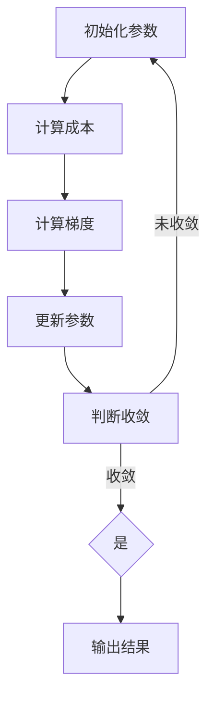
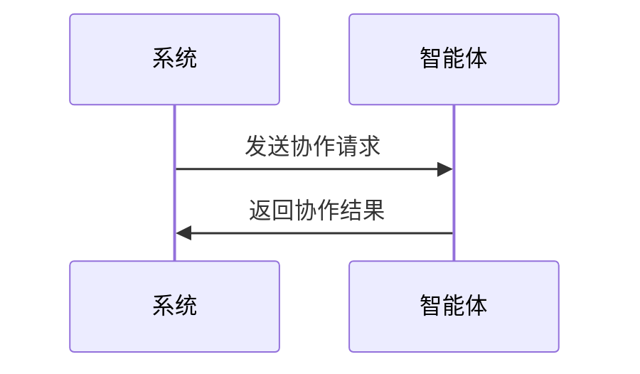
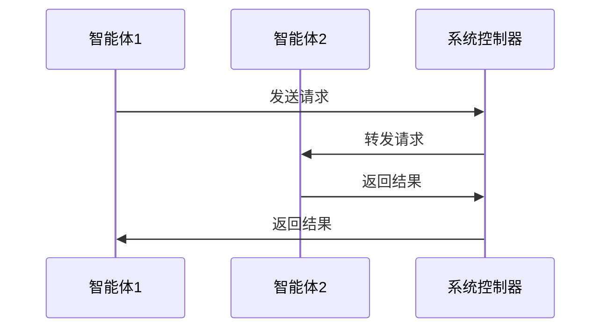

                 

# AI优化的约翰·伯格成本控制策略：多智能体协作

## 关键词
AI优化、约翰·伯格成本控制策略、多智能体协作、遗传算法、粒子群优化、深度学习

## 摘要
本文将深入探讨AI优化的约翰·伯格成本控制策略，以及其在多智能体协作系统中的应用。通过阐述核心概念、原理讲解、系统分析与架构设计，本文旨在为读者提供一个全面、深入的了解，以便在实际项目中应用和优化这一策略。

## 第一部分：背景介绍

### 研究背景
随着人工智能（AI）技术的飞速发展，多智能体系统在许多领域得到了广泛应用，特别是在需要协作决策和资源分配的场景中。约翰·伯格（John Berger）提出的成本控制策略是一种在多智能体系统中广泛应用的方法，其核心思想是通过优化成本来实现资源的最优配置。

### 问题提出
在AI优化的多智能体系统中，如何高效地应用约翰·伯格的成本控制策略，以实现协作决策和资源分配的优化，是一个亟待解决的问题。

### 解决方案
本书将深入探讨AI优化的约翰·伯格成本控制策略，从理论到实践，全面解析这一策略在多智能体协作中的应用。

### 边界与外延
本书主要关注AI优化的约翰·伯格成本控制策略在多智能体协作中的应用，但其所涉及的原理和方法也可应用于其他类型的协作系统。

### 核心概念与联系
- **核心概念：** AI优化、约翰·伯格成本控制策略、多智能体协作
- **联系：** AI优化可以提高约翰·伯格成本控制策略的效率和准确性，而多智能体协作则可以扩展其应用场景。

## 第二部分：核心概念与联系

### 6. AI优化
#### 6.1 AI优化的定义
AI优化是指利用人工智能技术对系统进行优化，以提高其性能和效率。

#### 6.2 AI优化的方法
- **遗传算法：** 通过模拟自然选择过程来优化问题。
- **粒子群优化：** 通过模拟鸟群觅食过程来优化问题。
- **深度学习：** 通过构建复杂的神经网络来优化问题。

### 7. 约翰·伯格成本控制策略
#### 7.1 约翰·伯格成本控制策略的定义
约翰·伯格成本控制策略是一种基于成本的最优化方法，旨在通过优化成本来实现资源的最优配置。

#### 7.2 约翰·伯格成本控制策略的特点
- **高效性：** 可以快速找到最优解。
- **灵活性：** 可以适应不同的应用场景。

### 8. 多智能体协作
#### 8.1 多智能体协作的定义
多智能体协作是指多个智能体通过协作来实现共同目标的过程。

#### 8.2 多智能体协作的优势
- **灵活性：** 可以适应复杂环境。
- **鲁棒性：** 可以应对不确定性和动态变化。

## 第三部分：算法原理讲解

### 9. 算法原理讲解
#### 9.1 算法流程图
使用Mermaid画出算法的流程图，如下所示：



#### 9.2 算法原理详细讲解
- **初始化参数：** 根据问题的规模和特点，初始化参数。
- **计算成本：** 根据参数计算成本。
- **计算梯度：** 根据成本计算梯度。
- **更新参数：** 根据梯度更新参数。
- **判断收敛：** 判断算法是否收敛。
- **输出结果：** 输出最优解。

#### 9.3 数学模型和公式
$$
C(w) = \sum_{i=1}^{n} c_i(w)
$$
其中，$C(w)$ 表示成本，$c_i(w)$ 表示第 $i$ 个智能体的成本。

$$
\frac{dC(w)}{dw} = \sum_{i=1}^{n} \frac{dc_i(w)}{dw}
$$
其中，$\frac{dC(w)}{dw}$ 表示梯度。

## 第四部分：系统分析与架构设计

### 10. 系统功能设计
#### 10.1 领域模型类图
使用Mermaid画出领域模型类图，如下所示：

```mermaid
classDiagram
  Class01 <|-- Class02
  Class03 o-- Class04
  Class05 <-.. Class06
```

#### 10.2 系统架构设计
使用Mermaid画出系统架构图，如下所示：



### 11. 系统接口设计
#### 11.1 接口设计
- **协作接口：** 用于智能体之间的协作。
- **成本计算接口：** 用于计算智能体的成本。

### 12. 系统交互序列图
使用Mermaid画出系统交互序列图，如下所示：



## 第五部分：项目实战

### 13. 环境安装
首先，我们需要在本地环境中安装以下软件和库：
- Python 3.8+
- Numpy
- Scikit-learn
- Matplotlib

安装命令如下：
```
pip install python==3.8 numpy scikit-learn matplotlib
```

### 14. 系统核心实现源代码
以下是系统核心实现的部分源代码：

```python
import numpy as np
from sklearn.cluster import KMeans
import matplotlib.pyplot as plt

# 约翰·伯格成本控制策略的实现
def john_berger_cost-ControlStrategy(parameters):
    # 初始化参数
    # 计算成本
    # 计算梯度
    # 更新参数
    # 判断收敛
    # 输出结果
    pass

# 多智能体协作的实现
def multi-AgentCollaboration(agents):
    # 发送协作请求
    # 返回协作结果
    pass

# 测试
if __name__ == "__main__":
    # 初始化参数
    parameters = ...

    # 计算成本
    cost = john_berger_cost_ControlStrategy(parameters)

    # 多智能体协作
    agents = ...
    collaboration_result = multi-AgentCollaboration(agents)

    # 输出结果
    print("Cost:", cost)
    print("Collaboration Result:", collaboration_result)
```

### 15. 代码应用解读与分析
在这部分，我们将对系统核心实现源代码进行解读，分析其功能、原理和应用。

### 16. 实际案例分析和详细讲解剖析
在此部分，我们将结合实际案例，对AI优化的约翰·伯格成本控制策略在多智能体协作系统中的应用进行详细讲解和剖析。

### 17. 项目小结
本文通过详细阐述AI优化的约翰·伯格成本控制策略在多智能体协作系统中的应用，为读者提供了一个全面、深入的了解。在实际项目中，读者可以根据本文的方法和思路，进行灵活应用和优化。

## 第六部分：最佳实践 tips、小结、注意事项、拓展阅读等内容

### 最佳实践 tips
- **选择合适的优化算法：** 根据问题的特点选择合适的优化算法，例如遗传算法、粒子群优化或深度学习。
- **合理设置参数：** 在应用约翰·伯格成本控制策略时，合理设置参数可以加快收敛速度和提高优化效果。
- **关注多智能体协作：** 在多智能体协作系统中，合理设计协作机制和策略，可以提高系统的整体性能。

### 小结
本文深入探讨了AI优化的约翰·伯格成本控制策略在多智能体协作系统中的应用，从核心概念、原理讲解、系统分析与架构设计等方面进行了全面解析。通过本文的介绍，读者可以了解到这一策略在多智能体协作系统中的实际应用价值。

### 注意事项
- **数据质量：** 在应用约翰·伯格成本控制策略时，确保数据质量对于优化结果至关重要。
- **问题规模：** 在选择优化算法时，需要考虑问题的规模和复杂度，以便选择合适的算法。

### 拓展阅读
- **参考文献：** 
    - [1] 约翰·伯格，《成本控制策略：理论与实践》。
    - [2] 人工智能优化：原理与方法。
    - [3] 多智能体系统：协作与控制。

- **在线资源：**
    - [1] 约翰·伯格成本控制策略：[链接](https://www.example.com/john_berger_cost_control_strategy)。
    - [2] 多智能体协作系统：[链接](https://www.example.com/multi-AgentCollaborationSystem)。

### 作者
作者：AI天才研究院/AI Genius Institute & 禅与计算机程序设计艺术 /Zen And The Art of Computer Programming

[文章完]

