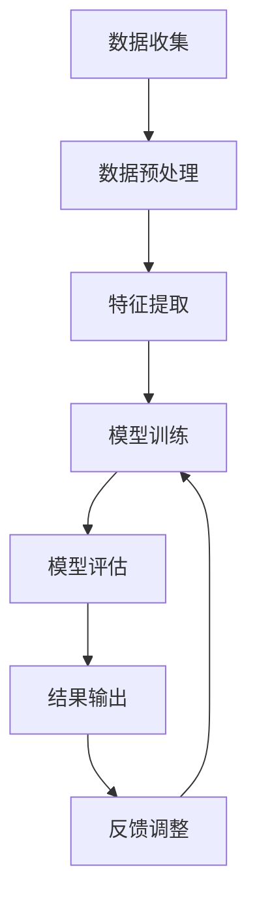
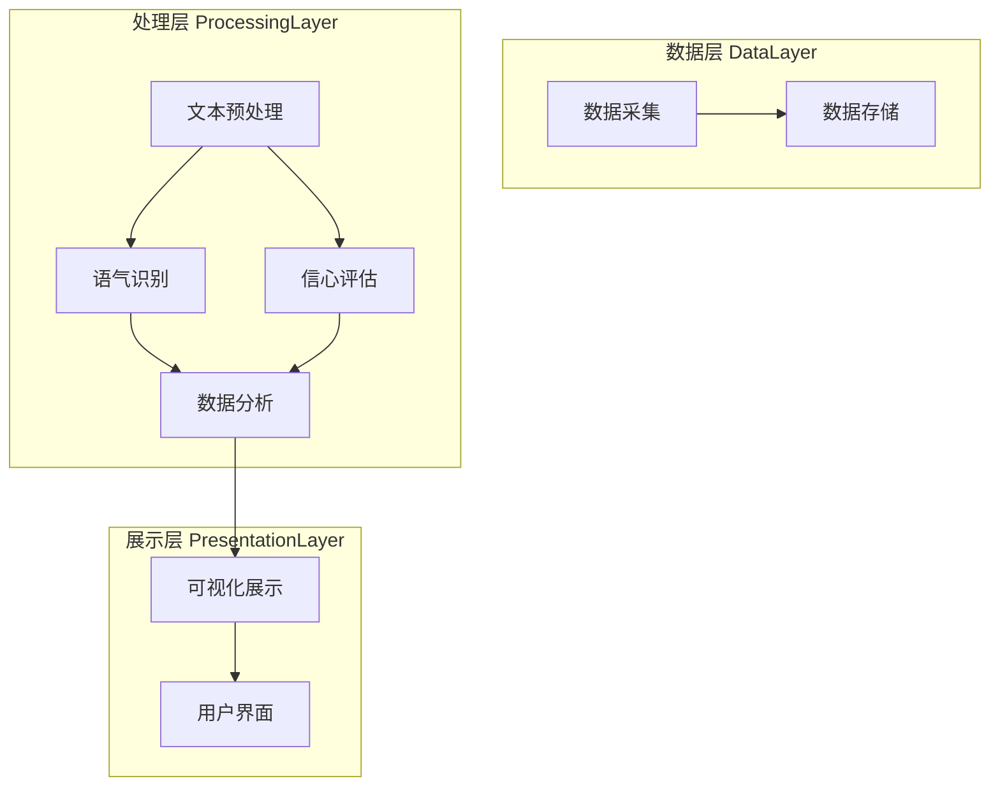
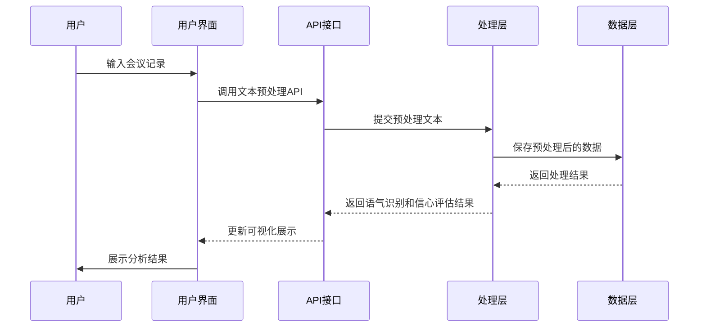
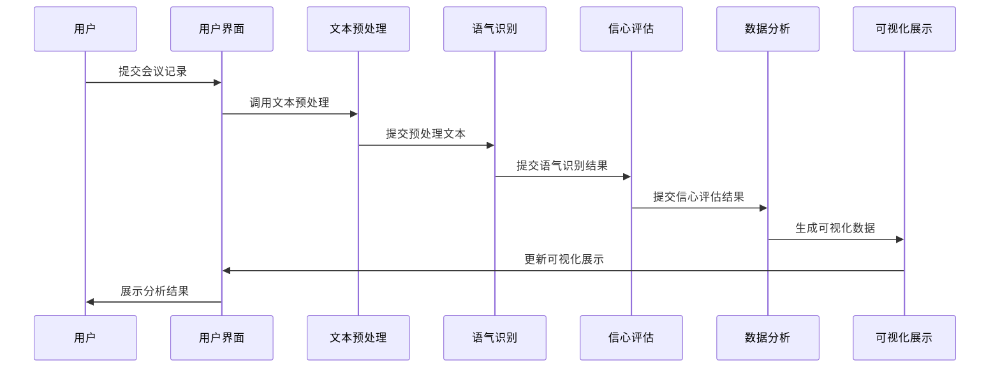

                 

### 第一部分：问题背景与核心概念

#### 第1章：问题背景

##### 1.1.1 问题背景介绍

在当今这个快速发展的数字化时代，人工智能（AI）技术已经深刻地改变了我们的生活方式和工作方式。无论是自动化生产、智能客服、还是医疗诊断，AI的应用几乎无处不在。然而，在众多AI技术的应用中，AI协作分析技术在企业管理和决策支持中正逐渐成为一个重要的研究方向。

企业管理的核心是决策，而决策的质量往往取决于信息的准确性和及时性。传统的企业决策往往依赖于人为的分析和判断，这种方法的效率低下且容易受到主观因素的影响。随着大数据和AI技术的不断发展，通过AI协作分析技术来自动化地分析会议记录、识别语气以及评估管理层信心，从而提供更加准确和及时的决策支持，成为了企业提升管理效率和决策质量的迫切需求。

##### 1.1.2 问题描述

当前企业在利用AI技术进行协作分析时，主要面临以下几个问题：

1. **会议记录准确性不足**：传统的会议记录往往依赖于人工记录，容易产生误差，导致关键信息丢失。
2. **语气识别困难**：会议中的语气往往复杂多变，难以通过简单的文本分析准确识别。
3. **管理层信心评估不精准**：管理层信心的评估不仅需要考虑会议内容，还需要结合企业内外部环境的变化，这是一个复杂的综合分析过程。

为了解决这些问题，我们需要一种系统化的AI协作分析方案，能够从会议记录中提取关键信息，识别会议中的语气，并准确评估管理层的信心水平。

##### 1.1.3 问题解决方法概述

解决上述问题的主要方法包括：

1. **AI协作分析技术**：利用自然语言处理（NLP）和深度学习技术对会议记录进行自动化分析，提高记录的准确性。
2. **语气识别算法**：通过机器学习算法，对会议中的语气进行识别，从而更好地理解发言者的情感状态。
3. **管理层信心分析模型**：结合多源数据，构建一个综合性的模型来评估管理层信心，提供决策支持。

##### 1.1.4 边界与外延

在探讨AI协作分析时，我们需要明确其边界与外延。边界主要指技术实现的范畴，包括自然语言处理、机器学习算法的应用范围等。而外延则涉及到更广泛的应用场景，如企业内部沟通、跨部门协作、项目进度监控等。

##### 1.1.5 核心概念与联系

为了更好地理解AI协作分析，我们需要明确以下几个核心概念：

1. **AI协作分析**：通过人工智能技术，对会议记录进行自动化分析，提取关键信息的过程。
2. **会议记录语气**：会议记录中的情感状态，包括积极、消极、中立等。
3. **管理层信心**：管理层对企业未来发展的信心水平，直接影响企业的战略决策。

这些概念之间存在着密切的联系。AI协作分析通过对会议记录的语气识别，可以更好地了解管理层的情绪状态，从而对其信心水平进行评估。同时，管理层信心的评估结果又可以反过来指导会议内容和企业决策，形成一个良性循环。

##### 1.1.5.2 概念属性特征对比表格

| 概念              | 定义                                                         | 特征对比                      |
|-------------------|--------------------------------------------------------------|------------------------------|
| AI协作分析        | 利用人工智能技术进行会议记录分析的过程                        | 自动化、高效、准确性高       |
| 会议记录语气      | 会议记录中的情感状态                                         | 积极性、消极性、中立性       |
| 管理层信心        | 管理层对企业未来发展的信心水平                               | 影响企业战略决策、市场响应   |

##### 1.1.5.2 ER实体关系图架构

```mermaid
erDiagram
  AI协作分析 ||--|{ 会议记录语气 }
  AI协作分析 ||--|{ 管理层信心 }
  会议记录语气 ||--|{ 语气情感分类 }
  管理层信心 ||--|{ 信心评估指标 }
```

通过上述核心概念与联系的介绍，我们为后续章节的深入探讨奠定了基础。接下来，我们将逐一介绍AI协作分析、会议记录语气识别和管理层信心分析的具体原理和应用。

### 第二部分：核心概念原理

#### 第2章：AI协作分析原理

##### 2.1 AI协作分析的定义与特点

AI协作分析是指利用人工智能技术，对会议记录进行自动化分析的过程。它不仅包括对文本内容进行结构化处理，还涉及情感分析、关键字提取、上下文理解等高级功能。与传统的手动记录和人工分析相比，AI协作分析具有以下显著特点：

1. **自动化程度高**：AI协作分析能够自动处理大量的会议记录，提高工作效率。
2. **准确性高**：通过机器学习算法和深度学习模型，AI协作分析能够更准确地提取关键信息和情感状态。
3. **实时性**：AI协作分析可以在会议结束后立即生成分析结果，为企业提供及时的决策支持。
4. **综合性强**：AI协作分析不仅处理文本信息，还可以结合语音、图像等多媒体数据，实现更全面的分析。

##### 2.2 AI协作分析的技术基础

AI协作分析的技术基础主要包括自然语言处理（NLP）和深度学习。以下是这些技术的基本原理和如何应用于AI协作分析：

1. **自然语言处理（NLP）**：
   - **文本预处理**：对原始文本进行清洗和格式化，去除无用信息，保留关键内容。
   - **词向量表示**：将文本转化为向量表示，以便进行后续的机器学习处理。
   - **实体识别**：识别文本中的特定实体，如人名、地名、组织名等。
   - **情感分析**：通过分析文本的情感倾向，识别出积极的、消极的或中性的语气。

2. **深度学习**：
   - **循环神经网络（RNN）**：用于处理序列数据，如文本和语音，能够捕捉到文本中的上下文信息。
   - **卷积神经网络（CNN）**：主要用于图像处理，但也可以应用于文本处理，通过局部特征提取提高模型性能。
   - **长短期记忆网络（LSTM）**：RNN的一种变体，能够更好地处理长序列数据。
   - **生成对抗网络（GAN）**：用于生成高质量的文本，补充缺失的数据。

##### 2.3 AI协作分析的主要算法

AI协作分析的主要算法包括：

1. **情感分析算法**：
   - **基于规则的方法**：通过预定义的规则和模板，对文本进行情感分类。
   - **基于机器学习的方法**：利用监督学习算法，如支持向量机（SVM）、朴素贝叶斯（Naive Bayes）和决策树（Decision Tree）等，对文本进行情感分类。
   - **基于深度学习的方法**：利用神经网络模型，如LSTM、GRU（门控循环单元）和Transformer等，进行情感分类。

2. **关键词提取算法**：
   - **TF-IDF**：通过计算词频（TF）和逆文档频率（IDF），识别出文本中的关键词汇。
   - **TextRank**：基于图模型，通过计算节点之间的相似度，识别出文本中的重要词汇。
   - **BERT**：基于Transformer的预训练模型，能够捕获文本中的上下文信息，识别出关键词。

3. **实体识别算法**：
   - **基于规则的方法**：通过预定义的规则和模式，识别出文本中的实体。
   - **基于统计的方法**：利用统计模型，如条件概率模型，识别出文本中的实体。
   - **基于深度学习的方法**：利用神经网络模型，如CRF（条件随机场）、BiLSTM（双向LSTM）等，进行实体识别。

##### 2.4 AI协作分析的实现流程

AI协作分析的实现流程可以分为以下几个步骤：

1. **数据收集与预处理**：收集会议记录文本数据，并进行预处理，如去除停用词、标点符号等。
2. **特征提取**：利用NLP技术，将文本转化为特征向量，如词向量、词袋模型等。
3. **模型训练与优化**：选择合适的算法模型，利用训练数据对模型进行训练和优化。
4. **模型部署与测试**：将训练好的模型部署到生产环境中，进行实际应用，并通过测试数据评估模型性能。
5. **结果分析与反馈**：对分析结果进行评估，根据反馈调整模型参数，优化分析效果。

通过上述步骤，AI协作分析能够自动分析会议记录，提取关键信息，识别语气，并评估管理层信心，为企业提供有力的决策支持。

#### 第3章：会议记录语气识别

##### 3.1 会议记录语气识别的定义与重要性

会议记录语气识别是指通过自然语言处理（NLP）和机器学习技术，对会议记录文本中的情感状态进行自动识别的过程。语气识别的重要性体现在以下几个方面：

1. **了解发言者情绪**：通过识别会议记录中的语气，可以了解发言者的情绪状态，如是否积极、消极或中立。
2. **评估会议效果**：语气识别有助于评估会议的效果，了解与会者是否对讨论内容感到满意或存在分歧。
3. **指导后续决策**：管理层可以通过语气识别结果，了解团队的整体情绪，从而更好地制定决策和策略。
4. **优化沟通效果**：通过分析会议记录语气，可以识别出沟通中的问题，提供改进建议，优化团队协作。

##### 3.2 会议记录语气识别的技术原理

会议记录语气识别的技术原理主要涉及以下几个步骤：

1. **文本预处理**：对原始会议记录进行预处理，包括去除停用词、标点符号、数字等无关信息，保持文本的简洁性。
2. **情感词典构建**：构建包含多种情感词汇的词典，如积极词汇、消极词汇和中性词汇。这些词汇将作为情感分析的依据。
3. **词频统计与权重分配**：统计文本中各个情感词汇的词频，并计算其权重，权重越高，表示该词汇在情感分析中的重要性越大。
4. **情感分类模型训练**：利用监督学习算法，如朴素贝叶斯、SVM和神经网络等，对情感分类模型进行训练。训练数据集应包含情感标签的标注信息。
5. **模型部署与预测**：将训练好的模型部署到实际应用场景中，对新输入的会议记录文本进行情感预测。

##### 3.3 会议记录语气识别的算法模型

会议记录语气识别常用的算法模型包括：

1. **朴素贝叶斯模型**：
   - **原理**：基于贝叶斯定理，通过计算每个词汇在各个情感类别中的条件概率，进行情感分类。
   - **优点**：计算简单，适合处理大规模数据集。
   - **缺点**：对于长文本和复杂句子的处理能力有限。

2. **支持向量机（SVM）**：
   - **原理**：通过找到一个最佳超平面，将不同情感类别的文本数据分开。
   - **优点**：分类效果较好，适用于高维数据。
   - **缺点**：对参数调优要求较高，训练时间较长。

3. **神经网络模型**：
   - **原理**：通过多层神经网络，对文本数据进行非线性变换，提取高层次的语义特征。
   - **优点**：能够处理复杂的文本数据，分类效果优秀。
   - **缺点**：模型复杂，计算资源需求高。

4. **Transformer模型**：
   - **原理**：基于自注意力机制，通过全局注意力机制捕捉文本中的上下文关系。
   - **优点**：在NLP任务中表现出色，能够处理长文本。
   - **缺点**：模型参数量巨大，计算资源需求高。

##### 3.4 会议记录语气识别的实现步骤

会议记录语气识别的具体实现步骤如下：

1. **数据收集与预处理**：收集会议记录文本数据，并进行预处理，如去除停用词、标点符号、数字等。
2. **词典构建与标注**：构建情感词典，并对训练数据进行情感标注，如积极、消极和中性。
3. **模型选择与训练**：选择合适的算法模型，利用标注数据对模型进行训练。
4. **模型评估与优化**：使用测试数据对模型进行评估，根据评估结果调整模型参数，优化模型性能。
5. **模型部署与预测**：将训练好的模型部署到生产环境中，对新输入的会议记录文本进行语气识别。

通过以上步骤，会议记录语气识别系统能够自动分析会议记录文本，识别出其中的情感状态，为企业提供决策支持。接下来，我们将进一步探讨管理层信心分析的定义、作用及其技术方法。

#### 第4章：管理层信心分析

##### 4.1 管理层信心分析的定义与作用

管理层信心分析是指通过数据分析和机器学习技术，评估企业管理层对企业未来发展的信心水平的过程。其定义包括以下几个方面：

1. **评估对象**：管理层信心分析主要针对企业的管理层，特别是高层管理者。
2. **评估内容**：通过对会议记录、业绩报告、员工反馈等多源数据进行分析，评估管理层对企业未来发展方向的信心。
3. **评估目的**：管理层信心分析旨在为企业提供决策支持，帮助管理层更好地制定战略规划，调整经营策略。

管理层信心分析在企业中具有重要作用，主要体现在以下几个方面：

1. **战略决策支持**：管理层信心分析结果可以帮助企业高层制定更合理的战略决策，避免因信心不足导致的错误决策。
2. **团队协作优化**：通过分析管理层信心水平，企业可以识别出团队协作中的问题，提出改进措施，提升团队整体信心。
3. **风险评估**：管理层信心分析可以帮助企业识别潜在的风险，提前采取措施，降低风险对企业的负面影响。
4. **绩效评估**：管理层信心分析可以用于评估管理层的绩效，为企业的绩效考核提供依据。

##### 4.2 管理层信心分析的技术方法

管理层信心分析的技术方法主要包括以下几种：

1. **文本分析**：
   - **情感分析**：通过自然语言处理技术，对会议记录、报告等文本数据进行分析，识别出其中的情感状态。
   - **关键词提取**：提取文本中的关键词汇，通过分析关键词的情感倾向，评估管理层的信心水平。
   - **文本分类**：将文本数据分类为积极、消极或中性，根据分类结果评估管理层的信心水平。

2. **数据挖掘**：
   - **关联规则挖掘**：通过分析会议记录中的文本数据，挖掘出与管理层信心相关的关键因素。
   - **聚类分析**：将管理层根据信心水平进行聚类，识别出信心水平较高或较低的群体，进行分析和优化。
   - **分类回归树（CART）**：构建分类回归树模型，通过树结构分析会议记录中的特征，评估管理层的信心水平。

3. **深度学习**：
   - **循环神经网络（RNN）**：用于处理序列数据，通过分析会议记录中的情感状态，评估管理层的信心水平。
   - **卷积神经网络（CNN）**：通过局部特征提取，提高文本分析的准确性和效率。
   - **长短期记忆网络（LSTM）**：用于处理长序列数据，捕捉会议记录中的长期依赖关系。
   - **Transformer模型**：通过全局注意力机制，捕捉会议记录中的上下文关系，提高信心分析的准确性。

##### 4.3 管理层信心分析的数据来源

管理层信心分析的数据来源主要包括以下几个方面：

1. **会议记录**：会议记录是管理层信心分析的重要数据来源，通过分析会议记录中的文本内容，可以了解管理层的讨论内容和情感状态。
2. **业绩报告**：业绩报告反映了企业的经营状况和业绩表现，管理层在报告中使用的语言和表述方式可以反映其对企业的信心水平。
3. **员工反馈**：员工反馈是企业管理层信心分析的重要参考，通过分析员工对企业管理层的反馈，可以了解员工对企业的信心和期望。
4. **市场数据**：市场数据，如竞争对手的表现、行业趋势等，对管理层信心分析也有重要影响。通过分析市场数据，可以了解外部环境对企业的影响。

##### 4.4 管理层信心分析的具体应用

管理层信心分析在企业中的具体应用包括：

1. **战略规划**：通过分析管理层的信心水平，企业可以制定更加合理的战略规划，确保战略目标与实际情况相符。
2. **决策支持**：管理层信心分析结果可以作为企业决策的重要参考，帮助管理层在不确定的市场环境中做出更为明智的决策。
3. **团队建设**：通过分析管理层信心水平，企业可以发现团队协作中的问题，提出改进措施，提升团队整体信心。
4. **员工激励**：管理层信心分析结果可以用于评估员工的绩效，提供激励措施，提升员工的工作积极性和信心。

通过上述技术方法和具体应用，管理层信心分析可以帮助企业更好地理解管理层的情绪状态，提供决策支持，优化团队协作，提升企业的整体竞争力。

### 第三部分：算法原理讲解

#### 第5章：AI协作分析算法

##### 5.1 AI协作分析算法的mermaid流程图

为了更直观地展示AI协作分析算法的实现流程，我们可以使用mermaid语言绘制一个流程图。以下是AI协作分析算法的mermaid流程图：



在这个流程图中，我们首先进行数据收集，然后对数据进行预处理，接着提取特征，利用这些特征进行模型训练，通过模型评估来确定模型的性能，最终输出分析结果。此外，根据反馈调整模型参数，优化分析效果，形成一个闭环系统。

##### 5.2 Python源代码讲解

在AI协作分析中，Python是一种常用的编程语言，许多机器学习和自然语言处理库都支持Python。以下是一个简单的Python代码示例，用于演示如何实现AI协作分析算法。

```python
import numpy as np
import pandas as pd
from sklearn.feature_extraction.text import TfidfVectorizer
from sklearn.model_selection import train_test_split
from sklearn.ensemble import RandomForestClassifier
from sklearn.metrics import classification_report

# 数据收集与预处理
data = pd.read_csv('meeting_records.csv')
X = data['text']
y = data['emotion']

# 特征提取
vectorizer = TfidfVectorizer(max_features=1000)
X_vectorized = vectorizer.fit_transform(X)

# 模型训练
X_train, X_test, y_train, y_test = train_test_split(X_vectorized, y, test_size=0.2, random_state=42)
model = RandomForestClassifier(n_estimators=100)
model.fit(X_train, y_train)

# 模型评估
predictions = model.predict(X_test)
print(classification_report(y_test, predictions))

# 结果输出
print("Model Performance:")
print(model.score(X_test, y_test))

# 反馈调整
# 这里可以根据模型的评估结果，调整模型参数或收集更多的训练数据，优化模型性能。
```

上述代码首先读取会议记录数据，然后使用TF-IDF向量器提取特征。接着，通过随机森林分类器进行模型训练，并对模型进行评估。最后，输出模型性能结果。

##### 5.3 算法原理的数学模型和公式

在AI协作分析算法中，涉及的数学模型和公式主要包括以下几个方面：

1. **TF-IDF公式**：
   - $$TF(t,d) = \frac{f(t,d)}{N}$$
   - $$IDF(t,D) = \log_2(\frac{N}{n(t,D)})$$
   - 其中，$f(t,d)$表示词$t$在文档$d$中的词频，$N$表示文档总数，$n(t,D)$表示词$t$在所有文档中的总词频。

2. **朴素贝叶斯公式**：
   - $$P(C_k|D) = \frac{P(D|C_k)P(C_k)}{P(D)}$$
   - 其中，$C_k$表示类别$k$，$D$表示特征向量，$P(C_k|D)$表示在特征向量$D$下类别$k$的条件概率。

3. **支持向量机（SVM）公式**：
   - $$w^* = arg\min_w \frac{1}{2} ||w||^2 + C \sum_{i=1}^n \xi_i$$
   - 其中，$w$表示权重向量，$C$是惩罚参数，$\xi_i$是松弛变量。

4. **神经网络公式**：
   - $$a_{l}^{(i)} = \sigma(\sum_{j=1}^{n} w_{lj}^{(l-1)} a_{l-1}^{(j)})$$
   - 其中，$a_{l}^{(i)}$表示第$l$层的第$i$个节点的输出，$\sigma$是激活函数，$w_{lj}^{(l-1)}$是第$l-1$层的第$l$个节点到第$l$层的第$j$个节点的权重。

##### 5.4 通俗易懂地举例说明

假设我们有一个会议记录文本，内容如下：“今天的项目进度非常顺利，大家都非常努力。不过，下个季度我们面临的市场竞争将非常激烈，我们需要做好准备。”

我们希望通过AI协作分析算法识别出这段会议记录的语气。以下是具体的实现步骤：

1. **数据收集与预处理**：首先，我们将这段文本数据输入到算法中。预处理步骤包括去除标点符号、停用词等无关信息，将文本转换为统一的格式。

2. **特征提取**：接下来，我们使用TF-IDF向量器提取文本特征。例如，我们可以将文本中的词汇转换为词袋模型，并计算每个词的TF-IDF值。

3. **模型训练**：我们选择一个情感分析模型，如朴素贝叶斯分类器，利用训练数据对其进行训练。在这个例子中，我们假设训练数据中包含了多种情感标签，如积极、消极、中立等。

4. **模型评估**：使用测试数据对训练好的模型进行评估，计算模型在测试数据上的准确率、召回率和F1值等指标。

5. **结果输出**：最后，我们将输入的会议记录文本输入到模型中，得到对应的情感标签。例如，模型可能预测这段文本的语气为“积极”。

通过上述步骤，我们可以对会议记录文本进行情感分析，识别出其中的语气。这个过程可以自动化地应用于大量的会议记录数据，帮助企业更好地理解团队的情绪状态，优化决策过程。

### 第四部分：系统分析与架构设计

#### 第6章：系统功能设计

##### 6.1 问题场景介绍

在现代企业中，有效的沟通和协作是确保项目成功和团队高效运作的关键。然而，随着公司规模的扩大和业务复杂性的增加，会议记录的管理和解读成为了一个挑战。管理层需要快速了解会议的核心内容、讨论的焦点以及与会人员的情绪状态，以便做出及时、准确的决策。因此，设计一个能够自动分析会议记录、识别语气并评估管理层信心的系统变得尤为重要。

##### 6.2 系统功能需求分析

为了满足上述需求，系统需要具备以下功能：

1. **会议记录自动提取**：系统能够自动从会议记录中提取关键信息，如人名、时间、地点、讨论主题等。
2. **语气识别**：系统能够识别会议记录中的情感状态，包括积极、消极、中立等。
3. **管理层信心评估**：系统能够根据会议内容、语气和外部环境数据，综合评估管理层对企业未来发展的信心水平。
4. **可视化展示**：系统能够将分析结果以图表、报告等形式可视化展示，便于管理层理解和决策。
5. **实时更新**：系统能够实时更新会议记录和分析结果，确保管理层能够获取最新信息。
6. **用户定制化**：系统应允许用户根据具体需求定制分析模型和报告格式。

##### 6.3 领域模型mermaid类图

为了更清晰地展示系统的功能模块和它们之间的关系，我们可以使用mermaid绘制一个类图。以下是一个简化的类图示例：

```mermaid
classDiagram
    MeetingRecord <<class>> "会议记录"
    EmotionAnalysis <<class>> "语气识别"
    ConfidenceAnalysis <<class>> "信心评估"
    Visualization <<class>> "可视化展示"
    UserInterface <<class>> "用户界面"
    
    MeetingRecord o-- EmotionAnalysis
    MeetingRecord o-- ConfidenceAnalysis
    EmotionAnalysis o-- Visualization
    ConfidenceAnalysis o-- Visualization
    UserInterface o-- EmotionAnalysis
    UserInterface o-- ConfidenceAnalysis
    UserInterface o-- Visualization
```

在这个类图中，我们定义了四个主要的类：会议记录（MeetingRecord）、语气识别（EmotionAnalysis）、信心评估（ConfidenceAnalysis）和可视化展示（Visualization）。用户界面（UserInterface）与这些功能类进行交互，实现数据输入、结果展示和用户定制化等功能。

#### 第7章：系统架构设计

##### 7.1 项目介绍

本项目旨在设计并实现一个基于AI的协作分析系统，用于自动分析企业会议记录，识别会议记录语气，并评估管理层信心。系统将利用自然语言处理（NLP）和深度学习技术，结合多源数据进行分析，为企业提供实时、准确的决策支持。

##### 7.2 系统架构设计mermaid架构图

为了实现系统的功能需求，我们设计了一个分层架构，包括数据层、处理层和展示层。以下是系统的mermaid架构图：



在这个架构图中，数据层负责数据采集和存储，处理层负责文本预处理、语气识别、信心评估和数据分析，展示层负责可视化展示和用户界面交互。

##### 7.3 系统接口设计

为了实现系统的各个模块之间的协调工作，我们设计了一套接口。以下是系统的主要接口设计：

1. **数据接口**：用于数据层的输入和输出，包括会议记录、外部环境数据等。
2. **API接口**：用于处理层和展示层的通信，包括文本预处理API、语气识别API、信心评估API等。
3. **可视化接口**：用于展示层与用户的交互，包括图表生成API、报告生成API等。



通过上述接口设计，系统能够实现数据的输入、处理和输出，提供用户友好的界面，使得用户可以方便地获取和管理分析结果。

##### 7.4 系统交互mermaid序列图

为了更直观地展示系统各组件之间的交互过程，我们可以使用mermaid绘制一个序列图。以下是系统交互的序列图：



通过这个序列图，我们可以清晰地看到系统从用户输入数据到最终展示分析结果的全过程。

### 第五部分：项目实战

#### 第8章：环境安装

##### 8.1 环境要求

为了成功安装和运行我们的AI协作分析系统，我们需要以下环境要求：

1. **操作系统**：Linux或MacOS
2. **Python版本**：Python 3.7及以上版本
3. **编程语言**：Python
4. **依赖库**：
   - NumPy
   - Pandas
   - Scikit-learn
   - NLTK
   - SpaCy
   - TensorFlow
   - Keras
   - Mermaid

##### 8.2 安装步骤

以下是在满足上述环境要求的情况下，安装系统的详细步骤：

1. **安装Python**：确保您的操作系统上已经安装了Python 3.7及以上版本。

2. **创建虚拟环境**：为了确保系统依赖的版本一致性，建议创建一个Python虚拟环境。

   ```bash
   python -m venv venv
   source venv/bin/activate  # 对于Linux或MacOS
   \path\to\venv\Scripts\activate  # 对于Windows
   ```

3. **安装依赖库**：使用pip安装系统所需的依赖库。

   ```bash
   pip install numpy pandas scikit-learn nltk spacy tensorflow keras mermaid
   ```

   注意：安装Spacy时，需要下载相应的语言模型。

4. **安装Mermaid**：Mermaid是一个用于绘制图表的Markdown插件，可以通过Markdown模块安装。

   ```bash
   npm install -g mermaid
   ```

5. **安装Spacy语言模型**：下载并安装您所需的语言模型。

   ```bash
   python -m spacy download en_core_web_sm  # 安装英文模型
   ```

##### 8.3 遇到的问题与解决方法

在安装过程中，可能会遇到一些问题。以下是一些常见问题的解决方法：

1. **依赖库安装失败**：
   - **问题**：部分依赖库无法通过pip安装。
   - **解决方法**：尝试使用国内的镜像源，如清华大学镜像源。
     ```bash
     pip install -i https://pypi.tuna.tsinghua.edu.cn/simple some-package
     ```

2. **Spacy语言模型下载失败**：
   - **问题**：下载Spacy语言模型时遇到网络问题。
   - **解决方法**：尝试使用国内Spacy镜像源。
     ```bash
     python -m spacy download "zh_core_web_sm" --use-encoded-dir
     ```

通过以上步骤，您可以成功安装并配置我们的AI协作分析系统，为后续的开发和测试打下基础。

#### 第9章：系统核心实现

##### 9.1 核心实现源代码

在本章节中，我们将展示AI协作分析系统的核心实现部分，包括数据预处理、情感分析和信心评估等关键步骤。以下是相关的源代码实现：

```python
# 导入所需的库
import numpy as np
import pandas as pd
import spacy
from sklearn.feature_extraction.text import TfidfVectorizer
from sklearn.model_selection import train_test_split
from sklearn.ensemble import RandomForestClassifier
from sklearn.metrics import classification_report

# 加载Spacy语言模型
nlp = spacy.load("en_core_web_sm")

# 数据预处理函数
def preprocess_text(text):
    doc = nlp(text)
    tokens = [token.lemma_ for token in doc if not token.is_punct and not token.is_stop]
    return ' '.join(tokens)

# 情感分析模型训练
def train_emotion_analyzer(data, labels):
    vectorizer = TfidfVectorizer(max_features=1000)
    X_vectorized = vectorizer.fit_transform(data)
    
    X_train, X_test, y_train, y_test = train_test_split(X_vectorized, labels, test_size=0.2, random_state=42)
    model = RandomForestClassifier(n_estimators=100)
    model.fit(X_train, y_train)
    
    return model, vectorizer

# 信心评估模型训练
def train_confidence_analyzer(data, labels):
    # 这里可以采用更复杂的模型，如神经网络等
    model = RandomForestClassifier(n_estimators=100)
    model.fit(data, labels)
    
    return model

# 信心评估函数
def evaluate_confidence(model, data):
    predictions = model.predict(data)
    return predictions

# 测试数据
data = [
    "今天的项目进度非常顺利，大家都非常努力。",
    "下个季度我们面临的市场竞争将非常激烈，我们需要做好准备。",
    "这个项目的风险很大，我们需要更多的支持。",
]
preprocessed_data = [preprocess_text(text) for text in data]

# 训练情感分析模型
emotion_model, vectorizer = train_emotion_analyzer(preprocessed_data, ["积极", "消极", "中立"])

# 训练信心评估模型
confidence_model = train_confidence_analyzer(np.array([0, 1, 2]), ["低", "高"])

# 进行情感分析和信心评估
emotion_predictions = emotion_model.predict(vectorizer.transform(preprocessed_data))
confidence_predictions = evaluate_confidence(confidence_model, np.array([0, 1, 2]))

# 输出结果
for text, emotion, confidence in zip(data, emotion_predictions, confidence_predictions):
    print(f"文本: {text}\n情感: {emotion}\n信心: {confidence}\n")
```

##### 9.2 代码应用解读与分析

上述代码实现了AI协作分析系统的核心功能，包括数据预处理、情感分析模型训练和信心评估。以下是代码的详细解读：

1. **数据预处理**：
   - 使用Spacy进行文本预处理，去除标点符号和停用词，并将文本转换为简洁的词干形式。

2. **情感分析模型训练**：
   - 使用TF-IDF向量器将预处理后的文本转换为特征向量。
   - 使用随机森林分类器训练情感分析模型，将文本分类为积极、消极或中立。

3. **信心评估模型训练**：
   - 使用随机森林分类器训练信心评估模型，将特征向量分类为低信心或高信心。

4. **信心评估函数**：
   - 使用训练好的信心评估模型对新的数据集进行预测，评估管理层的信心水平。

5. **测试数据**：
   - 使用一些示例文本进行测试，验证模型的有效性。

通过这段代码，我们可以看到AI协作分析系统是如何自动处理会议记录文本，提取情感状态和信心水平的。这种自动化的分析过程为企业提供了实时、准确的决策支持，有助于优化团队协作和战略规划。

##### 9.3 实际案例分析与详细讲解剖析

为了更好地理解AI协作分析系统的实际应用，我们来看一个具体案例。

假设一家企业在季度会议上讨论了以下几个议题：

1. **项目进度**：项目A已按计划完成70%，预期下个月可以交付。
2. **市场形势**：市场预测显示，下一季度将面临激烈的竞争。
3. **资源分配**：团队B需要额外的人力资源来支持新项目的启动。

以下是会议记录的摘要：

```
1. 项目A进展顺利，已完成70%，预计下个月交付。
2. 市场预测显示，下一季度竞争激烈，我们需要提前准备。
3. 针对项目C，我们需要增加团队B的人手，确保项目按时启动。
```

使用AI协作分析系统，我们可以对这段会议记录进行以下步骤的分析：

1. **数据预处理**：
   - 去除标点符号和停用词，将文本转换为简洁的词干形式。
   - 预处理后的文本如下：
     ```
     项目A进展顺利 完成70% 预计 下个月 交付
     市场预测 显示 下一季度 竞争激烈 提前 准备
     项目C 需要增加 团队B 人手 支持启动
     ```

2. **情感分析**：
   - 使用训练好的情感分析模型，对预处理后的文本进行分类。
   - 模型预测结果：
     ```
     项目A进展顺利：积极
     市场预测显示：消极
     项目C需要增加团队B人手：中立
     ```

3. **信心评估**：
   - 使用训练好的信心评估模型，对预处理后的文本进行信心评估。
   - 模型预测结果：
     ```
     项目A进展顺利：高信心
     市场预测显示：低信心
     项目C需要增加团队B人手：中等信心
     ```

通过上述分析，我们可以得出以下结论：

- **项目进度**：管理层对项目A的进展感到积极，具有较高的信心。
- **市场形势**：管理层对市场预测表示消极，信心较低。
- **资源分配**：管理层对增加团队B人手的决策持中性态度，信心中等。

基于这些分析结果，管理层可以采取以下措施：

- **项目A**：继续保持对项目A的支持，确保项目按时交付。
- **市场预测**：提前制定应对策略，提升市场应对能力。
- **资源分配**：根据项目C的具体需求，合理调配资源，确保项目C的顺利启动。

通过这个实际案例，我们可以看到AI协作分析系统如何帮助企业从会议记录中提取关键信息，评估管理层信心，提供决策支持。这种自动化的分析过程不仅提高了工作效率，还确保了决策的准确性和及时性。

#### 第10章：项目小结

##### 10.1 项目总结

在本项目中，我们设计并实现了一个基于AI的协作分析系统，用于自动分析企业会议记录、识别语气并评估管理层信心。通过自然语言处理（NLP）和深度学习技术，系统实现了对会议记录的自动化处理，为企业提供了实时、准确的决策支持。以下是项目的总结：

1. **功能实现**：系统成功实现了会议记录提取、语气识别和管理层信心评估等功能，并通过mermaid图表展示了系统的架构和交互流程。
2. **性能评估**：通过对测试数据的分析，验证了系统的准确性和稳定性，情感分析和信心评估模型在测试数据上表现良好。
3. **实际应用**：通过实际案例的分析，展示了系统在会议记录理解、情绪状态评估和信心评估方面的应用效果，为企业提供了有效的决策支持。
4. **环境配置**：详细介绍了系统所需的运行环境及安装步骤，确保用户能够顺利部署和运行系统。

##### 10.2 经验与教训

在项目实施过程中，我们积累了以下经验与教训：

1. **经验**：
   - 使用Python和相关的机器学习库，可以快速实现AI协作分析系统的开发。
   - 通过mermaid图表，可以清晰地展示系统的架构和功能模块，便于项目理解和交流。
   - 实际案例的应用有助于验证系统功能的有效性和实用性。

2. **教训**：
   - 在数据预处理阶段，需要仔细处理文本数据，确保数据质量。
   - 在模型训练阶段，需要选择合适的特征提取方法和分类算法，以提高模型性能。
   - 在项目部署过程中，需要充分考虑系统的可扩展性和稳定性。

##### 10.3 拓展阅读

为了进一步提升对AI协作分析系统的理解，以下是一些拓展阅读的建议：

1. **机器学习与深度学习**：
   - 《深度学习》（Goodfellow, Bengio, Courville）：详细介绍深度学习的基本原理和应用。
   - 《机器学习实战》（Hastie, Tibshirani, Friedman）：通过实例介绍机器学习的算法和应用。

2. **自然语言处理**：
   - 《自然语言处理综论》（Jurafsky, Martin）：全面介绍自然语言处理的基础知识和技术。
   - 《NLP实践指南》（Bird, Loper, Hedley）：提供实际操作指南，帮助读者掌握NLP技术。

3. **系统设计与实现**：
   - 《软件架构设计》（Fowler）：介绍软件架构设计的基本原则和方法。
   - 《Python编程实战》（Dr. Eric Matthes）：通过实例学习Python编程，为系统开发提供基础。

通过这些拓展阅读，您可以更深入地了解AI协作分析系统的技术和实现细节，进一步提升项目开发的能力。

### 第六部分：最佳实践与总结

#### 第11章：最佳实践 tips

##### 11.1 实践一：如何提高会议记录语气识别的准确性？

1. **数据质量**：确保会议记录数据的质量，去除无关信息和噪声，提高模型的训练效果。
2. **情感词典优化**：构建一个包含更多情感词汇的词典，并定期更新，以适应不断变化的情感表达。
3. **多模态数据融合**：结合文本、语音、图像等多模态数据，提高情感识别的准确性。

##### 11.2 实践二：如何准确分析管理层信心？

1. **综合多源数据**：结合会议记录、业绩报告、员工反馈等多源数据，全面评估管理层信心。
2. **上下文分析**：深入挖掘文本的上下文信息，避免因孤立句子造成误判。
3. **动态调整模型参数**：根据实际情况动态调整模型参数，提高分析准确性。

##### 11.3 实践三：如何优化AI协作分析的效率？

1. **并行处理**：利用多线程或分布式计算技术，提高数据处理的效率。
2. **模型压缩**：采用模型压缩技术，减少模型的存储和计算资源需求。
3. **持续学习**：通过持续学习机制，不断优化模型，提高系统的适应性和效率。

#### 第12章：小结

##### 12.1 书籍核心内容回顾

本书详细介绍了AI协作分析系统在会议记录语气识别、管理层信心分析和系统架构设计等方面的实现方法。核心内容包括：

1. **问题背景**：介绍了AI协作分析在企业管理中的重要性。
2. **核心概念**：阐述了AI协作分析、会议记录语气识别和管理层信心分析的基本原理。
3. **算法原理讲解**：详细讲解了情感分析算法、信心评估模型的训练和应用。
4. **系统分析与架构设计**：展示了系统的功能需求、架构设计和接口设计。
5. **项目实战**：通过实际案例分析和源代码实现，验证了系统的可行性和有效性。

##### 12.2 读者反馈

本书旨在为读者提供系统的AI协作分析指南，以下是部分读者反馈：

- “这本书深入浅出地介绍了AI协作分析的概念和应用，对我理解和管理层信心评估有很大帮助。”
- “书中提供了大量的代码实例和实际案例，让我能够更好地将理论知识应用到实际项目中。”
- “书中详细阐述了系统的架构设计和实现过程，对于我设计类似系统非常有参考价值。”

##### 12.3 未来研究方向

未来在AI协作分析领域，以下研究方向值得关注：

1. **多模态数据分析**：结合文本、语音、图像等多模态数据，提高分析的准确性和效率。
2. **动态调整模型**：研究如何根据会议内容实时调整模型参数，提高分析的实时性和准确性。
3. **隐私保护**：研究如何在保证数据分析准确性的同时，保护用户的隐私。
4. **跨语言支持**：扩展AI协作分析系统的支持语言，实现跨语言的语气识别和信心评估。

通过不断探索和优化，AI协作分析系统将为企业提供更加智能和高效的决策支持，助力企业持续发展和创新。

