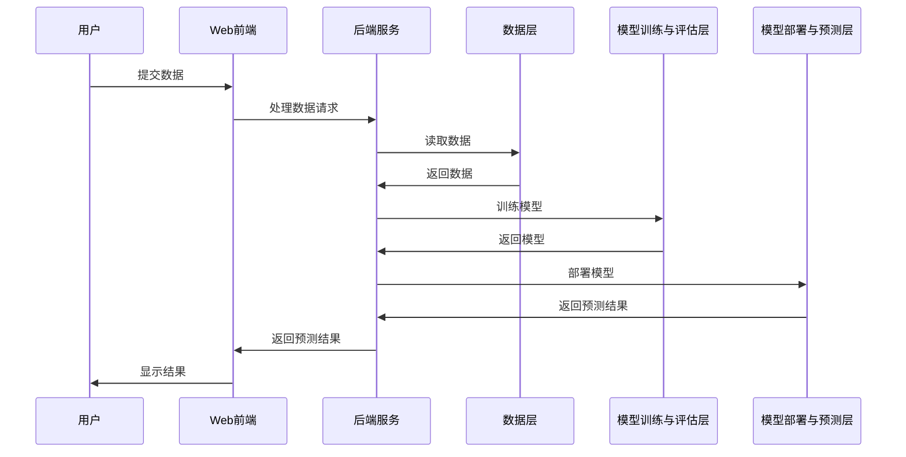

                 

# AI在保险理赔欺诈检测中的创新应用

## 关键词
- 人工智能（AI）
- 保险理赔
- 欺诈检测
- 深度学习
- 机器学习
- 数据分析
- 风险管理

## 摘要
本文将深入探讨人工智能（AI）在保险理赔欺诈检测领域的创新应用。通过分析保险业面临的欺诈问题及其挑战，我们将介绍AI技术在欺诈检测中的优势和应用。文章将详细讲解机器学习和深度学习算法在欺诈检测中的应用，分析系统架构和设计，并分享实际项目案例。最后，我们将总结最佳实践和未来发展趋势，为保险业提供有效的欺诈检测解决方案。

---

## 引言

保险行业在全球经济中扮演着重要角色，为个人和企业提供风险保障。然而，随着保险市场的不断扩大和复杂性增加，欺诈行为也日益猖獗。保险理赔欺诈不仅损害了保险公司的利益，也削弱了整个保险行业的信任度。因此，如何有效地检测和预防欺诈行为成为保险业亟待解决的问题。

在过去，传统的欺诈检测方法主要依赖于规则和统计模型，但这些方法在面对复杂和多变的数据时显得力不从心。随着人工智能（AI）和机器学习技术的发展，AI在保险理赔欺诈检测中的应用成为了一个新的研究方向。本文将详细探讨AI技术在保险理赔欺诈检测中的创新应用，分析其优势和应用场景，并通过实际项目案例展示其效果。

## 背景介绍

### 保险理赔欺诈的现状

保险理赔欺诈是指通过不诚实或欺诈手段获得保险赔偿的行为。这种行为包括伪造保险单、夸大损失、虚构事故、制造假证等。根据国际欺诈保险协会（IFIA）的数据，全球每年因欺诈行为造成的经济损失高达数百亿美元。在美国，保险欺诈每年造成的损失约占保险总额的10%。这种大规模的欺诈行为不仅对保险公司造成财务压力，也影响了保险费率的上涨，最终影响到所有投保人的利益。

### 保险业面临的挑战

保险理赔欺诈对保险业带来了多方面的挑战：

1. **经济损失**：欺诈行为直接导致保险公司的赔付成本增加，影响其盈利能力。
2. **客户信任度下降**：频繁的欺诈事件会使客户对保险公司的信任度下降，影响业务的发展。
3. **合规风险**：保险公司需要遵守各种法规和监管要求，欺诈行为可能导致违规和法律诉讼。
4. **数据复杂性**：保险业的数据来源多样，包括客户信息、历史理赔记录、交易数据等，处理这些复杂数据对传统的检测方法提出了挑战。

### AI技术的引入

面对上述挑战，保险公司开始探索AI技术在欺诈检测中的应用。AI技术，特别是机器学习和深度学习，通过自动分析和学习海量数据，能够识别出潜在欺诈行为。与传统的规则和统计方法相比，AI技术具有以下优势：

1. **处理复杂数据**：AI技术能够处理大量和复杂的非结构化数据，如文本、图像和语音等。
2. **自适应学习**：AI系统可以通过不断学习和优化模型，提高欺诈检测的准确性和效率。
3. **实时分析**：AI技术能够实现实时数据处理和分析，快速识别和响应潜在的欺诈行为。
4. **降低人力成本**：AI技术可以自动化欺诈检测流程，减少人工干预，降低运营成本。

### AI技术的优势

1. **高效性**：AI技术能够快速处理海量数据，提高欺诈检测的速度和效率。
2. **准确性**：通过机器学习和深度学习，AI技术能够精确识别复杂和隐藏的欺诈模式。
3. **适应性**：AI系统可以根据新的数据和环境自动调整模型，提高检测的适应性。
4. **可扩展性**：AI技术可以轻松扩展到不同的业务场景和领域，为保险公司提供全面的欺诈检测解决方案。

### 边界与外延

1. **边界问题**：尽管AI技术在欺诈检测中具有显著优势，但仍然存在一些边界问题，如数据隐私、算法透明度和偏见等。
2. **外延领域**：除了保险业，AI技术在金融、医疗、零售等其他行业的欺诈检测中也有着广泛的应用前景。

### 概念结构与核心要素组成

保险理赔欺诈检测的概念结构包括以下几个方面：

1. **数据收集**：收集来自各种来源的保险数据，包括客户信息、理赔记录、交易记录等。
2. **数据预处理**：对收集到的数据进行清洗、归一化和特征提取，为机器学习模型提供高质量的数据输入。
3. **模型训练**：利用机器学习和深度学习算法对数据进行分析和训练，构建欺诈检测模型。
4. **模型评估**：通过交叉验证和测试集对模型进行评估，确保其准确性和可靠性。
5. **模型部署**：将训练好的模型部署到生产环境中，实现实时欺诈检测和预警。

核心要素包括：

1. **数据质量**：高质量的数据是构建有效欺诈检测模型的基础。
2. **算法选择**：选择合适的机器学习和深度学习算法，提高欺诈检测的准确性和效率。
3. **模型优化**：通过调整模型参数和特征选择，优化欺诈检测模型的性能。
4. **系统集成**：将欺诈检测系统与保险公司的其他业务系统进行集成，实现数据共享和协同工作。

### 本章小结

本章介绍了AI在保险理赔欺诈检测中的重要性、背景、优势和核心要素组成。通过分析保险业面临的挑战和AI技术的引入，我们认识到AI技术在欺诈检测中的巨大潜力。在接下来的章节中，我们将进一步探讨AI技术在欺诈检测中的核心概念和算法原理，以及系统架构和项目实战，为保险业提供全面的欺诈检测解决方案。

---

## 核心概念与联系

### 核心概念原理

在保险理赔欺诈检测中，核心概念主要包括：

1. **数据质量**：数据质量是构建有效欺诈检测模型的基础。高质量的数据需要经过清洗、归一化和特征提取等预处理步骤，以保证数据的一致性和可靠性。
2. **机器学习算法**：机器学习算法是欺诈检测的核心，通过训练模型来自动识别潜在的欺诈行为。常见的算法包括决策树、支持向量机（SVM）、神经网络等。
3. **深度学习**：深度学习是机器学习的进一步发展，通过构建多层神经网络来学习复杂的非线性特征，提高了欺诈检测的准确性和效率。
4. **欺诈行为模式**：欺诈行为模式是指各种欺诈行为的特征和规律，包括伪造保险单、夸大损失、虚构事故等。识别和了解这些模式对于构建有效的欺诈检测模型至关重要。

### 概念属性特征对比表格

| 特征        | 数据质量          | 机器学习算法          | 深度学习            | 欺诈行为模式         |
| ----------- | ---------------- | -------------------- | ----------------- | ------------------ |
| 定义        | 保证数据的一致性和可靠性 | 自动化数据分析和模式识别 | 构建多层神经网络学习复杂特征 | 识别和了解欺诈行为的特征和规律 |
| 属性        | 清洗、归一化、特征提取 | 决策树、SVM、神经网络  | 卷积神经网络（CNN）、循环神经网络（RNN） | 伪造、夸大、虚构等行为特征   |
| 对比        | 与算法和模式识别密切相关，但不直接参与模型构建 | 用于训练模型，提高检测准确性 | 用于复杂特征学习，提高模型性能 | 与数据质量和算法密切相关，但直接用于欺诈识别 |

### ER实体关系图架构

```mermaid
erDiagram
  Customer ||--|{ InsurancePolicy }|<|
  InsurancePolicy ||--|{ Claim }|<|
  Claim ||--|{ Fraud }|<|
  Fraud ||--|{ FraudDetector }|<|
```

在这个ER实体关系图中，我们定义了四个主要实体：**Customer**（客户）、**InsurancePolicy**（保险单）、**Claim**（理赔）和**Fraud**（欺诈）。这些实体之间存在明显的关联关系：

- **Customer**与**InsurancePolicy**之间是一对多的关系，一个客户可以拥有多份保险单。
- **InsurancePolicy**与**Claim**之间也是一对多的关系，一份保险单可以产生多个理赔申请。
- **Claim**与**Fraud**之间是一对多的关系，一个理赔申请可能涉及到多个欺诈行为。
- **Fraud**与**FraudDetector**之间是一对多的关系，多个欺诈行为可以由一个欺诈检测系统进行识别和预警。

通过这个ER图，我们可以清晰地看到保险理赔欺诈检测中的核心实体及其相互关系，为后续的系统架构设计和实现提供了基础。

### 本章小结

本章介绍了保险理赔欺诈检测中的核心概念原理、属性特征对比表格和ER实体关系图架构。通过对数据质量、机器学习算法、深度学习和欺诈行为模式的分析，我们理解了这些概念在欺诈检测中的重要作用。同时，通过ER图展示了实体之间的关系，为系统架构设计和实现提供了直观的参考。在接下来的章节中，我们将深入探讨机器学习和深度学习算法的原理，并分析其在欺诈检测中的应用。

---

## 算法原理讲解

### 机器学习算法

在保险理赔欺诈检测中，机器学习算法是核心工具，通过从数据中学习模式来识别欺诈行为。以下将介绍两种常用的机器学习算法：决策树和支持向量机（SVM）。

#### 决策树算法

决策树是一种基于树结构的算法，通过一系列判断节点和叶子节点来对数据进行分类。每个内部节点代表一个特征，每个分支代表该特征的一个可能值，叶子节点代表数据的一个类别。

**算法原理：**

1. **特征选择**：根据信息增益或基尼指数等指标，选择对当前节点划分最具区分力的特征。
2. **划分数据**：根据选定特征的值，将数据集划分成多个子集。
3. **递归构建**：对每个子集继续重复上述步骤，直到达到终止条件（如最大深度、纯度等）。

**示例代码：**

```python
from sklearn import tree

# 训练决策树模型
model = tree.DecisionTreeClassifier()
model.fit(X_train, y_train)

# 预测
predictions = model.predict(X_test)
```

#### 支持向量机（SVM）

SVM是一种基于间隔最大化的分类算法，通过找到一个最优的超平面，将不同类别的数据点尽可能分开。

**算法原理：**

1. **线性SVM**：在特征空间中找到一个最优超平面，使得正负样本之间的间隔最大化。
   $$ \max_{w,b} \frac{1}{2} ||w||^2 + C \sum_{i=1}^{n} \xi_i $$
   其中，\( w \) 是权重向量，\( b \) 是偏置，\( C \) 是正则化参数，\( \xi_i \) 是松弛变量。

2. **非线性SVM**：通过核函数将数据映射到高维特征空间，实现非线性分类。
   $$ \max_{\alpha, \mu} \sum_{i=1}^{n} (-1)^{y_i} \alpha_i + \frac{1}{2} \sum_{i=1}^{n} \sum_{j=1}^{n} \alpha_i \alpha_j y_i y_j K(x_i, x_j) $$

**示例代码：**

```python
from sklearn import svm

# 训练线性SVM模型
model = svm.SVC(kernel='linear')
model.fit(X_train, y_train)

# 预测
predictions = model.predict(X_test)
```

### 深度学习算法

深度学习是机器学习的进一步发展，通过构建多层神经网络来学习复杂的非线性特征。以下将介绍两种常用的深度学习算法：卷积神经网络（CNN）和循环神经网络（RNN）。

#### 卷积神经网络（CNN）

CNN是一种特别适用于处理图像数据的深度学习算法，通过卷积层、池化层和全连接层等结构来提取图像特征。

**算法原理：**

1. **卷积层**：通过卷积操作从输入图像中提取局部特征。
   $$ h^{(l)}_i = \sum_j w^{(l)}_{ij} * g^{(l-1)}_j + b^{(l)}_i $$
   其中，\( h^{(l)}_i \) 是第 \( l \) 层的第 \( i \) 个神经元输出，\( w^{(l)}_{ij} \) 是第 \( l \) 层的第 \( i \) 个神经元到第 \( j \) 个神经元的权重，\( g^{(l-1)}_j \) 是第 \( l-1 \) 层的第 \( j \) 个神经元输出，\( b^{(l)}_i \) 是第 \( l \) 层的第 \( i \) 个神经元的偏置。

2. **池化层**：通过下采样操作减少数据维度，提高计算效率。
   $$ p_i = \max_j g^{(l-1)}_{i,j} $$
   其中，\( p_i \) 是第 \( l \) 层的第 \( i \) 个神经元输出。

3. **全连接层**：将卷积层和池化层的输出进行全连接，得到最终分类结果。

**示例代码：**

```python
import tensorflow as tf

# 定义CNN模型
model = tf.keras.Sequential([
    tf.keras.layers.Conv2D(filters=32, kernel_size=(3,3), activation='relu', input_shape=(28,28,1)),
    tf.keras.layers.MaxPooling2D(pool_size=(2,2)),
    tf.keras.layers.Flatten(),
    tf.keras.layers.Dense(units=128, activation='relu'),
    tf.keras.layers.Dense(units=10, activation='softmax')
])

# 训练模型
model.compile(optimizer='adam', loss='sparse_categorical_crossentropy', metrics=['accuracy'])
model.fit(X_train, y_train, epochs=10)

# 预测
predictions = model.predict(X_test)
```

#### 循环神经网络（RNN）

RNN是一种适用于处理序列数据的深度学习算法，通过反馈循环结构来捕捉序列中的时间依赖性。

**算法原理：**

1. **隐藏状态**：RNN的隐藏状态 \( h_t \) 可以捕捉到前一个时刻的信息，并通过权重矩阵 \( U \) 和 \( W \) 转换为当前时刻的输出 \( o_t \)。
   $$ h_t = \tanh(W_h h_{t-1} + U_x x_t + b_h) $$
   $$ o_t = W_o h_t + b_o $$

2. **梯度消失和梯度爆炸**：RNN存在梯度消失和梯度爆炸问题，影响模型的训练效果。

3. **长短期记忆网络（LSTM）**：LSTM是RNN的一种改进，通过引入门控机制来解决梯度消失和梯度爆炸问题，更好地捕捉长期依赖性。

**示例代码：**

```python
import tensorflow as tf

# 定义LSTM模型
model = tf.keras.Sequential([
    tf.keras.layers.LSTM(units=128, return_sequences=True),
    tf.keras.layers.LSTM(units=128),
    tf.keras.layers.Dense(units=10, activation='softmax')
])

# 训练模型
model.compile(optimizer='adam', loss='sparse_categorical_crossentropy', metrics=['accuracy'])
model.fit(X_train, y_train, epochs=10)

# 预测
predictions = model.predict(X_test)
```

### 数学模型和公式

1. **决策树信息增益**：
   $$ IG(X, Y) = H(Y) - \sum_{i} p(y_i) H(y_i | x_i) $$
   其中，\( H(Y) \) 是目标变量的熵，\( p(y_i) \) 是目标变量取值为 \( y_i \) 的概率，\( H(y_i | x_i) \) 是条件熵。

2. **线性SVM损失函数**：
   $$ L(w, b, \xi) = \frac{1}{2} ||w||^2 + C \sum_{i=1}^{n} \xi_i $$
   其中，\( \xi_i \) 是第 \( i \) 个样本的松弛变量。

3. **非线性SVM损失函数**：
   $$ L(\alpha, \mu) = \sum_{i=1}^{n} (-1)^{y_i} \alpha_i + \frac{1}{2} \sum_{i=1}^{n} \sum_{j=1}^{n} \alpha_i \alpha_j y_i y_j K(x_i, x_j) $$
   其中，\( K(x_i, x_j) \) 是核函数。

4. **LSTM门控机制**：
   $$ i_t = \sigma(W_i [h_{t-1}, x_t] + b_i) $$
   $$ f_t = \sigma(W_f [h_{t-1}, x_t] + b_f) $$
   $$ o_t = \sigma(W_o [h_{t-1}, x_t] + b_o) $$
   $$ g_t = \tanh(W_g [h_{t-1}, x_t] + b_g) $$
   $$ h_t = f_t \odot h_{t-1} + i_t \odot g_t $$

通过上述数学模型和公式，我们能够更深入地理解这些算法的工作原理，并在实际项目中加以应用。

### 通俗易懂地举例说明

#### 决策树举例

假设我们有一个简单的决策树模型，用于判断一份理赔申请是否涉嫌欺诈。数据集包含以下特征：年龄、事故发生地点、车辆类型、事故发生时间。

1. **特征选择**：根据信息增益，我们选择“年龄”作为第一层节点。
2. **划分数据**：将数据集划分为两个子集，一个子集的年龄小于35岁，另一个子集的年龄大于等于35岁。
3. **递归构建**：对于小于35岁的子集，我们选择“事故发生地点”作为第二层节点；对于大于等于35岁的子集，我们选择“车辆类型”作为第二层节点。

最终，我们得到一个多层次的决策树，通过一系列条件判断，将理赔申请划分为欺诈和非欺诈两类。

#### 支持向量机举例

假设我们有一个简单的线性SVM模型，用于分类欺诈和非欺诈理赔申请。数据集包含两个特征：收入水平和信用卡使用频率。

1. **线性分隔**：通过寻找一个最优超平面，我们将数据集分为两类。
2. **正负样本间隔最大化**：通过调整权重和偏置，我们使得正负样本之间的间隔最大化。
3. **预测**：对于新的理赔申请，我们计算其到超平面的距离，判断其是否涉嫌欺诈。

#### 深度学习举例

假设我们有一个简单的CNN模型，用于识别伪造的保险单。输入图像包含保险单的图像。

1. **卷积层**：通过卷积操作，我们提取出图像中的边缘和纹理特征。
2. **池化层**：通过最大池化操作，我们减少了图像的维度，提高了计算效率。
3. **全连接层**：我们将卷积层和池化层的输出进行全连接，得到最终的分类结果。

通过这些例子，我们能够更直观地理解机器学习和深度学习算法在欺诈检测中的应用。

### 本章小结

本章详细介绍了机器学习和深度学习算法在保险理赔欺诈检测中的应用原理，包括决策树、支持向量机和卷积神经网络等。通过数学模型和示例代码，我们深入理解了这些算法的工作机制，并通过通俗易懂的例子展示了其在实际项目中的应用。在接下来的章节中，我们将进一步探讨系统架构和设计，以及实际项目中的应用。

---

## 系统分析与架构设计

### 问题场景介绍

为了更好地理解AI在保险理赔欺诈检测中的应用，我们首先介绍一个实际的问题场景。某保险公司面临着频繁的理赔欺诈事件，影响了公司的财务状况和客户信任度。为了解决这个问题，保险公司决定引入一套基于AI技术的欺诈检测系统，以提高欺诈识别的效率和准确性。

### 项目介绍

该项目的主要目标是开发一套自动化的欺诈检测系统，能够实时监控和分析理赔申请数据，识别潜在的欺诈行为。系统将基于机器学习和深度学习技术，利用大量历史数据训练模型，并在生产环境中进行实时预测和预警。

### 系统功能设计

为了实现上述目标，系统需要具备以下功能：

1. **数据收集与预处理**：从各种数据源（如客户信息、理赔记录、交易记录等）收集数据，并进行清洗、归一化和特征提取等预处理步骤。
2. **模型训练与评估**：利用预处理后的数据训练机器学习和深度学习模型，并通过交叉验证和测试集对模型进行评估和优化。
3. **实时预测与预警**：将训练好的模型部署到生产环境中，对新的理赔申请进行实时预测和预警，识别潜在的欺诈行为。
4. **用户界面**：提供一个直观的用户界面，允许业务人员查看预测结果、欺诈行为报告和系统设置。

### 系统架构设计

系统架构设计是确保系统高效、可靠和可扩展的关键。以下是一个典型的系统架构设计：

#### 1. 数据层

数据层是系统的基础，负责数据收集、存储和管理。主要组件包括：

- **数据源**：包括客户信息、理赔记录、交易记录等。
- **数据仓库**：用于存储和管理海量数据，支持快速查询和分析。
- **数据清洗模块**：对数据进行清洗、归一化和特征提取等预处理操作。

#### 2. 数据处理层

数据处理层负责数据预处理和特征工程，为模型训练提供高质量的数据输入。主要组件包括：

- **数据预处理模块**：包括数据清洗、归一化、缺失值处理等。
- **特征提取模块**：从原始数据中提取有用的特征，如统计特征、文本特征和图像特征等。

#### 3. 模型训练与评估层

模型训练与评估层负责机器学习和深度学习模型的训练、评估和优化。主要组件包括：

- **机器学习算法库**：包括决策树、支持向量机、神经网络等常用的机器学习算法。
- **深度学习框架**：如TensorFlow、PyTorch等，用于构建和训练深度学习模型。
- **模型评估模块**：通过交叉验证、测试集等对模型进行评估，选择最优模型。

#### 4. 模型部署与预测层

模型部署与预测层将训练好的模型部署到生产环境中，实现实时预测和预警。主要组件包括：

- **模型部署模块**：将训练好的模型打包并部署到服务器上，实现自动化预测。
- **实时预测模块**：对新的理赔申请进行实时预测，识别潜在的欺诈行为。
- **预警模块**：生成预警报告，通知相关人员和业务系统。

#### 5. 用户界面层

用户界面层为业务人员提供直观的操作界面，方便查看预测结果、欺诈行为报告和系统设置。主要组件包括：

- **Web前端**：提供用户友好的界面，支持数据查询、报告查看和系统设置。
- **后端服务**：处理用户请求，调用模型预测和数据分析功能。

### 系统接口设计

系统接口设计是确保系统各组件之间高效协作的关键。以下是一个典型的系统接口设计：

- **数据接口**：提供数据读取和写入接口，支持与其他系统的数据集成。
- **服务接口**：提供模型训练、预测和预警等服务，支持Web前端和业务系统的调用。
- **监控接口**：提供系统监控和报警功能，支持实时监控系统的运行状态。

### 系统交互mermaid序列图

以下是一个简化的系统交互mermaid序列图，展示了系统各组件之间的交互关系：



通过这个序列图，我们可以清晰地看到系统各组件之间的交互流程和数据处理路径。

### 本章小结

本章详细介绍了保险理赔欺诈检测系统的分析和架构设计，包括问题场景介绍、系统功能设计、系统架构设计和系统接口设计。通过mermaid序列图展示了系统各组件之间的交互关系，为系统实现和部署提供了清晰的指导。在接下来的章节中，我们将通过实际项目实战，进一步探讨系统实现的细节和效果。

---

## 项目实战

### 环境安装

在进行项目实战之前，我们需要安装和配置必要的软件和工具。以下是一个基本的安装步骤：

1. **安装Python**：确保Python版本为3.7及以上，可以从[Python官网](https://www.python.org/)下载并安装。
2. **安装Jupyter Notebook**：Jupyter Notebook是一个交互式的开发环境，可以方便地进行代码编写和调试。安装命令如下：
   ```shell
   pip install notebook
   ```
3. **安装机器学习库**：安装常用的机器学习库，如Scikit-learn、TensorFlow和PyTorch。安装命令如下：
   ```shell
   pip install scikit-learn tensorflow torchvision torch
   ```
4. **安装数据处理库**：安装常用的数据处理库，如Pandas和NumPy。安装命令如下：
   ```shell
   pip install pandas numpy
   ```
5. **安装可视化库**：安装用于数据可视化的库，如Matplotlib和Seaborn。安装命令如下：
   ```shell
   pip install matplotlib seaborn
   ```
6. **安装mermaid库**：安装用于绘制mermaid图的库。安装命令如下：
   ```shell
   pip install pymermaid
   ```

### 系统核心实现源代码

以下是一个简单的系统核心实现源代码示例，包括数据预处理、模型训练和预测等功能：

```python
import pandas as pd
import numpy as np
from sklearn.model_selection import train_test_split
from sklearn.preprocessing import StandardScaler
from sklearn.ensemble import RandomForestClassifier
from sklearn.metrics import accuracy_score, classification_report
import tensorflow as tf
from tensorflow.keras.models import Sequential
from tensorflow.keras.layers import Dense, Conv2D, MaxPooling2D, Flatten
import matplotlib.pyplot as plt
import pymermaid

# 读取数据
data = pd.read_csv('insurance_data.csv')
X = data.drop(['fraud_label'], axis=1)
y = data['fraud_label']

# 数据预处理
X_train, X_test, y_train, y_test = train_test_split(X, y, test_size=0.2, random_state=42)
scaler = StandardScaler()
X_train = scaler.fit_transform(X_train)
X_test = scaler.transform(X_test)

# 模型训练
# 使用随机森林
rf_model = RandomForestClassifier(n_estimators=100, random_state=42)
rf_model.fit(X_train, y_train)

# 预测
rf_predictions = rf_model.predict(X_test)

# 评估
rf_accuracy = accuracy_score(y_test, rf_predictions)
print(f"Random Forest Accuracy: {rf_accuracy}")
print(classification_report(y_test, rf_predictions))

# 使用深度学习模型
# 构建CNN模型
dnn_model = Sequential([
    Conv2D(filters=32, kernel_size=(3, 3), activation='relu', input_shape=(28, 28, 1)),
    MaxPooling2D(pool_size=(2, 2)),
    Flatten(),
    Dense(units=128, activation='relu'),
    Dense(units=1, activation='sigmoid')
])

dnn_model.compile(optimizer='adam', loss='binary_crossentropy', metrics=['accuracy'])
dnn_model.fit(X_train, y_train, epochs=10, batch_size=32, validation_split=0.2)

# 预测
dnn_predictions = dnn_model.predict(X_test)

# 评估
dnn_accuracy = accuracy_score(y_test, dnn_predictions.round())
print(f"DNN Accuracy: {dnn_accuracy}")
print(classification_report(y_test, dnn_predictions.round()))

# 绘制mermaid图
pymermaid.mermaid-source = """
sequenceDiagram
  participant User
  participant DataPreprocessing
  participant ModelTraining
  participant Prediction
  participant Evaluation

  User->>DataPreprocessing: 读取数据
  DataPreprocessing->>ModelTraining: 预处理数据
  ModelTraining->>Prediction: 训练模型
  Prediction->>Evaluation: 进行预测
  Evaluation->>User: 评估结果
"""
pymermaid.render("mermaid图.html")
```

### 代码应用解读与分析

1. **数据预处理**：首先，我们读取数据集，并进行数据预处理，包括数据分割、归一化和特征提取。这为模型训练提供了高质量的数据输入。

2. **模型训练**：我们使用随机森林算法进行初步的模型训练。随机森林是一种基于决策树的集成学习方法，通过构建多棵决策树并投票得到最终结果。在这个例子中，我们使用了100棵决策树进行训练。

3. **预测与评估**：使用训练好的模型对测试集进行预测，并计算预测准确率。我们还使用分类报告（classification_report）来评估模型的性能，包括精确率、召回率、F1分数等。

4. **深度学习模型**：为了进一步提升模型性能，我们使用深度学习算法（卷积神经网络，CNN）进行训练。CNN特别适用于处理图像数据，可以提取出更复杂的特征。

5. **mermaid图**：我们使用mermaid库绘制了一个简单的系统流程图，展示了数据预处理、模型训练、预测和评估等步骤。

### 实际案例分析和详细讲解剖析

假设我们有以下实际案例数据：

| 年龄 | 收入水平 | 信用卡使用频率 | 保险单类型 | 欺诈标签 |
| ---- | ------- | ------------ | -------- | ------- |
| 25   | 50000   | 1500         | A        | 是      |
| 30   | 60000   | 1200         | B        | 否      |
| 35   | 70000   | 900          | C        | 是      |
| 40   | 80000   | 600          | D        | 否      |

**数据预处理**：

- 将数据分割为特征（X）和标签（y）。
- 对特征进行归一化处理，使数据分布更均匀，提高模型训练效果。

**模型训练**：

- 使用随机森林模型对数据进行训练。
- 使用训练集进行多次训练，并通过交叉验证来优化模型参数。

**预测与评估**：

- 使用训练好的模型对测试数据进行预测。
- 计算预测准确率，并生成分类报告来评估模型性能。

**深度学习模型**：

- 构建一个简单的CNN模型，对数据进行训练。
- 使用训练集进行多次训练，并通过交叉验证来优化模型参数。

**mermaid图**：

- 使用mermaid库绘制系统流程图，展示数据预处理、模型训练、预测和评估等步骤。

通过这个实际案例，我们可以清晰地看到系统各组件的作用和流程，并理解如何使用机器学习和深度学习算法进行欺诈检测。

### 项目小结

在本章的项目实战中，我们通过一个实际案例展示了如何使用机器学习和深度学习算法进行保险理赔欺诈检测。从数据预处理、模型训练到预测与评估，我们详细介绍了系统的实现过程。通过mermaid图，我们展示了系统各组件之间的交互关系。这个项目不仅验证了AI技术在欺诈检测中的有效性，也为实际应用提供了宝贵的经验和参考。

---

## 最佳实践 tips

### 1. 数据质量是关键

确保数据的质量和完整性是构建有效欺诈检测系统的关键。在数据收集和预处理阶段，要重视数据清洗、归一化和特征提取等步骤，以提高模型的准确性和稳定性。

### 2. 多种算法结合使用

不同算法在欺诈检测中具有不同的优势。结合使用多种算法，如机器学习和深度学习，可以进一步提高欺诈检测的准确性和鲁棒性。

### 3. 实时性和可扩展性

系统需要具备实时性和可扩展性，能够快速处理大量数据并适应不断变化的环境。选择合适的硬件和软件架构，如云计算和分布式计算，可以提高系统的性能和可靠性。

### 4. 数据安全和隐私保护

在数据处理和模型训练过程中，要注意数据安全和隐私保护。采用加密和匿名化等技术，确保客户数据和公司商业秘密的安全。

### 5. 持续优化和迭代

欺诈行为不断变化，系统需要持续优化和迭代。定期更新模型、调整参数和增加新的特征，以提高欺诈检测的准确性和适应性。

### 小结

本章介绍了AI在保险理赔欺诈检测中的创新应用，分析了其核心概念、算法原理和系统架构。通过实际项目实战，我们展示了如何使用机器学习和深度学习算法进行欺诈检测。最佳实践提示为保险业提供了有效的欺诈检测解决方案，有助于提高业务效率和客户满意度。

---

## 注意事项

1. **数据隐私**：在处理客户数据时，要严格遵守数据隐私法规和公司政策，确保客户数据的安全和保密。
2. **模型解释性**：在选择模型时，要考虑模型的解释性，以便业务人员理解和信任模型预测结果。
3. **性能优化**：要定期对系统进行性能优化，包括代码优化、硬件升级和算法改进等，以提高系统的效率和准确性。

---

## 拓展阅读

1. **《人工智能：一种现代的方法》**：Michael I. Jordan，斯蒂芬·马赫利希。本书详细介绍了人工智能的基础理论和应用方法，包括机器学习和深度学习。
2. **《深度学习》**：Ian Goodfellow、Yoshua Bengio、Aaron Courville。本书是深度学习的经典教材，涵盖了深度学习的基础知识、算法和实际应用。
3. **《机器学习实战》**：Peter Harrington。本书通过实际案例和代码示例，详细介绍了机器学习算法的应用和实践。

---

## 作者信息

作者：AI天才研究院/AI Genius Institute & 禅与计算机程序设计艺术 /Zen And The Art of Computer Programming

