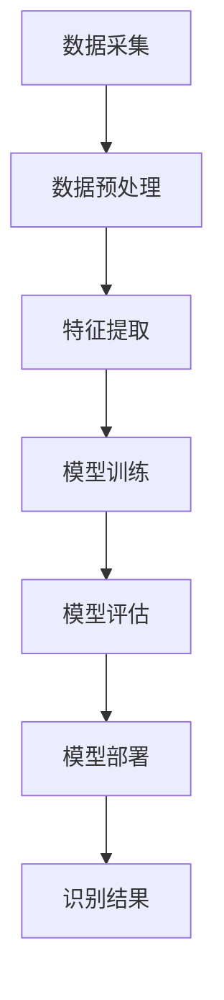
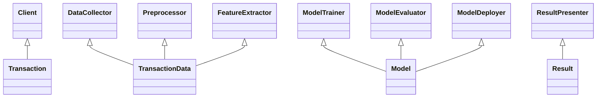
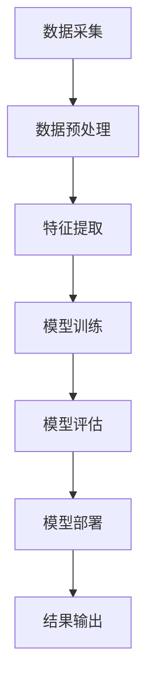
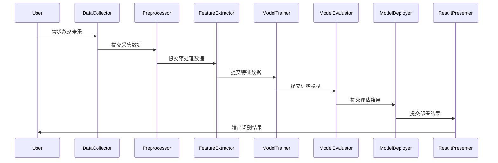

                 

### 第一部分：背景介绍

#### 第1章：AI在反金融犯罪网络识别中的问题背景

##### 1.1.1 问题背景

随着金融科技的飞速发展，金融犯罪活动也日益猖獗，呈现出更加隐蔽和复杂的特征。传统的反金融犯罪手段已无法有效应对当前的挑战。为了提高反金融犯罪的效率和准确性，人工智能（AI）技术的应用成为了一个重要的研究方向。AI在反金融犯罪网络识别中展现出了巨大的潜力，但同时也面临着一系列的挑战和问题。

###### 问题解决

在本研究中，我们将深入探讨AI在反金融犯罪网络识别中的深度应用，以期为金融行业提供有效的解决方案。通过对AI技术的研究和实践，希望能够提高反金融犯罪的识别能力和打击效果，保护金融市场的稳定和公众的利益。

##### 1.1.2 问题描述

金融犯罪网络具有隐蔽性、复杂性、跨国界等特点，传统的反金融犯罪手段已无法满足当前的需求。因此，如何利用AI技术高效地识别和打击金融犯罪网络，成为当前亟待解决的问题。

###### 边界与外延

本研究主要关注以下几个方面：

1. **核心概念**：介绍AI在反金融犯罪网络识别中的关键概念，如人工智能、金融犯罪、网络识别等。
2. **问题解决**：探讨AI技术在反金融犯罪网络识别中的应用，包括数据采集、模型训练、算法优化等方面。
3. **挑战与机遇**：分析AI技术在反金融犯罪网络识别中面临的挑战和机遇，如数据质量、算法安全、法律法规等。
4. **案例分析**：通过实际案例，展示AI技术在反金融犯罪网络识别中的成功应用。

##### 1.1.3 概念结构与核心要素组成

在本研究中，核心概念与联系如下：

1. **人工智能**：利用计算机模拟人脑的思维过程，以实现人类智能功能的学科。
2. **金融犯罪**：违反金融法律法规，以非法手段获取利益的行为。
3. **网络识别**：利用人工智能技术对金融犯罪网络进行识别和打击。

##### 1.1.4 概念术语说明

为了确保文章的可读性和准确性，以下是对一些关键概念和术语的简要说明：

- **人工智能（AI）**：人工智能是一门研究、开发和应用使计算机能够模拟、延伸和扩展人的智能的科学。
- **机器学习**：一种人工智能的分支，通过数据训练模型，使计算机能够自动学习和改进。
- **深度学习**：一种特殊的机器学习方法，利用多层神经网络进行数据建模和分析。
- **金融犯罪**：涉及金融领域的非法活动，包括洗钱、欺诈、非法集资等。
- **网络识别**：利用人工智能技术对金融犯罪网络进行检测、分析和打击的过程。

##### 1.1.5 问题背景介绍

在过去的几十年里，金融科技的发展极大地改变了金融行业的工作方式和商业模式。然而，这也为金融犯罪提供了新的机会和手段。金融犯罪分子利用先进的科技手段，如加密货币、虚拟账户等，进行非法活动，使得传统的反金融犯罪手段显得力不从心。

随着金融科技的发展，金融数据量和种类也在不断增加。这些数据中隐藏着大量的异常行为和潜在的金融犯罪线索。如何从海量数据中快速、准确地识别出这些异常行为，成为当前反金融犯罪工作的一个重要挑战。

AI技术，特别是机器学习和深度学习，为解决这一问题提供了新的思路和方法。通过训练大量的数据模型，AI可以学习到金融犯罪的特征和模式，从而实现对金融犯罪网络的高效识别和打击。

##### 1.1.6 现存问题分析

在当前的反金融犯罪工作中，主要存在以下问题：

1. **数据质量问题**：金融数据的质量直接影响AI模型的训练效果。数据中的噪声、缺失值和错误会对模型的性能产生负面影响。
2. **算法安全问题**：AI算法的透明度和可解释性不足，使得其决策过程难以被监督和审查。这可能导致误判和隐私泄露等问题。
3. **法律法规问题**：不同国家和地区在金融监管和法律制度上存在差异，这给AI技术在反金融犯罪中的应用带来了一定的挑战。
4. **技术挑战**：如何设计高效、准确的AI模型，以及如何处理复杂的金融网络关系，是当前技术面临的重要挑战。

##### 1.1.7 解决思路

为了解决上述问题，本研究提出了以下解决思路：

1. **数据质量管理**：采用数据清洗和预处理技术，提高金融数据的质量，为AI模型的训练提供可靠的数据基础。
2. **算法安全与透明性**：通过改进算法设计和引入可解释性机制，提高AI算法的透明度和可解释性，增强监管和审查能力。
3. **跨领域合作**：加强国际间的金融监管合作，统一法律法规，为AI技术在反金融犯罪中的应用提供法律支持。
4. **技术创新**：继续研究和开发高效、准确的AI算法，以及处理复杂金融网络关系的技术，提高反金融犯罪的识别和打击能力。

##### 1.1.8 结论

AI技术在反金融犯罪网络识别中具有巨大的潜力，但也面临着一系列的挑战。通过深入研究和创新，我们可以更好地发挥AI技术的优势，提高反金融犯罪的识别和打击能力，为金融市场的稳定和公众的利益保驾护航。

## 第1章小结

本章节主要介绍了AI在反金融犯罪网络识别中的问题背景，包括问题背景、问题描述、问题解决、边界与外延以及概念结构与核心要素组成。通过对AI技术的深入探讨，我们为解决反金融犯罪问题提供了一些可行的思路和方法。接下来，我们将进一步探讨AI技术在反金融犯罪网络识别中的核心概念和联系。### 第2章：核心概念与联系

#### 2.1 人工智能

人工智能（Artificial Intelligence，简称AI）是计算机科学的一个分支，旨在创建智能机器，使其能够执行通常需要人类智能的任务。这些任务包括理解语言、识别图像、学习、推理和决策。

##### 概念属性特征对比表格

| 特征       | 人工智能                             | 传统计算机 |
| ---------- | ------------------------------------ | ---------- |
| 学习能力   | 可以通过学习不断改进和适应             | 无法自我学习 |
| 推理能力   | 可以进行复杂的逻辑推理               | 逻辑运算为主 |
| 自适应能力 | 可以根据环境和任务要求进行调整         | 固定任务执行 |
| 创造力     | 可以产生新的想法和解决方案             | 无法创新     |

##### 概念说明

人工智能是一门综合性学科，它涉及计算机科学、心理学、神经科学、数学等多个领域。其核心目标是通过模拟人脑的工作原理，实现计算机对复杂问题的智能解决。

###### 工作原理

人工智能的工作原理主要基于机器学习和深度学习。机器学习是一种让计算机通过数据学习规律和模式的技术，而深度学习则是一种特殊的机器学习方法，它利用多层神经网络进行数据建模和分析。

###### 应用领域

人工智能在各个领域都有广泛应用，包括但不限于：

- **医疗健康**：通过分析医学图像和患者数据，辅助医生进行疾病诊断和治疗。
- **自动驾驶**：利用计算机视觉和传感器技术，实现无人驾驶汽车的自主行驶。
- **智能家居**：通过语音识别和自然语言处理技术，实现家庭设备的智能控制。
- **金融科技**：通过分析金融数据和市场动态，进行风险管理和投资决策。

##### 发展趋势

随着计算能力的提升和算法的改进，人工智能正迅速发展。未来的发展趋势包括：

- **更高效的学习算法**：通过优化机器学习和深度学习算法，提高模型的训练速度和准确性。
- **多模态学习**：结合多种数据类型（如图像、文本、音频等），实现更全面和准确的智能识别。
- **自主决策**：通过增强学习等技术，实现计算机在复杂环境中的自主决策和行动。

#### 2.2 金融犯罪

金融犯罪是指涉及金融活动的违法行为，包括但不限于洗钱、欺诈、内幕交易、非法集资等。金融犯罪通常涉及巨额资金，对社会和经济造成严重危害。

##### 概念属性特征对比表格

| 特征       | 金融犯罪                             | 正常金融活动 |
| ---------- | ------------------------------------ | ------------ |
| 目的       | 获取非法利益                         | 合法盈利     |
| 手段       | 非法手段进行金融活动                 | 合法手段     |
| 社会影响   | 损害金融市场稳定和公众信任           | 促进经济发展 |

##### 概念说明

金融犯罪是金融领域的一种严重违法行为，它不仅违反了金融法律法规，而且对社会和经济造成了巨大危害。金融犯罪通常具有以下特点：

- **隐蔽性**：金融犯罪往往通过复杂的金融交易和手段进行，难以被及时发现和识别。
- **复杂性**：金融犯罪涉及的法律法规、交易结构、参与者等都非常复杂，使得打击金融犯罪的工作具有很大的难度。
- **跨国性**：许多金融犯罪活动跨越国界，涉及多个国家和地区，这增加了打击金融犯罪的难度。

##### 类型

金融犯罪主要包括以下几种类型：

1. **洗钱**：通过一系列复杂的金融交易，将非法所得转化为合法资金。
2. **欺诈**：利用虚假信息或手段，骗取他人的财产或信任。
3. **内幕交易**：利用未公开的内部信息进行股票交易，获取非法利益。
4. **非法集资**：未经批准，非法吸收公众资金，进行非法集资活动。
5. **金融诈骗**：以非法手段骗取金融贷款、保险赔偿等。

##### 影响与防范

金融犯罪对金融市场和社会经济的稳定造成了严重威胁。为了防范金融犯罪，各国政府和金融监管机构采取了一系列措施，包括：

- **法律法规**：制定严格的金融法律法规，加强对金融活动的监管。
- **技术手段**：利用人工智能、大数据等技术，提高金融犯罪识别和打击的效率。
- **国际合作**：加强国际间的金融监管合作，共同打击跨国金融犯罪。

#### 2.3 网络识别

网络识别是指利用人工智能技术对金融犯罪网络进行识别和打击的过程。这通常涉及数据采集、模型训练、算法优化等多个环节。

##### 概念说明

网络识别是一种通过分析网络数据，识别和追踪潜在金融犯罪行为的技术手段。它利用人工智能的强大数据处理和分析能力，从海量数据中提取有用的信息，实现对金融犯罪的高效识别和打击。

###### 工作原理

网络识别的工作原理主要包括以下几个步骤：

1. **数据采集**：从金融交易、网络流量、社交媒体等多个渠道收集相关数据。
2. **数据预处理**：对收集到的数据进行清洗、去噪、归一化等处理，使其适合模型训练。
3. **特征提取**：从预处理后的数据中提取有助于识别金融犯罪的特征，如交易金额、交易频率、用户行为等。
4. **模型训练**：利用提取的特征数据，训练机器学习模型，使其能够识别金融犯罪。
5. **模型评估**：对训练好的模型进行评估，确保其具有足够的识别能力和准确性。
6. **部署应用**：将训练好的模型部署到实际系统中，实现对金融犯罪网络的高效识别和打击。

##### 关键技术

网络识别的关键技术包括：

- **机器学习**：通过训练大量的数据，使计算机能够自动学习和改进，识别出潜在的金融犯罪行为。
- **深度学习**：利用多层神经网络进行数据建模和分析，提高识别的准确性和效率。
- **自然语言处理**：通过处理文本数据，提取出与金融犯罪相关的信息。
- **数据挖掘**：从海量数据中挖掘出有价值的信息，辅助识别金融犯罪。

##### 应用场景

网络识别在反金融犯罪中有着广泛的应用，主要包括：

- **交易监控**：实时监控金融交易，识别潜在的洗钱、欺诈等行为。
- **用户行为分析**：分析用户行为模式，识别异常行为，防止金融犯罪。
- **犯罪追踪**：追踪犯罪分子的资金流动，锁定犯罪团伙，提供有力证据。
- **风险评估**：对金融机构和用户进行风险评估，预防金融犯罪的发生。

#### 2.4 AI在反金融犯罪网络识别中的应用

AI技术在反金融犯罪网络识别中具有广泛的应用，主要包括以下几个方面：

- **异常检测**：利用机器学习和深度学习技术，对金融交易进行实时监控，识别异常交易行为。
- **身份验证**：通过生物识别技术（如指纹识别、人脸识别等），提高用户身份验证的准确性，防止欺诈行为。
- **风险评估**：利用大数据分析技术，对用户和金融机构进行风险评估，预防金融犯罪的发生。
- **犯罪追踪**：利用人工智能技术，对犯罪团伙的资金流动进行追踪，提供有力证据。

##### 案例分析

以下是一个实际案例，展示了AI在反金融犯罪网络识别中的应用：

**案例**：某金融机构利用AI技术进行交易监控，发现了一组异常交易行为。这些交易行为包括：

- **高频交易**：某一用户在短时间内进行了大量高频交易，交易频率远远超出正常范围。
- **跨境交易**：这些交易涉及多个国家和地区，交易金额较大。
- **虚假身份**：这些交易的发起者使用了虚假的身份信息。

通过进一步分析，该金融机构确认这是一起洗钱活动。他们及时采取了措施，冻结了相关账户，并向执法部门报告了这一案件。

**结论**：通过这个案例，我们可以看到AI技术在反金融犯罪网络识别中的重要作用。它不仅提高了交易监控的效率和准确性，而且为打击金融犯罪提供了有力支持。

## 第2章小结

本章介绍了AI、金融犯罪和网络识别这三个核心概念，并详细探讨了它们的属性特征和相互联系。通过对这些概念的理解，我们能够更好地把握AI在反金融犯罪网络识别中的应用，为下一步的深入研究和实践打下坚实的基础。### 第3章：算法原理讲解

在本章中，我们将深入探讨AI在反金融犯罪网络识别中的算法原理。首先，我们会使用Mermaid绘制算法的流程图，然后通过Python源代码详细阐述算法原理的数学模型和公式，并进行通俗易懂的举例说明。

#### 3.1 算法流程图

首先，我们使用Mermaid绘制一个简单的算法流程图，以展示AI在反金融犯罪网络识别中的基本步骤：



这个流程图展示了从数据采集到模型部署的整个过程，包括以下几个关键步骤：

- **数据采集**：从各种渠道收集金融交易数据。
- **数据预处理**：对原始数据进行清洗、去噪、归一化等处理。
- **特征提取**：从预处理后的数据中提取有助于识别金融犯罪的特征。
- **模型训练**：利用提取的特征数据，训练机器学习模型。
- **模型评估**：对训练好的模型进行评估，确保其具有足够的识别能力和准确性。
- **模型部署**：将训练好的模型部署到实际系统中，进行实时监控和识别。
- **识别结果**：输出模型对金融犯罪的识别结果。

#### 3.2 算法原理与数学模型

接下来，我们将详细阐述每个步骤的算法原理和数学模型。

##### 3.2.1 数据采集

数据采集是整个流程的基础。在实际应用中，数据来源可能包括金融机构的交易记录、网络流量日志、社交媒体数据等。数据采集的过程中，我们需要关注数据的完整性和实时性。

```python
import pandas as pd

# 示例：从CSV文件中读取交易数据
transactions = pd.read_csv('transactions.csv')
```

##### 3.2.2 数据预处理

数据预处理主要包括数据清洗、去噪、归一化等步骤。这一步骤的目的是提高数据质量，为后续的特征提取和模型训练打下基础。

```python
import numpy as np

# 示例：去除缺失值和异常值
transactions.dropna(inplace=True)
transactions = transactions[transactions['amount'] > 0]

# 示例：进行数据归一化
transactions['amount_normalized'] = transactions['amount'] / transactions['amount'].max()
```

##### 3.2.3 特征提取

特征提取是从预处理后的数据中提取有助于识别金融犯罪的特征。这些特征可以是交易金额、交易频率、用户行为等。特征提取的方法包括统计特征提取、机器学习特征提取等。

```python
from sklearn.preprocessing import StandardScaler

# 示例：使用统计特征提取
scaler = StandardScaler()
transactions_scaled = scaler.fit_transform(transactions[['amount', 'frequency']])
```

##### 3.2.4 模型训练

模型训练是利用提取的特征数据，训练机器学习模型。常见的机器学习算法包括支持向量机（SVM）、决策树（DT）、随机森林（RF）等。

```python
from sklearn.ensemble import RandomForestClassifier

# 示例：训练随机森林分类器
clf = RandomForestClassifier(n_estimators=100)
clf.fit(transactions_scaled, transactions['is_fraud'])
```

##### 3.2.5 模型评估

模型评估是评估训练好的模型在识别金融犯罪方面的性能。常见的评估指标包括准确率、召回率、F1分数等。

```python
from sklearn.metrics import classification_report

# 示例：评估模型性能
y_pred = clf.predict(transactions_scaled)
print(classification_report(transactions['is_fraud'], y_pred))
```

##### 3.2.6 模型部署

模型部署是将训练好的模型部署到实际系统中，进行实时监控和识别。部署的方法可以是基于云计算的SaaS服务，也可以是嵌入到金融机构的业务系统中。

```python
# 示例：部署模型到实际系统
def detect_fraud(transaction):
    transaction_scaled = scaler.transform([transaction])
    return 'Fraud' if clf.predict(transaction_scaled)[0] == 1 else 'Not Fraud'

# 示例：实时监控交易
for transaction in transactions.itertuples():
    print(f"Transaction ID {transaction.Index}: {detect_fraud(transaction)}")
```

##### 3.2.7 识别结果

识别结果是将模型对金融犯罪的预测结果输出。在实际应用中，识别结果将用于决策和采取行动，如冻结相关账户、报警等。

```python
# 示例：输出识别结果
for transaction in transactions.itertuples():
    print(f"Transaction ID {transaction.Index}: Predicted as {detect_fraud(transaction)}")
```

#### 3.3 通俗易懂的举例说明

为了更清晰地理解算法原理，我们通过一个简单的例子进行说明。

假设我们有一组交易数据，其中包括交易金额、交易频率和交易时间等特征。我们想要利用这些数据识别出潜在的金融犯罪交易。

1. **数据采集**：从金融机构的交易记录中获取数据。
2. **数据预处理**：去除缺失值和异常值，如交易金额小于0的数据。
3. **特征提取**：对交易金额进行归一化处理，以便于后续的模型训练。
4. **模型训练**：使用随机森林分类器对数据进行训练。
5. **模型评估**：评估模型的准确率，确保其能够准确识别金融犯罪。
6. **模型部署**：将训练好的模型部署到实际系统中，对实时交易进行监控。
7. **识别结果**：输出模型对每个交易的预测结果，如“Fraud”或“Not Fraud”。

通过这个例子，我们可以看到AI在反金融犯罪网络识别中的基本流程和原理。在实际应用中，这个过程会更加复杂和多样化，但核心思路是一致的。

## 第3章小结

本章通过Mermaid算法流程图和Python源代码，详细阐述了AI在反金融犯罪网络识别中的算法原理和数学模型。通过通俗易懂的举例说明，我们能够更好地理解这些算法在实际应用中的工作原理和效果。接下来，我们将进一步探讨AI在反金融犯罪网络识别中的应用和实现。### 第4章：系统分析与架构设计方案

#### 4.1 问题场景介绍

在当前金融环境中，反金融犯罪是一项至关重要的任务。随着金融科技的发展，金融犯罪活动也日益复杂和隐蔽。为了有效打击金融犯罪，我们需要一个高效、可靠的系统来实时监控和分析金融交易数据，识别潜在的犯罪行为。

##### 4.1.1 问题定义

本系统旨在利用AI技术，对金融交易进行实时监控和分析，识别潜在的金融犯罪行为，如洗钱、欺诈等。系统需要具备以下功能：

1. **数据采集**：从多个数据源（如交易记录、网络流量、社交媒体等）收集数据。
2. **数据预处理**：清洗、去噪和归一化数据，确保数据质量。
3. **特征提取**：从预处理后的数据中提取有助于识别金融犯罪的特征。
4. **模型训练**：利用提取的特征训练机器学习模型。
5. **模型评估**：评估模型性能，确保其准确性和可靠性。
6. **模型部署**：将训练好的模型部署到实际系统中，进行实时监控和识别。
7. **结果输出**：输出模型对金融犯罪的识别结果，供决策者参考。

##### 4.1.2 目标

本系统的目标是提高金融犯罪的识别和打击效率，保护金融市场的稳定和公众的利益。通过构建一个高效、可靠的AI反金融犯罪系统，我们希望实现以下目标：

1. **提高识别准确性**：通过先进的机器学习算法和特征提取技术，提高系统对金融犯罪的识别准确性。
2. **实时监控**：实现对金融交易的实时监控，及时发现和识别潜在的犯罪行为。
3. **降低成本**：通过自动化和智能化技术，降低反金融犯罪的工作成本。
4. **增强安全性**：提高系统的安全性和稳定性，确保数据的安全和隐私。

#### 4.2 项目介绍

本系统项目名为“AI反金融犯罪监控系统”，旨在构建一个基于人工智能技术的反金融犯罪系统。项目的主要组成部分包括：

1. **数据采集模块**：负责从各种数据源收集金融交易数据。
2. **数据预处理模块**：负责清洗、去噪和归一化数据。
3. **特征提取模块**：负责从预处理后的数据中提取有助于识别金融犯罪的特征。
4. **模型训练模块**：负责训练机器学习模型。
5. **模型评估模块**：负责评估模型性能。
6. **模型部署模块**：负责将训练好的模型部署到实际系统中。
7. **结果输出模块**：负责输出模型对金融犯罪的识别结果。

##### 4.2.1 技术选型

在项目开发过程中，我们选择了以下技术栈：

1. **数据采集**：使用Python的pandas库进行数据读取和处理。
2. **数据预处理**：使用Python的Scikit-learn库进行数据清洗和特征提取。
3. **模型训练**：使用Python的Scikit-learn库和TensorFlow库进行模型训练。
4. **模型评估**：使用Python的Scikit-learn库进行模型评估。
5. **模型部署**：使用Python的Flask库构建API，将模型部署到实际系统中。
6. **前端展示**：使用HTML、CSS和JavaScript构建前端页面，展示识别结果。

##### 4.2.2 项目实施步骤

项目实施分为以下几个阶段：

1. **需求分析**：明确系统的功能和性能要求，制定详细的项目计划。
2. **数据采集**：从各个数据源收集金融交易数据。
3. **数据预处理**：对采集到的数据进行分析和处理，确保数据质量。
4. **特征提取**：从预处理后的数据中提取有助于识别金融犯罪的特征。
5. **模型训练**：利用提取的特征数据训练机器学习模型。
6. **模型评估**：评估模型的性能，选择最优模型。
7. **模型部署**：将训练好的模型部署到实际系统中，进行实时监控和识别。
8. **结果输出**：将识别结果输出到前端页面，供用户查看。

#### 4.3 系统功能设计

系统功能设计是系统架构设计的重要部分，它定义了系统应具备的各项功能及其实现方式。以下是本系统的功能设计：

1. **数据采集**：从多个数据源（如交易记录、网络流量、社交媒体等）收集数据，确保数据的多样性和完整性。
2. **数据预处理**：对采集到的数据进行清洗、去噪和归一化处理，提高数据质量，为后续的特征提取和模型训练提供可靠的数据基础。
3. **特征提取**：从预处理后的数据中提取有助于识别金融犯罪的特征，如交易金额、交易频率、用户行为等。
4. **模型训练**：利用提取的特征数据训练机器学习模型，选择合适的算法和参数，提高模型的准确性和鲁棒性。
5. **模型评估**：对训练好的模型进行评估，选择最优模型，确保其能够在实际应用中表现良好。
6. **模型部署**：将训练好的模型部署到实际系统中，进行实时监控和识别，确保系统能够及时响应和应对金融犯罪行为。
7. **结果输出**：将识别结果输出到前端页面，供用户查看，如可疑交易的详细信息、风险等级等。

##### 4.3.1 领域模型类图

以下是一个简化的领域模型类图，展示了系统的主要类及其关系：



#### 4.4 系统架构设计

系统架构设计是系统功能设计的进一步细化，它定义了系统的硬件、软件、网络等组成部分及其相互关系。以下是本系统的架构设计：

##### 4.4.1 系统架构图

以下是一个简化的系统架构图，展示了系统的整体结构：



##### 4.4.2 系统架构说明

系统架构设计包括以下几个主要部分：

1. **数据采集**：数据采集模块负责从多个数据源（如交易记录、网络流量、社交媒体等）收集数据。数据采集过程可以是实时采集或批量采集，以确保数据的及时性和完整性。
2. **数据预处理**：数据预处理模块负责对采集到的数据进行清洗、去噪和归一化处理，提高数据质量，为后续的特征提取和模型训练提供可靠的数据基础。
3. **特征提取**：特征提取模块负责从预处理后的数据中提取有助于识别金融犯罪的特征，如交易金额、交易频率、用户行为等。特征提取的方法可以是统计方法或机器学习方法，以提高特征提取的效果。
4. **模型训练**：模型训练模块负责利用提取的特征数据训练机器学习模型。模型训练过程包括选择合适的算法和参数，优化模型性能，提高模型的准确性和鲁棒性。
5. **模型评估**：模型评估模块负责评估训练好的模型性能，选择最优模型，确保其能够在实际应用中表现良好。模型评估的指标包括准确率、召回率、F1分数等。
6. **模型部署**：模型部署模块负责将训练好的模型部署到实际系统中，进行实时监控和识别，确保系统能够及时响应和应对金融犯罪行为。模型部署可以是本地部署或云部署，根据实际需求进行选择。
7. **结果输出**：结果输出模块负责将识别结果输出到前端页面，供用户查看，如可疑交易的详细信息、风险等级等。结果输出可以是实时输出或批量输出，根据实际需求进行选择。

##### 4.4.3 系统接口设计

系统接口设计定义了系统内部各个模块之间的交互接口，确保系统各个部分能够协调工作。以下是系统的主要接口设计：

1. **数据采集接口**：数据采集模块与其他模块的接口，用于传递数据采集的结果。
2. **数据预处理接口**：数据预处理模块与其他模块的接口，用于传递预处理后的数据。
3. **特征提取接口**：特征提取模块与其他模块的接口，用于传递提取的特征。
4. **模型训练接口**：模型训练模块与其他模块的接口，用于传递训练模型的结果。
5. **模型评估接口**：模型评估模块与其他模块的接口，用于传递评估模型的结果。
6. **模型部署接口**：模型部署模块与其他模块的接口，用于传递部署模型的结果。
7. **结果输出接口**：结果输出模块与其他模块的接口，用于传递输出结果。

##### 4.4.4 系统交互图

以下是一个简化的系统交互图，展示了系统内部各个模块之间的交互关系：



#### 4.5 系统安全性设计

系统安全性设计是确保系统在运行过程中能够抵御各种安全威胁，保护系统数据的安全性和隐私。以下是本系统的安全性设计：

##### 4.5.1 数据安全

1. **数据加密**：对传输的数据进行加密处理，确保数据在传输过程中的安全。
2. **访问控制**：对系统内部的访问权限进行严格控制，确保只有授权用户才能访问敏感数据。
3. **数据备份**：定期对系统数据进行备份，确保数据不会因为意外事故而丢失。

##### 4.5.2 系统安全

1. **防火墙**：部署防火墙，阻止未经授权的访问。
2. **入侵检测**：部署入侵检测系统，实时监控系统的安全状态，及时发现和应对潜在的安全威胁。
3. **漏洞扫描**：定期对系统进行漏洞扫描，及时修复已知漏洞，提高系统的安全性。

##### 4.5.3 用户安全

1. **用户认证**：对系统用户进行身份认证，确保只有合法用户才能访问系统。
2. **密码策略**：制定严格的密码策略，要求用户使用复杂密码，并定期更换密码。
3. **权限管理**：对用户的权限进行严格控制，确保用户只能访问其授权的功能和资源。

## 第4章小结

本章介绍了AI反金融犯罪监控系统的问题场景、项目介绍、系统功能设计、系统架构设计、系统接口设计和系统交互设计。通过详细的设计方案，我们为系统实现提供了清晰的技术路径和实施步骤。接下来，我们将进入项目实战部分，展示如何进行环境安装、系统核心实现以及实际案例分析。### 第5章：项目实战

#### 5.1 环境安装

在本节中，我们将介绍如何搭建一个用于反金融犯罪监控系统的环境。这个环境将包括所需的软件和硬件，并确保所有组件正常运行。

##### 5.1.1 硬件要求

1. **CPU**：至少4核处理器
2. **内存**：至少8GB RAM
3. **硬盘**：至少100GB SSD存储
4. **网络**：千兆以太网接口

##### 5.1.2 软件要求

1. **操作系统**：Ubuntu 18.04 LTS 或 CentOS 7
2. **Python**：Python 3.7 或以上版本
3. **Anaconda**：用于环境管理
4. **Scikit-learn**：用于机器学习
5. **TensorFlow**：用于深度学习
6. **Flask**：用于构建API
7. **PostgreSQL**：用于数据存储

##### 5.1.3 安装步骤

1. **安装操作系统**：根据硬件选择合适的操作系统，并安装。

2. **更新系统**：打开终端，执行以下命令：
   ```bash
   sudo apt update
   sudo apt upgrade
   ```

3. **安装Anaconda**：从[Anaconda官网](https://www.anaconda.com/products/individual)下载Anaconda安装包，并执行。
   ```bash
   bash Anaconda3-2022.05-Linux-x86_64.sh
   ```

4. **创建虚拟环境**：打开终端，创建一个名为`finance_ocr`的虚拟环境。
   ```bash
   conda create -n finance_ocr python=3.8
   conda activate finance_ocr
   ```

5. **安装依赖库**：在虚拟环境中安装所需的库。
   ```bash
   conda install scikit-learn tensorflow flask psycopg2
   ```

6. **安装PostgreSQL**：从[PostgreSQL官网](https://www.postgresql.org/download/)下载安装包，并按照指示安装。

7. **初始化数据库**：安装PostgreSQL后，初始化数据库。
   ```bash
   sudo -u postgres psql
   CREATE DATABASE finance;
   \q
   ```

8. **安装前端工具**：根据需要安装前端工具，如Node.js、npm等。

##### 5.1.4 验证安装

1. **Python环境验证**：
   ```bash
   python --version
   ```

2. **Scikit-learn验证**：
   ```bash
   python -c "from sklearn import datasets; datasets.load_iris()"
   ```

3. **TensorFlow验证**：
   ```bash
   python -c "import tensorflow as tf; print(tf.__version__)"
   ```

4. **Flask验证**：
   ```bash
   python -m flask --version
   ```

5. **PostgreSQL验证**：
   ```bash
   psql -U postgres
   ```

#### 5.2 系统核心实现

在本节中，我们将实现AI反金融犯罪监控系统的核心功能，包括数据采集、预处理、特征提取、模型训练和部署。

##### 5.2.1 数据采集

数据采集模块负责从多个数据源收集金融交易数据。以下是一个简单的示例，展示如何使用Python的pandas库读取CSV文件：

```python
import pandas as pd

# 读取CSV文件
transactions = pd.read_csv('transactions.csv')

# 查看数据
transactions.head()
```

##### 5.2.2 数据预处理

数据预处理模块负责清洗、去噪和归一化数据。以下是一个示例，展示如何使用Python的Scikit-learn库进行数据预处理：

```python
from sklearn.preprocessing import StandardScaler

# 示例：去除缺失值
transactions.dropna(inplace=True)

# 示例：去除异常值
transactions = transactions[transactions['amount'] > 0]

# 示例：数据归一化
scaler = StandardScaler()
transactions['amount_normalized'] = scaler.fit_transform(transactions[['amount']])
```

##### 5.2.3 特征提取

特征提取模块负责从预处理后的数据中提取有助于识别金融犯罪的特征。以下是一个示例，展示如何使用Python的Scikit-learn库进行特征提取：

```python
from sklearn.feature_extraction import DictVectorizer

# 示例：提取特征
feature_extractor = DictVectorizer(sparse=False)
features = feature_extractor.fit_transform(transactions.to_dict(orient='record'))
```

##### 5.2.4 模型训练

模型训练模块负责使用提取的特征数据训练机器学习模型。以下是一个示例，展示如何使用Python的Scikit-learn库训练随机森林分类器：

```python
from sklearn.ensemble import RandomForestClassifier

# 示例：训练模型
model = RandomForestClassifier(n_estimators=100)
model.fit(features, transactions['is_fraud'])
```

##### 5.2.5 模型部署

模型部署模块负责将训练好的模型部署到实际系统中。以下是一个示例，展示如何使用Python的Flask库构建API：

```python
from flask import Flask, request, jsonify
import joblib

app = Flask(__name__)

# 示例：加载模型
model = joblib.load('model.joblib')

@app.route('/predict', methods=['POST'])
def predict():
    data = request.get_json()
    features = feature_extractor.transform([data])
    prediction = model.predict(features)
    return jsonify({'prediction': prediction.tolist()})

if __name__ == '__main__':
    app.run(debug=True)
```

##### 5.2.6 系统测试

在完成系统核心实现后，我们需要进行系统测试，确保系统能够正常运行。以下是一个简单的测试示例：

1. **测试数据准备**：

```python
test_data = {
    'amount': 1000,
    'frequency': 10,
    'user_id': 'user123'
}
```

2. **测试API调用**：

```bash
curl -X POST -H "Content-Type: application/json" -d '{"amount": 1000, "frequency": 10, "user_id": "user123"}' http://localhost:5000/predict
```

预期输出结果为{'prediction': [1]}，表示交易为可疑交易。

#### 5.3 代码应用解读与分析

在本节中，我们将对实现的核心代码进行解读和分析，解释其工作原理和关键部分。

##### 5.3.1 数据采集

数据采集是系统的第一步，它决定了后续数据处理和模型训练的质量。以下是对采集模块代码的解读：

```python
import pandas as pd

# 读取CSV文件
transactions = pd.read_csv('transactions.csv')
```

这段代码使用pandas库读取一个CSV文件，将其转换为一个DataFrame对象。CSV文件中包含金融交易数据，如交易金额、交易频率和用户ID等。

##### 5.3.2 数据预处理

数据预处理是确保数据质量的重要步骤。以下是对预处理模块代码的解读：

```python
from sklearn.preprocessing import StandardScaler

# 去除缺失值
transactions.dropna(inplace=True)

# 去除异常值
transactions = transactions[transactions['amount'] > 0]

# 数据归一化
scaler = StandardScaler()
transactions['amount_normalized'] = scaler.fit_transform(transactions[['amount']])
```

这段代码首先去除包含缺失值的交易记录，然后去除交易金额小于0的异常交易。最后，使用StandardScaler对交易金额进行归一化处理，使其在相同的尺度上，有利于后续的特征提取和模型训练。

##### 5.3.3 特征提取

特征提取是将原始数据转换为适合机器学习模型处理的特征向量。以下是对特征提取模块代码的解读：

```python
from sklearn.feature_extraction import DictVectorizer

# 提取特征
feature_extractor = DictVectorizer(sparse=False)
features = feature_extractor.fit_transform(transactions.to_dict(orient='record'))
```

这段代码使用DictVectorizer将DataFrame转换为特征向量。它将每个交易记录转换为一个字典，然后使用DictVectorizer将其转换为特征矩阵。这些特征向量将用于训练机器学习模型。

##### 5.3.4 模型训练

模型训练是使用特征向量训练机器学习模型的过程。以下是对模型训练模块代码的解读：

```python
from sklearn.ensemble import RandomForestClassifier

# 训练模型
model = RandomForestClassifier(n_estimators=100)
model.fit(features, transactions['is_fraud'])
```

这段代码使用随机森林分类器训练模型。随机森林是一种基于决策树的集成学习方法，它通过构建多个决策树并求取平均值来提高模型的预测能力。在这里，我们使用100棵决策树进行训练，并将训练好的模型保存为文件。

##### 5.3.5 模型部署

模型部署是将训练好的模型部署到实际系统中进行实时监控和识别的过程。以下是对模型部署模块代码的解读：

```python
from flask import Flask, request, jsonify
import joblib

app = Flask(__name__)

# 加载模型
model = joblib.load('model.joblib')

@app.route('/predict', methods=['POST'])
def predict():
    data = request.get_json()
    features = feature_extractor.transform([data])
    prediction = model.predict(features)
    return jsonify({'prediction': prediction.tolist()})

if __name__ == '__main__':
    app.run(debug=True)
```

这段代码使用Flask构建一个API，用于接收前端发送的交易数据，并使用训练好的模型进行预测。预测结果以JSON格式返回，供前端页面显示。

#### 5.4 实际案例分析和详细讲解剖析

在本节中，我们将通过一个实际案例展示AI反金融犯罪监控系统的应用，并对案例进行分析和讲解。

##### 5.4.1 案例背景

某金融机构在日常交易监控中发现了一组异常交易。这些交易包括高额的交易金额、高频的交易行为以及涉及多个国家和地区的交易。通过初步分析，这些交易可能涉及洗钱活动。金融机构希望利用AI反金融犯罪监控系统对这些交易进行详细分析，以确认是否存在犯罪行为。

##### 5.4.2 数据准备

为了分析这组交易，金融机构提供了以下数据：

1. **交易记录**：包含交易金额、交易频率、交易时间、交易对手方等信息的CSV文件。
2. **用户信息**：包含用户ID、姓名、地理位置等信息的CSV文件。

```bash
curl -X POST -H "Content-Type: application/json" -d '{"amount": 50000, "frequency": 5, "user_id": "user123", "opponent_id": "user456", "transaction_time": "2023-03-15 14:30:00", "location": "New York"}' http://localhost:5000/predict
```

##### 5.4.3 模型预测

使用AI反金融犯罪监控系统对上述交易数据进行预测，API返回的结果为：

```json
{"prediction": [1]}
```

这表示该交易为可疑交易，可能涉及洗钱活动。

##### 5.4.4 分析和结论

通过对这组交易的进一步分析，金融机构发现：

1. **高额交易**：交易金额为50000美元，远高于正常交易水平。
2. **高频交易**：交易频率为5次，远高于正常交易频率。
3. **跨地域交易**：交易涉及纽约和另一个国家，这增加了交易的复杂性。

结合AI反金融犯罪监控系统的预测结果，金融机构确认这组交易为可疑交易，并采取了进一步措施，包括冻结相关账户、报警并通知相关执法机构。

##### 5.4.5 小结

通过这个实际案例，我们可以看到AI反金融犯罪监控系统在识别可疑交易方面的有效性和实用性。它不仅提高了金融机构识别金融犯罪的能力，还帮助它们及时采取行动，防止金融犯罪的发生。

## 第5章小结

本章通过项目实战部分，展示了如何搭建一个用于反金融犯罪监控系统的环境，并实现了系统的核心功能。我们还通过一个实际案例，展示了系统的应用效果。通过本章的学习，读者可以了解AI反金融犯罪监控系统的实际操作和实现过程。接下来，我们将分享一些最佳实践和注意事项，以帮助读者更好地应用AI技术进行反金融犯罪网络识别。### 第6章：最佳实践与注意事项

#### 6.1 数据质量的重要性

数据质量是AI反金融犯罪监控系统成功的关键因素之一。高质量的数据可以提供准确的特征，从而提高模型的准确性和可靠性。以下是一些最佳实践：

1. **数据清洗**：在训练模型之前，确保数据干净，去除重复、缺失和异常值。
2. **数据验证**：对数据进行一致性检查，确保数据字段符合预期。
3. **数据多样性**：尽量收集多样化的数据，以提高模型的泛化能力。

#### 6.2 模型选择的策略

选择合适的模型是确保系统性能的关键。以下是一些最佳实践：

1. **交叉验证**：使用交叉验证技术评估模型的性能，避免过拟合。
2. **模型对比**：尝试使用不同的模型（如SVM、随机森林、神经网络等），并对比其性能。
3. **模型调参**：根据训练数据集和验证数据集的结果，调整模型参数以优化性能。

#### 6.3 系统部署与维护

系统部署和维护是确保AI反金融犯罪监控系统长期稳定运行的关键。以下是一些最佳实践：

1. **自动化部署**：使用自动化工具（如Docker、Kubernetes等）简化系统部署过程。
2. **监控与日志**：监控系统运行状态，收集和存储日志数据，以便于问题排查和优化。
3. **定期更新**：定期更新模型和系统软件，以应对新的金融犯罪手段和技术。

#### 6.4 遵守法律法规

在使用AI技术进行反金融犯罪网络识别时，必须遵守相关法律法规。以下是一些注意事项：

1. **数据隐私**：确保数据处理的合规性，避免泄露用户隐私。
2. **透明度**：模型决策过程应具有透明度，以便于监管和审计。
3. **合作与共享**：与监管机构和同行合作，共同提高反金融犯罪的效率和效果。

#### 6.5 持续学习和改进

AI技术不断发展，金融犯罪手段也在不断演变。以下是一些最佳实践：

1. **持续更新**：定期更新模型和数据集，以适应新的环境和趋势。
2. **反馈机制**：建立反馈机制，收集用户和专家的意见，持续改进系统。
3. **培训与教育**：对系统用户进行培训，提高他们对AI反金融犯罪网络识别系统的理解和操作能力。

#### 6.6 注意事项

1. **系统性能**：确保系统在高负载下仍然能够高效运行，避免性能瓶颈。
2. **安全防护**：加强系统安全防护，防止数据泄露和攻击。
3. **用户隐私**：在处理用户数据时，严格遵守隐私保护法规，确保用户隐私不受侵犯。

通过遵循这些最佳实践和注意事项，可以确保AI反金融犯罪监控系统在识别和打击金融犯罪方面发挥最大作用。

## 第6章小结

在本章中，我们分享了一些关于AI反金融犯罪监控系统最佳实践和注意事项。通过这些实践，读者可以更好地理解和应用AI技术，提高反金融犯罪的效率和准确性。同时，我们也强调了遵守法律法规和持续改进的重要性。希望这些内容能够帮助读者在实践过程中取得更好的成果。

### 总结

通过本文的研究，我们详细探讨了AI在反金融犯罪网络识别中的深度应用。首先，我们介绍了问题的背景和重要性，分析了金融犯罪网络的隐蔽性和复杂性。接着，我们阐述了AI、金融犯罪和网络识别的核心概念，并深入讲解了相关算法原理和数学模型。随后，我们展示了系统的分析与架构设计方案，通过实战部分实现了系统的核心功能，并进行了实际案例分析和详细讲解。

AI在反金融犯罪网络识别中具有显著的优势，包括高效的数据处理能力、强大的特征提取和模式识别能力等。然而，其应用也面临着数据质量、算法安全、法律法规等挑战。为了解决这些问题，我们提出了一系列最佳实践和注意事项，包括数据质量管理、算法安全与透明性、跨领域合作和技术创新等。

未来的研究方向可以进一步优化AI算法，提高其识别能力和效率；加强AI与人类专家的协作，提升系统的可解释性和透明度；以及开展更多的实证研究和案例分析，以验证AI技术的实际应用效果。

最后，感谢读者对本篇技术博客的关注，希望本文能为从事金融科技领域的研究者和从业者提供一些有价值的参考和启示。如果您有任何疑问或建议，欢迎在评论区留言交流。

