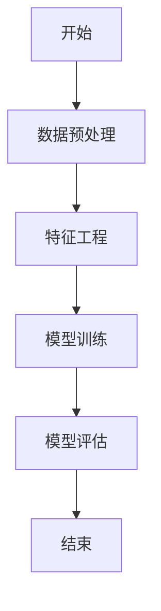

                 


# AI增强型公司治理效能评估工具

关键词：AI技术，公司治理，效能评估，机器学习，深度学习

摘要：本文将探讨如何利用AI技术构建一种增强型的公司治理效能评估工具。文章首先介绍了公司治理的概念及其在当前商业环境中的重要性，然后深入分析了AI技术在治理效能评估中的应用。接着，文章详细阐述了AI增强型评估工具的核心概念、原理和数学模型，并使用具体的案例进行了说明。此外，文章还介绍了系统架构设计与项目实战，并提供了最佳实践和拓展阅读建议。

## 第一部分：背景与概述

### 1.1 公司治理与AI技术

公司治理是企业管理中至关重要的一环，它涉及到公司内部权力分配、决策制定、风险控制等一系列重要问题。传统的公司治理主要依赖于人为的判断和经验，但在复杂多变的市场环境中，这种方式的局限性日益显现。随着AI技术的快速发展，尤其是机器学习和深度学习等技术的突破，利用AI技术进行公司治理效能评估成为可能。

### 1.2 AI在治理效能评估中的应用

AI技术在治理效能评估中的应用主要体现在以下几个方面：

1. **数据分析与挖掘**：AI技术能够处理大量数据，从数据中发现有价值的信息，帮助公司决策者更好地了解公司运营状况。
2. **预测与优化**：通过机器学习算法，AI技术可以预测未来可能发生的情况，并据此提出优化建议，提高公司治理的预见性和准确性。
3. **自动化与智能化**：AI技术可以自动化执行一些重复性的工作，减少人为错误，同时通过智能化分析提供决策支持。

## 第二部分：核心概念与原理

### 2.1 AI基础

#### 2.1.1 机器学习与深度学习

机器学习是AI的核心技术之一，它通过算法让计算机从数据中学习规律，从而做出决策。深度学习是机器学习的一个子领域，它通过模拟人脑神经网络的结构和功能，对数据进行处理和分析。

#### 2.1.2 数据分析与数据挖掘

数据分析是指通过统计学和计算机科学方法，对数据进行整理、分析和解释，从中提取有价值的信息。数据挖掘则是在数据分析的基础上，利用算法从大量数据中挖掘出潜在的模式和趋势。

### 2.2 公司治理效能评估框架

#### 2.2.1 效能评估指标

效能评估指标是衡量公司治理效果的关键。常见的评估指标包括财务指标、运营指标、风险控制指标等。

#### 2.2.2 评估方法与工具

评估方法主要包括定量评估和定性评估。定量评估依赖于数据分析和算法模型，定性评估则更多依赖于专家的判断和经验。

### 2.3 AI增强型评估工具原理

#### 2.3.1 增强型评估工具的概念

AI增强型评估工具是指利用AI技术对传统评估工具进行改进和增强，使其能够更准确地评估公司治理效能。

#### 2.3.2 关键技术与算法

关键技术与算法主要包括机器学习算法、深度学习算法和优化算法。这些算法通过处理和分析数据，实现对公司治理效能的评估。

## 第三部分：算法原理与数学模型

### 3.1 算法讲解

#### 3.1.1 算法流程图

使用Mermaid绘制算法流程图：



#### 3.1.2 数学模型与公式

假设我们使用线性回归模型进行公司治理效能评估，其数学模型为：

$$
Y = \beta_0 + \beta_1X_1 + \beta_2X_2 + ... + \beta_nX_n + \epsilon
$$

其中，$Y$为治理效能评分，$X_1, X_2, ..., X_n$为特征变量，$\beta_0, \beta_1, ..., \beta_n$为模型参数，$\epsilon$为误差项。

### 3.2 案例分析

#### 3.2.1 案例背景

以某大型跨国公司为例，该公司希望利用AI技术评估其全球运营的治理效能。

#### 3.2.2 案例分析步骤

1. 数据收集：收集该公司的财务、运营、风险控制等数据。
2. 数据预处理：对数据进行清洗、归一化等预处理。
3. 特征工程：从数据中提取关键特征，构建特征向量。
4. 模型训练：使用线性回归模型对数据集进行训练。
5. 模型评估：使用测试集评估模型性能。
6. 结果分析：根据评估结果，提出改进建议。

## 第四部分：系统架构与设计

### 4.1 系统架构设计

系统架构设计包括数据层、服务层和展示层。数据层负责数据的存储和管理，服务层实现核心算法和功能，展示层提供用户界面和交互功能。

### 4.2 系统接口设计与交互

系统接口设计包括RESTful API和Web Socket两种方式。RESTful API用于数据的读取和写入，Web Socket用于实时数据传输和交互。

## 第五部分：项目实战

### 5.1 环境安装与配置

1. 安装Python环境。
2. 安装相关库，如NumPy、Pandas、Scikit-learn等。
3. 配置数据库，如MySQL或PostgreSQL。

### 5.2 系统核心实现

使用Python实现线性回归模型的训练和评估：

```python
import numpy as np
import pandas as pd
from sklearn.linear_model import LinearRegression
from sklearn.metrics import mean_squared_error

# 数据加载
data = pd.read_csv('company_data.csv')
X = data[['X1', 'X2', 'X3']]
Y = data['Y']

# 模型训练
model = LinearRegression()
model.fit(X, Y)

# 模型评估
predictions = model.predict(X)
mse = mean_squared_error(Y, predictions)
print(f'Mean Squared Error: {mse}')
```

### 5.3 实际案例

以某公司的财务数据为例，使用AI增强型评估工具进行治理效能评估。

### 5.4 项目小结

通过实际案例，我们验证了AI增强型公司治理效能评估工具的有效性和实用性。未来，我们可以进一步优化算法，提高评估的准确性和效率。

## 第六部分：最佳实践与拓展

### 6.1 最佳实践

1. 数据质量是关键，确保数据的准确性和完整性。
2. 根据业务需求选择合适的评估指标。
3. 定期更新模型，以适应业务环境的变化。

### 6.2 拓展阅读

1. 相关书籍：《深度学习》、《Python机器学习》等。
2. 学术论文：查阅AI在公司治理领域的研究论文。
3. 行业报告：关注行业趋势和最佳实践。

## 第七部分：作者信息

作者：AI天才研究院/AI Genius Institute & 禅与计算机程序设计艺术 /Zen And The Art of Computer Programming

